# Álgebra Vetorial Linear para Computação

## Geometria Analítica

A geometria analítica é a ponte entre geometria e álgebra: ela permite descrever objetos geométricos (pontos, retas, curvas) por meio de equações e coordenadas, transformando problemas visuais em problemas algébricos que podem ser resolvidos com cálculo.

Um objeto geométrico pode ser descrito de duas formas:

- **Função explícita:** descreve cada um dos pontos/objetos individualmente (ex.: parametrizando cada ponto da curva).
- **Função implícita:** descreve apenas a **propriedade** que caracteriza todos os pontos do objeto (ex.: uma equação que todo ponto da curva satisfaz).

### Distância

A distância é a principal ferramenta que permite transformar elementos geométricos em símbolos formais. Uma função $\text{dist}$ entre dois pontos só é considerada uma **distância** (uma métrica) se satisfizer quatro propriedades:

1. $\text{dist}(A,B) \ge 0$ (não-negatividade)
2. $\text{dist}(A,A) = 0$ (distância de um ponto a si mesmo é zero)
3. $\text{dist}(A,B) = \text{dist}(B,A)$ (simetria)
4. $\text{dist}(A,C) \le \text{dist}(A,B) + \text{dist}(B,C)$ (desigualdade triangular)

**Distância com coordenadas:** cada ponto do plano é identificado por um par ordenado de coordenadas (ex.: $A=(1,3)$), o que nos permite tratar posições geométricas como números.

??? note "Gráfico de referência"
    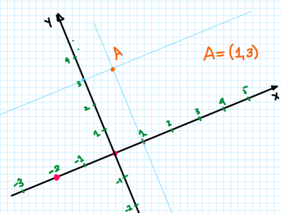

### Pontos

Pontos são as primitivas geométricas associadas à localização. A distância entre dois pontos $A(x_a,y_a)$ e $B(x_b,y_b)$ é

$$\text{dist}(A,B) = \sqrt{(x_b-x_a)^2+(y_b-y_a)^2}$$

— que é exatamente a norma do vetor que liga $A$ a $B$.

### Vetores

Um vetor carrega três informações extraídas da geometria: **direção**, **sentido** e **módulo** (comprimento).

??? note "Foto do quadro"
    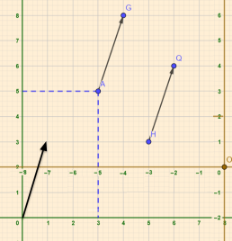

Se $v = G-A$ e $u = Q-H$, então $v = (G_x-A_x,\, G_y-A_y)$ e $u = (Q_x-H_x,\, Q_y-H_y)$. Com isso, o vetor $v$ pode ser pensado como partindo da origem $(0,0)$ até $(G_x-A_x, G_y-A_y)$ — isto é, um vetor representa apenas "deslocamento", independentemente de onde ele é desenhado no plano.

**Módulo de um vetor** (usando Pitágoras): para $v$ indo de $(x_a,y_a)$ a $(x_b,y_b)$,

$$|v| = \sqrt{(x_b-x_a)^2+(y_b-y_a)^2}$$

No $\mathbb{R}^3$:

$$|v| = \sqrt{(x_b-x_a)^2+(y_b-y_a)^2+(z_b-z_a)^2}$$

**Propriedades:**

- Elemento neutro: $(0,0)+v=v$.
- Inverso aditivo: $v+(-v)=(0,0)$.
- Comutatividade: $u+v=v+u$.
- Associatividade: $(u+v)+w=u+(v+w)$.
- Elemento neutro da multiplicação por escalar: $1\cdot v=v$.
- Associatividade da multiplicação por escalar: $c\cdot(k\cdot v)=(c\cdot k)\cdot v$.
- Distributividade da mult. por escalar sobre a adição de vetores: $k\cdot(u+v)=k\cdot u+k\cdot v$.
- Distributividade da mult. por escalar sobre a adição de escalares: $(c+k)\cdot v=c\cdot v+k\cdot v$.

??? note "Foto do quadro"
    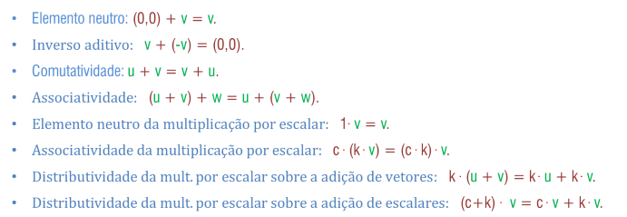

**Operações com vetores.** Dados $u=(a,b)$ e $v=(c,d)$:

$$u+v = (a+c,\, b+d) \qquad u-v = (a-c,\, b-d) \qquad 2v = (2a,\, 2b)$$

!!! example "Exemplos"
    **Distância de $Q_1=(4,4,0)$ a $P_1=(7,1,0)$ no $\mathbb{R}^2$:**

    $$\text{dist}(Q_1,P_1) = \sqrt{(7-4)^2+(1-4)^2} = \sqrt{18} = 3\sqrt{2}$$

    **Distância de $Q_1=(4,4,5)$ a $P_1=(7,1,2)$ no $\mathbb{R}^3$:**

    $$\text{dist}(Q_1,P_1) = \sqrt{(7-4)^2+(1-4)^2+(2-5)^2} = \sqrt{27} = 3\sqrt{3}$$

### Produto escalar

O produto escalar é uma função binária que envolve dois vetores e retorna um **número real** chamado escalar (diferente do produto vetorial, que veremos a seguir e que retorna outro vetor).

No plano $\mathbb{R}^2$: dados $v=(x_1,y_1)$ e $u=(x_2,y_2)$, definimos

$$v\cdot u = x_1x_2 + y_1y_2$$

!!! example "Exemplo"
    $v=(5,-1)$ e $u=(3,7)$: $v\cdot u = 5\cdot3 + (-1)\cdot7 = 15-7 = 8$.

**Propriedades do produto escalar:**

- $v\cdot v \ge 0$, e $v\cdot v = 0 \iff v=(0,0)$ — pois $v\cdot v = x^2+y^2 \ge 0$, e essa soma só é zero se $x=y=0$.
- $v\cdot u = u\cdot v$ (comutatividade)
- $u\cdot(kv) = k(u\cdot v) = (ku)\cdot v$ (associatividade com escalar)
- $u\cdot(v+w) = u\cdot v + u\cdot w$ (distributividade)

Essas propriedades se estendem ao $\mathbb{R}^3$ com poucos ajustes: para $v=(x_1,y_1,z_1)$ e $u=(x_2,y_2,z_2)$,

$$v\cdot u = x_1x_2+y_1y_2+z_1z_2$$

### Norma de um vetor

A **norma** $\|u\|$ é o módulo (comprimento) do vetor, calculado pela distância de seu ponto final até a origem. Para $u=(x_1,y_1)$:

$$\|u\|^2 = x_1^2+y_1^2 \qquad \|u\| = \sqrt{x_1^2+y_1^2} = \sqrt{u\cdot u}$$

No $\mathbb{R}^3$, para $u=(x_1,y_1,z_1)$: $\|u\| = \sqrt{x_1^2+y_1^2+z_1^2}$.

!!! example "Exemplo"
    $\|(1,2,-2)\| = \sqrt{1^2+2^2+(-2)^2} = \sqrt{9} = 3$, ou, equivalentemente, $\sqrt{(1,2,-2)\cdot(1,2,-2)} = \sqrt{1+4+4} = 3$.

**Propriedades da norma** (válidas em qualquer $\mathbb{R}^n$):

- $\|u\| \ge 0$; se $\|u\|=0$ então $u=0$.
- $\|ku\| = |k|\cdot\|u\|$, pois $\|ku\| = \sqrt{(ku)\cdot(ku)} = \sqrt{k^2(u\cdot u)} = \sqrt{k^2}\sqrt{u\cdot u} = |k|\|u\|$.

!!! example "Exemplo"
    $u=(2,-1)$, $k=-3$: $\|ku\| = \|(-6,3)\| = \sqrt{36+9} = \sqrt{45} = 3\sqrt{5}$. E $|k|\cdot\|u\| = 3\cdot\sqrt{4+1} = 3\sqrt{5}$. ✓

**Desigualdade de Cauchy-Schwarz:** $|u\cdot v| \le \|u\|\cdot\|v\|$.

!!! note "Demonstração (via lei dos cossenos)"
    A lei dos cossenos generaliza o Teorema de Pitágoras para qualquer triângulo (recuperando Pitágoras no caso retângulo):

    $$L_2^2 = L_1^2+L_3^2 - 2L_1L_3\cos(\alpha)$$

    onde $L_2$ é o lado oposto ao ângulo $\alpha$. Aplicando ao triângulo formado pelos vetores $u$, $v$ e $u-v$ (o lado do triângulo corresponde à norma):

    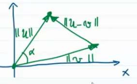

    $$\|u-v\|^2 = \|u\|^2+\|v\|^2-2\|u\|\|v\|\cos(\alpha)$$

    Por outro lado, calculando diretamente: $\|u-v\|^2 = (u-v)\cdot(u-v) = u\cdot u - 2u\cdot v + v\cdot v = \|u\|^2-2u\cdot v+\|v\|^2$.

    Igualando as duas expressões:

    $$\|u\|^2+\|v\|^2-2\|u\|\|v\|\cos(\alpha) = \|u\|^2-2u\cdot v+\|v\|^2$$

    Simplificando: $\|u\|\|v\|\cos(\alpha) = u\cdot v$, logo $\cos(\alpha) = \dfrac{u\cdot v}{\|u\|\|v\|}$ (e se $\alpha=90°$, $u\cdot v = 0$). Como $\cos(\alpha) \le 1$:

    $$\frac{u\cdot v}{\|u\|\|v\|} \le 1 \;\Rightarrow\; |u\cdot v| \le \|u\|\|v\|$$

**Desigualdade triangular:** $\|u+v\| \le \|u\|+\|v\|$.

!!! note "Demonstração"
    $\|u+v\|^2 = \|u\|^2+2u\cdot v+\|v\|^2$. Como $|u\cdot v| \le \|u\|\|v\|$ (Cauchy-Schwarz), podemos majorar:

    $$\|u+v\|^2 \le \|u\|^2+2\|u\|\|v\|+\|v\|^2 = (\|u\|+\|v\|)^2 \;\Rightarrow\; \|u+v\| \le \|u\|+\|v\|$$

**Normalização de vetores.** Normalizar um vetor é "deixá-lo no padrão": o padrão de comprimento é $1$, mantendo a mesma direção e sentido.

??? note "Foto do quadro"
    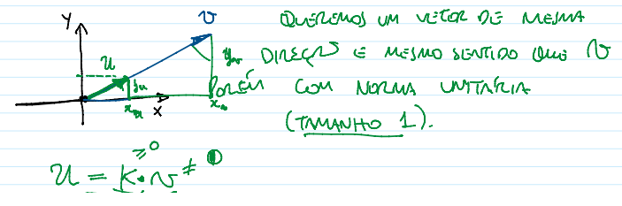

Se $u=kv$ com $\|u\|=1$: $\|kv\|=1 \Rightarrow |k|\|v\|=1 \Rightarrow k = \dfrac{1}{\|v\|}$ (assumindo $k>0$ para manter o sentido). Logo:

$$u = \frac{1}{\|v\|}v \quad \text{(fórmula de normalização)}$$

!!! example "Exemplo: normalizar $v=(5,-4)$"
    $$u = \frac{1}{\|v\|}v = \frac{1}{\sqrt{25+16}}(5,-4) = \frac{1}{\sqrt{41}}(5,-4) = \left(\frac{5}{\sqrt{41}}, \frac{-4}{\sqrt{41}}\right)$$

    Verificando: $\|u\| = \sqrt{\left(\frac{5}{\sqrt{41}}\right)^2+\left(\frac{-4}{\sqrt{41}}\right)^2} = \sqrt{\frac{25}{41}+\frac{16}{41}} = \sqrt{1} = 1$. ✓

### Vetores ortogonais

Dois vetores $u$ e $v$ são **ortogonais** se $u\cdot v = 0$ (o ângulo entre eles precisa ser $90°$, já que $\cos(\alpha) = \dfrac{u\cdot v}{\|u\|\|v\|}$, e se $\alpha=90°$, $\cos(\alpha)=0$, logo $u\cdot v=0$).

!!! example "Exemplos"
    $u=(1,1)$ e $v=(1,-1)$ no $\mathbb{R}^2$: $u\cdot v = 1-1 = 0$, ortogonais.

    $u=(1,2,-2)$ e $v=(-2,2,1)$ no $\mathbb{R}^3$: $u\cdot v = -2+4-2 = 0$, ortogonais.

#### Projeção ortogonal

A projeção ortogonal representa um vetor sobre a direção de outro — como a "sombra" de $u$ projetada sobre a reta de $v$.

??? note "Foto do quadro"
    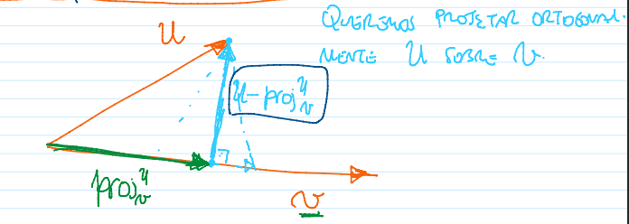

Projetar $u$ ortogonalmente sobre $v$ significa formar um ângulo de $90°$ entre o "resíduo" e $v$. Na figura, a reta em azul claro é a reta projetante ($u$ menos a projeção de $u$ sobre $v$) e a reta em verde é a própria projeção de $u$ sobre $v$. O complemento da projeção de $u$ sobre $v$ é ortogonal a $v$ — essa é justamente a condição que caracteriza a projeção como **ortogonal**.

??? note "Foto do quadro"
    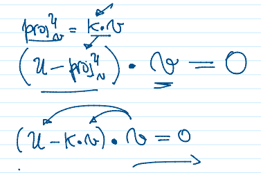

A projeção de $u$ sobre $v$ é um múltiplo de $v$, isto é, $\text{proj}_v(u) = kv$ para alguma constante $k$ (que "encolhe" $v$ até o ponto em que a reta projetante toca $v$ ortogonalmente). Como queremos que $u - \text{proj}_v(u)$ seja ortogonal a $v$:

$$(u-kv)\cdot v = 0$$

??? note "Foto do quadro"
    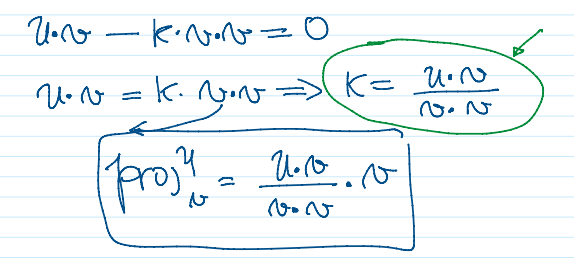

Isolando $k$: $u\cdot v - k(v\cdot v) = 0 \Rightarrow k = \dfrac{u\cdot v}{v\cdot v}$. Substituindo de volta:

$$\text{proj}_v(u) = \left(\frac{u\cdot v}{v\cdot v}\right)v$$

!!! warning
    Não é possível simplificar essa fração "cancelando" os $v$'s, pois $u\cdot v$ e $v\cdot v$ são produtos **escalares**, não multiplicação real comum.

!!! example "Exemplos"
    $w=(2,3)$, $v_1=(4,1)$. Projeção de $w$ sobre $v_1$:

    $$w\cdot v_1 = 8+3=11 \qquad v_1\cdot v_1 = 16+1=17$$

    $$\text{proj}_{v_1}(w) = \frac{11}{17}v_1 = \left(\frac{44}{17}, \frac{11}{17}\right)$$

    Projeção de $v_1$ sobre $w$:

    $$v_1\cdot w = 11 \qquad w\cdot w = 4+9=13$$

    $$\text{proj}_w(v_1) = \frac{11}{13}w = \left(\frac{22}{13}, \frac{33}{13}\right)$$

**Pé da altura.** É o ponto onde a reta traçada de um vértice de um triângulo, perpendicular ao lado oposto, encontra esse lado.

!!! example "Exemplo"
    Dados $A=(1,1,1)$, $B=(2,3,0)$, $C=(1,2,4)$, encontre o pé da altura relativa ao vértice $A$.

    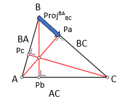

    Sejam $BA = A-B = (-1,-2,1)$ e $BC = C-B = (-1,-1,4)$. O pé da altura $P_a$ é $P_a = B + \text{proj}_{BC}(BA)$:

    $$\text{proj}_{BC}(BA) = \frac{BA\cdot BC}{BC\cdot BC}\,BC = \frac{1+2+4}{1+1+16}(-1,-1,4) = \frac{7}{18}(-1,-1,4)$$

    $$P_a = (2,3,0) + \frac{7}{18}(-1,-1,4) = \left(\frac{36}{18},\frac{54}{18},0\right) + \left(\frac{-7}{18},\frac{-7}{18},\frac{28}{18}\right) = \left(\frac{29}{18},\frac{47}{18},\frac{28}{18}\right)$$

### Produto vetorial

Dados dois vetores $v$ e $u$ no $\mathbb{R}^3$, o **produto vetorial** $v\times u$ é um vetor **perpendicular a ambos** (e, consequentemente, perpendicular ao plano que eles formam). O produto vetorial só está definido no $\mathbb{R}^3$.

Existem dois vetores ortogonais possíveis para um mesmo par $a,b$ que compartilham o mesmo ponto inicial; um deles é $a\times b$, e o outro — de sentido invertido — é $-a\times b$ ou, equivalentemente, $b\times a$.

??? note "Foto do quadro"
    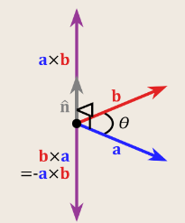

O produto vetorial mede o quanto dois vetores apontam em direções diferentes. Diferente do produto escalar (que retorna um número), o produto vetorial **retorna outro vetor**. Notação: $v\times u$.

**Base canônica.** Em álgebra linear, uma **base** de um espaço vetorial é um conjunto de vetores linearmente independentes que geram esse espaço (voltaremos a essa definição formalmente mais adiante). A **base canônica** é a base mais primitiva: no $\mathbb{R}^3$, é dada pelo conjunto $\{(1,0,0),(0,1,0),(0,0,1)\}$.

??? note "Foto do quadro"
    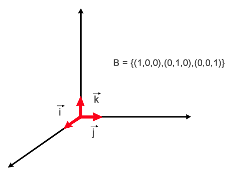

Por convenção, chamamos $(1,0,0)$ de $i$, $(0,1,0)$ de $j$ e $(0,0,1)$ de $k$ — logo, a base canônica do $\mathbb{R}^3$ é $\{i,j,k\}$. Qualquer vetor pode ser escrito como combinação desses três:

$$(x,y,z) = (x,0,0)+(0,y,0)+(0,0,z) = x(1,0,0)+y(0,1,0)+z(0,0,1) = xi+yj+zk$$

!!! example "Exemplo"
    $(3,-7,12) = 3i-7j+12k$.

**Calculando o produto vetorial.** É definido pelo determinante de uma matriz $3\times3$, com a primeira linha correspondendo à base canônica. Para $u=(a,b,c)$ e $v=(d,e,f)$:

$$u\times v = \det\begin{pmatrix} i & j & k \\ a & b & c \\ d & e & f \end{pmatrix}$$

??? note "Foto do quadro"
    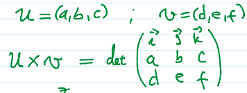

**Como calcular o determinante de uma matriz $3\times3$ (Regra de Sarrus).** Repetem-se as duas primeiras colunas à direita da matriz; somam-se os produtos das três diagonais "descendo" (da esquerda para a direita) e subtraem-se os produtos das três diagonais "subindo":

$$\det = (a_{11}a_{22}a_{33}+a_{12}a_{23}a_{31}+a_{13}a_{21}a_{32}) - (a_{13}a_{22}a_{31}+a_{11}a_{23}a_{32}+a_{12}a_{21}a_{33})$$

??? note "Foto do quadro (Regra de Sarrus)"
    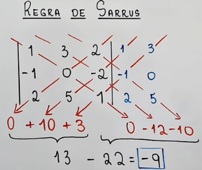

!!! example "Exemplo"
    $u=(1,2,-3)$ e $v=(4,1,5)$:

    $$u\times v = \det\begin{pmatrix} i & j & k \\ 1 & 2 & -3 \\ 4 & 1 & 5 \end{pmatrix} = (2\cdot5)i - (1\cdot5)j + (1\cdot1)k - (4\cdot2)k - (1\cdot(-3))i - (5\cdot1)j$$

    $$= 10i - 12j + k - 8k + 3i - 5j = 13i - 17j - 7k$$

    ??? note "Foto do quadro"
        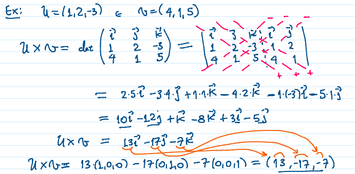

    $(13,-17,-7)$ é o vetor ortogonal resultante. Para checar a ortogonalidade, basta fazer o produto escalar com cada um dos vetores originais (deve dar $0$):

    $$(13,-17,-7)\cdot(1,2,-3) = 0 \qquad (13,-17,-7)\cdot(4,1,5) = 0$$

**Propriedades do produto vetorial:**

- $u\times u = (0,0,0)$
- $k(u\times v) = (ku)\times v$
- $u\times(v+w) = u\times v+u\times w$
- $(u\times v)\times w \neq u\times(v\times w)$ (não é associativo!)
- $u\times v = -v\times u$ (anticomutativo)

**Área do paralelogramo e do triângulo.** O módulo do produto vetorial corresponde numericamente à área do paralelogramo formado pelos vetores $u$ e $v$ (embora sejam conceitos matematicamente diferentes):

$$\text{área do paralelogramo} = \|u\times v\|$$

??? note "Foto do quadro"
    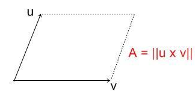

Como consequência, a área do triângulo formado por $u$ e $v$ é metade disso:

$$\text{área do triângulo} = \frac{\|u\times v\|}{2}$$

Outra forma de calcular a área do paralelogramo é por meio da projeção ortogonal:

??? note "Foto do quadro"
    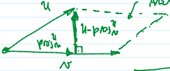

$$\text{área do paralelogramo} = \|v\|\cdot\|u-\text{proj}_v(u)\|$$

$$\text{área do triângulo} = \frac{\|v\|\cdot\|u-\text{proj}_v(u)\|}{2}$$

Ainda outra forma, usando o seno do ângulo entre os vetores:

(com $b=u$, $a=v$)

??? note "Foto do quadro"
    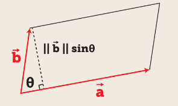

Como $\sin(\theta) = h/\|u\|$ (cateto oposto sobre hipotenusa), $h = \|u\|\sin(\theta)$. Logo:

$$\text{área do paralelogramo} = \|v\|\|u\|\sin(\theta) \qquad \text{área do triângulo} = \frac{\|v\|\|u\|\sin(\theta)}{2}$$

Como há diversas formas de calcular a mesma área, podemos igualar essas expressões:

$$\|u\times v\| = \|v\|\|u\|\sin(\theta)$$

**Produto misto e volume do paralelepípedo.** Tendo três vetores, conseguimos calcular o volume de um paralelepípedo usando o **produto misto**, que combina produto vetorial com produto escalar. A ideia geral é:

$$\text{volume} = \text{área da base} \times \text{altura}$$

onde a área da base é $\|u\times v\|$ (o paralelogramo formado por dois dos vetores), e a altura é obtida projetando o terceiro vetor sobre a direção normal a essa base (dada justamente por $u\times v$). Voltaremos a essa fórmula formalmente na seção **Produto misto**, mais abaixo.

### Circunferência

??? note "Foto do quadro"
    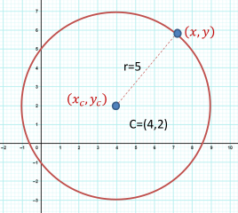

**Equação reduzida:** $(x-x_c)^2+(y-y_c)^2 = r^2$, onde $(x_c,y_c)$ é o centro e $r$ o raio.

**Equação geral:** expandindo a reduzida,

$$x^2+y^2-2x_cx-2y_cy+(x_c^2+y_c^2-r^2) = 0$$

!!! example "Exemplo"
    $C = \{(x,y)\in\mathbb{R}^2 \mid (x-2)^2+(y-3)^2=16\}$. Encontre $C\cap\text{Eixo }X$ (onde $y=0$):

    $$(x-2)^2+(0-3)^2=16 \;\Rightarrow\; x^2-4x+4+9=16 \;\Rightarrow\; x^2-4x-3=0$$

    Resolvendo com Bhaskara: $x = \dfrac{-b\pm\sqrt{b^2-4ac}}{2a}$.

### Cônicas

Uma **cônica** é o conjunto de pontos que satisfaz uma equação geral do 2º grau em duas variáveis:

$$ax^2+bxy+cy^2+dx+ey+f = 0$$

| Tipo | Equação reduzida |
|---|---|
| **Elipse** | $\dfrac{x'^2}{A^2}+\dfrac{y'^2}{B^2}=1$ |
| **Hipérbole** | $\dfrac{x'^2}{A^2}-\dfrac{y'^2}{B^2}=1$ (ou, com os eixos trocados, $-\dfrac{x'^2}{A^2}+\dfrac{y'^2}{B^2}=1$) |
| **Parábola** | $y'=\dfrac{1}{4A}x'^2$ (ou, com os eixos trocados, $x'=\dfrac{1}{4A}y'^2$) |

??? note "Fotos do quadro (equações de cada cônica)"
    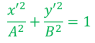
    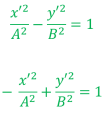
    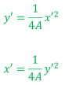

### Esfera

A equação da esfera generaliza a circunferência para o $\mathbb{R}^3$:

$$(x-x_c)^2+(y-y_c)^2+(z-z_c)^2 = r^2$$

Quando o centro está na origem $(0,0,0)$: $x^2+y^2+z^2=r^2$.

!!! example "Exemplo"
    $E = \{(x,y,z)\in\mathbb{R}^3 \mid (x-1)^2+(y-2)^2+(z-1)^2=9\}$ (centro em $(1,2,1)$). Encontre $E\cap\text{Eixo }Z$ (onde $x=0$ e $y=0$):

    $$(0-1)^2+(0-2)^2+(z-1)^2=9 \;\Rightarrow\; 1+4+z^2-2z+1=9 \;\Rightarrow\; z^2-2z-3=0$$

    Resolvendo com Bhaskara, obtemos $E\cap\text{Eixo }Z = \{(0,0,-1),(0,0,3)\}$.

!!! tip "Importante"
    $\mathbb{R}^2$ é o plano cartesiano, e $\mathbb{R}^3$ é o espaço tridimensional.

## Descrição cartesiana de retas

Dados um ponto $P=(x_0,y_0)$ e um vetor $v=(a,b)$, qual é o lugar geométrico dos pontos $Q$ tais que $Q-P$ é ortogonal a $v$?

??? note "Foto do quadro"
    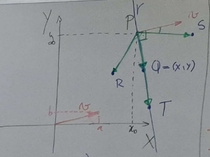

Chamando $Q-P$ de $u$, para que $u$ seja ortogonal a $v$, precisamos de $u\cdot v=0$:

$$\big((x,y)-(x_0,y_0)\big)\cdot(a,b) = 0 \;\Rightarrow\; a(x-x_0)+b(y-y_0) = 0$$

(onde $r$ é a reta resultante)

??? note "Foto do quadro"
    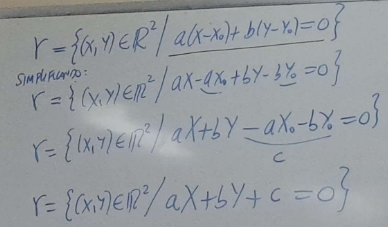

Essa é a forma **cartesiana** de uma reta: $v=(a,b)$ é o **vetor normal** da reta (perpendicular a ela).

!!! example "Exemplo: reta ortogonal a $v=(2,1)$ passando por $P=(5,-3)$"
    Com $a=2, b=1, x_0=5, y_0=-3$:

    $$r = \{(x,y)\in\mathbb{R}^2 \mid 2(x-5)+1(y-(-3))=0\} = \{2x-10+y+3=0\} = \{2x+y-7=0\}$$

    ??? note "Foto do quadro"
        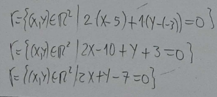

!!! example "Exemplo: interseção entre $R: 2x+y=-3$ e $S: -3x+2y=1$"
    Resolvendo o sistema $2\times2$ formado por $R$ e $S$: multiplicando a 1ª equação por $-2$,

    $$\begin{cases}-4x-2y=6\\-3x+2y=1\end{cases} \;\Rightarrow\; -7x=7 \;\Rightarrow\; x=-1$$

    Substituindo em $R$: $2(-1)+y=-3 \Rightarrow y=-1$. Logo $R\cap S = \{(-1,-1)\}$.

    ??? note "Foto do quadro"
        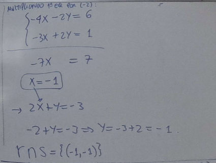

### Posições relativas de duas retas no $\mathbb{R}^2$

| Posição relativa | Sistema $2\times2$ correspondente |
|---|---|
| Retas paralelas | Sem solução |
| Retas concorrentes | Uma solução |
| Retas coincidentes | Indeterminado (infinitas soluções) |

!!! example "Exemplo: reta cartesiana ortogonal a $A=(1,-2)$ e $B=(5,-6)$"
    O vetor diretor é $u=AB=B-A=(5,-6)-(1,-2)=(4,-4)$. Um vetor normal a $u=(a,b)$ pode ser obtido pela regra $(a,b)\to(b,-a)$, o que dá $v=(4,4)$ (verificando: $(4,4)\cdot(4,-4)=16-16=0$).

    Usando $v=(4,4)$ como vetor diretor da reta buscada e cada um dos pontos:

    $$r: 4(x-1)+4(y-(-2))=0 \qquad r: 4(x-5)+4(y-(-6))=0$$

    Expandindo e simplificando ambas:

    $$4x-4+4y+8=0 \;\Rightarrow\; 4x+4y+4=0 \;\Rightarrow\; x+y+1=0$$

    $$4x-20+4y+24=0 \;\Rightarrow\; 4x+4y+4=0 \;\Rightarrow\; x+y+1=0$$

    Ambos os pontos levam à mesma reta: $r: x+y+1=0$.

    **Outra forma de resolver** (sem calcular o vetor normal "visualmente"): buscamos $r: ax+by+c=0$ passando por $A$ e por $B$:

    $$\begin{cases}a-2b+c=0\\5a-6b+c=0\end{cases}$$

    Subtraindo a 1ª da 2ª: $4a-4b=0 \Rightarrow a=b$. Substituindo na 1ª: $a-2a+c=0 \Rightarrow -a+c=0 \Rightarrow c=a$. Logo a reta é $r: ax+ay+a=0 \Rightarrow a(x+y+1)=0 \Rightarrow r: x+y+1=0$ — o mesmo resultado.

    ??? note "Fotos do quadro (resolução completa)"
        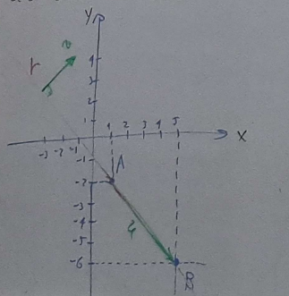
        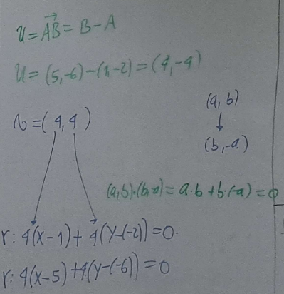
        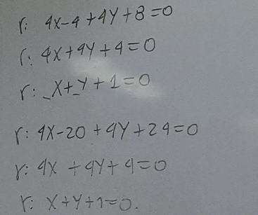
        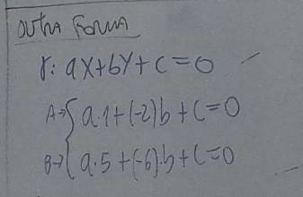
        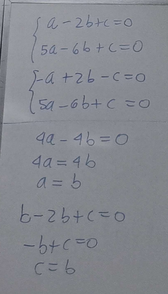
        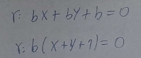

### Forma explícita (paramétrica) de retas

A forma paramétrica representa a reta através de um **parâmetro** (uma variável auxiliar, geralmente $t$) que liga duas equações pertencentes à mesma reta — uma para $x$, outra para $y$. Dados um ponto $A$ da reta e seu vetor diretor $v=B-A$, qualquer ponto $Q(t)$ da reta é

$$Q(t) = A + t\cdot v, \quad t\in\mathbb{R}$$

Em coordenadas, com $A=(x_0,y_0)$ e $v=(a,b)$: $Q=(x,y)=(x_0+at,\, y_0+bt)$.

??? note "Fotos do quadro"
    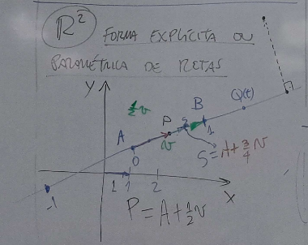
    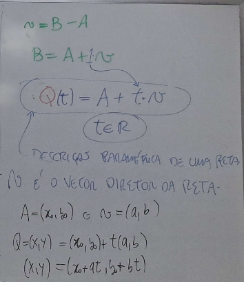

Aqui, $v$ é o **vetor diretor** da reta (um vetor com a mesma direção dessa reta); $x, x_0, a$ correspondem ao eixo $x$, e $y, y_0, b$ ao eixo $y$.

!!! example "Exemplo: forma paramétrica da reta por $A=(5,-2)$ e $B=(-4,3)$"
    O vetor diretor é $v = AB = (-9,5)$.

    **A partir de $A$:** $(x,y) = (5,-2)+t(-9,5) \Rightarrow x=5-9t,\; y=-2+5t$

    **A partir de $B$:** $(x,y) = (-4,3)+t(-9,5) \Rightarrow x=-4-9t,\; y=3+5t$

!!! example "Exemplo: interseção $S\cap R$"
    $R: \{x=2-3t,\, y=5+t\}$; $S = \{(x,y) \mid 3x-4y+2=0\}$.

    Substituindo $R$ em $S$:

    $$3(2-3t)-4(5+t)+2=0 \;\Rightarrow\; -13t-12=0 \;\Rightarrow\; t=-\frac{12}{13}$$

    Substituindo na forma paramétrica de $R$: $x = 2-3\left(-\frac{12}{13}\right)=\frac{62}{13}$, $y = 5-\frac{12}{13}=\frac{53}{13}$.

    Ponto de interseção: $\left(\frac{62}{13},\frac{53}{13}\right)$.

    **Outro modo:** converter $R$ para cartesiana primeiro.

    *Geometricamente:* ponto $(x_0,y_0)=(2,5)$, vetor diretor $(-3,1)$, logo vetor normal $(1,3)$:

    $$1(x-2)+3(y-5)=0 \;\Rightarrow\; x+3y-17=0$$

    *Algebricamente:* de $y=5+t$, $t=y-5$; substituindo em $x=2-3t$: $x=2-3y+15 \Rightarrow x+3y-17=0$.

!!! example "Exemplo: $S\cap R$ com $R:\{x=1+3t,y=2-t\}$ e $S:\{x=-1-2q,y=4+2q\}$"
    No ponto de interseção $I$, $x_R=x_S$ e $y_R=y_S$:

    $$1+3t=-1-2q \qquad 2-t=4+2q$$

    Resolvendo o sistema, $t=0$ (e, se precisasse, $q=-1$). Substituindo $t=0$ em $R$: $x=1$, $y=2$. Logo $I=(1,2)$.

!!! example "Exemplo: interseção de reta com circunferência"
    Circunferência $(x-1)^2+(y+2)^2=9$; $R: \{x=5+2t,\, y=2+t\}$.

    Substituindo $x,y$ de $R$ na equação da circunferência:

    $$(5+2t-1)^2+(2+t+2)^2=9 \;\Rightarrow\; (4+2t)^2+(4+t)^2=9$$

    $$(16+16t+t^2)+(16+8t+t^2)=9 \;\Rightarrow\; 2t^2+24t+23=0$$

    Resolvendo por Bhaskara:

    $$t = \frac{-24\pm\sqrt{576-184}}{4} = \frac{-24\pm\sqrt{392}}{4} = \frac{-12\pm\sqrt{29}}{...}$$

    (os coeficientes exatos variam conforme a simplificação; o ponto importante é que, havendo **duas raízes reais**, a reta intersecta a circunferência em **dois pontos distintos**, obtidos substituindo cada valor de $t$ de volta em $R$.)

!!! tip "Importante"
    Na descrição cartesiana, o vetor diretor da reta é **normal** ao plano, à reta, etc. (perpendicular, não paralelo).

## Forma paramétrica de uma reta no $\mathbb{R}^3$

Dados dois pontos $A$ e $B$, com $v=B-A$ (logo $B=A+v$), a reta por $A$ na direção de $v$ é

$$P(t) = A+tv = (x_0+at,\, y_0+bt,\, z_0+ct)$$

??? note "Foto do quadro"
    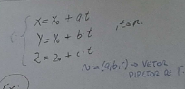

!!! example "Exemplo: reta por $A=(3,-2,1)$ na direção de $v=(5,2,4)$"
    $$r: \{x=3+5t,\; y=-2+2t,\; z=1+4t\}$$

    **Essa reta intersecta os planos coordenados?** (lembrando: no $\mathbb{R}^3$, os planos coordenados são $xy$ com $z=0$, $xz$ com $y=0$, e $yz$ com $x=0$.)

    **Interseção com o plano $xy$ ($z=0$):** $1+4t=0 \Rightarrow t=-1/4$. Então $x=3+5(-1/4)=7/4$, $y=-2+2(-1/4)=-5/2$. Interseção: $(7/4,-5/2,0)$.

    **Interseção com o plano $xz$ ($y=0$):** $-2+2t=0 \Rightarrow t=1$. Então $x=3+5(1)=8$, $z=1+4(1)=5$. Interseção: $(8,0,5)$.

    **Interseção com o plano $yz$ ($x=0$):** $3+5t=0 \Rightarrow t=-3/5$. Então $y=-2+2(-3/5)=-16/5$, $z=1+4(-3/5)=-7/5$. Interseção: $(0,-16/5,-7/5)$.

!!! example "Exemplo: reta sem interseção com um plano coordenado"
    $s: \{x=1+3t,\; y=5,\; z=2-t\}$. Interseção com o plano $xz$ ($y=0$)?

    Para existir interseção, precisaríamos de $y=5$ **e** $y=0$ simultaneamente — impossível, já que $y$ não pode assumir dois valores ao mesmo tempo. Logo, $s \cap (\text{plano } xz) = \varnothing$.

### Plano ortogonal a um vetor

Sejam $P=(x_0,y_0,z_0)$ um ponto e $v=(a,b,c)$ um vetor do $\mathbb{R}^3$. Qual é o lugar geométrico dos pontos cuja diferença com $P$ é ortogonal a $v$? A resposta é um **plano** $\pi$ (análogo à reta no $\mathbb{R}^2$, mas agora em uma dimensão a mais).

Matematicamente: para $Q=(x,y,z)$, queremos $(Q-P)\cdot v = 0$:

$$(x-x_0,\,y-y_0,\,z-z_0)\cdot(a,b,c)=0 \;\Rightarrow\; a(x-x_0)+b(y-y_0)+c(z-z_0)=0$$

Expandindo, chegamos à forma geral do plano:

$$\pi = \{(x,y,z)\in\mathbb{R}^3 \mid ax+by+cz+d=0\}, \quad \text{onde } d = -(ax_0+by_0+cz_0)$$

??? note "Fotos do quadro"
    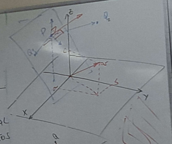
    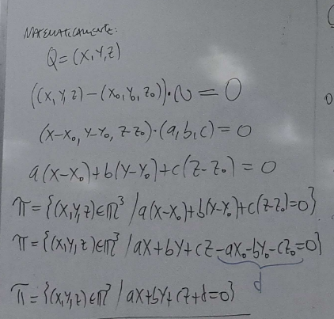

!!! example "Exemplo"
    $P=(3,7,-2)$, $v=(4,-1,2)$. O plano ortogonal a $v$ passando por $P$:

    $$\pi = \{(x,y,z)\in\mathbb{R}^3 \mid 4x-y+2z - [4\cdot3-1\cdot7+2\cdot(-2)] = 0\} = \{4x-y+2z-1=0\}$$

!!! example "Exemplo: interseção de reta com plano"
    $s: \{x=3-t,\, y=2+2t,\, z=1-3t\}$ e $\pi: 4x-y+2z-1=0$.

    Substituindo $s$ em $\pi$:

    $$4(3-t)-(2+2t)+2(1-3t)-1=0 \;\Rightarrow\; 12-4t-2-2t+2-6t-1=0 \;\Rightarrow\; 11-12t=0 \;\Rightarrow\; t=\frac{11}{12}$$

    $$x=3-\frac{11}{12}=\frac{25}{12} \qquad y=2+2\cdot\frac{11}{12}=\frac{23}{6} \qquad z=1-3\cdot\frac{11}{12}=-\frac{7}{4}$$

    Interseção: $\left(\frac{25}{12},\frac{23}{6},-\frac{7}{4}\right)$.

### A interseção de dois planos concorrentes é uma reta

Dados $\pi_1: ax+by+cz+d=0$ e $\pi_2: ex+fy+gz+h=0$, logo, a reta $r = \pi_1\cap\pi_2$ pode ser descrita diretamente pelo sistema das duas equações:

$$r = \left\{(x,y,z)\in\mathbb{R}^3 \;\middle|\; \begin{cases}ax+by+cz+d=0\\ex+fy+gz+h=0\end{cases}\right\}$$

??? note "Fotos do quadro"
    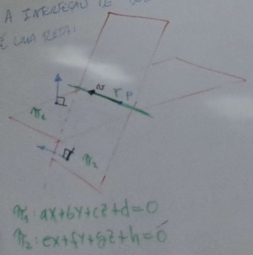
    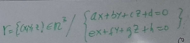

!!! example "Exemplo: de reta paramétrica para interseção de planos"
    $r: \{x=1-2t,\, y=3+2t,\, z=-1-t\}$. O vetor diretor é $(-2,2,-1)$.

    Para encontrar dois planos cuja interseção é $r$, precisamos de dois vetores ortogonais ao vetor diretor: $(a,b,c)\cdot(-2,2,-1)=0 \Rightarrow -2a+2b-c=0$.

    Arbitramos valores (equivalente a intersectar com um plano coordenado):

    - Se $c=0$: $-2a+2b=0 \Rightarrow a=b$, logo o vetor é $a(1,1,0)$.
    - Se $b=0$: $-2a-c=0 \Rightarrow c=-2a$, logo o vetor é $a(1,0,-2)$.

    Escolhendo $v_1=(1,1,0)$ e $v_2=(1,0,-2)$, os planos são:

    $$\pi_1: 1(x-1)+1(y-3)+0(z+1) = x+y-4=0$$

    $$\pi_2: 1(x-1)+0(y-3)+(-2)(z+1) = x-2z-3=0$$

    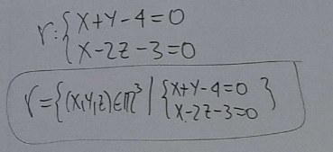

    **Forma algébrica alternativa:** isolamos $t$ em um dos eixos de $r$ e substituímos nos outros dois. De $z=-1-t$, $t=-1-z$:

    $$x=1-2(-1-z)=3+2z \;\Rightarrow\; x-2z-3=0$$

    $$y=3+2(-1-z)=1-2z \;\Rightarrow\; y+2z-1=0$$

!!! example "Exemplo: de interseção de planos para forma paramétrica"
    $s: \{2x-y+2z=1,\; x+y-3z=4\}$. Os vetores normais são $w=(2,-1,2)$ e $u=(1,1,-3)$.

    ??? note "Foto do quadro"
        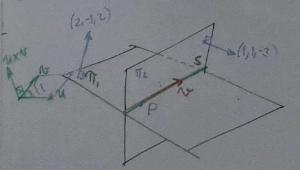

    O produto vetorial $w\times u$ gera um vetor $v$ ortogonal a ambos — e, portanto, paralelo à reta de interseção $s$. Após achar $v$, basta um ponto qualquer de $s$ para montar a forma paramétrica.

    $$w\times u = \det\begin{pmatrix} i & j & k \\ 2 & -1 & 2 \\ 1 & 1 & -3 \end{pmatrix} = (1,8,3)$$

    ??? note "Foto do quadro"
        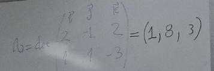

    Arbitrando $z=0$: $2x-y=1$ e $x+y=4$. Somando as equações: $x=5/3$, e substituindo, $y=7/3$. Logo $P=(5/3,7/3,0)$.

    A forma paramétrica de $s$ é:

    $$\{x=5/3+t,\; y=7/3+8t,\; z=3t\}$$

!!! example "Exemplo: interseção de plano e esfera"
    $E: (x-1)^2+(y+1)^2+(z-2)^2=16$ (esfera, centro $C=(1,-1,2)$ e raio $R=4$) e $\pi: x+2y+z+5=0$. Encontre o centro e o raio da circunferência $\pi\cap E$.

    A ideia: traçamos a reta $s$ que passa pelo centro $C$ da esfera na direção normal do plano $\pi$ (normal $(1,2,1)$); o ponto $C_0=s\cap\pi$ é o centro da circunferência de interseção, e $d=\text{dist}(C,C_0)$ é a distância entre o centro da esfera e o plano. Como $R$ é a hipotenusa do triângulo retângulo formado pelo raio $r$ da circunferência e $d$:

    $$R^2 = r^2+d^2$$

    **Montando $s$:** $s: (x,y,z)=(1,-1,2)+t(1,2,1) \Rightarrow \{x=1+t,\, y=-1+2t,\, z=2+t\}$.

    **Interseção $s\cap\pi$:** $(1+t)+2(-1+2t)+(2+t)+5=0 \Rightarrow 6t+6=0 \Rightarrow t=-1$.

    Substituindo: $C_0 = (1-1,\,-1-2,\,2-1) = (0,-3,1)$.

    **Calculando $d$:** $d=\text{dist}(C,C_0) = \sqrt{(0-1)^2+(-3-(-1))^2+(1-2)^2} = \sqrt{1+4+1} = \sqrt{6}$.

    **Calculando $r$:** $R^2=r^2+d^2 \Rightarrow 16=r^2+6 \Rightarrow r=\sqrt{10}$.

    A circunferência $\pi\cap E$ tem centro $C_0=(0,-3,1)$ e raio $\sqrt{10}$.

    ??? note "Fotos do quadro (resolução completa)"
        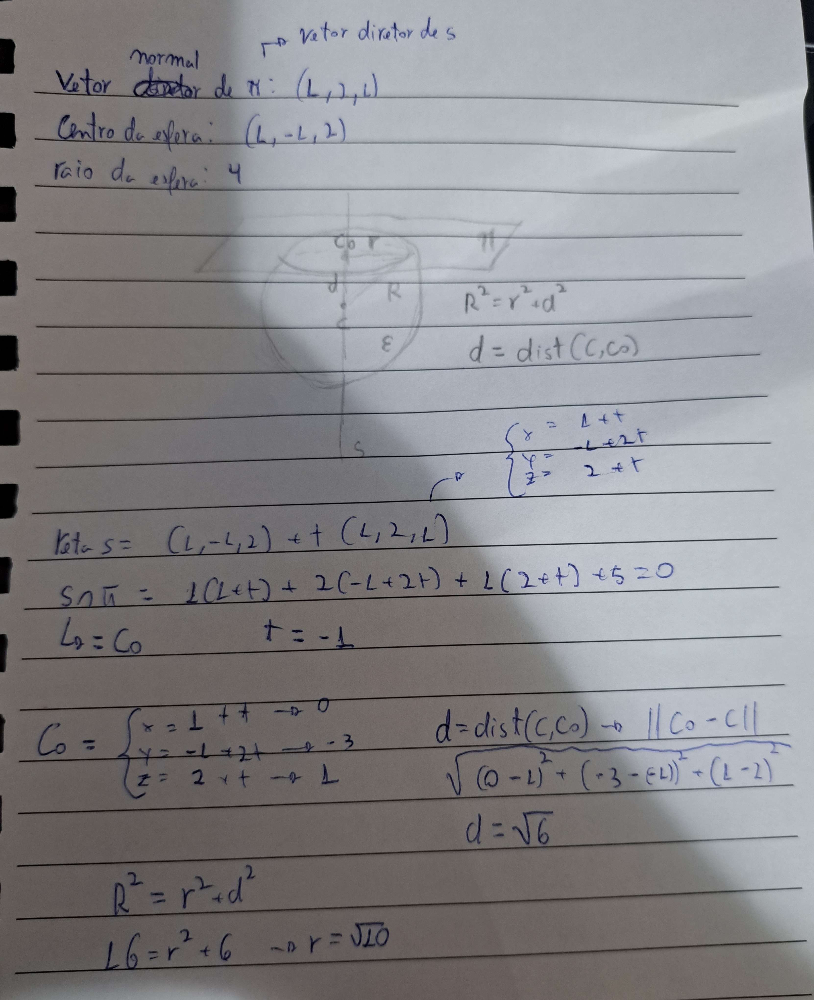

!!! tip "Importante"
    Na descrição cartesiana, o vetor diretor tem o mesmo sentido do plano, reta, etc.

## Produto misto

O produto misto combina um **produto vetorial** seguido de um **produto escalar**, permitindo calcular o volume de um paralelepípedo formado por três vetores $u$, $v$, $w$:

$$(u\times v)\cdot w = \det\begin{pmatrix} u_x & u_y & u_z \\ v_x & v_y & v_z \\ w_x & w_y & w_z \end{pmatrix}$$

O **módulo** desse valor é o volume do paralelepípedo formado pelos três vetores. Se o produto misto for $0$, os vetores são coplanares (não formam um paralelepípedo com volume positivo) — e, no caso de retas, isso indica que elas não são reversas.

??? note "Foto do quadro"
    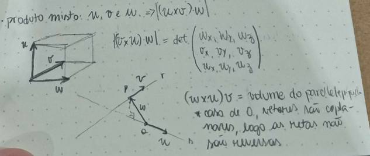

## Posições relativas de retas no espaço

No $\mathbb{R}^3$, duas retas podem ser paralelas, coincidentes, concorrentes ou **reversas** (não se cruzam e não são paralelas — só é possível em três ou mais dimensões).

??? note "Diagramas de referência (posições relativas de retas e planos)"
    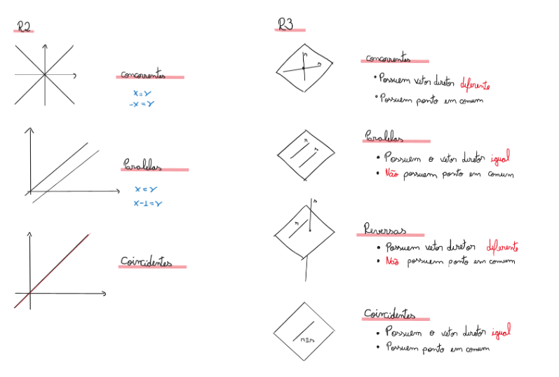
    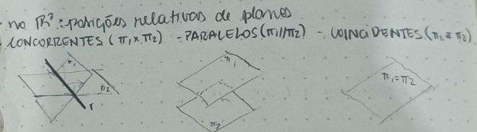

!!! note
    Retas reversas não ocorrem no $\mathbb{R}^2$.

**Como descobrir a posição relativa.** No $\mathbb{R}^3$, se o determinante formado pelos vetores diretores das retas é $0$, elas são paralelas ou coincidentes; caso contrário, são concorrentes ou reversas. O fluxo de decisão completo é:

- Vetores diretores **múltiplos**? Se sim, as retas **têm interseção**? Se sim, são **coincidentes**; se não, são **paralelas**.
- Vetores diretores **não múltiplos**? Têm **interseção**? Se sim, são **concorrentes**; se não, são **reversas**.

??? note "Foto do quadro"
    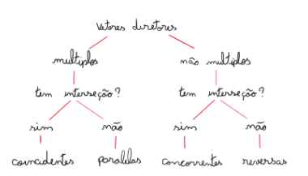

!!! example "Exemplos"
    **$r: \{x=1+t,y=2-t\}$ e $s: 2x+3y-3=0$:** o vetor diretor de $r$ é $(1,-1)$ e o normal de $s$ é $(2,3)$. O produto escalar entre eles é diferente de $0$, logo (estando no $\mathbb{R}^2$) as retas são concorrentes. Verificando: $2(1+t)+3(2-t)-3=0 \Rightarrow t=5$; substituindo em $r$: $x=6, y=-3$. Interseção: $(6,-3)$.

    **$r:\{x=1+t,y=2-t\}$ e $s: 3x+3y-5=0$:** o vetor diretor de $r$ é $(1,-1)$ e o normal de $s$ é $(3,3)$. Como $(1,-1)\cdot(3,3)=3-3=0$, a direção de $r$ é perpendicular ao normal de $s$ — ou seja, $r$ é paralela a $s$ (ou coincidente com ela). Testamos um ponto de $r$, $P=(1,2)$, em $s$: $3(1)+3(2)-5=4\neq0$, logo $P\notin s$ e as retas **não** são coincidentes — são **paralelas**. Confirmando por substituição direta: $3(1+t)+3(2-t)-5=0 \Rightarrow 3+3t+6-3t-5=0 \Rightarrow 4=0$ (falso, nenhuma solução — consistente com retas paralelas sem interseção; se fossem coincidentes, teríamos $0=0$, verdadeiro para qualquer $t$).

    ??? note "Foto do quadro"
        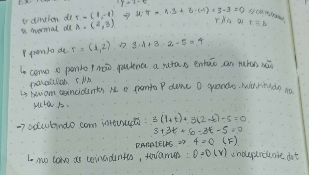

    **$\pi_1: 2x+y-2z=5$ e $\pi_2: x+2y+2z=1$:** vetores normais $(2,1,-2)$ e $(1,2,2)$ não são múltiplos entre si, logo os planos são concorrentes (se fossem retas, haveria também a possibilidade de serem reversas).

    **$r:\{x=1+2t,y=2-3t,z=-1-t\}$ e $s:\{x=2+q,y=2+q,z=1-q\}$:** vetores diretores $(2,-3,-1)$ e $(1,1,-1)$ não são múltiplos, logo as retas são concorrentes ou reversas. Testamos se há interseção, igualando as coordenadas $x$ e $y$:

    $$1+2t=2+q \qquad 2-3t=2+q$$

    Igualando: $1+2t=2-3t \Rightarrow 5t=1 \Rightarrow t=\frac15$, e então $q=2t-1=-\frac35$. Verificando na coordenada $z$: $z_r=-1-t=-\frac65$ e $z_s=1-q=\frac85$. Como $-\frac65\neq\frac85$, não há ponto comum nas três coordenadas simultaneamente — as retas são **reversas**.

    ??? note "Foto do quadro"
        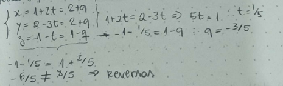

    Em geral: calculamos $t$ e $q$ a partir de duas coordenadas e substituímos na terceira; se os resultados diferirem, não há interseção e as retas são reversas.

## Distâncias

Definimos a distância entre duas regiões $A$ (com pontos $P$) e $B$ (com pontos $Q$) como $\text{dist}(A,B) = \min\{d(P,Q)\}$ — a menor distância possível entre um ponto de $A$ e um ponto de $B$.

### Distância no $\mathbb{R}^2$

**Ponto a ponto.** $A=(x_a,y_a)$, $B=(x_b,y_b)$. A distância é a norma da diferença entre os pontos:

$$d_{AB} = \sqrt{(x_b-x_a)^2+(y_b-y_a)^2}$$

??? note "Foto do quadro"
    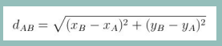

!!! example "Exemplo"
    Distância entre $P=(43,-76)$ e $Q=(-87,114)$:

    $$\|Q-P\| = \sqrt{(-87-43)^2+(114-(-76))^2} = \sqrt{53000}$$

    ??? note "Foto do quadro"
        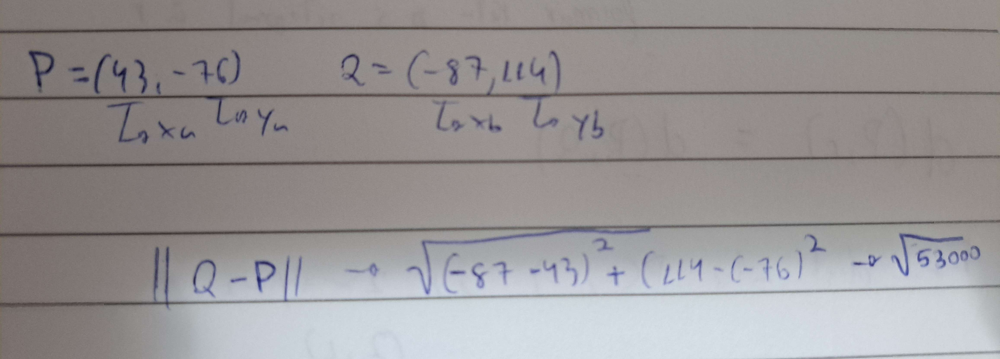

**Ponto a reta.** Para achar a distância entre um ponto $P=(x_0,y_0)$ e uma reta $r: ax+by+c=0$, buscamos uma reta $s$ ortogonal a $r$ que passa por $P$, encontramos o ponto de interseção $Q_2 = s\cap r$, e calculamos $\|P-Q_2\|$.

A reta auxiliar $s$ (ortogonal a $r$, passando por $P$), na forma paramétrica, é $s:\{x=x_0+at,\, y=y_0+bt\}$. Substituindo em $r$:

$$a(x_0+at)+b(y_0+bt)+c=0 \;\Rightarrow\; (a^2+b^2)t+ax_0+by_0+c=0 \;\Rightarrow\; t = \frac{-ax_0-by_0-c}{a^2+b^2}$$

o que dá o ponto de interseção $Q_2 = \left(x_0-a\cdot\dfrac{ax_0+by_0+c}{a^2+b^2},\; y_0-b\cdot\dfrac{ax_0+by_0+c}{a^2+b^2}\right)$.

??? note "Fotos do quadro"
    
    
    
    

Logo, $\text{dist}(P,r) = \text{dist}(P,Q_2) = \|P-Q_2\|$:

$$d(P,r) = \sqrt{\left(x_0-\left(x_0-a\cdot\tfrac{ax_0+by_0+c}{a^2+b^2}\right)\right)^2+\left(y_0-\left(y_0-b\cdot\tfrac{ax_0+by_0+c}{a^2+b^2}\right)\right)^2}$$

Que é equivalente a (os termos $x_0$ e $y_0$ se cancelam, sobrando as frações):

$$d(P,r) = \sqrt{\frac{a^2(ax_0+by_0+c)^2}{(a^2+b^2)^2}+\frac{b^2(ax_0+by_0+c)^2}{(a^2+b^2)^2}} = \sqrt{\frac{(a^2+b^2)(ax_0+by_0+c)^2}{(a^2+b^2)^2}} = \frac{|ax_0+by_0+c|}{\sqrt{a^2+b^2}}$$

??? note "Fotos do quadro"
    
    
    

Chegando à fórmula direta da distância entre ponto e reta. Em resumo, o método é: (1) achar uma reta $S:(x_0,y_0)+t(a,b)$ perpendicular a $R$ passando por $P$; (2) achar a interseção $P'$ de $S$ e $R$; (3) calcular a distância de $P$ para $P'$ — mas a fórmula fechada abaixo evita ter que repetir esses passos toda vez:

??? note "Foto do quadro (resumo do método)"
    

$$\text{dist}(P,r) = \frac{|ax_0+by_0+c|}{\sqrt{a^2+b^2}}$$

onde $(x_0,y_0)$ são as coordenadas de $P$, e $a,b,c$ vêm diretamente da forma cartesiana de $r$: $ax+by+c=0$ (com $(a,b)$ sendo o vetor normal de $r$).

!!! example "Exemplo: distância entre $P=(6,17)$ e $r: 5x-3y-40=0$"
    $$\text{dist}(P,r) = \frac{|5(6)+(-3)(17)+(-40)|}{\sqrt{5^2+(-3)^2}} = \frac{|30-51-40|}{\sqrt{34}} = \frac{61}{\sqrt{34}}$$

    ??? note "Foto do quadro"
        

**Reta a reta (paralelas).** Se as retas forem paralelas, podemos pegar um ponto de uma delas e calcular a distância desse ponto até a outra reta (usando a fórmula de ponto a reta acima). Se não forem paralelas, existirá um ponto de interseção, e a distância entre as retas será $0$.

??? note "Foto do quadro"
    

!!! example "Exemplo: distância entre $r: 2x+2y-3=0$ e $s: 3x+3y-5=0$"
    Primeiro verificamos que as retas são paralelas, pois os vetores normais, $(2,2)$ e $(3,3)$, são múltiplos entre si. Escolhemos um ponto $P$ em $r$ (com $x=0$): $2(0)+2y-3=0 \Rightarrow y=\tfrac32$, logo $P=(0,\tfrac32)$.

    $$\text{dist}(r,s) = \text{dist}(P,s) = \frac{\left|3(0)+3\left(\tfrac32\right)+(-5)\right|}{\sqrt{3^2+3^2}} = \frac{\left|-\tfrac12\right|}{3\sqrt2} = \frac{1}{6\sqrt2}$$

    ??? note "Foto do quadro"
        

!!! example "Exemplo: distância entre circunferência e reta"
    $C: (x-2)^2+(y+3)^2=25$ (centro $(2,-3)$, raio $5$) e $r: 4x-5y-30=0$.

    $$\text{dist}(\text{centro},r) = \frac{|4(2)+(-5)(-3)+(-30)|}{\sqrt{4^2+(-5)^2}} = \frac{|8+15-30|}{\sqrt{41}} = \frac{7}{\sqrt{41}} \approx 1{,}09$$

    Como $\text{dist}(\text{centro},r) < \text{raio} = 5$, a reta corta a circunferência em dois pontos, logo $\text{dist}(C,r)=0$. (Em geral, se $\text{dist}(\text{centro},r) > \text{raio}$, a reta não intercepta a circunferência, e $\text{dist}(C,r) = \text{dist}(\text{centro},r) - \text{raio}$.)

    ??? note "Foto do quadro"
        

### Distância no $\mathbb{R}^3$

**Ponto a ponto.** Mesma lógica do $\mathbb{R}^2$, com uma coordenada a mais. $A=(x_a,y_a,z_a)$, $B=(x_b,y_b,z_b)$:

$$d = \sqrt{(x_1-x_0)^2+(y_1-y_0)^2+(z_1-z_0)^2}$$

??? note "Foto do quadro"
    

!!! example "Exemplo"
    Distância entre $P=(15,32,-4)$ e $Q=(12,12,32)$:

    $$\text{dist}(P,Q) = \sqrt{(12-15)^2+(12-32)^2+(32-(-4))^2} = \sqrt{1705}$$

    ??? note "Foto do quadro"
        

**Ponto a reta.** Também segue a mesma lógica, com uma coordenada extra. Para $A=(x_a,y_a,z_a)$ e $r: ax+by+cz+d=0$ com vetor normal $(a,b,c)$:

$$\text{dist}(P,r) = \frac{|ax_a+by_a+cz_a+d|}{\|(a,b,c)\|}$$

??? note "Foto do quadro"
    

**Outro método.** Dados um ponto $Q$ qualquer da reta $r$, seu vetor diretor $v$, e o ponto $P$ cuja distância a $r$ queremos:

$$d(P,r) = \left\|\overrightarrow{QP} - \text{proj}_v\!\left(\overrightarrow{QP}\right)\right\|$$

ou seja, a distância é a norma do "resíduo" de $\overrightarrow{QP}$ depois de remover sua componente na direção de $r$.

??? note "Foto do quadro"
    

!!! example "Exemplo: $P=(2,3,1)$; $r: 4x-y+2z-10=0$"
    $$\text{dist}(P,r) = \frac{|4(2)+(-1)(3)+2(1)+(-10)|}{\sqrt{4^2+(-1)^2+2^2}} = \frac{|8-3+2-10|}{\sqrt{21}} = \frac{3}{\sqrt{21}}$$

**Ponto a plano.** Existe uma reta ortogonal ao plano $\pi$ que passa pelo ponto $P$; o vetor normal do plano é também o vetor diretor dessa reta.

$P=(x_0,y_0,z_0)$; $\pi: ax+by+cz+d=0$ com vetor normal $(a,b,c)$. A reta auxiliar é $r: \{x=x_0+at,\, y=y_0+bt,\, z=z_0+ct\}$. Substituindo $r$ em $\pi$: $a(x_0+at)+b(y_0+bt)+c(z_0+ct)+d=0 \Rightarrow t = \dfrac{-ax_0-by_0-cz_0-d}{a^2+b^2+c^2}$, o que dá o ponto $Q=r(t)$. A distância entre $Q$ e $P$ é a distância buscada: $\text{dist}(P,\pi)=\text{dist}(P,Q)=\dfrac{|ax_0+by_0+cz_0+d|}{\sqrt{a^2+b^2+c^2}}$.

??? note "Fotos do quadro"
    
    

Alternativamente, podemos substituir diretamente as coordenadas de $P$ e o vetor normal de $\pi$ na fórmula geral:

$$\text{dist}(P,\pi) = \frac{|ax_0+by_0+cz_0+d|}{\sqrt{a^2+b^2+c^2}}$$

Em resumo, o método é: (1) achar uma reta ortogonal ao plano que passa por $P$ (o vetor normal do plano é o vetor diretor dessa reta); (2) calcular a interseção do plano com a reta, obtendo $Q$; (3) calcular a distância de $P$ a $Q$.

??? note "Foto do quadro"
    

!!! example "Exemplo"
    $E: (x-1)^2+(y+1)^2+(z-2)^2=16$ (esfera, centro $(1,-1,2)$, raio $4$) e $\pi: 2x-5y+3z+15=0$. Qual $\text{dist}(E,\pi)$?

    $$\text{dist}(\text{centro},\pi) = \frac{|2(1)+(-5)(-1)+3(2)+15|}{\sqrt{2^2+(-5)^2+3^2}} = \frac{|2+5+6+15|}{\sqrt{38}} = \frac{28}{\sqrt{38}}$$

    Como $\text{dist}(\text{centro},\pi) > \text{raio}=4$, o plano não intercepta a esfera, logo:

    $$\text{dist}(E,\pi) = \text{dist}(\text{centro},\pi) - 4 = \frac{28}{\sqrt{38}} - 4$$

    ??? note "Fotos do quadro (resolução completa)"
        

**Reta a plano.** Mesma lógica da distância entre ponto e plano: pegamos um ponto $P$ na reta $r$, construímos uma reta $s$ perpendicular ao plano passando por $P$, encontramos a interseção $Q$ de $s$ com o plano, e calculamos $\text{dist}(P,Q)$ — ou, diretamente, $\text{dist}(P,\pi)=\dfrac{|ax_0+by_0+cz_0+d|}{\sqrt{a^2+b^2+c^2}}$.

??? note "Fotos do quadro"
    
    

!!! example "Exemplo: distância entre $\pi: 2x-3y+z-5=0$ e $r:\{x=1+t,\, y=-2t,\, z=3t-2\}$"
    Primeiro testamos se $r$ intercepta $\pi$, substituindo as coordenadas de $r$ na equação de $\pi$:

    $$2(1+t)-3(-2t)+(3t-2)-5=0 \;\Rightarrow\; 11t-5=0 \;\Rightarrow\; t=\frac{5}{11}$$

    Substituindo de volta em $r$: $P=\left(\frac{16}{11},-\frac{10}{11},-\frac{7}{11}\right)$. Como esse ponto satisfaz $\pi$ por construção, $\text{dist}(P,\pi)=0$ — ou seja, a reta $r$ **intercepta** o plano $\pi$ (a distância entre eles é $0$).

    ??? note "Fotos do quadro (resolução completa)"
        

**Reta a reta.**

- **Concorrentes e coincidentes:** a distância é sempre $0$.
- **Paralelas:**
    - *Método 1:* achamos um ponto $P$ de uma das retas $R$, um plano que contém $P$ e tem como normal o vetor diretor da outra reta $S$, e a interseção desse plano com $S$ (o ponto $Q$). A distância é a norma da diferença entre $P$ e $Q$.

        ??? note "Fotos do quadro (Método 1)"
            
            

    - *Método 2:* tomamos dois pontos quaisquer, um em cada reta, formando um vetor $v$ (a diferença entre eles). Projetamos $v$ sobre o vetor diretor $u$ de uma das retas, obtendo $\text{proj}_u(v) = \dfrac{v\cdot u}{u\cdot u}u$. A distância é a norma de $v - \text{proj}_u(v)$.

        ??? note "Fotos do quadro (Método 2)"
            
            

        Também pode ser expresso em termos do produto vetorial: dados $u$ e $v$ os vetores diretores das duas retas e $w=\overrightarrow{QP}$ (com $Q$ em uma reta e $P$ na outra), a distância é a norma da projeção de $w$ sobre $u\times v$:

        $$d(r,s) = \left\|\text{proj}_{u\times v}(w)\right\|$$

        ??? note "Foto do quadro"
            

- **Reversas:** encontramos um par de planos paralelos, cada um contendo uma das retas. Calculando o produto vetorial entre os vetores diretores das retas, obtemos o vetor normal comum a esses planos; depois, basta calcular a distância entre uma reta e o plano que contém a outra.

    ??? note "Fotos do quadro"
        
        

    !!! example "Exemplo: calcule a distância entre $r:\{x=t,\,y=2,\,z=-1+3t\}$ e $s:\{x=2+t,\,y=2+4t,\,z=-3+2t\}$"
        Vetor diretor de $r$: $v=(1,0,3)$; vetor diretor de $s$: $u=(1,4,2)$. Pontos: $P=(0,2,-1)\in r$ (tomando $t=0$) e $Q=(2,2,-3)\in s$ (tomando $t=0$).

        Calculando o vetor normal comum aos dois planos paralelos (um contendo $r$, outro contendo $s$):

        $$v\times u = \det\begin{pmatrix} i & j & k \\ -3 & 1 & -2 \\ 1 & 1 & 2 \end{pmatrix} = (4,4,-4)$$

        ??? note "Foto do quadro"
            

        Encontramos os dois planos; como o produto vetorial entre os dois vetores diretores é diferente de $0$, as retas são concorrentes ou reversas. Usando a normal $(4,4,-4)$ (ou, simplificando, $(1,1,-1)$) e cada um dos pontos:

        $$\pi_1: 4(x-1)+4(y-2)-4(z+1)=0 \qquad \pi_2: 4(x-2)+4(y-2)-4(z+3)=0$$

        Comparamos os dois planos arbitrando $z=0$:

        $$\pi_1: x+y-z-4=0 \qquad \pi_2: x+y-z-7=0$$

        De $\pi_1$: $x=4-y$. Substituindo em $\pi_2$: $4-y+y-7=0 \Rightarrow -3=0$, um absurdo! Logo, não existe interseção, e as retas são **reversas**.

        Como $r\subset\pi_1$ (com $P\in r$) e $s\subset\pi_2$ (com $Q\in s$), a distância entre as retas é a distância entre $P$ e o plano $\pi_2$:

        $$d(r,s) = d(P,\pi_2) = \frac{|1\cdot1+1\cdot2+(-1)\cdot(-1)+(-7)|}{\sqrt{1^2+1^2+(-1)^2}} = \frac{|1+2+1-7|}{\sqrt3} = \frac{3}{\sqrt3} = \sqrt3$$

        ??? note "Foto do quadro"
            

## Álgebra Linear

### Sistemas de equações lineares

Um sistema linear é um conjunto de equações do tipo $a_1x_1+a_2x_2+\dots+a_nx_n=b$, onde os $a_i$ são os **coeficientes**, os $x_i$ são as **incógnitas**, e $b$ é o **termo independente**. De forma geral, um sistema de equações lineares $m\times n$ é um conjunto de $m$ equações da forma:

$$\begin{cases}a_{11}x_1+a_{12}x_2+\dots+a_{1n}x_n=b_1\\a_{21}x_1+a_{22}x_2+\dots+a_{2n}x_n=b_2\\\quad\vdots\\a_{m1}x_1+a_{m2}x_2+\dots+a_{mn}x_n=b_m\end{cases}, \quad \text{onde } a_{ij}\in\mathbb{R}, \; i\in\{1,\dots,m\},\, j\in\{1,\dots,n\}$$

Os $a_{ij}$ são os **coeficientes** do sistema; $x_1,x_2,\dots,x_n$ são as **incógnitas**; e $b_1,b_2,\dots,b_m$ são os **termos independentes**.

??? note "Fotos do quadro"
    
    

!!! example "Exemplo"
    $$\begin{cases}2x_1-3x_3+5x_5=-2\\x_2+x_3-4x_4+x_5=0\\4x_1-x_2+2x_3-5x_5=5\end{cases}$$

    Sistema linear com 3 equações e 5 incógnitas.

    ??? note "Foto do quadro"
        

**Solução de um sistema $m\times n$.** É uma $n$-upla $(x_1,x_2,\dots,x_n)$ de valores reais tais que, substituídas as incógnitas, geram expressões numéricas verdadeiras em todas as equações do sistema.

??? note "Foto do quadro"
    

!!! example "Exemplo: a quádrupla $(1,-2,3,4)$ é solução do sistema $3\times4$: $\{2x_1-3x_2+4x_4=24;\; 3x_1+5x_2-x_3+x_4=-6;\; 4x_2-2x_3-3x_4=-26\}$?"
    Substituindo: $2(1)-3(-2)+4(4)=24 \Rightarrow 24=24$ (V); $3(1)+5(-2)-3+4=-6 \Rightarrow -6=-6$ (V); $4(-2)-2(3)-3(4)=-26 \Rightarrow -26=-26$ (V). Como as três equações são satisfeitas, $(1,-2,3,4)$ **é** solução.

    Já a quádrupla $(1,-2,2,4)$ **não** é solução: $2(1)-3(-2)+4(4)=24\Rightarrow24=24$ (V), mas $3(1)+5(-2)-2+4=-6\Rightarrow-5=-6$ (F) — como pelo menos uma equação falha, a quádrupla não é solução.

    ??? note "Fotos do quadro"
        
        

### Resolução de sistemas

Todo sistema linear admite exatamente um dos três tipos de conjunto-solução:

**Solução única.** Existe exatamente uma $n$-upla $(x_1,x_2,\dots,x_n)$ que satisfaz todas as equações simultaneamente (ex.: $x_1=1,\,x_2=2,\,x_3=3,\dots,x_n=n$).

??? note "Foto do quadro"
    

**Sem solução.** Nenhuma $n$-upla satisfaz todas as equações ao mesmo tempo — por exemplo, um sistema com $x_1+x_2+\dots+x_n=1$ e $x_1+x_2+\dots+x_n=2$ simultaneamente é impossível.

??? note "Foto do quadro"
    

**Soluções infinitas.** Para entender esse caso, precisamos do conceito de **matrizes de um sistema $m\times n$**.

??? note "Foto do quadro"
    

Podemos representar o sistema matricialmente, onde $A$ é a matriz dos coeficientes, $X$ é a matriz (coluna) das incógnitas e $b$ é a matriz (coluna) dos termos independentes, de modo que o sistema é $AX=b$:

$$A = \begin{pmatrix}a_{11}&a_{12}&\dots&a_{1n}\\a_{21}&a_{22}&\dots&a_{2n}\\\vdots&&\ddots&\vdots\\a_{m1}&a_{m2}&\dots&a_{mn}\end{pmatrix}, \quad X=\begin{pmatrix}x_1\\x_2\\\vdots\\x_n\end{pmatrix}, \quad b=\begin{pmatrix}b_1\\b_2\\\vdots\\b_m\end{pmatrix}$$

$A$ é a matriz dos coeficientes ($m\times n$); $X$ é a matriz (vetor-coluna) das incógnitas ($n\times1$); $b$ é a matriz (vetor-coluna) dos termos independentes ($m\times1$).

??? note "Fotos do quadro"
    
    

!!! example "Exemplo: seja $S$ o sistema $3\times6$: $\{2x_1-3x_2+4x_6=1;\; x_2+3x_4-x_5=2;\; x_1+x_2+x_3-x_4+x_5-2x_6=2\}$"
    Pode ser representado matricialmente por $A\cdot X=b$, onde

    $$A = \begin{pmatrix}2&-3&0&0&0&4\\0&1&0&3&-1&0\\1&1&1&-1&1&-2\end{pmatrix}, \quad X=\begin{pmatrix}x_1\\x_2\\x_3\\x_4\\x_5\\x_6\end{pmatrix}, \quad b=\begin{pmatrix}1\\2\\2\end{pmatrix}$$

    ??? note "Fotos do quadro"
        
        

**Por que sistemas arbitrários admitem infinitas soluções quando não admitem solução única?** No contexto matricial, a solução do sistema é uma matriz de números $\tilde{X}$ tal que, substituindo o vetor de incógnitas $X$, gera uma equação matricial verdadeira: $AX=b$, substituindo $\tilde{X}$ em $X$: $A\tilde{X}=b$ (V).

Para demonstrar essa afirmação, consideremos um sistema linear **homogêneo** (termos independentes são nulos): $AX=0$.

!!! example "Exemplo"
    $$\begin{cases}3x_1+2x_2-4x_4=0\\x_1+x_3+3x_4=0\\2x_2+x_3-3x_4=0\end{cases} \;\Longrightarrow\; \begin{pmatrix}3&2&0&-4\\1&0&1&3\\0&2&1&-3\end{pmatrix}\begin{pmatrix}x_1\\x_2\\x_3\\x_4\end{pmatrix}=\begin{pmatrix}0\\0\\0\end{pmatrix}$$

Todo sistema homogêneo admite, pelo menos, a solução trivial ($X=0$). Suponha que $\tilde{X}\neq0$ é uma solução não trivial do sistema $AX=0$, ou seja: $A\tilde{X}=0$ (V).

Podemos mostrar que $k\tilde{X}$ também é solução, para qualquer $k\in\mathbb{R}$:

$$A(k\tilde{X}) = k\cdot A\tilde{X} = k\cdot0 = 0 \quad \text{(V)}$$

!!! example "Exemplo"
    $$\begin{cases}3x_1+4x_2-2x_4=0\\x_1+x_2+x_3=0\\5x_1+3x_2+x_3-2x_4=0\end{cases} \;\Longrightarrow\; A=\begin{pmatrix}3&4&0&-2\\1&1&1&0\\5&3&1&-2\end{pmatrix}$$

    $\tilde{X}=(2,1,-3,5)$ é solução, pois $A\tilde{X}=0$. Para $k=2$: $2\tilde{X}=(4,2,-6,10)$ também é solução, pois $A(2\tilde{X})=0$.

??? note "Fotos do quadro (demonstração e exemplos)"
    
    
    
    
    
    
    

Generalizando para um sistema não homogêneo $AX=b$ (com $b\neq0$) e seu **sistema homogêneo associado** $AX=0$: suponha que $\tilde{X}_1$ e $\tilde{X}_2$ são soluções do sistema geral, isto é, $A\tilde{X}_1=b$ (V) e $A\tilde{X}_2=b$ (V).

!!! example "Exemplo: sistema com infinitas soluções (ilustração geométrica no $\mathbb{R}^3$)"
    $r: \{2x+y-z=1;\; x-y+z=2\}$, ou matricialmente $\begin{pmatrix}2&1&-1\\1&-1&1\end{pmatrix}\begin{pmatrix}x\\y\\z\end{pmatrix}=\begin{pmatrix}1\\2\end{pmatrix}$, isto é, $A\cdot X=b$.

    Encontrando um ponto (solução): fazendo $y=0$: $\{2x-z=1;\;x+z=2\} \Rightarrow 3x=3 \Rightarrow x=1$, $z=1$. Logo $(1,0,1)$ é ponto (solução) de $r$: $\tilde X=(1,0,1)$.

    O sistema homogêneo associado, $\{2x+y-z=0;\;x-y+z=0\}$, tem como solução a reta $r$ que passa pela origem; $2\tilde X$ **não** é solução do sistema original (apenas do homogêneo), o que ilustra que as infinitas soluções de um sistema não homogêneo formam uma reta deslocada da origem, não um subespaço passando por ela.

    ??? note "Foto do quadro"
        

Quando um sistema admite infinitas soluções, podemos descrevê-las geometricamente: se $\tilde{X}_1$ e $\tilde{X}_2$ são duas soluções diferentes, $\tilde{X}_2-\tilde{X}_1$ é um "vetor direção" ao longo do qual toda combinação com uma solução ainda é solução: $\tilde{X}_3 = \tilde{X}_1 + k(\tilde{X}_2-\tilde{X}_1)$ também é solução, para qualquer $k\in\mathbb{R}$.

**Por quê isso funciona.** Subtraindo os sistemas $I: A\tilde{X}_1=b$ e $II: A\tilde{X}_2=b$: $A\tilde{X}_2-A\tilde{X}_1=b-b=0 \Rightarrow A(\tilde{X}_2-\tilde{X}_1)=0 \Rightarrow A\cdot k(\tilde{X}_2-\tilde{X}_1)=0$ para qualquer $k$. Logo, com $\tilde{X}_3=\tilde{X}_1+k(\tilde{X}_2-\tilde{X}_1)$:

$$A\tilde{X}_3 = A\big(\tilde{X}_1+k(\tilde{X}_2-\tilde{X}_1)\big) = \underbrace{A\tilde{X}_1}_{=b} + \underbrace{A\cdot k(\tilde{X}_2-\tilde{X}_1)}_{=0} = b$$

confirmando que $\tilde{X}_3$ também é solução do sistema $AX=b$.

??? note "Fotos do quadro"
    
    

### Resolução por eliminação de incógnitas

**Operações elementares-linha.** São operações válidas sobre as linhas de um sistema, pois preservam seu conjunto solução:

1. **Troca de linhas** ($L_i \leftrightarrow L_j$): trocar a ordem das linhas não altera o conjunto solução.
2. **Multiplicação por uma constante** ($L_i\cdot k \to L_i$, $k\neq0$): preserva as soluções, pois é invertível fazendo $L_i\cdot\frac{1}{k}\to L_i$.
3. **Soma de outra linha** ($L_i+k\cdot L_j \to L_i$): preserva as soluções, pois é invertível fazendo $L_i-k\cdot L_j \to L_i$.

??? note "Fotos do quadro"
    
    
(matriz na forma ampliada: inclui também a coluna $b$)

??? note "Foto do quadro"
    

O objetivo é zerar sistematicamente os coeficientes abaixo da diagonal principal, aplicando operações elementares-linha:

??? note "Foto do quadro"
    

Com isso, descobrimos, por exemplo, que $w=-4/5$, e seguimos fazendo operações para descobrir as demais incógnitas.

### Resolução por escalonamento

**Glossário de elementos de uma matriz:**

- **Pivô de linha:** o primeiro elemento não nulo de uma linha.
- **Posto:** o número de pivôs na forma escada de uma matriz.
- **Matrizes equivalentes** ($A\sim B$): $B$ pode ser obtida a partir de $A$ por operações elementares-linha — dois sistemas com matrizes ampliadas linha-equivalentes têm as mesmas soluções.
- **Matriz identidade:** todos os valores da diagonal são $1$ (e o resto $0$) — indica que as incógnitas estão todas determinadas, com solução trivial/única.
- **Nulidade (dimensão) de uma matriz:** número de colunas menos o posto.
- **Traço de uma matriz:** soma dos elementos da diagonal principal.
- **Forma escada:** a forma mais reduzida/irredutível de uma matriz.
- **Matriz transposta** ($M^T$): troca linha por coluna; uma matriz $M_{i\times j}$ se torna $M_{j\times i}^T$.

    

    !!! example "Exemplo"
        

??? note "Fotos do quadro"
    
    
    
    
    

??? example "Exemplo: pivô, posto e nulidade da matriz"
    
    

**Propriedades das matrizes em cada caso:**

| Tipo de solução | Condição na matriz ampliada $(A\mid b)$ |
|---|---|
| **Única** |  |
| **Nenhuma** |  |
| **Infinitas** |  |

### Resolução por parametrização

Quando o sistema admite infinitas soluções, identificamos as **variáveis independentes** (as colunas sem pivô) e atribuímos a cada uma um parâmetro livre.

??? note "Fotos do quadro"
    
    

!!! example "Exemplo"
    Variáveis independentes: $x_1, x_3, x_5, x_8$ (colunas sem pivô). Atribuímos: $x_1=t,\, x_3=s,\, x_5=r,\, x_8=q$.

    Com isso, escrevemos as equações das linhas que têm pivô em função desses parâmetros:

    $$x_2+3s+r+q=-1 \;\Rightarrow\; x_2=-1-3s-r-q$$

    De forma semelhante para as demais variáveis dependentes:

    $$x_4=4-3s-3q \qquad x_6=7+5q \qquad x_7=6-4q$$

!!! example "Mais exemplos completos"
    

    Deixando a matriz na forma escada:

    
    

    Identificado o tipo de conjunto-solução, parametrizamos:

     (os coeficientes das colunas sem pivô recebem os parâmetros)

    **Descrição das soluções:**

    

    

    

    Deixando a matriz na forma escada:

    
    
    
    

    **Conjuntos-solução:**

    
    

    No caso de o sistema admitir infinitas soluções, parametrizamos a matriz:

    
    

### Matriz inversa

??? note "Fotos do quadro"
    
    

Se o determinante da matriz é diferente de $0$, a matriz é **inversível**.

!!! note "Multiplicação de matrizes"
    Para multiplicar duas matrizes $A$ e $B$, multiplicamos a primeira linha de $A$ pela primeira coluna de $B$ para obter o termo $a_{11}$ do resultado, e repetimos o processo para todos os termos. O resultado tem tamanho (linhas de $A$) × (colunas de $B$).

    !!! example "Exemplo"
        

Uma matriz é **invertível** se admite uma matriz inversa, e a multiplicação entre ela e sua inversa resulta na matriz identidade.

!!! example "Exemplos"
    
    

    

    Deixando a matriz na forma escada:

    
    

### Matriz elementar

Uma matriz elementar representa uma única operação elementar-linha aplicada à matriz identidade.

??? note "Foto do quadro"
    

??? example "Exemplo"
    

??? note "Fotos do quadro"
    
    

**Operações elementares e suas inversas:**

| Operação | Inversa |
|---|---|
| $L_i \leftrightarrow L_j$ | $L_i \leftrightarrow L_j$ (ela própria) |
| $L_i \leftarrow \frac{1}{k}L_i$ | $L_i \leftarrow k\cdot L_i$ |
| $L_i \leftarrow L_i - k\cdot L_j$ | $L_i \leftarrow L_i + k\cdot L_j$ |

??? note "Fotos do quadro"
    
    
    
    
    
    
    

**Escalonamento usando matrizes elementares.** Qualquer sequência de operações elementares-linha pode ser representada como uma sequência de multiplicações por matrizes elementares.

??? example "Exemplo"
    
    
    
    
    

Seja $S$ o sistema $AX=b$; podemos escalonar o sistema aplicando uma sequência de matrizes elementares até chegar à forma escada:

??? note "Foto do quadro"
    

Se $S: AX=b$ tem solução única ($A$ quadrada, e o escalonamento resulta na matriz identidade), então:

??? note "Fotos do quadro"
    
    

Isto é, $[A\mid I] \to [I\mid A^{-1}]$: escalonar a matriz ampliada $[A\mid I]$ até $A$ se tornar a identidade produz $A^{-1}$ no lado direito.

??? note "Fotos do quadro"
    
    

??? example "Exemplo"
    
    

## Espaço vetorial

Seja $V$ um conjunto com duas operações definidas sobre seus elementos: soma ($u+v$ para $u,v\in V$) e multiplicação por escalar ($k\cdot v$ para $k\in\mathbb{R}$). A tripla $(V,+,\cdot)$ é um **espaço vetorial** se satisfizer todas as **8 propriedades do espaço vetorial** (associatividade e comutatividade da soma, existência de elemento neutro e de inverso aditivo, distributividade da multiplicação por escalar sobre a soma de vetores e sobre a soma de escalares, associatividade da multiplicação por escalar, e existência do elemento neutro multiplicativo $1$).

**Propriedades:**

??? note "Fotos do quadro"
    
    
    

??? example "Exemplos"
    
    

    
    

    
    

    
    

### Subespaço vetorial

Seja $(V,+,\cdot)$ um espaço vetorial e $S\subset V$ um subconjunto de $V$. Queremos saber se $S$ "herda" a estrutura de espaço vetorial de $V$.

**Definição.** $S$ é um subespaço vetorial de $V$ se:

??? note "Foto do quadro"
    

(em resumo: $S$ contém o vetor zero, e é fechado sob soma e multiplicação por escalar.)

!!! example "Exemplos"
    
    

    

    
    

    
    
    

    

    **Verificando a primeira condição:**

    
    
    
    

    **Verificando a segunda condição:**

    
    
    
    

    
    
    
    
    
    
    

!!! tip "Relação com sistemas lineares"
    Todo subespaço vetorial é conjunto-solução de um sistema linear **homogêneo** ($AX=0$); e todo conjunto-solução de um sistema linear homogêneo é um subespaço do espaço de soluções.

### Interseção e soma de subespaços

**Interseção.** A interseção de dois subespaços vetoriais é também um subespaço vetorial.

??? note "Fotos do quadro"
    
    
    
    
    
    

**Soma.** A soma de dois subespaços $U$ e $W$, denotada $U+W$, é o conjunto de todas as somas $u+w$ com $u\in U$ e $w\in W$ — também um subespaço vetorial.

??? note "Fotos do quadro"
    
    
    

??? example "Exemplos"
    
    
    
    
    

    
    
    

    
    
    
    
    
    

## Combinações lineares

Uma combinação linear dos vetores $v_1,\dots,v_n$ é qualquer expressão da forma $a_1v_1+\dots+a_nv_n$, com $a_i\in\mathbb{R}$.

??? note "Foto do quadro"
    

!!! example "Exemplos"
    

    
    

    (neste exemplo, chegamos a um absurdo ao concluir que $0=1$ — ou seja, o vetor em questão **não** é combinação linear dos demais.)

??? note "Foto do quadro"
    

**Notação:** $\{v_1,\dots,v_n\}$ denota o conjunto dos vetores; $[v_1,\dots,v_n]$ (também denotado $S$) denota o conjunto de **todas** as combinações lineares desses vetores.

??? note "Fotos do quadro"
    
    

??? example "Exemplos"
    
    

### Independência e dependência linear

**Independência linear (LI).** Seja $E$ um espaço vetorial e $v_1,\dots,v_n \in E$. O conjunto $\{v_1,\dots,v_n\}$ é **linearmente independente** (LI) se a **única** forma de $a_1v_1+\dots+a_nv_n=0$ é com $a_1=a_2=\dots=a_n=0$.

!!! tip "Forma alternativa"
    $\{v_1,\dots,v_n\}$ é LI se e somente se **nenhum** desses vetores é combinação linear dos demais.

**Dependência linear (LD).** O conjunto $\{v_1,\dots,v_n\}$ é **linearmente dependente** (LD) se existe uma combinação $a_1v_1+\dots+a_nv_n=0$ com **algum** $a_i \neq 0$.

!!! tip "Forma alternativa"
    $\{v_1,\dots,v_n\}$ é LD se e somente se **pelo menos um** desses vetores é combinação linear dos demais.

??? example "Exemplos"
    

    

    

    

## Conjunto gerador

O **conjunto gerador** de um espaço vetorial é um conjunto de vetores cujas combinações lineares reproduzem todos os elementos do espaço, independentemente de esses vetores serem LD ou LI.

Quando um conjunto gerador é formado por vetores **LI**, ele é chamado de **conjunto base**.

### Conjunto base

Queremos um conjunto de vetores que gere o espaço vetorial de forma que **todos** os elementos do conjunto sejam realmente necessários — sem redundância. Encontrando esse conjunto mínimo, temos o "alicerce" do espaço: a **base**.

Em outras palavras, a base de um espaço vetorial é um conjunto de vetores **LI** que **geram** esse espaço. Esse conjunto está contido no próprio espaço vetorial.

!!! example "Exemplo"
    $V=\mathbb{R}^n$ (espaço vetorial) e $\beta=\{e_1,\dots,e_n\}$ (base de $V$); logo $\beta\subset V$.

Um conjunto de vetores é base de um espaço vetorial se e somente se o conjunto é LI **e** qualquer vetor do espaço pode ser escrito como combinação linear dos vetores da base.

??? example "Exemplos"
    

    

    

### Dimensão

Qualquer base de um espaço vetorial sempre tem o **mesmo número** de elementos — esse número é a **dimensão** do espaço, denotada $\dim V$.

??? note "Foto do quadro"
    

- $\dim \mathbb{R}^n = n$
- O conjunto dos polinômios de grau até $n$ tem dimensão $n+1$
- O conjunto das matrizes $m\times n$ tem dimensão $m\cdot n$

### Teoremas sobre bases

??? note "Foto do quadro"
    

??? note "Foto do quadro"
    

??? example "Exemplo"
    
    
    
    

??? note "Foto do quadro"
    

??? note "Fotos do quadro"
    
    

Ou seja: para ser base, é preciso ser LI, e para ser LI, o sistema homogêneo associado precisa admitir **apenas** a solução trivial (solução única). Os vetores são LD se o sistema admitir infinitas soluções.

??? note "Foto do quadro"
    

??? note "Fotos do quadro"
    
    

Se $\dim V = n$, **qualquer** conjunto de $n$ vetores LI forma automaticamente uma base de $V$.

??? note "Foto do quadro"
    

(seria um absurdo ter mais de $n$ vetores LI, já que toda base do mesmo espaço precisa ter o mesmo número de elementos.)

??? note "Fotos do quadro"
    
    
    

**Coordenadas em relação a uma base.** Sejam $\beta=\{v_1,\dots,v_n\}$ base de $V$ e $v\in V$ com $v=a_1v_1+\dots+a_nv_n$. Chamamos $a_1,\dots,a_n$ de **coordenadas de $v$ em relação à base $\beta$**, representadas matricialmente:

??? note "Foto do quadro"
    

??? example "Exemplo"
    
    
    

??? example "Exemplo: verifique se os conjuntos são LI"
    
    

### Extração de uma base a partir de um gerador

Para extrair uma base a partir de um conjunto gerador, basta considerar os vetores como linhas de uma matriz e escaloná-la até a forma escada: os vetores (linhas) não nulos resultantes são LI e formam uma base.

??? example "Exemplo"
    

!!! example "Exemplo: encontre a base e a dimensão dos seguintes conjuntos"
    
    

    
    

    $\dim S_2 = 2$

    
    

    
    

### Mudança de base

A matriz de mudança de base converte as coordenadas de um vetor em uma base para as coordenadas do mesmo vetor em outra base.

??? note "Fotos do quadro"
    
    
    
    
    
    

**Outra forma de explicar:**

??? note "Foto do quadro"
    

??? example "Exemplos"
    

    
    

??? note "Foto do quadro"
    

!!! example "Exemplo"
    
    

    Com isso:

    
    

## Transformações Lineares

Uma transformação linear é uma função $T: V \to W$ entre espaços vetoriais que preserva soma e multiplicação por escalar: $T(u+v)=T(u)+T(v)$ e $T(ku)=kT(u)$.

??? note "Foto do quadro"
    

??? example "Exemplos"
    
    
    

A transformação linear do vetor nulo é sempre o próprio vetor nulo: $T(0)=0$.

??? note "Foto do quadro"
    

??? example "Exemplos"
    
    

    
    
    

    
    
    

??? note "Fotos do quadro"
    
    

??? example "Exemplo: gráfico das transformações lineares"
    
    

??? note "Foto do quadro"
    

### Núcleo e imagem de uma transformação linear

O **núcleo** de $T$ (notação $\ker(T)$ ou $\text{Nu}(T)$) é o conjunto de todos os vetores de $V$ que $T$ leva ao vetor nulo de $W$.

??? note "Foto do quadro"
    

$\ker(T)$ é um subconjunto **e** um subespaço vetorial de $V$.

??? note "Prova"
    
    

A **imagem** de $T$ (notação $\text{Im}(T)$) é o conjunto de todos os vetores de $W$ que são imagem de algum vetor de $V$ por $T$.

??? note "Foto do quadro"
    

$\text{Im}(T)$ é um subconjunto e um subespaço vetorial de $W$.

??? note "Prova"
    
    

??? note "Foto do quadro"
    

!!! example "Exemplos completos"
    

    **(A)**

    Base de $\text{Nu}(T)$:

    
    
    

    Base de $\text{Im}(T)$:

    
    
    

    **(B)**

    
    
    

    
    
    

    

    **Base e dimensão de $\text{Nu}(T)$:**

    
    

    **Base e dimensão de $\text{Im}(T)$:**

    
    

    **Conjunto-solução:**

    
    

### Tipos de transformação linear

**Injetiva.** $T$ é injetiva se $T(a)=T(b) \Rightarrow a=b$ (equivalentemente, $a\neq b \Rightarrow T(a)\neq T(b)$).

??? note "Fotos do quadro"
    
    
    

**Teorema.** $T$ é injetiva se e somente se $\ker(T) = \{0\}$.

??? note "Foto do quadro"
    

??? note "Prova"
    **Supondo que $T$ é injetiva:**

    
    

    **Supondo que $\ker(T)=\{0\}$:**

    

**Sobrejetiva.** Dada $T: V\to W$, para $T$ ser sobrejetiva é necessário que $T(V)=W$, ou seja, que a dimensão da imagem seja igual à dimensão do contradomínio.

??? note "Foto do quadro"
    

**Bijetiva.** Simultaneamente injetiva e sobrejetiva.

??? note "Foto do quadro"
    

!!! example "Exemplo"
    
    

    **(1)**  

    **(2)**  

    **(3)** 

    **(4)**  

**Teorema (teorema do núcleo e da imagem).**

??? note "Fotos do quadro"
    
    

### Composta de transformações lineares

A composta $S\circ T$ de duas transformações lineares também é uma transformação linear.

??? note "Fotos do quadro"
    
    

**Mostrando que $S\circ R$ é transformação linear:**

??? note "Fotos do quadro"
    
    

??? example "Exemplo"
    
    
    

??? note "Foto do quadro"
    

- $\text{Im}(S\circ T) \subseteq \text{Im}(S)$
- $\ker(T) \subseteq \ker(S\circ T)$

### Teorema (sobre a composta)

??? note "Fotos do quadro"
    
    
    

!!! example "Exemplos completos"
    

    Escolhendo a base e vendo o que a transformação faz nela:

    

    **Base da Imagem:** 

    **Base do Núcleo:**  

    
    
    
    

    

    Manipulando os vetores dados na questão:

    
    
    

    Achando as bases de $\text{Im}(T)$ e $\text{Nu}(T)$:

    
    

    Base de $\text{Im}(T)$: $\{(1,0),(0,1)\}$. Base de $\text{Nu}(T)$: $\{(2,-3,1)\}$.

### Teorema (existência e construção de transformações lineares)

??? note "Fotos do quadro"
    
    
    
    
    

??? note "Fotos do quadro"
    
    
    

!!! example "Exemplos"
    

    **(1)**  

    **(2)**  

    **(3)** $\mathbb{R}^3 \to \mathbb{R}^3$: 

    
    
    

    **Encontrando a transformação linear:** $(-2,3,1)$ é base de $\text{Nu}(T)$, logo se relaciona com $\text{Im}(T)=(0,0,0,0)$. Como temos apenas esse vetor na base do núcleo, escolhemos outros dois vetores quaisquer (de preferência da base canônica, de modo a "cancelar" as coordenadas do vetor da base) para completar a dimensão do domínio:

    
    
    

    
    
    
    

### Inversa de transformações lineares

??? note "Fotos do quadro"
    
    

**Representação da transformação linear inversa:**

??? note "Foto do quadro"
    

!!! example "Exemplo"
    
    
    
    

    **Conferindo o resultado:**

    

### Matriz de uma transformação linear

Toda transformação linear $T: V\to W$ entre espaços de dimensão finita pode ser representada por uma **matriz**, em relação a bases fixadas de $V$ e $W$.

??? note "Fotos do quadro"
    
    
    
    
    
    

!!! note
    O tamanho da matriz é dado pelo número de linhas igual à dimensão do contradomínio, e o número de colunas igual à dimensão do domínio.

!!! example "Exemplos"
    
    
    
    
    
    

    
    

    
    

    
     — é igual aos "argumentos" da transformação linear.

    
    
    
    
     (ao invés de $-8$, é $8$)

### Matriz de composta de transformação linear

??? note "Fotos do quadro"
    
    
    
    

!!! tip "Como encontrar núcleo e imagem a partir da matriz"
    Para achar o **núcleo** de $T\circ S$: tome a matriz de $T\circ S$, multiplique por um vetor-coluna genérico de coordenadas (por exemplo, se o domínio de $T\circ S$ é o $\mathbb{R}^2$, multiplique por $(x,y)^T$) e igual a $0$; escalonando esse sistema homogêneo, encontramos a base do núcleo.

    Para achar a **imagem** de $T\circ S$: tome a matriz **transposta** de $T\circ S$ (cada linha se torna um vetor gerador) e escalone; os vetores resultantes não nulos formam a base da imagem.

!!! example "Exemplos"
    
    
    
    

    (a base da imagem seria formada pelos vetores que são LI entre si.)

    
    
    

### Matriz da inversa de uma transformação linear

??? note "Fotos do quadro"
    
    
    

**Transformação identidade.**

??? note "Foto do quadro"
    

Se multiplicarmos a matriz de uma transformação pela matriz de sua inversa, obtemos a matriz identidade.

!!! warning "Não confundir"
    Matriz identidade $\neq$ transformação identidade. A **transformação identidade** é a matriz de mudança de base de $\alpha$ para $\alpha$ dentro do mesmo subespaço (que, coincidentemente, é representada pela matriz identidade quando a base de saída e de chegada são iguais).

??? note "Fotos do quadro"
    
    

!!! note
    A transformação linear possui inversa se o determinante de sua matriz (quadrada) for diferente de $0$.

??? example "Exemplo"
    
    

### Operador linear

Um **operador linear** é uma transformação linear de um espaço vetorial **para ele mesmo** ($T: V\to V$).

??? note "Foto do quadro"
    

$T\circ T^{-1}$ é um exemplo de operador linear.

??? example "Exemplo"
    

??? note "Fotos do quadro"
    
    
    
    

**Tipos de operadores lineares geométricos** (transformações clássicas do plano/espaço):

=== "Expansão ou contração"
    
    

=== "Reflexão"
    **No eixo $x$:** 

    **Na origem:** 

=== "Rotação"
    

=== "Cisalhamento"
    

=== "Translação"
    

## Autovalores e autovetores

Dado um operador linear $T: V\to V$, um vetor não nulo $v\in V$ é um **autovetor** de $T$ se $T(v) = \lambda v$ para algum escalar $\lambda$ — isto é, $T$ apenas **estica ou encolhe** $v$ (sem mudar sua direção). O escalar $\lambda$ correspondente é o **autovalor** associado a $v$.

??? note "Foto do quadro"
    

O par $(v,\lambda)$ é chamado de **autopar** do operador $T$.

??? example "Exemplo"
    
    
    
    
    
    
    

### Encontrando autovetores via forma matricial

??? note "Foto do quadro"
    

**Teorema.**

??? note "Foto do quadro"
    

??? note "Prova"
    **Ida:**

    
    

    **Volta:**

    
    
    
    

    (aqui, $(A-\lambda I)$ corresponde a $M$, e $v$ corresponde a $X$.)

### Polinômio característico

A forma mais prática de encontrar autovalores e autovetores é escrever um polinômio em função de $\lambda$: $p(\lambda) = \det(A-\lambda I)$, chamado **polinômio característico** de $A$. As raízes de $p(\lambda)$ são exatamente os autovalores de $A$.

!!! example "Exemplos"
    
    
    

    $(1-\lambda)(1-\lambda)-2=0$ é o polinômio característico de $A$.

    
    

    $(1-\lambda)^4=0$ é o polinômio característico de $A$.

### Diagonalização de operadores

??? note "Foto do quadro"
    

**Teorema.** Autovetores associados a autovalores **distintos** são linearmente independentes.

??? note "Prova"
    

**Consequências:**

- Se $V$ tem dimensão $n$ e $T: V\to V$ é um operador linear com $n$ autovalores **distintos**, então $V$ possui uma base $\beta$ formada inteiramente por autovetores de $T$.
- Além disso, a matriz de $T$ de $\beta$ para $\beta$ é **diagonal**, já que $\beta$ é formada apenas por autovetores de $T$. Portanto, um operador $T: V\to V$ admite uma base $\beta$ na qual sua matriz é diagonal se e somente se $\beta$ é formada por autovetores de $T$ (com $\dim\beta = \dim V$).
- Os elementos na diagonal dessa matriz são exatamente os autovalores correspondentes aos autovetores da base $\beta$.

??? note "Foto do quadro"
    

!!! example "Exemplo completo de diagonalização"
    
    
    
    
    

    **Para $\lambda=0$:** 

    **Para $\lambda=\sqrt{21}$:**

    
    
    

    **Para $\lambda=-\sqrt{21}$:**

    
    

    
    

    Por ser uma base composta por autovetores, $T$ de $\alpha$ em $\alpha$ resulta nos autovalores correspondentes, na ordem em que os autovetores foram escritos na base, dispostos na diagonal da matriz: $(-1,-1,1)$ representa os autovetores de $\lambda=0$, etc. Portanto, o operador $T$ é **diagonalizável**.

    
    
    

    Pode ser escrito como: 

    

### Polinômio minimal

??? note "Fotos do quadro"
    
    
    
    

**Como achar o polinômio minimal de $T$:**

??? note "Foto do quadro"
    

Com isso, provamos que toda matriz se anula em seu próprio polinômio característico (Teorema de Cayley-Hamilton). Quando encontramos um polinômio $p$ tal que $p(A)=0$, dizemos que $A$ é diagonalizável se esse polinômio tiver apenas raízes simples.

??? note "Fotos do quadro"
    
    
    

**Multiplicidades:**

- **Multiplicidade algébrica:** número de vezes que $\lambda$ aparece como raiz do polinômio característico.

    !!! example "Exemplo"
        Se $p(\lambda) = (3-\lambda)^2(-1-\lambda)^2$, então $\lambda=3$ tem multiplicidade algébrica $2$, e $\lambda=-1$ também tem multiplicidade $2$.

- **Multiplicidade geométrica:** a dimensão do subespaço vetorial $S_\lambda$ (o autoespaço associado ao autovalor $\lambda$).

!!! tip "Relação entre as multiplicidades"
    A multiplicidade geométrica de cada autovalor de $T$ é sempre **menor ou igual** à sua multiplicidade algébrica, e nunca menor que $1$. $T$ é diagonalizável se e somente se, para **todo** autovalor, a multiplicidade geométrica é igual à multiplicidade algébrica.

    

    

    Como a multiplicidade algébrica de $\lambda=3$ e $\lambda=-1$ é $2$, e a dimensão geométrica de ambos também é $2$, na matriz de $T$ de $\beta$ em $\beta$, $3$ e $-1$ aparecem duas vezes cada na diagonal. Como a multiplicidade algébrica de cada $\lambda$ é igual à sua multiplicidade geométrica, $T$ de $\beta$ em $\beta$ é diagonal.

Com isso, basta conhecer a multiplicidade algébrica e geométrica de cada autovalor para determinar se o operador é diagonalizável, sem necessariamente percorrer todos os polinômios minimais possíveis.

??? example "Exemplo"
    

## Produto interno

Seja $V$ um espaço vetorial real. Um **produto interno** sobre $V$ é uma função $V\times V \to \mathbb{R}$ que associa a cada par de vetores $v,u\in V$ um número real, denotado $\langle v,u\rangle$, satisfazendo:

??? note "Foto do quadro"
    

(em resumo: simetria, linearidade em cada argumento, e positividade — $\langle v,v\rangle \ge 0$, com igualdade só para $v=0$.)

### Produto interno euclidiano (usual)

Sejam $u=(u_1,\dots,u_n)$ e $v=(v_1,\dots,v_n)$ vetores do $\mathbb{R}^n$. A aplicação

$$\langle u,v\rangle = u_1v_1+u_2v_2+\dots+u_nv_n$$

define o **produto interno euclidiano** do $\mathbb{R}^n$ — exatamente o produto escalar que já conhecíamos, generalizado e visto sob a ótica mais abstrata de "produto interno".

??? note "Foto do quadro"
    

??? example "Exemplo"
    

!!! note "Outros produtos internos possíveis"
    **Produto interno "estrela" (com pesos):**

    

    **Produto interno com integral** (para espaços de funções):

    

### Ortogonalidade

Seja $V$ um espaço vetorial com produto interno $\langle\cdot,\cdot\rangle$. Dizemos que $v,w\in V$ são **ortogonais** se $\langle v,w\rangle = 0$, denotado $v\perp w$.

**Propriedades:**

??? note "Foto do quadro"
    

**Teorema.**

??? note "Foto do quadro"
    

??? note "Prova"
    

Uma base $\{v_1,\dots,v_n\}$ é dita **base ortogonal** se $\langle v_i,v_j\rangle=0$ para todo $i\neq j$ — isto é, os vetores da base são dois a dois ortogonais.

**Projeção ortogonal (em termos de produto interno).** Generaliza a projeção vista anteriormente, substituindo o produto escalar pelo produto interno abstrato:

??? note "Fotos do quadro"
    
    
    
    

### Coeficientes de Fourier

Os coeficientes de Fourier generalizam o conceito de "coordenadas em relação a uma base" para bases ortogonais, usando projeções via produto interno.

??? note "Fotos do quadro"
    
    

??? example "Exemplo"
    

### Norma (via produto interno)

Seja $V$ com produto interno $\langle\cdot,\cdot\rangle$. A norma de $v=(u_1,\dots,u_n)$ é

$$\|v\| = \sqrt{\langle v,v\rangle} = \sqrt{u_1^2+\dots+u_n^2}$$

Se $\|v\|=1$ (equivalentemente, $\langle v,v\rangle=1$), dizemos que $v$ é **unitário** (normalizado). Todo vetor não nulo pode ser normalizado:

??? note "Foto do quadro"
    

onde $u$ é $v$ normalizado.

**Propriedades:**

??? note "Foto do quadro"
    

**Distância (via norma):**

??? note "Foto do quadro"
    

### Cosseno (via produto interno)

Generalizando a fórmula do cosseno vista com produto escalar:

??? note "Foto do quadro"
    

$$\cos(\theta) = \frac{\langle u,v\rangle}{\|u\|\|v\|}$$

### Base ortonormal

Uma base é **ortonormal** se é ortogonal **e** cada vetor é unitário (norma $1$).

??? note "Fotos do quadro"
    
    

### Processo de ortogonalização de Gram-Schmidt

O processo de Gram-Schmidt transforma qualquer base de um espaço com produto interno em uma **base ortogonal** (e, normalizando cada vetor resultante, em uma base ortonormal).

??? note "Fotos do quadro"
    
    

!!! note "Generalizando para dimensões maiores que 2"
    

    E assim por diante — cada novo vetor ortogonal é obtido subtraindo do vetor original suas projeções sobre todos os vetores ortogonais já encontrados. Para obter a base **ortonormal**, basta normalizar cada vetor no final.

Ou seja: para obter uma base ortonormal a partir de uma base qualquer, aplicamos Gram-Schmidt para encontrar cada vetor ortogonal e, depois, normalizamos cada um deles.

??? example "Exemplo"
    

### Complemento ortogonal

O complemento ortogonal de um subespaço $S$, denotado $S^\perp$, é o conjunto de todos os vetores do espaço que são ortogonais a **todo** vetor de $S$.

??? note "Fotos do quadro"
    
    

### Matriz do produto interno

Em relação a uma base $\alpha$ qualquer (não necessariamente ortonormal), o produto interno pode ser representado por uma matriz $G_\alpha$:

??? note "Foto do quadro"
    

A matriz muda dependendo da base escolhida. Com isso, podemos definir o produto interno como:

??? note "Foto do quadro"
    

$$u\cdot v = [u]_\alpha^T\, G_\alpha\, [v]_\alpha$$

onde $[u]_\alpha^T$ é o vetor $u$ na base $\alpha$ (transposto) e $[v]_\alpha$ é o vetor $v$ na base $\alpha$.

!!! tip
    - Se a base é ortogonal, $G_\alpha$ é uma matriz **diagonal**.
    - Se a base é ortonormal, $G_\alpha$ é a **matriz identidade**.

??? note "Foto do quadro"
    

Ou seja, a matriz do produto interno é sempre **simétrica**.

**Teorema.**

??? note "Foto do quadro"
    

### Matriz de mudança de base (entre bases ortonormais)

Sejam $\alpha$ e $\beta$ bases ortonormais. A matriz de mudança de base de $\alpha$ para $\beta$ satisfaz:

??? note "Foto do quadro"
    

Ou seja, a matriz de mudança de base entre duas bases ortonormais é **ortogonal**: sua inversa é igual à sua transposta.

### Operadores especiais

**Operador ortogonal.** Um operador $T$ é ortogonal se preserva a norma (e, consequentemente, o produto interno).

??? note "Fotos do quadro"
    
    

??? note
    

**Operador auto-adjunto.** Um operador $T$ é auto-adjunto se $\langle T(u),v\rangle = \langle u,T(v)\rangle$ para todos $u,v$.

??? note "Foto do quadro"
    

**Teorema.**

??? note "Foto do quadro"
    

**Teorema.** Autovetores associados a autovalores distintos de um operador auto-adjunto são ortogonais entre si.

??? note "Foto do quadro"
    

(ou seja, $v_1$ e $v_2$ são ortogonais.)

**Teorema espectral.** Se $A = [T]_\alpha^\alpha$ é simétrica ($A = A^T$), então $A$ é diagonalizável e existe uma base ortonormal formada por autovetores de $T$ — isto é, $A$ pode ser vista como a matriz de um operador auto-adjunto em relação a uma base ortonormal.

??? note "Foto do quadro"
    

**Teorema.**

??? note "Foto do quadro"
    
