# Cálculo 1

## Conjuntos Numéricos

Antes de falar de funções, limites e derivadas, vale revisar a notação de conjuntos que aparece o tempo todo em Cálculo. A figura abaixo mostra os conjuntos numéricos clássicos (naturais, inteiros, racionais, irracionais e reais) e como eles se encaixam uns dentro dos outros.

??? note "Foto do quadro"
    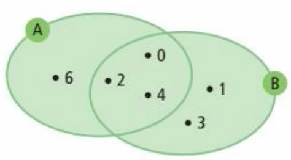

### Símbolos usuais

| Símbolo | Nome | Significado |
|---|---|---|
| $\cup$ | união | $A \cup B = \{x \mid x \in A \text{ ou } x \in B\}$ |
| $\cap$ | interseção | $A \cap B = \{x \mid x \in A \text{ e } x \in B\}$ |
| $\subset$ | contido | $A$ é subconjunto de $B$ |
| $\supset$ | contém | $B$ contém $A$ |
| $\in$ | pertence | o elemento está no conjunto |
| $\notin$ | não pertence | o elemento não está no conjunto |
| $\varnothing$ ou $\{\}$ | conjunto vazio | conjunto sem elementos |

!!! example "Exemplo"
    Se $A = \{0,2,4,6\}$ e $B = \{0,1,2,3,4,5,6\}$, então:

    - $A \cup B = \{0,1,2,3,4,5,6\}$
    - $A \cap B = \{0,2,4,6\}$

A figura seguinte ilustra visualmente essas operações com diagramas de Venn.

??? note "Foto do quadro"
    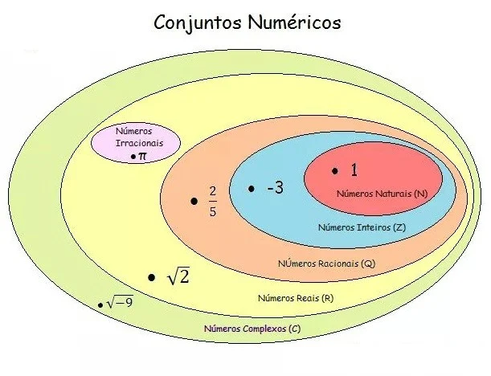

## Expressões Numéricas

Ao resolver uma expressão numérica (uma conta com vários operadores misturados), a ordem das operações segue uma hierarquia fixa, de dentro para fora e da operação "mais forte" para a "mais fraca":

1. Parênteses `()`, depois colchetes `[]`, depois chaves `{}` — resolvendo sempre de dentro para fora.
2. Potências e raízes.
3. Multiplicação e divisão (na ordem em que aparecem, da esquerda para a direita).
4. Soma e subtração (na ordem em que aparecem).

## Expressões Algébricas

### Fatoração

Quando uma expressão algébrica fica complicada de manipular, o melhor caminho costuma ser fatorá-la — reescrevê-la como um produto de termos mais simples. A ideia geral é agrupar termos que compartilham um fator comum e colocá-lo em evidência, repetindo o processo até não ser mais possível simplificar.

!!! example "Exemplos de fatoração por agrupamento"
    **1.** $x^6+2x^4y+x^2y+2y^2$

    $$x^4(x^2+2y) + y(x^2+2y) = (x^4+y)(x^2+2y)$$

    **2.** $x^6+4x^3y+4y^2$

    $$x^6+2x^3y+2x^3y+4y^2 = x^3(x^3+2y) + 2y(x^3+2y) = (x^3+2y)^2$$

    **3.** $x^6-3x^4y+3x^2y^2-y^3$

    $$x^6-x^4y-2x^4y+2x^2y^2+x^2y^2-y^3 = x^4(x^2-y) - 2x^2y(x^2-y) + y^2(x^2-y) = (x^4-2x^2y+y^2)(x^2-y)$$

### Produtos notáveis

Esses são atalhos algébricos que vale a pena memorizar, pois aparecem constantemente em simplificações e em cálculo de limites e derivadas:

| Nome | Fórmula |
|---|---|
| Quadrado da soma | $(x+y)^2 = x^2+2xy+y^2$ |
| Quadrado da diferença | $(x-y)^2 = x^2-2xy+y^2$ |
| Produto da soma pela diferença | $(x+y)(x-y) = x^2-y^2$ |
| Cubo da soma | $(x+y)^3 = x^3+3x^2y+3xy^2+y^3$ |
| Cubo da diferença | $(x-y)^3 = x^3-3x^2y+3xy^2-y^3$ |
| Soma de cubos | $x^3+y^3 = (x+y)(x^2-xy+y^2)$ |
| Diferença de cubos | $x^3-y^3 = (x-y)(x^2+xy+y^2)$ |

### Triângulo de Pascal e Binômio de Newton

O Triângulo de Pascal é uma ferramenta para encontrar rapidamente os coeficientes que aparecem ao expandir uma potência de um binômio $(x+y)^n$, sem precisar multiplicar tudo manualmente. Cada linha corresponde a um valor de $n$, e cada número é a soma dos dois números imediatamente acima dele.

```
N = 0:  1
N = 1:  1  1
N = 2:  1  2  1
N = 3:  1  3  3  1
N = 4:  1  4  6  4  1
N = 5:  1  5  10 10  5  1
N = 6:  1  6  15 20 15  6  1
...
```

Esses coeficientes são exatamente os números $\binom{n}{k}$ do **Binômio de Newton**, a fórmula geral para expandir $(x+y)^n$:

??? note "Foto do quadro"
    

$$\binom{n}{k} = \frac{n!}{(n-k)!\,k!}$$

!!! example "Exemplos"
    **Determine o coeficiente de $x^{15}y^5$ em $(x+2y)^{20}$:**

    $$1^{15} \cdot 2^5 \cdot \binom{20}{5} = 32 \cdot \frac{20!}{15!\,5!} = 496128$$

    **Determine o coeficiente de $x^{17}y^3$ em $(3x+3y)^{20}$:**

    $$3^{17} \cdot 3^3 \cdot \binom{20}{3} = 3^{17} \cdot 3^3 \cdot \frac{20!}{17!\,3!}$$

!!! tip "Importante"
    Em $(x-y)^n$, é o **expoente ímpar** do $y$ que determina qual termo recebe **sinal negativo** na expansão (já que $(-y)^{\text{ímpar}} < 0$ e $(-y)^{\text{par}} > 0$).

## Polinômios

Um polinômio é uma expressão algébrica formada pela soma de monômios (expressões do tipo produto, como $4x^3$). Por exemplo, $p(x) = 4x^3 - x^3 + 2x - 5$ é um polinômio na variável $x$.

Denotamos por $\mathbb{R}[x]$ o conjunto de todos os polinômios na variável $x$ com coeficientes reais:

$$p(x) \in \mathbb{R}[x] \iff p(x) = a_0x^0 + a_1x + a_2x^2 + \dots + a_nx^n$$

!!! example "Exemplo"
    $p(x) = x^4 + x^3 + 3x^2 + 0x + 0$ tem coeficientes $(1,1,3,0,0)$, representados abaixo:

    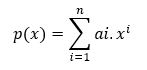

### Grau do polinômio

O **grau** de um polinômio é sempre o maior expoente que aparece nele (com coeficiente não nulo):

- $r(x) = -2x \Rightarrow \text{grau}(r) = 1$
- $q(x) = 2 \Rightarrow \text{grau}(q) = 0$
- $p(x) = 5x^5 + 2 \Rightarrow \text{grau}(p) = 5$

### Operações com polinômios

**Adição.** Somamos os coeficientes de mesmo grau: se

$$p(x) = a_0 + a_1x + a_2x^2 + \dots + a_nx^n \quad \text{e} \quad q(x) = b_0 + b_1x + b_2x^2 + \dots + b_nx^n,$$

então

$$p(x) + q(x) = (a_0+b_0) + (a_1+b_1)x + (a_2+b_2)x^2 + \dots + (a_n+b_n)x^n.$$

**Multiplicação.** Multiplicamos cada termo de $p(x)$ por cada termo de $q(x)$, somando os expoentes ("chuveirinho"), de modo que o coeficiente do termo de grau $k$ no produto é a soma de todos os $a_ib_j$ com $i+j=k$:

$$p(x) \cdot q(x) = (a_0b_0) + (a_1b_0 + a_0b_1)x + (a_2b_0 + a_1b_1 + a_0b_2)x^2 + \dots$$

!!! example "Exemplo"
    Sejam $p(x) = x^3 + 2x$ e $q(x) = 3x^2 + x + 2$. Multiplicando termo a termo:

    $$p(x)\cdot q(x) = 2\cdot 2x + x\cdot 2x + 2\cdot x^3 + 3x^2\cdot 2x + x\cdot x^3 + 3x^2\cdot x^3$$

    $$= 4x + 2x^2 + 2x^3 + 6x^3 + x^4 + 3x^5 = 3x^5 + x^4 + 8x^3 + 2x^2 + 4x$$

Note que $\text{grau}(p \cdot q) = \text{grau}(p) + \text{grau}(q)$. Se $\text{grau}(p) \neq \text{grau}(q)$, para a **soma** $p+q$ vale $\text{grau}(p+q) = \max\big(\text{grau}(p), \text{grau}(q)\big)$.

**Algoritmo da divisão.** Sejam $a(x), d(x) \in \mathbb{R}[x]$ com $d(x) \neq 0$. Existem únicos $q(x), r(x) \in \mathbb{R}[x]$ tais que

$$a(x) = d(x)\cdot q(x) + r(x), \qquad \text{com } r(x) = 0 \text{ ou } \text{grau}(r) < \text{grau}(d),$$

onde $d(x)$ é o divisor, $q(x)$ é o quociente e $r(x)$ é o resto.

!!! example "Exemplo"
    Dividindo $p(x) = 2x^4 - 3x^2 + x - 2$ por $d(x) = x^2 - x + 1$:

    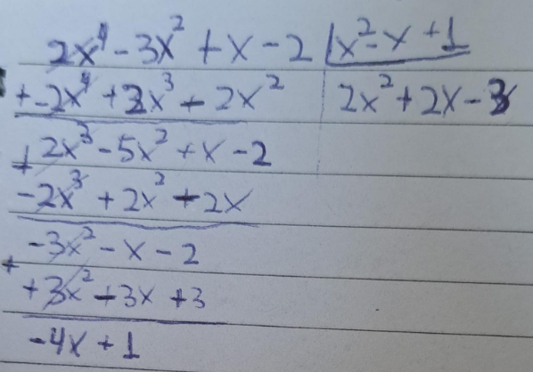

    Resultado: $q(x) = 2x^2 + 2x - 3$ e $r(x) = -4x + 1$.

### Raízes de polinômio

Sejam $p(x) \in \mathbb{R}[x]$ um polinômio não nulo e $a \in \mathbb{R}$. Dizemos que $x = a$ é uma **raiz** de $p(x)$ se $p(a) = 0$.

!!! example "Exemplo"
    Para $p(x) = x^4 - 4x^2 + 2x + 1$, temos que $x=1$ é raiz (pois $p(1)=0$), mas $x=0$ não é.

    Dividindo $p(x) = x^4 - 4x^2 + 2x + 1$ por $d(x) = x - 1$:

    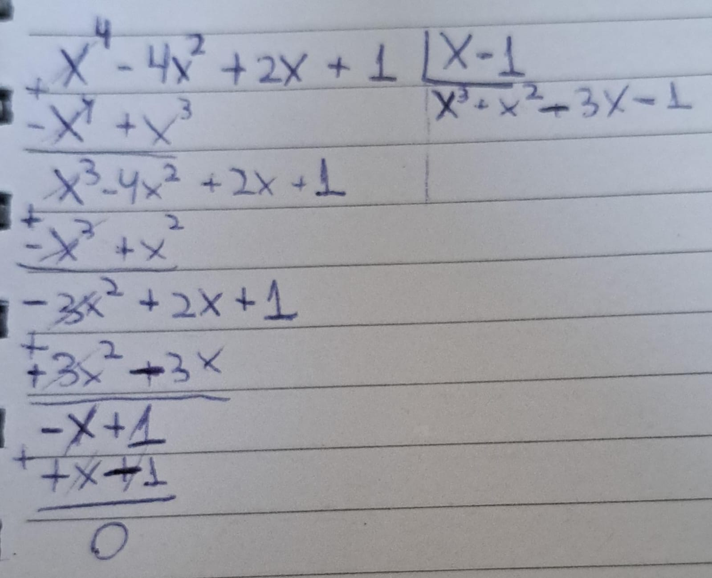

    O resto é $r(x) = 0$ e o quociente é $q(x) = x^3+x^2-3x-1$, logo $p(x) = (x^3+x^2-3x-1)(x-1)$ — confirmando que $x-1$ é fator de $p(x)$.

### Raiz $x=a$ versus divisão por $x-a$

Dividindo $p(x) \in \mathbb{R}[x]$ por $x-a$, obtemos $q(x)$ e $r(x)$ tais que

$$p(x) = q(x)\cdot(x-a) + r(x),$$

com $r(x)=0$ ou $\text{grau}(r) < \text{grau}(x-a) = 1$, isto é, $r(x)$ é uma **constante**. Avaliando em $x=a$: $p(a) = r(a) = r(x)$ (já que $r$ é constante). Logo:

$$p(x) = q(x)\cdot(x-a) + p(a).$$

Desse resultado seguem duas conclusões importantes:

- $p(a) = 0 \iff (x-a)$ divide $p(x)$.
- O resto da divisão de $p(x)$ por $(x-a)$ é exatamente $p(a)$ — não é preciso fazer a divisão completa só para saber o resto.

!!! example "Exemplo"
    $p(x) = x^5 - 4 = (x^4+x^3+x^2+x+1)(x-1) - 3$, com $p(1) = -3$.

### Dispositivo de Briot-Ruffini

O dispositivo de Briot-Ruffini é um algoritmo prático para dividir um polinômio por um **binômio** do tipo $x - a$, muito mais rápido do que a divisão polinomial tradicional.

!!! example "Exemplo: dividir $p(x) = 3x^3+2x^2+x+5$ por $d(x)=x+1$"
    **1.** Desenhamos dois segmentos de reta, um horizontal e outro vertical:

    

    **2.** Colocamos os coeficientes de $p(x)$ acima do segmento horizontal, à direita do vertical, repetindo o primeiro coeficiente na linha de baixo. À esquerda do vertical colocamos a raiz do binômio (igualando o divisor a zero: $x+1=0 \Rightarrow x=-1$):

    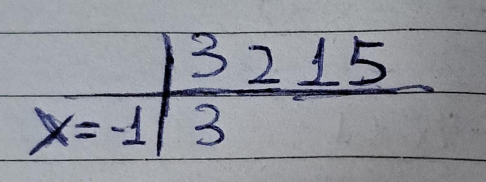

    **3.** Multiplicamos a raiz pelo coeficiente mais recente da linha de baixo, somamos ao próximo coeficiente de cima, e repetimos até o fim:

    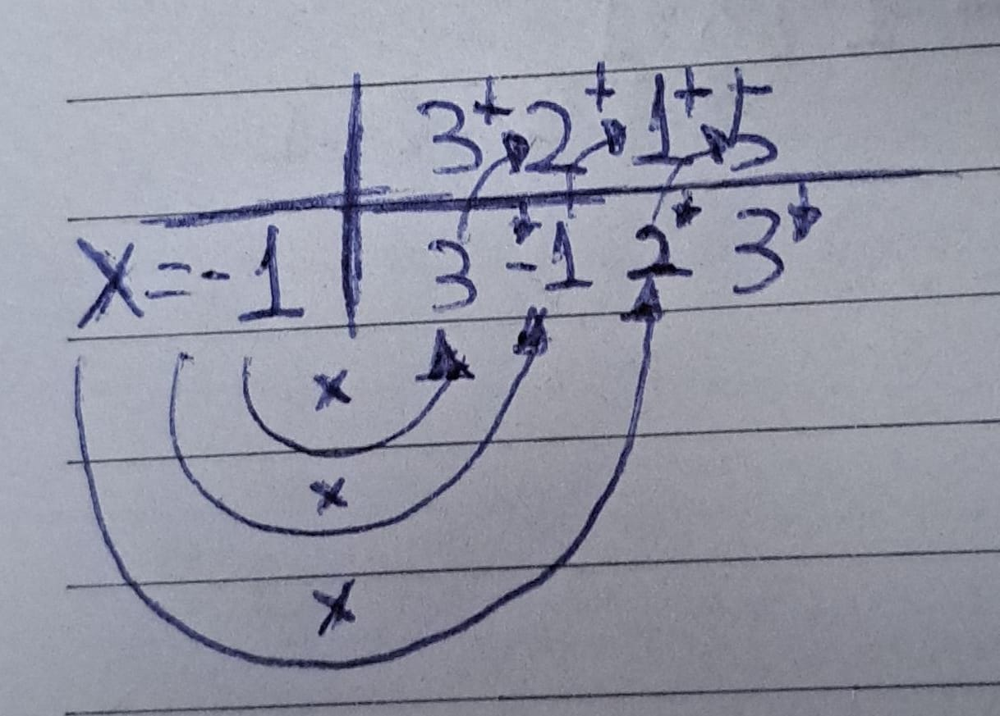

    **Lendo o resultado:** na parte inferior, à direita do traço vertical, ficam o quociente e, no último número, o resto. Como $\text{grau}(p)=3$ e $\text{grau}(d)=1$, temos $\text{grau}(q) = 3-1 = 2$, logo $q(x) = 3x^2 - x + 2$ e $r(x) = 3$.

    Verificando com o algoritmo da divisão: $3x^3+2x^2+x+5 = (x+1)(3x^2-x+2) + 3$. ✓

## Funções

Uma **função** é uma associação entre elementos de dois conjuntos: uma função de $A$ em $B$ associa a **cada** elemento de $A$ um **único** elemento de $B$. Nessa notação $f: A \to B$, o conjunto $A$ é o **domínio** e $B$ é o **contradomínio**. Cada elemento de $B$ que de fato é associado a algum elemento de $A$ é chamado de **imagem**; reunindo todas as imagens obtemos o **conjunto imagem**, que é um subconjunto do contradomínio. No gráfico de uma função, $f(x)$ representa o eixo $y$.

!!! example "Exemplo"
    Sejam $A=\{1,2,3,4\}$, $B=\{1,2,3,4,5,6,7,8\}$ e $f:A\to B$ dada por $f(x)=2x$. Então:

    $$\text{Domínio} = \{1,2,3,4\}, \quad \text{Contradomínio} = \{1,2,3,4,5,6,7,8\}, \quad \text{Imagem} = \{2,4,6,8\}$$

### Tipos de função

**Função composta.** Dadas duas funções $f$ e $g$, podemos combiná-las compondo uma dentro da outra, denotada por $f \circ g$ ou $g \circ f$:

$$(f\circ g)(x) = f(g(x)) \qquad \text{e} \qquad (g\circ f)(x) = g(f(x))$$

**Função constante.** $f(x) = C$, com $C \in \mathbb{R}$. Seu gráfico é uma reta horizontal:

??? note "Foto do quadro"
    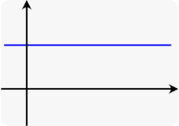

**Função do 1º grau (função afim).** $f(x) = ax+b$, com $a,b \in \mathbb{R}$ e $a \neq 0$.

??? note "Foto do quadro"
    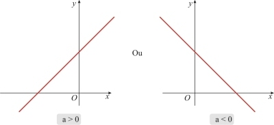

O coeficiente $a$ é a inclinação da reta (coeficiente angular), relacionado ao ângulo $\theta$ que a reta forma com o eixo $x$ por $a = \tan(\theta)$.

*Interseções com os eixos:*

- Eixo $y$: $x=0 \Rightarrow y=b$
- Eixo $x$: $y=0 \Rightarrow ax+b=0 \Rightarrow x = -b/a$ (raiz ou zero da função)

!!! note "Caso especial: função linear"
    Quando $f(x) = ax$ (ou seja, $b=0$), chamamos de função linear. Se além disso $a=1$, temos a **função identidade** $f(x) = x$.

**Função do 2º grau (função quadrática).** $f(x) = ax^2+bx+c$. As raízes são encontradas pela fórmula de Bhaskara. O gráfico é uma parábola:

??? note "Foto do quadro"
    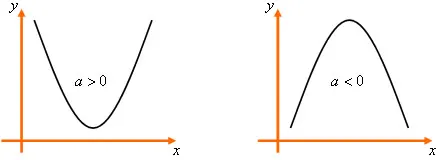

- $a>0 \Rightarrow$ concavidade para cima
- $a<0 \Rightarrow$ concavidade para baixo

??? note "Foto do quadro"
    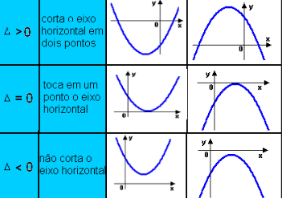

Aqui $\Delta$ (discriminante) determina quantas interseções a parábola tem com o eixo $x$.

*Interseções com os eixos:*

- Eixo $y$: $x=0 \Rightarrow y=c$
- Eixo $x$: $y=0 \Rightarrow$ fórmula de Bhaskara

*Vértice da parábola* (ponto de mínimo ou máximo):

$$x_v = \frac{-b}{2a} = \frac{x_1+x_2}{2} \qquad (x_1, x_2 \text{ são as raízes})$$

$$y_v = f(x_v) = \frac{-\Delta}{4a}$$

!!! example "Exemplo"
    Para $f(x) = x^2-4x+3$: $a>0$, $c=3$, raízes $x_1=1$ e $x_2=3$, vértice $x_v=2$, $y_v=-1$.

**Função exponencial.** $f(x) = a^x$. Quando $x$ aumenta, a imagem também aumenta (para $a>1$).

**Função logarítmica.** $f(x) = \log_a x$, com $a$ real, positivo e $a \neq 1$. A função logarítmica é a **inversa** da função exponencial.

!!! note "Funções invertíveis"
    Uma função $f: A \to B$ é invertível se existe $g: B \to A$ tal que $g = f^{-1}$. Nesse caso, o domínio $A$ de $f$ se torna o contradomínio de $g$, e o contradomínio $B$ de $f$ se torna o domínio de $g$.

### Operações com funções

$$(f+g)(x) = f(x)+g(x) \qquad (f-g)(x) = f(x)-g(x)$$

$$(kf)(x) = k\cdot f(x) \qquad (f\cdot g)(x) = f(x)\cdot g(x)$$

Para a divisão, o domínio resultante é $D = D(f)\cap D(g)$ (excluindo onde $g(x)=0$):

$$\left(\frac{f}{g}\right)(x) = \frac{f(x)}{g(x)}$$

??? note "Foto do quadro"
    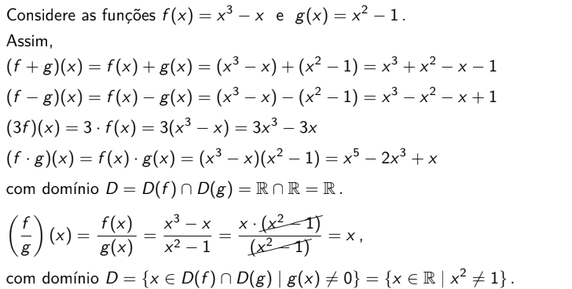

### Composição de funções

Dadas duas funções $f$ e $g$, a composição de $f$ com $g$ é denotada por $f\circ g$, tal que $(f\circ g)(x) = f(g(x))$.

## Limites

O **limite** é a ferramenta central do Cálculo: seu objetivo é determinar o comportamento de uma função $f(x)$ à medida que $x$ se aproxima de um determinado valor — mesmo que $f$ não esteja definida exatamente nesse ponto.

!!! example "Exemplos"
    **$f(x) = x+1$:**

    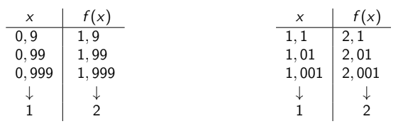

    À medida que $x$ se aproxima de $1$, o valor de $f(x)$ se aproxima de $2$.

    **$f(x) = x^3 - 1$:**

    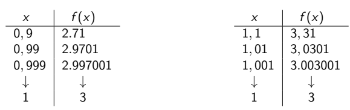

    À medida que $x$ se aproxima de $1$, o valor de $f(x)$ se aproxima de $3$.

### Definição intuitiva

Seja $f(x)$ uma função definida perto do ponto $a \in \mathbb{R}$ (mas não necessariamente em $a$). Dizemos que $L \in \mathbb{R}$ é o limite de $f$ quando $x$ tende a $a$ se, tornando $x$ suficientemente próximo de $a$ (mas não igual a $a$), os valores de $f(x)$ ficam tão próximos de $L$ quanto quisermos. O limite de $f$ quando $x \to a$ **não depende** do valor de $f$ no ponto $a$ (ele pode nem existir ali). A notação é:

??? note "Foto do quadro"
    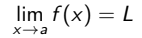

$$\lim_{x\to a} f(x) = L$$

??? example "Exemplo"
    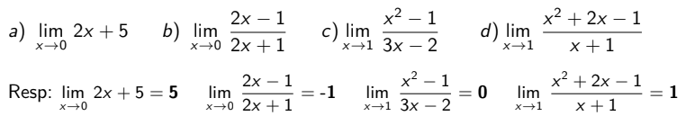

### Propriedades dos limites

As propriedades a seguir permitem calcular limites de combinações de funções a partir dos limites das partes (soma, produto, quociente, potência etc.), desde que os limites individuais existam. Sejam $f$ e $g$ funções, $a\in\mathbb{R}$, e suponha que $\lim_{x\to a}f(x)=L$ e $\lim_{x\to a}g(x)=M$. Então:

1. $\lim_{x\to a}[f(x)+g(x)] = \lim_{x\to a}f(x)+\lim_{x\to a}g(x) = L+M$;
2. $\lim_{x\to a}[\lambda\cdot f(x)] = \lambda\cdot\lim_{x\to a}f(x) = \lambda\cdot L$, onde $\lambda\in\mathbb{R}$ é uma constante;
3. $\lim_{x\to a}[f(x)\cdot g(x)] = \lim_{x\to a}f(x)\cdot\lim_{x\to a}g(x) = L\cdot M$;
4. $\lim_{x\to a}\left[\dfrac{f(x)}{g(x)}\right] = \dfrac{\lim_{x\to a}f(x)}{\lim_{x\to a}g(x)} = \dfrac{L}{M}$, quando $M\neq0$.

??? note "Foto do quadro"
    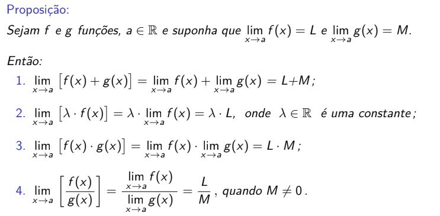

??? example "Exemplos de aplicação"
    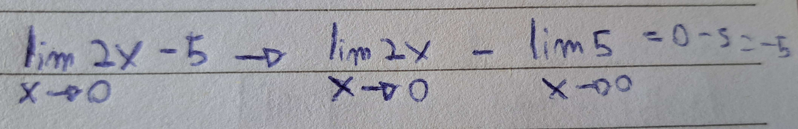
    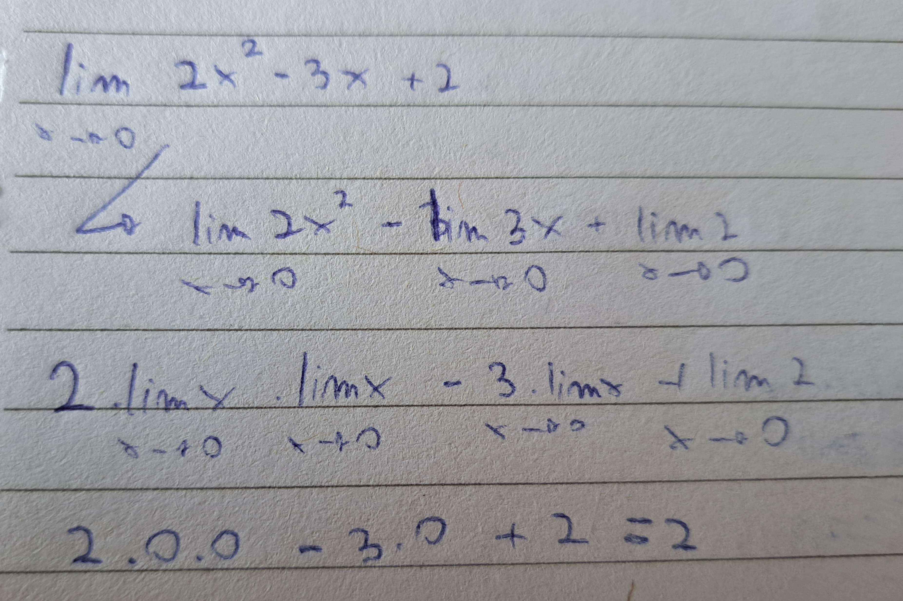
    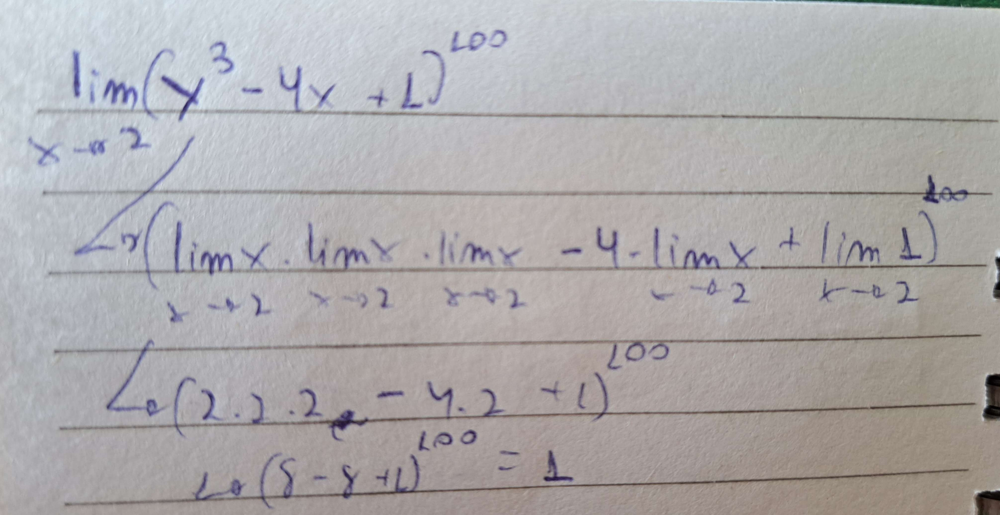
    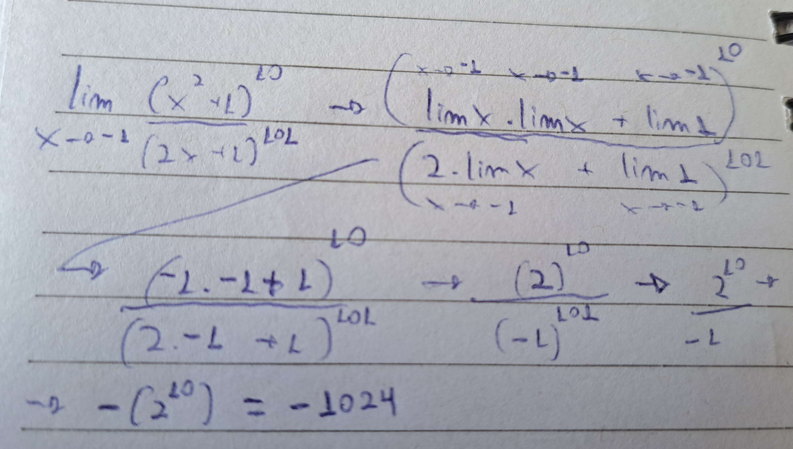
    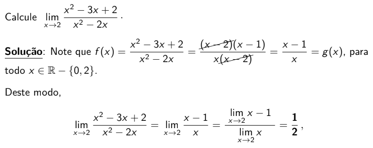
    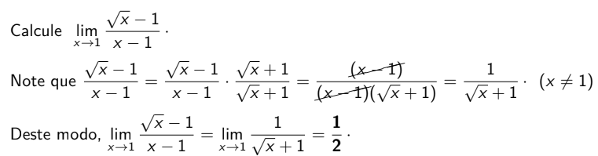
    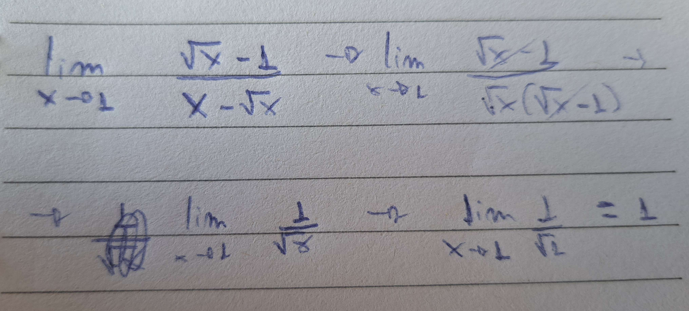

### Limites laterais

Às vezes o comportamento de $f(x)$ é diferente conforme nos aproximamos de $a$ "pela esquerda" (valores menores que $a$) ou "pela direita" (valores maiores que $a$).

**Limite lateral pela esquerda** 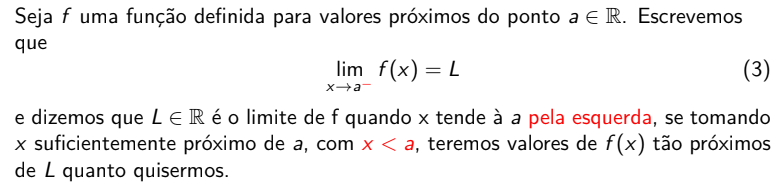

??? note "Foto do quadro"
    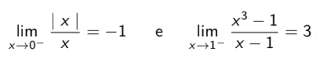

**Limite lateral pela direita** 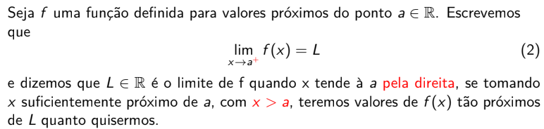

??? note "Foto do quadro"
    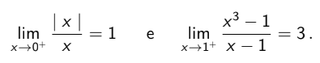

??? example "Exemplo"
    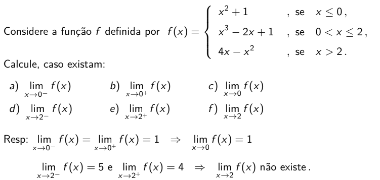

Uma função $f$ possui limite em $a$ **se e somente se** o limite lateral pela esquerda é igual ao limite lateral pela direita:

??? note "Foto do quadro"
    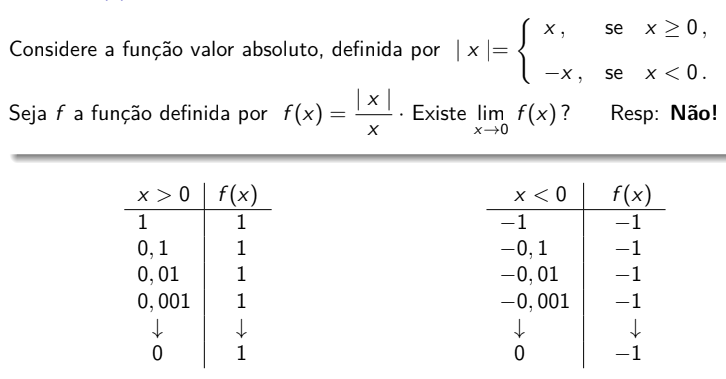

$$\lim_{x\to a} f(x) = L \iff \lim_{x\to a^-} f(x) = \lim_{x\to a^+} f(x) = L$$

### Limites e continuidade

??? note "Foto do quadro"
    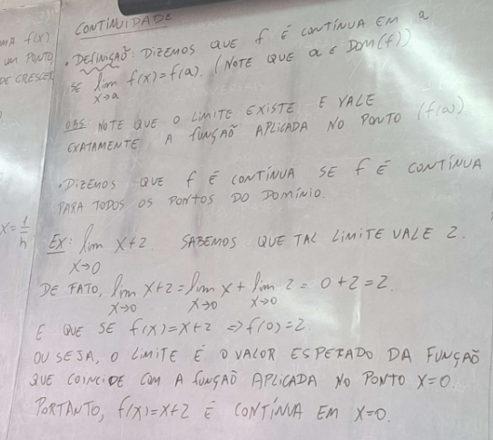

??? example "Exemplo"
    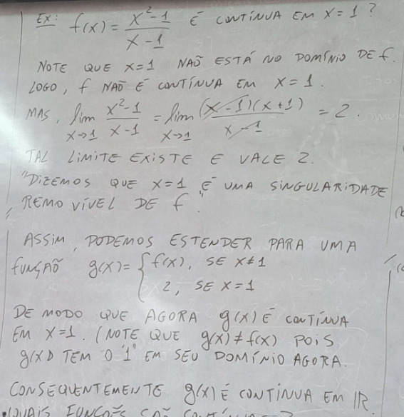

??? note "Foto do quadro"
    

??? note "Foto do quadro"
    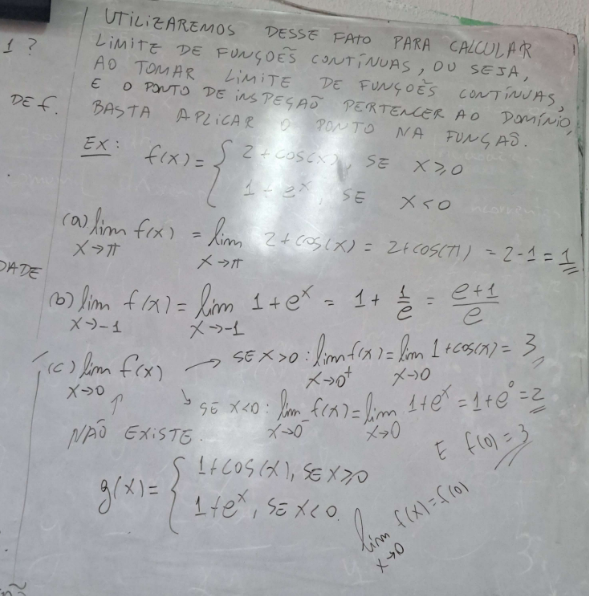

No item (c) acima, os limites laterais são diferentes, logo não existe o limite naquele ponto; nesses casos, muitas vezes é preciso manipular algebricamente a expressão para conseguir calcular (ou mostrar a inexistência de) um limite.

**Propriedades (funções contínuas).** Se $f,g$ são funções contínuas em $a$, então:

(a) $(f+g)$ e $(f-g)$ são contínuas em $a$;
(b) $(\lambda f)$, com $\lambda\in\mathbb{R}$, é contínua em $a$;
(c) $\dfrac{f}{g}$ é contínua em $a$ quando $g(a)\neq0$.

**Proposição.** Se $f$ é contínua, então $\lim_{x\to x_0} f(g(x)) = f\left(\lim_{x\to x_0} g(x)\right)$, quando $\lim_{x\to x_0}g(x) = a$ (existir) e $a\in\text{Dom}(f)$.

!!! example "Exemplo"
    $$\lim_{x\to1}\sqrt{\frac{x^2-1}{x-1}} = \sqrt{\lim_{x\to1}\frac{x^2-1}{x-1}} = \sqrt2$$

??? note "Foto do quadro"
    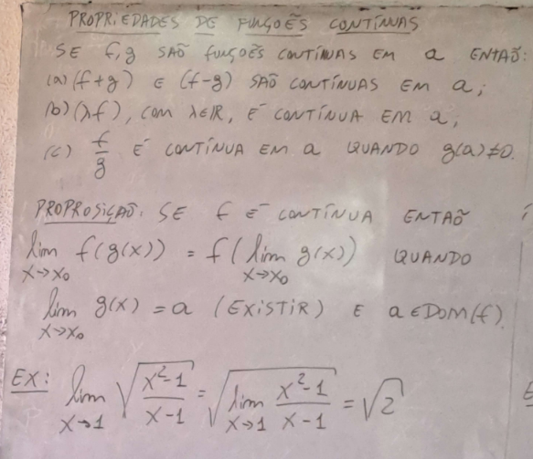

### Limites no infinito

Além de analisar o que ocorre quando $x$ se aproxima de um número finito, também interessa saber o que acontece com $f(x)$ quando $x \to +\infty$ ou $x \to -\infty$ — este é o comportamento assintótico da função, essencial para esboçar gráficos.

??? note "Fotos do quadro"
    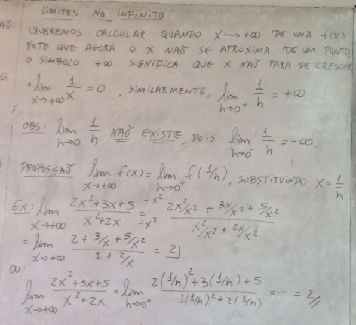
    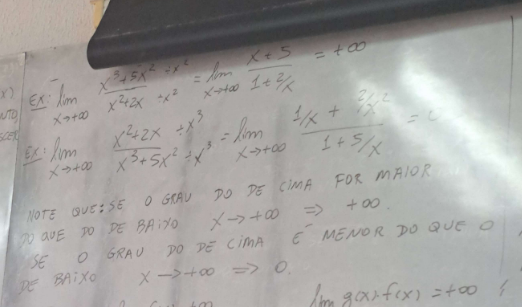

**Propriedades.**

- Se $\lim_{x\to+\infty}f(x)=+\infty$ e $\lim_{x\to+\infty}g(x)=M\neq0$ (finito), então $\lim_{x\to+\infty}[f(x)+g(x)]=+\infty$.
- Se $\lim_{x\to+\infty}f(x)=+\infty$ e $\lim_{x\to+\infty}g(x)=M\neq0, M>0$, então $\lim_{x\to+\infty}[g(x)\cdot f(x)]=+\infty$; se $M<0$, o produto tende a $-\infty$.
- Se $\lim_{x\to+\infty}f(x)=+\infty$ e $\lim_{x\to+\infty}g(x)=-\infty$, então $\lim_{x\to+\infty}[f(x)+g(x)]$ é **indeterminado** ($\infty-\infty$).
- Se $\lim_{x\to+\infty}f(x)=+\infty$ e $\lim_{x\to+\infty}g(x)=0$, então $\lim_{x\to+\infty}[f(x)\cdot g(x)]$ é **indeterminado** ($\infty\cdot0$).

??? note "Foto do quadro"
    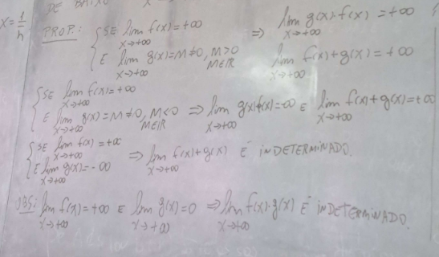

## O problema da reta tangente

??? note "Foto do quadro"
    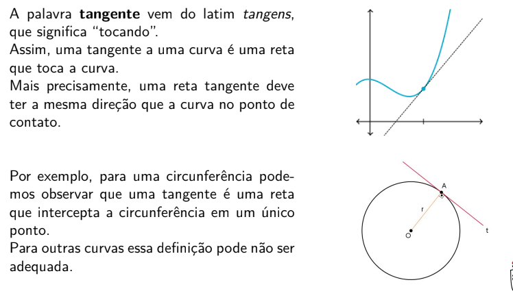

A derivada nasce de um problema geométrico: como encontrar a equação da reta que toca o gráfico de uma função em um único ponto, sem cruzá-lo — a **reta tangente**.

!!! example "Exemplo: reta tangente a $f(x)=4x-x^2$ em $x=1$"
    O ponto de tangência é $P = (1, f(1))$, com $f(1) = 4-1 = 3$, logo $P=(1,3)$.

    A equação de uma reta por $P$ é $y - y_0 = m(x-x_0)$, com $x_0=1$ e $y_0=3$:

    $$y = m(x-1) + 3$$

    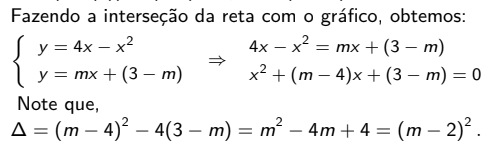

    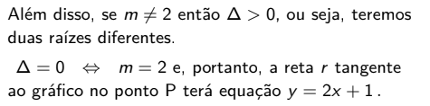

    Se $\Delta = 0$ ao substituir a reta na parábola, a reta toca o gráfico em um único ponto — exatamente a condição que caracteriza a tangência.

!!! example "Exemplo: reta tangente a $f(x)=x^3$ em $P=(1,1)$"
    Equação da reta por $P(1,1)$: $y = m(x-1)+1$.

    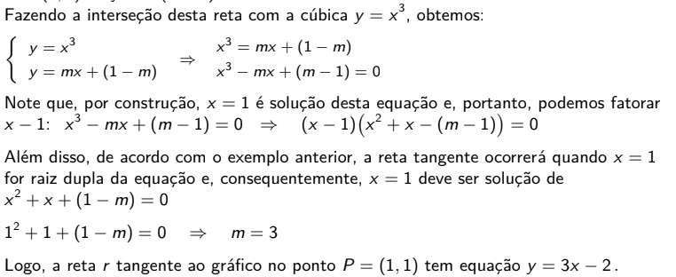

    **Outra forma de resolver**, usando diretamente $m = \dfrac{y-y_0}{x-x_0}$:

    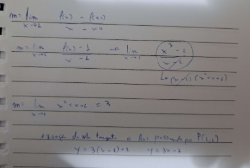

!!! example "Exemplo: reta tangente a $f(x)=x^2-3x$ em $P=(1,-2)$"
    Equação da reta: $y+2 = m(x-1)$.

    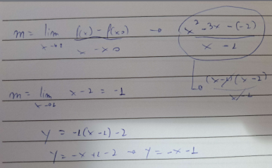

### A reta tangente como limite de retas secantes

A ideia mais poderosa (e que generaliza para qualquer função) é pensar a reta tangente como o **limite** de retas secantes: traçamos uma reta ligando o ponto de tangência a outro ponto próximo do gráfico, e fazemos esse segundo ponto se aproximar cada vez mais do primeiro.

??? note "Foto do quadro"
    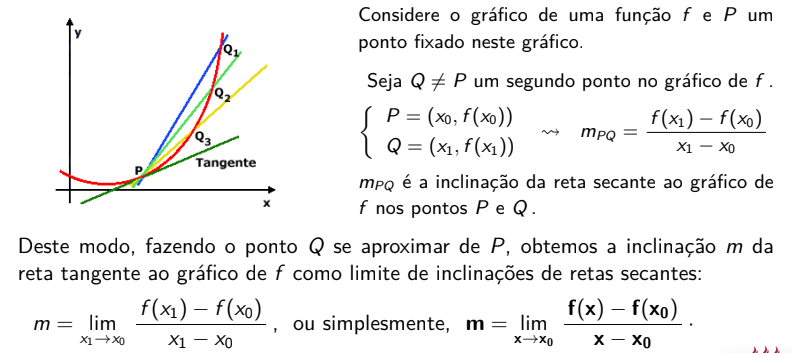

!!! example "Exemplos"
    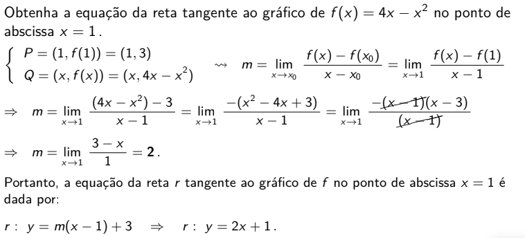

    **Reta tangente a $f(x)=x^3$ em $P=(1,1)$:**

    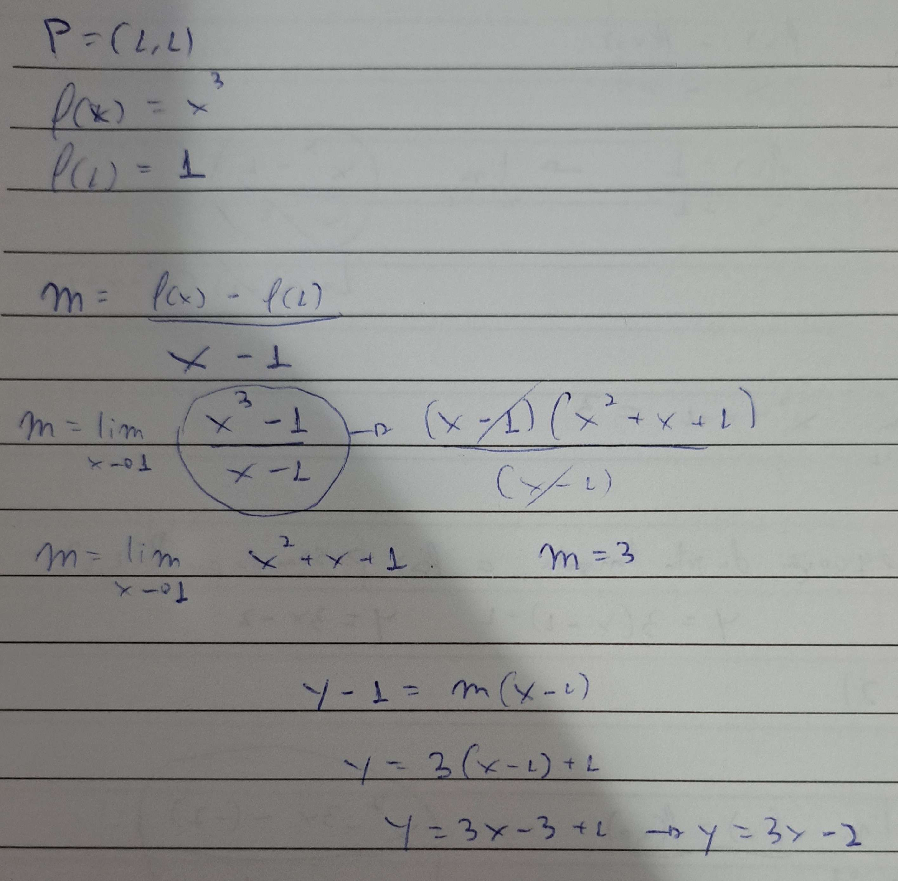

    **Reta tangente a $f(x)=x^3-4x$ em $P=(1,-2)$:**

    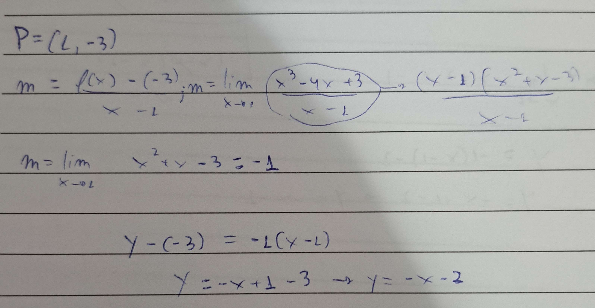

### Derivada

**Definição.** A derivada de $f$ no ponto $x_0$ é o coeficiente angular $m$ dessa reta tangente, obtido como o limite das inclinações das retas secantes quando o incremento $h$ tende a $0$ (conceito de derivada "pela direita"):

??? note "Foto do quadro"
    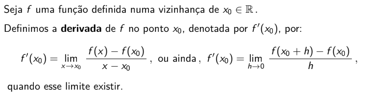

??? note "Foto do quadro"
    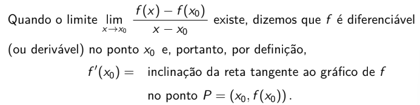

Ou seja, a derivada é igual ao coeficiente $m$; porém, ela é denotada $f'(x_0)$.

!!! example "Exemplos"
    **Derivada de $f(x)=x^2$ em $x_0=0$:**

    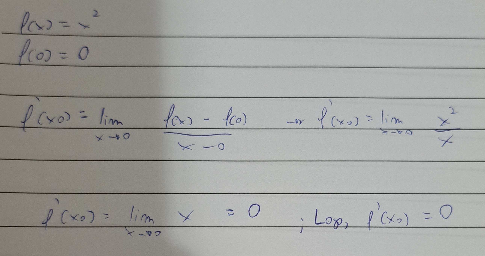

    **Derivada de $f(x)=x^4-3x+5$ em $x_0=1$:**

    

**Função derivada.** Em vez de calcular a derivada em um ponto fixo, podemos deixar $x_0$ genérico e obter uma nova função $f'(x)$, que associa a cada ponto do domínio a inclinação da reta tangente ali:

??? note "Foto do quadro"
    

Aqui também $h$ sempre tende a $0$. É a função derivada $f'(x)$ que fornece a inclinação da reta tangente ao gráfico de $f$ em qualquer ponto.

**Derivadas de funções elementares.**

a) $f(x)=1 \rightsquigarrow f'(x)=0$

b) $f(x)=2x-1 \rightsquigarrow f'(x)=2$

c) $f(x)=x^2 \rightsquigarrow f'(x)=2x$

d) $f(x)=x^5 \rightsquigarrow f'(x)=5x^4$

e) $f(x)=x^\pi \rightsquigarrow f'(x)=\dfrac{\pi x^\pi}{x}$

f) $f(x)=\sqrt{x} \rightsquigarrow f'(x)=\dfrac{1}{2\sqrt{x}}$

Em qualquer item acima, $f'(1)$ é a inclinação da reta tangente ao gráfico de $f$ no ponto $(1,1)$.

??? note "Foto do quadro"
    

!!! example "Exemplos"
    **Item (b):** 

    **Item (f):** 

### Regras de derivação

**Regra do tombo** (regra da potência): para derivar $x^n$, "desce" o expoente como coeficiente e subtrai $1$ dele.

$$f(x) = x^N \quad \Rightarrow \quad f'(x_0) = Nx_0^{N-1}$$

??? note "Foto do quadro"
    

??? example "Exemplos"
    
    
    
    

**Outras regras.** Sejam $f,g:(a,b)\to\mathbb{R}$ duas funções definidas no intervalo $(a,b)$. Então:

1. $[f(x)+g(x)]' = f'(x)+g'(x)$ e $[f(x)-g(x)]' = f'(x)-g'(x)$;
2. $[\lambda\cdot f(x)]' = \lambda\cdot f'(x)$, para $\lambda\in\mathbb{R}$ um número real fixado;
3. **Regra do produto:** $[f(x)\cdot g(x)]' = f'(x)\cdot g(x) + f(x)\cdot g'(x)$;
4. **Regra do quociente:** $\left[\dfrac{f(x)}{g(x)}\right]' = \dfrac{f'(x)\cdot g(x) - f(x)\cdot g'(x)}{(g(x))^2}$, nos pontos em que $g(x)\neq0$.

Também vale lembrar que a derivada de uma constante é sempre $0$: $(c)'=0$.

??? note "Fotos do quadro"
    
    

**Regra da cadeia (ou regra da função composta).** Considere o problema de derivar $y = (x^3+2)^4$:

??? note "Foto do quadro"
    

Atribuímos $u = x^3+2$, de modo que $y = u^4$:

??? note "Foto do quadro"
    

$$\underbrace{\frac{dy}{du}}_{\text{derivada externa}} \cdot \underbrace{\frac{du}{dx}}_{\text{derivada interna}} = \underbrace{\frac{dy}{dx}}_{\text{derivada total}}$$

Em outras palavras: $y' = f'(u)\cdot u'$.

!!! tip "Observação"
    Sempre que possível, transforme a raiz em uma potência antes de derivar (ex.: $\sqrt{x} = x^{1/2}$) — isso simplifica bastante a aplicação das regras.

!!! example "Exemplos"
    **Derivada de $f(x) = 4x^3-2x+5$:**

    

    **Derivada de $f(x) = \dfrac{2x-3}{1-x}$:**

    

    **Derivada de $f(x) = \dfrac{(x^2+1)^5}{x^3+x+1}$:**

    

    **Derivada de $f(x) = (x^3+2)^{100}$:**

    

    **Encontre $P$ e $Q$ pertencentes a $g(x) = 2x^3-3x^2-3x$ onde as retas tangentes sejam paralelas a $y=3x-2$:**

    Se as retas tangentes de $g(x)$ são paralelas a $y$, e o coeficiente angular (derivada) de $y$ é $3$, então $[g(x)]' = 3$:

    $$[g(x)]' = 6x^2 - 6x - 3 = 3 \;\Rightarrow\; x^2-x-1 = 0$$

    Resolvendo por Bhaskara:

    

    Portanto, os pontos $P$ e $Q$ são:

    

## Trigonometria

A trigonometria entra em Cálculo 1 principalmente para derivar e integrar funções como $\sin x$, $\cos x$ e $\tan x$ — mas antes disso vale revisar as relações básicas do triângulo retângulo e do círculo trigonométrico.

### Relações métricas e trigonométricas no triângulo retângulo

As relações métricas relacionam os lados (cateto oposto, cateto adjacente e hipotenusa) de um triângulo retângulo entre si (incluindo o Teorema de Pitágoras):

??? note "Foto do quadro"
    

Já as relações trigonométricas relacionam esses lados aos ângulos internos do triângulo (seno, cosseno, tangente):

??? note "Foto do quadro"
    

### Arcos notáveis

Os arcos notáveis ($30°$, $45°$ e $60°$, ou $\pi/6$, $\pi/4$ e $\pi/3$ em radianos) têm valores de seno, cosseno e tangente que vale a pena memorizar, pois aparecem o tempo todo:

??? note "Foto do quadro"
    

### Aplicações

??? note "Foto do quadro"
    

### Círculo trigonométrico

O círculo trigonométrico (círculo de raio $1$ centrado na origem) é a ferramenta que generaliza seno e cosseno para qualquer ângulo, não só os de um triângulo retângulo — incluindo ângulos negativos ou maiores que $90°$.

??? note "Foto do quadro"
    

??? note "Foto do quadro"
    

Por convenção, o 1º quadrante é o superior direito e o 4º quadrante é o inferior direito (seguindo o sentido anti-horário a partir do eixo $x$ positivo).

### Funções trigonométricas

??? note "Fotos do quadro"
    
    

**Gráficos:**

=== "Seno"
    

=== "Cosseno"
    

=== "Tangente"
    

### Identidades trigonométricas

As identidades trigonométricas são igualdades que valem para todo ângulo (dentro do domínio), fundamentais para simplificar expressões antes de derivar, integrar ou calcular limites trigonométricos:

??? note "Fotos do quadro"
    
    
    
    
    
    
    
    
    

### Teorema do confronto

O Teorema do Confronto (ou *squeeze theorem*) diz que se $g(x) \le f(x) \le h(x)$ perto de $a$, e $\lim_{x\to a} g(x) = \lim_{x\to a} h(x) = L$, então $\lim_{x\to a} f(x) = L$ também — a função $f$ fica "espremida" entre $g$ e $h$ e é forçada a convergir para o mesmo limite. É exatamente essa ideia que permite demonstrar o limite trigonométrico fundamental abaixo.

??? note "Foto do quadro"
    

### Limite trigonométrico fundamental

??? note "Foto do quadro"
    

!!! example "Exemplos"
    

     — outro limite trigonométrico fundamental.

     — outro limite trigonométrico fundamental.

    

    

    

### Derivadas de funções trigonométricas

??? note "Foto do quadro"
    

??? note "Demonstração"
    

??? note "Foto do quadro"
    

??? note "Demonstração"
    

??? note "Foto do quadro"
    

??? note "Demonstração"
    

??? note "Foto do quadro"
    

??? note "Demonstração"
    

??? note "Foto do quadro"
    

??? note "Demonstração"
    

??? note "Foto do quadro"
    

??? note "Demonstração"
    

**Tabela para decorar:**

| $f(x)$ | $f'(x)$ |
|---|---|
| $\text{sen}(x)$ | $\cos(x)$ |
| $\cos(x)$ | $-\text{sen}(x)$ |
| $\text{tg}(x)$ | $\sec^2(x)$ |
| $\text{cotg}(x)$ | $-\text{cossec}^2(x)$ |
| $\sec(x)$ | $\text{tg}(x)\sec(x)$ |
| $\text{cossec}(x)$ | $-\text{cotg}(x)\,\text{cossec}(x)$ |

??? note "Foto do quadro"
    

### Outras derivadas importantes

**Derivada da função $e^x$.** O número de Euler (ou de Neper), $e \cong 2{,}718281828459045$, é definido pelo **Limite Exponencial Fundamental**: $\lim_{x\to+\infty}\left(1+\dfrac1x\right)^x = e$, equivalente ao limite $\lim_{h\to0}\dfrac{e^h-1}{h}=1$. Usando essa equivalência para derivar $e^x$ pela definição:

$$[e^x]' = \lim_{h\to0}\frac{e^{x+h}-e^x}{h} = \lim_{h\to0}\frac{e^xe^h-e^x}{h} = \lim_{h\to0}\frac{e^x(e^h-1)}{h} = e^x\lim_{h\to0}\frac{e^h-1}{h} = e^x\cdot1 = e^x$$

$$\boxed{[e^x]' = e^x}$$

??? note "Fotos do quadro"
    
    
    

Se $x$ é uma função derivável, então $[e^x]' = x' \cdot e^x$.

**Derivada da função $\ln(x)$ (logaritmo natural de $x$).** Considere a função $\ln(x) \overset{\text{def}}{=} \log_e(x)$, definida para $x>0$. Mostra-se que:

$$\boxed{[\ln(x)]' = \frac{1}{x}}$$

??? note "Foto do quadro"
    

Se $x$ é uma função derivável, então $[\ln(x)]' = x' \cdot \dfrac{1}{x}$.

!!! note "Observação sobre $\ln(x)$"
    $\ln(x)$ é o logaritmo natural de $x$, ou seja, $\log_e(x)$. Por exemplo, $\ln(1) = \log_e(1) = 0$, pois existe $x$ tal que $e^x = 1$ (nesse caso, $x=0$).

**Derivada de uma constante elevada a uma função ($a^x$).**

$$\boxed{[a^x]' = a^x\ln(a)}$$

??? note "Foto do quadro"
    

!!! example "Exemplos"
    

    Se $x$ é uma função derivável, então $[a^x]' = x' \cdot a^x \cdot \ln(a)$.

    

**Derivada de uma função elevada a outra função** (requer derivação logarítmica):

$$\boxed{\left[f(x)^{g(x)}\right]' = f(x)^{g(x)} \cdot \frac{d}{dx}\Big[g(x)\ln\big(f(x)\big)\Big]}$$

??? note "Foto do quadro"
    

??? example "Exemplo"
    

**Derivada de logaritmo em base genérica.**

$$\boxed{[\log_a(x)]' = \frac{1}{\ln(a)}\cdot\frac{1}{x}}$$

??? note "Foto do quadro"
    

??? example "Exemplos"
    

!!! example "Mais exemplos (regra da cadeia com funções trigonométricas e exponenciais)"
    **$z = \sin(x^2)$:**

    

    

    

    

### Derivada da função inversa

**Definição (função inversa).** Seja $f:A\to B$ uma função; dizemos que $g:B\to A$ é a função inversa de $f$ se $g\circ f = id_A$ e $f\circ g = id_B$. Notação: $g=f^{-1}$.

!!! example "Exemplos"
    Se $f:\mathbb{R}_+\to\mathbb{R}_+$ é dada por $f(x)=x^2$, então $f^{-1}:\mathbb{R}_+\to\mathbb{R}_+$ é dada por $f^{-1}(x)=\sqrt{x}$ (de fato, $(\sqrt x)^2=x$ e $\sqrt{x^2}=x$ para todo $x\in\mathbb{R}_+$).

    Se $g:\mathbb{R}\to\mathbb{R}_+^*$ é dada por $g(x)=e^x$, então $g^{-1}:\mathbb{R}_+^*\to\mathbb{R}$ é dada por $g^{-1}(x)=\ln(x)$ (de fato, $\ln(e^x)=x$ para todo $x\in\mathbb{R}$, e $e^{\ln(x)}=x$ para todo $x\in\mathbb{R}_+^*$).

**Proposição (derivada da função inversa).** Se $f^{-1}$ é a função inversa de $f$, então:

$$\left[f^{-1}(x)\right]' = \frac{1}{f'\big(f^{-1}(x)\big)}$$

!!! example "Exemplos"
    Quando $f(x)=x^3$, $f^{-1}(x)=\sqrt[3]{x}$. Assim:

    $$\left[\sqrt[3]{x}\right]' = \left[f^{-1}(x)\right]' = \frac{1}{f'(f^{-1}(x))} = \frac{1}{3\left(\sqrt[3]{x}\right)^2} \;\Rightarrow\; \left[\sqrt[3]{x}\right]' = \frac{1}{3\sqrt[3]{x^2}}$$

    Quando $f(x)=e^x$, $f^{-1}(x)=\ln(x)$. Assim:

    $$[\ln(x)]' = \left[f^{-1}(x)\right]' = \frac{1}{f'(f^{-1}(x))} = \frac{1}{e^{\ln(x)}} = \frac{1}{x} \;\Rightarrow\; [\ln(x)]' = \frac{1}{x}$$

    (confirmando, por este caminho alternativo, o resultado já visto acima.)

??? note "Fotos do quadro"
    
    

**Derivadas das funções trigonométricas inversas:**

=== "Arcsen (inversa do seno)"
    $$[\text{arcsen}(x)]' = \frac{1}{\sqrt{1-x^2}}$$

    ??? note "Fotos do quadro"
        
        

    Gráfico: 

=== "Arccos (inversa do cosseno)"
    $$[\arccos(x)]' = -\frac{1}{\sqrt{1-x^2}}$$

    ??? note "Foto do quadro"
        

    Gráfico: 

=== "Arctg (inversa da tangente)"
    $$[\text{arctg}(x)]' = \frac{1}{1+x^2}$$

    ??? note "Fotos do quadro"
        
        

    Gráfico: 

=== "Arccot"
    $$[\text{arccot}(x)]' = -\frac{1}{1+x^2}$$

    ??? note "Foto do quadro"
        

=== "Arcsec (inversa da secante)"
    $$[\text{arcsec}(x)]' = \frac{1}{x\sqrt{x^2-1}}$$

    ??? note "Fotos do quadro"
        
        

=== "Arccossec (inversa da cossecante)"
    $$[\text{arccossec}(x)]' = -\frac{1}{x\sqrt{x^2-1}}$$

    ??? note "Foto do quadro"
        

### Derivação implícita

Quando uma relação entre $x$ e $y$ não está escrita explicitamente como $y=f(x)$ (por exemplo, uma circunferência $x^2+y^2=r^2$), ainda é possível derivar ambos os lados em relação a $x$, tratando $y$ como função de $x$ e aplicando a regra da cadeia sempre que $y$ aparecer.

??? note "Fotos do quadro"
    
    
    
    

!!! tip "Observações gerais sobre derivação"
    - Ao usar a regra da cadeia, preste atenção não só nas fórmulas, mas na lógica: separe a derivada em "função" e "coeficiente/interior", pois a regra da cadeia é sempre "derivada de fora vezes derivada de dentro". Por isso, a derivada de uma função composta é sempre a derivada da função externa multiplicada pela derivada do seu argumento interno.
    - Uma função é **duas vezes diferenciável** se tanto ela quanto sua derivada são diferenciáveis. Se uma função é diferenciável em um ponto, sua derivada existe ali.
    - Conjugação de raiz cúbica (a lógica se estende a raízes de outros índices) é útil para calcular certos limites e derivadas que envolvem $\sqrt[3]{\cdot}$:

    

## Teorema do Valor Intermediário (ou Teorema de Bolzano)

Este é uma propriedade das **funções contínuas**: se $f$ é contínua em $[a,b]$ e $N$ é um valor entre $f(a)$ e $f(b)$, então existe pelo menos um $c \in [a,b]$ tal que $f(c) = N$. Intuitivamente, uma função contínua não pode "saltar" de um valor a outro sem passar por todos os valores intermediários.

??? note "Foto do quadro"
    

Toda função polinomial é contínua em $\mathbb{R}$. Uma consequência prática muito usada: para provar que uma função possui uma raiz em um intervalo, basta encontrar um ponto onde $f(x)$ é positivo e outro onde $f(x)$ é negativo — pelo TVI, deve existir uma raiz entre eles.

??? example "Exemplo"
    

## Teorema do Valor Extremo (ou Teorema de Weierstrass)

O Teorema do Valor Extremo garante que **toda função contínua em um intervalo fechado $[a,b]$ atinge um valor máximo absoluto e um valor mínimo absoluto** nesse intervalo (não necessariamente nas extremidades).

??? note "Foto do quadro"
    

??? note "Foto do quadro"
    

Para entender esse teorema, é importante diferenciar extremos absolutos de extremos locais:

- **Máximo/mínimo absoluto:** dada $f(x)$, $f(c)$ é o valor máximo absoluto se $f(c) \ge f(x)$ para **todo** $x$ no domínio da função; é o valor mínimo absoluto se $f(c) \le f(x)$ para todo $x$ no domínio.
- **Máximo/mínimo local:** $f(c)$ é um máximo (ou mínimo) local se a desigualdade correspondente vale apenas em um **intervalo aberto** ao redor de $c$, não necessariamente em todo o domínio.

!!! note
    Todo extremo absoluto é também um extremo local, mas o contrário não é verdade: nem todo extremo local é absoluto.

??? note "Foto do quadro"
    

**Ponto crítico.** É um ponto $x$ no domínio de $f$ em que $f'(x) = 0$ ou $f'(x)$ não existe. Candidatos a extremos absolutos estão sempre entre os pontos críticos e as extremidades do domínio.

- Quando $f'(x) = 0$ em um ponto que não é extremo, ele costuma ser um **ponto de inflexão** (ponto onde a curvatura troca de sinal — de concavidade para cima para concavidade para baixo, ou vice-versa).
- Quando $f'(x)$ não existe em um ponto, isso costuma indicar uma **descontinuidade** ou um "bico" no gráfico.

!!! example "Exemplos"
    

    

    Logo, para $x = 3/2$ temos o valor mínimo de $1$, e para $x=1$ e $x=2$ temos o valor máximo de $2$.

    

    

    

    

## Teorema do Valor Médio

### Teorema de Rolle

O Teorema de Rolle é um caso particular (e serve de base para demonstrar) o Teorema do Valor Médio: se $f$ é contínua em $[a,b]$, derivável em $(a,b)$ e $f(a)=f(b)$, então existe $c \in (a,b)$ tal que $f'(c) = 0$ — ou seja, em algum ponto entre $a$ e $b$ a função tem tangente horizontal.

??? note "Foto do quadro"
    

### Teorema do Valor Médio

Generalizando Rolle: se $f$ é contínua em $[a,b]$ e derivável em $(a,b)$, então existe $c \in (a,b)$ tal que

$$f'(c) = \frac{f(b)-f(a)}{b-a}$$

Ou seja, existe um ponto onde a inclinação da reta tangente é igual à inclinação da reta secante que liga $(a,f(a))$ a $(b,f(b))$.

??? note "Foto do quadro"
    

**Representação geométrica do teorema:**

??? note "Foto do quadro"
    

**Consequências:**

??? note "Fotos do quadro"
    
    

!!! example "Exemplo"
    

    Como $f(x)$ é uma função polinomial, ela é contínua; além disso, é derivável no intervalo $[1,3]$. Logo, as condições do Teorema do Valor Médio estão atendidas.

    

## Sinal da 1ª derivada

O sinal de $f'(x)$ indica se a função está crescendo ou decrescendo: se $f'(x) > 0$ em um intervalo, $f$ é crescente ali; se $f'(x) < 0$, $f$ é decrescente.

**Condições:**

??? note "Foto do quadro"
    

??? note "Foto do quadro"
    

!!! example "Exemplo: onde $f(x) = 3x^4-4x^3-12x^2+5$ é crescente e onde é decrescente"
    

    **Gráfico:**

    

    Pelo gráfico, fica fácil perceber que $f(x)$ possui vários pontos críticos, configurando máximos ou mínimos locais — ou seja, pode existir mais de um "$c$" ao longo do domínio da função.

**Teste da primeira derivada** (critério para classificar pontos críticos em máximos ou mínimos locais a partir da troca de sinal de $f'$):

??? note "Foto do quadro"
    

Em outras palavras:

??? note "Foto do quadro"
    

**Gráficos:**

??? note "Foto do quadro"
    

## Sinal da 2ª derivada

A segunda derivada, $f''(x)$, descreve a **concavidade** do gráfico: $f''(x) > 0$ indica concavidade para cima, $f''(x) < 0$ indica concavidade para baixo.

??? note "Foto do quadro"
    

??? note "Foto do quadro"
    

??? example "Exemplo"
    

??? note "Foto do quadro"
    

Os pontos em que ocorre mudança de concavidade são chamados de **pontos de inflexão** (pontos em que $f''(x)=0$ e a concavidade troca de sinal).

!!! example "Exemplo"
    

    Neste gráfico há um ponto de inflexão: a curva no intervalo $(0,12)$ é côncava para cima, e a partir do intervalo $(12,18)$ passa a ser côncava para baixo.

**Teste da segunda derivada** (critério alternativo ao teste da primeira derivada para classificar pontos críticos):

??? note "Foto do quadro"
    

Diferentemente do teste da primeira derivada, aqui a derivada no ponto crítico $c$ precisa estar definida (não pode ser um ponto onde $f'$ não existe).

??? example "Exemplo: máximos e mínimos relativos de $f(x) = -4x^3+3x^2+15$"
    

## Problemas de otimização

Problemas de otimização usam derivadas para encontrar o maior ou menor valor possível de uma grandeza (área, volume, custo, tempo...) sujeita a alguma restrição. A estratégia geral é: escrever a grandeza a otimizar como função de uma única variável, derivar, encontrar os pontos críticos e verificar qual deles corresponde ao máximo/mínimo desejado dentro do domínio válido do problema.

??? note "Foto do quadro"
    

??? example "Exemplo"
    
    
    

!!! example "Exemplo: caixa de volume máximo"
    

    $$V = (50-2x)(30-2x)\cdot x = 4x^3 - 160x^2 + 1500x$$

    $$V' = 12x^2 - 320x + 1500$$

    Igualando a zero: $12x^2 - 320x + 1500 = 0 \Rightarrow 3x^2 - 80x + 375 = 0$.

    $$x_1 = \frac{40+5\sqrt{19}}{3} \quad \text{(ponto crítico)}$$

    Esse valor não é possível no problema: $x_1 \approx 20$, mas precisaríamos de $2x < 30$, o que seria um absurdo.

    $$x_2 = \frac{40-5\sqrt{19}}{3} \approx 6{,}07 \quad \text{(ponto crítico válido)}$$

    O domínio de $V(x)$ é $(0,15)$. Nos extremos do domínio, $\lim_{x\to 0}V(x) = 0$ e $\lim_{x\to 15}V(x) = 0$ — ou seja, quando $x$ tende aos extremos, o volume tende a zero.

    Calculando: $V(6{,}07) \approx 4104\ \text{cm}^3$, que é o ponto máximo da função. Logo, o valor de $x$ que maximiza o volume é $x \approx 6{,}07$.

??? example "Exemplo"
    
    

## Regra de L'Hôspital

Quando o cálculo direto de um limite resulta em uma forma indeterminada — tipicamente $\frac{0}{0}$ ou $\frac{\infty}{\infty}$ — a Regra de L'Hôspital permite derivar separadamente o numerador e o denominador e calcular o limite da nova razão:

$$\lim_{x\to a} \frac{f(x)}{g(x)} = \lim_{x\to a} \frac{f'(x)}{g'(x)} \qquad \text{(quando o lado esquerdo é } \tfrac{0}{0} \text{ ou } \tfrac{\infty}{\infty}\text{)}$$

??? note "Foto do quadro"
    

Se a forma indeterminada persistir após derivar uma vez, podemos aplicar a regra novamente, derivando quantas vezes forem necessárias.

??? example "Exemplos"
    
    

    
    

    
    

## Assíntotas

Assíntotas são retas que o gráfico de uma função se aproxima indefinidamente, sem necessariamente tocá-la, e descrevem o comportamento da função perto de pontos onde ela "explode" ou no infinito.

### Assíntotas verticais

Uma assíntota vertical ocorre em valores de $x$ onde a função "explode" para $+\infty$ ou $-\infty$ — tipicamente onde o denominador de uma expressão se anula.

??? note "Foto do quadro"
    

Se o denominador do limite for igual a $0$ (e o numerador não), temos uma assíntota vertical. O foco aqui está no "$x$": procuramos os valores de $x$ que anulam o denominador.

??? example "Exemplo"
    
    
    
    
    
    

### Assíntotas horizontais

Uma assíntota horizontal descreve o valor para o qual $f(x)$ se aproxima quando $x \to \pm\infty$.

??? note "Foto do quadro"
    

Aqui o foco está no "$y$": calculamos $\lim_{x\to\pm\infty} f(x)$.

??? example "Exemplo"
    
    
    
    
    
    

??? note "Fotos do quadro"
    
    
    

### Assíntotas oblíquas

**Funções racionais.** Para calcular a assíntota oblíqua de uma função racional, basta dividir o polinômio do numerador pelo do denominador até chegar à forma irredutível; o quociente dessa divisão é a assíntota oblíqua. Existe assíntota oblíqua quando o grau do polinômio de cima é exatamente uma unidade maior que o grau do polinômio de baixo, e ela vale tanto para $+\infty$ quanto para $-\infty$.

??? example "Exemplo"
    

**Funções não racionais.**

??? note "Foto do quadro"
    

Para funções não racionais, é preciso calcular separadamente o comportamento para $+\infty$ e $-\infty$. Se o coeficiente angular $m$ obtido for igual a $0$, a assíntota é, na verdade, horizontal.

!!! example "Exemplo"
    

    Logo, $y = 1/2$ é uma assíntota horizontal.

    

    Logo, $y = -2x - 1/2$ é uma assíntota oblíqua.

## Integral

### A integral definida: o problema da área

A integral nasce do problema de calcular a área sob o gráfico de uma função entre dois pontos. A estratégia é aproximar essa área por uma soma de retângulos finos cada vez mais estreitos, e tomar o limite dessa soma quando o número de retângulos tende ao infinito.

??? note "Fotos do quadro"
    
    
    
    
    

Ou seja: **calcular a integral é calcular a área** sob a curva.

### Notação

??? note "Foto do quadro"
    

$$\int_a^b f(x)\,dx$$

- $\int$ — símbolo da integral
- $a$ — limite inferior da integração
- $b$ — limite superior da integração
- $[a,b]$ — intervalo fechado onde calculamos a área

??? note "Foto do quadro"
    

- $f(x)$ — função a integrar
- $dx$ — diferencial de $x$ (variável independente)

??? note "Foto do quadro"
    

Formalmente, a integral é definida como a **soma de Riemann**:

??? note "Foto do quadro"
    

$$\int_a^b f(x)\,dx = \lim_{n\to\infty} \sum_{i=1}^{n} f(x_i^*)\,\Delta x$$

onde $f(x_i^*)$ é o valor de $f$ na extremidade direita do subintervalo $[x_{i-1}, x_i]$ (a "altura" de cada retângulo), e $\Delta x = \dfrac{x_i - x_{i-1}}{n}$ é a "base" de cada retângulo. Portanto, a integral de $f(x)$ em $[a,b]$ é o limite, quando $n \to \infty$, da soma de todas essas pequenas áreas retangulares, cada uma dada pela multiplicação da base ($\Delta x$) pela altura ($f(x_i^*)$).

!!! example "Exemplo: calcule"
    

    
    
    

    !!! note "Fórmula de Faulhaber"
        Seja $n, p \in \mathbb{Z}_{+}^{*}$ (inteiros positivos, excluindo o zero). A fórmula de Faulhaber dá uma expressão fechada para a soma $1^p + 2^p + \dots + n^p$:

        
        

        Onde $p$ é a potência à qual os números estão elevados, $n^{p+1-i}$ é o último termo, e $B_i$ é o $i$-ésimo **número de Bernoulli**.

    !!! note "Números de Bernoulli"
        São uma sequência de números racionais com diversas conexões em teoria dos números. Podem ser calculados de duas formas:

        **Fórmula de recorrência:**

        

        Se $n$ é ímpar e maior que $1$, então $B_n = 0$.

        **Fórmula usando a função zeta de Riemann:**

        

        onde $\zeta(n)$ é a função zeta de Riemann:

        

        **Sequência dos primeiros números de Bernoulli:**

        
        

        E assim por diante.

    

    

    O que estava "sobre $n$" pode ser cortado no limite, sem interferir no resultado final.

??? note "Fotos do quadro"
    
    

**Teorema:**

??? note "Foto do quadro"
    

### Teorema fundamental do cálculo

O Teorema Fundamental do Cálculo é a ponte entre derivadas e integrais: ele diz que, para calcular uma integral definida, basta encontrar uma **primitiva** (antiderivada) da função e avaliá-la nos extremos do intervalo.

Se $f$ for uma função contínua no intervalo $[a,b]$, então a função $F:[a,b]\to\mathbb{R}$ definida por $F(x)=\int_a^x f(t)\,dt$, com $a\le x\le b$, é contínua em $[a,b]$ e derivável em $(a,b)$. Além disso, $F'(x)=f(x)$, ou seja:

$$\frac{d}{dx}\left[\int_a^x f(t)\,dt\right] = f(x)$$

??? note "Foto do quadro"
    

**Outra forma de aplicar** (quando os limites de integração são funções de $x$): se $F(x) = \int_{q(x)}^{p(x)} f(t)\,dt$, então

$$F'(x) = f(p(x))\cdot p'(x) - f(q(x))\cdot q'(x)$$

??? note "Foto do quadro"
    

Aqui, $f(p(x))$ significa substituir $p(x)$ no lugar de $t$, e $f(q(x))$ significa substituir $q(x)$ no lugar de $t$.

**Primitiva.** Uma primitiva (ou antiderivada) de $f(x)$ é uma função $F(x)$ tal que $F'(x) = f(x)$.

??? note "Fotos do quadro"
    
    

Como achar a primitiva do tipo $x^n$ (regra inversa à regra do tombo):

$$\int x^n\,dx = \frac{x^{n+1}}{n+1} + C \qquad (n \neq -1)$$

??? note "Foto do quadro"
    

??? note "Fotos do quadro"
    
    

**Propriedades da integral:**

??? note "Fotos do quadro"
    
    
    

!!! example "Exemplos de integrais"
    
    

    
    

    
    

    
    

    
    

    
    

    
    

    
    

    
    

    
    

    
    

    

    **Primeira forma:** 

    **Segunda forma:** 

    
    
    
    

    
    

    
    

    
    

    
    

    
    

    
    

    
    

    
    

    
    

### Áreas de regiões entre gráficos

Quando a região de interesse está delimitada por duas curvas (não apenas pelo eixo $x$), a área entre elas é a integral da diferença entre a função "de cima" e a função "de baixo" no intervalo de interseção.

??? note "Foto do quadro"
    

??? example "Exemplos"
    
    

    
    

    
    

    
    

    
    

    
    

    
    

??? example "Mais exemplos"
    
    

    
    

**Tabela de integrais definidas:**

??? note "Fotos do quadro"
    
    
    
    

### Técnicas de integração

#### Integração por substituição

A ideia é identificar uma parte da expressão como uma nova variável $u$, de modo que a integral se simplifique em termos de $u$ e $du$ — é essencialmente a regra da cadeia "ao contrário".

??? note "Fotos do quadro"
    
    
    

??? example "Exemplos"
    
    

    
    

    
    

    
    

    
    

    
    

    
    

    
    

    
    

#### Integração por partes

Usada quando o integrando é um produto de duas funções de tipos diferentes (ex.: polinômio vezes exponencial), a integração por partes se baseia na regra do produto da derivada "ao contrário":

$$\int u\,dv = uv - \int v\,du$$

??? note "Foto do quadro"
    

??? example "Exemplos"
    
    

    
    

    
    

    
    

    
    
    

    
    
    

#### Integrais trigonométricas

Produtos e potências de funções trigonométricas (como $\sin^m x \cos^n x$) têm técnicas específicas, geralmente baseadas em identidades trigonométricas que reduzem a potência ou trocam a função por sua "complementar".

??? note "Foto do quadro"
    

!!! example "Exemplos"
    **Regra da potência do cosseno ímpar:** 

    
    

    **Regra da potência do seno e cosseno pares:** 

    

    **Regra da potência do seno ímpar:** 

    
    

    **Regra da potência do seno e cosseno pares:** 

    
    
    

    
    

    
    

    
    

    
    

    
    

    
    

    
    

    
    

    
    
    
    

??? note "Foto do quadro"
    

Quando aparecer apenas $\tan(x)$ ou $\cot(x)$ na integral, utilize essa fórmula trigonométrica para reescrever o integrando em termos de $\sec$ ou $\csc$.

??? example "Exemplos"
    
    

    
    
    

    
    

??? note "Foto do quadro"
    

Quando aparecer apenas $\sec(x)$ ou $\csc(x)$, utilize esse macete.

??? example "Exemplos"
    
    
    

    
    

??? note "Foto do quadro"
    

??? note "Fotos do quadro"
    
    

Técnica para calcular a integral de $\tan(x)\sec(x)$, que também serve para $\csc(x)\cot(x)$.

??? example "Exemplos"
    
    

    
    

    
    
    

    
    

    
    

    
    

    
    

    
    

    
    

#### Substituição trigonométrica

Quando o integrando contém expressões do tipo $\sqrt{a^2-x^2}$, $\sqrt{a^2+x^2}$ ou $\sqrt{x^2-a^2}$, substituir $x$ por uma função trigonométrica (seno, tangente ou secante, respectivamente) elimina a raiz usando identidades pitagóricas.

**Tabela de substituições trigonométricas:**

| Expressão | Substituição | Identidade resultante | Diferencial |
|---|---|---|---|
| $\sqrt{a^2-x^2}$ | $x=a\,\text{sen}(t)$ | $\sqrt{a^2-x^2}=a\cos(t)$ | $dx=a\cos(t)\,dt$ |
| $\sqrt{x^2+a^2}$ | $x=a\,\text{tg}(t)$ | $\sqrt{x^2+a^2}=a\sec(t)$ | $dx=a\sec^2(t)\,dt$ |
| $\sqrt{x^2-a^2}$ | $x=a\sec(t)$ | $\sqrt{x^2-a^2}=a\,\text{tg}(t)$ | $dx=a\sec(t)\text{tg}(t)\,dt$ |

??? note "Foto do quadro"
    

!!! example "Exemplos"
    
    
    
    

    

    **Primeira forma:** 

    **Segunda forma:** 

    
    
    

    
    
    

**Área da elipse** (aplicação clássica da substituição trigonométrica):

??? note "Fotos do quadro"
    
    
    

#### Frações parciais

Técnica usada para integrar funções racionais do tipo $\dfrac{P(x)}{Q(x)}$.

??? note "Foto do quadro"
    

A ideia é decompor a fração em uma soma de frações mais simples, cujos denominadores são os fatores do denominador original, e integrar cada parcela separadamente.

**Caso em que apenas o denominador é fatorável:**

??? example "Exemplos"
    

    

    

    

    

**Caso em que numerador e denominador são ambos funções (grau do numerador $\ge$ grau do denominador).**

Quando isso ocorre, primeiro dividimos o numerador pelo denominador:

??? note "Foto do quadro"
    

Onde $P(x)$ é o dividendo, $S(x)$ é o quociente, $Q(x)$ é o divisor e $R(x)$ é o resto. Depois, se possível, fatoramos completamente o denominador $Q(x)$ e, por fim, decompomos em frações parciais, encontrando os coeficientes:

**Caso I — fatores lineares distintos:** o denominador $Q(x)$ é um produto de fatores lineares distintos, ou seja, $Q(x)=(a_1x+b_1)(a_2x+b_2)\cdots(a_kx+b_k)$, onde nenhum fator é repetido (nem múltiplo constante do outro). Nesse caso, existem constantes $A_1,A_2,\dots,A_k$ tais que:

$$\frac{R(x)}{Q(x)} = \frac{A_1}{a_1x+b_1}+\frac{A_2}{a_2x+b_2}+\dots+\frac{A_k}{a_kx+b_k}$$

??? note "Fotos do quadro"
    
    

??? example "Exemplo"
    
    

**Caso II — fatores lineares repetidos:** $Q(x)$ é um produto de fatores lineares, e alguns se repetem. Suponha que o fator $(a_1x+b_1)$ se repita $r$ vezes; então, em vez de um único termo $A_1/(a_1x+b_1)$, usamos:

$$\frac{A_1}{a_1x+b_1}+\frac{A_2}{(a_1x+b_1)^2}+\dots+\frac{A_r}{(a_1x+b_1)^r}$$

Por exemplo: $\dfrac{x^3-x+1}{x^2(x-1)^3} = \dfrac{A}{x}+\dfrac{B}{x^2}+\dfrac{C}{x-1}+\dfrac{D}{(x-1)^2}+\dfrac{E}{(x-1)^3}$.

??? note "Fotos do quadro"
    
    

??? example "Exemplo"
    
    
    

**Caso III — fatores quadráticos irredutíveis, nenhum repetido:** se $Q(x)$ tiver o fator $ax^2+bx+c$, onde $b^2-4ac<0$, então, além das frações parciais dos Casos I/II, a expressão para $R(x)/Q(x)$ terá um termo da forma $\dfrac{Ax+B}{ax^2+bx+c}$, onde $A$ e $B$ são constantes a determinar. Por exemplo, $f(x)=\dfrac{x}{(x-2)(x^2+1)(x^2+4)}$ tem decomposição $\dfrac{A}{x-2}+\dfrac{Bx+C}{x^2+1}+\dfrac{Dx+E}{x^2+4}$.

Esse tipo de termo pode ser integrado completando o quadrado (se necessário) e usando a fórmula $\displaystyle\int\frac{dx}{x^2+a^2}=\frac1a\tan^{-1}\!\left(\frac xa\right)+C$.

??? note "Fotos do quadro"
    
    
    

??? example "Exemplo"
    
    

??? example "Exemplos completos"
    
    

    
    

    
    

    
    
