# Matemática Discreta

## Lógica Proposicional

A lógica proposicional trabalha com **proposições**: afirmações que só podem assumir dois valores, verdadeiro (T) ou falso (F) — nunca os dois, nunca nenhum.

### Operadores lógicos

| Símbolo | Nome | Significado |
|---|---|---|
| $\lnot P$ | negação | inverte o valor: se $P$ é T, $\lnot P$ é F |
| $P \land Q$ | conjunção ("e") | só é T quando **ambas** $P$ e $Q$ são T |
| $P \lor Q$ | disjunção ("ou") | é T se **pelo menos uma** das duas for T |
| $P \oplus Q$ | ou exclusivo (xor) | é T se **exatamente uma** das duas for T |
| $P \to Q$ | condicional ("se-então") | é F apenas quando $P$ é T e $Q$ é F |
| $P \leftrightarrow Q$ | bicondicional ("se e somente se") | é T quando $P$ e $Q$ têm o **mesmo** valor |

!!! example "Exemplos"
    - $\land$: Sendo $P$: "$1+2=3$" e $Q$: "$5+1=7$", temos $P \land Q = F$ (pois $Q$ é falsa).
    - $\lor$: Sendo $P$: "$5+3=8$" e $Q$: "$2+4=7$", temos $P \lor Q = T$ (pois $P$ é verdadeira).
    - $\oplus$: Sendo $P$: "$5^2=25$" e $Q$: "$2+4=7$", temos $P \oplus Q = T$ (uma verdadeira, a outra falsa).

O condicional $P \to Q$ costuma confundir por sua tabela-verdade: ele só é falso quando a hipótese ($P$) é verdadeira e a conclusão ($Q$) é falsa. Em qualquer outro caso (incluindo quando $P$ é falsa), $P \to Q$ é considerado verdadeiro ("vacuously true").

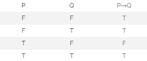

O bicondicional $P \leftrightarrow Q$ é equivalente a $(P\to Q) \land (Q\to P)$:

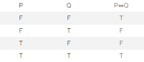

### Proposição composta

Uma proposição composta é formada combinando variáveis proposicionais com operadores lógicos (ex.: $P \land (Q \lor \lnot R)$).

### Variações do condicional

A partir de um condicional $P \to Q$, podemos construir três proposições relacionadas, mas que **não têm o mesmo valor de verdade** entre si (exceto a contrapositiva):

| Nome | Forma | Equivalência |
|---|---|---|
| Contrapositiva | $\lnot Q \to \lnot P$ | **sempre** equivalente a $P \to Q$ |
| Conversa (recíproca) | $Q \to P$ | não preserva o valor de verdade de $P\to Q$ |
| Inversa | $\lnot P \to \lnot Q$ | não preserva o valor de verdade de $P\to Q$ |

!!! tip "Observações"
    - A negação de $\le$ é $>$ (e vice-versa).
    - A **precedência** dos operadores lógicos (do mais "forte" ao mais "fraco") é:

    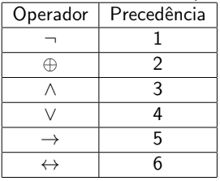

## Equivalência Proposicional

### Tautologia e contradição

Uma **tautologia** é uma proposição composta que é sempre verdadeira, independentemente do valor de suas variáveis.

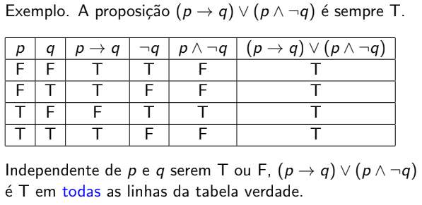

Uma **contradição** é uma proposição composta que é sempre falsa, independentemente do valor de suas variáveis.

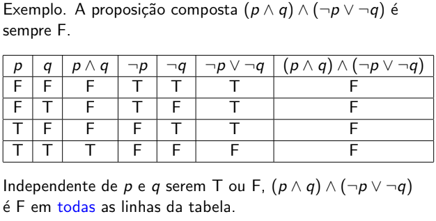

### Equivalência lógica

Duas proposições $p$ e $q$ são **logicamente equivalentes** se elas possuem o mesmo valor em cada linha da tabela-verdade:

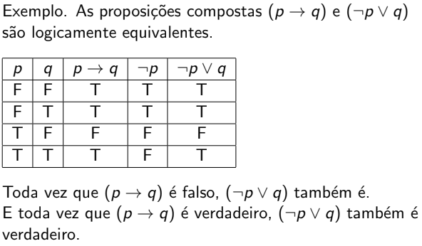

Note que $p \leftrightarrow q$ é verdadeira exatamente quando $p$ e $q$ possuem o mesmo valor em todas as linhas (lembrando que $p$ e $q$ podem ser proposições compostas). Isso nos permite definir equivalência lógica em termos de tautologia: **$p$ e $q$ são logicamente equivalentes se e somente se $p \leftrightarrow q$ é uma tautologia**.

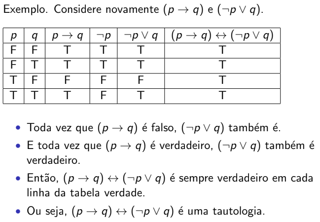

Usamos a notação $p \equiv q$ como abreviação de "$(p \leftrightarrow q)$ é uma tautologia", ou "$p$ é logicamente equivalente a $q$". O símbolo $\equiv$ **não** é um operador lógico, e $(p \equiv q)$ **não** é uma proposição composta — é uma afirmação sobre duas proposições.

### Como provar equivalência lógica

Há dois caminhos: construir a tabela-verdade completa de ambos os lados e compará-las, ou substituir trechos por proposições equivalentes usando as **leis da lógica proposicional** (De Morgan, distributividade, absorção, etc.) até transformar um lado no outro.

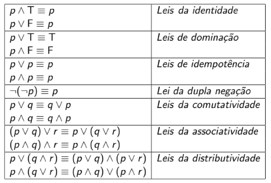
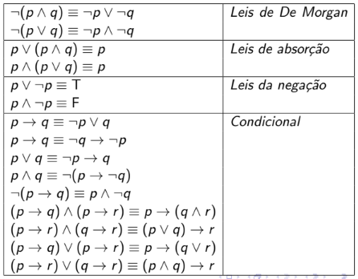
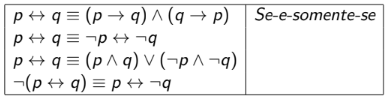

!!! example "Exemplo"
    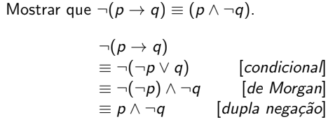

## Predicados e Quantificadores

### Predicados

Um predicado aparece em funções proposicionais do tipo $p(x) = $ "$x$ é maior que $3$", onde $x$ é a variável e "é maior que $3$" é o predicado. O valor-verdade da proposição depende do valor atribuído à variável.

### Quantificadores

Quantificadores expressam **até que ponto** um predicado é verdadeiro dentro de um domínio.

**Quantificador universal** ($\forall$). É comum falarmos de propriedades válidas para todos os elementos de um domínio; o quantificador universal de $p(x)$ afirma que $p(x)$ é verdadeiro para **todo** valor de $x$ nesse domínio.

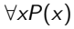

Notação: $\forall x\, p(x)$, lido como "para todo $x$ do domínio, $p(x)$ é verdadeiro".

!!! example "Exemplos"
    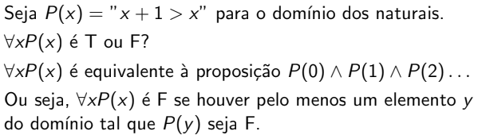

    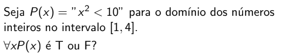 — neste caso, a proposição é falsa.

**Quantificador existencial** ($\exists$). Afirma que existe **pelo menos um** elemento do domínio para o qual $p(x)$ é verdadeiro.

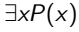

$\exists x\, p(x)$ é falso somente se $p(x)$ for falso para **todos** os elementos do domínio.

!!! example "Exemplo"
    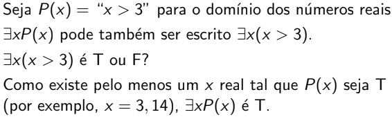

### Lei de De Morgan para quantificadores

Negar um quantificador universal produz um existencial (da negação do predicado), e vice-versa:

$$\lnot \forall x\, p(x) \equiv \exists x\, \lnot p(x) \qquad \lnot \exists x\, p(x) \equiv \forall x\, \lnot p(x)$$

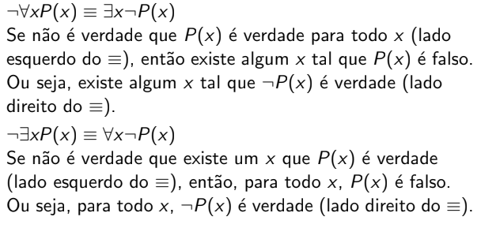

## Prova Matemática

Uma **prova** de uma proposição é um argumento que demonstra que ela é verdadeira. Quando uma proposição é provada, ela passa a ser chamada de **teorema**. Toda teoria matemática precisa de um ponto de partida — proposições assumidas como verdadeiras sem demonstração, chamadas **postulados** ou **axiomas** — a partir das quais outras proposições são provadas.

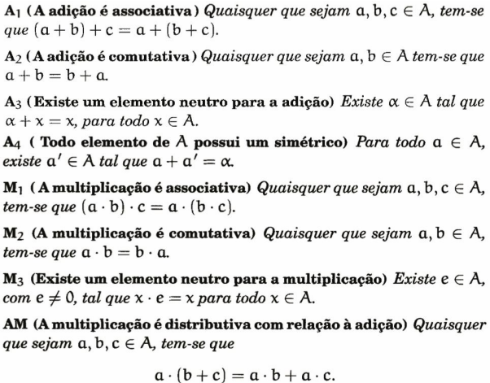

### Tipos de prova

**Desaprovando afirmações (contraexemplo).** Basta encontrar uma situação em que a afirmação seja falsa.

!!! example "Exemplo"
    Um colega disse que $n^2+n+41$ é sempre primo. Para refutar, basta um contraexemplo: com $n=41$,

    $$41^2+41+41 = 41\cdot41 + 41\cdot2 = 41(41+2) = 41\cdot43,$$

    que não é primo.

**Prova exaustiva.** Verificamos todas as possibilidades (só funciona quando o domínio é finito e pequeno).

!!! example "Exemplo"
    Prove que $(n+1)^3 \ge 3^n$ se $n$ é inteiro positivo com $n \le 4$. Verificamos $\forall n \in \{1,2,3,4\}$:

    $$p(1): 8 \ge 3 \quad p(2): 27 \ge 9 \quad p(3): 64 \ge 27 \quad p(4): 125 \ge 81$$

**Provas por regras de inferência.** Inferência é a operação pela qual afirmamos a verdade de uma proposição em decorrência de sua ligação com outras já reconhecidas como verdadeiras (teoremas, axiomas, leis de equivalência lógica).

!!! example "Exemplos"
    **Se $x$ e $y$ são pares, prove que $x+y$ é par.**

    Assuma $x,y$ inteiros pares. Como $x$ é par, existe $k \in \mathbb{Z}$ tal que $x=2k$; similarmente, $y=2k'$. Logo $x+y = 2k+2k' = 2(k+k')$, que é par.

    **Se $x$ e $y$ são ímpares, prove que $x+y$ é par.**

    Como $x$ é ímpar, $x=2k+1$; como $y$ é ímpar, $y=2k'+1$. Logo $x+y = 2k+1+2k'+1 = 2(k+k'+1)$, que é par.

**Prova direta.** Para provar $P\to Q$: supomos $P$ como verdade (hipótese) e, após uma sequência finita de passos lógicos, chegamos a $Q$. Uma vez provada a implicação, não importa mais se $P$ em si é verdadeira ou falsa — a suposição é descartada.

**Prova por contrapositiva (prova indireta).** Como $P\to Q \equiv \lnot Q \to \lnot P$, às vezes é mais fácil provar a contrapositiva do que a proposição original.

!!! example "Exemplos"
    **Para qualquer inteiro $n$, se $n^2$ é par, então $n$ é par.**

    A contrapositiva é: se $n$ é ímpar, então $n^2$ é ímpar. Como $n$ é ímpar, $n=2k+1$, logo

    $$n^2 = (2k+1)^2 = 4k^2+4k+1 = 2(2k^2+2k)+1,$$

    que é ímpar. ✓

    **Se $n=ab$, então $a \le \sqrt{n}$ ou $b \le \sqrt{n}$.**

    A contrapositiva é: se $a>\sqrt{n}$ e $b>\sqrt{n}$, então $ab \neq n$. Tomando $a,b$ com $a>\sqrt n$ e $b>\sqrt n$: $a\cdot b > \sqrt n \cdot \sqrt n = n$, logo $ab \neq n$. ✓

**Provas de equivalência.** Para provar $P \leftrightarrow Q$, usamos $P \leftrightarrow Q \equiv (P\to Q) \land (Q\to P)$ e construímos uma prova para cada uma das duas implicações.

!!! example "Exemplo"
    **Para qualquer inteiro $n$, $n$ é par se e somente se $n^2$ é par.**

    *(⇒)* Se $n$ é par, $n=2k$, logo $n^2=4k^2=2(2k^2)$, que é par.

    *(⇐)* Usamos a contrapositiva (mais fácil): se $n$ é ímpar, $n=2k+1$, logo $n^2 = 4k^2+4k+1 = 2(2k^2+2k)+1$, que é ímpar — logo, se $n^2$ é par, $n$ é par.

**Provas por contradição (redução ao absurdo).** Assumimos o oposto do que queremos provar; ao chegar a uma contradição, a prova está concluída.

!!! example "Exemplos"
    **Prove que "se $3n+2$ é ímpar, então $n$ é ímpar".**

    Assumimos o oposto: $3n+2$ é ímpar e $n$ é par. Como $n$ é par, $n=2k$, logo

    $$3n+2 = 6k+2 = 2(3k+1),$$

    que é **par** — contradizendo a hipótese de que $3n+2$ é ímpar. Absurdo! Logo, a afirmação original é verdadeira.

    **Prove que $\sqrt{2}$ é irracional.**

    Assuma que $\sqrt{2}$ é racional, isto é, $\sqrt{2} = p/q$ com $p,q \in \mathbb{Z}$, $q \neq 0$, e a fração já simplificada ao máximo (sem fatores comuns). Então:

    $$2 = \frac{p^2}{q^2} \;\Rightarrow\; p^2 = 2q^2 \;\Rightarrow\; p^2 \text{ é par} \;\Rightarrow\; p \text{ é par.}$$

    Se $p=2k$, então $(2k)^2 = 2q^2 \Rightarrow q^2 = 2k^2$, logo $q^2$ também é par, e portanto $q$ é par. Mas se $p$ e $q$ são ambos pares, a fração não poderia estar simplificada ao máximo — contradição. Logo, $\sqrt{2}$ não é racional.

**Provas por casos.** Quando existe um conjunto de casos possíveis e sabemos que pelo menos um deles é verdadeiro (mas não sabemos qual), provamos a afirmação separadamente em cada caso.

!!! example "Exemplos"
    **Prove que, para qualquer inteiro $n$, $n \le n^2$.**

    - Caso 1 ($n \ge 1$): $n^2 \ge n$.
    - Caso 2 ($n=0$): $0^2 \ge 0$.
    - Caso 3 ($n \le -1$): $n^2 \ge n$ (pois $n^2 \ge 0 > n$).

    Os três casos cobrem todos os inteiros, logo a afirmação é verdadeira.

    **Existem números irracionais $x$ e $y$ tais que $x^y$ é racional.**

    Considere $x=y=\sqrt{2}$. Há dois casos: $\sqrt{2}^{\sqrt{2}}$ é racional, ou é irracional.

    - Se $\sqrt{2}^{\sqrt{2}}$ é racional, encontramos o exemplo diretamente.
    - Se $\sqrt{2}^{\sqrt{2}}$ é irracional, tome $x = \sqrt{2}^{\sqrt{2}}$ e $y=\sqrt{2}$: então $x^y = (\sqrt{2}^{\sqrt{2}})^{\sqrt{2}} = \sqrt{2}^2 = 2$, que é racional.

    !!! note "Prova não construtiva"
        Mesmo após concluir a prova, não sabemos qual dos dois casos é verdadeiro, logo não conseguimos exibir explicitamente os números irracionais que satisfazem o teorema. Esse é um exemplo de **prova não construtiva**: um teorema existencial foi provado sem construir um exemplo concreto.

**Prova por indução.** Geralmente usada para provar afirmações do tipo "$\forall n \in \mathbb{N}, P(n)$". Tem dois passos:

1. **Passo base:** mostramos que $P(1)$ (ou $P(0)$) é verdadeiro.
2. **Passo indutivo:** mostramos que, se $P(k)$ é verdadeiro, então $P(k+1)$ também é.

!!! example "Exemplo: a soma dos $n$ primeiros números ímpares é igual a $n^2$"
    **Passo base ($P(1)$):** $1 = 1^2$. Verdadeiro.

    **Passo indutivo ($P(k) \to P(k+1)$):** suponha que $P(k)$ é verdadeiro, isto é,

    $$1+3+\dots+(2k-1) = k^2.$$

    Somando $2k+1$ aos dois lados:

    $$1+3+\dots+(2k-1)+(2k+1) = k^2+2k+1 = (k+1)^2,$$

    que é exatamente $P(k+1)$. Logo, por indução, $P(n)$ vale para todo $n \ge 1$.

!!! example "Mais exemplos de indução"
    **Prove que, para $n \ge 1$, $1+2^1+2^2+\dots+2^n = 2^{n+1}-1$:**

    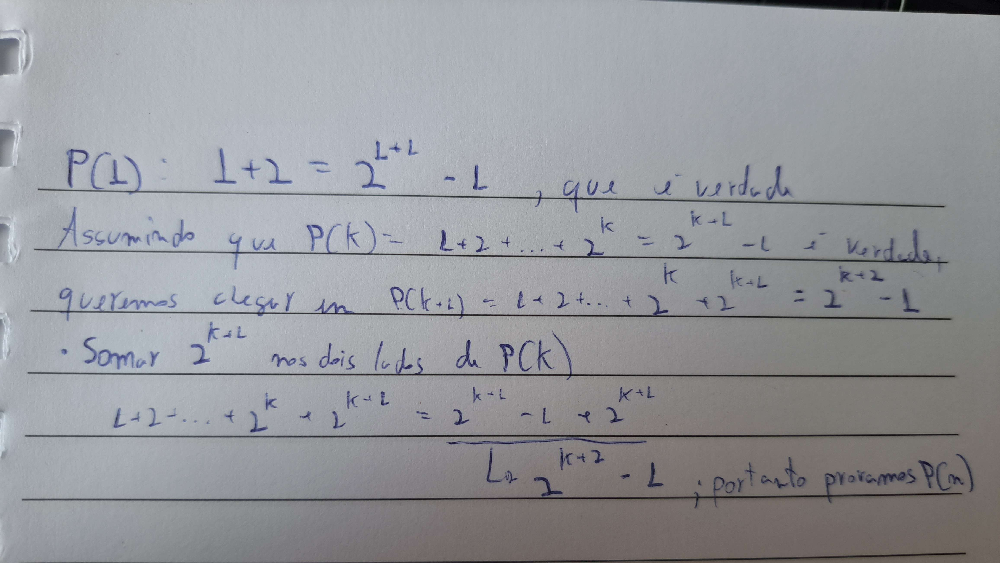

    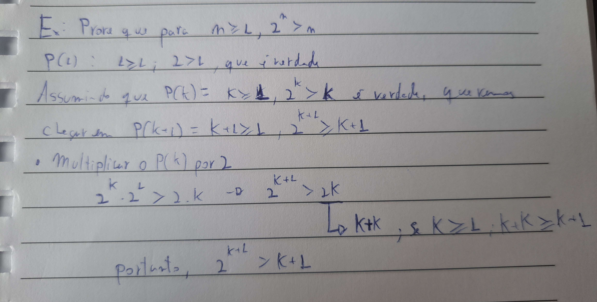

    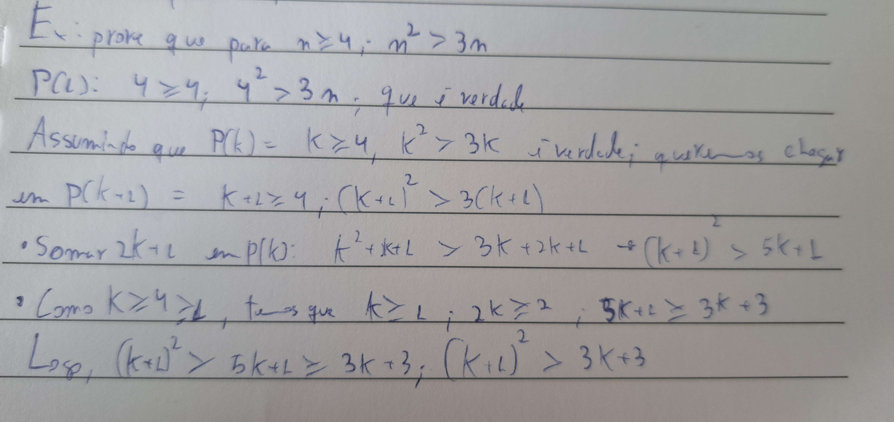

    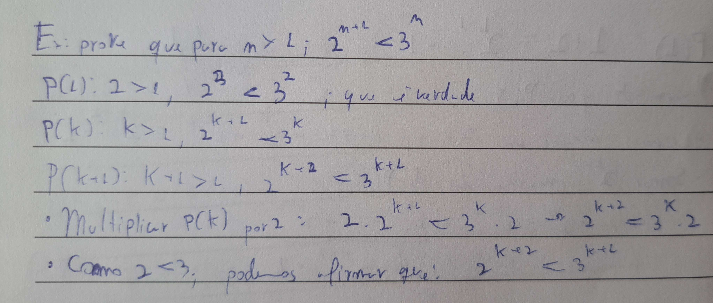

    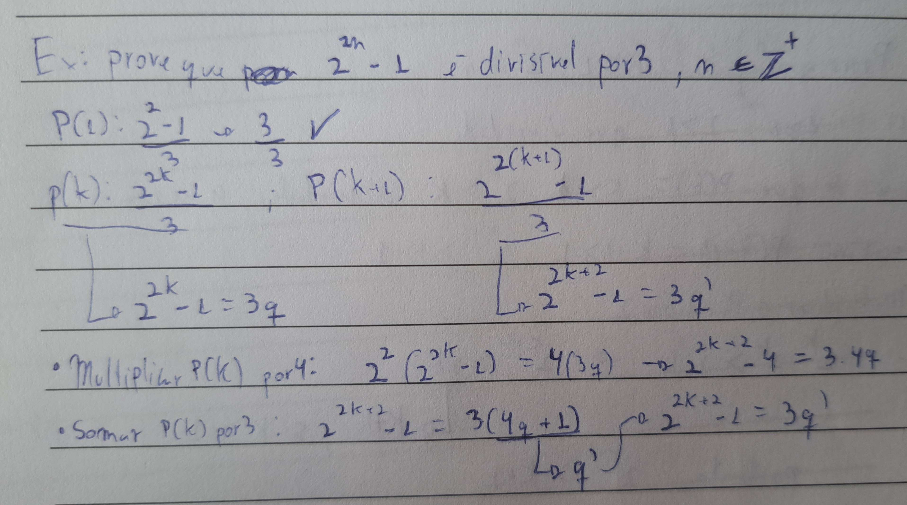

    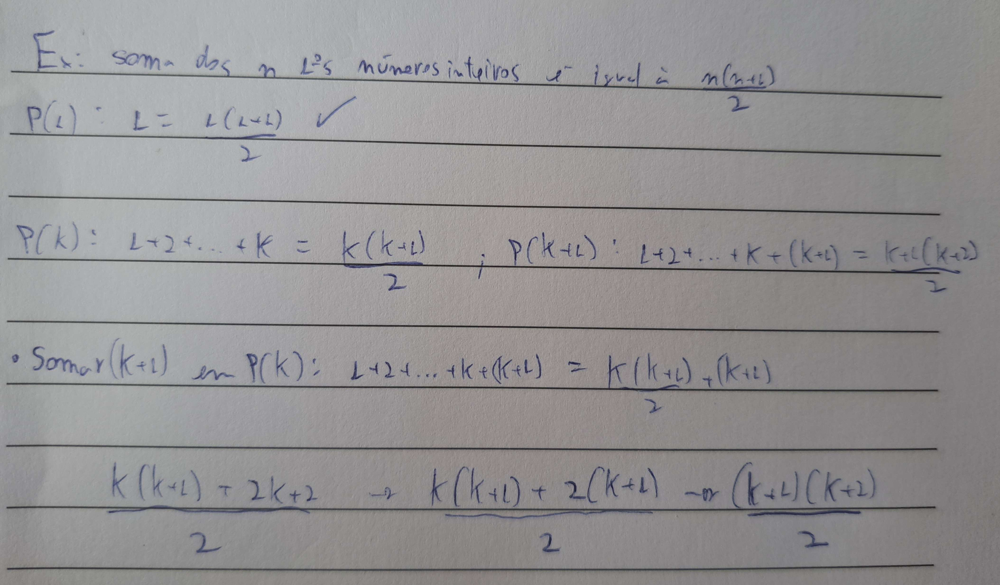

    **Prove que o conjunto das partes de um conjunto com $n$ elementos possui $2^n$ elementos:**

    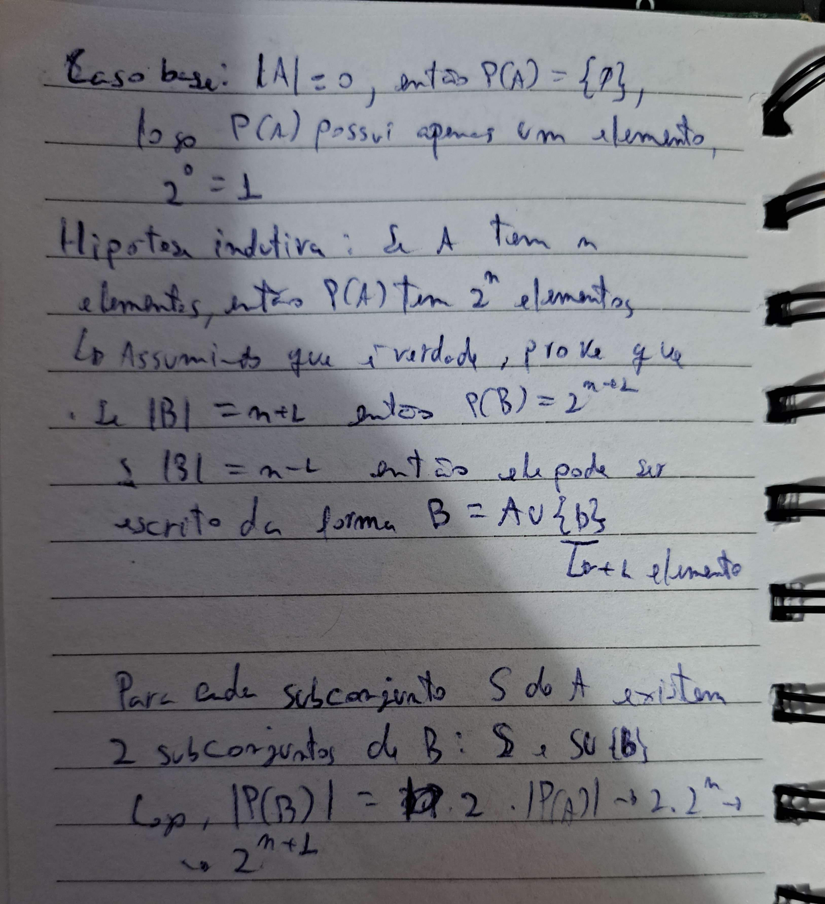

**Fazendo conjecturas.** Antes de provar por indução, muitas vezes é preciso primeiro **conjecturar** (adivinhar) a fórmula geral observando padrões em casos pequenos.

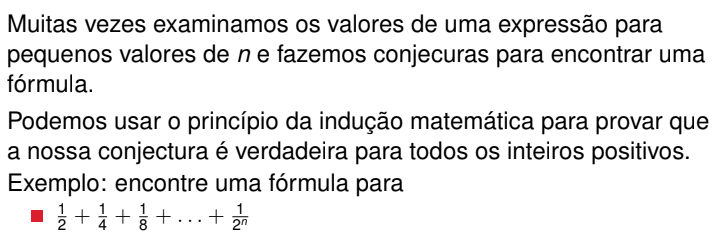

### Definições recursivas

Usamos definições recursivas em funções, operações, algoritmos, conjuntos e sequências: a definição se refere a si mesma em casos "menores", com um caso base que interrompe a recursão.

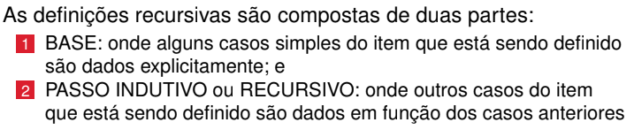

!!! example "Exemplo"
    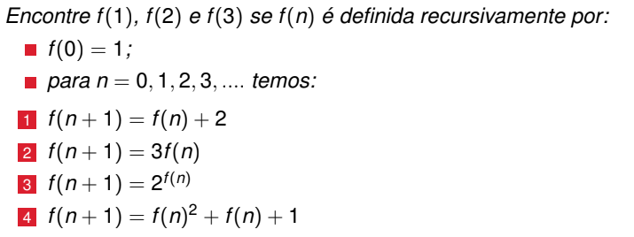
    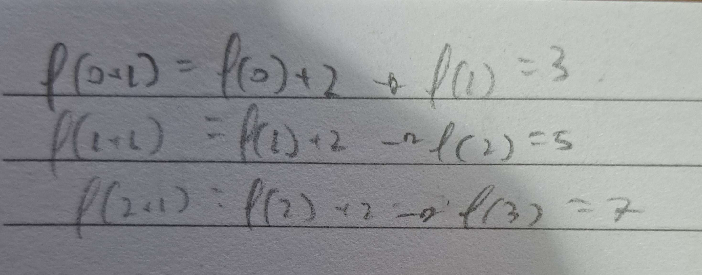
    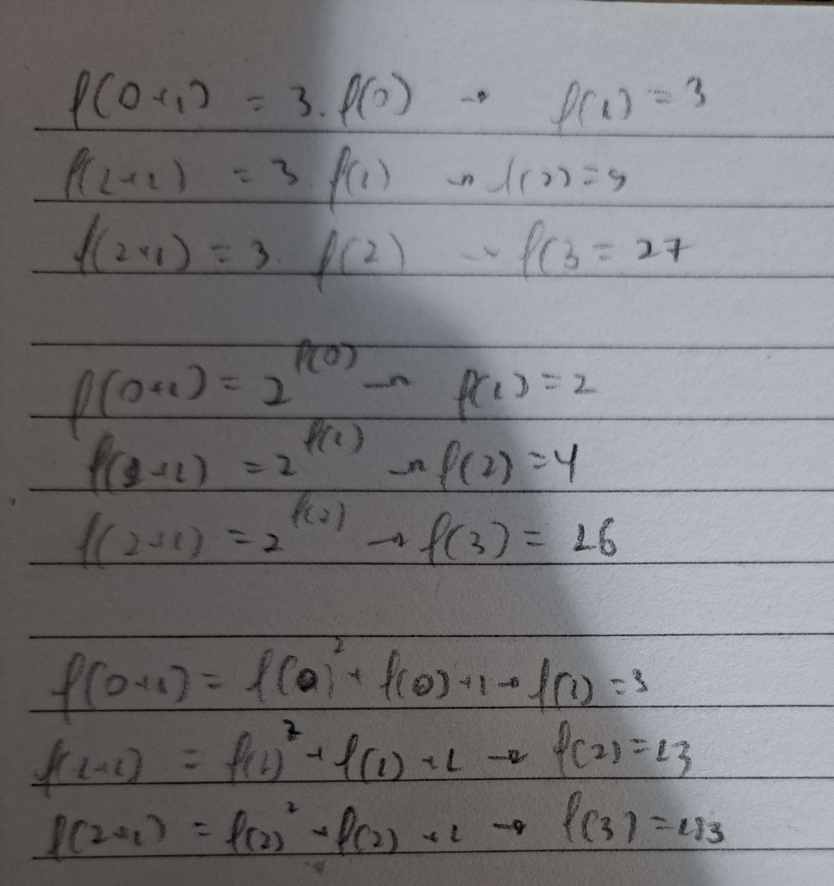

**Sequência de Fibonacci.** Clássico exemplo de definição recursiva: cada termo é a soma dos dois anteriores.

!!! example "Exemplos"
    
    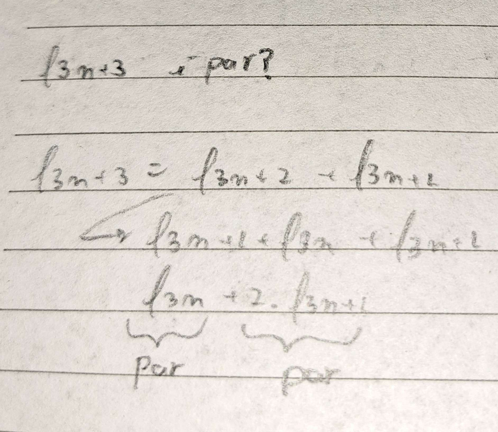

    
    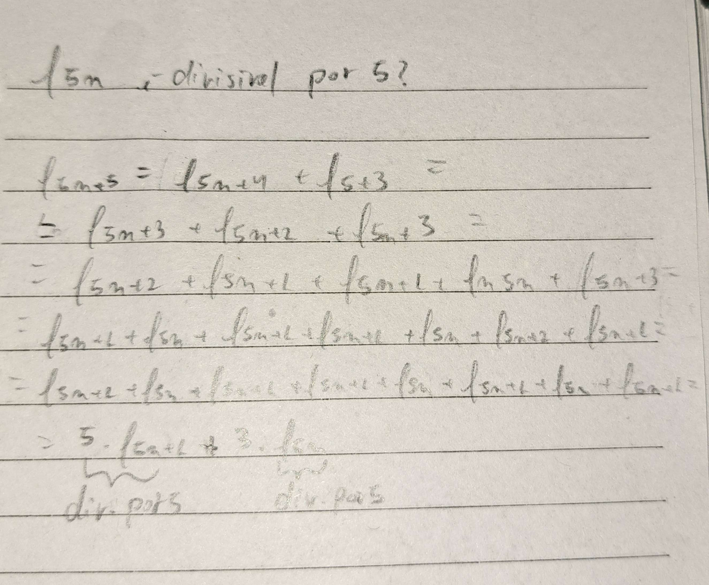

## Conjuntos

Um **conjunto** é uma coleção desordenada de objetos, sem repetição de elementos (listar o mesmo elemento duas vezes não muda o conjunto):

$$\{1,2,3,4\} = \{1,1,2,2,2,3,4,4,4,4\} = \{3,2,4,3,2,2,1,4,3\}$$

**Notações básicas:**

- $a \in A$: o elemento $a$ pertence ao conjunto $A$.
- $a \notin A$: o elemento $a$ não pertence ao conjunto $A$ (formalmente, $a\notin A \equiv \lnot(a\in A)$).
- $A \subset B$: todos os elementos de $A$ estão em $B$, mas $A \neq B$ (subconjunto próprio).
- $A \subseteq B$: todos os elementos de $A$ estão em $B$, podendo $A = B$.

Em conjuntos de conjuntos, os elementos ficam sempre separados pelas vírgulas mais externas:

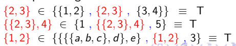

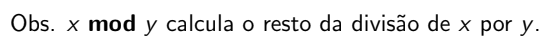
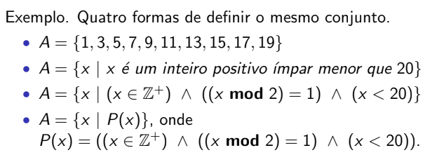

Dois conjuntos $A$ e $B$ são **iguais** se e somente se $\forall x\,(x\in A \leftrightarrow x\in B)$.

### Conjunto vazio

O conjunto vazio, sem nenhum elemento, é representado por $\{\}$ ou $\varnothing$.

**Propriedades:**

- $x \in \varnothing \equiv F$ (nunca é verdade)
- $\varnothing = \{x \mid F\}$

!!! warning "Atenção"
    $\{\varnothing\}$ e $\varnothing$ são coisas diferentes: $\varnothing$ é o conjunto vazio, enquanto $\{\varnothing\}$ é um conjunto que **contém** o conjunto vazio como seu único elemento (portanto tem cardinalidade $1$, não $0$).

### Subconjuntos

$A$ é subconjunto de $B$ se e somente se $\forall x\,(x\in A \to x\in B)$. Se $A \subseteq B$ e $A \neq B$, dizemos que $A$ é **subconjunto próprio** de $B$.

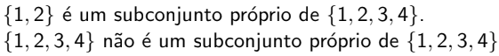

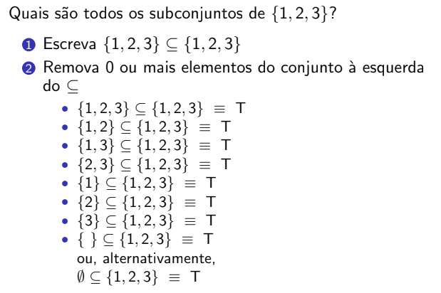

Se $P(S)$ é o conjunto das partes de $S$ e $n$ é o número de elementos de $S$, então $|P(S)| = 2^n$. O conjunto vazio está contido em **todo** conjunto.

**Propriedades:**

- Para todo conjunto $S$: $\varnothing \subseteq S$ e $S \subseteq S$.
- $A = B \equiv (A\subseteq B) \land (B\subseteq A)$.
- Um conjunto é **finito** se contém $n$ elementos distintos, com $n \ge 0$; é **infinito** se não é finito.

### Cardinalidade

Para um conjunto finito $S$, $|S|$ denota a cardinalidade de $S$, isto é, a quantidade de elementos distintos.

!!! example "Exemplos"
    - $|\{5,2,89\}| = 3$
    - $|\{1,1,1,1,1,1,2\}| = 2$ (repetições não contam)
    - $|\{\varnothing\}| = 1$ — cuidado: é um conjunto com um elemento (o vazio), não o próprio vazio.
    - $|\{\{1,2,3\}, \varnothing, \{5,6,7,\dots\}\}| = 3$ — aqui contamos os três elementos do conjunto externo (dois dos quais são, eles próprios, conjuntos).

### Conjunto das partes

O conjunto das partes de $S$, denotado $P(S)$, contém **todos** os subconjuntos de $S$ (incluindo $\varnothing$ e o próprio $S$).

!!! example "Exemplos"
    $$P(\{0,1,2\}) = \{\varnothing, \{0\}, \{1\}, \{2\}, \{0,1\}, \{0,2\}, \{1,2\}, \{0,1,2\}\}$$

    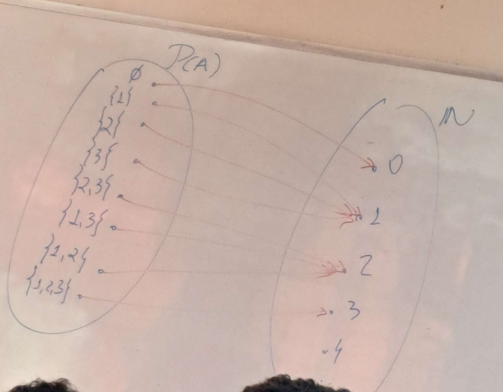

    $$P(\varnothing) = \{\varnothing\} \qquad P(\{\varnothing\}) = \{\varnothing, \{\varnothing\}\} \qquad P(\{\varnothing,\{\varnothing\}\}) = \{\varnothing, \{\varnothing\}, \{\varnothing,\{\varnothing\}\}\}$$

### Conjunto universo

O conjunto universo $U$ é o conjunto com todos os elementos relevantes ao problema que estamos tratando.

### Tuplas

Uma **tupla** é um conjunto **ordenado** de elementos — a ordem importa. $(1,2,3)$ e $(3,2,1)$ são tuplas de 3 elementos diferentes entre si, já que seus primeiros elementos diferem.

### Produto cartesiano

O produto cartesiano $A \times B$ é o conjunto de todos os pares ordenados $(a,b)$ com $a\in A$ e $b\in B$.

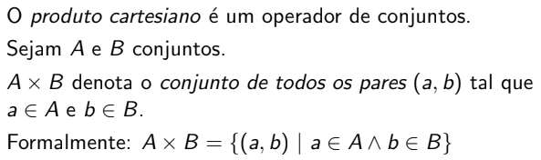
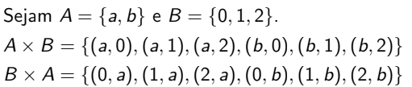

Um subconjunto de um produto cartesiano é chamado de **relação** (voltaremos a isso mais adiante).

**Propriedades:**

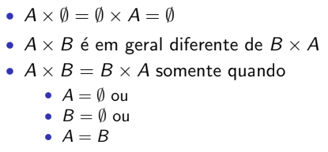

O número de elementos do produto cartesiano é o produto das cardinalidades: se $|A|=m$, $|B|=n$, $|C|=o$, então $|A\times B \times C| = m\cdot n\cdot o$.

### Operadores de conjuntos

**União** ($A\cup B$): elementos que estão em $A$ **ou** em $B$ (ou ambos).

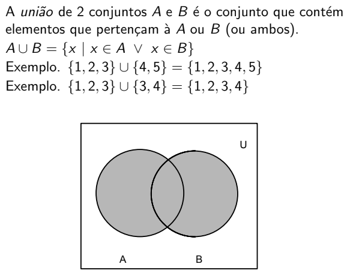

Propriedade: 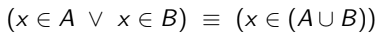 — o "ou" ($\lor$) lógico corresponde à união ($\cup$) de conjuntos.

!!! example "Exemplo de prova"
    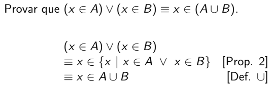

**Interseção** ($A\cap B$): elementos que estão em $A$ **e** em $B$ simultaneamente.

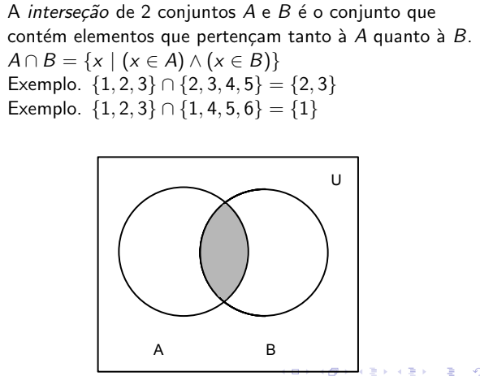

Propriedade: 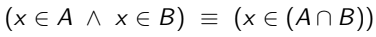 — o "e" ($\land$) lógico corresponde à interseção ($\cap$) de conjuntos.

**Conjuntos disjuntos.** $A$ e $B$ são disjuntos se $A \cap B = \varnothing$.

!!! example "Exemplo"
    $\{1,2,3,4\}$ e $\{5,6,7,8,9,10\}$ são disjuntos.

**Cardinalidade da união.** $|A\cup B| = |A|+|B|-|A\cap B|$, pois os elementos de $A\cap B$ seriam contados duas vezes se simplesmente somássemos $|A|+|B|$.

**Diferença** ($A - B$, complemento de $B$ em relação a $A$): elementos de $A$ que **não** estão em $B$.

!!! example "Exemplo"
    $\{1,2,3,4\} - \{2,3\} = \{1,4\}$

Propriedade: 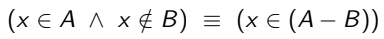

**Complemento** ($\bar{A}$ ou $A^c$): elementos do universo $U$ que não estão em $A$, isto é, $U - A$.

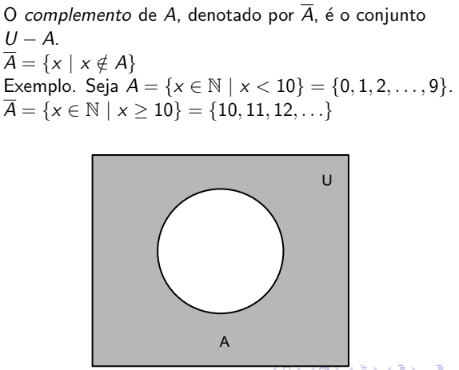

Propriedade: 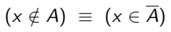

**Lógica em conjuntos.** As operações de conjuntos espelham diretamente os operadores lógicos, trocando "pertence a $A$" por uma proposição $p$ e "pertence a $B$" por $q$:

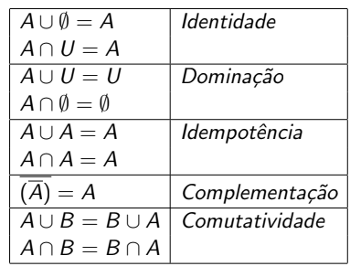


!!! example "Exemplos"
    

    

**União generalizada.** É a união de $n$ conjuntos ao mesmo tempo.


!!! example "Exemplo"
    

    

**Interseção generalizada.** É a interseção de $n$ conjuntos ao mesmo tempo.


!!! example "Exemplos"
     — resposta: conjunto vazio.

     — resposta: $3$.

## Funções

Uma função $f$ de $A$ para $B$ relaciona **cada** elemento de $A$ a **exatamente um** elemento de $B$.


$A$ é o **domínio** de $f$ e $B$ é o **contradomínio** de $f$. O **conjunto imagem** de $f$ é formado por todo elemento de $B$ que de fato se relaciona com algum elemento de $A$.


Se $f(x)=y$, dizemos que $y$ é a **imagem** de $x$, e $x$ é a **pré-imagem** de $y$. Duas funções são iguais se possuem o mesmo domínio, contradomínio, e associam cada elemento da mesma forma.

### Classificação de funções

**Função injetiva (injetora).** Elementos diferentes do domínio sempre têm imagens diferentes — nunca dois elementos "colidem" na mesma imagem.


**Função sobrejetiva (sobrejetora).** Todo elemento do contradomínio é imagem de pelo menos um elemento do domínio — a imagem coincide com o contradomínio inteiro.


**Função bijetiva (bijetora).** É simultaneamente injetiva e sobrejetiva.


A função identidade é um exemplo clássico de função bijetiva.

### Função inversa

Uma função $f$ possui inversa $f^{-1}$ se e somente se $f$ é bijetiva. A inversa desfaz exatamente o que $f$ faz.


!!! example "Exemplo"
    

    A função $g^{-1}$: $g^{-1}(50)=a$, $g^{-1}(20)=b$, $g^{-1}(60)=c$, $g^{-1}(10)=d$, $g^{-1}(30)=e$, $g^{-1}(40)=f$.

### Função composta


!!! example "Exemplo"
    

    **Resposta:** $(g\circ f)$ não possui inversa, pois toda função inversa pressupõe uma bijeção. Nesse caso, $g\circ f: A\to C$ tem $A$ e $C$ com dois elementos cada, mas a função resultante é sobrejetiva sem ser injetiva — não é uma bijeção, logo não possui inversa.

### Outras funções importantes

**Função floor (piso), $\lfloor x \rfloor$:** o maior inteiro menor ou igual a $x$.


!!! example "Exemplo"
    $\lfloor 1/2 \rfloor = 0$, $\lfloor -2 \rfloor = -2$, $\lfloor -1/2 \rfloor = -1$.

**Função ceiling (teto), $\lceil x \rceil$:** o menor inteiro maior ou igual a $x$.


!!! example "Exemplo"
    $\lceil 1/2 \rceil = 1$, $\lceil -2 \rceil = -2$, $\lceil -1/2 \rceil = 0$.

**Propriedades de floor e ceiling:**


## Sequências e somatórios

Uma **sequência** é uma lista ordenada de termos, geralmente dada por uma fórmula, denotada $a_n$.

!!! example "Exemplo"
    Para $a_n = 1/n$: $a_1=1$, $a_2=1/2$, $a_3=1/3$, ...

Sequências podem ser **aritméticas** (diferença constante entre termos) ou **geométricas** (razão constante entre termos). A **sequência de Fibonacci** é um exemplo de sequência **recursiva**, onde cada termo é calculado em função de termos anteriores.

### Sequências infinitas

Uma sequência infinita tem uma quantidade ilimitada de termos. Infinitos, porém, não são todos "do mesmo tamanho": conjuntos infinitos podem ser **enumeráveis** ou **não enumeráveis**.

**Conjuntos enumeráveis.** Um conjunto é enumerável se é finito, ou se existe uma **bijeção** entre ele e o conjunto dos naturais.

- **Naturais, naturais não nulos e pares não nulos.** Esses três conjuntos têm a mesma cardinalidade: existe uma bijeção entre cada natural e um par não nulo (por exemplo $n \mapsto 2n$):

    

    Logo, $\text{card}(\mathbb{N}) = \text{card}(\text{pares não nulos})$ — mesmo os pares sendo "metade" dos naturais intuitivamente, em cardinalidade infinita eles têm o mesmo tamanho.

- **Inteiros.** Também são enumeráveis, por uma bijeção que alterna entre positivos e negativos:

    

    Logo, $\text{card}(\mathbb{Z}) = \text{card}(\mathbb{N})$.

- **Racionais.** Também são enumeráveis. A prova clássica arranja os racionais em uma "matriz" (numerador na linha, denominador na coluna) e percorre essa matriz em diagonais, listando todos os racionais em sequência:

    

    Como é possível enumerá-los dessa forma, $\text{card}(\mathbb{Q}) = \text{card}(\mathbb{N})$.

**Conjuntos não enumeráveis.** O conjunto dos **reais** (que abrange racionais e irracionais) é não enumerável. A prova clássica é por absurdo, usando o **argumento da diagonal de Cantor**:

1. Suponha, por absurdo, que o conjunto dos reais é enumerável.
2. Observe o intervalo $(0,1)$ e liste números reais aleatoriamente, um para cada natural:

    

3. Construa um novo número tomando o $i$-ésimo dígito decimal do $i$-ésimo número da lista, e somando $1$ a cada dígito (com $9+1=0$):

    

4. Esse número construído difere do primeiro número da lista no primeiro dígito, do segundo no segundo dígito, e assim por diante — logo ele **não pode estar na lista**.
5. Portanto, existe pelo menos um real que não foi associado a nenhum natural: a lista não é sobrejetiva (nem bijetiva), e o conjunto dos reais **não é enumerável**. Logo, $\text{card}(\mathbb{R}) > \text{card}(\mathbb{N})$.

**Números transfinitos.** Associamos à cardinalidade dos naturais, inteiros e racionais um número transfinito chamado **aleph-null**, $\aleph_0$ (uma forma rigorosa de "contar" conjuntos infinitos, com suas próprias regras de aritmética):

$$\aleph_0 + 1 = \aleph_0 \qquad 2\aleph_0 = \aleph_0$$

De acordo com a **hipótese do contínuo** de Cantor, a cardinalidade de $P(\mathbb{N})$ é maior que a de $\mathbb{N}$: $2^{\aleph_0} > \aleph_0$. Além disso, a cardinalidade de $P(\mathbb{N})$ é igual à cardinalidade dos reais, logo $2^{\aleph_0} = \aleph_1$. Essa lógica se estende indefinidamente: $2^{\aleph_1} = \aleph_2$, e assim por diante. Associamos à cardinalidade dos reais o transfinito **aleph-one**, $\aleph_1$ (ou $2^{\aleph_0}$). Não existe nenhum número "entre" $|\mathbb{N}|$ e $|\mathbb{R}|$, ou seja, entre $\aleph_0$ e $\aleph_1$.

### Somatório

O **índice de soma** indica a variável que percorre os valores a serem somados, junto com seus limites inferior e superior:


## Análise combinatória

### Princípios básicos da contagem

Uma regra mnemônica útil: **"ou" soma e "e" multiplica**.

**Regra do produto.** Se uma tarefa pode ser dividida em etapas sucessivas e independentes, com $n_1$ opções na primeira, $n_2$ na segunda, etc., o número total de formas de realizar a tarefa é $n_1 \cdot n_2 \cdot \dots \cdot n_k$.


**Regra da soma.** Se uma tarefa pode ser feita de $n_1$ formas **ou** de $n_2$ formas (categorias mutuamente exclusivas), o número total é $n_1+n_2$.


!!! example "Exemplos"
    
    

    

**Princípio da inclusão-exclusão (caso de 2 conjuntos).** Usa a ideia de cardinalidade da união de conjuntos para evitar contar duplicado:


!!! example "Exemplo"
    

### Permutação, arranjo e combinação

| Conceito | A ordem importa? | Usa todos os elementos? |
|---|---|---|
| **Permutação** | Sim | Sim |
| **Arranjo** | Sim | Não (subconjuntos ordenados) |
| **Combinação** | Não | Não (subconjuntos) |

**Permutação.** Agrupa todos os elementos do conjunto, e a ordem importa.


**Arranjo.** Agrupa apenas parte dos elementos (um número de subconjuntos ordenados), diferente da permutação, que usa todos.


**Combinação.** Agrupa um determinado número de elementos, mas a ordem **não** importa.


$$\binom{n}{k} = \frac{n!}{k!(n-k)!}$$


### Binômio de Newton

**Termo geral.**


Expandindo o binômio:


!!! example "Exemplo"
    

!!! tip "Observações importantes"
    - Em $(x-y)^n$, é o **expoente ímpar** do $y$ que determina o **sinal negativo** do termo.
    - Se a questão pedir um termo "inválido" (fora do intervalo de expoentes possíveis), o coeficiente correspondente é zero.
    - Para saber a soma de **todos** os coeficientes de uma expansão, basta substituir todas as variáveis por $1$.

    !!! example "Exemplo"
        

**Triângulo de Pascal:**


**Igualdades importantes do binômio:**


??? note "Prova"
    


??? note "Prova"
    


??? note "Prova"
    


Com o auxílio do triângulo de Pascal: 

**Identidade de Vandermonde:** 

**Elemento central da linha do triângulo de Pascal.** É o coeficiente de maior valor numérico naquela linha. Se $n$ é par, o elemento central corresponde a $k=n/2$; se $n$ é ímpar, a $k=(n-1)/2$.

### Princípio da casa dos pombos

Se distribuirmos mais objetos ("pombos") do que o número de "casas" disponíveis, pelo menos uma casa deverá conter mais de um objeto.


Isso ocorre porque, em qualquer distribuição possível, há sempre pelo menos 2 pombos na mesma casa quando pombos $>$ casas.

!!! example "Exemplos"
    

    Sim, pelo menos 6 alunos possuem médias iguais.

    
    

    
    

**Generalizando.**


!!! example "Exemplos"
    

    

    

    

!!! tip "Observação"
    Em exemplos como "quantos números entre 1 e 401 são divisíveis por 2", usamos a função floor, pois queremos a parte inteira da divisão: neste caso, $\lfloor 401/2 \rfloor = 200$.

### Princípio da inclusão-exclusão (caso geral)


A fórmula diz que a cardinalidade da união de $n$ conjuntos é igual à soma das cardinalidades individuais ($|A_i|$), menos a soma das interseções dois a dois ($|A_i \cap A_j|$), mais a soma das interseções três a três ($|A_i\cap A_j\cap A_k|$), e assim por diante, alternando sinal (dependendo da paridade de $n$, representado por $(-1)^{n+1}$) até a interseção de todos os $n$ conjuntos:

$$|A_1\cup\dots\cup A_n| = \sum|A_i| - \sum|A_i\cap A_j| + \sum|A_i\cap A_j\cap A_k| - \dots + (-1)^{n+1}|A_1\cap\dots\cap A_n|$$

Note que $|A_i|$ é simplesmente $\binom{n}{1}$ "escolhas" de conjunto, $|A_i\cap A_j|$ corresponde a $\binom{n}{2}$ escolhas, etc. Portanto, o **número de termos** na fórmula para a cardinalidade da união de $A_1,\dots,A_n$ segue o padrão $\binom{n}{1} - \binom{n}{2} + \binom{n}{3} - \dots + (-1)^{n+1}\binom{n}{n}$ (lembrando que $\binom{n}{n}=1$ sempre).


!!! example "Exemplos"
    

    $1°: 30;\quad 2°: 29;\quad 3°: 24$

    
    

    
    

    
    

    
    

## Teoria dos números

### Divisibilidade de números inteiros


!!! example "Exemplo"
    

**Propriedades:**


!!! example "Exemplo"
    

**Algoritmo da divisão** (divisão com resto):


!!! example "Exemplo"
    

### Conjunto dos divisores, MDC e números primos


**MDC (máximo divisor comum):**


**Números primos.** Um número é primo se seus únicos divisores positivos são $1$ e ele mesmo.


**Teorema fundamental da aritmética.** Todo inteiro maior que $1$ pode ser escrito de forma única como um produto de primos (a menos da ordem dos fatores).


**MMC (mínimo múltiplo comum):**


!!! example "Exemplo"
    

### Algoritmo de Euclides

O Algoritmo de Euclides calcula o MDC de dois números repetidamente aplicando a divisão com resto, até o resto chegar a zero.


!!! example "Exemplo"
    

**Identidade de Bézout.** Garante que o MDC de dois inteiros $a$ e $b$ pode sempre ser escrito como uma combinação linear $ax+by = \text{mdc}(a,b)$, para certos inteiros $x,y$.


**Algoritmo de Euclides Estendido.** Encontra, além do MDC, os coeficientes $x,y$ da identidade de Bézout, "desenrolando" as divisões do Algoritmo de Euclides de trás para frente.


 (em 6, é $6 = 18\cdot17 - 300\cdot1$)

!!! example "Exemplo: $\text{mdc}(57,10)$"
    

**Aplicação: Equação Diofantina Linear.** Uma equação do tipo $ax+by=c$, com soluções inteiras.


!!! example "Fazendo o exemplo"
    


!!! note
    O "$d$" é o $\text{mdc}(a,b)$ (o slide original continha um erro nesse ponto). Se existe uma solução, então existem **infinitas** soluções:

    
    

!!! example "Exemplo"
     (os números só podem ser multiplicados por inteiros positivos)

    **Primeiro exemplo:** 

    **Segundo exemplo:** 

    **Terceiro exemplo:** 

**Consequências:**


### Aritmética modular

Dizemos que $a \equiv b \pmod{m}$ (lê-se "$a$ é congruente a $b$ módulo $m$") se $m$ divide $a-b$:


$$m \mid (a-b) \iff a \pmod m = b \pmod m$$

!!! example "Exemplo"
    $7 \equiv 2 \pmod 5$, pois $7 \bmod 5 = 2$ e $2 \bmod 5 = 2$.


!!! example "Exemplo: calcular horas em um relógio"
    $$23+3 \equiv \big(23 \bmod 12 + 3 \bmod 12\big) \pmod{12}$$

    $$14 \bmod 12 = 2 \qquad \text{ou, direto: } 26 \bmod 12 = 2$$

    $$23 \cdot 3 \equiv \big(23 \bmod 12 \cdot 3 \bmod 12\big) \pmod{12}$$

    $$33 \bmod 12 = 9 \qquad \text{ou, direto: } 69 \bmod 12 = 9$$


??? note "Prova"
    
    

**Algumas aplicações de congruência:**


!!! example "Exemplo"
    
    

**Propriedades:**


**Congruência linear.** Uma equação do tipo $ax \equiv b \pmod m$. Nem sempre existe solução; uma forma de checar é usando a identidade de Bézout:


!!! example "Exemplo"
    
    

**Algoritmo.**


!!! example "Exemplos"
    
    

    **Encontre $x$ para $7x \equiv 5 \pmod{11}$:**

    

    

    
    
    

    

    
    

### Teorema chinês do resto

Permite resolver **sistemas** de congruências lineares simultaneamente, quando os módulos são coprimos entre si.

**Contexto.**


**Teorema.** Encontrar um único "$x$" que satisfaça todas as equações do sistema simultaneamente.


**Fórmula.**


!!! example "Resolução do exemplo"
    

!!! example "Exemplo"
    
    

### Pequeno Teorema de Fermat

Usado, entre outras aplicações, em **testes de primalidade**: se $p$ é primo e $a$ não é múltiplo de $p$, então $a^{p-1} \equiv 1 \pmod p$.

**Contexto: teste de primalidade.**


!!! example "Exemplos"
    
    

    (o último termo fica $3^{204} \equiv 4 \pmod{11}$)

    
    

    
    

    
    
    

**Aplicações: criptografia.** O Pequeno Teorema de Fermat é um dos fundamentos teóricos por trás de sistemas de criptografia de chave pública, como o RSA.


### Fórmula quadrática modular

Usada em casos de $ax^2 \pm bx \pm c \equiv 0 \pmod m$. Para aplicar, basta usar a fórmula de Bhaskara convencional, lembrando que todas as operações (incluindo a divisão por $2a$, que precisa ser trocada pelo **inverso modular**) são feitas em módulo $m$. Se as soluções obtidas não satisfazerem $ax^2\pm bx \pm c \equiv 0 \pmod m$ ao serem testadas, a equação quadrática não possui soluções modulares.

## Relações

Seja $S$ um conjunto de pessoas. Suponha que queremos escolher os pares ordenados de $S \times S$ cujos componentes iniciam com a mesma letra; esse subconjunto de $S\times S$ é chamado de **relação binária** sobre $S$.

**Notações:**

- $R = \{(x,y) \mid x,y \in S \text{ e } x,y \text{ começam com a mesma letra}\}$
- $xRy \leftrightarrow x,y\in S$ e $x,y$ começam com a mesma letra

!!! example "Exemplos"
    

    

    $R_1 = \{(1,1),(2,2),(3,3)\}$

    

    $R_2 = \{(1,2),(1,3),(2,3)\}$

    


Toda relação possui um **sentido direto** e um **sentido inverso**:

- Sentido direto: $R = \{(a,b),(c,d)\}$
- Sentido inverso: $R^{-1} = \{(b,a),(d,c)\}$

**Função como relação.** Toda função pode ser vista como um caso particular de relação (em que cada elemento do domínio aparece em exatamente um par).


### Propriedades das relações

**Reflexividade.** $R$ é reflexiva se contém **todos** os pares do tipo $(a,a)$ (pode conter outros pares também).


!!! example "Exemplo ($S=\{1,2,3\}$)"
    - $R_1 = \{(1,1),(2,2),(3,3)\}$
    - $R_2 = \{(1,1),(1,3),(2,1),(2,2),(3,2),(3,3)\}$
    - $R_3 = \{(1,1),(2,1),(2,2),(3,3)\}$

    Todas são reflexivas.

**Simetria.** $R$ é simétrica se, sempre que $(a,b) \in R$, também vale $(b,a) \in R$.


!!! example "Exemplo ($S=\{1,2,3\}$)"
    - $R_1 = \{(1,2),(1,3),(2,1),(2,3),(3,1),(3,2)\}$
    - $R_2 = \{(1,1),(2,2),(3,3)\}$
    - $R_3 = \{(1,1),(1,2),(1,3),(2,1),(2,2),(2,3),(3,1),(3,2),(3,3)\}$
    - $R_4 = \{(1,2),(2,1),(2,2)\}$

    Todas são simétricas.

**Antissimetria.** $R$ é antissimétrica se, sempre que $(a,b)\in R$ e $(b,a)\in R$, então $a=b$ (ou seja, não há pares "ida e volta" entre elementos distintos).


!!! example "Exemplo ($A=\{1,2,3\}$)"
    - $R_1 = \{(1,2),(1,3),(2,3),(3,2)\}$ — não é antissimétrica? Na verdade, contém $(2,3)$ e $(3,2)$ com $2\neq3$, o que violaria antissimetria; os demais exemplos abaixo são de fato antissimétricos.
    - $R_2 = \{(1,1),(2,2),(3,3)\}$
    - $R_3 = \{(1,1)\}$
    - $R_4 = \{(1,1),(2,1),(3,2)\}$

**Transitividade.** $R$ é transitiva se, sempre que $(a,b)\in R$ e $(b,c)\in R$, então $(a,c)\in R$.


!!! example "Exemplo ($T=\{1,2,3\}$)"
    - $R_1 = \{(1,2),(1,3),(2,3)\}$
    - $R_2 = \{(1,1),(1,2),(1,3),(2,3),(3,2)\}$
    - $R_3 = \{(1,1),(1,2),(1,3),(2,2),(2,3),(3,3)\}$

    Todas são transitivas.

!!! tip "Observação"
    Relações do tipo $R = \{(a,a),(a{+}1,a{+}1),\dots,(a{+}n,a{+}n)\}$ (só pares "espelho") são simultaneamente reflexivas, simétricas, antissimétricas e transitivas.

!!! example "Exemplo: $S=\{1,2,3,4,5\}$, dê exemplos de relações que são..."
    - **Apenas reflexivas:** $R_1 = \{(1,1),(2,2),(3,3),(4,4),(5,5)\}$
    - **Apenas simétricas:** $R_2 = \{(1,2),(2,1)\}$
    - **Apenas antissimétricas:** $R_3 = \{(1,3),(4,5)\}$
    - **Apenas transitivas:** $R_4 = \{(1,2),(1,3),(2,3),(4,4),(4,5),(5,4),(5,5)\}$
    - **Nenhuma propriedade:** $R_5 = \{(1,2),(1,3),(1,4),(2,1),(2,5)\}$
    - **Reflexiva, simétrica, antissimétrica e transitiva:** $R_6 = \{(1,1),(2,2),(3,3),(4,4),(5,5)\}$

### Combinando e compondo relações

Como relações são conjuntos de pares, podemos aplicar as operações usuais de conjuntos (união, interseção, diferença) a elas:


**Composição de relações.** Dadas $R \subseteq A\times B$ e $S \subseteq B\times C$:


$$S\circ R = \{(a,c) \mid a\in A, c\in C, \exists\, b\in B: (a,b)\in R \land (b,c)\in S\}$$


!!! example "Exemplo"
    

    Para achar $S\circ R$: fixamos o primeiro par de $R$ e percorremos $S$, de modo que, se o segundo elemento do par de $R$ coincidir com o primeiro elemento de algum par de $S$, então o par (primeiro elemento de $R$, segundo elemento de $S$) pertence a $S\circ R$. Repetimos para cada par de $R$.

    !!! note
        A relação à direita do "$\circ$" é a relação cujos pares fixamos primeiro.

    
    
    
    
    

    Logo, $S\circ R = \{(1,0),(1,1),(2,1),(2,2),(3,0),(3,1)\}$.

### Potências de uma relação

$$R^n = \underbrace{R \circ R \circ \dots \circ R}_{n \text{ vezes}}$$


Logo, $R^2 = R\circ R$, $R^3 = R^2 \circ R$, e assim por diante.

!!! example "Exemplo"
    
    
    
    
    

    A partir de um certo ponto, as potências de relações começam a se repetir (estabilizam).

!!! tip
    Se $R$ é reflexiva, $R^n$ também é, para todo $n\ge1$.

**Teorema.**


??? note "Prova"
    

    $(a,b)\in R \land (b,c)\in R \to (a,c)\in R$

    

    Prova por indução: 

### Representando relações

**Usando matrizes.**


!!! note "Observações"
    - O número de linhas da matriz é dado pelo número de elementos de $A$, e o número de colunas pelo número de elementos de $B$ (pois a relação vai de $A$ para $B$; se fosse de $B$ para $A$, seria a matriz transposta).
    - É possível compor relações multiplicando suas matrizes: basta que o resultado da multiplicação (booleana) seja maior que $0$ para que $M_{ij}=1$ na matriz composta.

!!! example "Exemplo: represente a relação usando matrizes"
    
    

    **Potências de $R$:**

    

!!! example "Exemplo: represente a união, interseção e composição das relações usando matrizes"
    

    **União:** 

    **Interseção:** 

    **Composição:**  

**Usando dígrafos (grafo direcionado).**


!!! example "Exemplo"
    

    **Potências de $R$:**

    

!!! example "Exemplo: represente a união, interseção e composição das relações usando dígrafos"
    

    **União:** 

    **Interseção:** 

    **Composição:** 

### Caminho de uma relação


O **tamanho** do caminho é o número de arestas percorridas.

**Teorema.**

!!! example "Exemplo"
    Dada a relação $R = \{(1,1),(1,3),(2,1),(2,5),(3,1),(3,4),(4,2)\}$, qual o menor caminho de $(1,5)$?

    

    O menor caminho tem tamanho $n=4$: $1 \to 3 \to 4 \to 2 \to 5$.

### Fechos

O **fecho** de uma relação em relação a uma propriedade é a união entre essa relação e o menor conjunto adicional de pares necessário para que a propriedade seja satisfeita.

**Fecho reflexivo.**


!!! example "Exemplo"
    Seja $A=\{1,2,3,4\}$ e $R=\{(1,2),(3,4),(4,4)\}$. Qual o fecho reflexivo de $R$?

    $$\Delta = \{(1,1),(2,2),(3,3)\}$$

    $$\text{Fecho reflexivo}(R) = R \cup \Delta = \{(1,2),(3,4),(4,4)\} \cup \{(1,1),(2,2),(3,3)\}$$

    $$= \{(1,1),(1,2),(2,2),(3,3),(3,4),(4,4)\}$$

**Fecho simétrico.**


A relação $R^{-1}$ equivale à matriz transposta de $R$.

!!! example "Exemplo"
    Com o mesmo $R$ acima: $R^{-1} = \{(2,1),(4,3),(4,4)\}$.

    $$\text{Fecho simétrico}(R) = R \cup R^{-1} = \{(1,2),(3,4),(4,4)\} \cup \{(2,1),(4,3),(4,4)\}$$

    $$= \{(1,2),(2,1),(3,4),(4,3),(4,4)\}$$

**Fecho transitivo.**

!!! note
    $R^* = R \cup R^2 \cup R^3 \cup \dots$


!!! example "Exemplo"
    Dado $A=\{1,2,3,4\}$ e $R=\{(1,2),(2,1),(2,3),(3,4),(4,1)\}$, ache o fecho transitivo de $R$.

    
    
    
    

    O fecho transitivo de $R$ é a relação representada pela matriz $M_{R^*}$.

### Relação de equivalência

Uma relação é de **equivalência** se é reflexiva, simétrica e transitiva simultaneamente.


Se $R$ é relação de equivalência, $(a,b)\in R \leftrightarrow a$ é equivalente a $b$.

!!! example "Exemplo: $R = \{(a,b) \mid a-b \in \mathbb{Z}\}$"
    

    - **Reflexiva:** $a-a=0$, que é inteiro, logo todo par $(a,a)$ está na relação.
    - **Simétrica:** se $a-b$ é inteiro, $b-a$ também é (é o negativo), logo $(a,b)\in R \Rightarrow (b,a)\in R$.
    - **Transitiva:** suponha $(a,b)$: $a-b=I\in\mathbb{Z}$, e $(b,c)$: $b-c=Z\in\mathbb{Z}$. Então $b=a-I$, logo $a-I-c=Z \Rightarrow a-c = I-Z$ (inteiro). Logo $(a,c)\in R$.

!!! example "Exemplo: $R = \{(a,b) \mid a\equiv b \pmod m\}$"
    

    - **Reflexiva:** $m\mid(a-a)=m\mid0$, verdadeiro.
    - **Simétrica:** se $m\mid(a-b)$, então $mx=a-b$ para algum $x$; multiplicando por $-1$, $m(-x)=b-a$, logo $m\mid(b-a)$.
    - **Transitiva:** suponha $m\mid(a-b)$ e $m\mid(b-c)$, isto é, $mx=a-b$ e $my=b-c$. Somando: $m(x+y) = a-c$, logo $m\mid(a-c)$.

!!! example "Exemplo: $R = \{((a,b),(c,d)) \mid ad=bc\}$"
    

    - **Reflexiva:** $(a,b)$ e $(a,b)$: $ab=ab$, verdadeiro.
    - **Simétrica:** se $ad=bc$, então $bc=ad$, logo $(b,a)$ e $(d,c)$ também se relacionam.
    - **Transitiva:** se $ad=bc$ e $cf=de$, então $d/c=b/a$ e $d/c=f/e$, logo $b/a=f/e \Rightarrow af=be$, satisfazendo a transitividade.

**Classes de equivalência.** O conjunto de todos os elementos equivalentes a um dado elemento $a$, denotado $[a]_R$.


!!! example "Exemplos"
    

    $[0]_R = \{4k \mid k\in\mathbb{Z}\} \qquad [1]_R = \{1+4k \mid k\in\mathbb{Z}\}$

    

    Classes de equivalência de $R$:

    - $[0000]_R = \{0000\}$
    - $[1000]_R = \{1000,0100,0010,0001\}$
    - $[1100]_R = \{1100,1010,1001,0110,0101,0011\}$
    - $[1110]_R = \{1110,1011,1101,0111\}$
    - $[1111]_R = \{1111\}$

**Teorema.** Se dois elementos se relacionam, suas classes de equivalência são **iguais**; consequentemente, $[a]\cap[b] \neq \varnothing$ se e somente se $[a]=[b]$.


!!! example "Exemplo"
    Usando o exemplo anterior, $1110$ se relaciona com $0111$; logo $(1110,0111)\in R$ e $[1110]=[0111]$, portanto $[1110]\cap[0111]\neq\varnothing$.

**Partição de um conjunto.** Uma relação de equivalência sobre $S$ sempre induz uma partição de $S$ em classes disjuntas, cuja união recupera $S$ por completo.


!!! example "Exemplo"
    

    Apenas a letra (b) é uma partição válida do conjunto $\{1,2,3,4,5,6\}$: na letra (a), $\{1,2\}\cap\{2,3,4,5,6\} \neq \varnothing$ (não são disjuntos); na letra (c), a união dos subconjuntos é diferente de $\{1,2,3,4,5,6\}$, pois falta o elemento $3$.

    

    $$[1]=\{1\} \qquad [2]=[3]=[6]=\{2,3,6\} \qquad [4]=\{4\} \qquad [5]=\{5\}$$

    $$R = \{(1,1),(2,2),(2,3),(2,6),(3,2),(3,3),(3,6),(6,2),(6,3),(6,6),(4,4),(5,5)\}$$

    **Matriz de $R$:** 

    (elementos que se relacionam ficam agrupados juntos na matriz.)

### Relações de ordem

**Ordem parcial.** Uma relação $R$ em $A$ é de **ordem parcial** se é reflexiva, antissimétrica e transitiva. Se $R$ é ordem parcial, $(a,b)\in R \leftrightarrow a \le b$.

!!! example "Exemplo"
    

**Conjunto parcialmente ordenado (poset).** É um conjunto $S$ junto com uma ordem parcial $R$ (por exemplo, $\subseteq$, $\mid$, etc.), denotado $(S,R)$.

!!! example "Exemplo: $P(S)$ com $\subseteq$"
    

    $S=\{a,b,c\}$, $P(S) = \{\varnothing,\{1\},\{2\},\{3\},\{1,2\},\{1,3\},\{2,3\},\{1,2,3\}\}$.

    - $P(S)$ é reflexiva: todo conjunto está contido nele mesmo.
    - $P(S)$ é antissimétrica: se $a\subseteq b$ e $b\subseteq a$, então $a=b$.
    - $P(S)$ é transitiva: se $a\subseteq b$ e $b\subseteq c$, então $a\subseteq c$.

!!! example "Exemplo: $\mathbb{Z}^+$ com $x\le y \leftrightarrow x\mid y$"
    

    - Reflexiva: $\forall x\in\mathbb{Z}^+$, $x\mid x$.
    - Antissimétrica: $\forall x,y$, se $x\mid y$ e $y\mid x$, então $x=y$ (pois são positivos).
    - Transitiva: $\forall x,y,z$, se $x\mid y$ e $y\mid z$, então $x\mid z$.

    Nessa relação, é falso que $2 \le 3$ e que $7\le100$, mas é verdade que $2\le10$ (pois $2\mid10$).

    
    
    

**Diagrama de Hasse.** É uma representação mais "enxuta" de uma ordem parcial usando dígrafos, omitindo laços (reflexividade) e arestas implícitas por transitividade. Elementos "menores" ficam na base.

!!! example "Exemplos"
    
    

    
    
    

    
    

    
    

**Conjunto totalmente ordenado.** Quando quaisquer dois elementos são comparáveis entre si (um sempre $\le$ o outro).


**Ordem lexicográfica.** Generaliza a ordem alfabética para tuplas/cadeias, comparando posição por posição.


!!! example "Exemplo"
    

     — Verdadeiro, Verdadeiro, Verdadeiro.

**Definindo a ordem lexicográfica a partir de $n$ posets:**


**Ordem lexicográfica de cadeias (strings de tamanhos diferentes):**


!!! example "Exemplo: $(6,8) \le (6,8,0)$?"
    $6 \le_1 6$: iguais, então comparamos a posição seguinte. $8 \le_2 8$: iguais, então comparamos a posição seguinte. Como a primeira tupla "acabou" (posição vazia) e a segunda tem $0$, e vazio $\le 0$, concluímos que $(6,8) \le (6,8,0)$. Verdadeiro.

**Elementos maximais e minimais.** Um elemento é **maximal** se nenhum outro elemento do conjunto é estritamente maior; é **minimal** se nenhum outro é estritamente menor. Pode haver vários maximais/minimais ao mesmo tempo (diferente de maior/menor elemento).


!!! example "Exemplo"
    

    Maximais: $12, 20, 25$. Minimais: $2, 5$.

**Maior/menor elemento.** Diferente de maximal/minimal: o **maior elemento** precisa ser $\ge$ todos os outros do conjunto (e é único, se existir); o **menor elemento**, análogo.


!!! example "Exemplo"
    

    Maior elemento: não existe. Menor elemento: não existe.

**Limitante superior/inferior.** Um limitante superior de um subconjunto $B$ é qualquer elemento (do poset, não necessariamente de $B$) maior ou igual a todos os elementos de $B$; analogamente para limitante inferior.


!!! example "Exemplo"
    

    Limitantes superiores de $\{4,10\}$: $20$. Limitantes inferiores: $2$.

**Supremo e ínfimo.** O **supremo** é o menor dos limitantes superiores; o **ínfimo** é o maior dos limitantes inferiores.

!!! example "Exemplo"
    

    Para $\{4,10\}$: limite superior $20$, limite inferior $2$, supremo $20$, ínfimo $2$.

!!! example "Mais exemplos"
    
    
    

!!! example "Exemplo completo"
    Ache maximais, minimais, maior/menor elemento, limites superiores e inferiores de $\{a,b,c\}$, $\{h,j\}$ e $\{a,c,d,f\}$, bem como seus supremos e ínfimos.

    

    - Maximais: $h,j$ — Minimais: $a$
    - Maior elemento: não existe — Menor elemento: $a$
    - Limite superior $\{a,b,c\}$: $e,f,h,j$ — Limite inferior: $a$
    - Supremo $\{a,b,c\}$: $e$ — Ínfimo: $a$
    - Limite superior $\{h,j\}$: não existe — Limite inferior: $a,b,c,d,e,f$
    - Supremo $\{h,j\}$: não existe — Ínfimo: $f$
    - Limite superior $\{a,c,d,f\}$: $f,h,j$ — Limite inferior: $a$
    - Supremo $\{a,c,d,f\}$: $f$ — Ínfimo: $a$

!!! example "Outro exemplo"
    

    - Maximais: $l,m$ — Minimais: $a,b,c$
    - Maior/menor elemento: não existem
    - Limite superior $\{a,b,c\}$: $k,l,m$ — Supremo: $k$
    - Limite inferior $\{f,g,h\}$: não existe — Ínfimo: não existe

**Reticulado.** Um poset é um reticulado se **todo** par de elementos possui supremo e ínfimo.

!!! example "Exemplo"
    

    Apenas (a) e (c) são reticulados; em (b), o par $\{b,c\}$ não possui supremo:

    - Limite superior $(\{b,c\})$: $d,e,f$ — Limite inferior: $a$
    - Supremo: não existe — Ínfimo: $a$

**Aplicação.**


## Grafos

Um grafo é uma estrutura formada por **vértices** (ou nós) conectados por **arestas**, usada para modelar relações entre pares de objetos — redes sociais, mapas de estradas, dependências entre tarefas, e muito mais.


### Elementos e tipos básicos

Um **laço** é uma aresta que liga um vértice a ele mesmo (par de vértices idênticos).

**Grafo simples.** Sem laços e sem arestas paralelas (no máximo uma aresta entre cada par de vértices).


!!! example "Exemplo"
    
    

**Pseudografo.** Permite laços e arestas paralelas.


**Multigrafo.** Permite arestas paralelas, mas não laços.


Todo multigrafo é um pseudografo, mas nem todo pseudografo é um multigrafo (pseudografos podem ter laços).

### Grau de um vértice

O **grau** de um vértice é o número de arestas incidentes a ele.

!!! example "Exemplo"
    


!!! example "Exemplos"
    

    

    Vértices isolados: $5$. Vértices pendentes: $4$. Vértices de grau ímpar: $3,4$. Vértices de grau par: $1,2,5$.

### Mais tipos de grafo

**Grafo regular ($k$-regular).** Todos os vértices têm o mesmo grau $k$.


!!! example "Exemplo"
     — é um grafo $2$-regular.

**Grafo nulo (vazio).** Sem nenhuma aresta.

!!! example "Exemplo"
    

**Grafo completo ($K_n$).** Todo par de vértices é conectado por uma aresta.

!!! example "Exemplo"
    

### Soma dos graus de um grafo

A soma dos graus de todos os vértices de um grafo é sempre igual a **duas vezes** o número de arestas (cada aresta contribui com $1$ grau para cada um dos seus dois extremos) — e por isso é sempre par.


$$|E| = \frac{\sum_v \text{grau}(v)}{2}$$

A soma dos graus de um grafo $k$-regular com $n$ vértices é $kn$, logo o número de arestas é $kn/2$.


Para **qualquer** grafo, o número de vértices de grau ímpar é sempre **par** (consequência direta de a soma total dos graus ser par).

??? note "Prova"
    

!!! example "Exemplos"
    
    

    Sim, a soma dos graus é par e nenhum vértice ultrapassa o grau máximo possível.

    
    

    Não — a soma dos graus é ímpar, e não é possível incluir um vértice de grau 5.

    

    Não — a soma dos graus é ímpar.

!!! tip "Observações"
    - Em um grafo simples com $k$ vértices, é impossível que algum vértice tenha grau $k$ (ele não pode ter aresta para si mesmo).
    - A quantidade de arestas de $K_n$ é dada por $\dfrac{n(n-1)}{2}$:

    
    

### Complemento de um grafo


O complemento de um grafo $G$ é o grafo $G'$ com o mesmo conjunto de vértices, tal que $G \cup G'$ forma o grafo completo correspondente.

!!! example "Exemplo"
    

**Propriedades:**

- Um grafo regular tem complemento regular: o complemento de um grafo $k$-regular com $n$ vértices é um grafo $(n-1-k)$-regular.
- O complemento de $K_n$ é $N_n$ (o grafo nulo com $n$ vértices).

### Outros tipos de grafo

**Grafo cíclico (ciclo, $C_n$).**


!!! example "Exemplo"
    

**Grafo roda ($W_n$).** Um ciclo $C_n$ com um vértice central conectado a todos os demais.

$W_n$ possui $n+1$ vértices; todos têm grau $3$, exceto o vértice central, que tem grau $n$.

!!! example "Exemplo"
    

**Grafo $n$-cúbico ($Q_n$).**

!!! example "Exemplo"
     — grafo 3-cúbico.

**Grafo orientado (dígrafo).** As arestas têm direção.


!!! example "Exemplo"
    

Os vértices de um dígrafo possuem grau de **entrada** e grau de **saída**:


**Multigrafo orientado.**


!!! example "Exemplo"
    

!!! example "Exemplos de aplicação"
    

    Se o grafo regular possui grau $4$, logo é um $K_5$ (possui 5 vértices). Outra forma de resolver: usando $|E| = \dfrac{r|V|}{2}$, com $20 = \dfrac{4|V|}{2} \Rightarrow |V|=5$... (ajustando a fórmula conforme o enunciado específico).

    
    

### Grafo bipartido

Um grafo é **bipartido** se seus vértices podem ser divididos em dois grupos, de modo que toda aresta conecta vértices de grupos **diferentes** (nunca dentro do mesmo grupo).

!!! example "Exemplos"
    

    

    

    
    
    
    
    

!!! tip "Como saber se um grafo pode ser bipartido"
    Basta tentar colorir os vértices com apenas duas cores, de forma que vértices adjacentes nunca tenham a mesma cor. Se isso for possível, o grafo é bipartido; se duas cores iguais ficarem conectadas por uma aresta, não é.

    !!! example "Exemplos"
         — não pode ser bipartido.

        

**Grafo bipartido completo ($K_{m,n}$).** Todo vértice de um grupo (tamanho $m$) é conectado a todo vértice do outro grupo (tamanho $n$).


!!! example "Exemplos"
    
    

    
    

### Subgrafos

Um **subgrafo** de $G$ usa um subconjunto dos vértices e arestas de $G$ (mantendo a consistência: uma aresta só pode estar presente se seus dois extremos também estiverem).

Todo grafo é subgrafo dele mesmo.

!!! example "Exemplo"
    

!!! tip "Observação"
    O número de subgrafos de $K_n$ é $2^{|E|}$, onde $|E| = \dfrac{n(n-1)}{2}$ é o número de arestas de $K_n$.

**Subgrafo próprio.** Um subgrafo que é estritamente menor que o grafo original.


**Subgrafo induzido.** Dado um subconjunto de vértices, o subgrafo induzido contém **todas** as arestas originais entre esses vértices.


!!! example "Exemplo"
    

**Clique.** Um subconjunto de vértices tal que todos eles são mutuamente adjacentes (formam um subgrafo completo).

!!! example "Exemplo"
    

### Representação de grafos

**Lista de adjacência.** Lista, para cada vértice, seus vizinhos diretos.

!!! example "Exemplo"
    

**Lista de adjacência em grafos direcionados.**


**Matriz de adjacência.** Matriz $n\times n$ onde a entrada $(i,j)$ indica se há aresta entre os vértices $i$ e $j$.


!!! note
    Matrizes de grafos direcionados são, essencialmente, matrizes de relações.

!!! example "Exemplos"
    

    

    

### Isomorfismo de grafos

Dois grafos são **isomorfos** se existe uma bijeção entre seus vértices que preserva a adjacência (vértices conectados em um correspondem a vértices conectados no outro).


!!! example "Exemplo: diga se os grafos são isomorfos"
    
    

    São isomorfos.

**Propriedades.** O isomorfismo preserva:


Se $G_1 \approx G_2$ (isomorfos), vale:


!!! note
    - Os graus dos vértices vizinhos também são preservados.
    - A matriz de adjacência de grafos isomorfos é a mesma (a menos de uma permutação de linhas/colunas).

!!! example "Mais exemplos"
    
    

    
    
    

### Conectividade

**Caminho em um grafo não orientado.** Uma sequência de vértices conectados por arestas sucessivas.


**Caminho em um multigrafo direcionado.**


**Circuito ou ciclo.** Um caminho que começa e termina no mesmo vértice.

!!! example "Exemplos"
    

    

    

**Caminho simples ou circuito simples.** Não repete vértices (exceto, no circuito, o inicial/final).

**Grafo conexo.** Existe caminho entre todo par de vértices.

**Grafo desconexo.** Possui "ilhas" — pares de vértices sem caminho entre si.

!!! example "Exemplo"
    

    Não há caminho de $x_4$ a $x_5$, logo o grafo é desconexo.

**Componente conexo.** Cada "ilha" máxima e conectada dentro de um grafo desconexo.

!!! example "Exemplo"
    

    $S_1$ e $S_2$ são componentes conexas de $G$.

**Vértice de corte.** Um vértice cuja remoção desconecta o grafo.

!!! example "Exemplo"
    

**Ponte.** Uma aresta cuja remoção desconecta o grafo.

!!! example "Exemplo"
    

**Grafo fortemente conexo** (para dígrafos). Existe caminho direcionado de **qualquer** vértice para **qualquer** outro.

!!! example "Exemplo"
    

**Grafo fracamente conexo.** O grafo subjacente (ignorando a direção das arestas) é conexo, mas o dígrafo em si não é fortemente conexo.

!!! example "Exemplo"
    
    

    Pois nunca conseguimos chegar ao $x_7$.

### Caminhos e circuitos eulerianos e hamiltonianos

**Caminho euleriano.** Passa por **todas as arestas** do grafo exatamente uma vez.


**Circuito (ou ciclo) euleriano.** É um caminho euleriano que começa e termina no mesmo vértice.

!!! example "Exemplo"
    

**Teorema.** Um grafo conexo possui circuito euleriano se e somente se todo vértice tem grau par; possui caminho euleriano (não necessariamente circuito) se e somente se tem exatamente $0$ ou $2$ vértices de grau ímpar.

??? note "Prova"
    
    
    
    

**Algoritmo de Hierholzer.** Constrói um circuito euleriano explicitamente, unindo sub-circuitos encontrados sucessivamente.


**Passo a passo:**

!!! example "Exemplo"
    

**Teorema.**

!!! tip "Resumo"
    Para ser caminho euleriano, o grafo precisa ter $2$ ou $0$ vértices de grau ímpar; para ser circuito euleriano, precisa ter necessariamente $0$ vértices de grau ímpar (todos com grau par).

**Caminho hamiltoniano.** Passa por **todos os vértices** exatamente uma vez (diferente do euleriano, que foca nas arestas).


**Circuito (ou ciclo) hamiltoniano.** Um caminho hamiltoniano que retorna ao vértice inicial. Um grafo é dito **hamiltoniano** se possui um ciclo hamiltoniano.

!!! example "Exemplo"
    

??? note "Prova"
    

Todos os grafos do tipo $2$-regular (ciclos) são hamiltonianos.

**Teoremas úteis para identificar grafos hamiltonianos:**

**Teorema de Dirac.** Se todo vértice de um grafo simples com $n \ge 3$ vértices tem grau $\ge n/2$, o grafo é hamiltoniano.


!!! note
    Esse teorema não cobre grafos do tipo $2$-regular, que mesmo assim são hamiltonianos.

**Teorema de Ore.** Se, para todo par de vértices **não adjacentes** $u,v$, $\text{grau}(u)+\text{grau}(v) \ge n$, o grafo é hamiltoniano.

!!! note
    Vértices não adjacentes são vértices sem conexão direta entre si.

!!! example "Exemplos"
    

    

!!! tip
    Para ser circuito hamiltoniano, não pode existir nenhum vértice de grau $1$ (ele nunca conseguiria ser "revisitado" numa volta completa).

### Planaridade

Um grafo é **planar** se pode ser desenhado no plano sem que nenhuma aresta cruze outra (duas arestas só podem se encontrar nos vértices onde são incidentes).

!!! example "Exemplo"
     ($K_4$)

    Apesar de $K_4$ ser planar, dependendo de como é desenhado ele pode *parecer* não planar:

    

    Ou seja, para um grafo ser planar, basta que **exista** pelo menos uma representação planar (não importa se outras representações têm cruzamentos).

**Conceitos relacionados:**

- Todo subgrafo de um grafo planar é planar.
- Todo grafo que tem um subgrafo não planar não é planar.
- Todo grafo que contém $K_{3,3}$ ou $K_5$ como subgrafo não é planar.

**Grafos homeomórficos.** Dois grafos são homeomórficos se ambos podem ser obtidos a partir de um mesmo grafo pela inserção de vértices de grau $2$ em suas arestas (uma operação chamada **subdivisão elementar**).

**Teorema de Kuratowski.** Um grafo é planar se e somente se não contém nenhum subgrafo homeomórfico a $K_{3,3}$ ou $K_5$.

**Regiões.** Se $G$ é planar, sua representação planar divide o plano em regiões:


**Fórmula de Euler.** Relaciona vértices ($v$), arestas ($e$) e regiões ($f$, incluindo a região externa) de um grafo planar conexo: $v - e + f = 2$.


### Coloração

Se $G$ é um grafo simples, uma **coloração** para $G$ é uma atribuição de cores aos vértices de modo que vértices adjacentes tenham sempre cores diferentes. $G$ é dito **$k$-colorível** se é possível colori-lo usando (no máximo) $k$ cores.

O **número cromático** de $G$, denotado $\chi(G)$, é o menor número de cores necessário para colorir $G$.

!!! example "Exemplo"
    

**Colorindo vértices:**


**Colorindo mapas.** Uma aplicação clássica: associando cada região de um mapa a um vértice, e cada fronteira entre regiões a uma aresta, colorir o mapa (sem que regiões vizinhas tenham a mesma cor) equivale a colorir esse grafo. O célebre **Teorema das Quatro Cores** garante que todo mapa planar pode ser colorido com no máximo $4$ cores.

## Árvores

Uma **árvore** é um grafo simples, conexo e **acíclico** (sem ciclos). Árvores aparecem por toda a computação — estruturas de dados, hierarquias de arquivos, árvores de decisão, árvores sintáticas — e têm propriedades combinatórias muito específicas que valem a pena destacar.

### Definição e propriedades básicas

Dado um grafo simples $G$ com $n$ vértices, as afirmações a seguir são **equivalentes** (qualquer uma implica todas as outras):

1. $G$ é uma árvore (conexo e acíclico).
2. $G$ é conexo e possui exatamente $n-1$ arestas.
3. $G$ é acíclico e possui exatamente $n-1$ arestas.
4. $G$ é conexo, e remover qualquer aresta o desconecta (toda aresta é uma ponte).
5. $G$ é acíclico, e adicionar qualquer aresta nova cria exatamente um ciclo.
6. Existe exatamente **um** caminho simples entre qualquer par de vértices de $G$.

!!! tip "Intuição"
    Uma árvore é a forma "mais econômica" possível de manter um grafo conexo: tem o número mínimo de arestas ($n-1$) necessário para conectar $n$ vértices, e qualquer aresta extra criaria um ciclo (redundância).

### Terminologia de árvores enraizadas

Em computação, quase sempre trabalhamos com **árvores enraizadas**: escolhemos um vértice especial, a **raiz**, e orientamos todas as arestas "para fora" dela.

- **Pai** de um vértice $v$ (diferente da raiz): o vértice imediatamente acima de $v$ no caminho até a raiz.
- **Filho** de $v$: todo vértice cujo pai é $v$.
- **Irmãos**: vértices que compartilham o mesmo pai.
- **Ancestral** de $v$: qualquer vértice no caminho entre $v$ e a raiz (incluindo a própria raiz).
- **Descendente** de $v$: qualquer vértice que tem $v$ como ancestral.
- **Folha**: um vértice sem filhos.
- **Vértice interno**: um vértice com pelo menos um filho (inclui a raiz, se ela tiver filhos).
- **Subárvore com raiz em $v$**: a árvore formada por $v$ e todos os seus descendentes.
- **Nível (ou profundidade) de $v$**: o número de arestas no caminho da raiz até $v$ (a raiz tem nível $0$).
- **Altura da árvore**: o maior nível entre todos os vértices (a profundidade máxima).

!!! example "Exemplo"
    Em uma árvore genealógica enraizada em um ancestral comum, cada pessoa é "pai" de seus filhos diretos, "ancestral" de todos os seus descendentes, e uma "folha" se não tiver filhos registrados na árvore.

### Árvores $m$-árias e árvores binárias

Uma árvore enraizada é **$m$-ária** se cada vértice interno tem **no máximo** $m$ filhos; é **$m$-ária completa** se cada vértice interno tem **exatamente** $m$ filhos. O caso $m=2$ é a conhecidíssima **árvore binária**, base de estruturas como heaps, árvores de busca binária (BSTs) e árvores de expressão.

Uma árvore binária é dita **cheia (full)** se todo vértice interno tem exatamente $2$ filhos, e **completa (complete)** se todos os níveis estão totalmente preenchidos, exceto possivelmente o último, que é preenchido da esquerda para a direita.

**Relações entre altura e número de vértices/folhas:**

- Uma árvore $m$-ária completa com $i$ vértices internos tem $n = mi+1$ vértices no total e $\ell = (m-1)i+1$ folhas.
- Uma árvore $m$-ária de altura $h$ tem **no máximo** $m^h$ folhas.
- Se uma árvore $m$-ária com $\ell$ folhas tem altura $h$, então $h \ge \lceil \log_m \ell \rceil$ — e a igualdade vale quando a árvore é completa e balanceada. Essa relação logarítmica é exatamente o motivo pelo qual buscas em árvores binárias balanceadas (como BSTs balanceadas) custam $O(\log n)$: a altura cresce muito mais lentamente do que o número de elementos.

!!! example "Exemplo"
    Uma árvore binária completa e cheia com altura $h=3$ tem, no máximo, $2^3=8$ folhas e $2^4-1=15$ vértices no total (contando todos os níveis, de $0$ a $3$).

### Percursos em árvores (travessias)

Para processar os vértices de uma árvore ordenada (em que os filhos de cada vértice têm uma ordem definida), usamos travessias sistemáticas. As três mais comuns, para árvores binárias, são:

1. **Pré-ordem (preorder):** visita a raiz, depois percorre a subárvore esquerda em pré-ordem, depois a direita em pré-ordem.
2. **Em-ordem (inorder):** percorre a subárvore esquerda em ordem, visita a raiz, depois percorre a subárvore direita em ordem. Em uma árvore de busca binária, essa travessia visita os valores em ordem crescente.
3. **Pós-ordem (postorder):** percorre a subárvore esquerda em pós-ordem, depois a direita em pós-ordem, e só então visita a raiz.

!!! example "Exemplo: árvore de expressão para $(3+5)\times 2$"
    A raiz é $\times$, com filho esquerdo $+$ (que tem filhos $3$ e $5$) e filho direito $2$.

    - Pré-ordem: $\times, +, 3, 5, 2$ (notação prefixa)
    - Em-ordem: $3, +, 5, \times, 2$ (próxima da notação infixa usual)
    - Pós-ordem: $3, 5, +, 2, \times$ (notação pós-fixa, usada em calculadoras RPN)

### Árvores geradoras (spanning trees)

Dado um grafo conexo $G$, uma **árvore geradora** (spanning tree) de $G$ é uma subárvore de $G$ que inclui **todos** os vértices de $G$, usando o menor número possível de arestas ($n-1$) — ou seja, é uma árvore "escondida dentro" do grafo que mantém tudo conectado, removendo arestas redundantes (que fariam parte de algum ciclo).

Todo grafo conexo possui pelo menos uma árvore geradora. Quando as arestas do grafo têm pesos (por exemplo, distâncias ou custos), a **árvore geradora mínima** (minimum spanning tree, MST) é a árvore geradora cuja soma dos pesos das arestas é a menor possível — um problema clássico resolvido por algoritmos como os de Kruskal e Prim, estudados em disciplinas de algoritmos e estruturas de dados.
