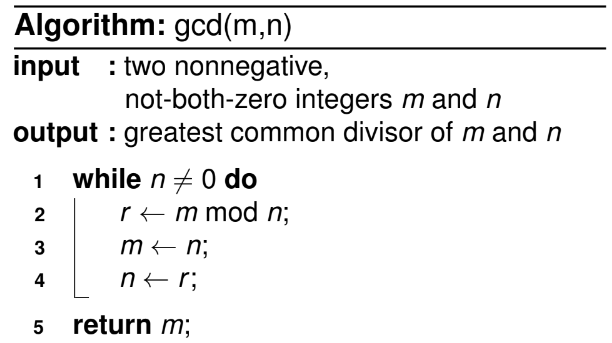

# ALGORITMOS E ESTRUTURAS DE DADOS

Referência da disciplina: [sites.google.com/a/cin.ufpe.br/if672](https://sites.google.com/a/cin.ufpe.br/if672/)

## O que são algoritmos?

Um **algoritmo** é uma sequência finita e bem definida de instruções que resolve um problema em tempo finito, sendo capaz de processar qualquer entrada válida para esse problema. Três propriedades são essenciais: a sequência de passos precisa ser **finita**, precisa **terminar** (não entrar em loop infinito) e precisa produzir o resultado correto para **qualquer** instância válida do problema, não apenas para um caso específico.

!!! example "Exemplo: MDC de dois números (algoritmo de Euclides)"
    O algoritmo abaixo calcula o Máximo Divisor Comum (MDC) entre dois números `m` e `n`.

    ??? note "Imagem de referência"
        

    Com a entrada `m = 60`, `n = 24`:

    ??? note "Imagem de referência"
        

    Passo a passo da execução:

    ??? note "Imagem de referência"
        

    1. Linha 3: `m = 24`; linha 4: `n = 12` — como `n ≠ 0`, o `while` é executado de novo.
    2. Linha 1: entra no `while` pois `n ≠ 0`; linha 2: `r` agora vale `0`; linha 3: `m = 12`; linha 4: `n = 0`. Como `n == 0`, o `while` para.
    3. Linha 5: `return m`, que vale `12` — essa é a resposta.

## Tipos de busca

### Sequential search

A **busca sequencial** compara, um a um, os elementos de uma array com uma chave de busca `K`, até encontrar uma correspondência (busca bem-sucedida) ou esgotar a lista (busca mal-sucedida). É o algoritmo de busca mais simples possível, mas também o menos eficiente — no pior caso, percorre todos os `n` elementos.

!!! example "Exemplo (array ordenada de forma crescente)"
    ??? note "Imagem de referência"
        

    Os parâmetros são a array `A` e a chave de busca `K`.

    - **Linha 1** — `i` recebe `0` (índice auxiliar).
    - **Linha 2** — um `while` é declarado: a condição de entrada é `i < n` (tamanho de `A`) **e** `A[i] ≠ K`.
    - **Linha 3** — enquanto a condição for verdadeira, `i` é incrementado em uma unidade, até que `i = n` ou `A[i] = K`.
    - **Linha 4** — ao sair do `while`, uma das condições de parada ocorreu. Se `i < n`, significa que não percorremos a lista inteira e `i` é o índice em que `A[i] = K`.
    - **Linha 5** — a outra condição de saída: `i = n`, ou seja, não encontramos nenhum `A[i] = K`; por isso retorna `-1`.

### Binary search

A **busca binária** compara a chave `K` com o elemento do meio da array, `A[m]`. Se eles coincidem, o algoritmo termina; caso contrário, ele repete recursivamente a busca em uma das duas metades, `A[0, …, m]` ou `A[m+1, …, n-1]`. É possível implementar a mesma ideia de forma iterativa, sem recursão. A busca binária é bem mais eficiente que a sequencial, mas **exige que a array esteja ordenada**.

!!! example "Versão recursiva"
    ??? note "Imagem de referência"
        

    Os parâmetros são a array `A`, o limite esquerdo `l`, o limite direito `r` e a chave `K`.

    1. Checa se `r ≥ l`.
    2. Se sim, `m` recebe `⌊(l + r)/2⌋` — o índice do meio da array.
    3. Checa se `A[m] = K`.
    4. Se sim, retorna `m` (índice onde `K` está).
    5. Checa se `K < A[m]`.
    6. Se sim, chama recursivamente com `l` e `m - 1` como novos limites (já que `A[m] > K`, o índice buscado está à esquerda de `m`).
    7. Checa se `K > A[m]`.
    8. Se sim, chama recursivamente com `m + 1` e `r` como novos limites (já que `K > A[m]`, o índice buscado está à direita de `m`).
    9. e 10. Se `r < l`, a busca falhou — retorna `-1`.

!!! example "Versão iterativa"
    ??? note "Imagem de referência"
        

    Os parâmetros são apenas a array `A` e a chave `K`.

    1. e 2. `l` recebe `0` e `r` recebe `n - 1` (primeiro e último índices da array).
    3. Um `while` é declarado com a condição `l ≤ r`.
    4. `m` recebe `⌊(l + r)/2⌋`.
    5. e 6. Se `K = A[m]`, retorna `m`.
    7. e 8. Se `K < A[m]`, `r` recebe `m - 1` (o índice buscado está à esquerda do meio).
    9. e 10. Se `K > A[m]`, `l` recebe `m + 1` (o índice buscado está à direita do meio).
    11. Se `l > r` ou o índice não foi encontrado dentro do `while`, retorna `-1` (falha).

## Tipos de algoritmos

Esta seção organiza os algoritmos de ordenação (sorting) e outros problemas clássicos segundo a **estratégia de projeto** usada para resolvê-los: força bruta, decrease-and-conquer, divide-and-conquer e transform-and-conquer.

### Brute Force (força bruta)

Algoritmos de força bruta resolvem um problema por **exaustão**, testando/aplicando a definição do problema diretamente, sem nenhuma otimização estrutural. São caracterizados pela simplicidade — costumam ser os mais fáceis de implementar — e usam, por exemplo, a busca sequencial descrita acima.

#### Selection sort

No **Selection sort**, escaneamos toda a array em busca do menor elemento e o trocamos de posição com o primeiro elemento. Repetimos esse processo `n - 1` vezes (para uma array de tamanho `n`), sempre considerando a partir da próxima posição. O nome vem justamente de "selecionar" o menor elemento restante a cada passo e colocá-lo em sua posição final.

!!! example "Algoritmo"
    ??? note "Imagem de referência"
        

    O único parâmetro é a array `A`.

    - **Linha 1** — `for i ← 0 to n - 2`. Fazemos isso por dois motivos: os índices de uma array vão de `0` a `n - 1`, e não é necessário percorrer o último elemento, pois ele já estará ordenado quando chegarmos nele.
    - **Linha 2** — `min` recebe `i`.
    - **Linha 3** — mais um laço, `for j ← i + 1 to n - 1`. `j` começa em `i + 1` pois não é necessário comparar um elemento com ele mesmo, e esse laço percorre todos os elementos à direita de `i` (os elementos à esquerda já estão ordenados).
    - **Linha 4** — comparamos `A[j] < A[min]`; se for verdade, `min` recebe `j`.
    - **Linha 5** — ocorre o swap entre `A[i]` e `A[min]`, deixando a array ordenada até a posição `i`.

#### Bubble sort

No **Bubble sort**, comparamos elementos adjacentes da array e os trocamos quando estão fora de ordem. A cada passagem completa, o maior elemento "borbulha" (*bubbles up*) até o final da array; repetindo o processo, o segundo maior sobe na próxima passagem, e assim por diante.

!!! example "Algoritmo"
    ??? note "Imagem de referência"
        

    O único parâmetro é a array `A`.

    - **Linha 1** — `for i ← 0 to n - 2`, pelo mesmo motivo do Selection sort.
    - **Linha 2** — `for j ← 0 to n - 2 - i`. O limite superior decresce em `i` porque os maiores elementos já ficaram no final da array nas iterações anteriores, não sendo necessário revisitá-los.
    - **Linha 3** — comparamos `A[j + 1] < A[j]`; se verdadeiro, trocamos as posições.

### Decrease and conquer

Nessa estratégia, exploramos a relação entre a solução de um problema e a solução de um problema **menor do mesmo tipo**. Pode ser implementada de duas formas:

- **Top-down** — implementação recursiva. A ideia é dividir o problema original em subproblemas menores, resolvê-los recursivamente e depois combinar as soluções (embora a versão final possa acabar sendo transformada em iterativa).
- **Bottom-up** — implementação iterativa. Começa pela solução do menor problema possível e vai construindo soluções para problemas cada vez maiores, até alcançar a solução original.

Existem três variações quanto a **quanto** o problema diminui a cada passo:

- **Decrease by a constant** — o tamanho da instância diminui por um valor fixo a cada iteração (normalmente igual a 1).

    ??? note "Imagem de referência"
        

- **Decrease by a constant factor** — o tamanho diminui por um fator constante a cada iteração (na maioria das aplicações, um fator igual a 2) — é o caso da busca binária.

    ??? note "Imagem de referência"
        

- **Variable decrease** — o padrão de redução varia de uma iteração para outra.

#### Insertion sort

A ideia do **Insertion sort** é que a subarray `A[0 .. n-2]` já está ordenada e precisamos inserir `A[n-1]` de modo que a array inteira permaneça ordenada. Isso é feito percorrendo os elementos da direita para a esquerda até achar a posição correta para o novo elemento, deslocando os maiores uma posição para a direita.

!!! example "Algoritmo"
    ??? note "Imagem de referência"
        

    O único parâmetro é a array `A`.

    - **Linha 1** — `for i ← 1 to n - 1`.
    - **Linha 2** — cria a variável auxiliar `v` (recebe `A[i]`) e o índice `j = i - 1`.
    - **Linha 3** — um `while` com as condições `j ≥ 0` e `A[j] > v`.
    - **Linha 4** — dentro do `while`, `A[j + 1]` recebe `A[j]` e `j` é decrementado. Isso continua até `j = 0` ou `A[j] ≤ v`. Se a condição for falsa desde o início, aquele trecho da array já está ordenado e nada acontece.
    - **Linha 5** — `A[j + 1]` recebe `v`, inserindo o elemento na posição correta.

    ??? note "Imagem de referência"
        

    Por exemplo, com `v = A[i] = 29` e `j = i - 1 = 3`: ao entrar no `while`, `j ≥ 0` e `A[j] = 90 > 29`, então `A[j+1]` recebe `90` e `j` decresce. No loop seguinte, `A[j] = 89 > 29`, então `A[j+1]` recebe `89`, e assim por diante até a array ficar ordenada de `0` a `i`.

### Divide and conquer

Algoritmos de **divisão e conquista** particionam um problema em vários subproblemas **do mesmo tipo**: o problema de tamanho `n` é dividido em `b` subproblemas de tamanho `n/b`, cada um resolvido recursivamente, e as soluções são combinadas ao final se necessário.

??? note "Imagem de referência"
    

#### Merge sort

No **Merge sort**, a array de `n` elementos é dividida em `A[0, …, n/2 - 1]` e `A[n/2, …, n-1]`, e cada metade é dividida recursivamente até restarem subarrays de tamanho unitário. Em seguida, as subarrays são combinadas (*merge*) de volta, já ordenadas. É um método eficiente, mas que gasta memória extra com as subarrays auxiliares. A divisão é trivial (imediata); todo o custo está na etapa de conquista (unir as subarrays).

??? note "Imagem de referência"
    

!!! example "Função MergeSort"
    ??? note "Imagem de referência"
        

    A função recebe a array `A[0, …, n-1]`, o primeiro índice `l` (inicialmente `0`) e o último índice `r` (inicialmente `n-1`).

    - **Linha 1** — checa se já chegamos a uma subarray de tamanho unitário; caso contrário, entra no bloco.
    - **Linha 2** — `m` recebe `⌊(l + r)/2⌋`, o índice do meio.
    - **Linha 3** — chama recursivamente `MergeSort` para os intervalos `[l, m]` e `[m+1, r]`. A recursão se repete até chegar a subarrays unitárias; quando as chamadas retornam, ambos os intervalos já estão ordenados, e a função `Merge` é chamada sobre `[l, r]`.

!!! example "Função Merge"
    ??? note "Imagem de referência"
        

    - **Linha 1** — `for i ← l to r do temp[i] ← A[i]`: copia a subarray `A[l..r]` para uma array temporária `temp`.
    - **Linha 2** — `m` recebe `⌊(l + r)/2⌋`.
    - **Linha 3** — cria dois índices, `i1 = l` e `i2 = m + 1`.
    - **Linha 4** — outro `for`, de `curr = l` até `r`, com quatro condições que fazem a ordenação da array `A`.
    - **Linha 5** — se `i1 = m + 1` (todos os elementos à esquerda do meio já foram usados), `A[curr]` recebe `temp[i2++]`.
    - **Linha 6** — se `i2 > r` (todos os elementos à direita do meio já foram usados), `A[curr]` recebe `temp[i1++]`.
    - **Linhas 7–8** — se `temp[i1] ≤ temp[i2]`, o fragmento à esquerda tem o menor valor: `A[curr]` recebe `temp[i1++]`.
    - **Linha 9** — caso contrário (`temp[i2] < temp[i1]`), o fragmento à direita tem o menor valor: `A[curr]` recebe `temp[i2++]`.

#### Quick sort

Diferente do Merge sort, que divide pela posição, o **Quick sort** divide pelo **valor**: escolhemos um pivô através de uma função de particionamento e movemos os elementos menores que o pivô para a esquerda e os maiores para a direita (elementos iguais ao pivô podem ficar de qualquer lado). Aqui a divisão **não** é trivial (por causa da partição), mas a conquista é imediata — o inverso do Merge sort.

!!! example "QuickSort"
    ??? note "Imagem de referência"
        

    - **Linha 1** — se o limite esquerdo é menor que o direito, há mais de um elemento; caso contrário a array já está ordenada (tamanho 1).
    - **Linha 2** — a variável de pivô `s` recebe o resultado do particionamento de `A` entre os limites esquerdo e direito. `s` é a posição final e correta do pivô.
    - **Linhas 3–4** — chamadas recursivas, uma para os elementos à esquerda de `s`, outra para os elementos à direita.

**Hoare partition**

??? note "Imagem de referência"
    

- **Linhas 1–3** — o pivô `p` recebe `A[l]` (elemento mais à esquerda do intervalo); criam-se os índices `i = l` (caminha da esquerda para a direita) e `j = r + 1` (começa "fora" do range, pois assim o código consegue incluir o último índice `r` ao caminhar da direita para a esquerda).
- **Linhas 4 e 12** — um laço `repeat-until`: primeiro executa o corpo, depois checa a condição (`i ≥ j`).
- **Linhas 5–7** — outro `repeat-until`, que incrementa `i` até que `A[i] ≥ p` ou `i ≥ r`. Quando `A[i] ≥ p`, encontramos o primeiro elemento (da esquerda para a direita) maior ou igual ao pivô.
- **Linhas 8–10** — outro `repeat-until`, que decrementa `j` até que `A[j] ≤ p`. `j` acaba indexando o primeiro elemento (da direita para a esquerda) menor ou igual ao pivô.
- **Linha 11** — troca `A[i]` com `A[j]`, já que `A[i] ≥ p ≥ A[j]`.
- **Linha 13** — após a condição de parada, desfaz o último swap (que, por causa do cruzamento de `i` e `j`, acaba repetindo a troca anterior sem necessidade).
- **Linha 14** — troca `A[l]` (o pivô) com `A[j]`, posição que sabemos conter um elemento menor ou igual ao pivô.
- **Linha 15** — retorna `j`, a posição final do pivô, usada por `QuickSort` para as chamadas recursivas `QuickSort(A, l, s-1)` e `QuickSort(A, s+1, r)`.

!!! example "Exemplo de execução"
    ??? note "Imagem de referência"
        

    Linhas 1 a 3:

    ??? note "Imagem de referência"
        

    Primeiro loop do `repeat-until` principal, até a linha 10 (condição de parada ainda falsa):

    ??? note "Imagem de referência"
        

    Linha 11 — swap entre `0` e `7` (ficam ordenados):

    ??? note "Imagem de referência"
        

    Segundo loop — acontece de novo um swap entre `0` e `7` (que não deveria ter ocorrido), e a condição de parada vira verdadeira:

    ??? note "Imagem de referência"
        

    Linha 13 — desfaz o último swap:

    ??? note "Imagem de referência"
        

    Linha 14 — swap entre `p` e `A[j]` (0 e 5); ambos ficam em posições corretas, já que à esquerda do pivô só há elementos menores ou iguais a ele, e à direita, maiores ou iguais. A função retorna a posição `3` (`j`), e o processo continua recursivamente.

**Lomuto partition**

```
LomutoPartition(A[left, right])
  pivot = A[left]
  s = left
  for i = left+1 to right do
      if A[i] < pivot
          s = s + 1
          swap(A[s], A[i])
  swap(A[left], A[s])
  return s
```

??? note "Imagem de referência (slide)"
    

### Transform and conquer

A estratégia **transform-and-conquer** resolve um problema transformando-o em uma versão mais simples ou conveniente do mesmo problema, em outro problema para o qual já existe um algoritmo eficiente, ou em uma representação equivalente que facilite a solução. Exemplos clássicos incluem pré-ordenar os dados antes de buscá-los (permitindo busca binária) e balancear árvores de busca para garantir eficiência — assunto que será detalhado mais adiante, na seção de árvores.

## Efficiency

A eficiência de um algoritmo depende do seu **running time** (tempo de execução) e do seu **memory space** (espaço de memória usado), ambos em função do tamanho da entrada (*input size*).

- **Running time** — quanto tempo o algoritmo leva para processar uma entrada de tamanho `n`.
- **Memory space** — quanta memória o algoritmo consome, somando a memória da entrada com a memória usada para gerar a saída.

### Unidades e notações assintóticas

??? note "Imagem de referência"
    

    

As notações assintóticas descrevem o comportamento de uma função de eficiência conforme o tamanho da entrada cresce, abstraindo constantes e termos de menor ordem:

| Notação | Significado | Definição informal |
|---|---|---|
| $O(g(n))$ | Limite superior (*upper bound*) | $t(n)$ cresce no máximo tão rápido quanto $g(n)$ |
| $\Omega(g(n))$ | Limite inferior (*lower bound*) | $t(n)$ cresce no mínimo tão rápido quanto $g(n)$ |
| $\Theta(g(n))$ | Limite justo (*tight bound*) | $t(n)$ cresce exatamente na mesma ordem de $g(n)$ |

??? note "Imagem de referência"
    

    

### Tipos de eficiência

Para um algoritmo cujo comportamento varia conforme a entrada (não apenas o tamanho, mas o conteúdo), distinguimos três cenários:

- **Worst-case** — o maior tempo possível entre todas as entradas de tamanho `n` (o cenário mais usado na prática, por dar uma garantia).
- **Average-case** — o tempo médio considerando a distribuição esperada das entradas.
- **Best-case** — o menor tempo possível entre todas as entradas de tamanho `n`.

??? note "Imagem de referência"
    

    

!!! note "Sequential search vs. Binary search"
    - Eficiência da busca sequencial: $O(n)$.
    - Eficiência da busca binária: $O(n \log n)$ para ordenar a array + $O(\log n)$ para a busca propriamente dita.
    - Para uma única busca (ou poucas buscas), a busca sequencial costuma ser melhor, já que não exige ordenar a array antes. Para muitas buscas na mesma array, compensa ordenar uma vez e usar busca binária repetidamente.

### Comparando algoritmos de ordenação

??? note "Imagem de referência"
    

| Algoritmo | Melhor caso | Caso médio | Pior caso | Espaço extra |
|---|---|---|---|---|
| Selection sort | $O(n^2)$ | $O(n^2)$ | $O(n^2)$ | $O(1)$ |
| Bubble sort | $O(n)$ | $O(n^2)$ | $O(n^2)$ | $O(1)$ |
| Insertion sort | $O(n)$ | $O(n^2)$ | $O(n^2)$ | $O(1)$ |
| Merge sort | $O(n \log n)$ | $O(n \log n)$ | $O(n \log n)$ | $O(n)$ |
| Quick sort | $O(n \log n)$ | $O(n \log n)$ | $O(n^2)$ | $O(\log n)$ |
| Heap sort | $O(n \log n)$ | $O(n \log n)$ | $O(n \log n)$ | $O(1)$ |

## Tipos abstratos de dados e estruturas de dados

Antes de falar de estruturas de dados específicas, vale fixar o vocabulário usado na disciplina:

- **Type** — uma coleção de valores possíveis. Por exemplo, o type `bool` consiste na coleção `{true, false}`.
- **Data item** — uma peça de informação cujo valor vem de um type; um data item é um *member* do type.
- **Data type** — o tipo de dado **junto com** a coleção de operações que manipulam esse type (por exemplo, a operação de soma sobre o type `int`).
- **Abstract Data Type (ADT)** — o data type encarado como um componente de **software** (não de hardware): a especificação do comportamento, sem se comprometer com uma implementação.
- **Data structure** — a **implementação** concreta do ADT. Em linguagens orientadas a objetos, o ADT junto com sua implementação corresponde a uma `class`, e cada operação do ADT é implementada por um `method`. Um `object` é uma instância da classe — algo criado e que ocupa memória durante a execução do programa — e as variáveis que definem o espaço necessário para um data item são chamadas de `data members`.

??? note "Imagem de referência"
    

### Listas

Uma **lista** é uma sequência finita e ordenada de itens de dado, chamados `elements`. "Ordenada" aqui não significa que os valores estão em ordem crescente/decrescente, mas que cada elemento tem uma **posição** definida dentro da lista — o conceito mais importante para entender listas é justamente a noção de posição (primeiro elemento, segundo elemento, etc.). Quando a lista está vazia, não há elementos nela.

Alguns termos:

- **Length** (tamanho) — número de elementos da lista.
- **Head** (cabeça) — início da lista.
- **Tail** (cauda) — final da lista.
- **Sorted list** — uma lista cujos elementos estão dispostos em uma ordem específica de valor.

Cada elemento de uma lista possui um data type — uma lista pode, inclusive, misturar mais de um data type. Ao implementar uma classe de lista genérica, costuma-se usar um tipo "placeholder" `E`, que representa qualquer tipo de elemento (se usássemos apenas `char` ou apenas `int`, a lista ficaria restrita a esse tipo).

**Operações básicas** (a maioria depende do conceito de posição atual, `curr`):

| Método | Descrição |
|---|---|
| `clear` | Esvazia a lista |
| `insert` | Insere um elemento na posição atual |
| `append` | Adiciona um elemento ao final da lista |
| `remove` | Remove o elemento na posição atual |
| `moveToStart` | Move a posição atual para o início da lista |
| `moveToEnd` | Move a posição atual para o fim da lista |
| `prev` | Move a posição atual uma posição para a esquerda |
| `next` | Move a posição atual uma posição para a direita |
| `length` | Retorna o tamanho atual da lista |
| `currPos` | Retorna a posição atual |
| `moveToPos` | Move a posição atual para uma posição arbitrária |
| `getValue` | Retorna o valor na posição atual |

Métodos adicionais podem ser criados conforme a necessidade da aplicação.

#### Listas baseadas em array (Array-Based List)

Os elementos são armazenados em posições de memória contíguas, formando uma array. Cada elemento tem um índice fixo correspondente à sua posição.

```cpp
#include <iostream>

using namespace std;
#define DEFAULT_SIZE = 5

// esse tipo E é um tipo arbitrário; podemos tirar o E e substituir
// por int, por exemplo, removendo o template
template <typename E>
class ArrList {
private:
    int maxSize;
    int listSize;
    int curr;
    E *listArray;
public:
    explicit ArrList(int size = DEFAULT_SIZE) {
        maxSize = size;
        listSize = curr = 0;
        listArray = new E[maxSize];
    }

    void clear() {
        delete[] listArray;
        listSize = curr = 0;
        listArray = new E[maxSize];
    }

    void insert(E value) {
        if (listSize >= maxSize) {
            cerr << "Error! List is full";
            exit(1);
        }

        int i = listSize;

        while (i > curr) {
            listArray[i] = listArray[i - 1];
            i--;
        }

        listArray[curr] = value;
        listSize++;
    }

    void moveToStart() {
        curr = 0;
    }

    void moveToEnd() {
        curr = listSize;
    }

    void prev() {
        if (curr != 0) {
            curr--;
        }
    }

    void next() {
        if (curr < listSize){
            curr++;
        }
    }

    void append(E it) {
        if (listSize < maxSize) {
            cerr << "Error! List is full";
            exit(1);
        }

        listArray[listSize++] = it;
    }

    E remove() {
        if (curr < 0 || curr >= listSize) {
            return NULL;
        }

        E it = listArray[curr];
        E i = curr;

        while (i < listSize - 1) {
            listArray[i] = listArray[i + 1];
            i++;
        }

        listSize--;
        return it;
    }

    int length() {
        return listSize;
    }

    int currPos() {
        return curr;
    }

    void moveToPos(int pos) {
        if (pos >= 0 && pos <= listSize) {
            curr = pos;
        }
    }

    E getValue() {
        if (curr >= 0 && curr <= listSize) {
            return listArray[curr];
        }
    }

    ~ArrList() {
        delete[] listArray;
    }
};
```

#### Listas encadeadas (Linked List)

Diferente das listas baseadas em array, as listas encadeadas usam **ponteiros** e alocação **dinâmica** de memória. Uma lista encadeada é formada por uma série de objetos chamados **nós** (list nodes) — boa prática: implementar uma classe separada para o nó. Cada nó guarda o valor do elemento e um campo `next`, que aponta para o próximo nó da lista.

A classe da lista mantém três ponteiros: para o início (`head`), para o fim (`tail`) e para a posição atual (`curr`). Como os nós são alocados conforme necessário, **não** é preciso declarar um tamanho fixo ao criar a lista.

??? note "Imagem de referência"
    

**Doubly Linked Lists** (listas duplamente encadeadas) — cada nó possui um ponteiro para o próximo **e** para o anterior, permitindo percorrer a lista em ambos os sentidos.

??? note "Imagem de referência"
    

**Circular Linked Lists** (listas circulares) — o último nó aponta de volta para o primeiro, formando um ciclo em vez de terminar em `NULL`.

??? note "Imagem de referência"
    

#### Array-based list vs. Linked list

| | Array-based list | Linked list |
|---|---|---|
| Tamanho | Precisa ser predeterminado antes de alocar a array; a lista só cresce até esse limite | Cresce dinamicamente, sem limite predefinido |
| Uso de memória | Sem desperdício por elemento | Cada nó precisa de um ponteiro extra, o que pode ser uma quantidade considerável de memória |
| Acesso | Acesso direto por índice | Acesso sequencial, percorrendo nós |

No geral, listas encadeadas costumam ser preferíveis, mas há cenários (por exemplo, quando se conhece o tamanho máximo e se quer acesso rápido por índice) em que listas baseadas em array são a escolha melhor.

### Pilhas

Uma **pilha** (stack) é uma estrutura parecida com uma lista, mas com acesso **restrito**: elementos só podem ser inseridos ou removidos por uma das extremidades. Existem duas convenções possíveis:

- **LIFO** (*Last In, First Out*) — o último elemento inserido é o primeiro a ser removido. É a convenção mais usada quando se fala de "pilha".
- **FILO** (*First In, Last Out*) — equivalente ao LIFO, descrito do ponto de vista do primeiro elemento inserido.

A analogia clássica é uma pilha de pratos: o último prato colocado é o primeiro a ser retirado. Essa restrição torna a pilha menos flexível que uma lista genérica, mas não compromete sua eficiência — pelo contrário, operações em pilha são tipicamente $O(1)$.

??? note "Imagem de referência"
    

**Operações básicas**

| Método | Descrição |
|---|---|
| `clear` | Esvazia a pilha |
| `push` | Adiciona um elemento no topo |
| `pop` | Remove o elemento do topo |
| `topValue` | Retorna o elemento do topo, sem removê-lo |
| `length` | Retorna a altura (quantidade de elementos) da pilha |

#### Pilhas baseadas em array

A array interna (`stackArray`) é criada com tamanho fixo no momento da criação da pilha.

```cpp
#include <iostream>

using namespace std;

#define MAX 100;

// esse tipo E é um tipo arbitrário; podemos tirar o E e substituir
// por int, por exemplo, removendo o template
template <typename E>
class ArrStack {
    int top;
public:
    int stackArray[MAX];

    ArrStack() {
        top = -1;
    }

    bool push(int x) {
        if (top >= (MAX - 1)) {
            cout << "Stack Overflow";
            return false;
        }

        else {
            stackArray[++top] = x;
            cout << x << " pushed into stack\n";
            return true;
        }
    }

    int pop() {
        if (top < 0) {
            cout << "Stack Underflow";
            return 0;
        }

        else {
            int x = stackArray[top--];
            return x;
        }
    }

    int topValue() {
        if (top < 0) {
            cout << "Stack is Empty";
            return 0;
        }

        else {
            int x = stackArray[top];
            return x;
        }
    }

    bool isEmpty() {
        return (top < 0);
    }

    int length() {
        return (top + 1);
    }
};
```

#### Pilhas encadeadas

Como só precisamos acessar o elemento do topo, não é necessário manter três ponteiros como nas listas encadeadas — basta um único ponteiro, apontando para o nó do topo. A lógica de implementação é bastante semelhante à das listas encadeadas em geral.

```c
// Estrutura de nó para uma pilha encadeada:
// cada nó guarda um valor e um ponteiro para o nó abaixo dele no topo.
typedef struct StackNode {
    int value;
    struct StackNode *next;
} StackNode;

// A pilha é representada apenas pelo ponteiro para o topo.
StackNode *top = NULL;
```

Ambas as abordagens (array e encadeada) são eficientes — $O(1)$ para `push`, `pop` e `topValue`.

### Filas

Assim como as pilhas, as **filas** (queues) são estruturas parecidas com listas, mas com acesso restrito. A diferença em relação à pilha é a convenção de acesso: elementos são inseridos no final da fila (operação `enqueue`) e removidos do início (operação `dequeue`) — ou seja, **FIFO** (*First In, First Out*).

??? note "Imagem de referência"
    

**Operações**

| Método | Descrição |
|---|---|
| `clear` | Esvazia a fila |
| `enqueue` | Insere um novo elemento no final da fila |
| `dequeue` | Remove o elemento do início da fila |
| `frontValue` | Retorna o elemento do início, sem removê-lo |
| `rear` | Retorna o elemento do final, sem removê-lo |
| `length` | Retorna o tamanho da fila |

#### Filas baseadas em array

```c
#include <iostream>

using namespace std;

#define MAX 100;

// esse tipo E é um tipo arbitrário; podemos tirar o E e substituir
// por int, por exemplo, removendo o template
template <typename E>
class ArrQueue {
private:
   int front;
   int rear;
   E *queuearray;
public:
    ArrQueue() {
        front = rear = -1;
        queuearray = new E[MAX]
    }

    bool isEmpty() {
        return front == rear;
    }

    bool isFull() {
        return rear == MAX - 1;
    }

    void enqueue(E value) {
        if (isFull()) {
            cout << "Queue is full!" << endl;
            return;
        }

        rear++;
        queuearray[rear] = value;

        if (front == -1) {
            front = rear;
        }

        cout << value << "enqueued" << endl;
    }

    E dequeue() {
        if (isEmpty()) {
            cout << "Queue is empty!" << endl;
            return NULL;
        }

        E item = queuearray[front];
        front++;

        if (front == rear) {
            front = rear = -1;
        }

        return item;
    }

    E frontValue() {
        if (isEmpty()) {
            cout << "There is no front value" << endl;
            return NULL;
        }

        return queuearray[front];
    }

    E rearValue() {
        if (isEmpty()) {
            cout << "There is no rear value" << endl;
            return NULL;
        }

        return queuearray[rear];
    }
};
```

#### Filas encadeadas

Nessa abordagem, `front` e `rear` são ponteiros que apontam, respectivamente, para o primeiro e o último nó da lista encadeada subjacente — `enqueue` ajusta `rear->next`, e `dequeue` avança `front`.

```c
// Estrutura de nó para uma fila encadeada.
typedef struct QueueNode {
    int value;
    struct QueueNode *next;
} QueueNode;

QueueNode *front = NULL; // aponta para o início da fila
QueueNode *rear  = NULL; // aponta para o final da fila
```

## Sets

Um **set** (conjunto) é uma coleção **desordenada** de elementos. Pode ser definido explicitamente (listando os elementos) ou por uma propriedade que todos os elementos do conjunto satisfazem.

### Implementação

Existem duas formas comuns de implementar sets:

1. **Bit vector** — usada quando consideramos apenas subconjuntos de um grande conjunto universal `U`. Se `U` tem `n` elementos, cada subconjunto `S ⊆ U` pode ser representado por uma string de bits de tamanho `n`: o `i`-ésimo bit vale `1` se o `i`-ésimo elemento de `U` pertence a `S`.

    !!! example
        $U = \{1, 2, 3, 4, 5\}$, $S = \{2, 3, 5\}$ → o bit vector de $S$ é `01101`.

2. **Listas** — a forma mais comum na prática. É importante não confundir sets com listas:
    - Sets não admitem elementos duplicados; listas permitem. Essa diferença é contornada, quando necessário, com **multiset** (ou *bag*): uma coleção não ordenada de itens não necessariamente distintos.
    - Sets são coleções não ordenadas: mudar a ordem dos elementos não altera o conjunto. Já em uma lista, a posição dos elementos importa.

Na prática, as operações mais usadas sobre sets são: **encontrar** um item, **adicionar** um novo item e **deletar** um item. Uma estrutura de dados que implementa essas três operações é chamada de **dicionário**. Uma implementação eficiente de dicionário precisa equilibrar a eficiência da busca com a das outras duas operações — algumas formas de fazer isso são arrays (pouco recomendado), listas encadeadas, hashing (visto mais adiante) ou árvores de busca balanceadas.

Diversas aplicações exigem **partição dinâmica** de um conjunto de `n` elementos em subconjuntos disjuntos: depois de inicializar como `n` subconjuntos de um elemento cada, a coleção sofre uma sequência de operações mistas de **união** e **busca** — o chamado problema da **união de conjuntos** (*union-find*), detalhado mais adiante na seção de árvores geradoras mínimas.

### ADT de um dicionário

??? note "Imagem de referência"
    

## Trees

Uma **árvore** (mais precisamente, uma *árvore livre*) é um grafo conexo e acíclico. Um grafo acíclico mas não necessariamente conexo é chamado de **floresta**.

??? note "Imagem de referência"
    

### Árvores enraizadas

Uma **árvore enraizada** possui uma **raiz** (nível 0), e cada vértice pode ter filhos (no caso binário, no máximo dois), formando os níveis seguintes. É uma estrutura muito útil para implementar dicionários, acessar conjuntos de dados grandes de forma eficiente, entre outras aplicações.

**Nomenclatura**

| Termo | Significado |
|---|---|
| Root (Raiz) | Vértice de origem da árvore |
| Parent (Pai) | Vértice que possui filhos |
| Child (Filho) | Vértice que descende de um pai |
| Siblings (Irmãos) | Vértices que compartilham o mesmo pai |
| Leaf (Folha) | Vértice sem filhos |
| Parental | Vértice com pelo menos um filho |
| Descendants (Descendentes) | Todos os vértices originados a partir de um vértice `v` |
| Depth (Profundidade) | Quantos vértices um vértice `v` precisa atravessar para chegar à raiz |
| Height (Altura) | O maior caminho entre uma folha e a raiz |

### Árvores ordenadas

Uma **árvore ordenada** é uma árvore enraizada em que todo vértice tem seus filhos ordenados (por exemplo, "filho à esquerda" e "filho à direita" têm significado bem definido).

Uma **árvore binária** é uma árvore em que cada vértice tem, no máximo, dois filhos, cada um designado como filho à esquerda ou filho à direita do pai; a árvore vazia também é considerada uma árvore binária válida.

### Binary Search Tree (BST)

Uma **árvore de busca binária** é uma árvore binária ordenada em que cada vértice guarda um valor (chave), com a propriedade: todo filho à esquerda tem valor **menor** que o do pai, e todo filho à direita tem valor **maior ou igual**. A raiz é o único vértice que não é filho de ninguém, então toda a árvore é organizada em torno do valor da raiz. Para implementar uma BST, cada vértice precisa de ponteiros para seus filhos (e, opcionalmente, para o pai).

??? note "Imagem de referência"
    

    

### Traversals (travessias)

Uma **travessia** é um método sistemático de percorrer todos os vértices de uma árvore (ou grafo). Para árvores binárias, as três travessias clássicas são:

#### Pre-order

Visitamos primeiro a **raiz**, depois percorremos recursivamente toda a subárvore **esquerda**, e por fim toda a subárvore **direita**. Dentro de cada subárvore, a mesma regra se aplica recursivamente (raiz → esquerda → direita).

!!! example
    ??? note "Imagem de referência"
        

    Pre-order: 37 (raiz), 24 (filho esquerdo da raiz), 7 (neto, esquerda-esquerda), 2 (bisneto, esquerda-esquerda-esquerda), 32 (neto, esquerda-direita), 42 (filho direito da raiz), 40 (neto, direita-esquerda), 42 (neto, direita-direita), 120 (bisneto, direita-direita-direita).

    ??? note "Imagem de referência"
        

    Pre-order: 5, 3, 2, 1, 4, 7, 6, 8, 7, 12, 9, 14, 23, 21, 18, 56.

#### In-order

Percorremos primeiro toda a subárvore **esquerda**, depois a **raiz**, e por fim toda a subárvore **direita**. Em uma BST, essa travessia sempre produz os valores em ordem **não decrescente** — é a travessia usada quando se quer "ler" a árvore como uma lista ordenada.

!!! example
    ??? note "Imagem de referência"
        

    In-order: 2, 7, 24, 32, 37, 40, 42, 42, 120.

    ??? note "Imagem de referência"
        

    In-order: 1, 2, 3, 4, 5, 6, 7, 7, 8, 9, 12, 14, 18, 21, 23, 56.

#### Post-order

Percorremos primeiro toda a subárvore **esquerda**, depois toda a subárvore **direita**, e só então a **raiz**.

!!! example
    ??? note "Imagem de referência"
        

    Post-order: 2, 7, 32, 24, 40, 120, 42, 42, 37.

    ??? note "Imagem de referência"
        

    Post-order: 1, 2, 4, 3, 6, 7, 9, 18, 21, 56, 23, 14, 12, 8, 7, 5.

### Balanced search tree (árvore de busca balanceada)

Uma **árvore de busca balanceada** mantém o equilíbrio entre os lados esquerdo e direito de cada vértice conforme novos elementos são inseridos — é, em essência, uma BST que se mantém balanceada. Sem esse cuidado, inserções em sequência (por exemplo, valores já ordenados) podem degenerar a árvore em algo parecido com uma lista encadeada, destruindo a eficiência logarítmica da busca.

#### AVL

A árvore **AVL** garante que a diferença de altura entre as subárvores esquerda e direita de **qualquer** nó nunca seja maior que 1. Essa diferença é chamada de **fator de balanceamento**: se o nó está balanceado, o fator vale `0`, `-1` ou `1`; qualquer outro valor exige uma **rotação**. (Convenção: a altura de uma árvore vazia é `-1`.) As rotações existem justamente para restaurar o balanceamento e preservar a eficiência de busca, inserção e remoção.

**Rotações**

A rotação é o mecanismo central da AVL para re-balancear a árvore. Existem quatro tipos:

- **L-rotation** — rotação simples para a esquerda.

    ??? note "Imagem de referência"
        

        

- **R-rotation** — rotação simples para a direita.

    ??? note "Imagem de referência"
        

        

- **LR-rotation** — rotação dupla: primeiro para a esquerda, depois para a direita.

    ??? note "Imagem de referência"
        

        

- **RL-rotation** — rotação dupla: primeiro para a direita, depois para a esquerda.

    ??? note "Imagem de referência"
        

        

!!! warning "Toda rotação exige recalcular alturas"
    Após qualquer uma dessas rotações, é preciso atualizar as alturas dos nós envolvidos — esse detalhe é fácil de esquecer na hora de implementar.

!!! example "Construindo uma AVL com as inserções 4, 6, 8, 3, 2, 5"
    Inserindo 4 e 6:

    ??? note "Imagem de referência"
        

    Inserindo 8:

    ??? note "Imagem de referência"
        

    O nó `4` fica desbalanceado: altura da subárvore esquerda menos a direita dá `-2` (`-1` da esquerda menos `1` da direita). Como o desbalanço está na parte direita da subárvore direita, fazemos uma **L-rotation**, trocando `6` de lugar com `4`:

    ??? note "Imagem de referência"
        

    Inserindo 3:

    ??? note "Imagem de referência"
        

    Inserindo 2:

    ??? note "Imagem de referência"
        

    O nó `4` fica desbalanceado de novo: `1` da esquerda menos `-1` da direita dá `2`. Como o desbalanço está na parte esquerda da subárvore esquerda, fazemos uma **R-rotation**, trocando `3` de lugar com `4`:

    ??? note "Imagem de referência"
        

## Space and time trade-offs

Muitas técnicas melhoram a eficiência **temporal** em detrimento da eficiência **espacial** — ou seja, trocam memória por velocidade.

### Input enhancement

A ideia é **pré-processar** a entrada do problema (total ou parcialmente) e armazenar informações adicionais para acelerar a resolução posterior.

#### Counting sort methods

**Comparison counting sort**

Para cada elemento, contamos quantos outros elementos são menores que ele — esse contador é exatamente a posição final do elemento em uma array ordenada de forma não decrescente. Ao final, usamos essas contagens para montar a array ordenada `S`.

!!! example "Algoritmo"
    ??? note "Imagem de referência"
        

    A array `count`, de tamanho `A.length()`, guarda a posição correta de cada elemento de `A` em uma versão ordenada. O `i`-ésimo elemento de `count` indica a posição correta do `i`-ésimo elemento de `A`. `S` é a array resultante, já ordenada.

    ??? note "Imagem de referência"
        

    - Inicialmente, `count[i] = 0` para todo `i`.
    - Para cada par `(i, j)` com `j > i`: se `A[i] > A[j]`, incrementamos `count[i]`; caso contrário, incrementamos `count[j]`.
    - No final, cada elemento de `count` é o índice correto do elemento correspondente de `A` na ordem não decrescente. Por exemplo, `3` pode ser o índice correto do elemento `62`, `1` o índice correto do elemento `31`, e assim por diante.

**Distribution counting**

Aqui consideramos o menor e o maior elemento, além de duas informações por elemento: sua **frequência** (quantas vezes aparece na array) e seu **valor de distribuição** (ligado aos índices finais). Começamos atribuindo valor de distribuição `1` ao menor elemento; para cada elemento seguinte, o valor de distribuição é o valor de distribuição do elemento anterior somado à sua própria frequência. Com base nisso, percorremos `A` da direita para a esquerda, colocando cada elemento no índice `(valor de distribuição − 1)` da array `S`, e decrementando o valor de distribuição a cada inserção.

!!! example "Algoritmo"
    ??? note "Imagem de referência"
        

        

        

        

#### Boyer-Moore algorithm for string matching

Algoritmo de casamento de padrões em strings que usa pré-processamento do padrão para pular posições na busca, evitando comparações redundantes. A versão simplificada (apenas com a heurística do "mau caráter", *bad character*) é conhecida como algoritmo de **Horspool**.

### Prestructuring

Explora trade-offs entre espaço e tempo usando espaço **extra** para facilitar um acesso mais rápido e/ou flexível aos dados. Diferente do *input enhancement*, aqui o processamento prévio modifica a **estrutura de acesso** aos dados, não apenas informações auxiliares sobre eles.

#### Hashing

O **hashing** é uma forma muito eficiente de implementar dicionários. A ideia central é distribuir as chaves (identificadores dos elementos) em uma array unidimensional $H[0, \ldots, m-1]$, chamada de **Hash Table**. Essa distribuição é calculada por uma função pré-definida, a **Hash Function**, que recebe a chave e devolve um inteiro entre $0$ e $m - 1$: o **Hash Address**.

**Tipos de chave**

- **int** — se as chaves são números não negativos, uma Hash Function simples é $h(K) = K \bmod m$.

    - *Trivial method*: tentativa trivial, $h(K) = K \bmod m$. Por exemplo, com $m = 100$ (endereços de hash em `0..99`) e $K = 4567$: $h(K) = 4567 \bmod 100 = 67$.

        ??? note "Imagem de referência (slide)"
            

    - *Mid-Square method*: uma abordagem melhor — computa-se $K^2$ e seleciona-se os $r$ dígitos do meio, tais que $10^r - 1 < m$. Por exemplo, com $m = 100$ (logo $r = 2$) e $K = 4567$: $K^2 = 20857489$, e os dois dígitos do meio dão $h(K) = 57$.

        ??? note "Imagem de referência (slide)"
            

- **char** — se as chaves são letras do alfabeto, podemos usar sua posição (por exemplo, o código ASCII) e aplicar a mesma lógica das chaves inteiras.
- **string** — podemos somar os valores ASCII de cada caractere e aplicar `mod m`.

    - *Fold*: soma os valores (código de caractere) de cada posição da string e aplica `mod m`.

        ```
        Algorithm: int h(string K)
        1  s ← length(K)
        2  sum ← 0
        3  for i ← 0 to s - 1 do
        4      sum ← sum + K[i]
        5  return abs(sum) % m   // abs = overflow e %
        ```

        A distribuição é justa ou ruim dependendo de `m` e `K`: supondo `length(K) = 10` (em média) e que `K` tenha apenas letras maiúsculas — como `A = 65` e `Z = 90`, `sum ∈ [650..900]`. Se `m ≤ 100`, a distribuição é justa; se `m ≥ 1000`, é ruim.

        ??? note "Imagem de referência (slide)"
            

            

    - *Shift-fold (sfold)*: uma abordagem melhor — divide a string em blocos de 4 caracteres, trata cada bloco como um inteiro (combinando os bytes via multiplicação por potências de 256) e soma os blocos, antes de aplicar `mod m`.

        ```
        Algorithm: int h(string K)
        1   intLength ← length(K) / 4
        2   sum ← 0
        3   for i ← 0 to intLength - 1 do
        4       sub ← substring(K, i*4, (i*4)+4)   // posição inicial e final
        5       mult ← 1
        6       for j ← 0 to 3 do
        7           sum ← sum + sub[j] * mult
        8           mult ← mult * 256
        9   sub ← substring(K, intLength*4)          // posição inicial até o fim
        10  mult ← 1
        11  s ← length(sub)
        12  for j ← 0 to s - 1 do
        13      sum ← sum + sub[j] * mult
        14      mult ← mult * 256
        15  return abs(sum) % m   // abs = overflow e %
        ```

        ??? note "Imagem de referência (slide)"
            

**Hash tables — propriedades desejáveis**

- A função deve ser fácil de computar.
- O tamanho da tabela não deve ser excessivamente grande em relação ao número de chaves, mas precisa ser suficiente para não degradar a eficiência temporal.
- A função deve distribuir as chaves o mais **uniformemente** possível entre as posições da tabela.

**Colisões**

Uma **colisão** ocorre quando duas ou mais chaves distintas produzem o mesmo endereço de hash — ou seja, "competem" pela mesma posição da tabela: $h(K_i) = h(K_j)$ para $K_i \neq K_j$.

??? note "Imagem de referência (diagrama)"
    

Se o tamanho `m` da tabela for menor que o número de chaves `n`, colisões são inevitáveis — mas elas podem ocorrer mesmo com `m` bem maior que `n`. No pior caso teórico, todas as chaves mapeiam para o mesmo endereço; na prática, com um tamanho de tabela apropriado e uma boa função de hash, isso é raro. Ainda assim, **todo** esquema de hashing precisa de um mecanismo de resolução de colisões.

**Estratégias para resolver colisões**

=== "Open hashing (Separate Chaining)"
    Cada posição da tabela aponta para uma lista encadeada contendo todas as chaves que mapearam para aquele endereço — ou seja, cada endereço de hash está associado a uma lista encadeada.

    !!! example
        ??? note "Imagem de referência"
            

        Convenção: $A = 1$, $Z = 26$. A chave de cada palavra é a soma dos valores de suas letras, módulo 13. Note que *are* e *soon* têm a mesma chave, mas *are* chegou primeiro, então ocupa a primeira posição da célula 11, seguida por *soon*.

    **ADT dict**

    O dicionário é representado por um tipo composto com o tamanho da tabela `m`, o número de elementos `cnt`, a própria tabela `H` (array de listas) e a função de hash `h`:

    ```
    Composite type (Dictionary):
    1  int m;       // tamanho da hash table
    2  int cnt;     // número de elementos no dicionário
    3  List[] H;    // hash table como array de listas
    4  h: Key → 0..m-1;              // função de hash
    ```

    A criação do dicionário aloca a tabela `H` com `size` listas vazias e associa a função de hash:

    ```
    Algorithm: Dictionary create_dict(int size, h: Key → 0..m-1)
    1  d.m ← size; d.cnt ← 0;
    2  d.H ← new List[size];
    3  for i ← 0 to size - 1 do
    4      d.H[i] ← create_list();   // lista de Entry, que combina Key e E
    5  d.h ← h;
    6  return d;
    ```

    ??? note "Imagem de referência (slide)"
        

        

    **Insert** — insere o elemento no índice `j`. A lista dentro da célula `j` pode ou não estar ordenada: lista ordenada tem busca melhor e inserção pior; lista não ordenada, o contrário. Assumindo listas não ordenadas (sempre inserindo no final) e que nada é feito se já existe uma entrada com a chave `k`:

    ```
    Algorithm: void insert(Dictionary d, Key k, E e)
    1  if find(d, k) = NULL then
    2      pos ← d.h(k);              // h é a função de hash
    3      l ← d.H[pos];              // H é a hash table
    4      entry ← create_entry(k, e);
    5      append(l, entry);
    ```

    - Eficiência temporal (lista não ordenada): $\Theta(1)$.
    - Eficiência temporal (lista ordenada): $\Theta(1) + \Theta(\text{método de ordenação})$.

    ??? note "Imagem de referência (slide)"
        

        

        

    **Search** — busca o elemento no índice `j`: computa `h(K) = j`; se a `j`-ésima lista estiver vazia, o elemento não foi encontrado; caso contrário, busca na lista. O custo depende do **fator de carga** $\alpha = \frac{n}{m}$ (com $n$ = número de elementos na tabela): $S \approx 1 + \frac{\alpha}{2}$ para busca bem-sucedida e $U = \alpha$ para mal-sucedida — quando $\alpha \approx 1$, ambas ficam em $\Theta(1)$ em média.

    ??? note "Imagem de referência (slide)"
        

        

    **Delete** — computa `h(K) = j` e remove da `j`-ésima lista encadeada; eficiência temporal similar à da busca.

    ??? note "Imagem de referência (slide)"
        

=== "Closed hashing (Open addressing)"
    As chaves são armazenadas na própria tabela, sem usar listas encadeadas; quando ocorre colisão, procura-se outra posição livre segundo alguma estratégia de *probing*.

    **Linear probing** — ao colidir, verifica a célula seguinte.

    !!! example
        Hash table com chave `key mod 5`, com as células `0` a `4`:

        1. Inserir `50` → mapeia para a posição `0` (`50 % 5 == 0`).
        2. Inserir `70` → deveria ir para a posição `0` (`70 % 5 == 0`), mas `50` já está lá; ocupa a posição `1`.
        3. Inserir `76` → deveria ir para a posição `1` (`76 % 5 == 1`), mas `70` já está lá; ocupa a posição `2`.
        4. Inserir `85` → deveria ir para a posição `0`, ocupada por `50`; verifica a posição `1`, também ocupada; ocupa a próxima posição livre, `3`.

        ??? note "Fotos do quadro (passo a passo)"
            

            

            

            

            

    **Search** — computa `h(K) = j`; se `H[j]` está vazio, o elemento não foi encontrado; se `H[j] = K`, foi encontrado; caso contrário, verifica a posição seguinte (volta ao passo 2). Atenção a uma hash table onde `m = n` (tabela cheia), nesse caso a busca pode nunca terminar sem um limite de tentativas.

    **Deleção** — precisa usar um símbolo especial (*tombstone*) para marcar a célula como removida, sem que pareça vazia; inserção e busca precisam ser atualizadas para considerar esse símbolo.

    A análise de eficiência temporal é mais complicada: $S \approx \frac{1}{2}\left(1 + \frac{1}{1-\alpha}\right)$ e $U \approx \frac{1}{2}\left(1 + \frac{1}{(1-\alpha)^2}\right)$, com $\alpha$ o fator de carga. Evolução de $S$ e $U$ conforme $\alpha$ cresce:

    | $\alpha$ | $S$ | $U$ |
    |---|---|---|
    | 50% | 1.5 | 2.5 |
    | 75% | 2.5 | 8.5 |
    | 90% | 5.5 | 50.5 |

    Quando $\alpha \approx 1$, o linear probing se deteriora (**primary clustering**): maior probabilidade de adicionar um elemento a um cluster já existente, e maior probabilidade de dois clusters se fundirem.

    ??? note "Imagem de referência (slides)"
        

        

        

    !!! warning "Primary clustering"
        O linear probing é intuitivo e fácil de implementar, mas sofre de **primary clustering**: elementos consecutivos acabam formando grupos (*clusters*), aumentando o tempo necessário para encontrar uma célula vazia ou uma chave específica. No pior caso, busca, inserção e remoção degradam para $O(n)$, onde $n$ é o tamanho da tabela — basicamente, quanto mais elementos próximos entre si, mais lenta fica a inserção de um elemento com chave parecida.

    **Pseudo-random probing** — evita o primary clustering escolhendo aleatoriamente a próxima célula a verificar (não evita 100%, mas reduz bastante a chance em relação ao linear probing). O dicionário guarda, além do habitual (`m`, `cnt`, tabela `H`, função `h`), uma permutação `Perm` de `1..m-1`:

    ```
    Composite type (Dictionary):
    1  int m;        // tamanho da hash table
    2  int cnt;      // número de elementos no dicionário
    3  Entry[] H;     // hash table como array de Entry
    4  int[] Perm;    // permutação de 1..m-1
    5  h: Key → 0..m-1;              // função de hash

    Algorithm: Dictionary create_dict(int size, h: Key → 0..size-1)
    1  d.m ← size; d.cnt ← 0;
    2  d.H ← new Entry[size];
    3  d.Perm ← create_permutation(1..size - 1);
    4  d.h ← h;
    5  return d;
    ```

    A inserção usa a permutação para gerar os deslocamentos de probing (assume-se que `d` é uma hash table com `m` posições e que nada é feito se já existe uma entrada com a chave `k`):

    ```
    Algorithm: void insert(Dictionary d, Key k, E e)
    1   if size(d) < d.m ∧ find(d, k) = NULL then
    2       pos ← d.h(k);                      // h é a função de hash
    3       if d.H[pos] ≠ NULL ∧ d.H[pos] ≠ deleted then
    4           i ← 0;
    5           repeat
    6               i ← i + 1;
    7               offset ← d.Perm[i - 1];
    8               newPos ← (pos + offset) % d.m;
    9           until d.H[newPos] = NULL ∨ d.H[newPos] = deleted;
    10          pos ← newPos;
    11      entry ← create_entry(k, e);
    12      d.H[pos] ← entry;
    13      d.cnt = d.cnt + 1;
    ```

    ??? note "Imagem de referência (slides)"
        

        

    !!! example
        Hash key: `key - (8 * (key // 8))`. `Perm = {2, 6, 7, 3, 1, 4, 5}` (permutação aleatória de `1` a `M-1`, com `M` = tamanho da tabela). Função de probing: $p(key, i) = Perm[i-1]$. Valores a inserir: `2, 4, 8, 16, 32, -12`.

        1. Insere `2`; `key(2) = 2`.
        2. Insere `4`; `key(4) = 4`.
        3. Insere `8`; `key(8) = 0`.
        4. Insere `16`; `key(16) = 0`, mas a posição `0` já tem `8`.
            - `key(16) + p(key, 1) = Perm[0] = 2`; a posição `2` já tem o elemento `2`, tenta de novo.
            - `key(16) + p(key, 2) = Perm[1] = 4 → 6`; a posição `6` está livre, insere `16` ali.
        5. Insere `32`; `key(32) = 0`, mas a posição `0` já tem `8`.
            - `key(32) + p(key, 1) = Perm[0] = 2`; ocupada por `2`, tenta de novo.
            - `key(32) + p(key, 2) = Perm[1] = 4 → 6`; ocupada por `16`, tenta de novo.
            - `key(32) + p(key, 3) = Perm[2] = 7`; posição `7` livre, insere `32` ali.
        6. Insere `-12`; `key(-12) = 4`, mas a posição `4` já tem `4`.
            - `key(-12) + p(key, 1) = Perm[0] = 6`; ocupada por `16`, tenta de novo.
            - `key(-12) + p(key, 2) = Perm[1] \bmod 8 = 2`; ocupada por `2`, tenta de novo.
            - `key(-12) + p(key, 3) = Perm[2] \bmod 8 = 3`; posição `3` livre, insere `-12` ali.

        Hash table final:

        ??? note "Imagem de referência"
            

    **Quadratic probing** — ao colidir pela `i`-ésima vez, verifica a célula $p(key, i) = \frac{i^2+i}{2}$ posições adiante.

    !!! example
        Hash key: `key mod 7`. Função de probing: $p(key, i) = \frac{i^2+i}{2}$. Valores: `2, 4, 8, 16, 32, -12`.

        1. Insere `2`; `key(2) = 2`.
        2. Insere `4`; `key(4) = 4`.
        3. Insere `8`; `key(8) = 0`.
        4. Insere `16`; `key(16) = 0`, ocupada por `8`.
            - `key(16) + p(key, 1) = 1`; posição `1` livre, insere `16` ali.
        5. Insere `32`; `key(32) = 0`, ocupada por `8`.
            - `key(32) + p(key, 1) = 1`; ocupada por `16`, tenta de novo.
            - `key(32) + p(key, 2) = 3`; posição `3` livre, insere `32` ali.
        6. Insere `-12`; `key(-12) = 4`, ocupada por `4`.
            - `key(-12) + p(key, 1) = 5`; posição `5` livre, insere `-12` ali.

        Hash table final:

        ??? note "Imagem de referência"
            

    !!! warning "Limitações do quadratic probing"
        Não há garantia de que a sequência de probing cubra **todas** as posições da tabela. Além disso, o quadratic probing sofre de **secondary clustering**: a tendência de formar longas sequências de células ocupadas, afastadas da posição de hash original das chaves.

        ??? note "Imagem de referência (diagrama)"
            

    **Double hashing** — usa **duas** funções de hash para determinar a sequência de probing, evitando tanto o primary quanto o secondary clustering (as duas funções podem ser combinadas de diferentes formas para gerar a sequência de posições a testar).

**Open hashing vs. Closed hashing**

| | Open hashing | Closed hashing |
|---|---|---|
| Vantagens | Um dos métodos mais simples; a cadeia pode crescer sem limite; bom quando não se sabe de antemão quantos elementos serão inseridos/removidos | Melhor desempenho de cache (dados ficam todos na mesma tabela); fácil de implementar (sem ponteiros); diferentes estratégias de probing podem ser escolhidas conforme o caso de uso |
| Desvantagens | Algum desperdício de espaço (ponteiros das listas); busca/remoção degradam para $O(n)$ no pior caso quando a cadeia cresce muito; chaves nem sempre ficam bem distribuídas | Tabela precisa de espaço livre suficiente; mais sensível ao fator de carga |

#### Indexing with binary trees

Árvores binárias (em especial árvores balanceadas) também podem ser usadas como estrutura de indexação para acelerar buscas, funcionando como uma alternativa ao hashing quando se precisa, por exemplo, de busca por intervalo (*range queries*) ou de manter os dados ordenados.

### Dynamic programming (DP)

A **programação dinâmica** é, em si, uma técnica de *space-time trade-off*: trocamos espaço extra (para guardar soluções de subproblemas já resolvidos) por tempo de execução, evitando recomputar o mesmo subproblema repetidamente. A técnica é tratada em detalhe mais adiante, em sua própria seção.

## Heaps

Uma **heap** é uma árvore binária que obedece a duas propriedades:

- **Shape property** (propriedade de forma) — é uma árvore binária **completa**: os elementos são inseridos de cima para baixo e da esquerda para a direita, sem "buracos".
- **Parental dominance** (dominância parental) — para qualquer nó, sua chave é **maior ou igual** à de seus filhos (*max-heap*) ou **menor ou igual** (*min-heap*).

Heaps são a estrutura clássica para implementar **filas de prioridade**, que precisam das operações `find_max`, `remove_max` e `add` (ou os equivalentes para mínimo).

!!! example
    ??? note "Imagem de referência"
        

    A árvore à esquerda é uma heap válida. A árvore do meio não é uma heap, pois não respeita a propriedade de forma. A árvore à direita não é uma heap, pois não respeita a dominância parental (nem mínima, nem máxima).

### Representação como array

Uma heap pode ser representada eficientemente como uma array, sem necessidade de ponteiros.

??? note "Imagem de referência"
    

    

Por convenção, o índice `0` da array fica vazio e a heap começa no índice `1`. Graças à propriedade de forma, em uma heap de tamanho `n`:

- Os nós **parentais** ocupam as posições de `1` a `⌊n/2⌋`.
- Os nós **folha** ocupam as posições de `⌊n/2⌋ + 1` a `n`.
- Os filhos de um nó na posição `i` (com `1 ≤ i ≤ ⌊n/2⌋`) estão em `2i` (filho esquerdo) e `2i + 1` (filho direito), caso esses índices sejam `≤ n`.
- O pai de um nó na posição `i` está na posição `⌊i/2⌋`.

### Construindo uma heap

Existem duas formas de transformar uma array qualquer em uma heap ("heapificar"):

#### Top-down

Usada quando **não sabemos de antemão** todos os elementos que serão inseridos. Os elementos são inseridos um por vez e, a cada inserção, aplicamos `heapify`, que checa se a árvore atual ainda é uma heap válida e a corrige caso não seja.

- Pior caso de cada inserção: $O(\log n)$.
- Pior caso para construir a heap inteira: $O(n \log n)$.

!!! example "Construindo uma max-heap com as inserções 2, 9, 7, 6, 5, 8, 10"
    Inserindo `2`:

    ??? note "Imagem de referência"
        

    O `heapify` não foi necessário.

    Inserindo `9`: como queremos uma max-heap, `9` troca de lugar com `2`.

    ??? note "Imagem de referência"
        

        

    Inserindo `7`: a heap já está correta, o `heapify` não altera nada.

    ??? note "Imagem de referência"
        

    Inserindo `6`: `6` troca de lugar com `2`.

    ??? note "Imagem de referência"
        

        

    Inserindo `5`: como `5 < 6`, nada muda.

    ??? note "Imagem de referência"
        

    Inserindo `8`:

    ??? note "Imagem de referência"
        

    Após o `heapify`:

    ??? note "Imagem de referência"
        

    Inserindo `10`:

    ??? note "Imagem de referência"
        

    Como `10 > 8`, troca `10` no lugar de `8`; e como `10 > 9`, também troca com `9`.

    ??? note "Imagem de referência"
        

        

    Heap final:

    ??? note "Imagem de referência"
        

#### Bottom-up

Usada quando **já sabemos** todos os elementos que vão compor a heap. Todos os elementos são inseridos de uma vez (em uma array simples) e aplicamos `heapify` do nó parental **mais interno** até o **mais externo** (ou seja, da base da árvore para o topo).

- Pior caso para construir a heap: $O(n)$ — mais eficiente que o top-down.

!!! example "Construindo uma max-heap (bottom-up) com os inputs 2, 9, 7, 6, 5, 8, 10"
    Heap inicial:

    ??? note "Imagem de referência"
        

    Como no bottom-up fazemos `heapify` do nó parental mais interno para o mais externo, começamos pelo `7`.

    **Heapify com o 7**: comparando `7` com seus filhos:

    ??? note "Imagem de referência"
        

    `7` é menor que ambos; como `10` é o maior, troca com ele.

    ??? note "Imagem de referência"
        

    **Heapify com o 9**: os filhos de `9` são menores, então nada muda.

    ??? note "Imagem de referência"
        

    **Heapify com o 2**: `2` é menor que ambos os filhos; troca com o maior, `10`.

    ??? note "Imagem de referência"
        

        

    Após a troca, repetimos o `heapify` para verificar os novos filhos de `2`: eles também são maiores, então troca com o maior deles, `8`.

    ??? note "Imagem de referência"
        

        

    Resultado final:

    ??? note "Imagem de referência"
        

### Heapsort

O **Heapsort** é um algoritmo de ordenação baseado em heaps. Primeiro construímos a heap a partir da array (de preferência via bottom-up, por ser $O(n)$). Depois, aplicamos `remove_max` repetidamente — $n - 1$ vezes — o que devolve os elementos em ordem **decrescente**, podendo ser armazenados em outra estrutura (fila ou pilha) conforme a ordem final desejada.

!!! example
    ??? note "Imagem de referência"
        

## Grafos

Um **grafo** é um conjunto de vértices, alguns dos quais conectados entre si por **arestas**: $G = \langle V, E \rangle$.

- Se um par desordenado de vértices $\langle u, v \rangle$ é equivalente ao par $\langle v, u \rangle$, dizemos que $u$ e $v$ são **adjacentes** e conectados por uma aresta **não direcionada**.
- Se $\langle u, v \rangle \neq \langle v, u \rangle$, temos uma aresta **direcionada**, de $u$ (head) para $v$ (tail). Um grafo cujas arestas são todas direcionadas é chamado de grafo **direcionado** ou **dígrafo**.

!!! note
    O livro de referência da disciplina (Levitin) considera grafos sem *loops* (arestas de um vértice para ele mesmo) — ou seja, sem multigrafos.

- Um grafo em que **todos** os pares de vértices possuem uma aresta entre si é chamado de grafo **completo** (notação: $K_{|V|}$).
- Um grafo com relativamente poucas arestas faltando é chamado **denso**.
- Um grafo com poucas arestas em relação ao número de vértices é chamado **escasso** (ou *sparse*).

### Representação algorítmica de grafos

- **Matriz de adjacência** — essencialmente uma array de arrays (ou um `vector<vector<...>>`). A matriz indica, para cada par de vértices, se existe ligação entre eles (tipicamente com `0`/`1`, ou com outra chave qualquer). É comum usar uma matriz booleana auxiliar apenas para marcar presença/ausência de aresta.
- **Lista de adjacência** — usa listas encadeadas para representar, para cada vértice, os vértices a que ele se conecta.

??? note "Imagem de referência"
    

Em geral: se o grafo é **denso**, a matriz de adjacência é mais interessante (o desperdício de espaço é pequeno, e o acesso é $O(1)$); se o grafo é **escasso**, a lista de adjacência economiza memória significativamente.

### Grafos ponderados

Um **grafo ponderado** associa um número a cada aresta, representando seu **peso** (ou custo). Essa representação é essencial para problemas de caminho mínimo, entre outros. Grafos ponderados podem ser representados tanto por matrizes quanto por listas de adjacência, bastando guardar o peso junto da ligação.

??? note "Imagem de referência"
    

### Caminhos e ciclos

- Um **caminho** é uma sequência de vértices adjacentes que começa em `u` e termina em `v`. Se todos os vértices do caminho são distintos, o caminho é dito **simples**.
- O **tamanho** de um caminho é o número de vértices da sequência menos `1` (ou seja, o número de arestas percorridas).
- Um **caminho direcionado** é uma sequência de vértices em que cada par consecutivo está conectado por uma aresta direcionada do primeiro para o segundo.
- Um grafo é **conexo** se existe um caminho entre qualquer par de vértices.
- Um **ciclo** é um caminho que começa e termina no mesmo vértice. Um grafo sem ciclos é **acíclico**; caso contrário, é **cíclico**.

### Travessias de grafos

Algoritmos de travessia processam os vértices e arestas de um grafo (e são a base para muitos algoritmos de caminho).

!!! note
    Falta detalhar o algoritmo de Kahn para ordenação topológica (ver referência da disciplina).

#### DFS (Depth-First Search / Busca em profundidade)

O DFS começa em um vértice arbitrário e, a cada passo, avança para um vértice adjacente ainda não visitado (em caso de empate, costuma-se escolher o de menor rótulo). Esse processo continua até um "beco sem saída" — um vértice sem vizinhos não visitados. Quando isso ocorre, o algoritmo **retrocede** (*backtrack*) para o vértice anterior e tenta encontrar outro vizinho não visitado. Ao final, todos os vértices alcançáveis a partir do vértice inicial terão sido visitados.

!!! example "Algoritmo"
    A função `graphTraverse` visita todos os vértices do grafo (mesmo os de componentes desconexos), chamando `DFS` a partir de cada vértice ainda não visitado:

    ```
    Algorithm: void graphTraverse(G g)
    1  for v ← 0 to n(g) - 1 do
    2      setMark(g, v, UNVISITED);
    3  for v ← 0 to n(g) - 1 do
    4      if getMark(g, v) = UNVISITED
           then DFS(g, v);
    ```

    `DFS` propriamente dito marca o vértice atual como visitado e, recursivamente, visita cada vizinho ainda não marcado:

    ```
    Algorithm: void DFS(G g, int v)
    1  preVisit(g, v);
    2  setMark(g, v, VISITED);
    3  w ← first(g, v);
    4  while w < n(g) do
    5      if getMark(g, w) = UNVISITED
           then DFS(g, w);
    6      w ← next(g, v, w);
    7  posVisit(g, v);
    ```

    ??? note "Imagem de referência (slide)"
        

    Grafo de exemplo, com todos os vértices inicialmente não marcados (`×`):

    ??? note "Imagem de referência (diagrama)"
        

    1. Todos os vértices começam marcados como não visitados.
    2. Escolhemos o primeiro vértice (`0`, por ser o menor) e chamamos DFS; `0` é marcado como visitado.

        ??? note "Imagem de referência"
            

    3. A partir de `0`, só há conexão com `2`; marcamos `2` como visitado e avançamos.

        ??? note "Imagem de referência"
            

    4. De `2`, escolhemos o menor vizinho não visitado, `1`, e o marcamos.

        ??? note "Imagem de referência"
            

    5. De `1`, o próximo seria `2` (menor), mas já visitado; vamos então para `5`.

        ??? note "Imagem de referência"
            

    6. De `5` (conecta com `1, 2, 3, 4`), `1` e `2` já visitados; o próximo é `3`.

        ??? note "Imagem de referência"
            

    7. De `3` (conecta com `2` e `5`), ambos já visitados; retrocedemos para `5`.

        ??? note "Imagem de referência"
            

    8. De `5`, o próximo vértice ainda não visitado é `4`; visitamos.

        ??? note "Imagem de referência"
            

    9. Como todos os vértices já foram visitados, o que resta são os retrocessos recursivos: `4` conecta a `0` e `5` (ambos visitados), volta para `5`;

        ??? note "Imagem de referência"
            

        `5` não tem mais vértices a visitar, volta mais uma vez;

        ??? note "Imagem de referência"
            

        `1` já checou todas as conexões, volta;

        ??? note "Imagem de referência"
            

        `2` termina de checar `3` e `5` (já visitados), volta;

        ??? note "Imagem de referência"
            

        por fim, de volta em `0`, o único outro vizinho (`4`) já foi visitado — o algoritmo termina.

        ??? note "Imagem de referência"
            

#### BFS (Breadth-First Search / Busca em largura)

O BFS começa em um vértice arbitrário e, a cada iteração, percorre **todos** os vizinhos imediatos, colocando-os em uma fila (os menores entram primeiro). Em seguida, o algoritmo retira o próximo vértice da fila e repete o processo para seus vizinhos não visitados, até a fila esvaziar.

!!! example "Algoritmo"
    Assim como no DFS, `graphTraverse` percorre todos os vértices do grafo, chamando `BFS` a partir de cada um ainda não visitado:

    ```
    Algorithm: void graphTraverse(G g)
    1  for v ← 0 to n(g) - 1 do
    2      setMark(g, v, UNVISITED);
    3  for v ← 0 to n(g) - 1 do
    4      if getMark(g, v) = UNVISITED
           then BFS(g, v);
    ```

    `BFS` usa uma fila para visitar primeiro todos os vizinhos imediatos antes de avançar:

    ```
    Algorithm: void BFS(G g, int start)
    1   Q ← create_queue();
    2   enqueue(Q, start);
    3   setMark(g, start, VISITED);
    4   while length(Q) > 0 do
    5       v ← dequeue(Q);
    6       preVisit(g, v);
    7       w ← first(g, v);
    8       while w < n(g) do
    9           if getMark(g, w) = UNVISITED then
    10              setMark(g, w, VISITED);
    11              enqueue(Q, w);
    12          w ← next(g, v, w);
    13      posVisit(g, v);
    ```

    ??? note "Imagem de referência (slides)"
        

        

    Grafo de exemplo, com todos os vértices inicialmente não marcados:

    ??? note "Imagem de referência (diagrama)"
        

    1. Escolhemos `0` (o menor), marcamos como visitado, colocamos na fila e já o removemos para checar seus vizinhos.

        ??? note "Imagem de referência"
            

    2. Os vizinhos de `0` são `2` e `4`; ambos entram na fila e são marcados como visitados.

        ??? note "Imagem de referência"
            

    3. `2` é o primeiro da fila; seus vizinhos não visitados (`1, 3, 5`) são adicionados e marcados; `2` sai da fila.

        ??? note "Imagem de referência"
            

    4. O próximo é `4`, que só tem vizinhos já visitados (`0` e `5`); apenas sai da fila.

        ??? note "Imagem de referência"
            

        O próximo é `1`, também só com vizinhos visitados; sai da fila.

        ??? note "Imagem de referência"
            

        O próximo é `3`, idem; sai da fila.

        ??? note "Imagem de referência"
            

        O próximo é `5`, idem; sai da fila, que fica vazia, terminando o algoritmo.

        ??? note "Imagem de referência"
            

### Aplicações de DFS e BFS

#### Topological sorting (ordenação topológica)

Utiliza o conceito de DFS. Dado um grafo $G$ direcionado e acíclico, a ordenação topológica encontra uma ordem de vértices que satisfaz todas as relações de dependência (arestas direcionadas, sem formar ciclos).

!!! example
    ??? note "Imagem de referência"
        

    Neste exemplo, antes de processar `J5` é preciso ter passado por `J2` e `J4`.

    ??? note "Imagem de referência"
        

    (`push` é o comando que empilha novos valores.)

    ??? note "Imagem de referência"
        

    Resultado da ordenação topológica (`toposort`) do grafo do exemplo.

Uma alternativa à ordenação topológica via DFS é o **algoritmo de Kahn**, que usa contagem de graus de entrada em vez de recursão (ver referência da disciplina para o pseudocódigo completo).

#### Caminho mais curto em grafos sem peso

Utiliza o conceito de BFS: basta iniciar o BFS a partir do vértice de origem e parar quando o destino for alcançado (já que o BFS visita os vértices em ordem crescente de distância). Se for necessário reconstruir o caminho completo, basta manter uma array auxiliar de predecessores.

!!! example
    ??? note "Imagem de referência"
        

    Qual o menor caminho entre `0` e `5`?

    ??? note "Imagem de referência"
        

    `0` é predecessor de `2` e `4`; `2` é predecessor de `1`, `3` e `5`. Logo, um caminho mínimo é `0 → 2 → 5`, e outro seria `0 → 4 → 5`. Como `2` é descoberto antes de `4` pelo BFS, `0 → 2 → 5` é o caminho mínimo encontrado.

### Algoritmo de Dijkstra

O algoritmo de **Dijkstra** encontra o menor caminho entre um vértice de origem `v` e **todos** os outros vértices de um grafo ponderado — o chamado problema do **single-source shortest paths**. Ele **não** funciona corretamente em grafos com pesos negativos.

É um algoritmo **guloso** (*greedy*): a cada passo, seleciona o nó não visitado com a menor distância conhecida até o momento, sem jamais reconsiderar essa escolha depois.

!!! note "Algoritmos gulosos"
    São uma classe de algoritmos que fazem, a cada estágio, a escolha localmente ótima disponível, na esperança (nem sempre garantida, mas comprovada para Dijkstra, Prim e Kruskal) de alcançar uma solução globalmente ótima. Tomam decisões com base apenas na informação disponível no momento, sem reconsiderá-las depois.

!!! example "Algoritmo"
    Parâmetros: `s` (nó de partida) e `D[]` (array com as menores distâncias de `s` até cada outro vértice).

    ```
    Algorithm: void Dijkstra(Graph G, int s, int[] D)
    1   for i ← 0 to n(G) - 1 do
    2       D[i] ← ∞; P[i] ← -;
    3       setMark(G, i, UNVISITED);
    4   H[1] ← (s, s, 0); D[s] ← 0;
    5   for i ← 0 to n(G) - 1 do
    6       repeat
    7           (p, v) ← removemin(H);
    8           if v = NULL then return;
    9       until getMark(G, v) = UNVISITED;
    10      setMark(G, v, VISITED); P[v] ← p;
    11      w ← first(G, v);
    12      while w < n(G) do
    13          if getMark(G, w) ≠ VISITED ∧
               D[w] > D[v] + weight(G, v, w) then
    14              D[w] ← D[v] + weight(G, v, w);
    15              insert(H, (v, w, D[w]));
    16          w ← next(G, v, w);
    ```

    **Linhas 1 a 3** — inicialização: todas as distâncias começam em infinito; o array `P` (de *parent*, usado para reconstruir caminhos — guarda de qual vértice se chegou a `i`) começa com `"-"` em todas as posições; todos os nós ficam desmarcados.

    **Linha 4** — `D[s] = 0` (a distância de `s` até ele mesmo é zero). `H` é uma min-heap construída via top-down, cujos elementos são triplas: (de onde se veio, vértice atual, custo acumulado até esse vértice).

    **Linhas 5 a 16** — o restante do algoritmo processa a heap até encontrar o menor caminho entre `s` e todos os demais vértices.

    ??? note "Imagem de referência (slides)"
        

        

        

        

    **Exemplo de execução, começando em A:**

    ??? note "Imagem de referência"
        

    - **Passo 1** — inicializamos todos os elementos; colocamos `(A, A, 0)` na heap e `D[s] = 0`.
    - **Passo 2** — no primeiro laço, entramos apenas uma vez (pois `s` ainda não está marcado); `(p, v) = (A, A)` (ignorando o custo acumulado); marcamos `v` como visitado e `P[v] = A`.

        ??? note "Imagem de referência"
            

    - **Passo 3** — `w` recebe o valor `B`.
    - **Passos 4 a 9** — o algoritmo continua expandindo os vizinhos não visitados, sempre escolhendo o de menor distância acumulada na heap, até visitar todos os vértices alcançáveis a partir de `A`.

### Algoritmo de Floyd-Warshall

Encontra os menores caminhos entre **todos os pares** de vértices de um grafo. Funciona mesmo com pesos **negativos**, mas **não** pode ser usado em grafos com **ciclos negativos** (nesse caso, não existe caminho mínimo bem definido).

!!! example "Algoritmo"
    ```
    Algorithm: void Floyd(Graph G, int[][] D)
    1  for i ← 0 to n(G) - 1 do
    2      for j ← 0 to n(G) - 1 do
    3          if i = j then D[i][j] ← 0;
    4          else if weight(G, i, j) ≠ 0 then D[i][j] ← weight(G, i, j);
    5          else D[i][j] ← ∞;
    6  for k ← 0 to n(G) - 1 do
    7      for i ← 0 to n(G) - 1 do
    8          for j ← 0 to n(G) - 1 do
    9              if D[i][k] ≠ ∞ ∧ D[k][j] ≠ ∞ ∧ D[i][j] > D[i][k] + D[k][j] then
    10                 D[i][j] ← D[i][k] + D[k][j];
    ```

    **Linhas 1 a 5** — inicialização das distâncias: a diagonal recebe `0`; se não há aresta entre dois nós, a distância é infinito; caso contrário, é o peso da aresta. **Linhas 6 a 10** — para cada vértice intermediário `k`, atualiza a distância entre cada par `(i, j)` caso passar por `k` seja mais curto.

    ??? note "Imagem de referência (slide)"
        

### Algoritmo de Bellman-Ford

Encontra o menor caminho entre um vértice de origem e **todos** os outros vértices de um grafo ponderado, inclusive com **pesos negativos**. É especialmente útil porque consegue **detectar ciclos de peso negativo** (nesses casos, não há caminho mínimo bem definido, e o algoritmo sinaliza isso).

!!! example "Algoritmo"
    ```
    Algorithm: void BellmanFord(Graph G, int s, int[] D)
    1   for i ← 0 to n(G) - 1 do D[i] ← ∞;
        D[s] ← 0;
    2   for k ← 0 to n(G) - 2 do
    3       for i ← 0 to n(G) - 1 do
    4           j ← first(G, i);
    5           while j < n(G) do
    6               if D[j] > D[i] + weight(G, i, j) then
    7                   D[j] ← D[i] + weight(G, i, j);
    8               j ← next(G, i, j);
    9   for i ← 0 to n(G) - 1 do
    10      j ← first(G, i);
    11      while j < n(G) do
    12          if D[j] > D[i] + weight(G, i, j) then
    13              negative cycle detected
    14          j ← next(G, i, j);
    ```

    Primeiro preenchemos a matriz/lista de distâncias entre a origem e todos os outros nós (`n(G) - 1` rodadas de relaxamento de todas as arestas). No segundo laço, verificamos a existência de ciclos negativos: relaxamos as arestas uma vez mais do que o necessário e checamos se alguma distância ainda diminui — se sim, há um ciclo de peso negativo.

    ??? note "Imagem de referência (slide)"
        

### Árvore Geradora de Custo Mínimo (Minimum Spanning Tree — MST)

Uma **árvore geradora** (*spanning tree*) é uma árvore que é subgrafo de um grafo conexo e não direcionado, incluindo **todos** os seus vértices — ou seja, um subconjunto de arestas que forma uma árvore acíclica cobrindo todo o grafo.

Uma **MST** é a árvore geradora com o **menor peso total possível**.

**Propriedades de uma árvore geradora**

- O número de vértices da árvore geradora é igual ao do grafo original.
- O número de arestas é fixo: $|V| - 1$.
- A árvore geradora é **conexa** (uma única componente).
- A árvore geradora é **acíclica**.
- O peso total é a soma dos pesos de todas as suas arestas.

#### Algoritmo de Prim

Semelhante ao de Dijkstra, é um algoritmo **guloso**. Começa escolhendo um vértice arbitrário para fazer parte da MST; a cada iteração, escolhe a aresta de **menor custo** que conecta um vértice já incluído na MST a um vértice ainda fora dela, incorporando esse novo vértice. O processo se repete até todos os vértices serem incluídos.

- Funciona com pesos **negativos** e com **ciclos negativos** (diferente de Dijkstra).
- Pode ser implementado com `priority_queue` (heap).
- Melhor adequado a grafos **densos**.

!!! example "Algoritmo"
    ```
    Algorithm: void Prim(Graph G, int[] D, int[] V)
    1   for i ← 0 to n(G) - 1 do
    2       D[i] ← ∞; V[i] ← -;
    3       setMark(G, i, UNVISITED);
    4   H[1] ← (0, 0, 0); D[0] ← 0;
    5   for i ← 0 to n(G) - 1 do
    6       repeat
    7           (p, v) ← removemin(H);
    8           if v = NULL then return;
    9       until getMark(G, v) = UNVISITED;
    10      setMark(G, v, VISITED); V[v] ← p;
    11      w ← first(G, v);
    12      while w < n(G) do
    13          if getMark(G, w) ≠ VISITED ∧
               D[w] > weight(G, v, w) then
    14              D[w] ← weight(G, v, w);
    15              insert(H, (v, w, D[w]));
    16          w ← next(G, v, w);
    ```

    (Em destaque no slide original: as alterações em relação ao pseudocódigo de Dijkstra — a linha 13/14 compara apenas com `weight(G, v, w)`, não com `D[v] + weight(G, v, w)`, já que o custo de Prim é sempre o da aresta, não um caminho acumulado.) O primeiro laço inicializa as variáveis: a array de distâncias, a array `V` que guarda as arestas que fazem parte da MST (para cada vértice, indicando a quem ele está conectado) e marca todos os vértices como não visitados. Em seguida, inicializamos a heap e executamos o algoritmo propriamente dito.

    ??? note "Imagem de referência (slide)"
        

#### Algoritmo de Kruskal

Também guloso. Para um grafo de `n` vértices, o algoritmo começa com `n` MSTs triviais (um vértice cada). A cada iteração, escolhe a aresta de **menor peso** disponível e une duas MSTs (sem introduzir ciclos). O processo termina quando todas as MSTs se fundirem em uma única.

Essa estratégia exige uma nova estrutura de dados, capaz de verificar se dois elementos já pertencem à mesma MST e de unir duas MSTs: a estrutura **Union-Find**.

**Conjuntos disjuntos (Disjoint subsets / Union-Find)**

Oferece duas operações:

- `find(x)` — retorna o conjunto ao qual `x` pertence.
- `union(x, y)` — une os conjuntos de `x` e `y`.

É importante que cada subconjunto tenha um elemento **representativo**.

!!! example
    ??? note "Imagem de referência"
        

**Quick-find**

Usa duas estruturas internas: uma array de inteiros para armazenar o representante de cada elemento, e uma array de listas encadeadas para armazenar os conjuntos propriamente ditos (o representante de cada conjunto é o primeiro elemento de sua lista).

??? note "Imagem de referência"
    

!!! example "Algoritmo"
    `find` apenas consulta a array de representantes `R`; `union` troca o representante de todos os elementos da lista menor para o da lista maior, concatenando as duas listas:

    ```
    Algorithm: int find(DS ds, int curr)
    1  return ds.R[curr];

    Algorithm: void union(DS ds, int a, int b)
    1   root1, root2 ← find(ds, a), find(ds, b);
    2   if root1 ≠ root2 then
    3       l1, l2 ← ds.sets[root1], ds.sets[root2];
    4       if l1.size < l2.size then swap(l1, l2);
    5       temp ← l2.first;
    6       while temp ≠ NULL do
    7           ds.R[temp.element] ← l1.first.element;
    8           temp ← temp.next;
    9       l1.last.next ← l2.first; l1.last ← l2.last;
    10      l1.size, l2.size ← (l1.size + l2.size), 0;
    11      l2.first ← l2.last ← NULL;
    ```

    Uma otimização válida é unir sempre a lista **menor** dentro da **maior** (no pseudocódigo, `l1` é a maior lista e `l2` a menor).

    ??? note "Imagem de referência (slide)"
        

    Exemplo após `union(ds,1,4)`, `union(ds,4,5)`, `union(1,2)`, `union(ds,3,6)`: a lista 1 passa a conter `{1,4,5,2}` (representante `1`) e a lista 3 passa a conter `{3,6}` (representante `3`); as demais listas ficam vazias.

    ??? note "Imagem de referência (diagrama)"
        

**Quick-union**

Usa uma *parent pointer tree* (uma árvore onde cada filho aponta para seu pai), cuja raiz é o elemento representativo. Em código, isso equivale a uma array em que cada índice representa um nó, e `array[nó]` guarda o pai desse nó.

??? note "Imagem de referência"
    

    

Neste exemplo, o pai de `B` é o índice `0`, que corresponde a `A`.

??? note "Imagem de referência"
    

**Otimizações**: na união, priorizar unir pelo tamanho (número de nós) e depois pelo rank (tamanho da subárvore), desempatando pela ordem lexicográfica dos parâmetros.

Uma segunda otimização (opcional) é a **compressão de caminhos** (*path compression*) no `find`: toda vez que percorremos o caminho de um nó até a raiz, tornamos esses nós **filhos diretos da raiz**, tornando `find`s futuros mais rápidos.

??? note "Imagem de referência"
    

!!! example "Compressão de caminhos"
    ??? note "Imagem de referência"
        

    Ao unir `H` e `E`: o caminho de `H` até a raiz é `H → C → A`; o caminho de `E` é `E → D → F`. Sem compressão de caminhos, comparamos apenas o tamanho das subárvores: a subárvore de raiz `A` tem 4 nós, a de raiz `F` tem 5 — como `A` tem menos nós, `A` passa a apontar para `F`. Com compressão de caminhos, depois de descobrir as raízes via `find`, atualizamos diretamente o array de pais: `H` e `C` passam a apontar para `A`; `E` e `D` passam a apontar para `F`. Só então a união é realizada.

!!! example "Algoritmo (com compressão de caminhos no find)"
    ```
    Algorithm: int find(DS ds, int curr)
    1  if ds.A[curr] = NULL then return curr;
    2  ds.A[curr] ← find(ds, ds.A[curr]);
    3  return ds.A[curr];

    Algorithm: void union(DS ds, int a, int b)
    1  root1 ← find(ds, a);
    2  root2 ← find(ds, b);
    3  if root1 ≠ root2 then ds.A[root2] ← root1;
    ```

    Este pseudocódigo já inclui compressão de caminho no `find` (linha 2, que reatribui `ds.A[curr]` diretamente à raiz encontrada), mas não tem otimização de rank/tamanho no `union`.

    ??? note "Imagem de referência (slide)"
        

!!! example "Algoritmo de Kruskal completo"
    ```
    Algorithm: void Kruskal(Graph G, Graph G')
    1   edgecnt ← 1;
    2   for i ← 0 to n(G) - 1 do
    3       w ← first(G, i);
    4       while w < n(G) do
    5           H[edgecnt++] ← (i, w, weight(G, i, w));
    6           w ← next(G, i, w);
    7   HeapBottomUp(H);
    8   ds ← create_disjointSubset(n(G));
    9   numMST ← n(G);
    10  while numMST > 1 do
    11      (v, u, wt) ← removemin(H);
    12      if find(ds, v) ≠ find(ds, u) then
    13          union(ds, v, u);
    14          setEdge(G', v, u, wt);
    15          numMST--;
    ```

    ??? note "Imagem de referência (slide)"
        

    Teoricamente, usar uma heap construída via bottom-up é melhor (a `priority_queue` do C++ é top-down; para obter o melhor desempenho teórico, é necessário implementar a heap manualmente). Os parâmetros são o grafo original e um grafo `G'` onde é armazenada a MST final (pode ser substituído por uma array `V`, de forma similar ao algoritmo de Prim).

    **Linhas 1 a 6** — inicialização da heap `(origem, destino, peso)`, percorrendo todos os vértices e checando todas as arestas. Vale notar que, para grafos não direcionados, essa inicialização ingênua insere cada aresta duas vezes na heap (por exemplo, `(a, b, 10)` e `(b, a, 10)`) — na prática, é melhor garantir que cada aresta apareça apenas uma vez.

- Melhor adequado a grafos **esparsos**.

## Computabilidade e complexidade computacional

### Problemas tratáveis vs. intratáveis

- **Tratáveis** — podem ser resolvidos em tempo polinomial: existe um algoritmo $O(p(n))$, onde $p(n)$ é um polinômio em `n`.
- **Intratáveis** — não podem ser resolvidos em tempo polinomial.

Todos esses problemas são, pelo menos, **decidíveis** — mas existem problemas que nem isso: não são decidíveis por **nenhum** algoritmo (por exemplo, o *Halting Problem* e o *Entscheidungsproblem*).

??? note "Imagem de referência (diagrama)"
    

### Algoritmos determinísticos vs. não-determinísticos

- **Determinísticos** — dado um input, sempre produzem o **mesmo** output.
- **Não-determinísticos** — podem produzir outputs diferentes para o mesmo input. Um algoritmo não-determinístico é dito **não-determinístico polinomial** se sua fase de **verificação** roda em tempo polinomial.

Algoritmos não-determinísticos operam em dois estágios: **adivinhação** (propor uma possível solução) e **verificação** (checar se a solução proposta é válida). Um algoritmo não-determinístico resolve um problema de decisão se, ao menos uma vez, consegue "adivinhar" uma solução e verificar sua validade. Formalmente, um algoritmo não-determinístico hipotético possui todos os comandos típicos de uma linguagem, mais um comando especial de salto não-determinístico (*nd-jump*).

??? note "Imagem de referência (diagrama)"
    

!!! example "k-clique"
    Dado um grafo $G = (V, E)$ não-direcionado e sem pesos, e $k \in \mathbb{N}$ com $k \leq |V|$: existe algum subgrafo completo de $G$ com $k$ vértices?

    ??? note "Imagem de referência (diagrama)"
        

        

### Classes de complexidade

**P** — classe dos problemas de decisão (resposta sim/não) resolvíveis em tempo polinomial por algoritmos **determinísticos**. Muitos problemas que não são, a princípio, problemas de decisão podem ser reduzidos a uma série de problemas de decisão.

??? note "Imagem de referência (diagrama)"
    

**NP** — classe dos problemas de decisão resolvíveis em tempo polinomial por algoritmos **não-determinísticos** (ou seja, cuja fase de verificação é polinomial). O problema do k-clique é um exemplo clássico de problema em NP.

??? note "Imagem de referência (diagrama)"
    

    

**NP-complete** — os problemas mais difíceis **dentro** da classe NP: todo problema em NP pode ser reduzido a eles em tempo polinomial.

??? note "Imagem de referência (diagrama)"
    

Exemplos: SAT, 3-SAT e o problema do ciclo hamiltoniano.

!!! example "3-SAT"
    ??? note "Imagem de referência (diagrama)"
        

**NP-hard** — todos os problemas que são **pelo menos** tão difíceis quanto o problema mais difícil de NP (não precisam, necessariamente, estar em NP — podem ser ainda mais difíceis, até indecidíveis).

??? note "Imagem de referência (diagrama)"
    

## Backtracking

O **backtracking** é uma estratégia que permite resolver instâncias maiores de problemas intratáveis — embora, no pior caso, continue sendo um algoritmo de tempo intratável, ele costuma ser muito melhor que a busca exaustiva ingênua. A eficiência real depende do problema e do tamanho da instância.

A estratégia constrói (implícita ou explicitamente) uma **árvore do espaço de estados**: a partir de uma solução parcial, tentamos expandi-la até uma solução completa. Se, em algum ponto, a solução parcial se mostra não promissora, **retrocedemos** (*backtrack*) um passo e tentamos outra alternativa, recursivamente. A ideia é muito parecida com uma busca em profundidade (DFS) sobre um grafo implícito.

!!! example "Problema das N-rainhas"
    Posicionar `n` rainhas em um tabuleiro `n × n` de forma que nenhuma ataque outra. Para `n = 1` há solução trivial; para `n = 2` ou `n = 3` não há solução. Simplificação: atribuir uma coluna (ou linha) para cada rainha — começa com o tabuleiro vazio, tenta posicionar a primeira rainha na primeira posição possível; se possível, tenta posicionar a próxima; se não, tenta uma posição diferente para a rainha anterior; se todas as rainhas forem posicionadas, uma solução foi encontrada.

    ```
    Algorithm: bool qns(int l, int M[0..n-1, 0..n-1])
    1  if l = n then return true;
    2  else
    3      for i ← 0 to n - 1 do
    4          if valid(M, l, i) then
    5              M[l][i] ← 1;
    6              if qns(l + 1, M) then
    7                  return true;
    8              else M[l][i] ← 0;
    9      return false;
    ```

    `valid()` é a função que checa se a posição de uma rainha está na mesma coluna ou diagonal que outra rainha já posicionada.

    ??? note "Imagem de referência (slides e árvore do espaço de estados para n=4)"
        

        

        

!!! example "Problema do circuito hamiltoniano"
    Começa-se em um vértice arbitrário, avançando para os próximos até voltar ao primeiro. Se não for possível continuar, retrocede e tenta o próximo vértice — mesma lógica geral do backtracking aplicada à busca de um ciclo que visite todos os vértices exatamente uma vez.

    ??? note "Imagem de referência (grafo de exemplo e árvore de busca)"
        

!!! example "Problema da soma de subconjuntos"
    Dado $A = \{a_1, \ldots, a_n\}$ um conjunto de inteiros positivos, encontrar $A' \subseteq A$ tal que a soma dos elementos de $A'$ seja igual a $d \in \mathbb{N}$. É conveniente ordenar os elementos em ordem crescente. Retrocede (poda o ramo) se:

    - $s + a_{i+1} > d$ (a soma parcial `s` já ficou grande demais), ou
    - $\left(s + \sum_{j=i+1}^{n} a_j\right) < d$ (mesmo somando tudo que resta, a soma `s` ainda ficaria pequena demais).

    Exemplo: $A = \{3, 5, 6, 7\}$ e $d = 15$. A árvore de busca explora, para cada elemento, os ramos "com" e "sem" esse elemento: começando com `3`, depois `5`, chega-se a `8`; incluindo `6` chega-se a `14` (`14 + 7 > 15`, poda); sem `6` mas com `7` chega-se a `15` — **solução**. Os demais ramos (`9`, `3`, `11`, `5`, `0`) são todos podados por excederem ou não conseguirem alcançar `15`.

    ??? note "Imagem de referência (slide e árvore de busca)"
        

        

## Branch and Bound

Estratégia parecida com o backtracking, mas em vez de se assemelhar a uma busca em profundidade, se assemelha a uma busca em largura (mais precisamente, *best-first*, não estritamente *breadth-first*). A diferença crucial em relação ao BFS padrão é que o branch-and-bound incorpora critérios de corte (*bounding*) para eliminar ramos pouco promissores antes mesmo de explorá-los por completo.

É um **problema de otimização**: minimizar ou maximizar alguma **função objetivo**. Uma solução é *factível* se satisfaz todas as restrições; é *ótima* se, além de factível, tem o melhor valor possível da função objetivo. Comparado ao backtracking, o branch-and-bound acrescenta dois elementos: para cada nó da árvore do espaço de estados, um **bound** (limite) sobre o melhor valor possível da função objetivo a partir dali; e o valor da **melhor solução encontrada até o momento**. Tipicamente, a expansão segue a estratégia *best-first*: nós cujo bound é pior que a melhor solução já encontrada são podados.

??? note "Imagem de referência (slides)"
    

    

!!! tip "Como escolher um bom bound"
    Um bom limite (*bound*) precisa ser:

    - **Fácil de computar** — computacionalmente eficiente, para não sobrecarregar o algoritmo.
    - **Preciso o suficiente** — um bound muito simples pode ser impreciso e não contribuir para a poda, resultando em explorar caminhos desnecessários; um bound muito complexo pode, por si só, tornar o algoritmo ineficiente.

    Encontrar esse equilíbrio é o principal desafio no projeto de um algoritmo branch-and-bound.

!!! example "Problema da atribuição (Assignment Problem)"
    Atribuir `n` pessoas a `n` tarefas de forma que o custo total da atribuição seja o menor possível. Por exemplo, com a matriz de custos (pessoa × tarefa)

    $$C = \begin{bmatrix} 9 & 2 & 7 & 8 \\ 6 & 4 & 3 & 7 \\ 5 & 8 & 1 & 8 \\ 7 & 6 & 9 & 4 \end{bmatrix} \begin{matrix} \text{pessoa } a \\ \text{pessoa } b \\ \text{pessoa } c \\ \text{pessoa } d \end{matrix}$$

    o **lower bound** é a soma do menor elemento de cada linha (não necessariamente uma solução factível).

    Árvore de busca: o nó raiz tem `lb = 10`; expandindo a partir de `a`, os ramos `a→1` (`lb=17`), `a→3` (`lb=20`) e `a→4` (`lb=18`) são podados por terem bound pior que soluções já encontradas, restando `a→2` (`lb=10`); daí expande-se `b`, podando `b→3` (`lb=14`) e `b→4` (`lb=17`), restando `b→1` (`lb=13`); por fim, as duas atribuições possíveis para `c` e `d` dão `custo=13` (**solução ótima**) e `custo=25` (solução inferior). Existe também um algoritmo polinomial e determinístico para esse problema: o **método húngaro**.

    ??? note "Imagem de referência (slides)"
        

        

!!! example "Problema do caixeiro viajante (TSP)"
    Encontrar o circuito hamiltoniano mais curto em um grafo `G`. **Lower bound**: para cada cidade $1 \le i \le n$, encontra-se a soma $s_i$ das distâncias às duas cidades mais próximas; computa-se $s = s_1 + \cdots + s_n$; o lower bound é $\lceil s/2 \rceil$ (ajustado conforme as arestas já selecionadas no ramo). Simplificações (sem perda de generalidade): considerar apenas tours que começam em um nó arbitrário; depois de visitar `n - 1` cidades, a última e a volta à origem já estão determinadas; se o grafo é não-direcionado, ignorar tours simétricos.

    No exemplo, a árvore de busca parte de `lb = 14` no nó raiz; o ramo `(a,c)` é descartado porque `b` deveria vir antes de `c`; os ramos `(a,d)` e `(a,e)` são podados por terem bound pior que o de outro nó já expandido; seguindo por `(a,b)`, chega-se a três tours completos com comprimento `l = 24`, `19` e `16` — o de `l = 16` (`a,b,d,e,(c,a)`) é o **tour ótimo**.

    ??? note "Imagem de referência (slides)"
        

        

## Programação dinâmica

A **programação dinâmica** (DP) resolve um problema dividindo-o em subproblemas menores, mas, diferente do divide-and-conquer puro, resolve **cada subproblema distinto apenas uma vez**, guardando o resultado em uma tabela (uma array ou outra estrutura equivalente) para evitar recomputações redundantes. Essa técnica só é vantajosa quando o problema tem **subproblemas sobrepostos** (os mesmos subproblemas aparecem repetidamente ao longo da recursão).

### Implementações

- **Bottom-up (Tabulation)** — começamos pelos subproblemas menores e construímos gradualmente a solução do problema maior, preenchendo a tabela de baixo para cima.
- **Top-down (Memoization)** — projetamos a solução final recursivamente e, à medida que a recursão desce aos subproblemas, guardamos (*memoizamos*) suas soluções em uma tabela, evitando recalcular um subproblema já resolvido.

??? note "Imagem de referência (diagrama bottom-up vs. top-down)"
    

### Exemplos

#### Problema de Fibonacci

Calcular o `n`-ésimo número de Fibonacci (assumindo `n ≥ 0`).

Sem DP (recursão pura, recalcula os mesmos subproblemas repetidamente):

```
Algorithm: int Fib(n)
1  if n ≤ 1 then return n;
2  else return Fib(n - 1) + Fib(n - 2);
```

Usando DP (tabulation — cada subproblema é resolvido uma única vez, guardando os resultados em `F`):

```
Algorithm: int Fib2(n)
1  F[0], F[1] ← 0, 1;
2  for i ← 2 to n do
3      F[i] ← F[i - 1] + F[i - 2];
4  return F[n];
```

A árvore de recursão de `Fibonacci(5)` sem DP evidencia a sobreposição de subproblemas (por exemplo, `F(3)` e `F(2)` são calculados mais de uma vez, `F(1)` e `F(0)` várias vezes):

```
                    F(5)
              /            \
           F(4)              F(3)
          /    \            /    \
       F(3)    F(2)       F(2)   F(1)
      /   \    /  \       /  \
   F(2)  F(1) F(1) F(0) F(1) F(0)
   /  \
 F(1) F(0)
```

??? note "Imagem de referência (slides e árvore de recursão)"
    

    

    

#### Problema da linha de moedas (Coin-Row)

Há uma fileira de `n` moedas cujos valores são inteiros positivos $c_1, c_2, \ldots, c_n$, não necessariamente distintos. Objetivo: pegar a maior quantia possível de dinheiro, sem pegar duas moedas adjacentes.

Relação de recorrência: $F(n) = \max\{c_n + F(n-2),\ F(n-1)\}$, para $n > 1$; $F(0) = 0$ e $F(1) = c_1$.

```
Algorithm: int CoinRow(C[1..n])
1  F[0], F[1] ← 0, C[1];
2  for i ← 2 to n do
3      F[i] ← max(C[i] + F[i - 2], F[i - 1]);
4  return F[n];
```

Exemplo com as moedas `5, 1, 2, 10, 6, 2`: `F[0] = 0`, `F[1] = c₁ = 5`; `F[2] = max{1+0, 5} = 5`; `F[3] = max{2+5, 5} = 7`; `F[4] = max{10+5, 7} = 15`; `F[5] = max{6+7, 15} = 15`; `F[6] = max{2+15, 15} = 17` (resposta final).

??? note "Imagem de referência (slides e tabela de execução)"
    

    

    

    

#### Problema de troco (Change-making problem)

Dar troco para um valor `n` usando o número mínimo de moedas, com denominações $d_1 < d_2 < \ldots < d_m$ onde $d_1 = 1$ (assumindo moedas ilimitadas).

Relação de recorrência: $F(n) = \min_{j: n \ge d_j}\{F(n - d_j)\} + 1$, para $n > 0$; $F(0) = 0$.

```
Algorithm: int ChangeMaking(D[1..m], n)
1  F[0] ← 0;
2  for i ← 1 to n do
3      temp, j ← ∞, 1;
4      while j ≤ m ∧ i ≥ D[j] do
5          temp ← min(F[i - D[j]], temp);
6          j ← j + 1;
7      F[i] ← temp + 1;
8  return F[n];
```

Exemplo com `n = 6` e denominações `1, 3, 4`: `F[0]=0`; `F[1]=min{F[0]}+1=1`; `F[2]=min{F[1]}+1=2`; `F[3]=min{F[2],F[0]}+1=1`; `F[4]=min{F[3],F[1],F[0]}+1=1`; `F[5]=min{F[4],F[2],F[1]}+1=2`; `F[6]=min{F[5],F[3],F[2]}+1=2` (resposta final: 2 moedas).

??? note "Imagem de referência (slides e tabela de execução)"
    

    

    

#### Problema da mochila (Knapsack problem)

Dados `n` itens de peso $w_i$ e valor $v_i$ (com $i = 1 \ldots n$) e uma capacidade `W`, encontrar o subconjunto mais valioso de itens que cabe na capacidade da mochila.

??? note "Imagem de referência (slide)"
    

**Bottom-up:**

```
Algorithm: int Knapsack(n, W, w[1..n], v[1..n], F[0..n, 0..W])
1  for i ← 0 to n do
2      for j ← 0 to W do
3          if i = 0 ∨ j = 0 then F[i][j] ← 0;
4          else if w[i] ≤ j then
               F[i][j] ← max(F[i-1][j], v[i] + F[i-1][j-w[i]]);
5          else F[i][j] ← F[i-1][j];
6  return F[n][W];
```

Exemplo com capacidade máxima `5` e itens `(w₁,v₁)=(2,12)`, `(w₂,v₂)=(1,10)`, `(w₃,v₃)=(3,20)`, `(w₄,v₄)=(2,15)` — a tabela `F[i][j]` (linha = item considerado, coluna = capacidade) é preenchida célula a célula, chegando ao valor ótimo `F[4][5] = 37`:

```
capacidade j:     0   1   2   3   4   5
i=0:              0   0   0   0   0   0
i=1 (w=2,v=12):   0   0  12  12  12  12
i=2 (w=1,v=10):   0  10  12  22  22  22
i=3 (w=3,v=20):   0  10  12  22  30  32
i=4 (w=2,v=15):   0  10  15  25  30  37
```

??? note "Imagem de referência (slide e tabela)"
    

    

**Top-down:**

A versão memoizada parte da tabela `F` preenchida com valores negativos (indicando "ainda não calculado") e só resolve, recursivamente, os subproblemas de fato necessários:

```
Algorithm: int MFKnapsack(i, j, w[1..n], v[1..n], F[0..n, 0..W])
1  if F[i][j] < 0 then
2      if j < w[i] then value ← MFKnapsack(i - 1, j, w, v, F);
3      else
4          value ← max(MFKnapsack(i - 1, j, w, v, F),
5                       v[i] + MFKnapsack(i - 1, j - w[i], w, v, F));
6      F[i][j] ← value;
7  return F[i][j];
```

Para o mesmo exemplo, apenas as células efetivamente visitadas pela recursão são calculadas (as demais ficam marcadas com `—`, nunca computadas):

```
capacidade j:     0   1   2   3   4   5
i=0:              0   0   0   0   0   0
i=1 (w=2,v=12):   0   0  12  12  12  12
i=2 (w=1,v=10):   0   —  12  22   —  22
i=3 (w=3,v=20):   0   —   —  22  30  32
i=4 (w=2,v=15):   0   —   —   —   —  37
```

??? note "Imagem de referência (slide e tabela)"
    

    

## Algoritmos de aproximação

Para alguns problemas (especialmente os NP-difíceis), encontrar a solução **ótima** é computacionalmente inviável. Uma alternativa prática é usar um **algoritmo de aproximação**, que busca uma solução **aceitável** (dentro de uma margem de erro conhecida em relação ao ótimo), mas não necessariamente ótima — em troca de uma eficiência muito maior.

!!! example "Aproximação gulosa para o problema do caixeiro viajante (TSP)"
    **Algoritmo do vizinho mais próximo (Nearest Neighbor)** — a cada passo, visita a cidade não visitada mais próxima da atual:

    1. Escolhe uma cidade arbitrária como partida.
    2. Repete até todas as cidades terem sido visitadas: vai para a cidade não visitada mais próxima da última visitada (empates podem ser resolvidos arbitrariamente).
    3. Retorna à cidade de partida.

    Exemplo: partindo de `a` no grafo `a-b-c-d` (arestas `ab=1`, `bc=2`, `cd=1`, `da=6`, `ac=3`, `bd=3`), o Nearest Neighbor dá `s_a = a-b-c-d-a`, com custo `10`. A solução ótima é `s* = a-b-d-c-a`, com custo `8` — uma razão de precisão $r(s_a) = \frac{10}{8} = 1{,}25$. Trocando o peso de `(a,d)` para `w`, a razão passa a ser $r(s_a) = \frac{4+w}{8}$, que pode crescer arbitrariamente — ou seja, o algoritmo não tem uma garantia de aproximação constante.

    ??? note "Imagem de referência (slides)"
        

        

    **Algoritmo baseado em MST** — constrói uma árvore geradora mínima sobre as cidades e deriva um tour aproximado a partir dela:

    1. Constrói uma MST correspondente à instância do TSP.
    2. A partir de um vértice arbitrário, percorre a MST (por exemplo, via DFS), registrando a ordem dos vértices visitados.
    3. Elimina as ocorrências repetidas de cada vértice na lista obtida (exceto a primeira), exceto o vértice inicial ao final — isso equivale a criar atalhos no percurso. Os vértices restantes formam um circuito hamiltoniano, que é a saída do algoritmo.

    ??? note "Imagem de referência (slides)"
        

        
