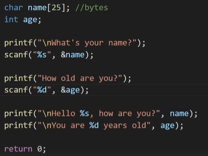

# C

---

[https://www.geeksforgeeks.org/c-programming-language/?ref=shm](https://www.geeksforgeeks.org/c-programming-language/?ref=shm)

[https://www.w3schools.com/c/index.php](https://www.w3schools.com/c/index.php)

[https://www.tutorialspoint.com/cprogramming/index.htm](https://www.tutorialspoint.com/cprogramming/index.htm)

[https://www.youtube.com/watch?v=87SH2Cn0s9A&t=1282s](https://www.youtube.com/watch?v=87SH2Cn0s9A&t=1282s)

[https://devdocs.io/c/](https://devdocs.io/c/)

[https://en.cppreference.com/w/c/language/goto](https://en.cppreference.com/w/c/language/goto)

[https://www.open-std.org/jtc1/sc22/wg14/www/docs/n1570.pdf](https://www.open-std.org/jtc1/sc22/wg14/www/docs/n1570.pdf)

[https://www.upgrad.com/tutorials/software-engineering/c-tutorial/structure-of-c-program/#:~:text=Documentation section%3A The documentation section,details%2C which the compiler ignores](https://www.upgrad.com/tutorials/software-engineering/c-tutorial/structure-of-c-program/#:~:text=Documentation%20section%3A%20The%20documentation%20section,details%2C%20which%20the%20compiler%20ignores).

- Diferent data types (short, long, double, unsigned, etc.)
- Format specifiers in scanf (remeber the &var) and printf (% + specifier, %s = string specifier)
    - Scanf
        - Dont’ read whitespaces, if the input needs whitespaces so we need to use fgets() function instead of scanf
        - But, using the fgets() creates a new code line, and to get rid of this new line we do #include <string.h> and do var[strlen(var)-1] = ‘\0’;
        - Example
            
            
            
            - Input: Bro Code (the scanf age it isn’t read)
            
            
            
            
            
            
            
            - If fgets() wasn’t there, programm wouldn’t work appropriately (the input would read the whitespace and jump to the scanf age, returning 0 as age)
            
            
            
            
            
- Data types + Format specifiers
    
    
    
    
    
    
    
    
    
    
    
    
    
    - Long double: %llf
    - There is %zu also (search later)
    
    
    
    
    
    - Using .1 rounds the decimal part
    - Example
        
        
        
    - const type var makes var to be unchangeable (when using const, var must be uppercase (good practices); example: int pi = 3.1415, const int PI = 3.1415)
- Operators
    
    
    
    - Augmented assignment operators
        
        
        
        
        
    - OBS
        - A division beetwen two integers the result will be the integer part (if it isn’t an exact division), if we want both the integer part and the decimal part we must use at least one float variable
        - Example
            
            
            
            - Output = 2
            
            
            
            - Output = 2.000000
            
            
            
            - Output = 2.500000
- Math functions
    - Uses #include <math.h>
    - Some functions
        
        
        
- Conditionals
    - if, else if, else
    - Switch
        - A more efficient alternative to use many “else if” statements
            - Allows a value to be tested for equality against many cases
        
        
        
        
        
- Logical operators
    
    
    
- Functions
    - Section of code that is executed by calling it during the code (excepted for main())
    - We can return values that were made/changed during the function using return
        - We can return the function itself, doing recursive callstacks
        - If we dont’t want to return any value, the function has void “type”
        - To do this, we have to specify before the function name the data type that will return
            
            
            
            
            
            
            
            - We can return multiple times inside a function, and the function will stop reading the code until the programm read a return statement (unless it’s a recursive statement, it will read a couple more times the same function)
    - Can have parameters or arguments
        
        
        
    - Variables can be declared inside of a function, but it will be only available inside that function unless you return that variable
        - To make a variable global, just use as a parameter of a function; it will be available inside that function without problems
- Ternary operator
    
    
    
    - Example
        - Mot using ternary operator
            
            
            
            
            
        - Using ternary operator
            
            
            
            
            
- Function prototype
    - Used in situations when a function is declared after main
    
    
    
    
    
    
    
    - Example
        
        
        
        
        
- String functions
    
    
    
    
    
    
    
    
    
    - They return 0 if the strings are the same, otherwise they return some integer different to 0
        - This is for the functions under strlen
    
    
    
- Loops
    - For
        
        
        
        - Example
            
            
            
    - While
        
        
        
        - Example
            
            
            
    - Do while
        
        
        
        
        
        - Example
            
            
            
    - Nested loops
        
        
        
        - Example
            
            
            
    - Break and continue
        
        
        
- Arrays
    
    
    
    - Example
        
        
        
    - Iteration
        - To iterate an array, use for loop
            
            
            
            - sizeof() returns the size of an operand in bits (we divide beacause sizeof(prices) = 48 and sizeof(prices[i]) = 8; so we iterate the amount of the elements of the array; like len() in python)
            
    - 2D arrays
        
        
        
        - Declaring the array
            
            
            
            - Example
                
                
                
                - Using sizeof to calculate the amount of for loops (but if we do scanf of rows and columns we can declare the array after the scanf’s and no problems)
        - To change an item in an array of strings, use strcpy
- Swap
    - Swaps the values of two variables; we can use swap function or use a temporary variable (better for arrays in sorts)
- Sorts
    - See this page: [ALGORITMOS E ESTRUTURAS DE DADOS](../algoritmos-e-estruturas-de-dados.md)
- Struct and typedef
    - Struct
        
        
        
        - Example
            
            
            
    - Typedef
        
        
        
        - Using typedef w/o struct
            
            
            
        - Using typed w/ struct
            
            
            
            - Using typedef in struct, we don’t need to type struct every time we create a struct
    - Array of structs
        - To encapsulate every struct created during the code, we can do an array of structs
        - Example
            
            
            
            - We could use typedef to get rid of this “struct” in main function
- Enum
    
    
    
    
    
    - Enums are constants
    - Example
        
        
        
        - We don’t need to put the numbers, Sun has implicitly the value of 0, Mon has implicitly the value of 1 and etc.
            - But in this case, we’ve explicitly showed the values of all the enums constants and it will be treated as int
        
        
        
        
        
        - This one is more readable
- (Pseudo)Random numbers
    
    
    
    
    
    - We need this two lib’s
    - Example (rolling a dice)
        
        
        
        - We need the srand(time(0)) because it gives the seed for generate a random number, if we don’t have this function in our code all of the three numbers would be the same (not the three of them, but as we run the code the numbers wouldn’t change) over and over again
- Bitwise operators
    
    
    
    
    
    - There is also the complement operator (~) (but it is more complex)
    - Example
        
        
        
- Memory addresses
    
    
    
    
    
    
    
    - When we declare a variable, we are setting some amount of memory blocks to assign that value and that variable has a specific memory address (if we change the type of the same variable, the address will change)
    - sizeof function shows the amount of memory blocks of certain variable
    
    
    
    - Doing %p, it will print the address of a certain variable (p is for pointers, the next topic)
    - What it will print
        
        
        
        - Each character can be a number in a range of 0-9 or a character from A-F
- Pointers
    
    
    
    
    
    - Example
        
        
        
    - Using pointers as argument to a function
        - Just put a * before a parameter to indicate the use of pointer in a function
        
        
        
    - Good practices w/ pointers
        - It’s a good practice to declare a pointer and assign it with the value of NULL
        - Example
            
            
            
        - Also, it is a good practice to check if the pointer == NULL first and create an else that will contain the rest of the code
- File handling
    - Functions
        - fopen()
            
            
            
        - fclose()
            
            
            
        - fprintf
            
            
            
        - fscanf
            - reads a set of data from a file
        - fgets
            - Function that reads strings inside of a file
            - Parameters
                - char *str - pointer that holds the char array (string) of the current line of the file
                - int size - maximum of characters that will be read
                - FILE *fp - pointer that holds the information of the opened file on read mode
                
                
                
            - Example
                
                
                
                - With the while, fgets will read every line of file.txt; using it out of the while , fgets will read only the first line
            - This function returns a string if well succeeded, otherwise it will return NULL
            - When fgets is called, the function will send the string to the char *str, a pointer of an array of characters that holds the address of this string
        - (there is more)
    - Create/write a file
        
        
        
        - If we don’t specify the location of the file it will create on the current directory/folder
            - We can specify by typing the location where we want to create the file
                - Example
                    
                    
                    
        - Checking if pF is NULL first is a good practice because if there is an error during the creation, it will print and return
    - Deleting a file
        
        
        
        - Running the first time it will delete our file created in the section above (Create/write a file), and running again it will print “That file was NOT deleted!”
    - Reading files
        - Example
            
            
            
            - This will read and print only the first line of file.txt
            
            
            
            - This will read and print every line of file.txt
- Memory allocation
    - Static
        - Static memory is memory that is reserved for variables before the program runs
            - Allocation of static memory is also known as compile time memory allocation
        - If we create a variable of an int array[20], C will reserve space for the 20 elements
            - But if we don’t use all of the spaces, we will be left with unnecessary reserved memory, in this case we can use dynamic memory allocation
            - Also, we can declare this variable but don’t use it in the entire code; so it will be “a lot” of unnecessary reserved memory
    - Dynamic
        - Dynamic memory is memory that is allocated after the program starts running
            - Allocation of dynamic memory can also be referred to as runtime memory allocation
            - The data in the memory allocated by malloc is unpredictable
        - Unline static memory, with dynamic memory we have full control over how much memory the programm is using at any time
        - Dynamic memory does not belong to a variable, it can only be accessed with pointers
            - We will use pointers without declaring variables (in static memory allocation, we first declare a variable (example: int a;) and then create a pointer that points to the address of this variable (example: int *pA = NULL; pA = &a))
        - There are languages that already come with this dynamic memory allocation, but C isn’t one of them
        - Functions
            - malloc
                - “memory allocation”
                - Used to dynamically allocate a single large block of memory with the specified size
                - It returns a pointer of type void which can be cast into a pointer of any form
                - It doesn’t Initialize memory at execution time so that it has initialized each block with the default garbage value initially
                    - So, if we use malloc; the pointer will receive the garbage value
                - This method only has one parameter, which is the bit-size
                - Examples
                    
                    ```c
                    #include <stdlib.h>
                    
                    int *p;
                    
                    p = malloc(sizeof(int)); 
                    // in the malloc parameter, we can multiply, divide and etc. 
                    ```
                    
                    ```c
                    #include <stdlib.h>
                    
                    p = (int*) malloc(sizeof(int));
                    ```
                    
                    ```c
                    #include <stdlib.h>
                    
                    int *p;
                    
                    p = (int*) malloc(sizeof(int));
                    ```
                    
                    
                    
                    - Basically, instead of ptr receives the address of a variable, we use malloc to allocate the ptr and use it
                        - Using malloc we reserve the address for that specific pointer, without creating a new variable like int a; *p = NULL; p = &a
            - calloc
                - “contiguous allocation”
                - Have the same funcionality as malloc, the only difference is that it has two parameters and when the calloc method is called, the default garbage value will receive the value of zero
                    - This makes calloc slightly less efficient
                - The parameters are amount of itens to allocate and the size of each item measured in bytes
                - Examples
                    - Same as malloc, but it is calloc and has two parameters
                    
                    ```c
                    #include <stdlib.h>
                    
                    int *ptr1
                    
                    ptr1 = (int*) calloc(1, sizeof(*ptr1));
                    
                    // using sizeof(*ptr1) is the same as sizeof(int)
                    /* if we do sizeof(ptr1), it will measure the size of the pointer
                    itself, which is usually 8 bytes */
                    ```
                    
            - malloc vs calloc
                - Example
                    
                    
                    
                
                
                
            - free
                - “de-allocation”
                - Basically, this method frees the memory of a pointer allocated by malloc or calloc
                - It has only one parameter, which is the pointer
                - Every time we use malloc or calloc it’s a good practice to use the free method in the end of the programm
                - If we forget to free this memory, the performance during the code will be very bad because of the memory used during the code (when the programm finishes, the variables will be free too; but it’s better to free inside the programm)
                    - This memory that wasn’t free will be called a memory leak
                - It is considered a good practice to set a pointer to NULL after freeing memory so that you cannot accidentally continue using it
                - Example
                    
                    ```c
                    #include <stdio.h>
                    #include <stdlib.h>
                     
                    int main() {
                        // This pointer will hold the
                        // base address of the block created
                        int *ptr, *ptr1;
                        int n, i;
                     
                        // Get the number of elements for the array
                        n = 5;
                        printf("Enter number of elements: %d\n", n);
                     
                        // Dynamically allocate memory using malloc()
                        ptr = (int*)malloc(n * sizeof(int));
                     
                        // Dynamically allocate memory using calloc()
                        ptr1 = (int*)calloc(n, sizeof(int));
                     
                        // Check if the memory has been successfully
                        // allocated by malloc or not
                        if (ptr == NULL || ptr1 == NULL) {
                            printf("Memory not allocated.\n");
                            exit(0);
                        }
                        else {
                            // Memory has been successfully allocated
                            printf("Memory successfully allocated using malloc.\n");
                     
                            // Free the memory
                            free(ptr);
                            ptr = NULL;
                            printf("Malloc Memory successfully freed.\n");
                     
                            // Memory has been successfully allocated
                            printf("\nMemory successfully allocated using calloc.\n");
                     
                            // Free the memory
                            free(ptr1);
                            ptr1 = NULL;
                            printf("Calloc Memory successfully freed.\n");
                        }
                        return 0;
                    }
                    ```
                    
            - realloc
                - “re-allocation”
                - Method used to change the memory location of a previously allocated memory
                    - So, if the memory previously allocated with the help of malloc or calloc is insufficient, realloc can be used to dynamically re-allocate memory
                        - This re-allocation of memory maintains the already present value and new blocks will be initialized with the default garbage value
                - This method has two parameters, the first one is the pointer that we want to re-allocate and the second one is the new size
                - Example
                    
                    ```c
                    
                    #include <stdio.h>
                    #include <stdlib.h>
                     
                    int main() {
                        // This pointer will hold the
                        // base address of the block created
                        int* ptr;
                        int n, i;
                     
                        // Get the number of elements for the array
                        printf("Enter number of elements: ");
                        scanf("%d", &n);
                    
                        // Dynamically allocate memory using calloc()
                        ptr = (int*)calloc(n, sizeof(int));
                     
                        // Check if the memory has been successfully
                        // allocated by malloc or not
                        if (ptr == NULL) {
                            printf("Memory not allocated.\n");
                            exit(0);
                        }
                        
                        else {
                            // Memory has been successfully allocated
                            printf("Memory successfully allocated using calloc.\n");
                     
                            // Get the elements of the array
                            for (i = 0; i < n; ++i) {
                                ptr[i] = i + 1;
                            }
                     
                            // Print the elements of the array
                            printf("The elements of the array are: ");
                            for (i = 0; i < n; ++i) {
                                printf("%d, ", ptr[i]);
                            }
                     
                            // Get the new size for the array
                            printf("\n\nEnter the new size of the array: ");
                            scanf("%d", &n);
                     
                            // Dynamically re-allocate memory using realloc()
                            ptr = (int*)realloc(ptr, n * sizeof(int));
                     
                            // Memory has been successfully allocated
                            printf("Memory successfully re-allocated using realloc.\n");
                     
                            // Get the new elements of the array
                            for (i = 5; i < n; ++i) {
                                ptr[i] = i + 1;
                            }
                     
                            // Print the elements of the array
                            printf("The elements of the array are: ");
                            for (i = 0; i < n; ++i) {
                                printf("%d, ", ptr[i]);
                            }
                     
                            free(ptr);
                        }
                     
                        return 0;
                    }
                    
                    /*
                    
                    INPUT:
                    5  10
                    
                    OUTPUT:
                    
                    Enter number of elements: 5
                    Memory successfully allocated using calloc.
                    The elements of the array are: 1, 2, 3, 4, 5, 
                    
                    Enter the new size of the array: 10
                    Memory successfully re-allocated using realloc.
                    The elements of the array are: 1, 2, 3, 4, 5, 6, 7, 8, 9, 10,
                    
                    */
                    ```
                    
                - When realloc() returns a different memory address, the memory at the original address is no longer reserved and it is not safe to use
                    - When the reallocation is done it is good to assign the new pointer to the previous variable so that the old pointer cannot be used accidentally
                    - Example
                        
                        ```c
                        int *ptr1, *ptr2, size;
                        
                        // Allocate memory for four integers
                        size = 4 * sizeof(*ptr1);
                        ptr1 = malloc(size);
                        
                        printf("%d bytes allocated at address %p \n", size, ptr1);
                        
                        // Resize the memory to hold six integers
                        size = 6 * sizeof(*ptr1);
                        ptr2 = realloc(ptr1, size);
                        
                        printf("%d bytes reallocated at address %p \n", size, ptr2);
                        
                        /*
                        
                        OUTPUT:
                        16 bytes allocated at address 00C129D0
                        24 bytes reallocated at address 00C129D0
                        
                        */
                        ```
                        
        - Dynamic array
            - We can create dynamic arrays using these methods
            - Creation
                - Using malloc
                    
                    ```c
                    #include <stdio.h> 
                    #include <stdlib.h> 
                      
                    int main() { 
                        // address of the block created hold by this pointer 
                        int* ptr; 
                        int size; 
                      
                        // Size of the array 
                        printf("Enter size of elements: "); 
                        scanf("%d", &size); 
                      
                        //  Memory allocates dynamically using malloc() 
                        ptr = (int*)malloc(size * sizeof(int)); 
                      
                        // Checking for memory allocation 
                        if (ptr == NULL) { 
                            printf("Memory not allocated.\n"); 
                        } 
                        else { 
                      
                            // Memory allocated 
                            printf("Memory successfully allocated using "
                                   "malloc.\n"); 
                      
                            // Get the elements of the array 
                            for (int j = 0; j < size; ++j) { 
                                ptr[j] = j + 1; 
                            } 
                      
                            // Print the elements of the array 
                            printf("The elements of the array are: "); 
                            for (int k = 0; k < size; ++k) { 
                                printf("%d, ", ptr[k]); 
                            } 
                        } 
                    	  free(ptr);
                        return 0; 
                    }
                    
                    /*
                    
                    INPUT + OUTPUT
                    Enter size of elements: 5
                    Memory successfully allocated using malloc.
                    The elements of the array are: 1, 2, 3, 4, 5,
                    
                    */
                    ```
                    
                - Using calloc
                    
                    ```c
                    #include <stdio.h> 
                    #include <stdlib.h> 
                      
                    int main() { 
                        // address of the block created hold by this pointer 
                        int* ptr; 
                        int size; 
                      
                        // Size of the array 
                        printf("Enter size of elements:"); 
                        scanf("%d", &size); 
                      
                        //  Memory allocates dynamically using calloc() 
                        ptr = (int*)calloc(size, sizeof(int)); 
                      
                        // Checking for memory allocation 
                        if (ptr == NULL) { 
                            printf("Memory not allocated.\n"); 
                        } 
                        else { 
                      
                            // Memory allocated 
                            printf("Memory successfully allocated using "
                                   "malloc.\n"); 
                      
                            // Get the elements of the array 
                            for (int j = 0; j < size; ++j) { 
                                ptr[j] = j + 1; 
                            } 
                      
                            // Print the elements of the array 
                            printf("The elements of the array are: "); 
                            for (int k = 0; k < size; ++k) { 
                                printf("%d, ", ptr[k]); 
                            } 
                        } 
                        free(ptr);
                        return 0; 
                    }
                    
                    /*
                    
                    INPUT + OUTPUT
                    Enter size of elements:6
                    Memory successfully allocated using malloc.
                    The elements of the array are: 1, 2, 3, 4, 5, 6, 
                    
                    */
                    ```
                    
            - Resizing
                
                ```c
                #include <stdio.h> 
                #include <stdlib.h> 
                  
                int main() { 
                    // address of the block created hold by this pointer 
                    int* ptr; 
                    int size = 5; 
                  
                  
                    //  Memory allocates dynamically using calloc() 
                    ptr = (int*)calloc(size, sizeof(int)); 
                  
                    if (ptr == NULL) { 
                        printf("Memory not allocated.\n"); 
                        exit(0); 
                    } 
                    else { 
                        printf("Memory successfully allocated using "
                               "calloc.\n"); 
                    } 
                  
                    // inserting elements 
                    for (int j = 0; j < size; ++j) { 
                        ptr[j] = j + 1; 
                    } 
                  
                    printf("The elements of the array are: "); 
                    for (int k = 0; k < size; ++k) { 
                        printf("%d, ", ptr[k]); 
                    } 
                  
                    printf("\n"); 
                  
                    size = 10; 
                  
                    int *temp = ptr; 
                  
                    //  using realloc 
                    ptr = realloc(ptr, size * sizeof(int)); 
                    if (!ptr) { 
                        printf("Memory Re-allocation failed."); 
                        ptr = temp; 
                    } 
                    else { 
                        printf("Memory successfully re-allocated using "
                               "realloc.\n"); 
                    } 
                  
                    // inserting new elements 
                    for (int j = 5; j < size; ++j) { 
                        ptr[j] = j + 10; 
                    } 
                  
                    printf("The new elements of the array are: "); 
                    for (int k = 0; k < size; ++k) { 
                        printf("%d, ", ptr[k]); 
                    } 
                    free(ptr);
                    return 0; 
                }
                
                /*
                INPUT + OUTPUT
                Memory successfully allocated using calloc.
                The elements of the array are: 1, 2, 3, 4, 5, 
                Memory successfully re-allocated using realloc.
                The new elements of the array are: 1, 2, 3, 4, 5, 15, 16, 17, 18, 19, 
                */
                ```
                
            - Flexible array members
                - The flexible array members are the array that is defined inside a structure without any dimension and their size is flexible
                    - We can control the size using malloc()
                    - In this case, the array inside the struct should be the least member declared and it’s size is a variable
                - Example
                    
                    ```c
                    #include <stdio.h> 
                    #include <stdlib.h> 
                      
                    // defining struct 
                    typedef struct { 
                        int len; 
                        int arr[]; 
                    } fam; 
                      
                    int main() { 
                        // creating an array member of size 5 
                        fam *fam1 = (fam*) malloc(sizeof(fam*) + 5 * sizeof(int)); 
                        
                        /* fam *fam1 
                    	    - this declares a pointer fam1 that can store the address
                    	    of a fam struct
                    	    
                    	    (fam*)
                    	    - returns a pointer to a fam struct
                    	    
                    	    malloc(sizeof(fam*) + 5 * sizeof(int))
                    	    - reserves memory for this pointer
                    	    - sizeof(fam*) return the size to create a fam struct
                    	    - 5 * sizeof(int) - return the size to create an array 
                    	    of 5 elements
                    	    - so, the parameters of malloc says the minimun amount
                    	    of memory to create a pointer to a fam struct
                        */
                      
                        // creating an array member of size 10 
                        fam *fam2 = (fam*) malloc(sizeof(fam*) + 10 * sizeof(int)); 
                          
                        // inserting elements 
                        for (int i = 0; i < 5; i++) { 
                            fam1->arr[i] = i + 1; 
                        } 
                        for (int i = 0; i < 10; i++) { 
                            fam2->arr[i] = i + 10; 
                        } 
                      
                        //  printing elements 
                        printf("Array of Size 5:\n"); 
                        for (int i = 0; i < 5; i++) { 
                            printf("%d, ", fam1->arr[i]); 
                        } 
                        printf("\n"); 
                      
                        printf("Array of size 10:\n"); 
                        for (int i = 0; i < 10; i++) { 
                            printf("%d, ", fam2->arr[i]); 
                        } 
                    		
                    		// input for a new size of fam1.array
                        int n;
                        printf("\nInput a new size for fam1: ");
                        scanf("%d", &n);
                    
                        printf("Array of size %d\n", n);
                        
                        /*
                        if n is lesser than 5 (first len of fam1), 
                        then it won't enter in this for
                        */
                    
                        for (int i = 5; i < n; i++) {
                            fam1->arr[i] = i + 2;
                        }
                    
                        for (int i = 0; i < n; i++) {
                            printf("%d, ", fam1->arr[i]);
                        }
                        
                        free(fam1);
                        free(fam2);
                        return 0; 
                    }
                    ```
                    
            - Dynammically allocating memory a 2D array
                - Using a single pointer and a 1D array with pointer arithmetic
                    - A simple way is to allocate a memory block of size r*c and access its elements using simple pointer arithmetic.
                    
                    ```c
                    #include <stdio.h>
                    #include <stdlib.h>
                     
                    int main(void) {
                        int r = 3, c = 4;
                     
                        int* ptr = malloc((r * c) * sizeof(int));
                     
                        /* Putting 1 to 12 in the 1D array in a sequence */
                        for (int i = 0; i < r * c; i++)
                            ptr[i] = i + 1;
                     
                        /* Accessing the array values as if it was a 2D array */
                        for (int i = 0; i < r; i++) {
                            for (int j = 0; j < c; j++)
                                printf("%d ", ptr[i * c + j]);
                            printf("\n");
                        }
                        free(ptr);
                        return 0;
                    }
                    ```
                    
                - Using an array of pointers
                    - We can create an array of pointers of size r
                    
                    ```c
                    #include <stdio.h>
                    #include <stdlib.h>
                     
                    int main() {
                        int r = 3, c = 4, i, j, count;
                     
                        int* arr[r];
                        for (i = 0; i < r; i++)
                            arr[i] = (int*)malloc(c * sizeof(int));
                            // allocating memory for every row
                     
                        // Note that arr[i][j] is same as *(*(arr+i)+j)
                        count = 0;
                        for (i = 0; i < r; i++)
                            for (j = 0; j < c; j++)
                                arr[i][j] = ++count; // Or *(*(arr+i)+j) = ++count
                        /*
                        
                    		 Explaining why arr[i][j] is the same as *(*(arr + i) + j)
                    		 
                    		 *(arr + i)
                    		 - using just *arr we dereference the pointer arr and it returns
                    		 the current element (in this case another array) 
                    		 that the pointer arr is poiting to
                    		 - when we do arr + i; we are moving the pointer from the current
                    		 position (i think it's 0 because *arr it's always the 
                    		 first element (i think)) to the i-th position in the array arr
                    		 - using *(arr + i) we dereference and gets the element on the
                    		 address of arr + i
                    		 - this is like arr[i]
                    		 
                    		 *(*(arr + i) + j)
                    		 - so (arr + i) is poiting to another array and doing
                    		 *(arr + i) we get this array
                    		 - by doing *(arr + i) + j we are moving the array from *(arr + i) 
                    		 that is at current position (0) and adding j to get 
                    		 the element at the j-th position of the array inside the array
                    		 arr
                    		 - doing *(*(arr + i) + j) we are firstly doing *(arr + i) to
                    		 get the array at the index i (because arr is a pointer allocated 
                    		 to points to an array of arrays) by dereferencing it;
                    		 so now we have the array[i], then we do *(*(arr + i) + j) to get
                    		 the element inside the array (that we get by dereference),
                    		 we are geting the element at the index j and dereferencing it
                    		 to modify the value
                    	
                        */
                     
                        for (i = 0; i < r; i++)
                            for (j = 0; j < c; j++)
                                printf("%d ", arr[i][j]);
                     
                        /* Code for further processing and free the
                          dynamically allocated memory */
                     
                        for (int i = 0; i < r; i++)
                            free(arr[i]);
                            // freeing the memory allocated on every row
                     
                        return 0;
                    }
                    ```
                    
                - Using pointer to a pointer
                    - We can create an array of pointers also dynamically using a double pointer
                        - Once we have an array pointers allocated dynamically, we can dynamically allocate memory and for every row like Using an array of pointer method
                    
                    ```c
                    #include <stdio.h>
                    #include <stdlib.h>
                     
                    int main() {
                        int r = 3, c = 4, i, j, count;
                     
                    		 // creating a double pointer that points for the entire array
                        int** arr = (int**)malloc(r * sizeof(int*));
                        for (i = 0; i < r; i++)
                    		    //creating a simple pointer for every row (array of pointers)
                            arr[i] = (int*)malloc(c * sizeof(int));
                     
                        // Note that arr[i][j] is same as *(*(arr+i)+j)
                        count = 0;
                        for (i = 0; i < r; i++)
                            for (j = 0; j < c; j++)
                                arr[i][j] = ++count; // OR *(*(arr+i)+j) = ++count
                     
                        for (i = 0; i < r; i++)
                            for (j = 0; j < c; j++)
                                printf("%d ", arr[i][j]);
                     
                        /* Code for further processing and free the
                           dynamically allocated memory */
                     
                        for (int i = 0; i < r; i++)
                            free(arr[i]);
                            // freeing every row (simple pointer)
                     
                        free(arr);
                        // freeing the entire array (double pointer)
                     
                        return 0;
                    }
                    ```
                    
                - Using double pointer and one malloc call
                    
                    ```c
                    #include<stdio.h>
                    #include<stdlib.h>
                     
                    int main() {
                        int r=3, c=4, len=0;
                        int *ptr, **arr;
                        int count = 0,i,j;
                    		 
                    		 
                        len = sizeof(int *) * r + sizeof(int) * c * r;
                        arr = (int **)malloc(len);
                     
                        // ptr is now pointing to the first element in of 2D array
                        ptr = (int *)(arr + r);
                     
                        // for loop to point rows pointer to appropriate location in 2D array
                        for(i = 0; i < r; i++)
                            arr[i] = (ptr + c * i);
                     
                        for (i = 0; i < r; i++)
                            for (j = 0; j < c; j++)
                                arr[i][j] = ++count; // OR *(*(arr+i)+j) = ++count
                     
                        for (i = 0; i < r; i++)
                            for (j = 0; j < c; j++)
                                printf("%d ", arr[i][j]);
                     
                        return 0;
                    }
                    ```
                    
                - Using a pointer to Variable Length Array
                    - The dimensions of VLA are bound to the type of the variable. Therefore one form a pointer to an array with run-time defined shape
                        - The pointer has to be dereferenced before subscripting with syntax (*arr)[i][j]
                    
                    ```c
                    #include <stdio.h>
                    #include <stdlib.h>
                     
                    int main() {
                        int row = 3, col = 4, i, j, count;
                     
                        int (*arr)[row][col] = malloc(sizeof *arr);
                         
                        count = 0;
                        for (i = 0; i < row; i++)
                            for (j = 0; j < col; j++)
                                (*arr)[i][j] = ++count;
                     
                        for (i = 0; i < row; i++)
                            for (j = 0; j < col; j++)
                                printf("%d ", (*arr)[i][j]);
                     
                        free(arr);
                         
                        return 0;
                    }
                    ```
                    
                - Using a pointer to the first row of Variable Length Array
                    - Simular to “Using a pointer to Variable Length Array” method but allows arr[i][j] syntax
                    
                    ```c
                    #include <stdio.h>
                    #include <stdlib.h>
                    
                    int main() {
                    	int row = 3, col = 4, i, j, count;
                    
                    	int (*arr)[col] = calloc(row, sizeof *arr);
                    	
                    	count = 0;
                    	for (i = 0; i < row; i++)
                    		for (j = 0; j < col; j++)
                    			arr[i][j] = ++count;
                    
                    	for (i = 0; i < row; i++)
                    		for (j = 0; j < col; j++)
                    			printf("%d ", arr[i][j]);
                    
                    	free(arr);
                    	
                    	return 0;
                    }
                    
                    ```
                    
                - Same output: 1 2 3 4 5 6 7 8 9 10 11 12
            - Dynamically Growing Array
                
                ```c
                #include <stdio.h> 
                #include <stdlib.h> 
                  
                #define INITIAL_SIZE 8 
                  
                // base structure 
                typedef struct { 
                    size_t size; 
                    size_t capacity; 
                    int* array; 
                }dynamic_array; 
                  
                // function prototypes 
                //  array container functions 
                void arrayInit(dynamic_array** arr_ptr); 
                void freeArray(dynamic_array* container); 
                  
                // Basic Operation functions 
                void insertItem(dynamic_array* container, int item); 
                void updateItem(dynamic_array* container, int i, int item); 
                int getItem(dynamic_array* container, int i); 
                void deleteItem(dynamic_array* container, int item); 
                void printArray(dynamic_array* container); 
                  
                  
                // driver code 
                int main() { 
                    dynamic_array* arr; 
                    arrayInit(&arr); 
                      
                    for (int i = 0; i < 6; i++) { 
                        insertItem(arr, i + 11); 
                    } 
                    printArray(arr); 
                    printf("%d\n", getItem(arr, 3)); 
                    deleteItem(arr, 3); 
                    printArray(arr); 
                  
                    for (int i = 0; i < 5; i++) { 
                        insertItem(arr, i + 17); 
                    } 
                  
                    printArray(arr); 
                  
                    freeArray(arr); 
                    int var; 
                    return 0; 
                } 
                  
                //------Function Definitions------ 
                // Array initialization 
                void arrayInit(dynamic_array** arr_ptr) { 
                    dynamic_array *container; 
                    container = (dynamic_array*)malloc(sizeof(dynamic_array)); 
                    if(!container) { 
                        printf("Memory Allocation Failed\n"); 
                        exit(0); 
                    } 
                  
                    container->size = 0; 
                    container->capacity = INITIAL_SIZE; 
                    container->array = (int *)malloc(INITIAL_SIZE * sizeof(int)); 
                    if (!container->array){ 
                        printf("Memory Allocation Failed\n"); 
                        exit(0); 
                    } 
                  
                    *arr_ptr = container; 
                } 
                  
                //  Insertion Operation 
                void insertItem(dynamic_array* container, int item) { 
                    if (container->size == container->capacity) { 
                        int *temp = container->array; 
                        container->capacity <<= 1; 
                        container->array = realloc(container->array, container->capacity * sizeof(int)); 
                        if(!container->array) { 
                            printf("Out of Memory\n"); 
                            container->array = temp; 
                            return; 
                        } 
                    } 
                    container->array[container->size++] = item; 
                } 
                  
                // Retrieve Item at Particular Index 
                int getItem(dynamic_array* container, int index) { 
                    if(index >= container->size) { 
                        printf("Index Out of Bounds\n"); 
                        return -1; 
                    } 
                    return container->array[index]; 
                } 
                  
                // Update Operation 
                void updateItem(dynamic_array* container, int index, int item) { 
                    if (index >= container->size) { 
                        printf("Index Out of Bounds\n"); 
                        return; 
                    } 
                    container->array[index] = item; 
                } 
                  
                // Delete Item from Particular Index 
                void deleteItem(dynamic_array* container, int index) { 
                    if(index >= container->size) { 
                        printf("Index Out of Bounds\n"); 
                        return; 
                    } 
                  
                    for (int i = index; i < container->size; i++) { 
                        container->array[i] = container->array[i + 1]; 
                    } 
                    container->size--; 
                } 
                  
                // Array Traversal 
                void printArray(dynamic_array* container) { 
                    printf("Array elements: "); 
                    for (int i = 0; i < container->size; i++) { 
                        printf("%d ", container->array[i]); 
                    } 
                    printf("\nSize: "); 
                    printf("%lu", container->size); 
                    printf("\nCapacity: "); 
                    printf("%lu\n", container->capacity); 
                } 
                  
                // Freeing the memory allocated to the array 
                void freeArray(dynamic_array* container) { 
                    free(container->array); 
                    free(container); 
                }
                ```
                
        - Acess memory
            - Dynamic memory behaves like an array, with its data type specified by the type of the pointer
            - As with arrays, to access an element in dynamic memory, refer to its index number
                
                
                
            - We can also dereference the pointer to access the first element
                
                
                
                - When we dereference the pointer, it will return thevalue at the address; in this case we are dereferencing in the first lines of code, so the pointer is pointing to the first index (so, the first element)
            - Examples
                - Creating a dynamic array
                - Using calloc + free
                    
                    
                    
                - Using malloc + free
                    
                    