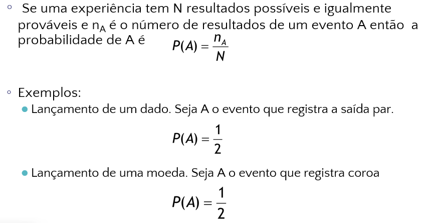
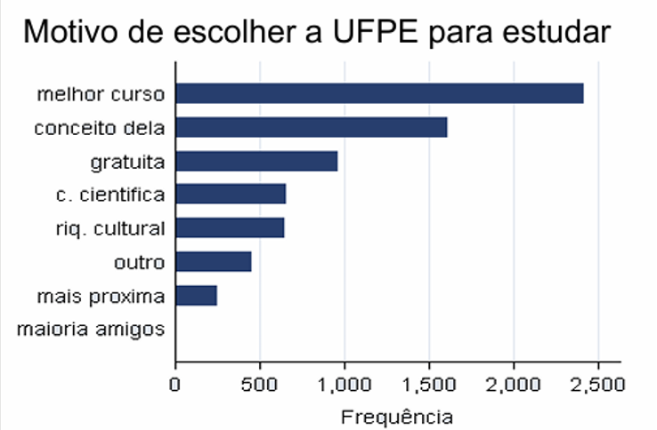

# ESTATÍSTICA PROBABILIDADE P/ COMPUTAÇÃO

---

[https://www.cin.ufpe.br/~et586cc/](https://www.cin.ufpe.br/~et586cc/)

[https://sites.google.com/a/cin.ufpe.br/in1119/tabelas?authuser=0](https://sites.google.com/a/cin.ufpe.br/in1119/tabelas?authuser=0)

## Probabilidade

- Conceitos
    - Clássico
        
        
        
    - Frequentista
        
        
        
    - Subjetivo
        
        
        
    - Formal
        
        
        
- Experimento aleatório
    - Possibilidade de ocorrência de diversos eventos
    
    
    
    - Exemplo
        
        
        
- Espaço amostral
    - Conjunto de todos os possíveis resultados de um experimento
    - Um resultado do espaço amostral é chamado de evento
    - Representado por Ω
        - Ω pode ser quantitativo (dicreto ou contínuo) ou qualitativo
    - Tipos
        - Quantitativo
            - É uma abordagem numérica para a coleta de dados
            - Discreto
                - Quando resultam de um conjunto finito de valores possíveis
                - Exemplo
                    
                    
                    
            - Contínuo
                - quando resultam de um número infinito de valores possíveis que podem ser associados a pontos em uma escala contínua
                - Exemplo
                    
                    
                    
        - Qualitativo
            - É uma abordagem não numérica para a coleta de dados
            - Exemplo
                
                
                
            
    - Exemplos
        - Exemplo 1
            
            
            
        - Exemplo 2
            
            
            
            
            
- Classe de eventos aleatórios
    - Conjunto de todos os subconjuntos (eventos) do espaço amostral
        
        
        
    - Propriedades
        
        
        
        - Operações
            - União
                
                
                
            - Interseção
                
                
                
            - Complementação
                
                
                
            - Exemplo
                
                
                
                
                
            - Propriedades
                
                
                
                
                
        - Partição
            
            
            
        - Eventos mutuamente exclusivos
            
            
            
    - Experimentos de contagem
        
        
        
        - Combinação
            
            
            
            - Exemplo 1
                
                
                
            - Exemplo 2
                
                
                
                
                
                
                
        - Permutação
            
            
            
            - Exemplo
                
                
                
- Teoremas
    - 1
        
        
        
    - 2
        
        
        
        - Exemplo
            
            
            
    - 3
        
        
        
    - 4
        
        
        
        
        
        - Exemplo
            
            
            
            
            
- Probabilidades dos espaços amostrais
    
    
    
    - Exemplo
        
        
        
        
        
- Exercício
    
    
    
    - a)
        
        probabilidade = 30/55
        
    - b)
        
        probabilidade = 27/55
        
    - c)
        
        probabilidade = 13/55
        
    - d)
        
        probabilidade = 42/55
        
    - e)
        
        probabilidade = 13/55
        
    - f)
        
        probabilidade = 15/55
        

---

## Probabilidade condicional

- Definição
    
    
    
    
    
    - Exemplos
        - Exemplo 1
            - Lançamento de dois dados:
            
            
            
        - Exemplo 2
            
            
            
            
            
            
            
- Teorema do produto
    
    
    
    - Exemplo
        
        
        
- Independência estatística
    
    
    
    - Exemplo
        
        
        
- Teorema de Bayes
    
    
    
    - Exemplo
        
        
        
        
        
        
        

---

## Probabilidade

- Variável aleatória
    - Variável que tem um único valor numérico, determinado por acaso, para cada resultado de um experimento
    - Tipos
        - Discreta
            - Tem um número finito de valores ou quantidade enumerável de valores onde “enumerável” se refere ao fato de que podem existir infinitos valores, mas que podem ser associados a um processo de contagem
            - Exemplo
                
                
                
        - Contínua
            - Tem infinitos valores e esses valores podem estar associados com medidas em uma escala contínua; de modo que não há pulos ou interrupções
            - Exemplo
                
                
                
        
        
        
- Função de probabilidade (Distribuição de probabilidade)
    - É um gráfico/tabela/fórmula que dá a probabilidade para cada valor da variável aleatória
        - Associação entre a variável aleatória e sua probabilidade
            
            
            
        - Representações
            - Gráfica
                
                
                
            - Tabela
                
                
                
    - Função de uma variável aleatória
        - Qualquer função de uma variável aleatória também é uma variável aleatória
            
            
            
    - Exemplo
        
        
        
        
        
    - Função de distribuição (repartição)
        - Seja X uma variável aleatória discreta, a função de distribuição de X F(X) é definida como sendo a probabilidade de que X assuma um valor menor ou igual à x
            
            
            
        - Exemplo
            
            
            
        - Propriedades
            
            
            
    - Função de densidade de probabilidade
        - Seja X uma variável aleatória contínua, a função de densidade de probabilidade f(x) é uma função que satisfaz as seguintes condições
            
            
            
    - Observações
        
        
        
    - Exemplos
        - 1
            
            
            
            
            
        - 2
            
            
            
            
            
        - 3
            
            
            
            
            
        - 4
            
            
            
            
            
            - Utiliza esperança matemática (próximo tópico)

---

## Medidas

- Medidas de posição
    - Esperança matemática (Valor esperado ou média)
        - O valor esperado de uma variável aleatória é a soma do produto de cada probabilidade de saída da experiência pelo seu respectivo valor
            - É um número real e também uma média ponderada
        - Notação: μ ou μx
        - Exemplo
            
            
            
            
            
        - Esperança de uma variável discreta
            - Seja x uma variável aleatória discreta, com valores possíveis x1, x2, ..., xn, e seja p(xi) = P(X) = xi, i = 1, 2, …, n; então o valor esperado de x, denotado por E(X) será:
                
                
                
            - Exemplo
                
                
                
        - Esperança de uma variável contínua
            - Seja x uma variável aleatória contínua, com função densidade de probabilidade f(x); então o valor esperado de x, denotado por E(X) será:
                
                
                
            - Exemplo
                
                
                
        - Exemplo
            
            
            
        - Propriedades
            
            
            
        - Do ponto de vista estatística, podemos dizer a média diz a honestidade de certo evento, quando a média tende à menos que zero; pode indicar que esse evento é desonesto
    - Mediana
        - A mediana de uma variável aleatória é o valor que divide a distribuição em duas partes iguais, ou seja, F(Md) = 0.5 onde Md é a mediana e F(X) é a função de repartição
        - Aplicações
            
            
            
        - Exemplo
            
            
            
    - Moda
        - Definição discreta
            - É o valor da variável X com maior probabilidade
        - Definição contínua
            - É o valor da variável X com maior densidade
        - Exemplo
            - Discreta
                
                
                
            - Contínua
                
                
                
- Medidas de dispersão
    - Variância
        - Define-se a variância de uma variável aleatória como sendo:
            
            
            
            - Para X discreta
                
                
                
                - A variância de X é o somatório dos xi menos a esperança de X vezes a probabilidade xi
            - Para X contínua
                
                
                
                - A variância de X é a integral de menos infinito até mais infinito de xi menos a esperança de X elevada ao quadrado vezes a função f(x)
        - Propriedades
            
            
            
    - Desvio padrão
        - É a raiz quadrada da variância
            
            
            
- Exemplos
    - 1
        
        
        
    - 2
        
        
        
    - 3
        
        
        
        
        
    - 4 (não to entendendo)
        
        
        
    - 5 (talvez esteja errado)
        
        
        
        
        

---

## Distribuição

- Modelos de distribuição discretas
    - Distribuição de Bernoulli
        - Seja X uma variável aleatória com dois resultados possíveis fracasso ou sucesso
            - Temos que a probabilidade de que X seja sucesso é de P(X = 1) = p; e que a probabilidade de que X seja fracasso é de P(X = 0) = 1 - p = q
            - Valor esperado: E(X) = μx = p
            - Variância: Var(X) = σ² = pq
        - Exemplo
            
            
            
    - Distribuição binomial
        - Geralmente são sucessos ou fracassos sucessivos com reposição (independentes)
            - As probabilidades p e (1 - p) são as mesmas em cada ensaio
        - Exemplo
            
            
            
        - Função de probabilidade
            
            
            
            
            
        - Seja X uma variável aleatória binomial com parâmetros n e p, onde p é a probabilidade de sucesso e n é o número de ensaios
            - X → {0, 1, 2, …, n}
            - Valor esperado: E(X) = μx = np
            - Variância: Var(X) = σ² = npq
        - Exemplo
            
            
            
            
            
    - Distribuição geométrica
        - Tentativas sucessivas até o primeiro sucesso
            - Dois resultados são possíveis
            - As probabilidades p e (1 - p) são as mesmas em cada ensaio
            - E os ensaios são independentes (com reposição)
        - Exemplo
            
            
            
            
            
        - Função de probabilidade
            - Considerando uma sequência de Ensaios de Bernoulli, a distribuição geométrica pode ser vista como a probabilidade de ocorrer k ensaios até que haja o primeiro sucesso
                
                
                
                - p = probabilidade do sucesso
                - (1-p) - probabilidade do fracasso
                - k = número de ensaios
            
            
            
        - Exemplo
            
            
            
            - É k - 1
    - Distribuição de Poisson
        - Distribuição de probabilidade de uma variável aleatória que registra o número de ocorrências sobre um inervalo de tempo ou espaço específico
            - Exemplo: erros tipográficos por página; defeitos por unidade (m², m) por peça fabricada; mortes por ataque de coração por ano
        - Propriedades
            - A probabilidade de uma ocorrência é a mesma para quaisquer dois intervalos de tempo
            - A ocorrência ou não ocorrência em qualquer intervalo é independente da ocorrência ou não ocorrência em qualquer outro intervalo
        - Função de probabilidade de Poisson
            
            
            
            - X é o número de ocorrências (ou sucessos)
            - P(X) é a probabilidade de X ocorrências em um intervalo
            - λ é o valor esperado ou número médio de ocorrências em um intervalo
            - e é o número de euler (2,71828)
            - Valor esperado: E(X) = λ
            - Variância: Var(X) = λ
        - Exemplo
            - 1
                
                
                
            - 2
                - Numa fita de som, há um defeito a cada 200 pés. Qual é a probabilidade de que:
                    - a) em 500 pés não aconteça nenhum defeito?
                        
                        
                        
                    - b) em 800 pés ocorram pelo menos 3 defeitos?
                        
                        
                        
    - Distribuição hipergeométrica
        - De maneira semelhante à distribuição binomial, a distribuição hipergeométrica é um experimento composto por r ensaios idênticos; o conjunto é composto por dois tipos de objetos (dois resultados são possíveis); e não há reposição (os ensaios passam a ser dependentes)
            
            
            
        - Exemplo
            
            
            
            
            
            
            
        - Função de probabilidade
            
            
            
            
            
    - Exemplos
        - 1
            
            
            
            
            
        - 2
            
            
            
            
            
        - 3
            
            
            
            
            
- Modelos de distribuição contínuas
    - Distribuição uniforme
        - Distribuição em que leva em consideração um intervalo de tempo [a, b]
            - Exemplo: suponha que o tempo de vôo pode ser qualquer valor no intervalo de 120 até 140 minutos; seja X uma variável aleatória que representa o tempo de vôo de uma aeronave viajando de Chicago até Nova York, etc.
        - Função de probabilidade
            
            
            
        - Gráfico
            
            
            
        - Exemplo
            
            
            
            
            
    - Distribuição exponencial
        - Útil para descrever o tempo utilizado para completar uma tarefa
            - Exemplo: tempo de chegadas de pacotes em um roteador, tempo de vida de aparelhos, tempo de espera em restaurantes, caixas de banco, etc.
        - Parâmetro: média ou valor esperado
        - Está ligada à distribuição de Poisson
        - Função de probabilidade
            
            
            
            - O λ segue a mesma lógica que o λ da distribuição de poisson
        - Gráfico
            
            
            
        - Exemplo
            
            
            
            
            
            
            
            - OBS: O resultado é um + o outro
    - Distribuição normal
        - Usada em uma ampla variedade de aplicações práticas nas quais as variáveis aleatórias são: altura, peso, medições, indíces e etc.
        - Parâmetro: média e desvio padrão
            - Exemplo: os salários dos diretores das empresas em São Paulo, distribuem-se normalmente com média de R$ 20.000,00 e desvio padrão de R$ 500,00
        - Função de probabilidade
            
            
            
        - Gráfico
            
            
            
        - Exemplo
            
            
            
            
            
    - Exemplos
        - 1
            
            
            
            
            
        - 2
            
            
            
            
            
        - 3
            
            
            
            
            
            
            
            - OBS: 0,31 é o Z-Score de 0,12
- Exemplos
    - 1
        
        
        
        
        
    - 2
        
        
        
        
        
    - 3
        
        
        
        
        
    - 4
        
        
        
        
        
    - 5
        
        
        
        
        
    - 6
        
        
        
        
        
    - 7
        
        
        
        
        

---

## Análise exploratória

- Tabela estatística
    - As tabelas devem possuir cabeçalho (fornece uma breve descrição dos fins a que se destina), rodapé (fonte dos dados) e corpo (contém os registros dos dados)
    - Exemplo
        
        
        
- Séries estatísticas
    - É qualquer tabela que apresenta a distribuição de um conjunto da dados estatísticos em função da época (fator temporal), local (lugar onde o fenômeno acontece) ou espécie (o fato ou fenômeno)
    - Tipos
        - Série Temporal ou Cronólogica
            - Identifica-se pelo caráter variável do fator cronológico, o local e espécie são elementos fixos
            
            
            
        - Série Geográfica ou Histórica
            - Apresenta como fator variável o fator geográfico
            
            
            
        - Série Específica (Categórica)
            - O caráter variável é apenas a espécie
            
            
            
        - Distribuições de Frequências
            - Tabela onde os valores da variável não aparecem individualmente, mas agrupado em classes
            
            
            
- População e amostra
    - População
        - Conjunto de elementos que têm em comum determinada característica
        - Podem ser finitas ou infinitas
            - Existem populações que embora finitas, são consideradas infinitas para qualquer finalidade prática
    - Amostra
        - Qualquer conjunto de elementos retirado da população, desde que esse conjunto seja não vazio e tenha um número de elementos menor que o da população
    
    
    
    - A seleção da amostra pode ser feita de diversas maneiras dependentes entre outros fatores, do grau de conhecimento que temos da população e de recursos disponíveis
        - A ideia é que a amostra tenta fornecer um subconjunto de valores o mais parecido possível com a população que lhe dá origem
    - Tipos de amostragem
        - Amostragem aleatória
            - Cada elemento da amostra é retirado aleatoriamente de toda a população (com ou sem reposição)
                - Assim, cada possível amostra tem a mesma probabilidade de ser recolhida.
            
            
            
        - Amostragem estratificada
            - Subdividir a população em pelo menos dois grupos distintos que partilham alguma característica e, em seguida, recolher uma amostra de cada um dos grupos (ou estratos)
            
            
            
            - Considera o exemplo de amostragem aleatória
        - Amostragem sistemática
            - Quandos os elementos da população se apresentam ordenados e a retirada dos elementos da amostra é feita periodicamente
            
            
            
            - Considera o exemplo de amostragem aleatória
- Variável
    - Característica que pode ser observada nos elementos da população, devendo ter pelo menos um resultado para cada elemento observado
    - Tipos
        - Qualitativa
            - O resultado da variável é um atributo ou uma qualidade
            - Tipos
                - Qualitativa Ordinal
                    - Representam com uma ordenação natual
                    
                    
                    
                - Qualitativa Nominal
                    - Não existe ordenação dentre as categorias
                    
                    
                    
        - Quantitativa
            - O resultado é um número numa escala pré-determinada
            - Discreta
                - Os resultados possíveis são números inteiros
                - Ex: números de alunos
            - Contínua
                - O resultado está em um intervalo dos números reais
                - Ex: atraso de transmissão de bytes por uma rede de internet
- Gráficos
    - Representam os resultados obtidos, permitindo chegar-se a conclusões sobre a evolução de fenômeno ou sobre como se relacionam os valores da série
    - Tipos
        - Gráfico de barras
            
            
            
        - Gráfico de colunas
            
            
            
            - Utéis para mostrar alterações de dados em um período de tempo ou para ilustrar comparações entre itens
                
                
                
        - Gráfico de setor
            - Útil para mostrar a importância relativa das proporções, esse gráfico trabalha com porcentagens
                
                
                
        - Gráfico de hastes
            
            
            
        - Histogramas
            - Representação gráfica de uma distribuição de frequências por meio de retângulos justapostos
                - Exemplo
                    
                    
                    
            - O método mais útil para descrever os resultados obtidos com respeito a uma variável é a distribuição de frequência
                - Distribuição de frequência
                    - Tabela onde os valores da variável não aparecem individualmente, mas agrupados em classes
                        - Com muitos intervalos corremos o risco de não realçar os aspectos relevantes
                        - Com poucos intervalos, os grupos se tornam muito abrangentes, impedindo uma maior precisão
                    - Polígono de frequências
                        - Representação gráfica da distriuição de frequências, sendo as frequências os pontos médios dos intervalos das classes
                            - Esses pontos são conectados com segmentos de linha
                        - Exemplo
                            
                            
                            
                        - Polígono de frequência acumulada
                            - Um ponto no gráfico representa a soma de todas as frequências das classes anteriores mais a que esse ponto corresponde
                            - Exemplo
                                - Tabela
                                    
                                    
                                    
                                - Polígono de frequência acumulada
                                    
                                    
                                    
                    - Como construir tabelas de distribuição de frequência
                        - Exemplo
                            
                            
                            
                        - 1° passo
                            - Determinar a amplitude total
                            - A amplitude total seria o maior valor subtraído do menor valor, nesse caso a amplitude total = 18,1 - 4,7 = 13,4
                        - 2° passo
                            - Estimar o número de intervalos
                            - Métodos para estimar o número de intervalos
                                - Primeiro
                                    - Seja n o número de classes, para n > 25 o número de intervalos é K = √n e para n ≤ 25 K = 5
                                    - Nesse exemplo, K = √50 = 7.07
                                - Segundo
                                    - Esse método usa a fórmula de Sturges
                                        - Seja n o número de classes
                                        - Fórmula: K = 1 + 3,22(log n)
                                    - Nesse caso, K = 1 + 3,22log 50 = 7
                                - Lembrar da importância sobre o número de intervalos, nesse caso vou escolher o 7
                        - 3° passo
                            - Estimar a amplitude dos intervalos
                            - Para estimar a amplitude dos intervalos nós dividimos a amplitude total sobre o número de intervalos
                            - Nesse caso, h = 13,4/7 = 1,914 = 1,92
                        - 4° passo
                            - Esquematizar a tabela de acordo com as informações dos passos anteriores
                            
                            
                            
        - Diagramas de dispersão
            - Serve para saber se existe alguma correlação (forte, fraca, moderada, positiva, negativa) entre duas variáveis
            
            
            
        - Gráfico de curvas
            - Usados em processos para se acompanhar a evolução de uma variável em relação a um ou mais limites existentes
            
            
            
    - Considerações
        - Gráficos setoriais são particulamente úteis para visualizar diferenças entre classes, eles não acomodam grandes quantidades de categorias
            - Nesse caso, é melhor reagrupar as menos importantes em um grupo chamado “outros” ou utilizar um gráfico de barras, sendo que estas devem vir separadas
        - Melhores gráficos para cada tipo de dado
            
            
            
- Exercício
    
    
    
- Medidas
    - Ferramentas básicas importantes para a medição e descrição de diferentes características de um conjunto de dados
    - Medidas de posição central
        - Representam os fenômenos pelos seus valores médios, em torno dos quais tendem a concentrar-se os dados
        - Média
            - É o valor médio de uma distribuição, determinado segundo uma regra estabelecida a priori e que se utiliza para representar todos os valores da distribuição
            - Representada por x̅
            - Tipos
                - Aritmética
                    
                    
                    
                    - Exemplo
                        
                        
                        
                    - Média aritmética para dados agrupados
                        
                        
                        
                        - Exemplo
                            
                            
                            
                            
                            
                - Ponderada
                    - É uma média aritmética porém cada ocorrência possui um peso específico
                    
                    
                    
                    - Exemplo
                        
                        
                        
                - Harmônica
                    - Equivale ao inverso da média aritmética dos inversos de n valores
                    
                    
                    
                - Geométrica
                    - É a raiz de ordem n do produto dos valores da amostra
                    
                    
                    
                - Relação entre médias
                    - A média geométrica e harmônica são menores ou no máximo iguais à aritmética
                        - A igualdade só ocorre no caso em que todos os valores da amostra são idênticos
                        - Quanto maior a variabilidade, maior será a diferença entre as médias harmônica e geométrica e a média aritmética
                        - Exemplo
                            
                            
                            
        - Mediana
            - É um número que caracteriza as observações de uma determinada variável de tal forma que este número de um grupo de dados ordenados separa a metade inferior da amostra da metade superior
            - Valores ordenados crescentemente
                - Se n é ímpar, a mediana é o valor central
                    
                    
                    
                - Se n é par, a mediana é a média simples entre os dois valores centrais
                    
                    
                    
            - Dados agrupados
                - Calcula-se n/2, depois acha-se qual das classes esse valor se encontra a partir das frequências absolutas e depois usar a fórmula
                - Fórmula
                    
                    
                    
                - Exemplo
                    
                    
                    
                    
                    
        - Moda
            - É o valor que ocorre com mais frequência, numa amostra a moda pode não existir ou ser múltipla (amostra multimodal)
            - Exemplo
                
                
                
            - Moda para dados agrupados
                - Utiliza-se a fórmula de King
                    
                    
                    
                    - l - Limite inferior da classe modal
                    - ∆1 - Diferença entre a frequência da classe e a anterior
                    - ∆2 - Diferença entre a frequência da classe e a posterior
                    - h - Amplitude da classe modal
                - Exemplo
                    
                    
                    
                    
                    
                    
                    
    - Medidas de dispersão
        - Um valor que busca quantificar o quanto os valores da amostra estão afastados ou dispersos relativos à média amostral
        - Amplitude total
            - É a diferença entre o maior e o menor valor de um conjunto de dados
            - Exemplo
                
                
                
        - Desvio padrão
            - É uma medida de dispersão dos valores em torno da média em um conjunto de valores amostrais
                - Representado por s (para amostral) e σ (para populacional)
                    - Para uma população de N indivíduos
                        
                        
                        
                    - Para uma amostra de n observações
                        
                        
                        
                    
                    
                    
            - Exemplo
                
                
                
            - Dados agrupados
                - Utiliza-se a mesma fórmula, mas a cada somatório é multiplicado pela frequência absoluta da classe e xi é a média da classe
                - Exemplo
                    
                    
                    
                    
                    
            - Coeficiente de variação
                - Para um conjunto de dados amostrais ou populacionais, expresso como um percentual, descreve o desvio padrão relativo à média, e é dado por
                    
                    
                    
                - É uma medida dimensional, útil para comparar resultados de amostras ou populações cujas unidades podem ser diferentes
                - Uma desvantagem do coeficiente de variação é que ele deixa de ser útil quando a média é próxima de zero
        - Variância
            - É uma medida de variação igual ao quadrado do desvio padrão
                
                
                
            - Uma dificuldade é que a variância não é expressa nas mesmas unidades dos dados originais
                - Exemplo
                    
                    
                    
        - Amplitude interquartílica
            - É a amplitude do intervalo entre o primeiro e o terceiro quartil, representada por Q
                
                
                
            - Trata-se de uma medida de variabilidade bastante robusta, pouco afetada pela presença de dados atípicos; possui relação com o desvio padrão
                
                
                
    - Medida de posição
        - São medidas que dividem a área de uma distribuição de frequência em regiões de áreas iguais
        - Quartil
            - É qualquer um dos 3 valores que divide o conjunto ordenado de dados em 4 partes iguais, representa 1/4 da amostra ou população
                
                
                
            - Para dados agrupados
                
                
                
                
                
        - Percentil
            - É um valor que divide o conjunto ordenado de dados em cem partes iguais, e assim , cada parte representa 1/100 da amostra ou população
            - O k-ésimo percentil Pk corresponde à frequência cumulativa de N . k/100, onde N é o tamanho amostral
                
                
                
            - Para dados agrupados
                
                
                
                - Exemplo
                    
                    
                    
                    
                    
        - Relações entre quartil e percentil
            
            
            
    - Medida de assimetria
        - Possibilitam analisar uma distribuição de acordo com as relações entre suas medidas de moda, média e mediana quando observadas graficamente ou analisando apenas os valores
            - Uma distribuição é dita simétrica quando apresenta o mesmo valor para a moda, média e mediana; caso contrária é dita assimétrica
        - Para o cálculo de assimetria, usa-se o coeficiente de assimetria de Pearson
            
            
            
            - x̅ - média aritmética
            - Mo - moda
            - S - desvio padrão
            - Valores entre -1 e +1
            - Curvas assimétricas
                - Coeficiente > 0
                    
                    
                    
                - Coeficiente < 0
                    
                    
                    
        - Curtose
            - É o grau de achatamento da distribuição, ou o quanto de frequência será achatada em relação a uma curva normal de referência
            - Para calcular a curtose, usa-se o coeficiente de Pearson
                
                
                
            
            
            
            
            
    - Exercícios
        - 1
            
            
            
        - 2
            
            
            
        - 3
            
            
            
        - 4
            
            
            
            
            
        - 5
            
            
            
            
            
            
            
            
            
        - 6
            
            
            
            
            
            
            
            
            
            
            
- Exemplos
    - 1
        
        
        
    - 2
        
        
        
    - 3
        
        
        

---

## Estimação

- Estatística descritiva
    - Tem por objetivo resumir ou descrever ccaracterísticas importantes de dados populacionais ou amostrais conhecidos
    - Inferência estatística
        - Processo pelo qual tiram-se conclusões ou generalizações acerca de uma população usando informações de uma amostra
- Estimativa
    - Um estimador é uma estatística pontual utilizada para obter uma aproximação de um parâmetro populacional
    - Pontual
        - É um valor único usado para aproximar um parâmetro populacional
        - A média amostral é a melhor estimativa pontual para a média populacional
        - Outra estimativa pontual é a variância amostral para a variância populacional
        
        
        
    - Intervalar
        - É o intervalo de valores que contém a média a população com uma determinada probabilidade de acerto
        - O intervalo de confiança está associado a um grau de confiança que é uma medida de nossa certeza de que o intervalo contém o parâmetro populacional
        
        
        
        - Variância conhecida
            
            
            
            
            
            
            
            
            
            - Exemplo
                
                
                
        - Variância desconhecida
            
            
            
            - Grau de liberdade
                - O número de graus de liberdade para uma coleção de dados amostrais é o número de valores amostrais que podem variar depois que certas restrições tiverem sidos impostas aos dados amostrais
                - Exemplo
                    
                    
                    
                    
                    
            - Logo, o intervalo de confiança é x̅ - E ≤ μ ≤ x̅ + E; sendo E a fórmula acima (do t-student)
        - Intervalo de confiança
            
            
            
    - Exemplo
        
        
        
        
        
- Exemplo
    - 1
        
        
        
    - 2
        
        
        

---

## Teste de hipótese

- Definição
    - Uma hipótese estatística é uma afirmação acerca dos parâmetros de uma ou mais populações ou acerca da distribuição da população
        - É uma afirmação sobre uma população, não sobre amostra
    - Normalmente são formuladas duas hipóteses:
        - H0: hipótese nula, que é a hipótese que não se quer testar
        - Ha: hipótese alternativa, que será aceita se não for possível provar que H0 é verdadeira
        - Exemplo
            
            
            
- Formas de hipótese
    - Bilateral
        
        
        
    - Unilateral
        - À direita
            
            
            
        - À esquerda
            
            
            
    
    
    
- Erros de decisão
    
    
    
    
    
    
    
    
    
- Como realizar testes de hipótese
    
    
    
    
    
    - t-Student para variância não conhecida e n - 1 graus de liberdade
    
    
    
    
    
- Testes de hipótese em diferentes formas
    - Bilateral
        
        
        
        - Exemplo
            
            
            
    - Unilateral
        - À direita
            
            
            
            - Exemplo
                
                
                
        - À esquerda
            
            
            
            - Exemplo
                
                
                
- Exemplos
    - 1
        
        
        
    - 2
        
        
        
- Teste de hipóteses para duas médias
    - Para variâncias desconhecidas, usar a distribuição t-student
        - Fórmula (estatística do teste)
            
            
            
            - x̅1 e x̅2 representam as médias das duas populações
            - n1 e n2 representam os tamanhos das amostras das duas populações
            - S²1 e S²2 representam as variâncias amostrais das duas populações
        - O valor t calculado é comparado com um valor crítico da tabela de t-student; esse valor crítico por sua vez é igual à n = (1 - nível de significância, min{n1 - 1, n2 - 1} que são os graus de liberdade onde n1 e n2 são os tamanhos de amostras)
            - Em R usa-se a função qt(1 - nível de significância, min{n1 - 1, n2 - 1})
    - Para variâncias conhecidas, o teste de hipótese é dado por
        
        
        
    - Formas
        
        
        
        - Bilateral
            
            
            
            
            
            
            
            - Exemplo
                
                
                
        - Unilateral
            - À direita
                
                
                
                
                
                - Exemplo
                    
                    
                    
            - À esquerda
                
                
                
                
                
                
                
                - Exemplo
                    
                    
                    
    - Exemplo
        - 1
            
            
            
            
            
            
            
        - 2
            
            
            
- Procedimento geral
    
    
    
    - Para o 5º passo
        
        
        
    
    
    
- Como interpretar um teste de hipótese
    
    
    
- Exemplos
    - 1
        
        
        
    - 2
        
        
        
    - 3
        
        
        
    - 4
        
        
        
    - 5
        
        
        
    - 6
        
        
        
    - 7
        
        
        
    - 8
        
        
        
    - 9
        
        
        

---

[Assunções da regressão linear](estatistica-probabilidade-p-computacao/assuncoes-da-regressao-linear.md)

[R](estatistica-probabilidade-p-computacao/r.md)