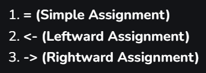

# R

Referências:

- [GeeksforGeeks — R Tutorial](https://www.geeksforgeeks.org/r-tutorial/?ref=lbp)
- [r-project.org](https://www.r-project.org/)

R é a linguagem da ciência de dados: é livre, de código aberto, e conta com mais de 9000 pacotes gratuitos disponíveis.

## Variáveis

A atribuição de valores a variáveis pode ser feita de três formas:



```r
var = "Example"
var <- "Example" # também existe <<- (torna a variável global)
"Example" -> var # também existe ->> (torna a variável global)
```

### Métodos relacionados a variáveis

- **`ls()`** — lista todas as variáveis presentes no workspace atual.

    ```r
    # usando o operador de igualdade
    var1 = "hello"

    # usando o operador para a esquerda
    var2 <- "hello"

    # usando o operador para a direita
    "hello" -> var3

    print(ls())
    # [1] "var1" "var2" "var3"
    ```

- **`rm()`** — remove uma variável indesejada do workspace, liberando o espaço de memória alocado para ela.

    ```r
    # usando o operador de igualdade
    var1 = "hello"

    # usando o operador para a esquerda
    var2 <- "hello"

    # usando o operador para a direita
    "hello" -> var3

    # removendo variável
    rm(var3)
    print(var3)
    # Error in print(var3) : object 'var3' not found
    # Execution halted
    ```

- **Variáveis globais e locais** — podemos usar variáveis locais (modificadas apenas dentro da função) e variáveis globais (que podem ser modificadas em qualquer lugar).

## Tipos de dados

### Numeric

Representa o conjunto de todos os números reais; números com ponto decimal são representados usando esse tipo, que utiliza o formato de ponto flutuante de precisão dupla (double) para representar valores numéricos. Mesmo que um número inteiro seja atribuído a uma variável, ele ainda é salvo como um valor numérico.


Quando o R armazena um número em uma variável, ele converte o valor para um "double", ou um tipo decimal com, no mínimo, duas casas decimais. Isso significa que um valor como "5" é armazenado como `5.00`, com tipo `double` e classe `numeric`; o fato de `y` não ser um inteiro pode ser confirmado com a função `is.integer()`.


### Integer

Representa o conjunto de todos os números inteiros. Para atribuir um valor como inteiro, podemos usar a função `as.integer()` ou a notação de sufixo com "L" maiúsculo, que indica que determinado valor é um inteiro:

```r
x = as.integer(5)
print(class(x)) # "integer"
print(typeof(x)) # "integer"

y = 5L
print(class(y)) # "integer"
print(typeof(y)) # "integer"
```

### Logical

É, basicamente, um valor booleano:

```r
z = 3 > 4
print(z) # TRUE
print(class(z)) # "logical"
print(typeof(z)) # "logical"
```

### Complex

É o conjunto de todos os números complexos; esse tipo de dado é usado para armazenar números com uma componente imaginária:

```r
x = 4 + 3i
print(class(x)) # "complex"
print(typeof(x)) # "complex"
```

### Character

Armazena valores do tipo caractere ou strings, que precisam estar entre aspas simples ou duplas; o caractere pode ser letra, número, símbolo etc.:

```r
char = "Testeteste"
print(class(char)) # "character"
print(typeof(char)) # "character"
```

### Raw

Serve para salvar e trabalhar com dados em nível de byte, ou com dados que não devem ser interpretados como numéricos ou caracteres. Ao exibir uma série de bytes não processados, esse tipo permite operações de baixo nível sobre dados binários — basicamente, cria um vetor com informação em ASCII, binário ou hexadecimal. Podemos converter um caractere para raw usando `charToRaw()`, e o inverso usando `rawToChar()`; também podemos converter um número em bits e depois os bits em raw usando `intToBits()` e `packBits()`.

```r
# Convertendo uma string de caracteres para bytes "raw"
char_data <- "Example"
raw_data <- charToRaw(char_data)
print(raw_data)  # Imprime os bytes "raw"
# [1] 45 78 61 6d 70 6c 65

# Convertendo os bytes "raw" de volta para uma string
back_to_char <- rawToChar(raw_data)
print(back_to_char)  # Imprime "Example"
# [1] "Example"

# Criando um vetor "raw" diretamente
raw_vector <- as.raw(c(0x01, 0x02, 0xFF))
print(raw_vector)  # Imprime o vetor raw
# [1] 01 02 ff

# Convertendo inteiros para bits "raw" e de volta
int_value <- 42
bits <- intToBits(int_value)
print(bits)  # Imprime os bits "raw" do inteiro 42
#  [1] 00 01 00 01 00 01 00 00 00 00 00 00 00 00 00 00 00 00 00 00 00 00 00 00 00 00 00 00 00 00
# [31] 00 00
packed_bits <- packBits(bits)
print(packed_bits)  # Imprime os bits compactados como dado raw
# [1] 2a 00 00 00
```

### Identificando e convertendo tipos

Para descobrir o tipo de dado de uma variável, usamos a função `class()`; para verificar se o tipo é o esperado, usamos `is.data_type()` (função que retorna `TRUE` se o tipo for correto, e `FALSE` caso contrário).

Para converter entre tipos de dados usamos `as.data_type()`, mas nem todas as conversões são possíveis, e algumas podem resultar em `NA`. Além dos tipos acima, existem muitas outras funções `as.` — por exemplo, `as.Date`, `as.vector`, `as.matrix`, entre outras.

## Estruturas de dados

!!! note
    Esta seção cobre as principais estruturas de dados do R: strings, vetores, matrizes, listas, arrays, fatores e data frames.

### String

Uma string é, essencialmente, um array de caracteres. Uma string vazia é representada por `""`, e pode ser delimitada por aspas simples ou duplas.

**Comprimento (length)**

Para obter o comprimento de uma string, usamos `str_length()`, do pacote `stringr`.


- Saída: `5`
- Também podemos usar `nchar()`, que é uma função nativa (built-in):

    

    - Saída: `6`

**Substring**

Para obter uma parte de uma string (substring), podemos usar `substr()` ou `substring()`; a sintaxe de ambas as funções é `funcao(string, indice_inicial, indice_final)`.


Combinando `length()` com substring, podemos fazer *slicing* de strings:


**Conversão de caixa (case)**

Usamos `toupper()` para obter a versão em maiúsculas, `tolower()` para minúsculas, e também podemos usar `casefold(..., upper = TRUE)` para obter maiúsculas (o valor de `upper` em `casefold()` é `FALSE` por padrão).


**Concatenação**

Podemos concatenar strings usando a função `paste()` (a melhor opção, na minha opinião), entre outras.


**Atualizando strings**

Podemos atualizar uma string usando a função `gsub()` (sintaxe: `gsub(palavra_que_quero_trocar, palavra_para_substituir, minha_string)`).


### Vector

Um vetor é uma coleção ordenada de tipos básicos de dados com um comprimento determinado; no R, o índice de um vetor sempre começa em 1, e não em 0. É, basicamente, um array unidimensional.

**Criação**

Normalmente usamos a função `c()` para criar um vetor, cujos argumentos são os elementos que compõem o vetor. Outra função útil é `seq()`, que cria uma sequência de valores contínuos (sintaxe: `seq(primeiro_elemento, segundo_elemento, length.out)`). Por fim, podemos usar `:` para criar um vetor: basta colocar valores antes e depois do `:`, e ele retornará um vetor de valores contínuos.


Para obter o comprimento de um vetor, usamos a função `length()`:


**Acessando elementos**

Para acessar os elementos do vetor, usamos o operador de indexação `[]`, lembrando que o vetor é baseado em 1 (1-based):


Também podemos acessar múltiplos índices usando `c()` dentro do índice.

**Modificando um vetor**

Podemos modificar um elemento específico, um subvetor ou o vetor inteiro:


- Na primeira modificação, mudamos o vetor de `(2, 7, 9, 8, 2)` para `(2, 9, 1, 7, 8, 2)`.
- Na segunda modificação, alteramos os índices de 1 a 5, colocando `0` em todos eles — vetor antes: `(2, 9, 1, 7, 8, 2)`; vetor depois: `(0, 0, 0, 0, 0, 2)`.
- Na última modificação, trocamos o vetor `X`, com 6 posições, por outro vetor com 3 posições — que correspondem ao terceiro, segundo e primeiro elementos originais, nessa ordem — vetor antes: `(0, 0, 0, 0, 0, 2)`; vetor depois: `(0, 0, 0)`.


**Deletando um vetor**

Podemos simplesmente atribuir `NULL` ao vetor:


Outra forma:


- Deletando os elementos 3, 4 e 5, caso estejam no vetor.

**Ordenando os elementos de um vetor**

Podemos usar a função `sort()` para ordenar os elementos de um vetor em ordem crescente ou decrescente — `sort()` tem o argumento `decreasing`, que é `FALSE` por padrão, mas que, se `TRUE`, ordena em ordem decrescente.


### Matrices

Uma matriz é um array bidimensional.

**Criação**

Para criar uma matriz, usamos a função `matrix()`:


!!! example
    ```r
    my_matrix <- matrix(
      1:9,
      nrow = 3,
      ncol = 3,
      byrow = FALSE
    )

    print(my_matrix)

    my_matrix <- matrix(
      1:9,
      nrow = 3,
      ncol = 3,
      byrow = TRUE
    )

    print(my_matrix)

    cat('\014')

    # Output:
    #
    #     [,1] [,2] [,3]
    # [1,]    1    4    7
    # [2,]    2    5    8
    # [3,]    3    6    9
    #
    #      [,1] [,2] [,3]
    # [1,]    1    2    3
    # [2,]    4    5    6
    # [3,]    7    8    9
    ```

**Matriz nominada**

Basta usar as funções `colnames()` e `rownames()`:

```r
my_matrix <- matrix(
  1:9,
  nrow = 3,
  ncol = 3,
  byrow = TRUE,
)

rownames(my_matrix) <- c("row 1", "row 2", "row 3")
colnames(my_matrix) <- c("col 1", "col 2", "col 3")

print(my_matrix)

cat('\014')

# Output:
#       col 1 col 2 col 3
# row 1     1     2     3
# row 2     4     5     6
# row 3     7     8     9
```

**Matrizes especiais**

Uma matriz em que todas as linhas e colunas são preenchidas por uma única constante:

```r
my_matrix <- matrix(
  5,
  nrow = 3,
  ncol = 3,
  byrow = TRUE,
)

rownames(my_matrix) <- c("row 1", "row 2", "row 3")
colnames(my_matrix) <- c("col 1", "col 2", "col 3")

print(my_matrix)

cat('\014')

# Output:
#       col 1 col 2 col 3
# row 1     5     5     5
# row 2     5     5     5
# row 3     5     5     5
```

Matriz diagonal — para criar uma matriz diagonal usamos a função `diag()`:


```r
my_matrix <- diag(c(4, 9, 8), 3, 3)

rownames(my_matrix) <- c("row 1", "row 2", "row 3")
colnames(my_matrix) <- c("col 1", "col 2", "col 3")

print(my_matrix)

cat('\014')

# Output:
#
#       col 1 col 2 col 3
# row 1     4     0     0
# row 2     0     9     0
# row 3     0     0     8
```

Matriz identidade — usamos a função `diag()`, com o parâmetro "k" igual a 1:

```r
my_matrix <- diag(1, 3, 3)

rownames(my_matrix) <- c("row 1", "row 2", "row 3")
colnames(my_matrix) <- c("col 1", "col 2", "col 3")

print(my_matrix)

cat('\014')

# Output:
#       col 1 col 2 col 3
# row 1     1     0     0
# row 2     0     1     0
# row 3     0     0     1
```

**Funções úteis**

`dim()`, `nrow()`, `ncol()`, `length()`, `prod()`:

```r
my_matrix <- matrix(
  1:9,
  nrow = 3,
  ncol = 3,
  byrow = TRUE,
)

rownames(my_matrix) <- c("row 1", "row 2", "row 3")
colnames(my_matrix) <- c("col 1", "col 2", "col 3")

cat("My matrix: \n")
print(my_matrix)
cat("The dimension of my matrix: ", dim(my_matrix))
cat("The number of rows: ", nrow(my_matrix))
cat("The number of columns: ", ncol(my_matrix))
cat("The number of elements w\\ length: ", length(my_matrix))
cat("The number of elements w\\ prod: ", prod(dim(my_matrix)))
cat("The product of the elements: ", prod(my_matrix))

cat('\014')

# Output:
#
# My matrix:
#       col 1 col 2 col 3
# row 1     1     2     3
# row 2     4     5     6
# row 3     7     8     9
# The dimension of my matrix:  3 3
# The number of rows:  3
# The number of columns:  3
# The number of elements w length:  9
# The number of elements w prod:  9
# The product of the elements:  362880
```

**Acessando**

Para acessar os elementos da matriz usamos o índice, lembrando que o índice de uma linha é `[x,]` e o índice de uma coluna é `[,x]`:

```r
my_matrix <- matrix(
  1:9,
  nrow = 3,
  ncol = 3,
  byrow = TRUE,
)

rownames(my_matrix) <- c("row 1", "row 2", "row 3")
colnames(my_matrix) <- c("col 1", "col 2", "col 3")

print(my_matrix)

print(my_matrix[1:2,])
# acessando a 1ª e a 2ª linhas

print(my_matrix[,c("col 1", "col 3")])
# acessando a 1ª e a 3ª colunas

print(my_matrix[c(1, 3), c("col 2", "col 3")])
# acessando os elementos que pertencem à 1ª linha, 3ª linha, 2ª coluna
# e 3ª coluna

cat('\014')

# Output:
#
#       col 1 col 2 col 3
# row 1     1     2     3
# row 2     4     5     6
# row 3     7     8     9
#
#       col 1 col 2 col 3
# row 1     1     2     3
# row 2     4     5     6
#
#       col 1 col 3
# row 1     1     3
# row 2     4     6
# row 3     7     9
#
#       col 2 col 3
# row 1     2     3
# row 3     8     9
```

**Modificando elementos**

Podemos modificar os elementos acessando-os por meio do índice:

```r
my_matrix <- matrix(
  1:9,
  nrow = 3,
  ncol = 3,
  byrow = TRUE,
)

rownames(my_matrix) <- c("row 1", "row 2", "row 3")
colnames(my_matrix) <- c("col 1", "col 2", "col 3")

print(my_matrix)

my_matrix[1, "col 2"] <- 80
# modificando um único elemento

print(my_matrix)

my_matrix["row 2",] <- c(78, 65, 43)
# modificando uma linha inteira

print(my_matrix)

my_matrix[, "col 3"] <- c(55, 43, 21)
# modificando uma coluna inteira

print(my_matrix)

cat('\014')

# Output:
#       col 1 col 2 col 3
# row 1     1     2     3
# row 2     4     5     6
# row 3     7     8     9
#
#       col 1 col 2 col 3
# row 1     1    80     3
# row 2     4     5     6
# row 3     7     8     9
#
#       col 1 col 2 col 3
# row 1     1    80     3
# row 2    78    65    43
# row 3     7     8     9
#
#       col 1 col 2 col 3
# row 1     1    80    55
# row 2    78    65    43
# row 3     7     8    21
```

**Concatenação**

A concatenação de linhas é feita usando `rbind()` — os parâmetros são as próprias matrizes, e os nomes de linhas/colunas têm prioridade na primeira matriz chamada na função:

```r
my_matrix <- matrix(
  1:9,
  nrow = 3,
  ncol = 3,
  byrow = TRUE,
)

rownames(my_matrix) <- c("row 1", "row 2", "row 3")
colnames(my_matrix) <- c("col 1", "col 2", "col 3")

print(my_matrix)

aux_matrix <- matrix(
  10:12,
  nrow = 1,
  ncol = 3,
  byrow = TRUE
)

rownames(aux_matrix) <- c("aux row 1")
colnames(aux_matrix) <- c("aux col 1", "aux col 2", "aux col 3")

print(aux_matrix)

new_matrix <- rbind(my_matrix, aux_matrix)

print(new_matrix)

cat('\014')

# Output:
#       col 1 col 2 col 3
# row 1     1     2     3
# row 2     4     5     6
# row 3     7     8     9
#
#           aux col 1 aux col 2 aux col 3
# aux row 1        10        11        12
#
#           col 1 col 2 col 3
# row 1         1     2     3
# row 2         4     5     6
# row 3         7     8     9
# aux row 1    10    11    12
```

A concatenação de colunas é feita usando `cbind()` — mesma lógica de parâmetros e prioridade de nomes:

```r
my_matrix <- matrix(
  1:9,
  nrow = 3,
  ncol = 3,
  byrow = TRUE,
)

rownames(my_matrix) <- c("row 1", "row 2", "row 3")
colnames(my_matrix) <- c("col 1", "col 2", "col 3")

print(my_matrix)

aux_matrix <- matrix(
  10:15,
  nrow = 3,
  ncol = 2,
  byrow = TRUE
)

colnames(aux_matrix) <- c("aux col 1", "aux col 2")
rownames(aux_matrix) <- c("aux row 1", "aux row 2", "aux row 3")

print(aux_matrix)

new_matrix <- cbind(my_matrix, aux_matrix)

print(new_matrix)

cat('\014')

# Output:
#
#       col 1 col 2 col 3
# row 1     1     2     3
# row 2     4     5     6
# row 3     7     8     9
#
#           aux col 1 aux col 2
# aux row 1        10        11
# aux row 2        12        13
# aux row 3        14        15
#
#       col 1 col 2 col 3 aux col 1 aux col 2
# row 1     1     2     3        10        11
# row 2     4     5     6        12        13
# row 3     7     8     9        14        15
```

!!! warning
    Em ambos os casos, é preciso garantir que o número de colunas (para `rbind`) ou de linhas (para `cbind`) seja o mesmo nos parâmetros passados às funções.

**Adicionando elementos**

Adicionando uma linha, usando `rbind()` novamente:

```r
my_matrix <- matrix(
  1:9,
  nrow = 3,
  ncol = 3,
  byrow = TRUE,
)

rownames(my_matrix) <- c("row 1", "row 2", "row 3")
colnames(my_matrix) <- c("col 1", "col 2", "col 3")

print(my_matrix)

new_row <- c(10, 11, 12)

my_matrix <- rbind(my_matrix, new_row)

print(my_matrix)

cat('\014')

# Output:
#
#       col 1 col 2 col 3
# row 1     1     2     3
# row 2     4     5     6
# row 3     7     8     9
#
#         col 1 col 2 col 3
# row 1       1     2     3
# row 2       4     5     6
# row 3       7     8     9
# new_row    10    11    12
```

Adicionando uma coluna, usando `cbind()` novamente:

```r
my_matrix <- matrix(
  c(1, 2, 3, 4, 5, 6, 7, 8, 9),
  nrow = 3,
  ncol = 3,
  byrow = TRUE,
)

rownames(my_matrix) <- c("row 1", "row 2", "row 3")
colnames(my_matrix) <- c("col 1", "col 2", "col 3")

print(my_matrix)

new_column <- c(10, 11, 12)

my_matrix <- cbind(my_matrix, new_column)

print(my_matrix)

cat('\014')

# Output:
#
#       col 1 col 2 col 3
# row 1     1     2     3
# row 2     4     5     6
# row 3     7     8     9
#
#       col 1 col 2 col 3 new_column
# row 1     1     2     3         10
# row 2     4     5     6         11
# row 3     7     8     9         12
```

**Deletando elementos**

Para remover uma linha ou coluna, acessamos com índice e colocamos o sinal negativo antes do índice:

```r
my_matrix <- matrix(
  1:9,
  nrow = 3,
  ncol = 3,
  byrow = TRUE,
)

rownames(my_matrix) <- c("row 1", "row 2", "row 3")
colnames(my_matrix) <- c("col 1", "col 2", "col 3")

print(my_matrix)

my_matrix <- my_matrix[-2, ]
# removendo a 2ª linha

print(my_matrix)

my_matrix <- my_matrix[, -3]
# removendo a 3ª coluna

print(my_matrix)

my_matrix <- my_matrix[-1, -2]
# removendo a 1ª linha e a 2ª coluna (my_matrix agora é um inteiro)

print(my_matrix)

cat('\014')

# Output:
#       col 1 col 2 col 3
# row 1     1     2     3
# row 2     4     5     6
# row 3     7     8     9
#
#       col 1 col 2 col 3
# row 1     1     2     3
# row 3     7     8     9
#
#       col 1 col 2
# row 1     1     2
# row 3     7     8
#
# [1] 7
```

### Lists

Uma lista é como um vetor, mas com elementos de dados heterogêneos — podemos ter uma lista de vetores, funções, matrizes, e assim por diante.

**Criação**

Para criar uma lista usamos a função `list()`:


Nesse exemplo, criamos uma lista cujo primeiro índice contém um vetor de IDs, o segundo índice contém um vetor de nomes, e o terceiro índice contém o número de funcionários:


**Lista nominada**

Os índices `[[1]]`, `[[2]]` e `[[3]]` são os índices da lista, e `[1]` é o índice interno de um vetor dentro de um desses índices; podemos nomear os índices `[[1]]`, `[[2]]` e `[[3]]` atribuindo nomes aos vetores dentro da função `list()`:


Agora temos o que se chama de lista nominada (*named list*).

**Acessando componentes de uma lista**

Todos os componentes de uma lista podem ser nomeados, e podemos usar esses nomes para acessá-los usando o operador cifrão (`$`):


Também podemos acessar os componentes usando o operador de dupla indexação `[[...]]`; para acessar um nível interno, precisamos acrescentar outro `[...]` junto ao operador de dupla indexação. Dentro desses colchetes podemos colocar o índice ou o nome atribuído a ele (caso a lista seja nominada).

```r
empId = c(1, 2, 3, 4)
empName = c("Debi", "Sandeep", "Subham", "Shiba")
numberOfEmp = 4

empList = list(
  "ID's" = empId,
  "name" = empName,
  "Number of Employees" = numberOfEmp
  )

print(empList)

# Acessando um componente de nível superior pelo nome
cat("Accessing name components using name\n")
print(empList[["name"]])

# Acessando um componente de nível superior pelo índice
cat("Accessing name components using indices\n")
print(empList[[2]])

# Acessando um componente de nível interno pelo nome
cat("Accessing Sandeep from name using name\n")
print(empList[["name"]][2])

# Acessando um componente de nível interno pelo índice
cat("Accessing Sandeep from name using indices\n")
print(empList[[2]][2])

# Acessando outro componente de nível interno pelo nome
cat("Accessing 4 from ID using name\n")
print(empList[["ID's"]][4])

# Acessando outro componente de nível interno pelo índice
cat("Accessing 4 from ID using indices\n")
print(empList[[1]][4])

# Output:
# $`ID's`
# [1] 1 2 3 4
#
# $name
# [1] "Debi"    "Sandeep" "Subham"  "Shiba"
#
# $`Number of Employees`
# [1] 4
#
# Accessing name components using name
# [1] "Debi"    "Sandeep" "Subham"  "Shiba"
#
# Accessing name components using indices
# [1] "Debi"    "Sandeep" "Subham"  "Shiba"
#
# Accessing Sandeep from name using name
# [1] "Sandeep"
#
# Accessing Sandeep from name using indices
# [1] "Sandeep"
#
# Accessing 4 from ID using name
# [1] 4
#
# Accessing 4 from ID using indices
# [1] 4
```

**Modificando componentes de uma lista**

Modificamos da mesma forma que acessamos os componentes, mas atribuindo um valor a esse acesso:


**Concatenação de listas**

Para concatenar listas, podemos usar a função `c()` passando listas como argumentos:


**Adicionando itens**

Para adicionar um item ao final da lista, usamos `append(my_list, element)`:

```r
# criando uma lista
number_vector <- c(1, 2, 3, 4, 5)

my_list <- list("numbers" = number_vector)
print(my_list)

# adicionando uma nova camada (índice) ao final da lista, sem especificar nome
my_list <- append(my_list, "Recife")
print(my_list)

# adicionando uma nova camada (índice) ao final da lista, especificando o nome
# para criar uma nova camada nomeada, precisamos atribuir a essa camada,
# dentro do append()
my_list$"currency" <- append(my_list$"currency", "Reais")
print(my_list)

# adicionando um novo elemento a "numbers"
my_list$"numbers" <- append(my_list$"numbers", 8)
print(my_list)

cat("\014") # limpa o console

# Output:
# # criando uma lista
# $numbers
# [1] 1 2 3 4 5
#
# # adicionando uma nova camada (índice) ao final da lista, sem especificar nome
# $numbers
# [1] 1 2 3 4 5
#
# [[2]]
# [1] "Recife"
#
# # adicionando uma nova camada (índice) ao final da lista, especificando o nome
# $numbers
# [1] 1 2 3 4 5
#
# [[2]]
# [1] "Recife"
#
# $currency
# [1] "Reais"
#
# # adicionando um novo elemento a "numbers"
# $numbers
# [1] 1 2 3 4 5 8
#
# [[2]]
# [1] "Recife"
#
# $currency
# [1] "Reais"
```

**Deletando componentes de uma lista**

Para deletar um componente, acessamos esse componente e removemos usando índice negativo:

```r
# Criando uma lista nomeando todos os seus componentes
empId = c(1, 2, 3, 4)
empName = c("Debi", "Sandeep", "Subham", "Shiba")
numberOfEmp = 4
empList = list(
  "ID" = empId,
  "Names" = empName,
  "Total Staff" = numberOfEmp
)
cat("Before deletion the list is\n")
print(empList)

# Deletando um componente de nível superior
cat("After Deleting Total staff components\n")
empList <- empList[-3]
print(empList)

# Deletando um componente de nível interno
cat("After Deleting sandeep from name\n")
empList[[2]] <- empList[[2]][-2]
print(empList)

cat("\014")

# Output:
# Before deletion the list is
# $ID
# [1] 1 2 3 4
#
# $Names
# [1] "Debi"    "Sandeep" "Subham"  "Shiba"
#
# $`Total Staff`
# [1] 4
#
# After Deleting Total staff components
# $ID
# [1] 1 2 3 4
#
# $Names
# [1] "Debi"    "Sandeep" "Subham"  "Shiba"
#
# After Deleting sandeep from name
# $ID
# [1] 1 2 3 4
#
# $Names
# [1] "Debi"   "Subham" "Shiba"
```

**Mesclando listas**

Podemos mesclar duas ou mais listas concatenando-as.

Não nominadas:

```r
# Criando duas listas.
lst1 <- list(1,2,3)
lst2 <- list("Sun","Mon","Tue")

# Mesclando as duas listas.
new_list <- c(lst1,lst2)

# Imprimindo a lista mesclada.
print(new_list)

cat("\014")

# Output:
# [[1]]
# [1] 1
#
# [[2]]
# [1] 2
#
# [[3]]
# [1] 3
#
# [[4]]
# [1] "Sun"
#
# [[5]]
# [1] "Mon"
#
# [[6]]
# [1] "Tue"
```

Nominadas:

```r
# Criando duas listas.

lst1 <- list("numbers" = c(1,2,3))
lst2 <- list("days" = c("Sun","Mon","Tue"))

# Mesclando as duas listas.
new_list <- c(lst1,lst2)

# Imprimindo a lista mesclada.
print(new_list)

cat("\014")

# Output:
# $numbers
# [1] 1 2 3
#
# $days
# [1] "Sun" "Mon" "Tue"
```

**Conversão**

Lista para vetor — criamos uma lista e depois uma variável do tipo vetor, atribuída com a função `unlist(my_list)`:

```r
# Criando listas.
lst <- list(1:5)
print(lst)

# Convertendo a lista para vetor.
vec <- unlist(lst)

print(vec)

# Output:
# [[1]]
# [1] 1 2 3 4 5 # lista
#
# [1] 1 2 3 4 5 # vetor
```

Lista para matriz — usamos `matrix()` e `unlist()` combinados:

```r
# Definindo a lista
lst1 <- list("list 1" = list(1, 2, 3), "list 2" = list(4, 5, 6))

# Imprimindo a lista
cat("The list is:\n")
print(lst1)
cat("Class:", class(lst1), "\n")

# Convertendo lista para matriz
mat <- matrix(unlist(lst1), nrow = 2, byrow = TRUE)

# Imprimindo a matriz
cat("\nAfter conversion to matrix:\n")
print(mat)
cat("Class:", class(mat), "\n")

cat("\014")

# Output:
# The list is:
#
# $`list 1`
# $`list 1`[[1]]
# [1] 1
#
# $`list 1`[[2]]
# [1] 2
#
# $`list 1`[[3]]
# [1] 3
#
# $`list 2`
# $`list 2`[[1]]
# [1] 4
#
# $`list 2`[[2]]
# [1] 5
#
# $`list 2`[[3]]
# [1] 6
#
# Class: list
#
# After conversion to matrix:
#      [,1] [,2] [,3]
# [1,]    1    2    3
# [2,]    4    5    6
#
# Class: matrix array
```

### Array

Arrays são estruturas de armazenamento de dados definidas por um número fixo de dimensões: um array unidimensional é chamado de vetor, e um array bidimensional é chamado de matriz. Um array é composto por elementos de um mesmo tipo de dado.

**Criação**

Para criar um array usamos a função `array()`:


Se quisermos criar um vetor usamos `c()`, e se quisermos criar uma matriz usamos `matrix()`. Também podemos criar uma matriz usando `array()`:

```r
arr <- array(
    2:13, # queremos os elementos de 2 a 13 no nosso array
    dim = c(2, 3, 2) # para definir as dimensões do array usamos c()
    # o primeiro parâmetro é o número de linhas, o segundo é o número de colunas
    # e o terceiro é quantos índices de dimensão linha x coluna o array
    # terá; basicamente, é o número de matrizes de dimensão linha * coluna
    )

print(arr)

# Output:
# , , 1
#
#      [,1] [,2] [,3]
# [1,]    2    4    6
# [2,]    3    5    7
#
# , , 2
#
#      [,1] [,2] [,3]
# [1,]    8   10   12
# [2,]    9   11   13
```

**Nomeando arrays**

Para nomear linhas, colunas e matrizes de um array, usamos o terceiro argumento da função `array()`, `dimnames` — que precisa ser uma lista:

```r
row_names <- c("row 1", "row 2", "row 3")
col_names <- c("col 1", "col 2")
mat_names <- c("matrix 1", "matrix 2")

arr <- array(
    data = 2:20,
    dim = c(length(row_names), length(col_names), length(mat_names)),
    dimnames = list(row_names, col_names, mat_names)
    )

print(arr)

cat("\014")

# Output:
# , , matrix 1
#
#       col 1 col 2
# row 1     2     5
# row 2     3     6
# row 3     4     7
#
# , , matrix 2
#
#       col 1 col 2
# row 1     8    11
# row 2     9    12
# row 3    10    13
```

!!! note
    Note que colocamos `2:20`, mas o array só possui `2:13` valores únicos no exemplo anterior; isso acontece porque, aqui, o array estava completo (todas as 18 posições, $3 \times 2 \times 3$, foram preenchidas pelos valores de 2 a 19).

**Acessando**

Podemos acessar um array por índice ou por nome (se o array for nominado).

Índice de um array:

- O índice de uma matriz dentro do array é precedido por duas vírgulas: `,,índice_da_matriz`.
- O índice de uma linha é seguido por uma vírgula: `índice_da_linha,`.
- O índice de uma coluna é precedido por uma vírgula: `,índice_da_coluna`.

Acessando matrizes inteiras:

```r
row_names <- c("row 1", "row 2", "row 3")
col_names <- c("col 1", "col 2")
mat_names <- c("matrix 1", "matrix 2")

arr <- array(
    data = 2:20,
    dim = c(length(row_names), length(col_names), length(mat_names)),
    dimnames = list(row_names, col_names, mat_names)
    )

# imprimindo a matriz 1 usando índice
print(arr[,,1])

# imprimindo a matriz 2 usando nome
print(arr[,,"matrix 2"])

cat("\014")

# Output:
#       col 1 col 2
# row 1     2     5
# row 2     3     6
# row 3     4     7
#
#       col 1 col 2
# row 1     8    11
# row 2     9    12
# row 3    10    13
```

Acessando linhas e colunas específicas de matrizes, colocando o índice separadamente:

```r
row_names <- c("row 1", "row 2", "row 3")
col_names <- c("col 1", "col 2")
mat_names <- c("matrix 1", "matrix 2")

arr <- array(
    data = 2:20,
    dim = c(length(row_names), length(col_names), length(mat_names)),
    dimnames = list(row_names, col_names, mat_names)
    )

# imprimindo a linha 2 da matriz 1 usando índice
print(arr[,,1][2,])

# imprimindo a linha 3 da matriz 2 usando nome
print(arr[,,"matrix 2"]["row 3",])

# imprimindo a coluna 1 da matriz 1 usando nome
print(arr[,,"matrix 1"][,"col 1"])

# imprimindo a coluna 2 da matriz 2 usando índice
print(arr[,,2][,2])

cat("\014")

# Output:
# col 1 col 2  # arr[,,1][2,]
#     3     6
#
# col 1 col 2 # arr[,,"matrix 2"]["row 3",]
#    10    13
#
# row 1 row 2 row 3 # arr[,,"matrix 1"][,"col 1"]
#     2     3     4
#
# row 1 row 2 row 3 # arr[,,2][,2]
#    11    12    13
```

Ou podemos "combinar" os índices de linhas/colunas e matrizes (a melhor forma, na minha opinião):

```r
row_names <- c("row 1", "row 2", "row 3")
col_names <- c("col 1", "col 2")
mat_names <- c("matrix 1", "matrix 2")

arr <- array(
  data = 2:20,
  dim = c(length(row_names), length(col_names), length(mat_names)),
  dimnames = list(row_names, col_names, mat_names)
)

# imprimindo a linha 2 da matriz 1 usando índice
print(arr[2,,1])

# imprimindo a linha 3 da matriz 2 usando nome
print(arr["row 3",,"matrix 2"])

# imprimindo a coluna 1 da matriz 1 usando nome
print(arr[,"col 1","matrix 1"])

# imprimindo a coluna 2 da matriz 2 usando índice
print(arr[,2,2])

cat("\014")

# Output:
# col 1 col 2  # arr[2,,1]
#     3     6
#
# col 1 col 2 # arr["row 3",,"matrix 2"]
#    10    13
#
# row 1 row 2 row 3 # arr[,"col 1","matrix 1"]
#     2     3     4
#
# row 1 row 2 row 3 # arr[,2,2]
#    11    12    13
```

Acessando elementos individualmente — precisamos dos três índices:

```r
row_names <- c("row 1", "row 2", "row 3")
col_names <- c("col 1", "col 2")
mat_names <- c("matrix 1", "matrix 2")

arr <- array(
    data = 2:20,
    dim = c(length(row_names), length(col_names), length(mat_names)),
    dimnames = list(row_names, col_names, mat_names)
    )

print(arr)

# imprimindo o elemento na 2ª linha da 1ª coluna da
# 1ª matriz
print(arr[2,1,1])

# imprimindo o elemento na 3ª linha da 2ª coluna da
# 2ª matriz
print(arr["row 3", "col 2", "matrix 2"])

cat("\014")

# Output:
# , , matrix 1
#
#       col 1 col 2
# row 1     2     5
# row 2     3     6
# row 3     4     7
#
# , , matrix 2
#
#       col 1 col 2
# row 1     8    11
# row 2     9    12
# row 3    10    13
#
# [1] 3 # arr[2,1,1]
#
# [1] 13 # arr["row 3", "col 2", "matrix 2"]
```

Acessando subconjuntos de elementos — usamos `c()` dentro do índice do array:

```r
row_names <- c("row 1", "row 2", "row 3")
col_names <- c("col 1", "col 2")
mat_names <- c("matrix 1", "matrix 2")

arr <- array(
  data = 2:20,
  dim = c(length(row_names), length(col_names), length(mat_names)),
  dimnames = list(row_names, col_names, mat_names)
)

print(arr)

# imprimindo os elementos na 1ª e 3ª linhas
# na 2ª coluna da 1ª matriz
print(arr[c(1, 3), 2, 1])

# imprimindo os elementos na 2ª linha
# na 1ª e 2ª colunas da 2ª matriz
print(arr["row 2", c("col 1", "col 2"), "matrix 2"])

# imprimindo os elementos na 1ª e 3ª linhas nas
# 1ª e 2ª colunas da matriz 1
print(arr[c(1, 3), c(1, 2), 1])

# imprimindo todos os elementos que estão na 2ª coluna
# nas 1ª e 3ª linhas de ambas as matrizes 1 e 2
print(arr[c(1, 3), 2, c(1, 2)])

cat("\014")

# Output:
# row 1 row 3 # arr[c(1, 3), 2, 1]
#     5     7
#
# col 1 col 2 # arr["row 2", c("col 1", "col 2"), "matrix 2"]
#     9    12
#
#       col 1 col 2 # arr[c(1, 3), c(1, 2), 1]
# row 1     2     5
# row 3     4     7
#
#       matrix 1 matrix 2 # arr[c(1, 3), 2, c(1, 2)]
# row 1        5       11
# row 3        7       13
```

**Adicionando, removendo e atualizando elementos**

Para adicionar um elemento em um array, podemos agir apenas sobre uma linha, uma coluna ou uma matriz, usando `c()`, indexação ou `append()` — essas operações são as mesmas de um vetor.

!!! warning
    Se o array foi construído com `array()`, essas operações de adição e remoção **não funcionam** (o tamanho do array é fixo). O mesmo vale para remoção de elementos.

Para atualizar um elemento, basta acessá-lo e alterar o seu valor:

```r
row_names <- c("row 1", "row 2", "row 3")
col_names <- c("col 1", "col 2")
mat_names <- c("matrix 1", "matrix 2")

arr <- array(
  data = 2:20,
  dim = c(length(row_names), length(col_names), length(mat_names)),
  dimnames = list(row_names, col_names, mat_names)
)

arr[1,1,2] <- 89
# alterando um único elemento

arr[1,,1] <- c(120, 800)
# alterando uma linha

arr[,2,2] <- c(20, 25, 30)
# alterando uma coluna

print(arr)

arr[,,1] <- 78:83
# alterando uma matriz inteira

print(arr)

cat("\014")

# Output:
# , , matrix 1
#
#       col 1 col 2
# row 1   120   800
# row 2     3     6
# row 3     4     7
#
# , , matrix 2
#
#       col 1 col 2
# row 1    89    20
# row 2     9    25
# row 3    10    30
#
# , , matrix 1
#
#       col 1 col 2
# row 1    78    81
# row 2    79    82
# row 3    80    83
#
# , , matrix 2
#
#       col 1 col 2
# row 1    89    20
# row 2     9    25
# row 3    10    30
```

### Factors

São estruturas de dados usadas para categorizar dados, ou representar dados categóricos, armazenando-os em múltiplos níveis (*levels*).

**Criação**

Para criar um fator, usamos a função `factor()`, que tem seis parâmetros:

1. **Dados** — o vetor a ser convertido em fator.
2. **`levels`** — o conjunto de valores distintos atribuídos ao vetor de entrada `x`; é determinado automaticamente.
3. **`labels`** — vetor de strings que nomeia os níveis e também modifica os dados com base neles; por padrão, os rótulos são os mesmos dos níveis.
4. **`exclude`** — menciona os valores a excluir; por padrão, `exclude = NA`.
5. **`ordered`** — atributo lógico que decide se os níveis são ordenados; por padrão, `ordered = is.ordered(primeiro_parâmetro)`.
6. **`nmax`** — limite superior para o número máximo de níveis; por padrão, `nmax = NA`.

```r
fac <- factor(c("Brazil", "Peru", "Ecuador", "Peru", "Brazil"))

print(fac)

levels(fac) <- c("DF", "Quito", "Lima")
# adicionando rótulos usando levels()

print(fac)

fac <- factor(fac, exclude = "DF")
# excluindo "DF" do fator

print(fac)

fac <- factor(fac, ordered = TRUE)
# ordenando o fator

print(fac)

cat('\014')

# Output:
# [1] Brazil  Peru    Ecuador Peru    Brazil
# Levels: Brazil Ecuador Peru
#
# [1] DF    Lima  Quito Lima  DF
# Levels: DF Quito Lima
#
# [1] <NA>  Lima  Quito Lima  <NA>
# Levels: Quito Lima
#
# [1] <NA>  Lima  Quito Lima  <NA>
# Levels: Quito < Lima # Lima é um nível acima de Quito
```

**Acessando elementos**

Para acessar um elemento, usamos índice, como em um vetor:

```r
fac <- factor(c("Brazil", "Peru", "Ecuador", "Peru", "Brazil"))
levels(fac) <- c("DF", "Quito", "Lima")

print(fac[3])

cat('\014')

# Output:
# [1] Quito
# Levels: DF Quito Lima
```

**Modificando um fator**

Para modificar um fator, acessamos e atribuímos um novo valor; para deletar, usamos índice com o sinal negativo:

```r
fac <- factor(c("Brazil", "Peru", "Ecuador", "Peru", "Brazil"))
levels(fac) <- c("DF", "Quito", "Lima")

levels(fac) <- c(levels(fac), "Bogotá")
# precisamos adicionar o novo nível primeiro

fac[3] <- "Bogotá"

print(fac)

fac <- fac[-2]

print(fac)

cat('\014')

# Output:
#
# [1] DF     Lima   Bogotá Lima   DF
# Levels: DF Quito Lima Bogotá
#
# [1] DF     Bogotá Lima   DF
# Levels: DF Quito Lima Bogotá
```

### Data-Frames

Usados para armazenar dados tabulares.

!!! example
    

**Criação**

Para criar um data frame, usamos a função `data.frame()`:


```r
# Programa R para criar um data frame

# criando o data frame
friend.data <- data.frame(
    friend_id = c(1:5),
    friend_name = c("Sachin", "Sourav",
                    "Dravid", "Sehwag",
                    "Dhoni"),
    stringsAsFactors = FALSE
)
# imprimindo o data frame
print(friend.data)
```

**Obtendo informações (`str()`)**

```r
# criando o data frame
friend.data <- data.frame(
    friend_id = c(1:5),
    friend_name = c("Sachin", "Sourav",
                    "Dravid", "Sehwag",
                    "Dhoni"),
    stringsAsFactors = FALSE
)
# usando str()
print(str(friend.data))

# Output:
# 'data.frame':	5 obs. of  2 variables:
#  $ friend_id  : int  1 2 3 4 5
#  $ friend_name: chr  "Sachin" "Sourav" "Dravid" "Sehwag" ...
# NULL
```

!!! note "Tópicos a aprofundar (notas originais incompletas)"
    O material original também listava, sem detalhar, os seguintes tópicos sobre data frames: resumo (`summary()`), extração e expansão de dados, acesso a itens, contagem de linhas/colunas, adição/remoção de linhas e colunas, e combinação de data frames (vertical e horizontal). Em geral: `summary(df)` fornece estatísticas descritivas de cada coluna; `df$coluna` ou `df[, "coluna"]` extrai uma coluna; `nrow(df)`/`ncol(df)` contam linhas/colunas; `rbind()`/`cbind()` combinam data frames verticalmente/horizontalmente (de forma análoga a matrizes); e a remoção de linhas/colunas segue a mesma lógica de indexação negativa vista em vetores e matrizes.

## Input

Para ler uma entrada, podemos usar as funções `scan()` ou `readline()`.

**`readline()`**

Sempre converte a entrada para string, então precisamos usar `as.data_type()` para converter. Se quisermos múltiplas entradas, podemos usar colchetes e colocar `readline()` dentro deles:


Dentro da função, podemos escrever um prompt, como a função `input()` do Python.

**`scan()`**

Recebe entradas continuamente; para terminar o processo de entrada, precisamos pressionar Enter duas vezes no console.


Podemos especificar o tipo da entrada com o argumento `what`, seguido da função do tipo de dado:


Também podemos ler arquivos com esse método:


## Output

No R, temos a função `print()` para gerar saída, que pode imprimir uma string ou uma variável:


Podemos usar `paste()` dentro de `print()` para imprimir string e variável juntas (existe também `paste0()`, que basicamente não adiciona um espaço "entre" as vírgulas):


**Argumentos de `print()`**

- `quote` — podemos remover as aspas (ao imprimir uma string ou char) simplesmente colocando `quote = FALSE`.
- `digits` — podemos definir o número mínimo de dígitos significativos.

    

    

- `na.print` — indica o que será impresso caso o valor seja `NA`.

    

    

Também podemos imprimir apenas escrevendo no console o nome da variável:


Outra função de saída é `sprintf()`, que é literalmente a função da biblioteca C, com especificadores de formato:


Outra forma de gerar saída é usando a função `cat()`, que é basicamente as funções `print()` + `paste()` juntas (converte os argumentos em strings de caracteres):


Também existe `message()`, mas essa função não é usada para saída normal — é usada para mostrar mensagens de diagnóstico simples, que não são avisos nem erros no programa, mas que também podem ser usadas para saída comum:


Também podemos escrever um arquivo com a saída do programa usando `write()`, com a opção `table` para escrever o arquivo:


Para limpar o terminal no RStudio podemos usar `cat("\014")`.

## Comments

Comentários podem ser feitos usando `#`; apenas comentários de uma linha são suportados nativamente. Mas podemos fazer comentários com mais de uma linha usando este truque:


- Saída: `[1] "This is fun!"`

## Operadores

### Aritméticos

`+` (soma), `-` (subtração), `*` (multiplicação), `/` (divisão), `^` (potência), `%%` (módulo/resto), `%/%` (quociente inteiro):


### Lógicos

Os operadores lógicos em R simulam operações de decisão elemento a elemento, com base no operador especificado entre os operandos, que são então avaliados como `TRUE` ou `FALSE`. Qualquer valor inteiro diferente de zero é considerado `TRUE`, seja ele um número real ou complexo.

- **Elemento a elemento**: `&` (And — qualquer valor inteiro diferente de zero é considerado `TRUE`), `|` (Or).
- **Escalares**: `!` (Not), `&&` (And), `||` (Or).


### Relacionais

`<` (menor que), `<=` (menor ou igual a), `>` (maior que), `>=` (maior ou igual a), `!=` (diferente de), `==` (igual a):


### Diversos (miscellaneous)

**`%in%`** — verifica se um elemento pertence a uma lista, retornando um valor booleano:


**`%*%`** — operador para multiplicar uma matriz pela sua transposta:


## Conditionals

Existem `if`'s, `else if`'s e `else`'s, com estrutura similar à do C/C++:


!!! warning
    Os `else if`'s e `else`'s precisam vir estritamente logo após o fechamento das chaves; caso contrário, o código não roda.

## Switch-case statement

É uma expressão condicional que tem uma lista de casos — se um deles for encontrado (match), algo acontece:


Os casos podem ser qualquer coisa, inclusive outras saídas:


- Se atribuirmos uma variável a uma instrução `switch`, e nenhum caso corresponder, ela retorna o valor `NULL`.

Se quisermos um caso padrão (default), basta não atribuir nada a ele (deixar sem valor correspondente):


## Loops

### For

É um loop executado um número finito de vezes, até que a condição de saída seja atingida; muito comum para iterar sobre elementos.


Podemos iterar sobre uma variável:


Podemos usar `for` para criar gráficos:


### While

Executa uma instrução repetidamente, até que a condição dada se torne falsa. A condição é verificada primeiro, e só então o código dentro do `while` é executado.

```r
# Programa R para demonstrar o uso do loop while

val = 1

# usando o loop while
while (val <= 5 ) {
	# instruções
	print(val)
	val = val + 1
}

# Output
# [1] 1
# [1] 2
# [1] 3
# [1] 4
# [1] 5
```

### Break

É uma instrução de salto usada para terminar o loop em uma iteração específica:


### Next

É usado para pular quaisquer instruções restantes do loop e continuar a execução do programa — é uma instrução que pula a iteração atual, sem terminar o loop:


### Repeat

É um loop que pode ser iterado um número arbitrário de vezes, mas que não tem condição de saída embutida — por isso, precisamos criar uma dentro do `repeat`, usando `break` para sair do loop.

```r
# Programa R para demonstrar o uso do loop repeat

val = 1

# usando o loop repeat
repeat {
	# instruções
	print(val)
	val = val + 1

	# verificando a condição de parada
	if(val > 5) {
		# usando a instrução break
		# para terminar o loop
		break
	}
}

# Output
# [1] 1
# [1] 2
# [1] 3
# [1] 4
# [1] 5
```

### Nested loops

São, simplesmente, loops dentro de loops.

## Keywords

- **`TRUE` e `FALSE`** — valores lógicos booleanos.
- **`function`** — usado para criar funções.
- **`NULL`** — usado para representar valores ausentes e indefinidos; não é `TRUE` nem `FALSE`.
- **`NaN`** — "Not a Number".

    

- **`Inf`** — palavra-chave para infinito negativo ou positivo; funções relacionadas: `is.finite()` e `is.infinite()`.

    

- **`NA`** — "Not Available", usado para representar valores ausentes.

## Functions

Funções aceitam argumentos e podem retornar valores.

**Sintaxe para criar uma função**


Os argumentos não precisam ter seu tipo de dado especificado; se quisermos especificar, precisamos verificar o tipo do argumento dentro da função, usando `is.data_type()`.

!!! example
    

    

Podemos ter argumentos com valores padrão (default) dentro da função:


Outras funções podem ser passadas como argumentos, e uma função também pode ter zero argumentos.

### Tipos de funções

- **Primitivas**.
- **Infix** — são aquelas funções em que o nome da função fica entre seus argumentos, e que têm apenas dois argumentos; na prática, é um operador, mas definido por meio de uma função.

    !!! example
        

        Essa função imprime quem é maior que quem; se os dois números forem iguais, imprime "equal".

        

- **Replacement**.

### Return

Palavra-chave usada para retornar algum valor de dentro de uma função. O valor retornado precisa estar entre parênteses.

### Funções recursivas

São funções cujo `return` chama a própria função novamente.

!!! example
    

    

    

    

### Algumas funções nativas (built-in)


## Tópicos ainda a desenvolver no material original

!!! warning "Seções marcadas como incompletas (POO, Error Handling, File Handling, Packages)"
    O material original listava estes tópicos apenas como marcadores de seção, sem conteúdo: **Programação Orientada a Objetos (POO)** em R (R suporta múltiplos sistemas de OOP — S3, S4, R5/Reference Classes e R6, sendo S3 o mais simples e informal, e S4 o mais formal, com validação de classes); **Error Handling**, feito principalmente com `tryCatch()`, `stop()`, `warning()` e `try()`; **File Handling**, com funções como `file()`, `readLines()`, `writeLines()`, `file.exists()` e `unlink()`; e **Packages**, instalados com `install.packages()` e carregados com `library()`. Como o conteúdo detalhado não estava presente no material original, essas notas gerais servem apenas como referência mínima do que falta aprofundar.

## Data interfaces

!!! note "Nota do material original: seção marcada para refazer"
    - Para importar arquivos no R, usamos `read.table(filename, header = FALSE, sep = "")`.
    - Para importar arquivos CSV, usamos `read.csv(filename, header = FALSE, sep = "")`.
        - Para obter um item específico usamos `$`.

## Data visualization

!!! note "Nota do material original: seção marcada para refazer"
    **`barplot()`** — tem um parâmetro que define se o gráfico de barras é horizontal ou vertical.

    !!! example
        

        

    É bom para realizar um estudo comparativo entre as diversas categorias de dados do conjunto de dados.

    **`hist()`**

    

    

    

    

    **`boxplot()`**, **`plot()`**

    `plot()` exibe muitos pontos em um plano cartesiano, cada ponto denotando o valor assumido por dois parâmetros, o que ajuda a identificar facilmente a relação entre eles.

    Parâmetros:

    

    

    

    !!! example
        

    !!! example
        

    Adicionando título, cor e rótulos:

    

    Múltiplas linhas:

    

    Outras funções de visualização mencionadas, mas não detalhadas no material original: `heatmap()`, `map()`, `persp()`, `table()`, `pie()`.

## Statistics

!!! note "Nota do material original: seção marcada para refazer"
    - **Média** — usamos `mean()` para calcular a média aritmética.
    - **Mediana** — usamos `median()`.
    - **Moda** — não existe função nativa para moda; é preciso criar uma, ou usar o pacote `modeest`, que tem a função `mfv()`.
    - **Desvio padrão** — usamos `sd()`.
    - **Variância** — usamos `var()`, ou `sd()^2`.
    - **Amplitude (range)** — podemos fazer `max(data) - min(data)`.
    - **Quartil** — usamos `quantile()`; para a amplitude interquartílica, usamos `IQR()`.
    - **Summary** — com `summary()`, podemos acessar diversos resumos estatísticos, tanto de uma variável quanto de um data frame inteiro.
    - **Distribuição normal** — podemos usar `dnorm()`, `pnorm()`, `qnorm()` e `rnorm()`; provavelmente as mais úteis são `dnorm()` (a melhor) e `rnorm()`. Os parâmetros são os dados, a média e o desvio padrão.
    - **Distribuição binomial** — mencionada, mas sem funções detalhadas no material original (o análogo seria `dbinom()`, `pbinom()`, `qbinom()` e `rbinom()`).
    - **Distribuição t-Student** — podemos usar `dt()`, `pt()`, `qt()` e `rt()` (a mais útil talvez seja `qt()`).
    - **Assimetria (skewness)** — usamos `skewness()` (do pacote `moments`): se a função retorna um valor $> 0$, o gráfico é assimétrico positivo; se retorna $0$ ou próximo de zero, o gráfico é simétrico e aproximadamente normal; caso contrário, o gráfico é assimétrico negativo.
    - **Curtose (kurtosis)** — não é uma função nativa, mas com o pacote `moments` podemos usá-la.
    - **Teste de hipóteses** — mencionado como tópico a desenvolver; ver a seção correspondente na página principal de [Estatística e Probabilidade](../estatistica-probabilidade-p-computacao.md) para a teoria completa de testes de hipótese.
