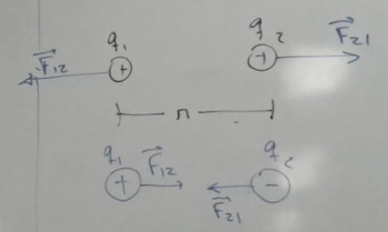

# FÍSICA P/ COMPUTAÇÃO

## Eletrostática

A **eletrostática** é o ramo da física que estuda o comportamento de cargas elétricas em repouso.

### Cargas elétricas

A **carga elementar** é a menor unidade de carga elétrica livre observada na natureza: $e = 1{,}6 \times 10^{-19}$ Coulombs.

**Unidades de medida (prefixos usados para submúltiplos)**

| Prefixo | Símbolo | Fator |
|---|---|---|
| Mili | m | $10^{-3}$ |
| Micro | µ | $10^{-6}$ |
| Nano | n | $10^{-9}$ |

**Partículas elementares e sua carga**

- **Elétrons** — têm carga negativa ($-e$); são partículas elementares, ou seja, não são compostas por quarks (são **léptons**); e são muito mais móveis do que os prótons.
- **Prótons** — têm carga positiva ($+e$); não são partículas elementares, sendo compostos por 2 quarks *up* e 1 quark *down*. A carga resultante é $2 \times \frac{2e}{3} + \left(-\frac{e}{3}\right) = +1{,}6 \times 10^{-19}$ C.
- **Nêutrons** — têm carga neutra ($0$); são compostos por 2 quarks *down* e 1 quark *up*. A carga resultante é $\frac{2e}{3} + 2 \times \left(-\frac{e}{3}\right) = 0$.

### Materiais

De acordo com sua capacidade de conduzir eletricidade, os materiais são classificados em: **condutores**, **isolantes**, **semicondutores** e **supercondutores**.

### Força elétrica (Lei de Coulomb)

A **força elétrica** é a força de interação entre duas cargas.

??? note "Diagrama de referência"
    

**Fórmula (Lei de Coulomb)**

$$F = \frac{K \cdot |q_1 \cdot q_2|}{r^2}$$

$$K = \frac{1}{4\pi\varepsilon}$$

Onde:

- $\varepsilon$ — permissividade elétrica do meio (depende do meio em que as cargas estão).
- $K$ — constante eletrostática, $K = 9 \times 10^9 \, \text{N} \cdot \text{m}^2/\text{C}^2$.
- $q_1$ e $q_2$ — magnitude das cargas elétricas.
- $r$ — distância entre os centros das cargas.
- Unidade de $F$: Newton.

A força elétrica é uma grandeza vetorial, podendo ser decomposta em $F_e \hat{x}$ e $F_e \hat{y}$ — isto é, a componente da força elétrica na coordenada $x$ e na coordenada $y$, respectivamente.

!!! note "Revisão de vetores"
    ??? note "Diagrama de referência"
        

**Atração e repulsão**

- Cargas opostas se **atraem**.
- Cargas iguais se **repelem**.

!!! example
    (O objetivo do exercício é determinar a quantidade de elétrons presente em cada carga.)

    ??? note "Resolução passo a passo (foto do caderno)"
        

        

        

        

        

### Princípio da superposição

Trata da força resultante entre três ou mais cargas. O princípio afirma que a força entre duas cargas, dentro de um grupo de cargas, é **independente** da presença das demais cargas do grupo. Logo, a força elétrica resultante entre três ou mais cargas é o vetor resultante da soma das forças elétricas entre cada par de cargas.

??? note "Diagrama de referência"
    

!!! example
    ??? note "Resolução passo a passo (foto do caderno)"
        

        

        

        

        

    !!! warning "Correção de cálculo"
        Na resolução original, foi usado por engano $0{,}9/4{,}4$; o valor correto é $0{,}9/4{,}7 = 0{,}1914893617$. O $\arctan(0{,}1914893617)$ é exatamente $10{,}8°$.

### Campo elétrico

O **campo elétrico** é um campo vetorial provocado pela ação de cargas elétricas, existindo tanto no vácuo quanto em meios materiais.

**Tipos de campo**

- **Escalares** — retornam um valor escalar (ex.: pressão).
- **Vetoriais** — retornam um valor vetorial (ex.: velocidade das partículas em um fluido).

Para caracterizar o campo elétrico $E$, usa-se uma **carga de prova** $q'$, sempre positiva ($q' > 0$). Com essa caracterização, obtém-se a fórmula do campo elétrico:

$$E = \frac{K|q|}{r^2}\hat{\imath}$$

Onde:

- $K = 9 \times 10^9 \, \text{N} \cdot \text{m}^2/\text{C}^2$ (constante).
- $q$ — magnitude da carga elétrica geradora do campo.
- $r$ — distância da carga até a carga de prova.
- $\hat{\imath}$ — direção do campo elétrico.
- Unidade de $E$: N/C.

**Sinal da carga e direção do campo**

=== "Carga positiva"
    A direção do campo elétrico é contrária ao local onde a carga está (aponta para fora da carga).

    ??? note "Diagrama de referência"
        

=== "Carga negativa"
    O campo elétrico aponta em direção ao local onde a carga está.

    ??? note "Diagrama de referência"
        

**Linhas de fluxo**

As linhas de fluxo fornecem a direção e o sentido do campo $E$ local. A densidade das linhas é proporcional à intensidade de $E$, que por sua vez é proporcional à carga $q$ e inversamente proporcional a $r^2$. Em outras palavras, onde as linhas de fluxo estão mais próximas umas das outras (mais densas), existem mais linhas; onde estão mais espaçadas, existem menos linhas.

??? note "Diagrama de referência"
    

!!! example
    ??? note "Resolução passo a passo (foto do caderno)"
        

        

        

        

**Campo gerado por várias cargas**

Da mesma forma que a força elétrica, o campo elétrico resultante gerado por várias cargas é a soma vetorial (princípio da superposição) do campo gerado por cada carga individualmente.

??? note "Diagramas de referência"
    

    

### Energia potencial elétrica

A **energia potencial elétrica** é uma forma de energia relacionada à posição relativa entre pares de cargas elétricas.

**Fórmula**

$$E_p(r) = \frac{K \cdot |q_1 \cdot q_2|}{r}$$

Onde:

- $K = 9 \times 10^9 \, \text{N} \cdot \text{m}^2/\text{C}^2$ (constante).
- $q_1$ e $q_2$ — magnitude das cargas elétricas.
- $r$ — distância entre as cargas.
- Unidade: Joule (J).

Para calcular a energia potencial elétrica entre **duas** cargas, basta aplicar a fórmula acima diretamente. Para calcular a energia potencial elétrica entre **três ou mais** cargas, deve-se fazer o somatório das energias potenciais de cada par de cargas.

!!! example
    ??? note "Resolução passo a passo (foto do caderno)"
        

### Potencial elétrico

O **potencial elétrico** é a capacidade que um corpo energizado tem de realizar trabalho — ou seja, de atrair ou repelir outras cargas elétricas.

**Fórmula**

$$V(r) = \frac{E_p(r)}{q'} = \frac{Kq}{r}$$

Onde:

- $K = 9 \times 10^9 \, \text{N} \cdot \text{m}^2/\text{C}^2$ (constante).
- $q'$ e $q$ — magnitude das cargas elétricas.
- $r$ — distância entre as cargas.
- Unidade: Volt (V), equivalente a J/C.
