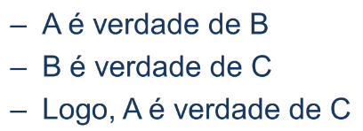
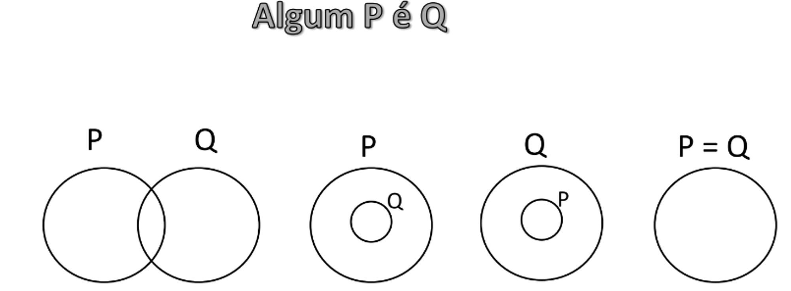
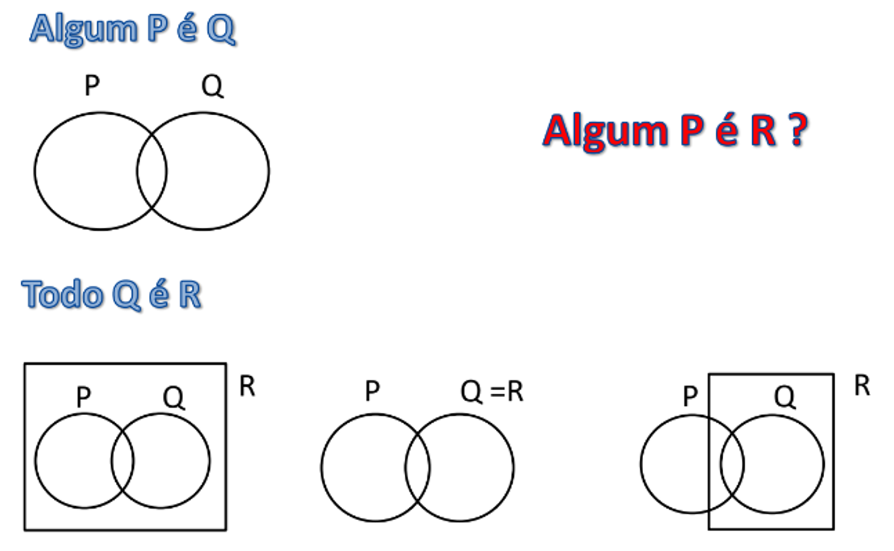
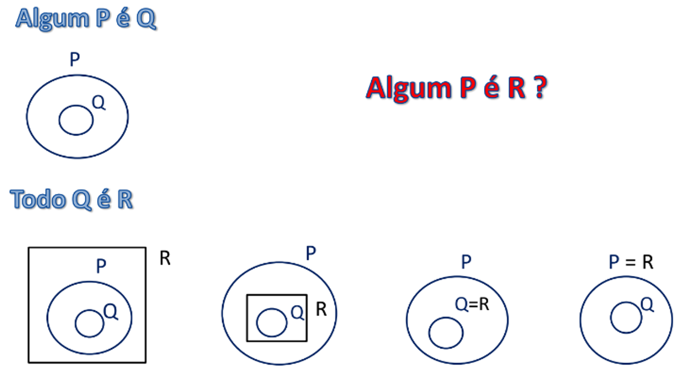
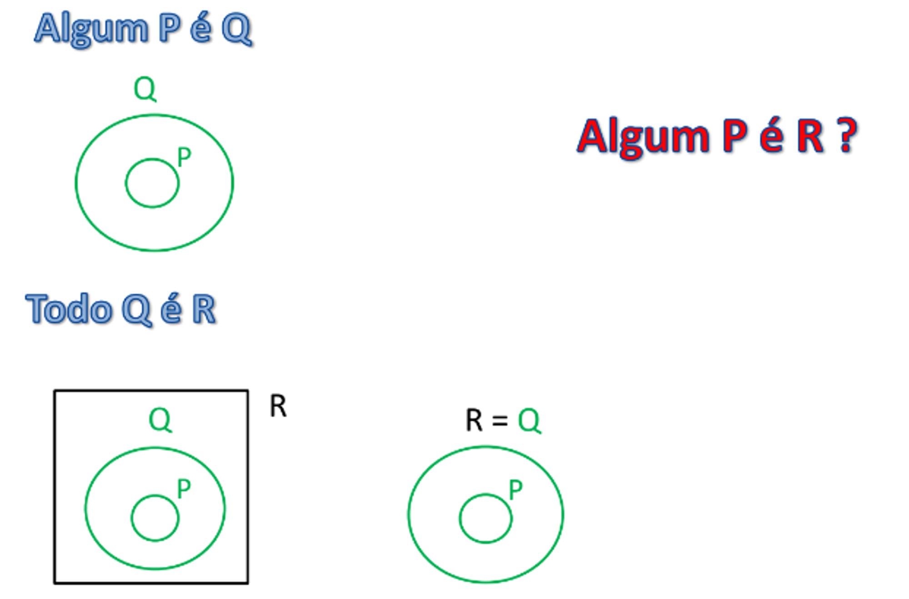
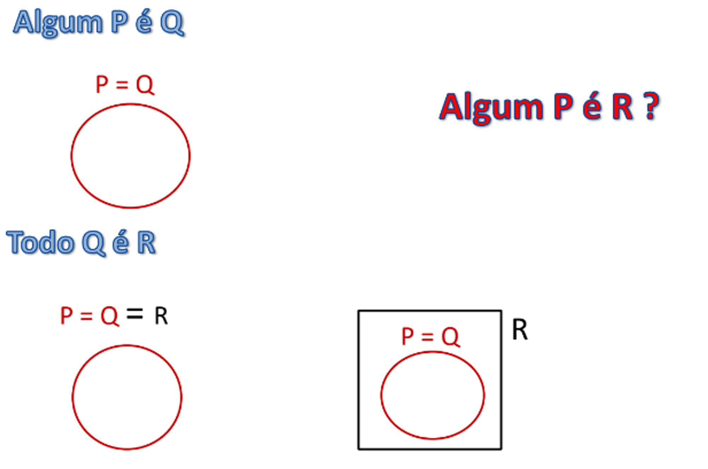
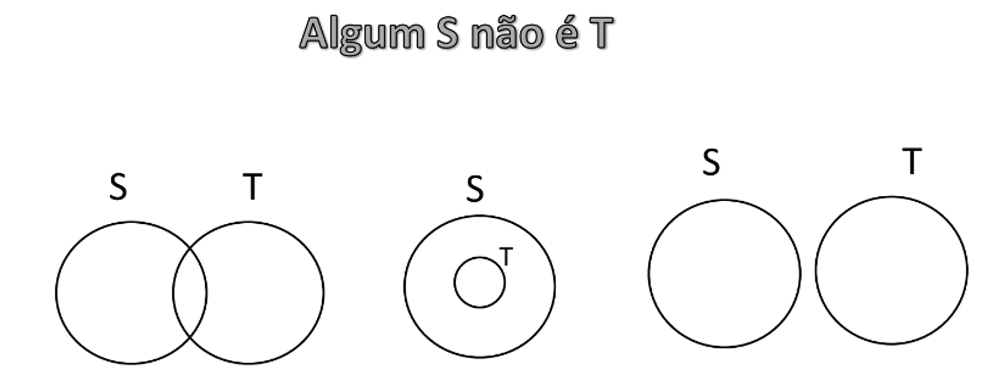
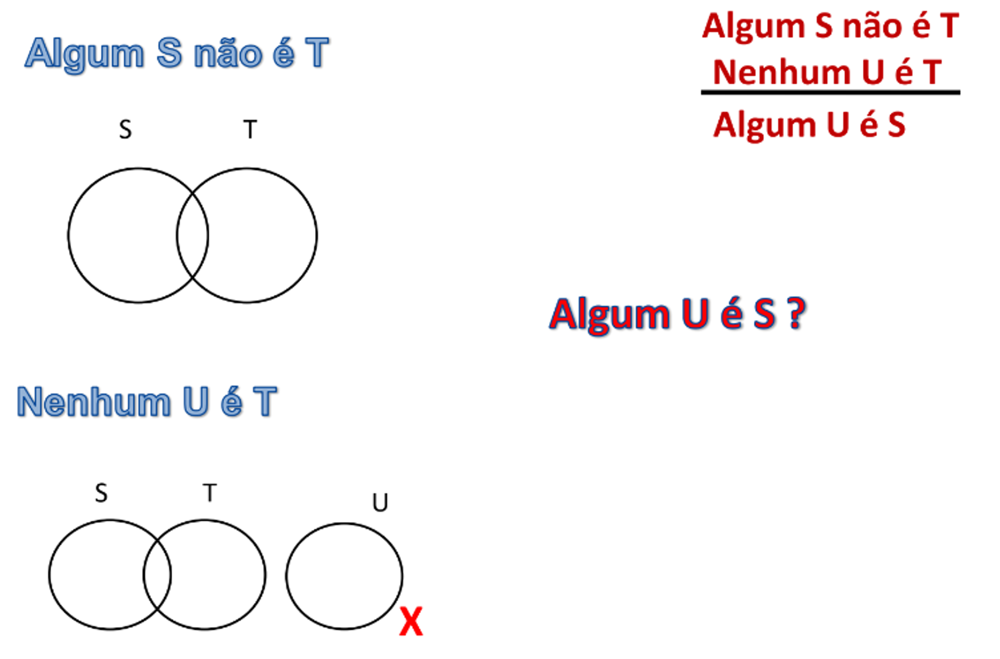
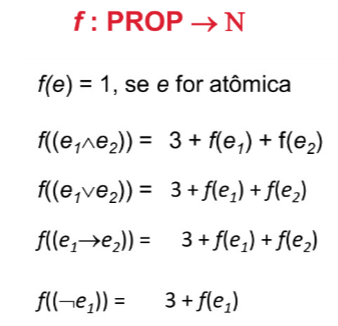

# LÓGICA P/ COMPUTAÇÃO

## Lógica Aristotélica

### O que é lógica?

**Lógica** é o estudo do raciocínio: como passar de afirmações aceitas (premissas) para novas afirmações (conclusões) de forma segura.

!!! example "Comportamento lógico vs. ilógico"
    - **Lógico** — sair num dia de chuva com o guarda-chuva aberto.
    - **Ilógico** — sair num dia de chuva segurando um guarda-chuva fechado.

!!! example "Explicação lógica vs. ilógica"
    - **Lógica** — "Luiza parou no restaurante porque estava com fome."
    - **Ilógica** — "Luiza parou no restaurante porque estava doente."

### Silogismo

Um **silogismo** é uma inferência em que uma proposição (a conclusão) decorre de duas outras (as premissas).

!!! example
    

    

### Sentenças

**Sentenças** (ou proposições) são enunciados que podem ser verdadeiros ou falsos. Por isso, perguntas, ordens e exclamações **não** são proposições — não assumem valor de verdade.

**Tipos de sentenças**

- **Objeto → categoria** (classificação de um indivíduo específico):

    

- **Categoria → categoria**, subdividida em:

    | Quantificador | Positiva | Negativa |
    |---|---|---|
    | Universal | Todo $P$ é $Q$ | Nenhum $P$ é $Q$ |
    | Existencial | Algum $P$ é $Q$ | Algum $P$ não é $Q$ |

### Contradição

Uma **contradição** ocorre quando a combinação de sentenças declarativas leva a um absurdo ou a uma impossibilidade lógica.

**Tipo 1 — triviais**

!!! example
    

**Tipo 2 — identificadas pelo quadrado de oposições**

Para identificar contradições do tipo 2, usamos o **quadrado de oposições**, construído a partir de quatro formas canônicas:

- **A** — Todo $A$ é $B$ (universal positiva)
- **E** — Nenhum $A$ é $B$ (universal negativa)
- **I** — Algum $A$ é $B$ (existencial positiva)
- **O** — Algum $A$ não é $B$ (existencial negativa)

| Relação | Condição | Exemplo |
|---|---|---|
| **Contraditórias** (A–O, E–I) | Quando uma é V, a outra é obrigatoriamente F | "Todo homem é vegano" / "Algum homem não é vegano" |
| **Contrárias** (A–E) | Podem ser ambas F, mas não ambas V | "Todo homem é atleta" / "Nenhum homem é atleta" |
| **Subcontrárias** (I–O) | Podem ser ambas V, mas não ambas F | "Algum homem é atleta" / "Algum homem não é atleta" |
| **Subalternas** (A→I, E→O) | A afirmação universal implica a particular correspondente | "Todo homem é mortal" ⟹ "Algum homem é mortal"; "Nenhum homem é mortal" ⟹ "Algum homem não é mortal" |

### Ato de inferência (figura de inferência)

Um **ato de inferência** é o ato de tirar uma conclusão a partir de um conjunto de sentenças (as premissas).

**Validade do ato de inferência**

Um ato de inferência é **válido** (logicamente seguro) quando, em toda situação em que as premissas são verdadeiras, a conclusão é obrigatoriamente verdadeira. Se um ato de inferência tem premissas falsas ou contraditórias, ele é dito **válido por vacuidade** (a implicação é "verdadeira" trivialmente, já que o antecedente nunca se realiza). Um ato de inferência válido é chamado de **silogismo**.

!!! example "Válido com conclusão verdadeira"
    

    O ato de inferência é válido e a conclusão também é verdadeira.

!!! example "Válido com conclusão não verdadeira no mundo real"
    

    O ato de inferência é válido, mas a conclusão não é verdadeira — está logicamente correto, mas não corresponde à realidade (uma premissa é falsa).

Um ato de inferência é **inválido** quando existe uma situação em que as premissas são verdadeiras, mas a conclusão é falsa.

!!! example
    - Premissa 1: Todo homem é mortal.
    - Premissa 2: Sócrates é mortal.
    - Conclusão: Logo, Sócrates é homem.

    Esse ato é **inválido**: Sócrates poderia não ser um homem — poderia ser, por exemplo, um cachorro (que também é mortal).

!!! example
    

    Ato de inferência inválido: não é porque eu não possuo todo o ouro do mundo que eu não sou rico — a conclusão é falsa.

!!! note
    Quando as premissas não são (ou não podem ser) todas verdadeiras, o ato de inferência é dito **válido por vacuidade**.

### Argumento

Um **argumento** é uma coleção de atos de inferência.

- **Válido** — um argumento é válido se todos os seus atos de inferência também são válidos. Se algum ato de inferência de um argumento é válido por vacuidade, o argumento também é dito válido por vacuidade.
- **Inválido** — um argumento é inválido se pelo menos um dos seus atos é inválido.

### Diagramas de Venn para analisar enunciados

Diagramas de Venn são uma ferramenta visual útil para checar a validade de um ato de inferência, representando graficamente os conjuntos envolvidos nas premissas.

!!! example "Exemplo 1"
    

    

    

    

    

    

    O ato de inferência é **válido**.

!!! example "Exemplo 2"
    

    

    

    Como existe um caso em que as premissas são verdadeiras, mas a conclusão não é, este ato de inferência **não é válido**.

!!! example "Exemplo 3"
    

    O ato de inferência é **válido**.

!!! example "Exemplo 4"
    

    O ato de inferência **não é válido**.

### Conjunto inconsistente de sentenças

Seja $C$ um conjunto de sentenças (um ato de inferência). Dizemos que $C$ é **inconsistente** se é possível inferir validamente uma sentença $S$ a partir de algum subconjunto de $C$, e também inferir validamente a sentença contraditória $\neg S$ a partir de outro subconjunto de $C$. Caso contrário, $C$ é **consistente** (não possui contradições — existe pelo menos uma situação em que $C$ é inteiramente verdadeiro).

Quando essa inconsistência não é imediatamente aparente, dizemos que $C$ contém uma **contradição implícita**.

!!! example "Contradição implícita"
    1. $C = \{$"Todo humano é mortal", "Nenhum anjo é mortal", "Gabriel é um anjo", "Gabriel é humano"$\}$ — contradição implícita.

    2. 

        

    3. 

        

        

        Logo, a inferência é inválida.

$C$ também é inconsistente se houver uma **contradição explícita**:

!!! example
    

!!! example "Determinando consistência"
    Determine e justifique se o seguinte conjunto de sentenças é consistente:

    

    O conjunto de sentenças é **consistente**, pois existe um caso em que $x$ é $B$ — ou seja, existe um caso em que o conjunto inteiro é verdadeiro:

    

### Paradoxos

!!! warning "Paradoxo do Barbeiro"
    

    Se o barbeiro barbeia a si mesmo, há uma contradição (ele só barbeia quem não se barbeia). Se o barbeiro não barbeia a si mesmo, então ele se encaixa na categoria de quem o barbeiro deveria barbear — mas essa categoria é ele mesmo, então ele deveria se barbear.

!!! warning "Paradoxo de Russell"
    

## Lógica Simbólica de Boole e Frege

### Álgebra booleana

A **álgebra booleana** representa sentenças através dos números $0$ (falso) e $1$ (verdadeiro), manipulados por:

- **Operadores lógicos**: $\land$ (and), nand, $\lor$ (or), nor, xor, xnor, $\neg$ (not), $\rightarrow$ (if-then).
- **Operações de teoria de conjuntos**: produto, soma e complemento.

### Lógica simbólica de Frege

A lógica simbólica de Frege é um método preciso de representação e manipulação simbólica das sentenças da álgebra booleana.

!!! example
    

    Representando como conjunto:

    

    

    O conjunto é consistente se cada argumento resultar em `1`:

    

    Há um caso em que as três proposições valem `1`, logo é um conjunto consistente.

### Sintaxe

A **sintaxe** compreende as regras de formação (sem se preocupar com o significado) da lógica.

**Alfabeto**

$\Sigma^*$ representa o conjunto de **todas** as sequências (expressões) construídas a partir do alfabeto $\Sigma$, incluindo a sequência vazia.

**Conjunto $\Sigma^*$**

Note que há muitas expressões em $\Sigma^*$ que não têm nenhum significado lógico válido.

**Definição dos operadores**

### Conjuntos indutivos

!!! example
    

    

    

    

### Expressões legítimas

Um conjunto indutivo que contém apenas as expressões, construídas a partir do alfabeto $\Sigma$, que têm significado lógico válido (dentro da lógica simbólica/álgebra booleana) — esse conjunto é chamado de $\langle expr \rangle$ ou **PROP**.

$\langle expr \rangle$ é o **fecho indutivo** de $X$ sobre $F$.

**Definindo $\langle expr \rangle$ — de cima para baixo**

**Definindo $\langle expr \rangle$ — de baixo para cima**

**Relacionando as duas definições**

### Conjuntos livremente gerados

Seja $A$ um conjunto qualquer e $X$ um subconjunto de $A$ (analogia a $A = $ PROP). Suponha que $F$ seja um conjunto de funções sobre $A$, cada uma com sua aridade. O fecho indutivo $X^{+v}$ sob $F$ é dito **livremente gerado** se:

- As funções de $F$ são **injetoras** quando restritas a entradas de $X^{+v}$ (para checar, fazemos uma prova por indução: se $f(x) = f(y)$ então $x = y$; equivalentemente, se $x \neq y$ então $f(x) \neq f(y)$).
- Quaisquer duas funções distintas de $F$ têm conjuntos-imagem (sob $X^{+v}$) **disjuntos**.
- Nenhum elemento da base $X$ está na imagem de alguma $f \in F$ sob $X^{+v}$.

!!! example
    

    

    

    

    A resposta é **não**: o elemento $a$ é representado tanto por $*(b, c)$ quanto por $*(c, b)$; logo $*$ não é uma função injetora.

**PROP é livremente gerado**

Com isso, fica provado que PROP é livremente gerado.

### Funções recursivas sobre PROP

Como PROP é um conjunto **livremente gerado**, podemos definir funções **recursivamente** sobre ele, com a garantia de que essas definições são matematicamente bem postas (sem ambiguidade).

**Funções**

- Número de símbolos de uma expressão:

    

- Número de parênteses à esquerda:

    

- Número de parênteses à direita:

    

- Número total de parênteses:

    

- Número de operadores:

    

- Subexpressões de uma expressão:

    

- **Posto** (altura da árvore sintática) de uma expressão:

    

Uma vez definidas essas funções recursivas sobre os elementos de PROP, podemos provar propriedades sobre eles usando **indução matemática**.

**Provando propriedades sobre PROP**

!!! example "Para toda $\varphi \in$ PROP, o número de parênteses de $\varphi$ é par"
    

    

!!! example "Para toda $\varphi \in$ PROP, o número total de símbolos de $\varphi$ é, no mínimo, igual ao número de operadores de $\varphi$"
    

    

!!! example "Para toda $\varphi \in$ PROP, o número de parênteses à esquerda é igual ao número de parênteses à direita"
    

    

!!! example "Para toda $\varphi \in$ PROP, o número de subfórmulas é, no máximo, o dobro do número de operadores mais 1"
    

    

!!! example "Para toda $\varphi \in$ PROP, o posto de $\varphi$ é, no máximo, igual ao número total de símbolos de $\varphi$"
    

    

!!! example
    

    

    

### Semântica

A **semântica** está relacionada ao valor matemático (de verdade) de uma expressão, em oposição à sua forma sintática. Como PROP é livremente gerado, sabemos que podemos definir funções recursivamente sobre ele com segurança matemática — e é exatamente isso que queremos: uma função que retorna um valor de verdade de forma recursiva.

**Definição formal**

A função `Valor` atribui uma valoração (`0` ou `1`) a cada elemento de uma expressão pertencente a $X^{+v}$:

- `Valor` é definida recursivamente.
- Quando `Valor(e)` é aplicada a uma expressão atômica `e`, usamos a função $v()$, que dá o valor booleano "primitivo" à expressão atômica.
- A função $d$ é a que define o comportamento de cada operador.

!!! example
    

    

### Teorema da extensão homomórfica única

(Aqui, $A = $ PROP.)

### Valoração

Uma **valoração** é uma função $v: X \rightarrow Z$ tal que existe uma função $\hat{v}: X^{+v} \rightarrow Z$ satisfazendo:

!!! note
    Lembrando que $a \rightarrow b \equiv \neg a \lor b$.

**Definição da função**

!!! example
    

    

### Satisfabilidade

Seja $\varphi$ uma proposição:

- $\varphi$ é **satisfatível** se existe pelo menos uma valoração $w$ que a satisfaz ($\hat{w}(\varphi) = 1$).
- $\varphi$ é uma **tautologia** se **toda** valoração a satisfaz.
- $\varphi$ é **refutável** se existe pelo menos uma valoração $w$ que **não** a satisfaz ($\hat{w}(\varphi) = 0$).
- $\varphi$ é **insatisfatível** se **nenhuma** valoração a satisfaz.

!!! example
    

    

    Como há pelo menos um caso em que $\hat{w}(\varphi) = 1$, $\varphi$ é satisfatível.

### Conjunto satisfatível

Suponha que $S$ seja um conjunto de proposições. Dizemos que $S$ é **satisfatível** se existe pelo menos uma valoração que satisfaz **todas** as proposições de $S$ simultaneamente ($S$ é insatisfatível caso contrário).

!!! example
    

    

    Como existe um caso em que as três proposições de $S$ valem `1`, $S$ é satisfatível.

### Consequência lógica

Dizemos que uma proposição $\varphi$ é uma **consequência lógica** de um conjunto $S$ se toda valoração que satisfaz $S$ também satisfaz $\varphi$.

!!! example
    

    Nesse caso, é verdade.

    

    Nesse caso, não é verdade.

Formalmente: seja $\Gamma$ um conjunto de sentenças lógicas e $\varphi$ uma sentença; dizemos que $\varphi$ é consequência lógica de $\Gamma$ (notação: $\Gamma \models \varphi$) se toda valoração que satisfaz $\Gamma$ também satisfaz $\varphi$. Se $\Gamma$ é finito ($\Gamma = \{a_1, \ldots, a_n\}$), a leitura de $\Gamma \models \varphi$ é equivalente a $\{a_1, \ldots, a_n\} \rightarrow \varphi$.

**Teoremas**

!!! example "Teorema 1"
    

    

!!! example "Teorema 2"
    

    

    

### Problema da satisfatibilidade (SAT)

**Problema:** dada uma expressão $\varphi$ da lógica proposicional, $\varphi$ é satisfatível? Resolver uma instância do problema SAT exige um certo número de operações booleanas, que depende do tamanho da expressão de entrada $\varphi$.

**Custo computacional**

### Métodos para resolver SAT

#### Tabela-verdade

Consiste em construir uma tabela onde cada **linha** representa uma valoração possível e cada **coluna** representa uma subexpressão da proposição cuja satisfabilidade queremos avaliar. Se o valor `1` aparecer em algum lugar da última coluna, a expressão é satisfatível.

!!! example
    

    

    Sim, é satisfatível.

#### Tableaux

Esse método constrói uma **árvore de possibilidades** a partir de um conjunto de regras simples; cada caminho da raiz até uma folha representa um conjunto possível de valorações.

**Regras**

As regras se dividem em dois tipos: $\alpha$ (não bifurcam a árvore) e $\beta$ (bifurcam a árvore).

**Tipo $\alpha$**

Se $\hat{v}(\neg\varphi) = 1$, então $\hat{v}(\varphi)$ só pode ser `0`, e vice-versa.

Se um "E" ($\land$) vale `1`, então **ambos** os operandos valem `1`.

Se um "OU" ($\lor$) vale `0`, então **ambos** os operandos valem `0`.

Se um "SE-ENTÃO" ($\rightarrow$) vale `0`, então o antecedente ("SE") vale `1` e o consequente ("ENTÃO") vale `0`.

**Tipo $\beta$**

Se um "E" ($\land$) vale `0`, então o primeiro operando, ou o segundo, ou ambos valem `0` (bifurca).

Se um "OU" ($\lor$) vale `1`, então o primeiro operando, ou o segundo, ou ambos valem `1` (bifurca).

Se um "SE-ENTÃO" ($\rightarrow$) vale `1`, então o antecedente vale `0`, ou ambos valem `1` (bifurca).

!!! example "Tableaux de satisfabilidade"
    

    Sim, é satisfatível — existe pelo menos um ramo que satisfaz.

    

    Sim, é satisfatível — existe pelo menos um ramo que satisfaz.

!!! note "Tableaux como prova por refutação"
    Quando queremos saber se uma fórmula é **tautologia**, verificamos se existe a possibilidade dela ser falsa (assumimos $\hat{v}(\varphi) = 0$ e construímos o tableau). Se **todos** os ramos se fecham (contradição em cada um), então $\varphi$ é de fato uma tautologia; caso contrário, não é. Por isso, o método tableaux é um método de prova por refutação.

!!! example
    

    Como todos os ramos estão fechados, não existe possibilidade para a pergunta feita, logo $\hat{v}(\varphi) = 1$ sempre, e $\varphi$ é uma tautologia.

    

    Como todos os ramos estão fechados, não existe possibilidade para a pergunta feita, logo $\hat{v}(\varphi) = 1$ sempre, e $\varphi$ é uma tautologia.

**Resumo de como aplicar o método segundo a pergunta:**

- $\varphi$ é **refutável**? Assuma $\hat{v}(\varphi) = 0$; se houver contradição em **algum** ramo, $\varphi$ é refutável.
- $\varphi$ é **satisfatível**? Faça o processo inverso (assuma $\hat{v}(\varphi) = 1$; se existe ao menos um ramo sem contradição, $\varphi$ é satisfatível).
- $\varphi$ é **insatisfatível**? Assuma $\hat{v}(\varphi) = 1$; se houver contradição em **todos** os ramos, $\varphi$ é de fato insatisfatível.
- $\Gamma \models \varphi$ (com $\Gamma = \{a_1, \ldots, a_n\}$)? É equivalente a perguntar se $\hat{v}(\{a_1, \ldots, a_n\} \rightarrow \varphi)$ é uma tautologia. No método tableaux, buscamos valorações que satisfaçam $\{a_1, \ldots, a_n\}$ e refutem $\varphi$; se tal valoração não existir, $\varphi$ é de fato consequência lógica de $\Gamma$.

!!! example
    

    

**Vantagens e desvantagens**

#### Resolução

**Conceitos**

- **Literal** — uma fórmula atômica ou a negação de uma fórmula atômica.
- **Cláusula** — uma disjunção ou conjunção de literais.

**Formas normais**

=== "Forma Normal Conjuntiva (FNC)"
    Uma fórmula está na FNC se é uma **conjunção de cláusulas** ($\land$ entre as cláusulas), onde cada cláusula é uma **disjunção de literais** ($\lor$ entre os literais). A FNC é, em essência, um "e de ous".

    **Teorema**

    

    !!! example
        

=== "Forma Normal Disjuntiva (FND)"
    Uma fórmula está na FND se é uma **disjunção de cláusulas** ($\lor$ entre as cláusulas), onde cada cláusula é uma **conjunção de literais** ($\land$ entre os literais). A FND é, em essência, um "ou de es".

    **Teorema**

    

    !!! example
        

**Procedimento para obter uma forma normal**

1. Eliminar os conectivos $\rightarrow$ e $\leftrightarrow$ de cada cláusula.
2. Trazer o sinal de negação para imediatamente antes dos átomos, usando a eliminação da dupla negação e as **Leis de De Morgan**.
3. Obter a forma normal desejada (conjuntiva ou disjuntiva) aplicando as regras distributivas e as demais regras necessárias.

!!! example "Exemplos do procedimento"
    

    1. 

        

    2. 

        

    3. 

        

    4. 

        

    5. 

        

    6. 

        

**O método da resolução em si**

!!! note "Observações importantes"
    - Para uma fórmula na FNC ser **INSAT**, basta que uma das cláusulas seja INSAT.
    - Para uma fórmula na FNC ser **SAT**, checamos se ela é INSAT; se não for, ela é SAT.
    - Para uma fórmula na FNC ser **TAUT**, checamos se sua negação é INSAT; se for, a fórmula é TAUT.
    - Para uma fórmula na FNC ser **REF**, checamos se a fórmula não é TAUT.

**Teoremas sobre consequência lógica**

Se a resposta do método for "sim" ($\alpha$ é INSAT), então $\Gamma$ é consequência lógica de $\varphi$; caso contrário, $\Gamma$ não é consequência lógica de $\varphi$.

Para resolver SAT por resolução: primeiro transformamos a fórmula em FNC. Depois, criamos novas cláusulas combinando as existentes:

**Teorema**

!!! example "Exemplos"
    1. 

        

        

    2. 

        

    3. 

        

    4. 

        

#### Dedução natural

Uma **dedução** de uma fórmula $A$ é uma árvore de fórmulas em que cada fórmula que não é uma suposição é a conclusão de uma aplicação correta de uma das regras de inferência. As suposições que não são descartadas em nenhuma regra ao longo da dedução são chamadas de **suposições abertas**. Se todas as suposições são descartadas (não há suposições abertas), dizemos que a dedução é uma **prova** de $A$, e que $A$ é um **teorema**.

**Regras** (convenção: na introdução de um operador a fórmula "sobe"; na eliminação, "desce")

**Conjunção ($\land$)**

!!! example "Introdução"
    

!!! example "Eliminação"
    

**Implicação ($\rightarrow$)**

!!! example "Introdução"
    

    Há o descarte da hipótese (1): a partir daqui não importa mais se $A$ é verdadeira ou não — o que importa é que provamos que $A$ implica $B$.

    **Caso especial** — quando os três pontinhos representam o conjunto vazio:

    

!!! example "Eliminação (Modus Ponens)"
    

**Disjunção ($\lor$)**

!!! example "Introdução"
    

!!! example "Eliminação"
    

**Redução ao absurdo intuicionista** (*Ex falso quodlibet*, EFQ, ou RAI)

Do falso, pode-se inferir **qualquer coisa** (se $A$ for atômica).

**Redução ao absurdo clássica** (RAC)

Mesma observação do RAI.

**Negação ($\neg$)**

Sabemos que $\neg A \equiv A \rightarrow \bot$ (onde $\bot$ = falso), logo as regras de introdução e eliminação da negação são casos especiais das regras $I_\rightarrow$ e $E_\rightarrow$.

!!! example "Introdução"
    

!!! example "Eliminação"
    

!!! note "Cálculos"
    - **NJ** — inclui todas as regras acima.
    - **NM** — inclui todas as regras, exceto o *Ex falso quodlibet*.

**Derivabilidade**

O símbolo $\vdash$ denota **derivabilidade**. Se queremos derivar $\varphi$ (notação: $\vdash \varphi$), construímos uma árvore usando as regras dedutivas; se essa árvore existe, $\varphi$ é uma tautologia. Também podemos derivar $\varphi$ a partir de uma hipótese $\Psi$ (notação: $\Psi \vdash \varphi$).

**Corretude**: se $\varphi$ é derivável, então $\varphi$ é verdadeira:
$$\vdash\varphi \implies \models\varphi$$

Quando há dependência de hipóteses (como em $\Psi \vdash \varphi$), usamos $\Psi$ como verdadeira desde o início da derivação. Ao longo da derivação, surgem **hipóteses temporárias**, assumidas apenas para derivar uma conclusão intermediária, e que podem ser descartadas (eliminadas) mais tarde.

!!! example "Exemplos de derivação"
    1. 

        

    2. 

        

    3. 

        

    4. 

        

    5. 

        

    6. 

        

    7. 

        

    8. 

        

    9. 

        

#### Cálculo de sequentes

**Sequente**

Um **sequente** é uma estrutura formada por duas sequências de fórmulas, separadas por uma seta (ou símbolo de derivabilidade).

!!! example
    

    Onde cada $A_i$ e $B_j$ é uma fórmula.

Usamos letras gregas maiúsculas como metavariáveis para listas (sequências finitas) de fórmulas: $\Gamma \Rightarrow \Delta$.

- A sequência à **esquerda** da seta é o **antecedente**; a sequência à **direita** é o **consequente**.
- Os antecedentes têm valoração $F$ (assumidos falsos para refutação) e os consequentes têm valoração $V$.

!!! note
    Qualquer uma dessas sequências pode ser **vazia**.

    

**Significado, de acordo com $n$ (tamanho do antecedente) e $m$ (tamanho do consequente)**

- $n \neq 0$, $m \neq 0$:

    

- $n = 0$, $m \neq 0$:

    

- $n \neq 0$, $m = 0$:

    

- $n = 0$, $m = 0$:

    

O cálculo de sequentes é, em essência, uma **árvore**: as folhas são sequentes chamados de **axiomas**, e cada nó interno é um sequente obtido a partir do(s) sequente(s) anterior(es) pela aplicação de uma regra. A raiz da árvore é o **sequente final**.

**Regras estruturais**

=== "Weakening"
    !!! example "Left"
        

    !!! example "Right"
        

=== "Contraction"
    Duplica o elemento mais longe da "catraca" (a posição em que a regra pode ser aplicada).

    !!! example "Left"
        

    !!! example "Right"
        

=== "Interchange (Permutation)"
    - Com 1 traço: troca exclusiva de um termo por outro.
    - Com 2 traços: reorganização livre de qualquer termo por qualquer outro.

    !!! example "Left"
        

    !!! example "Right"
        

=== "Cut"
    

    !!! note "Teorema da eliminação do corte (Hauptsatz)"
        Toda derivação pode ser transformada numa equivalente sem o uso da regra do corte.

**Regras operacionais**

=== "Conjunção"
    !!! example "Left"
        

    !!! example "Right"
        

=== "Disjunção"
    !!! example "Left"
        

    !!! example "Right"
        

=== "Implicação"
    !!! example "Left"
        

    !!! example "Right"
        

=== "Negação"
    !!! example "Left"
        

    !!! example "Right"
        

!!! warning
    As regras só podem ser aplicadas sobre o axioma (à esquerda ou à direita) mais longe da "catraca".

**Os diferentes cálculos**

- **LK** — o cálculo de sequentes para a lógica **clássica**.
- **LJ** — o cálculo de sequentes para a lógica **intuicionista**; usa as mesmas regras de LK, mas o consequente tem no máximo uma fórmula.
- **LM** — o cálculo LJ sem a regra WR (Weakening Right).

!!! example "Exemplos"
    1. 

        LK, LJ e LM.

    2. 

    3. 

        LJ e LM.

    4. 

    5. 

    6. 

    7. 

    8. 

    9. 

        

## Lógica de primeira ordem

A **lógica de primeira ordem** (FOL) é uma linguagem simbólica para representação de enunciados em que os objetos mencionados têm representação própria nas sentenças simbólicas — o **vocabulário**. Precisamos de símbolos para os objetos e para predicados/relações; esse conjunto de símbolos forma o vocabulário dessa lógica.

!!! example
    

    

    **Símbolos dos objetos:**

    

    **Símbolos dos predicados e relações:**

    

    **Resultado:**

    

### Estrutura

Uma **estrutura** é o que dá significado ao vocabulário, fornecendo a noção de valoração que associa valores a objetos e predicados.

**Definição**

Uma estrutura $A$ é definida por quatro componentes (qualquer um deles pode ser vazio):

1. Um conjunto de elementos chamado **domínio** de $A$ ($\text{dom}(A)$), ou universo de $A$: o conjunto de objetos.
2. Um conjunto de **relações** sobre $\text{dom}(A)$, cada uma com sua aridade.
3. Uma coleção de elementos de $\text{dom}(A)$ considerados **elementos destacados** (constantes).
4. Um conjunto de **funções** sobre $\text{dom}(A)$, cada uma com sua aridade.

!!! example
    

!!! example "Exemplos"
    1. 

        

    2. 

        

### Assinaturas

Para definir o vocabulário usado na formalização de sentenças sobre uma dada estrutura de primeira ordem, precisamos identificar: os elementos destacados, as relações (com suas aridades) e as funções (com suas aridades). O conjunto que reúne esses três componentes é chamado de **assinatura**.

!!! example
    

    **Assinatura:**

    - Dois elementos destacados: $a$, $b$.
    - Uma relação binária $R(\_,\_)$ e uma relação unária $S(\_)$.
    - Uma função unária $f(\_)$ e uma função binária $g(\_,\_)$.

    **Interpretações**

    - $A$:

        

    - $B$:

        

    **Sentenças sobre essa assinatura:**

    

    Avaliadas em $A$:

    

    Avaliadas em $B$:

    

    As interpretações têm significados diferentes: as sentenças fazem sentido na interpretação $A$ dessa assinatura, mas não fazem sentido na interpretação $B$, por conta do vocabulário envolvido.

Dizemos que uma estrutura $A$ com assinatura $L$ é uma **$L$-estrutura**.

### Homomorfismo

Seja $L$ uma assinatura e $A, B$ duas $L$-estruturas. Seja $h$ uma função $\text{dom}(A) \rightarrow \text{dom}(B)$. $h$ é um **homomorfismo** de $A$ para $B$ se:

- Para cada constante $c$ de $L$: $h(c^A) = c^B$.
- Para todo símbolo de relação $n$-ária $R$ de $L$ e toda $n$-upla $(a_1, \ldots, a_n)$ de elementos de $A$: se $(a_1, \ldots, a_n) \in R^A$ então $(h(a_1), \ldots, h(a_n)) \in R^B$.
- Para todo símbolo de função $n$-ária $g$ de $L$ e toda $n$-upla $(a_1, \ldots, a_n)$ de elementos de $A$: $h(g^A(a_1, \ldots, a_n)) = g^B(h(a_1), \ldots, h(a_n))$.

!!! example "Exemplos"
    1. 

        $h$ **não** é um homomorfismo de $A$ para $B$, pois nem toda relação binária de $A$, $(a_1, a_2)$, aplicada a $h$, pertence a $B$ (por exemplo, $(2, 3)$ é uma relação binária em $A$, mas $(h(2), h(3))$ não é uma relação binária em $B$).

    2. 

        $h$ **é** um homomorfismo de $A$ em $B$: para cada constante de $A$, $h(c^A) = c^B$ (aqui, $h(4) = 1$); e para a função $g$ de $L$ e toda tupla unária de $A$, $h(g^A(x)) = g^B(h(x))$, já que $g^A$ aplicada via $h$ corresponde exatamente a $x$ (pois $4x \bmod 3$ coincide com $x$ nesse contexto), que é a mesma coisa que a função $g^B$. Logo, $h$ é um homomorfismo.

    3. 

        $h$ **é** um homomorfismo de $A$ em $B$, pois para todo símbolo de função $n$-ária $f$ de $L$ e toda $n$-upla $(a_1, \ldots, a_n)$ de elementos de $A$: $h(f^A(a_1, \ldots, a_n)) = f^B(h(a_1), \ldots, h(a_n))$.

        

**Imersão**

Uma **imersão** é um homomorfismo em que a função $h$ é **injetora**, e em que, para todo símbolo de relação $n$-ária $R$ de $L$ e toda $n$-upla $(a_1, \ldots, a_n)$ de elementos de $A$: $(a_1, \ldots, a_n) \in R^A$ **se, e somente se**, $(h(a_1), \ldots, h(a_n)) \in R^B$.

**Tipos de homomorfismo**

| Tipo | Definição |
|---|---|
| **Isomorfismo** | Uma imersão sobrejetora (homomorfismo bijetivo), que mapeia uma estrutura para outra de forma que as duas sejam essencialmente idênticas |
| **Endomorfismo** | Um homomorfismo de uma estrutura para si mesma, sem exigir injetividade ou sobrejetividade |
| **Automorfismo** | Um isomorfismo de uma estrutura para si mesma, preservando toda a estrutura interna |

### Sub-estrutura

### Termos

Um **termo** é qualquer expressão que pode denotar um objeto do domínio da estrutura: constantes, variáveis, funções aplicadas a termos, e combinações entre eles.

O conjunto de termos de uma assinatura $L$ é o fecho indutivo do conjunto $X = \{\text{constantes}\} \cup \{\text{variáveis}\} \cup \{\text{destaques sob o conjunto dos símbolos de funções de } L\}$. Um **termo fechado** não contém variáveis livres.

### Fórmulas atômicas

### Escopo dos quantificadores

O **escopo** de um quantificador é a porção da fórmula que está "sob o controle" desse quantificador.

!!! example
    

### Variável livre e ligada

- Uma ocorrência de uma variável em uma fórmula é **ligada** se, e somente se, está no escopo de um quantificador aplicado a ela (ou é a própria ocorrência no quantificador).
- Uma ocorrência é **livre** se, e somente se, **não** é ligada.
- Uma variável é dita ligada numa fórmula se **pelo menos uma** ocorrência dela é ligada; senão, é livre.

!!! example
    

    - $a$ é ligada, pois a ocorrência de $a$ no "para todo" ($\forall$) é ligada.
    - $x$ é ligada, pois a ocorrência de $x$ no "existe" ($\exists$) é ligada.
    - $y$ é livre **e** ligada: na ocorrência de $f(x, y)$ **antes** do "para todo $y$" é uma ocorrência livre; na ocorrência **dentro** do escopo do "para todo $y$" é ligada.

### Fórmulas bem formadas (FBFs)

Uma **fórmula bem formada** (FBF) da lógica de primeira ordem é definida recursivamente:

Fórmulas são geradas apenas por um número finito de aplicações das regras acima.

### Sentenças

Uma **sentença** é uma fórmula **sem variáveis livres**. Uma **sentença atômica** é uma fórmula atômica sem variável.

**Significado de uma sentença atômica**

Seja $L$ uma assinatura e $\varphi$ uma sentença atômica de $L$. O significado de $\varphi$, segundo uma interpretação de $L$ numa $L$-estrutura $A$, é determinado pelo resultado da interpretação sobre os termos de $\varphi$ e sobre o símbolo de relação de $\varphi$.

!!! example
    

### Modelo e contra-modelo

Seja $L$ uma assinatura e $A$ uma $L$-estrutura:

- $A$ é um **modelo** de $\varphi$ (sob uma interpretação de $L$ em $A$) se $\varphi^A$ é verdadeira.
- $A$ é um **contra-modelo** de $\varphi$ se $\varphi^A$ é falsa.

### Diagrama positivo

Usado para ir de uma estrutura para um **conjunto de sentenças que a descreve**. Seja $A$ uma $L$-estrutura: o conjunto de todas as sentenças atômicas de $L$ que são verdadeiras sob uma determinada interpretação em $A$ (podendo ser sentenças puramente verdadeiras, ou negações de sentenças atômicas falsas) é chamado de **diagrama positivo** de $A$.

**Como construir:**

- Para todo símbolo de relação $n$-ária $R$ de $L$, inclua uma sentença atômica $R(t_1, \ldots, t_n)$ se, e somente se, $(t_1^A, \ldots, t_n^A) \in R^A$.
- Para todo símbolo de função $n$-ária $f$ de $L$, inclua uma sentença atômica $f(t_1, \ldots, t_n) = t_{n+1}$ se, e somente se, $f^A(t_1^A, \ldots, t_n^A) = t_{n+1}^A$ na estrutura $A$, onde $(t_1^A, \ldots, t_n^A)$ representam elementos de $A$.
- Comece pelas aplicações de relações e funções sobre os elementos destacados.

**Extensão**

Seja $A$ uma $L$-estrutura. Quando queremos produzir o diagrama positivo de $A$ e $A$ possui elementos "sem nome", definimos uma extensão $A'$ de $A$, que admite esses elementos como novos elementos destacados. Isso significa que a assinatura de $A'$ é $L' = L \cup \{c_1, \ldots, c_n\}$, onde cada $c_i$ é um novo símbolo de constante representando $a_i$. Pode-se abreviar $L \cup \{c_1, \ldots, c_n\}$ como $L(\overline{C})$.

!!! example "Exemplos"
    1. 

        

        

        Diagrama positivo: $\{Q(c), f(c, c) = 0, g(c) = 3, P(c, f(c, c)), f(f(c, c), c) = 1, Q(g(c)), \ldots\}$

    2. 

        

        

    3. 

        

### Modelo canônico

Dado um conjunto de sentenças atômicas $T$ numa linguagem $L$, se quisermos construir a estrutura que satisfaz toda sentença de $T$, precisamos definir o domínio, os destaques, as relações e as funções.

**Como construir**

- **Domínio** — o domínio da estrutura $B$ sendo construída é definido pelo conjunto dos representantes das classes de equivalência ($t^\sim$) dos termos fechados de $L$ no conjunto $T$ de sentenças atômicas.
- **Destaques** — são os $c^\sim$, onde $c$ é um símbolo de constante de $L$.
- **Relações** — seja $R$ um símbolo de relação $n$-ária de $L$: para toda sentença de $T$ da forma $R(t_1, \ldots, t_n)$, a $n$-upla $(t_1^\sim, \ldots, t_n^\sim)$ pertence à relação, isto é, $R(t_1, \ldots, t_n) \in T$ se, e somente se, $(t_1^\sim, \ldots, t_n^\sim) \in R^B$.
- **Funções** — seja $f$ um símbolo de função $n$-ária de $L$: o representante da classe de equivalência de $f(t_1, \ldots, t_n)$ é igual a $f^B$ aplicada aos elementos $(t_1^\sim, \ldots, t_n^\sim)$, ou seja, $f^B(t_1^\sim, \ldots, t_n^\sim) = f(t_1, \ldots, t_n)^\sim$.

A $L$-estrutura $B$, construída a partir de $L$ e $T$, é chamada de **modelo canônico** de $T$. Essa estrutura é tão parecida com o modelo "original" descrito por $T$ que é possível construir um homomorfismo de $B$ para qualquer outro modelo de $T$ — por isso, $B$ funciona como uma espécie de referencial para todos os modelos de $T$.

!!! example "Mostrando que $A$ é modelo canônico"
    

!!! example "Exemplos"
    1. 

        

        

    2. 

        

        

    3. 

        

### Problema da satisfatibilidade em FOL

Dado um conjunto de sentenças $C$: se $C$ é um conjunto de sentenças **atômicas**, então $C$ possui um modelo canônico. Caso contrário (se $C$ contém fórmulas não atômicas), precisamos de novos conceitos, que combinados nos permitem resolver o problema SAT pelo método da resolução (ou outros métodos equivalentes).

#### Substituição

Técnica em que substituímos variáveis de uma FBF por termos constantes ou por termos mais complexos, simplificando a expressão e movendo-a em direção a um formato mais próximo da lógica proposicional. Queremos definir precisamente o resultado de substituir as ocorrências da variável $x$ numa FBF $\varphi$ por um termo $t$:

Nos quantificadores, a substituição só ocorre se $x$ é uma variável livre.

!!! warning "Restrições importantes"
    - A substituição só é válida se a variável, uma vez trocada, permanecer com o **mesmo status** (livre/ligada) que tinha antes.
    - O termo que substitui a variável **não pode conter a própria variável** sendo substituída.

!!! example "Exemplos"
    1. 

        Não muda nada, pois $x$ é uma variável ligada.

    2. 

        Muda para $\forall x \forall y (P(x, y) \rightarrow R(f(a)))$.

    3. 

        Não muda nada: se mudássemos, estaríamos trocando uma variável livre $z$ por uma variável ligada $y$, alterando o significado da fórmula. Poderíamos fazer $[w/z]$ em vez disso, o que seria uma substituição válida.

    4. 

        A substituição não pode ser aplicada: estaríamos substituindo uma variável livre por uma variável ligada.

    5. 

        A substituição não pode ser aplicada, pelo mesmo motivo ($f(x)$ contém $x$, que é uma variável ligada).

    6. 

        A substituição não pode ser realizada, pois o termo contém a própria variável a ser substituída.

    7. 

        Resultado: $f(a)$.

    8. 

        Resultado: $g(g(a, b), g(f(f(c)), a))$.

    9. 

        A substituição não pode ser aplicada: o termo $f(y)$ contém a variável a ser substituída, $y$.

#### Valor verdade de uma sentença (Modelo de Tarski)

Seja $L$ uma assinatura, $A$ uma $L$-estrutura e $.^A$ uma interpretação dos símbolos de $L$ na estrutura. O valor verdade de uma sentença $\varphi$ de $L$ é definido **indutivamente** da seguinte forma:

#### Satisfabilidade de uma sentença

**Satisfabilidade de um conjunto de sentenças**

#### Equivalência lógica

#### Satisfabilidade de uma fórmula

#### Resolução para lógica de predicados

Usamos os mesmos conceitos de literal, cláusula e FNC da lógica proposicional, mas precisamos de conceitos adicionais específicos da FOL.

**Forma normal prenex (prenexação)**

Uma fórmula $\varphi$ da FOL está na **forma normal prenex** (FNP) se, e somente se, está na forma $(Q_1x_1)\ldots(Q_nx_n)(M)$, onde cada $(Q_ix_i)$, $i = 1 \ldots n$, é $\forall x_i$ ou $\exists x_i$, e $M$ é uma fórmula sem quantificadores. $(Q_1x_1)\ldots(Q_nx_n)$ é chamado de **prefixo**, e $M$ de **matriz** da fórmula $\varphi$.

!!! example "Fórmulas na FNP"
    

    

**Teorema**

**Algoritmo**

**Leis usadas no algoritmo**

!!! warning
    Nas leis 7 e 8, é preciso renomear uma das variáveis ligadas (para evitar colisão de nomes).

**O algoritmo completo**

!!! example "Exemplos"
    1. 

        

    2. 

        

    3. 

        

    4. 

        

**Forma padrão de Skolem (Skolemização)**

Transformação de uma fórmula da FOL que **elimina os quantificadores existenciais**, substituindo-os por funções de Skolem, sem alterar a satisfabilidade da fórmula.

**Como construir**

!!! note "Teorema de Löwenheim-Skolem"
    Seja $\varphi$ uma fórmula da lógica de predicados numa assinatura $L$, tal que $\varphi$ está na FNP. Seja $\varphi'$ a fórmula resultante da eliminação dos quantificadores existenciais em $\varphi$, cujas variáveis correspondentes são substituídas por termos do tipo $f(x_1, \ldots, x_n)$, onde $f$ é um novo símbolo de função e $x_1, \ldots, x_n$ são as variáveis universalmente quantificadas imediatamente anteriores a esse existencial.

    Então, se existe uma $L$-estrutura $A$ que é modelo de $\varphi$, é possível construir uma $L$-estrutura $A'$ que é modelo de $\varphi'$, simplesmente acrescentando a $A$ uma interpretação para cada novo símbolo de função.

    Caso não haja quantificadores universais (por exemplo, em $\exists x \exists y (P(x, y) \rightarrow Q(y))$), $x$ e $y$ são substituídas por **constantes**, gerando $P(a, b) \rightarrow Q(b)$, já na Forma Padrão de Skolem (FPS) — nesse caso, $A'$ precisa apenas de dois novos elementos destacados.

!!! example
    

    A fórmula já está na FNP, e a matriz já está na FNC — agora precisamos eliminar os quantificadores existenciais e substituí-los por funções de Skolem. Ao eliminar o quantificador existencial $\exists y$, o argumento $y$ dentro de $R(x, y)$ é substituído por uma função de Skolem que depende das variáveis ligadas aos quantificadores universais anteriores.

    

!!! example "Exemplos"
    1. 

        

    2. 

        

    3. 

        

**Herbrand**

Herbrand desenvolveu um algoritmo para provar teoremas na FOL (decidir se uma fórmula é tautologia): o **algoritmo da unificação**.

**Método de Herbrand**: um conjunto de cláusulas é insatisfatível se, e somente se, é falso sob **todas** as interpretações, em **todos** os domínios possíveis. Como existem infinitos domínios, Herbrand fixa um domínio específico $H$ — o **universo de Herbrand** — e prova que basta mostrar a insatisfabilidade sob todas as interpretações **nesse** domínio.

**Universo de Herbrand**

- Seja $H_0$ o conjunto de constantes que aparecem em um conjunto $S$ de cláusulas; se nenhuma constante aparece em $S$, então $H_0 = \{a\}$.
- Para $i = 0, 1, \ldots$: seja $H_{i+1}$ a união de $H_i$ com o conjunto de todos os termos da forma $f^n(t_1, \ldots, t_n)$, para todo símbolo de função $n$-ária $f$ que ocorre em $S$, onde $t_j$ ($j = 1, \ldots, n$) são membros de $H_i$. Cada $H_i$ é chamado de **conjunto constante de nível $i$** de $S$, e $H_\infty$ é o **universo de Herbrand**.

**Instância básica de uma cláusula**

**Teorema de Herbrand**: um conjunto $S$ de cláusulas é insatisfatível se, e somente se, existe um conjunto finito insatisfatível $S'$ de instâncias básicas de cláusulas de $S$.

**Unificação**

Sejam $t_1$ e $t_2$ termos de uma assinatura $L$, nos quais podem aparecer ocorrências das variáveis $x_1, \ldots, x_n$. O **problema da unificação** entre $t_1$ e $t_2$ é o problema de encontrar (caso exista) uma substituição das variáveis $x_1, \ldots, x_n$ por termos $s_1, \ldots, s_n$, tal que, aplicada a $t_1$ e $t_2$, produza termos idênticos.

Em outras palavras: $t_1 = t_1', \ldots, t_n = t_n'$ pode ser visto como um sistema de equações com $x_1, \ldots, x_n$ como indeterminadas. Dado $S = \{t_1 = t_1', \ldots, t_n = t_n'\}$, buscamos uma solução (caso exista) na forma $[s_1/x_1, \ldots, s_n/x_n]$, onde $s_1, \ldots, s_n$ são termos de $L$.

Uma equação $x = t$ está na **forma resolvida** em um sistema $S$ se $x$ é uma variável que não aparece em $t$ nem em qualquer outro termo de $S$. Um sistema $S$ está na forma resolvida se todas as suas equações estão. Se um sistema $S$ é unificável, o método encontra o **unificador mais geral** (u.m.g.).

**Método**: um conjunto de três regras.

!!! example "Exemplos de unificação"
    1. 

        

    2. 

        

    3. 

        

    4. 

        

    5. 

        

        Unificador: $[y/b, y/v, h(a, g(v))/x, g(y)/w, a/z]$.

!!! example "Mais exemplos"
    1. 

        

    2. 

        

        Faltou incluir $[h(g(a))/x]$.

    3. 

        

**Exemplos finais do método de resolução em FOL**

1. 

    

    

2. 

    

    
