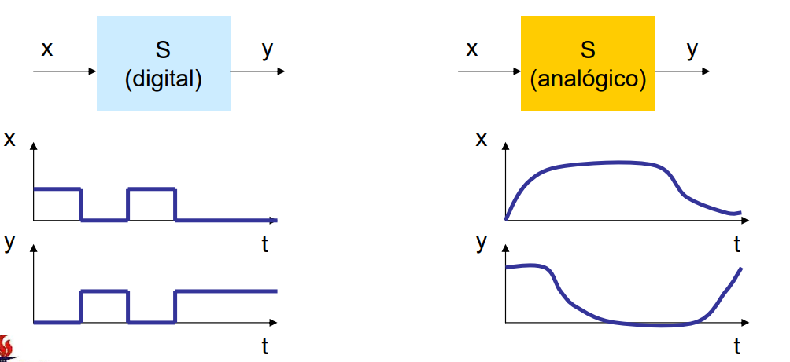

# SISTEMAS DIGITAIS

---

## O que é um sistema digital?

- Um sistema digital é um sistema no qual os sinais têm um número finito de valores discretos, se contrapondo a sistemas analógicos nos quais os sinais têm valores pertencentes a um conjunto contínuo (infinito)

---

## Conversores analógicos-digitais (ADC)

- O conversor analógico-digital é um dispositivo eletrônico capaz de gerar uma representação digital a partir de uma grandeza analógica, normalmente um sinal representado por um nível de tensão ou intensidade de corrente elétrica (por exemplo um senóide); essa representação é feita através de microprocessadores, sensores e transístores e é traduzida em binário (base do sistema de codificação ASCII) para o computador
- Quando os conversores fazem essas representações, parte das informações são perdidas, como mostrada na imagem:
    
    
    
    - É perceptível que durante a conversão muitas informações são perdidas, mas de acordo  com a quantidade de bits (resolução) do conversor menos informação é perdida (é impossível recuperar 100% da informação); com mais bitss, menos quadrada fica o gráfico da direita
        
        
        
        - Gráfico mostrando a quantidade de informação perdida
- Atributos
    - Resolução
        - Determina a precisão (qualidade) da conversão e é medida em bits (quanto mais bits, maior precisão)
    - Precisão
        - Mostra o quão fiel o próximo o valor do sinal digital está do valor do sinal analógico original, dependendo da precisão podem ocorrer sinais indesejados durante a conversão (ruídos)
    - Taxa de amostragem
        - Frequência em que o sinal analógico é amostrado e convertido em valores digitais, medida em SPS (Samples por segundo)
    - Faixa dinâmica
        - Amplitude máxima (tamanho dos sinais analógicos) em que o conversor consegue suportar (ler) e representar com precisão
    - Tempo de conversão
        - Tempo necessário que o conversor leva para realizar a conversão completa
    - Conectividade
        - É a forma em como um conversor se conecta à outros sistemas e dispositivos
- Tipos
    - ADC ∆∑ (delta-sigma)
        - Utilizado principalmente para aplicações dinâmicas que requerem a melhor resolução possível
            - São comumente encontrados em áudio, som, vibração dentre outras aplicações de aquisição de dados; pois preserva a fidelidade sonora utilizando alta resolução e alta relação sinal-ruído em detrimento da taxa de amostragem e consumo de energia
            - Possui um design complexo e poderoso, tornando-o ideal para aplicações dinâmicas que requerem maior resolução em altas faixas dinâmicas
        - Tipicamente utiliza-se uma resolução de 24-bits
        - Por causa da sua ótima resolução, este tipo de conversor também possui uma ótima precisão
            - Isso faz com que o sinal captado analogicamente seja convertido digitalmente com pouquíssima perda de informações; além de reduzir o ruído
        - Possui uma alta faixa dinâmica
            - Faz com que o conversor tenha capacidade de converter sinais com amplitudes muito diferentes; desde od sinais fracos até os sinais fortes
        - Funcionamento
            - Os ADCs Delta-sigma funcionam sobre-amostrando os sinais muito mais altos do que a taxa de amostragem selecionada
            - O DSP, então, cria um fluxo de dados de alta resolução a partir desses dados sobre amostrados na taxa que o usuário selecionou
                - Tecnologia DSP
                    - É uma tecnologia que lida com a manipulação e conversão de sinais que estão no formato digital, como áudio, vídeo, e sinais de dados
                    - Funções
                        - Compressão
                            - Reduz o tamanho dos arquivos de áudio e vídeo, permitindo armazenamento e transmissão mais eficientes.
                        - Equalização
                            - Ajusta a frequência do som para melhorar a qualidade de áudio de acordo com a preferência do usuário ou ambiente
                        - Redução de ruído
                            - Elimina ruídos indesejados presentes em gravações de áudio ou sinais de comunicação
                        - Cancelamento de ruído
                            - Neutraliza sons indesejados através da geração de ondas sonoras "espelhadas" que se anulam ao se encontrarem com o ruído original
                        - Melhora de áudio
                            - Aplicação de efeitos sonoros, como reverberação e chorus, para enriquecer a experiência sonora
                        - Codificação e decodificação de sinais
                            - Processamento utilizado em telefonia celular, transmissão de rádio e TV digital
                        - Reconhecimento de voz
                            - Extrai informações a partir de sinais de voz, como em assistentes virtuais e sistemas de reconhecimento de voz
            - Essa sobreamostragem pode ser centenas de vezes maior do que a taxa de amostragem selecionada
            - Essa abordagem cria um fluxo de dados de resolução muito alta (24 bits é comum) e tem a vantagem de permitir a filtragem anti-aliasing (AAF) em vários estágios, tornando virtualmente impossível digitalizar sinais falsos
                - AAF
                    - Aliasing ocorre quando a frequência de amostragem é insuficiente para capturar fielmente a frequência do sinal original
                    - Para evitar o aliasing, a filtragem anti-aliasing é aplicada antes da conversão analógico-digital (ADC)
                        - Esse filtro atenua as frequências do sinal analógico que estão acima de um limite determinado pela frequência de amostragem
                            - Ao remover essas frequências altas, o filtro garante que o sinal amostrado represente fielmente o sinal original dentro da limitação da taxa de amostragem
            - No entanto, ele impõe uma espécie de limite de velocidade, portanto, os ADCs delta-sigma não são tão rápidos quanto os ADCs SA

---

## Circuitos digitais

- São circuitos que possuem valores de entrada e saída em bits pois são baseados na lógica booleana e nas suas funções (circuitos lógicos)
    - Lógica booleana
        - Função lógica booleana
            - Função que tem uma ou mais variáveis de entrada e produz um resultado que depende somente dos valores dessas variáveis
                
                
                
                
                
            - Como otimizar
                - Simplificação (eliminação de termos redudantes)
                - Implementação de hardware
                    - Usar portas lógicas eficientes e operações bit a bit, utilizar tabela verdade
                - Transformação de expressão
                    - Utilizar nand como not + and etc
                    - Teoremas de De Morgan
                        - Leis fundamentais da álgebra booleana que estabelecem relações entre negação, conjunção e disjunção
                        - Ferramentas essenciais para simplificar expressões lógicas, realizar análises de circuitos digitais e construir sistemas lógicos complexos
                        - 1ª lei
                            - ¬(A ∧ B) ≡ (¬A) ∨ (¬B)
                        - 2ª lei
                            - ¬(A ∨ B) ≡ (¬A) ∧ (¬B)
        - Álgebra de Boole
            - Álgebra que é implementada para realizar os circuitos digitais
            - OBS: •  e * são a mesma coisa que ‘and’, + é a mesma coisa que ‘or’, X̅ é a mesma coisa que ‘not X’
            - Regras
                
                
                
            - Teoremas
                
                
                
                
                
- Portas lógicas
    - Not
        
        
        
        - Tabela verdade
            
            
            
    - And
        
        
        
        - Tabela verdade
            
            
            
    - Nand
        
        
        
        - Tabela verdade
            
            
            
    - Or
        
        
        
        - Tabela verdade
            
            
            
    - Nor
        
        
        
        - Tabela verdade
            
            
            
    - Xor
        
        
        
        - Tabela verdade
            
            
            
    - Xnor
        
        
        
        - Tabela verdade
            
            
            
- Mintermos e maxtermos
    - Mintermos
        - Linhas da tabela verdade cujo resultado é 1
        - Faz-se a soma de todos os mintermos dessas linhas
        - Exemplo
            
            
            
            
            
    - Maxtermos
        - Linhas da tabela verdade cujo resultado é 0
        - Faz-se o produto de todos os mintermos dessas linhas
        - Exemplo
            
            
            
            
            
- Mapa de Karnaugh
    - Ferramenta gráfica de simplicação de expressões booleanas a partir de tabelas verdades
    - Como montar um mapa de karnaugh
        - Exemplo de tabela verdade
            
            
            
            - Mintermos
                
                
                
        - 1º passo
            - Identificar as combinações que resultam em 1 na tabela verdade
        - 2º passo
            - Colocar no mapa de kanaugh todas as combições
            - Mapa de Karnaugh
                
                
                
                - A primeiro coluna simboliza o valor de P1, e a primeira coluna simboliza os valores de P2 e P3 nessa ordem
        - 3º passo
            - Formar grupos de potências de dois (1,2,4,8,…) que contém as combinações de quando é 1
                - Para formar os grupos, é preciso considerar as células (os quadrados) adjacentes (esquerda, direita, encima ou embaixo) e fazer os grupos com o maior número de células possível
            - Grupos:
                
                
                
        - 4º passo
            - Identificar dentro de cada um dos grupos células que apresentam sua forma normal e sua forma complementar
                - Quando isso acontecer, devemos exluir essa variável do termo produto final
        - 5º passo
            - Fazer o termo produto final
            - No exemplo, o produto final ficou da seguinte forma:
                - Célula 1
                    
                    
                    
                    - f(P1, P2, P3) = P1 (o P2 e o P3 se cancelam pois assumem valores complementares)
                - Célula 2
                    
                    
                    
                    - f(P1, P2, P3) = ∅ (o P1, P2 e o P3 se cancelam pois assumem valores complementares)
                - Célula 3
                    
                    
                    
                    - f(P1, P2, P3) = P2 (o P1 e o P3 se cancelam pois assumem valores complementares)
            - Produto final: f(P1, P2, P3) = P1 + P2
    - Exemplos
        - Exemplo 1
            
            
            
            - Termo produto final: f(x,y,z) = z’.x’ + x’.y’ + z’.y’
        - Exemplo 2
            
            
            
            - Termo produto final: f(x,y,z) = z’.y’ + x’
        - Exemplo 3
            
            
            
            - Termo produto final: f(a,b,c,d) = a.c’.d + b’.c
        - Exemplo 4
            
            
            
            - Termo produto final: f(a,b,c,d) = c.d + a.d + b
    - Terminologia
        
        
        
        
        
        - Exemplo
            
            
            
- Exemplo
    - Projetar os circuitos digitais para as funções abaixo utilizando o mapa de Karnaugh para otimizar os circuitos
    - Função 1 (REVER, TALVEZ TENHA ERRADO NA TABELA VERDADE)
        
        
        
        - Tabela verdade
            
            
            
        - Mapa de Karnaugh
            
            
            
            
            
        - Produto final: f(a,b,c,d) = a’.c + a’.b + c’.d + a.c’ (o a’.b e c’.d são primos não-essenciais, logo podemos escolher apenas um deles para a solução mínima)
        - Circuito
    - Função 2
        
        
        
        - Tabela verdade
            
            
            
        - Mapa de Karnaugh
            
            
            
            
            
        - Produto final: f(a,b,c,d) = a’.c + a.c’ + a.b.c.d
        - Circuito
            
            
            
- Clock
    - É um tipo de sinal digital pulsante quadrada que fornece a referência de tempo sincronizada para a realização do circuito, ou seja, serve para que o circuito fique sincronizado (são pulsos de sincronia)
        - Como é um sinal quadrado, possui um fronte de descida e um fronte de subida que podem ser usados para acionar eventos dentro do circuito
    - Em circuitos sequenciais, o clock serve para avisar quando o estado do circuito pode mudar; garantindo a mudança de forma ordenada e controlada
    - O sinal de clock possui uma frequência em Hz (5Hz = 5 pulsos por segundo), quanto mais frequência mais rápido a instrução vai ser executada
- Flip flop
    - Funcionam como elementos de memória e armazenam um único bit, podendo então ter estados de 0 ou 1, e guardam esse estado até serem instruídos a mudar (geralmente por um sinal de clock, acontecendo ou por front de subida ou por front de descida)
        - Logo, são usados para armazenar e transferir dados
    - Possuem uma ou duas entradas e possuem necessariamente duas saídas, uma Q e outra Q̅ que possuem estados opostos (quando Q é 0 Q̅ é 1 e vice-versa)
    - Tipos
        - SR (Set-Reset)
            
            
            
            
            
            - Possui duas entradas, uma set (S) e outra reset (R)
            - Tabela verdade
                
                
                
                - S = 0 e R = 0 mantém o estado anterior/inicial (se antes do sinal entrar no flip-flop Q era 0, então pernamece 0)
        - JK
            
            
            
            
            
            - Basicamente um flip-flop SR aprimorado, com J sendo set e K sendo reset
            - Tabela verdade
                
                
                
                - Quando J = 0 e K = 0, Q e Q̅ vão manter o estado anterior
                - CLK é o sinal de clock (nesse caso é sinal de descida)
                - Toggle seria o valor invertido do estado anterior, se antes Q era 0 depois será 1
            - Exemplo
                - Fazendo um contador decimal
                
                
                
                
                
        - D (Data)
            
            
            
            - Armazena o dado que colocou no pino D em Q
            - Tabela verdade
                
                
                
        - T (Toggle)
            
            
            
            - É uma forma resumida do JK, juntando os dois inputs J e K em um único input T
            - Tabela verdade
                
                
                
                - Quando J = 0 e K = 0, Q e Q̅ vão manter o estado anterior
                - CLK é o sinal de clock (nesse caso é sinal de descida)
                - Toggle seria o valor invertido do estado anterior, se antes Q era 0 depois será 1
- Tipos
    - Circuito combinacional
        - Tipo de circuito digital em que as saídas são determinadas exclusivamente pelas combinações das entradas presentes no momento, sem depender de qualquer estado anterior ou armazenamento de informações
        - Esses circuitos são baseados em operações lógicas que ocorrem instantaneamente em resposta às entradas, e eles não têm capacidade de memória
        - Exemplo
            
            
            
            - Tabela verdade
                
                
                
                
                
                
                
    - Circuito sequencial
        - Tipo de circuito digital em que as saídas são determinadas tanto pelos valoresdas entradas presentes no momento quanto pelos valores de qualquer estado anterior
            - Ou seja, o output depende do input atual e do input do estado anterior
        - Esses circuitos armazenam as informações dos estados passados em flip-flops
        - Possuem clocks
        - Síncronos
            - O clock controla diretamente as mudanças de estado nos flip-flops
        - Assíncronos
            - As mudanças de estado nos flip-flops não são controladas por um clock central, mas por sinais de controle específicos
    - Diferenças
        - O circuito sequencial possui um armazenamento de informações, armazenando as informações do estado anterior
        - O circuito combinacional não possui clock nem flip-flops

---

## Máquinas de Estados Finitos (FSM)

- É uma representação matemática de um sistema dependente de tempo e que possui estados e transições
    - Cada estado representa o sistema em um determinado momento no tempo e não é possível uma máquina de estados estar em dois estados ao mesmo tempo
    - Quando uma máquina está em um estado, ela aguarda que as condições para uma transição sejam atingidas e, assim que forem, muda para o estado indicado por esta transição, repetindo o ciclo
    - Cada máquina possui um estado inicial, onde a máquina começa, e pode ter um ou mais estados finais (ou de aceitação), indicando que a máquina terminou a tarefa computacional
- Tecnicamente, a máquina de estados finita que estudamos em sistemas digitais é um transdutor de estados finitos
    - A diferença primária entre uma máquina de estados e o transdutor é que este último não tem um estado de aceitação
- Pode ser definida como uma tupla (M, S, I, O, δ, λ)
    - M = O nome da máquina
    - S = O conjunto finitos de estados
    - I = O conjunto finito de símbolos de entrada
    - O = O conjunto finito de símbolos de saída
    - δ = A função de transição, um mapeamento de S em função de I (S x I) em S
    - λ = A função de saída, um mapeamento de S em função de O (S x O) em S
- Passo a passo de como montar uma FSM
    - Diagrama de estados
        - Forma de representação através de desenhos usados para descrever a operação de um circuito, mostrando todos os estados individuais da máquina e as possíveis sequências de mudança do circuito de um estado para o outro
        - Exemplo
            
            
            
            - No exemplo, X é o valor da entrada e o valor da saída R é onde a transição ocorre (R = 0 = não ocorre; R = 1 = ocorre a transição)
            - Exemplo de contador
                
                
                
    - Fazer a tabela verdade
    - Fazer o mapa de Karnaugh
    - Fazer o circuito
- Tipos de FSM
    - Máquina de estados de Moore
        - As saídas dependem apenas do estado atual
        - As saídas apenas são escritas quando os estados variam (transições de estados não síncronos)
        
        
        
        - Usada como controlador de semáforos, reconhecimento de padrões e detecção/correção de erros
    - Máquina de estados de Mealy
        - As saídas dependem das entradas e dos estados
        - Quando a entrada muda, as saídas são atualizadas imediatamente, sem esperar por clock
        - Podem modelar comportamentos mais complexos que dependem da interação entre o estado interno e as entradas externas
        
        
        

---

- Processador
    
    A ALU é responsável por realizar as operações aritméticas (ADD, SUB) e lógicas (AND, ORI), SLT (set less than), detecta o zero (caso seja uma operação de branch por exemplo, definida por default) a ALU pega o código binário ALUControl de ALUControl unit e baseado no valor, faz as modificações
    
    A unidade de controle da ALU é responsável por captar os binários de ALUOp (opcode da ALU) e functs das instruções e com base neles modificar o sinal de ALUControl, que a depender do valor vai realizar uma operação que está setada na ALU. Primeiro checamos qual o sinal de aluop e com base neles vemos qual o funct a fim de realizar as instruções.
    
    aluop 00: operações de load/store; aluop 01: operações de branch; aluop 10: operações r-type, e nesse caso vai ter um case funct que vai definir o alucontrol para cada operação R-type
    
    a unidade de controle principal é responsável por pegar o opcode de cada instrução e com base nele vai definir os sinais; ela coordena e controla todas as operações dentro do processador de forma que: garante que cada instrução seja lida da memória, interpretada e executada corretamente gerando sinais de controle necessários para a operação de outras partes do processador que determinam as operações que devem ser realizadas e quando devem ser realizadas
    
    ela faz isso decodificando o opcode da instrução fazendo um case statement e a cada case os sinais são definidos para que os outros módulos trabalhem com base neles
    
    o data memory é responsável por armazenar dados necessários durante a execução de instruções, fornecer dados que estão armazenados para executar funções que dependem desses valores armazenados, escrever novos dados
    
    em conjunto com o processador, a unidade de controle gera sinais de escrita na memória que, quando ativados, fazem com que a memória seja escrita neste módulo, já a unidade de controle da ALU pode usar os dados armazenados na memoria de dados para fazer as operações
    
    na unidade de controle, as instruções lw e sw são instruções que mexem diretamente nessa memoria, sw faz com que o sinal de escrita na memoria seja 1; fazendo com que a memoria seja escrita no modulo de data memory (quando isso acontece nós printamos) e o lw emite sinais para que os valores sejam lidos da memoria
    
    a instruction memory armazena todas as instruções do programa que o processador precisa executar de forma binária e são lidas de forma sequencial; durante a execução, o processador lê as instruções da instruction memory e cada instrução é lida de um endereço específico determinado pelo program counter; essas instruções são fornecidas à unidade de controle que decodifica elas e gera os sinais baseados em cada instrução
    
    o program counter interage diretamente com o instruction memory, apontado para o endereço da próxima instrução a ser buscada, após a busca de uma instrução o program counter é atualizado para apontar para a próxima instrução
    
    o program counter possui a função de armazenar o endereço da próxima instrução a ser buscada da instruction memory; após cada busca de instrução, o PC é incrementado em 4 para apontar para a próxima instrução na sequência.
    
    no caso de jump e beq, o PC é atualizado com o novo endereço de destino em vez de ser incrementado sequencialmente permitindo os loops e funções do código em assembly.
    
    a unidade de controle utiliza o valor armazenado no PC para buscar a instrução correta da memoria de instruções
    
    o register file possui a função de armazenar rapidamente e temporariamente dados que estão sendo usados ativamente por instruções durante a execução do programa, o módulo permite que o processador leia dados de registradores e escreva valores novos neles; esse módulo declara os 32 registradores (já que são 32 bits)
    
    de acordo com as instruções, processadas pela unidade de controle e unidade de controle de ALU, é possível que dois registradores sejam lidos ao mesmo tempo exemplo: add le os valores dos dois, soma eles e armazena em um registrador de destino
    
    esse modulo melhora a eficiência pois esses valores são de rápido acesso, ao invés de acessar diretamente na memória;
    
    o sign extend possui a função de aumentar o número de bits de uma constante sem alterar o seu valor numérico, preservando o sinal do seu numero
    exemplo: as funções do mips que utilizam constantes imediatas (addi, subi, lw e sw) frequentemente trabalham com valores de 16 bits, mas o processador é de 32 bits; logo, o sign extend expande esses valores para 32 bits além de garantir que o valor seja preservado fazendo com que esses valores sejam mais fáceis de se trabalhar
    
    o sign extend pega as instruções que utilizam constantes imediatas e as extende, quando uma instrução é buscada na memoria usando o endereço do PC ela é decodificada pela unidade de controle e a se essa intrução utilizar uma constante imediata o sign extend vai extender esse valor de 16 bits para 32 bits
    
    o MUX possui a função de selecionar uma entre várias entradas de dados para ser a saída com base em sinais de controle
    o número de entradas e o tamanho de cada depende do parâmetro WIDTH, no mips o MUX é usado para redirecionar dados entre diferentes componentes do processador
    existe um MUX da unidade de controle da ALU exemplo: selecionar entre valores de um registrador (no caso de add) e valores imediatos (addi)
    no PC, o MUX pode escolher entre o próximo endereço sequencial ou um novo endereço baseado em um jump, jr ou beq
    existe um MUX par ao data memory, no caso quando os dados precisam ser lidos da memoria o MUX pode selecionar qual endereço (exemplo: lw) e no caso em que os resultados após uma operação precisam ser escritos de volta nos registradores o MUX pode selecionar entre os resultados da ALU, dados lidos na memoria ou valores imediatos
    

[Assembly](sistemas-digitais/assembly.md)