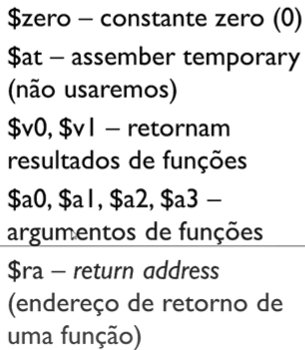

# Assembly

!!! note
    Esta página cobre o assembly MIPS, que é o dialeto usado em maior detalhe nas anotações originais (por ser didaticamente mais simples e muito usado em disciplinas de arquitetura de computadores), além de uma nota breve sobre NASM e GAS, os dois dialetos de assembly x86 mais comuns.

## MIPS

MIPS é uma arquitetura RISC (*Reduced Instruction Set Computer*), caracterizada por um conjunto de instruções pequeno e regular, em que cada instrução é simples e, em geral, executa em um único ciclo de clock.

### Instruções

As instruções em MIPS aceitam, no máximo, até 3 operandos (registradores) — por exemplo, uma instrução de soma recebe dois registradores de origem e um registrador de destino.

### Registradores

O MIPS possui 32 registradores de 32 bits cada, e cada registrador é referenciado com o símbolo `$` antecedendo o seu nome (por exemplo, `$s0`, `$t1`, `$a0`).

| Registrador(es) | Função |
|---|---|
| `$zero` | constante zero (0) |
| `$at` | *assembler temporary* (não usaremos) |
| `$v0`, `$v1` | retornam resultados de funções |
| `$a0`, `$a1`, `$a2`, `$a3` | argumentos de funções |
| `$ra` | *return address* (endereço de retorno de uma função) |
| `$t1` a `$t9` | registradores temporários, que podem ser modificados por funções |
| `$s1` a `$s8` | similares aos `$t1` a `$t9`, mas salvam valores |
| `$k0` e `$k1` | registradores do kernel |
| `$gp` | registrador de valores globais |
| `$sp` | *stack pointer* (aponta pro início da stack e muda progressivamente) |
| `$fp` | *frame pointer* (aponta pro início da pilha e não muda até que a função seja executada) |

??? note "Imagens de referência (slides)"
    

    

    

    

### Instruções de movimentação de dados

**Load (`lw`)** — instrução de movimentação de dados **da memória para o registrador**; é uma operação de leitura da memória, usada para o tipo `.word`. Sintaxe: `lw $s0, myArray($zero)` coloca o conteúdo da primeira posição de `myArray` no registrador `$s0`.

??? note "Imagem de referência (slide)"
    

**Store (`sw`)** — instrução de movimentação de dados **do registrador para a memória**; é uma operação de escrita na memória. Sintaxe: `sw $s0, myArray($zero)` coloca o conteúdo do registrador `$s0` na primeira posição de `myArray`.

??? note "Imagem de referência (slide)"
    

**Move (`move`)** — instrução para passar o conteúdo de um registrador para outro registrador; a memória RAM não é envolvida nessa operação.

**`li`** — atribui um número imediato (literal) a um registrador. É usada, em particular, em conjunto com `syscall` para definir qual operação de I/O realizar, conforme o valor colocado em `$v0`:

| Comando | Significado |
|---|---|
| `li $v0, 1` | imprimir inteiro |
| `li $v0, 2` | imprimir float |
| `li $v0, 3` | imprimir double |
| `li $v0, 4` | imprimir string ou char |
| `li $v0, 5` | ler inteiro |
| `li $v0, 6` | ler float |
| `li $v0, 7` | ler double |
| `li $v0, 8` | ler string ou char |
| `li $v0, 10` | encerrar programa principal |

**Leitura de inteiros**: executa-se `li $v0, 5` e, ao dar `syscall`, o valor lido fica armazenado em `$v0` (geralmente copiado para um registrador temporário com `move`).

**Leitura de strings**: declara-se a string e seu tamanho em `.data` (usando `.space` para o número de bytes); em `.text`, executa-se `li $v0, 8`, `la $a0, <variavelRam>` e `la $a1, <numeroBytesLidos>`; ao dar `syscall`, o valor lido fica armazenado em `$a0`.

??? note "Imagens de referência (slides)"
    

    

    

    

    

Para armazenar valores do tipo `float` e `double`, usamos os registradores `$fX`. Números de ponto flutuante: `float` usa 32 bits (um único registrador do coprocessador 1); `double` usa 64 bits (dois registradores do coprocessador 1). É importante observar que os valores do tipo `double` devem ser armazenados nos registradores de índice **par** (já que um `double` ocupa 64 bits, o equivalente a dois registradores de ponto flutuante consecutivos: `$f0`–`$f31`).

??? note "Imagens de referência (slides)"
    

    

**`la`** — copia o **endereço** de um *label* (rótulo) na memória para o registrador dado; é usado para os tipos `.byte` ou `.asciiz`.

### Instruções aritméticas

| Instrução | Significado |
|---|---|
| `add` | Soma — usa dois registradores como operandos. |
| `addi` | Soma — usa um registrador e um valor inteiro imediato. |
| `sub` | Subtração. |
| `subi` | Subtração — usa um registrador e um valor inteiro imediato. |
| `mul` | Multiplicação. |
| `div` | Divisão inteira. |

!!! example "`div`"
    ```
    div $t0, $t1    #realiza a divisão inteira t0/t1
                    #a parte inteira vai para lo
                    #o resto vai para hi
    ```

    ??? note "Imagem de referência"
        

Após uma operação de `div`, o quociente é armazenado no registrador especial `lo`, e o resto no registrador especial `hi`:

- **`mflo`** — move o conteúdo do registrador `lo` (o quociente da divisão) para um registrador comum. Ex.: `mflo $s0` move o conteúdo de `lo` para `$s0`.

    ??? note "Imagem de referência"
        

- **`mfhi`** — move o conteúdo do registrador `hi` (o resto da divisão) para um registrador comum. Ex.: `mfhi $s1` move o conteúdo de `hi` para `$s1`.

    ??? note "Imagem de referência"
        

### Deslocamento de bits (shifts)

**`sll`** (*shift left logical*) — desloca os bits para a esquerda, o que equivale a multiplicar por potências de dois. Multiplicar números por **potências de 2** é trivial para o computador, bastando realizar a operação de *shift left* (mover os bits para a esquerda): mover os bits de um número binário uma casa para a esquerda multiplica por $2$; duas casas, por $4$; e, de forma geral, mover $n$ casas para a esquerda multiplica por $2^n$.

??? note "Imagem de referência"
    

Por exemplo, se fizermos `sll $s3, $s2 (= 10), 10`, estaremos multiplicando $10$ por $2^{10} = 1024$, resultando em $10240$.

**`srl`** (*shift right logical*) — desloca os bits para a direita, o que equivale a dividir por potências de dois (capturando apenas a parte inteira do resultado). Por exemplo, `srl $s0, $s4 (= 10240), 5` equivale a $10240 / 2^5 = 320$.

### Diretivas e estrutura de um programa

- **`.data`** — seção de especificação de variáveis; lida com os dados que residem na memória principal. Para criar uma variável do tipo string, usamos a diretiva `.asciiz` (que adiciona um terminador nulo); se for apenas um caractere, usamos `.ascii`.
- **`.text`** — seção que contém as instruções propriamente ditas do programa.
- **Impressão de saída** — a sequência típica é carregar o código da operação desejada em `$v0` e o valor a imprimir em `$a0`, seguido da instrução `syscall`, que executa a chamada de sistema (imprimindo o que está dentro do registrador `$a0`, no caso de uma impressão de inteiro).

### Condicionais

As condicionais em Assembly MIPS são montadas combinando as instruções de desvio condicional com rótulos (*labels*):

| Comando | Significado | Pronúncia |
|---|---|---|
| `beq $t1, $t2, label` | Se `$t1` for igual a `$t2`, execute a partir do rótulo `label` | branch if equal |
| `bne $t1, $t2, label` | Se `$t1` for diferente de `$t2`, execute a partir do rótulo `label` | branch if not equal |
| `blt $t1, $t2, label` | Se `$t1` for menor que `$t2`, execute a partir do rótulo `label` | branch if less than |
| `bgt $t1, $t2, label` | Se `$t1` for maior que `$t2`, execute a partir do rótulo `label` | branch if greater than |
| `ble $t1, $t2, label` | Se `$t1` for menor ou igual a `$t2`, execute a partir do rótulo `label` | branch if less or equal |
| `bge $t1, $t2, label` | Se `$t1` for maior ou igual a `$t2`, execute a partir do rótulo `label` | branch if greater or equal |

??? note "Imagem de referência"
    

!!! warning
    Em MIPS não existe uma instrução de `else`: a linguagem oferece apenas instruções de desvio condicional (`beq`, `bne`, `blt`, `bgt`, etc.), e toda estrutura condicional — incluindo um `if/else` — precisa ser construída manualmente a partir de desvios (*branches*) e rótulos (*labels*).

### Laços de repetição

Os laços de repetição em Assembly são combinações de ifs e jumps. Para implementar um loop, são necessários pelo menos dois rótulos: um para manter o fluxo dentro do loop, e outro para sair dele. Ex.:

```
while:
        #aqui vão os comandos que serão executados no loop
saida:
        #aqui vão os comandos depois que o loop terminar
```

??? note "Imagem de referência"
    

Da mesma forma que os condicionais, os laços de repetição (`for`, `while`) são implementados combinando rótulos com instruções de desvio condicional e incondicional (`j`), que saltam de volta para o início do laço ou para fora dele, conforme a condição de parada é avaliada.

### Funções

É uma boa prática colocar o rótulo (*label*) `main` na função principal:

```
.data
    #aqui especifico as variáveis que vão pra RAM
.text
    .main:
    #aqui eu implemento o meu código principal
    #o main é uma função implícita de todo programa
```

??? note "Imagem de referência"
    

- **`jal`** (*jump and link*) — usada para **chamar** a função: salta para o endereço da função e salva o endereço de retorno em `$ra`.
- **`jr`** (*jump register*) — usada para **retornar** a quem chamou a função. `jr $ra` volta para quem chamou a função.
- **`$ra`** — registrador específico que armazena o endereço de retorno de funções (é automaticamente preenchido por `jal`, e usado por `jr $ra` para voltar).

??? note "Imagem de referência"
    

**Funções — parâmetros e retorno.** Devemos usar os registradores adequados:

- `$a0` a `$a3` — argumentos de funções, ou seja, valores que passamos como parâmetros a qualquer função do programa.
- `$v0` e `$v1` — *return* de funções, ou seja, valores que retornamos.

??? note "Imagem de referência"
    

**Exemplo** — a função C abaixo:

```c
int example(int a, int b, int c, int d){
    int f;

    f = (a + b) - (c + d)
    return f;
}
```

equivale, em Assembly MIPS, a:

```
example:                   # Label
        add $t0, $a0, $a1  # Soma a + b
        add $t1, $a2, $a3  # Soma c + d
        sub $v0, $t0, $t1  # Subtrai e coloca o resultado no registrador de retorno
        jr $ra              # Retorna o controle para a função principal
```

??? note "Imagem de referência"
    

### Arrays (vetores)

Vetores em MIPS são tratados como blocos contíguos de memória, acessados por meio de um registrador que guarda o endereço base do vetor, somado a um deslocamento (*offset*) calculado a partir do índice e do tamanho de cada elemento (por exemplo, 4 bytes por elemento, no caso de inteiros do tipo `.word`). Um array é, portanto, um conjunto de elementos de mesmo tipo, armazenados em espaços contíguos da memória RAM (endereços consecutivos).

??? note "Imagem de referência"
    

Deve-se alocar o espaço do array previamente, já que esse espaço nunca será alterado ao longo do programa. Tamanhos de cada tipo em Assembly MIPS:

| Tipo | Tamanho |
|---|---|
| Word | 32 bits (4B) |
| Byte | 8 bits (1B) |
| Integer | 32 bits (4B) |
| Character | 4 bits (0,5B) |

Ex.: para criar um array de 100 inteiros, é preciso alocar 400B de memória RAM, pois cada inteiro ocupa 4B.

??? note "Imagem de referência"
    

A alocação ocorre na seção `.data`:

```
.data
    myArray:
        .align 2    #alinha palavra na posição correta
        .space 16   #array de 4 inteiros
```

Com isso, se `myArray` aponta para o endereço `1024`, os elementos ficam em `myArray(0)` (endereço 1024), `myArray(4)` (endereço 1025), `myArray(8)` (endereço 1026) e `myArray(12)` (endereço 1027) — ou seja, o *offset* entre colchetes é sempre em bytes, não em índice do elemento.

??? note "Imagem de referência"
    

Para acessar os elementos, usam-se as instruções `lw` (*load word*) — que lê um conteúdo da RAM e o coloca em um registrador da CPU — e `sw` (*store word*) — que escreve o conteúdo de um registrador da CPU na RAM.

??? note "Imagem de referência"
    

### Manipulação de arquivos de texto

Para manipular arquivos, é necessário abri-los no modo em que serão usados (leitura ou escrita). Roteiro:

- Abrir no modo leitura → Ler → Fechar
- Abrir no modo escrita → Escrever → Fechar

**Abrir um arquivo**

??? note "Imagem de referência"
    

!!! warning
    Em MIPS, não existe um modo de abertura que permita leitura e escrita simultâneas no mesmo arquivo — é necessário escolher um ou outro modo ao abrir.

**Ler um arquivo**

Passos necessários: (1) abrir no modo leitura, (2) informar o nome do arquivo (e diretório em que se encontra), (3) salvar o descritor do arquivo; (4) ler usando o descritor, (5) informar o nome do buffer que vai salvar o conteúdo, (6) informar o tamanho do buffer; e, por fim, (7) fechar o arquivo.

??? note "Imagens de referência"
    

    

Nessa sequência: `li $v0, 13` indica o modo de abertura de arquivo; `la $a0, file` precisa passar, em `$a0`, o endereço do nome do arquivo; e `li $a1, 0` é a *flag* do modo de abertura (0 para leitura, 1 para escrita):

```
li $v0, 13
la $a0, arqComDiretorio
li $a1, 0       #modo leitura
syscall
#descritor fica em $v0
```

??? note "Imagem de referência"
    

Em seguida, `li $v0, 14` indica que a operação será de leitura do arquivo; e, diferentemente do que se poderia esperar, o tamanho do buffer é passado com `li $a2, tamanhoBuffer` (carregando o valor imediato), e não com `la $a2, tamanhoBuffer` (que carregaria um endereço):

```
li $v0, 14
#o descritor deve estar em $a0 neste ponto
la $a1, conteudoDoArquivo   #string com o conteúdo
la $a2, tamanhoBuffer
syscall
```

??? note "Imagem de referência"
    

Por fim, para fechar o arquivo lido, usa-se o código `16` em `$v0`, com o descritor obrigatoriamente em `$a0`:

```
li $v0, 16
#descritor em $a0, obrigatoriamente
syscall
```

**Escrever em um arquivo**

Passos necessários: (1) abrir no modo escrita, (2) informar o nome do arquivo (e diretório em que se encontra), (3) salvar o descritor do arquivo; (4) escrever usando o descritor, (5) informar a string com o conteúdo, (6) informar o tamanho da string; e, por fim, (7) fechar o arquivo.

??? note "Imagem de referência"
    

Para abrir o arquivo no modo escrita, o procedimento é o mesmo do modo leitura, exceto pela *flag* passada em `$a1`, que passa a ser `1` (escrita) em vez de `0` (leitura):

```
li $v0, 13
la $a0, arqComDiretorio
li $a1, 1       #modo escrita
syscall
#descritor fica em $v0
```

??? note "Imagem de referência"
    

Para escrever no arquivo, usa-se o código `15` em `$v0`, informando a string com o conteúdo e o número de caracteres a serem escritos:

```
li $v0, 15
#o descritor deve estar em $a0 neste ponto
la $a1, conteudoDoArquivo   #string a ser escrita
la $a2, tamanhoString       #nro de caracteres da string a ser escrita
syscall
```

??? note "Imagem de referência"
    

Por fim, fecha-se o arquivo escrito da mesma forma que no modo leitura, com o código `16` em `$v0` e o descritor em `$a0`:

```
li $v0, 16
#descritor em $a0, obrigatoriamente
syscall
```

??? note "Imagem de referência"
    

## NASM e GAS

O material original apenas listava esses dois nomes, sem detalhá-los; a seguir, um resumo mínimo de propósito geral sobre cada um, para contextualizar sua diferença em relação ao MIPS visto acima:

- **NASM** (*Netwide Assembler*) — é um dos montadores (*assemblers*) mais populares para a arquitetura x86/x86-64, utilizando a sintaxe **Intel**, em que o destino da operação vem antes da origem (por exemplo, `mov eax, ebx` move o conteúdo de `ebx` para `eax`). É amplamente usado em projetos de sistemas operacionais, bootloaders e código de baixo nível que roda diretamente sobre hardware x86, justamente por gerar binários simples e por sua sintaxe ser considerada mais legível por muitos programadores.
- **GAS** (*GNU Assembler*) — é o montador padrão do projeto GNU (parte do *binutils*, usado por padrão pelo GCC), e tradicionalmente utiliza a sintaxe **AT&T**, em que a ordem dos operandos é invertida em relação à sintaxe Intel (o destino vem depois da origem — por exemplo, `movl %ebx, %eax` move o conteúdo de `ebx` para `eax`), além de usar prefixos como `%` para registradores e `$` para valores imediatos. É o montador mais comumente encontrado "por debaixo dos panos" em sistemas Linux, já que é o utilizado pelo GCC para gerar código objeto a partir de código assembly embutido (*inline assembly*) ou gerado pelo compilador.

Em ambos os casos, o princípio fundamental é o mesmo observado no MIPS: um pequeno conjunto de instruções que manipulam registradores e memória diretamente, sem as abstrações (variáveis nomeadas, tipos, estruturas de controle de alto nível) presentes em linguagens como C — a diferença está na arquitetura de hardware-alvo (x86/x86-64, ao invés de MIPS) e na sintaxe de escrita das instruções.
