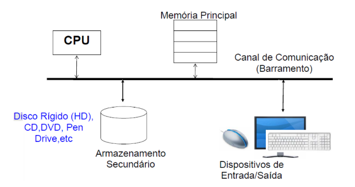

# ARQUITETURA DE COMPUTADORES E SISTEMAS OPERACIONAIS

---

## Introdução, Abstração e Tecnologia do Computador

- Computador: hardware + software
    - HW: parte física do computador
        - chips, monitores, teclado, etc.
    - SW: programas e dados
        - Sistemas operacionais, compiladores, editor de texto, etc.
- Classes de computadores
    - Desktop
        - Computador pessoal para desempenho genérico, bom desempenho e baixo custo
        - Flexibilidade, versatilidade e conectividade
    - Servidores
        - Executa aplicações mais complexas, usado em aplicações que atendem muitos usuários simultaneamente
        - Grande poder de armazenamento e processamento
        - Classe de supercomputadores
    - Embarcados
        - Estão em todo lugar: celular, carro, televisão, etc.
        - Sistemas de computação integrados em dispositivos maiores com forte integração com o hardware
        - Robustos, são utilizados em aplicações críticas
        - Otimizados para conseguir melhor desempenho em um hardware que deve ter custo e energia reduzidos
- Arquitetura x Organização
    - Arquitetura
        - Refere-se aos atributos do sistema visíveis ao programador que tem impacto direto na execução lógica de um programa
            - Conjunto de instruções (ISA), modos de endereçamento e estruturas de dados que o hardware suporta
            - Estilos de design para arquiteturas de ISA
                - RISC
                    - Reduced Instruction Set Computer
                    - Prioriza um conjunto reduzido e simplificado de instruções
                    - As instruções são geralmente do mesmo tamanho e executadas em um único ciclo de clock
                    - Dependem de hardware simples e compensam com otimizações de software
                    - Exemplo: MIPS
                - CISC
                    - Complex Instruction Set Computer
                    - Usa um conjunto de instruções complexo
                    - As instruções podem realizar operações elaboradas
                    - Dependem de hardware complexo para decodificar e executar as instruções
                    - Exemplo: Intel x86
            - Modos de endereçamento
                - Dizem respeito em como a CPU identifica o endereço dos dados necessários para uma instrução, é parte da arquitetura do conjunto de instruções (ISA)
                - Determina a lógica para localizar dados na memória ou registradores durante a execução de uma instrução
                - Modos
                    - Imediato
                        - O operando está diretamente na instrução
                        - Simples e rápido mas limitado pelo tamanho do campo de operando na instrução
                        - Uso típico onde o dado é conhecido no momento da codificação, como constantes
                        
                        ```nasm
                        addi $to, $zero, 10 ; adicionando 10 em $t0
                        ; o 10 é diretamento fornecido na instrução
                        ```
                        
                    - Direto
                        - O endereço efetivo é especificado diretamente na instrução
                        - Uso típico de acessar posições de memória específicas (em sistemas com memória mapeada diretamente
                        
                        ```nasm
                        lw $t0, 0x10010000 
                        ; carrega o valor na memória no endereço absoluto 
                        ; 0x10010000 em $t0
                        ```
                        
                    - Indireto
                        - O endereço efetivo é obtido a partir do conteúdo de um registrador ou local de memória que contém o endereço do operando
                        - Uso típico: acesso a matrizes ou linked lists
                        
                        ```nasm
                        mov eax, [ebx]
                        ; o conteúdo do registrador ebx é tratado como o endereço, 
                        ; e o valor armazenado nesse endereço é movido para eax
                        ```
                        
                    - Por registrador
                        - A instrução especifica diretamente o registrador que contém o dado
                        - Uso típico em operações aritméticas ou lógicas entre valores armazenados nos registradores
                        
                        ```nasm
                        add $t0, $t1, $t2 ; $t0 = $t1 + $t2
                        ; especifica os registradores $t1 e $t2
                        ```
                        
                    - Base + deslocamento
                        - O endereço efetivo do dado é calculado somando um offset a um registrador base
                        - Uso típico para acessar arrays ou elementos na memória
                        
                        ```nasm
                        lw $t0 , 4($t1) 
                        ; carrega a memória a partir do endereço $t1 + 4
                        ```
                        
                    - Indexado
                        - O endereço do operando é calculado somando o valor de um registrador de índice a um deslocamento constante
                        - Uso típico: acesso a elementos em arrays e matrizes, navegação em estruturas de dados
                        
                        ```nasm
                        mov eax, [ebx + esi*4]  
                        ; Acessa o endereço `ebx` somado ao índice `esi` 
                        ; multiplicado por 4 
                        ; (tamanho de um elemento, no caso de um array de inteiros)
                        ```
                        
                    - Relativo
                        - O endereço é calculado com base no valor atual do program counter
                        - Usado principalmente para branches (desvios condicionais beq, bne, etc.)
                        - Uso típico de fazer desvios em relação à posição atual do programa
                        
                        ```nasm
                        beq $t0, $t1, label
                        ; se $t0 == $t1, desvia para "label"
                        ```
                        
                    - Por pilha (stack)
                        - Os dados são manipulados diretamente na pilha
                        - Uso típico: gerenciamento de variáveis locais
                        
                        ```nasm
                        push eax  ; Armazena o valor de `eax` no topo da pilha
                        pop ebx   
                        ; Recupera o valor do topo da pilha para `ebx`
                        ; o valor é retirado da pilha
                        ```
                        
                    - Implícito
                        - Os operandos da instrução estão implícitos e não são especificados diretamente
                        - Uso típico: operações aritméticas e de controle em arquiteturas complexas
                        
                        ```nasm
                        mul ebx  
                        ; Multiplica o valor em `ebx` pelo valor em `eax`
                        ; o resultado é armazenado implicitamente em `eax`
                        ```
                        
                        - Pseudo-direto
                            - Caso especial de endereçamento implícito onde parte do endereço é fornecida diretamente e outra parte é derivada do program counter
                            
                            ```nasm
                            j 0x00400000
                            ; salta para o endereço pseudo-direto 
                            ; especificado
                            ```
                            
    - Organização
        - Refere-se à implementação física e como os componentes do hardware estão estruturados e conectados para cumprir a arquitetura
            - Estrutura interna (como hardware é fisicamente organizado), detalhes físicos (circuitos, pipeline, cache, ALU, etc.), eficiência prática
    - Uma arquitetura pode sobreviver por anos, enquanto a organização muda com a evolução da tecnologia
- Modelo de um computador
    
    
    
    - CPU
        - Unidade central do processamento
        - É o cérebro do computador
        - Implementado em um chip (microprocessador)
        - Faz continuamente 3 operações
            
            
            
        - Possui 3 unidades principais
            - Unidade de Controle (CU):
                - Coordenar e gerenciar a execução das instruções
                - Interpreta as instruções do programa e envia sinais de controle para outras partes da CPU e dispositivos do sistema
                - Decodificar as instruções, controlar o fluxo de dados entre registradores, ALU e memória, coordenar a execução do programa
            - Unidade lógica e aritmética (ALU)
                - Realiza operações aritméticas e lógicas
                - Executar cálculos matemáticos, realizar comparações lógicas
            - Registradores
                - Pequenas áreas de memória de alta velocidade usadas para armazenar dados temporários e intermediários durante a execução de programas
                - Armazenar dados temporários (resultados de cálculos da ALU, etc.), armazenar endereços de memória ou instruções em processo de execução, integração com o program counter ao qual o registrador mantém o endereço da próxima instrução a ser executada (registradores de propósito geral servem para armazenar operandos de instruções)
            
            
            
        - Busca programas e dados residentes na memória e armazena dados na memória
        - Cache
            - Tipo de memória de alta velocidade usada para armazenar temporariamente dados e instruções que o processador acessa com frequência e com a função de reduzir o tempo necessário para acessar dados da memória principal
            - Funciona cmo uma camada intermediária entre o processador e a memória principal, armazenando dados acessados frequentemente ou recentemente
            - Quando a CPU precisa de um dado primeiro busca na cache (cache hit) depois busca na memória principal (cache miss)
            - Níveis
                - L1
                    - Localizada dentro do núcleo da CPU, muito rápida mas de capacidade muito limitada (geralmente 16kb - 128kb)
                    - Dividida em cache de dados e cache de instruções
                - L2
                    - Dentro ou próxima do núcleo da CPU
                    - Maior e mais lenta que a L1 (geralmente entre 256kb e alguns megabytes)
                    - Armazena dados com menor frequência que os dados da L1
                - L3
                    - Compartilhada entre todos os núcleos da CPU
                    - Maior e mais lenta que a L2 (geralmente vários megabytes)
                    - Serve como uma camada de suporte para os cache L1 e L2
        - Processadores multicore são aqueles em que há mais de um núcleo (CPU)
    - Memória principal (RAM)
        - Armazena os programas e dados que estão sendo usados pela CPU
        - Mais rápida que memórias secundárias e mais volátil, porém mais caro
        - SRAM x DRAM
            - Tipos de memória volátil (RAM), ou seja, perdem dados quando não há energia
            - SRAM
                - Static Random-Access Memory
                - Cada bit de dados é armazenado em um flip-flop de transistores
                - Não precisa ser atualizado pois mantém os dados enquanto houver energia
                - Extremamente rápido, mais caro, consumo de energia baixo durante a operação
                - Usado em memória cache (L1, L2, L3) de processadores e registros internos de alta performance
            - DRAM
                - Dynamic Random-Access Memory
                - Cada bit de dados é armazenado em um capacitor e controlado por um transistor
                - Precisa ser constantemente atualizado porque os capacitores poerdem carga com o tempo
                - Mais lento, consome mais energia e mais barato
                - Usado na memória principal (RAM) de computadores e dispositivos móveis e buffer em pacas de vídeos e sistemas embarcados
        - Dividida em Segmentos
            - Código
                - Área da RAM onde estão armazenadas as instruções executáveis do programa
                - Contém o código de máquina gerado pelo compilador, que será executado pela CPU
                - Geralmente é somente leitura e inclui instruções de funções e métodos do programa
                - Uso comum em instruções como if, while e chamadas de funções
            - Pilha
                - Área de memória usada para armazenar dados temporários e estruturas locais
                    - Gerenciada automaticamente pelo sistema
                - Trabalha no estilo LIFO, armazena variáveis locais, endereços de retorno de funções e parâmetros de funções, cresce e diminui conforme as funções são chamadas e retornam
                - Uso comum em declarações ao qual a variável é armazenada na pilha e em funções recursivas (uso extensivo da pilha)
                - Cresce para baixo
                - Possui um registrador especial, o stack pointer, que aponta para o endereço de memória do topo da pilha
            - Heap
                - Área da memória usada para alocar dados dinâmicos durante a execução do programa
                    - O programador controla explicitamente a alocação e liberação
                - Gerenciada por chamadas de malloc, free, new , delete e etc.
                - O tamanho pode variar mas o uso descontrolado pode levar a memory leak
                - Cresce para cima
                - Uso comum na criação de estruturas como listas, árvores e etc.
            - Dados (Data Segment)
                - Dados Estáticos
                    - Contém variáveis globais e estáticas declaradas no programa
                    - As variáveis tem um tempo de vida igual ao da execução do programa
                - Dados Iniciais e Não Iniciais
                    - BSS (Block Started by Symbol), armazena variáveis globais e estáticas não inicializadas
                    - Data Segment: armazena variáveis globais e estáticas inicializadas
    - Armazenamento secundário
        - Tipos de memória para armazenamento de longa duração de dados/programas
        - SSD x HD
            - Dispositivos de armazenamento
            - HD
                - Hard Disk Drive
                - Utiliza tecnologia magnética para gravar e acessar dados
                - Há um braço mecânico com uma cabeça de leitura/gravação e discos girando em alta velocidade e o braço de move fisicamente para localizar os dados
                - Geralmente possuem alta capacidade, são baratos mas possuem lento acesso aos dados
            - SSD
                - Solid State Drive
                - Utiliza memória flash para armazenar dados
                - Não possui partes móveis, usa chips de memória NAND para armazenar dados
                - Dados acessados eletronicamente, resultando maior velocidade e confiabilidade
                - Geralmente são caros, capacidade inferior ao HD devido ao preço e mais rápidos
            - SATA x PATA
                - Padrões de interface usados para conectar dispositivos de armazenamento como HD’s, SSD’s à placa-mãe
                - PATA
                    - Parallel Advanced Technology Attachment
                    - Utiliza transmissão paralela de dados, vários bits transferidos simultaneamente em diferentes fios
                    - Comumente usado em computadores antigos
                - SATA
                    - Serial Advanced Technology Attachment
                    - Utiliza transmissão serial, enviando dados bit a bit por um único canal
                    - Substituto do PATA, velocidade de transferência muito superior ao PATA
    - Dispositivos E/S
        - Mouse, teclado, monitor de vídeo, etc.
    - Redes
        - Comunicação e compartilhamento de recursos
        - LAN (Local Area Network): ethernet, dentro de um prédio/empresa
        - WAN (Wire Area Network): internet
        - Wireless Network: Wifi, bluetooth
    - Exemplos
        - 1
            
            
            
            - A memória principal (RAM) possui um custo por GB médio, velocidade de acesso alta (dezenas a centenas de ns) e capacidade de armazenamento média (alguns GB)
            - A memória secundária possui um custo por GB baixo, velocidade de acesso baixa (alguns ms) e capacidade de armazenamento alta (dezenas ou mais de GB e TB)
            - A memória cache possui um custo por GB alto, velocidade de acesso altíssima (alguns ns) e capacidade de armazenamento baixíssima (KB a alguns MB)
        - 2
            
            
            
            - Unidade de Controle (CU): controla o fluxo de dados dentro da CPU e entre a CPU e outros componentes, interpretando e decodificando as instruções
            - Unidade lógica e aritmética: serve para realizar as operações lógicas e aritméticas
            - Registradores: servem para guardar informações e dados temporários durante as informações
        - 3
            
            
            
            - Desktop: computador de uso pessoal, alto custo-benefício
            - Servidores: possuem alta capacidade de armazenamento e processamento
            - Embarcados: computadores especializados integrados a outros dispositivos
- Desempenho
    - Tempo de resposta: tempo necessário para completar uma tarefa
    - Throughput: total de trabalho realizado por unidade de tempo
    - Em geral necessitam-se de métricas e conjuntos de aplicações diferentes para avaliar comparativamente
    - Substituir o processador por um mais rápido, mais tarefas são completadas por unidade de tempo (melhora o throughput)
    - Adicionar mais processadores
        - Tempo de execução de tarefa não altera, mais tarefas são executadas simultaneamente (melhorando throughput), caso a demanda já estivesse muito alta o tempo de resposta melhoraria
    - Tempo de resposta
        - Performance
            
            
            
            - Quanto menor o tempo de resposta, melhor o desempenho
            
            
            
        - Desempenho e tempo de resposta relativo
            - Relacionando desempenho de diferentes computadores quantitativamente
                
                
                
                
                
            - Exemplo
                
                
                
                - Queremos saber quantas vezes A é mais rápido que B, logo:
                    
                    $$
                    \frac{\text{Performance}_A}{\text{Performance}_B}
                    $$
                    
                    - Que é a mesma coisa que:
                        
                        $$
                        \frac{\text{Execution time}_B}{\text{Execution time}_A}
                        $$
                        
                    - Como o tempo de execução de B é 15s e o tempo de execução de A é 10s, então o resultado é 15/10 = 1.5
                - Logo, A é 1.5 vezes mais rápido que B
        - Exemplos
            - 1
                
                
                
                - Para o programa 1, o computador 2 é mais rápido
                    - performance_m2/performance_m1 = time_m1/time_m2 = 2/1.5 = 1.33; logo, o computado M2 é 1.33 vezes mais rápido que o M1
                - Para o programa 2, o computador 1 é mais rápido
                    - performance_m1/performance_m2 = time_m2/time_m1 = 105 = 2; logo, o computado M1 é 2 vezes mais rápido que o M2
                - De forma geral, o computador 1 é mais rápido
                    - performance_m1/performance_m2 = time_m2/time_m1 = 11.5/7 ~= 1.64; logo, o computado M1 é 1.64 vezes mais rápido que o M2
            - 2
                
                
                
                - Um canal extra de rede diminui o tempo de resposta e aumenta o throughput pois com mais rede o tempo de resposta é mais curto e mais trabalho é realizado por unidade de tempo
                - Mais memória não vai alterar nenhuma das variáveis pois o dispositivo é limitado pelo desempenho da rede
            - 3
                
                
                
                - Temos que performance_C/performance_B= 4, logo, tempo_B/tempo_C = 4
                    - Como tempo_B = 28, logo: 28/tempo_C = 4 e portanto tempo_C = 7 segundos
    - CPU time
        - Tempo gasto pela CPU processando determinada tarefa
        - Não inclui o tempo de I/O ou execução de outros programas
        - Programas diferentes são afetados diferentemente pelo desempenho da CPU e do sistema
        - Pode ser dividido em User CPU Time (tempo de CPU gasto no programa) e System CPU Time (tempo de CPU gasto pelo SO realizando tarefas para o progama)
    - Além de velocidade bruta, o desempenho da aplicação depende do conjunto de instruções escolha da linguagem de implementação e eficiência do compilador
    - Clock do sistema
        - Operações realizadas pelo processador são controladas por um clock do sistema
        - Normalmente as operações começam com um pulso de clock
            
            
            
        - Em nível básico, a velocidade do processador é ditada pela frequência de pulso produzida pelo clock medida em ciclos por segundo (Hertz, hz)
            - Tempo entre pulsos (duração entre um ciclo) - período de clock, exemplo: 0,25 ns ou picosegundos
            - Taxa de pulso - taxa de clock (frequência de clock), exemplo: 1 Ghz = 1 bilhão de pulsos por segundo
                - É o inverso do período de clock
    - CPU time e ciclos de clock
        - Métrica para relacionar ciclos de clock e tempo do ciclo ao CPU Time
            
            
            
            
            
            - Esta fórmula mostra que o desempenho pode ser melhorado ao abaixar o número de ciclos de clock para o programa e aumentando a frequência do clock
        - Exemplos
            
            
            
            - O computador B necessita que a variável de ciclos de clock seja igual à 1.2 vezes os ciclos de clock de A
                - Ciclos de clock de A: 10s (tempo de exec.) x 2Ghz (freq.) = 10 x 2 x 10^9 = 2.10^10
                - Logo, os ciclos de clock de B é igual à 2.4 x 10^10
            - Agora que temos o tempo de execução e os ciclos de clock de B, basta descobrir qual a frequência de clock
                - Frequência de clock de B: 2.4 x 10^10 (freq.) / 6s (tempo de exec) = 0.4 x 10^10 = 4 x 10^9
                - Logo, B precisa de uma frequência de clock de 4GHz
    - Número de ciclos
        
        
        
    - Número de instruções
        
        
        
    - Desempenho de instrução
        - O tempo de execução deve depender do número de instruções e a fórmula de ciclos de clock da CPU não envolve isto
        - Fórmula para número de ciclos de clock da CPU para execução de programa
            
            
            
        - Desempenho por CPI
            - CPI: média do número de ciclos de todas as instruções executadas no programa determinado pelo HW
            - Permite comparar diferentes implementações da mesma ISA
            - O processador é controlado por um clock com frequência constante f, sendo I o número de instruções de máquina executadas para o programa a CPI para um programa é dada por:
                
                
                
                - O número de ciclos pode variar de acordo com o tipo de instrução i (load, store, branch, jump, etc.)
                - A CPI também pode ser dada como:
                    
                    
                    
                    
                    
    - Desempenho de CPU
        - Tempo de processador para executar um dado programa
            
            
            
            - Com os 3 fatores que impactam o desempenho do sistema: clock do sistema, CPI e instrução; agora temos a equação da CPU Time
                
                
                
        - Exemplo
            
            
            
            - Time_A = instr. x 2 x 250 ps = instr. x 500 ps
            - Time_B = instr. x 1.2 x 500 ps = instr. x 600 ps
            - Dados os tempos de A e B, A é mais rápido pois possui o tempo de instr. x 500 ps enquanto que B possui o tempo de instr. x 600 ps
                - performance_A / performance_B = n
                - tempo_B / tempo_A = n
                - instr. x 600 ps / instr. x 500 ps = 1.2
            - A é 1.2 vezes mais rápido que B
    - Exemplo
        
        
        
        - A sequência de código que executa mais instruções é a sequência 2 (executa 6 e a sequência 1 executa 5)
        - Qual é a mais rápida
            
            
            
            - A sequência 2 precisa de menos ciclos para completar as instruções
        - Qual a CPI de cada sequência
            
            
            
    - IPS
        
        
        
    - Com todas estas medidas básicas de desempenho, temos o tempo de execução
        
        
        
    - Exemplo
        
        
        
        
        
    - Outras métricas de desempenho
        - MIPS e MFLOPS
            
            
            
            - f - frequência de clock
            - I - número de instruções
            - T - tempo de execução
            - Exemplo
                
                
                
                - Cálculo do CPI médio:
                    
                    
                    
                - Taxa MIPS
                    
                    
                    
        - Benchmarks
            - MIPS e MFLOPS podem ser inadequadas para a avaliação de desempenho de processadores
                - Devido a diferenças nos conjuntos de instruções (RISC x CISC), a taxa de execução de instrução não é adequada para comparar diferentes arquiteturas
                    
                    
                    
                
                
                
            - Características desejadas de um programa benchmark
                - Escrito em uma linguagem de alto nível
                - Representa um tipo particular de estilo de programação
                - Podeser medido com facilidade
                - Tem uma ampla distribuição
            - Exemplo
                
                
                
                - Instruções_A = 100 x 10^6 x 60 = 6000 milhões
                - Instruções_B = 75 x 10 ^ 6 x 45 = 3375 milhões
                - O computador A executa mais instruções do que B.
                    - Isto pode ser explicado pois A e B provavelmente devem possuir arquiteturas diferentes e arquiteturas diferentes implementam instruções de modos diferentes
                
                
                
                - (6000 - 3375) / 3375 = 0,778 = 77,8 %
    - Lei de Amdahl
        - Projetistas procuram melhorar o desempenho dos sistemas aperfeiçoando ou mudando projetos
            - Em todos os casos é importante observar que o speedup em um aspecto do projeto não resulta numa melhoria correspondente no desempenho total
            - Armadilha: esperar que a melhoria de um aspecto de um computador pode aumentar o desempenho geral de uma quantidade proporcional ao tamanho da melhoria
        - Lei de Amdahl: a possível melhoria de desempenho com uma dada melhoria é limitada pelo montante que a melhoria é usada
            
            
            
        - Exemplo
            
            
            
            
            
            - Logo, não há possível fazer melhorias para executar o programa 5 vezes mais rápido
        
        
        
        
        
        - Exemplo
            
            
            
            
            
        - A lei de Amdahl ilustra os problemas enfrentados pela indústria no desenvolvimento de máquinas multicore com um número cada vez maior de processadores
            - O software que roda nessas máquinas precisa ser adaptado para um ambiente de execução altamente paralelo

---

## Arquitetura de um processador

- Linguagem de máquina
    - Etapas para o hardware entender instruções
        
        
        
    - ISA
        - Interface entre o SW e o HW que instrui o HW a como executar
        - Computadores diferentes podem ter ISA’s diferentes
        - ISA do MIPS
            - Exemplo de arquitetura RISC
            - Muito utilizado em sistemas embarcados
            - Todas as instruções do MIPS possuem 3 operandos
                - Simplicidade favorece a regularidade
                - HW para um número variável de operandos é mais complexo do que um com um número fixo de operandos
            - Cada operação faz apenas uma operação
            - Todos os registradores do MIPS possuem 32 bits
                - 32 bits é uma palavra (word) no MIPS
            - Número de registradores do MIPS é reduzido: 32
                - Impacto no tamanho da instrução
                - Número grande de registradores pode penalizar o desempenho (ciclo de clock)
                - Quanto menor, mais rápido
            - Registradores
                
                
                
            - Operações aritméticas
                
                
                
                - Para melhorar o desempenho, os operandos de uma instrução aritmética devem estar nos registradores
                    - Acesso mais rápido em relação à memória principal
            - Operandos na memória
                - Estruturas mais complexas podem conter mais elementos que registradores no computador
                    - Por causa disso, estruturas são mantidas na memória
                    - Porém, em operações aritméticas por exemplo executam somente com dados em registradores
                        - Por isso, o MIPS possui instruções de transferência de dados entre memória e registradores
                - Para acessar uma palavra em memória a instrução deve informar o endereço de memória
                    - Memória: grande array unidimensional, com o endereço atuando como um índice para o array, iniciando-se em 0
                - Instruções
                    
                    
                    
                - Endereços de memória
                    - Endereço da palavra casa com um dos bytes que dentro da palavra
                    - MIPS é Big Endian (big end), o endereço da palavra é definido como o endereço do byte mais a esquerda
                    - Little Endian, o endereço da palavra é definido como o endereço do byte mais a direita
                    - Exemplo
                        
                        
                        
                        
                        
            - Operandos imediatos
                
                
                
                - Operandos: destino, fonte, constante
                - MIPS possui um registrador constante com o valor 0: $zero
    - Base numérica
        - O computador utiliza a base binária, o bit pode assumir dois estágios 0 para nível lógico baixo e 1 para nível lógico alto
        - Termos
            
            
            
            - Palavras são de 32 bits, permitem representar 2^32 sequências de bits
            - Números positivos são chamados de números sem sinal
        - Conversão de base
            
            
            
            - Um algoritmo de divisões sucessivas
            - Exemplos
                - 1
                    - Transformar 13 em binário
                    - 13 / 2 = resto 1, 6 / 2 = resto 0, 3 / 2 = resto 1, 1 < 2, resto 1
                        - Agora basta pegar os restos a partir da última divisão até a primeira
                    - 13 em binário = 1101
                - 2
                    - Transformar 15 em binário
                    - 15 / 2 = resto 1, 7 / 2 = resto 1, 3 / 2 = resto 1, 1 < 2, resto 1
                        - Agora basta pegar os restos a partir da última divisão até a primeira
                    - 15 em binário = 1111
        - Representação de número negativo
            - Duas representações na base binária
            - Magnetude e Sinal
                - Cada número possui um bit adicional para indicar o sinal (MSB)
                - O resto da representação fica inalterado
                - Exemplo
                    
                    
                    
                - Possui problemas pois há duas representações para o zero e a soma do número com seu inverso não resulta em zero
            - Complemento de Dois
                - Resolve os problemas da representação de magnetude e sinal
                - Define que o inverso de um número é aquele que somado ao primeiro resulta em zero
                - O MSB é usado para a representação do sinal do número
                    - Para uma representação com n bits, o bit de sinal deve ser ponderado em (-2^(n-1))
                    
                    
                    
                - Exemplo
                    
                    
                    
                    
                    
                - Algoritmo para representar um número negativo em complemento a dois
                    
                    
                    
                    - Exemplo
                        - Representar o número -34 em binário
                        - 1º: representar o número positivo
                            - 34 / 2 = resto 0, 17 / 2 = resto 1, 8 / 2 = resto 0, 4 / 2 = resto 0, 2 / 2 = resto 0
                            - 34 em binário = 100010, representando em complemento a dois, fica 0100010 pois é positivo
                        - 2º: inverter os bits: 1011101
                        - 3º: somar 1 a palavra invertida: 1011101 + 1 = 1011110
                            - Somando 1 + 1 fica 0 e sobe o 1 para o próximo bit à esquerda
            - Operações aritméticas
                - 1
                    - 7 - 5
                    - 7 em binário: 7 / 2 = resto 1, 3 / 2 = resto 1, 1 < 2, resto 1
                        - 7 em binário com o MSB fica 0111
                    - 5 em binário: 5 / 2 = resto 1, 2 / 2 = resto 0 e denominador 1
                        - 5 em binário com o MSB fica 0101
                    - Transformar o 5 em -5
                        - 0101 → 1010 → 1010 + 1 = 1011
                    - 7 + (-5): 0111 + 1011 = 0010 = 2
                - 2
                    - 13 - 45 → 0001101 - 0101101
                    - Transformar o 45 em -45 → 1010011
                    - 13 + (-45) = 0001101 + 1010011 = 1100000 = -32
    - Extensão de sinal
        - Mudar o número de bits de uma cadeia
        - Faz-se ao acrescentar posições de bits à esquerda
        - Exemplo
            
            
            
            
            
            - Primeiro inverter os bits: 0000… 0111 + 1 → 0000 … 1000 = 8, como é negativo então -8
    - Formatos das instruções
        - As instruções são mantidas no computador como uma série de sinais eletrônicos podendo ser representadas por números e cada parte da instrução pode ser considerada como um número individual
        - Cada resgistrador é mapeado e possui um número específico (0-31)
            
            
            
        - Instruções R
            
            
            
            - op: opcode (operation code), representa o código da operação que será executada
                - O opcode pode ser 000000 para operações aritméticas
            - rs: registrador que contém o 1º operando fonte (register source 1)
            - rt: registrador que contém o 2º operando fonte (register target, resgister source 2)
            - rd: registrador destino que contém o resultado (register destination)
            - shamt: campo usado em operações de deslocamento de bits como sll e srl (shift amount)
            - funct: especifica a operação exata a ser realizada, é usado em conjunto com o opcode (function code)
            
            
            
        - Intruções I
            
            
            
            - op: opcode (operation code), representa o código da operação que será executada
            - rs: registrador que contém o 1º operando fonte (register source)
            - rt: registrador que contém o 2º operando fonte, nesse caso o registrador de destino (register target, register destination)
            - constant ou immediate: valor numérico literal embutido diretamente na instrução usado como um operando
            
            
            
            
            
        - Instruções J
            
            
            
            - op: opcode (operation code), representa o código da operação que será executada
            - pseudo-address ou adress: endereço relativo ao destino de uma instrução de salto
        - Instruções FR
            
            
            
            - Mesma coisa da instrução do tipo R, mas para ponto flutuante
        - Instruções FI
            
            
            
            Mesma coisa da instrução do tipo I, mas para ponto flutuante
            
        - Todos os formatos de instrução possuem a mesma quantidade de bits
    - Operações lógicas
        - Permitem a manipulação bit a bit dos dados
            
            
            
        - Operações de deslocamento (shifts)
            - Afeta a localização dos bits em um dado, permitindo o deslocamento para a direita ou esquerda
                
                
                
            - O deslocamento para a esquerda de i bits é equivalente a multiplicar o valor por 2 ^ i
            - O deslocamento para a direita de i bits é equivalente a dividir o valor por 2 ^ i
        - Outras operações lógicas
            - and, andi, or, ori, nor, xor, xori
            - A fim de simplificar as instruções, o MIPS não possui um not implementado, mas para realizá-lo basta fazer A nor 0 que dá a mesma coisa
    - Controle de fluxo
        - Condicionais: beq, bne, bgt, bge
            - São instruções do tipo I onde a constante é um endereço de deslocamento
            - Este deslocamento vai para o program counter, onde se a condição é verdadeira ele guarda o endereço do deslocamento * 4 + o próprio valor do PC
        - Loop: j
            - Acompanhadas de um endereço de pulo permitindo os loops ou pulos para outras labels
        - Comparativos: slt (set less than), é um menor que, retornando 0 ou 1
        - Controles de procedimento: jr e jal
            - jal: jump and link, usado para realizar uma chamada de função (procedimento ou subrotina)
                - Salta para um endereço específico e salva o endereço de retorno (próximo endereço após a instrução jal) no registrador $ra (return address)
                - Há uma convenção dos procedimentos de que os registradores $a0-$a3 são usados como parâmetros e os registradores $v0 e $v1 são usados como valores de retorno
                    - Como há argumentos limitados, caso precise de mais estes argumentos adicionais devem ser armazenados na pilha utilizando o $sp
                        
                        
                        
                        - Exemplo
                            
                            ```nasm
                            exemplo: #label do procedimento
                            	addi $sp, $sp, –12 ; ajusta o sp para empilhar 3 palavras
                            	sw $t1, 8($sp) ; salva o reg. $t1 na pilha
                            	sw $t0, 4($sp) ; salva o reg. $t0 na pilha
                            	sw $s0, 0($sp) ; salva o reg. $s0 na pilha
                            
                            	; corpo do procedimento
                            	add $t0,$a0,$a1 ; register $t0 contém g + h
                            	add $t1,$a2,$a3 ; register $t1 contém i + j
                            	sub $s0,$t0,$t1 ; f = $t0 – $t1, (g + h)–(i + j)
                            	
                            	; coloca o valor de retorno do proc. no reg. $v0
                            	add $v0,$s0,$zero ; returns f ($v0 = $s0 + 0)
                            	
                            	; restaurar os valores dos registradores salvos na pilha
                            	lw $s0, 0($sp) ; restaura o $s0
                            	lw $t0, 4($sp) ; restaura o $t0
                            	lw $s1, 8($sp) ; restaura o $s1
                            	add $sp,$sp,12 ; atualiza o sp (pop três palavras)
                            	
                            	; retorna
                            	jr $ra
                            ```
                            
            - jr: jump register, realiza um salto baseado no valor contido em um registrador
                - Normalmente usada para retornar de chamadas de funções (procedimentos ou subrotinas) e simular switch-cases (funcionalidade de controle de fluxo)
                - Exemplo
                    
                    ```nasm
                    .data
                    	jTable: .word L0,L1,L2,L3 ; tabela de Labels
                    
                    .text
                    	la $t4, jTable ; $t4 = endereço base da tabela de desvios
                    	; Definindo as variáveis
                    	li $s1, 15 ; g = $s1 = 15
                    	li $s2, 20 ; h = $s2 = 20
                    	li $s3, 10 ; i = $s3 = 10
                    	li $s4, 5 ; j = $s4 = 5
                    	li $s5, 2 ; k = $s5 = 2 supondo que k é igual a 2
                    	
                    	;testa se o valor de k está entre 0 e 3.
                    	slt $t3,$s5,$zero ; teste se k < 0
                    	bne $t3,$zero,Exit ; se k < 0 vá para Exit
                    	slti $st3, $s5, 4 ; teste se k < 4
                    	beq $t3,$zero,Exit ; se k>3 vá para Exit
                    	
                    	; Calculando o endereço correto do Label
                    	sll $t1, $s5, 2 ; calcula o shift (em bytes) p/ o end. base da tabela de end.
                    	add $t1, $t1, $t4 ; $t1 será o endereço do label 2 na jTable
                    	lw $t0, 0($t1) ; $t0 é onde está o label desejado $t0 = tabela[k]
                    	jr $t0 ; desvia com base no conteúdo de $t0 (selecao do label)
                    	
                    	L0: add $s0, $s3, $s4 ; Se K = 0 então f = i + j
                    	j EXIT ; fim deste case, desvia para EXIT
                    	L1: add $s0, $s1, $s2 ; Se K = 1 então f = g + h
                    	j EXIT ; fim deste case, desvia para EXIT
                    	L2: sub $s0, $s1, $s2 ; Se K = 2 então f = g - h
                    	j EXIT ; fim deste case, desvia para EXIT
                    	L3: sub $s0, $s3, $s4 ; Se K = 3 então f = i – j
                    	EXIT: ; sai do switch
                    ```
                    
            - Suporte a procedimentos
                - Existe um problema chamado register spilling que ocorre quando o número de registradores de um processador é insuficiente para armazenar todas as variáveis de um programa em execução
                    - Quando isso acontece, algumas variáveis precisam ser armazenadas na memória (normalmente na pilha), o que é muito mais lento do que acessar registradores
                - A fim de evitar este problema, usa-se uma convenção de que os registradores temporários $t0 - $t9 são usados para guardar valores temporários e podem ser usados à vontade, enquanto que os registradores salvos $s0 - $s7 devem ser usados para guardar constantes ou valores importantes que devem ser preservados durante os procedimentos
                    - Além disso, é fundamental reusar sempre que possível os registradores temporários
                    - Os registradores salvos podem ficar armazenados na pilha ou simplesmente não serem alterados
                - Neste contexto, há um termo chamado program working set (PW) que se refere ao subconjunto de dados e variáveis que estão sendo ativamente utilizados por um programa em dado momento
                    - O PW é essencial neste contexto pois um PW pequeno significa que menos registradores estão sendo utilizados e analisar e manter um PW estável ajuda o compilador a prever melhor o uso de registradores
            - Procedimentos aninhados
                - É preciso ter um cuidado de sobrescrita de valores de registradores e ter cuidado com o $ra
                    - Para isso, precisamos colocar os valores de todos os registradores importantes na pilha a fim de quando voltar de um procedimento secundário obtermos os valores corretos dos registradores
                - Exemplo
                    
                    ```nasm
                    fatorial:
                    
                    	; Primeiro salva $ra e $a0 na pilha
                    	addi $sp, $sp, –8 ; ajusta a pilha para 2 itens
                    	sw $ra, 4($sp) ; save o end. retorno na pilha
                    	sw $a0, 0($sp) ; salva o argmento n ($a0) na pilha
                    	
                    	; testa caso básico (n<1)
                    	slti $t0,$a0,1 ; testa se n < 1
                    	beq $t0,$zero,L1 ; se n >= 1, desvia para L1
                    	
                    	; se n<1, fatorial coloca 1 em $v0 , atualiza a pilha e retorna
                    	addi $v0,$zero,1 ; retorna 1
                    	addi $sp,$sp,8 ; retira 2 itens da pilha
                    	jr $ra ; return para quem chamou
                    
                    	; quando n>=1
                    	L1: addi $a0,$a0,–1 ; n >= 1: argument gets (n – 1)
                    	jal fatorial ; chama fatorial com (n –1)
                    	
                    	; Fatorial retorna: restaurar os antigos valores de $a0 e $ra
                    	lw $a0, 0($sp) ; restaura o argumento n ($a0)
                    	lw $ra, 4($sp) ; restaura o end. retorno $ra
                    	addi $sp, $sp, 8 ; ajusta o sp (retirada de 2 itens)
                    	
                    	; novo valor de $v0 = $a0 * $v0
                    	mul $v0,$a0,$v0 ; retorna * fact (n – 1)
                    	
                    	; return a quem chamou o procedimento
                    	jr $ra
                    ```
                    
    - Sincronização
        - É preciso que dois ou mais processadores estejam sincronizados a fim de evitar condições de corrida e garantir que apenas um processador acesse uma região da memória por vez
        - Condições de corrida ocorrem quando dois processadores (ou threads) tentam acessar e modificar uma mesma região de memória sem coordenação
            - Exemplo: P1 escreve na memória e P2 tenta ler o mesmo endereço simultaneamente
        - Para garantir a sincronização, é preciso implementar e usar operações atômicas, que não podem ser interrompidaspor outros processadores
        - Instruções
            - O MIPS oferece as instruções ll (load linked) e sc (store conditional)
            - ll → ll rt, offset(rs): lê o valor da memória com o endereço dado por offset + rs e indica que será feita uma operação atômica com este valor
                - Além disso, marca o endereço como monitorado
            - sc → sc rt, offset(rs): tenta armazenar um valor em um endereço monitorado anteriormente por uma instrução de ll
                - O armazenamento só será bem-sucedido se nenhum outro processador tiver modificado o endereço monitorado desde o ll e retorna 1 caso a operação for bem-sucedida e 0 se a operação falhou (outro processador já acessou/modificou o endereço)
                - Por exemplo, se fazer um `ll $s0, 0($t1)` , modificar o endereço monitorado e tentar fazer um `sc $s1, 0($t1)` , vai retornar 0
                    - Se não modificar, a depender de como o monitoramento do hardware gerencia o monitoramento pode retornar 0 ou 1
            - Utilizando estas instruções, é possível implementar o swap atômico que é uma operação muito utilizada em sistemas de multiprocessamento para trocar o conteúdo de um endereço de memória compartilhada por um valor em um registrador de forma atômica
                - Essa operação é importante para evitar situações de corrida
                - Basicamente uma troca de valores entre um endereço de memória e um registrador de forma atômica, ou seja, sem interrupções de forma que nenhum outro processador ou thread possa interferir entre essas etapas de carregar, verificar e armazenar
                - Exemplo
                    
                    ```nasm
                    try:
                        add $t0, $zero, $s4   ; Coloca o valor a ser escrito em $t0
                        ll $t1, 0($s1)        ; Load Linked: carrega Mem[$s1] em $t1
                        sc $t0, 0($s1)        ; Store Conditional: tenta armazenar $t0 em Mem[$s1]
                        beq $t0, $zero, try   ; Se falhou (sc retorna 0), tenta novamente
                        add $s4, $zero, $t1   ; Move o valor antigo de Mem[$s1] para $s4
                    ```
                    
    - Tradução e inicialização
        
        
        
- Processador
    - Datapath
        - Representação funcional que mostra como os dados fluem e são processados dentro da CPU de acordo com a instrução
        - Possui elementos combinacionais e sequenciais
            - Combinacionais: Porta AND, Somador, ALU, Multiplexer, etc.
                - Processam dados sem armazenar informações entre ciclos de clock
                
                
                
            - Sequenciais/estado: registradores, memória, PC, etc.
                - Armazenam valores entre ciclos de clock
        - O clock define quando o sinal pode ser lido e escrito
        - Datapath completo (ciclo único)
            
            
            
            - O datapath possui memórias de instrução e de dados separadas pois o processador opera em apenas um ciclo e não pode usar uma memória de uma única porta para dois acessos dentro do ciclo
            - O bloco shift left 2 serve para multiplicar um valor por 4, necessário para calcular endereços de branch corretamente (beq, bne).
            - O bloco registers é usado para armazenar e recuperar valores necessários para cálculos e manipulação de dados, logo, instruções R e I (que usam registradores e valores imediatos/controle de fluxo).
        - Controle da ALU
            - A ALU lida com as instruções de lw, sw, beq, add, sub, and, or, nor, slt e j (o j é visto mais aprofundado depois, o que está aqui vale mais para as outras)
            - Dependendo da classe da instrução a ALU é usada para:
                
                
                
            - A ALU possui como entrada um sinal de 4 bits chamado de ALUControl, que irá indicar qual instrução será executada
            - Podemos gerar o ALUControl através de uma pequena unidade de controle (chamada de ALU Control Unit ou ALU Decoder) que tem como entradas o campo funct da instrução e o ALUOp (campo de controle de 2 bits)
                - Os valores de ALUOp dependem do tipo de instrução recebida e indicam qual operação deve ser executada
                    - O sinal de ALUOp é produzido na unidade de controle principal
                    - Tabela de valores de ALUOp
                        
                        
                        | ALUOp | Instruction | Operação |
                        | --- | --- | --- |
                        | 00 | lw, sw | add |
                        | 01 | beq | sub |
                        | 10 | R Instruction | Depende do funct |
                        | 11 | Operação personalizada | Depende da arquitetura |
                - A saída da unidade de controle do ALU Decoder é o ALUControl
                    - Tabela de valores de ALUControl
                        
                        
                        | ALUControl | Instruction |
                        | --- | --- |
                        | 0000 | and |
                        | 0001 | or |
                        | 0010 | add |
                        | 0110 | sub |
                        | 0111 | slt |
                        | 1100 | nor |
            - Tabela completa de sinais
                
                
                | Instrucion | ALUOp | funct | Desired ALU action | ALUControl |
                | --- | --- | --- | --- | --- |
                | lw | 00 | XXXXXX | add | 0010 |
                | sw | 00 | XXXXXX | add | 0010 |
                | beq | 01 | XXXXXX | sub | 0110 |
                | add | 10 | 100000 | add | 0010 |
                | sub | 10 | 100010 | sub | 0110 |
                | and | 10 | 100100 | and | 0000 |
                | or | 10 | 100101 | or | 0001 |
                | slt | 10 | 101010 | slt | 0111 |
                | nor | 10 | 100111 | nor | 1100 |
            - Caminho completo até a ALU
                
                
                
        - Unidade de Controle
            - Gera todos os sinais necessários com base no opcode da instrução
            - Estes sinais controlam os fluxos de dados e as operações do processador
            - Sinais
                - RegDst
                    - Possui a função de controlar o MUX que seleciona qual registrador será escrito no banco de registradores
                    - Tabela de Valores
                        
                        
                        | RegDst | Campo utilizado | Bits | Tipo de instrução |
                        | --- | --- | --- | --- |
                        | 0 | rt | [20:16] | I |
                        | 1 | rd | [15:11] | R |
                - Branch
                    - Possui a função de indicar se a instrução é de branch e controla o MUX do PC, a fim de indicar se a próxima instrução virá de forma sequencial ou “saltada”
                    - Tabela de Valores
                        
                        
                        | Branch | Descrição |
                        | --- | --- |
                        | 0 | O PC não é alterado para o endereço de branch |
                        | 1 | O PC é alterado para o endereço de branch se o resultado da ALU for Zero |
                        - OBS: o PC só é atualizado quando ALUResult for Zero pois na instrução beq, se ambos forem iguais então o resultado de rs - rd = 0, já que na ALU o beq é implmentado com uma subtração
                - MemRead
                    - Habilita a leitura de dados da memória de dados
                    - Tabela de Valores
                        
                        
                        | MemRead | Tipo de instrução | Descrição |
                        | --- | --- | --- |
                        | 0 | Todas as instruções menos de load | Nenhuma leitura na memória é realizada |
                        | 1 | Instruções de load | Habilita a leitura da memória de dados |
                - MemtoReg
                    - Possui a função de controlar o MUX que seleciona o valor a ser escrito no banco de registradores
                    - Tabela de Valores
                        
                        
                        | MemtoReg | Tipo de instrução | Descrição |
                        | --- | --- | --- |
                        | 0 | Instruções do tipo R e I que não estão relacionadas com instruções de load | O dado a ser escrito vem da saída da ALU |
                        | 1 | Apenas instruções de load | O dado a ser escrito vem da memória de dados |
                        - OBS: as instruções do tipo J não são consideradas pois elas não gravam no banco de registradores valores vindo da memória ou da ALU
                - ALUOp
                    - Possui a função de definir a operação geral da ALU
                    - Tabela de valores
                        
                        
                        | ALUOp | Instruction | Operação |
                        | --- | --- | --- |
                        | 00 | lw, sw | add |
                        | 01 | beq | sub |
                        | 10 | R Instruction | Depende do funct |
                        | 11 | Operação personalizada | Depende da arquitetura |
                - MemWrite
                    - Habilita a escrita de dados da memória de dados
                    - Tabela de Valores
                        
                        
                        | MemWrite | Tipo de instrução | Descrição |
                        | --- | --- | --- |
                        | 0 | Todas as instruções menos a de store | Nenhuma escrita na memória é realizada |
                        | 1 | Instruções de store | Habilita a leitura da memória de dados |
                - ALUSrc
                    - Possui a função de controlar o MUX que seleciona a segunda entrada da ALU
                    - Tabela de Valores
                        
                        
                        | ALUSrc | Tipo de instrução | Descrição |
                        | --- | --- | --- |
                        | 0 | Tipo R e Tipo I (branch) | O segundo operando da ALU vem do banco de registradores (campo rt, register target) |
                        | 1 | Tipo I (load/store) e Tipo I (imediato) | O segundo operando da ALU vem do valor imediato (sign-extended) |
                - RegWrite
                    - Habilita a escrita no banco de registradores
                    - Tabela de Valores
                        
                        
                        | RegWrite | Tipo de instrução | Descrição | Motivo |
                        | --- | --- | --- | --- |
                        | 0 | Tipo I (store) | Nenhum registrador é escrito | Apenas escreve na memória, sem alterar registradores |
                        | 0 | Tipo I (branch) | Nenhum registrador é escrito | Apenas altera o PC, não escreve em registradores |
                        | 0 | Tipo J (jump) | Nenhum registrador é escrito | Apenas altera o PC, não escreve em registradores |
                        | 1 | Tipo R | Habilita a escrita no registrador de destino | O resultado da ALU é gravado no registrador destino |
                        | 1 | Tipo I (imediato) | Habilita a escrita no registrador de destino | O resultado da ALU é gravado no registrador destino |
                        | 1 | Tipo I (load) | Habilita a escrita no registrador de destino | O valor da memória é gravado no registrador destino |
                        | 1 | Tipo J (Jump and Link) | Habilita a escrita no registrador de destino | Escreve o endereço de retorno no registrador $ra |
                - Jump
                    - Função de indicar se a instrução é de salto incondicional (j) e controla o valor do PC diretamente
                    - Tabela de Valores
                        
                        
                        | Jump | Descrição |
                        | --- | --- |
                        | 0 | O PC segue o fluxo normal (somado a 4 ou atualizado por branch) |
                        | 1 | O PC é alterado para o endereço especificado na instrução j |
        - Até agora, estamos considerando que todas as instruções executam em um único ciclo de clock de mesmo tamanho
            - Isto é ineficiente pois há instruções que são bastante rápidas mas que acabam tendo que serem realizadas de forma mais lenta pois há instruções que demandam um ciclo de clock maior
            - Esta melhora do desempenho é dada através da técnica de pipeline
    - Pipeline
        - Técnica em que múltiplas instruções são sobrepostas em execução
            - Exemplo
                - Sem pipeline x Com pipeline
                
                
                
                
                
        - Esta técnica é baseada em 5 estágios, chamados de ciclos de instrução
        - Ciclos de instrução
            - IF (Instruction Fetch): buscar a instrução na memória
            - ID (Instruction Decode): decodificar a instrução e ler registradores
            - EX (Execution): executar a operação (ALU) ou calcular o endereço
            - MEM (Memory Access): acessar o operando na memória, sendo buscado ou armazenado em operação de sw e lw
            - WB (Write Back): escrever o resultado de volta no registrador
        - Desempenho do pipeline
            - Comparação entre a versão Pipeline e a versão Single-Cycle
                
                
                
            
            
            
            - Além disso, o ISA do MIPS foi projetado para pipeline
                - Todas as instruções são do mesmo tamanho, facilitando o IF e o ID
                - Poucos e regulares formatos de instruções, podendo decodificar a instrução e ler registradores em um único passo
                - Acesso a memória somente em operações de load e de store, podendo calcular o endereço no EX e acessar a memória no MEM
                - Alinhamento dos operandos em memória, com o acesso a memória gastando apenas um ciclo
        - Hazards
            - Hazards são conflitos que impedem o início da próxima instrução no próximo ciclo
            - Tipos
                - Hazards estruturais
                    - Quando duas ou mais instruções que já estão no pipeline precisam do mesmo recurso, ocasionando uma competição pelo mesmo recurso ao mesmo tempo
                    - Para resolver este problema, é preciso que as memórias de instruções e de dados estejam separadas fazendo com que os estágios de IF e de MEM possam ocorrer ao mesmo tempo
                    - Refere-se a uma limitação do hardware, que não pode buscar instruções ao mesmo tempo que acessa dados na memória
                - Hazards de dados
                    - Quando há um conflito no acesso a um operando na memória ou no registrador
                    - Tipos de conflitos
                        - Read After Write (RAW): ocorre quando uma instrução precisa ler um valor que ainda não foi escrito pela instrução anterior, isso significa que a instrução seguinte tenta ler um registrador antes que o valor correto tenha sido escrito
                            - Dependência verdadeira, precisa de um dado ainda não disponível
                            - Exemplo: guardar um add em $t1 (add $t1, $t2, $t3) e precisar dele em um sub (sub $t4, $t1, $t2)
                        - Write After Write (WAW): ocorre quando duas instruções tentam escrever no mesmo registrador, e a segunda pode sobrescrever o valor antes que a primeira tenha concluído sua escrita
                            - Dependência de escrita, conflito na ordem de escrita de um registrador
                            - Exemplo: um add seguido de mul usando o mesmo registrador (mul $t1, $t4, $t5; add $t1, $t2, $t3)
                        - Write After Read (WAR): ocorre quando uma instrução tenta escrever em um registrador antes que outra instrução termine de lê-lo
                            - Dependência de anti-fluxo, conflito entre leitura e escrita em um registrador
                            - Exemplo: em um add seguido de sub, o sub pode acabar lendo o valor atualizado pelo add (sub $t2, $t5, $t6; add $t1, $t2, $t3)
                    - Soluções
                        - Forwarding (Bypassing)
                            - Em vez de esperar que o dado seja gravado no banco de registradores (WB), o resultado é encaminhado diretamente da saída da ALU ou de outro estágio para onde ele é necessário
                            - Logo, o resultado gerado no estágio EX pela instrução anterior é passado diretamente para o estágio EX da instrução atual
                            - Minimiza stalls (atrasos) no pipeline mas precisa de conexões extras na unidade de processamento
                                
                                
                                
                        - Stalling (Pipeline Bubble)
                            - O pipeline é pausado até que o dado necessário seja disponível, causando um stall proposital
                            - Uma bolha (instrução vazia) é inserida no pipeline para evitar conflitos
                            - Como causa stalls propositais, o throughput (eficiência do pipeline) é reduzido
                        - Reordenação de instruções
                            - O compilador ou processador rearranja as instruções para evitar dependências diretas e o uso do dado na próxima instrução
                                
                                
                                
                            - Instruções independentes podem ser executadas entre a instrução produtora e a consumidora
                            - Reduz stalls sem necessidade de hardware adicional
                        - Especulação e execução out-of-order
                            - Em arquiteturas avançadas, o processador pode executar instruções fora de ordem, desde que as dependências sejam respeitadas
                            - Resultados são armazenados em buffers temporários até que possam ser escritos no registrador
                            - Entretanto, requer hardware complexo para controle e reorder buffers
                - Hazards de controle
                    - Ocorrem quando há uma alteração no fluxo de controle do programa como em instruções de branch ou jump, fazendo com que o processador não saiba qual o próximo endereço correto do PC até que o branch ou salto seja resolvido
                        - Isto ocorre mais especificamente na fase de IF, pois neste estágio o processador busca a próxima instrução baseado no valor atual do PC e caso a instrução seja de branch ou jump ele pode buscar informações incorretas antes que o branch ou jump seja resolvido no estágio EX ou MEM
                    - Soluções
                        - Pipeline Stall
                            - O pipeline é pausado até que o destino do branch seja resolvido
                            - Simples de implementar, mas reduz o desempenho
                        - Branch prediction
                            - O processador faz uma previsão sobre se o branch será tomado ou não e continua executando com base na previsão
                            - Se a previsão estiver correta o pipeline continua normalmente mas se a previsão estiver errada então as instruções incorretas já buscadas são descartadas (flush)
                            - Abordagens
                                - Previsão estática: aplica uma regra predefinida para decidir se o branch será tomado ou não
                                    - Abordagem not taken: prever que o desvio não vai acontecer, stall no pipeline se a predição for incorreta
                                        
                                        
                                        
                                    - Abordagem taken: prever que o desvio sempre vai acontecer, stall no pipeline se a predição for incorreta
                                    - Abordagem baseada no tipo de branch: aplica regras especifícas dependendo do tipo de branch
                                        - Branch para a frente: previsão padrão de não tomado
                                        - Branch para trás: previsão padrão de tomado
                                        - Esta regra específica é por causa dos loops, pois branches que apontam para trás indicam estes loops que geralmente são executados várias vezes antes de sair
                                - Previsão dinâmica: o processador usa um histórico para prever se o branch será tomado, mais eficiente mas requer hardware adicional
                        - Delay slots
                            - O compilador insere uma instrução independemente imediatamente após o branch, conhecida como delay slot, e esta instrução sempre será executada independentemente de o branch ter sido tomado ou não
                            - Utiliza melhor o pipeline mas depende de o compilador encontrar instruções úteis para o delay slot
                        - Early branch resolution
                            - O destino e a condição do branch são calculados mais cedo no pipeline no estágio ID ao invés de ser no EX, reduzindo o impacto do hazard mas requerindo mudanças no datapath para calcular o branch no estágio de ID
                        - Predication
                            - Em vez de usar as instruções de branch, o processador executa ambas as instruções (branch tomado e não tomado) e descarta a incorreta depois que a condição é avaliada, eliminando totalmente o hazard de controle mas consumindo mais recursos do processador
        - Unidade de processamento do MIPS
            - 5 estágios, logo, até 5 instruções em execução durante um ciclo de clock
            - Em geral as instruções e dados se movem da esquerda para a direita
                - Execeções na fase de WB e na atualização do PC
                
                
                
            - Para que estas instruções sejam processadas simultaneamente, é necessário a presença de registradores (pipeline registers) entre os estágios para armazenar informações produzidas no ciclo anterior a fim de não perdê-las
            - Registradores no pipeline
                - É preciso observar como os estágios de comportam nas operações de load e store
                - Load
                    - IF
                        
                        
                        
                    - ID
                        
                        
                        
                    - EX
                        
                        
                        
                    - MEM
                        
                        
                        
                    - WB
                        
                        
                        
                    - Unidade de processamento corrigida para load
                        
                        
                        
                - Store
                    - IF
                        
                        
                        
                    - ID
                        
                        
                        
                    - EX
                        
                        
                        
                    - MEM
                        
                        
                        
                    - WB
                        
                        
                        
            - Controle do pipeline
                - É preciso adicionar controle à unidade de processamento com pipeline, com a necessidade de configurar os valores de controle durante cada estágio do pipeline
                - IF e ID: Sinal para leitura de PC e busca de instrução sempre ativo
                - EX: Sinais RegDst, ALUOp e ALUSrc
                - MEM: Sinais Branch, MemRead, MemWrite
                - WB: Sinais MemtoReg, RegWrite
                - Datapath com controle do pipeline
                    
                    
                    
        - Exercício
            - 1
                
                
                
                1. O tempo de ciclo de clock de uma versão sem pipeline é de 1010 ps (soma de todos os estágios) e de uma versão com pipeline é de 400 ps (latência do maior estágio)
                2. A latência total de uma instrução de load sem pipeline é de 1010 ps (igual ao tempo de ciclo de clock) e com pipeline é de 2000 ps (400 x 5 estágios)
                3. O estágio a ser dividido seria o de MEM (estágio de maior latência) possuindo agora dois estágios de MEM de 200 ps cada e o novo tempo de ciclo de clock seria de 1200 ps
            - 2
                
                
                
                1. 1 e 3 por $t1, 2 e 3 por $t2, 3 e 4 por $t3, 5 e 6 por $t4, 6 e 7 por $t5
                    1. A instrução 3 depende da 1 e 2, a instrução 4 depende da 3, a instrução 6 depende da 4 e 5, a instrução 7 depende da 6
                2. Acontece um stall durante as instruções 1 e 3 e 2 e 3 para garantir que os valores de $t1 e $t2 estejam corretos já que a instrução 3 depende dos valores gerados pelas instruções 1 e 2, acontece um stall entre as instruções 3 e 4 pois a instrução 4 depende do valor da instrução 3, acontece um stall entre as instruções 5 e 6 pois a instrução 6 depende do valor da instrução 5
                3. Reordenação
                    
                    ```nasm
                    lw $t1, 0($t0)
                    lw $t2, 4($t0)
                    lw $t4, 12($t0)
                    add $t3, $t1, $t2
                    sw $t3, 8($t0)
                    add $t5, $t3, $t4
                    sw $t5, 16($t0)
                    ```
                    
        - Detalhando hazards de dados
            - Utilizando a técnica de forwarding, como detectar quando adiantar quando há um hazard de dados em instruções com a ALU?
                - A ALU é responsável por produzir resultados no estágio EX
            - Classificando as dependências
                
                
                
            - Adiantar dados apenas das instruções que irão escrever em registrador
                - Examinar se o sinal RegWrite está ativo
                
                
                
            - Além disso, adiantar apenas se o rd da instrução não for $zero
            - Para adiantar é necessário um MUX e sinais de controle para selecionar entre os valores do banco de registradores e valores adiantados
            - Especificando os sinais de controle
                - Explicação dos sinais
                    
                    
                    
                - Condições
                    - Hazard em EX
                        
                        
                        
                    - Hazard em MEM
                        
                        
                        
                - Hazard duplo
                    - Entretanto, é importante notar que há situações em que acontecem os dois hazards ao mesmo tempo
                        
                        
                        
                    - Por causa, disso a condição do hazard em MEM deve ser alterada
                - Condições atualizadas
                    - Por causa do hazard duplo, é preciso alterar as condições
                    - Hazard em EX
                        
                        
                        
                    - Hazard em MEM
                        
                        
                        
                - Datapath
                    - Sem adiantamento
                        
                        
                        
                    - Com adiantamento
                        
                        
                        
            - Unidade de processamento com forwarding
                
                
                
            - Hazard load-use
                - Entretanto, é importante notar que nem sempre o forwarding resolve todos os hazards
                    
                    
                    
                - Um caso em que o forwarding não resolve é o hazard load-use, que ocorre quando uma instrução tenta usar imediatamente o dado que está sendo carregado da memória por uma instrução load anterior (lw seguido de outra instrução)
                    - Em pseudocódigo:
                        
                        
                        
                - Para solucionar este hazard, é preciso criar uma unidade de detecção de hazard que verifica se o tipo deste é de load-use
                    - Caso seja, faz um stall e insere uma bolha entre o load e a instrução atual
                - Stall no pipeline
                    - Para fazer um stall no pipeline, primeiro devemos identificá-lo no estágio de ID
                    - Caso positivo, devemos forçar os valores do sinal de controle no registrador ID/EX serem zero
                        - Com isso, os estágios de EX, MEM e WB farão uma instrução de nop (no-operation) e os sinais se propagarão para os outros registradores de pipeline, fazendo assim um stall no pipeline
                    - Apesar de reduzir o desempenho, stalls são necessários para pegar os resultados corretos
            - Unidade de processamento com forwarding e detecção de hazard
                
                
                
        - Detalhando hazards de controle
            - Dentre as estratégias para solucionar este tipo de hazard, o menos custoso e mais eficiente no pior caso seria a estratégia de branch prediction usando a abordagem de previsão dinâmica
            - Para implementar essa previsão, é preciso de um buffer de predição de desvio ao qual vai ser uma pequena área de memória indexada pela porção baixa do endereço de instrução de branch
                - Contém um bit para indicar se o desvio ocorreu recentemente e se a predição está incorreta as instruções preditas são deletadas (flush) e possuem os bits atualizados
                - Buffer de predição
                    - Preditor de 1 bit
                    - Histórico curto
                    - Pode errar a predição duas vezes consecutivas em um cenário em que o preditor possui o bit como 0, significando que ele aposta que o desvio será tomado na última iteração do loop, o que não acontece e atualiza o bit como 0, e logo após em uma outra iteração de loop onde o preditor está com o bit como 0, errando mais uma vez
                    - Preditor de 2 bits
                        - Só muda a previsão quando ocorre 2 erros consecutivos
                        
                        
                        
            - Exercício
                
                
                
                - Para o primeiro desvio o ideal é seguir com a abordagem de branch not taken, pois com essa abordagem só errará em 5% dos casos
                - Para o segundo desvio o ideal é seguir com a abordagem de branch taken, pois com essa abordagem só errará em 5% dos casos
                - Para o último desvio o ideal é seguir com a abordagem de predição dinâmica, pois com essa abordagem só errará em 10% dos casos, enquanto que com a abordagem branch not taken errará 70% e com a abordagem branch taken errará 30%
            - Exceções
                - São eventos inesperados que necessitam de mudança de fluxo de execução de instruções
                    - Exceções são tratadas como outra forma de hazard de controle
                - As exceções podem ser internas ou externas, as exceções internas envolvem opcode inválido, overflow, syscall e etc. enquanto que as interrupções (exceções externas) são originadas de um dispotivo I/O externo
                - Como manipular exceções sem afetar o desempenho
                    - Quando uma exceção ocorrer, é preciso:
                        - Salvar o endereço da instrução que gerou esta exceção no registrador Exception Program Counter (EPC)
                        - Salvar a indicação do problema no registrador de causa (cause register)
                            - Exemplo: 10 para opcode inválido, 12 para overflow, etc.
                        - Pular para a rotina de tratamento (handler, rotina que diagnostica, trata e resolve o problema causado pela exceção) no endereço 0x80000180
                            - Precisa ser este endereço em específico pois ele é pré-definido como ponto de entrada para o tratamento de exceções no modo kernel
                                - Modo kernel
                                    - É um dos modos de operação de um processador que oferece acesso completo e irrestrito aos recursos do hardware, que podem afetar a integridade do sistema e é utilizado para realizar tarefas críticas como gerenciar dispositivos de hardware, memória e outros recursos essenciais
                                    - Na arquitetura do processador, existe um bit de modo localizado em um registrador especial que faz este controle dos modos, sendo o valor 0 para o modo kernel e o valor 1 para o modo de usuário
                    - Como alternativa, uma outra abordagem seria usar um vetor de instruções, ao qual é uma tabela de endereços que indica onde estão localizadas as rotinas de tratamento para diferentes interrupções ou exceções
                        
                        
                        
                - Para realizar o flush ao tratar exceções, novos sinais de controle são adotados para isso
                    - IF.flush: limpa instruções no estágio IF
                    - ID.flush: limpa instruções no estágio ID
                        - Ou com a unidade de detecção
                    - EX.flush: limpa instruções no estágio EX
                        - Prevenir que a instrução em EX escreva seu resultado no estágio WB
                        - Entrada no MUX para zerar os sinais de controle
                - Além disso, é preciso salvar os valores de causa (cause register) e o EPC, além de transferir o controle para a rotina de tratamento por meio de um novo MUX no PC com uma entrada sendo 0x800000180
                - Datapath com exceções
                    
                    
                    
        - Paralelismo a nível de instrução (ILP)
            - Capacidade do processador de executar múltiplas instruções ao mesmo tempo, aproveitando a sobreposição de tarefas e o pipeline
            - Para aumentar o ILP há duas formas, a primeira é realizar um pipeline mais profundo (com mais estágios pois assim há menos trabalho a ser realizado por estágio e consequentemente menor ciclo de clock) e a segunda é por meio da múltipla emissão
                - Múltipla emissão (Multiple Issue)
                    - O processador é projetado para emitir várias instruções por ciclo de clock em vez de apenas uma por meio da replicação dos componentes internos (várias ALUs, unidades de memória, etc.) a fim de que várias instruções sejam iniciadas simultaneamente
                    - Nesta abordagem, existe uma métrica que é o IPC que mede a eficiência e é o número médio de instruções por ciclo de clock
                        - Exemplo, CPI = 0.25 significa que o IPC é de 4
                    - Formas
                        - Múltipla emissão estática
                            - Compilador agrupa instruções para serem emitidas juntas, empacota elas em lotes de emissão, detecta e evita os hazards
                        - Múltipla emissão dinâmica (superscalar)
                            - CPU examina o fluxo de instruções e escolhe quais instruções emitir em cada ciclo
                            - Compilador pode ajudar reorganizando as instruções
                            - CPU resolve os hazards utilizando técnicas avançadas em tempo de execução

---

## Hierarquia da memória

- Princípio da localidade
    - Localidade referencial
        - O programa tende a referenciar as instruções e dados referenciados
        - Mantém itens mais recentementes referenciados junto ao processador
    - Localidade espacial
        - Programa tende a referenciar as instruções e dados que tenham endereços próximos das últimas referências
        - Mova blocos de dados de palavras contíguas para junto do processador
    - Utilizando o princípio da localidade, a fim de oferecer o máximo de memória a um baixo custo:
        - Copie os itens acessados recentemente e itens em endereços próximos do disco para a uma memória DRAM que é menor
            - Memória principal
        - Copie os itens acessados recentemente e itens em endereços próximos da DRAM para uma SRAM menor
            - Memória Cache on-chip
            - Ilusão de que a memória é muito rápida
- Sistema de hierarquia da memória
    
    
    
- Terminologias
    - Bloco (linha)
        - É a unidade mínima de informação que pode estar presente em uma hierarquia de memória
        - Geralmente é a unidade que é copiada entre um nível e outro
        
        
        
    - Hit
        - Ocorre quando os dados requisitados pela CPU estão em algum bloco do nível de memória desejado
        - Hit time: tempo para acessar o dado no nível desejado
        - Hit ratio: é a fração de hits/acessos
    - Miss
        - Ocorre quando os dados requisitados pela CPU não estão em algum bloco do nível de memória desejado
        - Miss ratio: é a fração miss/acessos ou 1 - hit ratio
    - Miss penalty
        - É o tempo que leva para buscar o bloco de um nível abaixo para um nível mais acima e enviá-lo para a CPU
- Mapeamento de dados na cache
    - Técnica usada para decidir como os blocos da memória principal serão armazenados na cache
    - Mapeamento direto
        - Cada bloco da memória principal é mapeado para exatamente uma linha na cache
            - Demonstração
                
                
                
        - O índice da linha da cache é determinado pela aplicação de uma função ao endereço do bloco
        - O endereço da memória principal é dividido em:
            - Tag: identifica o bloco de memória
            - Índice: determina a linha da cache onde o bloco será armazenado
            - Offset: determina o deslocamento do bloco
        - Possui um bit de validade, que serve para indicar se um bloco contém um endereço válido
        - Quando um miss ocorre, o bloco solicitado vai para a exata posição na cache e o bloco que estava ocupando aquela posição é substituído
        - Exemplo
            - 1
                
                
                
                
                
                
                
            - 2
                
                
                
                
                
                
                
        - Tamanho do bloco vs Miss rate
            - Quanto maior o número do bloco, menor o miss rate
            - Em contrapartida, o custo de uma miss penalty aumenta significativamente pois engloba o tempo de busca da palavra no nível abaixo e transferí-la para a cache
                - Dessa forma, o ganho alcançado no miss rate pode ser perdido devido ao aumento do miss penalty
                - Mas se projetarmos a memória para transferir grande quantidade dos dados eficientemente, podemos adotar cache com blocos grandes
                - Manipulação de cache misses
                    - Quando uma miss ocorre, a unidade de controle deve detectá-la e processá-la, buscando o dado solicitado em memória fazendo uma stall enquanto aguarda pela memória
                    - A manipulação ocorre em colaboração entre a unidade de controle e o controlador que inicia o acesso a memória e preenche a cache
                    1. Envia o valor original de PC (PC- 4) para memória (leitura)
                    2. Sinaliza a memória principal para executar uma leitura e aguarda a
                    memória finalizar seu acesso
                    3. Entrada é escrita na cache
                        - Escrita dos mais significativos do endereço no tag field
                        - Altera o bit de validade para 1
                    4. Reinicia a execução da instrução no primeiro passo (busca de instrução –
                    agora na cache)
                    - Manipulação das escritas
                        - Técnica que se refere à forma como os dados estão gravados na memória principal e cache, a fim de evitar inconsistências entre ambas
                        - Write-Through
                            - Escrever o dado em ambas memória principal e cache
                            - Simples de implementar e mantém a cache consistente
                            - Mas forçar a escrita na memória nega a vantagem de ter uma cache, que é evitar ao máximo ter acesso a memória principal
                                - Uma solução para isso é ter um buffer de escrita, que armazena o dado esperando para ser escrito na memória
                                    - Após escrever o dado na cache e no write buffer, a CPU continua a execução
                                    - Só dá um stall quando o buffer de escrita estiver cheio
                        - Write-Back
                            - Os dados são gravados na cache e posteriormente na memória principal (apenas quando o bloco é substituído ou explicitamente sincronizado)
                            - Cada bloco deve ter um dirty bit, que indica se o bloco deve ou não ser salvo em memória antes de ser substituído
        - Desempenho da cache
            - Se tornanos o processador mais rápido e o sistema de memória não, o tempo gasto com stall de memória representará uma fração significativa do tempo de execução
            - AMAT
                - Average Memory Access Time
                
                
                
                
                
            - Quando melhor o desempenho da CPU, a penalidade em caso de falta se torna mais significante
            - Diminuindo a CPI base, maior proporção do tempo gasto em stalls da memória
            - Aumentando a frequência de clock, stalls da memória gastam mais ciclos da CPU
            - O comportamento da cache não pode ser neglicenciado durante a avaliação do desempenho do sistema
    - Mapeamento associativo
        - Qualquer bloco da memória principal pode ser armazenado em qualquer linha da cache
        - Para encontrar um bloco, necessita que todas as entradas sejam avaliadas usando um comparador por entrada da cache (muito caro)
        - Possui tempo de busca maior
        - O endereço da memória principal possui a mesma divisão do mapeamento direto
        - Quando um miss ocorre, podemos escolher onde colocar o bloco solicitado e quem será substituído, no qual todos os blocos da cache são candidatos para substituição
    - Mapeamento associativo por conjunto
        - A cache é dividida em n conjuntos, onde n é maior ou igual à 2
        - Combinação das vantagens do mapeamento direto e associativo
        - A cache é dividida em conjuntos e cada conjunto contém várias linhas
        - Cada bloco da memória principal é mapeado para um conjunto específico, mas pode ser mapeado para qualquer linha do conjunto
        - O endereço da memória principal possui a mesma divisão do mapeamento direto, com excessão de que o índice seleciona o conjunto que contém o endereço de interesse (e não a linha de interesse)
        - Se o tamanho da cache permanecer o mesmo:
            - Com o aumento da associatividade, aumenta o número de blocos por conjunto que aumenta o número de tags
            - Com o aumento no fator de 2 na associatividade, aumenta o tamanho da tag por 1 bit e reduz o tamanho do índice em 1 bit
        - Quando um miss ocorre, podemos escolher onde colocar o bloco solicitado e quem será substituído, no qual os candidatos são somente os blocos do conjunto
    - Anagrama
        
        
        
    - Exemplo
        - 1
            
            
            
            
            
            
            
            
            
            
            
        - 2
            
            
            
            - Tamanho da cache: 256 x 1024 = 262.144 bytes
            - Tamanho do bloco: 16 palavras e cada bloco tem 64 bits, logo uma palavra de 4 bits
            - Número de blocos na cache: 262.144 / 64 = 4096
            - Bits de offset: 2^n = tamanho do bloco, n = 6 bits
            - Mapeamento direto
                - O número de conjuntos é 4096
                - Número de bits para identificar o conjunto: 2^n = número de conjuntos= 12 bits
                - Bits da tag = total de bits - bits de índice - bits de offset = 64 - 12 - 6 = 46 bits
            - Mapeamento associativo (4-way)
                - Número de conjuntos: 4096 / 4 = 1024
                - Número de bits para identificar o conjunto: 2^n = número de conjuntos = 10 bits
                - Bits da tag = 64 - 10 - 6 = 48 bits
            - Mapeamento associativo (16-way)
                - Número de conjuntos: 4096 / 16 = 256
                - Número de bits para identificar o conjunto: 2^n = número de conjuntos = 8 bits
                - Bits da tag = 64 - 8 - 6 = 50 bits
            - Totalmente associativo
                - Número de conjuntos: 1
                - Número de bits para identificar o conjunto: 2^n = número de conjuntos = 0 bits
                - Bits da tag = 64 - 0 - 6 = 58 bits
    - Escolha dos blocos em situação de miss
        - Least recently used (LRU): o bloco escolhido é aquele que não foi utilizado pelo tempo mais longo
        - Random: bloco escolhido aleatoriamente pelos candidatos
- Memória virtual
    - Técnica em memória do computador que usa a memória principal como uma cache para a memória secundária (disco) de forma gerenciada em conjunto pela CPU e sistema operacional
    - Compartilhamento seguro e eficiente
    - Permite que um programa do usuário exceda o tamanho da memória
    - CPU e SO mapeiam endereços virtuais em endereços físicos
        - Bloco da MV é chamado page
        - Miss na tradução da MV é chamado de page fault
        - O endereço virtual é formado pelo número da página virtual e offset
        - Em caso de page fault, ela precisa ser buscada no disco
            - Muito custoso
            - Para minimizar a taxa de page faults por custo, pode-se usar posicionamento totalmente associativo, algoritmos de substituição e write back
            - Tabela de páginas
                - Armazena informação do posicionamento das páginas por meio de um array de entradas de tabela de páginas (PTE), indexadas pelo número da página virtual
                    - Armazenada em memória
                    - Cada programa tem um PTE que mapeia endereço virtual em endereço físico
                    - Endereço da tabela de página em memória: page table register
                - Se a página está presente na memória, a PTE armazena o número da página física e o bit de validade possui o valor 1 (página está em memória principal)
                - Se a página não está presente na memória, ocorre um page fault e a PTE pode referenciar um local de espaço de swap no disco (espaço no disco reservado para o espaço de endereçamento virtual do programa)
                - Se ocorre uma falha e todas as páginas em memória estão ocupadas, o SO escolhe qual delas sairá da memória para carregar a outra e escolhe a menos utilizada recentemente pois essa escolha pode reduzir a taxa de faltas
                    - A escolha é feita utilizando o algoritmo LRU, quando a página é acessada o bit de referência assuma 1 e periodicamente é setado para 0 pelo SO
                    - Uma página com bit de referência 0 quer dizer que não foi recentemente usada
                - Visto que as tabelas de páginas são armazenadas em memória, cada acesso a memória de um programa ocasionará pelo menos um acesso a memória para obter o endereço físico e um acesso para obter dados na memória
                    - Para acelerar este processo, existe um componente que é o Translation Lookaside Buffer (TLB) que é crucial para acelerar o processo de tradução de endereços virtuais em endereços físicos
                    - O TLB funciona como um cache para a tabela de páginas com as traduções recentes
                    - TLB misses
                        - Se a página está na memória a CPU pode carregar a entrada da tabela de página (PTE) da memória na TLB e tentar novamente
                            - Página está presente mas a entrada da tabela (PTE) não estpa na TLB
                        - Se ocorrer um page fault (página não está na memória), o SO busca a página no disco e atualiza a tabela de páginas e depois reinicia a instrução que causou a falta
                            - Página não está presente
        - Quando ocorre um page fault, o endereço virtual que causou a falta é usado para achar a PTE, depois localiza a página no disco, escolhe a página para substituir, carrega a página na memória e atualiza a tabela de páginas e reinicia a instrução que causou a falta
- Princípios comuns
    - Posicionamento de blocos
        - Determinado pela associatividade
        - Mapeamento direto → 1-way associative
        - Mapeamento por conjunto → N-way associative
        - Mapeamento associativo → qualquer posição
        - Maior associatividade reduz a taxa de faltas
            - Aumenta a complexidade, custo e tempo de acesso
    - Encontrar um bloco
        - Depende do esquema de posicionamento de bloco
        - A escolha deve considerar o custo de um miss vs implementar a associatividade
        - Maior associatividade reduz a taxa de faltas mas aumenta a complexidade, custo e tempo de acesso
        - Em Memória virtual, a escolha de associatividade completa é justificada
            - Redução da taxa de miss: misses são muito caras
            - Permite uso de esquemas sofisticados de posicionamento para reduzir miss
    - Substituição na falta
        - Quando um miss ocorre, devemos decidir qual bloco substituir
        - Em uma cache associativa
        - Por conjunto: blocos do conjunto são candidatos
        - Completa: todos os blocos são candidatos
        - 1-associativa (mapeamento direto): só há uma escolha
        - Esquemas para escolha: LRU (complexo e custosa para hardware com grande associatividade) ou random (próximo ao LRU porém fácil de implementar)
            - Na memória virtual há uma tendência à LRU pois uma pequena redução na miss rate pode ser de grande valia quando um miss custa muito
    - Política de escrita
        - Write through atualizado ambos níveis superior e inferior e simplifica a substituição mas necessita de um buffer de escrita
        - Write back atualiza apenas o nível superior, atualiza o inferior apenas quando o bloco é substituído e necessita armazenar o estado do bloco
        - Na memória virtual apenas o write back é factível devido a latência de escrita no disco
- Fontes de misses
    - Misses compulsórias (cold start misses)
        - Primeiro acesso ao bloco que nunca esteve na cache
    - Misses de capacidade
        - Devido ao tamanho finito das caches, ocorre quando um bloco substituído é acessado mais tarde novamente
    - Misses de conflito/colisão
        - Ocorre em caches diretamentes mapeadas e associativas por conjunto
        - Vários blocos competem pelo mesmo conjunto
        - Não ocorreriam em caches totalmente associativas do mesmo tamanho
- Cache design tradeoff
    - Refere-se às decisões de projeto e compromissos feitos ao projetar uma hierarquia de cache, com o objetivo de equilibrar vários fatores como desempenho, custo e complexidade
    - Controlador de cache
        - Unidade de hardware que gerencia todas as operações relacionadas ao funcionamento da cache
        - Elemento central do cache design tradeoff, pois ele gerencia como a cache funciona, influenciando diretamente a complexidade do hardware, custo, velocidade de acesso, taxa de hits e eficiência
        - Sinais de interface
            - São sinais que auxiliam o funcionamento do controlador de cache, garantindo a interação eficiente entre o processador, a cache, a memória principal e até outros níveis de cachealt
            - Exemplo
                
                
                
        - FSM do controlador de cache
            - Componente para gerenciar o estado e comportamento da cache durante as operações de acesso (leitura e escrita) e em diferentes cenários
            - Estados
                - Idle: aguarda uma solicitação da CPU de leitura/escrita válida
                - Compare Tag: testa se a leitura/escrita solicitada é um hit/miss
                    - Se é um hit o sinal Ready é setado
                - Write-Back: escreve 128 bits na memória
                    - Fica aguardando a memória completar a operação (sinal Ready), quando isto acontece o FSM vai para o estado de Allocate
                - Allocate: bloco é carregado da memória principal para a cache, podendo gerenciar a substituição de blocos existentes na cache dependendo da política de substituição
                    - Aguarda o sinal de Ready (finalizou a tarefa) e depois se torna Idle
            - Fluxograma
                
                
                
    - Coerência da cache
        - Conjunto de regras, mecanismos e protocolos que garantem que os dados armazenados nas caches de um SO sejam consistentes
        - Importante principalmente em sistemas multicore, onde diferentes processadores podem ter cópias de um mesmo dado em suas caches locais
        - Um sistema de memória é coerente quando ele garante que todos os processadores ou núcleos de um sistema multicore observem as mesmas atualizações de dados em uma ordem consistente
        - Esquemas para impor coerência
            - Migração
                - Um item de dado pode ser movido para uma cache local e usado nesta cache local de forma transparente
                - Reduz a latência para acessar um item compartilhado localizado remotamente e o consumo de banda da memória compartilhada
            - Replicação
                - Quando os dados compartilhados são simultaneamente lidos, as caches fazem uma cópia do dado na cache local
                - Reduz a latência de acesso e contenção para leitura do item de dado
        - Protocolos
            - Se diferem na maneira em que eles distribuem informações a respeito de escritas da memória para os outros processadores
            - Protocolos write-through
                - Quando uma cache local é atualizada, o dado também é escrito na memória principal
                - A memória principal sempre vai ter o dado mais atualizado, mas pode aumentar a latência
            - Protocolos write-back
                - O dado é atualizado apenas na cache local
                - Quando o bloco da cache é substituído/invalidado, ele é escrito na memória principal se estiver com o bit de dirty ativado
            - Protocolos baseados em estado
                - MESI
                    - Exemplo de protocolo baseado em estados
                    - Modified (M): o bloco foi modificado e está presente apenas nessa cache e não está sincronizado com a memória principal
                    - Exclusive (E): o bloco está presente apenas nessa cache e está sincronizado com a memória principal
                    - Shred (S): o bloco é compartilhado entre várias caches e está sincronizado com a memória principal
                    - Invalid (I): o bloco não contém dados válidos
            - Protocolos snooping
                - Cada cache monitora as leituras e escritas no barramento (meio de comunicação compartilhado entre os componentes do hardware, permitindo a troca de informações entre estes componentes) para saber se possuem alguma cópia do bloco solicitado
                - Todas as ações sobre um bloco compartilhado devem ser anunciadas a todas as outras caches através de broadcast (envio de uma mensagem/solicitação por um componente para todos os outros conectados ao barramento compartilhado)
                - Write invalidate snooping protocol
                    - Variação específica do protocolo snooping usada para manter a coerência de cache em sistemas multicore, lidando especificamente com operações de escrita a fim de garantir que os dados atualizados em uma cache sejam consistentes com as outras caches e a memória principal
                    - Quando uma cache deseja escrever em um bloco de dados, ela faz um mensagem de broadcast de invalidação no barramento para invalidar todas as outras cópias do bloco nas outras caches, impedindo que as caches acessem dados desatualizados
                        - Para as caches que possuem este bloco invalidado, se quiserem acessarem ele terão que buscar o dado atualizado e ao fazerem isto terão o dado válido
                - Write update snooping protocol
                    - Variação do protocolo snooping usada para manter a coerência de cache em sistemas multicore, de forma que garante que as cópias de dados nas caches sejam consistentes
                        - Mas em vez de invalidar as cópias durante uma operação de escrita, o dado atualizado é enviado para todas as caches que possuem o bloco compartilhado
                    - Quando uma cache realiza uma escrita em um dado, ela envia o dado atualizado no barramento (como um broadcast) para que as outras caches que possuem uma cópia deste dado possam atualizar suas cópias
            - Protocolos baseados em diretórios
                - Em vez de usar barramento compartilhado, utiliza uma estrutura centralizada ou distribuída chamada de diretório que mantém o controle de quais caches possuem cópias de cada bloco de memória
                - O diretório armazena informações sobre o estado de cada bloco e qual cache o possui
        - Escritas na mesma posição são serializadas, se P1 escreve em X e P2 escreve em X, todos os processadores vêem as escritas na mesma ordem
            - Terminam com o mesmo valor final de X
    - Consistência de cache
        - Refere-se a como as atualizações na memória principal ou entre diferentes caches são vistas por todos os processadores de forma consistente
            - Vista significa que um processador percebe uma atualização feita por outro processador, implicando que o processador tem acesso ao valor mais recente de um dado atualizado
            - Uma escrita só é completa quando todos os processadores a tenham visto
            - Um processador não reordena escritas com outros acessos a memória
        - Garante que a ordem das operações de leitura e escrita em dados compartilhados siga regras bem definidas para todos os processadores
        - Write Serialization (Ordem de escritas)
            - Se múltiplos processadores realizam escirtas no mesmo dado, todos os processadores devem observar essas escritas na mesma ordem
                - Se P escreve X e depois escreve Y, todos os processadores que vêem o novo calor em Y também vêem o novo valor em X
            - Issto evita situações onde um processador vê um valor atualizado enquanto um outro processador ainda vê o valor antigo
        - Consistência temporal
            - Quando um processador atualiza um dado os outros processadores devem ver essa atualização em tempo hábil, logo, a propagação dessa atualização deve ser rápida
- Máquina virtual (VM)
    - É um software de ambiente computacional que executa programas como um computador real por meio de um processo de virtualização
        - Cada ambiente virtualizado é chamado de máquina virtual
        - O host emula SOs hóspedes e recursos de máquina, isolando os SOs hóspedes a fim de evitar problemas de segurança e confiabilidade
    - Monitor de máquina virtual (VMM)
        - Também conhecido como hipervisor, o VMM é o principal componente da virtualização
        - Possui a função de gerenciar as VMs permitindo que múltiplos SOs hóspedes sejam executados simultaneamente em um único hardware físico
            - Mapeia recursos virtuais em recursos físicos, gerenciando estes recursos do hardware
            - Cria uma camada de abstração do hardware que permite que cada VM tenha uma visão do hardware dedicado exclusivamente a ela
            - Gerencia dispositivos I/O reais, emulando dispositivos de I/O genéricos para o hóspede
- Exemplo
    
    
    

---

## Processadores Paralelos

- Função do paralelismo
    - Possui a função principal de aumentar o desempenho computacional, permitindo que múltiplas operações sejam executadas simultaneamente
    - Embora traga grandes benefícios, sua implementação eficaz não é trivial
        - Desafio do paralelismo
            - O desafio está principalmente no software, pois muitos programas não foram escritos para utilizar os recursos de multiprocessadores
            - O programa precisa alcançar um ganho significativo de desempenho, caso contrário seria melhor utilizar apenas um uniprocessador
            - Desafio do speedup
                - Lei de Amdahl
                    
                    
                    
                - Desafio maior do speedup
                    
                    
                    
                    
                    
                    
                    
                    
                    
- Tipos de processadores paralelos
    - Baseados na taxonomia de Flynn
    - SISD
        - Single instruction, single data
        - Um processador executa uma única sequência de instruções para operar nos dados armazenados em uma única memória
    - SIMD
        - Single instruction, multiple data
        - Uma única instrução de máquina controla a execução simultânea de uma série de elementos de processamento em operações básicas, cada elemento de processamento possui uma memória de dados associada e cada instrução é executada em um conjunto diferente de dados por processadores diferentes
    - MISD
        - Multiple instructions, single data
        - Uma sequência de dados é transmitida para um conjunto de processadores onde cada um executa uma sequência de instruções
    - MIMD
        - Multiple instructions, multiple data
        - Um conjunto de processadores que executam sequências de instruções diferentes simultaneamente em diferentes conjuntos de dados
- Organização de processadores
    - SISD
        
        
        
    - SIMD
        
        
        
    - MIMD
        
        
        
        
        
    - Diagrama
        
        
        
- Multiprocessadores simétricos (SMP)
    - Todos os processadores compartilham a mesma memória RAM e recursos I/O de forma cooperativa
    - Um único sistema operacional gerencia vários processadores e distribui tarefas dinamicamente, escalonando os processos e threads entre os processadores
    - O tempo de acesso a memória é aproximadamente igual para todos os processadores (acesso uniforme à memória, UMA)
    - Organização
        
        
        
    - Vantagens
        - Se as partes de um trabalho podem ser feitas em paralelo, o sistema multiprocessador tem melhor desempenho
        - Em SMP todos os processadores podem efetuar a mesma tarefa e o sistema continua funcionando, aumentando a disponibilidade
        - O usuário pode melhorar o desempenho de um sistema acrescentando um processador adicional
        - O SMP usa barramento compartilhado com múltiplos processadores e I/O querendo acesso a módulos de memória, garantindo simplicidade flexibilidade e confiabilidade
            - Entretanto, causa uma queda no desempenho, pois toda referência à memória passa pelo barramento comum que limita a velocidade do sistema
            - Para melhorar isto, podemos adicionar uma cache para processador mas para isso teremos que garantir a coerência da cache por meio dos protocolos de coerência (Snoopy e baseados em diretório)
    - Alternativa
        - Com um sistema SMP UMA, há um limite prático no número de processadores que podem ser usados
            - Embora a cache diminua o tráfego no barramento comum, à medida que aumenta o número de processadores esse tráfego também aumenta
            - Para agravar ainda mais, este barramento é responsável para a troca de sinais de coerência de cache e em algum ponto o barramento se tornará um gargalo de desempenho e limitará o número de processadores
        - Uma abordagem para contornar este problema é usando um SMP NUMA (acesso não uniforma à memória)
            - Esta abordagem busca manter uma memória transparente através do sistema com vários processadores, cada um com seu barramento interno para a memória
            - A memória é dividida e conectada a diferentes processadores ou a diferentes controladores de memória no mesmo chip
            - O tempo de acesso a memória não é uniforme entre os processadores, depende do processador e da posição em que a memória está sendo processada
            - Todos os processadores têm acesso a todas as partes de memória principal
        - Organização geral
            - Diagrama
                
                
                
            - Cada nó poderia ser um SMP e cada nó teria seus processadores com suas caches e partes da memória principal
            - Quando um processador inicia um acesso a memória primeiro busca na L1, caso não esteja busca na L2, caso não esteja busca na parte local da memória através do barramento local
                - A requisição é enviada na rede de interconexão e o dado é entregue no barramento local e posteriormente a cache que o requisitou
            - Cada nó deve manter algum tipo de diretório com indicação da posição de várias partes da memória e sobre o estado da cache
            - Exemplo
                
                
                
        - Permite um desempenho eficiente em níveis mais altos de paralelismo do que SMP UMA e o tráfego do barramento de qualquer nó está limitado a uma demanda que o barramento consegue lidar
            - Caso haja muito acesso às memórias remotas o desempenho pode se deteriorar, o uso de caches busca mitigar o acesso à memória inclusive as remotas
- Clusters
    - São grupos de computadores completos interconectados trabalhando juntos, como um recurso computacional único que pode criar a ilusão de ser uma única máquina (como supercomputadores)
    - Bastante utilizado em aplicações de servidores e centro de dados
    - A comunicação entre os nós é através de troca de mensages e faz uso de redes de comunicação LAN ou WAN
        - Cada nó simboliza um computador independente, que pode funcionar por si só
    - Possui uma escabilidade absoluta e incremental, pois é possível criar clusters que ultrapassem o poder de máquinas maiores que trabalham sozinhas e é possível adicionar novos sitemas ao cluster em incrementos pequenos
    - Organização
        - Configuração clássica
            
            
            
        - Configurações quanto ao compartilhamento de discos
            
            
            
            
            
        - Configurações quanto as alternativas funcionais
            
            
            
    - WSC (Computadores em escala de Warehouse)
        - Prédios que abrigam, alimentam e resfriam dezenas de milhares de servidores
        - Embora sejam clusters, a arquitetura e operação são mais sofisticadas
- Multithreading do hardware
    - Processo
        - É um programa em execução, logo, um programa que foi carregado na memória e está sendo executado pelo processador
            - Estrutura responsável pela manutenção de todas as informações necessárias para a execução de um programa
        - Posse de recursos: um processo possui sua memória isolada (com memória de instruções, dados, pilha, heap, etc.) para que outros processos não interfiram nele
        - Escalonamento/execução: um processo não executa de forma contínua, o SO decide quando e por quanto tempo cada processo pode usar a CPU
            - Para isso, o SO usa um escalonador que gerencia os processos em diferentes estados (novo, pronto, executando, bloqueado, finalizado)
            - Alguns processos são mais importantes que outros, logo o SO pode atribuir prioridades para garantir que processos críticos sejam executados primeiro
        - Troca de processos: ato de trocar um processo em execução por um outro
            - Ocorre quando o SO precisa parar um processo em execução e trocar para outro
            - Isto envolve em salvar e restaurar o contexto de execução, para garantir que um processo possa continuar exatamente de onde parou
    - Thread
        - É uma unidade de trabalho (instância em execução, linha de execução) dentro de um processo
        - Todos os processos possuem pelo menos uma thread principal
        - Processos podem ter múltiplas threads e cada uma delas compartilham os mesmos recursos do processo principal (memória, arquivos abertos, etc.) mas possuem seu próprio PC, pilha e registradores
        - Troca de threads: ato de trocar uma thread em execução por uma outra, uma troca bem menos custosa que uma troca de processo
            - Ocorre quando o SO precisa suspender uma thread e passar o controle para outra
            - Envolve salvar o estado da thread atual e restaurar o estado da próxima thread a ser executada
    - É uma abordagem de aumentar o desempenho do processador permitindo que múltiplas threads compartilhem as unidades funcionais de um único processador de modo sobreposto
    - Abordagens
        - Multithreading intercalado (fine-grained)
            - A troca de thread ocorre a cada ciclo de clock, resultando em uma execução intercalada em várias threads
            - Trocas em geral circulares, saltando a thread que esteja suspensa (que precisa esperar por um dado da memória)
            - Pode ocultar as perdas de vazão que surgem com os stalls
            - Torna mais lenta a execução de threads individuais
        - Multithreading bloqueado (coarse-grained)
            - Troca de thread apenas quando há um evento de latência longa, como um cache miss
                - O processador mantém a mesma thread rodando por vários ciclos até que ocorra um evento de alto custo, quando isso acontece ele troca para outra thread e continua executando
            - Simplifica o hardware mas não esconde os stalls curtos (hazard de dados)
            - Pode melhorar a execução de threads individuais
            - Mais útil para processadores com stalls longos
        - Multithreading simultâneo (SMT)
            - Executa múltiplas threads no mesmo ciclo de clock em um computador superescalar (com várias unidades de execução)
            - Instruções de threads independentes executam quando a unidade funcional está disponível
            - Nas threads, a gestão de dependências é feita por escalonamento e renomeação de registradores
            - Explora o paralelismo em nível de thread e de instruções
            - Pode não trazer grandes ganhos se as threads competirem pelos mesmos recursos
        - Chips multiprocessadores
            - O processador inteiro é replicado em um único chip
            - Cada processador lida com threads separadas
- GPU
    - As GPUs (Graphics Processing Units) são processadores especializados para executar operações de processamento gráfico e cálculos paralelos massivos
        - Complementam a CPU, dedicando os seus recursos aos gráficos
        - Não conta com cache multinível para contornar a latência de memória (que nem na CPU), mas conta com multithreading de HW para ocultar a latência de memória
    - Acomoda muitos processadores paralelos e threads (bastante paralelismo de dado)
        - A GPU é otimizada para código paralelo, enquanto que a CPU é otimizada para código sequencial

---

## Introdução aos Sistemas Operacionais

- Conceito
    - Os sistemas operacionais são softwares que gerenciam o hardware e os recursos do computador, atuando de modo que os usuários e aplicativos possam interagir com a máquina de forma eficiente
    - Atua como um intermediário entre o hardware e o software da máquina, permitindo que eles trabalhem juntos
    - Funções
        - Gerenciamento de processos, controlando a execução dos programas (processos e threads)
        - Gerenciamento de memória, controlando o uso da RAM nos programas e manipulando a memória virtual
        - Gerenciamento de dispositivos I/O, usando drivers para traduzir comandos entre o hardware e o SO
        - Gerenciamento de arquivos, organizando e controlando os diretórios e arquivos no disco
        - Segurança e controle de acesso, gerenciando permissões de usuários e controles de acesso
- Núcleo/Kernel
    - É o coração de um SO, atuando como uma ponte entre o HW e o SW e sendo responsável por gerenciar recursos do sistema e fornecer uma interface segura e eficiente para os programas executarem suas tarefas
        - Controla o acesso ao HW e coordena a execução de processos, memória, arquivos e dispositivos
    - Funções
        - Gerenciamento de processos
        - Gerenciamento de memória
        - Gerenciamento de dispositivos
        - Gerenciamento de arquivos
        - Seguranças e permissões
        - System calls
    - Estrutura
        - Varia de acordo com a concepção de projeto de SO
        - Tipos
            - Kernel Monolítico
                - Todo o núcleo roda em modo kernel e tem todos os componentes integrados
                - Alta performance, mas menor modularidade e segurança
            - Microkernel
                - Implementa apenas as funções essenciais no kernel como escalonamento, comunicações entre processos, interrupções
                    - Outros serviços rodam em modo usuário
                - Mais seguro e modular
                - Menor desempenho por mais troca entre kernel e espaço do usuário
            - Kernel Híbrido
                - Combina aspectos do monolítico e microkernel
                - Alguns serviços
            - Exokernel
                - O kernel gerencia recursos físicos e deixa os aplicativos definirem como usá-los
                - Fornece mais controle ao desenvolvedor, mas é complexo de se trabalhar
- Modo de acesso
    - São níveis de privilégio que determinam o que um código pode ou não fazer em um SO, com a finalidade de proteger o HW e garantir que programas não interfiram diretamente uns nos outros ou no próprio SO
    - Principais modos
        - Modo Usuário (User Mode)
            - Usado para executar programas de aplicação
            - Acesso restrito ao HW
            - Não pode acessar diretamente dispositivos, memória do kernel ou instruções privilegiadas
            - Precisa usar system calls para pedir ajuda ao kernel
        - Modo Kernel (Kernel Mode ou Supervisor Mode)
            - Usado pelo SO
            - Acesso total ao HW, memória, dispositivos e CPU
            - Pode executar qualquer instrução, inclusive aquelas que modificam o funcionamento do sistema
        - Em algumas arquiteturas existem níveis adicionais, no modo de anéis de privilégios
            - Ring 0 → Kernel, Ring 1, Ring 2 e Ring 3 → Usuário
            - Porém o SO utiliza apenas esses 2
    - A troca entre modo de usuário e modo kernel pode ocorrer em 3 situações
        - System call → o programa pede um serviço ao SO
        - Interrupção → ocorre algo externo (teclado ou rede) e o controle vai para o kernel
        - Exceção/falha → como divisão por zero ou acesso inválido à memória
- Rotinas do SO e System Calls
    - As rotinas do SO são funções internas que fazem o trabalho pesado do SO, incluindo o gerenciamento de processose arquivos, alocamento de memória, controlamento de dispositivos e lidar com interrupções e chamadas do sistema
        - Essas rotinas ficam no kernel e não são chamadas diretamente por programas normais
    - Já as system calls são interfaces seguras que permitem que os programas de usuário acessem as rotinas do SO
        - Ou seja, uma syscall (system call) chama uma rotina do SO
        
        
        
    - Relação
        - Caso um programa em modo usuário peça um serviço (como abrir um arquivo, usando open()), esse programa faz um system call fazendo com que a CPU entre no modo kernel e execute a rotina do SO apropriada (nesse caso, sys_open() para abrir o arquivo) e após isso o controle volta para o programa com o resultado
            
            
            
            - Caso o usuário não possua autorização/privilégio de solicitar uma determinada rotina, então o SO impede o desvio para a rotina do sistema e sinaliza para a aplicação da impossibilidade de execução
                - Este é um mecanismo de proteção por SW, ao qual o SO garante que as aplicações só executem rotinas previamente autorizadas e essa autorização é feita pelo Administrador do Sistema
            - Caso uma aplicação (que deve executar sempre com processador no modo usuário) queira executar uma instrução privilegiada sem ser através da syscall então o processador impedirá (mecanismo de proteção por HW), sinalizando um erro e gerando uma exceção além de interromper a execução do programa, protegendo o núcleo do SO
    - POSIX (Portable Operating System Interface for Unix)
        - Estabeleceu uma biblioteca padrão de chamadas para prover portabilidade, as syscalls são divididas em grupos de funções
            
            
            
- Linguagem de comandos
    - Permitem que o usuário se comunique com o SO de forma simples
    - Cada comando é detectado pelo shell, que faz a chamada a rotina do sistema
        - Atualmente os usuários dispõem de interfaces gráficas para interação (exemplo: cmd)
- Arquiteturas do núcleo
    - O projeto de SO é bastante complexo, pois tem que possuir confiabilidade, portabilidade, fácil manutenção, flexibilidade e desempenho
        - Vai depender da arquitetura do HW e do tipo de SO que se deseja
    - Tipos de arquitetura
        - Define como cada categoria do núcleo é implementado internamente
        - Monolítica
            - O kernel é constituído de um conjunto de procedimentos inpendentes, que se comunicam entre si
                
                
                
            - É similar a uma aplicação formada por vários módulos, que são compilados separadamente e depois linkados, formando um único programa executável
            - Núcleo grande e de difícil manutenção
            - Todos os procedimentos são visíveis entre si, não existe ocultação
        - Em camadas
            - Organizado por meio de hierarquia de camadas, na qual cada camada oferece um conjunto de funções que podem ser utilizadas apenas pelas camadas superiores
                
                
                
            - Isola as funções do SO, facilitando a depuração e manutenção e cria uma hierarquia de níveis de modo de acesso que protege as camadas mais internas, além de ser modularizado
            - Entretando, uma desvantagem é a dificuldade na definição apropriada das camadas e sua posição, além disso há uma perda de desempenho pois cada camada acrescenta um custo adicional (overhead) à syscall
        - Microkernel
            - Arquitetura mais moderna, com o objetivo de tornar o núcleo menor e mais simples possível
            - Implementa serviços do SO em processos de usuários
                
                
                
            - Sempre que uma aplicação (cliente) desejar um serviço ela solicita ao processo servidor responsável
                - O processo servidor atende a solicitação, o núcleo provê a comunicação entre eles
                - As funções do SO estão no espaço do usuário
                
                
                
            - Possui maior facilidade no gerenciamento, aumento de disponibilidade, facilidade na depuração, facilidade de manutenção e boa adaptabilidade em sistemas ditribuídos/paralelos
                - Entretanto, na prática há um problema de desempenho pois a cada comunicação entre cliente e servidor ocorre troca de modo de acesso, além de que certas funções do SO exigem acesso direto ao HW (dispositivo I/O, por exemplo)
                - Ãlém disso, o núcleo acaba incorporando outras funções, como escalonamento, tratamento de interrupção e gerenciamento de dispositivos, o que pode sobrecarregá-lo
- Gerência de Máquinas Virtuais
    - O nível intermediário entre SO e HW é a gerência de VMs, que cria VM independentes
        
        
        
    - Cada VM pode ter seu próprio SO, dispositivos I/O, etc.
        - Além diso, elas são isoladas, fazendo com que caso uma VM esteja comprometida as outras não sofrerão influência
    - Por causa disso, há uma redução de custo, pois são vários sistemas em um único HW
        - Entretanto acaba aumentando a complexidade no gerenciamento e compartilhamento de recursos entre VMs

---

## Processos e Threads

- Processo
    - É um programa em execução, logo, um programa que foi carregado na memória e está sendo executado pelo processador
        - Estrutura responsável pela manutenção de todas as informações necessárias para a execução de um programa
    - Posse de recursos: um processo possui sua memória isolada (com memória de instruções, dados, pilha, heap, etc.) para que outros processos não interfiram nele
    - Escalonamento/execução: um processo não executa de forma contínua, o SO decide quando e por quanto tempo cada processo pode usar a CPU
        - Para isso, o SO usa um escalonador que gerencia os processos em diferentes estados (novo, pronto, executando, bloqueado, finalizado)
        - Alguns processos são mais importantes que outros, logo o SO pode atribuir prioridades para garantir que processos críticos sejam executados primeiro
    - Troca de processos
        - Ato de trocar um processo em execução por um outro
        - Ocorre quando o SO precisa parar um processo em execução e trocar para outro
        - Isto envolve em salvar e restaurar o contexto de execução, para garantir que um processo possa continuar exatamente de onde parou
    - Modelo de processos
        
        
        
    - Criação de processos
        - O SO precisa assegurar a existência de todos os processos necessários
        - Etapas
            - Primeiro ocorre uma syscall, onde o processo pai solicita ao SO a criação de um novo processo (em Linux é feito com a fork())
            - Depois acontece uma alocação de recursos por parte do SO, que reserva recursos para o novo processo como memória, tempo de CPU, etc.
            - Depois o SO cria o PCB (Process Control Block), onde são armazenadas todas as informações necessárias para gerenciar e executar o processo, como o PID (id), Estado do processo, registradores, credenciais e etc.
            - Caso o processo seja criado por fork, o novo processo recebe uma cópia do espaço de memória do processo pai, incluindo variáveis e estados de execução
            - Após isso ocorre a inicialização de variáveis e ponteiros, podendo configurar o novo processo para começar a executar outra função ou continuar do ponto do processo pai
            - Por fim, o processo é colocado em uma fila de prontos, esperando para ser escalonado pelo gerenciador de processos
        - Eventos que fazem com que processos sejam criados
            - Início do sistema, cria processos em primeiro e segundo plano
            - Chamada ao sistema de criação de processos por um outro processo em execução, como um fork (operação que cria uma cópia de um processo)
            - Requisição do usuário para criar um processo, como a abertura de um aplicativo como word, firefox, google e etc.
            - Início de um job (unidade de trabalho enviada por um usuário para o SO) em lote
    - Término de processos
        - Etapas
            - Primeiro o estado do processo é atualizado para terminated
            - Depois ocorre a liberação de todos os recursos
            - Depois é gravado um exit code, 0 para sucesso, 1 para erro e etc.
            - O processo pai, caso exista, é notificado, podendo usar wait() ou waitpid() para recuperar o status do filho
            - Por fim, o PCB é removido da tabela de processos após o pai fazer o wait()
        - Eventos que fazem com que processos sejam criados
            - Saída voluntária (normal), o processo fez seu trabalho
            - Saída por erro (voluntária), erro no código do programa como divisão por zero e etc.
            - Erro fatal (involuntário), processo descobre um erro fatal, como compilar um programa inexistente
            - Cancelamento por outro processo (involuntário), como uma chamada kill ao sistema
    - Estrutura de processos
        - Um processo é formado por 3 partes, na qual juntas mantém todas as informações necessárias para a execução de um programa
            
            
            
        - Contexto de Hardware
            - Armazena o conteúdo dos registradores gerais da CPU
            - Armazena o conteúdo dos registradores específicos, como PC, SP e registrador de status
            - É fundamental para implementação de sistemas multiprogramáveis, processos interrompidos podem ser restaurados já que armazena o conteúdo
            - SO gerencia a mudança de contexto, salvando o conteúdo dos registradores do processo interrompido e carregando os valores referentes do processo que será executado
        - Contexto de Software
            - Limites e características dos recursos que podem ser alocados pelo processo, como tamanho da memória principal/secundária, prioridade de execução e etc.
            - Composto por 3 grupos de informações sobre o processo
                - Identificação
                    - ID do processo (PID), do processo criados, do usuário criador (UID)
                    - Forma de identificar os processos
                - Quotas
                    - Limites de cada recurso que o processo pode alocar
                    - Número máximo de arquivos abertos simultaneamente, tamanho da memória primária e secundária, etc.
                - Privilégios
                    - Definem as ações que o processo pode fazer em relação a si, aos demais processos e ao SO
        - Mudança de contexto
            - Ocorre por meio de system calls
                
                
                
        - Espaço de Endereçamento
            - Espaço de memória pertencente ao processo onde instruções e dados são armazenados para execução
            - Deve ser protegido contra acesso dos outros processos
    - Implementação de processos
        - Os processos são implementados por meio de PCBs (Blocos de Controle de Processos)
        - Os PCBs mantém todas as informações sobre o processo, contexto de HW, SW e espaço de endereçamento
        - PCBs dos processos ativos residem em memória principal, área pertencente ao SO
            - O tamanho da área do PCB é especificado pelo SO
            
            
            
        - Para visualizar os processos, basta usar o comando ps no Linux
    - Estados do processo
        - Em sistemas multiprogramação, um processador não deve alocar exclusivamente a CPU, para isso existe um escalonador que divide e aloca a CPU entre os processos
            - Embora os processos sejam entidades diferentes, eles precisam interagir e passam por diferentes estados ao longo de seu processamento
        - Estados
            - Novo (New) → o processo foi criado mas ainda não está pronto para executar
            - Pronto (Ready) → o processo está pronto para ser executado, aguardando ser escalonado pela CPU
            - Executando (Running) → o processo está sendo executado pela CPU
            - Bloqueado (Waiting/Blocked) → o processo está esperando por um evento externo
            - Finalizado (Terminated/Exit) → o processo terminou a sua execução e será removido da tabela de processos
        - Transição de estados
            
            
            
    - Tipos de processos
        - CPU Bound → quando passa a maior parte do tempo em execução ou no estado Pronto
        - E/S Bound → passa a maior parte do tempo em espera
        - Foreground → processo em que permite comunicação com o usuário durante seu processamento
        - Background → processo em que não existe comunicação com o usuário durante seu processamento
    - Hierarquia de processos
        - Processos podem criar outros processos, auxiliando na realização de tarefas de modo a formar uma hierarquia e uma associação entre pais e filhos
            - Se o pai deixa de existir, os filhos são eliminados
            - Cada subprocesso tem seu próprio PCB, com contexto de HW, SW e espaço de endereçamento
            - Exemplo
                
                
                
        - O uso de subprocessos em aplicações consome recursos
            - O contexto de HW, SW e espaço de endereçamento consome tempo de CPU
            - Término de processos e subprocessos consome tempo para desalocar recurso
            - A comunicação e sincronização entre processos é pouco eficiente
            - Para contornar estes problemas, é precisa utilizar das threads
- Thread
    - É uma unidade de trabalho (instância em execução, linha de execução) dentro de um processo, conceito introduzido para reduzir tempo e economia de recursos
    - Todos os processos possuem pelo menos uma thread principal
    - Processos podem ter múltiplas threads e cada uma delas compartilham os mesmos recursos do processo principal (contexto de SW, espaço de endereçemento, memória, arquivos abertos, etc.) mas possuem seu próprio contexto de HW, PC, pilha e registradores
    - Threads compartilham o processador de forma similar ao processo e apresentam os mesmos estados
    - Pode ser vista como uma subrotina de um programa que pode ser executada de forma paralela ao programa chamador
    - Processo multithread
        
        
        
        - Como é possível perceber, as threads compartilham o mesmo contexto de SW e espaço de endereçamento enquanto que possuem um contexto de HW próprio
    - Troca de threads
        - Ato de trocar uma thread em execução por uma outra, uma troca bem menos custosa que uma troca de processo
        - Ocorre quando o SO precisa suspender uma thread e passar o controle para outra
        - Envolve salvar o estado da thread atual e restaurar o estado da próxima thread a ser executada
    - Vantagens
        - Programas com threads são mais rápidos do que com processos, pois há menor overhead
        - Comunicação mais rápida e eficiente, pois possui o mesmo espaço de endereçamento
        - Facilidade no compartilhamento de recursos
    - Implementação de threads
        - Feita através dos pacotes de threads, que são um conjunto de rotinas disponíveis para que as aplicações utilizem as facilidades de threads
        - Modos de implementação do pacote de threads
            - Espaço do usuário
                - Bibliotecas de rotinas fora do núcleo do SO
                - Threads em modo usuário (TMU)
                    - São implementados pela aplicação e não pelo SO
                    - Pacotes de threads totalmente no espaço do usuário
                    - O núcleo do SO não é informado sobre as threads, apenas sabe sobre os processos e a aplicação é responsável por gerenciar e sincronizar as threads existentes
                    - Cada processo mantém uma tabela de threads de modo que cada processo gerencie as suas threads
                    - Representação
                        
                        
                        
                    - Vantagens
                        - Permite a implementação de threads em SOs que não suportam threads
                        - Dispensa acesso ao kernel do SO, evitando mudanças de contexto usuário/kernel
                        - Permite que cada processo possa ter seu algoritmo de escalonamento de threads enquanto que o SO é ciente apenas dos processos
                        - É mais escalável, pois não necessita de espaço de tabela e espaço de pilha no núcleo
                    - Limitações
                        - O SO gerencia cada processo como sendo monothread, logo, se o processo é bloquado todas as threads do processos também vão ser
                            - Sinais enviados ao processo devem ser reconhecidos e encaminhados para cada thread para tratamento
                        - Uma thread deve ceder voluntariamente a vez na CPU, senão executa infinitamente
                        - Antigamente havia impossibilidade de múltiplos threads do mesmo processo executarem em diferentes CPUs simultaneamente, pois o SO escalona o processo
                            - Atualmente, com sistemas multiprocessadores, isso é possível fazendo com que um processo aproveite do paralelismo real em múltiplos núcleos, desde que o SO e o HW suportem
            - Espaço do núcleo do SO
                - Bibliotecas de rotinas pelo próprio núcleo
                - Threads em modo núcleo (TMN)
                    - São implementadas diretamente pelo núcleo do SO através de rotinas de sistema, de modo que o SO sabe da existência de cada thread, escalonando individualmente
                    - Não há tabela de threads em cada processo, o núcleo é que acompanha todas as threads
                    - Threads de um mesmo processo podem executar simultaneamente em sistemas multiprocessadores
                    - Representação
                        
                        
                        
                    - Vantagens
                        - Paralelismo real em múltiplos núcleos
                        - Preempção controlada pelo SO
                            - O SO pode interromper uma thread para dar tempo de execução para as outras, garantindo justiça no escalonamento
                        - Chamadas bloqueantes não paralisam o processo
                        - Melhor isolamento e estabilidade
                    - Limitações
                        - Consumo de recursos do Kernel
                        - Sobrecarga maior na criação e troca de contexto
                        - Escalonamento menos flexível
                        - Menos eficiente para muitas threads leves
                        - Complexidade de sincronização entre processadores
            - Híbrida
                - Combina vantagens das formas anteriores
                - Um processo pode ter várias threads em modo núcleo e cada thread em modo núcleo pode ter várias em modo usuário
                - Multiplexação de TMUs sobre TMNs
                - Representação
                    
                    
                    
                - Desvantagens
                    - Apresenta problemas herdados de ambas as implementações
                        - Uma chamada de bloqueio de uma TMN bloqueia todas as TMUs, que serão colocadas em espera
                    - TMUs de diferentes processadores necessitam usar diferentes TMNs
                    - Os problemas de comunicação entre TMUs e TMNs podem ser solucionados por meio de bibliotecas de modo usuário e kernel que trabalham cooperativamente, prevenção de chaveamentos de modo de acesso desnecessários e caso uma thread faça uma chamada ao sistema com bloqueio, não é necessário que o kernel seja ativado, basta que a própria biblioteca escalone outra thread
- Processos vs Threads
    
    
    

---

## Sincronização e Comunicação Interprocessos

- Introdução
    - Em sistemas mordernos, é normal a existência de aplicações concorrentes (programas que executam mais de forma paralela), com processos que compartilham recursos
    - Entretanto, este compartilhamento de recurso pode ocasionar situações indesejáveis, como inconsistências, fazendo-se uma obrigação de que estes processos concorrentes possuam suas execuções sincronizadas a fim de não ocorrer estas situações, pois existem inúmeras situações em que os processos precisam interagir para se comunicar e sincronizar suas ações
        - Exemplo
            
            
            
    - A sincronização e comunicação interprocessos serve justamente para garantir a integridade e confiabilidade na execução dos programas
    - Tipos de relação interprocessos
        - Comunicação cooperativa → os processos trabalham juntos e compartilham dados
        - Comunicação competitiva → os processos disputam acesso a recursos limitados
- Abordagens
    - Baseada em memória compartilhada
        - Processos e threads acessam (leitura/escrita) a memória compartilhada
        - A comunicação é implícita, pois é através do compartilhamento
        - Por isso, a sincronização deve ser explícita
        
        
        
    - Baseada em troca de mensagens
        - A comunicação é explícita enquanto que a sincronização é implícita
        
        
        
- Condição de Disputa (Race Conditions)
    - São situações onde dois ou mais processos operam sobre algum dado compartilhado e cujo resultado final depende de quem e quando executa precisamente
        - Exemplo
            
            
            
    - Ocorre sempre que existe 2 ou mais processos concorrentes, sempre que processos executam um conjunto de ações sobre dados/recursos compartilhados e sempre que dados/recursos precisam manter um estado consistente
    - Solução
        - Para resolver uma condição de disputa, é necessário impedir que dois ou mais processos acessem o recurso compartilhado simultaneamente
        - Exclusão mútua
            - Garante que apenas um processo ou thread por vez acesse uma região crítica
            - Quando um processo estiver acessando um recurso compartilhado, os outros que querem acessá-lo devem aguardar pelo término da sua utilização
            - A exclusão mútua deve afetar os processos concorrentes somente quando um deles estiver fazendo acesso ao recurso compartilhado
                - Pois durante uma parte do tempo do processo ocorre apenas computação interna que não gera condição de disputa, enquanto que a outra parte realiza operações que acarretam condições de disputa
            - Região crítica → parte do código do programa onde é feito o acesso ao recurso compartilhado
                
                
                
                - Se garantirmos que nunca dois processos estarão em suas regiões críticas simultaneamente, as disputas serão evitadas
                - Os mecanismos que implementam exclusão mútua geralmente utilizam protocolos de acesso a região crítica
            - Entretanto, apesar de solucionar a condição de disputa, apenas a exclusão mútua não é suficiente para que processos paralelos cooperem corretamente e de forma eficiente usando recursos compartilhados
                - Condições para uma boa solução
                    - Nunca 2 ou mais processos podem estar em suas seções críticas simultaneamentes (exclusão mútua)
                    - Nada pode ser afirmado sobre velocidade ou número de CPUs ou processos
                    - Nenhum processo, executando fora da sua seção crítica, pode bloquear outros processos
                    - Nenhum processo deve esperar eternamente para entrar em sua região crítica (starvation)
        - Espera ociosa (Busy waiting)
            - Estratégia de sincronização onde um processo espera ativamente para entrar em uma região crítica, verificando repetidamente uma condição até que ela seja verdadeira
                - Em vez de dormir ou ceder a CPU, ele "fica preso em um loop”, verificando o tempo todo se pode acessar o recurso
                - Enquanto ele espera, ele apenas ocupa a CPU
                - Forma de resolver os problemas da exclusão mútua
            - Quando o processo entra na região crítica, ele desabilita as interrupções e habilita ao sair
                - Como a mudança de contexto só pode ser realizada através de interrupções, o processo que desabilitou terá acesso exclusivo e garantido
            - Abordagens
                - Instrução Test and Set Lock (TSL)
                    - Usa uma intrução atômica fornecida pelo hardware: TSL RX, LOCK
                        - Permite ler uma variável, armazenar seu conteúdo em outra área (registrador) e atualizar seu conteúdo de forma atômica
                    - As operações são indivisíveis, garantindo exclusão mútua
                    - Para usar, utiliza-se uma variável de impedimento lock para coordenar o acesso ao recurso compartilhado
                        - Quando lock = 0 qualquer pessoa pode torná-la 1 (TSL) e entrar na seção crítica
                        - Quando terminar o processo torna lock = 0
                    - Os processos usam protocolos enter_region e leave_region
                        
                        
                        
                - Variáveis de impedimento (Lock simples)
                    - É um TSL simples, ao qual existe uma variável lock que é usada para verificar se uma região crítica está livre ou não
                    - Não é uma solução de HW e nem garante a atomicidade ao atualizar a variável lock, ao contrário da solução de TSL
                - Alternância obrigatória
                    - Usa uma variável global turn que indica qual processo tem a vez de entrar na região crítica
                    - Se turn = 0 então o é a vez do processo 0 de entrar na região crítica, se turn = 1 então é a vez do processo 1
                        
                        
                        
                - Solução de Peterson
                    - Os processos usam rotinas para entrar e sair da região crítica, chamando enter_region e leave_region com o número do processo
                        
                        
                        
                        - Possui um array de interesses, que representam os processos interessados em entrar na região crítica
            - Problemas
                - Entretanto, estas soluções apresentam o defeito da espera ociosa, que é quando um processo quer entrar na sua região crítica ele precisa verificar se sua entrada é permitida e caso não seja o processo ficará em laço testando a condição repetidamente até que ele tenha o acesso permitido
                    - Isto gasta bastante tempo de CPU
                    - Ficar em loop constante ocorre um desperdício de CPU
                - Não é prudente dar aos processos dos usuários poder de desligar interrupções
                - Em sistemas multiprocessadores, desabilitar instruções só afetará a CPU que executou a instrução disable
                - Além disso, o busy wait pode gerar outros efeitos inesperados
                    - Problema da inversão de prioridade
                        - Quando dois processos de alta e baixa prioridade ficam revezando entre a entrada e saída na região crítica
                        - Quando o processo de baixa prioridade está executando sua região crítica, o processo de alta prioridade está pronto para entrar na região, mas como o processo de baixa ainda não terminou o acesso a região crítica o processo de alta ficará numa espera ociosa por tempo indeterminado
        - Soluções para a espera ociosa
            - Quando um processo não poder entrar na região crítica, colocamos ele em estado de espera, bloqueado
            - Além disso, podemos resolver usando uma sincronização condicional, que é quando o acesso ao recurso compartilhado exige a sincronização de processos vinculada a uma condição de acesso
            - Para estas soluções podemos utilizar um par de diretrizes
                - Sleep → chamada ao sistema que faz com que o processo chamador durma e fique suspenso até que outro processo o desperte
                - Wakeup → chamada ao sistema para despertar outro processo, que possui um parâmetro que é o processo a ser despertado
                - Problema do Produtor-Consumidor
                    
                    
                    
                    - Cenário
                        - Buffer vazio (count = 0)
                        - Consumidor quer consumir mas não há dados
                        - Produtor quer inserir dados
                    - Problema do cenário
                        - Primeiramente o consumidor verifica count == 0 (o que é verdade), mas antes de chamar sleep() a CPU é alternada para o produtor (troca de contexto)
                        - Depois, o produtor é executado e verifica count == N (falso) e insere um item no buffer
                            - Como o produtor acredita que o consumidor pode estar dormindo (já que o buffer estava vazio) ele chama wakeup()
                            - Entretando, o consumidor ainda não estava dormindo e o sinal de wakeup() é perdido, não tem efeito
                        - Quando a CPU volta para o consumidor (que já havia verificado count == 0) ele executa sleep()
                        - Quando volta para o produtor, ele continua inserindo itens até que o buffer fique cheio e quando isto acontece ele também chama sleep
                        - Com isso acontece um deadlock, pois o consumidor e o produtor estão dormindo e ninguém acorda ninguém, pois o sinal de wakeup foi perdido
                    - Para solucionar o problema do produtor-consumidor, é preciso utilizar semáforos
        - Semáforos
            - Mecanismo de sincronização que permite implementar de forma simples a exclusão mútua, sincronização condicional entre processos e algoritmos de escalonamento de SO
            - É uma variável inteira não negativa que é manipulada por duas instruções indivisíveis e atômicas UP e DOWN
                - UP → incrementa em uma unidade o valor do semáforo
                - DOWN → decrementa a variável e caso o semáforo seja igual a 0 o processo entra no estado de espera
            - Tipos
                - Binários ou Mutexes (Mutual exclusion semaphores)
                    - Assumem apenas os valores de 0 ou 1
                        - Quando é igual a 0 o recurso está em uso
                        - Quando é igual a 1 nenhum processo está utilizando o recurso
                    - Utilizados para implementar exclusão mútua de algum recurso compartilhado
                    - As instruções UP e DOWN funcionam como protocolos de saída e entrada, respectivamente
                    - O semáforo é uma variável que fica associada a um recurso compartilhado específico, indicando se o recurso está sendo acessado por outro processo concorrente
                    - Quando um processo deseja entrar na região crítica, ele executa uma instrução DOWN
                        - Se o semáforo == 1 então o valor é decrementado e o processo acessa a região crítica
                        - Se o semáforo == 0 então o processo fica impedido no acesso, indo para o estado de espera e não gerando overhead ao processador
                    - Quando o processo sai de sua região crítica, executa uma instrução UP
                        - Incrementa o valor do semáforo e libera o recurso
                        - Se um ou mais processos estiverem aguradando pelo recurso (mais de um DOWN pendente) o SO seleciona um deles e o coloca em estado pronto
                    - Representação
                        
                        
                        
                        - Neste caso, o valor inicial do semáforo deve ser 1, pois garante que a região crítica seja acessível inicialmente
                            - O processo chamada DOWN(S), fazendo com que S seja decrementado para 0 (região crítica ocupada)
                                - Se outro processo tentar entrar, fará DOWN(S) e será bloqueado pois S será igual -1, -2 e etc., indicando processos na fila de espera
                            - Quando o processo chama UP(S), ele é incrementado e caso S seja menor ou igual a 0 um processo da fila de espera é acordado
                        - Se o valor inicial fosse 0 a região crítica ficaria imediamente bloqueada, causando deadlock
                - Contadores
                    - Podem ser utilizados em situações de sincronização condicional
                        - Exemplo
                            - Quando um processo solicita uma operação de E/S
                            - Pedido faz com que o processo execute DOWN no semáforo associado ao evento e fica no estado de espera até a operação ser finalizada
                            - Quando a operação termina, a rotina de tratamento de interrupção executa um UP no semáforo e libera o processo do estado de espera
                            
                            
                            
            - Problema produtor-consumidor
                - Os semáforos conseguem resolver o problema da perda de sinal de wakeup
                - Solução usa 3 semáforos
                    - mutex (binário) → para assegurar exclusão mútua, de modo que produtor e consumidor não tenham acesso ao buffer simultaneamente, é inicializada com o valor 1
                    - full (contador) → contar o número de lugares preenchidos no buffer, inicialmente 0
                    - empty (contador) → contar o número de lugares vazios no buffer, inicialmente N
                - Solução
                    
                    
                    
                    - Caso a ordem das instruções de DOWN estivessem invertidas, aconteceria um deadlock
                        - empty = 0, full = N, mutex = 1
                        - Produtor executa
                            - O produtor executa um down no mutex e ele se torna 0, fazendo com que o produtor detenha o lock do buffer
                            - Após isso, o produtor executa um down no empty, mas como empty = 0 (buffer cheio) o produtor bloqueia e espera que empty seja maior que 0, mas ele ainda está segurando o mutex
                        - Consumidor tenta executar
                            - Primeiro faz um down no full e o decrementa (correto, pois há itens no buffer)
                            - Depois faz um down no mutex, mas ele já está com 0 (travado pelo produtor bloqueado), então o consumidor também o bloqueia, esperando o mutex
                        - Produtor fica bloqueado em down empty, segurando o mutex, enquanto que o consumidor fica bloqueado em down mutex, impossibilitado de liberar itens do buffer, fazendo com que ocorra um deadlock e ambos fiquem esperando eternamente
        - Monitores
            - Estruturas de alto nível de sincronização que resolvem limitações e riscos dos semáforos, trazendo maior segurança e simplicidade
                - Representação
                    
                    
                    
            - Trata-se de uma coleção de procedimentos, variáveis e estruturas de dados agrupados em um módulo ou pacote especial
                - As variáveis globais do monitor são visíveis apenas aos seus procedimentos e são inacessíveis fora do contexto do monitor
            - Provê implementação automática de exclusão mútua, ao qual somente um processo pode estar executando um procedimento do monitor por vez
                - O compilador implementa a exclusão mútua nas entradas do monitor
                - Quem codifica o monitor não precisa saber como a exclusão mútua é implementada, basta converter as seções críticas em procedimentos do monitor
                - A comunicação dos processos com o monitor se dá através da chamada aos seus procedimentos
            - Sincronização condicional com monitores
                - Introdução de variáveis condicionais permite realizar a sincronização entre processos com o monitor
                    - Através destas variáveis condicionais é possível associar a execução de um procedimento do monitor a uma determinada condição
                - As variáveis condicionais são manipuladas por instruções wait e signal
                    - Quando um procedimento no monitor descobre que não pode prosseguir ele emite um wait sobre a variável condicional e bloqueia o processo que está chamando
                    - wait → faz com que o processo seja colocado no estado de espera
                    - signal → permite que um processo acorde um outro através da sinalização (signal) na variável condicional dele
                        - Caso a instrução signal seja executada sem nenhum processo bloqueado, nada ocorre
                    - É possível que existam vários processos suspensos, aguardando a sinalização de diversas condições
                        - Monitor organiza os processos em filas de espera
                        - A execução de um signal libera um processo da fila de espera da condição associada
                - Representação
                    
                    
                    
                - Representação produtor/consumidor com monitores
                    
                    
                    

---

## Gerência de Processador

- Introdução
    - Em sistemas multiprogramados, múltiplos processos compartilham a CPU e competem pela CPU ao mesmo tempo
        - Para selecionar qual processo faz uso do processador, é preciso do escalonador
- Escalonamento de processos
    - Escalonador
        - Parte do SO que toma a decisão de qual processo vai fazer uso do processador
        - Possui uma política de escalonamento para critérios para a tomada de decisão, implantadas através de algoritmos de escalonamento
    - Escalonador de processos é a base da gerência do processador
        - Representação
            
            
            
        - Ele deve se preocupar om a eficiência da CPU, pois o chaveamento de processos é complexo e tem custo alto
            
            
            
    - Dispatcher
        - Importante módulo na gerência do processador
        - Responsável pela troca de contexto dos processos após o escalonador decidir qual processo fará uso da CPU
    - Situações nas quais escalonamento é necessário
        - Quando um novo processo é criado
        - Quando um processo terminou sua execução e um processo pronto deve ser executado
        - Quando um processo é bloqueado (dependência de E/S) e outro deve ser executado
        - Quando uma interrupção de E/S ocorre o escalonador deve decidir por executar o processo que estava esperando esse evento; continuar executando o processo que já estava sendo executado ou executar um terceiro processo que esteja pronto para ser executado
    - Algoritmos de escalonamento
        - São divididas em duas categorias dependendo de como a interrupção de clock é tratada
        - Categorias
            - Preemptivo
                - Permite que o processo sendo executado seja suspenso
                - Processo executa por um tempo máximo fixado
                - CPU retorna ao escalonador que seleciona outro processo para execução
            - Não preemptivo
                - Permite que o processo execute até ser bloqueado por E/S ou termine ou libere voluntariamente a CPU
                - Nenhuma decisão é tomada de escalonamento é tomada durante as interrupções de clock
        - Objetivos
            
            
            
    - Escalonamento em sistemas em lote
        - Sistemas em lote
            - Batch systems são ambientes onde processos são executados em sequência, sem interação direta com o usuário
            - O escalonamento nesses sistemas visa maximar throughtput e minimizar o tempo de resposta médio, priorizando eficiência em vez de interatividade
        - Principais algoritmos
            - First-Come, First-Served (FIFO/FCFS)
                - Não preemptivo
                - Processos são executados pela CPU seguindo a ordem de chegada
                - Fácil de entender e programar
                - Desvantagens
                    - Convoy Effect → processos longos atrasam os curtos
                    - Baixo throughput se houver grande variação nos tempos de execução
                    - Não se preocupa em melhorar o tempo médio de espera dos processos para ter acesso a CPU, impactando no tempo de retorno (Turnaround) dos processos que demandam menor tempo de CPU
                - Situações
                    
                    
                    
                - Representação
                    
                    
                    
            - Shortest Job First (SJF)
                - Não preemptivo
                - Supõe que o tempo de execução dos processos são conhecidos
                - Seleciona o job que necessita de menor tempo de processador
                    - O processo em estado pronto que precisar de menos tempo de CPU estimado para finalizar o seu processamento é selecionado
                - Proporciona menor tempo médio de retorno
                - Proporciona menor tempo médio de espera
                - Situações
                    
                    
                    
                - Desvantagens
                    - Pode causar starvation de processos longos
                    - Difícil estimar o tempo de execução com precisão
            - Shortest Remaining Time First (SRTF)
                - Versão preemptiva do SJF
                    - Melhor tempo médio de resposta
                - Seleciona o processo cujo tempo de execução restante seja o menor, fazendo com que o tempo de execução dos processos deva ser conhecido
                    - Quando um novo processo chega, seu tempo de execução é comparado com o tempo restante do processo em execução
                    - Caso ele possua um tempo de execução menor que o restante do atual, ele toma a CPU
                - Processos longos podem demorar demasiadamente para ter vez na CPU
                - Desvantagens
                    - Overhead por preempção frequente
                    - Complexidade de implementação
            - Highest Response Ratio Next (HRRN)
                - Escolhe o processo com maior Response Ratio (RR)
                    
                    
                    
                - Equilibra justiça e eficiência
                - Evita starvation → processos longos são eventualmente executados
                - Requer estimativa de tempo de execução
    - Escalonamento em sistemas interativos
        - Sistemas interativos
            - Sistemas operacionais ou ambientes computacionais projetados para permitir que usuários interajam diretamente com aplicações em tempo real
            - Computadores pessoais, smartphones, servidores remotos com shell interativo, etc.
        - Principais algoritmos
            - Round Robin (RR)
                - Preemptivo, antigo, simples e mais utilizado
                - Cada processo recebe um tempo limite para uso contínuo do processador, chamado de quantum
                - Ao final do seu quantum, o processo é interrompido
                    - Caso não termine, volta para o fim da fila
                    - Outro processo é selecionado para execução, ao qual o escalonador mantém uma lista de processos prontos
                - Representação
                    
                    
                    
                - Desvantagens
                    - Overhead por troca de contexto frequente
                    - Se o quantum for muito grande, age como FCFS, comprometendo o tempo de resposta
                    - Se o quantum for muito pequeno, aumenta a sobrecarga
                        - O valor geral é entre 10 e 100 ms
                - Exemplo
                    
                    
                    
            - Priority Scheduling
                - Cada processo possui uma prioridade de execução
                    - Processo de maior prioridade é selecionado para execução
                - Não ocorre preempção por tempo (quantum)
                - Tipos
                    - Preemptivo → se um processo de prioridade mais alta chegar, ele toma a CPU imediatamente
                    - Não preemptivo → o processo atual só é interrompido quando termina ou bloqueia
                - Processos de baixa prioridade podem nunca executar, causando starvation
                    - Para evitar starvation nos processos de menor prioridade, o escalonador pode reduzir a prioridade do processo a cada interrupção de clock (prioridade dinâmica)
                    
                    
                    
            - Priority-Based Round Robin
                - Processos são agrupados por prioridades e possuem um quantum
                - Processo permanece em execução até terminar seu processo, passar para o estado de espera e sofrer preempção por tempo ou prioridade
                - Permite um maior balanceamente da CPU com a possibilidade de diferenciar o grau de importância dos processos
                - Preempção ocorre se um processo de prioridade mais alta chegar ou se o quantum do processo atual acabar
                - Representação
                    
                    
                    
            - Multilevel Feedback Queue (MFQ)
                - Várias filas com prioridades diferentes e quantums variáveis
                    - Existem várias filas de processos prontos, cada uma com a sua prioridade específica
                    - Processos são associados às filas em função das suas características
                - Se um processo usa todo o quantum, é rebaixado para uma fila de menor prioridade
                - Processos que liberam a CPU antes do quantum podem subir de prioridade
                - Balanceia o tempo de resposta e throughput
                - Complexo de implementar
                - Representação
                    
                    
                    
            - Shortest Process Next/Shortest Remaining Time (SPN/SRT)
                - SPN é não preemptivo → escolhe o processo com o menor tempo estimado de execução
                - SRT é preemptivo → se um processo mais curto chegar, ele toma a CPU
                - Minimiza o tempo médio de espera
                - Difícil estimar tempo de execução
                - Pode causar starvation para processos longos
            - Lottery Scheduling
                - Cada processo recebe tickets e o escalonador sorteia um ticket para decidir quem executa
                - Justo e evita starvation, pois todos têm chance
                - Flexível, pois pode-se dar mais bilhetes a processos improtantes
                - Não garante tempo de resposta mínimo
    - Escalonamento de threads
        - Crucial para gerenciar o acesso de múltiplas threads à CPU e outros recursos
        - Varia conforme quem controla a troca entre threads, o espaço do usuário (biblioteca) ou o SO (kernel)
        - Threads em nível de usuário (ULTs)
            - Geradas por bibliotecas sem suporte direto do SO
            - O kernel só enxerga um processo, mesmo que ele tenha múltiplas threads
            - A troca de threads é feita em modo usuário, sem intervenção do kernel
            - Mecanismos de escalonamento
                - Não preemptivo
                    - Uma thread roda até voluntariamente ceder a CPU
                    - Se uma thread faz uma chamada bloqueanto (I/O) todo o processo é bloqueado
                - Preemptivo (raro)
                    - Requer sinais ou timers para interromper threads
            - Vantagens de portabilidade, troca de threads rápida e escalonamento customizável
            - Desvantagens de starvation se uma thread não cooperar e não aproveita multicore
            - Representação
                
                
                
                
                
        - Threads em nível de kernel (KLTs)
            - Gerenciadas diretamente pelo SO
            - Cada thread é vista pelo kernel como uma unidade escalonável independente
            - O escalonador do kernel decide qual thread roda em qual CPU
            - Só possui mecanismo preemptivo de escalonamento
                - O kernel pode interromper uma thread a qualquer momento, baseado em quantum/time-slicing
                - Se uma thread bloqueia, outras threads do mesmo processo continuam rodando
            - Vantagens de aproveitar multicore, de ser justo (kernel evita starvation com prioridades e time-sharing) e as chamadas bloqueantes não afetam outras threads
            - Desvantagens de possuir menos flexibilidade (o programa não controla o escalonamenti) e de possuir uma troca de threads mais lenta pois requer mudança para o modo kernel
            - Representação
                
                
                
                
                
        - Modelo misto (ULT+ KLT)
            - Combina ULTs e KLTs para superar as limitações de cada abordagem
            - Amplamente usado em sistemas modernos para balancear desempenho, escalabilidade e controle
            - Exemplo: Many to Many (Mapeamento Comum N:M)
                - N threads de usuário são multiplexadas em M threads de kernel
                    - Geralmente N é igual ao número de núcleos da CPU