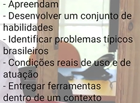

# CONCEPÇÃO DE ARTEFATOS DIGITAIS

---

- link: [Redu](https://redu.digital/app/dashboard/environments/60/courses/1147)
- Introdução ao raciocínio de Design
    - Aprender o raciocínio de design está relacionado com a intervenção positiva
        
        
        
    - Design: uma forma de pensar natural do ser humano para resolver problemas que foi explicitado e progressivamente enriquecido com técnicas
        - Formulação do método “Design” a partir de um raciocínio de equilíbrio entre a produção em massa para consumo e a manutenção da qualidade dos materiais de forma que houvesse o cuidado, zelo, estética, forma de produção e relação próxima com o consumidor
    - Raciocínio de design
        - Forma sistemática, explícita e ensinável para se preparar utilizando técnicas para resolver problemas
        - Metodologia básica
            - 1 - Análise de contexto: desmontar o contexto, observar o problema
            - 2 - Síntese: sistematizar os elementos encontrados na análise de dados
            - 3 - Geração de ideias (ideação): gerar possíveis soluções para o problema
            - 4 - Protipagem: selecionar as melhores ideas, que devem se transformar em protótipos
            - 5 - Avaliação: ajuste de uma solução
- Detalhando o raciocínio de Design
    - Raciocínio científico
        - Formulação da pergunta problema a partir da leitura do conhecimento prévio
        - Experimentação
            
            
            
        - Validação, falseamento e noção de verdade
            - Utilizar métodos para confirmar o resultado
        - Detalhamento do raciocínio científico
            
            
            
    - Detalhamento do raciocínio científico ocorreu há mais de 1000 anos, enquanto que o detalhamento do raciocínio de design ocorreu há pouco mais de um século
    - Raciocínio de Design
        - Detalhamento do raciocínio de design
            
            
            
        - Projetar uma solução que ainda não existe
            - Pesquisando uma coisa que ao mesmo tempo estou intervindo, por meio da inserção de protótipos de ideias dentro do contexto de pesquisa ocorrendo a intervenção do prórpio contexto
        - Paradigmas projetivos: paradigmas que alteram a realidade na medida que estudam a alteração que é feita
            - Métodos que permitem inferir informações sobre uma pessoa a partir de suas reações a estímulos ambíguos
            - Analisar a informação a medida que são realizadas intervenções para resolver o problema
            
            
            
        - Pode utilizar o raciocínio científico em diversas etapas
            
            
            
    - Design Science Research
        - Epistemologia do design
        - Paradigma de pesquisa com foco no desenvolvimento e validação de conhecimento prescritivo em ciência da informação
        - Processo de diálogo com pessoas
            - Imaginar soluções para o problema junto com as pessoas afetadas por este problema
            - Grande conexão com o público alvo, participação da pessoa que experimenta o problema para ajudar o designer a propor a solução
        - 1ª camada de conhecimento: equipe de designer, 2ª camada de conhecimento: depois da participação dos envolvidos, 3ª camada de conhecimento: quais são as melhores soluções com o apoio do público-alvo
            - Revisitar estas camadas o tempo todo para chegar à solução desejada
- Técnicas
    - Análise de contexto
        - Considerar o usuário
            - Deduzir e inferir a partir do comportamento do usuário
        - Entender a necessidade de analisar o comportamento humano
            - Emoções, desejos, etc.
        - Empatizar com o usuário
        - Acesso ao campo/local: observar, interpretar, encenar
            - Conquistar este acesso, escolher uma técnica adequada, conseguir analisar os dados, fazer uma síntese dos dados
        - Delimitação do problemas que vamos resolver ao isolar um aspecto do contexto
        - Fontes
            - Fontes primárias: artigos da literatura, artigos acadêmicos, livros, materiais didáticos e etc.
                - Complementam a quantidade de conhecimento sobre determinado espaço do problema
            - Fontes secundárias: interpretações, análises ou sínteses baseadas em fontes primárias
        - Dados
            - Dados primários: dados coletados diretamente pelo pesquisador ou organização para responder um problema específico ou atingir um objetivo
                - São dados inéditos, recolhidos atravpes de entrevistas, enquestes, formulários e etc.
                - O pesquisador possui total controle sobre o método de coleta
                - São mais preciso mas geralmente caros e demorados para obter
            - Dados secundários: dados já existentes, coletados por outras pessoas ou organizações
                - Menor custo e facilidade de acesso
                - Nem sempre correspondem perfeitamente ao objetivo do estudo
    - Síntese
        - Encontrar padrões de comportamento
        - Criar tabelas, fluxogramas, diagramas, mapas mentais, jornadas do usuário e etc.
    - Geração de ideias
        
        
        
        - Insight: associar um estímulo com uma outra informação gerando um terceiro elemento não conhecido
        - Brainstorming
        - Extremamente importante anotar as ideias
    - Seleção de ideias
        
        
        
    - Técnicas de prototipagem
        - Cenários
        - Paper prototype
    - Mapa de empatia
    - Value Proposition Canvas
- Ideação
    - Utiliza técnicas de geração de ideias
        
        
        
    - Após a geração de ideias, usamos as técnicas de seleção de ideias dependendo da desejabilidade, usabilidade e etc. a fim de entender quais as melhores ideias a serem desenvolvidas
        
        
        
    - Após a avaliação de ideias, é preciso tentar pensar visualmente estas ideias ou sketchings utilizando o raciocínio visual
        
        
        
- Prototipação
    - Protótipo: quase um tipo
        - Eles são classificados como de baixa fidelidades/leves ou alta fidelidade/pesados
        - Os protótipos leves são implementados de forma muito econômica e rápida
        - Os protótipos de alta fidelidade exigem um maior investimento em arte, diagramação e diversos materiais
    - Prototipagem é um conjunto de habilidades para criar a condição atual que antecipa o uso futuro
    - Materialização das ideias para simular um uso futuro saindo do sketching
        
        
        
    - Esta fase é bastante associada à fase de avaliação, pois os protótipos feitos são avaliados constantemente
        - Dimensões da avaliação
            
            
            
        - Após essa avaliação, temos o feedback dos protótipos que permitem a evolução deste em diferentes estruturas

[Grupo 7](concepcao-de-artefatos-digitais/grupo-7.md)