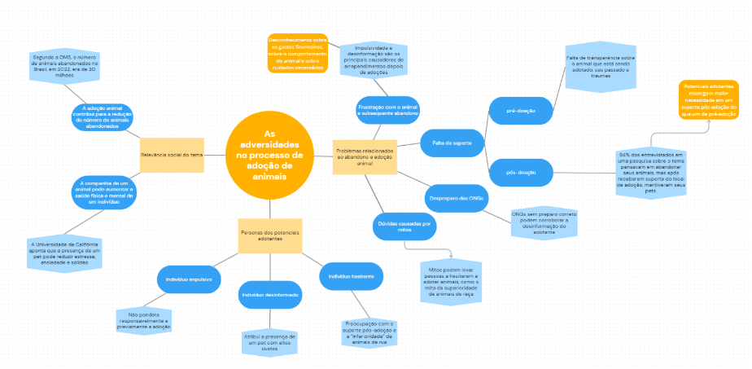

# Grupo 7

---

Este documento registra o projeto desenvolvido pelo Grupo 7 ao longo da disciplina de Concepção de Artefatos Digitais, aplicando na prática o raciocínio de design apresentado na página principal da disciplina. O projeto consiste em **uma plataforma para aumentar a capacidade de adotantes se conectarem com ONGs e adotarem animais de forma responsável e eficiente**, percorrendo as três macroetapas clássicas do design thinking: *Empatize e Defina*, *Idealize e Prototipe* e *Teste e Implemente*.

## 1. Empatize e Defina

### 1.1 Delimitação do espaço-problema

- **Referência**: [slides de delimitação do problema](https://docs.google.com/presentation/d/14Hv702-3jDrVmHbvqLzSNyJtaUuBW4E0elD82ayFMCs/edit#slide=id.g2114165559_0_58)
- **Entrega**: criar uma plataforma para aumentar a capacidade de adotantes se conectarem com ONGs e adotarem animais de forma responsável e eficiente.

### 1.2 Desk research

- **Referência**: [documento de desk research](https://docs.google.com/document/d/1SuRA4NLQOtho1QA41pcYYT3MRLFWJVf-OZ2ocVF7tOo/edit?tab=t.0#heading=h.ss6fuu4xig1c)

A pesquisa documental levantou fontes secundárias sobre o problema da adoção responsável de animais, resumidas abaixo:

- [Adoção de animais — UFSM](https://www.ufsm.br/midias/arco/adocao-animais) — responsabilidade na adoção.
- [Faunalytics — desafios na adoção de animais em abrigos](https://faunalytics.org/addressing-challenges-in-shelter-animal-adoption/#) — causas do abandono de animais: mudanças de residência (25%), problemas comportamentais ou de treinamento (21%) e dificuldades financeiras (13%). Soluções apontadas: eliminar o preconceito quanto a animais de rua e criar programas de apoio. Além disso, 87% dos consumidores estão dispostos a adotar mais animais, e 68% consideram os abrigos como opção para futuras adoções.
- [Hill's Pet — State of Shelter Pet Adoption Report 2024](https://www.hillspet.com/about-us/press-releases/hills-pet-nutrition-releases-2024-state-of-shelter-pet-adoption-report?lightboxfired=true#) — dados complementares sobre as dificuldades na adoção de animais.
- [Correio do Povo — adoções por impulso](https://www.correiodopovo.com.br/blogs/bichoamigo/ado%C3%A7%C3%B5es-por-impulso-levam-ao-crescimento-de-abandono-de-animais-alerta-crmv-rs-1.512374) — importância de não ser impulsivo no momento da adoção.
- [CCZ Campos — relatos de arrependimento na adoção](https://cczcampos.com.br/2021/10/28/adocao-me-arrependi-de-adotar-o-meu-cachorro-e-agora/5076/) — informações sobre a devolução/doação de animais adotados.
- [Estadão — por que a adoção ainda é tão difícil no Brasil](https://www.estadao.com.br/emais/comportamento-animal/por-que-a-adocao-ainda-e-tao-dificil-no-brasil/?srsltid=AfmBOoo-7POueEn4IheFSz4z3ThzqgM3S21dzRQfR95S0tUR1U16Zy8R) — pesquisa que evidencia irresponsabilidades tanto de ONGs quanto de adotantes.
- [BMC Veterinary Research](https://bmcvetres.biomedcentral.com/articles/10.1186/s12917-020-02728-2#ref-CR3) — utilização de algoritmos para auxiliar no processo de adoção.
- [UnB Notícias — abandono de animais é crime](https://noticias.unb.br/artigos-main/6573-abandono-de-animais-e-crime#:~:text=De%20acordo%20com%20a%20Organiza%C3%A7%C3%A3o,gatos%20e%2020%20milh%C3%B5es%2C%20c%C3%A3es) — dados sobre abandono animal no Brasil.
- [UC Davis Health — benefícios de ter animais de estimação](https://health.ucdavis.edu/blog/cultivating-health/health-benefits-of-pets-how-your-furry-friend-improves-your-mental-and-physical-health/2024/04) — importância dos animais para as pessoas.
- [Semantic Scholar — consequências do abandono de animais para a saúde](https://www.semanticscholar.org/paper/CONSEQU%C3%8ANCIA-DO-ABANDONO-DE-ANIMAIS-PARA-A-SA%C3%9ADE-NA-Neto-Monte/412c16cddb39968a26a092bea279ad0839dd3cc6#cited-papers) — consequências do abandono de animais para a saúde pública.
- [Exame Invest — quanto custa ter um animal de estimação](https://exame.com/invest/minhas-financas/quanto-custa-ter-animal-de-estimacao/amp/) — dados sobre preços de cuidados mensais de diferentes animais.
- [ScienceDirect](https://www.sciencedirect.com/science/article/abs/pii/S155878782100068X?via%3Dihub) — falta de estrutura para acomodar o volume de animais nos abrigos.
- [Petlove — mitos sobre adoção de cães](https://www.petlove.com.br/dicas/mitos-sobre-adocao-caes?srsltid=AfmBOoonc8V1jqU7LkuiuwJklKDJjLulHfQYOFIpastqTEQwRL1ETzX2) — estigmas associados à adoção de animais.

### 1.3 Análise do problema em contexto e resultados

- **Referência**: [documento de análise do problema](https://docs.google.com/document/d/1VNph1yAaX3AtuqSQrqAmCUY3GVczxat_EzwMQzcPzHw/edit?tab=t.0#heading=h.ss6fuu4xig1c)
- **Entrega**: *(ver documento de referência)*

### 1.4 Estado da arte e da técnica

- **Referência**: mapa mental, feito no Miro.
- **Entrega**:

    

    [Mapa mental completo (Google Drive)](https://drive.google.com/file/d/1iLwdLQcAz3C2zg-jaFgPmihjr0XfRaGp/view)

### 1.5 Stakeholders e personas

- **Referência**: [documento de stakeholders e personas](https://docs.google.com/document/d/1o7BaZzktzJ00N4OBccoelLkSDNWhv0P3FZmAof9iao0/edit?tab=t.0#heading=h.l7nkwajvlspm)

**Stakeholders identificados:**

1. Possíveis adotantes
2. ONGs
3. Lares de adoção

**Personas construídas:**

1. Persona cliente hesitante (meio de contato: Instagram)
2. Persona cliente desinformada
3. Persona coordenadora de ONG (meio de contato: Instagram, WhatsApp e telefone)
4. Persona dona de lar de adoção (meio de contato: telefone e WhatsApp)

### 1.6 Análise de competidores

- **Referência**: [documento de análise de competidores](https://docs.google.com/document/d/1LdA0CnLrWDqb5tAOQyhA2JSCSx_wqJKC93kMK7agy8Q/edit?tab=t.0#heading=h.t2jet5r8ar5i)

Foram analisados três concorrentes/referências diretas:

1. [AdotaPet — Recife.PE.gov.br](https://adotapet.recife.pe.gov.br/)
2. Redes sociais (perfis de ONGs e abrigos)
3. [AdoteePetz](https://www.adotepetz.com.br/)

Planilha comparativa completa: [análise de competidores (Google Sheets)](https://docs.google.com/spreadsheets/d/1zxdHTQLUmicVpccD2cqM-dkXm93hAAqs/edit?gid=409487213#gid=409487213)

!!! warning "Gargalos identificados"
    - As ONGs enfrentam dificuldades na avaliação objetiva e acessível da confiabilidade dos adotantes, o que compromete a transparência e a segurança do processo de adoção. Essa falta de critérios claros pode levar a desistências e devoluções frequentes de animais, além de gerar incerteza sobre a capacidade dos novos tutores de oferecer os cuidados adequados ao pet.
    - A falta de acesso a informações confiáveis e organizadas sobre os cuidados com os animais pode resultar em erros na adaptação, comprometendo o bem-estar e a saúde do pet após a adoção. Muitos adotantes não dispõem de guias detalhados e acessíveis sobre os cuidados específicos necessários para garantir uma convivência saudável e responsável, o que pode resultar em devoluções ou abandono.

### 1.7 Identificação do que é essencial para as partes envolvidas

- **Entrega**:
    1. Suporte pré e pós-adoção.
    2. Informações gerais e específicas sobre animais e sobre ONGs.

### 1.8 Jornada dos usuários

- **Referência**: [documento de jornada do usuário](https://docs.google.com/document/d/1o7BaZzktzJ00N4OBccoelLkSDNWhv0P3FZmAof9iao0/edit?tab=t.0#heading=h.l7nkwajvlspm)
- **Entrega**: [mapa de jornada (Miro)](https://miro.com/app/board/uXjVLgjYLNM=/)

## 2. Idealize e Prototipe

### 2.1 Geração de ideias

- **Referência**: [documento de geração de ideias](https://docs.google.com/document/d/1Z0kqStCkhox1eMhrIeLYaj42jt9beoyfDR9tFzPYTSw/edit?tab=t.0#heading=h.gvkcsrr59c8u)
- **Entrega**:
    - Filtragem do nível de confiabilidade dos adotantes via formulário no momento do cadastro, combinada com feedback do adotante/ONG após a adoção (exposto no aplicativo para visualização por outros usuários).
    - Disponibilização de materiais educativos/informativos em vários formatos (vídeo, arquivo, texto), para que os adotantes tenham onde buscar informações confiáveis sobre diversos assuntos relacionados aos animais (tipos de ração, informações específicas sobre uma raça, cuidados necessários, dicas gerais etc.).
    - [Documento complementar de ideação](https://docs.google.com/document/d/1OfjMMGjK3iPpwkmFmK7ZOYDNXcFk3i94tnQLW1XrpeI/edit?usp=drivesdk)

### 2.2 Seleção de ideias

- **Referência**: [documento de seleção de ideias](https://docs.google.com/document/d/1ZUi15hEOlVNK_UvnK9sliUadM6ik7s-0kxLhDxbyRKw/edit?tab=t.0#heading=h.3pcog6vdxxiq)
- **Entrega**: *(ver documento de referência)*

### 2.3 Cenários

- **Referência**: [modelo de cenários — trabalho de conclusão de curso usado como referência](https://pt.scribd.com/document/89510783/FALCAO-Taciana-Pontual-da-Rocha-Interface-ubiquas-para-uso-em-sala-de-aula-Trabalho-de-Conclusao-de-Curso-Graduacao-em-Ciencia-da-Computacao-Un)
- **Entrega**: *(ver documento de referência)*

### 2.4 Prototipagem de baixa fidelidade

- **Referência**: [documento de prototipagem de baixa fidelidade](https://docs.google.com/document/d/1tFL4y5NZ3WSx3ysO5lJ9IwuauqRV-P82zVkx7wbuGG8/edit?tab=t.0#heading=h.lgkp83tjfm6q)
- **Entrega**:
    - [Protótipo de baixo nível (Figma)](https://www.figma.com/board/Bmm5JtvySBo1JWPHsvVq0y/Prototipa%C3%A7%C3%A3o---Baixo-N%C3%ADvel?node-id=0-1&t=1AaYgCHcHokgoYRG-1)
    - [Quadro de apoio (Miro)](https://miro.com/welcomeonboard/RWxVREQzZWxPNUxHTVZaSDJJUXdUa3IrazlsRHRLSkhQelYxL2N0V0ZxSThFK1lNSjExM2Y2bVg5aXV1Z1dzY0JWeUNzMU9wSTZFRGZJV21MUG8xL1B5aytFOVRpa2R5eng4UGNEL21LNEhzTmRFRUI2VW8xM0ViZDdNNG03dk9hWWluRVAxeXRuUUgwWDl3Mk1qRGVRPT0hdjE=?share_link_id=589787249856)

### 2.5 Prototipagem de alta fidelidade

- **Referência**: [documento de prototipagem de alta fidelidade](https://docs.google.com/document/d/1BxHQA4wdFF7eKgNtSdKgdzTfYMhICa1zZKnQtbybrtE/edit?tab=t.0#heading=h.rpvqp6i20j5)
- **Entrega**: *(ver documento de referência)*

### 2.6 Evolução dos protótipos

- **Referência**: [documento de evolução dos protótipos](https://docs.google.com/document/d/1isgcNJYwQ9zp14AXZqR77rVjQYB25GZCngTKGcIYqnU/edit?tab=t.0#heading=h.coywttm6pcev)
- **Entrega**: *(ver documento de referência)*

## 3. Teste e Implemente

### 3.1 Planejamento e execução de técnicas de avaliação da usabilidade

- **Referência**: [documento de planejamento de avaliação de usabilidade](https://docs.google.com/document/d/1NNnADiOQQyXaxmZWKgk8LT8PvBFuA2podo-1wRIQf_c/edit?tab=t.0#heading=h.m8b6gym9g1m2)
- **Entrega**: *(ver documento de referência)*

### 3.2 Recrutamento de usuários

- **Referência / Entrega**: *(não detalhado nas notas originais)*

### 3.3 Coleta, análise e interpretação dos dados

- **Referência / Entrega**: *(não detalhado nas notas originais)*

### 3.4 Impacto na evolução contínua do protótipo

- **Referência / Entrega**: *(não detalhado nas notas originais)*

### 3.5 Entrega do vídeo final de cinco minutos

- **Referência / Entrega**: *(não detalhado nas notas originais)*

## Materiais de apoio

**Slides** — "Empatize e defina" + "Geração de ideias":

- [Apresentação (Canva)](https://www.canva.com/design/DAGZjieBFIA/diGnwi0t0ZDTlVyMgb-b1w/edit)

**Formulário de pesquisa:**

- [Formulário (Google Forms)](https://docs.google.com/forms/d/e/1FAIpQLSdnfmm4Ip1wR2BSim55yv04X9tHAQKkM1jPEfosoq14CVZWsA/viewform)
- [Respostas coletadas](https://docs.google.com/document/d/1bRS7-HiWMXM_Ubpw6Kyqqif92uK7z82HxwJ96eh46tY/edit?tab=t.0)
