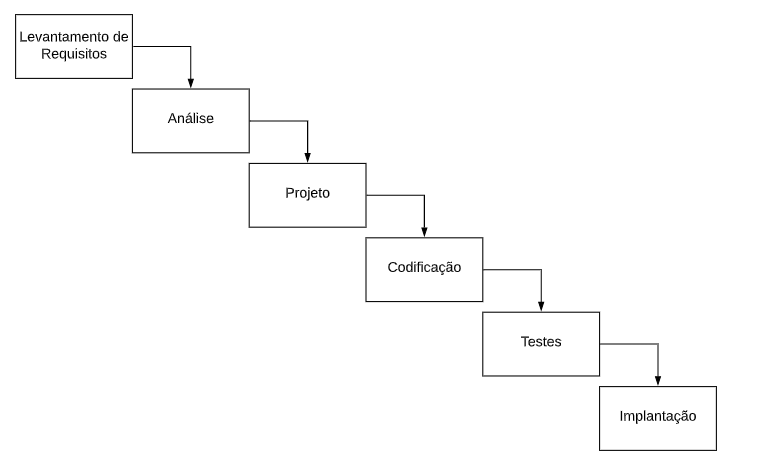

# Desenvolvimento de Software

---

!!! note "Sobre estas notas"
    Esta página é um resumo de estudo construído em cima do livro digital gratuito **[Engenharia de Software Moderna](https://engsoftmoderna.info/?authuser=2)**, de Marco Tulio Valente (UFMG), com equipe da UFPE/UFCG. A numeração dos capítulos e seções segue a do livro, para que as notas continuem navegáveis como um acompanhamento da leitura. Não é uma transcrição — é um resumo em prosa, com exemplos próprios quando úteis.

## 1 - Introdução

### 1.1 - Definições, Contexto e História

**Engenharia de Software** trata da aplicação de abordagens sistemáticas, disciplinadas e quantificáveis para desenvolver, operar, manter e evoluir software. É a área da computação que se preocupa em propor e aplicar princípios de engenharia na construção de software — ou seja, tratar a produção de software não como um artesanato improvisado, mas como uma disciplina com métodos, processos e métricas.

Essa disciplina existe porque construir software enfrenta um conjunto de **dificuldades essenciais**, inerentes à própria natureza do software e que nenhuma tecnologia nova elimina por completo:

- **Complexidade** — dentre as construções que o ser humano se propõe a realizar, software é uma das mais desafiadoras e complexas que existem.
- **Conformidade** — por sua natureza, o software precisa se adaptar ao ambiente em que está inserido, e esse ambiente muda constantemente no mundo moderno (novas APIs, novos regulamentos, novos dispositivos).
- **Facilidade de mudanças** — consiste na necessidade de evoluir sempre, incorporando novas funcionalidades. Quanto mais bem-sucedido for um sistema de software, maior a demanda por mudanças que ele recebe — o sucesso de um sistema é, paradoxalmente, o que gera mais pressão para modificá-lo.
- **Invisibilidade** — devido à sua natureza abstrata, é difícil visualizar o tamanho de um sistema de software e, consequentemente, estimar o esforço necessário para construí-lo.

!!! note "Dificuldades acidentais"
    Além das dificuldades essenciais (inerentes ao problema), existem as **dificuldades acidentais**: problemas tecnológicos que os engenheiros de software conseguem resolver, desde que devidamente treinados e com acesso às tecnologias e recursos adequados (por exemplo, falta de uma boa ferramenta de build, ou desconhecimento de uma linguagem).

### 1.2 - O que se Estuda em Engenharia de Software?

Para delimitar e organizar o que se estuda na área, foi criado um guia chamado **[SWEBOK](https://www.computer.org/education/bodies-of-knowledge/software-engineering)** (*Software Engineering Body of Knowledge*), cujo objetivo é documentar o corpo de conhecimento que caracteriza a engenharia de software.

Segundo o SWEBOK, a engenharia de software possui 12 áreas de conhecimento: Engenharia de Requisitos; Projeto de Software; Construção de Software; Testes de Software; Manutenção de Software; Gerência de Configuração; Gerência de Projetos; Processos de Software; Modelos de Software; Qualidade de Software; Prática Profissional; e Aspectos Econômicos (as três últimas áreas do SWEBOK completo — Fundamentos de Computação, Fundamentos de Matemática e Fundamentos de Engenharia — não são tratadas neste capítulo).

#### 1.2.1 - Engenharia de Requisitos

A engenharia de requisitos inclui o conjunto de atividades realizadas com o objetivo de definir, analisar, documentar e validar os requisitos de um sistema. Existem dois grandes tipos de requisitos:

- **Requisitos funcionais** definem *o que* um sistema deve fazer — as funcionalidades e serviços que o sistema deve implementar.
- **Requisitos não funcionais** definem o *modo de operação* do sistema — restrições e qualidade de serviço, como desempenho, disponibilidade, tolerância a falhas, segurança, privacidade, interoperabilidade, capacidade, manutenibilidade e usabilidade.

!!! example "Exemplo: sistema de home banking"
    - **Requisitos funcionais**: informar o saldo da conta, informar o extrato, realizar transferência entre contas, pagar um boleto bancário, cancelar um cartão de débito etc.
    - **Requisitos não funcionais**: desempenho (informar o saldo em menos de 3 segundos), disponibilidade (estar no ar 99% do tempo), tolerância a falhas (continuar operando mesmo se um data center cair), segurança (criptografar todos os dados trocados com as agências), privacidade (não disponibilizar dados de clientes a terceiros), interoperabilidade (integrar-se com os sistemas do Banco Central), capacidade (armazenar dados de 1 milhão de clientes) e usabilidade (ter uma versão para deficientes visuais).

#### 1.2.2 - Projeto de Software

Durante o projeto (*design*) de um sistema, definem-se as principais unidades de código, mas apenas no nível de **interfaces** — incluindo interfaces providas e interfaces requeridas:

- **Interfaces providas** são os serviços que uma unidade de código torna públicos para uso pelo resto do sistema.
- **Interfaces requeridas** são aquelas das quais uma unidade de código depende para funcionar.

Ou seja, durante o projeto de um sistema não entramos em detalhes de implementação de cada unidade de código — como os detalhes de implementação dos métodos de uma classe, caso o sistema seja orientado a objetos. **Projeto de software é diferente de implementação.**

```java
class ContaBancaria {
   private Cliente cliente;
   private double saldo;
   public double getSaldo() { ... }
   public String getNomeCliente() { ... }
   public String getExtrato(Date inicio) { ... }
}
```

Nesse exemplo, `ContaBancaria` oferece uma interface para as demais classes do sistema, na forma de três métodos públicos, que constituem a interface provida pela classe. Ao mesmo tempo, `ContaBancaria` depende da classe `Cliente` — logo, `Cliente` é uma interface requerida por `ContaBancaria` (em outras palavras, `ContaBancaria` possui uma dependência para `Cliente`).

!!! note
    Arquitetura de software trata da organização de um sistema em um nível de abstração mais alto do que aquele que envolve classes ou construções semelhantes.

#### 1.2.3 - Construção de Software

Trata-se da implementação/codificação do sistema propriamente dita: a definição dos algoritmos, estruturas de dados, frameworks, bibliotecas, técnicas de tratamento de exceções, padrões de nomes, layout, documentação do código e as ferramentas que serão utilizadas no desenvolvimento.

#### 1.2.4 - Testes de Software

Testar é executar um programa com um conjunto finito de casos a fim de verificar se ele possui o comportamento esperado.

!!! quote
    "Testes de software mostram a presença de bugs, mas não a sua ausência."

Entre os tipos de teste de software estão:

- **Testes de unidade** — testam uma pequena unidade do código.
- **Testes de integração** — testam uma unidade de maior granularidade, como um conjunto de classes.
- **Testes de performance** — submetem o sistema a uma carga de processamento para verificar seu desempenho.
- **Testes de usabilidade** — verificam a usabilidade da interface do sistema.
- entre outros tipos.

Os testes também podem ser usados tanto para **verificação** quanto para **validação** de sistemas:

| | Pergunta central |
|---|---|
| **Verificação** | Estamos implementando o sistema *corretamente*? Isto é, de acordo com seus requisitos. |
| **Validação** | Estamos implementando o sistema *correto*? Isto é, aquele que os clientes ou o mercado estão querendo. |

#### 1.2.5 - Manutenção e Evolução de Software

Existem diferentes tipos de manutenção realizadas em sistemas de software:

- **Corretiva** — corrigir bugs reportados por usuários ou outros desenvolvedores.
- **Preventiva** — corrigir bugs latentes no código, que ainda não causaram falhas junto aos usuários.
- **Adaptativa** — adaptar um sistema a uma mudança em seu ambiente, incluindo tecnologia, legislação, regras de integração com outros sistemas ou demandas de novos clientes.
- **Refactoring** — modificações realizadas em um software preservando seu comportamento, visando exclusivamente a melhoria do código ou do projeto.
- **Evolutiva** — incluir uma nova funcionalidade ou introduzir aperfeiçoamentos importantes em funcionalidades existentes.

#### 1.2.6 - Gerência de Configuração

Envolve desenvolver um software com apoio de um sistema de controle de versões, como o Git, e definir um conjunto de políticas para gerenciar as diferentes versões de um sistema.

As *releases* podem ser identificadas no formato `x.y.z`, em que:

- um incremento em `z` ocorre quando se lança uma nova release apenas com correções de bugs (um **patch**);
- um incremento em `y` ocorre quando se lança uma release com pequenas funcionalidades novas (uma versão **minor**);
- um incremento em `x` ocorre quando se lança uma release com funcionalidades muito diferentes da última release (uma versão **major**).

Esse esquema de numeração de releases é conhecido como **versionamento semântico**.

#### 1.2.7 - Gerência de Projetos

Envolve o uso de práticas e atividades de gerência de projetos — como negociação de contratos com clientes, gerência de recursos humanos, gerência de riscos e acompanhamento da concorrência. Um **stakeholder** é qualquer pessoa física ou organização que afeta ou é afetada pelo projeto.

!!! quote "Lei de Brooks"
    "A inclusão de novos desenvolvedores em um projeto que está atrasado contribui para torná-lo ainda mais atrasado."

    Esse efeito acontece porque os novos desenvolvedores precisam primeiro compreender todo o sistema, sua arquitetura e seu projeto, antes de começarem a produzir código útil. Além disso, equipes maiores exigem maior esforço de comunicação e coordenação para tomar e explicar decisões: um time de 3 desenvolvedores tem 3 canais de comunicação (p1-p2, p1-p3, p2-p3), enquanto um time de 4 desenvolvedores já tem 6 canais, e assim por diante — o número de canais cresce quadraticamente com o tamanho do time.

#### 1.2.8 - Processos de Desenvolvimento de Software

Um processo de desenvolvimento de software define quais atividades e etapas devem ser seguidas para construir e entregar um sistema. Existem dois grandes tipos de processo:

**Processos Waterfall (cascata)** são processos dirigidos por planejamento, que propõem que a construção de um sistema seja feita em etapas sequenciais, como uma cascata de água:

**Levantamento de Requisitos → Análise → Projeto → Codificação → Testes → Implantação**

??? note "Foto do livro-texto (modelo cascata)"
    

Esse modelo foi elaborado há mais tempo e foi muito criticado devido aos atrasos e problemas recorrentes que gerava na prática.

**Processos Ágeis** surgiram justamente das críticas aos processos waterfall. A ideia central é que um sistema deva ser construído de forma incremental e iterativa: pequenos incrementos de funcionalidades são produzidos e logo em seguida validados pelos usuários. Diversos métodos concretizam os princípios ágeis — XP, Scrum, Kanban e Lean Development, entre outros — e ajudaram a disseminar práticas como testes automatizados, *test-driven development* (escrever os testes antes do próprio código) e integração contínua.

!!! note "Integração contínua"
    Recomenda que os desenvolvedores integrem imediatamente o código que produzem, evitando que fiquem muito tempo trabalhando localmente sem integrar suas mudanças ao repositório principal do projeto. Quanto maior o time de desenvolvimento, maiores as chances de conflitos de integração — logo, maior a importância de integrar com frequência.

#### 1.2.9 - Modelos de Software

Modelos permitem que os desenvolvedores analisem propriedades e características essenciais de um sistema de modo fácil e rápido, sem precisar mergulhar nos detalhes do código. Eles podem apoiar a **engenharia avante** (modelos criados antes do código, para se ter um entendimento de mais alto nível antes de implementar) ou a **engenharia reversa** (modelos criados depois do código, para entender uma porção de código já existente).

Frequentemente, modelos de software são baseados em notações gráficas — entre elas, a **UML** (*Unified Modeling Language*), uma notação que define mais de uma dezena de diagramas gráficos para representar propriedades estruturais e comportamentais de um sistema.

Um exemplo típico é um **diagrama de classes** como o abaixo, relacionando uma classe `Cliente` (com atributos `id`, `nome`, `especial`) a uma classe `ContaBancaria` (com atributo `saldo` e os métodos `getSaldo()`, `getNomeCliente()` e `getExtrato(inicio: Data)`), ligadas por uma associação `cliente` de multiplicidade 1.

??? note "Foto do livro-texto (exemplo de diagrama de classes UML)"
    

Nesse tipo de diagrama, as caixas retangulares representam classes do sistema, incluindo seus métodos e atributos, e as setas indicam relações entre duas classes. (O capítulo 4 do livro, resumido mais abaixo, aprofunda os principais diagramas UML.)

#### 1.2.10 - Qualidade de Software

A qualidade de um sistema pode ser avaliada sob dois ângulos complementares:

**Qualidade externa** considera fatores que podem ser aferidos sem analisar o código — ou seja, pode ser avaliada até por usuários comuns, que não são especialistas em engenharia de software:

- **Correção** — o software atende à sua especificação? Nas situações normais, ele funciona como esperado?
- **Robustez** — o software continua funcionando mesmo quando ocorrem eventos anormais, como uma falha de comunicação ou de disco? Um software robusto não deve sofrer um *crash* nessas situações; deve, no mínimo, avisar por qual motivo não está conseguindo funcionar conforme previsto.
- **Eficiência** — o software faz bom uso dos recursos computacionais, ou precisa de um hardware extremamente poderoso e caro para funcionar?
- **Portabilidade** — é possível portar o software para outras plataformas e sistemas operacionais? Ele possui versões para Windows, Linux e macOS? Se for um app, possui versões para Android e iOS?
- **Facilidade de uso** — o software possui interface amigável, mensagens de erro claras, suporte a mais de uma língua? Pode ser usado por pessoas com deficiência visual ou auditiva?
- **Compatibilidade** — o software é compatível com os principais formatos de dados de sua área? (Por exemplo: uma planilha eletrônica importa arquivos XLS e CSV?)

**Qualidade interna** considera propriedades relacionadas com a implementação do sistema, e só pode ser avaliada por um especialista em engenharia de software — por exemplo, modularidade, legibilidade do código, manutenibilidade e testabilidade.

Para garantir a qualidade, diversas estratégias podem ser usadas: métricas para acompanhar um produto de software (número de linhas de um programa, número de defeitos reportados etc.) e revisões de código, cujo objetivo é detectar bugs antecipadamente — antes de o sistema entrar em produção — e também garantir a qualidade do próprio código. Ferramentas como o GitHub apoiam esses processos de revisão.

#### 1.2.11 - Prática Profissional

Envolve questionamentos sobre o papel e a responsabilidade ética dos profissionais formados em Computação, em uma sociedade na qual os relacionamentos humanos são cada vez mais mediados por algoritmos e sistemas de software. Duas referências centrais nessa discussão são o [Código de Ética da ACM](https://www.acm.org/code-of-ethics) e o [Código de Ética da IEEE Computer Society](https://www.computer.org/education/code-of-ethics).

#### 1.2.12 - Aspectos Econômicos

Decisões e questões econômicas se entrelaçam constantemente com o desenvolvimento de sistemas. Um conceito central aqui é o **custo de oportunidade** de uma decisão: as oportunidades que são preteridas quando se descarta uma das alternativas possíveis.

### 1.3 - Classificação de Sistemas de Software

O livro propõe uma classificação de sistemas em três categorias, úteis para calibrar o rigor do processo de desenvolvimento adotado:

| Categoria | Características | Risco de falha | Processo recomendado |
|---|---|---|---|
| **Sistemas A (Acute)** | Sistemas de missão crítica | Qualquer falha pode causar imenso prejuízo, incluindo perda de vidas humanas | Processos rígidos, com rigorosa revisão de código e certificação por organizações externas |
| **Sistemas B (Business)** | Aplicações corporativas, sistemas web, aplicações de uso geral, bibliotecas, frameworks e sistemas de software básico | Moderado | Tipo de sistema trabalhado ao longo do livro |
| **Sistemas C (Casuais)** | Sistemas geralmente pequenos e não críticos | Baixo — podem ter bugs que não comprometem fundamentalmente o funcionamento | Processos leves; o maior risco aqui é o *over-engineering* (usar recursos mais sofisticados do que o contexto demanda) |

## 2 - Processos

### 2.1 - Importância de Processos

Um processo de desenvolvimento de software define um conjunto de passos, tarefas, etapas, eventos e práticas que devem ser seguidos por desenvolvedores na produção de um sistema.

Projetos pessoais — como as implementações iniciais do Linux e do TeX, feitas por uma única pessoa — não precisam se preocupar tanto com a adoção de processos, pois nesse tipo de projeto o trabalho pode depender apenas dos princípios, práticas e decisões de um único desenvolvedor, impactando somente a ele mesmo.

Porém, os projetos de software modernos são bem mais complexos, tornando impossível que sejam desenvolvidos por uma única pessoa — os sistemas modernos são desenvolvidos em equipe. Essas equipes precisam de algum ordenamento para não trabalharem de forma descoordenada, e é exatamente aí que entram os processos, como os processos ágeis vistos a seguir.

### 2.2 - Manifesto Ágil

No início, o processo utilizado na engenharia de software foi o processo em cascata — algo natural, já que as outras engenharias (civil, mecânica etc.) utilizavam esse mesmo tipo de processo sequencial. Com o tempo, percebeu-se que software é diferente de outros produtos de engenharia, e um grupo de profissionais decidiu propor uma nova base de conceitos de processo de software, registrada em um documento conhecido como **Manifesto Ágil**.

A principal característica dos processos ágeis é a adoção de **ciclos curtos e iterativos** de desenvolvimento: implementa-se primeiro uma versão do sistema com as funcionalidades mais urgentes segundo o cliente, e o sistema é construído de forma gradativa, começando pelo que é mais urgente. Caso essa versão seja aprovada, um novo ciclo (ou iteração) se inicia, com as próximas funcionalidades também priorizadas pelos clientes. Normalmente esses ciclos são curtos, de modo que o sistema é construído de forma incremental, com cada incremento devidamente aprovado pelos clientes.

Cada iteração produz um pequeno incremento de sistema (`S++`), que vai se somando aos anteriores até formar o sistema completo: `S++ → S++ → S++ → ... → SISTEMA`.

??? note "Foto do livro-texto (incrementos sucessivos até o sistema completo)"
    

!!! warning
    Esse esquema pode sugerir que cada iteração é uma "mini-waterfall" e que, ao final de cada iteração, o sistema precisa ir para produção para uso pelos usuários finais. Nenhuma das duas coisas é necessariamente verdade.

Outras características dos processos ágeis incluem:

- **Menor ênfase na documentação**: apenas o essencial deve ser documentado.
- **Menor ênfase em planos detalhados**: o importante é conseguir avançar, mesmo em ambientes com informações imperfeitas, parciais e sujeitas a mudanças.
- **Inexistência de uma fase dedicada a design**: em vez disso, o design é incremental, evoluindo à medida que o sistema vai nascendo, ao final de cada iteração.
- **Desenvolvimento em times pequenos**, com cerca de uma dezena de desenvolvedores.
- **Ênfase em novas práticas de desenvolvimento**: programação em pares, testes automatizados e integração contínua.

Como essas características são genéricas e abrangentes, surgiram métodos específicos — como XP, Scrum e Kanban — para ajudar os desenvolvedores a adotar os princípios ágeis de forma mais concreta.

!!! note "Aprofundamento de termos"
    - **Processo**: conjunto de passos, etapas e tarefas usado para construir um software.
    - **Método**: define e especifica um determinado processo de desenvolvimento.
    - Todo método de desenvolvimento deve ser entendido como um **conjunto de recomendações**, não como regras rígidas e inquebráveis.

### 2.3 - Extreme Programming (XP)

XP é um método leve, recomendado para desenvolver softwares com requisitos vagos ou sujeitos a mudanças. É definido de forma abstrata, por meio de valores e princípios que devem fazer parte da cultura e dos hábitos dos times de desenvolvimento.

#### 2.3.1 - Valores

XP defende que o desenvolvimento de projetos de software seja norteado por três valores principais: **comunicação**, **simplicidade** e **feedback**.

#### 2.3.2 - Princípios

- **Humanidade** — a gestão de pessoas é fundamental para o sucesso de projetos de software. *Peopleware* é o termo que designa a parte humana que interage com sistemas computacionais (usuários, desenvolvedores etc.).
- **Economicidade** — se, por um lado, o peopleware é fundamental, software é caro, pois demanda alocação de recursos financeiros consideráveis. Por isso, é importante ter consciência de que o software precisa gerar resultados econômicos.
- **Benefícios mútuos** — um projeto de software precisa beneficiar múltiplos stakeholders, não apenas um deles.
- **Melhorias contínuas**.
- **Falhas acontecem** — XP não defende que as falhas devam ser acobertadas, mas também não devem ser usadas para punir membros do time.
- **Baby steps** — pequenas melhorias são melhores que grandes revoluções.
- **Responsabilidade pessoal** — os desenvolvedores devem ter uma ideia clara do seu papel e de sua responsabilidade dentro da equipe.

#### 2.3.3 - Práticas sobre o Processo de Desenvolvimento

XP recomenda o **envolvimento dos clientes** com o projeto, de modo que os times incluam pelo menos um representante dos clientes. Uma das funções desse representante é escrever as **user stories**: documentos feitos à mão que descrevem os requisitos do sistema de forma resumida. Um exemplo de user story:

> **Postar Pergunta**
>
> Um usuário, quando logado no sistema, deve ser capaz de postar perguntas. Como é um site sobre programação, as perguntas podem incluir blocos de código, os quais devem ser apresentados com um leiaute diferenciado.

??? note "Foto do cartão de user story"
    

As user stories podem ser vistas como lembretes para que, depois, o requisito seja verbalmente detalhado pelo representante dos clientes — não como uma especificação completa e autossuficiente.

Depois de escritas as user stories, os desenvolvedores estimam o tempo necessário para implementá-las, medido em **story points**. Para estimar os story points, costuma-se usar a sequência de Fibonacci, e uma técnica comum para isso é o **Planning Poker**, que consiste na interação e discussão dos desenvolvedores para definir os story points de cada história.

A implementação das histórias é feita em **iterações**, com duração fixa e bem definida (de 1 a 3 semanas, por exemplo). Essas iterações, por sua vez, formam ciclos mais longos chamados de **releases** (de 2 a 3 meses, por exemplo — sem relação com versões de software e versionamento semântico). A **velocidade** de um time é o número de story points que ele consegue implementar em uma iteração, e precisa ser bem definida para orientar o planejamento.

Depois de definidas as user stories, a duração de uma iteração, o número de iterações de uma release, as estimativas de cada história e a velocidade do time, o representante dos clientes prioriza as histórias em um processo chamado **planejamento de releases**. Em seguida, a equipe de desenvolvedores se reúne para o **planejamento de iterações**, cujo objetivo é decompor as histórias de uma iteração em tarefas para cada membro da equipe.

!!! tip "Slacks (folgas)"
    XP defende que, em cada iteração, os times programem algumas folgas — tarefas que podem ser adiadas caso necessário. Essas folgas servem a dois propósitos: criar um buffer de segurança para iterações em que alguma tarefa demande mais tempo que o previsto, e permitir que os desenvolvedores descansem um pouco.

#### 2.3.4 - Práticas de Programação

- **Design incremental** — o time reserva tempo para definir o design do sistema, de forma simples, contínua e incremental. O momento ideal para pensar em design é quando ele se revela importante. O design incremental só é viável em conjunto com outras práticas de XP, principalmente o *refactoring*, que deve ser continuamente aplicado para melhorar a qualidade do design.
- **Programação em pares** — toda tarefa de codificação é realizada por dois desenvolvedores trabalhando juntos, compartilhando o mesmo teclado e monitor. Um deles é o **líder** (ou *driver*), que fica no comando do mouse e do teclado; o outro é o **navegador**, com a função de revisor e questionador. XP propõe que os pares sejam trocados a cada sessão, invertendo os papéis de líder e revisor.
- **Propriedade coletiva do código** — qualquer desenvolvedor (ou par) pode modificar qualquer parte do código, seja para implementar uma nova feature, corrigir um bug etc.
- **Testes automatizados** — implementação de programas para executar pequenas unidades de um sistema e verificar se as saídas produzidas são as esperadas.
- **Desenvolvimento dirigido por testes (TDD)** — implementa-se primeiro o teste de um método e, somente depois, o seu código. O objetivo é evitar que a escrita de testes seja deixada para depois, além de aproveitar o senso crítico do desenvolvedor, que se coloca no papel de cliente do método testado — pensando primeiro na interface e sendo incentivado a criar métodos mais amigáveis para quem vai usá-los.
- **Build automatizado** — o processo de build (gerar uma versão executável do sistema, que possa ser colocada em produção) deve ser totalmente automatizado, sem intervenção dos desenvolvedores, para que eles não precisem se preocupar em rodar scripts manualmente e possam se concentrar na implementação das histórias. O build deve ser o mais rápido possível, para que os desenvolvedores recebam feedback rapidamente.
- **Integração contínua** — sistemas de software são desenvolvidos com apoio de sistemas de controle de versões (VCS), como o Git, que armazenam o código-fonte e arquivos relacionados. Ao usar um VCS, primeiro é preciso baixar o código para a máquina local (`pull`) antes de começar a trabalhar em uma tarefa; depois, os desenvolvedores sobem o código modificado (`push`), integrando a modificação ao código principal. Porém, entre um `pull` e um `push`, outro desenvolvedor pode ter modificado o mesmo trecho de código e já ter integrado sua mudança — nesse caso, quando o primeiro desenvolvedor tentar subir seu código, o VCS impedirá a integração, apontando um **conflito**. Conflitos são ruins porque precisam ser resolvidos manualmente e costumam demandar grande esforço, no que se chama de *integration hell*. Por isso, a ideia do XP é que os desenvolvedores integrem seu código com frequência, para evitar que passem muito tempo trabalhando localmente sem integrar, o que diminui as chances de conflito. Para garantir a qualidade do código integrado, costuma-se usar um serviço de integração contínua, que, antes de qualquer integração, faz o build do código e executa os testes automaticamente.

#### 2.3.5 - Práticas de Gerenciamento de Projetos

- **Ambiente de trabalho** — deve-se evitar times fracionados, em que alguns desenvolvedores trabalham apenas alguns dias da semana no projeto e os demais dias em outro projeto. XP defende que todos os desenvolvedores trabalhem em uma mesma sala, para facilitar comunicação e feedback, além de manterem jornadas de trabalho sustentáveis.
- **Contratos com escopo aberto** — em contratos de escopo fechado, a empresa contratante define, mesmo que minimamente, os requisitos do sistema, além do preço e prazo de entrega. Segundo XP, esses contratos são arriscados, pois os requisitos mudam e nem mesmo o cliente sabe antecipadamente, de modo preciso, o que quer que o sistema faça — o que pode resultar em uma entrega com problemas de qualidade. Já em contratos de escopo aberto, o pagamento ocorre de acordo com a hora trabalhada, e o contrato pode ser rescindido ou renovado conforme necessário. Contratos de escopo aberto são mais compatíveis com os princípios do Manifesto Ágil, que valoriza a colaboração com o cliente mais do que a negociação rígida de contratos.
- **Métricas de processo** — para que gerentes e executivos possam acompanhar um projeto XP, recomenda-se o uso de duas métricas principais: o número de bugs em produção e o intervalo de tempo entre o início do desenvolvimento e o momento em que o projeto começa a gerar seus primeiros resultados financeiros.

### 2.4 - Scrum

Scrum é um método ágil para **gerenciamento de projetos** — que não precisam necessariamente ser projetos de desenvolvimento de software — e, diferentemente do XP, não propõe nenhuma prática específica de programação.

#### 2.4.1 - Papéis

Times Scrum são formados por um **Dono de Produto** (*Product Owner*, PO), um **Scrum Master** e de 3 a 9 desenvolvedores.

- **PO** — tem o mesmo papel do representante dos clientes em XP. Deve possuir a visão do produto que será construído e é responsável por maximizar o retorno do investimento feito no projeto.
- **Scrum Master** — é o especialista em Scrum do time, responsável por garantir que as regras do método estão sendo seguidas. Atua como facilitador dos trabalhos e removedor de impedimentos.

Times Scrum são **cross-funcionais** (ou multidisciplinares): devem incluir, além do PO e do Scrum Master, todos os especialistas necessários para desenvolver o produto sem depender de membros externos. Em projetos de software, isso costuma incluir desenvolvedores front-end e back-end, especialistas em banco de dados, projetistas de interface etc.

#### 2.4.2 - Principais Artefatos e Eventos

Os dois artefatos principais do Scrum são o **backlog do produto** e o **backlog do sprint**; os principais eventos são os **sprints** e o **planejamento de sprints**.

- **Backlog do produto** — lista de histórias ordenadas por prioridade, escritas e organizadas pelo PO, que constituem uma descrição resumida das funcionalidades que devem ser implementadas no projeto. Deve ser continuamente atualizado.
- **Sprints** — são as iterações do Scrum. Ao final de cada sprint, deve-se entregar um produto com valor tangível para o cliente. O resultado de um sprint é chamado de produto **potencialmente pronto para entrar em produção** (*potentially shippable product*).
- **Planejamento do sprint** — reunião na qual o time se reúne para decidir as histórias que serão implementadas no sprint que vai se iniciar. É dividida em duas partes: a primeira, comandada pelo PO, em que ele propõe histórias para o sprint e o restante do time decide se tem velocidade para implementá-las; a segunda, comandada pelos desenvolvedores, em que eles quebram as histórias em tarefas e estimam sua duração (o PO permanece presente nessa parte final para tirar dúvidas sobre as histórias selecionadas).
- **Backlog do sprint** — gerado ao final do planejamento do sprint, consiste em uma lista com as tarefas do sprint e a duração de cada uma. Tarefas podem se mostrar desnecessárias ao longo do sprint, e outras podem surgir — a única coisa que não pode ser alterada é o *sprint goal*: a lista de histórias que o PO selecionou para o sprint e que o time se comprometeu a implementar na duração dele.

Terminada a reunião de planejamento, tem início o sprint, e o time começa a trabalhar na implementação das tarefas do backlog. Os times Scrum têm autonomia para decidir como e por quem as histórias serão implementadas.

??? note "Quadro Scrum (Scrum Board) — exemplo"
    Quadro com tarefas a fazer, em andamento e finalizadas, organizado em cinco colunas: Backlog, To Do, Doing, Testing e Done.

    

Uma decisão importante em projetos Scrum envolve os critérios para considerar uma história ou tarefa concluída — tais critérios devem ser combinados com o time e ser do conhecimento de todos os membros.

!!! note "Gráfico de Burndown"
    A cada dia do sprint, o gráfico mostra quantas horas ainda são necessárias para implementar as tarefas que ainda não estão concluídas (no dia X do sprint, restam Y tarefas que somam Z horas). Um exemplo, para um sprint de 15 dias, com as horas restantes caindo de forma aproximadamente linear:

    | Dia | 1 | 2 | 3 | 4 | 5 | 6 | 7 | 8 | 9 | 10 | 11 | 12 | 13 | 14 | 15 |
    |---|---|---|---|---|---|---|---|---|---|---|---|---|---|---|---|
    | Horas restantes | 400 | 390 | 360 | 360 | 300 | 280 | 280 | 260 | 200 | 170 | 140 | 120 | 70 | 35 | 0 |

    ??? note "Foto do livro-texto (gráfico de burndown)"
        

#### 2.4.3 - Outros Eventos

- **Reuniões diárias** — devem durar cerca de 15 minutos, com a participação de todos os membros do time. Cada membro responde o que fez no dia anterior, o que pretende fazer no dia corrente e se está enfrentando algum problema mais sério. O objetivo dessas reuniões é melhorar a comunicação entre os membros do time, fazendo com que se socializem melhor durante o projeto.
- **Revisão do sprint** — reunião para mostrar os resultados de um sprint, com a participação de todos os membros do time e, idealmente, de outros stakeholders envolvidos com o resultado do sprint. Caso o PO detecte problema em alguma história, ela volta para o backlog do produto para ser retrabalhada em um próximo sprint.
- **Retrospectiva** — reunião do time Scrum com o objetivo de refletir sobre o sprint que está terminando e identificar pontos de melhoria no processo, nas pessoas, nos relacionamentos e nas ferramentas usadas.

Uma característica de todos os eventos Scrum é terem uma duração bem definida, chamada de ***time-box*** da atividade:

| Evento | Time-box |
|---|---|
| Planejamento do Sprint | máximo de 8 horas |
| Sprint | menos de 1 mês |
| Reunião Diária | 15 minutos |
| Revisão do Sprint | máximo de 4 horas |
| Retrospectiva | máximo de 3 horas |

??? note "Foto do livro-texto (time-boxes dos eventos Scrum)"
    

### 2.5 - Kanban

Kanban é mais simples que o Scrum, pois não usa nenhum dos artefatos ou papéis do Scrum (eventos, sprints, PO, Scrum Master etc.). A única exceção é o quadro de tarefas, chamado de **Quadro Kanban**, que inclui o backlog do produto.

No Quadro Kanban, a primeira coluna é o backlog do produto (funciona igual ao Scrum). As demais colunas representam os passos que devem ser seguidos para transformar uma história do usuário em uma funcionalidade executável — por exemplo, colunas de especificação, implementação e revisão de código. A ideia é que as histórias sejam processadas passo a passo, da esquerda para a direita.

Cada coluna é subdividida em duas subcolunas: "em execução" e "concluídas". Tarefas concluídas em um passo ficam aguardando serem **puxadas** por um membro do time para o próximo passo — por isso, Kanban é chamado de **sistema de pull**.

!!! example "Exemplo de Quadro Kanban"
    O quadro tem as colunas Backlog, Especificação (subcolunas "em espec." e "especificadas"), Implementação (subcolunas "em implementação" e "implementadas") e Revisão de Código (subcolunas "em revisão" e "revisadas").

    **Antes**: `H3` está no backlog; `H2` está "em espec."; `T6`, `T7`, `T8`, `T9` estão "especificadas"; `T4`, `T5` estão "em implementação"; `T3` está "implementada"; `T2` está "em revisão"; `T1` está "revisada".

    **Depois**, após uma rodada de "puxadas": a história `H2` termina sua especificação e vira as tarefas `T10`, `T11`, `T12`, que se juntam a `T8`, `T9` em "especificadas" (deixando "em espec." vazio); as tarefas `T6`, `T7` são puxadas de "especificadas" para "em implementação" (junto com `T4`, `T5`); a tarefa `T3` é puxada de "implementada" para "em revisão" (deixando "implementadas" vazio); e a tarefa `T2` é puxada de "em revisão" para "revisada" (junto com `T1`).

    ??? note "Fotos do livro-texto (quadro antes e depois)"
        

        

#### Limites WIP (Work In Progress)

Um **limite WIP** é o número máximo de tarefas que podem estar em cada um dos passos de um Quadro Kanban. Conta-se tanto as tarefas "em andamento" quanto as "concluídas" de cada passo, com exceção do último passo, no qual conta-se apenas as "em andamento".

| | Backlog | Especificação (WIP = 2) | Implementação (WIP = 5) | Revisão de Código (WIP = 3) |
|---|---|---|---|---|
| | H3 | em espec. *(vazio)* / especificadas: T8, T9, T10, T11, T12 | em implementação: T4, T5, T6, T7 / implementadas *(vazio)* | em revisão: T3 / revisadas: T1, T2 |

??? note "Foto do livro-texto (quadro com limites WIP)"
    

No exemplo, a história H3 não pode ser puxada para a fase de especificação, pois nessa fase o limite WIP é 2 e já há 5 tarefas; porém, pode-se puxar uma tarefa de especificação para a implementação. Esses limites são necessários para evitar que os times Kanban fiquem sobrecarregados.

#### 2.5.1 - Calculando os Limites WIP

Existe mais de uma alternativa para calcular os limites WIP, mas o livro aborda um algoritmo proposto por Eric Brechner, com os seguintes passos:

1. Estimar quanto tempo, em média, cada tarefa fica em cada passo do Quadro Kanban — esse tempo é chamado de ***lead time* (LT)**. No exemplo do livro: LT(especificação) = 5 dias, LT(implementação) = 12 dias, LT(revisão) = 6 dias.

    ??? note "Foto do livro-texto (lead times do exemplo)"
        

    O lead time inclui o tempo em fila, que é o tempo que a tarefa fica na segunda subcoluna dos passos do Quadro Kanban, aguardando ser puxada para o passo seguinte.

2. Estimar o ***throughput* (TP)** do passo com maior lead time do Quadro Kanban — ou seja, o número de tarefas produzidas por dia nesse passo. No exemplo do livro, esse throughput é de 8 / 21 = 0,38 tarefas/dia (considerando 21 dias úteis).

3. Por fim, o WIP de cada passo é definido como:

    $$\text{WIP(passo)} = TP \times LT(\text{passo})$$

    em que `TP` é o throughput mais lento, calculado no passo anterior. Aplicando aos lead times do exemplo (TP = 0,38):

    - WIP(especificação) = 0,38 × 5 = 1,9
    - WIP(implementação) = 0,38 × 12 = 4,57
    - WIP(revisão) = 0,38 × 6 = 2,29

    Arredondando para cima, os resultados finais ficam: WIP(especificação) = 2, WIP(implementação) = 5, WIP(revisão) = 3.

    ??? note "Foto do livro-texto (cálculo dos WIPs do exemplo)"
        

!!! tip
    Esse algoritmo sugere adicionar uma margem de erro de 50% nos WIPs calculados.

#### 2.5.2 - Lei de Little

O procedimento de cálculo de WIPs descrito acima é uma aplicação direta da **Lei de Little**, um dos resultados mais importantes da Teoria de Filas. A lei afirma que o número de itens em um sistema de filas é igual à taxa de chegada desses itens multiplicada pelo tempo que cada item permanece no sistema — no caso do Kanban, o "sistema" é um passo do processo, e os "itens" são as tarefas:

- **WIP** — número de tarefas em um dado passo de um processo Kanban.
- **Throughput (TP)** — taxa de chegada dessas tarefas nesse passo.
- **Lead Time (LT)** — tempo que cada tarefa fica nesse passo.

Ou seja: **WIP = TP × LT** — um passo do Kanban recebe tarefas a uma taxa `TP` (throughput), e cada uma fica no passo durante um tempo `LT` (lead time), resultando em `WIP` tarefas simultâneas naquele passo.

??? note "Foto do livro-texto (diagrama da Lei de Little)"
    

### 2.6 - Quando Não Usar Métodos Ágeis?

Nem toda prática ágil se aplica a todo contexto. Algumas situações em que vale reconsiderar certas práticas:

- **Design incremental** — faz sentido quando o time já tem uma primeira visão do design do sistema. Se o time não tem essa visão, ou se o domínio do sistema é novo e complexo, ou se o custo de mudanças futuras é muito alto, recomenda-se adotar uma fase de design e análise inicial antes de partir para iterações com implementação de funcionalidades.
- **Histórias do usuário** — são um método leve de especificação de requisitos, clarificadas depois pelo envolvimento cotidiano de um representante dos clientes. Porém, em certos casos pode ser importante ter uma especificação detalhada de requisitos já no início do projeto, principalmente se ele for de uma área totalmente nova para o time.
- **Envolvimento do cliente** — se os requisitos do sistema são estáveis e de pleno conhecimento do time de desenvolvedores, não faz tanto sentido ter um representante dos clientes ou um dono do produto integrado ao time.
- **Documentação leve e simplificada** — em certos domínios, documentações detalhadas de requisitos e de projeto são mandatórias (por exigência regulatória, por exemplo).
- **Times auto-organizáveis** — times ágeis são autônomos e empoderados para trabalhar sem interferências durante o time-box de uma iteração, e não precisam prestar contas diárias a gerentes e executivos. Essa característica pode ser incompatível com os valores e a cultura de organizações com tradição de níveis hierárquicos e controle rígidos.
- **Contratos com escopo aberto** — em contratos com escopo aberto, a remuneração é por hora trabalhada. Algumas organizações podem não se sentir seguras para assinar esse tipo de contrato, principalmente sem experiência prévia com desenvolvimento ágil ou referências confiáveis sobre a empresa contratada.

Apesar dessas ressalvas, duas práticas são hoje adotadas na grande maioria dos projetos de software, independentemente do grau de agilidade adotado: **times pequenos** (o esforço de sincronização cresce muito quando os times têm dezenas de membros) e **iterações/sprints** (mesmo que com duração maior do que a típica de métodos ágeis).

### 2.7 - Outros Métodos Iterativos

#### Modelo em Espiral

Nesse modelo, um sistema é desenvolvido na forma de uma espiral de iterações. Cada volta completa da espiral inclui quatro etapas:

1. Definição de objetivos e restrições, como custos e cronogramas.
2. Avaliação de alternativas e análise de riscos.
3. Desenvolvimento e testes — ao final dessa etapa, deve-se gerar um protótipo que possa ser demonstrado aos usuários do sistema.
4. Planejamento da próxima iteração, ou então a decisão de parar.

??? note "Diagrama de referência (as quatro etapas em espiral)"
    

Cada iteração, somando-se as quatro fases, pode levar de 6 a 24 meses — ou seja, é um modelo iterativo, mas de ciclos bem mais longos do que os dos métodos ágeis.

#### Rational Unified Process (RUP)

O RUP é um método de processo unificado implementado pela Rational, vinculado a duas tecnologias específicas:

- às linguagens de modelagem **UML**, já que muitos dos resultados do RUP são documentados e representados usando diagramas gráficos UML;
- a ferramentas de apoio ao projeto e à análise de software, conhecidas como ferramentas **CASE** (*Computer-Aided Software Engineering*), que são usadas para produzir esses diagramas UML.

??? note "Print de ferramenta CASE (ArgoUML editando um diagrama de classes)"
    

O RUP é organizado em quatro fases:

1. **Inception (concepção)** — inclui análise de viabilidade, definição de orçamentos, análise de riscos e definição do escopo do sistema.
2. **Elaboração** — inclui a especificação de requisitos (por exemplo, via diagramas de casos de uso UML), a definição da arquitetura do sistema e o plano para seu desenvolvimento. Ao final dessa fase, todos os riscos identificados na fase anterior devem estar devidamente controlados e mitigados.
3. **Construção** — realiza-se o projeto de mais baixo nível, a implementação e os testes do sistema. Ao final dessa fase, deve haver um sistema funcional, com documentação e manuais, que possa ser validado pelos usuários.
4. **Transição** — ocorre a disponibilização do sistema para produção, incluindo a definição de todas as rotinas de implantação, como políticas de backup, migração de dados de sistemas legados e treinamento da equipe de operação.

Esse processo de quatro fases pode ser repetido várias vezes: cada fase pode, ela mesma, ser repetida internamente (um laço sobre si mesma), e, ao final da Transição, o ciclo completo pode recomeçar da Inception, dando início a uma nova geração do produto.

??? note "Diagrama de referência (ciclo de fases do RUP)"
    

O RUP também define um conjunto de **disciplinas** de engenharia — modelagem de negócios, definição de requisitos, análise e design, implementação, testes e implantação, entre outras. Esses fluxos de trabalho podem ocorrer em qualquer fase, mas espera-se que algumas disciplinas sejam mais intensas em determinadas fases do que em outras.

O gráfico clássico do RUP (as "colinas" de intensidade por disciplina) mostra, para cada disciplina, em que momento do processo (Inception I1 · Elaboração E1-E2 · Construção C1-C4 · Transição T1-T2) ela é mais intensa:

- **Business Modeling** — intensa na Inception (I1), decaindo rapidamente ao longo da Elaboração até praticamente desaparecer na Construção.
- **Requirements** — também concentrada no início (I1-E1), com um pico logo no começo e declínio gradual até o fim da Elaboração.
- **Analysis & Design** — cresce a partir da Inception, atinge o pico por volta do fim da Elaboração/início da Construção (E2-C1), e decai ao longo da Construção.
- **Implementation** — começa baixa, cresce ao longo da Elaboração e atinge seu pico durante a Construção (C2-C3), decaindo na Transição.
- **Test** — presente de forma mais constante ao longo de toda a Construção, com pequenos picos em cada iteração (C1 a C4).
- **Deployment** — praticamente ausente até o fim da Construção, crescendo fortemente e atingindo o pico durante a Transição (T1-T2).

??? note "Foto do livro-texto (gráfico de disciplinas x fases do RUP)"
    

Quanto maior a área ocupada por uma disciplina no gráfico, maior a intensidade dessa disciplina durante aquela fase.

## 3 - Requisitos

### 3.1 - Introdução

Requisitos definem o que um sistema deve fazer e sob quais restrições. É útil distinguir duas dimensões de classificação:

- **Requisitos funcionais** → o que o sistema deve fazer; suas funcionalidades.
- **Requisitos não funcionais** → restrições do sistema, relacionadas à qualidade de serviço, desempenho, segurança, portabilidade etc.
- **Requisitos do usuário** → requisitos de mais alto nível, escritos por usuários, normalmente em linguagem natural, sem entrar em detalhes técnicos.
- **Requisitos de sistema** → requisitos técnicos, precisos, escritos pelos próprios desenvolvedores.

### 3.2 - Engenharia de Requisitos

É o nome dado ao conjunto de atividades relacionadas à descoberta, análise, especificação e manutenção dos requisitos de um sistema.

**Elicitação de requisitos** é o nome dado às atividades relacionadas à descoberta e ao entendimento dos requisitos de um sistema. Diversas técnicas podem ser usadas, como entrevistas com stakeholders, aplicação de questionários e prototipação. A **etnografia** é a técnica de engenharia de requisitos que recomenda que o desenvolvedor se integre ao ambiente de trabalho dos stakeholders e observe como eles desenvolvem suas atividades no dia a dia. Após a elicitação, os requisitos devem ser documentados, verificados, validados e priorizados.

No que diz respeito à **documentação**, no desenvolvimento ágil ela costuma ser feita por meio de user stories; em alguns projetos, porém, ainda se exige um documento de especificação de requisitos, no qual todos os requisitos são documentados em linguagem natural. Um padrão de documentação bastante usado, herdado do waterfall e ainda vigente, é o **IEEE 830**, que organiza os requisitos em:

- **Requisitos Relacionados com Interfaces Externas**
    - Interfaces com o Usuário
    - Interfaces com Hardware
    - Interfaces com Outros Sistemas de Software
    - Interfaces de Comunicação
- **Requisitos Funcionais**
    - Requisito Funcional #1
    - Requisito Funcional #2
    - ...
- **Requisitos de Desempenho**
- **Requisitos de Projeto**
- **Outros Requisitos**

??? note "Foto do livro-texto (estrutura do IEEE 830)"
    

Na etapa de **verificação e validação**, é preciso garantir que os requisitos estejam:

1. **Corretos**.
2. **Precisos** — não devem ser ambíguos.
3. **Completos** — não se pode esquecer de especificar certos requisitos.
4. **Consistentes**.
5. **Verificáveis** — deve ser possível testar se os requisitos estão sendo atendidos.

Na **priorização**, nem sempre tudo o que é especificado pelos clientes será implementado já nas releases iniciais — é preciso negociar o que entra primeiro.

Por fim, **rastreabilidade** é a capacidade de, dado um trecho de código, identificar os requisitos implementados por ele, e vice-versa. Requisitos devem ser facilmente rastreáveis, para que possam ser identificados e atualizados de forma simples ao longo da evolução do sistema.

### 3.3 - Histórias do Usuário

As histórias do usuário têm o objetivo de substituir os documentos de requisitos tradicionais (usados no Waterfall), tornar os requisitos flexíveis e ajustáveis às mudanças ao longo do desenvolvimento, e garantir que as funcionalidades agreguem valor ao negócio e sejam validadas com critérios objetivos.

Uma história de usuário é composta por três elementos:

- **Cartão** — pequena descrição, escrita pelo cliente, sobre uma funcionalidade desejada no sistema.
- **Conversas** — diálogo contínuo entre clientes e desenvolvedores, para esclarecer e detalhar a funcionalidade ao longo do sprint.
- **Confirmação** — testes definidos pelo cliente para validar se a história foi implementada corretamente; devem ser escritos preferencialmente no início de uma iteração. Esses testes são chamados de **testes de aceitação**.

!!! tip "INVEST"
    Um critério comum para avaliar a qualidade de uma história de usuário é o acrônimo **INVEST**: a história deve ser **I**ndependente, **N**egociável, **V**aliosa (*Valuable*), **E**stimável, **S**mall (pequena) e **T**estável.

### 3.4 - Casos de Uso

Enquanto as histórias do usuário são um método leve e informal de especificar requisitos, os **casos de uso** são documentos textuais de especificação de requisitos mais detalhados — tradicionalmente recomendados na fase de especificação de requisitos de processos Waterfall. São escritos por desenvolvedores (às vezes chamados de engenheiros de requisitos), a partir de entrevistas com usuários, mas de forma que os próprios usuários consigam ler, entender e validar o conteúdo antes das fases de projeto e implementação.

Um caso de uso é escrito a partir da perspectiva de um **ator** — tipicamente um usuário humano externo ao sistema, mas podendo ser também outro sistema — que deseja atingir um objetivo. O caso de uso enumera os passos que esse ator percorre para atingir esse objetivo, incluindo duas sequências de passos:

- o **fluxo normal** (o cenário de sucesso, ou *happy path*);
- as **extensões de fluxo** (cenários alternativos ou situações de erro).

!!! example "Exemplo: transferência bancária"
    Um caso de uso típico detalha a transferência de fundos entre contas, com o ator (Cliente do Banco), o fluxo normal (autenticação até a confirmação da transferência) e extensões que tratam de conta incorreta, saldo insuficiente e agendamento de transferências futuras.

Algumas boas práticas na escrita de casos de uso:

- Nomes de casos de uso começam com um verbo no infinitivo.
- Deve-se identificar claramente o ator principal.
- Um caso de uso pode incluir outros casos de uso (indicados, por exemplo, sublinhados no texto).
- As extensões servem a dois propósitos: detalhar passos alternativos do fluxo normal e tratar erros/exceções.
- Deve-se evitar comandos `if` no fluxo normal — decisões devem ser expressas como extensões, não como condicionais embutidas no texto.
- Casos de uso devem ser pequenos: Alistair Cockburn recomenda um máximo de nove passos no fluxo normal.
- Devem manter um nível de abstração mais alto do que algoritmos — evitar comandos do tipo pseudocódigo.
- Devem excluir aspectos tecnológicos, de design e de detalhes de interface.
- Devem evitar casos de uso puramente CRUD, sem valor de negócio claro.
- É importante padronizar o vocabulário usado, podendo-se até criar um glossário de termos do domínio.

Um caso de uso pode ainda incluir seções adicionais, como propósito, pré-condições, pós-condições e uma lista de casos de uso relacionados.

#### 3.4.1 - Diagramas de Casos de Uso

Diagramas UML de casos de uso oferecem um **índice gráfico** dos casos de uso de um sistema, mostrando atores (representados por "palitos" humanos), casos de uso (representados por elipses) e as relações entre eles. Existem dois tipos de relação: ator-caso de uso (participação) e caso de uso-caso de uso (inclusão/extensão).

!!! example
    Em um exemplo de sistema bancário, os atores Cliente e Gerente aparecem associados a diferentes casos de uso: o Cliente participa dos casos de uso "Sacar Dinheiro" e "Transferir Fundos", o Gerente é o ator principal de "Abrir Conta", e "Transferir Fundos" inclui o caso de uso "Autenticar Cliente".

#### 3.4.2 - Perguntas Frequentes

- **Qual a diferença entre casos de uso e histórias do usuário?** Casos de uso fornecem uma especificação mais detalhada e completa; histórias facilitam o planejamento de iterações e servem como lembretes para conversas futuras. Casos de uso documentam um acordo mais formal entre clientes e equipe de desenvolvimento.
- **Qual a origem dos casos de uso?** Foram propostos por Ivar Jacobson no final dos anos 1980, sendo um dos principais produtos da fase de Elaboração do Processo Unificado (UP).

### 3.5 - Produto Mínimo Viável (MVP)

O conceito de MVP, popularizado por Eric Ries no livro *The Lean Startup*, tem raízes nos princípios de manufatura *lean* japoneses (Toyota, anos 1950). A ideia central é eliminar desperdício — em particular, o desperdício de construir sistemas que os usuários não vão adotar — falhando rapidamente, e de forma barata, em vez de falhar depois de um grande investimento.

!!! note "Definição"
    Um **MVP** é um sistema funcional, com o conjunto mínimo de funcionalidades suficiente para testar a viabilidade de um produto ou validar uma hipótese de negócio. O conceito não é restrito a software.

O ciclo central do Lean Startup é **Construir → Medir → Aprender** (*Build → Measure → Learn*). A partir do aprendizado obtido com um MVP, há três desdobramentos possíveis:

1. É preciso testar mais; repete-se o ciclo.
2. A hipótese foi validada com sucesso; investe-se em um sistema robusto e completo.
3. A validação falhou; nesse caso, deve-se abandonar o projeto ou fazer um **pivot** (abandonar a visão original em favor de um novo MVP, com requisitos ou mercado diferentes).

Uma distinção importante nessa avaliação é entre tipos de métricas:

- **Métricas de vaidade** (*vanity metrics*) — números superficiais (como visualizações de página) que não ajudam a melhorar a estratégia.
- **Métricas acionáveis** — dados que permitem decisões estratégicas (taxa de conversão, valor médio de compra, custo de aquisição de clientes).
- **Métricas de funil** — medem o nível de interação do usuário ao longo de um funil: Aquisição → Ativação → Retenção → Receita → Recomendação.

#### 3.5.1 - Exemplos de MVP

- **Zappos (1999)** — o fundador validou a viabilidade da venda de sapatos pela internet por meio de um processo totalmente manual: fotografava sapatos de lojas físicas e processava os pedidos manualmente, sem nenhum sistema automatizado. Isso validou a demanda de mercado antes de um grande investimento em infraestrutura.
- **Dropbox** — um vídeo de 3 minutos, demonstrando o conceito do produto, atraiu os primeiros usuários interessados (de 5.000 a 75.000 inscritos), validando a demanda por um sistema de sincronização e backup de arquivos antes mesmo de o produto existir.
- **CSIndexbr** — um projeto de pesquisa começou como um MVP cobrindo 15 conferências de engenharia de software, com menos de 200 linhas de código Python e planilhas do Google incorporadas para gerar gráficos. A partir da validação do MVP, o investimento se expandiu para mais de 20 áreas de pesquisa, cerca de 200 conferências, mais de 170 periódicos e mais de 900 professores indexados.

#### 3.5.2 - Perguntas Frequentes

- **Só startups devem usar MVPs?** Não. MVPs servem para lidar com incerteza sobre a adoção de uma solução por parte dos usuários. Embora startups operem por natureza em mercados incertos, a incerteza caracteriza projetos de software em organizações e setores de todos os tipos.
- **Quando é inapropriado usar um MVP?** Mercados estáveis e já bem conhecidos não exigem validação de hipóteses. Sistemas de missão crítica (por exemplo, monitoramento de pacientes em UTI) não devem ser tratados como MVPs.
- **MVP é o mesmo que prototipagem?** Não necessariamente. Protótipos não são, por definição, mínimos, focados em viabilidade, ou testados com usuários finais reais — podem, por exemplo, apresentar uma interface completa a executivos, sem nenhuma validação em campo.
- **MVP significa baixa qualidade?** Um MVP deve manter o mínimo de qualidade necessário para avaliar a hipótese em questão. A qualidade não deve degradar a experiência do usuário a ponto de gerar falsos negativos na validação.

#### 3.5.3 - Construindo o Primeiro MVP

Quando a funcionalidade de um MVP ainda não está clara, a prototipação pode preceder a implementação do MVP propriamente dito.

O **Design Sprint** (técnica proposta por Jake Knapp, John Zeratsky e Braden Kowitz) é um processo para validar novos produtos por meio de protótipos construídos em cinco dias:

- **Time-box**: de segunda a sexta-feira.
- **Equipe**: sete membros multidisciplinares, incluindo tomadores de decisão.
- **Objetivos**: nos três primeiros dias, convergir (entender o problema), divergir (propor alternativas) e convergir novamente (selecionar a solução); nos dois últimos dias, implementar e testar o protótipo com cinco clientes reais.

Design sprints têm aplicação mais ampla do que apenas a definição de MVPs — servem para resolver qualquer problema, inclusive o redesenho de interfaces de sistemas já existentes.

### 3.6 - Testes A/B

Testes A/B (ou *split tests*) comparam duas versões de um sistema para identificar qual delas gera maior interesse por parte dos usuários. As versões diferem apenas na implementação de requisitos mutuamente exclusivos A ou B. Grupos distintos de usuários testam cada versão; a versão vencedora segue em produção, e a perdedora é descartada. É, portanto, uma forma de seleção de requisitos/funcionalidades orientada por dados.

Usos comuns de testes A/B incluem comparar diferentes versões de um MVP antes de um novo ciclo de construir-medir-aprender, e testar componentes de interface (layout, cor e posição de botões, mensagens, ordenação de listas etc.).

Os componentes centrais de um teste A/B são:

- **Versão de controle** — o sistema original (requisito A).
- **Versão de tratamento** — o sistema com o novo requisito B.
- **Métrica de taxa de conversão** — mede o ganho obtido com os usuários (por exemplo, a porcentagem de visitas que se convertem em compras por meio de recomendações).

Na implementação, os usuários são atribuídos aleatoriamente a uma das versões, com uma lógica do tipo: `if (Math.random() < 0.5)` executa a versão de controle; senão, executa a versão de tratamento.

!!! warning "Tamanho da amostra"
    Determinar o tamanho da amostra necessário é uma etapa crítica, que exige cálculo estatístico. Por exemplo: testar uma taxa de conversão de 1% buscando uma melhoria de 10% exige cerca de 200 mil usuários por grupo (com 95% de confiança); já testar uma taxa de conversão de 10% buscando uma melhoria de 25% exige apenas cerca de 1.800 usuários por grupo.

Do ponto de vista estatístico, testes A/B são modelados como **testes de hipótese**: a **hipótese nula (H0)** assume que não há mudança; a **hipótese alternativa (H1)** assume que a versão B melhora os resultados. O **nível de significância (α)** define a probabilidade de erro do Tipo I (falsos positivos), e o **nível de confiança** é definido como `1 - α` (tipicamente 95%).

#### 3.6.1 - Perguntas Frequentes

- **É possível testar mais de duas variações?** Sim — testes A/B/n estendem a metodologia para três ou mais versões, dividindo os usuários em múltiplos grupos aleatórios.
- **Posso terminar o teste antes do previsto, se já notar uma tendência?** Não — isso é um erro comum e grave. O teste deve rodar até completar exatamente o tamanho de amostra planejado, nem antes nem depois.
- **O que é um teste A/A?** É um teste em que os dois grupos recebem exatamente a mesma versão. Ele deve, quase sempre, "falhar" (não detectar diferença, com 95% de confiança) — serve para validar o próprio procedimento experimental. Se um teste A/A "passar" (indicar diferença), algo está errado na metodologia do experimento, e é preciso investigar.
- **De onde vêm os termos "controle" e "tratamento"?** Da pesquisa médica (experimentos controlados e randomizados): em testes de eficácia de remédios, o grupo de controle recebe um placebo e o grupo de tratamento recebe o medicamento, permitindo comparar os resultados e provar causalidade de forma científica.
- **Quem usa testes A/B na prática?** Engenheiros do Facebook lançam inovações diretamente para usuários reais, comparando cuidadosamente os resultados com uma linha de base. A Netflix trata funcionalidades como experimentos, removendo aquelas que não se mostram bem-sucedidas. O Bing, da Microsoft, já executou mais de 200 experimentos simultâneos por dia (em 2013), atribuindo aos experimentos uma aceleração significativa da inovação e a geração de milhões de dólares em receita.

## 4 - Modelos

### 4.1 - Modelos de Software

Modelos fazem a ponte entre requisitos de alto nível e código-fonte de baixo nível, ajudando no entendimento e na análise de um sistema. Eles são, porém, menos precisos do que os modelos usados em engenharias tradicionais, já que suas abstrações costumam descartar parte da complexidade essencial do problema.

!!! quote
    "Todos os modelos estão errados, mas alguns modelos são úteis" — George Box.

A frase resume bem a postura recomendada: o importante não é se um modelo é perfeitamente preciso, mas se ele é suficientemente prático para o propósito a que se destina.

### 4.2 - UML (Unified Modeling Language)

A UML surgiu em 1995 como uma notação gráfica padronizada para modelagem de software, unificando notações até então independentes propostas por Grady Booch, Jim Rumbaugh e Ivar Jacobson. Existem três formas de se usar a UML:

- **UML como blueprint** — documentação técnica detalhada, típica de processos waterfall ou do Processo Unificado (UP); hoje pouco usada em ambientes ágeis.
- **UML como linguagem de programação** — a abordagem ambiciosa do *Model-Driven Development* (MDD), que buscava gerar código automaticamente a partir dos diagramas; não teve adoção ampla na prática.
- **UML como rascunho (sketch)** — diagramas informais e leves, usados para comunicação entre desenvolvedores, tanto na engenharia avante (antes da implementação) quanto na engenharia reversa (análise de código já existente).

O capítulo foca exclusivamente nessa terceira abordagem — selecionando cerca de 20% dos recursos da UML responsáveis por 80% do seu uso prático. Os diagramas UML se dividem em duas grandes categorias: diagramas **estruturais** (modelam a organização do sistema — classes, atributos, pacotes) e diagramas **comportamentais** (modelam sequências e fluxos de execução em tempo de execução).

### 4.3 - Diagrama de Classes

O diagrama de classes é a notação UML mais usada na prática. Cada classe é representada por um retângulo com três compartimentos: nome da classe (em negrito), atributos e métodos.

- O sinal **`+`** indica membros públicos.
- O sinal **`-`** indica membros privados.

**Associações** representam relações em que a Classe A possui um atributo do tipo B, geralmente desenhadas como setas rotuladas com o nome do atributo. Alguns aspectos importantes:

- **Multiplicidade**: indicadores como `1` (exatamente um), `0..1` (zero ou um) e `*` (zero ou mais) especificam quantos objetos podem participar da associação.
- **Associações unidirecionais**: a navegação ocorre apenas em um sentido.
- **Associações bidirecionais**: marcadas com setas nas duas pontas, permitindo navegação nos dois sentidos.

!!! example
    Uma Pessoa pode ter de `0..1` Telefone (a multiplicidade aparece perto da seta), enquanto um Telefone pode estar associado a múltiplas Pessoas (a multiplicidade inversa é marcada do lado oposto).

**Herança** é representada por setas com ponta vazada (triangular), apontando da subclasse para a superclasse. Um exemplo clássico mostra `PessoaFisica` e `PessoaJuridica` herdando de `Pessoa`, cada uma adicionando atributos especializados (`CPF` e `CNPJ`, respectivamente).

**Dependências** são representadas por setas tracejadas, indicando uma relação mais fraca, em que a Classe A usa a Classe B sem possuir um atributo do seu tipo e sem herdar dela. Ocorrem, por exemplo, quando um método declara um parâmetro, uma variável local ou lança uma exceção de outro tipo. Rótulos opcionais como `<<create>>` ou `<<call>>` podem especificar a natureza da dependência.

### 4.4 - Diagrama de Pacotes

O diagrama de pacotes trabalha em um nível de abstração mais alto, agrupando classes em pacotes e mostrando as dependências entre pacotes. Pacotes são representados como retângulos com um pequeno trapézio na parte superior, contendo apenas o nome do pacote em negrito.

Características importantes:

- As dependências são representadas por setas tracejadas, que indicam qualquer tipo de relação entre as classes dos pacotes (associação, herança ou dependência simples), sem quantificar quantas classes de um pacote dependem do outro.
- Dependências bidirecionais podem existir — por exemplo, um pacote `View` pode depender de `BusinessLayer`, enquanto `BusinessLayer` notifica `View` sobre eventos, criando setas nos dois sentidos.
- Apenas as dependências mais importantes devem ser incluídas no diagrama, para evitar poluição visual.

### 4.5 - Diagrama de Sequência

O diagrama de sequência é um diagrama comportamental que modela **objetos** (não classes), mostrando quais métodos são executados durante um cenário de uso específico. Seus principais elementos notacionais são:

- **Objetos** — representados por retângulos com o nome do objeto, dispostos horizontalmente no topo do diagrama.
- **Linhas de vida (*lifelines*)** — linhas verticais abaixo de cada objeto, mostrando seu estado: linhas tracejadas indicam objetos inativos (sem método em execução), enquanto retângulos preenchidos indicam objetos ativos (executando um método).
- **Chamadas de método** — setas horizontais rotuladas com o nome do método; setas de retorno tracejadas mostram o valor retornado (frequentemente omitidas quando o retorno é `void`).
- **Chamadas aninhadas** — quando um objeto chama um de seus próprios métodos (via `this`), surge um novo retângulo de ativação dentro do retângulo do chamador, ilustrando a pilha de chamadas.

!!! example "Exemplo: depósito em caixa eletrônico"
    Um cenário de depósito em um caixa eletrônico (ATM) pode envolver objetos Cliente, ATM, Conta e Banco de Dados, com uma sequência de chamadas como `cliente.depositar()`, `conta.creditar()` e `bancoDeDados.atualizar()`.

### 4.6 - Diagrama de Atividades

O diagrama de atividades modela processos e fluxos de execução em alto nível, usando a metáfora de um "token" imaginário que percorre os nós do diagrama. Seus elementos principais são:

| Elemento | Entradas | Saídas | Função |
|---|---|---|---|
| **Nó inicial** | — | 1 | Cria um token, iniciando a execução do processo. |
| **Ação** | 1 | 1 | Executa quando um token chega e, em seguida, passa o token adiante. |
| **Decisão** | 1 | várias | Cada saída tem uma condição de guarda booleana, que determina qual caminho recebe o token. |
| **Junção (merge)** | várias | 1 | Une fluxos divergentes vindos de uma decisão, sem sincronização. |
| **Bifurcação (fork)** | 1 | várias | Multiplica o token, criando ramos de execução paralelos. |
| **Sincronização (join)** | várias | 1 | Ponto de sincronização: espera tokens em todas as entradas antes de liberar um único token na saída. |
| **Nó final** | várias | 0 | Encerra a execução do diagrama. |

!!! example "Exemplo: checkout de e-commerce"
    Após a confirmação inicial do pedido, o diagrama se bifurca em dois processos paralelos — validar pagamento e preparar envio — que se sincronizam antes da notificação final ao cliente.

!!! note "Notações alternativas"
    Fluxogramas lidam bem com processos sequenciais simples; Redes de Petri oferecem uma definição formal para sistemas concorrentes; e BPMN oferece uma notação de processos mais amigável para o público de negócios.

## 5 - Princípios de Projeto

### 5.1 - Introdução

Projeto de software (*design*) é, fundamentalmente, **decomposição de problemas**. Como resume John Ousterhout, um bom design consiste em dividir um problema complexo em partes que possam ser resolvidas de forma independente. O projeto combate a complexidade do software por meio de **abstrações** — representações simplificadas que permitem interagir com algo sem precisar dominar todos os seus detalhes de implementação. Funções, classes, interfaces, pacotes e bibliotecas são os principais mecanismos de abstração nas linguagens de programação modernas.

#### 5.1.1 - Exemplo: um compilador

O projeto de um compilador ilustra bem o princípio da decomposição. O problema se divide em quatro módulos: analisador léxico (tokenização), analisador sintático (verificação da gramática), analisador semântico (verificação de tipos) e gerador de código (conversão para código de baixo nível). Essa modularização mostra como sistemas complexos se tornam administráveis por meio de abstração — a complexidade interna do analisador léxico fica escondida detrás de uma interface simples, como um método `proximoToken()`.

#### 5.1.2 - O que Vamos Estudar?

O capítulo apresenta quatro propriedades de projeto — **integridade conceitual**, **ocultamento de informação**, **coesão** e **acoplamento** — e, a partir delas, um conjunto de princípios concretos, entre eles os cinco princípios SOLID, mais os princípios de Demeter e Open/Closed, além de métricas para quantificar a qualidade do projeto.

### 5.2 - Integridade Conceitual

Frederick Brooks introduziu essa propriedade em 1975, defendendo que sistemas precisam de **coerência e consistência**. A integridade conceitual facilita o entendimento do usuário por meio de funcionalidades e apresentação de interface uniformes entre as diferentes partes do sistema. Contraexemplos comuns incluem formatações de tabela inconsistentes ou funcionalidades de ordenação que variam de uma tela para outra dentro do mesmo sistema.

!!! quote
    Brooks afirmou categoricamente: "Integridade... é a consideração mais importante", reafirmando essa convicção 20 anos depois.

O princípio se aplica tanto à interface do usuário quanto ao projeto do código — evitando convenções de nomenclatura inconsistentes, escolhas variadas de frameworks, estruturas de dados e formas de acesso à configuração ao longo de diferentes partes do sistema.

!!! warning "Design by committee"
    O problema do "design por comitê" ilustra como a tomada de decisão distribuída tende a introduzir funcionalidades desnecessárias, comprometendo a integridade conceitual. Um exemplo real, relatado por pesquisadores do MIT, mostrou a confusão gerada por sistemas de blog que ofereciam simultaneamente mecanismos de "comentários" e de "respostas a posts" com funcionalidade praticamente duplicada.

### 5.3 - Ocultamento de Informação

O artigo seminal de David Parnas, de 1972, estabeleceu o **ocultamento de informação** (*information hiding*) como o mecanismo central da modularização para dar flexibilidade a um sistema e reduzir o tempo de desenvolvimento. O princípio defende a **encapsulação**: esconder detalhes de implementação sujeitos a mudança, expondo apenas interfaces estáveis.

Os benefícios incluem:

- Desenvolvimento paralelo entre diferentes classes.
- Possibilidade de alterar implementações com segurança, sem efeitos colaterais em cascata.
- Redução da complexidade enfrentada por novos desenvolvedores.

Uma classe deve ocultar justamente as decisões mais sujeitas a mudança — requisitos, algoritmos, estruturas de dados. Linguagens modernas usam modificadores de visibilidade como **`private`** para encapsulação, com métodos **`public`** formando a interface da classe. Interfaces estáveis são cruciais, já que qualquer mudança nelas obriga os clientes a se atualizarem também.

#### 5.3.1 - Exemplo: sistema de estacionamento

Uma implementação inicial expõe publicamente uma `Hashtable`, permitindo que clientes a acessem sem controle. A versão melhorada encapsula essa estrutura, oferecendo apenas um método estável `estaciona()`. Essa abordagem permite trocar a estrutura de dados interna no futuro sem impactar os clientes da classe.

#### 5.3.2 - Getters e Setters

Embora seja prática comum usar getters e setters para acessar dados privados, John Ousterhout alerta que eles representam uma forma de "vazamento de informação" (*information leakage*), que viola o ideal de encapsulação. Ainda assim, são necessários quando a exposição de dados é inevitável, ou exigida por certas bibliotecas (depuração, serialização, mocks de teste).

### 5.4 - Coesão

Uma classe deve implementar uma única funcionalidade, com todos os seus métodos e atributos servindo a esse propósito. **Alta coesão** facilita a implementação, o entendimento, a manutenção e a atribuição de responsabilidade única a cada classe — além de facilitar reuso e testes.

O princípio de **separação de interesses** (*separation of concerns*) é próximo ao de coesão: ambos exigem foco em um único interesse/responsabilidade. Uma classe deve ter apenas um motivo para ser modificada.

#### 5.4.1 - Exemplos

- **Baixa coesão**: uma função que calcula, ao mesmo tempo, seno e cosseno.
- **Boa coesão**: uma classe `Pilha` que implementa apenas operações de pilha.
- **Mau design**: classes de gerenciamento de estacionamento que também incluem atributos de funcionário — esses atributos deveriam estar em uma classe separada, como `Funcionario`.

### 5.5 - Acoplamento

**Acoplamento** mede a força da conexão entre classes, podendo se manifestar de duas formas:

- **Acoplamento aceitável** ocorre quando a Classe A usa apenas os métodos públicos de B, e a interface de B permanece estável sintática e semanticamente.
- **Acoplamento ruim** resulta de acesso direto a arquivos/banco de dados entre classes, de variáveis globais compartilhadas, ou de interfaces instáveis.

O acoplamento ruim não é mediado por interfaces estáveis, permitindo que mudanças se propaguem de forma imprevisível. Fala-se em **acoplamento estrutural** quando há referência explícita no código, e em **acoplamento evolutivo** quando mudanças em B tendem a se propagar para A, mesmo sem uma dependência estrutural direta visível.

A recomendação central sintetiza as duas propriedades: **maximizar a coesão, minimizar o acoplamento ruim**. Eliminar todo acoplamento, porém, não é realista — classes naturalmente dependem de serviços essenciais umas das outras.

#### 5.5.1 - Exemplos

- **Aceitável**: a classe `Estacionamento` depender de `Hashtable` (uma biblioteca Java estável).
- **Ruim**: duas classes que compartilham um arquivo para se comunicar, sem nenhuma interface explícita entre elas.
- **Melhorado**: tornar as dependências explícitas por meio de parâmetros de métodos e interfaces públicas.

!!! warning "O incidente do left-pad"
    Esse incidente real ilustra os perigos do acoplamento indireto: milhares de sistemas falharam quando uma biblioteca JavaScript trivial (`left-pad`) foi removida do npm, apesar de a maioria desses sistemas depender dela apenas indiretamente, através de outras dependências.

### 5.6 - SOLID e Outros Princípios de Projeto

Princípios de projeto oferecem recomendações concretas que sustentam as quatro propriedades vistas acima. O capítulo apresenta sete princípios em termos operacionais:

| Princípio | Propriedade relacionada |
|---|---|
| Responsabilidade Única | Coesão |
| Segregação de Interface | Coesão |
| Inversão de Dependência | Acoplamento |
| Preferir Composição à Herança | Acoplamento |
| Demeter | Ocultamento de informação |
| Open/Closed | Extensibilidade |
| Substituição de Liskov | Extensibilidade |

**SOLID** é o acrônimo formado pelas iniciais, em inglês, dos cinco primeiros princípios (*Single Responsibility, Open/Closed, Liskov Substitution, Interface Segregation, Dependency Inversion*). Esses princípios facilitam a manutenção futura, já que todo sistema inevitavelmente muda com o tempo.

#### 5.6.1 - Princípio da Responsabilidade Única

Cada classe deve ter uma única responsabilidade — ou seja, um único motivo para ser modificada. É a aplicação direta do conceito de coesão. Um corolário importante é a separação entre **apresentação** e **lógica de negócio**, o que justifica, por exemplo, a especialização entre desenvolvedores front-end e back-end.

!!! example
    Um método `calcTaxaEvasao()` que, além de calcular a taxa de evasão de uma disciplina, também a imprime no console, viola esse princípio. A solução é separar as responsabilidades: uma classe `Console` cuida da exibição, enquanto `Disciplina` apenas calcula a métrica — permitindo reutilizar o cálculo em diferentes interfaces.

#### 5.6.2 - Princípio da Segregação de Interface

Interfaces devem ser pequenas, coesas e específicas para cada cliente, evitando métodos que um cliente em particular nunca vai usar. Quando uma interface reúne grupos de métodos que atendem a clientes diferentes, ela deve ser dividida em interfaces mais específicas.

!!! example
    Uma interface `Funcionario` que inclui métodos de FGTS (para empregados privados) e de SIAPE (para servidores públicos) viola esse princípio. A solução é criar interfaces específicas `FuncionarioCLT` e `FuncionarioPublico`, que estendem uma interface genérica `Funcionario`.

#### 5.6.3 - Princípio da Inversão de Dependência

Classes devem depender de abstrações (interfaces), e não de implementações concretas, já que as abstrações tendem a permanecer estáveis mesmo quando as implementações mudam. Um nome talvez mais intuitivo para esse princípio seria "prefira interfaces a classes concretas".

Um cliente acoplado a uma interface `I` não é afetado ao trocar entre implementações `C1` e `C2`. Usar o tipo da interface — e não o da classe concreta — em variáveis, parâmetros e atributos produz código flexível e reutilizável, compatível com múltiplas implementações.

#### 5.6.4 - Prefira Composição à Herança

Existem dois tipos de herança: **herança de classe** (reuso de código) e **herança de interface** (sem reuso de código). Esse princípio trata dos problemas da herança de classe.

Nos anos 1980, a herança gerou grande otimismo como mecanismo de reuso de código, mas trouxe desafios de manutenção. Como explicam Gamma et al. (os autores do livro *Design Patterns*): "a herança expõe detalhes de implementação... expondo as subclasses a detalhes... frequentemente violando a encapsulação." O forte acoplamento entre superclasse e subclasse obriga a modificar as subclasses sempre que a superclasse muda.

!!! example
    Implementar uma classe `Pilha` por herança de `ArrayList` é uma má ideia: uma pilha não "é um" `ArrayList`, e a subclasse herdaria métodos indesejados, como `get` e `set`. É melhor usar composição — manter um `ArrayList` privado como atributo. A composição também permite flexibilidade em tempo de execução: parâmetros de construtor podem escolher diferentes estruturas de dados subjacentes, enquanto a herança é estática (decidida em tempo de compilação).

A composição é chamada de reuso "caixa-preta"; a herança, de reuso "caixa-branca". O padrão de projeto Decorator (visto no capítulo 6) facilita justamente a substituição de soluções baseadas em herança por soluções baseadas em composição.

#### 5.6.5 - Princípio de Demeter

Também chamado de "Lei do Menor Conhecimento", esse princípio — originado no grupo de pesquisa Demeter, da Universidade Northeastern — estabelece que um método deve chamar apenas:

1. métodos da própria classe;
2. métodos de objetos recebidos como parâmetro;
3. métodos de objetos criados dentro do próprio método;
4. métodos de objetos armazenados em atributos da própria classe.

**Violações** ocorrem em cadeias de chamadas como `p.getX().getY().getZ().fazAlgo()`, em que objetos intermediários servem apenas como "caminho de acesso". Essas cadeias de vazamento rompem a encapsulação e quebram facilmente quando as estruturas intermediárias mudam.

O princípio recomenda que um método só "converse" com seus "amigos" (métodos próprios, ou de parâmetros/objetos criados), e não com "amigos de amigos". Um exemplo clássico de entrega de jornais ilustra isso: em vez de acessar `cliente.carteira.sacar(valor)`, uma boa encapsulação oferece diretamente `cliente.pagar(valor)`.

#### 5.6.6 - Princípio Open/Closed (Aberto/Fechado)

Proposto por Bertrand Meyer, esse princípio afirma que classes devem ser **fechadas para modificação, mas abertas para extensão** — um paradoxo aparente, resolvido ao antecipar pontos de extensão por meio de herança, funções de alta ordem ou padrões de projeto.

Uma classe deve se adaptar a novos cenários sem que seu código-fonte precise ser alterado. O método `Collections.sort()` do Java ilustra bem isso: sem modificar o código-fonte da biblioteca, um objeto `Comparator` customizado permite ordenar por critérios diferentes.

!!! warning "Contraexemplo"
    Uma função `calcTotalBolsas()` que usa verificações de tipo (`instanceof`) embutidas para cada subclasse quebra sempre que surge uma nova subclasse. Uma classe deve ser projetada para permitir apenas as extensões que foram antecipadas, e não tentar prever todas as possibilidades futuras.

#### 5.6.7 - Princípio da Substituição de Liskov

Batizado em homenagem a Barbara Liskov (vencedora do Prêmio Turing de 2008), esse princípio estabelece regras para a redefinição de métodos em subclasses: as subclasses devem preservar o **contrato** dos métodos da superclasse — suas redefinições não podem violar a especificação de comportamento original.

!!! example
    **Exemplo 1** — um método `getPrimo(n)`, cujo contrato é retornar o n-ésimo número primo para `1 ≤ n ≤ 1.000.000`, viola esse princípio se uma subclasse limitar o suporte a apenas 900.000 valores.

    **Exemplo 2** — redefinir a operação de soma como concatenação de strings gera confusão de comportamento: `soma(1, 2)` poderia retornar `3` ou `"12"`, dependendo da classe usada, violando o princípio e confundindo quem for dar manutenção no código.

### 5.7 - Métricas de Código-Fonte

Enquanto as propriedades de projeto vistas acima contêm uma boa dose de subjetividade, **métricas** permitem quantificar características de forma mais objetiva. Os valores obtidos dependem de interpretação contextual — faixas aceitáveis variam de sistema para sistema e de domínio para domínio. Muitas vezes, essas métricas são calculadas automaticamente por plugins de IDE.

#### 5.7.1 - Tamanho

**LOC** (*Lines of Code*, linhas de código) mede o tamanho de um sistema no nível de função, classe, pacote ou sistema completo. A métrica exige clareza sobre o que é contado (comentários, linhas em branco etc.). Apesar de popular, LOC não deve ser usada como medida de produtividade de um programador — remover 1.000 linhas de código pode representar um trabalho muito produtivo.

!!! quote
    Ken Thompson: "Um dos dias mais produtivos da minha vida foi quando removi mil linhas de código."

Outras métricas de tamanho incluem número de métodos, número de atributos, número de classes e número de pacotes.

#### 5.7.2 - Coesão

**LCOM** (*Lack of Cohesion Between Methods*) mede a *ausência* de coesão — quanto maior o LCOM, pior a coesão. Calcula-se a porcentagem de pares de métodos que não compartilham acesso a nenhum atributo em comum.

O cálculo conta o número de pares de métodos, entre todos os pares possíveis, em que nenhum dos dois métodos acessa um atributo que o outro também acessa. Para uma classe com três métodos e três atributos, por exemplo, LCOM = 1 se apenas um dos pares não compartilhar nenhum atributo.

A fórmula assume que classes coesas têm métodos que trabalham sobre atributos comuns. Costuma-se excluir do cálculo construtores e getters/setters, que distorcem o resultado. Existem várias versões de LCOM (LCOM1, LCOM2 etc.), por isso é importante deixar claro qual versão está sendo usada ao reportar o valor.

#### 5.7.3 - Acoplamento

**CBO** (*Coupling Between Objects*) conta o número de classes das quais uma classe depende estruturalmente. A classe A depende de B quando:

- A chama métodos de B;
- A acessa atributos públicos de B;
- A herda de B;
- A declara variáveis, parâmetros ou retornos do tipo B;
- A captura ou lança exceções do tipo B;
- A cria objetos do tipo B.

CBO não distingue entre classes de biblioteca e classes da própria aplicação — ambas contam igualmente. Para uma classe que estende `T1`, implementa `T2` e tem métodos que usam `T3` a `T9`, o CBO seria 9.

#### 5.7.4 - Complexidade

A **Complexidade Ciclomática** (CC), proposta por Thomas McCabe em 1976, mede a complexidade de uma função, relacionando-se com a dificuldade de manutenção e de teste. Em vez de construir o grafo de fluxo de controle completo, usa-se uma fórmula simplificada:

$$CC = (\text{número de comandos de decisão}) + 1$$

em que comandos de decisão incluem `if`, `while`, `case`, `for` etc. A complexidade mínima é 1 (nenhuma decisão). McCabe sugeriu 10 como um limite superior razoável para a maioria das funções.

## 6 - Padrões de Projeto

### 6.1 - Introdução

Padrões de projeto descrevem soluções recorrentes para problemas comuns no desenvolvimento de software. Inspirados nos padrões arquitetônicos de Christopher Alexander, o **Gang of Four** (Gamma, Helm, Johnson e Vlissides) adaptou esses conceitos para o software orientado a objetos em 1995. Padrões oferecem um vocabulário compartilhado entre desenvolvedores, e aparecem com frequência na documentação de bibliotecas padrão. Servem a dois propósitos principais: ajudar a implementar sistemas flexíveis e ajudar desenvolvedores a entender código de terceiros mais rapidamente.

### 6.2 - Fábrica (Factory)

- **Problema**: encapsular a criação de objetos quando múltiplos tipos concretos podem ser necessários (por exemplo, canais TCP ou UDP), mantendo o sistema fechado para modificação e aberto para extensão.
- **Solução**: um método de fábrica (estático) cria e retorna objetos de uma classe concreta, escondendo o tipo concreto detrás de uma interface. Isso concentra todas as chamadas de instanciação em um único lugar.

!!! example
    Em vez de espalhar chamadas `new TCPChannel()` pelas funções `f()`, `g()` e `h()`, todas chamam `ChannelFactory.create()`, que pode ser modificado para retornar `UDPChannel` sem que o código dos clientes precise mudar.

Uma variação é a **Fábrica Abstrata**, que usa classes abstratas com múltiplos métodos de fábrica para criar famílias de objetos relacionados.

### 6.3 - Singleton

- **Problema**: impedir que uma classe seja instanciada mais de uma vez, quando conceitualmente só deve existir uma única instância (por exemplo, um `Logger` que escreve em um único arquivo).
- **Solução**: tornar o construtor privado, armazenar a instância única em uma variável estática, e fornecer acesso por meio de um método estático público `getInstance()`, que cria a instância na primeira chamada.

```java
class Logger {
    private static Logger instance;
    private Logger() { }
    public static Logger getInstance() {
        if (instance == null) instance = new Logger();
        return instance;
    }
}
```

!!! warning
    Singletons são, em essência, variáveis globais, e por isso trazem problemas de acoplamento. Também complicam testes unitários, ao introduzir dependência de estado compartilhado entre testes. Use Singleton apenas para recursos que de fato precisam de uma única instância.

### 6.4 - Proxy

- **Problema**: adicionar requisitos não funcionais (cache, controle de acesso, comunicação remota) sem modificar a classe original e sem violar o Princípio da Responsabilidade Única.
- **Solução**: inserir um objeto intermediário (o proxy) entre os clientes e o objeto-base. O proxy implementa a mesma interface do objeto-base e delega as chamadas a ele, adicionando funcionalidade extra.

!!! example
    `BookSearchProxy` envolve `BookSearch`, verificando um cache antes de delegar à busca real. Os clientes chamam `proxy.getBook(isbn)` sem saber que existe cache.

Usos comuns: cache, carregamento tardio (*lazy loading*) de objetos pesados, stubs para comunicação remota, controle de acesso e autenticação.

### 6.5 - Adaptador (Adapter)

- **Problema**: usar classes de fornecedores diferentes, com interfaces incompatíveis, dentro de um sistema unificado (por exemplo, projetores Samsung e LG, com nomes e assinaturas de método diferentes).
- **Solução**: criar classes adaptadoras que implementam a interface desejada, envolvendo a classe incompatível de terceiros e traduzindo as chamadas de método.

!!! example
    `AdaptadorProjetorSamsung` implementa `Projetor.liga()` chamando internamente `ProjetorSamsung.turnOn()`. Isso permite controlar projetores Samsung e LG por meio de um `SistemaControleProjetores` unificado.

Esse padrão também é conhecido como **Wrapper**.

### 6.6 - Fachada (Facade)

- **Problema**: subsistemas complexos exigem que o usuário entenda e interaja com várias classes internas, criando acoplamento e complexidade desnecessários.
- **Solução**: oferecer uma única classe de fachada, com uma interface simplificada que encapsula a complexidade do subsistema.

!!! example
    `InterpretadorX.eval()` lida internamente com a criação do scanner, o parsing, a geração da AST e a geração de código. O usuário chama apenas `new InterpretadorX("prog.x").eval()`, em vez de gerenciar cinco operações separadas.

### 6.7 - Decorador (Decorator)

- **Problema**: adicionar funcionalidades opcionais e combináveis a uma classe (buffering, compressão, logging para canais de comunicação, por exemplo) leva a uma explosão combinatória de subclasses, caso se use herança.
- **Solução**: usar composição para envolver objetos dinamicamente com classes decoradoras, que adicionam funcionalidade mantendo a interface original.

!!! example
    `new ZipChannel(new TCPChannel())` cria um canal TCP com compressão. `new BufferChannel(new ZipChannel(new TCPChannel()))` adiciona buffering por cima. O aninhamento é flexível e, em princípio, ilimitado.

### 6.8 - Strategy

- **Problema**: uma classe usa um algoritmo fixo, mas clientes diferentes precisam de alternativas (por exemplo, Quicksort versus Shell Sort), violando o princípio Open/Closed.
- **Solução**: encapsular os algoritmos em classes de estratégia separadas, permitindo que os clientes escolham e troquem o algoritmo em tempo de execução, por meio de um método setter.

!!! example
    `MyList` possui um atributo `SortStrategy`, definido via `setSortStrategy()`. O método `sort()` delega para `strategy.sort(this)`. Os clientes podem trocar de `QuickSortStrategy` para `ShellSortStrategy` sem modificar a classe `MyList`.

### 6.9 - Observador (Observer)

- **Problema**: uma classe-modelo (`Temperatura`) precisa notificar várias classes de visualização (diferentes termômetros) sobre mudanças de estado, sem criar acoplamento rígido entre elas.
- **Solução**: implementar um mecanismo de publicação/assinatura, no qual sujeitos notificam observadores registrados sobre mudanças de estado, através de uma interface comum.

!!! example
    Vários objetos `Termometro` se registram em um objeto `Temperatura`. Quando `setTemp()` é chamado, ele automaticamente chama `update()` em todos os termômetros registrados.

### 6.10 - Template Method

- **Problema**: algoritmos semelhantes têm a mesma estrutura geral, mas diferem em certas etapas específicas entre subclasses (por exemplo, cálculo de salário variando por tipo de funcionário).
- **Solução**: definir o esqueleto do algoritmo em uma classe base abstrata, com métodos abstratos para as etapas variáveis, permitindo que subclasses personalizem os detalhes, preservando a estrutura geral.

!!! example
    `Funcionario.calcSalarioLiquido()` define a sequência do cálculo (deduções de benefícios, plano de saúde etc.), enquanto `FuncionarioPublico` e `FuncionarioCLT` implementam seus próprios métodos específicos de cálculo.

### 6.11 - Visitor

- **Problema**: operar sobre uma coleção polimórfica (uma lista de subclasses de `Veiculo`) sem modificar essas classes, especialmente quando as operações mudam com frequência, mas a estrutura de classes é estável.
- **Solução**: criar classes visitantes que implementam operações para cada tipo da hierarquia. As classes aceitam visitantes através de um método `accept()`, que chama o método apropriado do visitante, simulando um *double dispatch*.

!!! example
    `PrintVisitor` implementa `visit(Carro)`, `visit(Onibus)` e `visit(Motocicleta)`. O método `accept()` de cada veículo chama o método apropriado do visitante.

### 6.12 - Outros Padrões

- **Iterator** — padroniza o percurso de estruturas de dados por meio dos métodos `hasNext()` e `next()`, permitindo múltiplos percursos simultâneos sem expor a estrutura interna.
- **Builder** — simplifica a instanciação de objetos com muitos atributos opcionais, usando uma classe construtora com métodos setter, evitando a sobrecarga de construtores e melhorando a legibilidade.

### 6.13 - Quando Não Usar Padrões

Padrões de projeto introduzem custos de complexidade. O uso excessivo causa a chamada **"paternite"** — a aplicação desnecessária de padrões onde não fazem falta. Antes de aplicar um padrão, vale perguntar: essa funcionalidade de fato vai ser necessária? As extensões previstas são realmente prováveis? John Ousterhout alerta que "um padrão não deveria melhorar o design, se a melhoria não for justificada". O exemplo dos decoradores de streams de arquivo bufferizados do Java mostra como forçar um padrão sobre um problema simples cria complexidade desnecessária.

## 7 - Arquitetura

### 7.1 - Introdução

Arquitetura de software envolve decisões sobre "as coisas importantes" (Ralph Johnson). O conceito engloba tanto a organização estrutural em níveis mais altos (módulos, componentes, camadas, serviços) quanto as decisões de projeto críticas, difíceis de reverter depois de tomadas. Duas definições complementares são úteis:

1. **Visão estrutural** — a organização do software em componentes grandes e relevantes, cujas relações definem as dependências do sistema.
2. **Visão de decisão** — as escolhas importantes (linguagem, banco de dados, módulos) cujas consequências persistem no longo prazo.

O capítulo também distingue **padrões arquiteturais** (soluções para problemas específicos) de **estilos arquiteturais** (abordagens gerais de organização).

!!! note "O debate Tanenbaum–Torvalds"
    Esse famoso debate de 1992 ilustra bem as consequências de decisões arquiteturais: Andrew Tanenbaum criticou o design de kernel monolítico do Linux, defendendo a abordagem de microkernel. Ken Thompson observou, de forma presciente, que kernels monolíticos são mais fáceis de implementar, mas "mais propensos a se tornarem uma confusão à medida que o kernel é modificado".

### 7.2 - Arquitetura em Camadas

O princípio-chave desse estilo é que as camadas são hierárquicas: a camada `n` só pode usar serviços da camada `n-1`, disciplinando as dependências do sistema.

Entre os benefícios estão: particionar a complexidade em componentes administráveis; facilitar o reuso (a camada de transporte, por exemplo, serve a múltiplas aplicações); permitir a substituição de uma camada (troca de TCP por UDP); e é um estilo comum em protocolos de rede (HTTP → TCP → IP → Ethernet). O sistema operacional THE, de Dijkstra (1968), foi pioneiro ao adotar cinco camadas hierárquicas.

#### 7.2.1 - Arquitetura em Três Camadas

Esse é o padrão típico de sistemas corporativos de informação, que evoluiu quando aplicações de mainframe migraram para plataformas distribuídas:

- **Camada de apresentação** — interfaces de usuário (desktop/web), exibindo informação e tratando eventos de entrada.
- **Camada de lógica de negócio** — aplicação de regras (por exemplo, validação de notas em um sistema acadêmico), separada da apresentação.
- **Camada de banco de dados** — persistência dos dados.

Em geral, essas camadas são distribuídas: clientes executam a apresentação, servidores executam a lógica de aplicação, e um servidor separado hospeda o banco de dados. Existem também alternativas em duas camadas, mas que transferem parte do processamento para os clientes.

### 7.3 - Arquitetura MVC (Model-View-Controller)

Proposta no final dos anos 1970 para as interfaces gráficas do Smalltalk-80, essa arquitetura separa:

- **View** — os componentes de apresentação (janelas, botões, barras de rolagem).
- **Controller** — os tratadores de eventos que interpretam a entrada do usuário e solicitam mudanças ao Model ou à View.
- **Model** — os objetos de domínio, contendo dados e lógica de negócio, independentes de View e Controller.

!!! quote
    "O coração do MVC é a separação entre o código de interface do usuário (a View) e a lógica de domínio (o Model)."

As vantagens incluem especialização entre desenvolvedores front-end e back-end, reuso do Model por múltiplas Views (um exemplo clássico é um relógio analógico e um relógio digital compartilhando o mesmo Model) e melhor testabilidade (objetos não-visuais são mais fáceis de testar).

!!! note "MVC vs. arquitetura em três camadas"
    O MVC surgiu para aplicações gráficas; a arquitetura em três camadas lida com sistemas distribuídos. Frameworks web (Rails, Django, Spring) adaptaram a terminologia MVC para contextos web (Views em HTML, Controllers processando requisições, Model persistindo dados), criando uma sobreposição terminológica, embora arquiteturalmente semelhante ao conceito original.

#### 7.3.1 - Single Page Applications (SPAs)

Aplicações web modernas que carregam todo o código de uma vez, oferecendo uma responsividade semelhante à de aplicações desktop, sem recarregar a página inteira a cada interação (o Gmail é um exemplo clássico). Frameworks como o Vue.js seguem uma estrutura próxima ao MVC, com *data binding* bidirecional — sincronização automática entre mudanças no modelo e atualizações visuais.

### 7.4 - Microsserviços

O desenvolvimento ágil permite iterações rápidas, mas uma arquitetura monolítica em tempo de execução pode se tornar um gargalo para deployment — todos os módulos executam como um único processo, compartilhando memória e arriscando falhas em cascata.

A solução dos **microsserviços** é decompor o sistema em processos independentes, que executam de forma autônoma, sem memória compartilhada. Toda comunicação entre serviços ocorre obrigatoriamente por interfaces públicas (tipicamente APIs HTTP/REST).

Principais vantagens:

- Evolução e deployment independentes — cada equipe controla seu próprio cronograma de releases.
- Escalabilidade horizontal granular (replica-se apenas o serviço que está sobrecarregado).
- Heterogeneidade tecnológica (linguagens e bancos de dados diferentes por serviço).
- Falhas parciais são possíveis (um serviço fora do ar não significa o colapso de todo o sistema).

Essa arquitetura é viabilizada, na prática, pela computação em nuvem, que permite provisionar máquinas virtuais de forma econômica. Há também uma conexão com a **Lei de Conway**: a adoção de microsserviços costuma refletir a própria estrutura organizacional — equipes distribuídas e autônomas tendem a gerar arquiteturas de serviços igualmente descentralizadas.

#### 7.4.1 - Gerenciamento de Dados

Idealmente, cada microsserviço gerencia seu próprio banco de dados independente, evitando que um banco compartilhado se torne um gargalo. Administradores de banco de dados centralizados tendem a criar atrasos de aprovação que dificultam a evolução autônoma das equipes.

#### 7.4.2 - Trade-offs de Complexidade

Microsserviços introduzem desafios típicos de sistemas distribuídos:

- **Complexidade** — chamadas HTTP/REST substituem chamadas de método locais; os desenvolvedores precisam dominar protocolos de rede.
- **Latência** — chamadas entre serviços sofrem atrasos de rede, diferentemente de chamadas locais, dentro do mesmo processo.
- **Transações distribuídas** — garantir atomicidade entre múltiplos bancos de dados exige protocolos mais complexos, como o *two-phase commit*.

### 7.5 - Arquiteturas Orientadas a Mensagens

Clientes e servidores se comunicam de forma assíncrona por meio de **filas de mensagens** — buffers do tipo FIFO que fazem a intermediação entre produtores (clientes) e consumidores (servidores).

Os benefícios incluem:

- **Comunicação assíncrona** — o cliente continua sua execução depois de colocar a mensagem na fila, sem esperar resposta imediata.
- **Desacoplamento espacial** — o cliente não precisa saber quem é o consumidor, e vice-versa.
- **Desacoplamento temporal** — servidores fora do ar não interrompem os clientes; as mensagens permanecem persistidas até serem consumidas.

A **escalabilidade** também é facilitada: múltiplos servidores podem consumir da mesma fila, distribuindo a carga horizontalmente.

!!! example "Exemplo: telecomunicações"
    Um sistema de vendas deposita mensagens de ativação de serviço em uma fila; um sistema de engenharia processa essas mensagens de forma assíncrona. Isso permite um provisionamento muito mais rápido do que um processamento em lote feito apenas durante a madrugada.

### 7.6 - Arquiteturas Publish/Subscribe

Nesse estilo, eventos são publicados em um *broker*; assinantes se registram previamente manifestando interesse em determinados tipos de evento. O broker notifica todos os assinantes registrados quando o evento ocorre.

As principais diferenças em relação às filas de mensagens são:

- **Padrão de comunicação**: um-para-muitos (grupo), em vez de um-para-um (ponto a ponto).
- **Modo de notificação**: push assíncrono, em vez de pull a partir de uma fila.
- **Organização por tópicos**: eventos são categorizados, e assinantes filtram os tópicos de seu interesse.

O desacoplamento temporal e espacial é semelhante ao das filas de mensagens — publicadores e assinantes não precisam se conhecer, nem operar simultaneamente. Esse estilo se relaciona diretamente com o padrão de projeto Observer, mas distribuído entre processos diferentes.

!!! example "Exemplo: companhia aérea"
    O sistema de vendas gera eventos de "reserva"; três assinantes (sistema de milhagem, marketing e contabilidade) consomem esses eventos de forma independente, sem conhecimento uns dos outros, permitindo processamento flexível e paralelo.

### 7.7 - Outros Padrões Arquiteturais

- **Pipes and Filters** — orientado a dados; filtros processam uma entrada e produzem uma saída, e pipes fazem o buffer entre os estágios (como em comandos Unix: `ls | grep csv | sort`).
- **Cliente/Servidor** — arquitetura de dois módulos, em que clientes requisitam serviços e servidores respondem (impressão, sistemas de arquivos, bancos de dados, web).
- **Peer-to-Peer** — módulos atuam simultaneamente como clientes e servidores (como no compartilhamento de arquivos via BitTorrent).

### 7.8 - Antipadrões Arquiteturais

**Big Ball of Mud** é o antipadrão arquitetural em que módulos se comunicam de forma caótica, sem nenhuma estrutura disciplinada, criando dependências em "espaguete". A manutenção se torna arriscada e difícil.

!!! warning "Caso real"
    Um sistema bancário indiano cresceu dez vezes, chegando a mais de 25 milhões de linhas de código, com centenas de engenheiros trabalhando nele. Os sintomas incluíam: o tempo de integração de um novo engenheiro passou de 3 para 7 meses; correções de bugs frequentemente introduziam novos bugs; funcionalidades simples passaram a demandar tempo cada vez maior. Mitigações tradicionais — documentação, revisão de código, programação em pares — se mostraram insuficientes para conter o problema.

## 8 - Testes

### 8.1 - Introdução

Testar é uma prática fundamental da engenharia de software moderna. Em contraste com a abordagem típica do waterfall — em que equipes de teste separadas realizavam testes manuais após o desenvolvimento —, as metodologias ágeis enfatizam testes automatizados, escritos pelos próprios desenvolvedores, ao longo de todo o desenvolvimento.

A **pirâmide de testes** classifica os testes automatizados por granularidade:

| Nível | Proporção típica | Escopo |
|---|---|---|
| Testes de unidade | ~70% (base) | Componentes pequenos, isolados |
| Testes de integração/serviço | ~20% (meio) | Conjuntos de classes/módulos |
| Testes de sistema | ~10% (topo) | O sistema completo, de ponta a ponta |

Dois termos centrais nessa discussão:

- **Defeito/bug** — código que não corresponde à especificação.
- **Falha** — resultado incorreto produzido pela execução de código com bug.

### 8.2 - Testes de Unidade

Testes de unidade verificam componentes pequenos de código de forma isolada — tipicamente, uma única classe. São implementados com o apoio de frameworks xUnit (como o JUnit, para Java).

A estrutura de um teste de unidade segue três etapas:

1. **Fixture** — inicializar os objetos e o estado necessário para o teste.
2. **Execução** — chamar os métodos que estão sendo testados.
3. **Asserção** — verificar os resultados esperados, usando comandos de `assert`.

Alguns termos importantes:

- **Caso de teste** (*test case*) — classe que contém métodos de teste.
- **Suíte de testes** (*test suite*) — conjunto de casos de teste executados pelo framework.
- **SUT** (*System Under Test*) — o código sendo validado.
- **Método de teste** — um teste individual, normalmente anotado com `@Test`.

Testes podem (e devem) ser escritos em diferentes momentos: depois de implementar uma pequena funcionalidade; antes de escrever o código de produção (abordagem TDD); ao corrigir um bug (criando primeiro um teste que falha, reproduzindo o bug); ou durante a depuração, como alternativa a usar `print`s manuais.

Os principais benefícios são: detecção antecipada de bugs, antes da produção; proteção contra **regressões** (quebras não intencionais causadas por mudanças futuras); e documentação viva do comportamento esperado do código.

### 8.3 - Princípios e Smells

#### Princípios FIRST

Bons testes de unidade satisfazem as seguintes propriedades:

- **Fast (rápidos)** — executam em milissegundos, permitindo execução frequente.
- **Independent (independentes)** — a ordem de execução é irrelevante; nenhum teste depende de estado global deixado por outro.
- **Repeatable/Deterministic (repetíveis)** — produzem resultados consistentes em qualquer execução. Testes **flaky** (não-determinísticos) desperdiçam tempo dos desenvolvedores investigando falsos alarmes.
- **Self-checking (autoverificáveis)** — o resultado é binário e visível na IDE (verde/vermelho).
- **Timely (no tempo certo)** — escritos preferencialmente logo, idealmente antes da própria implementação.

#### Smells de teste

- **Testes obscuros** — código longo e complexo, difícil de entender.
- **Lógica condicional em testes** — presença de `if`s ou laços dentro do código de teste.
- **Duplicação de código** — código repetido entre diferentes métodos de teste.

Esses *smells* indicam oportunidades de refatoração, mas não devem ser seguidos de forma dogmática em todos os casos.

!!! tip "Quantidade de asserts por teste"
    A recomendação geral é um `assert` por teste, para manter a clareza. Exceções razoáveis incluem testar objetos com múltiplos campos (justificando múltiplos asserts) e funções simples que precisam de vários cenários — por exemplo, testar `repete("20", 0)` até `repete("20", 3)`.

### 8.4 - Cobertura de Testes

Cobertura mede a porcentagem de comandos de um programa que são executados pelos testes:

$$\text{Cobertura} = \frac{\text{comandos executados}}{\text{total de comandos}}$$

Não existe um valor-alvo universal de cobertura ideal. Alguns pontos de referência:

- Métodos triviais (getters/setters) não necessariamente exigem testes explícitos.
- Valores em torno de 70% representam um nível comum de cobertura em sistemas reais.
- Valores abaixo de 50% costumam ser motivo de preocupação.
- TDD, quando bem aplicado, costuma gerar mais de 90% de cobertura.
- A mediana de cobertura reportada pelo Google, entre seus sistemas internos, é de cerca de 78%.

Existem diferentes tipos de cobertura:

- **Cobertura de comando/linha (C0)** — porcentagem de linhas executadas.
- **Cobertura de ramo (C1)** — mais rigorosa, exige testar tanto o caminho `true` quanto o `false` de cada condicional.

!!! example
    Um comando `if (x < 0)` cria dois ramos. Testar apenas valores positivos atinge 100% de cobertura de linha, mas apenas 50% de cobertura de ramo (o ramo "verdadeiro" nunca é exercitado).

### 8.5 - Testabilidade

Testabilidade mede a facilidade de se implementar testes para um determinado código. Um design de boa qualidade naturalmente favorece a testabilidade.

Princípios de projeto que promovem testabilidade incluem: alta coesão e baixo acoplamento; responsabilidade única; separação entre apresentação e modelo; inversão de dependência; e o Princípio de Demeter.

!!! example "Refatoração de um servlet"
    Um servlet original, que mistura apresentação e lógica de negócio, se torna difícil de testar. A solução é extrair a lógica de domínio para uma classe separada (por exemplo, `IMCModel`), isolando os componentes testáveis das dependências complexas do servlet.

!!! example "Operações assíncronas"
    Funções assíncronas, difíceis de testar diretamente, tornam-se testáveis ao se extrair a computação síncrona (por exemplo, `calculaPISincrono`) separadamente, permitindo testar essa parte sem lidar com a complexidade de threads.

### 8.6 - Mocks

**Mocks** simulam dependências externas, permitindo testes unitários isolados.

A motivação central: testar `BookSearch.getBook()` normalmente exigiria um `BookService` real. Sem mocks, o teste acessaria um serviço remoto de verdade — o que é lento e amplia demais o escopo do teste. Mocks fornecem implementações "stub", que retornam valores predeterminados.

```java
class MockBookService implements BookService {
    public String search(int isbn) {
        if (isbn == 1234)
            return "{ \"titulo\": \"Eng Soft Moderna\" }";
        return "{ \"titulo\": \"NULL\" }";
    }
}
```

Frameworks como o **Mockito** permitem gerar mocks dinamicamente, sem precisar escrever essa classe à mão:

```java
service = Mockito.mock(BookService.class);
when(service.search(1234)).thenReturn(ESM);
```

!!! note "Mocks vs. stubs"
    Alguns autores diferenciam: **stubs** verificam estado; **mocks** verificam comportamento/interações, usando comandos como `verify()`. O livro usa o termo "mock" de forma mais abrangente, cobrindo os dois casos.

Uma categoria mais ampla de "dublês de teste" (*test doubles*) inclui ainda **dummies** (objetos passados como parâmetro, mas nunca usados de fato) e **fakes** (implementações simplificadas, como um banco de dados em memória simulando um banco real).

!!! warning "Limitações"
    Mocks aumentam o acoplamento entre o código de teste e os detalhes de implementação. Não é possível mockar classes/métodos `final`, métodos estáticos ou construtores (ao menos não com as ferramentas mais simples). Além disso, o uso excessivo de mocks pode mascarar bugs de integração, que só apareceriam na interação real entre componentes.

### 8.7 - Desenvolvimento Dirigido por Testes (TDD)

TDD inverte a ordem tradicional de desenvolvimento: escreve-se o teste, que falha, antes de implementar o código correspondente.

Três objetivos centrais do TDD:

1. Garantir que os desenvolvedores de fato escrevam testes (os testes passam a ser prioridade, não um apêndice).
2. Incentivar alta testabilidade, já que o código é desenhado tendo em mente os requisitos do próprio teste.
3. Melhorar a qualidade do design: o desenvolvedor se torna o primeiro "usuário" do próprio teste, o que tende a simplificar as interfaces criadas.

O ciclo do TDD tem três estados:

1. **Vermelho (Red)** — escreve-se um teste que falha, definindo o requisito a ser implementado.
2. **Verde (Green)** — implementa-se o código mínimo necessário para que o teste passe (passos pequenos, "baby steps").
3. **Refatoração (Refactor)** — melhora-se a qualidade do código, sem alterar seu comportamento externo.

!!! example "Exemplo: carrinho de compras"
    **Vermelho**: o teste especifica os métodos `add()` e `getTotal()`; o código compila, mas o teste falha.

    **Verde**: implementa-se a funcionalidade básica — mesmo que, inicialmente, de forma simplificada (por exemplo, `getTotal()` retornando sempre uma constante como `30.0`).

    **Refatoração**: adiciona-se armazenamento adequado em uma `ArrayList`, encapsulam-se os campos e melhora-se o design geral.

### 8.8 - Testes de Integração

Testes de integração (ou testes de serviço) ocupam a camada intermediária da pirâmide de testes. Eles exercitam funcionalidades completas, envolvendo várias classes e, muitas vezes, dependências reais (bancos de dados, serviços externos).

Características principais: escopo mais amplo do que o dos testes de unidade; execução mais lenta, portanto executados com menos frequência; não usam mocks — testam interações reais; não isolam o sistema de suas dependências externas.

!!! example "Exemplo: agenda de compromissos"
    Um teste cria um banco de dados real, adiciona e recupera vários compromissos, e verifica a integridade da lista completa — exercitando componentes integrados do sistema, sem mocks.

### 8.9 - Testes de Sistema

Posicionados no topo da pirâmide, simulam cenários reais do ponto de vista do usuário final. Também chamados de testes **end-to-end** ou de **interface**.

Características: são os mais caros de implementar; os mais lentos de executar; os menos numerosos; e são frágeis — pequenas mudanças de interface podem quebrá-los.

!!! example "Testes web com Selenium"
    O **Selenium** automatiza a interação com o navegador: navega até uma URL, preenche formulários, clica em botões e verifica os resultados. Sua API é mais complexa do que a do JUnit, já que é preciso gerenciar timeouts e carregamento de páginas.

!!! example "Teste de um compilador"
    Um compilador pode ser testado em nível de sistema compilando programas de exemplo, executando o código compilado com entradas conhecidas e verificando se os resultados correspondem ao esperado.

### 8.10 - Outros Tipos de Teste

**Teste caixa-preta vs. caixa-branca**

- **Caixa-preta (funcional)** — testes baseados apenas na interface/especificação, sem conhecimento da implementação interna.
- **Caixa-branca (estrutural)** — testes que se aproveitam do conhecimento da estrutura interna do código.

O TDD confunde um pouco essa distinção: os testes escritos antes da implementação são caixa-preta por natureza, mas os detalhes de implementação descobertos ao longo do processo costumam inspirar testes adicionais, já caixa-branca.

**Seleção de dados de teste**

- **Particionamento por equivalência** — dividir as entradas em classes com igual probabilidade de revelar bugs, testando um valor representativo de cada classe.
- **Análise de valor limite** — testar os limites de cada classe e os valores adjacentes a eles, já que bugs costumam ocorrer justamente nesses limites.
- Testes exaustivos são impossíveis na prática, e testes puramente aleatórios tendem a ser ineficientes.

**Testes de aceitação**

Realizados pelo próprio cliente, com dados reais, para determinar se o sistema está pronto para produção. Costumam ter duas fases: **alfa** (ambiente controlado, usuários limitados) e **beta** (ambiente real, com um público mais amplo). Testes de aceitação validam correção (construímos o sistema certo?), e não apenas verificam conformidade com uma especificação.

**Testes de requisitos não funcionais**

- **Testes de performance** — simulam carga (por exemplo, um cenário de tráfego de Black Friday).
- **Testes de usabilidade** — observam usuários reais, avaliando a qualidade da interface.
- **Testes de falha** — simulam eventos anormais, como a queda de um serviço ou de um data center inteiro.

## 9 - Refactoring

### 9.1 - Introdução

*Refactoring* (refatoração) representa modificações no código que melhoram sua manutenibilidade, sem alterar sua funcionalidade externa. O conceito se encaixa nas **Leis de Lehman** sobre evolução de software, que descrevem como sistemas naturalmente se deterioram em qualidade ao longo da manutenção. A segunda lei de Lehman sugere que um trabalho deliberado — exatamente o refactoring moderno — pode contrabalançar essa deterioração natural.

O termo ganhou destaque em 1999, quando foi adotado pela Extreme Programming, e o catálogo de Martin Fowler, publicado em 2000, consolidou a prática ao estabelecer convenções de nomenclatura e descrições padronizadas para as diferentes operações de refatoração.

### 9.2 - Catálogo de Refactorings

#### 9.2.1 - Extração de Método

É o "canivete suíço" das refatorações: isola um trecho de código em um novo método. Um exemplo prático envolve uma aplicação Android que reduziu um método `onCreate()` de mais de 200 linhas para apenas sete, ao extrair a criação de tabelas do banco em sete métodos nomeados adequadamente — melhorando drasticamente a legibilidade.

!!! note "Motivações para extrair um método"
    Pesquisas sobre o tema identificaram onze motivações distintas para esse refactoring. A mais frequente (43 ocorrências em um estudo) foi extrair código para reutilizá-lo em múltiplos lugares. Outras motivações relevantes incluíram introduzir assinaturas alternativas de método, melhorar a compreensão por meio de decomposição, e eliminar duplicação de código.

#### 9.2.2 - Inlining de Método

Operação oposta à extração: remove métodos pequenos e raramente chamados, incorporando seu corpo diretamente no local da chamada. Um exemplo do IntelliJ mostra a substituição de um método `writeContentToFile`, de uma única linha, por sua implementação direta no ponto de uso.

#### 9.2.3 - Movimentação de Método

Métodos às vezes residem na classe errada. Movê-los para um local mais apropriado melhora a coesão e reduz o acoplamento. Um exemplo clássico é a movimentação do método `averageAmongMedians`, de `PlatformTestUtil` para `ArrayUtil`, onde sua funcionalidade se alinha melhor com o propósito da classe de destino.

Operações relacionadas incluem o **Pull Up Method** (mover métodos duplicados de subclasses para a superclasse) e o **Push Down Method** (mover métodos especializados da superclasse para subclasses específicas).

#### 9.2.4 - Extração de Classe

Classes grandes, com múltiplas responsabilidades, se beneficiam da extração de atributos coesos para uma nova classe. O exemplo de uma classe `Pessoa` ilustra isso: atributos relacionados a telefone são extraídos para uma classe dedicada `Fone`. A **extração de interface**, de forma semelhante, promove o princípio "prefira interfaces a classes concretas".

#### 9.2.5 - Renomeação

Como nomear bem é notoriamente difícil, a renomeação está entre as refatorações mais populares. O desafio não está em renomear, mas em atualizar todas as referências ao nome antigo. Uma estratégia comum é criar um novo método com o nome desejado, mantendo o nome antigo como um método *deprecated*, que apenas delega para o novo — permitindo uma migração gradual.

#### 9.2.6 - Outras Refatorações

- **Extração de variável** — simplifica expressões complexas, atribuindo subexpressões a variáveis com nomes claros.
- **Remoção de flags** — substitui variáveis de controle (flags) por comandos diretos de `return` ou `break`.
- **Condicional para polimorfismo** — substitui comandos `switch`/`if-else` extensos por despacho polimórfico.
- **Remoção de código morto** — elimina métodos, classes ou atributos que não são mais usados.

### 9.3 - Prática de Refactoring

O sucesso de uma refatoração depende fundamentalmente de uma boa cobertura de testes de unidade. Sem testes, mudanças estruturais carregam um risco inaceitável.

!!! quote
    John Ousterhout: "Testes... facilitam refatorações. Sem eles, modificações sistemáticas se tornam perigosas, pois bugs podem ficar escondidos até chegarem à produção."

Existem duas abordagens principais de refatoração:

- **Refatorações oportunistas** — ocorrem durante o desenvolvimento normal, quando os desenvolvedores percebem código que precisa de melhoria enquanto implementam uma funcionalidade ou corrigem um bug.

    !!! quote
        Kent Beck recomenda: "Para cada mudança que você precisa fazer, primeiro torne essa mudança fácil... depois faça a mudança fácil."

- **Refatorações planejadas** — abordam transformações substanciais e complexas, inadequadas para ser incorporadas em tarefas de rotina. Exemplos incluem reestruturar pacotes inteiros ou lidar com dívida técnica acumulada. Fowler, porém, reforça: "esses episódios devem permanecer raros — a maior parte do esforço de refatoração deve ser oportunista."

### 9.4 - Refactorings Automatizados

IDEs modernas automatizam a execução de refatorações: o usuário seleciona um trecho de código e indica a operação desejada, e a IDE realiza a transformação automaticamente, verificando **pré-condições** — restrições que garantem que a refatoração preserva o comportamento correto do programa.

!!! warning "Exemplo de complexidade escondida"
    Mover uma classe entre pacotes pode, de forma inesperada, alterar qual método é resolvido em tempo de chamada, devido às regras de visibilidade — mudando qual método sobrecarregado é de fato executado. IDEs precisam detectar esse tipo de problema e impedir refatorações inválidas antes que elas sejam aplicadas.

### 9.5 - Code Smells

*Code smells* indicam problemas de qualidade que merecem consideração para refatoração, embora o contexto determine se uma ação imediata é apropriada.

#### 9.5.1 - Código Duplicado

É o smell com maior impacto na manutenção: duplicação obriga a replicar qualquer mudança em múltiplos lugares, criando risco de inconsistência. Os tipos de clone progridem de código idêntico (Tipo 1), passando por renomeação de variáveis (Tipo 2) e pequenas modificações (Tipo 3), até implementações semanticamente equivalentes mas com algoritmos diferentes (Tipo 4).

#### 9.5.2 - Métodos Longos

Métodos devem ser pequenos, com nomes autoexplicativos. Não existe um limite absoluto, mas a prática moderna costuma favorecer métodos com menos de 20 linhas, extraindo os maiores em busca de clareza.

#### 9.5.3 - Classes Grandes

Classes que assumem responsabilidades excessivas, com baixa coesão, se tornam difíceis de entender, manter e reutilizar. A extração produz classes mais focadas e administráveis. **God Classes** (ou *Blobs*) — que monopolizam a "inteligência" do sistema, frequentemente com nomes genéricos como "Manager" — representam o caso extremo desse smell.

#### 9.5.4 - Feature Envy ("invejar" outra classe)

Métodos que acessam atributos e métodos de outra classe com mais frequência do que os da sua própria classe provavelmente pertencem a essa outra classe. Um exemplo clássico é um método que faz três chamadas a `AbstractTool`, sem acessar nada de sua própria classe.

#### 9.5.5 - Métodos com Muitos Parâmetros

O excesso de parâmetros obscurece a intenção e dificulta o uso do método. Soluções incluem obter certos valores diretamente dentro do próprio método, ou agrupar parâmetros relacionados em um tipo dedicado (por exemplo, um tipo `IntervaloDeDatas` encapsulando datas de início e fim).

#### 9.5.6 - Variáveis Globais

Variáveis globais criam acoplamento problemático, tornando o comportamento de um módulo imprevisível — mudanças em código distante podem alterar resultados por meio de dependências ocultas. Atributos estáticos de classe apresentam problemas equivalentes.

#### 9.5.7 - Obsessão por Tipos Primitivos

Depender excessivamente de tipos primitivos, em vez de classes específicas do domínio, impede encapsular validações e operações relevantes. Criar classes para conceitos como "CEP" permite impor restrições já na construção do objeto, em vez de dispersar a lógica de validação por todo o sistema.

#### 9.5.8 - Objetos Mutáveis

Objetos mutáveis — cujo estado muda após a criação — trazem desafios de *thread-safety* e dificultam o raciocínio sobre o comportamento do programa. Objetos imutáveis permanecem seguros para múltiplas threads sem necessidade de sincronização, e podem ser compartilhados com segurança. Linguagens funcionais impõem imutabilidade de forma ampla; em linguagens imperativas, recomenda-se ao menos minimizar objetos mutáveis para tipos de valor simples, como datas e valores monetários.

#### 9.5.9 - Classes de Dados

Classes que contêm apenas atributos e métodos de acesso (getters/setters), sem comportamento próprio, sugerem que a lógica relacionada está espalhada pelo sistema, em vez de concentrada onde deveria estar. Consolidar as operações relacionadas nessas classes melhora a encapsulação.

#### 9.5.10 - Comentários

Comentários que explicam código ruim são, eles mesmos, um indicador de qualidade a ser melhorada.

!!! quote
    Brian Kernighan: "Não comente código ruim — reescreva-o."

Código bem refatorado, com nomes descritivos, tipicamente precisa de menos comentários explicativos.

!!! note "Dívida técnica"
    Termo criado por Ward Cunningham, descreve os problemas de qualidade acumulados — falta de testes, falhas arquiteturais, code smells que se multiplicam — que cobram "juros" na forma de dificuldade crescente de manutenção e atrasos na implementação de novas funcionalidades.

## 10 - DevOps

### 10.1 - Introdução

**DevOps** é um movimento cultural que busca unificar as equipes de desenvolvimento (*Dev*) e de operações (*Ops*), permitindo um deployment de sistemas mais rápido e ágil. Em vez de criar um cargo único de "engenheiro DevOps", o movimento defende a colaboração entre desenvolvedores e operadores desde o início do projeto.

Historicamente, organizações separavam as equipes de Desenvolvimento e de Suporte/Operações. As equipes de operação só tomavam conhecimento dos sistemas poucos dias antes do deployment, o que gerava atrasos causados por problemas imprevistos de hardware, desempenho, segurança ou compatibilidade.

!!! quote
    Como resumem os fundadores do movimento: deployments devem poder ocorrer em qualquer dia útil, de forma rotineira, sem que os clientes percebam — exceto quando notam novas funcionalidades.

O movimento DevOps se apoia em seis princípios para a entrega de software:

1. Criar processos de entrega repetíveis e confiáveis.
2. Automatizar tudo o que for possível.
3. Manter todos os artefatos sob controle de versão.
4. Executar as tarefas mais dolorosas com frequência, e o mais cedo possível.
5. Definir "pronto" como "pronto para produção".
6. Distribuir a responsabilidade pela entrega entre todos os membros do time.

### 10.2 - Controle de Versões

Um **Sistema de Controle de Versões (VCS)** é um repositório para armazenar código-fonte e arquivos relacionados, com a capacidade de recuperar versões históricas.

A evolução dos VCS passou por duas gerações:

- **Sistemas centralizados** (anos 1970–2000) — arquitetura de servidor único; exemplos: SCCS, CVS, Subversion.
- **Sistemas distribuídos (DVCS)** (anos 2000 em diante) — arquitetura ponto a ponto; exemplos: Git, Mercurial, BitKeeper.

As vantagens dos DVCS incluem: possibilidade de trabalhar offline, com repositórios locais completos; commits mais frequentes (inclusive de implementações parciais); operações de commit mais rápidas; e padrões de sincronização mais flexíveis (hierárquicos ou diretamente ponto a ponto).

**Git**, criado por Linus Torvalds em 2005 (depois que os desenvolvedores do Linux perderam o acesso gratuito ao BitKeeper), é um DVCS de código aberto, originalmente de linha de comando, embora existam diversos clientes gráficos hoje. O **GitHub** oferece serviços de hospedagem para repositórios Git, com repositórios públicos gratuitos e opções privadas pagas — de forma semelhante a serviços de e-mail como o Gmail.

#### 10.2.1 - Multirepos vs. Monorepos

- **Multirepos** — um repositório separado por projeto (por exemplo, `org/sistema1`, `org/sistema2`).
- **Monorepos** — um único repositório, com os projetos organizados em subdiretórios (por exemplo, `org/org` contendo `sistema1/`, `sistema2/`).

As vantagens de um monorepo incluem: uma única fonte de verdade para as versões do código; maior incentivo ao reuso e ao compartilhamento de código; mudanças atômicas que atravessam múltiplos sistemas de uma só vez; e maior facilidade para refatorações em grande escala. A principal desvantagem é a necessidade de ferramentas especializadas para navegar em bases de código muito grandes.

### 10.3 - Integração Contínua (CI)

#### Motivação

*Branches* de longa duração costumam causar o chamado "integration hell" (ou "merge hell"). Desenvolvedores que trabalham isoladamente por semanas ou meses acabam enfrentando numerosos conflitos: funções que mudam de assinatura ou desaparecem, mudanças de comportamento que afetam código dependente, e resolução manual de conflitos que consome muito tempo. A solução é integrar com frequência, de forma que os conflitos sejam pequenos e administráveis.

#### Definição

**Integração contínua** é a prática que recomenda integrar o código ao branch principal com frequência — idealmente, várias vezes por dia, por desenvolvedor. Kent Beck defendia integração dentro de algumas horas; Martin Fowler sugere pelo menos uma vez por dia como mínimo aceitável.

#### Boas práticas

- **Build automatizado** — a compilação de todos os arquivos em uma forma executável deve ser automática e o mais rápida possível (alguns recomendam menos de 10 minutos).
- **Testes automatizados** — cobertura de testes abrangente, em especial de testes de unidade, garantindo o comportamento correto depois de cada commit.
- **Servidores de CI** — sistemas automatizados que clonam o repositório após novos commits, executam o build e os testes completos, e notificam os desenvolvedores em caso de falha. Os desenvolvedores devem corrigir imediatamente um build quebrado, já que ele bloqueia o trabalho do restante do time.
- **Trunk-Based Development (TBD)** — como os branches devem durar no máximo um dia, organizações que adotam CI de forma rigorosa costumam eliminar por completo os branches de feature, desenvolvendo diretamente no branch principal (*trunk*/*master*). Empresas como Google e Facebook adotam essa abordagem.
- **Programação em pares** — oferece revisão de código contínua, garantindo qualidade antes mesmo da integração.

!!! warning "Quando não usar CI"
    CI exige integração diária, no mínimo, por desenvolvedor — algo que pode ser inviável para sistemas com requisitos críticos de confiabilidade, para times com desenvolvedores pouco experientes, ou para organizações incapazes de se ajustar a um ciclo de integração tão curto. Projetos open-source com desenvolvedores voluntários costumam se adequar melhor a modelos baseados em pull requests e forks.

### 10.4 - Deployment Contínuo (CD)

A diferença central entre integração e deployment contínuos:

- **Integração Contínua (CI)**: o código é integrado com frequência ao branch principal, mas não necessariamente está pronto para produção — pode ser uma implementação ainda preliminar.
- **Deployment Contínuo (CD)**: todo novo commit que entra no branch principal é rapidamente implantado em produção (dentro de horas).

O fluxo típico é:

1. O desenvolvedor implementa e testa localmente.
2. O desenvolvedor faz o commit; o servidor de CI executa o build e os testes de unidade.
3. Periodicamente, o servidor de CI executa testes mais exaustivos (integração, interface, performance).
4. Se os testes passam, os commits são implantados automaticamente em produção.

As vantagens do CD incluem: redução do tempo até o mercado (*time-to-market*) de novas funcionalidades; deployments se tornam eventos rotineiros, em vez de eventos estressantes; eliminação do estresse associado a prazos de release; feedback rápido, que mantém a motivação dos desenvolvedores; e desenvolvimento orientado por dados reais de uso.

!!! example "Facebook"
    Desenvolvedores do Facebook chegam a implantar, em média, cerca de 3,5 atualizações por semana, por desenvolvedor, com uma média de 92 linhas de código por atualização — o que exige quebrar tarefas complexas em pedaços pequenos e entregáveis rapidamente.

#### 10.4.1 - Entrega Contínua (diferente de Deployment Contínuo)

**Entrega contínua** (*continuous delivery*) é um conceito relacionado, mas distinto: o código *pode* ser implantado imediatamente (o sistema está sempre pronto para produção), mas uma autoridade externa (gerente de projeto, *release manager*) decide *quando* de fato liberar a nova versão.

Esse modelo é comum em aplicações desktop, aplicativos móveis e software embarcado, já que os usuários não conseguem atualizar o sistema de forma transparente e automática.

Alguns exemplos reais de frequência de releases: o navegador Chrome lança novas versões a cada 6 semanas; o Eclipse IDE passou de uma release anual (até 2019) para uma a cada 13 semanas; o aplicativo Android do Facebook reduziu seu ciclo de release de 8 semanas para 1 semana.

#### 10.4.2 - Feature Flags

Sob CD, os desenvolvedores não podem esperar que uma funcionalidade esteja completa para fazer o commit — isso reintroduziria os atrasos de integração que a CI busca evitar. A solução são as **feature flags** (ou *feature toggles*): variáveis booleanas que controlam se um novo trecho de código é executado.

```java
boolean featureX = false;
if (featureX) {
    // código da funcionalidade ainda incompleta
}
```

O código é implantado com a flag desativada, impedindo que implementações parciais cheguem aos usuários finais, enquanto o desenvolvimento continua.

!!! tip "Release Canário"
    Feature flags permitem um rollout gradual — inicialmente para 5% dos usuários, depois expandindo progressivamente. Isso limita o estrago causado por bugs não detectados, de forma análoga aos mineiros que historicamente levavam canários para dentro de minas novas, para detectar gases tóxicos antes que afetassem pessoas.

Flags também viabilizam **testes A/B**: rodando simultaneamente a versão antiga e a nova para grupos diferentes de usuários, medindo qual performa melhor.

Existem dois tipos de flags:

- **Release flags** — temporárias, protegendo código ainda em desenvolvimento.
- **Business flags** — permanentes, distinguindo níveis de funcionalidade (por exemplo, versão gratuita versus versão paga).

!!! note "Dado real"
    Um estudo de cinco anos sobre o Chrome identificou mais de 2.400 feature flags distintas ao longo do tempo. As primeiras versões continham 263 flags; versões mais recentes já continham 2.409. Em média, cada release adicionava cerca de 73 novas flags e removia cerca de 43.

## Apêndice A - Git

Este apêndice do livro cobre, em formato de tutorial, os comandos essenciais do Git usados no dia a dia.

- **`init` e `clone`** — `init` cria um repositório vazio localmente; `clone` baixa um repositório já existente de um servidor remoto (como o GitHub), copiando todos os seus commits para a máquina local. Usa-se `clone` ao entrar em um projeto já em andamento.
- **`commit`** — registra uma "fotografia" (snapshot) dos arquivos do projeto no histórico de versões. Cada commit deve ser focado em uma única mudança (evitar misturar, por exemplo, duas correções de bugs diferentes em um único commit) e carrega metadados (autor, data, mensagem) além de um identificador único, gerado por hash SHA-1.
- **`add`** — o Git organiza o trabalho em três áreas: diretório de trabalho, índice (*staging area*) e repositório. O comando `add` move arquivos do diretório de trabalho para o índice, antes de serem de fato commitados — mudanças feitas mas não adicionadas não entram no próximo commit. A flag `-a` do comando `commit` adiciona automaticamente os arquivos já rastreados antes de commitar.
- **`status`, `diff` e `log`** — `status` mostra arquivos modificados, não rastreados e já adicionados ao índice; `diff` mostra as mudanças linha a linha ainda não adicionadas; `log` lista o histórico de commits com seus metadados.
- **`push` e `pull`** — `push` envia os commits locais para o repositório remoto; `pull` realiza duas operações em sequência: `fetch` (copiar os commits remotos para a máquina local) e `merge` (atualizar os arquivos de trabalho com essas mudanças).
- **Conflitos de merge** — ocorrem quando dois desenvolvedores modificam a mesma seção de código. O Git marca os conflitos com delimitadores (`<<<<<<<`, `=======`, `>>>>>>>`), exigindo resolução manual: o desenvolvedor escolhe qual versão deve prevalecer (ou combina as duas), remove os marcadores e então adiciona e commita novamente o arquivo resolvido.
- **Branches** — funcionam como subdiretórios virtuais para desenvolvimento paralelo. `git branch <nome>` cria um branch; `git checkout <nome>` alterna entre branches. São úteis, por exemplo, para experimentar uma otimização sem afetar o código em produção; o comando `merge` depois integra as mudanças do branch de volta ao branch principal. Internamente, o Git mantém um grafo de commits, com ponteiros `HEAD` e variáveis de branch apontando para o commit mais recente de cada linha de desenvolvimento.
- **Branches remotos** — `git push -u origin <nome-do-branch>` publica um branch local no repositório remoto; outros colaboradores podem buscá-lo com `git pull` seguido de `git checkout -t origin/<nome-do-branch>`. Branches locais e remotos também podem ser removidos quando não são mais necessários.
- **Pull requests** — mecanismo de revisão de código que evita commits diretos no branch principal. Pelo GitHub, um desenvolvedor abre um pull request propondo suas mudanças; revisores examinam os commits, pedem ajustes e, por fim, aprovam o merge — um fluxo que ajuda a manter padrões de qualidade organizacionais.
- **Squash** — combina vários commits em um só, usando `git rebase -i HEAD~<número>`. É útil antes de submeter um pull request, simplificando a revisão ao consolidar, por exemplo, cinco commits pequenos em um único commit coerente, preservando o mesmo resultado final.
- **Forks** — uma cópia de um repositório remoto para a conta pessoal de um colaborador no GitHub. Diferentemente de membros diretos do repositório, colaboradores externos criam branches no próprio fork e, a partir dele, submetem pull requests para o repositório original — é o modelo que viabiliza contribuições externas em projetos open-source.
