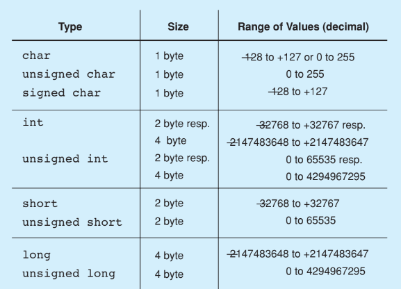

# Estruturas de Dados Orientadas a Objetos

> Material do curso: [site da disciplina (CIn/UFPE)](https://sites.google.com/cin.ufpe.br/edoo)

---

## Especificidades de C++

C++ é uma linguagem orientada a objetos com **grande controle sobre a memória** — ao contrário de linguagens como Java ou Python, o próprio programador decide quando alocar e desalocar memória, o que é essencial para implementar estruturas de dados eficientes.

### Tipos primitivos

C++ oferece uma variedade de tipos inteiros e de ponto flutuante, cada um com um intervalo de valores e um tamanho em memória diferentes:

**Tipos inteiros e `char`:**

| Type | Size | Range of Values (decimal) |
|---|---|---|
| `char` | 1 byte | -128 a +127 ou 0 a 255 |
| `unsigned char` | 1 byte | 0 a 255 |
| `signed char` | 1 byte | -128 a +127 |
| `int` | 2 bytes resp. 4 bytes | -32768 a +32767 resp. -2147483648 a +2147483647 |
| `unsigned int` | 2 bytes resp. 4 bytes | 0 a 65535 resp. 0 a 4294967295 |
| `short` | 2 bytes | -32768 a +32767 |
| `unsigned short` | 2 bytes | 0 a 65535 |
| `long` | 4 bytes | -2147483648 a +2147483647 |
| `unsigned long` | 4 bytes | 0 a 4294967295 |

**Tipos de ponto flutuante:**

| Type | Size | Range of Values | Lowest Positive Value | Accuracy (decimal) |
|---|---|---|---|---|
| `float` | 4 bytes | -3.4E+38 | 1.2E-38 | 6 dígitos |
| `double` | 8 bytes | -1.7E+308 | 2.3E-308 | 15 dígitos |
| `long double` | 10 bytes | -1.1E+4932 | 3.4E-4932 | 19 dígitos |

??? note "Fotos do livro-texto (tabelas de tipos)"
    

    

A linguagem também define uma sequência de **caracteres especiais** (sequências de escape, como `\n`, `\t`, `\\`), usadas para representar caracteres que não podem ser digitados diretamente em uma string:

| Caractere | Significado | Código ASCII (decimal) |
|---|---|---|
| `\a` | alert (BEL) | 7 |
| `\b` | backspace (BS) | 8 |
| `\t` | horizontal tab (HT) | 9 |
| `\n` | line feed (LF) | 10 |
| `\v` | vertical tab (VT) | 11 |
| `\f` | form feed (FF) | 12 |
| `\r` | carriage return (CR) | 13 |
| `\"` | " (double quote) | 34 |
| `\'` | ' (single quote) | 39 |
| `\?` | ? (question mark) | 63 |
| `\\` | \ (backslash) | 92 |
| `\0` | caractere terminador de string | 0 |
| `\ooo` (até 3 dígitos octais) | valor numérico de um caractere | ooo (octal) |
| `\xhh` (dígitos hexadecimais) | valor numérico de um caractere | hh (hexadecimal) |

??? note "Foto do livro-texto (tabela de caracteres especiais)"
    

### Macros

**Macros** são comandos que permitem a substituição de texto *antes* de o código ser compilado, usando a diretiva `#define`:

```cpp
#define DELAY  10000000L
#define CLS    (cout << "\033[2J")          // Clear screen
#define LOCATE(z,s) (cout << "\033[" << z << ';' << s << 'H') // Positiona o cursor
```

??? note "Foto do livro-texto (exemplo de macros)"
    

Além do `#define`, o pré-processador do C++ oferece outras diretivas relacionadas:

| Diretiva | Função |
|---|---|
| `#define` | Define um macro ou uma substituição de texto. |
| `#undef` | Cancela a definição de um macro. |
| `#ifdef` | Executa o bloco de código se o macro foi definido. |
| `#ifndef` | Executa o bloco de código se o macro *não* foi definido. |
| `#if` | Executa um bloco de código se a expressão for verdadeira. |
| `#elif` | Adiciona uma condição "else if" a um `#if`. |
| `#else` | Define um bloco de código a ser executado caso nenhuma condição anterior seja verdadeira. |
| `#endif` | Finaliza um bloco iniciado por `#ifdef`, `#ifndef` ou `#if`. |

### Header files

**Header files** (arquivos de cabeçalho) são arquivos de texto contendo declarações e macros. Usando a diretiva `#include`, essas declarações e macros passam a poder ser utilizadas no arquivo atual — exemplos conhecidos são `<iostream>` e `<string>`. Além das bibliotecas padrão, também é possível criar os próprios header files, separando a interface (o header) da implementação de uma funcionalidade.

### iostream

`<iostream>` é o header file para entrada e saída (*input/output*). Ele contém as *stream classes* `istream` e `ostream`, ambas derivadas da classe `ios` — que atua como interface comum para as duas, e que, por sua vez, é derivada de `ios_base`. Há também `ifstream`, `ofstream` e `fstream`, classes derivadas de `istream`, `ostream` e `iostream`, respectivamente, usadas para ler, escrever, ou ler e escrever em arquivos.

#### Manipuladores

**Manipuladores** são funções que podem ser inseridas e chamadas diretamente no fluxo de entrada/saída, para alterar a formatação da saída. Para usá-los, é preciso incluir a biblioteca `<iomanip>`.

| Manipulador | Efeito |
|---|---|
| `showpos` | Exibe explicitamente o sinal `+` para números positivos. |
| `noshowpos` | Comportamento padrão — oposto de `showpos`. |
| `oct` | Exibe o número na base octal. |
| `hex` | Exibe o número na base hexadecimal. |
| `dec` | Exibe o número na base decimal (padrão). |
| `uppercase` | Exibe todas as letras em maiúsculas. |
| `nouppercase` | Comportamento padrão — oposto de `uppercase`. |
| `showpoint` | Mostra o caractere de ponto após a parte inteira, independentemente de ser um valor float ou não, seguido dos dígitos correspondentes à precisão definida. |
| `noshowpoint` | Comportamento padrão — oposto de `showpoint`. |
| `fixed` | Exibe em notação de ponto fixo, com um número fixo de casas decimais (é preciso definir a precisão antes). |
| `scientific` | Exibe em notação científica. |
| `setprecision(int n)` | Define a precisão (número de dígitos) de um `float` ou `double`. |

Os manipuladores atuam sobre *fields* (campos) específicos da formatação, por meio de métodos e manipuladores dedicados:

**Element functions for output in fields:**

| Método | Efeito |
|---|---|
| `int width() const;` | Retorna o field width mínimo usado. |
| `int width(int n);` | Define o field width mínimo como `n`. |
| `int fill() const;` | Retorna o caractere de preenchimento usado. |
| `int fill(int ch);` | Define o caractere de preenchimento como `ch`. |

**Manipulators for output in fields:**

| Manipulador | Efeito |
|---|---|
| `setw(int n)` | Define o field width mínimo como `n`. |
| `setfill(int ch)` | Define o caractere de preenchimento como `ch`. |
| `left` | Alinha a saída à esquerda nos campos. |
| `right` | Alinha a saída à direita nos campos. |
| `internal` | Alinha o sinal à esquerda e o valor numérico à direita. |

??? note "Fotos do livro-texto (tabelas de manipuladores de campo)"
    

    

O método **`.setf()`** faz parte da classe `std::ios`, sendo, portanto, aplicável a todas as classes de `iostream`. Ele é usado para configurar *flags* que definem o comportamento de uma stream. Sua sintaxe é `stream.setf(flag, mask)`, em que `flag` define qual funcionalidade se quer modificar, e `mask` (opcional) determina qual configuração está sendo modificada — por exemplo, `cout.setf(std::ios::showpos)`. O método **`.unsetf()`** faz o inverso de `.setf()`.

Como alternativa a `cin` e `cout`, existem os métodos `.get(char ch)` e `.put(char ch)`, para ler e escrever um único caractere, e `.getline(cin, text, delimiter)`, para ler strings inteiras usando `.put()` internamente para escrever. A diferença central é que `cin` lê apenas até o primeiro espaço em branco, enquanto `getline` lê até encontrar o primeiro `\n`.

### Strings

Strings em C++ (via `std::string`) suportam uma série de operações convenientes:

- Podem ser **concatenadas** usando o operador `+`.
- Podem ser **comparadas** usando os operadores de comparação usuais (`==`, `<`, `>` etc.).
- É possível **inserir** caracteres em posições específicas com `.insert()`, e **apagar** porções da string com `.erase()`. Também é possível **substituir** porções de uma string.
- Para **encontrar** caracteres ou palavras dentro de uma string, usa-se `.find()`.
- Para **acessar** um caractere específico, basta usar índices (`str[i]`).

### Funções

Em C++, é possível declarar **protótipos de funções** separadamente da sua implementação — útil para organizar código em arquivos de cabeçalho. Quando uma função é chamada, a pilha de execução (*stack*) do programa registra o estado da chamada: ao entrar na função (`push`), são empilhados, de baixo para cima, o último parâmetro, ..., o primeiro parâmetro, o **return address** (endereço de retorno) e outros objetos locais; ao retornar (`pop`), essa pilha é desempilhada na ordem inversa.

??? note "Foto do livro-texto (pilha de execução de uma chamada de função)"
    

Uma **inline function** é uma função em que o compilador tenta expandir o próprio corpo da função diretamente no ponto onde ela é chamada, em vez de realizar uma chamada de função tradicional (com todo o custo de salvar/restaurar a pilha). O compilador já considera, por padrão, que funções definidas dentro de uma classe são inline — não é preciso usar explicitamente a palavra-chave `inline`, a não ser que o compilador decida que a função é muito grande, envolve operações complexas demais, ou que a expansão inline não traria ganho de desempenho. Inline é útil, portanto, para funções pequenas e simples.

### Storage class

Uma **storage class** define como e onde uma variável é armazenada, seu tempo de vida, seu escopo e sua visibilidade — ou seja, determina propriedades de uma variável relacionadas ao gerenciamento de memória e ao contexto de execução.

| Storage Class | Tempo de vida | Escopo | Visibilidade | Uso comum |
|---|---|---|---|---|
| `auto` | Escopo local | Local | Somente dentro do escopo | Dedução de tipo moderno (C++11 em diante). |
| `register` | Escopo local | Local | Somente dentro do escopo | Variáveis de acesso rápido (uso mais antigo). |
| `static` | Duração de todo o programa | Local ou global | Depende do contexto | Persistência de valor, ou ligação interna. |
| `extern` | Duração de todo o programa | Global | Entre arquivos | Compartilhamento de variáveis globais. |
| `mutable` | Depende do objeto | Classe | Acessível mesmo em objetos `const` | Modificável em objetos `const`. |
| `thread_local` | Durante a execução da thread | Local, global | Separado para cada thread | Dados específicos por thread. |

#### `extern`

A palavra-chave `extern` indica que uma variável ou função é *definida* em outro arquivo ou escopo, permitindo que ela seja usada em múltiplos arquivos do mesmo programa. Funciona como uma **declaração** (informando ao compilador que algo existe), enquanto a **definição** real (onde a memória de fato é alocada) precisa ser fornecida em outro lugar.

```cpp
// main.cpp

#include <iostream>
using namespace std;

extern int x; // Declaração: "x" está definido em outro lugar

int main() {
    cout << "Valor de x: " << x << endl;
    return 0;
}

// global.cpp
int x = 42; // Definição: "x" é inicializado aqui
```

A compilação e a linkedição desse exemplo ocorrem em etapas separadas:

1. Compilação: `g++ -c main.cpp` e `g++ -c global.cpp`.
2. Linkedição: `g++ main.o global.o -o programa`.

### Namespace

Um **namespace** é uma forma de organizar e agrupar identificadores, usada para evitar conflitos de nomes — especialmente importante em projetos grandes, nos quais diferentes bibliotecas podem usar o mesmo nome para funções diferentes.

!!! example "Sem namespace"
    ```cpp
    #include <iostream>
    using namespace std;

    // Duas funções com o mesmo nome em escopos globais causariam conflito:
    void imprime() {
        cout << "Função 1" << endl;
    }

    void imprime() { // Erro de redefinição
        cout << "Função 2" << endl;
    }

    int main() {
        imprime();
        return 0;
    }
    ```

!!! example "Com namespace"
    ```cpp
    #include <iostream>
    using namespace std;

    namespace Lib1 {
        void imprime() {
            cout << "Função da Lib1" << endl;
        }
    }

    namespace Lib2 {
        void imprime() {
            cout << "Função da Lib2" << endl;
        }
    }

    int main() {
        Lib1::imprime(); // Chama a função da Lib1
        Lib2::imprime(); // Chama a função da Lib2
        return 0;
    }
    ```

Namespaces são importados para o escopo atual por meio de `using` (podendo-se importar apenas elementos específicos de um namespace, em vez de todo ele), e também podem ser **aninhados**:

```cpp
namespace Lib {
    namespace Util {
        void funcao() {
            std::cout << "Dentro do Lib::Util" << std::endl;
        }
    }
}

int main() {
    Lib::Util::funcao(); // Acessa o namespace aninhado
    return 0;
}
```

### Ponteiros

Um **ponteiro** é um tipo de variável cujo valor corresponde a um endereço de memória de uma outra variável ou estrutura. Ponteiros são úteis porque permitem o uso de memória dinâmica, deixando o programa mais rápido e eficiente — em vez de copiar valores grandes, basta copiar o endereço onde eles estão armazenados.

### Arrays e ponteiros

Em C++, arrays e ponteiros estão intimamente relacionados: o nome de um array, por si só, já se comporta como um ponteiro para o seu primeiro elemento. Dado um array `arr`, a relação entre o ponteiro e os elementos é:

| Expressão | Aponta para | Equivalente a |
|---|---|---|
| `arr` | `arr[0]` | — |
| `arr + 1` | `arr[1]` | — |
| `arr + 2` | `arr[2]` | — |
| `arr + 3` | `arr[3]` | — |

??? note "Foto do livro-texto (relação entre ponteiros e elementos do array)"
    

Por exemplo, em `int* ptr = arr;`, o ponteiro `ptr` passa a apontar para `arr[0]`. A partir disso, as três formas de expressão abaixo são equivalentes: **`&arr[i]`**, **`arr + i`** e **`ptr + i`**.

??? note "Foto do livro-texto (formas equivalentes de endereço)"
    

E, de forma mais geral, as quatro formas abaixo também são equivalentes entre si: **`arr[i]`**, **`*(arr + i)`**, **`*(ptr + i)`** e **`ptr[i]`**.

??? note "Foto do livro-texto (formas equivalentes de acesso)"
    

### Exception handling (tratamento de exceções)

C++ oferece blocos **`try`-`catch`** para tratamento de exceções, permitindo capturar e lidar com erros em tempo de execução sem que o programa simplesmente aborte.

---

## Orientação a Objetos

### Especificidades em C++

Em C++, objetos são construídos por meio de **classes**, que possuem atributos e métodos — cada um deles podendo ser público, privado ou protegido. Uma classe costuma ser dividida em dois arquivos: um arquivo de **cabeçalho** (`.h`), com a declaração da interface, e um arquivo de **implementação** (`.cpp`). Essa separação permite que outras partes do código utilizem a classe sem precisar conhecer os detalhes da sua implementação, garantindo **modularidade**.

No arquivo de teste de uma classe, não é preciso incluir o arquivo de implementação — em vez disso, é melhor fazer esse link apenas na etapa de compilação.

!!! example "Exemplo: compilação separada"
    Dados os arquivos `myClass.h`, `myClass.cpp` e `myClass_t.cpp` (o arquivo de teste):

    1. **Compilação**: `g++ -c myClass.cpp` gera `myClass.o`; `g++ -c myClass_t.cpp` gera `myClass_t.o`.
    2. **Linkedição**: `g++ myClass.o myClass_t.o -o programa` gera o executável.

Para acessar os membros de um objeto, basta usar o operador `.`. Quando se tem um **ponteiro para um objeto**, em vez de `.` usa-se `->`.

Em C++, `struct`s também podem ser usados para criar objetos, mas, por padrão, **todos os atributos de uma `struct` são públicos**. Também existem as `union`s, nas quais todos os membros compartilham a mesma posição de memória — ou seja, apenas um membro pode estar "ativo" (com valor válido) por vez — e os `enum`s, um conjunto de valores constantes associados a números inteiros, usados principalmente para representar conjuntos de estados ou valores fixos.

!!! note
    Na prática, o mais comum é usar **classes**, pois dão suporte total à programação orientada a objetos (encapsulamento, herança, polimorfismo). `struct`s dão algum suporte, mas não é o foco; `union`s e `enum`s não têm suporte a POO de fato.

As classes possuem **construtores** (podendo existir mais de um, diferenciando-se nos parâmetros — sobrecarga) e um **destrutor**; ambos são implicitamente tratados como inline functions pelo compilador.

Para acessar atributos privados de forma controlada, a boa prática é criar métodos públicos que retornam (**getters**) ou modificam (**setters**) esses atributos, em vez de expô-los diretamente.

Dentro de uma classe, existe um ponteiro embutido chamado **`this`**, que representa a própria instância do objeto sendo manipulada dentro de um método. Classes também podem ser usadas como tipo de retorno de uma função, podem ter **atributos constantes** (que não podem ser alterados após inicializados), e **métodos estáticos** devem manipular apenas atributos estáticos (já que não têm acesso a um objeto `this` específico).

#### Operadores

Os operadores convencionais (`+`, `-`, `==` etc.) podem ser **reprogramados** (sobrecarregados) para uma classe, por exemplo, para uma classe `DayTime`:

```cpp
bool operator<(const DayTime& t) const // compare *this and t
{
    return asSeconds() < t.asSeconds();
}

DayTime& operator++() // Increment seconds and handle overflow.
{
    ++second;
    return *this;
}
```

??? note "Foto do livro-texto (sobrecarga de operadores)"
    

Com isso, objetos de uma classe podem ser usados em operações aritméticas e lógicas, e o que acontece exatamente depende de como o operador foi implementado para aquela classe.

#### `friend`

`friend` é uma palavra-chave que permite que uma função, ou outra classe, tenha **acesso privilegiado** aos membros privados de uma classe. Apesar de não ser parte da própria classe, um "amigo" pode acessar seus dados como se fosse um membro dela — podendo, inclusive, ser tratado como uma função global.

!!! example "Friend functions"
    Uma função amiga é externa à classe, mas pode acessar seus membros privados e protegidos.

    ```cpp
    #include <iostream>
    using namespace std;

    class MyClass {
    private:
        int value;

    public:
        MyClass(int val) : value(val) {}

        // Declarando a função amiga
        friend void display(const MyClass& obj);
    };

    // Função amiga
    void display(const MyClass& obj) {
        cout << "Valor privado: " << obj.value << endl;
    }

    int main() {
        MyClass obj(42);
        display(obj); // Acessa diretamente o membro privado
        return 0;
    }
    ```

!!! example "Friend classes"
    Quando uma classe é declarada como amiga de outra, todos os métodos da classe amiga podem acessar os membros privados/protegidos da classe que a declarou.

    ```cpp
    #include <iostream>
    using namespace std;

    class ClassA {
    private:
        int privateValue;

    public:
        ClassA(int val) : privateValue(val) {}

        // Tornando ClassB amiga
        friend class ClassB;
    };

    class ClassB {
    public:
        void display(const ClassA& obj) {
            cout << "Valor privado de ClassA: " << obj.privateValue << endl;
        }
    };

    int main() {
        ClassA objA(42);
        ClassB objB;
        objB.display(objA); // ClassB acessa membro privado de ClassA
        return 0;
    }
    ```

!!! example "Funções-membro de outra classe como amigas"
    É possível tornar apenas uma função específica de outra classe amiga, em vez de a classe inteira.

    ```cpp
    #include <iostream>
    using namespace std;

    class ClassA;

    class ClassB {
    public:
        void display(const ClassA& obj);
    };

    class ClassA {
    private:
        int privateValue;

    public:
        ClassA(int val) : privateValue(val) {}

        // Tornando apenas ClassB::display amiga
        friend void ClassB::display(const ClassA& obj);
    };

    void ClassB::display(const ClassA& obj) {
        cout << "Valor privado de ClassA: " << obj.privateValue << endl;
    }

    int main() {
        ClassA objA(42);
        ClassB objB;

        objB.display(objA); // Apenas esta função pode acessar membros privados
        return 0;
    }
    ```

!!! example "Reciprocal friendship"
    Duas classes podem ser amigas uma da outra, permitindo acesso mútuo aos seus membros privados.

    ```cpp
    #include <iostream>
    using namespace std;

    class ClassB; // Declaração antecipada

    class ClassA {
    private:
        int valueA;

    public:
        ClassA(int val) : valueA(val) {}

        friend class ClassB; // ClassB é amiga de ClassA
    };

    class ClassB {
    private:
        int valueB;

    public:
        ClassB(int val) : valueB(val) {}

        void display(const ClassA& obj) {
            cout << "Valor privado de ClassA: " << obj.valueA << endl;
        }

        friend class ClassA; // ClassA é amiga de ClassB
    };

    int main() {
        ClassA objA(42);
        ClassB objB(100);

        objB.display(objA); // ClassB acessa membro privado de ClassA
        return 0;
    }
    ```

#### `explicit`

A palavra-chave `explicit` é usada para evitar **conversões implícitas (ou involuntárias)** de objetos, ao usar construtores de um único parâmetro.

```cpp
#include <iostream>
using namespace std;

class MyClass {
public:
    MyClass(int x) { // Construtor de um único parâmetro
        cout << "Construtor chamado com: " << x << endl;
    }
};

int main() {
    MyClass obj = 42; // Conversão implícita de int para MyClass
    return 0;
}
```

```cpp
#include <iostream>
using namespace std;

class MyClass {
public:
    explicit MyClass(int x) { // Construtor marcado como explicit
        cout << "Construtor chamado com: " << x << endl;
    }
};

int main() {
    // MyClass obj = 42; // ERRO: Conversão implícita não permitida
    MyClass obj(42);      // OK: Construção explícita
    return 0;
}
```

#### Templates

Em C++, é possível criar código genérico usando **templates**, permitindo que funções e classes trabalhem com diferentes tipos de dados sem precisar ser reescritas para cada tipo específico.

!!! example "Template de função"
    ```cpp
    #include <iostream>
    using namespace std;

    template <typename T> // Define um tipo genérico T
    T add(T a, T b) {
        return a + b;
    }

    int main() {
        cout << add(3, 4) << endl;        // Funciona com int
        cout << add(2.5, 3.1) << endl;    // Funciona com double
        cout << add(string("Hello, "), string("World!")) << endl; // Funciona com string
        return 0;
    }
    ```

!!! example "Template de classe"
    ```cpp
    #include <iostream>
    using namespace std;

    template <typename T>
    class Box {
    private:
        T value;

    public:
        Box(T val) : value(val) {}

        void display() {
            cout << "Value: " << value << endl;
        }
    };

    int main() {
        Box<int> intBox(10);    // Classe Box com int
        Box<double> doubleBox(3.14); // Classe Box com double
        Box<string> stringBox("Hello"); // Classe Box com string

        intBox.display();
        doubleBox.display();
        stringBox.display();

        return 0;
    }
    ```

!!! example "Templates variádicos"
    ```cpp
    #include <iostream>
    using namespace std;

    template <typename... Args>
    void printAll(Args... args) {
        (cout << ... << args) << endl; // Expansão do parâmetro variádico
    }

    int main() {
        printAll(1, 2, 3, "Hello", 4.5); // Mistura de tipos
        return 0;
    }
    ```

!!! example "Templates com especialização"
    ```cpp
    #include <iostream>
    using namespace std;

    template <typename T>
    class Box {
    public:
        void display(T value) {
            cout << "Genérico: " << value << endl;
        }
    };

    // Especialização para int
    template <>
    class Box<int> {
    public:
        void display(int value) {
            cout << "Específico para int: " << value << endl;
        }
    };

    int main() {
        Box<double> doubleBox;
        Box<int> intBox;

        doubleBox.display(3.14);
        intBox.display(42);

        return 0;
    }
    ```

### Herança

**Herança** é o conceito que permite que uma classe (chamada de **classe derivada**) herde as características de outra classe (a **classe base**), promovendo reutilização de código e extensibilidade — permitindo criar novas classes com base em uma classe já existente.

```cpp
#include <iostream>
using namespace std;

// Classe Base
class Animal {
public:
    void eat() {
        cout << "Este animal está comendo." << endl;
    }
};

// Classe Derivada
class Dog : public Animal {
public:
    void bark() {
        cout << "O cachorro está latindo." << endl;
    }
};

int main() {
    Dog myDog;
    myDog.eat();  // Método herdado de Animal
    myDog.bark(); // Método específico de Dog
    return 0;
}
```

Nesse exemplo, a classe `Dog` herda o método `eat()` de `Animal`, além de ter seu próprio método `bark()`.

Em C++, o tipo de herança é determinado pelo especificador de acesso usado (`public`, `protected` ou `private`). Um caso especial é o modificador **`protected`**: membros protegidos são inacessíveis diretamente fora da classe, mas são acessíveis pelas classes que herdam dela.

| Aspecto | `private` | `protected` |
|---|---|---|
| Acesso direto | Apenas pela própria classe. | Pela própria classe e classes derivadas. |
| Classes derivadas | Não podem acessar membros `private` diretamente. | Podem acessar membros `protected` diretamente. |
| Objetivo | Esconde completamente os membros de outros contextos. | Oferece acesso controlado para classes derivadas. |

??? note "Foto do livro-texto (private vs. protected)"
    

Os construtores da classe base **não são herdados automaticamente**, mas podem (e normalmente devem) ser chamados explicitamente a partir da classe derivada.

```cpp
#include <iostream>
using namespace std;

class Animal {
public:
    Animal() {
        cout << "Animal criado." << endl;
    }
};

class Dog : public Animal {
public:
    Dog() {
        cout << "Cachorro criado." << endl;
    }
};

int main() {
    Dog myDog;
    return 0;
}
```

A saída desse programa é:

```
Animal criado.
Cachorro criado.
```

— ou seja, o construtor da classe base é chamado implicitamente antes do construtor da classe derivada.

#### Herança múltipla

C++ permite que uma classe herde de mais de uma classe base ao mesmo tempo:

```cpp
#include <iostream>
using namespace std;

class Animal {
public:
    void eat() { cout << "Comendo..." << endl; }
};

class Pet {
public:
    void play() { cout << "Brincando..." << endl; }
};

class Dog : public Animal, public Pet {
    // Herda membros de Animal e Pet
};

int main() {
    Dog myDog;
    myDog.eat();
    myDog.play();
    return 0;
}
```

#### Herança e construtores

A classe derivada sempre chama o construtor da classe base — seja de forma explícita (indicando qual construtor da base usar) ou implícita (usando o construtor padrão da base). Além disso, a classe derivada pode possuir seus próprios construtores, com parâmetros adicionais específicos dela.

### Polimorfismo

**Polimorfismo** é a capacidade de uma função, método ou objeto assumir diferentes formas — ou seja, o mesmo nome de função/método pode ser usado para realizar comportamentos diferentes, dependendo do contexto em que é chamado. Em C++, existem dois grandes tipos de polimorfismo: **estático** (decidido em tempo de compilação) e **dinâmico** (decidido em tempo de execução).

#### Polimorfismo estático (static polymorphism)

É resolvido pelo compilador, antes mesmo do programa executar. Existem três mecanismos principais:

**Sobrecarga de funções** — permite que várias funções tenham o mesmo nome, mas assinaturas diferentes (tipos ou número de parâmetros):

```cpp
#include <iostream>
using namespace std;

class Math {
public:
    int add(int a, int b) {
        return a + b;
    }

    double add(double a, double b) {
        return a + b;
    }
};

int main() {
    Math math;
    cout << math.add(3, 4) << endl;       // Chama add(int, int)
    cout << math.add(2.5, 3.1) << endl;  // Chama add(double, double)
    return 0;
}
```

**Sobrecarga de operadores** — permite redefinir o comportamento de operadores para tipos definidos pelo usuário:

```cpp
#include <iostream>
using namespace std;

class Complex {
private:
    double real, imag;

public:
    Complex(double r, double i) : real(r), imag(i) {}

    // Sobrecarga do operador +
    Complex operator+(const Complex& c) {
        return Complex(real + c.real, imag + c.imag);
    }

    void display() {
        cout << real << " + " << imag << "i" << endl;
    }
};

int main() {
    Complex c1(1.0, 2.0), c2(3.0, 4.0);
    Complex c3 = c1 + c2; // Usa o operador sobrecarregado
    c3.display();
    return 0;
}
```

**Templates** — permitem criar funções ou classes genéricas que se adaptam a diferentes tipos de dados, como visto anteriormente:

```cpp
#include <iostream>
using namespace std;

template <typename T>
T add(T a, T b) {
    return a + b;
}

int main() {
    cout << add(3, 4) << endl;       // Trabalha com int
    cout << add(2.5, 3.1) << endl;  // Trabalha com double
    return 0;
}
```

#### Polimorfismo dinâmico (dynamic polymorphism)

É resolvido em tempo de **execução**, por meio de **funções virtuais**.

Uma função virtual consiste, basicamente, em sobrescrever um método de uma classe base em uma classe derivada, para alterar seu comportamento. A palavra-chave **`virtual`** é usada para declarar, na classe base, um método que pode ser sobrescrito por classes derivadas; a palavra-chave **`override`** é usada na classe derivada para indicar explicitamente que um método está sobrescrevendo o método virtual correspondente da base.

```cpp
#include <iostream>
using namespace std;

class Animal {
public:
    virtual void sound() {
        cout << "Animal faz algum som." << endl;
    }
};

class Dog : public Animal {
public:
    void sound() override {
        cout << "O cachorro late." << endl;
    }
};

int main() {
    Dog myDog;
    myDog.sound(); // Chama a versão sobrescrita de Dog
    return 0;
}
```

A saída é `O cachorro late.` — mesmo que a chamada seja feita através de um ponteiro para `Animal`, o método efetivamente executado é o de `Dog`, graças ao polimorfismo dinâmico.

!!! note "Destrutores virtuais, mas não construtores"
    Destrutores podem (e, em hierarquias polimórficas, devem) ser virtuais, mas **construtores não podem ser virtuais**. Como alternativa a um "construtor virtual", pode-se usar o padrão de **fábrica virtual** (*virtual factory*), que consiste em criar um método virtual que retorna uma nova instância da classe derivada correspondente.

    ```cpp
    #include <iostream>
    using namespace std;

    class Base {
    public:
        virtual Base* create() const = 0; // Método "virtual construtor"
        virtual void display() const = 0;
        virtual ~Base() = default; // Destrutor virtual
    };

    class Derived : public Base {
    public:
        Derived* create() const override {
            return new Derived();
        }

        void display() const override {
            cout << "Derived class" << endl;
        }
    };

    int main() {
        Base* obj = new Derived();
        Base* newObj = obj->create(); // Cria um novo objeto de Derived

        newObj->display();

        delete obj;
        delete newObj;
        return 0;
    }
    ```

#### Classes abstratas

Uma **classe abstrata** possui pelo menos uma função **puramente virtual** (sem implementação própria), que é usada como base para a criação de outras classes. Uma classe abstrata não pode ser instanciada diretamente — apenas suas subclasses concretas, que implementam todos os métodos puramente virtuais.

```cpp
#include <iostream>
using namespace std;

class Shape {
public:
    virtual void draw() = 0; // Função puramente virtual
};

class Circle : public Shape {
public:
    void draw() override {
        cout << "Desenhando um círculo." << endl;
    }
};

class Square : public Shape {
public:
    void draw() override {
        cout << "Desenhando um quadrado." << endl;
    }
};

int main() {
    Shape* shape1 = new Circle();
    Shape* shape2 = new Square();

    shape1->draw(); // Chama Circle::draw
    shape2->draw(); // Chama Square::draw

    delete shape1;
    delete shape2;
    return 0;
}
```

---

## Tipos Abstratos de Dados e Estruturas de Dados

Antes de estudar estruturas de dados específicas, é importante entender a terminologia precisa que as fundamenta — os termos "tipo", "item de dado", "tipo de dado" e "tipo abstrato de dado" costumam ser usados de forma intercambiável no dia a dia, mas têm significados técnicos distintos:

- **Type (tipo)** — é uma coleção de valores possíveis. No caso do `bool`, por exemplo, a coleção de valores consiste apenas em `true` e `false`.
- **Data item (item de dado)** — é uma peça de informação cujo valor vem de um type. Um data item é um *membro* do type correspondente.
- **Data type (tipo de dado)** — é o type, *juntamente com* a coleção de operações que manipulam esse type. Por exemplo, a operação de soma sobre o type `int`.
- **Abstract Data Type (ADT, tipo abstrato de dado)** — é, basicamente, o data type tratado como um componente de *software* (e não de *hardware*) — ou seja, a especificação do comportamento, independente de como ele é implementado.
- **Data structure (estrutura de dados)** — é a *implementação* do ADT.

Em linguagens orientadas a objetos, o ADT, juntamente com sua implementação, corresponde a uma **classe**, e cada operação associada ao ADT é implementada por um **método**. Um **objeto** é uma instância de uma classe — algo criado que efetivamente ocupa espaço de armazenamento durante a execução do programa. As variáveis que definem o espaço necessário para armazenar um item de dado são chamadas de **data members** (membros de dado).

!!! quote "Data structure vs. file structure"
    O termo "data structure" costuma se referir a dados armazenados na memória principal de um computador. O termo relacionado **file structure** costuma se referir à organização de dados em armazenamento periférico, como um disco rígido ou CD.

??? note "Foto do livro-texto (trecho original)"
    

### Listas

Uma **lista** é uma sequência finita e ordenada de itens de dado, conhecidos como *elements* (elementos). "Ordenada" aqui significa que cada elemento tem uma **posição** definida dentro da lista — não necessariamente que os valores estejam em ordem crescente/decrescente. Cada elemento possui um data type, e uma lista pode, inclusive, conter elementos de mais de um data type diferente.

O conceito mais importante em uma lista é justamente a **posição**: ter a noção clara de qual é o primeiro elemento, o segundo, e assim por diante. Quando a lista está vazia, significa que não há nenhum elemento dentro dela.

Alguns termos de vocabulário usados ao longo do estudo de listas:

- **Length (tamanho)** — o número de elementos da lista.
- **Head (cabeça)** — o início da lista.
- **Tail (cauda)** — o final da lista.

Os elementos de uma lista podem estar **ordenados** (*sorted lists*), caso em que os elementos aparecem em uma ordem específica de valor (por exemplo, crescente).

Ao criar uma classe de lista, é comum definir um "tipo" genérico `E`, que serve como um espaço reservado (*placeholder*) para qualquer tipo de elemento. Isso evita, por exemplo, que seja necessário escrever uma implementação de lista separada para `char` e outra para `int` — a mesma implementação genérica, parametrizada por `E`, serve para ambos os casos (na prática, isso é feito em C++ usando *templates*).

#### Operações básicas

Para implementar os métodos de uma lista, é preciso ter conhecimento constante sobre qual é a **posição atual** dentro da lista. Os métodos típicos de uma lista são:

| Método | Função |
|---|---|
| `clear` | Deixa a lista vazia. |
| `insert` | Insere um elemento na posição atual. |
| `append` | Adiciona um elemento ao final da lista. |
| `remove` | Remove o elemento na posição atual. |
| `moveToStart` | Faz a posição atual passar a ser o início da lista. |
| `moveToEnd` | Faz a posição atual passar a ser o fim da lista. |
| `prev` | Move a posição atual uma posição para a esquerda (-1 no índice). |
| `next` | Move a posição atual uma posição para a direita (+1 no índice). |
| `length` | Retorna o tamanho atual da lista. |
| `currPos` | Retorna a posição atual. |
| `moveToPos` | Move a posição atual para uma posição específica, escolhida como parâmetro. |
| `getValue` | Retorna o valor armazenado na posição atual. |

Esse conjunto de métodos é apenas o conjunto básico — é possível (e comum) adicionar outros métodos, dependendo das necessidades de cada aplicação específica.

#### Abordagens de implementação

Existem duas grandes famílias de implementação de listas, com trade-offs opostos entre si.

##### Listas baseadas em array (Array-Based List)

Nessa abordagem, os elementos são armazenados em posições de memória contíguas, formando um array. Cada elemento tem um índice fixo, correspondente à sua posição no array.

```cpp
#include <iostream>

using namespace std;
#define DEFAULT_SIZE = 5

// esse tipo E é um tipo arbitrário, podemos tirar o E e substituir
// por int por exemplo, e tiramos o template
template <typename E>
class ArrList {
private:
    int maxSize;
    int listSize;
    int curr;
    E *listArray;
public:
    explicit ArrList(int size = DEFAULT_SIZE) {
        maxSize = size;
        listSize = curr = 0;
        listArray = new E[maxSize];
	    }

    void clear() {
        delete[] listArray;
        listSize = curr = 0;
        listArray = new E[maxSize];
    }

    void insert(E value) {
        if (listSize >= maxSize) {
            cerr << "Error! List is full";
            exit(1);
        }

        int i = listSize;

        while (i > curr) {
            listArray[i] = listArray[i - 1];
            i--;
        }

        listArray[curr] = value;
        listSize++;
    }

    void moveToStart() {
        curr = 0;
    }

    void moveToEnd() {
        curr = listSize;
    }

    void prev() {
        if (curr != 0) {
            curr--;
        }
    }

    void next() {
        if (curr < listSize){
            curr++;
        }
    }

    void append(E it) {
        if (listSize < maxSize) {
            cerr << "Error! List is full";
            exit(1);
        }

        listArray[listSize++] = it;
    }

    E remove() {
        if (curr < 0 || curr >= listSize) {
            return NULL;
        }

        E it = listArray[curr];
        E i = curr;

        while (i < listSize - 1) {
            listArray[i] = listArray[i + 1];
            i++;
        }

        listSize--;
        return it;
    }

    int length() {
        return listSize;
    }

    int currPos() {
        return curr;
    }

    void moveToPos(int pos) {
        if (pos >= 0 && pos <= listSize) {
            curr = pos;
        }
    }

    E getValue() {
        if (curr >= 0 && curr <= listSize) {
            return listArray[curr];
        }
    }

    ~ArrList() {
        delete[] listArray;
    }
};
```

##### Listas encadeadas (Linked List)

Essa abordagem utiliza ponteiros e alocação de memória dinâmica, em vez de um bloco contíguo de memória. Uma lista encadeada é formada por uma série de objetos chamados **nós** (*list nodes*). É boa prática implementar uma classe de nó separada: cada nó contém um campo para armazenar o valor do elemento, e um campo `next`, que armazena um ponteiro para o próximo nó da lista (já que cada nó precisa "saber" onde está o próximo).

Na classe da lista propriamente dita, costuma haver três ponteiros: um apontando para o início da lista (`head`), outro para o final (`tail`) e outro para a posição do elemento atual (`curr`). Diferentemente das listas baseadas em array, **não é preciso declarar um tamanho fixo** quando a lista encadeada é criada — por isso, o parâmetro de tamanho é dispensável nesse tipo de implementação.

??? note "Diagrama de referência (nó de uma lista encadeada simples)"
    

Existem ainda variações sobre a lista encadeada simples:

- **Doubly Linked Lists (listas duplamente encadeadas)** — cada nó mantém dois ponteiros: um para o próximo nó e outro para o nó anterior, permitindo percorrer a lista em ambas as direções.
- **Circular Linked Lists (listas circulares)** — o último nó da lista aponta de volta para o primeiro (em vez de apontar para `nullptr`), formando um ciclo.

??? note "Diagramas de referência (lista duplamente encadeada e lista circular)"
    

    

##### Array-based list vs. Linked list

A tabela a seguir resume os principais trade-offs entre as duas abordagens:

| | Lista baseada em array | Lista encadeada |
|---|---|---|
| **Tamanho** | Precisa ser predeterminado antes de alocar o array; só cresce até esse limite. | Cresce dinamicamente, sem limite predefinido. |
| **Uso de memória por elemento** | Não há desperdício — cada posição do array guarda só o elemento. | Cada nó precisa de um ponteiro extra, o que pode representar uma quantidade considerável de armazenamento adicional. |
| **Quando usar** | Quando o tamanho máximo é conhecido e estável, e o acesso aleatório por índice é frequente. | Na maioria dos casos — é a abordagem mais flexível, embora haja cenários específicos em que o array seja mais vantajoso. |

### Pilhas

Uma **pilha (stack)** é uma estrutura semelhante a uma lista, mas na qual os elementos só podem ser inseridos ou removidos por uma das extremidades (head ou tail). Existem, em princípio, duas disciplinas possíveis:

- **LIFO** (*Last In, First Out*) — o elemento inserido por último é o primeiro a sair.
- **FILO** (*First In, Last Out*) — o elemento inserido primeiro é o último a sair (equivalente a LIFO, apenas descrito do outro lado).

Na prática, quase sempre se usa a disciplina **LIFO**. O exemplo clássico para entender esse comportamento é uma pilha de pratos: o último prato colocado é o primeiro a ser removido. Essa restrição torna a pilha menos flexível do que uma lista genérica, mas não compromete sua eficiência — pelo contrário, é justamente essa restrição que permite implementações extremamente simples e rápidas.

??? note "Diagrama de referência (push/pop em uma pilha, LIFO)"
    

#### Operações básicas

| Método | Função |
|---|---|
| `clear` | Limpa a pilha. |
| `push` | Adiciona um elemento no topo da pilha. |
| `pop` | Remove o elemento do topo da pilha. |
| `topValue` | Retorna o elemento que está no topo da pilha, sem removê-lo. |
| `length` | Retorna a altura (número de elementos) da pilha. |

#### Abordagens de implementação

##### Pilhas baseadas em array

Nessa implementação, o array interno (`stackArray`) é criado com um tamanho fixo no momento em que a pilha é criada:

```cpp
#include <iostream>

using namespace std;

#define MAX 100;

// esse tipo E é um tipo arbitrário, podemos tirar o E e substituir
// por int por exemplo, e tiramos o template
template <typename E>
class ArrStack {
    int top;
public:
    int stackArray[MAX];

    ArrStack() {
        top = -1;
    }

    bool push(int x) {
        if (top >= (MAX - 1)) {
            cout << "Stack Overflow";
            return false;
        }

        else {
            stackArray[++top] = x;
            cout << x << " pushed into stack\n";
            return true;
        }
    }

    int pop() {
        if (top < 0) {
            cout << "Stack Underflow";
            return 0;
        }

        else {
            int x = stackArray[top--];
            return x;
        }
    }

    int topValue() {
        if (top < 0) {
            cout << "Stack is Empty";
            return 0;
        }

        else {
            int x = stackArray[top];
            return x;
        }
    }

    bool isEmpty() {
        return (top < 0);
    }

    int length() {
        return (top + 1);
    }
};
```

##### Pilhas encadeadas

Como, em uma pilha, só precisamos acessar o elemento do topo, **não** é necessário manter os três ponteiros usados em listas encadeadas (`head`, `tail`, `curr`) — basta um único ponteiro, apontando para o nó do topo da pilha. A lógica interna é, no mais, semelhante à de uma lista encadeada.

!!! note
    O material original do curso não trazia uma implementação completa em código para a pilha encadeada — apenas a descrição conceitual acima.

Ambas as abordagens (array e encadeada) são eficientes para as operações típicas de pilha (`push`, `pop`, `topValue`), todas em tempo O(1).

### Filas

Assim como as pilhas, as **filas (queues)** são estruturas semelhantes a uma lista, que fornecem acesso restrito aos seus elementos. A diferença central é a disciplina de acesso: os elementos são inseridos no **final** da fila (operação `enqueue`) e removidos do **início** da fila (operação `dequeue`) — seguindo a disciplina **FIFO** (*First In, First Out*).

??? note "Diagrama de referência (enqueue/dequeue em uma fila, FIFO)"
    

#### Operações básicas

| Método | Função |
|---|---|
| `clear` | Limpa a fila. |
| `enqueue` | Insere um novo elemento no final da fila. |
| `dequeue` | Remove o elemento do começo da fila. |
| `frontValue` | Retorna o elemento do começo da fila, sem removê-lo. |
| `rear` | Retorna o elemento do final da fila, sem removê-lo. |
| `length` | Retorna o tamanho da fila. |

#### Abordagens de implementação

##### Filas baseadas em array

```cpp
#include <iostream>

using namespace std;

#define MAX 100;

// esse tipo E é um tipo arbitrário, podemos tirar o E e substituir
// por int por exemplo, e tiramos o template
template <typename E>
class ArrQueue {
private:
   int front;
   int rear;
   E *queuearray;
public:
    ArrQueue() {
        front = rear = -1;
        queuearray = new E[MAX]
    }

    bool isEmpty() {
        return front == rear;
    }

    bool isFull() {
        return rear == MAX - 1;
    }

    void enqueue(E value) {
        if (isFull()) {
            cout << "Queue is full!" << endl;
            return;
        }

        rear++;
        queuearray[rear] = value;

        if (front == -1) {
            front = rear;
        }

        cout << value << "enqueued" << endl;
    }

    E dequeue() {
        if (isEmpty()) {
            cout << "Queue is empty!" << endl;
            return NULL;
        }

        E item = queuearray[front];
        front++;

        if (front == rear) {
            front = rear = -1;
        }

        return item;
    }

    E frontValue() {
        if (isEmpty()) {
            cout << "There is no front value" << endl;
            return NULL;
        }

        return queuearray[front];
    }

    E rearValue() {
        if (isEmpty()) {
            cout << "There is no rear value" << endl;
            return NULL;
        }

        return queuearray[rear];
    }
};
```

##### Filas encadeadas

Na implementação com lista encadeada, `front` e `rear` passam a ser **ponteiros** (em vez de índices inteiros), apontando para o primeiro e o último nó da fila, respectivamente — o que permite que a fila cresça dinamicamente, sem um limite de tamanho predefinido.

!!! note
    O material original do curso também não trazia uma implementação completa em código para a fila encadeada — apenas a observação conceitual acima.

---

## Sets

### Definição

Um **set (conjunto)** pode ser descrito como uma coleção de elementos **desordenados**. Um set pode ser definido de forma explícita — listando seus elementos — ou de forma implícita, especificando uma propriedade que todos os seus elementos satisfazem.

### Implementação

Existem duas formas comuns de implementar sets:

1. **Via bit vector** — essa abordagem considera apenas sets que são subconjuntos de um grande conjunto universal `U`. Se `U` possui `n` elementos, qualquer subconjunto `S` de `U` pode ser representado por uma *bit string* de tamanho `n` (um *bit vector*), em que o i-ésimo bit vale `1` se, e somente se, o i-ésimo elemento de `U` pertence a `S`.

    !!! example
        Sejam `U = {1, 2, 3, 4, 5}` e `S = {2, 3, 5}`. O bit vector de `S` é `01101` (o bit na posição do elemento 2, 3 e 5 vale 1; nas posições de 1 e 4, vale 0).

2. **Via estruturas de lista** — a forma mais comum na prática, em que os elementos do set são armazenados usando listas (ou estruturas equivalentes). É importante entender as diferenças entre sets e listas:

    - **Sets não admitem elementos repetidos**, enquanto listas permitem. Essa diferença é contornada, quando necessário, pela introdução do conceito de **multiset** (ou *bag*) — uma coleção não ordenada de itens que não são necessariamente distintos.
    - **Sets são coleções não ordenadas**: alterar a ordem dos elementos não muda o set em si. Já em uma lista, mudar a posição de um elemento altera a própria lista.

Na computação, as operações mais utilizadas sobre sets são: **encontrar** um item pedido, **adicionar** um novo item e **deletar** um item da coleção. Uma estrutura de dados que implementa eficientemente essas três operações é chamada de **dicionário**. Por isso, uma implementação eficiente de dicionário precisa encontrar um bom compromisso entre a eficiência da busca e a eficiência das outras duas operações (inserção e remoção) — algumas estratégias comuns para isso são arrays (geralmente não recomendados, por serem ineficientes para inserção/remoção), listas encadeadas, hashing e árvores de busca balanceadas.

Diversas aplicações práticas também requerem a **partição dinâmica** de um conjunto de `n` elementos em uma coleção de subconjuntos disjuntos: depois de inicializada como uma coleção de `n` subconjuntos de um único elemento cada, essa coleção fica sujeita a uma sequência de operações mistas de **união** e **busca** — o chamado **problema de união de conjuntos** (*union-find*).

O ADT de um dicionário, de forma esquemática, é representado pelas seguintes operações:

```cpp
void clear(Dictionary d);
void insert(Dictionary d, Key k, E e);  // refletir sobre: múltiplas entradas
E remove(Dictionary d, Key k);          // refletir sobre: múltiplas entradas
E removeAny(Dictionary d);              // alternativa: getKeys
E find(Dictionary d, Key k);            // refletir sobre: múltiplas entradas
int size(Dictionary d);
```

??? note "Foto do livro-texto (ADT do dicionário)"
    

---

## Trees (Árvores)

Uma **árvore** (mais precisamente, uma *árvore livre*) é um grafo **conectado** e **acíclico**. Um grafo acíclico, mas não necessariamente conectado, é chamado de **floresta** (uma coleção de árvores desconexas entre si).

??? note "Diagrama de referência (exemplo de árvore e de floresta)"
    

### Árvores enraizadas

Uma **árvore enraizada** é, essencialmente, uma árvore que possui um vértice distinto chamado **raiz** (nível 0). No caso particular de árvores binárias, a raiz pode ter no máximo dois filhos (nível 1), e cada um desses filhos pode ter, por sua vez, no máximo mais dois filhos (nível 2), e assim por diante, recursivamente. Árvores são muito úteis para implementar dicionários, acessar conjuntos de dados muito grandes de forma eficiente, entre outras aplicações.

A nomenclatura usada para descrever árvores inclui:

| Termo | Significado |
|---|---|
| **Root (raiz)** | O vértice originário da árvore. |
| **Parent (pai)** | Um vértice que possui filhos. |
| **Child (filho)** | Um vértice que descende diretamente de um pai. |
| **Siblings (irmãos)** | Vértices que descendem do mesmo pai. |
| **Leaf (folha)** | Um vértice que não possui filhos. |
| **Parental (parente)** | Um vértice que possui pelo menos um filho. |
| **Descendants (descendentes)** | Todos os vértices que se originam de um vértice `v`. |
| **Depth (profundidade)** | A profundidade de um vértice `v` é o número de vértices que ele precisa atravessar para chegar até a raiz. |
| **Height (altura)** | O maior caminho entre uma folha qualquer e a raiz. |

### Árvores ordenadas

Uma **árvore ordenada** é uma árvore enraizada em que todo vértice está ordenado de alguma forma consistente (por exemplo, pela ordem dos filhos).

Um caso particular importante é a **árvore binária**: uma árvore em que cada vértice não tem mais do que dois filhos, e cada filho é designado explicitamente como filho **à esquerda** ou filho **à direita** do seu pai. Uma árvore binária também pode ser vazia (sem nenhum vértice).

### Binary Search Tree (BST, Árvore de Busca Binária)

Uma **BST** é uma árvore binária ordenada em que cada vértice representa um número (ou, mais genericamente, uma chave), com a seguinte propriedade de ordenação: todo filho à esquerda de um vértice é um número **menor** que o do pai, e todo filho à direita é um número **maior ou igual** ao do pai.

A raiz da árvore é o único vértice que não é filho de ninguém (não possui pai) — a árvore inteira é organizada em torno do valor da raiz. Para implementar uma BST, é necessário que cada vértice mantenha ponteiros para seus filhos (esquerdo e direito).

??? example "Exemplo de BST (raiz 9)"
    Árvore com raiz `9`: à esquerda, `5` (com filhos `1` e `7`, e `1` tendo ainda um filho à direita `4`); à direita, `12` (com filho à esquerda `10`). A mesma árvore pode ser representada com ponteiros explícitos de filho esquerdo/direito (`null` quando não há filho):

    

    

### Traversals (Travessias)

**Travessias** são os diferentes métodos sistemáticos para percorrer todos os elementos (vértices) de uma árvore. Existem três ordens de travessia clássicas, todas recursivas, diferindo apenas em *quando* a raiz é visitada em relação às subárvores esquerda e direita.

#### Pre-order (pré-ordem)

Na pré-ordem, percorremos primeiro a **raiz**, depois a **subárvore esquerda** e, por fim, a **subárvore direita** — tudo de forma recursiva. Ou seja: visita-se o vértice atual; em seguida, percorre-se (recursivamente, em pré-ordem) toda a subárvore à esquerda; só depois disso percorre-se (também recursivamente, em pré-ordem) toda a subárvore à direita.

!!! example
    Pré-ordem: 37 (raiz), 24 (filho à esquerda da raiz), 7 (neto à esquerda-esquerda da raiz), 2 (bisneto à esquerda-esquerda-esquerda da raiz), 32 (neto à esquerda-direita da raiz), 42 (filho à direita da raiz), 40 (neto à direita-esquerda da raiz), 42 (neto à direita-direita da raiz), 120 (bisneto à direita-direita da raiz).

    Pré-ordem (segunda árvore, com valores representados em 4 dígitos): 5, 3, 2, 1, 4, 7, 6, 8, 7, 12, 9, 14, 23, 21, 18, 56.

    ??? note "Diagramas de referência (as duas árvores do exemplo)"
        

        

#### In-order (em-ordem)

Na em-ordem, percorremos primeiro toda a **subárvore esquerda**, depois a **raiz**, e por fim toda a **subárvore direita** — também recursivamente. Em uma BST válida, percorrer os vértices em-ordem produz exatamente os valores em **ordem não decrescente** — essa é, de fato, uma das propriedades mais úteis da travessia em-ordem.

!!! example
    Em-ordem: 2, 7, 24, 32, 37, 40, 42, 42, 120.

    Em-ordem (segunda árvore): 1, 2, 3, 4, 5, 6, 7, 7, 8, 9, 12, 14, 18, 21, 23, 56.

    ??? note "Diagramas de referência (as duas árvores do exemplo)"
        

        

#### Post-order (pós-ordem)

Na pós-ordem, percorremos primeiro toda a **subárvore esquerda**, depois toda a **subárvore direita**, e só então a **raiz** — ou seja, a raiz é a última coisa visitada em cada subárvore.

!!! example
    Pós-ordem: 2, 7, 32, 24, 40, 120, 42, 42, 37.

    Pós-ordem (segunda árvore): 1, 2, 4, 3, 6, 7, 9, 18, 21, 56, 23, 14, 12, 8, 7, 5.

    ??? note "Diagramas de referência (as duas árvores do exemplo)"
        

        

!!! tip "Quando usar cada travessia"
    - **Pré-ordem** é útil para *copiar* uma árvore (criar um clone), já que a raiz é processada antes das subárvores.
    - **Em-ordem** é a forma natural de obter os elementos de uma BST **em ordem crescente**.
    - **Pós-ordem** é útil para *deletar* uma árvore com segurança, já que as subárvores são processadas (e podem ser liberadas da memória) antes da raiz.
