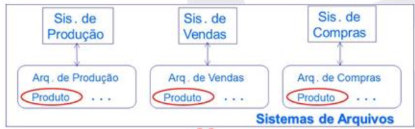

# BANCO DE DADOS

## Conceitos Básicos

Antes de falar de bancos de dados propriamente, vale separar quatro ideias que costumam ser confundidas:

| Conceito | Definição |
| --- | --- |
| **Dado** | Um elemento bruto, sem contexto. |
| **Metadado** | Dados que descrevem outros dados, dando-lhes significado (ex.: o tipo e o tamanho de uma coluna). |
| **Informação** | Um dado com significado, interpretado de forma útil. |
| **Conhecimento** | O uso da informação para tomar decisões. |

Um **banco de dados** é uma coleção organizada de informações estruturadas sobre um domínio específico. Em uma arquitetura MVC (Model-View-Controller), os dados são acessados na camada mais baixa, o **Model** — a camada que contém toda a lógica de CRUD e fornece os dados para as demais camadas.

Já o **Sistema Gerenciador de Banco de Dados (SGBD)** é o software que gerencia e controla o banco de dados, permitindo aos usuários realizar CRUD e outras operações — é o "motor" que lê, organiza e escreve os dados (MySQL, PostgreSQL, Oracle, etc.).

### Evolução dos SGBDs

A história dos SGBDs é, em boa parte, a história de como foram sendo resolvidos os problemas de confiabilidade e redundância que surgiam a cada geração anterior.

**Sistemas de arquivos (década de 1960).** Antes do SGBD, os usuários utilizavam diretamente os sistemas de arquivos do sistema operacional. Cada aplicação tinha o seu próprio arquivo, e todo o controle de qualidade dos dados dependia inteiramente dos programadores. Isso trazia vários problemas:

- **Redundância de dados e de código**: como cada aplicação tinha seu próprio arquivo, o mesmo dado podia estar repetido em vários lugares — gerando inconsistência quando atualizado em apenas um deles, sem saber qual versão é a correta (ex.: os sistemas de Produção, Vendas e Compras, cada um com seu próprio arquivo, mas todos repetindo o mesmo campo `Produto`).

    ??? note "Imagem de referência"
        

- **Dificuldade de acesso**: todo acesso dependia do programador estar disponível para escrever o código necessário.
- **Formatos heterogêneos**: dados dispersos em arquivos isolados podiam ter formatos e valores diferentes, dificultando a escrita de programas que precisassem acessar vários deles.
- **Falta de atomicidade**: se uma operação dependia de várias transações e uma delas falhasse, o resultado podia ficar inconsistente — garantir que os dados voltassem ao último estado consistente (atomicidade) não era fácil de implementar manualmente.
- **Concorrência**: acesso simultâneo ao mesmo dado podia gerar inconsistências.

Foi exatamente para resolver esses problemas que o SGBD foi criado.

**1ª geração (década de 1970).**

| Modelo | Estrutura | Características |
| --- | --- | --- |
| **SGBD Hierárquico** | Árvore, baseada em ponteiros (cada pai aponta para seus filhos) | Primeiro SGBD com controle centralizado; só permite relações 1:N |
| **SGBD em Rede** | Grafo (ainda baseado em ponteiros, mas sem redundância) | Reconhece a natureza não hierárquica dos dados e permite relações M:N; porém é complexa de entender e manter, com baixa independência entre dados e programas, e manipulação feita em linguagem de baixo nível |

**2ª geração (década de 1980) — SGBD Relacional.** Não é baseado em ponteiros, e tem fundamento matemático sólido (relações, funções, conjuntos, álgebra relacional). Os dados são representados por **tabelas (relações)**, organizadas em linhas e colunas, com **chaves primárias** e **estrangeiras**; a manipulação é feita por SQL. É hoje o modelo mais utilizado quando é preciso garantir integridade dos dados (Oracle, PostgreSQL, etc.).

| Tipo de chave | Definição |
| --- | --- |
| **Chave primária (PK)** | Identificador único de cada linha de uma tabela; garante que duas linhas nunca tenham o mesmo valor; não pode ser nula. |
| **Chave estrangeira (FK)** | Campo que referencia a PK de outra tabela, permitindo criar relações 1:N e M:N — se os valores de FK puderem se repetir, é 1:N; se puderem ser todos diferentes, a relação tende a M:N. |

**3ª geração (década de 1990).**

- **SGBD Orientado a Objetos**: o modelo mais natural para expressar a realidade ("tudo é objeto"), surgido sob a influência da POO da época. Não tem linguagem padronizada nem base teórica sólida, e o paradigma não foi bem aceito pelo mercado. Nesse modelo, cada objeto (ex.: `Cliente`, `Conta`) carrega tanto seus atributos (`A1, A2, ... An`) quanto seus métodos (`M1, M2, ... Mn`), e objetos se comunicam entre si por troca de mensagens (chamadas de método) — por exemplo, um objeto `Cliente` (`Mário, Av. S.Carlos, SP, [1234]`) referenciando diretamente um objeto `Conta` pelo seu identificador.

    ??? note "Imagem de referência"
        

- **SGBD Relacional-Objeto**: combina o melhor dos dois mundos, aplicando conceitos de OO sobre estruturas relacionais — suporte a tipos de dados abstratos (objetos complexos), baseado em SQL padrão mas com extensões proprietárias de POO (Oracle, PostgreSQL, etc.): os mesmos objetos com atributos e métodos, mas agora persistidos sobre uma estrutura de tabelas subjacente.

    ??? note "Imagem de referência"
        

**4ª geração (década de 2000) — SGBD Não-Relacional (NoSQL).** Voltado para grandes volumes de dados, priorizando alto desempenho, disponibilidade e consistência eventual, em vez de organizar dados estritamente em linhas/colunas com PK/FK. O esquema é semi-estruturado (admite replicação e ausência de campos, como em JSON), e a escalabilidade é predominantemente **horizontal** (múltiplos servidores) — ao contrário dos SGBDs relacionais, tipicamente escaláveis verticalmente (MongoDB, Redis, Cassandra).

---

## Modelo Entidade Relacionamento (MER)

O **MER** é uma linguagem diagramática usada para modelar bancos de dados e especificar esquemas conceituais, com quatro elementos gráficos básicos: retângulos (entidades), losangos (relacionamentos), elipses (atributos) e linhas (ligações entre eles).

??? note "Legenda da notação"
    

### Entidades, relacionamentos e atributos

Os componentes básicos do diagrama são:

- **Retângulos → Entidades**: abstrações de um conceito concreto (cliente, livro) ou abstrato (conta, empréstimo). Uma ocorrência de uma entidade é chamada de **instância**.
- **Losangos → Relacionamentos**: abstrações de uma associação entre instâncias de uma ou mais entidades. Em um relacionamento, todas as instâncias envolvidas devem existir; a cada ocorrência chamamos de **instância do relacionamento** (cada uma carrega uma informação diferente).
- **Elipses → Atributos**: propriedades descritivas de uma entidade ou relacionamento.
- **Linhas**: ligam atributos a entidades/relacionamentos, e entidades a relacionamentos.

#### Relacionamentos: grau, papel, cardinalidade e participação

O **grau** de um relacionamento é a quantidade de entidades envolvidas: **unário** (auto-relacionamento), **binário** (duas entidades) ou **N-ário** (N entidades). O **papel** é a função que uma dada entidade desempenha no relacionamento — por exemplo, no relacionamento unário "indica" (Cliente → Cliente), uma instância de `Cliente` pode ter o papel de "padrinho" ou de "afilhado"; já "movimenta" (Cliente—Conta) é um relacionamento binário, e "tem" (Cliente—Conta—Produto) é um relacionamento ternário (N-ário).

??? note "Imagem de referência"
    

A **cardinalidade** (ou multiplicidade, ou cardinalidade máxima) expressa o número máximo de vezes que uma instância de uma entidade pode, no pior caso, participar do relacionamento. Pode ser representada por qualquer inteiro positivo, mas por convenção usa-se $1$ (um) e $N$ (muitos) — resultando em relacionamentos $1{:}1$, $1{:}N$ ou $M{:}N$.

A **participação** (ou obrigatoriedade, ou cardinalidade mínima) especifica se uma instância, para ser cadastrada, *precisa* estar relacionada com alguma instância de outra entidade do relacionamento. Quando a condição é exigida, a participação é **total** (relacionamento obrigatório); quando não, é **parcial** (relacionamento opcional). Por convenção, usam-se os valores $0$ (participação parcial) e $1$ (participação total).

!!! note "Look-here vs. look-across"
    A cardinalidade e a participação podem ser especificadas do lado da entidade de origem (**look-here**) ou de destino (**look-across**) — por exemplo, no relacionamento binário "Movimenta" (Cliente—Conta): o **look-here** olha de `Conta` de volta para `Cliente`; o **look-across** olha de `Cliente` para `Conta`.

    ??? note "Imagem de referência"
        

    - **Look-here**: a FK está na entidade de *origem* — ela armazena a referência para a de destino, e os dados relacionados ficam do lado de origem. Está relacionada à **participação**: "esta entidade *precisa* participar do relacionamento?"
    - **Look-across**: é preciso olhar para a entidade de *destino* para encontrar os dados relacionados — a FK está do lado de destino. Está relacionada à **cardinalidade**: "quantos da entidade destino se relacionam com a de origem?"

    Na notação de Elmasri & Navathe, a participação é representada por linhas simples (parcial) ou duplas (total); a notação $(min, max)$ é usada quando os valores mínimo e máximo diferem dos padrões ($0$/$1$ e $1$/$N$).

!!! example "Exemplos de cardinalidade/participação (Cliente—Movimenta—Conta)"
    - **1:1, ambos opcionais**: um cliente pode movimentar no máximo uma conta; uma conta pode ser movimentada por no máximo um cliente; nenhum dos dois é obrigado a participar para ser cadastrado.
    - **1:N (cliente 1, conta N), conta obrigatória**: um cliente pode movimentar várias contas; uma conta pode ser movimentada por no máximo um cliente; o cliente não é obrigado a participar, mas toda conta precisa ser movimentada por um cliente para ser cadastrada.
    - **N:1 (cliente N, conta 1), cliente obrigatório**: um cliente pode movimentar no máximo uma conta; uma conta pode ser movimentada por vários clientes; todo cliente precisa movimentar uma conta para ser cadastrado, mas a conta não é obrigada a ter cliente.
    - **M:N, ambos obrigatórios**: um cliente pode movimentar várias contas e uma conta pode ser movimentada por vários clientes; ambas as entidades são obrigadas a participar do relacionamento para serem cadastradas.

    ??? note "Imagens de referência"
        
        
        
        

Duas entidades podem ter **mais de um relacionamento** entre elas — por exemplo, `Endereço`—`Cliente` pode ter os relacionamentos "Trabalho" e "Residencial" simultaneamente, assim como `Cliente`—`Conta` pode ter "movimenta" e "é_titular".

??? note "Imagem de referência"
    

#### Tipos de atributos

| Tipo | Definição | Exemplo |
| --- | --- | --- |
| Simples | Indivisível | CPF, saldo |
| Composto | Formado por sub-atributos | Endereço (rua, bairro, complemento) |
| Monovalorado | Admite um único valor por instância | CPF, saldo |
| Multivalorado | Admite vários valores por instância | E-mail, telefone |
| Derivado | Calculado a partir de outros atributos | Média de notas, saldo médio |
| Identificador | Cada valor é único | CPF, código de matrícula |
| Discriminador | Identificador *parcial* — sozinho não identifica, mas combinado com um identificador de outra entidade sim (geralmente vindo de uma entidade forte relacionada) | Data de pagamento |

??? note "Diagrama de classificação dos atributos"
    

Toda entidade deve ter atributos, mas nem todo relacionamento precisa ter. A própria **cardinalidade** do relacionamento influencia onde inserir atributos: é comum colocar atributos em relacionamentos $M{:}N$, mas pouco comum em relacionamentos $1{:}1$, $1{:}N$ ou $N{:}1$ — nestes últimos, é melhor colocar o atributo na entidade do lado $N$ em vez do relacionamento.

!!! tip "Entidade ou relacionamento?"
    Se existe um identificador (ID) próprio, trata-se de uma entidade; caso contrário, pode ser um relacionamento. Um relacionamento com muitos atributos tende, na prática, a "virar" uma entidade.

!!! example "Onde inserir um atributo \"último acesso\" entre Cliente e Conta, via \"movimenta\"?"
    - **Cenário 1:1** (um cliente movimenta no máximo uma conta, e vice-versa): o atributo pode ser inserido em `Cliente`, `Conta` **ou** `movimenta` — nas três situações dá para saber qual foi o último acesso que o cliente fez naquela conta.
    - **Cenário 1:N** (cliente 1, conta N — um cliente movimenta várias contas, cada conta tem no máximo um cliente): o atributo **não** pode ser inserido em `Cliente` (saberíamos quando foi o último acesso, mas não em qual conta); pode ser inserido em `Conta` ou em `movimenta`.
    - **Cenário N:1** (cliente N, conta 1 — um cliente movimenta no máximo uma conta, uma conta é movimentada por vários clientes): pelo raciocínio simétrico, o atributo **não** pode ser inserido em `Conta` (saberíamos quando, mas não qual cliente); pode ir em `Cliente` ou em `movimenta`.
    - **Cenário N:N**: o atributo só pode ser inserido em `movimenta` — inseri-lo em `Cliente` ou `Conta` não permitiria saber em qual conta um cliente fez o último acesso, nem qual cliente fez o último acesso em uma conta.

    ??? note "Imagens de referência"
        
        
        
        

!!! example "Onde inserir \"tx_juros\" e \"qtd_parcelas\" entre Financeira (1) —Financia— Venda (N)?"
    - **Cenário 1 (na entidade `Financeira`)**: todas as vendas financiadas pela financeira X sempre teriam a mesma quantidade de parcelas e taxa de juros, o que não é razoável — ruim, porque os atributos ficam presos à financeira, não à negociação específica.
    - **Cenário 2 (na entidade `Venda`)**: quando a venda for à vista, os atributos não devem ser preenchidos, ou devem receber um valor especial (ex. `-1`) — usar `0` seria ambíguo (não dá para saber se foi à vista ou se não houve cobrança de juros). Esse projeto é aceitável.
    - **Cenário 3 (no relacionamento `Financia`)**: a taxa de juros e a quantidade de parcelas só são cadastradas quando a venda é de fato financiada (vendas à vista simplesmente não têm esses atributos, pois a instância do relacionamento não existe) — podendo inclusive ser negociadas caso a caso. **Este é o melhor projeto conceitual.**

    ??? note "Imagens de referência"
        
        
        
        

### Relacionamento unário

Envolve apenas uma entidade, que assume dois papéis diferentes na mesma associação (por exemplo, "funcionário supervisiona funcionário"). No exemplo "indica" (Cliente → Cliente), a cardinalidade é $1{:}N$: um cliente "padrinho" pode indicar vários "afilhados", mas cada "afilhado" tem no máximo um "padrinho".

??? note "Imagem de referência"
    

### Relacionamento identificador

Permite usar o atributo identificador de uma **entidade forte** para identificar outra **entidade fraca** — útil quando essa segunda entidade não tem, por si só, atributos capazes de identificá-la unicamente.

Uma entidade que tem um atributo **discriminador** é, por definição, uma **entidade fraca**: ela depende do identificador de uma entidade forte e, portanto, não possui seu próprio atributo identificador. Toda instância de entidade fraca deve estar relacionada a **no máximo uma** instância de entidade forte. Decorre daí que:

- relações $1{:}1$ não devem ter atributo discriminador;
- relações $1{:}N$ devem ter o discriminador na entidade fraca;
- a cardinalidade do lado da entidade forte é sempre $1$;
- a participação da entidade fraca é sempre obrigatória (linha dupla) — ou seja, a entidade fraca é **existencialmente dependente** da entidade forte.

!!! warning "Cuidado ao usar"
    Não é uma boa prática usar o relacionamento identificador apenas para *impor* participação obrigatória — é melhor usar participação obrigatória sem relacionamento identificador nesses casos, pois o identificador aumenta o acoplamento entre entidades e dificulta a manutenção/legibilidade.

Na notação, o relacionamento identificador fica com losango duplo, a entidade fraca com retângulo duplo, e o atributo identificador composto (herdado) fica sublinhado: no exemplo `Banco`(`numB`) —`tem`(1:N)— `Agência`(`numA`) —`possui`(1:N)— `Conta`(`numC`), tanto `Agência` quanto `Conta` são entidades fracas, com `tem` e `possui` como relacionamentos identificadores (losango duplo).

??? note "Imagem de referência"
    

!!! example
    Para o mesmo esquema `Banco`(`numB`) —`tem`— `Agência`(`numA`) —`possui`— `Conta`(`numC`): o atributo identificador das entidades fracas é a concatenação encadeada de atributos da entidade forte: identificador de Agência $= (numB, numA)$ e de Conta $= (numB, numA, numC)$.

    ??? note "Imagem de referência"
        

### Relacionamento N-ário

Um relacionamento é genuinamente **N-ário** quando toda vez que ele ocorre envolve, de fato, as mesmas $N$ entidades simultaneamente — e não pode ser decomposto em relacionamentos binários independentes. Por exemplo, `Cliente`—`Contrata`—`Conta`, com `Produto` também ligado a `Contrata` por cima, forma um relacionamento ternário genuíno: cada instância de "contrata" é uma combinação específica de um cliente, um produto e uma conta.

??? note "Imagem de referência"
    

**Como descobrir a cardinalidade de uma entidade em um relacionamento N-ário.** É preciso considerar sempre o pior caso, no formato: "1 instância de X e 1 instância de Y podem se relacionar com, no máximo, quantas instâncias de Z (1 ou N)?"

??? note "Imagem de referência"
    

!!! example "Descobrindo a cardinalidade de Cliente—Produto—Conta—Contrata"
    - **Lado Conta** (fixando Cliente+Produto): "um cliente e um produto podem se relacionar com, no máximo, quantas contas?" — como o cliente C1 contratou o produto P1 para as contas CC1 e CC2, a cardinalidade do lado Conta é **N**.
    - **Lado Cliente** (fixando Produto+Conta): "um produto e uma conta podem se relacionar com, no máximo, quantos clientes?" — como, na conta CC1, o produto P1 foi contratado pelos clientes C1 e C2, a cardinalidade do lado Cliente também é **N**.
    - **Lado Produto** (fixando Cliente+Conta): "um cliente e uma conta podem se relacionar com, no máximo, quantos produtos?" — como o cliente C1, na conta CC1, contratou os produtos P1 e P2, a cardinalidade do lado Produto também é **N**.
    - O relacionamento resultante é $N{:}N{:}N$ em todos os lados. É importante notar que clientes diferentes (C1, C2) podem ter produtos diferentes (P2, P3) na mesma conta (CC1) — pois o produto é "do cliente *em* uma conta", não da conta nem do cliente isoladamente. Isso corresponde à tabela `Contrata(Cliente, Produto, Conta)` com linhas como `(C1,P1,CC1)`, `(C1,P2,CC1)`, `(C2,P1,CC1)`, `(C2,P3,CC1)`, ...

    ??? note "Imagens de referência"
        
        
        
        

**Participação em relacionamentos N-ários:** no esquema (1), `Cliente`, `Produto` e `Conta` têm participação parcial (linha simples) em `Contrata`; no esquema (2), `Produto` tem participação total (linha dupla), enquanto `Cliente` e `Conta` continuam parciais.

??? note "Imagem de referência"
    

No primeiro esquema, nenhuma das três entidades é obrigada a participar do relacionamento "contrata" — o cadastro de qualquer uma delas independe das outras. No segundo, o cadastro de produto só acontece se ele já estiver relacionado a um cliente e uma conta (produto não existe sem a relação "contrata", pois depende de cliente e conta). Em ambos os esquemas, sempre que a relação ocorre, ela envolve exatamente um cliente, um produto e uma conta.

#### Relacionamento N-ário vs. binário

!!! warning "Atenção: nem todo relacionamento com 3+ entidades é ternário"
    Se todos os clientes de uma conta sempre têm os mesmos produtos, então na verdade existe apenas um relacionamento **binário** entre conta e produto — ou seja, no esquema `Cliente`—`movimenta`(N)—`Conta`(N)—`contrata`(N)—`Produto`(N), o par `Conta`—`contrata`—`Produto` pode, de fato, ser um relacionamento binário independente de `Cliente`.

    ??? note "Imagem de referência"
        

    Apesar de cliente não estar diretamente relacionado a produto, a partir de conta é possível descobrir todos os produtos de um cliente por transitividade.

    Um sinal de alerta é: se, em um relacionamento aparentemente ternário, **uma entidade tem cardinalidade $1$**, provavelmente existe uma relação binária escondida por trás, e não uma relação ternária genuína. No caso a seguir (`Agência`—`Conta Corrente`—`Cliente`), ao analisar o pior caso lado a lado — "uma agência e um cliente se relacionam com, no máximo, quantas contas?" (N) e "uma conta corrente e um cliente se relacionam com, no máximo, quantas agências?" (1, pois toda conta corrente pertence a exatamente uma agência) — a cardinalidade do lado `Agência` fecha em **1**, o que denuncia que não é uma relação ternária genuína: uma tabela `movimenta(Cliente, Conta, Agência)` montada como se fosse ternária geraria linhas contraditórias, como um mesmo cliente aparecendo associado à mesma conta mas com agências diferentes, quando na realidade a agência de uma conta é fixa e não deveria variar por cliente.

    ??? note "Imagens de referência"
        
        
        

    Nesse exemplo, apesar de 1 cliente com 1 conta corrente só poder fazer parte de 1 agência, 1 cliente pode fazer parte de N agências — gerando uma contradição. Já "1 conta corrente pode fazer parte de apenas 1 agência" está logicamente correto. O problema é que a relação, como modelada, permite que uma mesma conta esteja atrelada a mais de uma agência — por exemplo, a tabela `movimenta(Cliente, Conta, Agência)` ficaria com linhas como `(C1, CC1, A1)` e `(C2, CC1, A2)`, implicando (erradamente) que a conta `CC1` pertence tanto à agência `A1` quanto à `A2`.

    ??? note "Imagem de referência"
        

    A solução correta separa as relações: `Agência`(1) —(N)— `Conta Corrente`(N) —(N)— `Cliente`, dois relacionamentos binários distintos.

    ??? note "Imagem de referência"
        

    Em geral: se, a partir de uma instância de entidade A, é possível **determinar** uma instância de entidade B, então A e B formam um relacionamento binário, não N-ário.

Por outro lado, o inverso também é verdade: **3 relacionamentos binários não substituem 1 relacionamento ternário genuíno** — quando as três entidades realmente só fazem sentido combinadas simultaneamente, decompor em pares perde informação. Decompor `Contrata(Cliente, Produto, Conta)` em três relacionamentos binários `CP(Cliente, Produto)`, `CCC(Cliente, Conta)` e `PCC(Produto, Conta)` permite saber quais são os produtos de um cliente, quais são as contas de um cliente e quais são os produtos de uma conta, isoladamente — mas **não** permite saber quais são os produtos de um cliente *especificamente em* uma conta (quando um cliente pode ter produtos diferentes em contas diferentes); além disso, consultas sobre o esquema decomposto podem retornar combinações contraditórias que nunca existiram de fato na relação ternária original (ex.: via `CP` um cliente parece ter um produto que, combinando `CCC`+`PCC`, não existe naquela conta).

??? note "Imagem de referência"
    

### Entidade associativa

Quando um relacionamento pode ocorrer **sem** a presença de uma terceira entidade (isto é, quando as entidades podem se relacionar entre si de forma independente, mas também é útil capturar uma relação conjunta), usa-se uma **entidade associativa** em vez de um relacionamento N-ário: um relacionamento binário vira uma entidade (com linha superior no retângulo, mantendo o losango internamente), e um segundo relacionamento liga essa entidade associativa a uma terceira entidade — sem nenhuma ligação direta entre os dois relacionamentos; o segundo relacionamento pode ocorrer sem envolver, necessariamente, essa terceira entidade.

??? note "Imagem de referência"
    

!!! example
    Para `Cliente`—`contrata`(entidade associativa)—`Conta`, ligada por `participa`(N:N) a `Promoção`: um cliente, ao contratar uma conta, **não** é obrigado a participar de uma promoção — mas toda vez que o relacionamento "participa" ocorrer, ele necessariamente envolve a entidade associativa "contrata" e a entidade "Promoção". Note que um cliente aprovado mas sem conta, ou uma conta criada mas ainda sem cliente, não pode participar de uma promoção do banco, pois só um cliente com conta já contratada (uma instância de "contrata") pode participar de promoções.

    ??? note "Imagens de referência"
        
        

**Entidade associativa vs. relacionamento N-ário** — a diferença central: a **participação total** da entidade associativa torna o esquema com entidade associativa equivalente ao relacionamento ternário direto. No esquema (1), `Cliente`—`contrata`(entidade associativa)—`Conta`, com `participa` ligando `contrata` a `Promoção`, **não** é equivalente a um ternário genuíno se a participação de `contrata` em `participa` for parcial; mas se essa participação fosse **total** (toda conta contratada participa obrigatoriamente de alguma promoção), o esquema se tornaria equivalente ao esquema (2), um relacionamento ternário direto `Cliente`—`participa`(N:N)—`Conta`, com `Promoção` ligada a `participa`. Nesses casos de participação total, é preferível usar diretamente um relacionamento N-ário em vez de uma entidade associativa.

??? note "Imagem de referência"
    

### Herança

A **herança** cria uma hierarquia de entidades, em que sub-entidades herdam todos os atributos e relacionamentos das super-entidades. É recomendável usá-la apenas quando as sub-entidades têm atributos ou relacionamentos **específicos** — caso contrário, um atributo simples resolve melhor. Na notação: a **super-entidade** fica no topo, ligada por uma linha a um pequeno círculo (marcado `d` ou `o`) que representa a **generalização**/**especialização**, do qual partem as ligações para as **sub-entidades** — cada sub-entidade pode ter atributos e relacionamentos próprios, além dos herdados da super-entidade.

??? note "Imagem de referência (legenda da notação)"
    

A herança é classificada em dois eixos independentes:

| Eixo | Valores | Significado |
| --- | --- | --- |
| Disjunção | **Disjunta** (`d`) | Cada instância da super entidade se especializa em **exatamente uma** sub-entidade. |
| | **Sobreposta** (`o`) | Pelo menos uma instância se especializa em **mais de uma** sub-entidade simultaneamente. |
| Totalidade | **Total** (linha dupla) | Toda instância da super entidade é especializada em pelo menos uma sub-entidade. |
| | **Parcial** (linha simples) | Pelo menos uma instância não é especializada em nenhuma sub-entidade. |

!!! example "As quatro combinações (Cliente → PF/PJ/ME/MEI/Privado/Público/Aposentado)"
    - Herança **PD** (Parcial/Disjunta): `Cliente` se especializa em `PF`, `ME`, `MEI` — os clientes $c_1,c_2$ (PF), $c_4,c_5$ (ME) e $c_6,c_7$ (MEI) não se sobrepõem entre si (**disjunta**), mas $c_3$ não pertence a nenhuma sub-entidade (**parcial**).
    - Herança **TD** (Total/Disjunta): `Cliente` se especializa em `PF`, `PJ` — todo cliente $c_1$ a $c_7$ está em exatamente uma das duas (**total**, sem sobra), e os conjuntos não se sobrepõem (**disjunta**).
    - Herança **PO** (Parcial/Sobreposta): `Cliente` se especializa em `Privado`, `Aposentado` — $c_{20}$ aparece em ambos os grupos simultaneamente (**sobreposta**), mas $c_{30}, c_{40}$ não pertencem a nenhum dos dois (**parcial**).
    - Herança **TO** (Total/Sobreposta): `Cliente` se especializa em `Privado`, `Público`, `Aposentado` — todo cliente $c_{10}$ a $c_{70}$ está em pelo menos uma sub-entidade (**total**), e alguns (como $c_{20}$ ou $c_{70}$) estão em mais de uma simultaneamente (**sobreposta**).

    ??? note "Imagens de referência"
        
        
        
        

Se existe apenas **uma** sub-entidade, a herança é dita **direta**, e não pode ser classificada como disjunta/sobreposta nem total/parcial (essas classificações só fazem sentido com múltiplas sub-entidades concorrendo entre si) — na notação, o círculo de generalização desaparece, e a ligação vira uma simples linha com o símbolo de especialização entre `X` e `Y`.

??? note "Imagem de referência"
    

Se as sub-entidades não têm atributos ou relacionamentos específicos, é preferível usar um atributo simples do tipo "tipo"/"categoria" no lugar de modelar herança — por exemplo, em vez de especializar `Conta` em `Poupança`, `Salário`, `Básica`, `Especial` (sem atributos próprios adicionais), basta um atributo `tipo` na própria entidade `Conta`.

??? note "Imagem de referência"
    

### Particularidades e limitações do MER

O MER tem **poder de expressão limitado** — valores válidos e pré/pós-condições de negócio precisam ser documentados separadamente, fora do diagrama. Além disso, esquemas ER *diferentes* podem acabar sendo **equivalentes** na prática — por exemplo, `Conta`—`movimenta`(N:N)—`Cliente` é equivalente a transformar "movimenta" em uma entidade associativa `Movimentação`, ligada por `sofre`(1:N) a `Conta` e por `faz`(N:1) a `Cliente`: as mesmas combinações `Cliente`×`Conta` continuam representadas, apenas via um nível extra de indireção.

??? note "Imagem de referência"
    

### Dúvidas frequentes de modelagem

| Dúvida | Regra de decisão | Ilustração |
| --- | --- | --- |
| Atributo ou entidade? | Meramente descritivo → atributo. Tem identificador explícito → entidade. | `agência` como atributo simples de `Conta` é aceitável; mas se `Agência` tem seu próprio identificador `cod`, é melhor modelá-la como entidade, ligada a `Conta` por um relacionamento `tem` (1:N). |
| Atributo composto/multivalorado ou entidade? | Exclusivo de uma entidade → atributo. Pode ser compartilhado entre várias entidades → entidade. | `fones` (composto de DDD/PRE/SUF) e `local de trabalho` (composto de Endereço/CEP) como atributos multivalorados de `Cliente` funcionam; mas se "Fones" e "Local de Trabalho" puderem ser compartilhados/reutilizados por mais de um cliente, é melhor virarem entidades próprias, ligadas por relacionamentos `tem` e `trabalha`. |
| Atributo ou herança? | Pode haver inconsistência entre os conceitos → herança. Caso contrário → atributo. | Colocar `título eleitoral` e `contrato social` como atributos simples de `Cliente` permite, inconsistentemente, que um CNPJ tenha título eleitoral; o correto é especializar `Cliente` em `PF` (com `título eleitoral`) e `PJ` (com `contrato social`) via herança disjunta. |
| Relacionamento ou entidade? | Tem identificador explícito → entidade. Caso contrário → pode ser relacionamento. | Modelar `movimentação` como relacionamento N:N simples entre `Conta` e `Cliente` não permite dar a ela um identificador próprio (`ID`); o correto é transformá-la em uma entidade `Movimentação`, ligada a `Conta` (1:N, via `sofre`) e a `Cliente` (N:1, via `faz`). |
| Relacionamento N-ário ou entidade associativa? | Sempre envolve todas as entidades simultaneamente → relacionamento N-ário. Caso contrário → entidade associativa. | `Conta`—`contrata`(entidade associativa)—`Cliente`—`Produto`, ligada por `tem`(1:N) a `Promoção` — como nem toda contratação precisa estar associada a uma promoção, `contrata` fica como entidade associativa em vez de virar parte de um relacionamento N-ário só. |

??? note "Imagens de referência"
    
    
    
    
    

### Requisitos para um bom MER

Um bom esquema MER precisa satisfazer vários requisitos simultaneamente:

**1. Ser sintaticamente correto** — respeitar as regras de construção do diagrama. Erros comuns: (1) ligar duas entidades sem um relacionamento entre elas; (2) ligar dois relacionamentos diretamente sem usar uma entidade associativa; (3) ligar um atributo a mais de uma entidade ou relacionamento.

??? note "Imagem de referência"
    

**2. Ser semanticamente correto** — o esquema não pode ter atributos, cardinalidades, participações ou graus mal especificados, nem capturar mais de uma realidade ao mesmo tempo. Alguns exemplos (`Conta`—`movimenta`—`Cliente`):

- **Onde colocar `saldo`?** Em `Conta` (✓): cada conta tem seu próprio saldo, visto igualmente por todos os seus clientes. Em `movimenta` (✗, a menos que seja essa a intenção): uma conta passaria a ter um saldo *diferente* para cada cliente. Em `Cliente` (✗, a menos que seja essa a intenção): um cliente teria o mesmo saldo repetido em todas as suas contas.
- **Cardinalidade de `Conta`—`pertence`—`Agência`**: $N{:}1$ (cada conta pertence a uma única agência, que pode ter várias contas) está correto; $1{:}N$ inverteria o sentido (uma conta poderia pertencer a várias agências, mas uma agência só teria uma conta) — semanticamente errado.
- **Participação em `Conta`—`pertence`—`Agência`**: linha dupla em `Conta` (toda conta precisa ter agência para ser cadastrada) é um esquema "bom"; linha dupla também em `Agência` (toda agência precisa ter conta) seria "estranho"; linha dupla em ambos gera dependência mútua desnecessária; o esquema totalmente flexível (ambas opcionais) também é aceitável, dependendo da regra de negócio.
- **`Cliente`—`movimenta`—`Conta`—`contrata`—`Produto` vs. entidade associativa direta `Cliente`—`Contrata`(N:N)—`Conta` com `Produto` ligado a `Contrata`**: o primeiro esquema garante que clientes não podem ter produtos diferentes na mesma conta; o segundo permite que clientes tenham produtos diferentes na mesma conta — ambos são semanticamente corretos, a escolha depende da realidade modelada.
- **Onde conectar `Agência`**: `Cliente`—`movimenta`—`Conta`—`pertence`(N:1)—`Agência` garante que uma conta pertence a exatamente uma agência; já ligar `Agência` diretamente a `movimenta` (com cardinalidade 1) permitiria, erradamente, que uma mesma conta existisse em mais de uma agência.
- **Redundância entre `CEP` e `rua`**: concentrar tudo (`COD`, `rua`) na entidade `CEP`, ligada a `Cliente` via `mora`, evita inconsistência entre código postal e nome da rua; já deixar `CEP` como atributo composto direto de `Cliente` (com sub-atributos `COD` e `rua`) permite, inconsistentemente, que a mesma rua tenha mais de um CEP e vice-versa.

??? note "Imagens de referência"
    
    
    
    
    
    

**3. Evitar (ou controlar) construções redundantes** — redundância pode melhorar desempenho em certos cenários, mas também pode gerar dados inconsistentes se não for cuidadosamente controlada. Exemplo: no esquema `Cliente`—`movimenta`—`Conta`—`pertence`(N:1)—`Agência`, com `Agência` também ligada a `Cliente` via `faz parte`(1:N), e um atributo `qtd contas` na própria `Agência` — tanto `qtd contas` quanto `faz parte` são construções **redundantes**, pois ambas já são deriváveis de `pertence`/`movimenta`, e podem gerar dados contraditórios se não forem controladas por programação:

- **`qtd contas`**: embora seja mais rápido ler `qtd contas` do que contar via `pertence`, é preciso programar uma rotina para atualizar esse atributo sempre que uma conta for criada, excluída ou trocada de agência — valendo a pena avaliar o *custo × benefício* dessa redundância.
- **`faz parte`**: é mais rápido saber a agência de um cliente via `faz parte` do que navegando por `movimenta` → `pertence`, mas `faz parte` pode acabar registrando uma agência cujo cliente não tem, de fato, nenhuma conta ali — também exigindo uma rotina para impedir essa contradição.

??? note "Imagens de referência"
    
    
    

**4. Capturar o aspecto temporal**, quando relevante — ou seja, guardar o histórico de um atributo em vez de apenas seu valor atual. Alguns exemplos progressivos:

- **Saldo médio de uma conta**: `saldo médio` como atributo simples de `Conta` guarda apenas o valor atual; transformá-lo em entidade `Saldo Médio` (com `data` e `valor`), ligada por `tem`(1:N) a `Conta`, guarda o **histórico** completo dos saldos médios ao longo do tempo.
- **Empréstimos de uma conta**: `faz`(1:1) para uma entidade `Empréstimo` (com `data`, `valor`) guarda só o empréstimo atual — ao longo do tempo, uma conta pode fazer vários empréstimos, mas só o mais recente fica registrado (o atual sobrepõe o anterior); mudar a cardinalidade para `faz`(1:N) passa a guardar o histórico de todos os empréstimos (podendo inclusive usar um instante em milissegundos no lugar da data, para granularidade maior).
- **Títulos negociados**: `Conta`—`negocia`(N:1)—`Título` (com `valor` em `Título`) guarda só os dados do título atual; já `Conta`—`negocia`(N:N)—`Título`, com `valor negociado` e `data` no próprio relacionamento `negocia` (e `valor atual` ficando em `Título`), guarda o histórico de todos os títulos negociados — inclusive se o cliente negociar o mesmo título mais de uma vez.
- **Compra de ações**: indo um passo além, `Conta`—`compra`(N:N)—`Ações`, com `valor negociado` e `instante` no relacionamento `compra` (e `valor atual` em `Ações`), já captura quase todo o histórico de ações compradas — mas, para registrar múltiplas recompras da mesma ação, é preciso que `instante` seja parte do identificador do relacionamento (senão uma segunda compra da mesma ação na mesma conta sobrescreveria a primeira).

??? note "Imagens de referência"
    
    
    
    

**5. Ser completo** — é muito mais fácil corrigir um erro no projeto conceitual do que em qualquer fase posterior do projeto do banco de dados. O projeto conceitual pode ser construído a partir de:

- **Informações já existentes**, usando:
    - **Engenharia reversa**: feita automaticamente por uma ferramenta CASE a partir de um banco já existente;
    - **Estratégia Bottom-Up**: 1º atributos → 2º entidades → 3º relacionamentos → 4º herança.
- **Conhecimento de especialistas**, usando:
    - **Estratégia Top-Down**: 1º entidades → 2º relacionamentos → 3º heranças → 4º atributos;
    - **Estratégia Inside-Out**: igual à Top-Down, mas começando pelas entidades mais importantes do domínio.

---

## Modelo Relacional

O **modelo relacional** é um modelo **lógico** — menos abstrato que o conceitual (MER), mas que ainda não considera aspectos físicos de armazenamento, acesso ou desempenho. Tem uma base formal sólida (teoria dos conjuntos) e é construído sobre conceitos simples: relações, atributos, tuplas e domínios. É baseado em tabelas que **não podem ter subtabelas**, e é a base direta sobre a qual o SQL foi definido. Vale notar que diversos conceitos do modelo conceitual não são implementados de forma tão direta no modelo relacional — é justamente esse "gap" que o processo de **mapeamento** (visto mais adiante) precisa resolver.

### Definições fundamentais

- **Domínio**: conjunto de valores atômicos possíveis para um atributo.
- **Relação**: dados os conjuntos $D_1, \ldots, D_n$ (domínios não necessariamente distintos), $R$ é uma relação sobre esses $n$ conjuntos se $R$ é um conjunto de tuplas $\langle v_1, \ldots, v_n \rangle$ onde $v_1 \in D_1, \ldots, v_n \in D_n$ — ou seja, $R$ é um subconjunto do produto cartesiano $D_1 \times \cdots \times D_n$.

    !!! example
        Para $\text{Nomes} = \{\text{Ana}, \text{Rita}, \text{Rui}\}$ e $\text{Sexos} = \{M, F\}$: uma tupla é, por exemplo, $(\text{Ana}, F)$; o produto cartesiano $\text{Nomes} \times \text{Sexos} = \{(\text{Ana},M),(\text{Ana},F),(\text{Rita},M),(\text{Rita},F),(\text{Rui},M),(\text{Rui},F)\}$ (todas as 6 combinações possíveis); e a relação $\text{Clientes} = \{(\text{Ana},F),(\text{Rita},F),(\text{Rui},M)\}$ é um subconjunto desse produto cartesiano (apenas as combinações que de fato existem).

        ??? note "Imagem de referência"
            

!!! note "Relação vs. tabela: terminologia"
    Para a relação `Cliente(CPF, Nome, Sexo, Escolaridade)` com tuplas `(111,Ana,F,Médio)`, `(222,Rita,F,Superior)`, `(333,Rui,M,Mestrado)`: os **domínios dos atributos** são os conjuntos de valores possíveis para cada coluna (ex.: `{111,222,333}` para CPF, `{Ana,Rita,Rui}` para Nome); o **esquema da relação** (intenção) é a estrutura `Cliente(CPF, Nome, Sexo, Escolaridade)`, com seus **atributos**; e a **instância da relação** (extensão) são as **tuplas** de fato armazenadas. O **grau** é o número de atributos (aqui, 4) e a **cardinalidade** é o número de tuplas (aqui, 3).

    ??? note "Imagem de referência"
        

**Propriedades de uma relação:**

- toda relação tem um número **fixo** de atributos distintos;
- o valor `NULL` é usado quando um atributo não tem valor, ou este é desconhecido;
- a ordem dos atributos e das tuplas é **irrelevante** — não há ordenação implícita entre tuplas, e os valores se associam aos atributos independentemente de qualquer ordem.

### Chaves

O conceito de **chave** serve para identificar e referenciar tuplas de forma inequívoca.

| Tipo de chave | Definição |
| --- | --- |
| **Chave candidata** | Um atributo (chave simples) ou concatenação de atributos (chave composta) cujos valores distinguem uma tupla de todas as demais da relação — uma possível PK, que deve ter valores distintos e obrigatórios. |
| **Chave primária (PK)** | A chave candidata *escolhida* para identificar as tuplas; frequentemente usada para seleção; nunca admite `NULL`. |
| **Chave estrangeira (FK)** | Atributo (ou concatenação) que referencia a PK de *outra* tabela, usada para relacionar tuplas entre relações; admite `NULL` quando a participação é opcional (não precisa ser única nem obrigatória). |
| **Chave alternativa (AK)** | A chave candidata que **não** foi escolhida como PK; não participa de relacionamentos via FK. |

Uma chave candidata deve ser **mínima**: se é simples, já é mínima por definição; se é composta, é preciso verificar que nenhum subconjunto próprio dos atributos já seria suficiente para identificar a tupla (senão haveria redundância na chave). Por exemplo, para `Cliente(Matrícula, CPF, Nome)`: tanto `Matrícula` quanto `CPF`, isoladamente, já identificam uma tupla — são **chaves candidatas simples**. Já em `Dependente(Matrícula, Num, Nome)`, nem `Matrícula` nem `Num` sozinhos identificam a tupla (várias matrículas repetem o mesmo `Num`, e vice-versa) — apenas a combinação `(Matrícula, Num)` é mínima e identifica univocamente, formando uma **chave candidata composta**. Usar uma chave composta não-mínima (ex.: `Matrícula+CPF` em vez de só `Matrícula` ou só `CPF`) pode gerar inconsistência, permitindo várias matrículas para o mesmo CPF e vice-versa.

??? note "Imagem de referência (chaves candidatas)"
    

Continuando o exemplo: elegendo `Matrícula` como **chave primária** de `Cliente` e `(Matrícula, Num)` como chave primária (composta) de `Dependente`.

??? note "Imagem de referência (chaves primárias)"
    

O atributo `Matrícula` em `Dependente` também é uma **chave estrangeira** simples, referenciando a PK de `Cliente`.

??? note "Imagem de referência (chave estrangeira)"
    

!!! example "Auto-relacionamento"
    Um auto-relacionamento é uma relação entre a *mesma* entidade/tabela, diferenciando-se apenas pelos papéis desempenhados (ex.: um funcionário que supervisiona outro funcionário) — na tabela `Empregado(CodEmpregado, Nome, CodChefe)`, `CodEmpregado` é PK (simples), e `CodChefe` é FK (simples) referenciando o próprio `CodEmpregado` de outra linha da mesma tabela.

    ??? note "Imagem de referência"
        

Por fim, no exemplo `Cliente(Matrícula, CPF, Nome)`, como `Matrícula` já foi escolhida como PK, `CPF` passa a ser a **chave alternativa** (AK): continua sendo uma chave candidata válida, mas não participa de relacionamentos via FK.

??? note "Imagem de referência (chave alternativa)"
    

### Restrições de integridade

As **restrições de integridade** são regras sobre os valores armazenados nas relações, com o objetivo de garantir sua consistência:

| Restrição | Regra |
| --- | --- |
| **De domínio** | Todo valor de um atributo deve ser atômico (simples e monovalorado) e pertencer ao domínio definido para aquele atributo. |
| **De chave** | Todo valor de chave primária deve ser mínimo e único na relação. |
| **De integridade da entidade** | Chaves primárias nunca podem ter valor `NULL`. |
| **De integridade referencial** | Todo valor de uma chave estrangeira deve aparecer na chave primária da tabela referenciada (ou ser `NULL`, se a FK for opcional). |

!!! example "Integridade referencial na prática"
    - **Inserções e atualizações** podem violar: restrição de **domínio** (valor não atômico ou diferente do permitido), de **chave** (valor duplicado de chave primária), de **integridade de entidade** (valor `NULL` para chave primária), ou de **integridade referencial** (o valor da chave estrangeira não existe na chave primária referenciada). Solução padrão: **rejeitar** a operação e lançar mensagem de erro.
    - **Exclusões** só podem violar a restrição de **integridade referencial** (o valor da chave primária existe em uma chave estrangeira que a referencia). Soluções possíveis: **rejeitar** e lançar erro; **excluir em cascata** (apagando também as tuplas que referenciam); ou **definir o valor como `NULL`** (ou um valor padrão) na FK das tuplas dependentes.

    ??? note "Imagens de referência"
        
        

Além das restrições de integridade (estruturais, aplicadas automaticamente pelo SGBD), existem as **restrições semânticas**, que impõem regras de negócio e precisam ser implementadas explicitamente pelos programadores, já que não são garantidas automaticamente pelo modelo relacional — por exemplo, "um empregado não pode ter salário maior que seu superior imediato".

### Notação simplificada

Uma notação textual compacta para esquemas de tabelas: o nome da chave primária vem **sublinhado**; uma seta (→) indica uma **chave estrangeira**, apontando para a tabela/coluna referenciada; colchetes `[ ]` indicam valor **único** (`unique`); e `!` indica valor **obrigatório** (`not null`). Por exemplo: `FUNCIONARIO(FUNC_PK, nome, ..., DEPTO_FK!)`, onde `DEPTO_FK → DEPARTAMENTO(COD)`; e `DEPARTAMENTO(COD, nome, ..., [CHEFE_FK]!)`, onde `CHEFE_FK → (FUNC_PK)`.

??? note "Imagem de referência"
    

### Álgebra relacional

A **álgebra relacional** foi desenvolvida para descrever operações sobre um banco de dados relacional, e serve de base conceitual para entender o próprio SQL (uma linguagem de consulta estruturada construída sobre essas operações).

**Compatibilidade de domínio.** Duas relações $A(a_1, \ldots, a_n)$ e $B(b_1, \ldots, b_n)$ são **compatíveis em domínio** se ambas têm o mesmo grau $n$ e $\text{Dom}(a_i) = \text{Dom}(b_i)$ para todo $1 \leq i \leq n$ — pré-requisito para as operações de conjunto a seguir.

!!! example
    `Aluno(nome, idade, curso)`, `Professor(nm, idd, crs)` e `Funcionario(nome, curso, idade)`: `Aluno` é compatível em domínio com `Professor` (mesmos domínios, na mesma ordem: nome/char(30), idade/int, curso/char(10), apesar dos nomes de atributo diferentes), mas **não** é compatível com `Funcionario` (a ordem dos atributos — idade/curso trocados — não bate). Ou seja: para compatibilidade de domínio, a **estrutura** de uma relação importa mais que sua semântica, e a **ordem** dos atributos prevalece.

    ??? note "Imagem de referência"
        

#### Operações sobre conjuntos

| Operação | Notação | Definição |
| --- | --- | --- |
| União | $A \cup B$ | Une as tuplas de $A$ e $B$. |
| Interseção | $A \cap B$ | Retorna as tuplas comuns a $A$ e $B$. |
| Diferença | $A - B$ | Retorna as tuplas de $A$ que não estão em $B$. |
| Produto cartesiano | $A \times B$ | Combina cada tupla de $A$ com cada tupla de $B$. |
| União exclusiva | $A \mathbin{\overline{\cup}} B$ | $(A \cup B) - (A \cap B)$ — tuplas que estão em $A$ ou $B$, mas não em ambas. |

!!! example "Exemplos"
    Para `Aluno(nome,idade,curso) = {José,25,Computação; Pedro,21,Química; Paulo,19,Física; Ana,19,Computação}` e `Professor(nm,idd,crs) = {Ruth,35,Computação; Rosa,32,Química; José,25,Computação}` (José é aluno de Doutorado e professor, simultaneamente):

    - **União** — `Aluno ∪ Professor` (retornar todos os alunos e professores da universidade) = `{José,25,Computação; Pedro,21,Química; Paulo,19,Física; Ana,19,Computação; Ruth,35,Computação; Rosa,32,Química}` — José só aparece uma vez, mesmo estando nas duas relações. (Por convenção, usam-se os nomes de atributos da relação à esquerda quando não especificado.)
    - **Interseção** — `Aluno ∩ Professor` (retornar todos que, ao mesmo tempo, são alunos e professores) = `{José,25,Computação}`.
    - **Diferença** — `Aluno - Professor` (todos os alunos que não são professores) = `{Pedro,21,Química; Paulo,19,Física; Ana,19,Computação}`; já `Professor - Aluno` (todos os professores que não são alunos) = `{Ruth,35,Computação; Rosa,32,Química}` — note que a diferença **não é comutativa**: $A-B \neq B-A$.
    - **Produto cartesiano** — para `Curso(curso,departamento) = {Computação,EC; Computação,CC; Matemática,MA}` e o mesmo `Professor` de antes, `Curso × Professor` (retornar todas as combinações entre cursos e professores) produz $3 \times 3 = 9$ tuplas: cada curso combinado com cada professor (`Computação,EC,Ruth,35,Computação`; `Computação,EC,Rosa,32,Química`; `Computação,EC,José,25,Computação`; e assim por diante para `Computação,CC` e `Matemática,MA`).
    - **União exclusiva** — `Aluno ⊎ Professor` (retornar todos que **não** são, ao mesmo tempo, aluno e professor) = `{Pedro,21,Química; Paulo,19,Física; Ana,19,Computação; Ruth,35,Computação; Rosa,32,Química}` — José fica de fora, já que está nos dois grupos.

    ??? note "Imagens de referência"
        
        
        
        
        

#### Operações relacionais unárias

Produzem, a partir de uma única relação de origem, uma nova relação que é um subconjunto **horizontal** (muda linhas) ou **vertical** (muda colunas) dela.

- **Seleção** ($\sigma$): $\sigma_{\text{<condição>}}(\text{Relação})$ — seleciona as tuplas que satisfazem uma condição (expressão booleana com `and`, `or`, `not`, `=`, `≠`, `<`, `<=`, `>`, `>=`), produzindo um subconjunto **horizontal**.

    !!! example
        Para `Aluno(nome,idade,curso) = {José,25,Computação; Pedro,21,Química; Paulo,19,Física; Ana,19,Computação}`: retornar os alunos maiores de 20 anos do curso de Computação — $\sigma_{\text{idade>20 and curso="Computação"}}(\text{Aluno}) = \{\text{José},25,\text{Computação}\}$. Também pode ser feito encadeando duas seleções: $\sigma_{\text{idade>20}}(\sigma_{\text{curso="Computação"}}(\text{Aluno}))$ — a seleção interna produz `{José,25,Computação; Ana,19,Computação}`, e a externa filtra para `{José,25,Computação}`.

        ??? note "Imagens de referência"
            
            

- **Projeção** ($\pi$): $\pi_{\text{<atributos>}}(\text{Relação})$ — seleciona apenas as colunas de interesse, produzindo um subconjunto **vertical**.

    !!! example
        $\pi_{\text{nome,curso}}(\text{Aluno}) = \{\text{José,Computação; Pedro,Química; Paulo,Física; Ana,Computação}\}$ (todos os alunos e seus cursos). Pode haver eliminação de linhas duplicadas: $\pi_{\text{curso}}(\text{Aluno}) = \{\text{Computação; Química; Física}\}$ (apenas 3 cursos distintos, mesmo havendo 4 alunos).

        ??? note "Imagens de referência"
            
            

- **Seleção + Projeção combinadas**: $\pi_{\text{nome,curso}}(\sigma_{\text{idade>20 and curso="Computação"}}(\text{Aluno}))$ — retorna os nomes e cursos dos alunos maiores de 20 anos do curso de Computação.

    ??? note "Imagem de referência"
        

#### Operações relacionais binárias

Produzem uma nova relação que é, essencialmente, um subconjunto (via seleção) do produto cartesiano das relações envolvidas. Em geral, após o produto cartesiano, é necessário comparar atributos compatíveis em domínio para filtrar as tuplas do resultado final.

- **Junção** ($\bowtie$): $R1 \bowtie_{\text{<condição>}} R2 = \sigma_{\text{<condição>}}(R1 \times R2)$ — retorna apenas as tuplas do produto cartesiano que satisfazem a condição dada.

    !!! example
        Com `Aluno` como antes mais `João,34,Computação`, e `Professor(nm,idd,crs) = {Ruth,35,Computação; Rosa,32,Química; José,25,Computação}`: retornar todos os alunos mais velhos que qualquer professor — $\text{Aluno} \bowtie_{\text{Aluno.idade > Professor.idade}} \text{Professor} = \{\text{João,34,Computação,Rosa,32,Química}; \text{João,34,Computação,José,25,Computação}\}$.

        ??? note "Imagens de referência"
            
            

- **Divisão** ($\div$): $R(X) = R_1(A) \div R_2(B)$, onde $B \subseteq A$ e $X = A-B$ — produz uma relação $R(X)$ com as tuplas de $R_1(A)$ que se combinam com **todas** as tuplas de $R_2(B)$.

    ??? note "Imagem de referência (sintaxe)"
        

    !!! example
        Para `Matricula(nome-a,discipl,nota) = {José,IF111,9.0; Pedro,IF333,3.5; Paulo,IF111,7.5; Paulo,IF333,6.5; José,IF333,10.0; José,IF222,6.5; Ana,IF222,7.0}` e `Aulas(nome-p,discipl) = {Lopes,IF111; Joana,IF222; Lopes,IF333}`: retornar os alunos que cursam todas as disciplinas ministradas pelo Prof. Lopes — $\pi_{\text{nome-a,discipl}}(\text{Matricula}) \div \pi_{\text{discipl}}(\sigma_{\text{nome-p="Lopes"}}(\text{Aulas})) = \{\text{José, Paulo}\}$ (ambos cursam tanto IF111 quanto IF333, as duas disciplinas de Lopes).

        Outro exemplo: para `Piloto(nome,avião) = {Pedro,101; Pedro,105; Bruno,101; Bruno,104; Bruno,105; Bruno,103; Paulo,103; Paulo,104}` e `Avião(identificação) = {101; 104; 105; 103}`: retornar os pilotos habilitados para conduzir todos os aviões da companhia — $\text{Piloto} \div \text{Avião} = \{\text{Bruno}\}$ (o único piloto habilitado nos 4 aviões).

        Todas as operações de álgebra relacional podem ser livremente combinadas entre si.

        ??? note "Imagens de referência"
            
            

### Mapeamento EER → Relacional

Um mesmo esquema EER pode gerar **várias** possibilidades de esquema relacional — existem diferentes maneiras válidas de mapear relacionamentos e heranças. Ao escolher entre elas, três prioridades guiam a decisão (nessa ordem):

1. **Evitar junções** → consultas mais rápidas;
2. **Diminuir o número de chaves** → índices menores e mais rápidos;
3. **Evitar campos opcionais** → menos testes de qualidade de dados necessários.

Na nomeação de relações e atributos, usa-se nomes curtos, sem espaços ou caracteres especiais, seguindo um padrão consistente.

#### Passo 1 — Mapear entidades regulares e seus atributos

Cada entidade regular é mapeada para uma relação, cuja PK é o atributo identificador da entidade. Atributos comuns, compostos ou derivados são mapeados como atributos simples da relação. Já um atributo **multivalorado** tem duas opções:

- $N$ atributos separados (desde que $N$ seja pequeno), ou
- uma **nova relação**, cuja PK é o próprio atributo multivalorado combinado com a PK migrada (como FK) da relação de origem.

!!! example
    Para `Projeto(serial, descrição, endereço(CEP, detalhamento), mídia(tipo, URL) [multivalorado], e-mail [multivalorado])`: a opção com **nova relação** para o multivalorado `mídia` produz `Projeto(serial, descricao, end_CEP, end_detalhamento)`, `E-mail(serial, e-mail)` com `serial → Projeto(serial)`, e `Midia(serial, tipo, URL)` com `serial → Projeto(serial)`. Alternativamente, se o número de e-mails por projeto for pequeno e previsível, pode-se usar **N atributos separados**: `Projeto(serial, descricao, end_CEP, end_detalhamento, e-mail1, e-mail2, e-mail3)`, mantendo `Midia` como relação separada.

    ??? note "Imagem de referência"
        

#### Passo 2 — Mapear entidades fracas e seus atributos

Cada entidade fraca é mapeada para uma relação onde a PK da entidade forte migra como FK; a PK da nova relação é formada por essa FK, combinada com o discriminador (quando existir). Os demais atributos seguem as mesmas regras das entidades regulares.

!!! example
    Para `Evento(código, sigla)` —`tem`(1:N)— `Comitê`(entidade fraca, com `ano` como discriminador, `tipo`, `descrição`): `Evento(codigo, sigla)`, `Comite(codigo, ano, tipo, descricao)` com `codigo → Evento(codigo)` — a PK de `Comite` é a combinação `(codigo, ano)` (a FK herdada mais o discriminador).

    ??? note "Imagem de referência"
        

#### Passo 3 — Mapear super/subentidades (herança)

Existem quatro alternativas, com trade-offs diferentes:

| Alternativa | Quando usar bem | Pontos fortes | Pontos fracos |
| --- | --- | --- | --- |
| **Uma relação por entidade** (super e cada sub) | Qualquer tipo de herança | Funciona universalmente; reduz atributos opcionais e testes de qualidade | Exige junções para reconstruir o objeto completo |
| **Uma relação por subentidade** (herança total apenas) | Herança total, disjunta ou sobreposta | Reduz atributos opcionais, testes e junções | Gera redundância de dados em heranças sobrepostas |
| **Uma única relação para herança disjunta/direta** | Herança definida por um predicado simples | Reduz junções | Só funciona com predicado claro; exige atributos opcionais e testes de povoamento |
| **Uma única relação para herança sobreposta** | Poucas sub-entidades, poucos atributos específicos | Reduz junções e redundância | Exige atributos opcionais e testes; desaconselhada se as sub-entidades têm muitos atributos/relacionamentos próprios |

Nas duas últimas alternativas, superentidade e subentidades colapsam em uma única relação, cuja PK é o identificador da superentidade; na disjunta, o predicado/condição da herança se torna um atributo cujo domínio cobre as subentidades; na sobreposta, cria-se um atributo booleano por subentidade. Em todos os casos, atributos comuns, compostos, derivados ou multivalorados seguem as mesmas regras já vistas.

!!! example "Exemplo: superentidade `Pesquisador` com subentidades `Professor`/`Aluno`"
    Partindo de `Pesquisador(CPF, nascimento, instituicao, nome)` com subentidades `Professor` e `Aluno` (atributo específico `cotista`):

    - **Uma relação por entidade**: `Pesquisador(CPF, nascimento, instituicao, nome)`, `Professor(CPF)` com `CPF → Pesquisador(CPF)`, `Aluno(CPF, cotista)` com `CPF → Pesquisador(CPF)`.
    - **Uma relação por subentidade** (herança total): `Professor(CPF, nascimento, instituicao, nome)`, `Aluno(CPF, nascimento, instituicao, nome, cotista)` — os atributos comuns são duplicados em cada subentidade, e a relação da superentidade deixa de existir.
    - **Uma única relação, herança disjunta** (supondo que a herança é definida por um predicado/condição): `Pesquisador(CPF, nascimento, instituicao, nome, tipo, cotista)`, em que `tipo` guarda qual condição (`"P"` para Professor, `"A"` para Aluno) está ativa.
    - **Uma única relação, herança sobreposta**: `Pesquisador(CPF, nascimento, instituicao, nome, eh_prof, eh_alu, cotista)`, com um atributo booleano por subentidade (`eh_prof`, `eh_alu`) indicando a quais subentidades a instância pertence.

    ??? note "Imagens de referência (as quatro alternativas)"
        
        
        
        

#### Passo 4 — Mapear entidades associativas

Cada entidade associativa é mapeada para uma relação; as PKs das relações envolvidas migram como FKs obrigatórias; atributos do relacionamento (se existirem) ficam na relação mapeada; e a PK da nova relação depende do grau e da cardinalidade do relacionamento original (mesmas regras usadas para relacionamentos comuns).

!!! example "Exemplo: entidade associativa `Escreve` entre `Pesquisador` e `Artigo`"
    Para o relacionamento $N{:}N$ `Pesquisador` —`Escreve`— `Artigo` (com `Artigo(matrícula, título, nota, idioma)`): `Escreve(CPF, mat)`, com `CPF → Pesquisador(CPF)` e `mat → Artigo(matricula)` — a PK da nova relação é a composição das duas FKs, como em um relacionamento $M{:}N$ comum.

    ??? note "Imagem de referência"
        

#### Passo 5 — Mapear relacionamentos e seus atributos

Existem três estratégias gerais:

**A. Fusão de relações** — funde duas relações relacionadas $1{:}1$ em uma única. Reduz junções, mas exige atributos opcionais e testes de qualidade (desaconselhada quando as entidades têm muitos atributos/relacionamentos próprios).

- Melhor caso ($1{:}1$ Total/Total): funde as duas relações; a PK fundida é uma das PKs originais (preferencialmente a mais consultada), e a outra PK vira uma chave alternativa — notada com `[]` (chave alternativa) e `!` (obrigatória). Exemplo: `Cartão Pesquisa`(1) —`Movimenta`— `Projeto`(1) fundidos em `ProjetoCartao(serial, descricao, end_CEP, end_detalhamento, [numero]!, saldo)`.
- Caso alternativo ($1{:}1$ Total/Parcial): a PK fundida deve ser a da relação com participação **parcial**; a outra se torna AK (avaliar custo x benefício caso a caso). Exemplo: fundindo `Professor` —`Gerencia`— `Cartão Pesquisa` —`Movimenta`— `Projeto` em `ProfessorProjetoCartao(serial, descricao, end_CEP, end_detalhamento, numero, saldo, [CPF]!)` — nesse caso as semânticas da herança e do relacionamento ternário ficam prejudicadas, por isso é um caso a evitar quando possível.

    ??? note "Imagens de referência"
        
        

**B. Adição de chave estrangeira** — reduz atributos opcionais e testes, mas exige junção.

- Melhor caso ($1{:}N$): a PK do lado $1$ migra como FK para a relação do lado $N$ (obrigatória, com `!`, se o lado $N$ for total); atributos do relacionamento migram junto. Exemplo: `Evento`(1) —`Publica`— `Artigo`(N) vira `Evento(codigo, sigla)`, `Artigo(matricula, titulo, nota, idioma, codigo)` com `codigo → Evento(codigo)`.
- Caso alternativo ($1{:}1$): dependendo das participações — Parcial/Parcial: FK única e opcional (`[]`) em qualquer um dos lados; Total/Parcial: FK única e obrigatória (`[]` + `!`) do lado parcial; Total/Total: FK única e obrigatória em qualquer um dos lados. Exemplo (Total/Parcial): `Professor(CPF)` com `CPF → Pesquisador(CPF)`, e `ProjetoCartao(serial, descricao, end_CEP, end_detalhamento, numero, saldo, [CPF]!)` com `CPF → Professor(CPF)`.

    ??? note "Imagens de referência"
        
        

**C. Criação de relação** — reduz atributos opcionais e testes, mas também exige junção.

- Melhor caso ($M{:}N$): cada relacionamento $M{:}N$ gera uma nova relação; as PKs das duas relações envolvidas migram como FK, e a composição delas forma a PK da nova relação; atributos do relacionamento ficam nela. Exemplo: `Artigo` —`Referencia`— `Artigo` (relacionamento reflexivo $N{:}N$, com atributo `ordem`) vira `Referencia(referenciador, referenciado, ordem)`, com `referenciador → Artigo(matricula)` e `referenciado → Artigo(matricula)`.
- Caso alternativo $1{:}N$ (evitar): o relacionamento gera uma relação onde a FK do lado $N$ se torna a própria PK, e a outra FK se torna obrigatória.
- Caso alternativo $1{:}1$ (evitar): a PK é escolhida a partir das participações — Parcial/Parcial: qualquer FK; Total/Parcial: a FK do lado parcial; Total/Total: qualquer FK — e a outra FK se torna AK obrigatória (`[]` + `!`).
- Relacionamentos N-ários: migram todas as PKs como FK obrigatórias; a PK da nova relação depende da cardinalidade — $N{:}N{:}N$ → PK formada por todas as FK; $1{:}N{:}N$ → PK dupla com as FK do lado $N$; $1{:}1{:}N$ e $1{:}1{:}1$ → casos raros e complexos, tratados individualmente. Exemplo ($1{:}N{:}N$): `Professor`(1) —`Orienta`— `Aluno`(N) —`Orienta`— `Projeto`(N) vira `Orienta(CPF_prof!, CPF_alu, serial)`, com `CPF_prof → Professor(CPF)` e `CPF_alu → Aluno(CPF)`.

    ??? note "Imagens de referência"
        
        

#### Exemplo completo de mapeamento

O exemplo a seguir reúne, num único MER, entidades regulares e fracas, herança, entidade associativa e relacionamentos $1{:}1$, $1{:}N$, $M{:}N$ e N-ário — e aplica, passo a passo, todas as regras vistas acima. O esquema completo tem: `Auxílio` —`Recebe`(1:1)— `Pesquisador`; `Pesquisador` com subentidades `Professor`/`Aluno` (herança sobreposta/opcional); `Pesquisador` —`Escreve`(N:N)— `Artigo` (entidade associativa); `Artigo` —`Referencia`(N:N, reflexivo)— `Artigo`; `Artigo` —`Publica`(N:1)— `Evento`; `Evento` —`tem`(1:N)— `Comitê` (entidade fraca); `Professor` —`Gerencia`(1:1)— `Cartão Pesquisa` —`Movimenta`(1:1)— `Projeto`; e `Professor`/`Aluno`/`Projeto` ligados por `Orienta` (N-ário $1{:}N{:}N$).

- **Mapeando entidades**: `Projeto(serial, descricao, end_CEP, end_detalhamento)`, `E-mail(serial, e-mail)` com `serial → Projeto(serial)`, `Midia(serial, tipo, URL)` com `serial → Projeto(serial)`, `CartaoPesquisa(numero, saldo)`.
- **Mapeando entidade fraca**: `Auxilio(identificacao, descricao, valor)`, `Artigo(matricula, titulo, nota, idioma)`, `Evento(codigo, sigla)`, `Comite(codigo, ano, tipo, descricao)` com `codigo → Evento(codigo)`.
- **Mapeando herança**: `Pesquisador(CPF, nascimento, instituicao, nome)`, `Professor(CPF)` com `CPF → Pesquisador(CPF)`, `Aluno(CPF, cotista)` com `CPF → Pesquisador(CPF)`.
- **Mapeando entidade associativa `Escreve`**: inicialmente `Escreve(CPF, matricula)`, com `CPF → Pesquisador(CPF)` e `mat → Artigo(matricula)`; depois que `Recebe` é fundido (abaixo), ganha também a FK de `Auxílio`, ficando `Escreve(CPF, mat, id)`, com `id → Auxilio(identificacao)`.
- **Mapeando relacionamento $1{:}1$ (fusão)**: `Recebe` (`Auxílio` —`Pesquisador`) é fundido dentro de `Escreve`, acrescentando `id` como FK para `Auxilio`. Em paralelo, `Gerencia` (`Professor` —`Cartão Pesquisa`) e `Movimenta` (`Cartão Pesquisa` —`Projeto`) são fundidos numa única relação: `ProjetoCartao(serial, descricao, end_CEP, end_detalhamento, [numero]!, saldo, [CPF])`, com `CPF → Professor(CPF)`.
- **Mapeando relacionamento $1{:}N$ (`Publica`)**: a PK de `Evento` migra como FK para `Artigo`: `Artigo(matricula, codigo)`, com `codigo → Evento(codigo)`.
- **Mapeando relacionamento $M{:}N$ reflexivo (`Referencia`)**: gera `Referencia(referenciador, referenciado, ordem)`, com `referenciador → Artigo(matricula)` e `referenciado → Artigo(matricula)`.
- **Mapeando relacionamento N-ário (`Orienta`)**: gera `Orienta(CPF_prof!, CPF_alu, serial)`, com `CPF_prof → Professor(CPF)` e `CPF_alu → Aluno(CPF)`.

??? note "Imagens de referência (MER completo e passos do mapeamento)"
    
    
    
    
    
    
    
    
    

### Normalização

A **normalização** é um processo matemático fundamentado na teoria dos conjuntos, que aplica uma série de regras sobre as tabelas de um banco de dados para verificar (e corrigir) seu projeto. Os objetivos principais são:

- decompor uma relação até que fique com pouca ou nenhuma redundância de dados;
- impedir anomalias de inserção, atualização e exclusão;
- representar eficientemente os dados do mundo real, tornando o modelo mais estável e fácil de manter;
- validar um modelo relacional já gerado por outras transformações, ou servir de método para gerar um modelo a partir de documentos da organização.

!!! warning "Nem sempre é ideal na prática"
    Do ponto de vista de desempenho, a normalização completa nem sempre é desejável — em cenários de leitura intensiva, por exemplo, alguma desnormalização controlada pode ser mais eficiente. Na prática, costuma-se normalizar até a **3FN** ou a **FNBC**. Visualizando o espectro `1FN — 2FN — 3FN — FNBC — 4FN — 5FN`: quanto mais à esquerda, menos relações e mais redundância; quanto mais à direita, mais relações (mais junções) e menos redundância — a 3FN/FNBC é geralmente o ponto de equilíbrio prático.

    ??? note "Imagem de referência"
        

#### Dependências funcionais

| Conceito | Definição |
| --- | --- |
| **Dependência funcional (DF)** | Quando um conjunto de atributos $A_1$ identifica um conjunto $A_2$, dizemos que há uma DF entre eles: $A_1 \to A_2$ ("$A_1$ determina $A_2$", ou "$A_2$ depende de $A_1$"). |
| **DF Parcial (DFP)** | Ocorre quando um atributo depende apenas de **parte** de uma chave composta (não da chave completa). |
| **DF Total (DFT)** | Ocorre quando um atributo depende de **toda** a chave composta. |
| **DF Transitiva** | Dada uma relação, existe DF transitiva quando $A_3$ depende de $A_2$ (que não é PK), e $A_2$ depende funcionalmente da PK $A_1$ — ou seja, se $A_1 \to A_2$ e $A_2 \to A_3$, então $A_3$ depende transitivamente de $A_1$, *através de* $A_2$. |

!!! example
    - **DF**: em `Empregado(CPF, Nome, DtNasc, Cargo, Gratificacao)`, `CPF → Nome`, `CPF → DtNasc`, `CPF → Cargo`, `CPF → Gratificacao` — ou, resumidamente, `CPF → (Nome, Cargo, Gratificacao)`.
    - **DFP**: em `EmpProj(CPF, CodP, DtInicio, Nome, DtNas, Cargo, Gratificacao)`, com PK composta `(CPF, CodP)`: `DtInicio` depende de toda a PK `(CPF, CodP)` (DF total), mas `Nome`, `DtNas`, `Cargo` e `Gratificacao` dependem só de `CPF` — parte da chave — caracterizando DFP.
    - **DF Transitiva**: `(CPF, CodP) → (Cargo, Gratificacao)`, mas essa dependência passa por um atributo intermediário não-chave (ex.: `Cargo → Gratificacao`), configurando uma DF transitiva.

    ??? note "Imagens de referência"
        
        
        

#### Formas normais

**1ª Forma Normal (1FN).** Uma relação está na 1FN quando os domínios de **todos** os seus atributos são atômicos — ou seja, a relação não pode ter atributos compostos ou multivalorados.

*Transformação*: decompor o atributo em atributos simples, colocando-os na mesma relação ou em uma nova:

- Atributo **composto** monovalorado → colocar na mesma relação: `Paciente(CPF, Nome, Endereco(Logradouro, CEP))` ✗ 1FN → `Paciente(CPF, Nome, Logradouro, CEP)` ✓ 1FN.
- Atributo **composto** multivalorado → colocar em nova relação: `Paciente(CPF, Nome, {Telefone(DDD, Prefixo, Sufixo)})` ✗ 1FN → `Paciente(CPF, Nome)` + `PacienteTelefone(CPF, DDD, Prefixo, Sufixo)` com `CPF → Paciente(CPF)` (nesse caso, um telefone pode ser de mais de um paciente).
- Atributo **multivalorado** com quantidade pequena e conhecida a priori → colocar na mesma relação: `Paciente(CPF, Nome, {GrauDeLente})` ✗ 1FN → `Paciente(CPF, Nome, GrauLenteE, GrauLenteD)` ✓ 1FN.
- Atributo **multivalorado** com quantidade desconhecida ou grande → colocar em nova relação: `Paciente(CPF, Nome, {ImagemRX})` ✗ 1FN → `Paciente(CPF, Nome)` + `PacienteRX(CPF, ImagemRX)` com `CPF → Paciente(CPF)` (nesse caso, uma imagem é de um único paciente).

    ??? note "Imagens de referência"
        
        
        
        

!!! example "Projeto com atributo multivalorado e atributo composto+multivalorado"
    `Projeto(CodP, Descricao, {Localizacao}, {Empregado(CPF, Nome, Cargo, Gratificacao)})` não está na 1FN: `Localizacao` é multivalorado, e `Empregado` é composto e multivalorado. A decomposição gera três relações: `Projeto(CodP, Descricao)`, `ProjetoLocalizacao(CodP, Localizacao)` e `ProjetoEmpregado(CodP, CPF, Nome, Cargo, Gratificacao)` — cada uma já na 1FN.

    ??? note "Imagens de referência"
        
        

**2ª Forma Normal (2FN).** Uma relação está na 2FN quando está na 1FN, a PK é composta, e **todas** as colunas fora da PK dependem de **toda** a PK (isto é, não existe DFP).

*Transformação*: retirar os atributos com DFP da relação original, criando uma (ou mais) nova relação, composta pela parte da PK responsável pela dependência mais seus atributos dependentes — essa parte da PK se torna a nova PK da tabela criada. Exemplo: `Consulta(CPF, CRM, NomeP, NomeM, Especialidade, Tipo, Valor)` ✗ 2FN decompõe em `Paciente(CPF, NomeP)` ✓ 2FN, `Medico(CRM, NomeM, Especialidade)` ✓ 2FN e `Consulta(CPF, CRM, Tipo, Valor)` ✓ 2FN, com `CPF → Paciente(CPF)` e `CRM → Medico(CRM)`.

??? note "Imagem de referência"
    

!!! example "DFP"
    `EnpregadoProjeto(CodP, CPF, Nome, Cargo, Gratificacao)` tem DFP: `Nome` depende só de `CPF` (parte da PK composta `CodP, CPF`), enquanto `Cargo` e `Gratificacao` dependem de toda a PK (DFT). Retirando o atributo com DFP: `Empregado(CPF, Nome)` ✓ 2FN e `ProjetoEmpregado(CodP, CPF, Cargo, Gratificacao)` ✓ 2FN.

    ??? note "Imagens de referência"
        
        

**3ª Forma Normal (3FN).** Uma relação está na 3FN quando está na 2FN e todos os atributos fora da PK dependem **exclusivamente** dela — ou seja, não há DF transitiva. Na prática, normalizar até a 3FN costuma ser suficiente (embora a literatura defina formas normais ainda mais rigorosas).

*Transformação*: retirar os atributos com DF transitiva, criando uma (ou mais) nova relação formada pelo atributo determinante (como nova PK) mais suas colunas dependentes — verificando a 2FN em cada tabela nova. Além de eliminar DF transitiva, relações em 3FN não devem conter atributos com valores calculados/derivados. Exemplo: `Consulta(CPF, CRM, Tipo, Valor)` ✗ 3FN, pois `Valor` depende de `Tipo` (não-chave), que por sua vez depende da PK — decompõe em `ConsultaTipo(Tipo, Valor)` ✓ 3FN e `Consulta(CPF, CRM, Tipo)` ✓ 3FN, com `Tipo → ConsultaTipo(Tipo)`.

??? note "Imagem de referência"
    

!!! example "DF Transitiva"
    `ProjetoEmpregado(CodP, CPF, Cargo, Gratificacao)` ✗ 3FN, pois `Gratificacao` depende de `Cargo` (não-chave), que depende transitivamente da PK `(CodP, CPF)`. Retirando a DF transitiva: `ProjetoEmpregado(CodP, CPF, Cargo)` ✓ 3FN e `CargoGratificacao(Cargo, Gratificacao)` ✓ 3FN.

    ??? note "Imagens de referência"
        
        

**Forma Normal de Boyce-Codd (FNBC).** Um refinamento da 3FN, usado em casos particulares: uma relação está na FNBC quando **todo** determinante da relação é uma chave candidata (ou alternativa).

*Transformação*: decompor a relação original em duas ou mais, separando os atributos que dependem de um determinante que **não** é chave candidata — esse determinante passa a fazer parte da PK das novas relações, verificando a 3FN em cada uma delas. Exemplo: `Avaliacao(Aluno, Disciplina, Professor, Media)` já está na 3FN, mas supondo que cada professor só ensina uma única disciplina, então `Professor → Disciplina` — e `Professor` é determinante, mas não é chave candidata/alternativa, violando a FNBC. Decompõe em `ProfDisciplina(Professor, Disciplina)` ✓ FNBC e `ProfAluno(Professor, Aluno, Media)` ✓ FNBC.

??? note "Imagem de referência"
    

!!! example "Localizacao(Cidade, Endereco, CEP)"
    `Localizacao(Cidade, Endereco, CEP)` está na 3FN, mas não na FNBC: `CEP` é determinante de `Cidade` (`CEP → Cidade`), mas `CEP` não é chave candidata/alternativa da relação (a PK é `Cidade, Endereco`). Decompõe em `CEPCidade(CEP, Cidade)` e `EnderecoCEP(Endereco, CEP)`, ambas já na FNBC.

    ??? note "Imagens de referência"
        
        

---

## SQL

O **SQL** é a ferramenta de programação usada para interagir com bancos de dados relacionais, dividida em quatro famílias de comandos.

### DDL — Data Definition Language

A DDL permite criar, manter e eliminar objetos do banco: tabelas, índices, sequências, views.

**Convenção de nomes**: devem começar com letra; ter de 1 a 30 caracteres; conter apenas `A-Z`, `a-z`, `0-9`, `_`, `$` e `#`; ser únicos por usuário; e não podem ser palavras reservadas (salvo entre aspas).

!!! tip "Chaves naturais vs. artificiais"
    Chaves naturais só devem ser usadas quando forem pequenas e raramente sofrerem atualização — atualizar uma PK impacta índices e FKs em cascata. Quando a chave natural é grande ou sujeita a mudanças, prefira uma chave **artificial** (ex.: auto-incremento).

**Tipos de dados:**

| Oracle | SQL Server |
| --- | --- |
| `CHAR(tamanho)` | `CHAR(tamanho)` |
| `VARCHAR(tamanho)` | `VARCHAR(tamanho)` |
| `NUMBER(total, decimais)` | `DECIMAL(total, decimais)` |
| `DATE` | `DATE` |
| `TIMESTAMP` | `DATETIME` |

??? note "Imagem de referência"
    

**Restrições (constraints), em nível de tabela:**

```sql
CONSTRAINT PK_NOME_DA_RESTRICAO PRIMARY KEY (COLUNAS)

CONSTRAINT FK_NOME_DA_RESTRICAO FOREIGN KEY (COLUNAS)
    REFERENCES NOME_DA_TABELA_PAI
    [ON DELETE REFERENCE_OPTION]
    [ON UPDATE REFERENCE_OPTION]  -- não tem no Oracle

CONSTRAINT AK_NOME_DA_RESTRICAO UNIQUE (COLUNAS)

CONSTRAINT CK_NOME_DA_RESTRICAO CHECK (EXPRESSAO)
```

**Em nível de coluna** (a restrição se aplica à coluna onde é declarada, sem listar `COLUNAS`):

```sql
CONSTRAINT NN_NOME_DA_RESTRICAO NOT NULL
CONSTRAINT PK_NOME_DA_RESTRICAO PRIMARY KEY
CONSTRAINT NOME_DA_RESTRICAO REFERENCES NOME_DA_TABELA_PAI
    [ON DELETE REFERENCE_OPTION]
    [ON UPDATE REFERENCE_OPTION]  -- não tem no Oracle
CONSTRAINT NOME_DA_RESTRICAO UNIQUE
CONSTRAINT NOME_DA_RESTRICAO CHECK (EXPRESSAO)
```

**`REFERENCE_OPTION`** (integridade referencial — o que fazer na tabela filha quando a tabela pai é atualizada/excluída):

| Opção | Comportamento |
| --- | --- |
| `RESTRICT` | Rejeita a atualização/exclusão do registro pai se houver registros na tabela filha (não tem no Oracle). |
| `NO ACTION` (default) | Equivalente a `RESTRICT`. |
| `CASCADE` | Atualiza ou exclui os registros da tabela filha automaticamente, acompanhando o pai. |
| `SET NULL` | Define como `NULL` o valor do campo na tabela filha (`NULL` não é considerado um valor, logo não fere a integridade referencial). |
| `SET DEFAULT` | Semelhante ao `SET NULL`, mas usa o valor default da coluna filha (não tem no Oracle). |

??? note "Imagens de referência"
    
    
    

#### Estudo de caso

O estudo de caso parte do MER `Pesquisador(CPF, nome, instituicao, nascimento)` —`Escreve`(N:N)— `Artigo(matricula, titulo, nota, idioma)` —`Publica`(N:1)— `Evento(codigo, nome, sigla, ano)`, mapeado para: `PESQUISADOR(CPF, NOME, INSTITUICAO, NASCIMENTO)`; `EVENTO(COD, NOME, SIGLA, ANO)`; `ARTIGO(MAT, TITULO, NOTA, IDIOMA, COD)` com `COD` referenciando `EVENTO(COD)`; `ESCREVE(CPF, MAT)` com `CPF` referenciando `PESQUISADOR(CPF)` e `MAT` referenciando `ARTIGO(MAT)`. O DDL completo para cada tabela:

```sql
-- CRIA TABELA PESQUISADOR
CREATE TABLE PESQUISADOR(
  CPF VARCHAR(4),
  NOME VARCHAR(80) CONSTRAINT NN_PESQ_NOME NOT NULL,
  INSTITUICAO VARCHAR(40) NOT NULL,
  NASCIMENTO DATE,
  CONSTRAINT PK_USUARIOS PRIMARY KEY (CPF),
  CONSTRAINT AK_USU_CPF UNIQUE (NOME, NASCIMENTO));
  -- a AK impede duas pessoas com mesmo nome e nascimento

-- CRIA TABELA EVENTO
CREATE TABLE EVENTO(
  COD VARCHAR(4) PRIMARY KEY,
  NOME VARCHAR(80) NOT NULL,
  SIGLA VARCHAR(10) NOT NULL UNIQUE,
  ANO NUMBER(4));

-- CRIA TABELA ARTIGO
CREATE TABLE ARTIGO(
  MAT VARCHAR(4),
  TITULO VARCHAR(80) NOT NULL,
  NOTA NUMBER(4,2) NOT NULL,
  IDIOMA VARCHAR(15) DEFAULT 'PORTUGUES',
  COD VARCHAR(4),
  CONSTRAINT PK_ARTIGO PRIMARY KEY (MAT),
  CONSTRAINT FK_ART_EVE FOREIGN KEY (COD) REFERENCES EVENTO(COD),
  CONSTRAINT CHK_ART_NOTA CHECK (NOTA BETWEEN 0 AND 10));
  -- FK liga EVENTO e ARTIGO; CHECK garante nota sempre entre 0 e 10

-- CRIA TABELA ESCREVE
CREATE TABLE ESCREVE(
  CPF VARCHAR(4),
  MAT VARCHAR(4),
  CONSTRAINT ESCREVE_PK PRIMARY KEY (CPF, MAT),
  -- PK composta: a combinação (CPF, MAT) deve ser única
  CONSTRAINT ESCREVEPESQUISADOR_FK FOREIGN KEY (CPF)
    REFERENCES PESQUISADOR ON DELETE CASCADE,
    -- ao deletar um pesquisador, a linha correspondente em ESCREVE também é removida
  CONSTRAINT ESCREVEARTIGO_FK FOREIGN KEY (MAT)
    REFERENCES ARTIGO ON DELETE CASCADE);
    -- ao deletar um artigo, a linha correspondente em ESCREVE também é removida
```

??? note "Imagens de referência"
    
    
    
    
    

#### Comandos DDL

**Criar tabelas** (também é possível criar a partir do resultado de uma consulta):

```sql
--Criando uma Tabela a Partir de uma Consulta:
CREATE TABLE MELHORES_ARTIGOS AS
SELECT *
FROM ARTIGO
WHERE NOTA >= 9;
```

**Alterar tabelas** (sintaxe varia por SGBD):

```sql
-- ORACLE
ALTER TABLE Tabela
{ADD [CONSTRAINT] {coluna | restrição} |
 DROP {COLUMN | CONSTRAINT} {coluna | restrição} |
 MODIFY coluna}

-- SQL SERVER
ALTER TABLE Tabela
{ADD [CONSTRAINT] {coluna | restrição} |
 DROP {COLUMN | CONSTRAINT} {coluna | restrição} |
 ALTER COLUMN coluna}
```

**Excluir ou limpar tabela:**

```sql
-- DROP: exclui uma tabela por completo
DROP TABLE nome_da_tabela [CASCADE CONSTRAINTS];
DROP TABLE MELHORES_ARTIGOS CASCADE CONSTRAINTS;
-- CASCADE CONSTRAINTS -> força a remoção das restrições de integridade referencial

-- TRUNCATE: preserva a tabela, mas exclui todas as suas linhas rapidamente, liberando o espaço alocado
TRUNCATE TABLE nome_da_tabela;
TRUNCATE TABLE MELHORES_ARTIGOS;
```

**Criar/excluir índices:**

```sql
CREATE [UNIQUE] INDEX nome ON tabela(colunas);
CREATE INDEX idx_usu_nome ON PESQUISADOR (nome);

DROP INDEX nome_do_índice;
DROP INDEX idx_usu_nome;
```

**Criar/excluir sequências:**

```sql
CREATE SEQUENCE Contar1
START WITH 1
INCREMENT BY 1;

CREATE SEQUENCE ContarNegativo1
START WITH 0
INCREMENT BY -1;

DROP SEQUENCE ContarNegativo1;
```

**Criar/excluir views:**

```sql
CREATE VIEW MELHORES_ARTIGOS_PT AS
SELECT *
FROM ARTIGO
WHERE NOTA >= 9 AND IDIOMA = 'PORTUGUES';

DROP VIEW MELHORES_ARTIGOS_PT;
```

**Criar/excluir papéis/usuários** (sintaxe varia por SGBD):

```sql
CREATE ROLE GERENCIA;

-- NO ORACLE
CREATE USER TESTE IDENTIFIED BY TESTE
DEFAULT TABLESPACE USERS;

-- NO SQL SERVER
CREATE LOGIN TESTE WITH PASSWORD = 'TESTE';
CREATE USER [TESTE] FOR LOGIN [TESTE] WITH DEFAULT_SCHEMA=[DBO];

DROP LOGIN/USER/ROLE;
```

??? note "Fotos dos slides com os comandos DDL"
    
    
    
    
    
    
    

!!! tip "Quando (não) criar índices"
    **Criar** índices quando: a tabela tem muitas linhas; a coluna tem muitos valores distintos; a coluna é muito usada em filtros; e a coluna sofre pouca atualização.

    **Evitar** índices quando: a tabela é pequena; a coluna tem muitos valores repetidos; a coluna raramente é usada em filtros; e a coluna sofre atualização frequente (todo índice precisa ser atualizado a cada escrita, custando desempenho de escrita em troca de desempenho de leitura).

### DQL — Data Query Language

| Cláusula | Função |
| --- | --- |
| `SELECT` | Seleciona colunas (`*` seleciona todas); pode combinar com funções de agregação; pode qualificar com schema (`SELECT * FROM public.database`). |
| `FROM` | Especifica de qual tabela os dados serão selecionados. |
| `WHERE` | Filtra linhas **antes** de qualquer agrupamento. |
| `ORDER BY` | Ordena resultados; `ASC` (padrão) ou `DESC`; pode ter múltiplos critérios, com prioridade para o mais à esquerda. |
| `GROUP BY` | Agrupa registros — toda coluna não agregada no `SELECT` precisa aparecer aqui. |
| `HAVING` | Filtra grupos **depois** de aplicar funções de agregação (diferente do `WHERE`, que filtra antes do agrupamento). |
| `LIMIT` | Limita a quantidade de linhas retornadas. |
| `OFFSET` | Especifica a partir de qual linha a consulta deve começar. |

```sql
-- Ordena clientes pelo país
SELECT * FROM customers ORDER BY country;
-- Ordena por país em ordem descendente
SELECT * FROM customers ORDER BY country DESC;
-- Ordena por país e nome do contato
SELECT * FROM customers ORDER BY country, contact_name;
-- Ordena por país em ordem ascendente e nome em ordem descendente
SELECT * FROM customers ORDER BY country ASC, contact_name DESC;
```

#### Window functions

`PARTITION BY` divide o conjunto de resultados em partições (janelas), sendo a peça central das **window functions**: funções usadas para calcular algo sobre um conjunto de linhas relacionadas à linha atual, dentro de uma janela definida — permitindo agregar, classificar ou manipular dados **sem** colapsar as linhas em um único valor (diferente de `GROUP BY`). Duas propriedades centrais:

1. Não reduzem o número de linhas do resultado.
2. Definem uma janela/escopo, tipicamente via `PARTITION BY` (podem também ser usadas sem ele, operando sobre o resultado inteiro).

```sql
SELECT
    .
    .
    window_function_name(arg1, arg2, ...) OVER (
      [PARTITION BY partition_expression, ...]
      [ORDER BY sort_expression [ASC | DESC], ...]
    ) AS column_name
FROM
    tabela t;
```

| Categoria | Função | Descrição |
| --- | --- | --- |
| — | `OVER` | Usada com toda window function, define a janela sobre a qual ela é aplicada. |
| Agregação | `COUNT()` | Conta ocorrências (combinada com `GROUP BY`, conta ocorrências por grupo). |
| | `MIN()` / `MAX()` | Valor mínimo / máximo. |
| | `AVG()` / `SUM()` | Média / soma (atenção a arredondamento com `float`). |
| Ranking | `NTILE(n)` | Divide o conjunto ordenado em $n$ grupos aproximadamente iguais. |
| | `RANK()` | Rank único por linha, com lacunas em empates. |
| | `DENSE_RANK()` | Rank único por linha, sem lacunas (contínuo) em empates. |
| | `ROW_NUMBER()` | Número sequencial único por linha dentro da partição. |
| | `PERCENT_RANK()` | Rank relativo como porcentagem: $\text{PERCENT\_RANK} = \dfrac{\text{RANK} - 1}{N - 1}$, onde $N$ é o total de linhas. |
| | `CUME_DIST()` | Distribuição acumulada: $\text{CUME\_DIST} = \dfrac{\text{linhas com valor} \leq \text{atual}}{\text{total de linhas}}$. |
| Valor | `LAG()` | Acessa o valor da linha **anterior** — útil para comparações e tendências. |
| | `LEAD()` | Acessa o valor da linha **seguinte**. |
| | `FIRST_VALUE()` / `LAST_VALUE()` | Primeiro / último valor de uma coluna ou expressão na janela. |
| | `NTH_VALUE(n)` | O $n$-ésimo valor de uma coluna ou expressão. |

#### Esqueleto geral de uma consulta

```sql
SELECT -- Quais colunas você quer ver?
    coluna1, coluna2, COUNT(*)
    window_function_name(arg1, arg2, ...) OVER (
          [PARTITION BY partition_expression, ...]
          [ORDER BY sort_expression [ASC | DESC], ...]
        )
FROM -- De qual tabela principal?
    tabela_principal
JOIN -- Quer combinar com qual outra tabela?
    outra_tabela ON tabela_principal.id = outra_tabela.id_principal
WHERE -- Quais filtros você quer aplicar nas linhas?
    coluna1 > 100
GROUP BY -- Quer agrupar as linhas por algum critério?
    coluna2
HAVING -- Quer filtrar os grupos que você criou?
    COUNT(*) > 5
ORDER BY -- Como você quer ordenar o resultado final?
    coluna1 DESC
LIMIT -- Quantas linhas você quer como resultado?
    10
OFFSET -- A partir de qual linha você quer começar?
    20;
```

!!! note "Ordem lógica de execução"
    A ordem em que o SQL é *escrito* não é a ordem em que ele é *processado*:

    | Ordem de escrita | Ordem de execução |
    | --- | --- |
    | `SELECT` | `FROM` |
    | `FROM` | `WHERE` |
    | `WHERE` | `GROUP BY` |
    | `GROUP BY` | `HAVING` |
    | `HAVING` | `SELECT` |
    | `ORDER BY` | `ORDER BY` |

    ??? note "Imagem de referência"
        

### DML — Data Manipulation Language

**INSERT INTO** — adiciona uma linha ou várias linhas na tabela:

```sql
INSERT INTO Tabela [(Coluna1[, Coluna2[, ...]])]
{VALUES (Valor1[, Valor2[, ...]]) | SELECT Cláusula}

-- Insere um registro usando apenas alguns campos da tabela Artigo
INSERT INTO Artigo(CodArtigo, Titulo, Nota)
VALUES ('1111', 'Normalização Morreu?', 10.00);

-- Insere um registro completo na tabela Artigo
INSERT INTO Artigo
VALUES ('2222', 'Desafios em Banco de Dados', 10.00, 'Português', '1010');
```

**UPDATE** — com base nos critérios especificados, altera valores de campos de uma tabela:

```sql
UPDATE Tabela
SET Coluna = Valor
[WHERE Condição];

-- Alterar o nome e ano do evento com COD = '1111'
UPDATE EVENTO
SET NOME = 'NOVO NOME', ANO = 2000
WHERE COD = '1111';

-- Tirar 1 ponto de todos os artigos
UPDATE ARTIGO
SET NOTA = NOTA - 1;
```

**DELETE** — exclui as linhas de uma ou mais tabelas que satisfaçam a condição (diferente do `TRUNCATE`, o `DELETE` permite `ROLLBACK`):

```sql
DELETE
FROM Tabela
[WHERE Condição];

-- Excluir os registros da tabela Artigos onde CodArtigo = '1111'
DELETE FROM Artigo WHERE CodArtigo = '1111';

-- Excluir todos os registros da tabela Artigo
DELETE FROM Artigo;
```

**Funções de manipulação de string:**

| Função | Resultado do exemplo |
| --- | --- |
| `CONCAT('Hello','World')` | `HelloWorld` |
| `SUBSTR`/`SUBSTRING('HelloWorld',1,5)` | `Hello` |
| `LENGTH`/`LEN('HelloWorld')` | `10` |
| `INSTR('HelloWorld', 'W')` / `CHARINDEX('W', 'HelloWorld')` | `6` |
| `LPAD(99999, 10, '*')` — só Oracle | `*****99999` |
| `INITCAP('teste')` — só Oracle | `Teste` |
| `RPAD(99999, 10, '*')` — só Oracle | `99999*****` |
| `REPLACE('Jack and Jue', 'J', 'Bl')` | `Black and Blue` |
| `TRIM(' um teste doido ')` | `[um teste doido]` |
| `TRIM('*' FROM '**teste**')` | `[teste]` |

**Funções de manipulação de números:**

| Função | Resultado do exemplo |
| --- | --- |
| `ROUND(45.926, 2)` (arredondar com 2 casas) | `45.93` |
| `TRUNC(45.926, 2)` — só Oracle (eliminar a terceira casa decimal) | `45.92` |
| `MOD(1600,300)` — só Oracle (resto da divisão) | `100` |
| `ROUND(45.923, -1)` (obter a dezena) | `50` |

??? note "Fotos dos slides com os comandos DML e funções"
    
    
    
    
    

!!! example "Exemplos de consultas com funções de string"
    **Consulta 12** — projetar todos os pesquisadores cujo nome tenha 10 caracteres e inicie com R:

    ```sql
    SELECT *
    FROM PESQUISADOR
    WHERE NOME LIKE 'R?????????';
    ```

    **Consulta 13** — projetar todos os artigos que tenham "banco de dados" no título:

    ```sql
    SELECT *
    FROM ARTIGO
    WHERE TITULO LIKE '%BANCO DE DADOS%';
    ```

    **Consulta 15** — projetar todos os artigos que iniciam com R, estão com nota definida e foram escritos em português ou inglês:

    ```sql
    SELECT *
    FROM ARTIGO
    WHERE TITULO LIKE 'R%' AND
          NOTA IS NOT NULL AND
          (IDIOMA = 'PORTUGUÊS' OR IDIOMA = 'INGLÊS');
    ```

    **Consulta 17** — projetar a concatenação de duas strings e mostrá-las em maiúsculo:

    ```sql
    SELECT 'Hello World' ORIGINAL, UPPER(CONCAT('Hello World ', 'Teste')) MODIFICADO
    FROM DUAL;
    -- ORIGINAL: Hello World | MODIFICADO: HELLO WORLD TESTE
    ```

    ??? note "Fotos dos slides com as consultas de exemplo"
        
        
        
        

#### Joins

**Joins** servem para combinar dados de duas (ou mais) tabelas em uma única consulta, com base em colunas comuns entre elas.

??? note "Diagramas de Venn dos tipos de join (INNER, LEFT/RIGHT/FULL OUTER)"
    
    
    

Se o tipo de `JOIN` não for especificado, o padrão é o `INNER`. A palavra-chave `OUTER` descreve explicitamente joins externos — que incluem registros de uma tabela mesmo sem correspondência na outra, preenchendo com `NULL` os valores ausentes. `ON` define a condição de junção.

| Tipo | Uso | Sintaxe |
| --- | --- | --- |
| `INNER JOIN` | Registros com correspondência exata em **ambas** as tabelas. | ```sql SELECT coluna1, coluna2 FROM tabela1 INNER JOIN tabela2 ON tabela1.coluna_comum = tabela2.coluna_comum; ``` |
| `LEFT JOIN` (ou `LEFT OUTER JOIN`) | Todos os registros da tabela esquerda, com correspondentes da direita (`NULL` quando não houver). | ```sql SELECT coluna1, coluna2 FROM tabela1 LEFT JOIN tabela2 ON tabela1.coluna_comum = tabela2.coluna_comum; ``` |
| `RIGHT JOIN` (ou `RIGHT OUTER JOIN`) | Inverso do `LEFT JOIN` (menos comum): todos os registros da direita, com correspondentes da esquerda. | ```sql SELECT coluna1, coluna2 FROM tabela1 RIGHT JOIN tabela2 ON tabela1.coluna_comum = tabela2.coluna_comum; ``` |
| `FULL OUTER JOIN` | União de `LEFT` e `RIGHT`: todos os registros de ambas, com `NULL` onde faltar correspondência. | ```sql SELECT coluna1, coluna2 FROM tabela1 FULL OUTER JOIN tabela2 ON tabela1.coluna_comum = tabela2.coluna_comum; ``` |
| `CROSS JOIN` | Produto cartesiano das tabelas — cada linha de uma com cada linha da outra; não precisa de `ON`. | ```sql SELECT coluna1, coluna2 FROM tabela1 CROSS JOIN tabela2; ``` |
| `NATURAL JOIN` | Faz o join automaticamente pelas colunas de mesmo nome, sem exigir condição explícita. | ```sql SELECT coluna1, coluna2 FROM tabela1 NATURAL JOIN tabela2; ``` |
| `SELF JOIN` | Join de uma tabela com ela mesma — útil para comparar registros dentro da mesma tabela. | ```sql SELECT a.coluna1, b.coluna2 FROM tabela a INNER JOIN tabela b ON a.coluna_comum = b.coluna_comum; ``` |
| `LATERAL JOIN` | Une tabelas com subconsultas que dependem de cada linha da tabela principal — útil quando a subconsulta precisa de informação da linha atual. | ```sql SELECT coluna1, coluna2 FROM tabela1 JOIN LATERAL (subconsulta) AS alias ON condição; ``` |

!!! example "Consulta 21 — join implícito (sem usar `INNER JOIN`)"
    Projetar o título de todos os artigos publicados e a sigla de seus respectivos eventos, sem usar a palavra-chave `INNER JOIN` (join implícito, via `WHERE`):

    ```sql
    SELECT A.TITULO, E.SIGLA
    FROM ARTIGO A, EVENTO E
    WHERE A.COD = E.COD;
    ```

!!! warning "Má prática: join implícito"
    A consulta abaixo não está tecnicamente errada, mas mistura tabelas sem cláusula `JOIN` explícita — evite:

    ```sql
    SELECT A.TITULO, E.SIGLA
    FROM ARTIGO A
    JOIN EVENTO E ON A.TITULO = E.SIGLA;
    ```

    **Exemplos corretos, com `JOIN` explícito, para comparação:**

    ```sql
    -- Consulta 24: nomes dos pesquisadores e títulos de seus artigos publicados
    -- em português ou inglês, usando INNER JOIN encadeado
    SELECT P.NOME, A.TITULO
    FROM PESQUISADOR P INNER JOIN
         ESCREVE E ON P.CPF = E.CPF INNER JOIN
         ARTIGO A ON E.MAT = A.MAT
    WHERE A.IDIOMA IN ('PORTUGUÊS', 'INGLÊS');

    -- Consulta 28: eventos (siglas) sem artigos publicados (NULL para título), usando LEFT OUTER JOIN
    SELECT E.SIGLA, A.TITULO
    FROM EVENTO E LEFT OUTER JOIN
         ARTIGO A ON E.COD = A.COD
    WHERE A.COD IS NULL;

    -- Consulta 30: artigos não publicados e eventos sem artigos, usando FULL OUTER JOIN
    SELECT A.TITULO, E.SIGLA
    FROM ARTIGO A FULL OUTER JOIN
         EVENTO E ON A.COD = E.COD
    WHERE A.COD IS NULL OR E.COD IS NULL;

    -- Consulta 32: nome e nascimento dos pesquisadores, ordenados por nascimento
    -- decrescente e, em caso de empate, por nome alfabético
    SELECT NOME, NASCIMENTO
    FROM PESQUISADOR
    ORDER BY NASCIMENTO DESC, NOME ASC;
    ```

    ??? note "Fotos dos slides com as consultas (imagem 169 não pôde ser lida/transcrita — ver nota ao final)"
        
        
        
        
        
        

#### Subconsultas

Uma **subconsulta** é um comando `SELECT` que fica dentro de outro comando principal, facilitando a resolução de problemas mais complexos. Subconsultas são categorizadas em duas dimensões:

**Quanto ao formato do resultado:**

| Tipo | Retorna | Exemplo |
| --- | --- | --- |
| Escalar | Uma única linha e uma única coluna (um único valor). | `SELECT TITULO FROM ARTIGO WHERE NOTA > (SELECT AVG(NOTA) FROM ARTIGO);` — a subconsulta devolve um único número (a média), comparado diretamente com `NOTA`. |
| Linha | Várias colunas, mas uma única linha. | `SELECT NOME FROM PESQUISADOR WHERE (INSTITUICAO, YEAR(NASCIMENTO)) = (SELECT INSTITUICAO, YEAR(NASCIMENTO) FROM PESQUISADOR WHERE CPF = '123.456.789-10');` — a subconsulta devolve uma única tupla (linha) com duas colunas, comparada por igualdade de tupla. |
| Tabela | Uma ou mais colunas, múltiplas linhas. | `SELECT NOME FROM PESQUISADOR WHERE CPF NOT IN (SELECT CPF FROM ESCREVE E INNER JOIN ARTIGO A ON E.MAT = A.MAT WHERE NOTA IS NOT NULL);` — a subconsulta devolve várias linhas, usada com `IN`/`NOT IN`. |

**Quanto à dependência da consulta principal:**

- **Simples**: executa de forma independente, sem precisar de nenhum valor vindo da consulta principal.
- **Correlacionada**: depende de algum valor obtido apenas da consulta principal (tipicamente comparando uma coluna da consulta externa com a interna, linha a linha).
    - **SEMI JOIN**: retorna as linhas de $A$ para as quais existe **pelo menos uma** correspondência em $B$ — feito principalmente com `EXISTS` (mais performático, pois usa índice), mas também com `IN`.
        ```sql
        -- Com INNER JOIN (não é bem um semi join, mas ilustra a ideia de "existe correspondência")
        SELECT E.SIGLA FROM ARTIGO A INNER JOIN EVENTO E ON A.COD = E.COD;

        -- Semi join correto, com EXISTS (correlacionado, mais performático)
        SELECT E.SIGLA FROM EVENTO E
        WHERE EXISTS (SELECT * FROM ARTIGO A WHERE A.COD = E.COD);
        ```
    - **ANTI JOIN** (ou ANTI SEMI JOIN, negação do SEMI JOIN): retorna as linhas de $A$ para as quais **não existe nenhuma** correspondência em $B$ — feito com `NOT EXISTS` (mais performático) ou `NOT IN`.
        ```sql
        -- Com NOT IN (subconsulta simples)
        SELECT E.SIGLA FROM EVENTO E
        WHERE E.COD NOT IN (SELECT A.COD FROM ARTIGO A WHERE A.COD IS NOT NULL);

        -- Com NOT EXISTS (correlacionado, mais performático)
        SELECT E.SIGLA FROM EVENTO E
        WHERE NOT EXISTS (SELECT * FROM ARTIGO A WHERE A.COD = E.COD);
        ```
        !!! tip "Atenção"
            É possível fazer com `LEFT JOIN` + `FK IS NULL`, mas não é tão performático quanto o `ANTI JOIN`.

!!! example "Padrões de uso"
    - Subconsulta simples e escalar no `SELECT`/`WHERE`:
        ```sql
        -- Mostra quanto cada nota está acima da média geral
        SELECT TITULO, NOTA - (SELECT AVG(A.NOTA) FROM ARTIGO A) AS DIFERENCA
        FROM ARTIGO
        WHERE NOTA > (SELECT AVG(A.NOTA) FROM ARTIGO A);
        ```
    - Subconsulta simples e tabela no `FROM`:
        ```sql
        -- Percentual de pesquisadores por instituição, a partir de uma tabela derivada
        SELECT INSTITUICAO, (QTD / SUM(QTD)) * 100 AS PERCENTUAL
        FROM (SELECT INSTITUICAO, COUNT(*) AS QTD FROM PESQUISADOR GROUP BY INSTITUICAO) T;
        ```
    - Subconsulta simples e tabela no `HAVING`:
        ```sql
        -- Instituições com mais pesquisadores do que a média de pesquisadores por instituição
        SELECT INSTITUICAO, COUNT(*)
        FROM PESQUISADOR
        GROUP BY INSTITUICAO
        HAVING COUNT(*) > (
            SELECT AVG(QTD) FROM (
                SELECT INSTITUICAO, COUNT(*) AS QTD FROM PESQUISADOR GROUP BY INSTITUICAO
            ) T
        );
        ```
    - Avaliação condicional, com `CASE`:
        ```sql
        SELECT CASE
            WHEN NOTA >= 8 THEN 'BOM'
            WHEN NOTA >= 6 THEN 'REGULAR'
            ELSE 'RUIM'
        END AS QUALIDADE
        FROM ARTIGO;
        ```

??? note "Fotos dos slides (tipos de subconsulta, SEMI/ANTI JOIN e padrões de uso)"
    
    
    
    
    
    
    
    
    
    
    

#### Set operators

Para os exemplos abaixo, considere `MEDICO(CODMEDICO, NOME, CRM)`, `PACIENTE(CODPACIENTE, NOME)`, `DEPOSITANTE(CPF, NOME, AGENCIA, CONTA)` e `DEVEDOR(CPF, NOME, AGENCIA, CONTA)`.

| Operador | Comportamento | Exemplo |
| --- | --- | --- |
| `UNION` | União de dois conjuntos de resultados, **removendo** duplicatas. `UNION ALL` faz o mesmo, mas **mantendo** duplicatas. | `(SELECT NOME FROM MEDICO) UNION (SELECT NOME FROM PACIENTE);` — nomes de todas as pessoas cadastradas (médicos e pacientes). Com `UNION ALL`: `(SELECT * FROM DEPOSITANTE WHERE AGENCIA = 'A1') UNION ALL (SELECT * FROM DEVEDOR WHERE AGENCIA = 'A1');` — todos os clientes da agência A1 com empréstimo ou depósito (mantendo duplicatas, se um mesmo cliente tiver as duas coisas). |
| `INTERSECT` | Interseção entre dois conjuntos: retorna apenas as linhas presentes em **ambas** as consultas. | `(SELECT * FROM DEPOSITANTE WHERE AGENCIA = 'A1') INTERSECT (SELECT * FROM DEVEDOR WHERE AGENCIA = 'A1');` — clientes da agência A1 com empréstimo **e** depósito. |
| `EXCEPT` | Retorna as linhas da primeira consulta que **não** existem na segunda. | `(SELECT * FROM DEPOSITANTE WHERE AGENCIA = 'A1') EXCEPT (SELECT * FROM DEVEDOR WHERE AGENCIA = 'A1');` — clientes da agência A1 com conta e **sem** empréstimo. |
| União exclusiva (complemento) | Linhas que estão na primeira **ou** na segunda consulta, mas não em ambas — não existe operador dedicado em SQL padrão; monta-se combinando `NOT IN`/`NOT EXISTS` dos dois lados com `UNION`. | ```sql\n(SELECT NOME FROM MEDICO WHERE NOME NOT IN (SELECT NOME FROM PACIENTE))\nUNION\n(SELECT NOME FROM PACIENTE WHERE NOME NOT IN (SELECT NOME FROM MEDICO));\n``` — nomes de pessoas que são **apenas** médico ou **apenas** paciente, nunca os dois. |
| Divisão relacional | Dadas duas tabelas, retorna as tuplas da primeira associadas a *todas* as tuplas da segunda — responde perguntas do tipo "quais X estão associados a TODOS os Y de um conjunto?". | ```sql\n-- Professores que publicaram em TODOS os eventos\nSELECT E.CPF\nFROM ESCREVE E INNER JOIN ARTIGO A ON E.MAT = A.MAT\nWHERE A.COD IN (SELECT COD FROM EVENTO)\nGROUP BY E.CPF\nHAVING COUNT(*) = (SELECT COUNT(*) FROM EVENTO);\n``` — agrupa por professor e exige que a contagem de eventos distintos em que ele publicou seja igual ao total de eventos existentes. |

??? note "Fotos dos slides com os exemplos de UNION, INTERSECT, EXCEPT, união exclusiva e divisão relacional"
    
    
    
    
    
    

### DCL — Data Control Language

Gerencia as permissões e o acesso dos usuários ao banco de dados.

- **`GRANT`** — concede privilégios/permissões a um usuário ou grupo:
    ```sql
    GRANT CONNECT TO PAULO, PEDRO, ANA;
    GRANT SELECT ON ARTIGO, PESQUISADOR TO PAULO, PEDRO;
    GRANT SELECT, INSERT, UPDATE ON ARTIGO TO ANA;
    GRANT ALL PRIVILEGES ON EVENTO TO PUBLIC;
    GRANT CREATE TABLE, CREATE VIEW TO GERENCIA;
    GRANT GERENCIA TO PUBLIC;
    ```
- **`REVOKE`** — remove privilégios/permissões previamente concedidos (sintaxe espelha o `GRANT`, trocando `TO` por `FROM`):
    ```sql
    REVOKE CONNECT FROM PAULO, PEDRO, ANA;
    REVOKE SELECT ON ARTIGO, PESQUISADOR FROM PAULO, PEDRO;
    REVOKE SELECT, INSERT, UPDATE ON ARTIGO FROM ANA;
    REVOKE ALL PRIVILEGES ON EVENTO FROM PUBLIC;
    REVOKE CREATE TABLE, CREATE VIEW FROM GERENCIA;
    REVOKE GERENCIA FROM PUBLIC;
    ```
- **`DENY`** (ausente no Oracle) — cria uma proibição explícita, que se sobrepõe a um `GRANT`.

??? note "Fotos dos slides com os comandos GRANT e REVOKE"
    
    

### TCL — Transaction Control Language

Gerencia transações no banco de dados. O diagrama de estados de uma transação é:

- **`BEGIN (START) TRANSACTION`** leva o estado de nada para **ativa**.
- Enquanto ativa, a transação pode fazer `READ`/`WRITE` (permanece ativa) ou sofrer `ABORT (ROLLBACK)`, indo direto para **falha**.
- `END TRANSACTION` leva do estado ativa para **parcialmente efetivada**.
- A partir de parcialmente efetivada: `COMMIT` leva a **efetivada** (sucesso); `ABORT (ROLLBACK)` leva a **falha**.
- O estado **falha** sempre termina em **abortada**.

??? note "Diagrama de estados da transação (foto do slide)"
    

!!! note "Propriedades ACID"
    | Propriedade | Garantia |
    | --- | --- |
    | **Atomicidade** | Todas as operações de uma transação são efetivadas, ou, em caso de falha, nenhuma é. |
    | **Consistência** | A transação sempre leva o banco de um estado válido para outro estado válido. |
    | **Isolamento** | A interação entre transações concorrentes é bem definida, garantindo que não interfiram indevidamente umas nas outras. |
    | **Durabilidade** | Uma vez consolidada, a transação permanece gravada até que novas transações a alterem. |

| Comando | Função |
| --- | --- |
| `START TRANSACTION` / `BEGIN TRANSACTION` | Marca o início de uma transação. |
| `COMMIT` | Salva permanentemente as alterações feitas desde o início da transação. |
| `ROLLBACK` | Descarta as alterações feitas desde o início da transação. |
| `SAVEPOINT` | Cria um marcador intermediário dentro de uma transação longa, para permitir um rollback parcial. |

!!! example "Uso de SAVEPOINT"
    ```sql
    INICIO_BLOCO
      ...
      SAVEPOINT MEU_SAVEPOINT;
      -- ou SAVE TRANSACTION MEU_SAVEPOINT;
      UPDATE ...
      DELETE ...
      SAVEPOINT MEU_SAVEPOINT;
      -- ou SAVE TRANSACTION MEU_SAVEPOINT;
      INSERT ...
      ROLLBACK TO MEU_SAVEPOINT;
      -- ou ROLL BACK TRANSACTION MEU_SAVEPOINT;
    FIM_BLOCO;
    ```

??? note "Foto do slide com o exemplo de SAVEPOINT"
    

---

## PL/SQL

O **PL/SQL** é a linguagem procedural da Oracle, que estende o SQL-DML com comandos que permitem criar blocos de programação (ela **não** aceita SQL-DDL diretamente).

### Estrutura básica

```
[{DECLARE | PROCEDURE nome IS | FUNCTION nome RETURN tipo IS}]
    Variáveis, Cursores, Exceções definidas pelos usuários, ...
BEGIN
    Comandos SQL e/ou PL/SQL
[RETURN valor]
[EXCEPTION]
    Ações para executar quando ocorrer erros
END;
```

**Tipos de bloco:**

| Anônimo | Procedimento | Função |
| --- | --- | --- |
| `[DECLARE]`<br>`BEGIN`<br>`[EXCEPTION]`<br>`END;` | `PROCEDURE nome IS`<br>`BEGIN`<br>`[EXCEPTION]`<br>`END;` | `FUNCTION nome RETURN tipo IS`<br>`BEGIN`<br>`RETURN valor`<br>`[EXCEPTION]`<br>`END;` |

**Tipos de identificadores:**

Identificadores são variáveis de tipo primitivo, registro ou tabela. Regras para nomeação: devem iniciar com uma letra; podem incluir números ou caracteres especiais como `$`, `#`, `_`; tamanho limitado a até 30 caracteres; não devem ser uma palavra reservada; evite usar nome de colunas; não são *case sensitive*.

- **Tipo primitivo**:

    | Categoria | Tipos |
    | --- | --- |
    | Numérico | `BINARY_INTEGER` (inteiro de $-2^{31}-1$ a $2^{31}-1$), `NATURAL` (inteiro de 0 a $2^{31}$), `POSITIVE` (inteiro de 1 a $2^{31}$), `NUMBER(p,e)` já visto, onde P é a precisão e E a escala. |
    | Caractere | `CHAR(N)` já visto, onde N é o tamanho fixo da string. `VARCHAR2(N)` já visto, onde N é o tamanho máximo da string. |
    | Booleano | `BOOLEAN` já visto, onde os valores lógicos são `TRUE` ou `FALSE`. |
    | Data-Tempo | `DATE` já visto, não esquecer de usar apóstrofe `' '`. |

    Exemplos:
    ```sql
    SET SERVEROUTPUT ON
    -- um comentário de uma linha
    /* um comentário de
    mais de uma linha */
    DECLARE
        nome VARCHAR2(150); -- Variável
        salario NUMBER(9,2) := 0; -- Atribuição
        desconto_padrao CONSTANT NUMBER(4,2) := 12.34; -- Constante
        fumante BOOLEAN DEFAULT TRUE; -- valor padrão
        ...
    BEGIN
        dbms_output.put_line('nome: '||nome||' salario: '||salario);
    END;
    /
    ```
    Também é possível declarar uma variável com o tipo de outra variável ou de um campo de tabela, usando `%TYPE`:
    ```sql
    SET SERVEROUTPUT ON
    DECLARE
        evento VARCHAR2(15);
        novo_evento evento%TYPE; -- Variável
        organizador organizacao.nome%TYPE; -- campo de uma tabela
    BEGIN
        .
        .
        .
    END;
    /
    ```
- **Tipo registro** (semelhante a uma struct): pode ser criado explicitamente com `CREATE TYPE ... IS RECORD(...)`, ou derivado automaticamente de uma tabela com `%ROWTYPE`:
    ```sql
    -- Tipo registro criado explicitamente
    SET SERVEROUTPUT ON
    DECLARE
        CREATE TYPE tp_contato IS RECORD(
            id NUMBER,
            nome VARCHAR2(150)
        );
        contato tp_contato;
    BEGIN
        contato.id := 10;
        contato.nome := 'Fulano da Cicrana do Beltrano';
        dbms_output.put_line('id: '||contato.id||' nome: '||contato.nome);
    END;
    /

    -- Tipo registro derivado de uma tabela, com %ROWTYPE
    SET SERVEROUTPUT ON
    DECLARE
        reg_pesq pesquisador%ROWTYPE;
    BEGIN
        reg_pesq.nome := 'Fulano da Cicrana do Beltrano';
        reg_pesq.istituicao := 'UFPE';
        dbms_output.put_line('nome: '||reg_pesq.nome);
        dbms_output.put_line('instituicao: '||reg_pesq.instituicao);
    END;
    /
    ```
- **Tipo tabela** (coleção): são coleções indexadas que **não** permitem DML.
    ```sql
    SET SERVEROUTPUT ON
    DECLARE
        TYPE tp_tab_sal IS TABLE OF NUMBER INDEX BY VARCHAR2(64);
        -- normalmente o índice é um inteiro do tipo BINARY_INTEGER
        tab_sal tp_tab_sal;
        sal NUMBER;
        quem VARCHAR2(64);
    BEGIN
        tab_sal('jose') := 5000;
        tab_sal('ana') := 10000;
        sal := tab_sal('ana');
        quem := tab_sal.FIRST; -- retorna ana! Pois, alfabeticamente, vem primeiro
        sal := tab_sal(quem); -- salário de ana
    END;
    /
    ```
    Manipulando uma coleção do tipo tabela:

    | Método | Descrição |
    | --- | --- |
    | `EXISTS(n)` | Retorna `TRUE` se o n-ésimo elemento existir. |
    | `COUNT` | Retorna o número de linhas da PL/SQL Table. |
    | `FIRST` | Retorna o primeiro/menor índice da PL/SQL Table. |
    | `LAST` | Retorna o último/maior índice da PL/SQL Table, retorna `NULL` se está vazia. |
    | `PRIOR(n)` | Retorna o índice que precede n na PL/SQL Table. |
    | `NEXT(n)` | Retorna o índice que sucede n na PL/SQL Table. |
    | `DELETE` | Apaga toda a tabela PL/SQL especificada. |
    | `DELETE(n)` | Apaga o elemento n da tabela PL/SQL especificada. |
    | `DELETE(m, n)` | Apaga os elementos cujo índice vai de m até n na tabela PL/SQL especificada. |

??? note "Fotos dos slides (estrutura, tipos de bloco, identificadores e exemplos de cada tipo)"
    
    
    
    
    
    
    
    
    
    

**Operadores:** aritméticos (`+ - * / **`), relacionais (`= <> != < > <= >=`), lógicos (`AND OR NOT`) e de concatenação (`||`), com a mesma sintaxe já vista em SQL.

??? note "Foto do slide com os operadores"
    

### Estrutura de aninhamento

Blocos PL/SQL podem ser aninhados dentro de outros blocos, criando escopos locais — uma variável declarada no bloco interno só existe dentro dele, enquanto variáveis do bloco externo continuam visíveis (e podem ser "sombreadas" por um nome igual no bloco interno):

```sql
DECLARE
    nome_chefe VARCHAR2(20) := 'Rita';
    sexo CHAR := 'F';
BEGIN
    DECLARE
        nome_empregado VARCHAR2(20) := 'Pedro';
        sexo CHAR := 'M';
    BEGIN
        DBMS_OUTPUT.PUT_LINE('Chefe: '||nome_chefe);
        DBMS_OUTPUT.PUT_LINE('Empregado: '||nome_empregado);
        DBMS_OUTPUT.PUT_LINE('Sexo empregado: '||sexo); -- M
    END;
    DBMS_OUTPUT.PUT_LINE('Sexo Chefe: '||sexo); -- F
END;
/
```

??? note "Foto do slide com o exemplo de aninhamento"
    

### Consultas dentro de PL/SQL

| Comando | Sintaxe / exemplo |
| --- | --- |
| `SELECT` | ```sql\nSELECT coluna1[, coluna2, ... colunaN]\n    INTO variavel1[, variavel2, ... variavelN]\nFROM tabela1[, tabela2, ... tabelaN]\n[WHERE condicao1 [AND condicao2 AND ... condicaoN]];\n``` **Atenção:** a consulta deve retornar **apenas 1 linha**. Caso contrário, é preciso usar `CURSOR`. |
| `INSERT` | ```sql\nBEGIN\n    INSERT INTO pesquisador (CPF, nome, instituicao, nascimento)\n    VALUES ('p003', 'Ana', 'UPE', '01/01/1970');\n    INSERT INTO pesquisador (CPF, nome, instituicao, nascimento)\n    VALUES ('p004', 'Jose', 'UFRPE', '22/01/1976');\n    COMMIT; -- não esquecer!\nEND;\n/\n``` |
| `UPDATE` | ```sql\nDECLARE\n    nova_inst pesquisador.instituicao%TYPE := 'UFPE';\nBEGIN\n    UPDATE pesquisador\n    SET instituicao = nova_inst\n    WHERE CPF = 'p003';\n    COMMIT; -- não esquecer!\nEND;\n/\n``` |
| `DELETE` | ```sql\nDECLARE\n    codP pesquisador.CPF%TYPE := 'p003';\nBEGIN\n    DELETE FROM pesquisador\n    WHERE CPF = codP;\nEND;\n/\n``` |

??? note "Fotos dos slides com os exemplos de SELECT/INSERT/UPDATE/DELETE em PL/SQL"
    
    
    
    

### Estruturas de controle de fluxo

**`IF`:**
```sql
IF condicao1 THEN
    Bloco de comandos;
[ELSIF condicao2 THEN
    Bloco de comandos;]
    ...
    [ELSIF condicaoN THEN
        Bloco de comandos;]
    [ELSE
        Bloco de comandos;]
END IF;
```

!!! example
    ```sql
    DECLARE
        x number := 10;
    BEGIN
        IF x < 0 THEN
            DBMS_OUTPUT.PUT_LINE(' X < 0 ');
        ELSIF x > 0 THEN
            DBMS_OUTPUT.PUT_LINE(' X > 0 ');
        ELSE
            DBMS_OUTPUT.PUT_LINE(' X = 0 ');
        END IF;
    END;
    /
    ```

    !!! warning "Inicializar variáveis no DECLARE"
        Não esqueça de inicializar! Como `x = NULL` por padrão, se `x` não for inicializado o resultado sempre cai no último `ELSE` ('X = 0').

**`CASE`:**
```sql
CASE seletor
    WHEN expressao1 THEN resultado1
    WHEN expressao2 THEN resultado2
    ...
    WHEN expressaoN THEN resultadoN
    [ELSE resultadoN+1]
END;
/
```

!!! example
    ```sql
    DECLARE
        x CHAR(1) := UPPER('&caractere'); -- entrada a partir do console
        descricao VARCHAR2(20);
    BEGIN
        descricao :=
        CASE
            WHEN x = '+' THEN 'adicao'
            WHEN x = '-' THEN 'subtracao'
            WHEN x IN ('A','E','I','O','U') THEN 'vogal'
            ELSE 'DESCONHECIDO'
        END;
        DBMS_OUTPUT.PUT_LINE('Caractere: '|| x ||' é um(a) '|| descricao);
    END;
    /
    ```
    Exemplo com funções de string embutidas (`UPPER`, `RTRIM`, `LENGTH`, `LOWER`, `INSTR`, `SUBSTR`):
    ```sql
    DECLARE
        STR VARCHAR2(20) := UPPER('exemplo   ');
        STR2 VARCHAR2(20) := UPPER('emp');
    BEGIN
        DBMS_OUTPUT.PUT_LINE('ORIGINAL ['|| STR ||']');
        DBMS_OUTPUT.PUT_LINE('SEM ESPACOS A DIREITA['|| RTRIM(STR) ||']');
        DBMS_OUTPUT.PUT_LINE('TAMANHO : '|| LENGTH(STR));
        DBMS_OUTPUT.PUT_LINE('MINUSCULO : '|| LOWER(STR));
        DBMS_OUTPUT.PUT_LINE('POSICAO DA STR2 EM STR :'|| INSTR(STR,STR2));
        DBMS_OUTPUT.PUT_LINE('SUB-STRING DE 2 A 4:'|| SUBSTR(STR,2,4));
    END;
    /
    -- RESULTADO:
    -- ORIGINAL [EXEMPLO   ]
    -- SEM ESPACOS A DIREITA[EXEMPLO]
    -- TAMANHO : 10
    -- MINUSCULO : exemplo
    -- DIZ A POSICAO INICIAL DA STR2 EM STR :3
    -- SUB-STRING DE 2 A 4:XEMP
    ```

**`LOOP`:**
```sql
LOOP
    comandos;
    EXIT [WHEN condicao];
END LOOP;
```

!!! example
    Sem `WHEN` (o `EXIT` fica dentro de um `IF`) ou com `WHEN` (equivalentes — ambos imprimem `aI: 1, bI: 2, aI: 2, bI: 3, aI: 3, bI: 4, aI: 4, bI: 5, aI: 5` e param):
    ```sql
    -- Sem WHEN
    DECLARE
        I NUMBER(6);
    BEGIN
        I := 1;
        LOOP
            DBMS_OUTPUT.PUT_LINE('aI: ' || I);
            I := I + 1;
            IF I > 5 THEN
                EXIT;
            END IF;
            DBMS_OUTPUT.PUT_LINE('bI: ' || I);
        END LOOP;
    END;
    /

    -- Com WHEN
    DECLARE
        I NUMBER(6);
    BEGIN
        I := 1;
        LOOP
            DBMS_OUTPUT.PUT_LINE('aI: ' || I);
            I := I + 1;
            EXIT WHEN I > 5;
            DBMS_OUTPUT.PUT_LINE('bI: ' || I);
        END LOOP;
    END;
    /
    ```

**`WHILE`:**
```sql
WHILE condicao LOOP
    comandos;
END LOOP;
```

!!! example
    ```sql
    DECLARE
        I NUMBER(6);
    BEGIN
        I := 1;
        WHILE I <= 5 LOOP
            DBMS_OUTPUT.PUT_LINE('aI: ' || I);
            I := I + 1;
            DBMS_OUTPUT.PUT_LINE('bI: ' || I);
        END LOOP;
    END;
    /
    -- Resultado: aI:1, bI:2, aI:2, bI:3, aI:3, bI:4, aI:4, bI:5, aI:5, bI:6
    ```

**`FOR`:**
```sql
FOR contador IN [REVERSE] lim_inf..lim_sup LOOP
    comandos
END LOOP;
```

!!! example
    ```sql
    DECLARE
        J NUMBER(6);
        K NUMBER(6);
    BEGIN
        J := 7;
        K := 2;
        -- Não se declara o contador I: ele é declarado implicitamente pelo FOR
        FOR I IN K..J LOOP
            DBMS_OUTPUT.PUT_LINE('I: ' || I);
        END LOOP;
    END;
    /
    -- Resultado: I: 2, 3, 4, 5, 6, 7
    ```

??? note "Fotos dos slides (IF, CASE, LOOP, WHILE, FOR — sintaxe e exemplos)"
    
    
    
    
    
    
    
    
    
    
    
    
    

### Cursores

Um **cursor** é semelhante a um ponteiro para manipular, linha a linha, o resultado de uma consulta.

| Tipo | Descrição |
| --- | --- |
| **Implícito** | Declarado e gerenciado automaticamente pelo servidor Oracle para todo comando DML e `SELECT` em PL/SQL. |
| **Explícito** | Declarado e gerenciado pelo programador, gerado apenas a partir de um `SELECT`. |

**Fluxo de uso:** `DECLARE → OPEN → FETCH ⇄ (vazio? F volta ao FETCH, V segue) → CLOSE`. `DECLARE` cria o cursor; `OPEN` abre o cursor; `FETCH` carrega a linha atual em variáveis e aponta para a próxima; quando não há mais linhas, `CLOSE` libera o cursor.

**Sintaxe:**
```sql
CURSOR nome_cursor IS
    comando_select;
```

Exemplo-base usado em todos os passos abaixo:
```sql
DECLARE
    inst VARCHAR2(8) := 'UFPE';
    CURSOR cur_pesq IS
        SELECT CPF, nome
        FROM pesquisador
        WHERE instituicao = inst;
    codP pesquisador.CPF%TYPE;
    nm pesquisador.nome%TYPE;
    ...
```

1. **Abrir** o cursor, com `OPEN`:
    ```sql
    BEGIN
        OPEN cur_pesq;
        ...
    END;
    /
    ```
2. **Ler** o cursor, com `FETCH ... INTO`:
    ```sql
    BEGIN
        OPEN cur_pesq;
        FETCH cur_pesq INTO codp, nm;
        DBMS_OUTPUT.PUT_LINE(codp ||' '||nm);
        ...
    END;
    /
    ```
    Atributos do cursor disponíveis: `%ISOPEN`, `%NOTFOUND`, `%FOUND`, `%ROWCOUNT`.
    - Usando `LOOP`/`EXIT WHEN ... %NOTFOUND`:
        ```sql
        BEGIN
            OPEN cur_pesq;
            LOOP
                FETCH cur_pesq INTO codp, nm;
                EXIT WHEN cur_pesq%NOTFOUND;
                DBMS_OUTPUT.PUT_LINE(codp ||' '||nm);
            END LOOP;
            ...
        END;
        /
        ```
    - Usando `WHILE ... %FOUND`:
        ```sql
        BEGIN
            OPEN cur_pesq;
            FETCH cur_pesq INTO codp, nm;
            WHILE cur_pesq%FOUND LOOP
                DBMS_OUTPUT.PUT_LINE(codp ||' '||nm);
                FETCH cur_pesq INTO codp, nm;
            END LOOP;
            ...
        END;
        /
        ```
3. **Fechar** o cursor, com `CLOSE`:
    ```sql
    BEGIN
        OPEN cur_pesq;
        LOOP
            FETCH cur_pesq INTO codp, nm;
            EXIT WHEN cur_pesq%NOTFOUND;
            DBMS_OUTPUT.PUT_LINE(codp ||' '||nm);
        END LOOP;
        CLOSE cur_pesq;
        ...
    END;
    /
    ```

**Variações:**

- Cursor com tipo registro, usando `%ROWTYPE` ao invés de variáveis soltas:
    ```sql
    DECLARE
        inst VARCHAR2(8) := 'UFPE';
        CURSOR cur_pesq IS
            SELECT CPF, nome FROM pesquisador WHERE instituicao = inst;
        reg_pesq cur_pesq%ROWTYPE;
        ...
    BEGIN
        OPEN cur_pesq;
        LOOP
            FETCH cur_pesq INTO reg_pesq;
            EXIT WHEN cur_pesq%NOTFOUND;
            DBMS_OUTPUT.PUT_LINE(reg_pesq.CPF ||' '||reg_pesq.nome);
        END LOOP;
        CLOSE cur_pesq;
        ...
    END;
    /
    ```
- Cursor com laço `FOR` — forma mais reduzida de manipular cursores, pois faz uso implícito de `OPEN`, `FETCH`, `EXIT` e `CLOSE`, além da declaração implícita da variável de tipo registro:
    ```sql
    DECLARE
        inst VARCHAR2(8) := 'UFPE';
        CURSOR cur_pesq IS
            SELECT CPF, nome FROM pesquisador WHERE instituicao = inst;
        ...
    BEGIN
        FOR reg_pesq IN cur_pesq LOOP
            DBMS_OUTPUT.PUT_LINE(reg_pesq.CPF ||' '||reg_pesq.nome);
        END LOOP;
        ...
    END;
    /
    ```
    E, sem declaração explícita do cursor (o `SELECT` é colocado diretamente no `FOR`):
    ```sql
    DECLARE
        inst VARCHAR2(8) := 'UFPE';
        ...
    BEGIN
        FOR reg_pesq IN (SELECT CPF, nome FROM pesquisador WHERE instituicao = inst)
        LOOP
            DBMS_OUTPUT.PUT_LINE(reg_pesq.CPF ||' '||reg_pesq.nome);
        END LOOP;
        ...
    END;
    /
    ```
- Cursor com parâmetros — cada nova passagem de parâmetro exige um novo `OPEN(parâmetro)`/`CLOSE`:
    ```sql
    DECLARE
        CURSOR cur_pesq(inst VARCHAR2) IS
            SELECT CPF, nome FROM pesquisador WHERE instituicao = inst;
        reg_pesq cur_pesq%ROWTYPE;
        ...
    BEGIN
        OPEN cur_pesq('UFPE');
        ...
        CLOSE cur_pesq;
        ...
        OPEN cur_pesq('UPE');
        ...
        CLOSE cur_pesq;
    END;
    /
    ```

??? note "Fotos dos slides (fluxo, sintaxe, abrir/ler/fechar e variações do cursor)"
    
    
    
    
    
    
    
    
    
    
    
    

### Exceções

**Fluxo de tratamento:** quando uma exceção é lançada, o PL/SQL verifica se ela foi capturada (há um `WHEN` correspondente no bloco `EXCEPTION`). Se sim, trata a exceção e finaliza amigavelmente. Se não, o bloco termina abruptamente e propaga a exceção para quem o chamou.

**Estrutura do tratamento:**
```sql
EXCEPTION
WHEN excecao1 [OR excecao2 ...] THEN
    comando1;
    comando2;
    ...
[WHEN excecao3 [OR excecao4 ...] THEN
    comando1;
    comando2;
    ...]
[WHEN OTHERS THEN
    comando1;
    comando2;
    ...]
```

**Exceções predefinidas:**

| Exceção | Ocorre quando |
| --- | --- |
| `CURSOR_ALREADY_OPEN` | Se tenta abrir um cursor que já está aberto. |
| `DUP_VAL_ON_INDEX` | Se tenta armazenar um valor duplicado em uma coluna de uma tabela que possui chave única ou primária. |
| `INVALID_CURSOR` | Se tenta realizar uma operação ilegal em um cursor. |
| `INVALID_NUMBER` | Na tentativa de converter uma string para um número, quando a string não representa um número válido. |
| `LOGIN_DENIED` | Na tentativa de conexão com o BD com um usuário/senha inválido. |
| `NO_DATA_FOUND` | Quando o comando `SELECT ... INTO` não retorna nenhuma linha. |
| `NO_LOGGED_ON` | Na tentativa de acessar o banco de dados sem que se esteja conectado a ele. |
| `PROGRAM_ERROR` | Em caso de problemas internos do PL/SQL. |
| `ROWTYPE_MISMATCH` | Se o retorno do cursor e a variável PL/SQL para retorno do cursor forem de tipos incompatíveis. |
| `STORAGE_ERROR` | Se não houver memória suficiente para a execução de um bloco PL/SQL ou caso a memória esteja com problemas. |
| `TIMEOUT_ON_RESOURCE` | Quando acontecer um timeout enquanto se aguarda um recurso. |
| `TOO_MANY_ROWS` | Quando um comando `SELECT ... INTO` retornar mais de uma linha. |
| `VALUE_ERROR` | Quando houver um erro aritmético, de conversão, truncagem ou tamanho. |
| `ZERO_DIVIDE` | Na tentativa de dividir qualquer número por zero. |
| `OTHERS` | Trata outros erros, usando as funções `SQLCODE` (número do erro) e `SQLERRM` (texto do erro). |

!!! example
    ```sql
    DECLARE
        inst VARCHAR2(8) := UPPER('&instituicao');
        codP pesquisador.CPF%TYPE;
        nm pesquisador.nome%TYPE;
    BEGIN
        SELECT CPF, nome INTO codP, nm
        FROM pesquisador
        WHERE instituicao = inst;
        DBMS_OUTPUT.PUT_LINE(codp ||' '||nm);
    EXCEPTION
        WHEN TOO_MANY_ROWS THEN
            DBMS_OUTPUT.PUT_LINE('Sua consulta deve usar cursor');
        WHEN NO_DATA_FOUND THEN
            DBMS_OUTPUT.PUT_LINE('Sua consulta retornou null');
            insert into t_erro (descricao, valor)
                values ('retorno null', inst);
        -- Para cada tipo de erro pode-se colocar um WHEN na seção EXCEPTION
        WHEN OTHERS THEN -- se qualquer outro erro ocorrer...
            DBMS_OUTPUT.PUT_LINE('------------------------------------');
            DBMS_OUTPUT.PUT_LINE('Erro na execução. ');
            DBMS_OUTPUT.PUT_LINE('Informe ao administrador! ');
            DBMS_OUTPUT.PUT_LINE('Código Oracle: ' || SQLCODE);
            DBMS_OUTPUT.PUT_LINE('Mensagem Oracle: ' || SQLERRM);
            DBMS_OUTPUT.PUT_LINE('------------------------------------');
    END;
    /
    -- A opção WHEN OTHERS é usada para tratar qualquer erro diferente dos listados
    ```

**Exceções criadas pelo usuário:** diferente das predefinidas, precisam ser declaradas e chamadas explicitamente.

- **Declaração**: realizada na área de declaração do bloco, com a sintaxe `nome_da_excecao EXCEPTION;`.
- **Utilização**: realizada na área de comandos, lançando com `RAISE nome_da_excecao;`.
- Exemplo de uso completo:
    ```sql
    DECLARE
        codP pesquisador.CPF%Type;
        nm pesquisador.nome%Type;
        valida_pesquisador EXCEPTION;
    BEGIN
        codp := 12345678910;
        -- nomep := 'Fulano de Cricrana e Beltrano';
        IF (codP IS NULL) OR (nm IS NULL) THEN
            RAISE valida_pesq;
        ELSE
            INSERT INTO pesquisador (CPF, nome) VALUES (codP, nm);
        END IF;
    EXCEPTION
        WHEN valida_pesq THEN
            DBMS_OUTPUT.PUT_LINE('Pesquisador sem CPF ou nome.');
        WHEN Dup_Val_On_Index THEN
            DBMS_OUTPUT.PUT_LINE('Pesquisador já cadastrado.');
        WHEN Others THEN
            DBMS_OUTPUT.PUT_LINE('Erro no cadastramento.');
    END;
    /
    ```

??? note "Fotos dos slides (fluxo, estrutura, exceções predefinidas e criadas pelo usuário)"
    
    
    
    
    
    
    

### Subprogramas

Um subprograma é um bloco de código **nomeado** (sem `DECLARE` próprio), podendo ser uma **PROCEDURE** (por padrão, não retorna valor) ou uma **FUNCTION** (por padrão, obrigatoriamente retorna valor).

| | Subprogramas | Blocos Anônimos |
| --- | --- | --- |
| Compilação | São compilados só uma vez | Sempre são compilados |
| Armazenamento | São armazenados no BD | Não são armazenados no BD |
| Nome | Nomeados, por isso podem ser chamados por outras aplicações | Sem nome, por isso não podem ser chamados por outras aplicações |
| Retorno | `FUNCTION` deve retornar um valor | Nunca retornam valor |
| Parametrização | Pode ser parametrizado | Não pode ser parametrizado |

**Sintaxe geral:**
```sql
-- Procedimento
CREATE [OR REPLACE] PROCEDURE nome_procedimento [(parametro1 [modo1] tipo1, parametro2 [modo2] tipo2, ...)] IS|AS
corpo_do_procedimento;

-- Função
CREATE [OR REPLACE] FUNCTION nome_funcao [(parametro1 [modo1] tipo1, parametro2 [modo2] tipo2, ...)] RETURN tipo_retorno IS|AS
corpo_da_funcao;
```

!!! example
    - Exemplo de procedimento (sem parâmetros):
        ```sql
        CREATE OR REPLACE PROCEDURE pesquisadores_ufpe IS
            inst VARCHAR2(8) := 'UFPE';
            CURSOR cur_pesq IS
                SELECT CPF, nome FROM pesquisador WHERE instituicao = inst;
            codP pesquisador.CPF%TYPE;
            nm pesquisador.nome%TYPE;
        BEGIN
            OPEN cur_pesq;
            LOOP
                FETCH cur_pesq INTO codp, nm;
                EXIT WHEN cur_pesq%NOTFOUND;
                DBMS_OUTPUT.PUT_LINE(codp ||' '||nm);
            END LOOP;
            CLOSE cur_pesq;
        END;
        ```
    - Exemplo de função (sem parâmetros):
        ```sql
        CREATE OR REPLACE FUNCTION qtd_pesquisadores_ufpe RETURN NUMBER IS
            qtdP number;
            inst VARCHAR2(8) := 'UFPE';
        BEGIN
            SELECT count(CPF) INTO qtdP
            FROM pesquisador
            WHERE instituicao = inst;
            RETURN qtdP;
        EXCEPTION
            WHEN NO_DATA_FOUND THEN
                RETURN NULL;
        END;
        ```

**Chamando subprogramas:**
```sql
-- Procedimento
BEGIN
    pesquisadores_ufpe; -- DENTRO DE UM BLOCO ANÔNIMO
END;
-- OU
EXEC pesquisadores_ufpe; -- NA LINHA DE COMANDO

-- Função
BEGIN
    DBMS_OUTPUT.PUT_LINE('Quantidade : '||qtd_pesquisadores_ufpe);
    -- DENTRO DE UM BLOCO ANÔNIMO
END;
-- OU
SELECT qtd_pesquisadores_ufpe
FROM DUAL; -- NA LINHA DE COMANDO
```

**Subprogramas parametrizados:** no tipo do parâmetro, não se especifica o tamanho (por exemplo, `VARCHAR` em vez de `VARCHAR2(8)`).

```sql
-- Procedimento parametrizado
-- Não especificar o tamanho na definição do tipo do parâmetro
CREATE OR REPLACE PROCEDURE pesq_instituicao (inst Varchar) IS
    CURSOR cur_pesq IS
        SELECT CPF, nome FROM pesquisador WHERE instituicao = inst;
    codP pesquisador.CPF%TYPE;
    nm pesquisador.nome%TYPE;
BEGIN
    OPEN cur_pesq;
    LOOP
        FETCH cur_pesq INTO codp, nm;
        EXIT WHEN cur_pesq%NOTFOUND;
        DBMS_OUTPUT.PUT_LINE(codp ||' '||nm);
    END LOOP;
    CLOSE cur_pesq;
END;
/
-- Chamada:
BEGIN
    pesq_instituicao('UFPE');
END;

-- Função parametrizada
-- Não especificar o tamanho na definição do tipo do retorno
CREATE OR REPLACE FUNCTION qtd_pesq_instituicao (inst VARCHAR) RETURN VARCHAR IS
    qtdP number;
BEGIN
    SELECT count(CPF) INTO qtdP
    FROM pesquisador
    where instituicao = inst;
    RETURN qtdP;
EXCEPTION
    WHEN NO_DATA_FOUND THEN
        RETURN NULL;
END;
/
-- Chamada:
BEGIN
    DBMS_OUTPUT.PUT_LINE('Quantidade : '||qtd_pesq_instituicao('UFPE'));
END;
```

Os **modos de passagem de parâmetro** definem a direção do fluxo de dados entre o chamador e o subprograma:

- **`IN`** (entrada — *default*): pode ser um número, string ou variável inicializada.
- **`OUT`** (saída — deve ser especificado): deve ser uma variável **não** inicializada.
- **`IN OUT`** (entrada/saída — deve ser especificado): deve ser uma variável inicializada.

```sql
-- Exemplo com OUT
CREATE OR REPLACE PROCEDURE soma_AB (A INT, B INT, C OUT INT) IS
BEGIN
    C := A + B;
END;
-- Chamada:
DECLARE
    R INT;
BEGIN
    soma_AB(2, 3, R);
    DBMS_OUTPUT.PUT_LINE('SOMA : ' || R);
END;

-- Exemplo com IN OUT
CREATE OR REPLACE PROCEDURE dobro (N IN OUT INT) IS
BEGIN
    N := N * 2;
END;
-- Chamada:
DECLARE
    R INT;
BEGIN
    R := 2;
    DBMS_OUTPUT.PUT_LINE('Antes, R : ' || R);
    dobro(R);
    DBMS_OUTPUT.PUT_LINE('Depois, R : ' || R);
END;
```

**Excluindo subprogramas:**
```sql
-- Procedimento
DROP PROCEDURE pesquisadores_ufpe;
DROP PROCEDURE pesq_instituicao;

-- Função
DROP FUNCTION qtd_pesquisadores_ufpe;
DROP FUNCTION qtd_pesq_instituicao;
```

??? note "Fotos dos slides (subprogramas: sintaxe, exemplos, chamada, parâmetros, modos IN/OUT/IN OUT e exclusão)"
    
    
    
    
    
    
    
    
    
    

#### Organizando subprogramas em pacotes

Um **pacote** (*package*) é a estrutura que agrupa logicamente subprogramas, tipos de dados, variáveis etc., encapsulando-os em um único objeto do banco de dados. Os subprogramas de um pacote devem estar especificados na ordem em que são chamados (um subprograma "chamado" precisa já ter sido declarado antes nesse arquivo). O pacote é formado por duas partes:

- **Especificação** (pública) — a interface visível de fora;
- **Corpo** (privado) — a implementação interna.

**Sintaxe:**
```sql
-- Especificação
CREATE [OR REPLACE] PACKAGE nome_pacote IS|AS
    declaracoes (ex: tipos, variaveis e cursores) e
    assinaturas dos subprogramas
END [nome_pacote];

-- Corpo
CREATE [OR REPLACE] PACKAGE BODY nome_pacote IS|AS
    declaracoes (ex: tipos, variaveis e cursores)
    e corpo dos subprogramas
END [package_name];
```

!!! example
    ```sql
    -- Especificação
    CREATE OR REPLACE PACKAGE teste_pkg IS
        uma_var_qq INT;
        PROCEDURE soma_AB (A INT, B INT, C OUT INT);
        PROCEDURE dobro (N IN OUT INT);
    END teste_pkg;

    -- Corpo
    CREATE OR REPLACE PACKAGE BODY teste_pkg IS
        PROCEDURE soma_AB (A INT, B INT, C OUT INT) IS
        BEGIN
            C := A + B;
        END soma_AB;
        PROCEDURE dobro (N IN OUT INT) IS
        BEGIN
            N := N * 2;
        END dobro;
    END teste_pkg;
    ```

**Chamando pacotes:** os subprogramas são referenciados com `nome_pacote.subprograma(...)`:
```sql
DECLARE
    R INT;
BEGIN
    teste_pkg.soma_AB(2, 3, R);
    DBMS_OUTPUT.PUT_LINE('SOMA : ' || R);
    R := 2;
    DBMS_OUTPUT.PUT_LINE('Antes, R : ' || R);
    teste_pkg.dobro(R);
    DBMS_OUTPUT.PUT_LINE('Depois, R : ' || R);
END;
```

**Removendo pacotes:**
```sql
DROP PACKAGE package_name; -- exclui todo o pacote, incluindo seu corpo
DROP PACKAGE BODY package_name; -- só exclui o corpo do pacote

-- Exemplo:
DROP PACKAGE teste_pkg;
DROP PACKAGE BODY teste_pkg;
```

??? note "Fotos dos slides (sintaxe, exemplo, chamada e remoção de pacotes)"
    
    
    
    

### Triggers

**Triggers** são códigos PL/SQL armazenados no SGBD, associados a um objeto do banco, e executados **implicitamente** pelo SGBD quando ocorre um determinado evento (ou combinação de eventos). São úteis para registrar modificações (auditoria), garantir regras de negócio, gerar valores de coluna automaticamente e manter tabelas duplicadas sincronizadas.

!!! warning "Boas práticas"
    - Recomenda-se não ultrapassar 60 linhas de código em um trigger — caso contrário, extrair a lógica para subprogramas chamados por ele.
    - Não há como definir a ordem de execução entre múltiplos triggers do mesmo evento.
    - Evite usar triggers para refazer ações que o próprio SGBD já executaria nativamente.

**Sintaxe geral:**
```sql
CREATE [OR REPLACE] TRIGGER nome_trigger
momento evento1 [OR evento2 OR evento3]
ON nome_objeto
[[REFERENCING OLD AS apelido1 | NEW AS apelido2]
FOR EACH ROW
[WHEN (condicao)]]
corpo_trigger
```

**Componentes de um trigger:**

- **Momento**: o instante (`BEFORE`, `AFTER` ou `INSTEAD OF`) em que o trigger deve disparar.
- **Evento**: de DBA (`CREATE`, `ALTER`, `DROP`, `SERVERERROR`, `LOGON`, `LOGOFF`, `STARTUP`, `SHUTDOWN`, `GRANT`, `REVOKE`) ou de DML (`INSERT`, `DELETE`, `UPDATE`).

!!! example "Momento/Evento"
    - DML — dispara em resposta a `INSERT`/`UPDATE`/`DELETE` sobre uma tabela, usando `:OLD` (valor antes) e `:NEW` (valor depois) para acessar os valores da linha afetada:
        ```sql
        CREATE OR REPLACE TRIGGER evento
        BEFORE DELETE OR INSERT OR UPDATE OF CPF, instituicao ON pesquisador
        FOR EACH ROW
        BEGIN
            IF (:NEW.CPF <> :OLD.CPF) OR (:NEW.CPF IS NULL) OR (:OLD.CPF IS NULL) THEN
                DBMS_OUTPUT.PUT_LINE('CPF Antigo:'||:OLD.CPF||
                                      'CPF Novo:'||:NEW.CPF);
            END IF;
            IF (:NEW.instituicao <> :OLD.instituicao) OR
               (:NEW.instituicao IS NULL) OR
               (:OLD.instituicao IS NULL) THEN
                DBMS_OUTPUT.PUT_LINE('Instituicao Antiga: '||:OLD.instituicao||
                                      'Instituicao Nova: '||:NEW.instituicao);
            END IF;
        END;
        ```
        **Atenção:** os modificadores `:OLD` e `:NEW` (1) só valem no `UPDATE`, pois no `INSERT` e `DELETE` os valores de OLD (INSERT) e NEW (DELETE) são nulos; e (2) só podem ser usados em triggers de linha (`FOR EACH ROW`).
    - VIEW (`INSTEAD OF`) — dispara no lugar de uma operação DML sobre uma *view* não atualizável diretamente, redirecionando a ação para as tabelas-base:
        ```sql
        CREATE OR REPLACE TRIGGER eventoView2
        INSTEAD OF INSERT ON visao_pesquisador_artigo
        FOR EACH ROW
        BEGIN
            INSERT INTO pesquisador VALUES (CPF, nome, instituicao, nascimento);
            INSERT INTO artigo VALUES (MAT, titulo, nota, idioma, COD);
            INSERT INTO escreve VALUES (CPF, MAT);
        END;
        ```
        Fluxo: a aplicação faz `INSERT INTO my_view ...`; esse insert **não** vai direto para a view (seria impossível, pois ela combina `Pesquisador`, `Escreve` e `Artigo`); em vez disso, o trigger `INSTEAD OF` intercepta e dispara os `INSERT`/`UPDATE` corretos nas tabelas-base (`Pesquisador`, `Artigos`, etc.).

- **Tipo** (aplicável apenas a eventos DML):
    - **Comando**: disparado antes ou depois de um comando, independentemente deste afetar uma ou mais linhas; não permite acesso às linhas atualizadas; sintaticamente, basta **não** usar `FOR EACH ROW`.
        ```sql
        CREATE OR REPLACE TRIGGER tipo_comando
        AFTER UPDATE OF CPF, instituicao ON pesquisador
        BEGIN
            DBMS_OUTPUT.PUT_LINE('CPF e/ou Instituição atualizados com sucesso!');
        END;
        /
        ```
    - **Linha**: disparado para **cada linha** afetada; `UPDATE` exige a definição explícita do campo (`UPDATE OF campo`).
        ```sql
        CREATE OR REPLACE TRIGGER tipo_linha
        AFTER DELETE OR INSERT OR UPDATE OF instituicao ON pesquisador
        REFERENCING OLD AS V NEW as N
        FOR EACH ROW
        BEGIN
            DBMS_OUTPUT.PUT_LINE('Código :'||:V.CPF);
            DBMS_OUTPUT.PUT_LINE('Antiga Instituicao '||:V.instituicao||
                                  'Nova Instituicao '||:N.instituicao);
        END;
        /
        ```
        Com cláusula `WHEN` (restringe quando o *corpo* do trigger roda, mas **não** restringe quais linhas são atualizadas — apenas quais acionarão o trigger):
        ```sql
        CREATE OR REPLACE TRIGGER tipo_linha
        BEFORE DELETE OR INSERT OR UPDATE OF instituicao ON pesquisador
        REFERENCING OLD AS V NEW as N
        FOR EACH ROW
        WHEN (V.instituicao = 'UFPE')
        BEGIN
            DBMS_OUTPUT.PUT_LINE('Código :'||:V.CPF);
            DBMS_OUTPUT.PUT_LINE('Antiga Instituicao '||:V.instituicao||
                                  'Nova Instituicao '||:N.instituicao);
        END;
        /
        ```
- **Ação**: o bloco PL/SQL associado ao evento. Quando o trigger responde a mais de um evento DML, é preciso usar predicados lógicos para diferenciá-los: `INSERTING`, `UPDATING`, `DELETING` (verdadeiros conforme o comando que disparou o trigger).
    ```sql
    CREATE OR REPLACE TRIGGER tipo_linha_acoes
    BEFORE DELETE OR INSERT OR UPDATE OF instituicao ON pesquisador
    REFERENCING OLD AS V NEW as N
    FOR EACH ROW
    WHEN (V.instituicao = 'UFPE')
    BEGIN
        IF UPDATING THEN -- ou IF UPDATING(campo) THEN
            DBMS_OUTPUT.PUT_LINE('Código :'||:V.CPF);
            DBMS_OUTPUT.PUT_LINE('Antiga Instituicao '||:V.instituicao||
                                  'Nova Instituicao '||:N.instituicao);
        ELSIF INSERTING THEN
            DBMS_OUTPUT.PUT_LINE('Código :'||:N.CPF);
            DBMS_OUTPUT.PUT_LINE('Instituicao '||:N.instituicao);
        ELSE
            DBMS_OUTPUT.PUT_LINE('Código :'||:V.CPF);
            DBMS_OUTPUT.PUT_LINE('Instituicao '||:V.instituicao);
        END IF;
    END;
    ```
    Impedindo um comando DML, com `RAISE_APPLICATION_ERROR`:
    ```sql
    CREATE OR REPLACE TRIGGER fora_do_horario_pesquisador
    BEFORE INSERT OR UPDATE OR DELETE ON pesquisador
    BEGIN
        IF TO_CHAR(SYSDATE, 'HH24') NOT BETWEEN '08' AND '18' THEN
            RAISE_APPLICATION_ERROR(-20205, 'Alterações não são permitidas
                                              fora do horário de expediente');
        END IF;
    END;
    /
    /* Atenção:
        1) um trigger é para apenas uma tabela
        2) um trigger BEFORE impede que uma ação ocorra!
        3) RAISE_APPLICATION_ERROR(cod, 'msg') emite mensagem de erro em
           trigger ou subprograma
        3.1) código erro entre -20000 e -20999
        3.2) Mensagem de até 2.048 caracteres
    */
    ```

**Removendo triggers:**
```sql
DROP TRIGGER trigger_name;

-- Exemplo:
DROP TRIGGER tipo_linha_acoes;
```

??? note "Fotos dos slides (sintaxe geral, momento/evento, tipo comando/linha, ações e remoção de triggers)"
    
    
    
    
    
    
    
    
    
    
    
