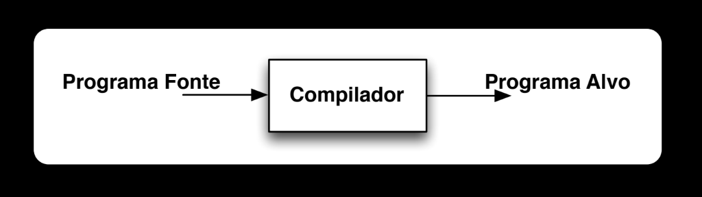

# COMPILADORES

!!! info "Referências do curso"
    - [Playlists do professor Leopoldo Teixeira (CIn/UFPE)](https://www.youtube.com/@LeopoldoTeixeiraCInUFPE/playlists)
    - [Material do curso IF688](https://if688.github.io)
    - [Repositório do curso no GitHub](https://github.com/if688/if688.github.io/tree/master)

## Conceitos

Uma **linguagem** é um sistema de comunicação baseado em símbolos e regras — essencial para qualquer forma de comunicação, humana ou não. A pergunta que motiva toda essa disciplina é: como expressar uma linguagem que o computador entenda? A resposta prática são as **linguagens de programação**.

Antes que um programa possa ser executado, é preciso traduzi-lo para algo que o computador consiga realmente processar. Essa tradução é feita por um **compilador**: um programa cuja função é traduzir de uma **linguagem fonte** para uma **linguagem alvo**.

Existem linguagens que fazem esse processo de compilação explicitamente, antes de executar o programa — chamadas de **linguagens compiladas**:

??? note "Diagrama: Programa Fonte → Compilador → Programa Alvo"
    

Ao ser compilado, o programa alvo se torna um executável. Já existem linguagens que abstraem completamente essa etapa de compilação e executam o programa diretamente — chamadas de **linguagens interpretadas**:

??? note "Diagrama: Entrada → Programa Alvo → Saída"
    

E existem linguagens que misturam as duas abordagens, usando um programa intermediário e uma máquina virtual para executar os programas: um tradutor gera um **código intermediário**, e uma máquina virtual executa esse código (recebendo também a entrada diretamente) para produzir a saída.

??? note "Diagrama: Programa Fonte → Tradutor → Programa Intermediário + Entrada → Máquina Virtual → Saída"
    

!!! tip "Dividir para conquistar"
    Os compiladores não tentam traduzir o código inteiro de uma só vez — eles aplicam a estratégia de "dividir para conquistar", quebrando o processo em módulos independentes. Por isso, todo compilador possui duas grandes fases: **análise** e **síntese**.

---

## Fases da Compilação

O **Front End** corresponde à fase de análise, e o **Back End** à fase de síntese: o programa fonte entra no Front End, que produz uma representação intermediária (IR), consumida pelo Back End, que produz o programa alvo.

??? note "Diagrama: Front End / Back End"
    

## Análise

A fase de análise transforma o código fonte textual em uma **representação intermediária (IR)** válida, correta e livre de erros, para que o compilador consiga entender e trabalhar com o programa. Ela se divide em três etapas sequenciais: léxica, sintática e semântica.

### Análise Léxica (Scanner)

O **analisador léxico** (ou *scanner*) converte o texto do programa em **tokens**, identificando a estrutura básica do código — cada token pode carregar um valor associado.

Por exemplo, a linha de código `position = initial + rate * 60` é convertida pelo Analisador Léxico na sequência de tokens `<identificador, 1>, <=>, <identificador, 2>, <+>, <identificador, 3>, <*>, <number, 60>` — em que os números associados aos identificadores (1, 2, 3) são índices para a **Tabela de Símbolos**, que registra o nome e o tipo de cada identificador encontrado (ex.: `1 → position`, `2 → initial`, `3 → rate`).

??? note "Diagrama de referência"
    

**Terminologia fundamental:**

| Termo | Definição |
| --- | --- |
| **Token** | Par formado pelo nome do token e atributos opcionais; os tipos de token são especificados por meio de expressões regulares. |
| **Lexema** | A sequência de caracteres concreta que casa com o padrão de um tipo de token. |
| **Padrão** | A descrição dos possíveis lexemas associados a um tipo de token. |

O projetista do compilador caracteriza o analisador léxico por meio de **expressões regulares (ERs)** — a geração do analisador léxico a partir dessas ERs pode ser automatizada.

#### Expressões regulares

Uma expressão regular é um formalismo denotacional definido a partir de conjuntos básicos, concatenação e união. Os operadores regulares fundamentais são:

| Operador | Significado | Exemplo |
| --- | --- | --- |
| `.` | Reconhece qualquer caractere exceto `\n` | `a.c` → `abc`, `aac`, `acc`, `a9c`, etc. |
| `*` | Zero ou mais repetições de `r` | `r*` reconhece `""`, `"r"`, `"rr"`, etc. |
| `+` | Uma ou mais repetições: $r^+ = rr^*$ — ou seja, enquanto $r^*$ representa toda sentença formada por 0 ou mais concatenações, $r^+$ representa sentenças formadas por pelo menos 1 concatenação de $r$. | — |
| `?` | Zero ou uma ocorrência (opcional): $r? = (r \mid \varepsilon)$ — ou seja, a linguagem formada por 0 ou 1 concatenação sucessiva de $r$. | — |
| `\|` | "Ou" | `r1 \| r2` → `r1` ou `r2` |

Também existem **classes de caracteres**: uma expressão regular $a_1|a_2|\ldots|a_n$ pode ser substituída pela abreviação $[a_1a_2\ldots a_n]$; se $a_1, a_2, \ldots, a_n$ formam uma sequência, pode-se substituir por $a_1$-$a_n$. Exemplos: `[abc] = a|b|c` e `[a-z] = a|b|c|...|z`.

??? note "Imagens de referência (fotos do quadro com os operadores `+`, `?` e classes de caracteres)"
    
    
    

A notação `[^xyz]` significa qualquer caractere **exceto** `x`, `y` e `z` — por exemplo, `[^0-9]` casa qualquer caractere que não seja dígito.

!!! example
    - $0^*10^* = \{w \mid w \text{ contém um único } 1\}$
    - $(0|1)^*1(0|1)^* = \{w \mid w \text{ tem pelo menos um } 1\}$
    - $(0|1)^*001(0|1)^* = \{w \mid w \text{ contém a sub-sentença } 001\}$

    | ER | Linguagem gerada |
    | --- | --- |
    | `aa` | somente a palavra `aa` |
    | `ba*` | todas as palavras que iniciam por `b`, seguido por zero ou mais `a` |
    | `(a\|b)*` | todas as palavras sobre `{a, b}` |
    | `(a\|b)*aa(a\|b)*` | todas as palavras contendo `aa` como subpalavra |
    | `a*ba*ba*` | todas as palavras contendo exatamente dois `b` |
    | `(a\|b)*(aa\|bb)` | todas as palavras que terminam com `aa` ou `bb` |
    | `(a\|ε)(b\|ba)*` | todas as palavras que não possuem dois `a` consecutivos |

    ??? note "Imagens de referência"
        
        

Para implementar um analisador léxico, é preciso: definir a **microssintaxe** da linguagem (tokens e lexemas), estabelecer critérios de separação e agregação de palavras, definir palavras especiais/reservadas, e implementar o analisador a partir dessa especificação.

!!! example "Especificações léxicas"
    Especificação informal de alguns tokens comuns:

    | Token | Descrição informal | Ex.: lexemas |
    | --- | --- | --- |
    | `if` | caracteres `i`, `f` | `if` |
    | `else` | caracteres `e`,`l`,`s`,`e` | `else` |
    | `comparison` | `<`, `>`, `<=`, `>=`, `==`, `!=` | `<=`, `!=` |
    | `id` | letra seguida de letras e dígitos | `pi`, `score`, `D2` |
    | `number` | qualquer constante numérica | `3.14159`, `0`, `6.02e23` |
    | `literal` | qualquer coisa exceto `"`, envolvida por aspas | `"exemplo"` |

    Exemplo de geração de código a partir de uma especificação (para `position = initial + rate * 60`): a representação intermediária `t2 = id3 * 60.0` / `id1 = id2 + t2` é passada ao **Gerador de Código**, que produz o código de máquina:
    ```
    LDF  R2, id3
    MULF R2, R2, #60.0
    LDF  R1, id2
    ADDF R1, R1, R2
    STF  id1, R1
    ```

    ??? note "Imagens de referência"
        
        

#### Reconhecimento de tokens

Para reconhecer os tokens, constrói-se **diagramas de transição** e, em seguida, implementa-se uma máquina de estados que combina esses diagramas.

!!! example
    Regras léxicas (via ER) para alguns tokens comuns:

    - $\textit{if} \to$ `if`
    - $\textit{id} \to$ `[a-z][a-z0-9]*`
    - $\textit{num} \to$ `[0-9]+`
    - $\textit{real} \to$ `([0-9]+"."[0-9]*) | ([0-9]*"."[0-9]+)`
    - $\textit{ws} \to$ `("--"[a-z]*"\n") | (" "|"\n"|"\t")+`
    - $\textit{error} \to$ `.`

    Cada uma dessas regras corresponde a um pequeno **diagrama de transição** (autômato finito) próprio: `IF` reconhece literalmente `i`→`f`; `ID` reconhece uma letra seguida de zero ou mais letras/dígitos (laço em `a-z`/`0-9` no estado final); `NUM` reconhece um ou mais dígitos; `REAL` reconhece dígitos, um ponto, e mais dígitos; `white space` reconhece comentários (`--` até `\n`) ou espaços em branco; `error` reconhece qualquer caractere que não seja `\n`. Esses diagramas individuais são então combinados em uma única máquina de estados: a partir do estado inicial 1, cada ramo de entrada (`i`, `a-e,g-z,0-9`, dígitos, `.`, `-`, espaço em branco, outros) leva a um estado intermediário que eventualmente converge nos estados de aceitação `ID` (4), `NUM`/`REAL` (7/8), `error` (5, 9, 13), ou `white space` (12).

    ??? note "Diagramas de transição individuais e autômato combinado"
        
        
        

O **lexer** interage diretamente com o **parser**: o parser chama `getNextToken()` no lexer, que lê caracteres do programa fonte, consulta/atualiza a tabela de símbolos, e devolve o próximo `token` — o que ajuda no reconhecimento de erros mais cedo no pipeline.

??? note "Diagrama de interação lexer/parser"
    

### Análise Sintática (Parser)

O **parser** usa os tokens gerados pela análise léxica para construir uma **árvore sintática**, verificando se a estrutura do código segue a gramática da linguagem. Cada nó interno da árvore representa uma operação, e seus filhos representam os argumentos dessa operação. A análise sintática serve, portanto, para detectar erros de **estrutura**.

!!! example
    Continuando o exemplo anterior, a sequência de tokens `<identificador, 1>, <=>, <identificador, 2>, <+>, <identificador, 3>, <*>, <number, 60>` é organizada pelo parser na árvore sintática:
    ```
            =
           / \
      <id,1>  +
             /  \
        <id,2>   *
               /   \
          <id,3>    60
    ```

    ??? note "Imagem de referência"
        

Há três desfechos possíveis: (1) o parsing ocorre perfeitamente, e a sintaxe do programa está correta; (2) ocorre um erro de sintaxe (violação das regras gramaticais); (3) independentemente do caso, o programa ainda pode conter erros que só serão capturados (ou não) pelo *type checker* na análise semântica.

#### Gramáticas livres de contexto

A **gramática livre de contexto (GLC)** caracteriza a linguagem, e o parser pode ser gerado automaticamente a partir dela — para cada classe gramatical da GLC, existirá uma estrutura de dados correspondente no compilador.

Derivamos palavras de uma gramática $G$ a partir do seu símbolo inicial, substituindo repetidamente não-terminais pelo corpo de uma produção. A linguagem gerada por $G$, denotada $L(G)$, inclui todas as strings obtidas através de derivações em $G$.

!!! example
    Para a gramática $G$ abaixo:

    $$exp \to exp + exp \mid exp - exp \mid digit$$
    $$digit \to 0\mid1\mid2\mid3\mid4\mid5\mid6\mid7\mid8\mid9$$

    $$L(G) = \{0, 1, \ldots, 0{+}1, 0{+}2, \ldots, 1{-}1, \ldots\}$$

    ??? note "Imagem de referência"
        

**Expressões regulares vs. gramáticas livres de contexto.** Tudo que pode ser escrito com uma ER também pode ser escrito com uma GLC, mas as ERs têm vantagens práticas importantes:

- regras léxicas são especificadas mais simplesmente com ER;
- ERs geralmente são mais concisas e simples;
- é possível gerar analisadores léxicos mais eficientes a partir de ERs;
- isso estrutura/modulariza o front-end do compilador.

Na prática, ERs são convenientes para especificar a estrutura de construções léxicas (identificadores, constantes, palavras-chave), enquanto gramáticas são usadas para especificar estruturas **aninhadas** (parênteses balanceados, `begin`-`end`, `if`-`then`-`else`, etc.).

**Derivação**: dada uma gramática $G$, produz uma string $s \in L(G)$.

!!! example "Exemplo de derivação"
    Para a gramática $G$: $S \to \mathbf{a}AB\mathbf{e}$, $A \to A\mathbf{bc} \mid \mathbf{b}$, $B \to \mathbf{d}$, a derivação de `abbcbcde` é:

    $$S \to \mathbf{a}\underline{A}B\mathbf{e} \to \mathbf{a}\underline{A}\mathbf{bc}B\mathbf{e} \to \mathbf{a}\underline{A}\mathbf{bcbc}B\mathbf{e} \to \mathbf{abbcbc}\underline{B}\mathbf{e} \to \mathbf{abbcbcde}$$

    (o símbolo sublinhado em cada passo é o não-terminal substituído a seguir.)

    ??? note "Imagem de referência"
        

#### Parsing

Dada uma string $s \in L(G)$, o **parsing** produz uma árvore sintática que demonstra como obter uma derivação de $s$ — para o exemplo acima, a árvore sintática correspondente à derivação de `abbcbcde` tem $S$ na raiz, com filhos `a`, $A$, $B$, `e`; o nó $A$ se expande recursivamente em $A \to \mathbf{b}$ e dois níveis de `A bc`, formando a cadeia `b`, `c`, `b`, `c`; e o nó $B$ se expande em `d`.

??? note "Imagem de referência (árvore + derivação lado a lado)"
    

Para gramáticas livres de contexto, é sempre possível construir um parser com complexidade $O(n^3)$ para processar $n$ tokens — mas, na prática, o parsing de linguagens de programação normalmente pode ser feito **linearmente**, com uma travessia da esquerda para a direita, olhando um token por vez.

!!! note "O marcador de fim de arquivo"
    Parsers devem ler não apenas os símbolos terminais, mas também o marcador de fim de entrada. Usa-se `$` para representá-lo, e costuma-se aumentar a gramática com uma produção extra $S' \to S\$$.

Existem três grandes categorias de métodos de parsing: os **métodos universais** (funcionam para qualquer gramática, mas são ineficientes demais para uso prático), os métodos **top-down**, e os métodos **bottom-up**.

### Parsing Top-Down

Métodos top-down constroem a árvore sintática a partir da **raiz**, em direção às folhas. O método geral é:

1. A partir do símbolo inicial da gramática, consumir tokens da esquerda para a direita.
2. Decidir qual produção aplicar, de acordo com o token lido.
3. Continuar até que um dos casos a seguir se torne verdadeiro:
    - todas as folhas são símbolos terminais e não há mais tokens a ler;
    - ocorre uma incompatibilidade entre a entrada e as folhas da árvore parcialmente construída — nesse caso, usa-se **backtracking**, restaurando o estado anterior à última escolha.

!!! example
    Retomando a gramática $S \to \mathbf{a}AB\mathbf{e}$, $A \to A\mathbf{bc} \mid \mathbf{b}$, $B \to \mathbf{d}$: o parsing top-down consome a entrada `a b b c b c d e $` da esquerda para a direita, casando cada símbolo terminal com o próximo símbolo esperado pela derivação correspondente (`S → aABe → aAbcBe → aAbcbcBe → abbcbcBe → abbcbcde`).

    ??? note "Imagem de referência"
        

#### Backtracking e parsing preditivo

Backtracking é indesejável — causa ineficiência de código, principalmente em parsers top-down com derivação mais-à-esquerda. A solução ideal é realizar um **parsing preditivo (predictive parsing)**: o token lido como próximo terminal deve fornecer informação suficiente para decidir, sem ambiguidade, qual produção aplicar.

Duas situações geram problemas para o parsing preditivo: **recursão à esquerda** e **ambiguidade**.

**Recursão à esquerda.** Uma gramática é recursiva à esquerda se existe um não-terminal $A$ tal que $A$ deriva $A\alpha$ para alguma string $\alpha$. Existem técnicas para eliminar essa recursão automaticamente — por exemplo, a gramática $S \to \mathbf{a}AB\mathbf{e}$, $A \to A\mathbf{bc} \mid \mathbf{b}$, $B \to \mathbf{d}$ pode ser reescrita, eliminando a recursão em $A$, como $S \to \mathbf{a}AB\mathbf{e}$, $A \to \mathbf{b}K$, $K \to \mathbf{bc}K \mid \varepsilon$, $B \to \mathbf{d}$.

??? note "Imagem de referência"
    

- **Reescrever as produções, tornando-as recursivas à direita:** de forma geral, $A \to A\alpha \mid \beta$ é reescrita para $A \to \beta R$, $R \to \alpha R \mid \varepsilon$.

    ??? note "Imagem de referência"
        

    !!! example
        A gramática $A \to A\mathbf{c} \mid A\mathbf{ad} \mid \mathbf{bd} \mid \varepsilon$ se torna $A \to \mathbf{bd}A' \mid A'$, $A' \to \mathbf{c}A' \mid \mathbf{ad}A' \mid \varepsilon$.

        ??? note "Imagens de referência"
            
            

- **Fatoração à esquerda**: técnica de transformação de gramática que combina os casos em que há mais de uma alternativa a partir do reconhecimento de um único token (existem algoritmos sistemáticos para realizá-la).

    !!! example
        Dado o clássico problema do "dangling else": $stmt \to \mathbf{if}\ expr\ \mathbf{then}\ stmt \mid \mathbf{if}\ expr\ \mathbf{then}\ stmt\ \mathbf{else}\ stmt \mid \mathbf{other}$ — representado de forma mais compacta como $S \to \mathbf{i}E\mathbf{t}S \mid \mathbf{i}E\mathbf{t}S\mathbf{e}S \mid \mathbf{a}$, $E \to \mathbf{b}$.

        ??? note "Imagens de referência"
            
            

        **Solução** (fatorando o prefixo comum $\mathbf{i}E\mathbf{t}S$): $S \to \mathbf{i}E\mathbf{t}SS' \mid \mathbf{a}$, $S' \to \mathbf{e}S \mid \varepsilon$, $E \to \mathbf{b}$.

        ??? note "Imagem de referência"
            

**Ambiguidade.** Uma gramática é dita **ambígua** quando gera mais de uma árvore sintática para a mesma string — e a interpretação do programa pode mudar dependendo de qual estrutura foi derivada.

!!! example
    A expressão `9 - 5 + 2`, dependendo de como é associada, pode ser lida como $(9-5)+2$ (associando primeiro `-`) ou como $9-(5+2)$ (associando primeiro `+`) — duas árvores sintáticas distintas para a mesma string, o que é o sinal de uma gramática ambígua (ex.: $exp \to exp + exp \mid exp - exp \mid digit$, sem precedência/associatividade definida).

    ??? note "Imagem de referência (duas árvores para a mesma expressão)"
        

#### Gramática preditiva (LL(1))

Uma **gramática preditiva** é uma gramática **LL(1)**: o primeiro **L** significa que o parser lê a entrada da esquerda para a direita; o segundo **L** significa que ele produz uma derivação mais-à-esquerda (*leftmost*); e o **(1)** significa que usa exatamente 1 símbolo de *lookahead* para decidir qual regra aplicar.

Uma gramática LL(1) precisa ser:

- **não ambígua** — cada entrada (símbolo terminal) leva a, no máximo, uma produção possível;
- **não recursiva à esquerda** — não pode ter produções que começam com o próprio não-terminal;
- **fatorada à esquerda** — se duas produções do mesmo não-terminal começam com o mesmo prefixo, esse prefixo precisa ser extraído: $A \to \alpha\beta \mid \alpha\gamma$ se torna $A \to \alpha A'$, $A' \to \beta \mid \gamma$.

??? note "Imagem de referência"
    

A construção de parsers top-down (e também bottom-up) é auxiliada pelos conjuntos **FIRST** e **FOLLOW**, que ajudam o parser a decidir qual produção aplicar com base no próximo símbolo de entrada. A classe LL(1), apesar de restrita, é rica o suficiente para cobrir a maioria das construções de linguagens de programação reais.

**FIRST.** $\text{FIRST}(\alpha)$, onde $\alpha$ é qualquer string de símbolos da gramática, é o conjunto de terminais que podem iniciar strings derivadas a partir de $\alpha$. Se $\alpha$ pode gerar $\varepsilon$, então $\varepsilon \in \text{FIRST}(\alpha)$.

!!! example
    Para a gramática $S \to \mathbf{a}AB\mathbf{e}$, $A \to \mathbf{b}K$, $K \to \mathbf{bc}K \mid \varepsilon$, $B \to \mathbf{d}$, o cálculo de FIRST, preenchido progressivamente, chega a:

    | | FIRST |
    | --- | --- |
    | $S$ | $\{\mathbf{a}\}$ |
    | $A$ | $\{\mathbf{b}\}$ |
    | $K$ | $\{\mathbf{b}, \varepsilon\}$ |
    | $B$ | $\{\mathbf{d}\}$ |

    ??? note "Imagens de referência (construção passo a passo)"
        
        
        
        
        

*Como calcular $\text{FIRST}(X)$:*

- se $X$ é terminal, $\text{FIRST}(X) = \{X\}$;
- se $X \to \varepsilon$, então $\varepsilon \in \text{FIRST}(X)$;
- se $X \to Y_1Y_2\ldots Y_k$, então $\text{FIRST}(Y_1Y_2\ldots Y_k) \subseteq \text{FIRST}(X)$, onde $\text{FIRST}(Y_1Y_2\ldots Y_k)$ é:
    - $\text{FIRST}(Y_1)$, se $\varepsilon \notin \text{FIRST}(Y_1)$;
    - $(\text{FIRST}(Y_1) \setminus \{\varepsilon\}) \cup \text{FIRST}(Y_2\ldots Y_k)$, se $\varepsilon \in \text{FIRST}(Y_1)$;
    - e $\varepsilon \in \text{FIRST}(Y_1Y_2\ldots Y_k)$ se $\varepsilon \in \text{FIRST}(Y_j)$ para todo $j$ de $1$ a $k$.

**FOLLOW.** $\text{FOLLOW}(A)$, onde $A$ é um não-terminal, é o conjunto de terminais $a$ que podem aparecer imediatamente à direita de $A$ em alguma derivação. Se $A$ pode ser a produção mais à direita da gramática, então $\$ \in \text{FOLLOW}(A)$.

!!! example
    Continuando o mesmo exemplo, completando a coluna FOLLOW:

    | | FIRST | FOLLOW |
    | --- | --- | --- |
    | $S$ | $\{\mathbf{a}\}$ | $\{\$\}$ |
    | $A$ | $\{\mathbf{b}\}$ | $\{\mathbf{d}\}$ |
    | $K$ | $\{\mathbf{b}, \varepsilon\}$ | $\{\mathbf{d}\}$ |
    | $B$ | $\{\mathbf{d}\}$ | $\{\mathbf{e}\}$ |

    ??? note "Imagens de referência (construção passo a passo)"
        
        
        
        
        

*Como calcular $\text{FOLLOW}(A)$:*

- $\$ \in \text{FOLLOW}(S)$, onde $S$ é o símbolo inicial;
- se existe produção $A \to \alpha B \beta$, tudo que está em $\text{FIRST}(\beta)$ exceto $\varepsilon$ está em $\text{FOLLOW}(B)$;
- se existe produção $A \to \alpha B$, tudo que está em $\text{FOLLOW}(A)$ está em $\text{FOLLOW}(B)$;
- se existe produção $A \to \alpha B \beta$ e $\varepsilon \in \text{FIRST}(\beta)$, tudo que está em $\text{FOLLOW}(A)$ está em $\text{FOLLOW}(B)$.

#### LL(1) table-driven parsing

A **tabela de parsing** diz qual ação tomar com base no estado atual e no próximo símbolo de entrada — representada como uma matriz bidimensional $M[A, a]$, onde $A$ é não-terminal e $a$ é terminal (incluindo `$`), construída a partir de FIRST e FOLLOW. Para a gramática do exemplo acima, a tabela começa vazia, com linhas $S, A, K, B$ e colunas $a, b, c, d, e, \$$.

??? note "Imagens de referência (FIRST/FOLLOW da gramática e tabela vazia)"
    
    

**Algoritmo de construção da tabela:**

1. Para cada produção $A \to \alpha$ de $G$:
    - para todo $a \in \text{FIRST}(\alpha)$, adicione $A \to \alpha$ em $M[A, a]$;
    - se $\varepsilon \in \text{FIRST}(\alpha)$, então, para todo $b \in \text{FOLLOW}(A)$ (incluindo `$`), adicione $A \to \alpha$ em $M[A, b]$.
2. Posições em branco na tabela representam **erro**.

!!! example
    Aplicando o algoritmo à gramática do exemplo, a tabela resultante é:

    | | a | b | c | d | e | $ |
    | --- | --- | --- | --- | --- | --- | --- |
    | $S$ | $S \to \mathbf{a}AB\mathbf{e}$ | | | | | |
    | $A$ | | $A \to \mathbf{b}K$ | | | | |
    | $K$ | | $K \to \mathbf{bc}K$ | | $K \to \varepsilon$ | | |
    | $B$ | | | | $B \to \mathbf{d}$ | | |

    ??? note "Imagem de referência"
        

#### Gramática LL(1): definição formal e exemplos

$G$ é LL(1) se, e somente se, para quaisquer duas produções distintas $A \to \alpha \mid \beta$:

1. para nenhum terminal $a$, tanto $\alpha$ quanto $\beta$ geram palavras iniciadas em $a$;
2. no máximo um de $\alpha, \beta$ deriva a palavra vazia;
3. se $\beta$ deriva $\varepsilon$, $\alpha$ não pode derivar palavras iniciadas com terminais de $\text{FOLLOW}(A)$;
4. se $\alpha$ deriva $\varepsilon$, $\beta$ não pode derivar palavras iniciadas com terminais de $\text{FOLLOW}(A)$.

!!! example "A gramática é LL(1)?"
    **1.** $S \to \mathbf{a}AB\mathbf{e}$, $A \to A\mathbf{bc} \mid \mathbf{b}$, $B \to \mathbf{d}$, com FIRST/FOLLOW: $S$: $\{\mathbf{a}\}/\{\$\}$; $A$: $\{\mathbf{b}\}/\{\mathbf{b},\mathbf{d}\}$; $B$: $\{\mathbf{d}\}/\{\mathbf{e}\}$. Ao tentar montar a tabela, a célula $M[A,\mathbf{b}]$ recebe simultaneamente $A \to A\mathbf{bc}$ e $A \to \mathbf{b}$.

    Não — a produção $A \to Abc$ é recursiva à esquerda. Além disso, $\text{FIRST}(Abc)$ contém $\text{FIRST}(A) = \{b\}$, o que faria $M[A, b]$ conter duas produções simultaneamente.

    ??? note "Imagens de referência"
        
        

    **2.** $S \to \mathbf{i}E\mathbf{t}SS' \mid \mathbf{a}$, $S' \to \mathbf{e}S \mid \varepsilon$, $E \to \mathbf{b}$, com FIRST/FOLLOW: $S$: $\{\mathbf{i},\mathbf{a}\}/\{\$,\mathbf{e}\}$; $S'$: $\{\mathbf{e},\varepsilon\}/\{\$,\mathbf{e}\}$; $E$: $\{\mathbf{b}\}/\{\mathbf{t}\}$. Na tabela, a célula $M[S', \mathbf{e}]$ recebe tanto $S' \to \mathbf{e}S$ (pois $\mathbf{e} \in \text{FIRST}(\mathbf{e}S)$) quanto $S' \to \varepsilon$ (pois $\mathbf{e} \in \text{FOLLOW}(S')$, já que $\varepsilon \in \text{FIRST}(\varepsilon)$).

    $\text{FIRST}(eS) = \{e\}$, logo $M[S', e] = S' \to eS$. Porém, como $\varepsilon \in \text{FIRST}(\varepsilon)$, é preciso olhar $\text{FOLLOW}(S') = \{\$, e\}$: para `$`, $M[S', \$] = S' \to \varepsilon$; para `e`, $M[S', e] = S' \to \varepsilon$ — mas $M[S', e]$ já contém $S' \to eS$, gerando um **conflito**. Logo, **não** é LL(1).

    ??? note "Imagens de referência"
        
        

!!! example "Exemplo completo"
    O mesmo processo (gramática → FIRST/FOLLOW → tabela de parsing) aplicado passo a passo a $S \to \mathbf{i}E\mathbf{t}SS' \mid \mathbf{a}$, $S' \to \mathbf{e}S \mid \varepsilon$, $E \to \mathbf{b}$.

    ??? note "Imagens de referência (construção passo a passo)"
        
        
        

#### Parsing preditivo não recursivo

Um parser preditivo **não recursivo** pode ser construído mantendo uma pilha explícita, em vez de usar chamadas recursivas implícitas. Se $w$ é a entrada já casada, a pilha mantém uma sequência de símbolos da gramática $\alpha$ tal que $S \Rightarrow^* w\alpha$.

!!! example
    Para a gramática $E \to TE'$, $E' \to {+}TE' \mid \varepsilon$, $T \to FT'$, $T' \to {*}FT' \mid \varepsilon$, $F \to (E) \mid \mathbf{id}$ e sua tabela de parsing LL(1), o parsing não recursivo de `id + id * id` segue a sequência (Pilha | Entrada):

    | Pilha | Entrada |
    | --- | --- |
    | `E$` | `id + id * id$` |
    | `TE'$` | `id + id * id$` |
    | `FT'E'$` | `id + id * id$` |
    | `id T'E'$` | `id + id * id$` |
    | `T'E'$` | `+ id * id$` |
    | `E'$` | `+ id * id$` |
    | `+TE'$` | `+ id * id$` |
    | `TE'$` | `id * id$` |
    | `FT'E'$` | `id * id$` |
    | `id T'E'$` | `id * id$` |
    | `T'E'$` | `* id$` |
    | `*FT'E'$` | `* id$` |
    | `FT'E'$` | `id$` |
    | `id T'E'$` | `id$` |
    | `T'E'$` | `$` |
    | `E'$` | `$` |
    | `$` | `$` |

    ??? note "Imagem de referência (gramática, tabela e trace completo)"
        

#### Recursive-descent parsing

É um método de análise sintática top-down em que um conjunto de **procedimentos recursivos** processa a entrada — cada procedimento associado a um não-terminal da gramática. O parsing preditivo é um caso especial de recursive-descent parsing, em que o símbolo de lookahead determina, sem ambiguidade, qual procedimento chamar para cada não-terminal.

### Parsing Bottom-Up

Métodos bottom-up constroem a árvore sintática a partir das **folhas**, com a ideia de converter o programa de entrada no símbolo inicial. O parser lê tokens até encontrar uma subpalavra $w$ que case com o lado direito de uma produção $A \to w$; ao chegar nesse ponto, substitui $w$ por $A$, se isso resultar em uma derivação válida. Essa substituição é chamada de **redução**.

!!! example
    Para a gramática $S \to E\$$, $E \to T \mid E{+}T$, $T \to \mathbf{int} \mid (E)$ e a entrada `int + (int + int + int)`, o bottom-up parsing reduz progressivamente os tokens mais à esquerda em não-terminais, até alcançar $S$, seguindo a derivação (mais à direita, lida de baixo para cima):

    ```
    S
    → E$
    → E+T$
    → E+(E)$
    → E+(E+T)$
    → E+(E+int)$
    → E+(E+T+int)$
    → E+(E+int+int)$
    → E+(T+int+int)$
    → E+(int+int+int)$
    → T+(int+int+int)$
    → int+(int+int+int)$
    ```

    Ou seja: a cada passo, a substring mais à direita que casa com o lado direito de uma produção é reduzida (`int` → `T`, `T` → `E`, `(E)` → `T`, `E+T` → `E`), até sobrar apenas `S`.

    ??? note "Imagens de referência (árvore sintática e traces de redução)"
        
        
        

Formalmente, uma redução transforma a entrada $uwv$ em $uAv$ se $A \to w$ é uma produção da gramática.

#### Handles

Um **handle** é uma substring $w$ e uma produção $A \to w$ tal que, reduzindo $uwv \to uAv$, ainda é possível alcançar o símbolo inicial a partir de $uAv$ — ou seja, é uma redução que pode ser aplicada sem causar um beco sem saída.

!!! warning "Um \"falso\" handle"
    Para a gramática $S \to E\$$, $E \to F \mid E{+}F$, $F \to F{*}T \mid T$, $T \to \mathbf{int} \mid (E)$ e a entrada `int + int * int`, depois de reduzir os dois primeiros `int` a `F`, a subárvore `E → E + F` (cobrindo `int + int`) **parece** um handle — mas não é: o próximo token é `*`, que teria precedência sobre a soma, então reduzir `E+F` para `E` nesse ponto levaria a um beco sem saída (a derivação correta precisa primeiro reduzir `F*T` antes de somar).

    ??? note "Imagem de referência"
        

#### Análise shift-reduce

A ideia central é dividir a entrada em duas partes, separadas por um marcador `|` (ou `•`): à direita, terminais ainda não reduzidos; à esquerda, terminais e não-terminais já processados. A parte mais à direita da substring esquerda (ou imediatamente adjacente ao marcador) contém o candidato a handle. Handles e reduções só ocorrem dentro da substring esquerda; a direita contém apenas terminais ainda não vistos.

A cada passo, é preciso decidir entre duas ações:

- **Shift**: desloca o foco para a direita, "jogando" um terminal para a substring esquerda: $\mathbf{ABC}|\mathbf{xyz} \to \mathbf{ABCx}|\mathbf{yz}$.
- **Reduce**: reduz o que está imediatamente à esquerda do foco usando uma produção. Se $A \to \mathbf{xy}$ é uma produção, então $\mathbf{Cbxy}|\mathbf{lijk} \to \mathbf{Cb}A|\mathbf{lijk}$ é uma ação reduce $A \to \mathbf{xy}$.

??? note "Imagens de referência"
    
    

Se nenhuma das duas ações for possível, há um **erro sintático**.

#### Shift-reduce parsing com pilha

Toda redução ocorre na parte mais à direita da substring esquerda — representando-a como uma **pilha**, o `shift` empilha um token, e o `reduce` desempilha os símbolos de $w$ (reduzindo $A \to w$) e empilha $A$ em seu lugar. A redução ocorre quando o conteúdo do topo da pilha corresponde exatamente a um handle: formalmente, em um passo de derivação mais à direita $uAv \to uwv$, a cadeia $uw$ é um handle de $uwv$.

??? note "Imagem de referência"
    

Para reconhecer handles, observa-se tanto a pilha quanto o lookahead, decidindo a cada passo entre três ações:

- **shift**, se após a ação a pilha continuar tendo um prefixo viável;
- **reduce**, se encontrou um handle;
- **error**, se a entrada é mal-formada.

??? note "Imagem de referência"
    

!!! tip "Prefixos viáveis são regulares"
    O conjunto de prefixos viáveis de uma gramática forma uma **linguagem regular** — por isso é possível usar AFDs para determinar se o conteúdo da pilha corresponde a um prefixo viável.

#### Gramáticas LR(0)

Toda gramática **LR(0)** pode ser analisada por um shift-reduce parser. A classificação do nome segue a convenção:

- **L** → lê a entrada da esquerda para a direita;
- **R** → procura a derivação mais à direita;
- **(k)** → número de tokens de lookahead lidos, mas não consumidos.

Uma gramática LR(0) pode ser processada olhando **apenas** o conteúdo da pilha, sem usar lookahead para decidir entre shift e reduce — é, por isso, uma classe razoavelmente **fraca** de gramáticas, mas o algoritmo de construção de tabelas LR(0) é uma introdução valiosa aos algoritmos LR(1).

!!! example "Construção da tabela de parsing LR(0)"
    Para a gramática de listas $_0S' \to S\$$, $_1S \to (L)$, $_2S \to \mathbf{x}$, $_3L \to S$, $_4L \to L,S$, o autômato LR(0) de itens tem 9 estados:

    - **Estado 1**: $S' \to {\bullet}S\$$, $S \to {\bullet}(L)$, $S \to {\bullet}\mathbf{x}$ — em `x` vai para o estado 2; em `(` vai para o estado 3; em $S$ vai (goto) para o estado 4.
    - **Estado 2**: $S \to \mathbf{x}{\bullet}$ (item de redução, regra 2).
    - **Estado 3**: $S \to ({\bullet}L)$, $L \to {\bullet}S$, $L \to {\bullet}L,S$, $S \to {\bullet}(L)$, $S \to {\bullet}\mathbf{x}$ — em `x` vai para 2; em `(` laço para 3; em $S$ vai para 7; em $L$ vai para 5.
    - **Estado 4**: $S' \to S{\bullet}\$$ (aceita ao ler `$`).
    - **Estado 5**: $S \to (L{\bullet})$, $L \to L{\bullet},S$ — em `)` vai para 6; em `,` vai para 8.
    - **Estado 6**: $S \to (L){\bullet}$ (item de redução, regra 1).
    - **Estado 7**: $L \to S{\bullet}$ (item de redução, regra 3).
    - **Estado 8**: $L \to L,{\bullet}S$, $S \to {\bullet}(L)$, $S \to {\bullet}\mathbf{x}$ — em `x` vai para 2; em `(` vai para 3; em $S$ vai para 9.
    - **Estado 9**: $L \to L,S{\bullet}$ (item de redução, regra 4).

    ??? note "Imagem de referência"
        

    Regras de notação: `sn` → shift e vá para o estado $n$; `gn` → vá para o estado $n$ (goto); `rk` → reduza pela regra $k$; `a` (accept) → aceite a entrada; células vazias → erro.

    A tabela de parsing resultante:

    | | `(` | `)` | `x` | `,` | `$` | $S$ | $L$ |
    | --- | --- | --- | --- | --- | --- | --- | --- |
    | 1 | s3 | | s2 | | | g4 | |
    | 2 | r2 | r2 | r2 | r2 | r2 | | |
    | 3 | s3 | | s2 | | | g7 | g5 |
    | 4 | | | | | a | | |
    | 5 | | s6 | | s8 | | | |
    | 6 | r1 | r1 | r1 | r1 | r1 | | |
    | 7 | r3 | r3 | r3 | r3 | r3 | | |
    | 8 | s3 | | s2 | | | g9 | |
    | 9 | r4 | r4 | r4 | r4 | r4 | | |

    ??? note "Imagens de referência (autômato e tabela)"
        
        

**Executando o parsing.** Em vez de reescanear a pilha inteira a cada token, pode-se lembrar o estado alcançado em cada elemento da pilha — o algoritmo olha apenas o estado no topo da pilha e o símbolo de entrada atual para decidir a ação:

- `shift(n)`: avança a entrada em um token, empilha o estado `n`;
- `reduce(k)`: desempilha a quantidade de símbolos do lado direito da regra `k`; seja `X` o não-terminal do lado esquerdo da regra `k`; no estado agora no topo da pilha, observa a entrada `X` para pegar o valor de `goto(n)`; empilha o estado `n`;
- `accept`: encerra reportando sucesso;
- `error`: encerra reportando falha.

??? note "Imagem de referência"
    

!!! example "Trace completo de execução"
    Para a entrada `(x,x)$`, usando a gramática e tabela de parsing LR(0) acima:

    1. Empilha o estado 1 inicialmente.
    2. $M[1, (] = s3$ — empilha o estado 3.
    3. $M[3, x] = s2$ — empilha o estado 2.
    4. $M[2, {,}] = r2$ — reduz pela regra 2, substituindo `x` por `S`, volta ao estado 3; $M[3, S] = g7$, empilha 7.
    5. $M[7, {,}] = r3$ — reduz pela regra 3, substituindo `S` por `L`, desempilhando 7 e voltando ao estado 3; $M[3, L] = g5$, empilha 5.
    6. $M[5, {,}] = s8$ — empilha o estado 8.
    7. $M[8, x] = s2$ — empilha o estado 2.
    8. $M[2, )] = r2$ — reduz `x` para `S`, desempilhando 2 e voltando a 8; $M[8, S] = g9$, empilha 9.
    9. $M[9, )] = r4$ — reduz `(L, S)` para `L`, desempilhando 9, 8 e 5 (3 símbolos), voltando a 3; $M[3, L] = g5$, empilha 5.
    10. $M[5, )] = s6$ — empilha o estado 6.
    11. $M[6, \$] = r1$ — reduz `(L)` para `S`, desempilhando 6, 5 e 3 (3 símbolos), voltando a 1; $M[1, S] = g4$, empilha 4.
    12. $M[4, \$] = a$ — **aceita** a entrada.

    ??? note "Imagens de referência (snapshot da pilha a cada passo)"
        
        
        
        
        
        
        
        
        
        
        
        

**Conflitos.** Problemas na gramática, ou limitações da técnica escolhida, podem gerar conflitos na construção da tabela:

- **shift-reduce**: o parser não consegue decidir entre uma ação de shift (ou mais de uma) ou de reduce;
- **reduce-reduce**: não há como decidir entre duas ou mais ações de reduce — geralmente por ambiguidade na gramática, ou algum erro de projeto.

!!! example "Exemplo de conflito shift-reduce em $M[1, +]$"
    Para a gramática $_0S \to E\$$, $_1E \to T{+}E$, $_2E \to T$, $_3T \to \mathbf{x}$, o autômato LR(0) tem 6 estados; a tabela de parsing LR(0) (sem restrição de FOLLOW) tem, na linha do estado 3 (itens $E \to T{\bullet}{+}E$ / $E \to T{\bullet}$), um conflito na coluna `+`: tanto `s4` (shift, por causa de $E \to T{\bullet}{+}E$) quanto `r2` (reduce pela regra $E \to T$) são aplicáveis.

    ??? note "Imagem de referência (autômato e tabela LR(0) com conflito)"
        

#### Análise SLR

Para resolver esses conflitos, usa-se a análise **SLR (Simple LR)**, que utiliza o conjunto FOLLOW: a intuição é só reduzir se o próximo token (lookahead) estiver no conjunto FOLLOW do não-terminal associado à produção. Na tabela de parsing, inclui-se uma ação de reduce apenas se o terminal estiver no FOLLOW correspondente.

Nos autômatos SLR, estados podem conter mais de um item de redução, caso os conjuntos FOLLOW envolvidos sejam distintos entre si, e podem misturar itens de shift com itens de redução, caso os terminais de shift não estejam no FOLLOW dos itens de redução. Para a mesma gramática do exemplo acima, a restrição por FOLLOW resolve o conflito em $M[3, {+}]$ (que passa a conter só `s4`, já que `+` não está em $\text{FOLLOW}(E)$ naquele ponto). Mas isso **não elimina todos os tipos de conflito** — gramáticas mais complexas, em que o mesmo lookahead aparece simultaneamente em um contexto de shift e em um de reduce, continuam gerando conflitos mesmo com a restrição SLR.

??? note "Imagem de referência (tabela SLR, conflito resolvido para este caso)"
    

Para um poder de análise ainda maior, existem as gramáticas **LR(1)**.

#### Gramáticas LR(1)

LR(1) é mais poderoso que SLR, e suficiente para cobrir boa parte das linguagens de programação do mundo real. A noção de **item** é mais sofisticada, incluindo o símbolo de lookahead explicitamente. O parser LR(1) simula dois processos simultaneamente:

1. o autômato LR(0) subjacente, para encontrar handles;
2. um rastreador de tokens de lookahead, para determinar qual o lookahead atual.

!!! note
    Remover os lookaheads de um autômato LR(1) produz um autômato LR(0) correto, mas **muito maior**, para a mesma gramática.

**Construção do autômato LR(1):**

1. Iniciar com o estado contendo o item $S \to {\bullet}X[\$]$, onde $S$ é o símbolo inicial.
2. Computar o fecho do estado: se $S \to \alpha{\bullet}X\beta[t]$ pertence ao estado, adicionar $X \to {\bullet}\Phi[r]$ ao estado, para toda produção existente $X \to \Phi$ e todo terminal $r \in \text{FIRST}(\beta t)$.
3. Repetir o passo abaixo até que nenhum novo estado seja adicionado: se um estado contém a produção $S \to \alpha{\bullet}\mathbf{x}\beta[r]$ para o símbolo $\mathbf{x}$, adicionar uma transição deste estado para o estado contendo o fecho de $S \to \alpha\mathbf{x}{\bullet}\beta[r]$.

??? note "Imagem de referência"
    

!!! example "Construção passo a passo"
    Para a gramática $_0S \to E$, $_1E \to T$, $_2E \to E{+}T$, $_3T \to \mathbf{int}$, $_4T \to (E)$, o autômato é construído incrementalmente, estado por estado (cada novo símbolo lido a partir de um estado existente gera — ou reaproveita — um estado vizinho, cujo fecho é recomputado a cada passo, acrescentando o lookahead correto entre colchetes). Ao final do processo (9 "passadas" de construção), chega-se a um autômato com **16 estados**:

    | Estado | Itens | Transições |
    | --- | --- | --- |
    | 1 | $S\to{\bullet}E\ [\$]$; $E\to{\bullet}T\ [\$,{+}]$; $E\to{\bullet}E{+}T\ [\$,{+}]$; $T\to{\bullet}\mathbf{int}\ [\$,{+}]$; $T\to{\bullet}(E)\ [\$,{+}]$ | `int`→3, `(`→5, $T$→2, $E$→4 |
    | 2 | $E\to T{\bullet}\ [\$,{+}]$ | reduz regra 1 |
    | 3 | $T\to\mathbf{int}{\bullet}\ [\$,{+}]$ | reduz regra 3 |
    | 4 | $S\to E{\bullet}\ [\$]$; $E\to E{\bullet}{+}T\ [\$,{+}]$ | `+`→6, `$`→aceita |
    | 5 | $T\to{\bullet}(E)\ [\$,{+},)]$; $E\to{\bullet}T\ [{+},)]$; $E\to{\bullet}E{+}T\ [{+},)]$; $T\to{\bullet}\mathbf{int}\ [{+},)]$ | `int`→10, `(`→11, $T$→9, $E$→8 |
    | 6 | $E\to E{+}{\bullet}T\ [\$,{+}]$; $T\to{\bullet}\mathbf{int}\ [\$,{+}]$; $T\to{\bullet}(E)\ [\$,{+}]$ | `int`→3, `(`→5, $T$→7 |
    | 7 | $E\to E{+}T{\bullet}\ [\$,{+}]$ | reduz regra 2 |
    | 8 | $T\to(E{\bullet})\ [\$,{+}]$; $E\to E{\bullet}{+}T\ [{+},)]$ | `)`→12, `+`→13 |
    | 9 | $E\to T{\bullet}\ [{+},)]$ | reduz regra 1 |
    | 10 | $T\to\mathbf{int}{\bullet}\ [{+},)]$ | reduz regra 3 |
    | 11 | $T\to{\bullet}(E)\ [{+},)]$; $E\to{\bullet}T\ [{+},)]$; $E\to{\bullet}E{+}T\ [{+},)]$; $T\to{\bullet}\mathbf{int}\ [{+},)]$ | `int`→10, `(`→11, $T$→9, $E$→15 |
    | 12 | $T\to(E){\bullet}\ [\$,{+}]$ | reduz regra 4 |
    | 13 | $E\to E{+}{\bullet}T\ [{+},)]$; $T\to{\bullet}\mathbf{int}\ [{+},)]$; $T\to{\bullet}(E)\ [{+},)]$ | `int`→10, `(`→11, $T$→14 |
    | 14 | $E\to E{+}T{\bullet}\ [{+},)]$ | reduz regra 2 |
    | 15 | $T\to(E{\bullet})\ [{+},)]$; $E\to E{\bullet}{+}T\ [{+},)]$ | `)`→16, `+`→13 |
    | 16 | $T\to(E){\bullet}\ [{+},)]$ | reduz regra 4 |

    **Tabela de parsing LR(1) resultante:**

    | | `int` | `(` | `)` | `+` | `$` | $T$ | $E$ |
    | --- | --- | --- | --- | --- | --- | --- | --- |
    | 1 | shift 3 | shift 5 | | | | goto 2 | goto 4 |
    | 2 | | | | reduce 1 | reduce 1 | | |
    | 3 | | | | reduce 3 | reduce 3 | | |
    | 4 | | | | shift 6 | accept | | |
    | 5 | shift 10 | shift 11 | | | | goto 9 | goto 8 |
    | 6 | shift 3 | shift 5 | | | | goto 7 | |
    | 7 | | | | reduce 2 | reduce 2 | | |
    | 8 | | | shift 12 | shift 13 | | | |
    | 9 | | | reduce 1 | reduce 1 | | | |
    | 10 | | | reduce 3 | reduce 3 | | | |
    | 11 | shift 10 | shift 11 | | | | goto 9 | goto 15 |
    | 12 | | | reduce 4 | reduce 4 | | | |
    | 13 | shift 10 | shift 11 | | | | goto 14 | |
    | 14 | | | reduce 2 | reduce 2 | | | |
    | 15 | | | shift 16 | shift 13 | | | |
    | 16 | | | reduce 4 | reduce 4 | | | |

    ??? note "Imagens de referência (construção passo a passo, autômato final e tabela)"
        **Gramática:** 

        **Passo 1:**     

        **Passo 2:** 

        **Passo 3:** 

        **Passo 4:** 

        **Passo 5:**     

        **Passo 6:**     

        **Passo 7:**        

        **Passo 8:**     

        **Passo 9:**     

        **Autômato final:** 

        **Tabela de parsing resultante:** 

### Análise Semântica

A análise semântica valida o **significado** das expressões, detectando erros mais profundos — não mais sobre a *forma* do código, mas sobre o seu *sentido*. Usa a árvore sintática e a tabela de símbolos para checar a consistência semântica com a definição da linguagem (a linguagem pode permitir **coercions**: conversões automáticas entre tipos compatíveis). Uma vez que essa fase termina com sucesso, o programa de entrada é considerado válido. O maior desafio é um equilíbrio: rejeitar o maior número possível de programas incorretos, acertando o maior número possível de programas corretos.

!!! example
    Para a expressão `position = initial + rate * 60`, o Analisador Semântico recebe a árvore sintática `= (<id,1>, + (<id,2>, * (<id,3>, 60)))` e verifica/ajusta os tipos — por exemplo, inserindo uma conversão implícita `inttofloat` sobre o `60` (que entra como inteiro), já que `rate` é de ponto flutuante: a árvore resultante tem `*(<id,3>, inttofloat(60))` no lugar de `*(<id,3>, 60)`.

    ??? note "Imagem de referência"
        

!!! note "Limitações das GLCs"
    Uma gramática livre de contexto, por si só, não consegue responder perguntas como: como prevenir definições de classes duplicadas? Como diferenciar variáveis de um tipo das de outro tipo? Como garantir que uma classe implementa todos os métodos de uma interface? É justamente para isso que servem a análise semântica e a tabela de símbolos.

#### Árvores Sintáticas Abstratas (AST)

A **AST** sintetiza as informações de uma árvore sintática (*parse tree*), focando nas informações importantes e classificando os nós de acordo com seu papel na estrutura da linguagem — é uma representação mais compacta que facilita o trabalho do compilador. Usa-se a AST para criar estruturas de dados em código; idealmente, para toda AST existe um **interpretador** que executa as ações representadas por cada nó, geralmente implementado como uma função recursiva que mantém o estado do programa.

!!! example
    Para a gramática $E \to \mathbf{n} \mid (E) \mid E{+}E$ e a entrada `42 + (57+22)`, após a análise léxica obtemos os tokens `n(42) "+" "(" n(57) "+" n(22) ")"`.

    A **árvore sintática (parse tree)** completa reflete fielmente a estrutura gramatical, com um nó $E$ para cada aplicação de regra (incluindo os parênteses como nós-folha):
    ```
    E → E "+" E → n(42) "+" ( "(" E ")" ) → n(42) "+" ( "(" (E "+" E) ")" ) → ... → n(42) + (n(57) + n(22))
    ```

    Já a **AST** correspondente é muito mais compacta, mantendo só a estrutura essencial: a raiz é `+`, com filhos `42` e um segundo nó `+` (filhos `57` e `22`) — descartando parênteses e nós $E$ intermediários, que não carregam informação semântica própria.

    ??? note "Imagens de referência (tokens, parse tree e AST)"
        
        
        

**Direções de modularidade** ao operar sobre uma AST: pode-se pensar na estrutura como uma matriz, em que as linhas são os **tipos de nó** (*kinds* — ex.: `IdExp`, `NumExp`, `PlusExp`, `MinusExp`, `TimesExp`, `SeqExp`, ...) e as colunas são as **operações/interpretações** possíveis sobre eles (ex., em um compilador: *type-check*, traduzir para uma arquitetura específica, encontrar variáveis não inicializadas, otimizar; ou, em uma GUI: redesenhar, mover, iconizar, destacar). Organizar o código por linha (um método por tipo de nó, cobrindo todas as operações) facilita adicionar novos **tipos de nó**; organizar por coluna (uma função por operação, cobrindo todos os tipos) facilita adicionar novas **operações** sem tocar nas classes existentes — é exatamente esse segundo caso que o Visitor Pattern viabiliza.

??? note "Imagem de referência"
    

**Visitor Design Pattern.** É um padrão de modelagem para ASTs que centraliza as funcionalidades em um objeto *Visitor*, que encapsula as operações sobre a AST e recebe a própria árvore como parâmetro de suas funções. Sua finalidade é separar os algoritmos das estruturas de dados sobre as quais operam, permitindo adicionar novas operações a uma estrutura complexa sem precisar modificar as classes dos objetos que a compõem.

#### Checagem de tipos (Type-Checking)

Um **tipo** é uma categoria de elementos de programação. A checagem de tipos é o primeiro passo propriamente dito da análise semântica, composta por duas atividades: **inferência de tipos** e **checagem** propriamente dita — que pode ser feita de forma **estática** (em tempo de compilação) ou **dinâmica** (em tempo de execução).

**Sistema de tipos.** É a coleção de regras que limitam como um programa pode ser escrito, garantindo segurança em tempo de execução; a checagem de tipos verifica se essas regras estão sendo respeitadas. Um sistema é **strong** (fortemente tipado) se nunca permite erros de tipo passarem sem detecção, e **weak** (fracamente tipado) se pode permitir alguns.

**Componentes de um sistema de tipos:**

- **Built-in**: tipos pré-definidos para grupos de dados comuns (números, booleanos, caracteres), que variam entre linguagens.
- **Tipos compostos**: formados por um ou mais objetos, cada um com seu próprio tipo (arrays, strings, enums). É possível criar *structures* (records) que agrupam múltiplos objetos de tipos arbitrários; ponteiros são um tipo especial, capaz de manipular memória diretamente; e novos tipos podem ser criados a partir de tipos já existentes.
- **Equivalência de tipos**: toda linguagem precisa de regras sem ambiguidade para decidir se dois tipos diferentes são equivalentes:
    - **Name equivalence**: dois tipos são equivalentes **sse** têm o mesmo nome — se o programador escolheu nomes diferentes, a linguagem respeita essa escolha. A complexidade de gerenciar essa consistência de nomes cresce com o tempo.
    - **Structural equivalence**: dois tipos são equivalentes se têm a **mesma estrutura** — dois objetos podem ser trocados se têm o mesmo conjunto de campos, na mesma ordem, com tipos equivalentes. Examina as propriedades essenciais que definem o tipo, não seu nome.
- **Regras de inferência**: envolvem os tipos dos operandos e o tipo do resultado de uma expressão (por exemplo, em expressões aritméticas, os tipos dos dois lados de um operador precisam ser compatíveis). Misturar tipos incompatíveis em uma expressão pode ser ilegal, podendo até impedir a compilação — ou o compilador pode aplicar conversões implícitas (*coercions*). Muitas linguagens exigem declaração de variáveis antes do uso, estabelecendo tipos bem definidos desde o início; linguagens que não exigem isso tornam a inferência de tipos mais complexa. A inferência de tipos de expressões normalmente segue a estrutura sintática da própria expressão, e pode depender de procedimentos/funções do programa — por isso, funções normalmente definem **assinaturas de tipo** explícitas.

#### Gramática de atributos

É um formalismo para realizar análise sensível ao contexto, enriquecendo uma GLC com regras que especificam computações: cada regra define um atributo em termos dos valores de outros atributos.

!!! example
    Gramática de atributos para declarações de variáveis (`D → T L`, `T → int | real`, `L → L₁, id | id`):

    | Produção | Regra semântica |
    | --- | --- |
    | $D \to T\ L$ | `L.in = T.type` |
    | $T \to \mathbf{int}$ | `T.type = integer` |
    | $T \to \mathbf{real}$ | `T.type = real` |
    | $L \to L_1\mathbf{,}\ \mathbf{id}$ | `L₁.in = L.in` |
    | $L \to \mathbf{id}$ | `addtype(id.entry, L.in)` |

    O atributo `type` é **sintetizado** (calculado a partir dos filhos, subindo na árvore), e o atributo `in` é **herdado** (definido em termos de nós ancestrais, descendo na árvore) — por exemplo, para `real id₁, id₂, id₃`: `T.type = real` sintetiza a partir da folha `real`; esse valor desce como `L.in = real` por cada nível de `L → L₁, id`, até alcançar cada `idᵢ`.

    ??? note "Imagens de referência"
        
        

!!! example "Exemplo completo com extensão incremental de regras"
    Um sistema de checagem de tipos construído incrementalmente sobre a gramática $P \to D\mathbf{;}E$, $D \to D\mathbf{;}D \mid \mathbf{id}\mathbf{:}T$, $T \to \mathbf{char} \mid \mathbf{integer} \mid \mathbf{array[num]\ of\ }T \mid {}^\wedge T$, $E \to \mathbf{literal} \mid \mathbf{num} \mid \mathbf{id} \mid E\ \mathbf{mod}\ E \mid E[E] \mid E^\wedge$:

    | Produção | Regra semântica |
    | --- | --- |
    | $D \to \mathbf{id}\mathbf{:}T$ | `{ addtype(id.entry, T.type) }` |
    | $T \to \mathbf{char}$ | `{ T.type = char }` |
    | $T \to \mathbf{integer}$ | `{ T.type = integer }` |
    | $T \to \mathbf{array[num]\ of\ }T_1$ | `{ T.type = array(1..num.val, T1.type) }` |
    | $T \to {}^\wedge T_1$ | `{ T.type = pointer(T1.type) }` |
    | $E \to \mathbf{literal}$ | `{ E.type = char }` |
    | $E \to \mathbf{num}$ | `{ E.type = integer }` |
    | $E \to \mathbf{id}$ | `{ E.type = lookup(id.entry) }` |
    | $E \to E_1\ \mathbf{mod}\ E_2$ | `{ E.type = if (E1.type==integer ∧ E2.type==integer) integer else type_error }` |
    | $E \to E_1[E_2]$ | `{ E.type = if (E2.type==integer ∧ E1.type==array(s,t)) t else type_error }` |
    | $E \to E_1^\wedge$ | `{ E.type = if (E1.type==pointer(t)) t else type_error }` |

    ??? note "Imagens de referência"
        
        
        

    **Adicionando novas regras**, para comandos ($T \to \mathbf{boolean}$, $S \to \mathbf{id}{=}E \mid \mathbf{if}\ E\ \mathbf{then}\ S_1 \mid \mathbf{while}\ E\ \mathbf{do}\ S_1$):

    | Produção | Regra semântica |
    | --- | --- |
    | $T \to \mathbf{boolean}$ | `{ T.type = boolean }` |
    | $S \to \mathbf{id}{=}E$ | `{ if (lookup(id.entry) != E.type) type_error }` |
    | $S \to \mathbf{if}\ E\ \mathbf{then}\ S_1$ | `{ if (E.type != boolean) type_error }` |
    | $S \to \mathbf{while}\ E\ \mathbf{do}\ S_1$ | `{ if (E.type != boolean) type_error }` |

    ??? note "Imagens de referência"
        
        

    **Adicionando novas regras novamente**, agora para definição e chamada de métodos de um argumento ($T \to T_1 \mapsto T_2$, $E \to E_1(E_2)$):

    | Produção | Regra semântica |
    | --- | --- |
    | $T \to T_1 \mapsto T_2$ | `{ T.type = T1.type ↦ T2.type }` |
    | $E \to E_1(E_2)$ | `{ E.type = if (E2.type==s ∧ E1.type==s↦t) t else type_error }` |

    ??? note "Imagens de referência"
        
        

#### Escopo

Um mesmo nome pode ter diferentes significados dentro de um programa. **Abstração** é o processo que associa um nome a um fragmento de programa; **binding** é a associação entre o nome e a funcionalidade que ele nomeia, podendo ser feita em diferentes momentos da compilação.

O **escopo** é a região do programa onde o binding de um nome a uma entidade é válido e visível — ele determina onde se pode ver e usar uma variável ou função pelo seu nome. É possível fazer **shadowing**: quando o mesmo nome é usado em escopos diferentes, com significados distintos.

!!! example "Escopo em OO"
    - **Herança**: o escopo da classe filha tem um ponteiro para o escopo da classe pai.
    - Acessar um atributo significa subir na cadeia de escopos até encontrar o atributo, ou dar erro se ele não existir em nenhum nível.
    - É possível desambiguar o escopo explicitamente (ex.: `this.atributo` vs. um atributo herdado de mesmo nome).

    ??? note "Imagem de referência"
        

**Passadas (passes).** Análise léxica e sintática normalmente podem ser resolvidas com uma única passada sobre a entrada. Alguns compiladores também combinam análise semântica e geração de código na mesma passada — chamados de **single-pass compilers**. Outros fazem múltiplas passadas (**multi-pass compilers**): por exemplo, ler a entrada e construir a AST (1ª passada), caminhar pela AST coletando informações sobre classes (2ª passada), caminhar novamente checando outras propriedades (3ª passada)... Algumas dessas passadas podem ser combinadas, mesmo que sejam logicamente distintas — e, na prática, costumam ser implementadas usando o padrão *Visitor*.

#### Tabelas de símbolos

Uma **tabela de símbolos** é um mapeamento de nomes para a entidade a que esses nomes se referem. Ao processar declarações de tipos, variáveis e funções, associamos os identificadores a seu significado na tabela; ao processar usos desses identificadores, fazemos o *lookup* na tabela.

A implementação deve priorizar eficiência de acesso, e deve ser facilmente expansível. Em geral, implementa-se usando **hash tables**, possivelmente encadeadas conforme o nível de escopo.

!!! note "Spaghetti stacks"
    Uma forma de implementação trata a tabela de símbolos como uma **lista encadeada de escopos**: cada escopo armazena um ponteiro para seu ancestral, mas a recíproca não é verdadeira. Em qualquer ponto do programa, a tabela pode ser vista como uma pilha — por exemplo, com os escopos `Level 0` (contendo `x`, `exa`, `w`), `Level 1` (contendo `b`, `c`, `a`), `Level 2a` (contendo `b`, `z`, filho de `Level 1`), `Level 2b` (contendo `x`, `a`, também filho de `Level 1`) e `Level 3` (contendo `x`, `c`, filho de `Level 2b`, e sendo o nível atual, apontado por `Current Level`).

    ??? note "Imagem de referência"
        

    (Por exemplo, dois escopos irmãos no mesmo nível — "2b" e "2a" — são essencialmente *sibling nodes*, sem relação direta entre si, apenas com o ancestral comum.)

**Operações básicas da tabela de símbolos:**

- **`LookUp(name)`**: retorna os dados associados com o nome, se existir na tabela.
- **`Insert(name, data)`**: armazena os dados associados com o nome na tabela (pode expandir a tabela).

??? note "Imagem de referência"
    

Como a maioria das linguagens permite declarar nomes em múltiplos níveis de escopo, a tabela de símbolos precisa se adaptar a essa hierarquia. O compilador precisa fazer **name resolution**, mapeando cada nome referenciado a seu nível de escopo correto; à medida que o compilador sai de um escopo, a tabela encadeada daquele nível é descartada. Isso exige operações adicionais para gerenciar mudanças de escopo:

- **`InitializeScope()`**: incrementa o nível atual e cria nova tabela de símbolos para o novo escopo, linkando para a tabela/escopo anterior.
- **`FinalizeScope()`**: altera o ponteiro do nível atual de escopo para a tabela anterior e decrementa o nível.

??? note "Imagem de referência"
    

!!! example
    ```c
    static int w;        /* level 0 */
    int x;

    void example(int a, int b) {
      int c;              /* level 1 */
      {
        int b, z;          /* level 2a */
        ...
      }
      {
        int a, x;          /* level 2b */
        ...
        {
          int c, x;        /* level 3 */
          b = a + b + c + w;
        }
      }
    }
    ```

    No nível 3, para calcular `b = a + b + c + w`, para cada variável o compilador busca o nome no escopo mais próximo do escopo atual: `a` → nível 2b; `b` → nível 1; `c` → nível 3; `w` → nível 0.

    ??? note "Imagens de referência"
        
        
        

---

## Representação Intermediária (IR)

A **IR (Intermediate Representation)** é uma forma abstrata e independente de máquina do programa, que serve de ponte entre o front-end e o back-end. Pode ser uma árvore (AST simplificada), código de três endereços, um bytecode intermediário (LLVM IR, bytecode da JVM), etc. Durante a tradução, um compilador pode construir uma ou mais IRs do mesmo programa.

A separação em fases, junto ao uso de uma IR, traz vantagens práticas, teóricas e arquiteturais substanciais: a separação de fases melhora modularização, tratamento de erros e reuso de código do compilador; e o uso da IR melhora, sobretudo, **portabilidade**, **otimização** e independência tanto de linguagens quanto de máquinas, dando grande flexibilidade ao pipeline — todo front-end de linguagem (C, C#, Java, Fortran, ...) converge para um único "Código Intermediário", a partir do qual qualquer back-end (ARM, x86, .NET, MIPS, ...) pode gerar o programa alvo final, evitando que seja necessário escrever um tradutor direto para cada par linguagem×arquitetura.

??? note "Imagem de referência"
    

Compiladores modernos tipicamente usam mais de uma IR, intercaladas com *optimizers* — responsáveis por otimizar as IRs e melhorar o desempenho do programa final: o Programa Fonte entra no Front End, que produz uma IR; essa IR passa por um Optimizer, que produz uma segunda IR (otimizada); essa segunda IR é então consumida pelo Back End, que produz o Programa Alvo.

??? note "Imagem de referência"
    

A IR sempre tenta se aproximar progressivamente da linguagem de máquina final — retomando o exemplo de `position = initial + rate * 60`: a partir de `id1 = id2 + id3 * inttofloat(60)`, o **Gerador de Código Intermediário** produz código de três endereços:
```
t1 = inttofloat(60)
t2 = id3 * t1
t3 = id2 + t2
id1 = t3
```

??? note "Imagem de referência"
    

Como o conhecimento derivado sobre o código precisa ser transmitido entre as passadas, o compilador precisa de uma representação dos fatos que ele deriva a partir do programa — essa representação precisa ser expressiva o suficiente para registrar tudo que é útil transmitir. Existem vários tipos de IR, e a escolha varia de compilador para compilador: Parse Trees, ASTs e DAGs, entre outras.

### DAG (Grafo Acíclico Dirigido)

Um **DAG** tem o objetivo de **eliminar subexpressões comuns**, resultando em código mais rápido e enxuto. Para construí-lo, lista-se primeiro os nós (cada um representando um operador ou uma variável) e uma tabela de símbolos que mapeia identificadores para o nó do DAG que contém o valor mais recente daquela variável. Para otimizar, realizam-se apenas as operações aritméticas que efetivamente correspondem a um nó.

!!! example
    Para o código `a = b + c`, `d = b + c`, `e = a * d`, `f = e - c`, `g = f + b`: como `a = b+c` e `d = b+c` calculam exatamente a mesma subexpressão, o DAG cria um **único** nó `+₁` (filhos `b`, `c`) para representar ambos — e tanto `a` quanto `d` na tabela de símbolos apontam para esse mesmo nó. Continuando: `e = a*d` vira o nó `*₁` (filhos `+₁`, `+₁`); `f = e-c` vira `-₁` (filhos `*₁`, `c`); `g = f+b` vira `+₂` (filhos `-₁`, `b`).

    Tabela de símbolos resultante: `b → nó b`; `c → nó c`; `a → nó +₁`; `d → nó +₁`; `e → nó *₁`; `f → nó -₁`; `g → nó +₂`.

    O código otimizado gerado a partir do DAG (reaproveitando o resultado de `b+c` em vez de recalculá-lo):
    ```
    t1 = b + c
    a  = t1
    d  = t1
    t2 = t1 * t1
    e  = t2
    t3 = t2 - c
    f  = t3
    t4 = t3 + b
    g  = t4
    ```

    ??? note "Imagens de referência (fotos do quadro/caderno)"
        
        

### Representações lineares

Como alternativa às representações gráficas, existem as **representações lineares**: sequências de instruções que executam em ordem, impondo uma sequência clara e útil — aproximando-se de código assembly para uma máquina abstrata. Geralmente precisam codificar mecanismos de transferência de controle entre pontos do programa (*jumps* e *conditional branches*).

| Tipo | Modela | Observação |
| --- | --- | --- |
| **One-address code** | Acumuladores e máquinas baseadas em pilha | Código bastante compacto: assume a presença de uma pilha de operandos; operações pegam operandos da pilha e empilham os resultados de volta; não produz necessidade de nomeação de resultados intermediários, como no three-address code; a pilha faz com que resultados sejam transitórios, a não ser que sejam salvos na memória. Ex.: `2 * b - a` vira `push 2`, `push b`, `multiply`, `push a`, `subtract`. |
| **Two-address code** | Máquinas com operações destrutivas | Perdeu popularidade com a redução das restrições de memória. |
| **Three-address code** | Máquinas onde a maioria das operações recebe dois operandos e produz um resultado (popularidade das arquiteturas RISC) | O mais usado como código intermediário hoje. |

??? note "Imagem de referência (one-address code)"
    

**Three-address code (TAC)** abstrai um assembler onde cada instrução básica referencia no máximo 3 endereços, com no máximo um operador no lado direito de cada instrução — no formato `x := y op z`. Por exemplo, `x + y * z` é reescrito como:

```text
t1 := y * z
t2 := x + t1
```

**Instruções e operadores típicos de TAC:**

- **Atribuições** `x = y op z` (`op` é uma operação aritmética ou lógica, `x`, `y`, `z` são endereços); `x = op y` (`op` é uma operação unária); **cópia** `x = y` (`x` recebe o valor de `y`).
- **Desvio incondicional** `goto L` (a instrução marcada com `L` é a próxima a ser executada); **desvios condicionais** `if x goto L`, `ifFalse x goto L`, `if x relop y goto L`.
- **Chamadas de procedimento**: `param x1`, `param x2`, ..., `param xn`, `call p,n`, `return y` (opcional).
- **Instruções indexadas**: `x = y[i]`, `x[i] = y`.
- **Atribuições de ponteiros**: `x = &y`, `x = *y`, `*x = y`.

A escolha de operadores é uma questão importante ao definir uma representação intermediária: o conjunto de operadores deve ser expressivo o suficiente para implementar operações da linguagem fonte, e o nível de abstração escolhido pode facilitar ou dificultar a geração de IR e a otimização do código.

??? note "Imagens de referência"
    
    
    
    
    
    

**Estruturas de dados.** As instruções de três endereços podem ser representadas por objetos e/ou registros com campos para operadores e operandos. Uma estrutura comum é a **quadruple** ("quad"): contém quatro campos, `op`, `arg1`, `arg2` e `result`. Instruções com operadores unários não usam `arg2`; operadores como `param` não usam `arg2` nem `result`; desvios (jumps) colocam o rótulo (*label*) de destino em `result`.

!!! example
    Para `a = b*-c+b*-c`, o código de três endereços `t1=minus c; t2=b*t1; t3=minus c; t4=b*t3; t5=t2+t4; a=t5` vira a tabela de quads:

    | op | arg1 | arg2 | result |
    | --- | --- | --- | --- |
    | minus | c | | t1 |
    | * | b | t1 | t2 |
    | minus | c | | t3 |
    | * | b | t3 | t4 |
    | + | t2 | t4 | t5 |
    | = | t5 | | a |

??? note "Imagem de referência"
    

**Gerando código IR.** Regras semânticas para traduzir expressões aritméticas simples em TAC, acumulando o código gerado (`code`) e o endereço do resultado (`addr`) em cada nó:

| Produção | Regra semântica |
| --- | --- |
| $S \to \mathbf{id}\mathrel{:=}E$ | `S.code := E.code \|\| gen(top.get(id.lexeme) '=' E.addr)` |
| $E \to E_1 + E_2$ | `E.addr := new Temp(); E.code := E1.code \|\| E2.code \|\| gen(E.addr '=' E1.addr '+' E2.addr)` |
| $E \to {-}E_1$ | `E.addr := new Temp(); E.code := E1.code \|\| gen(E.addr '= uminus' E1.addr)` |
| $E \to (E_1)$ | `E.addr := E1.addr; E.code := E1.code` |
| $E \to \mathbf{id}$ | `E.addr := top.get(id.lexeme); E.code := ''` |

??? note "Imagem de referência"
    

Com a ideia de fluxo de controle, é possível enriquecer a linguagem com estruturas de alto nível que se traduzem para TAC com jumps:

| Produção | Regra semântica |
| --- | --- |
| $P \to S$ | `S.next = newlabel(); P.code := S.code \|\| label(S.next)` |
| $S \to \mathbf{assign}$ | `S.code := assign.code` |
| $S \to \mathbf{if}(B)\ \mathbf{then}\ S_1$ | `B.true = newlabel(); B.false = S1.next = S.next; S.code := B.code \|\| label(B.true) \|\| S1.code` |
| $S \to \mathbf{if}(B)\ \mathbf{then}\ S_1\ \mathbf{else}\ S_2$ | `B.true = newlabel(); B.false = newlabel(); S1.next = S2.next = S.next; S.code := B.code \|\| label(B.true) \|\| S1.code \|\| gen('goto' S.next) \|\| label(B.false) \|\| S2.code` |
| $S \to \mathbf{while}(B)\ S_1$ | `begin = newlabel(); B.true = newlabel(); B.false = S.next; S1.next = begin; S.code := label(begin) \|\| B.code \|\| label(B.true) \|\| S1.code \|\| gen('goto' begin)` |
| $S \to S_1\ S_2$ | `S1.next = newlabel(); S2.next = S.next; S.code := S1.code \|\| label(S1.next) \|\| S2.code` |

Essas regras geram, para `if(B) then S1`, um bloco onde o código de `B` desvia para `B.true` ou `B.false`, seguido do código de `S1` rotulado em `B.true`; para `if(B) then S1 else S2`, o ramo `S1` termina com um `goto S.next` para pular o ramo `else`; e para `while(B) S1`, o bloco inteiro é precedido por um rótulo `begin`, para onde o corpo do laço retorna ao final.

??? note "Imagens de referência"
    
    
    
    

### Control-Flow Graph (CFG)

O **CFG** representa o fluxo de controle do programa, sendo bastante utilizado em análises de otimização, *instruction scheduling* e alocação global de registradores. Seus nós correspondem a **blocos básicos** de código, e as arestas representam a transferência de controle entre eles.

Um **bloco básico** é uma sequência de operações que sempre executam em conjunto — cada instrução de um bloco básico só executa depois que todas as instruções anteriores já executaram (não há pontos de entrada/saída intermediários). Por exemplo, em `L1: t:=2*x; w:=t+x; if w>0 goto L2`, não há como a instrução 3 (`w:=t+x`) ser executada sem que a instrução 2 (`t:=2*x`) tenha sido executada antes — as duas (e a primeira) pertencem ao mesmo bloco básico.

??? note "Imagem de referência"
    

O CFG fornece uma representação gráfica dos caminhos possíveis do programa em tempo de execução (podendo conter caminhos que, na prática, são impossíveis de ocorrer de fato). Por exemplo, para `x=z-2; y=2*z; if(c){x=x+1;y=y+1;} else {x=x-1;y=y-1;} z=x+y;`, o CFG tem um bloco inicial $B_1$ (`x=z-2; y=2*z; if(c)`) que se ramifica em $B_2$ (ramo verdadeiro: `x=x+1;y=y+1;`) ou $B_3$ (ramo falso: `x=x-1;y=y-1;`), ambos convergindo em $B_4$ (`z=x+y;`).

??? note "Imagem de referência"
    

**Construção.** Pode-se construir CFGs tanto para IR de alto nível (traduzindo cada nó de uma AST e compondo os resultados) quanto para IR de baixo nível (analisando labels e instruções de desvio em código de três endereços). O CFG de uma instrução de alto nível $S$, $\text{CFG}(S)$, é um grafo com entrada e saída simples, e pode ser definido **recursivamente** — por exemplo, $\text{CFG}(S_1; S_2; \ldots; S_N)$ encadeia sequencialmente $\text{CFG}(S_1) \to \text{CFG}(S_2) \to \ldots \to \text{CFG}(S_N)$.

??? note "Imagem de referência"
    

!!! example "Construção recursiva"
    **Condicionais.** $\text{CFG}(\mathbf{if}(E)\ S_1\ \mathbf{else}\ S_2)$: a partir de um bloco `if(E)`, uma aresta `T` leva a $\text{CFG}(S_1)$ e uma aresta `F` leva a $\text{CFG}(S_2)$, e ambos convergem para um bloco básico vazio de saída. $\text{CFG}(\mathbf{if}(E)\ S)$ (sem `else`): a aresta `T` leva a $\text{CFG}(S_1)$, a aresta `F` pula direto para o bloco de saída, e ambos convergem nele.

    **Laço de repetição.** $\text{CFG}(\mathbf{while}(e)\ S)$: um bloco `if(e)` cuja aresta `T` leva ao corpo $\text{CFG}(S)$, que por sua vez volta (laço) para o `if(e)`; a aresta `F` sai do laço.

    **Exemplo completo.** Para `while(c) { x=y+1; y=2*z; if(d) x=y+z; z=1; } z=x;`: no nível mais externo, o CFG é $\text{CFG}(\mathbf{while})$ seguido de $\text{CFG}(z{=}x)$. Expandindo o `while`: um bloco `if(c)` cuja aresta `T` leva ao `CFG(body)` (o corpo do laço) que retorna ao `if(c)`, e cuja aresta `F` vai direto para `z=x`. Expandindo o corpo do laço: `if(c)` → `x=y+1` → `y=2*z` → `CFG(if)` (o `if(d)` interno) → `z=1`, que então retorna ao topo do laço — e a aresta `F` do `if(c)` externo pula direto para `z=x` no final.

    ??? note "Imagens de referência"
        
        
        
        
        
        
        

!!! warning "Ineficiência da construção recursiva ingênua"
    Esse algoritmo recursivo gera um CFG com muitos blocos pequenos, o que é ineficiente. Uma construção eficiente deve minimizar o número e o tamanho dos blocos:

    - não devem existir pares de blocos $(B_1, B_2)$ onde $B_2$ é sucessor único de $B_1$, $B_1$ tem apenas uma aresta de saída e $B_2$ tem apenas uma aresta de entrada (nesse caso, $B_1$ e $B_2$ deveriam ser fundidos em um só);
    - não devem existir blocos básicos vazios.

    Aplicando essas simplificações ao exemplo anterior, o CFG final (sem blocos vazios redundantes) tem apenas 4 blocos: `if(c)` (contendo também o `label L1` do laço), `x=y+1; y=2*z; if(d)`, `x=y+z`, e `z=1` fundido com `z=x` ao sair do laço.

    ??? note "Imagem de referência"
        

**CFGs para código de três endereços (TAC).** Para construir o CFG diretamente a partir de TAC com labels e jumps (ex.: `label L1; fjump c L2; x=y+1; y=2*z; fjump d L3; x=y+z; label L3; z=1; jump L1; label L2; z=x;`), primeiro identificam-se sequências de instruções sem desvio (o controle não sai no meio de um bloco) e sem label (o controle não entra no meio de um bloco): um bloco básico **inicia** em uma instrução com label ou logo após uma instrução de desvio, e **termina** em uma instrução de desvio ou logo antes de uma instrução com label. Isso particiona o código em blocos (`label L1; fjump c L2` / `x=y+1; y=2*z; fjump d L3` / `x=y+z` / `label L3; z=1; jump L1` / `label L2; z=x`), que então viram os nós do CFG, ligados pelas arestas implícitas nos jumps e na ordem sequencial do código.

??? note "Imagens de referência"
    
    
    

---

## Otimização

A **otimização** realiza transformações no código com o objetivo de melhorar algum aspecto relevante (desempenho, tamanho, consumo de energia), podendo ser específica a uma arquitetura ou geral, e sem alterar o comportamento observável do programa. O foco da otimização recai sobre as IRs, buscando o máximo de melhoria com o mínimo de esforço de engenharia.

Toda transformação de otimização precisa satisfazer dois critérios:

- **Safety (segurança)**: corretude é o critério mais importante que o compilador deve satisfazer. Como saber que uma transformação é segura? O que, exatamente, é "o sentido" de um programa? (Perguntas que remetem de volta à semântica formal da linguagem.)
- **Profitability (benefício)**: qual a vantagem real de aplicar uma transformação como *loop unrolling*? Pode ser diminuir o número de iterações, evitar trabalho duplicado, ou reduzir a pressão sobre a memória (*memory bound*).

### Granularidade da otimização

| Nível | Escopo |
| --- | --- |
| **Local** | Aplicada a um bloco básico, isoladamente. |
| **Global (intra-procedural)** | Aplicada a um CFG inteiro (um procedimento/método completo). |
| **Inter-procedural** | Aplicada através das fronteiras entre métodos/procedimentos. |

### Otimizações locais

São a forma mais simples de otimização — não é necessário analisar o corpo completo do procedimento.

**Single Assignment Form.** Representação que facilita otimizações: muitas delas se simplificam se cada atribuição é feita a um temporário que ainda não apareceu no bloco básico. Código de três endereços pode ser reescrito nessa forma, conhecida como **Static Single Assignment (SSA)**.

!!! note "SSA"
    SSA é uma disciplina de nomes usada por muitos compiladores modernos para codificar informação sobre fluxo de controle e de dados dos valores — foi concebida especificamente para viabilizar otimizações de código. Na forma SSA, cada nome corresponde unicamente a um ponto específico de definição: cada nome é definido **exatamente uma vez**, e cada uso carrega, implicitamente, informação sobre onde o valor foi originado.

    Um programa está em SSA quando toda definição tem um nome distinto e todo uso se refere a uma única definição. Para transformar um programa em SSA, é necessário inserir funções especiais chamadas **phi ($\phi$)** nos pontos onde o fluxo de controle converge (por exemplo, após um `if`-`else`, onde uma variável pode ter sido definida em dois ramos diferentes).

    A propriedade de single-assignment permite ao compilador ficar alheio a diversas questões associadas ao tempo de vida dos valores: nomes nunca são redefinidos ou "mortos" — o valor está sempre disponível a partir de algum caminho do grafo.

    !!! example
        O código original `x = ...; y = ...; while (x < 100) { x = x+1; y = y+x }` vira, em SSA:
        ```
        x0 = ...
        y0 = ...
        if (x0 >= 100) goto L0
        L1: x1 = φ(x0, x2)
            y1 = φ(y0, y2)
            x2 = x1 + 1
            y2 = y1 + x2
            if (x2 < 100) goto L1
        L0: x3 = φ(x0, x2)
            y3 = φ(y0, y2)
        ```
        Cada função $\phi$ "escolhe" o valor correto de acordo com de qual caminho o controle chegou até aquele ponto.

    ??? note "Imagem de referência"
        

**Formas de otimização local:**

| Técnica | Descrição | Exemplo |
| --- | --- | --- |
| Simplificação algébrica | Reescreve/remove expressões usando identidades algébricas. | `x = x + 0` e `x = x * 1` podem ser removidas; `x = x*0 → x = 0`; `x = x**2 → x = x*x`; `x = x*8 → x = x<<3`; `x = x*15 → t = x<<4; x = t-x`. |
| Constant folding | Avalia, em tempo de compilação, expressões cujos operandos são constantes conhecidas (em geral, se há uma instrução `x = y op z` e `y`, `z` são constantes, calcula-se `y op z` direto). | `x = 2+2 → x = 4`; `if 2<0 jump L` pode ser removida (a condição nunca é verdadeira). |
| Copy propagation | Se `w = x` aparece em um bloco, todos os usos de `w` podem ser substituídos por usos de `x` — não reduz o tamanho do programa sozinho, mas viabiliza outras otimizações. | `b = z+y; a = b; x = 2*a` → `b = z+y; a = b; x = 2*b`. |
| Copy propagation + Constant folding | As duas técnicas combinadas, aplicadas repetidamente. | `a = 5; x = 2*a; y = x+6; t = x*y` → propagando `a=5`: `x` ainda depende de valores calculados, mas o constant folding permite resolver `x`, `y`, `t` em cadeia assim que cada um se torna uma expressão só de constantes. |
| Eliminação de subexpressões comuns | Assumindo o bloco em SSA: todas as atribuições com o mesmo lado direito computam o mesmo valor, então um cálculo repetido (`w = y+z` depois de já existir `x = y+z`) pode virar uma cópia (`w = x`). | `x = y+z; ...; w = y+z` → `x = y+z; ...; w = x`. |
| Dead code elimination | Se `w = exp` aparece em um bloco e `w` não é mais utilizado em nenhum ponto do programa, a instrução é *dead code* (não contribui ao resultado) e pode ser eliminada. | Continuando o exemplo de copy propagation: depois de propagar `b` para `x = 2*b`, a atribuição original `a = b` se torna *dead code*, pois `a` não é mais usado em lugar nenhum, e pode ser removida. |

??? note "Imagens de referência"
    
    
    
    
    
    

!!! example "Exemplo de otimização encadeada"
    Código original:
    ```
    a := x ** 2
    b := 3
    c := x
    d := c * c
    e := b * 2
    f := a + d
    g := e * f
    ```

    1. **Simplificação algébrica** (`x**2 → x*x`, `b*2 → b+b`):
       ```
       a := x * x
       b := 3
       c := x
       d := c * c
       e := b + b
       f := a + d
       g := e * f
       ```
    2. **Copy propagation** (`c := x` → substitui `c` por `x` em `d := c*c`):
       ```
       a := x * x
       b := 3
       c := x
       d := x * x
       e := 3 + 3
       f := a + d
       g := e * f
       ```
    3. **Constant folding** (`3+3 → 6`):
       ```
       a := x * x
       b := 3
       c := x
       d := x * x
       e := 6
       f := a + d
       g := e * f
       ```
    4. **Common subexpression elimination** (`d := x*x` é a mesma expressão de `a := x*x` → `d := a`):
       ```
       a := x * x
       b := 3
       c := x
       d := a
       e := 6
       f := a + d
       g := e * f
       ```
    5. **Copy propagation** (novamente, propagando `d := a` e `e := 6`):
       ```
       a := x * x
       b := 3
       c := x
       d := a
       e := 6
       f := a + a
       g := 6 * f
       ```
    6. **Dead code elimination** (`b`, `c`, `d`, `e` não são mais usados em lugar nenhum — restam só `a`, `f`, `g`):
       ```
       a := x * x

       f := a + a
       g := 6 * f
       ```

    ??? note "Imagens de referência (sequência completa)"
        
        
        
        
        
        
        
        
        
        
        
        
        

#### Eliminando expressões redundantes

Suponha que queremos eliminar expressões redundantes de um bloco básico. Uma expressão $e$ é **redundante** em um ponto $p$ se já foi avaliada em **todos** os caminhos que levam a $p$.

!!! example
    Para `a := b+c; b := a-d; c := b+c; d := a-d` — a segunda ocorrência de `b+c` (linha 3) usa o **novo** valor de `b`, então **não** é redundante com a primeira; mas `a-d` (linha 4) usa os mesmos `a` e `d` da linha 2 (nenhum dos dois foi reatribuído nesse intervalo), então **é** redundante — pode ser substituída por `d := b`.

    ```
    a := b + c
    b := a - d
    c := b + c
    d := b        ← era "a - d", mas é redundante
    ```

    ??? note "Imagens de referência"
        
        

A otimização só pode ser aplicada se não for necessário reavaliar a expressão (*safety*); e é interessante substituir as avaliações redundantes por referências ao valor já computado anteriormente (*profitability*).

!!! note "Local Value Numbering"
    Técnica para implementar essa eliminação em código já em forma SSA. Faz uma travessia do bloco básico, atribuindo números distintos a cada valor que ele computa. A chave é escolher os números de forma que duas expressões $e_i$ e $e_j$ recebam o mesmo número **sse** os valores de seus operandos são, comprovadamente, iguais — usando *hashing* de operações para armazenar expressões já calculadas.

    Para o exemplo acima, anotando cada variável com seu número de valor: $a^2 := b^0 + c^1$, $b^4 := a^2 - d^3$, $c^5 := b^4 + c^1$, $d^4 := a^2 - d^3$ — repare que `d` recebe o número **4**, o mesmo de `b`, confirmando que as duas instruções computam exatamente o mesmo valor (e portanto uma delas é redundante).

    ??? note "Imagem de referência"
        

### Otimizações globais

Operam sobre um procedimento (ou método) inteiro — ou seja, sobre um CFG completo — podendo modificar múltiplos blocos básicos simultaneamente. Por exemplo, no CFG `x=3; if(b>0)` → (`y=z+w` ou `y=0`) → `a=2*x`: como `x` nunca é reatribuído em nenhum dos dois ramos, o compilador pode propagar a constante **através** dos blocos e substituir `a=2*x` por `a=2*3`, mesmo a atribuição original estando em um bloco diferente.

??? note "Imagem de referência"
    

Existem situações em que uma otimização aparentemente óbvia **não** pode ser aplicada com segurança, por causa de caminhos de execução que o compilador precisa considerar — no mesmo CFG, se o ramo esquerdo também contivesse `x=4` (reatribuindo `x`), a substituição de `a=2*x` por `a=2*3` deixaria de ser segura, pois existe um caminho (pelo ramo esquerdo) em que `x` vale `4` nesse ponto, não `3`.

??? note "Imagem de referência"
    

#### Data-flow analysis

Antes de aplicar uma otimização, é preciso localizar os pontos onde o programa pode ser modificado com segurança para melhor. Para coletar essa informação, o compilador usa alguma forma de **análise estática**: tipicamente, primeiro constrói-se o CFG via análise de fluxo de controle, e depois se analisa como os valores *fluem* através do código — a **análise de fluxo de dados** propriamente dita.

Essa análise é feita de forma **iterativa**: geralmente se constrói um conjunto de equações definidas sobre conjuntos, que descrevem como os dados são transferidos entre blocos básicos (**funções de transferência**). A solução dessas equações é obtida por um **algoritmo de ponto fixo**, simples e robusto.

**Corretude.** Para substituir o uso de `x` por uma constante `k`, é preciso garantir que, em **todos** os caminhos que levam a esse uso, a última atribuição a `x` tenha sido `x = k`. Chamamos essa condição de $\Phi$ — no exemplo com o ramo `x=4`, o caminho azul (via `x=3`, direto) e o caminho vermelho (via `x=4`) chegam ambos a `a=2*x`, mas carregam valores diferentes de `x`, violando $\Phi$ e impedindo a substituição.

??? note "Imagem de referência"
    

Checar essa condição não é trivial: ao quantificar sobre todos os caminhos, é preciso considerar loops e ramos condicionais — o que exige análise **global** (do CFG do método inteiro).

!!! warning "Algumas otimizações globais são indecidíveis"
    Otimizações globais em geral dependem de provar que uma propriedade $P$ vale em um ponto particular da execução — e provar $P$ em qualquer ponto exige, em princípio, conhecimento do corpo inteiro do método. Existem otimizações globais genuinamente **indecidíveis** em geral; por isso, a otimização só é aplicada quando se tem certeza absoluta (uma aproximação conservadora e segura): a substituição `a=2*x → a=2*3` é segura quando não há reatribuição de `x` em nenhum caminho até ali, mas **não** é segura (e não deve ser aplicada) assim que existe qualquer caminho, por mais improvável que pareça em tempo de execução, em que `x` tenha outro valor.

    ??? note "Imagem de referência"
        

#### Global Constant Propagation

Em cada ponto do programa, associa-se um possível valor para cada variável `x`, usando três valores possíveis:

| Valor | Interpretação |
| --- | --- |
| `#` | instrução não alcançada (ou não alcançável) |
| `c` | `x = constante c` |
| `*` | não sabemos se `x` é constante |

??? note "Imagem de referência"
    

!!! example
    1. No CFG sem reatribuições (`x=3; if(b>0)` → `y=z+w` ou `y=0` → `a=2*x`), a análise parte de `x:*` na entrada (valor desconhecido) e `x:?` em todo o resto (ainda não alcançado), e converge, propagando `x:3` por cada aresta, até que **todo** ponto do CFG carregue `x:3` — inclusive no uso em `a=2*x`, que pode então ser substituído por `a=2*3`.
    2. Já no CFG em que o ramo esquerdo também atribui `x=4`, a análise converge para `x:3` em todo o resto do grafo, mas as duas arestas que chegam em `a=2*x` carregam valores diferentes (`x:3` pelo ramo direito, `x:4` pelo ramo esquerdo) — o ponto de junção recebe `x:3,4==*` (não constante), e a substituição **não** pode ser feita.

    ??? note "Imagens de referência"
        
        
        
        

Com a informação global disponível, a otimização em si é simples: basta inspecionar as propriedades `x = ?` associadas às instruções que usam `x`; se `x` for constante naquele ponto, substitui-se o uso de `x` pela própria constante. A ideia central é **transferir informação** de uma instrução para a próxima: para cada instrução $s$, computam-se $C_{in}(x, s)$ (valor de `x` imediatamente antes de $s$) e $C_{out}(x, s)$ (valor de `x` imediatamente depois de $s$).

A informação se propaga através de **funções de transferência** entre instruções, definidas por um conjunto de regras:

| Regra | Caso |
| --- | --- |
| 1 | $C_{out}(x, s) = \#$, se $C_{in}(x, s) = \#$ (lembre que `#` é código não alcançado). |
| 2 | Para $s$: `x := c`, $C_{out}(x, s) = c$, se $c$ é uma constante. |
| 3 | Para $s$: `x := f(...)` (uma chamada de função, ou qualquer expressão cujo valor não dá para prever estaticamente), $C_{out}(x, s) = {*}$ (lembre que `*` é a aproximação conservadora "não sei"). |
| 4 | Para $s$: `y := ...` (uma atribuição a uma variável diferente de `x`), $C_{out}(x, s) = C_{in}(x, s)$, se $x \neq y$. |

As regras 1 a 4 relacionam o `in` de uma instrução com o `out` da **mesma** instrução — propagando informação *dentro* de cada statement. Faltam regras relacionando o `out` de uma instrução com o `in` da instrução **seguinte**, para propagar informação *entre* os nós do CFG (onde $p_1, \ldots, p_n$ são os predecessores de $s$ no CFG):

| Regra | Caso |
| --- | --- |
| 5 | Se $C_{out}(x, p_i) = {*}$ para algum $i$, então $C_{in}(x, s) = {*}$. |
| 6 | Se $C_{out}(x, p_i) = c_1$ e $C_{out}(x, p_j) = c_2$ e $c_1 \neq c_2$, então $C_{in}(x, s) = {*}$. |
| 7 | Se $C_{out}(x, p_i) = c$ ou `#` para todo $i$ (ou seja, nenhum predecessor diverge e o valor conhecido é sempre o mesmo $c$), então $C_{in}(x, s) = c$. |
| 8 | Se $C_{out}(x, p_i) = \#$ para todo $i$, então $C_{in}(x, s) = \#$. |

??? note "Imagens de referência (regras 1–8)"
    
    
    
    
    
    
    
    

**Algoritmo:**

1. Para todo nó inicial (statement) $s$ do programa, defina $C_{in}(x, s) = \star$ (valor desconhecido/qualquer).
2. Em todos os demais pontos, defina inicialmente $C_{in}(x, s) = C_{out}(x, s) = \#$ — o valor `#` significa "até o momento, com o que sabemos, o controle não alcança este ponto". Isso garante que a análise consiga alcançar um ponto fixo.
3. Repita: para qualquer statement que não satisfaça as regras 1–8, atualize-o usando a regra apropriada — até que nenhuma mudança mais ocorra.

!!! example
    Para um CFG com um laço — `x=3; if(b>0)` → (`y=z+w` ou `y=0`) → `a=2*x; x=4; if(a<b)`, com uma aresta de volta de `if(a<b)` para `if(b>0)` — o algoritmo inicia com `x:*` na entrada e `x:#` em todo o resto (nada alcançado ainda). A cada iteração, a informação avança um passo: primeiro só o bloco inicial (`x=3`) e seus sucessores imediatos recebem valores diferentes de `#`; depois a informação se propaga para `a=2*x; x=4; if(a<b)` (chegando como `x:3` pelos dois ramos); e, como esse bloco tem uma aresta de volta para o topo do laço, a próxima iteração precisa combinar o valor vindo de fora (`x:3`) com o que volta do laço (`x:4`, resultado de `x=4` dentro do próprio bloco) — nesse ponto a regra 6 entra em ação: dois valores constantes diferentes (`3` e `4`) chegando ao mesmo ponto fazem $C_{in}(x, \cdot) = {*}$. O processo continua, iteração após iteração, até que nenhuma regra mais produza mudança (ponto fixo) — nesse exemplo final, `x` entra como constante `3` em `if(b>0)` na primeira passada pelo laço, mas se torna `*` (não-constante) no topo do laço a partir da segunda iteração em diante, por causa do `x=4` dentro do próprio corpo.

    ??? note "Imagens de referência (iterações sucessivas do algoritmo)"
        
        
        
        

O algoritmo **termina** porque a relação entre `*`, os valores constantes, e `#` forma uma relação de ordem (um reticulado, *lattice*) de altura finita — garantindo que o processo iterativo converge. A ordem é $\# < c < {*}$ para qualquer constante $c$ (todas as constantes entre si são incomparáveis): $\#$ é o menor valor, $*$ é o maior. Seja `lub` (*least upper bound*) essa relação de ordem — as regras 5 a 8 podem ser reescritas, de forma unificada, como $C_{in}(x, s) = \text{lub}\{C_{out}(x, p) \mid p \text{ é um predecessor de } s\}$.

Simplesmente afirmar "repita até que nada mude" não garante, por si só, que eventualmente nada realmente mude — é o uso de `lub` que explica por que o algoritmo eventualmente termina: os valores iniciam em `#` e apenas *aumentam* na ordem do reticulado; `#` pode virar uma constante, e uma constante pode virar `*` — portanto, $C(x,s)$ muda no máximo duas vezes para cada par $(x,s)$, o que limita o número total de iterações.

??? note "Imagens de referência"
    
    
    

### Otimização: análise e transformação

Toda otimização se divide em duas etapas:

- **Análise**: determina onde o compilador pode aplicar otimizações de forma segura e benéfica (análise de fluxo de dados, análise de dependências);
- **Transformação**: usa os resultados da análise para efetivamente reescrever o código de forma mais eficiente.

Diferentes otimizações variam em efeito, escopo, e na quantidade de análise necessária para habilitá-las com segurança.

!!! example
    Retomando o IR não otimizado `t1=inttofloat(60); t2=id3*t1; t3=id2+t2; id1=t3`, o Otimizador de Código produz uma versão mais enxuta, fazendo constant folding em `inttofloat(60)` e eliminando o temporário `t3`: `t2 = id3 * 60.0; id1 = id2 + t2`.

    ??? note "Imagem de referência"
        

---

## Síntese

A fase de síntese é responsável por gerar o código alvo final — binário ou bytecode.

### Ambiente de execução

Um compilador precisa implementar precisamente as abstrações definidas pela linguagem fonte: nomes, operadores, escopo, bindings, e assim por diante. Isso é feito cooperando com o sistema operacional e outros softwares para dar suporte a essas abstrações — o compilador cria, nesse processo, um **ambiente de execução** no qual assume que os programas serão executados.

#### Organização da memória

O programa tem seu próprio espaço lógico de memória, onde cada valor tem seu local — tipicamente organizado, de endereços mais baixos a mais altos, como: **Código**, **Static** (dados estáticos), **Heap** (crescendo para endereços mais altos), uma região de **Memória Livre**, e a **Pilha** (crescendo para endereços mais baixos, em direção à heap).

??? note "Imagem de referência"
    

O gerenciamento desse espaço é compartilhado entre compilador, SO e máquina física — o SO mapeia endereços lógicos em físicos, espalhados pela memória real. A representação de um programa nesse espaço lógico consiste de áreas de **dados** e de **programa (código)**.

O tamanho do código gerado é fixo em tempo de compilação, podendo ser colocado em uma área estática; o mesmo vale para alguns objetos de dados (constantes, dados gerados pelo próprio compilador). Decisões de alocação **estática** são feitas apenas com base no texto do programa fonte; decisões **dinâmicas** só podem ser tomadas durante a execução.

Para maximizar o uso do espaço disponível durante a execução, a **heap** e a **pilha (stack)** mudam de tamanho dinamicamente.

#### Pilha — nomes locais a um procedimento

Compiladores de linguagens que usam procedimentos, funções ou métodos como unidade de modularização gerenciam, ao menos parcialmente, a memória de execução em uma **pilha**: ao chamar um procedimento, o espaço para suas variáveis locais é alocado na pilha, e liberado automaticamente ao término da execução.

!!! example
    Para o programa (um quicksort simplificado):
    ```
    int a[11];
    void readArray() {...}
    int partition(int m, int n) {...}

    void qs(int m, int n) {
      int i;
      if (n > m) {
        i := partition(m, n);
        qs(m, i-1);
        qs(i+1, n);
      }
    }

    main() { readArray(); ... qs(1,9); }
    ```
    uma execução típica entra e sai das ativações assim (indentação mostra o aninhamento): `entrou main()` → `entrou readArray()` → `saiu readArray()` → `entrou qs(1,9)` → `entrou partition(1,9)` → `saiu partition(1,9)` → `entrou qs(1,3)` → ... → `saiu qs(1,3)` → `entrou qs(5,9)` → ... → `saiu qs(5,9)` → `saiu qs(1,9)` → `saiu main()`.

    ??? note "Imagens de referência"
        
        

**Ativação.** A **ativação** de um procedimento é sua execução completa — o **tempo de vida de uma ativação** é a sequência de passos do início ao fim do corpo do procedimento $p$, incluindo a execução de qualquer procedimento chamado por $p$. Se $a$ e $b$ são ativações de dois procedimentos, seus tempos de vida ou **não se sobrepõem**, ou são **aninhados** — as alocações em pilha não seriam possíveis se as ativações não fossem aninhadas apropriadamente.

Se a ativação de $p$ chama $q$, a ativação de $q$ deve terminar **antes** da de $p$. Três situações são possíveis:

1. a ativação de $q$ termina normalmente, e o controle volta ao ponto de $p$ onde $q$ foi chamado;
2. a ativação de $q$ (ou de algum procedimento que $q$ chamou) aborta, direta ou indiretamente — nesse caso, $p$ encerra simultaneamente com $q$;
3. a ativação de $q$ termina por uma exceção que $q$ não consegue tratar — se $p$ consegue tratá-la, a ativação de $q$ termina enquanto a de $p$ continua (não necessariamente do ponto onde $q$ foi chamada); se $p$ também não consegue tratá-la, a ativação de $p$ termina junto com a de $q$, e presumivelmente outro procedimento tratará a exceção.

**Árvores de ativação.** Podemos representar todas as ativações de procedimento feitas durante a execução de um programa com uma árvore: cada nó corresponde a uma ativação; os filhos de um nó $p$ são as ativações feitas durante a execução de $p$; e as ativações são ordenadas da esquerda para a direita, na ordem em que foram chamadas. Para o quicksort do exemplo acima, a raiz `main` tem filhos `r` (de `readArray`) e `qs(1,9)`; `qs(1,9)` tem filhos `p(1,9)` (de `partition`), `qs(1,3)` e `qs(5,9)`; e assim recursivamente, até as chamadas-folha.

??? note "Imagem de referência"
    

**Registros de ativação (activation records / frames).** Cada ativação viva tem um registro (*frame*) na pilha de controle, com a raiz da árvore de ativação no fundo da pilha; a sequência de registros corresponde ao caminho percorrido na árvore até onde o controle se encontra, com a última ativação no topo. Um registro de ativação tipicamente contém:

- valores temporários, resultantes da avaliação de expressões;
- dados locais pertencentes ao procedimento ativo;
- o estado da máquina imediatamente antes da chamada (endereço de retorno do contador de programa, conteúdo de registradores a restaurar);
- um **link de acesso**, para dados localizados em outros registros de ativação;
- um **link de controle**, apontando para o registro de ativação de quem o chamou;
- o valor de retorno, se houver (usando registradores quando possível);
- os parâmetros reais passados (também usando registradores quando possível).

Em cada registro de ativação (de baixo para cima): **temporários e dados locais**, depois **links e estado salvo** (incluindo o *link de controle*, apontando para o registro de quem chamou), e por fim **parâmetros e valores de retorno** — e logo acima começa o próximo registro (do procedimento chamado). A divisão de responsabilidades é clara: o *caller* é responsável pela parte de parâmetros/retorno e links/estado salvo do registro do *callee*; o *callee* é responsável pela sua própria área de temporários e dados locais.

??? note "Imagem de referência"
    

#### Heap — dados de vida indefinida

A **heap** armazena dados que podem existir **depois** do término de uma chamada de procedimento — dados que vivem potencialmente por tempo indefinido.

À medida que memória é usada e liberada, o espaço da heap se divide entre partes ocupadas e **livres (holes)** — que, em geral, não residem em áreas contíguas. A cada requisição, é preciso encontrar um *hole* grande o suficiente; a menos que seja do tamanho exato solicitado, é preciso dividi-lo ao alocar, o que pode gerar **fragmentação** (muitos espaços livres pequenos e não contíguos).

**Estratégias para reduzir fragmentação:**

- **Controlar antes (na alocação)**: controlar como os objetos são alocados —
    - *first-fit*: aloca o primeiro espaço livre que couber;
    - *best-fit*: divide espaços livres em *bins* de tamanhos variáveis, melhorando a utilização do espaço;
    - *next-fit*: tenta melhorar a localidade espacial, alocando objetos próximos uns dos outros (combinando ideias de *best-fit*).
- **Controlar depois (na desalocação)**: ao liberar um objeto, combinar (*coalesce*) o espaço livre com espaços livres adjacentes — marcando *bins* com um bit indicando se estão ocupados ou livres, ou marcando as fronteiras dos espaços livres quando bins não são usados.

**Desalocação manual.** O gerenciamento manual de memória tende a gerar dois tipos clássicos de erro:

- **Memory leak**: esquecer de liberar dados que não podem mais ser referenciados;
- **Dangling reference**: referenciar dados que já foram liberados.

#### Garbage Collection

**Garbage** são dados que não podem mais ser referenciados pelo programa — um objeto se torna *garbage* quando o programa não tem mais como alcançá-lo. É possível saber, a partir do **tipo** de um objeto, seu tamanho e quais de seus componentes contêm referências a outros objetos (referências sempre apontam para o início de um objeto).

**Reachability (alcançabilidade).** Os dados diretamente acessíveis pelo programa, sem precisar desreferenciar um ponteiro, formam o **root set** — o programa pode alcançar qualquer membro desse conjunto em qualquer momento. Recursivamente, qualquer objeto referenciado (direta ou indiretamente) a partir de um membro do root set também é **alcançável**. O conjunto de objetos alcançáveis muda durante a execução (alocação de objetos, atribuições de referência, etc.).

**Como encontrar objetos inalcançáveis:**

| Estratégia | Quando atua |
| --- | --- |
| **Incremental** | Realiza alguma tarefa a cada instrução executada. |
| **Batch-oriented** | Roda sob demanda, quando o espaço livre se esgota. |

**Reference Counting (incremental).** Adiciona um contador a cada objeto alocado na heap, rastreando quantos ponteiros apontam para ele. Quando o contador chega a zero, o objeto pode ser liberado imediatamente — e liberar um objeto pode, em cascata, levar à liberação de outros.

!!! warning "Problema clássico do Reference Counting"
    O código em execução precisa de um mecanismo para diferenciar ponteiros, e a técnica tem custo: toda operação tem o custo adicional de atualizar a contagem, o que pode levar muito tempo (ex.: ao desmontar uma fila inteira) — em compensação, permite *garbage collection* incremental. O problema mais sério, porém, é com **estruturas de dados cíclicas**: referências cíclicas nunca chegam a contador zero, mesmo quando o ciclo inteiro é inalcançável do resto do programa (ex.: objetos que apontam de volta para o nó pai, ou têm recursão mútua) — causando *memory leaks* persistentes a menos que se use uma técnica adicional para detectar ciclos.

    ??? note "Imagem de referência"
        

**Batch Collectors.** Geralmente executados quando o espaço livre se esgota ou cai abaixo de um limiar. O *collector* pausa a execução do programa, examina a memória alocada para descobrir objetos inutilizados, e libera o espaço correspondente. Em geral, operam em duas fases: descoberta de objetos mortos, e desalocação/"reciclagem" desses objetos.

**Mark-and-Sweep.** A técnica clássica para identificar objetos *live* (vivos) usa um algoritmo de *marking*:

1. O coletor reserva um bit por objeto na heap, chamado **mark bit**, armazenado no cabeçalho do objeto (junto com informações de localização e tamanho).
2. Limpa todos os mark bits, e constrói uma *worklist* a partir de todos os ponteiros em registradores e variáveis acessíveis pelos procedimentos ativos.
3. Caminha pela worklist, seguindo recursivamente quaisquer referências a partir desses ponteiros, marcando tudo que é alcançável.
4. Ao final, objetos **não marcados** (mortos) são inalcançáveis, e podem ser liberados na fase de *sweep* — uma travessia pela heap que libera os objetos inalcançáveis (podendo, opcionalmente, já resetar o mark bit, evitando uma travessia extra na próxima fase de *marking*).

**Definição formal do algoritmo:**

- **Entrada**: root set, heap, e uma lista (`Free`) com todos os espaços livres da heap.
- **Saída**: lista `Free` modificada, após todo o lixo ser removido (liberado).
- **Método**: o algoritmo mantém uma lista (`Unscanned`) com objetos alcançáveis, mas cujos sucessores ainda não foram considerados.

```
/* marking phase */
insere todos de root set em Unscanned
while (Unscanned ≠ ∅) {
  remove objeto o de Unscanned
  foreach (o' referenciado em o) {
    if (o'.reached == 0) {
      o'.reached = 1;
      insere o' em Unscanned
    }
  }
}

/* sweeping phase */
Free = ∅
foreach (espaço de memória o na heap) {
  if (o.reached == 0) {
    insere o em Free
  }
  else {
    o.reached = 0;
  }
}
```

??? note "Imagens de referência"
    
    
    

Todos os algoritmos *batch* (também chamados *trace-based*) computam o conjunto de objetos alcançáveis e usam seu **complemento** para liberar memória — o ciclo geral é: o programa faz requisições de alocação; o garbage collector descobre a reachability; e libera o espaço dos objetos inalcançáveis. Embora implementações variem, esses algoritmos costumam ser descritos em termos de quatro estados gerais para cada região de memória:

| Estado | Significado |
| --- | --- |
| **Free** | Espaço pronto para alocação; não pode conter objeto alcançável. |
| **Unreached** | Presumido inalcançável, a menos que o *tracing* prove o contrário. |
| **Unscanned** | Alcançável, mas seus ponteiros ainda não foram examinados. |
| **Scanned** | Todo objeto *unscanned* eventualmente é observado e transita para este estado. |

**Variações do mark-and-sweep:**

- **Baker's mark-and-sweep**: em vez de examinar a heap inteira, mantém uma lista explícita de objetos alocados.
- **Mark-and-compact**: além de marcar espaço como livre, *move* objetos na heap para eliminar fragmentação.
- **Incremental**: intercala GC e execução do programa — por isso, tende a ser conservador nas suas decisões.
- **Copying collectors**: dividem a heap em duas regiões (*pools*), *old* e *new*; a alocação sempre ocorre a partir de *old*. Na estratégia *stop-and-copy*, quando a alocação falha, todos os dados vivos são copiados de *old* para *new*, e as identidades das duas regiões são invertidas — podendo usar mark-and-sweep ou uma variante incremental internamente.

**Comparações entre estratégias:**

- **Com GC vs. sem GC**: garbage collection liberta o programador de se preocupar com liberação de memória, *leaks*, etc. Em geral, argumenta-se que os benefícios superam as desvantagens, independentemente da técnica escolhida.
- **Reference Counting vs. Batch Collectors**: reference counting distribui o custo de desalocar "mais uniformemente" durante a execução, aumentando o custo de cada instrução que envolve valores da heap, mesmo que o programa nunca esgote o espaço disponível. Batch collectors, por sua vez, não têm custo algum a não ser que o espaço fique indisponível — mas, nesse ponto, arcam com o custo total da coleta de uma vez.
- **Mark-and-sweep vs. Copying Collectors**: *mark-and-sweep* costuma analisar a heap inteira, enquanto *copying collectors* costumam analisar apenas *live data* — o *trade-off* depende da aplicação. Tanto *reference counting* quanto os *batch collectors* mais conservadores têm dificuldades com estruturas cíclicas.

??? note "Imagens de referência"
    
    
    

### Seleção de instruções

Reescreve as operações da IR em operações da linguagem de máquina alvo, ainda abstraindo a quantidade real de registradores disponíveis (trabalhando com "registradores simbólicos"). Pode se beneficiar de operações especiais disponíveis na máquina alvo.

### Alocação de registradores

É muito mais eficiente realizar operações manipulando dados próximos à CPU, em **registradores**, do que na memória RAM. O desafio desta etapa é associar as diversas variáveis do código a um número limitado de registradores físicos, minimizando o **spilling**: o processo de mover variáveis da CPU para a RAM quando não há registradores suficientes disponíveis para todas as variáveis temporárias necessárias — o que afeta significativamente o desempenho final.

### Geração do código de máquina final

Traduz a IR para instruções da arquitetura alvo, produzindo um programa executável que o processador (ou VM) consegue de fato processar. Vários problemas complexos surgem nessa etapa e **interagem entre si** de formas nada triviais:

- reordenar instruções pode acabar *aumentando* o número de registradores necessários simultaneamente;
- a alocação de registradores pode criar uma falsa sensação de dependência entre valores, prejudicando o **instruction scheduling** — a otimização que reorganiza instruções para aumentar o paralelismo em nível de instrução, melhorando o desempenho em máquinas com pipeline de instruções.

!!! example
    Retomando o IR otimizado `t2 = id3 * 60.0; id1 = id2 + t2`, o **Gerador de Código** final produz as instruções de máquina correspondentes: `LDF R2, id3` (carrega `id3` em `R2`); `MULF R2, R2, #60.0` (multiplica por 60.0); `LDF R1, id2` (carrega `id2` em `R1`); `ADDF R1, R1, R2` (soma); `STF id1, R1` (armazena o resultado em `id1`) — fechando o pipeline completo para `position = initial + rate * 60`.

    ??? note "Imagem de referência"
        
