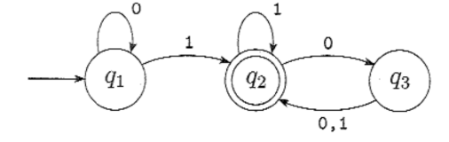

# INFORMÁTICA TEÓRICA

[https://www.cin.ufpe.br/~if689/1-2025/](https://www.cin.ufpe.br/~if689/1-2025/)

pág. 305 até pág. 323

---

## Conceitos Iniciais

- Método
    - Conjunto organizado de passos ou estratégias usado para resolver um problema ou alcançar um objetivo
- Algoritmo
    - Sequência finita, precisa e ordenada de instruções que levam à solução de um problema específico
    - É um método eficaz expresso como uma lista finita de instruções bem definidas para o cálculo de uma função
    - A partir de um estado inicial e uma entrada inicial, as instruções descrevem uma computação que, quando executada, irá prosseguir por meio de um número finito de estados sucessivos bem definidos, acabando por produzir uma saída e terminando em um estado final
        - Algoritmo é uma máquina de estados
- Solubilidade dos problemas
    - Problema solúvel: existe método/algoritmo que chega a uma conclusão
    - Problema insolúvel: não existe quaisquer métodos ou algoritmos que conseguem chegar em uma resposta
    - Como resolver problemas matemáticos: aplicar um método/algoritmo para encontrar uma solução, caso exista
- Problemas de decisão
    - Problema cuja resposta é simplesmente sim ou não
    - Alan Turing com a sua definição sobre máquinas de Turing viabilizou uma definição exata da decibilidade de problemas matemáticos e abriu a possibilidade de se demonstrar que certos problemas são de fato indecidíveis
        - Isso ajudou a formalizar a definição matemática do que é um algoritmo
    - Tipos
        - Problema decidível: caso o problema seja de decisão e seja solúvel
        - Problema indecidível: caso o problema seja de decisão e seja insolúvel
            - Entscheidungsproblem: existe um algoritmo que, dado qualquer enunciado matemático formal em lógica de primeira ordem, determina se ele é verdadeiro ou falso?
            - 10º problema de Hilbert: existe um algoritmo que decide se uma equação diofantina tem solução?

---

## Linguagens Regulares

- Autômatos Finitos
    - É um modelo matemático de um computador, representando uma máquina abstrata com um número finito de estados
    - Definição formal
        - Um autômato finito é definito por uma 5-upla
        - Conjunto finito de estados (Q) → representa as diferentes configurações em que a máquina pode se encontrar
        - Alfabeto finito (Σ) → conjunto de símbolos que o autômato pode ler na cadeia de entrada
        - Função de transição (δ) → determina qual estado o autômato irá se mover, dado o estado atual e o símbolo lido
            - δ: Q X Σ → Q
        - Estado inicial (q0) → estado em que o autômato inicia a sua execução
            - q0 ∈ Q
        - Conjunto de estados finais ou de aceitação (F) → se, após ler toda a cadeia de entrada, o autômato estiver em um desses estados de aceitação, a cadeia será aceita
            - F ⊆ Q
    - Diagrama de estados
        - A representação de um autômato finito M1
            
            
            
            - O estado inicial (q0) é representado pela seta apontando a partir do nada
            - O estado de aceitação (F) é definido pelo estado com círculo duplo
            - As setas indo de um estado para outro é chamado de transição
            - Caso uma cadeia não termine em um estado de aceitação, ela não será aceita
            - Representação formal de M1
                - M1 = (Q, Σ, δ, q0, F)
                - Q = {q1, q2, q3}
                - Σ = {0, 1}
                - δ
                    
                    
                    
                - q0 = q1
                - F = {q2}
    - Linguagem
        - Se A é o conjunto de todas as cadeias que uma máquina M aceita, dizemos que A é a linguagem de máquina de M e que L(M) = A
        - Com isso, é dito que M reconhece A ou M aceita A
            - Uma máquina aceita várias cadeias, mas reconhece apenas uma linguagem
            - Caso uma máquina aceite nenhuma cadeia, ainda assim reconhece apenas uma linguagem (o conjunto vazio)
        - Seja M = (Q, Σ, δ, q0, F) um autômato finito e suponha que w = w1w2 … wn seja uma cadeia onde wi é um membro do alfabeto Σ, M aceita w se existe uma sequência de estados r0, r1, …, rn em Q com 3 condições
            - r0 = q0 → a máquina começa no estado inicial
            - δ(ri, wi+1) = ri+1 para i = 0, …, n-1 → a máquina vai de estado para estado conforme a função de transição
            - rn ∈ F → a máquina aceita a entrada se ela termina em um estado de apresentação
        - M reconhece a linguagem A se A = {w | M aceita w}
        - Uma linguagem é chamada de linguagem regular se algum autômato finito a reconhece
        - Exemplo
            
            
            
            - A = {w | w contém pelo menos um 1 e um número par de 0’s segue após o último 1 da cadeia}
    - Exemplos
        - 1
            - Autômato Finito M2
                
                
                
            - Representação formal
                - M2 = (Q, Σ, δ, q0, F)
                - Q = {q1, q2}
                - Σ = {0, 1}
                - δ
                    
                    
                    |  | 0 | 1 |
                    | --- | --- | --- |
                    | q1 | q1 | q2 |
                    | q2 | q1 | q2 |
                - q0 = q1
                - F = {q2}
            - Linguagem de M2
                - A = {w | w termina em 1}
        - 2
            - Autômato Finito M3
                
                
                
            - Representação Formal de M3
                - M3 = (Q, Σ, δ, q0, F)
                - Q = {q1, q2}
                - Σ = {0, 1}
                - δ
                    
                    
                    |  | 0 | 1 |
                    | --- | --- | --- |
                    | q1 | q1 | q2 |
                    | q2 | q1 | q2 |
                - q0 = q1
                - F = {q1}
            - Linguagem de M3
                - A = {w | w termina em 0 ou w é uma cadeia vazia ε}
        - 3
            - Autômato Finito M4
                
                
                
            - Representação formal
                - M4 = (Q, Σ, δ, q0, F)
                - Q = {q1, q2, s, r1, r2}
                - Σ = {a, b}
                - δ
                    
                    
                    |  | a | b |
                    | --- | --- | --- |
                    | q1 | q1 | q2 |
                    | q2 | q1 | q2 |
                    | s | q1 | r1 |
                    | r1 | r2 | r1 |
                    | r2 | r2 | r1 |
                - q0 = s
                - F = {q1, r1}
            - Linguagem de M4
                - A = {w | w começa e termina com o mesmo elemento}
        - 4
            - Autômato Finito M5
                
                
                
            - Representação formal
                - M5 = (Q, Σ, δ, q0, F)
                - Q = {q0, q1, q2}
                - Σ = {0, 1, 2 ⟨RESET⟩}
                - δ
                    
                    
                    |  | 0 | 1 | 2 | ⟨RESET⟩ |
                    | --- | --- | --- | --- | --- |
                    | q0 | q0 | q1 | q2 | q0 |
                    | q1 | q1 | q2 | q0 | q0 |
                    | q2 | q2 | q0 | q1 | q0 |
                    - δi(qj, 0) = qj
                    - δi(qj, 1) = qk, onde k = j + 1 módulo i
                    - δi(qj, 2) = qj, onde k = j + 2 módulo i
                    - δi(qj, ⟨RESET⟩) = q0
                - q0 = q0
                - F = {q0}
            - Linguagem de M5
                - A = {w | a soma dos símbolos de w é 0 módulo 3, exceto que ⟨RESET⟩ retorna o contador para 0}
    - Como projetar um autômato finito
        - Primeiro de tudo, é importante entender com clareza qual o alfabeto e seus símbolos que o autômato pode receber como uma cadeia de entrada
        - Com esse entendimento, consegue-se deduzir quais podem ser os seus possíveis estado (Q)
            - Com esses possíveis estados, podemos mapear com clareza os estados de aceitação
            - Além disso, podemos entender em que estado uma cadeia pode começar, isto é, o q0 de um autômato
        - Por fim, mapeamos as funções de transição de um autômato
        - Exemplos
            - 1
                - Contexto: supondo que o alfabeto é {0, 1}, uma determinada cadeia de uma linguagem w é aceita sse o número de 1’s for ímpar
                    - Ou seja, os símbolos de w são apenas 0’s e 1’s
                - Do que se pode analisar, pode-se concluir que o número de 0’s não vai impactar se a cadeia será aceita ou não
                - Portanto, o número de 1’s impacta diretamente quais são os estados do autômato, na qual os estados são qpar e qímpar e o estado de aceitação é qímpar
                - Além disso, o estado inicial do autômato deve ser quando uma cadeia é vazia
                    - Como qímpar pressupõe que haja pelo menos um “1”, logo, o estado inicial do autômato deve ser qpar
                - Em relação às funções de transição, é nítido que quando o símbolo atual é 0, o estado atual não muda, enquanto que o símbolo atual é 1, o estado muda de um para o outro
                    
                    
                    
            - 2
                - Contexto: fazer um autômato que aceite cadeias que contenha “001”, na qual seu alfabeto é {0, 1}
                - Dado este contexto, é nítido que todos os símbolos do alfabeto impactam diretamente nos estados
                    - Por isso, é preciso monitorar quando a cadeia atual possui 1 zero, 2 zeros e 2 zeros + 1 um
                    - Portanto, as possibilidades são: não viu nenhum símbolo do padrão “001” (q), acabou de ver “0” (q0), acabou de ver “00” (q00) e acabou de ver “001 (q001)”, sendo portanto o conjunto de estados do autômato
                    - Além disso, é nítido perceber que o estado inicial é q e o estado de aceitação é q001
                
                
                
- Operações regulares
    - Operações usadas para estudar propriedades de linguagens regulares
    - Operações
        - União: A U B = {x | x ∈ A ou x ∈ B}
        - Concatenação: A ∘ B = {xy | x ∈ A e y ∈ B}
        - Estrela: A* = {x1x2…xk | k ≥ 0 e cada xi ∈ A}
        - Exemplo
            
            
            
    - Operação fechada para uma coleção de objetos
        - Diz-se que uma coleção de objetos é fechada sob alguma operação se, aplicando-se essa operação a membros da coleção, recebe-se um objeto ainda na coleção
            - Exemplo: o conjunto dos naturais é fechada sob a multiplicação mas não sob a divisão, pois 1 e 2 pertencem ao conjunto dos naturais mas 1/2 não
        - A classe das linguagens regulares é fechada sob a operação de união
            - Ideia da prova
                - Em outras palavras, se A1 e A2 são linguagens regulares, A1 U A2 também vai ser
                    - Com estas duas linguagens, temos também dois autômatos finitos M1 e M2, na qual M1 reconhece A1 e M2 reconhece A2; precisamos construir um autômato M que reconhece A1 U A2
                    - A prova do teorema é uma prova de construção, pois constrói-se M a partir de M1 e M2, na qual M tem que aceitar sua entrada exatamente quando M1 ou M2 aceitaria, de modo a reconhecer a linguagem da união
                        - Entretanto, não é certo “simular M1 primeiro e depois simular M2”, é preciso simular ambas M1 e M2 simultaneamente pois dessa forma garantimos que os estados de transição de ambas os autômatos estejam interligados
            - Prova
                - Supondo que M1 reconhece A1 e que M1 = (Q1, Σ, δ1, q1, F1)
                - Supondo que M2 reconhece A2 e que M2 = (Q2, Σ, δ2, q2, F2)
                - Precisamos construir M tal que M reconhece A1 U A2, onde M = (Q, Σ, δ, q, F)
                - Definição Formal
                    - Conjunto de estados
                        - Q = {(r1, r2) | r1 ∈ M1 e r2 ∈ M2}
                        - Este conjunto é o produto cartesiano dos conjuntos Q1 e Q2 e é escrito Q1 X Q2, tratando-se do conjunto de todos os pares de estados
                    - Alfabeto
                        - Como o alfabeto de M1 e de M2 são iguais, logo, o alfabeto de M também é igual sendo Σ = Σ
                        - Caso o alfabeto de M1 fosse Σ1 e o de M2 fosse Σ2, então Σ = Σ1 U Σ2
                    - Funções de transição
                        - Para cada par (r1, r2) ∈ Q e cada a ∈ Σ, δ((r1, r2), a) = (δ1(r1, a), δ2(r2, a))
                        - Com isso, δ obtém um estado de M (que na realidade é um par de estados de M1 e M2), juntamente com um símbolo de entrada, e retorna o próximo estado de M
                    - Estado inicial
                        - O estado inicial de M é simplesmente o par dos estados inicias de M1 e M2, logo, q = (q1, q2)
                    - Estados de aceitação
                        - F é o conjunto de pares nos quais um dos membros é um estado de aceitação de M1 ou M2, logo, F = {(r1, r2) | r1 ∈ F1 ou r2 ∈ F2}
                        - A expressão é equivalente à F = (F1 X Q2) U (F2 X Q1), pois (F1 X Q2) significa que após o autômato ler a cadeira inteira o autômato M1 aceitou (pois chegou em um estado de F1) não importando onde que o autômato M2 parou, (F2 X Q1) complementa o resto
                            - Porque F ≠ F1 X F2
                                - Neste caso, os estados de aceitação de M seriam aqueles nas quais ambos os membros do par são estados de aceitação, ou seja, M1 e M2 aceitam ao mesmo tempo
                                - Isso prova apenas a interseção, e não união
                - Com isso, provamos que a união de duas linguagem regulares resulta-se em uma linguagem regular
        - A classe das linguagens regulares é fechada sob a operação de concatenação
            - Em outras palavras, se A1 e A2 são linguagens regulares, A1 ∘ A2 também vai ser
                - Semelhante à linha de raciocínio da prova sob a operação de união, entretanto, em vez de construir o autômato M para aceitar sua entrada se M1 ou M2 aceitam, ele tem que aceitar se sua entrada puder ser quebrada em duas partes, sendo que M1 aceita a primeira parte e M2 aceita a segunda parte
            - O problema é que M não sabe onde quebrar sua entrada (onde a primeira termina e a segunda começa)
            - Para resolver este problema, é preciso introduzir a técnica de não-determinismo
- Não-determinismo
    - Quando a máquina está em um dado estado e lê o próximo símbolo de entrada, sabemos qual será o próximo estado, pois está determinado
        - Isso é chamado de computação determinística
        - Em uma máquina não determinística, várias escolhas podem existir para o próximo estado em qualquer ponto
            - Não-determinismo é uma generalização de determinismo, portanto, todo autômato finito determinístico é automaticamente um autômato finito não-determinístico
    - Diferença AFD vs AFN
        - Todo AFD tem exatamente uma seta de transição saindo para cada símbolo do alfabeto
            - Enquanto que AFN’s não necessariamente precisam seguir essa regra
                
                
                
                - Não há uma seta de transição de q2 que envolve o símbolo 1 do alfabeto
        - Em um AFD, todos rótulos sobre as setas de transição são símbolos do alfabeto
            - Em AFN’s, os rótulos podem ser tanto símbolos do alfabeto quanto ε (cadeia ou símbolo vazio, muda um autômato de um estado para o outro sem ler ou consumir nenhum símbolo da cadeia de entrada)
        - A computação de um AFN também é bastante diferente de uma AFD
            - A computação de um AFD se dá em uma linha reta, como apenas uma thread
            - Em contrapartida, um AFN divide-se em várias threads independentes, semelhante à uma árvore de possibilidades
            
            
            
    - Comparação AFD vs AFN
        - AFN
            
            
            
        - AFD
            
            
            
    - Definição formal de um AFN
        - Um AFN é uma 5-upla (Q, Σ, δ, q0, F)
        - Q: conjunto finito de estados
        - Σ: alfabeto finito
        - δ: Q X Σε → P(Q) é a função de transição
            - Para qualquer alfabeto Σ escrevemos Σε como sendo Σ U {ε}
            - Para qualquer conjunto de estados Q, P(Q) representa o conjunto das partes de Q
        - q0: estado inicial, q0 ∈ Q
        - F: conjunto dos estados de aceitação, F ⊆ Q
        - Exemplo
            
            
            
            
            
        - Aceitação da linguagem
            - Seja N = (Q, Σ, δ, q0, F) um AFN e w uma cadeia sobre o alfabeto Σ, dizemos que N aceita w se podemos escrever w como w = y1y2…yn, onde yi é um membro de Σε e existe uma sequência de estados r0, r1, …, rn em Q com 3 condições
                - r0 = q0 → a máquina começa no estado inicial
                - ri+1 ∈ δ(ri, yi+1) para i = 0, …, n-1 → o estado ri + 1 é um dos próximos estados permissíveis quando N está no estado ri e lendo yi+1
                    - δ(ri, yi+1) é o conjunto de próximos estados permissíveis e portanto dizemos que ri+1 é um membro desse conjunto
                - rn ∈ F → a máquina aceita a entrada se ela termina em um estado de apresentação
            - Uma linguagem é regular se, e somente se, algum AFN a reconhece
    - Equivalência de AFN’s e AFD’s
        - Duas máquinas são equivalentes se elas reconhecem a mesma linguagem
        - Todo AFN tem um AFD equivalente
            - Ideia da prova
                - Se k é o número de estados do AFN, ele tem 2^k subconjuntos de estados
                    - Cada subconjunto corresponde a uma das possibilidades de que o AFD tem de se lembrar, portanto, o AFD que simula o AFN terá 2^k estados
                    - Com isso, é preciso descobrir qual será o estado inicial e os estados de aceitação do AFD, bem como a função de transição
            - Prova
                - Seja N = (Q, Σ, δ, q0, F) o AFN que reconhece alguma linguagem A, construímos um AFD M = (Q’, Σ, δ’, q0’, F’) que reconhece A
                - Casos
                    - N não tem setas ε
                        - Q’ = P(Q)
                            - Todo estado de M é um conjunto de estados de N e P(Q) é o conjunto dos subconjuntos de Q
                        - Para R ∈ Q’ e *a* ∈ Σ, δ’(R, a) = {q ∈ Q | q ∈ δ(r, a) para algum r ∈ R}
                            - Se R é um estado de M, é também um conjunto de estados de N
                            - Quanto M lê um símbolo *a* no estado R, ele mostra para onde *a* leva cada estado em R
                            - Dado que cada estado pode ir para um conjunto de estados, tomamos a união de todos esses conjuntos
                            
                            
                            
                        - q0’ = {q0}
                        - F’ = {R ∈ Q’ | R contém um estado de aceitação de N}
                            - A máquina M aceita se um dos possíveis estados nos quais N poderia estar nesse ponto é um estado de aceitação
                    - N tem setas ε
                        - Além de considerar tudo o que aborda caso não haja setas ε, temos que usar mais notações
                            - Para qualquer estado R de M, definimos E(R) como a coleção de estados que podem ser atingidos a partir de R indo somente ao longo de setas ε, incluindo os próprios membros de R
                            - Formalmente, E(R) = {q | q pode ser atingido a partir de R viajando-se ao longo de 0 ou mais setas ε} para R ⊆ Q
                        - Com isso, modificamos a função de transição de M para colocar dedos adicionais sobre todos os estados que podem ser atingidos indo ao longo de setas ε após cada passo
                            - Substituindo δ(r, a) por E(δ(r, a)) conseguimos o efeito desejado
                            - Consequentemente, δ’(R, a) = {q ∈ Q | q ∈ E(δ(r, a)) para algum r ∈ R}
                        - Além disso, precisamos modificar o estado inicial de M para mover os dedos inicialmente para todos os estados possíveis que podem ser atingidos a partir do estado inicial de N ao longo das setas ε, por isso q0’ = E({q0}), completando a construção do AFD M que simula o AFN N
        - Passo a passo
            - Tomando o AFN N4 como exemplo, para transformá-lo em um AFD M4
                
                
                
            - 1 - Definir formalmente o AFN
                - Q = {1, 2, 3}
                - Σ = {a, b}
                - δ → caso o AFN possua setas ε, também é preciso colocá-las
                    - Caso um estado não possua setas ε, então a função de transição entre o estado e ε é o próprio estado em si
                    
                    | δ | a | b | ε |
                    | --- | --- | --- | --- |
                    | 1 | ∅ | {2} | {3} |
                    | 2 | {2, 3} | {3} | {2} |
                    | 3 | {1} | ∅ | {3} |
                - q0 = 1
                - F = {1}
            - 2 - Definir formalmente o AFD
                - Q’ vai ser todas possíveis combinações do AFN N4
                    - O tamanho de é Q’ = 2^n, tal que n = número de estados de N4
                    - Q’ = {∅, {1}, {2}, {3}, {1, 2}, {1, 3}, {2, 3}, {1, 2, 3}} → 8 estados
                - Σ’ é a mesma coisa que Σ
                    - Σ’ = Σ = {a, b}
                - δ’ → quando o estado em questão for um conjunto com mais de um elemento, o resultado da função de transição será a união deles (caso o resultado de alguma transição seja ∅, apenas ignorar)
                    - No caso do próprio estado ∅, atribuir ∅ a todos os seus estados de transição
                    - Além disso, tirar as transições ε substituindo por a transição δ(r, a) por E(δ(r, a))
                        - E({1}) = {1, 3}
                        - E({2}) = {2}
                        - E({3}) = {3}
                    - Sem aplicar o ECLOSE()
                        
                        
                        | δ’ | a | b |
                        | --- | --- | --- |
                        | ∅ | ∅ | ∅ |
                        | {1} | ∅ | {2} |
                        | {2} | {2, 3} | {3} |
                        | {3} | {1} | ∅ |
                        | {1, 2} | {2, 3} | {2, 3} |
                        | {1, 3} | {1} | {2} |
                        | {2, 3} | {1, 2, 3} | {3} |
                        | {1, 2, 3} | {1, 2, 3} | {2, 3} |
                    - Aplicando o ECLOSE()
                        - Como δ({3}, a) = {1} e E({1}) = {1, 3}, logo em todas as aparições de {1}, é unir o {3}; como E({2}) = {2} e E({3}) = {3}, não muda nada nos outros
                        
                        | δ’ | a | b |
                        | --- | --- | --- |
                        | ∅ | ∅ | ∅ |
                        | {1} | ∅ | {2} |
                        | {2} | {2, 3} | {3} |
                        | {3} | {1, 3} | ∅ |
                        | {1, 2} | {2, 3} | {2, 3} |
                        | {1, 3} | {1, 3} | {2} |
                        | {2, 3} | {1, 2, 3} | {3} |
                        | {1, 2, 3} | {1, 2, 3} | {2, 3} |
                - q0’ = E({1})
                    - E({1}) = {1, 3}
                - F’ → todos os estados que contém o estado final de F
                    - F’ = { {1}, {1, 2}, {1, 3}, {1, 2, 3} }
                
                
                
            - 3 - Eliminar os estados
                - Eliminar os estados inalcançáveis, ver por meio da nova função de transição (tirar os estados que não aparecem nas colunas ‘a’ e ‘b’ de outro estado)
                    
                    
                    | δ’ | a | b |
                    | --- | --- | --- |
                    | ∅ | ∅ | ∅ |
                    | {1} | ∅ | {2} |
                    | {2} | {2, 3} | {3} |
                    | {3} | {1, 3} | ∅ |
                    | {1, 2} | {2, 3} | {2, 3} |
                    | {1, 3} | {1, 3} | {2} |
                    | {2, 3} | {1, 2, 3} | {3} |
                    | {1, 2, 3} | {1, 2, 3} | {2, 3} |
                    - Apenas os estados {1} e {1, 2} não aparecem, logo é preciso retirá-los
                - Além disso, retirar os estados que não possuem saídas e não são finais
                    - Exemplo: apenas o estado q2 (que não é final) possui função de transição para q2, formando um loop nele mesmo
                        
                        
                        | δ’ | a | b |
                        | --- | --- | --- |
                        | . | . | . |
                        | . | . | . |
                        | q2 | q2 | q2 |
                        | . | . | . |
                        | . | . | . |
                        | . | . | . |
                        | . | . | . |
                        | . | . | . |
                
                
                
    - Fecho sob as operações regulares
        - Com o conceito de não-determinismo, podemos novamente provar que a união de uma linguagem regular é uma linguagem regular, bem como provar a concatenação e estrela
        - A classe das linguagens regulares é fechada sob a operação de união
            - Ideia de prova
                - Temos as linguagens regulares A1 e A2 e desejamos provar que A1 U A2 é regular
                    - A ideia é tomar dois AFN’s N1 e N2 para A1 e A2 e combiná-los em um novo AFN, N
                    - A nova máquina tem um novo estado inicial que ramifica para os estados iniciais das máquinas anteriores com setas ε, dessa maneira a nova máquina não-deterministicamente adivinha qual das duas máquinas aceita a entrada
                    
                    
                    
            - Prova
                
                
                
                - Q = {q0} U Q1 U Q2
                    - Os estados de N são todos os estados de N1 e N2, com a adição de um novo estado inicial q0, que é o estado inicial de N
                - F = F1 U F2
                    - Os estados de aceitação de N são todos os estados de aceitação de N1 e N2, dessa forma N aceita se N1 aceita ou N2 aceita
                - δ
                    - Definir δ de modo que para qualquer q ∈ Q e qualquer a ∈ Σε,
                        
                        
                        
                - Com isso, podemos provar o fecho sob união
        - A classe das linguagens regulares é fechada sob a operação de concatenação
            - Ideia de prova
                - Temos as linguagens regulares A1 e A2 e desejamos provar que A1 ∘ A2 é regular
                    - A ideia é tomar dois AFN’s N1 e N2 para A1 e A2 e combiná-los em um novo AFN, N
                    - Atribua o estado inicial de N o estado inicial N1
                        - Os estados de aceitação de N1 tem setas ε adicionais que não-deterministicamente permitem ramificar N2 sempre que N1 está em um estado de aceitação, significando que ele encontrou uma parte inicial da entrada que constitui uma cadeia em A1
                        - Os estados de aceitação de N são somente os estados de aceitação de N2, por conseguinte ele aceita quando a entrada pode ser dividida em duas partes, a primeira aceita por N1 e a segunda por N2
                    
                    
                    
            - Prova
                
                
                
                - Q = Q1 U Q2
                    - Os estados de N são todos os estados de N1 e N2
                - O estado q1 é o mesmo que o estado inicial de N1
                - F = F2
                    - Os estados de aceitação de N são todos os estados de N2
                - δ
                    - Definir δ de modo que para qualquer q ∈ Q e qualquer a ∈ Σε,
                        
                        
                        
                - Com isso, podemos provar o fecho sob concatenação
        - A classe das linguagens regulares é fechada sob a operação de estrela
            - Ideia de prova
                - Temos a linguagem regular A1 e desejamos provar que A1* é regular
                    - Tomamos um AFN N1 par A1 e o modificamos para reconhecer A1*, o AFN resultanto aceitará sua entrada sempre que ela puder ser quebrada em várias partes e N1 aceite cada uma das partes
                    - Podemos construir N como N1 com setas ε adicionais retornando ao estado inicial a partir dos estados de aceitação
                        - Dessa maneira, quando o processamento chega ao final de uma parte que N1 aceita, a máquina N tem a opção de pular de volta para o estado inicial para tentar ler uma outra parte que N1 aceite
                        - Temos que modificar N de tal forma que ele aceite ε, que é sempre um membro de A1*
                        - Uma ideia é simplesmente adicionar o estado inicial ao conjunto de estados de aceitação, essa abordagem certamente adiciona ε à linguagem reconhecida, mas ela também pode adicionar outras cadeias indesejadas
                        - A maneira de consertar a construção é adicionar um novo estado inicial, que também seja um estado de aceitação e que tenha uma seta ε para o antigo estado inicial, fazendo com que a solução tenha o efeito desejado de adicionar ε à linguagem sem adicionar nada mais
                    
                    
                    
            - Prova
                
                
                
                - Q = {q0} U Q1
                    - Os estados de N são todos os estados de N1 mais o novo estado inicial
                - O estado q0 é o novo estado inicial
                - F = {q0} U F1
                    - Os estados de aceitação de N são todos os estados de N1 mais o novo estado inicial
                - δ
                    - Definir δ de modo que para qualquer q ∈ Q e qualquer a ∈ Σε,
                        
                        
                        
                - Com isso, podemos provar o fecho sob estrela
- Expressões regulares
    - Podemos usar as operações regulares para montar expressões que descrevem linguagens, que são as expressões regulares
        - Exemplo
            
            
            
            - A expressão representa todas as linguagens que começam por 0 ou 1 seguido por um número qualquer de 0’s
            - 0 U 1 é a mesma coisa que {0} U {1}
            - 0* é a mesma coisa que {0}*
            - (0 U 1)0* é a mesma coisa que (0 U 1) ∘ 0*
    - Seja Σ = {0, 1} podemos fazer também a notação de Σ* para descrever a linguagem constituída de todas as cadeias sobre Σ
        - Além disso, ao escrever Σ*1, descrevemos uma linguagem que contém todas as cadeias que terminam em 1
        - (0Σ*) U (Σ*1) descreve todas as linguagens que começam por 0 ou terminam com 1
    - Precedência de operações
        - Estrela > Concatenação > União, a menos que parênteses sejam usados para mudar a ordem usual
        - Além disso, temos que R^+ é equivalente à RR*
            - Enquanto que R* representa 0 ou mais concatenações de cadeias de R, R^+ representa 1 ou mais concatenações de cadeias de R
            - R* = R^+ U ε
        - R^k é equivalente à concatenação de k R’s umas com as outras
    - Definição formal
        
        
        
        - L(R) é a linguagem da expressão regular R
        - R U ∅ = R
        - R ∘ ε = R
        - R U ε pode não ser igual a R
            - Se R = 0, L(R) = {0}, mas L(R U ε) = {0, ε}
        - R ∘ ∅ pode não ser igual a R
            - Se R = 0, L(R) = {0}, mas L(R ∘ ∅) = ∅
    - Equivalência com autômatos finitos
        - Teorema
            - Uma linguagem é regular se, e somente se, alguma expressão regular a descreve
            - É preciso provar por duas direções
                - Se uma linguagem é descrita por uma expressão regular, então ela é regular
                    - Ideia da prova
                        - Vamos supor que tenhamos uma expressão regular R descrevendo alguma linguagem A
                        - Mostramos como converter R em um AFN que reconhece A, pois, se um AFN reconhece A, então ela é regular
                    - Prova
                        - Converter R num AFN N, considerando 6 casos na descrição formal
                        - Caso 1
                            
                            
                            
                            
                            
                        - Caso 2
                            
                            
                            
                        - Caso 3
                            
                            
                            
                        - Caso 4
                            - R = R1 U R2 → usamos a prova de que a classe das linguagens regulares é fechada sob a operação de união
                        - Caso 5
                            - R = R1 ∘ R2 → usamos a prova de que a classe das linguagens regulares é fechada sob a operação de concatenação
                        - Caso 6
                            - R = R1* → usamos a prova de que a classe das linguagens regulares é fechada sob a operação de estrela
                    - Exemplo
                        - Converter a expressão regular (ab U a)* em um AFN
                            - É preciso começar a partir de subexpressões menores em direção às maiores
                            - Nem sempre o AFN construído é menor equivalente
                            
                            
                            
                - Se uma linguagem é regular, então ela é descrita por uma expressão regular
                    - Ideia da prova
                        - Precisamos mostrar que se uma linguagem A é regular, então uma expressão regular a descreve
                        - Pelo fato de A ser regular, ela é aceita por um AFD, logo, precisamos descrever um procedimento para converter AFD’s em expressões regulares equivalentes
                            - Para este procedimento, é preciso usar um novo tipo de autômato finito chamado de autômato finito não-determinístico generalizado, AFNG
                                - Primeiro, precisamos mostrar como converter um AFD em um AFNG e depois um AFNG em uma expressão regular
                            - AFNG
                                - Os AFNG’s são basicamente AFN’s nos quais as setas de transição podem ser quaisquer expressões regulares como rótulos, em vez de apenas membros do alfabeto e ε
                                - O AFNG lê blocos de símbolos de entrada, não necessariamente apenas um símbolo de cada vez como um AFN padrão
                                - Um AFNG aceita uma entrada se seu processamento puder levar a um estado de aceitação ao final da entrada
                                    - Como ele é não-determinístico, pode ter várias maneiras diferentes de processar a mesma cadeia de entrada
                                    
                                    
                                    
                                - Por conveniência, é requerido que os AFNG’s tenham sempre um formato especial que atenda à algumas condições
                                    - Condições
                                        - O estado inicial tem setas de transição saindo para todos os outros estados, mas nenhuma seta chegando de qualquer outro estado
                                        - Existe apenas um estado de aceitação, e ele tem setas chegando de todos os outros estados, mas nenhuma seta saindo para qualquer outro estado
                                            - Além disso, o estado de aceitação não é o mesmo que o estado inicial
                                        - Com exceção dos estados inicial e de aceitação, uma seta sai de cada estado para outros e também de outro estado para ele mesmo
                                            - Os rótulos são de expressões da linguagem
                                - Definição formal
                                    
                                    
                                    
                                    - R é a coleção de todas as expressões regulares sobre o alfabeto Σ
                                    - Um AFNG aceita uma cadeia w em Σ* se w = w1w2…wk, onde cada wi está em Σ* e existe uma sequência de estados q0, q1, …, qk tal que
                                        - q0 = qinício é o estado inicial
                                        - qk = qaceita é o estado de aceitação
                                        - Para cada i, temos wi ∈ L(Ri), onde Ri = δ(qi-1, qi), ou seja, Ri é a expressão sobre a seta qi-1 a qi
                    - Prova
                        - Seja M o AFD para a linguagem A, então convertemos M em um AFNG G adicionando um novo estado inicial e um novo estado de aceitação e setas de transição adicionais conforme necessário
                        - Além disso, utiliza-se o procedimento CONVERT(G), que toma um AFNG como entrada e retorna uma expressão regular equivalente
                            - O procedimento usa recursão, mas o laço infinito é evitado, pois quando o AFNG chega a dois estados a recursão para
                            - CONVERT(G)
                                - Seja k o número de estados de G
                                - Se k = 2, então G deve consistir de um estado inicial, um estado de aceitação e uma única seta de transição rotulada com uma expressão regular R
                                    - Com isso, retorna-se a expressão R
                                - Se k > 2
                                    
                                    
                                    
                                    - Com isso, computamos CONVERT(G’) e retornamos o valor
                                    - O novo estado inicial possui uma função de transição para o antigo estado inicial com o rótulo ε
                                        - As demais transições entre o novo estado inicial e outros estados possui rótulo ∅
                                    - Os antigos estados finais possuem uma função de transição para o novo estado final com o rótulo ε
                                        - As demais transições entre os estados e o estado final possui rótulo ∅
                                - Para qualquer AFNG G, CONVERT(G) é equivalente a G
                                    - É preciso antes de tudo provar que o resultado de CONVERT(G) gera um autômato equivalente à G
                                    - Base
                                        - Prove que a afirmação é verdadeira para k = 2 estados
                                        - Se G tem apenas 2 estados, ele só pode ter uma única seta, que vai do estado inicial para o de aceitação
                                        - A expressão regular que é o rótulo sobre essa seta descreve todas as cadeias que propiciam a G chegar ao estado de aceitação, portanto essa expressão é equivalente a G
                                    - Passo da indução
                                        - É preciso supor que a afirmação é verdadeira para k - 1 estados e usar essa suposição para provar que a afirmação é verdadeira para k estados
                                        - Provando que G e G’ reconhecem a mesma linguagem
                                            - Prova partindo de G
                                                - Supondo que G aceite uma entrada w, então em um ramo de aceitação da computação G entra em uma sequência de estados qinício, q1, q2, …, qaceita
                                                - Se nenhum deles é o estado removido qrem
                                                    - Então G’ também aceita w, pois cada uma das novas expressões regulares rotulando as setas de G’ contém a expressão regular antiga como parte de uma união, assim, aceitando w
                                                - Se algum estado removido é qrem
                                                    - Se o estado qrem é removido, os estados qi e qj, imediatamente antes e depois de qrem, vão ter uma nova expressão regular na seta que os liga que descreve todas as cadeias que levam de qi a qj via qrem sobre G
                                                    - Portanto, G’ aceita w
                                            - Prova partindo de G’
                                                - Supondo que G’ aceite uma entrada w, como cada seta entre qualquer dois estados qi e qj em G’ descreve a coleção das cadeias que levam de qi a qj em G (seja diretamente ou via qrem), logo, G também tem que aceitar w
                                    - A hipótese de indução afirma que quando o algorimo chama a si mesmo recursivamente sobre a entrada G’, o resultado é uma expressão regular equivalente a G’, pois G’ possui k-1 estados
                                    - Logo, essa expressão regular é equivalente a G, provando o algoritmo e o teorema
        - Exemplo
            - 1
                
                
                
            - 2
                
                
                
                
                
- Linguagens não-regulares
    - Existem linguagens que não conseguem ser reconhecidas por nenhum autômato finito, chamadas de linguagens regulares
        
        
        
    - Lema do bombeamento
        - O teorema afirma que todas as linguagens regulares têm uma propriedade especial, e se pudermos mostrar que uma linguagem não possui esta tal propriedade, então temos a garantia de que ela não é regular
        - A tal propriedade seria de que todas as cadeias da linguagem podem ser bombeadas se elas são no mínimo tão longas como um determinado valor especial, denominado de comprimento de bombeamento
            - Isso significa que cada uma dessas cadeias contém uma parte que pode ser repetida um número qualquer de vezes, com a cadeia resultante permanecendo na linguagem
        - Definição formal
            - Se A é uma linguagem regular, então existe um número p (comprimento do bombeamento) tal que, se s é qualquer cadeia de A de comprimento no mínimo p, então s pode ser dividida em 3 partes, s = xyz, satisfazendo algumas condições
                - Para cada i ≥ 0, xy^iz ∈ A
                    - y^i representa cópias concatenadas de y, sendo y^0 = ε
                - |y| > 0
                    - Quando xyz é dividida, x e z podem ser ε, mas esta condição garante que y ≠ ε
                - |xy| ≤ p
                    - As partes x e y juntas possuem comprimento de no máximo p
                    - Técnica extra útil para provar que algumas linguagens não são regulares
        - Provando o teorema
            - Ideia da prova
                - Seja M o AFD (Q, Σ, δ, q1, F) que reconhece A, atribuímos ao comprimento de bombeamento p o número de estados de M
            - Prova
                - Se temos uma cadeia menor que p
                    - O teorema se torna verdadeiro por vacuidade
                - Se temos uma cadeia de comprimento no mínimo p
                    
                    
                    
                    - Seja s = s1s2…sn uma cadeia em A de comprimento onde n ≥ p
                    - Seja r1, …, rn+1 a sequência de estados nos quais M passa enquanto processa s, de forma que ri+1 = δ(ri, si) para i ≤ i ≤ n
                        - Essa sequência possui comprimento n + 1 (pois é o comprimento de s + 1 estado inicial), que é pelo menos p + 1
                        - Entre os primeiros p + 1 elementos da sequência, dois devem ser do mesmo estado, pelo princípio da casa dos pombos
                        - Chamamos o primeiros desses de rj e o segundo de rl, como rl ocorre entre as primeiras p + 1 posições da sequência começando em r1, temos que l ≤ p + 1
                    - Seja x = s1…sj-1, y = sj…sl-1 e z = sl…sn
                        - Como x leva M de r1 para rj, y leva M de rj para rj e z leva M de rj para rn+1, que é um estado de aceitação, M deve aceitar xy^iz para i ≥ 0
                        - Sabemos que j ≠ l, portanto, |y| > 0 e l ≤ p + 1, logo, |xy| ≤ p
                        - Dessa forma satisfazemos todas as condições do lema do bombeamento
        - Usando o teorema
            - Para usar o lema para provar que uma linguagem não é regular, primeiro suponhamos que ela seja regular a fim de encontrar uma contradição
            - Em seguida, usamos o lema do bombeamento para garantir a existência de um comprimento de bombeamento p de forma que todas as cadeias de comprimento p ou maiores possam ser bombardeadas
            - Em seguida, encontramos uma outra cadeia da linguagem que tenha comprimento p ou mais, mas que não possa ser bombeada
                - Por fim, demonstramos que essa cadeia não pode ser bombeada considerando todas as maneiras de dividí-la em xyz e para cada divisão encontrando um valor i tal que xy^iz não pertençam à linguagem
                - Esse passo final frequentemente envolve agrupar as várias formas de se dividir a cadeia em vários casos, e a existência dela contradiz o lema do bombeamento se a linguagem for regular
            - Exemplos
                - 1
                    
                    
                    
                    
                    
                    
                    
                - 2
                    
                    
                    
                    
                    
                    
                    
                - 3
                    
                    
                    
                    
                    
                - 4
                    
                    
                    
                    
                    
                - 5
                    
                    
                    
                    
                    

---

## Linguagens Livres do Contexto

- Gramáticas Livres do Contexto
    - Método mais poderoso de descrever linguagens, podendo descrever certas características que possuem uma estrutura recursiva, as tornando úteis em uma variedade de aplicações
    - Consiste de uma coleção de regras de substituição, também denominadas de produções
        - Cada regra aparece como uma linha na gramática, compreendendo um símbolo e uma cadeia separados por uma seta
            - A sequência de substituições para obter uma cadeia é denominada de derivação
        - O símbolo é chamado de uma variável e a cadeia é constituída de variáveis e outros símbolos chamados de terminais
        - Os símbolos de variáveis são representados por letras maiúsculas e os terminais são análogos ao alfabeto de entrada e representados por letras minúsculas, números ou símbolos especiais
        - Uma variável é designada como a variável inicial, geralmente ocorrendo no lado esquerdo da primeira regra
            
            
            
            - A gramática possui 3 regras, na qual as variáveis dela são A e B sendo A a variável inicial
            - A gramática possui 3 terminais, sendo 0, 1 e #
    - Um conjunto de todas as cadeias geradas através das derivações constitui a linguagem da gramática
        - Qualquer linguagem que pode ser gerada por alguma gramática livre do contexto é chamada linguagem livre do contexto (LLC)
        - Por conveniência, quando apresentamos uma gramática livre do contexto, abreviamos várias regras com a mesma variável no lado esquerdo, como: A → 0A1 | B
    - Definição formal
        - Uma gramática livre do contexto é uma 4-upla (V, Σ, R, S)
            - V é um conjunto finito denominado variáveis
            - Σ é um conjunto finito, disjunto de V, denominado terminais
            - R é um conjunto finito de regras, com cada regra sendo uma variável e uma cadeia de variáveis terminais
            - S ∈ V é a variável inicial
        - Se u, v e w são cadeias de variáveis e terminais, e A → w é uma regra da gramática, dizemos que uAv origina uwv, escrito uAv → uwv
            - Digamos que u deriva v, escrito u ⇒∗ v, se u = v ou se existe uma sequência u1, u2, …, uk para k≥ 0 e u ⇒ u1 ⇒ … ⇒ uk ⇒ v
            - A linguagem da gramática é {w ∈ Σ* | S ⇒∗ w}
    - Projetando GLC’s
        - GLC’s são ainda mais complicadas de construir que autômatos finitos
        - Técnicas
            - Dividir as gramáticas
                - Muitas LLC’s são a união de LLC’s mais simples
                - Para construir uma GLC para uma LLC que tenha que quebrar em partes mais simples, é melhor construir gramáticas individuais mais simples
                - Essas gramáticas individuais podem ser facilmente reunidas em uma gramática para a linguagem original combinando suas regras e adicionando a nova regra S → S1 | … | Sk, onde as variáveis Si são as variáveis iniciais para as gramáticas individuais
                    
                    
                    
            - Converter a GLC em um AFD
                - Construir uma GLC para uma linguagem que acontece de ser regular é fácil se puder construir primeiro um AFD equivalente para essa linguagem
                - Primeiro, pegue uma variável Ri para cada estado qi do AFD
                - Com isso, adicionamos a regra Ri → aRj à GLC se δ(qi, a) = qj for uma transição no AFD
                - Adicionamos a regra Ri → ε se qi for estado de aceitação do AFD
                - Fazemos R0 como a variável inicial da gramática onde q0 é o estado inicial da máquina
            - LLC com subcadeia
                - Certas LLC’s contém cadeias com duas subcadeias que estão ligadas no sentido de que uma máquina para uma linguagem como essa precisaria memorizar uma quantidade ilimitada de informação sobre uma das subcadeias para verificar que ela corresponde apropriadamente à outra subcadeia
                - Exemplo: linguagem {0^n1^n | n≥ 0}, porque uma máquina precisa memorizar o número de 0’s para verificar se possui o mesmo número de 1’s
                - Pode-se construir uma GLC para lidar com essa situação usando uma regra da forma R → uRv, que gera cadeias nas quais a parte contendo os u’s corresponde à parte contendo os v’s
            - LLC’s complexas
                - Em linguagens mais complexas, as cadeias podem conter certas estruturas que aparecem recursivamente como parte de outras estruturas, ou de elas mesmas
                    
                    
                    
                    - Sempre que o símbolo a aparece, em vez dele uma expressão parentizada inteira pode aparecer recursivamente
                    - Para atingir esse efeito, colocamos o símbolo da variável que gera a estrutura na posição das regras correspondente a onde aquela estrutura pode aparecer recursivamente
    - Ambiguidade
        - As vezes uma gramática pode gerar a mesma cadeia de várias maneiras diferentes
            - Tal cadeia terá árvores sintáticas diferentes e, portanto, vários significados diferentes
            - Esse resultado pode ser indesejado para certas aplicações
        - Se uma gramática gera a mesma cadeia de várias maneiras diferentes, dizemos que a cadeia é derivada ambiguamente nessa gramática, e se uma gramática gera ambiguamente uma cadeia, dizemos que a gramática é ambígua
            
            
            
            
            
        - Quando dizemos que uma gramática gera uma cadeia ambiguamente, queremos dizer que a cadeia tem duas árvores sintáticas diferentes, e não duas derivações diferentes
            - Duas derivações diferentes podem diferir meramente pela ordem na qual elas substituem variáveis e ainda assim não na sua estrutura geral
            - Por isso, definimos uma derivação de uma cadeia w em uma gramática G como a derivação mais à esquerda se a cada passo a variável remanescente mais à esquerda é aquela que é substituída
            - Com isso, uma cadeia w é derivada ambiguamente na GLC G se ela tem duas ou mais derivações à esquerda diferentes, e G é ambígua se gera alguma cadeia ambiguamente
        - As vezes temos uma gramática ambígua que gera a mesma linguagem que uma gramática não ambígua, entretanto, existem linguagens que só podem ser geradas por gramáticas ambíguas, chamadas de linguagens inerentemente ambíguas
    - Forma normal de Chomsky
        - Uma forma simples de deixar as LLC’s simplificadas, útil para trabalhar com GLC’s
        - Definição Formal
            - Uma GLC está na Forma normal de Chomsky se toda regra é da forma A → BC, A → a; onde a é qualquer terminal e A, B e C são quaisquer variáveis (exceto B e C que não podem ser a variáel inicial)
            - Além disso, permitimos a regra S → ε, onde S é a variável inicial
        - Teorema
            - Qualquer LLC é gerada por uma GLC na forma normal de Chomsky
            - Ideia da prova
                - Podemos converter qualquer gramática G na forma normal de Chomsky
                - A conversão tem vários estágios nos quais as regras que violam as condições são substituídas por regras equivalentes que são satisfatórias
                    - Primeiro, adicionamos uma nova variável inicial
                    - Depois, eliminados todas as regras ε da forma A → ε
                    - Eliminamos também todas as regras unitárias da forma A → B
                    - Por fim, convertemos as regras remanescentes na forma apropriada
            - Prova
                - Primeiro, adicionamos uma nova variável inicial S0 e a regra S0 → S, na qual S era a variável inicial original, garantindo que a variável inicial não ocorre no lado direito de uma regra
                - Segundo, cuidamos de todas as regras ε
                    - Removemos uma regra ε, A → ε, em que A não é a variável inicial
                    - Então, para cada ocorrência de A no lado direito de uma regra, adicionamos uma nova regra com essa ocorrência apagada
                        - Em outras palavras, se R → uAv é uma regra na qual u e v são cadeias de variáveis e terminais, adicionamos a regra R → uv
                        - Fazemos isso para ocorrência de A, de modo que a regra R → uAvAw nos leva a adicionar R → uvAw, R → uAvw e R → uvw
                        - Se tivermos a regra R → A, adicionamos R → ε a menos que tivéssemos previamente removido a regra R → ε, repetindo esses passos até que eliminemos todas as regras ε que não envolvem a variável inicial
                - Terceiro, lidamos com todas as regras unitárias
                    - Removemos uma regra unitária A → B, então, sempre que uma regra B → u aparece, adicionamos a regra A → u a menos que isso tenha sido uma regra unitária previamente removida
                    - O passo é repetido até que todas as regras unitárias sejam eliminadas
                - Por fim, convertemos todas as regras remanescentes para a forma apropriada
                    - Substituímos cada regra A → u1u2…uk, onde k ≥ 3 e cada ui é uma variável ou símbolo terminal, pelas regras A → u1A1, A1 → u2A2, …, Ak-2 → uk-1uk
                    - Os Ai’s são novas variáveis e se k - 2 substituímos qualquer terminal ui nas regras precedentes com a nova variável Ui, adicionando a regra Ui → ui
        - Exemplo
            
            
            
            
            
            
            
            
            
            
            
- Autômato com Pilha
    - São semelhantes aos AFN’s, mas com um componente extra chamado pilha
        - A pilha provê memória adicional além da quantidade finita disponível no controle, permitindo que o autômato com pilha reconheça algumas linguagens não regulares
        - Autômatos com pilha são equivalentes em poder com as GLC’s
        - Diferença esquemática
            - Autômato finito
                
                
                
            - Autômato com pilha
                
                
                
        - Escrever um símbolo na pilha é referenciado com empilhar o símbolo, enquanto que remover um símbolo é referenciado como desempilhar o símbolo
            - Todo acesso à pilha pode ser feito somento no topo (FIFO)
    - É bastante útil pois pode conter uma quantidade ilimitada de informação
        - Enquanto que um autômato finito é incapaz de reconhecer a linguagem {0^n1^n | n ≥ 0} porque ele não pode armazenar números muito grandes (memória finita)
        - Entretanto, um AP é capaz de reconhecer essa linguagem porque ele pode usar sua pilha para armazenar o número de 0’s que ele já viu por causa de sua natureza ilimitada
            - À medida que cada 0 é lido, ele é empilhado no AP e assim que os 1’s forem lidos, é desempilhado um 0 para cada 1
            - Se a leitura da entrada terminar quando a pilha ficar vazia, a entrada é aceita
    - Podem ser determinísticos ou não-determinísticos
        - AP’s determinísticos e não-determinísticos não são equivalentes em poder
        - AFD’s e AFN’s reconhecem a mesma classe de linguagem, o que não acontece com os AP’s determinísticos e não-determinísticos
    - Definição formal
        - Um AP é uma 6-upla (Q, Σ, Γ, δ, q0, F)
        - Q é o conjunto de estados
        - Σ é o alfabeto de entrada
        - Γ é o alfabeto de pilha
        - δ: Q X Σε X Γε → P(Q X Γε) é a função de transição
            - O estado atual, o próximo símbolo lido e o símbolo do topo da pilha determinam o próximo movimento de um AP
            - O retorno da função de transição é determinado pelo próximo estado e o símbolo a ser empilhado
                - Além disso, a função de transição incorpora não-determinismo da maneira usual, retornando um conjunto de membros de Q X Γε, ou seja, um membro de P(Q X Γε)
        - q0 ∈ Q é o estado inicial
        - F ⊆ Q é o conjunto de estados de aceitação
        - Um autômato com pilha aceita tal entrada w se w puder ser escrita como w1…wm, onde cada wi ∈ Σε, e existem uma sequência de estados r0, …, rm ∈ Q e cadeias s0, …, sm ∈ Γ* que satisfazem 3 condições
            - r0 = q0 e s0 = ε, significando que M inicia apropriadamente, no estado inicial e com uma pilha vazia
            - Para i = 0, …, m-1 temos (ri+1, b) ∈ δ(ri, wi+1, a), onde si = at e si+1 = bt para algum a, b ∈ Γε e t ∈ Γ*
                - Essa condição afirma que M se move apropriadamente conforme o estado, a pilha e o próximo símbolo da entrada
                - Γ* (Fecho de Kleene) consta como o conjunto de todas as cadeias finitas que podem ser formada usando os símbolos de Γ, incluindo a cadeia vazia ε
            - rm ∈ F, afirmando que um estado de aceitação ocorre no final da entrada
        - Exemplos
            - 1
                
                
                
                - Também pode-se usar um diagrama de estados para descrever um AP
                    - Quando ocorre um “a, b → c” isso significa que quando a máquina está lendo a da entrada ela pode substituir o símbolo b no topo da pilha por um c
                    - Qualquer um dos símbolos pode ser ε
                        - Se a for ε, a máquina pode fazer essa transição sem ler qualquer símbolo da entrada
                        - Se b é ε, a máquina pode fazer essa transição sem ler nem desempilhar qualquer símbolo da pilha
                        - Se c é ε, a máquina não escreve nenhum símbolo na pilha ao fazer essa transição
                
                
                
            - 2
                
                
                
                
                
    - Equivalências com GLC’s
        - Ambos são capazes de descrever a classe de LLC’s
        - Teorema
            - Uma linguagem é LLC se e somente se algum autômato com pilha a reconhece
            - Se uma uma linguagem é LLC, então algum AP a reconhece
                - Ideia da prova
                    - Seja A uma LLC, por definição sabemos que A tem uma GLC G que a gera
                        - Com isso, é preciso mostrar como converter G em um AP equivalente, que chamamos de P
                        - Projetar o autômato de modo que simule a gramática
                    - O AP P funcionará aceitando a entrada w e se G gera essa entrada então existe uma derivação para w
                        - Cada passo da derivação origina uma cadeia intermediária de variáveis e terminais, com isso é preciso projetar P para determinar se alguma série de substituições, usando as regras de G, pode levar da variável inicial até w
                        - Uma das dificuldades é descobrir quais derivações fazer, mas o não-determinismo do AP permite adivinhar a sequência de substituições corretas
                        - Além disso, é preciso entender como o AP vai armazenar as cadeias intermediárias à medida que ela passa de uma para outra
                            - Não se pode simplesmente usar a pilha para armazenar cada cadeia intermediária, pois o AP precisa encontrar as variáveis nela e fazer as substituições, podendo apenas acessar o símbolo no topo da pilha, podendo ser um terminal ao invés de uma variável
                            - Para contornar isso, é preciso manter somente parte da cadeia intermediária na pilha, mantendo os símbolos começando com a primeira variável na cadeia intermediária
                            - Quaisquer símbolos terminais aparecendo antes da primeira variável são emparelhados imediatamente com símbolos na cadeia de entrada
                    - Descrição informal de P
                        - Primeiro, é preciso colocar o símbolo marcador $ e a variável inicial na pilha
                        - A seguir é preciso repetir os seguintes passos para sempre
                            - Se o topo da pilha é um símbolo de variável A, não-deterministicamente é preciso selecionar uma das regras para A e substituir A pela cadeia do lado direito da regra
                            - Se o topo da pilha é um símbolo terminal a, é preciso ler o próximo símbolo da entrada e comparar com a, se eles casam é preciso repetir mas caso contrário é preciso rejeitar esse ramo
                            - Se o topo da pilha é o símbolo $, entre no estado de aceitação, pois fazendo isso a entrada é aceita se ela tiver sido toda lida
                - Prova
                    - Seja o AP P = (Q, Σ, Γ, δ, q0, F)
                    - Sejam q e r estados do AP e suponha que a esteja em Σε e s em Γε
                        - Digamos que queiramos que o AP vá de q para r quando ele lê a e desempilha s
                        - Além disso, queremos empilhar a cadeia inteira u - u1…ul ao mesmo tempo
                        - Podemos implementar essa ação introduzindo novos estados q1, …, ql-1 e montando uma tabela de transição da forma:
                            
                            
                            
                        - Usamos a notação (r, u) ∈ δ(q, a, s) para dizer que quando q é o estado do autômato, a é o próximo símbolo de entrada e s o símbolo no topo da pilha, o AP pode ler a e desempilhar s, e então empilhar a cadeia u e seguir para o estado r
                            
                            
                            
                    - Os estados de P são Q = {qinício, qlaço, qaceita} U E, onde E é o conjunto de estados que precisamos para implementar a abreviação descrita
                        - Para definir a função de transição, começamos inicializando a pilha para conter os símbolos $ e S: δ(qinício, ε, ε) = {(qlaço, S$)}
                        - Em seguida, é preciso introduzir as transições para o laço principal
                            - Primeiro tratamos o caso no qual o topo da pilha contém uma variável: δ(qlaço, ε, A) = {(qlaço, w) | A → w é uma regra em R}
                            - Depois tratamos o caso no qual o topo da pilha contém um terminal: δ(qlaço, a, a) = {(qlaço, ε)}
                            - Por fim, lidamos com o caso no qual o marcador de pilha vazia $ está no topo da pilha: δ(qlaço, ε, $) = {(qaceita, ε)}
                                
                                
                                
                                - Exemplo
                                    
                                    
                                    
            - Se algum AP reconhece alguma linguagem, então ela é LLC
                - Ideia da prova
                    - Temos uma AP P e desejamos montar uma GLC G que gere todas as cadeias que P aceita
                    - Para cada par de estados p e q em P, a gramática terá uma variável Apq que gera todas as cadeias que podem levar de p com uma pilha vazia a q com uma pilha vazia
                        - Além disso é preciso modificar P para lhe dar 3 características: ter um único estado de aceitação, esvaziar a pilha antes de aceitar e cada transição ou empilha ou desempilha um símbolo, mas não ambas ao mesmo tempo
                        - Para a terceira característica, substituímos cada transição que simultaneamente empilha e desempilha por uma sequência de duas transições que passa por um novo estado
                        - Além disso, substituímos cada transição que nem empilha nem desempilha por uma sequência de duas transições, uma que empilha um símbolo de pilha arbitrário e outro seguinte que o desempilha
                - Prova
                    - Digamos que P = (Q, Σ, Γ, δ, q0, {qaceita}) e vamos construir G
                        - As variáveis de G são {Apq | p, q ∈ Q}
                        - A variável inicial é Aq0,qaceita
                    - Regras de G
                        
                        
                        
                    - Agora provamos que essa construção funciona demonstrando que Apq gera x se e somente se x pode levar P de p com pilha vazia a q com pilha vazia
                        - Se Apq gera x, então x pode levar P de p com pilha vazia a q com pilha vazia
                            - Provamos essa afirmação por indução sobre o número de passos na derivação de x a partir de Apq
                            - Base: a derivação tem 1 passo
                                - Uma derivação com um único passo tem de usar uma regra cujo lado direito não contém variáveis
                                - As únicas regras em G onde nenhuma variável ocorre no lado direito são App → ε
                                    - Claramente, a entrada ε leva P de p com pilha vazia a p com pilha vazia, portanto, a base está provada
                            - Passo indutivo: assuma verdadeiro para derivações de comprimento no máximo k, onde k ≥ 1 e prova verdadeiro para derivações de comprimento k + 1
                                - Suponha que Apq ⇒* x com k + 1 passos, o primeiro passo nessa derivação é Apq ⇒ aArsb ou Apq ⇒ AprArq, precisando lidar com os dois casos separadamente
                                - Caso Apq ⇒ aArsb
                                    
                                    
                                    
                                - Caso Apq ⇒ AprArq
                                    
                                    
                                    
                        - Se x pode levar P de p com pilha vazia para q com pilha vazia, Apq gera x
                            - Provamos essa afirmação por indução sobre o número de passos na computação de P que vai de p para q com pilhas vazias sobre a entrada x
                            - Base: a computação tem 0 passos
                                - Se uma computação tem 0 passos, ela começa e termina no mesmo estado, digamos p
                                - Portanto, temos de mostrar que App ⇒* x
                                - Em 0 passos, P só tem tempo de ler a cadeia vazia, portanto, x = ε
                                    - Por construção, G tem a regra App → ε, portanto, a base está provada
                            - Passo da indução: assuma verdadeiro para computações de comprimento no máximo k, onde k ≥ 0, e prove verdadeiro para computações de comprimento k + 1
                                - Suponha que P tenha uma computação na qual x leva de p para q com pilhas vazias em k + 1 passos, ou a pilha está vazia apenas no início e no final dessa computação, ou ela se torna vazia em algum outro ponto também
                                - Caso a pilha está vazia apenas no início e no final
                                    
                                    
                                    
                                - Caso a pilha se torna vazia em algum outro ponto
                                    
                                    
                                    
            - A prova do teorema permite estabelecer um relacionamento entre as linguagens regulares e as LLC’s
                - Como toda linguagem regular é reconhecida por um autômato finito e todo autômato finito é automaticamente um autômato com pilha que simplesmente ignora sua pilha, agora sabemos que toda linguagem regular é também uma LLC
- Linguagens não Livres do Contexto
    - É possível provar que certas linguagens não são livres do contexto utilizando um lema do bombeamento similar para LLC’s
        - Ele afirma que toda LLC tem um valor especial chamado de comprimento de bombeamento de forma que todas as cadeias mais longas que estão na linguagem podem ser bombeadas
        - Dessa vez o significado de bombeada é um pouco mais complexo, pois significa que a cadeia pode ser dividida em cinco partes de modo que a segunda e a quarta partes podem ser repetidas juntas qualquer número de vezes e a cadeia resultante ainda permanece na linguagem
    - Lema do bombeamento para LLC’s
        - Se A é uma LLC, então existe um número p onde, se s é uma cadeia qualquer em A de comprimento pelo menos p, então s pode ser dividida em cinco partes s = uvxyz satisfazendo as condições:
            - Para cada i ≥ 0, uv^ixy^iz ∈ A
            - |vy| > 0
                - Quando s está sendo dividido em uvxyz, esta condição diz que ou v ou y não é a cadeia vazia, caso contrário, o teorema seria trivialmente verdadeiro
            - |vxy| ≤ p
                - Afirma que as partes v, x e y juntas têm comprimento no máximo p
                - Essa condição técnica às vezes é útil na prova de que certas linguagens não são LLC’s
        - Ideia da prova
            - Seja A uma LLC e suponha que G seja uma GLC que a gera
            - Temos que mostrar que qualquer cadeia suficientemente longa s em A pode ser bombeada e permanecer em A
            - Seja s uma cadeia muito longa em A, em razão dela estar em A ela é derivável de G e, portanto, tem uma árvore sintática
                - A árvore sintática tem que conter um caminho longo da variável inicial em sua raiz para um dos símbolos terminais numa folha
                - Pelo princípio da casa dos pombos, algum símbolo de variável R tem que se repetir
                    - Esta repetição nos permite substituir a subárvore sob a segunda ocorrência de R pela subárvore sob a primeira ocorrência de R e ainda obter uma árvore sintática legítima
                    - Por conseguinte, podemos dividir s em cinco partes uvxyz e repetir a segunda e a quarta partes e obter uma cadeia ainda na linguagem
                    - Em outras palavras, uv^ixy^iz está em A para qualquer i ≥ 0
                        
                        
                        
        - Prova
            - Seja G uma GLC para a LLC A e seja b o número máximo de símbolos no lado direito de uma regra
                - Usando essa gramática, sabemos que um nó em qualquer árvore sintática não pode ter mais que b filhos
                - Em outras palavras, no máximo, b folhas estão a 1 passo da variável inicial; no máximo, b² folhas estão a 2 passos da variável inicial; e, no máximo, b^h folhas estão a h passos da variável inicial
                    - Portanto, se a altura da árvore sintática é, no máximo, h, o comprimento de bombeamento da cadeia gerada é, no máximo b^h
                    - Reciprocamente, se uma cadeia gerada tem comprimento, no mínimo, b^h + 1, cada uma de suas árvores sintáticas tem que ter altura no mínimo h + 1
            - Digamos que |V| seja o número de variáveis em G
                - Fazemos p ser b^|V| + 1 e agora se s é uma cadeia em A e seu comprimento é p ou mais, sua árvore sintática tem quer ter altura no mínimo |V| + 1
                - Para ver como bombear qualquer dessas cadeias s, seja τ uma de suas árvores sintáticas
                - Se s tem diversas árvores sintáticas, escolha τ como uma árvore sintática que tem o menor número de nós
                - Sabe-se que τ tem uma altura de no mínimo |V| + 1, portanto, ela tem que conter um caminho da raiz para uma folha de comprimento no mínimo |V| + 1
                    - Esse caminho tem pelos menos |V| + 2 nós, sendo um nó terminal e os outros em variáveis
                    - Com isso, este caminho tem pelo menos |V| + 1 variáveis
                    - Com G tendo somente |V| variáveis, alguma variável em R aparece mais de uma vez naquele caminho
                    - Por conveniência, selecionamos R como uma variável que se repete entre as |V| + 1 variáveis mais baixas nesse caminho
                - Dividimos s em uvxyz, com cada ocorrência de R tendo uma subárvore sobre ela, gerando uma parte da cadeia de s
                    - A ocorrência mais alta de R tem uma subárvore maior e gera vxy, enquanto que a ocorrência mais baixa gera somente x com uma subárvore menor
                    - Ambas as subárvores são geradas pela mesma variável, portanto, podemos substituir uma pela outra e ainda obter uma árvore sintática válida
                    - Substituindo a menor pela maior repetidamente leva a árvores sintáticas para as cadeias uv^ixy^iz em cada i > 1
                    - Substituindo a maior pela menos gera a cadeia uxz
                    - Istso estabelece a condição 1 do lema do bombeamento, garantindo que estas cadeias pertençam à A
            - Para obter a condição 2 temos que assegurar que tanto v quanto y não são ε
                - Se eles fossem, a árvore sintática obtida substituindo-se a maior árvore pela menor teria menos nós que τ tem e ainda geraria s
                - Esse resultado não é possível porque já tinhamos escolhido τ como uma árvore sintática para s com o menor número de nós
            - Para obter a condição 3, temos que assegurar de que vxy tem comprimento de no máximo p
                - Na árvore sintática para s a ocorrência superior de R gera vxy
                - Escolhemos R de modo que ambas as ocorrências estejam dentre as |V| + 1 variáveis inferiores no caminho e escolhemos o caminho mais longo da árvore sintática, de modo que a subárvore onde R gera vxy tenha uma altura de no máximo |V| + 1
                - Uma árvore dessa altura pode gerar uma cadeia de comprimento de, no máximo, b^|V|+1 = p
        - Exemplos
            - 1
                
                
                
            - 2
                
                
                
                
                
            - 3
                
                
                
                
                

---

## A Tese de Church-Turing

- Máquinas de Turing
    - São semelhantes aos autômatos finitos, mas com uma memória ilimitada e irrestrita
        - É um modelo muito mais acurado de um computador de propósito geral
        - Usa uma fita infinita como memória ilimitada, tendo uma cabeça de fita que pode ler e escrever símbolos sobre a fita
            - Inicialmente a fita contém apenas a cadeia de entrada e está em branco em todo o restante, se a máquina precisar armazenar informação ela pode escrevê-la sobre a fita e para ler a informação escrita a máquina pode mover a sua cabeça de volta para a posição onde a informação foi esrita
            - As saídas aceite e rejeite são obtidas entrando em estados designados de aceitação e de rejeição, caso não entre em nenhum destes estados a máquina continuará para sempre, sem parar
            
            
            
        - Diferenças entre Máquina de Turing vs Autômatos Finitos
            - Uma máquina de Turing pode tanto escrever sobre a fita quanto ler a partir dela
            - A cabeça de leitura-escrita pode mover-se tanto para a esquerda quanto para a direita
            - A fita é infinita
            - Os estados especiais para rejeitar e aceitar fazem efeito imediatamente
    - Definição Formal
        - Uma máquina de Turing é uma 7-upla (Q, Σ, Γ, δ, q0, qaceita, qrejeita), na qual Q, Σ, Γ são todos conjuntos finitos
            - Q → conjunto de estados
            - Σ → alfabeto de entrada sem o símbolo em branco ⊔
            - Γ → alfabeto de fita, onde ⊔ ∈ Γ e Σ ⊆ Γ
            - δ: Q X Γ → Q X Γ X {E, D} é a função de transição
                - Quando a máquina está em um certo estado q e a cabeça está sobre uma célula da fita contendo um símbolo a e se δ(q, a) = (r, b, E), a máquina escreve o símbolo substituindo o a e vai para o estado r
                - O {E, D} indica se a cabeça move para a esquerda ou direita após escrever
            - q0 ∈ Q é o estado inicial
            - qaceita ∈ Q é o estado de aceitação
            - qrejeita ∈ Q é o estado de rejeição, onde qaceita ≠ qrejeita
        - A cabeça da fita começa sobre a célula mais a esquerda e o primeiro símbolo branco marca o fim da entrada
            - Se M tentar mover sua cabeça para além da extremidade, a cabeça permanece no mesmo lugar daquele movimento
    - Configuração
        - Possível valor do estado atual, conteúdo atual da fita e posição atual da cabeça, na qual para um estado q e duas cadeias u e v sobre Γ, escrevemos u q v para a configuração na qual o estado atual é q, o conteúdo da fita é uv e a posição atual da cabeça é sobre o primeiro símbolo de v
            
            
            
        - Máquina de Turing com configuração 1011q70111
        - Uma configuração origina outra se a máquina puder ir de uma configuração para outra em um único passo
            - Casos
                - Digamos que tenhamos a, b e c em Γ, assim como u e v em Γ* e os estados qi e qj
                    - Nesse caso, uaqibv e uqjacv são duas configurações
                - Digamos que uaqibv origina uqjacv se na função de transição δ(qi, b) = (qj, c, E), cobrindo o movimento à esquerda
                    - Para o movimento à direita, digamos que uaqibv origina uacqjv se δ(qi, b) = (qj, c, D)
                - Casos especiais ocorrem quando a cabeça estiver em uma extremidade da configuração
                    - No caso da extremidade esquerda, a configuração qibv origina qjcv se a transição envolver um movimento para a esquerda (tomando cuidado para que a máquina não passe da extremidade da fita) e ela origina cqjv para a transição que envolve um movimento para a direita
                    - No caso da extremidade direita, a configuração uaqi é equivalente à uaqi⊔ porque assumimos que os brancos vêm após a parte da fita representada na configuração
                        - Por conseguinte, podemos lidar com esse caso tal qual anteriormente, com a cabeça não mais na extremidade direita
        - A configuração inicial de M sobre a entrada w é q0w, que indica que a máquina está no estado inicial q0 com sua cabeça na posição mais à esquerda sobre a fita
        - Em uma configuração de aceitação, o estado de configuração é qaceita
        - Em uma configuração de rejeitação, o estado da configuração é qrejeita
        - Configurações de aceitação e rejeição são configurações de parada e portanto não geram configurações adicionais
            - Dado que a máquina é definida para parar quando está nos estados de qaceita e qrejeita, poderíamos equivalentemente ter definido a função de transição como tendo a forma mais complicada δ: Q’ X Γ → Q X Γ X {E, D} onde Q’ é Q sem qaceita e qrejeita
    - Linguagens
        - Chamamos uma linguagem de Turing-reconhecível (ou linguagem recursivamente enumerável) se alguma máquina de turing a reconhece
            - Reconhecimento de uma linguagem
                - Uma máquina de turing aceita a entrada w se uma sequência de configurações C1, C2, …, Ck na qual C1 é a configuração inicial de M sobre a entrada w, cada Ci origina Ci+1 e Ck é uma configuração de aceitação
                - A coleção de cadeias que M aceita é a linguagem de M, ou a linguagem reconhecida por M, denotada L(M)
        - Chamamos uma linguagem de Turing-decidível (ou decidível ou linguagem recursiva) se alguma máquina de turing a decide
            - Toda linguagem decidível é Turing-reconhecível
            - Decisão de uma linguagem
                - Quando iniciamos uma máquina de turing sobre uma entrada, três resultados são possíveis, a máquina pode aceitar, rejeitar ou entrar em loop
                    - Por entrar em loop, queremos dizer que a máquina simplesmente não para, podendo acarretar qualquer comportamento simples ou complexo que nunca leva a um estado de parada
                - Uma máquina de turing pode falhar em aceitar uma entrada, passando para o estado de qaceita e rejeitando ou entrando em loop
                    - Às vezes, distinguir uma máquina que está em loop de uma que está meramente levando um tempo longo é difícil, por essa razão preferimos máquinas de turing que param sobre todas as entradas pois nunca entram em loop
                        - Essas máquinas são chamadas de decisores, porque elas sempre tomam uma decisão de aceitar ou rejeitar
                        - Um decisor que reconhece alguma linguagem também é dito decidir uma linguagem
        - Exemplos
            - 1
                
                
                
                
                
                - Função de transição
                    
                    
                    
                    
                    
                
                
                
            - 2
                
                
                
                
                
                
                
                
                
            - 3
                
                
                
                
                
                
                
            - 4
                
                
                
                
                
                
                
                
                
- Variantes de Máquinas de Turing
    - Definições alternativas de máquinas de Turing incluem versões com múltiplas fitas ou com não-determinismo, chamadas de variantes do modelo da máquina de turing
        - O modelo original e suas variantes razoáveis possuem o mesmo poder, reconhecendo a mesma classe de linguagens
            - Para mostrar que dois modelos são equivalentes, basta mostrar que podemos simular um pelo outro
        - Chamamos de robustez a capacidade de uma máquina de manter o mesmo poder computacional mesmo quando o seu modelo básico é alterado ou estendido
            - Tanto autômatos finitos quanto autômatos com pilha são modelos robustos, mas as máquinas de turing possuem uma robustez muito mais elevada
    - Máquinas de Turing Multifita
        - Uma máquinaa de turing multifita é como uma MT comum com várias fitas
        - Cada fita tem sua própria cabeça para leitura e escrita
            - Inicialmente a entrada aparece sobre a fita 1, e as outras iniciam em branco
        - A função de transição é modificada para permitir ler, escrever e mover as cabeças em algumas ou todas as fitas simultaneamente
            - δ: Q X Γ^k → Q X Γ^k X {E, D, P}^k, na qual P representa a possibilidade de a máquina permanecer parada e k o número de fitas
            - δ(qi, a1, …, ak) = (qj, b1, …, bk, E, D, …, E) significa que, se a máquina está no estado qi e as cabeças 1 à k estão lendo símbolos a1 à ak, a máquina vai para o estado qj, escreve os símbolos b1 à bk e direciona a cabeça para mover para a esquerda ou direita, ou permanecer parada, conforme especificado
        - MT’s Multifita parecem ser mais poderosas que MT’s comuns, mas pode-se mostrar que elas são equivalentes em poder
            - Toda MT Multifita tem uma MT de uma única fita que lhe é equivalente
                - A ideia chave é mostrar como simular uma MT Multifita M com uma MT S
                - Digamos que M tenha k fitas, então S simula o efeito de k fitas armazenando sua informação na sua única fita
                    - Ela usa o novo símbolo # como delimitador para separar o conteúdo das diferentes fitas
                    - Além do conteúdo, S tem que também precisa registrar a posição das cabeças
                        - Ela faz isso escrevendo um símbolo de fita com um ponto acima dele para marcar o local onde a cabeça estaria naquela fita, como se fosse uma cabeça virtual
                        - Estes símbolos de fita marcados com um ponto são simplesmente novos símbolos que foram adicionados ao alfabeto de fita
                            
                            
                            
                - Passo a passo
                    
                    
                    
                - Com isto, provamos que conseguimos construir uma MT equivalente à uma MT Multifita
        - Uma linguagem é Turing-reconhecível sse alguma MT Multifita a reconhece
            - Uma linguagem Turing-reconhecível é reconhecida por uma máquina de turing comum (fita única), o que é um caso especial de uma MT Multifita, provando uma direção
                - A outra direção pode ser provada com a prova de equivalência entre MT e MT Multifita
    - Máquinas de Turing Não-Determinísticas
        - Em uma MT não-determinística, a máquina pode proceder de acordo com várias possibilidades
        - A função de transição por uma MT não-determinística possui a forma δ: Q X Γ → P(Q X Γ X {E, D})
        - A computação de uma MT não-determinística é uma árvore cujos ramos correspondem a diferentes possibilidades para a máquina
            - Se algum ramo da computação leva ao estado de aceitação, a máquina aceita a sua entrada
        - Toda MT não-determinística possui uma MT determinística que lhe é equivalente
            - Ideia da prova
                - Podemos simular qualquer MT não-determinística N com uma MT determinística D
                    - A ideia é fazer D tentar todos os possíveis ramos da computação não-determinística de N
                    - Se D em algum momento encontra o estado de aceitação em algum desses ramos, D aceita
                        - Caso contrário, a simulação de D não terminará
                - Vemos a computação de N sobre uma entrada w como uma árvore
                    - Cada ramo da árvore representa um dos ramos do não-determinismo
                        - Cada nó da árvore é uma configuração de N
                        - A raiz da árvore é a configuração inicial
                        - A MT D busca nessa árvore uma configuração de aceitação
                    - Conduzir essa busca é crucial para que D não falhe em visitar toda a árvore
                        - Uma ideia ruim é fazer D explorar a árvore usando busca em profundidade
                        - A estratégia de busca em profundidade desce ao longo de todo um ramo antes de voltar a explorar outros ramos
                        - Se a busca fosse assim, D poderia descer para sempre em um ramo infinito e perder uma configuração de aceitação em algum outro ramo
                    - Com isso, é preciso projetar D para realizar uma busca em largura, pois assim se explora todos os ramos na mesma profundidade antes de explorar qualquer ramo na próxima profundidade
                        - Esse método garante que D visitará todo nó da árvore até que ela encontre uma configuração de aceitação
            - Prova
                - A MT determinística simuladora D tem 3 fitas, que é equivalente a se ter uma única fita
                - A máquina usa 3 fitas de uma maneira específica
                    - A fita 1 sempre contém a cadeia de entrada e nunca é alterada
                    - A fita 2 mantém uma cópia da fita de N em algum ramo de sua computação não-determinística
                    - A fita 3 mantém o registro da posição de D na árvore de computação não-determinística de N
                        
                        
                        
                - Vamos primeiro considerar a representação de dados na fita 3
                    - Todo nó na árvore pode ter no máximo b filhos, onde b é o tamanho do maior conjunto de possíveis escolhas dado pela função de transição de N
                    - A cada nó na árvore associamos um endereço que é uma cadeia sobre o alfabeto Σb = {1, 2, …, b}
                        - Associamos o endereço 231 ao nó ao qual chegamos iniciando na raiz, indo para o seu 2º filho, indo para o 3º filho deste nó e indo para o 1º deste último nó
                    - Cada símbolo na cadeia nos diz que escolha fazer a seguir quando simulamos um passo em um ramo da computação não-determinística de N
                        - Às vezes, um símbolo pode não corresponder a nenhuma escolha se poucas escolhas estão disponíveis para uma configuração
                        - Nesse caso, o endereço é inválido e não corresponde a nenhum nó
                    - A fita 3 contém uma cadeia sobre Σb, ela representa o ramo da computação de N da raiz para o nó endereçado por essa cadeia, a menos que o endereço seja inválido
                    - A cadeia vazia é o endereço da raiz da árvore
                        
                        
                        
                - Com isto, agora conseguimos descrever D seguindo um passo a passo
                - Com isto, provamos que conseguimos construir uma MT determinística equivalente à uma MT não-determinística
        - Uma linguagem é Turing-reconhecível sse alguma MT não-determinística a reconhece
            - Qualquer MT determinística é automaticamente uma MT não-determinística, logo, uma direção do teorema já está provada
            - A outra direção do teorema está provada pela equivalência de MTD e MTN
        - Chamamos uma MT não-determinística de decisor se todos os ramos param sobre todas as entradas
        - Uma linguagem é decidível sse alguma MT não-determinística a decide
    - Enumeradores
        - É uma MT com uma impressora anexa, na qual pode usar essa impressora como um dispositivo de saída para imprimir cadeias
            - Toda vez que a MT quiser adicionar uma cadeia à lista, ela envia a cadeia para a impressora
                
                
                
        - Um enumerador E inicia com uma fita de entrada em branco e se ele não para, pode imprimir uma lista infinita de cadeias
            - A linguagem enumerada por E é a coleção de todas as cadeias que ela em algum momento imprime
            - E pode gerar cadeias da linguagem em qualquer ordem, possivelmente com repetições
        - Pode-se definir uma MT de 2 fitas, onde uma fita funciona como uma fita de trabalho padrão e a segunda atua como a impressora
            - Logo, é uma MT com a adição de um mecanismo de saída
        - Uma linguagem é Turing-reconhecível sse algum numerador a enumera
            - Primeiro mostramos que, se tivermos um enumerador E que enumera uma linguagem A, uma MT M reconhece A
            - Funcionamento de M
                
                
                
                - Claramente, M aceita aquelas cadeias que aparecem na lista E
            - Agora é preciso fazer a outra direção na qual se M reconhece A, podemos construir um enumerador E para A
                - Digamos que s1, s2, s3, … é uma lista de todas as entradas em Σ*
                    
                    
                    
                - Se M aceita uma cadeia específica s, em algum momento ela vai aparecer na lista gerada por E
                    - Ela vai aparecer uma quantidade finita de vezes porque M roda do início sobre cada cadeia para cada repetição do passo 1
- Definição de Algoritmo
    - De forma informal, um algoritmo é uma coleção de instruções simples para realizar alguma tarefa
    - Os problemas de Hilbert
        - David Hilbert identificou 23 problemas matemáticas e colocou como desafios no século XX
        - Dentre os 23, o décimo problema dizia a respeito de algoritmos
            - “Descrever, em um número finito de operações, se dada equação diofantina possui raízes inteiras”, basicamente encontrar um algoritmo para testar se um polinômio possui raízes
            - Ele acreditava que tal algorimo existia, só faltava alguém encontrá-lo
            - Agora sabemos que não existe nenhum algoritmo para este problema, mas antes de chegar a essa resposta, os matemáticos da época tiveram que definir formalmente o que seria um algoritmo, para depois provar que não existe
            - Para definir um algoritmo, Alonzo Church usou um sistema de λ-cálculo e Alan turing utilizou as máquinas de turing
                - Depois foi provado que as duas definições de algoritmos eram equivalentes, chamada de tese de Church-Turing
        - 10º problema de Hilbert
            - D = {p / p é um polinômio com uma raiz inteira}, o problema essencialmente é uma pergunta para saber se o conjunto D é decidível
                - A resposta é negativa, mas podemos mostrar que D é Turing-reconhecível
                    
                    
                    
    - Podemos definir um algoritmo como uma MT que para em todas as entradas
        - Para formalizar um algoritmo, é preciso descrever uma MT que reconheça uma linguagem Turing-decidível
    - Terminologia para descrever máquinas de turing
        - A entrada para uma MT é sempre uma cadeia
            - Se desejamos fornecer como entrada um objeto que não é uma cadeia, primeiro temos que representar esse objeto como uma cadeia
            - Uma MT pode ser programada para decodificar a representação de modo que ela possa ser interpretada da forma que pretendemos
            - A notação para a decodificação de um objeto O na sua representação como cadeia é ⟨O⟩
                - Se tivermos vários objetos O1, …, Ok, denotamos sua codificação em uma única cadeia ⟨O1, …, Ok⟩
        - A codificação propriamente dita pode ser feita de muitas formas razoáveis, não importa qual delas escolhemos pois uma MT pode sempre traduzir uma dessas codificações para outra
        - Nesse formato, descrevemos algoritmos de MT com um segmento identado de texto dentro de aspas
            - O algoritmo é quebrado em estágios e cada um destes com passos individuais, cada um devidamente identado
            - A primeira linha do algoritmo descreve a entrada para a máquina
                - Se a descrição da entrada for simplesmente w, a entrada é tomada como sendo uma cadeia
                - Se a descrição da entrada for uma codificação de um objeto, como em ⟨O⟩, a MT primeiro implicitamente testa se a entrada codifica apropriamente um objeto na forma desejada e a rejeita se ela não o faz
        - Exemplo
            
            
            
            
            
            
            
            
            

---

## Decibilidade

- Linguagens Decidíveis
    - O foco são linguagens relativos a autômatos e gramáticas, pois certos problemas desse tipo estão relacionados a aplicações e alguns outros problemas concernentes a autômatos e gramáticas não são decidíveis por algoritmos
    - Problemas decidíveis concernentes a linguagens regulares
        - Como exemplo, temos o problema da aceitação
        - Testar se um AFD específico aceita uma dada cadeia pode ser expresso como uma linguagem Aafd, que contém as codificações de todos os AFD’s juntamente com cadeias que os AFD’s aceitam
        - Aafd= {⟨B, w⟩ | B é um AFD que aceita a cadeia de entrada w}
        - O problema de se testar se um AFD B aceita uma entrada w é o mesmo que o problema de se testar se ⟨B, w⟩ é um membro da linguagem Aafd
            - Similarmente, podemos formular outros problemas computacionais em termos de testar a pertinência em uma linguagem
            - Mostrar que a linguagem é decidível é o mesmo que mostrar que o problema computacional é decidível
            - Aafd é uma linguagem decidível
                - Ideia da prova
                    - Simplesmente precisamos apresentar uma MT M que decide Aafd
                        
                        
                        
                - Prova
                    - Primeiro, vamos ao examinar a entrada ⟨B, w⟩, é nítido que ela é uma representação de um AFD B juntamente com uma cadeia w
                    - Quando M recebe uma entrada de B, ela primeiro determina se ela representa apropriadamente um AFD B e uma cadeia w, se não M rejeita
                        - B é simplesmente uma lista de seus 5 componentes Q, Σ, δ, q0 e F
                    - Com isso, M realiza a simulação diretamente, mantendo o registro do estado atual de B e da posição atual de B na entrada w escrevendo essa informação na sua fita
                        - Inicialmente, o estado atual de B é q0 e a posição atual de B sobre a entrada é o símbolo mais à esquerda de w
                        - Os estados e a posição são atualizados conforme a função de transição especificada
                    - Quando M termina de processar o último símbolo de w, M aceita a entrada se B estiver em um estado de aceitação e M rejeita a entrada se B estiver em um estado de não-aceitação
        - Podemos provar um teorema similar para AFN’s
            - Seja Aafn = {⟨B, w⟩ | B é um AFN que aceita a cadeia de entrada w}
            - Aafn é uma linguagem decidível
                - Apresentamos uma MT N que decide Aafn
                - Poderíamos projetar N para operar como M, simulando um AFN em vez de um AFD
                    - Ao invés disso, podemos fazer com que N use M como uma sub-rotina
                    - Como M foi projetada para funcionar com AFD’s, N primeiro converte o AFN que ela recebe como entrada para um AFD antes de passá-lo para M
                - Algoritmo
                    
                    
                    
                    - Rodar a MT no estágio 2 significa incorporar M no projeto de N como um subprocedimento
        - Similarmente, podemos determinar se uma expressão regular gera uma dada cadeia
            - Seja Aexr= {⟨R, w⟩ | R é uma expressão regular que gera a cadeia de entrada w}
            - Aexr é uma linguagem decidível
                
                
                
        - As provas mostram que, para os propósitos de decibilidade, entregar à MT um AFD, AFN ou expressão regular, é tudo equivalente, pois a máquina é capaz de converter uma forma de codificação na outra
        - Entretanto nas 3 provas tivemos que determinar se um autômato finito aceita uma cadeia específica, agora determinamos se um autômato finito aceita alguma cadeia, testando a vacuidade para a linguagem de um autômato finito
            - Seja Vafd = {⟨A⟩ | A é um AFD e L(A) = ∅}
            - Vafd é uma linguagem decidível
                - Um AFD aceita alguma cadeia sse é possível atingir um estado de aceitação a partir do estado inicial passando pelas setas do AFD
                - Para testar essa condição, podemos projetar uma MT T que usa um algoritmo de marcação
                    
                    
                    
        - Além disso, podemos determinar se dois AFD’s reconhecem a mesma linguagem decidível
            - EQafd = {⟨A, B⟩ | A e B são AFD’s e L(A) = L(B)}
            - EQafd é uma linguagem decidível
                - Para provar esse teorema, podemos usar a prova de que Vafd é uma linguagem decidível
                - Construmos um novo AFD C a partir de A e B, tal que C aceita somente aquelas cadeias que são aceitas ou por A ou por B, mas não por ambos
                    
                    
                    
                - Podemos obter C a partir de A e B com as construções utilizadas para provar que a classe das linguagens regulares é fechada sob complementação, união e interseção
                    - Essas construções são algoritmos que podem ser realizados por MT’s
                - Uma vez tendo construído C, podemos usar o teorema de que Vafd é uma linguagem decidível para testar se L(C) é vazia
                    - Se ela for vazia, L(A) e L(B) têm de ser iguais
                - Algoritmo
                    
                    
                    
                    - Teorema 4.4 é o teorema de que Vafd é uma linguagem decidível
    - Problemas decidíveis concernentes a linguagens livres do contexto
        - Dentre os problemas, podemos descrever algoritmos para determinar se uma GLC gera uma cadeia específica e para determinar se a linguagem de um GLC é vazia
        - Seja Aglc = {⟨G, w⟩ | G é uma GLC que gera a cadeia w}
            - Aglc é uma linguagem decidível
                - Ideia da prova
                    - Para a GLC G e a cadeia w, queremos determinar se gera w
                    - Uma ideia seria usar G para passar por todas as derivações para determinar se alguma delas é a derivação de w
                        - Entretanto, essa ideia não funciona pois uma quantidade infinita de derivações pode ter que ser testada
                        - Se G não gera w, esse algoritmo nunca pararia
                        - Essa ideia leva a uma MT que é um reconhecedor, mas não um decisor, para Aglc
                    - Para tornar essa MT um decisor, é preciso garantir que o algoritmo tenha somente uma quantidade finita de derivações
                        - Caso coloquemos G na Forma Normal de Chomsky, qualquer derivação de w teria 2n - 1 passos, onde n é o comprimento de w
                        - Nesse caso, verificar as derivações apenas com 2n - 1 passos para determinar se G gera w seria suficiente
                - Prova
                    
                    
                    
            - Este problema está relacionado ao problema de compilar linguagens de programação
            - O algoritmo na MT S é muito ineficiente e nunca seria utilizado na prática, mas a complexidade temporal pode ser revisitada depois
        - Além disso, podemos testar a vacuidade para a linguagem de uma GLC
            - Podendo mostrar que o problema de se determinar se uma GLC gera alguma cadeia é decidível
            - Seja Vglc = {⟨G, w⟩ | G é uma GLC e L(G) = ∅}
            - Vglc é uma linguagem decidível
                - Ideia da prova
                    - Para encontrar um algoritmo para este problema, pode-se tentar usar a MT usada para provar que Aglc é uma linguagem decidível
                        - Ela afirma que podemos testar se uma GLC gera alguma cadeia específica w
                        - Para determinar se L(G) = ∅, o algoritmo poderia tentar passar por todas as possíveis w’s
                        - Entretanto, existe uma quantidade infinita, logo, esse método pode se tornar um loop
                    - Para determinar se a linguagem de uma gramática é vazia, precisamos testar se a variável inicial pode gerar uma cadeia de terminais
                        - O algoritmo faz isso resolvendo um problema mais geral, determinando para cada variável se ela é capaz de gerar uma cadeia de terminais
                        - Quando o algoritmo tiver determinado que uma variável pode gerar alguma cadeia de terminais, ele mantém registro dessa informação, colocando uma marca
                    - Primeiro o algoritmo marca todos os símbolos terminais na gramática e depois faz uma varredura em todas as regras da gramática
                        - Se o algoritmo encontrar uma regra que permite alguma variável ser substituída por alguma cadeia de símbolos dos quais todos já estejam marcados, o algoritmo sabe que essa variável pode ser marcada também
                        - O algoritmo continua até que não possa marcar mais nenhuma variável
                - Prova
                    
                    
                    
        - Além disso, podemos construir um algoritmo que determina se duas GLC’s geram a mesma linguagem
            - EQglc = {⟨G, H⟩ | G e H são GLC’s e L(G) = L(H)}
            - A classe de LLC’s não é fechada sob complementação ou interseção, logo, não conseguimos usar Vglc na prova
            - EQglc é uma linguagem indecidível
        - Por último, podemos construir um algoritmo que mostra que toda LLC é decidível por uma MT
            - Toda LLC é decidível
                - Ideia da prova
                    - Seja A uma LLC, nosso objetivo é mostrar que A é decidível
                        - Uma má ideia seria converter um AP para A diretamente em uma MT
                        - Não é difícil de fazer pois simular uma pilha com a fita mais versátil de uma MT é tranquilo, mas o AP para A pode ser não-determinístico
                        - Isso pode não parecer um problema pois pode-se converter em uma MT não-determinística e posteriormente em uma MT determinística equivalente mas ainda assim existe uma dificuldade
                            - Alguns ramos da computação do AP podem rodar para sempre, lendo e escrevendo na pilha sem parar
                            - A MT simuladora também teria ramos não-determinantes em sua computação e portanto não seria uma decisora
                    - Podemos provar usando a MT S projetada para decidir Aglc
                - Prova
                    
                    
                    
        - Relações entre classes de linguagens
            
            
            
- Problemas Indecidíveis
    - O primeiro problema indecidível é o de determinar se uma MT aceita ou não uma dada cadeia de entrada
        - Amt = {⟨M, w⟩ | M é uma MT e M aceita w}
        - Amt é indecidível
            - Antes de provar, é válido observar primeiro que Amt é Turing-reconhecível, logo, o teorema afirma que reconhecedores são mais poderosos que decisores
            - Requerer que uma MT pare sobre todas as entradas restringe os tipos de linguagens que ela pode conhecer
            - A MT a seguir reconhece Amt
                - U = “Sobre a entrada ⟨M, w⟩, onde M é uma MT e w é uma cadeia:
                    1. Simule M sobre a entrada w.
                    2. Se M em algum momento entra no seu estado de aceitação, aceite; se M em algum momento entra em seu estado de rejeição, rejeite.”
                - U é uma MT universal, pois é capaz de simular qualquer outra MT a partir da descrição da mesma
            - U entra em loop sobre ⟨M, w⟩ se M entra em loop sobre w, e por isso U não decide Amt
        - Este problema é conhecido como o Problema da Parada
    - A prova da indecibilidade do problema da parada usa uma técnica chamada de diagonalização, usada para inicialmente para entender tamanhos relativos de diferentes conjuntos infinitos
        - Diagonalização
            
            
            
            - Um conjunto é contável se é finito ou possui ou tem o mesmo tamanho que N (conjunto dos naturais)
                - Podemos usar a diagonalização para mostrar que o conjunto dos números naturais pares possui o mesmo tamanho do conjunto dos naturais
                - Além disso, podemos usar a diagonalização para mostrar que o conjunto dos números racionais possui o mesmo tamanho do conjunto dos naturais
            - Entretanto existem conjuntos que não é possível usar o método da diagonalização pois são grandes demais, estes conjuntos são chamados de incontáveis
                - Um exemplo de conjunto incontável é o conjunto dos números reais (R)
                    - R é incontável
                        
                        
                        
                        
                        
                        
                        
        - A prova de que R é incontável possui uma importante aplicação na teoria da computação, pois mostra que algumas linguagens não são decidíveis ou mesmo Turing-reconhecíveis pelo fato de que existe uma quantidade incontável de linguagens e somente uma quantidade contável de MT’s
        - Por causa disso, algumas linguagens não são reconhecidas por nenhuma MT
    - Algumas linguagens não são Turing-reconhecíveis
        - Para mostrar que o conjunto de todas as MT’s é contável, primeiro é preciso observar que o conjunto de todas as cadeias Σ* é contável para qualquer alfabeto Σ
        - O conjunto de todas as MT’s é contável porque cada MT tem uma codificação em uma cadeia ⟨M⟩
            - Se simplesmente omitir as cadeias que não são codificações legítimas de MT’s, podemos obter uma lista de todas as MT’s
        - Para mostrar que o conjunto de todas as linguagens é incontável, primeiro observamos que o conjunto de todas as sequências binárias é incontável
            - Seja B o conjunto de todas as sequências binárias infinitas, podemos mostrar que B é incontável usando uma prova por diagonalização similar à prova usada para provar que R é incontável
        - Seja L o conjunto de todas as linguagens sobre o alfabeto Σ, mostramos que L é incontável dando uma correspondência com B, mostrando que os dois conjuntos são do mesmo tamanho
            - Seja Σ* = {s1, …}, cada linguagem A ∈ L tem uma sequência única em B
            - O i-ésimo bit dessa sequência é 1 se si ∈ A e é 0 se si ∉ A, chamado de sequência característica de A
                
                
                
            - A função f: L → B onde f(A) é igual à sequência característica de A é um para um para e sobrejetora, logo, uma correspondência
            - Como B é incontável, L também é incontável
        - Com isso, conclui-se que o conjunto de todas as linguagens não pode ser posto em correspondência com o conjunto de todas as MT’s, logo, algumas linguagens não são reconhecidas por nenhuma MT
    - O problema da parada é indecidível
        - Amt = {⟨M, w⟩ | M é uma MT e M aceita w}
        - Amt é indecidível
            - Prova por contradição, primeiro supomos que Amt é decidível
            - Supondo que H seja um decisor para Amt, na qual H(⟨M, w⟩) = {aceite se M aceita w ou rejeite se M não aceita w}
                - Com isto, construímos uma nova MT D com H como uma subrotina
                - Essa nova MT chama H para determinar o que M faz quando a entrada para M é sua própria descrição ⟨M⟩
                - Uma vez que D tenha determinado essa informação, ela faz o oposto
                    
                    
                    
                - Com isso, temos que D(⟨M⟩) = {aceite se M não aceita ⟨M⟩ ou rejeite se M aceita ⟨M⟩}
                    - Isto é semelhante a um processo de compilador, pois ele é um programa que traduz outros programas
                    - Além disso, o compilador pode ser escrito na própria linguagem que ele compila, portanto, podendo compilar ele mesmo
                - Quando rodamos D com sua própria descrição ⟨D⟩, temos que D(⟨D⟩) = {aceite se D não aceita ⟨D⟩ ou rejeite se D aceita ⟨D⟩}
            - Independente do que D faz, ela é forçada a fazer o oposto, o que é uma contradição
            - Portanto, nem a MT D nem a MT H podem existir
        - Revisão da Prova
            
            
            
            
            
            
            
            
            
    - Linguagem Turing-irreconhecível
        - A linguagem Amt é indecidível, mas existem linguagens que sequer são Turing-reconhecíveis
        - Uma linguagem é co-Turing-reconhecível se ela for o complemento de uma linguagem Turing-reconhecível
        - Uma linguagem é decidível sse ela é Turing-reconhecível e co-Turing-reconhecível
            - Em outras palavras, uma linguagem é decidível exatamente do ela e seu complemento são ambas Turing-reconhecíveis
            - Prova
                - Se uma linguagem é decidível, ela é Turing-reconhecível e co-Turing-reconhecível
                    - Se A for decidível, podemos facilmente ver que tanto A quanto seu complemento Ac são Turing-reconhecíveis
                    - Qualquer linguagem decidível é Turing-reconhecível, e o complemento de uma linguagem decidível também é decidível
                - Se uma linguagem é Turing-reconhecível e co-Turing-reconhecível, ela é decidível
                    - Se tanto A quanto Ac são Turing-reconhecíveis, fazemos M1 ser o reconhecedor para A e M2 ser o reconhecedor para A2
                    - A máquina de Turing M é um decisor para A
                        
                        
                        
                    - Rodar duas máquinas em paralelo significa que M tem duas fitas, uma para simular M1 e outra para simular M2
                        - Nesse caso, M alternativamente simula um passo de cada máquina, o que continua até que uma delas aceite
                    - Toda cadeia w ou está em A ou está em Ac e consequentemente ou M1 ou M2 tem de aceitar w
                        - Uma vez que M para sempre que M1 ou M2 aceita, M sempre para e, portanto, é um decisor
                        - Além disso, ela aceita todas as cadeias em A e rejeita todas as cadeias que não estão em A
                        - Logo, M é um decisor e consequentemente A é decidível
        - Amtc não é Turing-reconhecível
            - Seja Amtc o complemento de Amt
            - Como Amt é Turing-reconhecível, se Amtc também fosse Turing-reconhecível então Amt seria decidível
            - Entretanto, foi provado que Amt não é decidível e portanto Amtc não pode ser Turing-reconhecível

---

## Redutibilidade

- Redutibilidade é o método principal de provar que problemas são computacionalmente insolúveis
    - Uma redução é uma maneira de converter um problema em outro de forma que uma solução para o segundo problema possa ser usada para resolver o primeiro
    - A redutibilidade sempre envolve dois problemas, A e B
        - Se A se reduz a B, podemos usar uma solução para B para resolver A
        - Redutibilidade não diz nada sobre resolver A ou B sozinhos, mas somente a solubilidade de A na presença de uma solução para B
- A redutibilidade desempenha um importante papel na classificação de problemas por decibilidade e em teoria da complexidade também
- Problemas indecidíveis da teoria das linguagens
    - Sabe-se que Amt é indecidível, por isso, vamos considerar um problema relacionado PARAmt, o problema de se determinar se uma MT para (aceitando ou rejeitando) sobre uma dada entrada
        - Ou seja, tentar reduzir Amt para PARAmt
        - PARAmt = {⟨M, w⟩ | M é uma MT e M para sobre a entrada w}
        - PARAmt é indecidível
            - Ideia da prova
                - Usando prova por contradição
                - Supondo de PARAmt seja decidível, usamos essa suposição para mostrar que Amt é decidível, contradizendo a prova de que Amt é indecidível
                    - A ideia é mostrar que Amt é redutível a PARAmt
                    
                    
                    
            - Prova
                - Supondo que a MT R decide PARAmt, construímos a MT S para decidir Amt
                    
                    
                    
                    - Claramente, se R decide PARAmt então S decide Amt
                    - Mas como Amt é indecidível, PARAmt também deve ser indecidível
    - Seja Vmt = {⟨M⟩ | M é uma MT e L(M) = ∅}
        - Vmt é indecidível
            - Ideia da prova
                - Supondo que Vmt é decidível, mostramos que Amt é decidível e obtemos uma contradição
                    - Seja R uma MT ue decide Vmt, usamos R para construir uma MT S que decide Amt
                - Para entender como S funciona ao receber uma entrada ⟨M, w⟩, uma ideia é rodar R sobre a entrada ⟨M⟩ e ver ela aceita
                    - Se aceita sabemos que L(M) não é vazia e consequentemente que M aceita alguma cadeia mas não é possível saber se M aceita a cadeia específica w
                - Em vez de rodar R sobre ⟨M⟩, rodamos R sobre uma modificação de ⟨M⟩
                    - É preciso modificar ⟨M⟩ para garantir que M rejeite todas as cadeias, exceto w, mas que sobre a entrada w ela funcione normalmente
                    - Por isso, usamos R para determinar se a máquina modificada reconhece a linguagem vazia
                    - A única cadeia que a máquina aceita agora é w, portanto, sua linguagem será não vazia sse ela aceita w
            - Prova
                
                
                
                - M1 tem a cadeia w como parte da sua descrição, fazendo uma varredura na entrada e comparando-a caractere por caractere com w para determinar se elas são iguais
                - Juntando tudo, supomos que a MT R decide Vmt e construímos a MT S que decide Amt
                    
                    
                    
                    - S tem de ser capaz de computar uma descrição de M1 a partir de uma descrição de M e w
                    - S é capaz disso, porque só precisa adicionar novos estados a M que realizem o teste x = w
                - Se R fosse um decisor para Vmt, S seria um decisor para Amt
                    - Um decisor para Amt não pode existir, portanto sabemos que Vmt deve ser indecidível
    - Seja REGULARmt o problema de se determinar se uma dada MT tem um autômato finito equivalente
        - Esse problema é o mesmo que determinar se a MT reconhece uma linguagem regular
        - REGULARmt = {⟨M⟩ | M é uma MT e L(M) é uma linguagem regular}
        - REGULARmt é indecidível
            - Ideia da prova
                - A ideia é reduzir REGULARmt para Amt
                - Supondo que REGULARmt decidível por uma MT R, usamos essa suposição para construir uma MT S que decide Amt
                    - A ideia é S tomar sua entrada ⟨M, w⟩ e modificar M de modo que a MT resultante M2 reconheça uma linguagem regular sse M aceita w
                - Projeta-se M2 para reconhecer a linguagem não-regular {0^n 1^n | n ≥ 0} se M não aceita w e para reconhecer a linguagem regular Σ* se M aceita w
                    - S precisa construir M2 a partir de M e w, fazendo com que M2 funcione aceitando automaticamente todas as cadeias em {0^n 1^n | n ≥ 0}
                    - Além disso, se M aceita w, M2 aceita todas as outras cadeias
            - Prova
                - Supondo que R seja uma MT que decide REGULARmt e que precisa-se construir a MT S para decidir Amt
                    
                    
                    
                - Se R for um decisor para REGULARmt, S é um decisor para Amt, o que é uma contradição
    - Seja EQmt = {⟨M1, M2⟩ | M1 e M2 são MT’s e L(M1) = L(M2)}
        - EQmt é indecidível
            - Ideia da prova
                - Além de ser possível fazer isso ao fazer uma redução de Amt, também é possível fazer por meio de uma redução de Vmt
                    
                    
                    
            - Prova
                
                
                
    - Redução via histórias de computação
        - Seja M uma MT e w uma cadeia de entrada, uma história de computação de aceitação para M sobre w é uma sequência de configurações C1, …, Cl na qual C1 é a configuração inicial de M sobre w, Cl é uma configuração de aceitação de M e cada Ci segue legitimamente de Ci-1 conforme as regras de M
            - Uma história da computação de rejeitação para M sobre w é definida similarmente, exceto que Cl é uma configuração de rejeição
            - É uma técnica importante para provar que Amt é redutível a certas linguagens
            - Útil quando o problema a ser mostrado como indecidível envolve testar a existência de algo
        - Histórias da computação são sequências finitas
            - Se M não para sobre w, nenhuma história de computação de aceitação ou de rejeição existe para M sobre w
            - As máquinas determinísticas têm no máximo uma história de computação sobre qualquer dada entrada
            - As máquinas não-determinísticas podem ter muitas histórias de computação sobre uma única entrada, correspondendo aos vários ramos de computação
    - Autômato linearmente limitado (ALL)
        - É um tipo irrestrito de MT na qual a cabeça de leitura-escrita não é permitido mover-se para fora da parte da fita contendo a entrada
        - Se a MT tentar mover sua cabeça para além de qualquer uma das extremidades da entrada, a cabeça permanecerá onde está, da mesma maneira que a cabeça não se movimentará para além da extremidade esquerda da fita de uma MT ordinária
        - Um autômato linearmente limitado é uma MT com uma quantidade limitada de memória
            - Ele só pode resolver problemas que requerem memória que possa caber dentro da fita usada para a entrada
            - A utilização de um alfabeto de fita maior que o alfabeto de entrada permite que a memória disponível seja incrementada de no máximo um fator constante
                - Para uma entrada de comprimento n, a quantidade de memória disponível é linear em n
                
                
                
        - Toda LLC pode ser decidida por um ALL
        - Seja M um ALL com q estados e g símbolos no alfabeto de fita, existem exatamente qng^n configurações distintas de M para uma fita de comprimento n
            
            
            
        - Seja Aall = {⟨M, w⟩ | M é um ALL que aceita a cadeia w}
            - Aall é decidível
                - Ideia da prova
                    
                    
                    
                - Prova
                    
                    
                    
        - Seja Vall = {⟨M⟩ | M é um ALL onde L(M) = ∅}
            - Vall é indecidível
                - Ideia da prova
                    
                    
                    
                    
                    
                    
                    
                - Prova
                    
                    
                    
    - Seja TODASglc = {⟨G⟩ | G é uma GLC e L(G) = Σ*}
        - TODASglc é indecidível
            
            
            
            
            
            
            
            
            
            
            
- Problema da correspondência de Post (PCP)
    - O problema envolve determinar se uma coleção de caracteres possui um emparelhamento
    - Um emparelhamento consiste em uma lista na qual a cadeia obtida ao ler os símbolos de cima seja equivalente à cadeia obtida ao ler os símbolos de baixo
        
        
        
        
        
    - Uma instância do PCP é uma coleção P
        
        
        
    - Um emparelhamento é uma sequência i1, i2, …, ilna qual ti1 ti2 … til = bi1 bi2 … bil
        - O problema é determinar se P tem um emparelhamento
    - PCP = {⟨P⟩ | P é uma instância do problema da correspondência de Post com um emparelhamento}
        - PCP é indecidível
            - Ideia da prova
                - A técnica principal é a redução a partir de Amt via histórias da computação de aceitação
                    - É preciso mostrar que de qualquer MT M e entrada w, podemos construir uma instância P onde um emparelhamento é uma história de computação de aceitação para M sobre w
                    - Se é possível determinar se a instância tem um emparelhamento, então é possível ser capaz de decidir se M aceita w
                - Para construir P de modo que um emparelhamento seja uma história de computação de aceitação para M sobre w, escolhemos as coleções em P de modo que fazer um emparelhamento force a ocorrência de uma simulação de M
                    - No emparelhamento cada cadeia conecta uma posição ou posições em uma configuração à corresponde na próxima configuração
                - Modificações
                    - Por conveniência ao construir P, supomos que M sobre w nunca tenta nunca tenta mover sua cabeça para além da extremidade esquerda da fita
                        - Isso requer alterar M para evitar esse comportamento
                    - Se w = ε, usamos a cadeia ⊔ no lugar de w na construção
                    - É preciso modificar o PCP para exigir que o emparelhamento comece com a primeira cadeia
                - O PCP com as alterações é denominado de Problema de correspondência de Post modificado (PCPM)
                    - PCPM = {⟨P⟩ | P é uma instância do problema da correspondência de Post com um emparelhamento que começa com o primeiro dominó}
            - Prova
                - Supomos que a MT R decide o PCP e construímos S que decide Amt
                - Seja M = (Q, Σ, Γ, δ, q0, qaceita, qrejeita)
                - Neste caso, S constrói uma instância do PCP P que tem um emparelhamento sse aceita w
                    - Para fazer isso, S primeiro constrói uma instância P’ do PCPM
                    - Construção
                        - Parte 1
                            
                            
                            
                            
                            
                        - Parte 2
                            
                            
                            
                        - Parte 3
                            
                            
                            
                        - Parte 4
                            
                            
                            
                            
                            
                        - Parte 5
                            
                            
                            
                            
                            
                            
                            
                        - Parte 6
                            
                            
                            
                            
                            
                        - Parte 7
                            
                            
                            
                        - Com isso, P’ é construído, que é uma instância do PCPM na qual o emparelhamento simula a computação de M sobre w
                    - O PCPM difere do PCP no sentido de que o emparelhamento deve começar com o primeiro dominó da lista
                    - Se vemos P’ como uma instância do PCP em vez do PCPM, ele obviamente possui um emparelhamento indepedente de se M para sobre w ou não
                - Com P’ (instância do PCPM), agora é preciso convertê-lo/reduzí-lo em P (instância do PCP) que ainda simula M sobre w
                    - Conversão
                        - A ideia é construir o requisito de começar com o primeiro dominó diretamente dentro do problema de moso que se torne desnecessário enunciar explicitamente o requisito
                        - Para isso, é preciso definir notações
                            
                            
                            
                            - ★u adiciona um símbolo ⁎ antes de todo caractere
                            - u★ adiciona um símbolo ⁎ depois de todo caractere
                            - ★u★ adiciona um símbolo ⁎ antes e depois de todo caractere
                        - Seja P’ a coleção
                            
                            
                            
                            - É preciso fazer com que P seja a coleção
                                
                                
                                
                        - Considerando P como uma instância do PCP, a única cadeia que poderia começar um emparelhamento é o primeiro, {[★t1/★b1★]}, pois ele é o único que começa tanto na parte superior quanto inferior com o mesmo símbolo
                            - Além de forçar o emparelhamento a começar com a primeira cadeia, a presença dos ⁎ não afeta possíveis emparelhamentos, pois eles se intercalam com os símbolos originais
                                - Os símbolos originais agora ocorrem nas posições pares do emparelhamento
                            - Além disso, a cadeia {[⁎◇/◇]} está presente para permitir que a parte superior adicione o ⁎ extra no final do emparelhamento
                - Com isso, é possível construir para qualquer MT M e entrada w, uma instância P’ do PCPM de tal forma que uma solução para P’ existe sse ela corresponde à uma história de computação onde M aceita w
                    - Ou seja, conseguimos PCPM a partir de Amt
                    - Esa redução comprova que PCPM é indecidível
                - Além disso, é possível converter qualquer instância P’ do PCPM em uma instância P do PCP
                    - Portanto, PCPM é redutível ao PCP (consegue-se PCP a partir de PCPM)
                    - Com isso, como Amt é redutível à PCPM e PCPM é redutível à PCP, concluímos que o PCP é indecidível
- Redutibilidade por mapeamento
    - A noção de reduzir um problema a outra pode ser definida formalmente de várias maneiras e a escolha delas depende da aplicação
    - Dentre essas maneiras, uma é um tipo simples de redutibilidade chamado redutibilidade por mapeamento
        - Para definir esse tipo de redutibilidade, é preciso antes definir o que é uma função computável
    - Função computável
        - Uma função f: Σ → Σ* é uma função computável se alguma MT M sobre toda entrada w para com exatamente f(w) sobre sua fita
        - Como exemplos de funções computáveis, temos todas as operações aritméticas usuais sobre inteiros
            - Podemos construir uma máquina que toma a entrada ⟨m, n⟩ e retorna m + n
        - Funções computáveis podem ser transformações de descrições de máquinas
            - Uma função computável f toma como entrada w e retorna a descrição de uma MT ⟨M’⟩ se w = ⟨M⟩ for uma codificação de uma MT M
            - M’ é uma máquina que reconhece mesma linguagem M, mas nunca tenta mover sua cabeça para além da extremidade esquerda de sua fita
                - A função f realiza essa tarefa adicionando vários estados à descrição de M
                - A função retorna ε se w não for uma codificação legítima de uma MT
    - Definição formal de redutibilidade por mapeamento
        - A linguagem A é redutível por mapeamento à linguagem B, escrito A ≤m B, se existe uma função computável f: Σ → Σ*, onde para toda w ∈ A ⇔ f(w) ∈ B
        - A função f é denominada a redução de A para B
            
            
            
        - Se um problema for redutível por mapeamento a um segundo problema previamente resolvido, podemos então obter uma solução para o problema original
    - Se A ≤m B e B é decidível, então A é decidível
        - Para provar, fazemos M ser o decisor para B e f a redução de A para B
        - Com isso, descrevemos um decisor N para A da forma:
            
            
            
        - Claramente, se w ∈ A, então f(w) ∈ B, porque f é uma redução de A para B
            - Portanto, M aceita f(w) sempre que w ∈ A
            - Consequentemente, N funciona como desejado
    - Se A ≤m B e A é indecidível, então B é indecidível
    - Refazendo provas de redutibilidade para usar redutibilidade por mapeamento
        - PARAmt é indecidível
            
            
            
            
            
        - PCP é indecidível
            
            
            
        - Vmt é indecidível
            
            
            
        - Se A ≤m B e B é Turing-reconhecível, então A é Turing-reconhecível
            - A prova é a mesma do teorema de que “Se A ≤m B e B é decidível, então A é decidível”, exceto que M e N são reconhecedores em vez de decisores
        - Se A ≤m B e B não é Turing-reconhecível, então A não é Turing-reconhecível
            
            
            
        - EQmt não é nem Turing-reconhecível nem co-Turing-reconhecível
            
            
            
            
            

---

## Complexidade de Tempo

- Medição de complexidades
    - O número de passos que um algoritmo usa sobre uma entrada específica depende de vários parâmetros
        - Para simplificar, computamos o tempo de execução de um algoritmo puramente como uma função do comprimento da cadeia representando a entrada e não consideramos quaisquer outros parâmetros
        - Na análise do pior caso, considera o tempo de execução mais longo dentro os gastos para todas as entradas de um comprimento específico
        - Na análise do caso médio, considera-se a média dos tempos de execução para todas as entradas de um comprimento específico
    - O tempo de execução de uma MT determinística M que para sobre todas as entradas nada mais é a função f: N → N, na qual f(n) é o número máximo de passos que M usa sobre entradas de comprimento n
        - Se f(n) for o tempo de execução de M, dizemos que M roda em tempo f(n) e que M é uma MT de tempo f(n)
    - Notações
        - Para realizar a estimativa do tempo de execução, utiliza-se a análise assintótica na qual busca entender o tempo de execução do algoritmo quando ele é executado sobre entradas grandes
        - Faz-se isso considerando apenas o termo de mais alta ordem da expressão para o tempo de execução do algoritmo, desconsiderando tanto o coeficiente daquele termo quanto quaisquer termos de ordem mais baixa, porque o termo de mais alta ordem domina os outros termos sobre entradas grandes
            - Exemplo
                
                
                
        - Notação Big-O ou notação assintótica
            
            
            
            - Descreve o pior caso, se f(n) = O(g(n)) significa que f é menor ou igual à g
                - Se um algoritmo é O(n²), ele nunca será pior que n²
            - Exemplo
                
                
                
            - Logaritmos
                
                
                
            - Expressões aritméticas
                
                
                
        - Notação Little-o
            - Dizer que uma função é assintoticamente menor que outra
            - A diferença para a Big-O é que ela é ≤, enquanto que a Little-o é <
                
                
                
            - Exemplo
                
                
                
    - Classe de complexidade de tempo
        
        
        
    - Tempo de A = {0^k1^k | k ≥ 0}
        
        
        
        
        
        
        
        
        
        
        
        
        
        
        
        
        
        
        
        
        
        
        
        
        
    - Relacionamentos de complexidade entre modelos
        - A escolha do modelo computacional pode afetar a complexidade de tempo de linguagens
        - Seja t(n) uma função, onde t(n) ≥ n, toda MT multifita de tempo t(n) tem uma MT de uma única fita equivalente de tempo O(t²(n))
            - Ideia da prova
                
                
                
            - Prova
                
                
                
                
                
                
                
        - O tempo de execução de uma MT não-determinística é a função f: N → N, onde f(n) é o número máximo de passos que N usa sobre qualquer ramo de sua computação sobre qualquer entrada de comprimento n
            
            
            
            - Essa definição matemática ajuda na caracterização da complexidade de uma classe importante de problemas computacionais
        - Seja t(n) uma função, onde t(n) ≥ n, para toda MT não-determinística de uma única fita de tempo t(n) existe uma MT determinística de uma única fita equivalente de tempo 2^O(t(n))
            
            
            
            
            
- Classe P
    - Tempo polinomial
        - Diferenças polinomiais em tempo de execução são consideradas pequenas, enquanto que diferenças polinomiais são consideradas grandes
            - Algoritmos de tempo exponencial surgem por meio da busca pela força bruta e raramente são úteis
        - Todos os modelos computacionais determinísticos razoáveis são polinomialmente equivalentes
            - Ou seja, qualquer um deles pode simular outro com apenas um aumento polinomial no tempo de execução
    - P
        - P é a classe de linguagens que são decidíveis em tempo polinomial sobre uma MT determinística de uma única fita
            
            
            
            - TIME(f(n)) representa o conjunto de todos os problemas que podem ser resolvidos por MT’s determinísticas em tempo O(f(n)), é uma classe de complexidade de tempo determinístico
                - TIME(f(n)) = {L | L é uma linguagem decidida por uma MT determinística de tempo O(f(n))}
        - P é invariante para todos os modelos de computação polinomialmente equivalentes à MT determinística de uma única fita
            - P é uma classe matematicamente robusta
        - P corresponde aproximadamente à classe de problemas que são realisticamente solúveis em um computador
            - Quando um problema está em P, existe um método de resolvê-lo que roda em tempo n^k para alguma constante k
        - CAM = {⟨G, s, t⟩ | G é um grafo direcionado que tem um caminho direcionado de s para t}, o problema de definir se existe um caminho de s para t
            
            
            
            - CAM ∈ P
                - Ideia da prova
                    
                    
                    
                - Prova
                    
                    
                    
                    
                    
        - PRIM-ES = {⟨x, y⟩ | x e y são primos entre si}
            - PRIM-ES ∈ P
                - Ideia da prova
                    
                    
                    
                - Prova
                    
                    
                    
                    
                    
        - Toda LLC é um membro de P
            - Ideia da prova
                
                
                
                
                
                
                
            - Prova
                
                
                
                
                
                
                
- Classe NP
    - Verificador
        - Um verificador para uma linguagem A é um algoritmo V, na qual A = {w | V aceita ⟨w, c⟩ para alguma cadeia c}
        - O tempo de um verificador é medido em termos apenas do comprimento de w, portanto um verificador de tempo polinomial roda em tempo polinomial no comprimento w
        - Uma linguagem é polinomialmente verificável se ela tem um verificador de tempo polinomial
            - Além disso, existe a capacidade de identificar se problemas conseguem ser resolvidos em tempo polinomial, chamada de verificabilidade polinomial
    - NP
        - NP é a classe das linguagens que têm verificadores de tempo polinomial
            - NP → Tempo Polinomial Não-Determinístico
                - É derivado de uma caracterização alternativa usando MT’s não-determinísticas de tempo polinomial
            - P é um subconjunto de NP
            - Assim como existe TIME(f(n)), também existe NTIME(f(n))
                - NTIME(f(n)) representa o conjunto de todos os problemas que podem ser resolvidos por MT’s não-determinísticas em tempo O(f(n)), é uma classe de complexidade de tempo não-determinístico
                - NTIME(f(n)) = {L | L é uma linguagem decidida por uma MT não-determinística de tempo O(f(n))}
                    
                    
                    
        - Uma linguagem está em NP sse ela é decidida por alguma MT não-determinística de tempo polinomial
            - Ideia da prova
                
                
                
            - Prova
                
                
                
                
                
        - Exemplos de problemas NP
            - CAMHAM = {⟨G, s, t⟩ | G é um grafo direcionado com um caminho hamiltoniano de s para t}
                - Caminho Hamiltoniano em um grafo direcionado é um caminho direcionado que passa por cada nó exatamente uma vez
                
                
                
                
                
            - COMPOSTOS = {x | x = pq, para inteiros p, q > 1}
                - Se um número é o produto de dois números inteiros maiores que 1, ou seja, um número não primo
            - CLIQUE = {⟨G, k⟩ | G é um grafo não-direcionado com um k-clique}
                - Clique em um grafo não-direcionado é um subgrafo na qual todo par de nós está conectado por uma aresta
                - K-clique é um clique que contém k nós
                - CLIQUE está em NP
                    - O clique é o certificado
                    - Prova
                        
                        
                        
                    - Prova alternativa
                        
                        
                        
            - SOMA-SUBC = {⟨S, t⟩ | S = {x1, …, xk} e para algum {y1, …, yl} ⊆ S, temos Σyi = t}
                - Se uma coleção S possui uma subcoleção que soma t
                - SOMA-SUBC está em NP
                    - O subconjunto é o certificado
                    - Prova
                        
                        
                        
                    - Prova alternativa
                        
                        
                        
        - coNP é uma classe de complexidade que contém as linguagens que são complementos das linguagens em NP
            - Não se sabe se coNP é diferente de NP
            - Verificar que algo não está presente em NP é mais difícil que verificar se está presente
        - P vs NP
            - P é a classe das linguagens para as quais pertinência pode ser decidida rapidamente, enquanto que NP é a classe das linguagens para as quais pertinência pode ser verificada rapidamente
                - Entretanto, P e NP poderiam ser iguais pois é incapaz de provar a existência de uma única linguagem que está em NP mas que não esteja em P
                - P = NP é um dos maiores problemas não resolvidos
                    - Se essas classes fossem iguais, qualquer problema verificável seria polinomialmente decidível
                    
                    
                    
            - O melhor método conhecido para resolver as linguagens em NP deterministicamente usa tempo exponencial
                
                
                
                - Consegue-se provar a equação acima mas não sabemos se NP está contida em um classe de complexidade de tempo determinístico menor
            - Um avanço importante no problema de P = NP surgiu com uma nova classe de complexidade temporal, NP-completos
- NP-Completude
    - Com o avanço na discussão de P = NP, Stephen Cook e Leonid Levin descobriram certos problemas em NP cuja complexidade individual está relacionada àquela da classe inteira e que se existe um algoritmo em tempo polinomial para quaisquer desses problemas, todos os problemas em NP seriam solúveis em tempo polinomial
        - Esses certos problemas são chamados de NP-completos
        - Provar que um problema é NP-completo é forte evidência de sua não-polinomialidade
    - Um exemplo de problema NP-completo é o problema SAT
        - O problema da satisfazibilidade é determinar se uma fórmula booleana é satisfazível
        - SAT = {⟨ϕ⟩ | ϕ é uma fórmula booleana satisfazível}
    - Redutibilidade em tempo polinomial
        - Função computável em tempo polinomial
            
            
            
        - Definição Formal
            
            
            
        - Uma redução de tempo polinomial de A para B provê uma maneira de converter o teste de pertinência em A para um teste de pertinência em B
            - Se uma linguagem for redutível em tempo polinomial a linguagem já sabidamente solúvel em tempo polinomial, obtemos uma solução polinomial para a linguagem original
        - Se A ≤p B e B ∈ P, então A ∈ P
            
            
            
            
            
    - 3SAT
        - É um caso especial do problema SAT na qual todas as fórmulas estão em uma forma especial, chamada de forma normal conjuntiva, ou seja, fnc-fórmula
            
            
            
        - O 3SAT possui fórmulas na forma 3fnc-fórmula, na qual cada cláusula possui 3 literais
            
            
            
        - 3SAT é redutível a CLIQUE
            - Ideia da prova
                
                
                
            - Prova
                
                
                
                
                
                
                
                
                
                
                
    - Definição de NP-Completude
        - Uma linguagem B é NP-completa se B está em NP e se toda A em NP é redutível em tempo polinomial a B
        - Se B for NP-completa e B ∈ P, então P = NP
            - O teorema segue diretamente na definição de redutibilidade de tempo polinomial
        - Se B for NP-completa e B ≤p C para C em NP, então C é NP-completa
            
            
            
    - Teorema de Cook-Levin
        - O teorema afirma que SAT é NP-completo, significando que qualquer problema de NP pode ser reduzido a SAT em tempo polinomial
            - Com isso, SAT ∈ P sse P = NP
        - SAT é NP-completo
            - Ideia da prova
                
                
                
            - Prova
                
                
                
                
                
                
                
                
                
                
                
                
                
                
                
                
                
                
                
                
                
                
                
                
                
                
                
                
                
                
                
        - 3SAT é NP-completa
            
            
            
            
            
            
            
- Problemas NP-Completos adicionais
    - A estratégia geral de apresentar linguagens que são NP-completas provém da estratégia de exibir uma redução de tempo polinomial a partir de 3SAT
        - Quando uma redução é construída, estruturas que possam simular variáveis e cláusulas nas fórmulas booleanas chamadas de engrenagens são procuradas
    - CLIQUE é NP-completa
        - Como foi mostrado que 3SAT é redutível à CLIQUE e 3SAT é NP-completa, logo, CLIQUE também é
    - COB-VERT = {⟨G, k⟩ | G é um grafo não-direcionado que tem uma cobertura de vértices de k-nós}
        - COB-VERT é NP-completa
            - Ideia da prova
                
                
                
            - Prova
                
                
                
                
                
                
                
    - CAMHAM é NP-completo
        - Ideia da prova
            
            
            
        - Prova
            
            
            
            
            
            
            
            
            
            
            
            
            
            
            
            
            
            
            
            
            
            
            
            
            
            
            
            
            
    - CAMHAMN é NP-completo
        - CAMHAMN é o problema do CAMHAM mas considerando uma versão não-direcionada
        
        
        
        
        
    - SOMA-SUBC é NP-completo
        - Ideia da prova
            
            
            
        - Prova
            
            
            
            
            
            
            
            
            
            
            
            
            

---