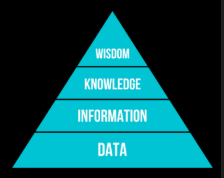

# INTEGRAÇÃO E EVOLUÇÃO DE SISTEMAS DE INFORMAÇÃO

## Sistemas de Informação

Um **Sistema de Informação (SI)** é um conjunto de componentes inter-relacionados que coletam, processam, armazenam e distribuem informações para apoiar a tomada de decisões e o controle em uma organização. Seu valor está em transformar dados brutos em valor estratégico para o negócio.

### A pirâmide DIKW

Os SI são o motor que movimenta a **pirâmide DIKW** — um modelo que representa a progressão hierárquica da informação, desde o dado bruto até a sabedoria aplicada:

??? note "Diagrama da pirâmide"
    

| Nível | Significado |
| --- | --- |
| **Data** (Dado) | Elementos brutos, sem contexto. |
| **Information** (Informação) | Dados organizados e contextualizados. |
| **Knowledge** (Conhecimento) | Interpretação da informação para a tomada de decisão — saber *como* usar a informação adequadamente. |
| **Wisdom** (Sabedoria) | Uso consciente do conhecimento, baseado em experiência, ética e visão estratégica. |

### Sistemas abertos e fechados

Um **sistema**, de forma geral, é uma coleção de componentes que interagem entre si e que, coletivamente, podem ser vistos como algo que trabalha em direção a um objetivo comum. Classificam-se em:

- **Sistemas fechados**: não interagem além de suas próprias fronteiras;
- **Sistemas abertos**: interagem ativamente com o ambiente ao seu redor.

Esquematicamente, todo sistema aberto tem essa forma: um fluxo de **entrada** atravessa a **fronteira do sistema**, passa por etapas de processamento internas, gera um **feedback** que realimenta o próprio processamento, e produz um fluxo de **saída** que cruza a fronteira de volta para o ambiente.

??? note "Diagrama de um sistema aberto genérico"
    

Os SI são, por definição, exemplos de **sistemas abertos** — são estabelecidos para servir à estratégia geral de uma organização, ajudando-a a cumprir seus objetivos no contexto de um ambiente externo em constante mudança.

!!! note "Nem todo SI é digital"
    Um Sistema de Informação não precisa necessariamente envolver computadores — um sistema de fichas de papel em uma biblioteca também é um SI. O que nos interessa aqui, especificamente, é o **SI baseado em computador**, composto por:

    - **Componentes de Tecnologia da Informação**: hardware, software, banco de dados e rede;
    - **Procedimentos/processos**;
    - **Pessoas**.

    ??? note "Diagrama de referência"
        

### Tecnologia da Informação vs. Sistema de Informação

É importante não confundir os dois termos:

- **TI (Tecnologia da Informação)**: refere-se a qualquer ferramenta baseada em computador que as pessoas usam para trabalhar com informação, apoiando as necessidades de processamento de informação de uma organização.
- **SI (Sistema de Informação)**: coleta, processa, armazena, analisa e dissemina informações para um fim **específico** — a TI é o conjunto de ferramentas; o SI é a solução organizacional construída sobre essas ferramentas.

**Infraestrutura de TI em um SI** é composta por seis componentes: hardware, software, redes, bancos de dados, pessoas e serviços.

#### Evolução da infraestrutura de TI

A infraestrutura de TI evoluiu por sucessivas eras: **mainframe** → **computador pessoal** → **modelo client/server** → **enterprise computing** → **cloud e mobile computing**. Essa evolução foi impulsionada por forças econômicas e tecnológicas bem definidas:

!!! note "Leis que impulsionaram a evolução"
    - **Custo de hardware (processamento)** — **Lei de Moore**: o poder de processamento dobra a cada dois anos.
    - **Custo de hardware (armazenamento)** — **Law of Mass Digital Storage**: o número de kilobytes que podem ser armazenados ao custo de 1 dólar dobra a cada 15 meses.
    - **Redução dos custos de comunicação** — **Lei de Metcalfe**: o valor de uma rede é proporcional ao quadrado do seu número de nós.

O ecossistema de infraestrutura de TI é formado por sete categorias de fornecedores que se interligam: plataformas de hardware de computador (ex.: Dell, IBM, Sun, HP, Apple, máquinas Linux), plataformas de sistemas operacionais (ex.: Microsoft Windows, Unix, Linux, Mac OS X, Google Chrome), aplicações de software empresarial — incluindo middleware (ex.: SAP, Oracle, Microsoft, BEA), gerenciamento e armazenamento de dados (ex.: IBM DB2, Oracle, SQL Server, Sybase, MySQL, EMC Systems), plataformas de internet (ex.: Apache, Microsoft IIS/.NET, Unix, Cisco, Java), redes e telecomunicações (ex.: Microsoft Windows Server, Linux, Novell, Cisco, Alcatel-Lucent, Nortel, AT&T, Verizon) e consultores/integradores de sistemas (ex.: IBM, EDS, Accenture).

??? note "Diagrama do ecossistema de infraestrutura de TI"
    

!!! example "Tendências (2012)"
    - **Hardware**: The Emerging Mobile Digital Platform; Grid Computing; Virtualization; Cloud Computing; Green Computing; Autonomic Computing; High-Performance and Power-Saving Processors.
    - **Software**: Linux and Open Source Software; Software for the Web (Java and Ajax); Web Services and Service-Oriented Architecture; Software Outsourcing and Cloud Services.

??? note "Imagens de referência (listas de tendências)"
    
    

### Diamante de Leavitt

O **Diamante de Leavitt** é um modelo de análise organizacional que ajuda a entender como diferentes elementos de uma organização estão interligados, trazendo uma visão sistêmica do negócio:

??? note "Diagrama do Diamante de Leavitt"
    

| Elemento | Pergunta que responde |
| --- | --- |
| **Task** (Tarefa) | O que precisa ser feito para atingir os objetivos da organização? |
| **People** (Pessoas) | Quem executa as tarefas? |
| **Technology** (Tecnologia) | Quais ferramentas e sistemas são usados para realizar as tarefas? |
| **Structure** (Estrutura) | Como a organização se organiza para coordenar pessoas e tarefas? |

O SI se relaciona com **todos** os vértices do diamante, mas principalmente com o da tecnologia:

- é a **tecnologia organizacional central**, automatizando tarefas, armazenando dados, apoiando decisões e conectando setores;
- **redesenha processos**, transformando atividades manuais em práticas guiadas por dados;
- **muda a forma como as pessoas trabalham**, exigindo novas competências e alterando papéis e relações;
- pode **descentralizar decisões**, eliminando camadas hierárquicas — ou, ao contrário, exigir a criação de novas unidades organizacionais.

### Tipos de SI

A escolha de qual tipo de SI usar depende bastante do setor, e vários tipos podem coexistir na mesma organização:

| Sigla | Nome | Função |
| --- | --- | --- |
| **EIS** | Executive Information Systems | Oferece visão global e estratégica da organização para a alta direção. |
| **DSS** | Decision Support Systems | Ajuda a tomar decisões não-estruturadas ou semi-estruturadas, com uso de modelos e simulações. |
| **ERP** | Enterprise Resource Planning | Integra todos os processos da empresa em um único sistema. |
| **CRM** | Customer Relationship Management | Gerencia o ciclo de vida do cliente, melhorando o relacionamento. |
| **SCM** | Supply Chain Management | Gerencia o fluxo de materiais e informações da cadeia logística. |
| **MIS** | Management Information Systems | Gera relatórios a partir dos dados de sistemas transacionais (**TPS** — Transaction Processing Systems) para apoiar o gerenciamento. |

!!! tip "Lei de Conway"
    A forma como as pessoas e equipes se comunicam dentro da empresa se reflete **diretamente** na estrutura do sistema construído — equipes fragmentadas tendem a produzir sistemas fragmentados, e vice-versa.

### SMACIT

**SMACIT** é o conjunto de tecnologias que vêm transformando a forma como as empresas operam:

- **S**ocial — uso de mídias sociais e plataformas de comunicação para interagir com clientes e construir comunidades;
- **M**obile — uso de dispositivos móveis para acessar informações e serviços da empresa;
- **A**nalytics — coleta, análise e interpretação de dados para entender comportamento de clientes, tendências de mercado e outros aspectos do negócio;
- **C**loud Computing — uso de serviços em nuvem para armazenar dados, hospedar aplicações e outros recursos;
- **I**nternet of **T**hings — conexão de dispositivos físicos à internet para coletar e transmitir dados, permitindo automação e controle remoto.

### Fatores críticos de sucesso na implantação de ERPs

Implantar um ERP é um dos projetos de TI mais arriscados e caros que uma organização pode empreender — a literatura identifica vários fatores críticos de sucesso:

1. **Composição e trabalho em equipe.** Definir uma equipe multidisciplinar: gerente de projeto, usuários-chave, especialistas de TI e consultores do parceiro de implementação.
2. **Apoio da alta gestão.** Comunicar a importância do projeto para toda a empresa; definir a visão estratégica para o ERP; resolver conflitos entre departamentos; garantir que os melhores funcionários participem do projeto.
3. **Plano de negócios e visão.** O **plano** define os benefícios esperados em termos mensuráveis (KPIs); a **visão** garante que todos entendam o objetivo como algo transformador, não apenas uma troca de software.
4. **Comunicação efetiva.** Presente durante todo o projeto, com o objetivo de manter todos informados, gerenciar expectativas sobre o que o sistema pode (e não pode) fazer, reduzir medo e resistência, e coletar feedback continuamente.
5. **Gestão de projeto.** Controlar escopo, tempo, custo, qualidade, riscos e recursos.
6. **Defensor do projeto (*champion*).** Uma figura específica que serve como ponto focal da mudança, ajudando a superar barreiras políticas e culturais, construindo apoio em todos os níveis da organização, e servindo de exemplo de otimismo e comprometimento com o novo sistema.
7. **Sistemas legados e de negócio adequados.** Fazer um inventário e análise profunda dos sistemas existentes: entender o que funciona bem e o que é problemático; decidir quais sistemas serão substituídos pelo ERP e quais precisam ser integrados a ele; planejar como os dados legados serão limpos e migrados.
8. **Programa de gestão da mudança e cultura.** Estruturar um programa que vá além de comunicação e treinamento: análise de impacto (como a mudança afeta cada cargo/departamento), mapeamento cultural (o que facilita ou dificulta a adoção) e um plano de ação concreto para mitigar resistências.
9. **Redesenho de processos (BPR) e mínima customização.** A empresa deve adaptar seus processos às melhores práticas já embutidas no ERP, em vez de customizar o software para replicar processos antigos — cada alteração no código-fonte do ERP gera custo, complexidade, dificulta atualizações futuras e aumenta o risco de bugs; customizar apenas quando for absolutamente essencial para uma vantagem competitiva real.
10. **Desenvolvimento, teste e solução de problemas de software.** A fase técnica mais intensa: desenvolvimento/configuração (ajustar o sistema aos processos definidos), testes (unitários, de integração — para ver se os módulos conversam entre si — e o **UAT**, *User Acceptance Testing*, onde usuários-chave validam o sistema em cenários reais), e um processo claro de *troubleshooting* para identificar, priorizar e corrigir erros.
11. **Monitoramento e avaliação do desempenho.** Crucial após a implementação: monitorar o desempenho técnico (velocidade, estabilidade), avaliar se os KPIs do plano de negócios estão sendo alcançados, e coletar feedback dos usuários para identificar necessidades de treinamento adicional ou pequenos ajustes — garantindo que o investimento realmente traga o retorno esperado.

---

## Processos de Negócio

Um **processo de negócio** é um conjunto de atividades ou tarefas estruturadas e relacionadas que produzem um serviço ou produto específico para seus clientes. É parte central dos SI, já que estes suportam, viabilizam e integram os processos de negócio da organização.

**Elementos básicos de um processo:**

| Elemento | Descrição |
| --- | --- |
| **Entrada** | Insumos, materiais, serviços e informações que fluem e são transformados pelas atividades do processo. |
| **Recursos** | Pessoas e equipamentos que realizam as atividades. |
| **Saída** | O produto ou serviço criado pelo processo. |

Se o processo envolve um cliente, esse cliente pode ser **interno** (ex.: um gerente que recebe um relatório interno) ou **externo** (ex.: um indivíduo ou empresa que adquire os produtos da organização, cliente de um processo de atendimento).

### Tipos de processos

| Tipo | Característica | Exemplo |
| --- | --- | --- |
| **Primários** (ou centrais) | Mais operacionais, diretamente ligados à missão da organização. | Processos ligados a vendas. |
| **De suporte** (ou habilitadores) | Apoiam os processos primários. | Processos ligados a atividades de RH. |
| **De gerenciamento** (ou governança) | Medem/monitoram atividades da organização, auxiliando em políticas e diretrizes. | Processos ligados a planejamento estratégico. |

Gerentes precisam prestar atenção especial aos processos de negócio, pois eles determinam o quão bem a organização executa seus negócios — e podem se tornar uma vantagem estratégica real. Algumas **métricas de eficiência** comuns: tempo para concluir o processo, satisfação do cliente, taxa de erros na entrada de dados, e disponibilidade de recursos.

### Process Mining

**Process Mining** é uma abordagem que combina técnicas de ciência de dados com gestão de processos, para descobrir, monitorar e melhorar processos de negócio com base em dados extraídos diretamente dos sistemas de informação — revelando como os processos realmente ocorrem na prática (e não como deveriam, segundo o modelo teórico).

| Tipo | Função |
| --- | --- |
| **Discovery** | Reconstrói o processo real a partir dos logs de eventos, sem necessidade de um modelo prévio. |
| **Conformance Checking** | Compara o processo real com o modelo esperado, mostrando desvios. |
| **Enhancement** | Usa dados reais para ajustar e melhorar o modelo de processo existente. |

### KPI (Key Performance Indicator)

Um **KPI** é um indicador-chave que mostra o quão bem um processo está atingindo seus objetivos — auxiliando a monitorar performance, identificar gargalos, embasar decisões e validar o impacto de melhorias implementadas. Exemplos comuns: CSAT, ROI, NPS.

!!! tip "KPIs devem ser SMART"
    **S**pecific (específicos), **M**easurable (mensuráveis), **A**chievable (atingíveis), **R**elevant (relevantes) e **T**ime-bound (com prazo definido).

### Abordagens de gestão e melhoria de processos

O objetivo geral é redesenhar processos de negócio para serem mais eficientes, reduzir custos e melhorar a qualidade. Existem três abordagens complementares:

**BPR (Business Process Reengineering).** Uma estratégia para tornar os processos de negócio de uma organização mais produtivos e lucrativos, determinando como eles podem ser **reconstruídos do zero** para melhorar suas funções. É, normalmente, uma estratégia radical dentro da organização.

**BPI (Business Process Improvement).** Um conjunto de métodos e ferramentas para identificar ineficiências e otimizar processos **já existentes** (mais incremental que o BPR). Técnicas usadas:

| Técnica | Foco |
| --- | --- |
| **PDCA** (Plan-Do-Check-Act) | Ciclo genérico de melhoria contínua. |
| **DMADV** (Define, Measure, Analyze, Design, Verify) | Criar **novos** produtos e processos. |
| **DMAIC** (Define, Measure, Analyze, Improve, Control) | Melhorar processos de negócio **já existentes**. |

**BPM (Business Process Management).** Uma abordagem sistemática para modelar, analisar, melhorar, automatizar e monitorar processos de negócio — ajuda a **sustentar** os esforços do BPI ao longo do tempo, em vez de ser um projeto único.

### BPMN (Business Process Model and Notation)

O **BPMN** é uma linguagem padronizada para modelagem de processos de negócio, facilitando a comunicação entre analistas, desenvolvedores e gestores. Seus principais elementos:

**Activities** (ações realizadas no processo):

- **Tasks**: passos simples e indivisíveis (ex.: "edit order");
- **Subprocessos**: representam um conjunto de tarefas colapsadas em um único elemento, identificado por um pequeno "+" no retângulo (ex.: "procure goods").

??? example "Exemplo de processo BPMN (pedido com procurement)"
    Um exemplo típico: o processo começa com o evento *Order Received*; segue para a task *Check Availability*; um gateway exclusivo (XOR) verifica se o artigo está disponível — se **sim**, vai direto para *Ship Article* e depois *Financial Settlement* (um subprocesso), terminando em *Payment Received*; se **não**, entra no subprocesso *Procurement*, que pode terminar em *Undelivered* (via evento intermediário de erro) ou *Late Delivery* (via evento intermediário de timer) — ambos os casos acionam a task *Inform Customer*, e o caminho de entrega atrasada ainda segue para *Remove Article from Catalogue*, terminando em *Article Removed*.

    
    

**Events** (pontos de entrada, interrupção ou saída):

- **Start events**: iniciam a instância do processo;
- **Intermediate events**: representam marcos ou condições intermediárias;
- **End events**: encerram o processo.

**Gateways** (controles do fluxo de decisão):

| Tipo | Comportamento |
| --- | --- |
| **Exclusive (XOR)** | Apenas uma única saída é escolhida. |
| **Inclusive (OR)** | Uma ou mais saídas podem ser tomadas. |
| **Parallel (AND)** | Todas as saídas são ativadas simultaneamente. |
| **Event-based** | O processo continua pelo primeiro evento que ocorrer. |

**Connecting Objects** (conectam os elementos do processo entre si):

- **Sequence flow**: fluxo de sequência entre tarefas, gateways e eventos;
- **Message flow**: comunicação entre *pools*;
- **Association**: liga dados ou artefatos a atividades.

**Artefatos** (fornecem dados e informações de apoio, como complementos de informação):

- **Data objects**: representam arquivos ou documentos usados/gerados pelo processo;
- **IT Systems**: representam sistemas que executam tarefas automatizadas;
- **Comentário/Nota**: pode ser associado a qualquer elemento via uma *association*.

**Swimlanes** (organização por responsabilidades, mostrando quem é responsável por cada parte do processo):

- **Pools**: representam entidades organizacionais inteiras;
- **Lanes**: representam grupos ou papéis específicos dentro de uma pool.

??? note "Ícones de notação BPMN (Events, Gateways, Connecting Objects, Artifacts, Swimlanes)"
    
    
    
    
    

---

## Cloud Computing

**Cloud Computing** é a entrega de serviços de computação pela internet. Suas duas propriedades centrais são a escalabilidade e a elasticidade: recursos podem ser ampliados ou reduzidos de forma inteligente conforme a demanda — envolvendo monitoramento contínuo e provisionamento automático —, e o contratante paga apenas pelo que efetivamente utiliza.

### Virtualização

A **virtualização** é o motor do Cloud Computing: permite que um único computador físico se comporte como vários computadores virtuais independentes, sendo o próprio motivo pelo qual a nuvem consegue ser escalável e elástica.

| | Máquina Virtual (VM) | Container |
| --- | --- | --- |
| **Nível de virtualização** | Hardware — cria uma máquina completa e virtual. | Sistema operacional. |
| **O que precisa instalar** | Um SO completo (com drivers e arquivos), e só então a aplicação com suas dependências. | Apenas as dependências e bibliotecas da própria aplicação. |
| **Peso/velocidade** | Alta demora, pesada. | Leve e rápida — melhora bastante a eficiência. |
| **Portabilidade** | Limitada ao hypervisor. | Alta — roda em qualquer ambiente (cloud, local, servidor próprio), compartilhando o mesmo SO entre containers. |
| **Exemplo** | VMware, VirtualBox | Docker |

Containers permitem empacotar aplicações junto com suas dependências, garantindo execução consistente em qualquer ambiente — e são altamente compartilháveis entre si.

### Modelos de implantação (deployment) de cloud

| Modelo | Característica |
| --- | --- |
| **Public** | Infraestrutura oferecida por terceiros via internet; alta escalabilidade e pagamento conforme uso; recursos compartilhados entre clientes (ex.: AWS, Azure, Google Cloud). |
| **Private** | Infraestrutura exclusiva de uma organização, hospedada internamente (*on-premise*) ou por terceiros; maior controle, segurança e personalização; ideal para dados sensíveis e ambientes regulados. |
| **Hybrid** | Combina o melhor dos dois mundos: a flexibilidade/personalização do modelo privado com a otimização e eficiência do modelo público. |

!!! note "Cloud Bursting"
    Uma forma comum de implementar o modelo híbrido é o **Cloud Bursting**: uma configuração da aplicação que permite que a nuvem privada "rompa" para a nuvem pública quando precisa de recursos computacionais adicionais, sem interrupção do serviço. Isso combina maior poder computacional sob demanda com a proteção dos dados privados — mantendo a segurança e a conformidade regulatória (como a LGPD).

### Modelos de serviço

| Modelo | O que inclui | Quem gerencia o quê | Exemplos |
| --- | --- | --- | --- |
| **IaaS** (Infrastructure as a Service) | VMs, redes e armazenamento — infraestrutura de TI básica sob demanda. | O provedor gerencia apenas hardware e virtualização; o usuário gerencia SO, armazenamento, aplicações, etc. — maior controle para o usuário. | Amazon EC2, Azure VMs, Google Compute Engine |
| **PaaS** (Platform as a Service) | Linguagem de programação, banco de dados, etc. — uma plataforma completa para desenvolvimento e implantação. | O provedor gerencia, além de HW e virtualização, também o SO e os logs; o usuário foca exclusivamente no desenvolvimento. | Google App Engine, Heroku, Azure App Services |
| **SaaS** (Software as a Service) | O software em si, acessado via internet. | O provedor gerencia praticamente tudo; o usuário gerencia apenas seus dados e configurações — menos controle geral, mas uso muito mais simples. | Gmail, Microsoft 365, Salesforce |

A tabela acima mostra apenas três modelos, mas a divisão de responsabilidades entre contratante e provedor é, na prática, um espectro mais granular. Considerando as camadas de uma aplicação (dados/configurações, código da aplicação, escalonamento, runtime, SO, virtualização e hardware), quem gerencia cada camada varia conforme o modelo:

| Camada | On-Premises | IaaS | CaaS (Containers) | PaaS | FaaS (Function) | SaaS |
| --- | --- | --- | --- | --- | --- | --- |
| Dados e configurações | Você | Você | Você | Você | Você | Você |
| Código da aplicação | Você | Você | Você | Você | Você | Provedor |
| Escalonamento | Você | Você | Você | Você | Provedor | Provedor |
| Runtime | Você | Você | Você | Provedor | Provedor | Provedor |
| Sistema operacional | Você | Você | Provedor | Provedor | Provedor | Provedor |
| Virtualização | Você | Provedor | Provedor | Provedor | Provedor | Provedor |
| Hardware | Você | Provedor | Provedor | Provedor | Provedor | Provedor |

??? note "Diagramas de referência (pirâmide SaaS/PaaS/IaaS e tabela de responsabilidades completa)"
    
    

---

## Segurança da Informação

### Tríade CIA

A **Tríade CIA** descreve os pilares fundamentais para a proteção de dados, cruciais para garantir que as informações sejam acessadas apenas por pessoas autorizadas, mantenham sua precisão, e estejam acessíveis quando necessário.

| Pilar | Garantia |
| --- | --- |
| **Confidencialidade** (Confidentiality) | Evitar a divulgação não autorizada de informação — fornecendo acesso a quem tem permissão, e impedindo que outros saibam qualquer coisa sobre o conteúdo. |
| **Integridade** (Integrity) | A informação não é alterada de forma não autorizada. |
| **Disponibilidade** (Availability) | A informação é acessível e modificável em tempo hábil por aqueles autorizados a fazê-lo. |

### Malwares (Malicious Software)

**Malware** é qualquer software projetado para causar danos ou realizar atividades maliciosas em sistemas de computador.

**Insider Attacks** ocorrem quando uma pessoa com acesso autorizado a um sistema (um funcionário ou parceiro) abusa desse acesso para causar danos à organização. Podem ser **intencionais** (visando prejudicar a empresa por motivos pessoais ou financeiros) ou **acidentais** (erros de configuração, falta de atenção). Dois mecanismos comuns:

- **Backdoor**: uma funcionalidade camuflada que permite ao usuário realizar ações normalmente não permitidas — geralmente envolvendo mecanismos de *bypassing authentication*.
- **Logic Bomb**: um programa que executa uma ação maliciosa quando condições específicas são atingidas, geralmente causando danos ou interrupções.

Os malwares também se classificam por **como se propagam** e **como se ocultam**:

| Categoria | Tipo | Comportamento |
| --- | --- | --- |
| Propagação | **Vírus** | Se replica e se espalha anexando cópias de si mesmo a outros arquivos/programas. |
| | **Worm** | Se replica e se espalha entre computadores, geralmente sem interação humana após a infecção inicial e sem precisar de um arquivo hospedeiro; na maioria das vezes carrega um *payload* malicioso. |
| Ocultação | **Rootkit** | Projetado para ocultar a presença de um invasor no sistema, dando acesso contínuo e controle remoto; feito para se esconder tanto do software de segurança quanto do usuário. |
| | **Trojan** | Se disfarça de programa legítimo para enganar usuários; precisa de interação do usuário para ser executado e causar dano. |
| | **Botnet** | Rede de dispositivos comprometidos, infectados com malware, controlada por um atacante (*Botnet Controller*) para realizar atividades maliciosas em larga escala. |

---

## Integração

Integrar sistemas é conectar aplicações (muitas vezes legadas, construídas em épocas e com tecnologias diferentes) para que troquem dados e funcionalidades de forma consistente — um dos maiores desafios práticos da evolução de sistemas de informação em qualquer organização grande.

### Teorema CAP

Em sistemas **distribuídos**, o Teorema CAP afirma que não é possível garantir simultaneamente as três propriedades a seguir:

??? note "Diagrama de Venn do Teorema CAP"
    

| Propriedade | Garantia |
| --- | --- |
| **C**onsistência | Todos os nós veem os mesmos dados ao mesmo tempo. |
| **A**vailability (Disponibilidade) | Cada requisição recebe uma resposta, mesmo que algum nó esteja offline. |
| **P**artition tolerance (Tolerância à partição) | O sistema continua funcionando mesmo havendo falhas de comunicação entre nós (partição de rede). |

!!! note "Na prática"
    Como falhas de rede são inevitáveis em sistemas distribuídos reais, a tolerância à partição é, em geral, obrigatória — o verdadeiro trade-off do CAP, na prática, é entre **Consistência** e **Disponibilidade**: sistemas CP sacrificam disponibilidade durante uma partição para manter consistência (ex.: bancos relacionais distribuídos tradicionais); sistemas AP sacrificam consistência imediata para continuar disponíveis (ex.: muitos bancos NoSQL, com consistência eventual).

### Critérios para integração de aplicações

Ao desenhar uma integração entre sistemas, vários critérios concorrentes precisam ser balanceados:

- **Acoplamento de aplicações**: minimizar dependências — toda suposição implícita que uma integração carrega é um ponto que, se quebrado, quebra a aplicação inteira. A interface de integração deve ser específica o suficiente para implementar funcionalidade útil, mas genérica o suficiente para mudar quando necessário.
- **Simplicidade da integração**: minimizar as mudanças exigidas nas aplicações e a quantidade de código de integração necessário — mas é preciso balancear: a abordagem com menos código não necessariamente fornece a melhor integração a longo prazo.
- **Tecnologia de integração**: a necessidade de software (e, às vezes, hardware) específico para viabilizar a integração.
- **Formato de dados**: a necessidade de um formato comum entre os sistemas, mas que não seja excessivamente genérico (perdendo expressividade) nem excessivamente específico (perdendo interoperabilidade).
- **Tempo de comunicação**: a preocupação com o tempo entre o envio e a recepção dos dados. As aplicações devem ser informadas logo que os dados estiverem disponíveis para consumo, e deve existir também a notificação inversa — de quando os dados foram efetivamente consumidos. Quanto mais tempo o dado demora a ser consumido, maior a chance de ele ficar desatualizado.
- **Dados vs. Funcionalidade**: uma integração pode envolver não apenas dados, mas também o compartilhamento de funcionalidades inteiras — o que traz benefícios de reuso, mas também complica a lógica de invocação e pode ter impactos de execução e consequências adicionais para a integração.
- **Assincronismo**: aplicações são independentes, e idealmente não deveriam precisar esperar pela execução de outras — especialmente quando o outro lado da comunicação está indisponível. Uma aplicação pode simplesmente querer disponibilizar um dado para consumo posterior, via execuções em paralelo e notificações/callbacks na conclusão das operações.

### Estilos de integração

Existem quatro estilos clássicos de integração entre aplicações, cada um com um trade-off diferente entre simplicidade, acoplamento e capacidades.

**File Transfer.** Uma aplicação escreve um arquivo (em um formato acordado) que outra aplicação posteriormente lê.

??? note "Diagrama: File Transfer"
    

- Gera um **acoplamento fraco** entre os sistemas (eles nem precisam saber da existência um do outro diretamente, apenas do formato do arquivo);
- Tem desvantagens relacionadas a aspectos temporais — não há garantia de quando o arquivo será lido, nem notificação imediata de disponibilidade.

**Shared Database.** Múltiplas aplicações leem e escrevem diretamente no mesmo banco de dados.

??? note "Diagrama: Shared Database"
    

- O gerenciamento de transações é garantido pelo próprio SGBD;
- Mas gera **acoplamento forte** no nível do schema: qualquer mudança na estrutura dos dados pode quebrar todas as aplicações que compartilham o banco.

**Remote Procedure Invocation.** Uma aplicação chama diretamente uma função/método exposto por outra, como se fosse uma chamada local.

??? note "Diagrama: Remote Procedure Invocation"
    

- O acesso aos dados fica **encapsulado** atrás da interface da função (em vez de exposto diretamente, como no shared database);
- Passa a ser possível também expor **funcionalidades**, não apenas dados — mas isso introduz acoplamento temporal forte: ambos os lados precisam estar disponíveis simultaneamente para a chamada funcionar.

**Messaging.** As aplicações trocam mensagens assíncronas através de um canal intermediário (fila, tópico, barramento de mensagens).

??? note "Diagrama: Messaging"
    

- O envio de mensagens não exige que todos os sistemas estejam funcionando ao mesmo tempo;
- Produz **baixo acoplamento** temporal — o receptor pode processar a mensagem quando estiver disponível;
- A comunicação assíncrona força os desenvolvedores a lidar com a realidade distribuída do sistema (falhas parciais, entregas fora de ordem, duplicação de mensagens), em vez de assumir uma ilusão de execução síncrona e confiável.

!!! tip "Padrões construídos sobre esses estilos"
    Na prática, arquiteturas de integração modernas combinam esses estilos básicos em padrões mais sofisticados:

    - **EAI (Enterprise Application Integration)**: uma camada central (muitas vezes um **ESB** — *Enterprise Service Bus*) que roteia, transforma e orquestra mensagens entre sistemas legados e novos, reduzindo o número de integrações ponto-a-ponto necessárias.
    - **API Gateway**: um ponto único de entrada que expõe funcionalidades de múltiplos sistemas internos como APIs (tipicamente REST ou GraphQL) para consumidores externos, cuidando de autenticação, *rate limiting* e roteamento.
    - **SOA (Service-Oriented Architecture)** e, mais recentemente, **microsserviços**: decompõem funcionalidades de negócio em serviços independentes, cada um dono dos seus próprios dados, comunicando-se via chamadas remotas (síncronas) ou mensageria (assíncrona) — levando os critérios de acoplamento, assincronismo e formato de dados discutidos acima ao centro das decisões arquiteturais de um sistema inteiro, não apenas de uma integração pontual.

    Essa evolução — de monólitos fortemente acoplados a um banco compartilhado, para arquiteturas distribuídas de serviços fracamente acoplados — é, em grande medida, a própria história da **evolução de sistemas de informação** nas últimas duas décadas: cada nova geração de arquitetura tenta resolver os problemas de acoplamento, escalabilidade e manutenibilidade deixados pela geração anterior, geralmente ao custo de maior complexidade operacional (observabilidade, consistência eventual, versionamento de contratos entre serviços).
