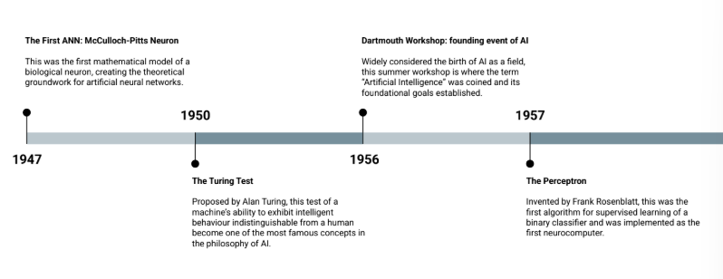

# APRENDIZAGEM DE MÁQUINA E CIÊNCIA DE DADOS

[Projeto Aprendizagem de Máquina](aprendizagem-de-maquina-e-ciencia-de-dados/projeto-aprendizagem-de-maquina.md)

---

## História da Inteligência Artificial

A história da IA é marcada por ciclos de entusiasmo e desilusão — os chamados "verões" e "invernos" da IA — conforme as técnicas disponíveis se mostravam (ou não) capazes de cumprir as promessas feitas sobre elas.

### Fundamentos (décadas de 1940-1950)

- **1947 — McCulloch–Pitts**: primeiro modelo matemático de um neurônio artificial, servindo de base conceitual para todas as redes neurais que vieram depois.
- **1950 — Teste de Turing**: Alan Turing propõe avaliar a inteligência de uma máquina por seu comportamento — se ele é indistinguível do de um humano em diálogo, a máquina pode ser considerada inteligente.
- **1956 — Workshop de Dartmouth**: considerado o "nascimento" formal da IA como campo de pesquisa; é nesse encontro que se definem as ambições e a agenda de pesquisa da área.
- **1957 — Perceptron**: primeiro algoritmo prático capaz de aprender classificadores binários a partir de dados, inaugurando o entusiasmo inicial com redes neurais.

??? note "Imagem de referência (linha do tempo 1947–1957)"
    

### Desafios e o primeiro inverno da IA

O otimismo inicial esbarrou em limitações técnicas que o conhecimento da época não conseguia superar:

- **1966 — Relatório ALPAC**: encomendado pelo governo dos EUA, o relatório conclui que os resultados em tradução automática eram fracos, levando a cortes de verba em pesquisa de IA.
- **1969 — Críticas ao Perceptron (Minsky & Papert)**: os autores demonstram matematicamente os limites das redes de uma única camada (como a incapacidade de resolver o problema XOR — ver seção sobre [MLP](#mlp-multi-layer-perceptron) mais adiante). O resultado é um esfriamento do interesse em redes neurais e uma redução generalizada nos investimentos em IA — o primeiro "AI winter".

??? note "Imagem de referência (linha do tempo 1966–1969)"
    

### Reascensão com o aprendizado em múltiplas camadas

- **Backpropagation**: a popularização de um algoritmo eficaz para treinar redes com várias camadas reabre o caminho para modelos mais expressivos, permitindo contornar as limitações apontadas por Minsky e Papert.

??? note "Imagem de referência (linha do tempo 1986)"
    

### Era das vitórias de sistemas especialistas

- **Deep Blue x Kasparov**: o computador da IBM derrota o campeão mundial de xadrez, provando a força da IA simbólica/heurística em domínios restritos e bem definidos.

??? note "Imagem de referência (linha do tempo 1997)"
    

### Explosão do deep learning e aplicações de consumo

- **2011–2016 — Assistentes de voz**: Siri (2011), Alexa (2014) e Google Assistant (2016) levam a IA para o bolso de qualquer pessoa.
- **2012 — ImageNet/AlexNet**: redes neurais profundas superam largamente os concorrentes em visão computacional — o "big bang" da era do deep learning.

??? note "Imagem de referência (linha do tempo 2011–2012)"
    

### Sistemas autônomos e percepção avançada

- **2014–2016 — Carros autônomos**: os avanços da Tesla e da Waymo popularizam a ideia de veículos com percepção e decisão assistidas por IA.

??? note "Imagem de referência (linha do tempo 2014–2022)"
    

### Geração de linguagem em larga escala

- **ChatGPT-3**: o acesso massivo a modelos de linguagem capazes de produzir textos fluentes e contextualmente coerentes democratiza o uso de IA generativa, inaugurando a fase atual do campo.

??? note "Imagem de referência (linha do tempo 2022)"
    

---

## Machine Learning

### Da lógica baseada em regras ao aprendizado orientado a dados

Historicamente, sistemas automatizados de decisão eram construídos de forma **rule-based** (baseada em regras): um especialista escrevia manualmente um conjunto de regras que, dado um texto ou objeto de entrada, devolvia um rótulo.

??? note "Imagem de referência (fluxo Text + Rules → Program → Label)"
    

Essa abordagem tem um problema estrutural: ela não escala nem generaliza bem. Manter as regras dá muito trabalho, o sistema é frágil a exceções que o especialista não previu, depende fortemente do conhecimento de quem o escreveu e quebra sempre que o domínio do problema muda.

!!! tip "A inversão de lógica do Machine Learning"
    Para resolver essa dor, o Machine Learning inverte a lógica do problema: em vez de fornecer regras e esperar rótulos, fornecemos **dados rotulados** (entrada + rótulo correto) e deixamos que o programa **aprenda as regras automaticamente**. Isso é o que chamamos de aprendizado supervisionado. A vantagem é que as regras emergem dos próprios dados, o que faz o modelo se adaptar melhor, generalizar para casos novos e reduzir drasticamente a engenharia manual.

Formalmente, **Machine Learning é o campo de estudo que dá ao computador a habilidade de aprender sem ser explicitamente programado** para a tarefa em questão.

### Dados

Dados são informações relevantes sobre um determinado objeto que podem ser usadas para fins de interpretação. Na prática, eles são representados como vetores de informação, no formato $x = [x_1, x_2, x_3, \ldots, x_n]$.

Exemplo — representação de um cliente para um modelo de segmentação:

```python
# Customer Segmentation
x = [
  28,     # Age
  65000,  # Annual income
  3,      # Years as customer
  15,     # Number of purchases last year
  850.50, # Average order value
  1,      # Has premium membership
  0,      # Gender (0=Female, 1=Male)
  2,      # City (encoded: 0=NYC, 1=LA, 2=Chicago)
  0.75    # Customer satisfaction score
]
```

??? note "Imagem de referência (exemplo de vetor de features)"
    

Eles se dividem em dois grandes tipos:

| Tipo | Características | Aplicações |
|---|---|---|
| **Estruturado** | Organizado em um esquema rígido e predefinido (linhas e colunas); pode ser qualitativo ou quantitativo | ML clássico, análise quantitativa |
| **Não estruturado** | Imagens, texto, áudio, vídeo; sem esquema fixo ou formato predefinido, flexível e dinâmico, mais complexo de analisar | NLP, visão computacional, IA generativa |

### Como o Machine Learning funciona

O processo de aprendizado se apoia em dados de exemplo (o conjunto de treinamento), compostos por:

- **Entradas (X)**: o que o modelo observa.
- **Saídas/Rótulos (y)**: o que queremos que o modelo preveja.

O algoritmo de aprendizagem, por sua vez, envolve três escolhas centrais:

1. **Um modelo**: uma forma matemática com parâmetros ajustáveis.
2. **Uma função de perda**: mede o erro entre a previsão do modelo e o rótulo verdadeiro.
3. **Um otimizador**: algoritmo que ajusta os parâmetros do modelo de forma a minimizar essa perda.

#### Etapas do treinamento

1. **Pré-processamento / featurização**: limpar dados nulos, padronizar escalas e criar novas features a partir das existentes, deixando os dados prontos para serem consumidos por um modelo de ML.
2. **Divisão dos dados**: uma vez limpos, os dados são divididos em treino (para o modelo aprender, 70–80%), validação (para escolher hiperparâmetros, 10–15%) e teste (para medir desempenho final e generalização, 10–15%).
3. **Épocas (epochs)**: o modelo vê lotes de exemplos (*batches*), calcula a perda, computa o gradiente (o quanto cada parâmetro contribuiu para o erro) e dá um passo que reduz essa perda. O treinamento para quando a perda de validação deixa de melhorar, ou após um número pré-definido de épocas.

#### Parâmetros vs. hiperparâmetros

É fundamental distinguir essas duas categorias de valores que um modelo possui:

- **Parâmetros**: são **aprendidos pelo modelo durante o treinamento**. Representam o conhecimento adquirido ao analisar o conjunto de dados, e a qualidade dos dados de treino afeta diretamente a qualidade dos parâmetros aprendidos.
- **Hiperparâmetros**: são **definidos manualmente antes do treinamento** — configurações externas que controlam o comportamento do algoritmo de aprendizado (ex: taxa de aprendizado, número de árvores). A busca pela melhor combinação de hiperparâmetros é chamada de *Hyperparameter Tuning*, e costuma usar o conjunto de validação para decidir qual combinação gera o melhor modelo.

Ao final do treinamento, obtemos um **modelo treinado**: basicamente o conhecimento e os padrões que o algoritmo conseguiu extrair dos dados, avaliado através de métricas calculadas sobre o conjunto de teste. Esse modelo é então usado para gerar predições sobre dados novos (nunca vistos), aplicando os padrões aprendidos durante o treinamento.

??? note "Imagem de referência (fluxo dados → algoritmo → modelo treinado → predições)"
    

!!! note "Resumo do fluxo"
    O processo de funcionamento do Machine Learning começa na coleta de dados, passa pelo uso de um algoritmo de aprendizado para encontrar padrões nesses dados, gera um modelo treinado e, por fim, usa esse modelo para fazer previsões sobre dados novos.

### Machine Learning vs. Deep Learning

A diferença central entre as duas abordagens está no tipo de dado com que trabalham bem e em como extraem features:

- Algoritmos clássicos de Machine Learning funcionam bem com dados **estruturados**. Eles também conseguem, tecnicamente, processar dados não estruturados, mas costumam ter desempenho ruim, pois não conseguem extrair valor desses dados em seu formato bruto — exigindo um processo manual de **Engenharia de Features**.
- Deep Learning funciona bem tanto com dados estruturados quanto não estruturados, pois as próprias redes neurais profundas aprendem a extrair as features relevantes automaticamente.

**Engenharia de Features** é o processo de criar, modificar, combinar e selecionar features de forma que fiquem mais fáceis para um algoritmo entender e usar nas suas previsões, com o objetivo principal de aumentar o poder preditivo do modelo. Uma das técnicas usadas é a **Feature Extraction**, que transforma dados brutos e complexos em um conjunto menor e mais gerenciável de features — geralmente de forma automatizada, muito comum com dados não estruturados, e com o objetivo de reduzir a dimensionalidade sem perder informação essencial.

No Machine Learning clássico, a Feature Extraction é feita de forma manual; no Deep Learning, ela é feita via redes neurais profundas, de forma automatizada — as primeiras camadas da rede aprendem a extrair features automaticamente como subproduto do próprio processo de treinamento. No ML clássico, a etapa de "feature extraction" é separada da etapa de "classification"; no Deep Learning, a rede neural faz as duas coisas de ponta a ponta. Essa capacidade de lidar melhor com dados não estruturados, porém, tem um custo: redes profundas demandam muito mais dados para treinar bem — métodos tradicionais de ML tendem a estagnar em desempenho (*performance*) conforme a quantidade de dados cresce, enquanto métodos de aprendizagem profunda continuam melhorando.

??? note "Imagem de referência (ML vs. DL; desempenho vs. quantidade de dados)"
    

    

### Taxonomias do Machine Learning

Um mesmo algoritmo de ML pode ser classificado segundo diversos eixos independentes: o **tipo de supervisão** disponível nos dados, a **tarefa** a ser resolvida, o **paradigma** (estratégia de aprendizado), a **estratégia temporal** (quando o aprendizado ocorre) e a **estratégia de modelagem** (o que o modelo representa matematicamente).

#### Tipos de supervisão

Este eixo classifica a natureza dos dados de treinamento disponíveis.

##### Aprendizado Supervisionado

É, em essência, um problema de **inferência indutiva**: a partir de um conjunto finito de dados rotulados, buscamos criar uma regra geral que se aplique a todos os casos possíveis, incluindo os não observados. Na notação usual: $x$ é o padrão/entrada, $y$ é o rótulo/saída desejada, o par $(x_i, y_i)$ é um exemplo de treino, e o algoritmo de aprendizagem produz um modelo/hipótese $h$ tal que, para uma nova entrada $x_{novo}$, a predição é $y = h(x)$. Classificação é o caso em que $y$ é uma classe/categoria conhecida; regressão é o caso em que $y$ é um valor real.

??? note "Imagem de referência (diagrama do fluxo de aprendizado supervisionado)"
    

Dentro do aprendizado supervisionado, duas grandes famílias de tarefas se destacam: classificação e regressão.

**Classificação** é o problema de identificar a qual de um conjunto de categorias uma nova observação pertence, com base em um treinamento realizado sobre dados cujas categorias já são conhecidas. Os algoritmos de classificação tentam encontrar a **fronteira de decisão** — uma hipersuperfície que separa as diferentes classes no espaço de features — e o aprendizado consiste em ajustar a forma e a posição dessa fronteira para minimizar os erros de classificação nos dados de treinamento.

- **Classificação binária**: apenas duas classes, frequentemente rotuladas como positiva (1) e negativa (0).
- **Classificação multiclasse**: mais de duas classes, cada instância pertencendo a exatamente uma (as classes são mutuamente exclusivas).
- **Classificação multirrótulo**: uma única instância pode ser associada a múltiplos rótulos simultaneamente, sem exclusividade mútua.

**Regressão** modela a relação entre um conjunto de features (variáveis independentes) e uma variável dependente contínua, buscando encontrar a curva que melhor se ajusta à dispersão dos pontos de dados.

- **Regressão Linear**: relaciona features e saída de forma linear.
- **Regressão Polinomial**: captura relações não lineares criando novas features que são potências ou interações das features originais.
- **Regressões linearizadas com regularização**: somam um termo de penalidade ao custo do modelo linear para combater overfitting e multicolinearidade (features altamente correlacionadas).
    - **Ridge**: adiciona uma penalidade proporcional ao quadrado da magnitude dos coeficientes, forçando-os a serem pequenos — mas não zerando nenhum.
    - **Lasso**: adiciona uma penalidade proporcional ao valor absoluto dos coeficientes, podendo zerar alguns deles — funcionando como um método de seleção automática de features.
- **Modelos baseados em árvores**:
    - *Árvore de Decisão para Regressão*: particiona o espaço de features recursivamente, mas em vez de buscar a pureza de classe em cada folha, busca minimizar a variância dos valores de y. A predição para uma nova instância é a média dos valores de y de todas as amostras de treino que caem naquela folha.
    - *Random Forest e Gradient Boosting*: combinam múltiplas árvores de decisão para criar modelos extremamente poderosos e robustos, que frequentemente representam o estado da arte para dados tabulares.

##### Aprendizado Não Supervisionado

Aqui não há rótulos nem respostas corretas para treinar o modelo — o objetivo é modelar a estrutura subjacente ou a distribuição dos dados, mergulhando neles para descobrir, por conta própria, estrutura, padrões e relações ocultas. Nesse caso, o algoritmo recebe apenas padrões de entrada $(x_0, x_1, \ldots, x_m)$, sem rótulos, e produz como modelo/hipótese $h$ os grupos ou protótipos encontrados — para uma nova entrada $x$, a saída $y = h(x)$ é o grupo/categoria e/ou protótipo ao qual ela pertence (nos casos de *clustering*, $y$ é uma categoria desconhecida a priori; em reconhecimento de padrões, descobrem-se protótipos que resumem os dados).

??? note "Imagem de referência (diagrama do fluxo de aprendizado não supervisionado)"
    

Duas categorias principais organizam esse campo:

**Clustering**, cujo objetivo é agrupar dados semelhantes em clusters (grupos): os pontos de dados dentro de um mesmo cluster devem ser muito parecidos entre si e muito diferentes dos pontos de outros clusters.

??? note "Imagem de referência (fluxo genérico dados → algoritmo → grupos/modelo)"
    

A avaliação de clustering é dividida entre métricas que exigem rótulos verdadeiros e métricas que não exigem:

**Métricas externas** (requerem *ground truth*, ou seja, rótulos verdadeiros):

- **Acurácia de clusterização** (varia entre $[0,1]$): primeiro monta-se a matriz de confusão $m$ (clusters encontrados $\times$ classes reais $\hat{y} \times y$); permutam-se as colunas para maximizar o total da diagonal principal; e então calcula-se a acurácia como a razão entre a soma da diagonal (acertos, após a melhor permutação) e o total de pontos:

    $$Acc = \frac{\sum_i m_{ii}}{\sum_i \sum_j^n m_{ij}}$$

    ??? note "Imagem de referência (matriz de confusão e fórmula da acurácia de clusterização)"
        

- **Pureza**: para cada cluster, identifica-se a classe mais frequente; a pureza é a média ponderada dessas frequências. Ela tende a aumentar com o número de clusters (é igual a 1 se cada ponto for seu próprio cluster).

    $$P = \frac{1}{n} \sum_i \max_j \sum_j \mathbb{1}\{\hat{y}_i = y_j\}$$

    ??? note "Imagem de referência (fórmula da pureza)"
        

- **Informação Mútua Normalizada (NMI)**, variando entre $[0,1]$: baseada em entropia, mede a informação compartilhada entre as atribuições de clusters e os rótulos reais, normalizada para estar entre 0 e 1. Penaliza subdivisões excessivas que não adicionam informação real.

    $$NMI(y, \hat{y}) = \frac{2 \times I(y; \hat{y})}{[H(y) + H(\hat{y})]}$$

    Onde $H(\cdot)$ é a entropia, $H(y) = -\sum_i p(y=y_i)\log(p(y=y_i))$, e $I(y;\hat{y})$ é a informação mútua, $I(y;\hat{y}) = H(y) - H(y\mid\hat{y})$.

    ??? note "Imagem de referência (fórmulas de NMI, entropia e informação mútua)"
        

**Métricas internas** (usadas na prática, quando não há rótulos disponíveis):

- **Coeficiente de Silhueta**: combina coesão (quão perto um ponto está dos membros do seu próprio cluster) e separação (quão longe está dos clusters vizinhos). Define-se $a(i)$ como a distância média de um ponto $i$ aos outros pontos do mesmo cluster (coesão), e $b(i)$ como a distância média aos pontos do cluster vizinho mais próximo (separação). Para cada ponto $i$, calcula-se:

    $$S(i) = \frac{b(i) - a(i)}{\max\{a(i), b(i)\}}$$

    ??? note "Imagem de referência (definições de a(i), b(i) e fórmula do coeficiente de silhueta)"
        

    O valor varia de $-1$ a $+1$: valores próximos de $+1$ indicam ponto bem agrupado e longe de clusters vizinhos; valores próximos de $0$ indicam fronteiras sobrepostas; valores negativos indicam atribuição provavelmente errada.

**Redução de Dimensionalidade**, cujo objetivo é reduzir o número de features preservando o máximo de informação relevante possível. Grandes quantidades de dimensões (features) podem tornar o treinamento de modelos lento, ineficiente e suscetível à *maldição da dimensionalidade* — os dados se tornam muito esparsos no espaço de alta dimensão.

A maior dificuldade do aprendizado não supervisionado, em geral, é justamente avaliar o resultado do modelo, por causa da ausência de rótulos de referência.

##### Aprendizado Semi-Supervisionado

É uma abordagem híbrida que combina o melhor dos dois mundos: utiliza um grande volume de dados **não rotulados** para melhorar a performance de um modelo treinado sobre um pequeno volume de dados **rotulados**, extraindo o máximo de valor de dados baratos e abundantes (já que dados rotulados são caros e difíceis de obter).

O funcionamento se apoia em três suposições fundamentais:

- **Suposição de continuidade (*smoothness*)**: pontos próximos no espaço de features têm alta probabilidade de compartilhar o mesmo rótulo, portanto a informação do rótulo pode ser suavizada através da vizinhança dos dados.
- **Suposição de cluster**: os dados tendem a formar clusters distintos, logo pontos dentro do mesmo cluster têm alta probabilidade de ter o mesmo rótulo — e a fronteira de decisão entre classes deve passar por regiões de baixa densidade.
- **Suposição de variedade (*manifold*)**: embora os dados possam viver em um espaço de alta dimensão, eles na verdade residem em uma estrutura de dimensão muito menor (um *manifold*), que o algoritmo pode explorar para generalizar melhor.

As principais técnicas são:

- **Self-Training**: treina-se um modelo com o pequeno conjunto rotulado, usa-se esse modelo para prever rótulos no conjunto não rotulado, seleciona-se as previsões em que ele está mais confiante e adicionam-se esses pares (dado, pseudo-rótulo) ao conjunto de treinamento, repetindo o retreinamento.
- **Modelos Generativos**: tentam aprender a estrutura subjacente dos dados usando todos os dados (rotulados e não rotulados), modelando $p(x)$ ou $p(x, y)$, e só depois usam os poucos dados rotulados para associar essa estrutura aos rótulos — é como primeiro aprender o mapa do território e depois usar os poucos pontos rotulados como legendas desse mapa.
- **Graph-Based Methods**: representam todo o conjunto de dados como um grafo, onde nós são pontos de dados (rotulados e não rotulados) e arestas conectam pontos semelhantes, permitindo técnicas como *Label Propagation* para difundir os rótulos conhecidos pelo grafo.

##### Aprendizado Auto-Supervisionado (SSL)

Essa técnica permitiu à IA aprender a partir da escala massiva de dados brutos disponíveis no mundo, movendo o campo de modelos especializados para modelos generalistas com uma compreensão profunda e flexível de seus domínios. A ideia central é que o aprendizado não supervisionado "finge" ser supervisionado: os próprios dados fornecem sua própria supervisão, resolvendo o gargalo da rotulagem manual.

O mecanismo se divide em duas etapas:

- **Tarefa Pretexto (*Pretext Task*)**: etapa de auto-supervisão em que um enorme volume de dados não rotulados é coletado e uma tarefa artificial é inventada, cuja resposta já está contida nos próprios dados. O objetivo não é que o modelo se torne bom na tarefa pretexto em si, mas que, ao tentar resolvê-la, aprenda representações ricas e úteis sobre os dados.
- **Tarefa Fim (*Downstream Task*)**: depois que o modelo foi pré-treinado na tarefa pretexto com bilhões de exemplos, ele desenvolveu um entendimento profundo de linguagem ou imagens. Esse modelo pré-treinado é então adaptado para uma tarefa real usando um pequeno conjunto rotulado — o chamado **Fine-Tuning** (ajuste fino).

Essa abordagem quebra a dependência de dados rotulados por humanos, tornando-se infinitamente escalável e permitindo a criação de modelos gigantes e de propósito geral.

##### Aprendizado por Reforço

Aprender através da experiência e da interação com um ambiente — a forma mais próxima de como os humanos aprendem a tomar decisões no mundo real, por tentativa e erro.

Seus componentes centrais são:

- **Agente**: a entidade que aprende e toma decisões.
- **Ambiente**: o mundo com o qual o agente interage.
- **Estado (S)**: uma "fotografia" do ambiente em um determinado momento.
- **Ação (A)**: uma das possíveis jogadas/movimentos que o agente pode realizar em um estado.
- **Recompensa (R)**: o feedback numérico que o agente recebe do ambiente após tomar uma ação.

O ciclo de funcionamento segue três passos: o agente **observa** o estado atual, decide uma **ação** com base nesse estado, e o ambiente reage com um **feedback**, transitando para um novo estado e devolvendo um sinal que pode ser recompensa (número positivo, se a ação aproximou o agente do objetivo), punição (número negativo, se a ação foi ruim) ou neutro (zero, se não houve consequência imediata).

!!! note "O objetivo não é a recompensa imediata"
    O objetivo do agente não é obter a maior recompensa no passo atual, mas sim **maximizar a recompensa cumulativa total ao longo do tempo**. Isso força o agente a pensar estrategicamente, aceitando ações que podem não ser as melhores no curto prazo, mas que levam a um resultado muito melhor no futuro.

Essa dinâmica cria uma tensão fundamental entre duas abordagens:

- **Explotação**: o agente escolhe a ação que já sabe, por experiência passada, que lhe dará boa recompensa.
- **Exploração**: o agente tenta uma ação nova, nunca testada antes, para descobrir o que acontece — a recompensa é incerta, mas pode revelar uma estratégia ainda melhor.

Um bom agente de RL precisa equilibrar de forma inteligente a exploração (para descobrir novas e melhores estratégias) com a explotação (para usar o conhecimento já adquirido e garantir boas recompensas). O ciclo descrito acima é geralmente notado como: o **agente aprendiz** observa o **estado** $S_t$ do **ambiente**, realiza a **ação** $A_t$, e o ambiente retorna o próximo estado junto com o **sinal de reforço** $R_{t+1}$.

??? note "Imagem de referência (ciclo agente–ambiente com notação S_t, A_t, R_t+1)"
    

#### Tarefa

Refere-se ao tipo do problema que se deseja resolver (classificação, regressão, clustering, etc.) — um eixo ortogonal ao tipo de supervisão.

#### Paradigma (estratégia de aprendizado)

O paradigma descreve a estratégia de aprendizado do modelo. O conceito central aqui é o de **update**: o momento em que o modelo ajusta seus parâmetros internos ("conhecimento") com base em novas informações, para melhorar seu desempenho. A forma como essa atualização ocorre é o que diferencia fundamentalmente os paradigmas a seguir.

| Paradigma | Como ocorre o update | Características |
|---|---|---|
| **Batch Learning (Offline)** | Treina sobre todo o conjunto de dados de uma vez; update exige retreinamento completo | Estável, mas não se adapta a novos dados |
| **Online Learning** | Treina com uma instância por vez; update contínuo e incremental | Adapta-se rapidamente a novos dados (evita *concept drift*), mas é menos estável e corre risco de treinar com dados classificados incorretamente |
| **Transfer Learning** | Reutiliza o aprendizado de uma tarefa relacionada | Em vez de treinar do zero para a tarefa X, reutiliza-se um modelo já treinado na tarefa Y |
| **Few-Shot Learning** | Lida com poucos exemplos por classe (caso extremo de Transfer Learning) | Envolve treinar o modelo em uma grande variedade de classes para que ele "aprenda a aprender" a extrair características discriminativas e generalizar rapidamente a partir de um punhado de exemplos |
| **Multi-Task Learning** | Lida com múltiplas tarefas simultaneamente | O modelo tem uma "espinha dorsal" (*shared layers*) com representações úteis para todas as tarefas, e "cabeças" específicas (*task-specific layers*) para cada uma; o sinal de uma tarefa ajuda na generalização das outras |
| **Eager Learning** | Aprendizado ocorre na fase de treinamento | Gera um modelo explícito; predição rápida, mas requer retreinamento para incorporar novos dados |
| **Lazy Learning** | Aprendizado ocorre na fase de predição | Não há modelo treinado, apenas instâncias armazenadas; predição lenta, mas facilmente adaptável a novos dados |

**Instance-based Learning** é um paradigma particular em que as predições são feitas com base na similaridade com instâncias armazenadas do conjunto de treinamento. Ele reúne várias das características acima: é *Lazy* (não constrói modelo explícito), *Memory-Based* (armazena todas ou parte das instâncias de treino), *Local* (as decisões se baseiam na vizinhança da nova consulta) e *Non-parametric* (não assume uma forma específica para a função objetivo). Sua hipótese central é que "instâncias próximas no espaço de características tendem a ter rótulos similares".

#### Estratégia Temporal

Descreve simplesmente **quando** o aprendizado ocorre — eixo relacionado, mas não idêntico, à distinção entre Batch/Online/Eager/Lazy descrita acima.

#### Estratégia de Modelagem

Esse eixo descreve **o que**, matematicamente, o modelo aprende a representar.

- **Modelos Discriminativos**: aprendem fronteiras de decisão ou funções de mapeamento que discriminam entre diferentes classes. Formalmente, aprendem a modelar a probabilidade da variável de saída $y$ (rótulo) condicionada pela variável de entrada $x$ (features), ou seja, $p(\mathbf{y} \mid \mathbf{x}; \theta)$ — predizem o rótulo dadas as features.

    ??? note "Imagem de referência (fórmula de modelo discriminativo)"
        

- **Modelos Generativos**: aprendem a distribuição conjunta de probabilidade dos dados, podendo gerar novos exemplos similares aos de treinamento. Modelam a probabilidade da entrada $x$ condicionada pela saída $y$, ou seja, $p(\mathbf{x} \mid \mathbf{y}; \theta)$ — estimam as features dado o rótulo.

    ??? note "Imagem de referência (fórmula de modelo generativo)"
        

### Métricas de Avaliação

Para qualquer problema de classificação, o ponto de partida da avaliação é a **matriz de confusão**, que organiza as previsões do modelo contra os rótulos reais. Exemplo (classificar "gato" vs. "não é gato"):

| | Classe esperada: Gato | Classe esperada: Não é gato |
| --- | --- | --- |
| **Classe prevista: Gato** | 25 — Verdadeiro Positivo | 10 — Falso Positivo |
| **Classe prevista: Não é gato** | 25 — Falso Negativo | 40 — Verdadeiro Negativo |

??? note "Imagem de referência (matriz de confusão do exemplo gato/não-gato)"
    

- Positivos reais: $TP + FN$
- Negativos reais: $TN + FP$

A partir dessa matriz derivam-se as principais métricas:

**Acurácia** mede a performance geral do modelo: a proporção de previsões corretas em relação ao total de previsões feitas.

$$\text{Acurácia} = \frac{TP + TN}{TP + TN + FP + FN}$$

??? note "Imagem de referência (fórmula da acurácia)"
    

É útil quando as classes do dataset estão bem balanceadas; com classes desbalanceadas, pode ser enganosamente alta.

**Precisão** mede o quão confiável é o modelo ao dizer "sim": a proporção entre os acertos de classe positiva e o total de previsões feitas para a classe positiva.

$$\text{Precision} = \frac{TP}{TP + FP}$$

??? note "Imagem de referência (fórmula da precisão)"
    

É útil quando o custo de um **falso positivo** é alto.

**Recall** (também chamado de *Sensitivity*) mede quantos dos casos positivos existentes de fato foram encontrados pelo modelo.

$$\text{Sensitivity} = \frac{TP}{TP + FN}$$

??? note "Imagem de referência (fórmula do recall/sensitivity)"
    

É útil quando o custo de um **falso negativo** é muito alto.

**F1-Score** é a média harmônica entre precisão e recall, balanceando confiança e cobertura — ideal quando é preciso de um bom desempenho tanto em evitar alarmes falsos quanto em encontrar todos os casos positivos.

$$\text{F1 score} = 2 \times \frac{\text{Precision} \times \text{Recall}}{\text{Precision} + \text{Recall}}$$

??? note "Imagem de referência (fórmula do F1-score)"
    

| Métrica | Pergunta que responde | Quando priorizar |
|---|---|---|
| Acurácia | Quantas previsões, no geral, estão corretas? | Classes balanceadas |
| Precisão | Das vezes que previ "positivo", quantas estavam certas? | Custo de falso positivo alto |
| Recall | Dos positivos reais, quantos eu encontrei? | Custo de falso negativo alto |
| F1-Score | Equilíbrio entre precisão e recall | Quando ambos os erros importam |

#### Curva ROC e AUC

A **Curva ROC** (*Receiver Operating Characteristic*) é um gráfico que ilustra o desempenho de classificação em todos os limiares de classificação possíveis, mostrando o quão bem o modelo distingue entre as classes positiva e negativa.

- **Eixo X** — taxa de falsos positivos (FPR): $FPR = FP / (FP + TN)$. Quanto mais próximo de 0, melhor.
- **Eixo Y** — taxa de verdadeiros positivos (TPR): é o próprio recall; quanto mais próximo de 1, melhor.

A diagonal tracejada representa um classificador aleatório; quanto mais a curva se aproxima do canto superior esquerdo (um classificador perfeito ficaria no ponto `(0, 1)`), melhor o modelo.

??? note "Imagem de referência (gráfico da curva ROC)"
    

A **AUC** (*Area Under the Curve*) mede a área sob a curva ROC — equivalente à probabilidade de que o modelo classifique um exemplo positivo aleatório com uma pontuação mais alta do que um exemplo negativo aleatório. Em outras palavras, mede o quão bem o modelo consegue separar as duas classes. Faixas de referência: **AUC = 1.0** é um classificador perfeito; **AUC entre 0.7 e 1.0** é geralmente considerado um modelo bom a excelente; **AUC = 0.5** é desempenho aleatório (a área sob a linha tracejada); **AUC < 0.5** significa que o modelo é pior que aleatório.

??? note "Imagem de referência (faixas de interpretação da AUC)"
    

**Escolha do limiar (*threshold*)**: é o ponto de corte usado para converter a saída de probabilidade do modelo em uma decisão final de sim/não — por exemplo, com threshold de 0.5, probabilidade acima disso é "sim", abaixo é "não". Duas estratégias comuns para escolher esse limiar:

- **Índice de Youden**: o ponto na curva ROC mais distante verticalmente da diagonal, que maximiza $TPR - FPR$. É, de forma geral, a escolha ótima, pois busca o ponto de maior poder discriminatório do modelo.
- **Equal Error Rate (EER)**: o ponto na curva onde a taxa de falsos positivos é igual à taxa de falsos negativos ($FPR = 1 - TPR$). Útil em problemas onde os dois tipos de erro têm custos semelhantes.

### Overfitting vs. Underfitting

- **Underfitting**: ocorre quando o modelo aprende de menos — é simples demais para capturar os padrões reais dos dados, apresentando mau desempenho tanto no treino quanto em dados novos.
- **Overfitting**: ocorre quando o modelo se especializa demais nos dados de treino, memorizando ruído em vez de padrões gerais, e perde capacidade de generalização para dados novos.

Visualmente, numa fronteira de decisão entre duas classes: *underfitting* é uma fronteira simples demais (ex: uma reta) que não explica bem a variância dos dados; o ajuste apropriado captura a forma real da separação entre classes; e *overfitting* é uma fronteira excessivamente complexa, que se contorce para acertar cada ponto de treino individualmente ("boa demais para ser verdade").

??? note "Imagem de referência (fronteiras de decisão: underfitting, ajuste apropriado, overfitting)"
    

Ao longo das épocas de treino, a perda (*loss*) de treino tende a cair continuamente, mas a perda de validação cai até certo ponto e depois volta a subir — esse ponto de inflexão marca a transição de *underfitting* para *overfitting*, e é onde se aplica o **early stopping** (parar o treino antes que o modelo comece a decorar o ruído dos dados de treino).

??? note "Imagem de referência (curvas de loss de treino/validação e ponto de early stopping)"
    

## CRISP-DM

O **CRISP-DM** (*Cross-Industry Standard Process for Data Mining*) é um framework estruturado para projetos de ciência de dados, mais relevante em empresas tradicionais e indústrias reguladas do que em tech companies e startups (que costumam adotar processos mais ágeis e menos formais).

1. **Business Understanding (Entendimento do Negócio)**: traduzir o problema de negócio para um problema técnico de ML, estabelecer métricas de sucesso (ex: "reduzir churn usando classificação binária com F1-score > 0.8") e identificar stakeholders e restrições.
2. **Data Understanding (Entendimento dos Dados)**: realizar a coleta inicial e descrição dos dados, analisar sua qualidade e completude, e identificar padrões preliminares. Entregáveis típicos incluem um dicionário de dados e um relatório de qualidade.
3. **Data Preparation (Preparação dos Dados)**: a fase que mais consome tempo no projeto — estimada entre 60% e 80% do total. Inclui limpeza (tratar valores ausentes, outliers, inconsistências), transformação (normalização, encoding), engenharia de features e integração de múltiplas fontes.
4. **Modeling (Modelagem)**: seleção dos algoritmos apropriados, ajuste (*tuning*) de hiperparâmetros, uso de validação cruzada para garantir robustez e comparação sistemática entre os modelos testados.
5. **Evaluation (Avaliação)**: avaliar a performance com métricas técnicas, medir o impacto real no negócio (*business value*), verificar a robustez em cenários adversos e analisar interpretabilidade e *fairness* (ausência de bias).
6. **Deployment (Implantação)**: definir a infraestrutura de produção, implementar monitoramento (para *drift* e degradação do modelo), estabelecer um processo de manutenção e retreinamento, e ter estratégias de contingência (*rollback*).

## Análise Exploratória de Dados (EDA)

A EDA é o processo de investigar, visualizar e compreender os dados sistematicamente antes de aplicar qualquer algoritmo de ML. Seus princípios centrais são deixar as hipóteses emergirem dos próprios dados, usar visualização extensivamente e manter um ceticismo saudável sobre o que se observa.

Ela se organiza em quatro frentes complementares:

- **Análise estrutural**: entender a "anatomia" dos dados — dimensionalidade (número de observações e variáveis), tipos de dados, valores ausentes e duplicatas.
- **Análise distribucional**: como os dados se comportam — distribuições univariadas, assimetria (*skewness*), outliers e variabilidade.
- **Análise relacional**: como as variáveis se conectam — correlações, dependências, interações e clusters.
- **Detecção de anomalias**: identificar o que está "estranho" — outliers (que podem ser erros ou valores legítimos) e inconsistências.

### Técnicas de EDA por número de variáveis

| Abordagem | Tipo de variável | Técnicas estatísticas | Visualizações |
|---|---|---|---|
| **Univariada** | Quantitativa | Tendência central (média, mediana, moda), dispersão (variância, desvio padrão), forma (assimetria, curtose) | Histograma, box plot, density plot |
| **Univariada** | Qualitativa | Análise de frequência (absoluta, relativa, acumulada) | Gráfico de barras, gráfico de pizza, gráfico de Pareto |
| **Bivariada** | Quantitativa × Quantitativa | Correlação (Pearson, Spearman) | Scatter plot, heatmap de correlação |
| **Bivariada** | Categórica × Quantitativa | ANOVA | Box plot por grupo, violin plot |
| **Bivariada** | Categórica × Categórica | Tabela de contingência, teste qui-quadrado | Heatmap de contingência, stacked bar chart |
| **Multivariada** | Múltiplas | Matriz de correlação | Heatmap, frequentemente com dendrograma |

## Pré-processamento de dados

O pré-processamento transforma dados brutos em um formato adequado para ML, seguindo o princípio de que "*garbage in, garbage out*": a qualidade da saída de um modelo nunca supera a qualidade dos dados que o alimentam.

### Tratamento de valores ausentes (Missing Values)

Algoritmos podem falhar diante de valores `NaN`, e um tratamento inadequado pode introduzir *bias* sistemático no modelo. A estratégia correta depende do **mecanismo de ausência** dos dados:

- **MCAR (Missing Completely At Random)**: a ausência é totalmente aleatória (ex: falha de computador). Não introduz bias; pode-se deletar as linhas ou imputar (ex: pela média) sem maiores preocupações.
- **MAR (Missing At Random)**: a ausência depende de outras variáveis observadas (ex: homens respondem menos sobre peso, mas sabemos quem é homem). Deletar valores aqui introduz bias; a imputação deve considerar as outras variáveis (ex: imputação por regressão).
- **MNAR (Missing Not At Random)**: a ausência depende do próprio valor que está faltando (ex: pessoas de alta renda não revelam o salário). É o caso mais complexo e causa bias severo — imputação simples ou deleção não resolvem; a única saída correta é modelar o próprio mecanismo de ausência.

### Tratamento de outliers

Outliers são observações significativamente diferentes do restante do conjunto. Nem todo outlier deve ser removido — é preciso distinguir três tipos:

- **Outliers estatísticos**: valores extremos, mas válidos e legítimos (ex: salário do CEO, altura de um jogador de basquete). Não devem ser deletados; o tratamento envolve transformações (ex: log) ou o uso de modelos robustos a extremos.
- **Outliers de domínio**: valores que violam regras de negócio ou lógicas (ex: idade de 150 anos, desconto de 120%). Devem ser investigados e corrigidos se possível, ou deletados se comprovadamente impossíveis.
- **Erros de dados**: valores incorretos por falha de coleta ou entrada (ex: valores padrão como 999, encodings quebrados como "S?o Paulo"). Devem ser corrigidos na fonte, ou deletados.

### Tratamento de duplicatas

Registros que representam a mesma entidade podem causar overfitting e introduzir bias na avaliação do modelo.

- **Duplicatas exatas**: linhas idênticas. Tratamento: remover, mantendo apenas a primeira ocorrência.
- **Duplicatas aproximadas**: mesma entidade com pequenas diferenças (ex: "João Silva" vs. "Joao Silva"). Tratamento: padronização (ex: lowercase) e similaridade de strings (ex: distância de Levenshtein).
- **Resolução de entidades**: registros diferentes que representam a mesma entidade real (ex: Cliente A com um endereço e Cliente B com o mesmo endereço abreviado). Requer técnicas sofisticadas de *matching* (probabilístico, baseado em ML).

### Feature Scaling

É necessário porque atributos em escalas muito diferentes (ex: salário vs. idade) podem dominar algoritmos baseados em distância (como KNN) ou em gradiente.

- **Standardization (Z-score)**: transforma os dados para média 0 e desvio padrão 1, preservando a forma da distribuição original.

$$z = \frac{x - \mu}{\sigma}$$

- **Min-Max Scaling**: reescala os dados para um intervalo fixo, geralmente $[0, 1]$.

$$z = \frac{x - \min(x)}{\max(x) - \min(x)}$$

!!! warning "Ponto crítico"
    Os valores usados para o escalonamento (média, desvio padrão, mínimo, máximo) devem ser calculados **apenas** no conjunto de treino, e só então aplicados para transformar os conjuntos de validação e teste. Calcular esses valores sobre o dataset completo é uma forma de *data leakage*.

### Encoding de variáveis categóricas

Algoritmos de ML exigem números, não texto, e a técnica de encoding adequada depende do tipo de variável — nominal, ordinal, ou de alta cardinalidade.

| Técnica | Como funciona | Quando usar |
|---|---|---|
| **Label Encoding** | Mapeia categorias para inteiros (ex: P=0, M=1, G=2) | Apenas variáveis ordinais |
| **One-Hot Encoding** | Cria $k$ colunas binárias para $k$ categorias | Não introduz ordem artificial, mas pode causar maldição da dimensionalidade |
| **Dummy Encoding** | Similar ao One-Hot, mas usa $k-1$ colunas | Remove multicolinearidade; a categoria removida é a referência |
| **Target Encoding** | Substitui a categoria por uma estatística do alvo (ex: média do alvo para aquela categoria) | Boa para alta cardinalidade; captura a relação com o alvo |
| **Frequency Encoding** | Substitui a categoria por sua frequência no dataset | Alta cardinalidade, sem relação direta com o alvo |
| **Binary Encoding** | Converte os rótulos em inteiros e divide seus bits em colunas | Reduz a dimensionalidade para $\log_2(k)$ colunas |
| **Hash Encoding** | Usa uma função hash para mapear categorias a um número fixo de dimensões | Não depende do número de categorias, mas pode causar colisões |

### Redução de dimensionalidade

É uma etapa crucial do pré-processamento: à medida que a dimensionalidade aumenta, o volume do espaço cresce exponencialmente e os dados se tornam esparsos. Para manter a mesma densidade de dados necessária para um aprendizado estatístico confiável, a quantidade de dados de treinamento necessária cresceria exponencialmente com a dimensão. Além disso, em métodos baseados em instância, muitos atributos irrelevantes podem dominar a métrica de distância, tornando-a inútil ou até perigosa.

Existem duas abordagens para reduzir atributos:

#### Feature Extraction

Cria novos atributos a partir da combinação dos originais, projetando os dados em um novo espaço de features — muitas vezes de menor dimensão — que retém a maior parte da informação relevante. A técnica clássica é o **PCA**.

!!! example "PCA (Principal Component Analysis)"
    O PCA realiza uma projeção ortogonal dos dados em um espaço linear de menor dimensão, de forma que a variância dos dados projetados seja maximizada. Cada nova dimensão (componente principal) é uma combinação linear das variáveis originais, e os componentes são ordenados de forma decrescente pela quantidade de variância que explicam.

    Matematicamente, o PCA envolve a decomposição em autovalores (*eigendecomposition*) da matriz de covariância dos dados: os autovetores definem as direções de maior variância (os componentes principais) e os autovalores indicam a magnitude dessa variância.

    É uma técnica de aprendizado **não supervisionado** — não usa os rótulos das classes para encontrar as projeções. Também é conhecido como transformada de Karhunen-Loève.

#### Feature Selection

Diferente da extração, a seleção mantém os atributos originais, apenas descartando os irrelevantes ou redundantes.

**Filters**: avaliam atributos com base em propriedades gerais dos dados, independentemente do algoritmo de aprendizado que será usado depois. Os atributos são ranqueados por métricas estatísticas de relevância e redundância, e os $K$ melhores são selecionados.

- *InfoGain* (Ganho de Informação): mede a redução de entropia causada pelo particionamento dos dados segundo um atributo.
- *GainRatio*: usado em árvores de decisão.
- *Correlação*: entre o atributo e a classe alvo.

Filters são computacionalmente leves e rápidos, mas têm duas dificuldades práticas: o limiar de corte (quantos atributos descartar) precisa ser definido por tentativa e erro, e eles ignoram a interação dos atributos com o viés do algoritmo de aprendizado específico que será usado depois.

**Wrappers**: realizam uma busca no espaço de subconjuntos de atributos, utilizando o próprio algoritmo de aprendizado para avaliar a qualidade de cada subconjunto. Consideram o viés indutivo do algoritmo específico, tendendo a encontrar subconjuntos que maximizam a performance daquele modelo em particular. Como testar todos os subconjuntos possíveis é inviável ($2^K$), usam-se buscas gulosas:

- **Forward Selection**: começa com um conjunto vazio e adiciona atributos um a um, escolhendo sempre aquele que mais melhora a performance, até que não haja melhora significativa. Tende a produzir conjuntos menores e elimina bem a redundância.
- **Backward Elimination**: começa com todos os atributos e remove um a um o que menos prejudica (ou mais melhora) a performance. Geralmente produz melhores resultados de precisão, por capturar melhor as interações entre atributos, mas é computacionalmente muito mais pesado.

Ambas as estratégias podem ficar presas em mínimos locais (não encontram a solução ótima global) e têm alto custo computacional, pois treinam o modelo repetidas vezes.

!!! tip "RankSearch: uma abordagem híbrida"
    Para lidar com o alto custo computacional dos Wrappers, o RankSearch usa uma métrica de filtro (como o InfoGain) para ordenar os atributos inicialmente, e então avalia subconjuntos inserindo gradualmente os atributos na ordem gerada pelo filtro, avaliando-os com o classificador real (como um Wrapper simplificado). Isso evita a busca combinatória completa de $2^K$.

### Divisão dos dados

É crucial dividir os dados corretamente para evitar uma ilusão de performance — o objetivo é medir a capacidade de generalização do modelo para dados nunca vistos, e essa divisão deve ocorrer **antes** das etapas de pré-processamento (como scaling e imputação), para evitar *data leakage*.

- **Treino**: onde o modelo aprende os padrões (60–80%).
- **Validação**: usado para tuning de hiperparâmetros e seleção de modelos (10–20%).
- **Teste**: usado uma única vez, no final, para uma avaliação final e não enviesada (10–20%) — é o que fornece a estimativa honesta da performance em produção.

Estratégias de divisão:

- **Random Split**: pode criar conjuntos desbalanceados ou não representativos.
- **Stratified Split**: garante que a mesma proporção de classes do dataset original seja mantida em todos os conjuntos (treino, validação, teste). É a abordagem preferida para problemas de classificação.
- **Time Series Split**: os dados devem ser ordenados por data — nunca se deve usar dados futuros para prever o passado. O treino é feito com os dados mais antigos (ex: primeiros 80%) e o teste com os mais recentes (ex: últimos 20%).

### K-Fold Cross-Validation

É uma técnica para avaliar o desempenho de um modelo, particularmente útil em conjuntos de dados pequenos, onde reservar um conjunto de validação fixo "desperdiçaria" dados valiosos.

O dataset de treino é dividido em $k$ partes (*folds*). O modelo é treinado $k$ vezes: em cada uma, $k-1$ partes são usadas para treino e 1 parte para validação. A performance final é a média das $k$ avaliações, fornecendo uma estimativa mais robusta do que uma única divisão. O **Stratified K-Fold** garante que as proporções de classe sejam mantidas em cada fold.

No exemplo clássico com $k=10$: a 1ª iteração usa o último fold como teste (gerando o erro $E_1$) e os 9 primeiros como treino; a 2ª iteração usa o penúltimo fold como teste ($E_2$); e assim por diante até a 10ª iteração. O erro final é a média dos $k$ erros:

$$E = \frac{1}{10}\sum_{i=1}^{10} E_i$$

??? note "Imagem de referência (diagrama das 10 iterações do K-Fold)"
    

## Tunagem de Hiperparâmetros

Hiperparâmetros são configurações do algoritmo definidas **antes** do processo de aprendizado. Eles têm impacto crítico na performance, e as configurações ideais variam para cada conjunto de dados.

A metodologia geral envolve três etapas:

1. **Preparação dos dados**: dividir os dados e só então pré-processar, evitando *data leakage*.
2. **Definição do espaço de busca**: identificar os hiperparâmetros críticos e estabelecer os ranges de variação a testar.
3. **Escolha da estratégia de busca**:
    - *Manual Tuning*: testar valores manualmente, um por vez.
    - *Grid Search*: testa todas as combinações possíveis de hiperparâmetros dentro do range definido.
    - *Random Search*: amostra aleatoriamente combinações do espaço de hiperparâmetros.

## Modelos

### Regressão Linear

Formalmente, dado um conjunto de dados $\{(\mathbf{x}_i, y_i)\}_{i=1}^n$, com preditores $\mathbf{x}_i \in \mathbb{R}^p$ e um atributo-alvo $y_i \in \mathbb{R}$, o objetivo é encontrar uma função $f: \mathbb{R}^p \to \mathbb{R}$ que minimize:

$$\min_{f \in \mathcal{F}} \sum_{i=1}^n L(y_i, f(\mathbf{x}_i))$$

onde $\mathcal{F}$ é o conjunto de funções candidatas, e $L$ é uma função de perda (*loss*) que mede o erro de predição (ex: erro quadrado).

??? note "Imagem de referência (formulação geral do problema de regressão)"
    

A Regressão Linear é uma técnica estatística que modela o relacionamento entre uma variável dependente e uma ou mais variáveis independentes, assumindo que esse relacionamento é aproximadamente linear. É usada tanto para predição quanto para entender a influência dos preditores sobre a variável resposta.

!!! tip "Por que começar por aqui?"
    - **Simples e interpretável**: fácil de entender e explicar — os coeficientes refletem diretamente a importância dos preditores.
    - **Rápida e eficiente**: treina rapidamente, mesmo em conjuntos de dados grandes.
    - **Bom baseline**: ponto de partida natural para comparar modelos mais complexos.
    - **Extensível**: pode incorporar termos polinomiais, interações e regularização.
    - **Suporta inferência estatística**: permite construir intervalos de confiança e outras análises formais.

O atributo-alvo $y$ é modelado como uma função linear de $p$ variáveis de entrada:

$$y_i = \beta_0 + \beta_1 x_{i1} + \beta_2 x_{i2} + \cdots + \beta_p x_{ip} + \varepsilon_i, \quad i = 1, 2, \ldots, n$$

onde $y_i$ é o valor-alvo da observação $i$, $x_{ij}$ é o valor do preditor $j$ na observação $i$, $\beta_0$ é o intercepto, $\beta_1, \ldots, \beta_p$ são os coeficientes do modelo, e $\varepsilon_i$ é o termo de erro.

??? note "Imagem de referência (equação da regressão linear múltipla)"
    

Em notação matricial: a matriz $X \in \mathbb{R}^{n \times p}$ (onde $n$ é o número de observações e $p$ o número de preditores, incluindo o intercepto), o vetor-alvo $y \in \mathbb{R}^n$ e o vetor de coeficientes $\beta \in \mathbb{R}^p$ compõem o modelo linear:

$$y = X\beta + \varepsilon$$

onde $\varepsilon$ é o termo de erros, e $X\beta$ é a saída predita.

??? note "Imagem de referência (formulação matricial do modelo linear)"
    

Onde $X$ é a matriz de preditores. O objetivo é encontrar o vetor de coeficientes $\beta$ que minimiza a **soma dos resíduos quadrados** (*Residual Sum of Squares* — RSS), a medida estatística da diferença entre os valores reais (observados) e os previstos pelo modelo.

$$RSS(\beta) = \|y - X\beta\|^2 = (y - X\beta)^\top (y - X\beta)$$

??? note "Imagem de referência (fórmula do RSS)"
    

#### OLS (Ordinary Least Squares)

O objetivo do OLS é encontrar o vetor $\beta$ que minimiza o RSS. Ele possui uma solução **analítica** (fechada), o que evita iterações e o torna eficiente para conjuntos pequenos a médios. Em contrapartida, é sensível a outliers, requer a inversão da matriz $X^TX$ — custosa computacionalmente e potencialmente instável, especialmente com atributos correlacionados — e não escala bem para big data.

A derivação da solução fechada segue quatro passos:

**Passo 1 — Expandir a função objetivo:**

$$RSS(\beta) = (y-X\beta)^\top(y-X\beta) = y^\top y - 2\beta^\top X^\top y + \beta^\top X^\top X \beta$$

**Passo 2 — Derivar com respeito a $\beta$:**

$$\frac{d}{d\beta}RSS(\beta) = -2X^\top y + 2X^\top X \beta$$

??? note "Imagem de referência (passos 1 e 2 da derivação do OLS)"
    

**Passo 3 — Igualar a derivada a zero e resolver:**

$$-2X^\top y + 2X^\top X\beta = 0 \;\Rightarrow\; X^\top X \beta = X^\top y$$

**Passo 4 (solução final) — Resolver para $\hat\beta$:**

$$\hat\beta = (X^\top X)^{-1} X^\top y$$

??? note "Imagem de referência (passos 3 e 4 — solução fechada do OLS)"
    

??? note "Imagem de referência (exemplo de regressão linear com ruído, ajustada via scikit-learn)"
    

##### Regularização

O OLS pode apresentar desempenho insatisfatório quando os preditores são altamente correlacionados (multicolinearidade), quando o número de variáveis $p$ está próximo de ou é maior que o número de observações $n$, e quando ocorre overfitting em contextos de alta dimensionalidade. A regularização resolve esses problemas adicionando um termo de penalidade à função de perda.

- **Ridge Regression (regularização L2)**: adiciona uma penalidade L2, reduzindo os coeficientes para melhorar a capacidade de generalização. Indicada quando há multicolinearidade ou quando se espera que todas as variáveis tenham alguma influência. Melhora a estabilidade e introduz viés para reduzir a variância, mas nunca zera os coeficientes exatamente.

    Na regressão linear padrão, minimiza-se a soma dos erros quadrados:

    $$\min_\beta \sum_{i=1}^n \left(y_i - \beta_0 - \sum_{j=1}^p \beta_j x_{ij}\right)^2$$

    A regressão Ridge modifica a função, adicionando um termo de regularização (com $\lambda \geq 0$ o parâmetro de regularização):

    $$\min_\beta \sum_{i=1}^n \left(y_i - \beta_0 - \sum_{j=1}^p \beta_j x_{ij}\right)^2 + \lambda \sum_{j=1}^p \beta_j^2$$

    ??? note "Imagem de referência (função objetivo do OLS vs. Ridge)"
        

    A fórmula fechada da solução Ridge é (onde $I$ é a matriz identidade $p \times p$; se $\lambda = 0$, a solução se reduz ao OLS):

    $$\hat\beta^{\text{ridge}} = (X^\top X + \lambda I)^{-1} X^\top y$$

    ??? note "Imagem de referência (solução fechada da regressão Ridge)"
        

- **Lasso Regression (regularização L1)**: adiciona uma penalidade L1, que — diferente do L2 — pode zerar alguns coeficientes exatamente, funcionando como um método de seleção de variáveis. O Lasso (*Least Absolute Shrinkage and Selection Operator*) resolve o problema de otimização:

    $$\hat\beta, \hat\beta_0 = \arg\min_{\beta,\beta_0} \left\{ \frac{1}{2n}\sum_{i=1}^n \left(y_i - \beta_0 - \mathbf{x}_i^\top \beta\right)^2 + \lambda \sum_{j=1}^p |\beta_j| \right\}$$

    Isto consiste em um termo de ajuste aos dados (erro quadrático médio) somado a um termo de regularização L1 que incentiva a esparsidade em $\beta$.

    ??? note "Imagem de referência (função objetivo do Lasso)"
        

- **Elastic Net (L1 + L2)**: combina ambos os métodos, útil quando os preditores são altamente correlacionados.

    $$\hat\beta, \hat\beta_0 = \arg\min_{\beta,\beta_0} \left\{ \frac{1}{2n}\sum_{i=1}^n \left(y_i - \beta_0 - \mathbf{x}_i^\top \beta\right)^2 + \lambda\left(\alpha\sum_{j=1}^p |\beta_j| + \frac{1-\alpha}{2}\sum_{j=1}^p \beta_j^2\right) \right\}$$

    ??? note "Imagem de referência (função objetivo do Elastic Net)"
        

#### Gradient Descent (GD)

É um método **iterativo** para encontrar os parâmetros que minimizam o erro de predição, útil para conjuntos de alta dimensão. Diferente do OLS, não requer inversão de matrizes, é flexível e estável para regularização de parâmetros — quando a matriz de atributos cresce demais, usar o OLS se torna computacionalmente inviável, e o GD passa a ser a alternativa natural. Em contrapartida, requer a definição ou ajuste de uma taxa de aprendizado $\eta$, pode convergir lentamente e pode ficar preso em mínimos locais.

Na prática, o GD ajusta os parâmetros por meio de derivadas sucessivas, buscando se aproximar ao máximo de zero — o ponto de inflexão onde a função de erro atinge seu valor mais baixo, que é onde queremos chegar. O GD minimiza a função de *mean squared error* (MSE) para $n$ exemplos (o fator $\frac{1}{2}$ é incluído para simplificar as derivadas):

$$J(\beta) = \frac{1}{2n}\sum_{i=1}^n (y_i - \hat y_i)^2$$

??? note "Imagem de referência (função de custo MSE do GD)"
    

Para minimizar $J(\beta)$, os parâmetros são atualizados iterativamente usando o gradiente (onde $\eta > 0$ é a taxa de aprendizagem):

$$\beta_j^{(t+1)} = \beta_j^{(t)} - \eta \cdot \frac{\partial J}{\partial \beta_j}, \qquad \frac{\partial J}{\partial \beta_j} = -\frac{1}{n}\sum_{i=1}^n (y_i - \hat y_i)x_{ij}$$

??? note "Imagem de referência (regra de atualização e gradiente de J)"
    

Substituindo o gradiente, a regra de ajuste se torna, repetida até convergência:

$$\beta_j^{(t+1)} = \beta_j^{(t)} + \eta \cdot \frac{1}{n}\sum_{i=1}^n (y_i - \hat y_i)x_{ij}$$

??? note "Imagem de referência (regra de ajuste final)"
    

**Variantes do Gradient Descent:**

- **Batch Gradient Descent**: usa todos os $n$ exemplos em cada passo de ajuste.
- **Stochastic Gradient Descent (SGD)**: ajusta os parâmetros usando um exemplo por vez.
- **Mini-batch Gradient Descent**: usa uma amostra de exemplos por ajuste — o meio-termo mais usado na prática.

Comparação entre OLS e GD:

| Aspecto | OLS | GD |
|---|---|---|
| Tipo de solução | Exata, solução em forma fechada | Aproximada, solução iterativa |
| Computação | Resolve $(X^\top X)^{-1}X^\top y$ | Atualizações repetidas usando o gradiente da função de perda |
| Velocidade (dados pequenos) | Muito rápida | Mais lenta devido às iterações |
| Escalabilidade (dados grandes) | Limitada (requer inversão de matriz) | Escala bem com dados grandes ou em fluxo |
| Uso de memória | Alto (precisa do conjunto de dados inteiro na memória) | Menor (pode usar mini-batches ou atualizações online) |
| Escalonamento de atributos | Não requerido | Tipicamente necessário para convergência estável |
| Hiperparâmetros | Nenhum | Requer ajuste (taxa de aprendizado, número de iterações, etc.) |
| Aprendizado incremental | Não suportado | Suportado (ex: via gradiente descendente estocástico) |
| Estabilidade numérica | Sensível à multicolinearidade (mas SVD ajuda) | Mais robusto em alta dimensão |
| Determinismo | Determinístico (sem aleatoriedade) | Não determinístico (inicialização aleatória, embaralhamento) |

??? note "Imagem de referência (tabela comparativa OLS vs. GD)"
    

### Regressão Logística

É um modelo linear projetado para problemas de **classificação binária**, embora possa ser estendido para multiclasse. Ela modela a probabilidade de que uma entrada pertença a uma classe usando a função logística (sigmoide), que mapeia qualquer valor real para uma saída entre 0 e 1. Essa saída é interpretada como uma probabilidade, e a classificação final é obtida aplicando-se um limiar de corte. Por exemplo, modelando a probabilidade de passar num exame em função das horas estudadas, obtém-se uma curva em "S" (sigmoide) que se ajusta aos pontos observados:

$$P(y=1 \mid x) = \frac{1}{1 + e^{-(-4.1 + 1.5x)}}$$

??? note "Imagem de referência (exemplo: probabilidade de passar no exame vs. horas estudando)"
    

Formalmente, dado um conjunto de dados com $n$ exemplos rotulados $\{(x_1,y_1), (x_2,y_2), \ldots, (x_n,y_n)\}$, com $x_i \in \mathbb{R}^p$ e $y_i \in \mathcal{Y}$, o objetivo da classificação é aprender uma função $f: \mathbb{R}^p \to \mathcal{Y}$ para predizer o rótulo $y$ a partir da entrada $x$. Na **classificação binária**, $\mathcal{Y} = \{0,1\}$ ou $\{-1,+1\}$; na **classificação multiclasse**, $\mathcal{Y} = \{1,2,\ldots,K\}$ para $K>2$. A função aprendida $f$ é tipicamente obtida minimizando uma função de perda adequada sobre os dados de treinamento.

??? note "Imagem de referência (formalização do problema de classificação)"
    

A regressão logística modela a probabilidade de que uma entrada $x_i \in \mathbb{R}^p$ pertença à classe $y_i \in \{0, 1\}$ usando a função sigmoide, denotada por $\sigma$:

$$P(y_i = 1 \mid x_i) = \sigma(\mathbf{w}^\top x_i) = \frac{1}{1 + e^{-\mathbf{w}^\top x_i}}$$

??? note "Imagem de referência (fórmula da probabilidade via sigmoide)"
    

A função sigmoide mapeia a saída linear $w^Tx$ para uma probabilidade no intervalo $(0, 1)$: $P(y=1\mid x) = \hat p(x)$. Em vez de modelar $\hat p(x)$ diretamente, a regressão logística modela as **razões de chances logarítmicas** (*logit*) como uma função linear:

$$\log\left(\frac{\hat p(x)}{1 - \hat p(x)}\right) = \mathbf{w}^\top x$$

??? note "Imagem de referência (probabilidade e logit da regressão logística)"
    

    

Para encontrar os parâmetros $w$ ideais, minimizamos a função **log-loss** (entropia cruzada) sobre o conjunto de dados — uma função derivada da log-verossimilhança dos dados:

$$\mathcal{L}(\mathbf{w}) = -\sum_{i=1}^n \Big[y_i \log(\sigma(\mathbf{w}^\top x_i)) + (1-y_i)\log(1-\sigma(\mathbf{w}^\top x_i))\Big]$$

??? note "Imagem de referência (fórmula da log-loss)"
    

Derivação de $\hat p(x)$ a partir do logit — exponenciando ambos os lados e resolvendo:

$$\frac{\hat p(x)}{1-\hat p(x)} = e^{\mathbf{w}^\top x} \;\Rightarrow\; \hat p(x) = \frac{e^{\mathbf{w}^\top x}}{1+e^{\mathbf{w}^\top x}} = \frac{1}{1+e^{-\mathbf{w}^\top x}}$$

Conclusão: a função sigmoide é usada para mapear a saída linear $\mathbf{w}^\top x$ em uma probabilidade no intervalo $(0,1)$.

??? note "Imagem de referência (derivação da sigmoide a partir do logit)"
    

**O problema da minimização**: não existe uma solução em forma fechada para minimizar a função de perda logística — é necessário recorrer a métodos de otimização numérica, que exigem o cálculo do gradiente da função de perda:

$$\nabla \mathcal{L}(\mathbf{w}) = \sum_{i=1}^n \big(\sigma(\mathbf{w}^\top x_i) - y_i\big)x_i$$

??? note "Imagem de referência (gradiente da função de perda logística)"
    

Os métodos mais comuns são:

- **Gradiente Descendente**: atualiza os pesos iterativamente usando o gradiente calculado sobre todos os dados.

    $$\mathbf{w}^{(t+1)} = \mathbf{w}^{(t)} - \eta \cdot \nabla \mathcal{L}(\mathbf{w}^{(t)})$$

    ??? note "Imagem de referência (regra de atualização dos pesos)"
        

- **Gradiente Descendente Estocástico (SGD)**: atualiza os pesos usando apenas uma ou poucas amostras a cada passo.

#### Regressão Logística Multiclasse

Para problemas com $K > 2$ classes, o modelo utiliza um vetor de pesos $w_k$ separado para cada classe $k$. A função sigmoide é substituída pela **função Softmax** para calcular a probabilidade de cada classe:

$$P(y=k \mid x) = \hat p_k(x) = \frac{e^{\mathbf{w}_k^\top x}}{\sum_{j=1}^K e^{\mathbf{w}_j^\top x}}$$

??? note "Imagem de referência (fórmula da função Softmax)"
    

A função de perda utilizada é a entropia cruzada generalizada (onde $y_{ik}=1$ se $y_i=k$, e 0 caso contrário):

$$\mathcal{L}(\mathbf{W}) = -\sum_{i=1}^n \sum_{k=1}^K y_{ik}\log(\hat p_k(x_i))$$

??? note "Imagem de referência (fórmula da entropia cruzada generalizada)"
    

E o gradiente em relação a $w_k$:

$$\nabla_{\mathbf{w}_k}\mathcal{L} = \sum_{i=1}^n \big(\hat p_k(x_i) - y_{ik}\big)x_i$$

??? note "Imagem de referência (gradiente em relação a w_k)"
    

#### Vantagens e desvantagens

| Vantagens | Desvantagens |
|---|---|
| Simples e interpretável — os coeficientes $w$ podem ser lidos em termos do seu efeito nas log-odds | Assume que a relação entre $x$ e as log-odds é linear, o que pode não ser verdade |
| Computacionalmente eficiente, converge rapidamente mesmo em grandes conjuntos | Expressividade limitada — não captura relações complexas e não lineares por conta própria |
| Saída probabilística real, útil para avaliação de risco e tomada de decisão | Desempenho depende muito de boa engenharia de atributos |
| Bem estabelecida, com fundamentos estatísticos sólidos e amplamente confiável | — |

#### Regularização na Regressão Logística

A regularização adiciona um termo de penalização à log-loss para evitar overfitting e melhorar a generalização — o mesmo princípio da Regressão Linear, aplicado aqui.

- **Ridge (L2)**: incentiva pesos pequenos, mantendo todas as variáveis.

    $$\mathcal{L}_{\text{ridge}}(\mathbf{w}) = -\sum_{i=1}^n \big[y_i\log(\hat p_i) + (1-y_i)\log(1-\hat p_i)\big] + \lambda\|\mathbf{w}\|_2^2$$

    ??? note "Imagem de referência (log-loss com penalidade Ridge)"
        

- **Lasso (L1)**: incentiva esparsidade, realizando seleção de variáveis.

    $$\mathcal{L}_{\text{lasso}}(\mathbf{w}) = -\sum_{i=1}^n \big[y_i\log(\hat p_i) + (1-y_i)\log(1-\hat p_i)\big] + \lambda\|\mathbf{w}\|_1$$

    ??? note "Imagem de referência (log-loss com penalidade Lasso)"
        

- **Elastic Net (L1 + L2)**: combina os benefícios do Ridge e do Lasso.

    $$\mathcal{L}_{\text{EN}}(\mathbf{w}) = -\sum_{i=1}^n \big[y_i\log(\hat p_i) + (1-y_i)\log(1-\hat p_i)\big] + \lambda_1\|\mathbf{w}\|_1 + \lambda_2\|\mathbf{w}\|_2^2$$

    ??? note "Imagem de referência (log-loss com penalidade Elastic Net)"
        

### K-Nearest Neighbors (KNN)

O KNN é o principal exemplo de aprendizagem por instâncias: ele armazena os dados de treinamento e, para cada novo padrão de consulta, constrói uma aproximação da função objetivo agregando os $K$ vizinhos mais próximos.

**KNN para classificação** — processo para classificar um novo dado:

1. Calcular a distância entre o novo dado e todos os dados de treinamento.
2. Atribuir o novo dado à classe majoritária entre os $K$ vizinhos mais próximos, o que pode ser feito de duas formas: voto simples (cada um dos $K$ vizinhos tem um voto) ou voto ponderado por distância (vizinhos mais próximos pesam mais).

A escolha de $K$ é decisiva: num exemplo com pontos vermelhos e azuis, com $K=1$ o ponto de teste $x_{test}$ é classificado como vermelho (vizinho mais próximo é vermelho); com $K=3$, os 3 vizinhos mais próximos são {vermelho, azul, azul}, logo $x_{test}$ é classificado como azul; com $K=4$, os vizinhos são {vermelho, vermelho, azul, azul} — um empate, caso em que a classificação não fica bem definida.

??? note "Imagem de referência (classificação KNN para k=1, 3 e 4)"
    

**KNN para regressão** — processo para prever o valor de um novo dado:

1. Calcular a distância entre o novo dado e todos os dados de treinamento.
2. Atribuir como rótulo um valor baseado nos $K$ vizinhos mais próximos: média simples (média dos rótulos dos $K$ vizinhos) ou média ponderada por distância (vizinhos mais próximos pesam mais).

??? note "Imagem de referência (exemplo de KNN Regression com 15 vizinhos)"
    

#### Hiperparâmetros do KNN

O KNN possui dois hiperparâmetros centrais:

- **Quantidade de vizinhos ($K$)**: com $K = 1$ o modelo fica muito sujeito a ruídos nos dados; com $K$ muito grande, o modelo pode perder o significado de proximidade e simplesmente classificar pela classe majoritária de todo o conjunto.
- **Métrica de distância**:
    - *Distância Euclidiana (L2)*: a mais comumente adotada, funciona bem com features contínuas; principal desvantagem é ser sensível a outliers e a diferenças de escala entre features. Para $N$ dimensões $\mathbf{x} = (x_1, x_2, \ldots, x_d)$:

        $$d(\mathbf{x}, \mathbf{y}) = \sqrt{\sum_{i=1}^d (x_i - y_i)^2}$$

        ??? note "Imagem de referência (distância euclidiana — exemplo com Idade × Número de nodos malignos)"
            

    - *Distância Manhattan (L1)*: mais robusta a outliers, boa para features em escalas diferentes. $d = |\Delta Nodes| + |\Delta Age|$ (soma das diferenças absolutas em cada eixo, em vez da hipotenusa).

        ??? note "Imagem de referência (distância Manhattan no mesmo exemplo)"
            

    - Ao usar qualquer medida de distância, a escala dos atributos é crucial — daí a importância do Feature Scaling discutido anteriormente. Exemplo: classificar um novo padrão $x = [70; 1{,}63]$ (peso; altura) como "Jóquei" ou "Halterofilista", com base num conjunto de treino de 4 jóqueis e 5 halterofilistas. Calculando a distância euclidiana de $x$ a cada ponto de treino, o vizinho mais próximo ($K=1$) é `j4 = [62; 1,62]`, com $d(x,j4) = 8$ — logo $f(x) = $ Jóquei.

        ??? note "Imagem de referência (exemplo completo: classificação jóquei vs. halterofilista)"
            

        Nesse mesmo exemplo, ao comparar `j2 = [53; 1,65]` e `h5 = [87; 1,73]` com `x = [70; 1,63]`, ambos resultam quase na mesma distância ($d(x,j2) \approx d(x,h5) \approx 17{,}000$) — porque a diferença de peso (ordem de dezenas) domina completamente a diferença de altura (ordem de centésimos) no cálculo. Isso mostra que, sem normalização, a altura acaba tendo influência desprezível. A escala é importante para medidas de distância; uma alternativa é normalizar os dados, por exemplo por min-max ou por z-score:

        $$x_{norm} = a \times \frac{x - x_{min}}{x_{max}-x_{min}} + b \qquad \text{ou} \qquad x_{norm} = \frac{x - \bar x}{\sigma_x}$$

        ??? note "Imagem de referência (efeito da falta de normalização e fórmulas de normalização)"
            

O KNN é fácil de implementar, não requer etapa de treinamento, e é ideal para conjuntos de dados pequenos ou médios. Por outro lado, é sensível à presença de atributos irrelevantes e/ou redundantes, e seu custo computacional e de armazenamento pode ser impraticável em alguns contextos.

### Classificadores Bayesianos

Modelos de classificação probabilística que aplicam o teorema de Bayes para estimar a probabilidade de cada classe dado os atributos observados:

$$P(c_k \mid \mathbf{x}) = \frac{P(\mathbf{x} \mid c_k)\,P(c_k)}{P(\mathbf{x})}$$

??? note "Imagem de referência (Teorema de Bayes aplicado à classificação)"
    

- $P(c_k \mid x)$ — probabilidade *a posteriori*: a probabilidade da classe $c_k$ dado que observamos $x$.
- $P(x \mid c_k)$ — a verossimilhança (*likelihood*): a probabilidade de observar $x$ se a classe for $c_k$.
- $P(c_k)$ — a probabilidade *a priori*: a probabilidade da classe $c_k$ em geral.
- $P(x)$ — a evidência: a probabilidade de observar $x$.

O objetivo é atribuir a classe que tiver a maior probabilidade *a posteriori*. Tipos comuns incluem Naïve Bayes, Semi-naïve e Redes Bayesianas completas.

!!! example "Por que o teorema de Bayes importa: o exemplo do exame médico"
    Um exame médico detecta uma doença rara: apenas 1% das pessoas têm a doença, e o exame é 95% preciso (se a pessoa tem a doença, o teste é positivo em 95% dos casos; se não tem, o teste é negativo em 95% dos casos). Em notação: $P(D)=0.01$, $P(\neg D)=0.99$, $P(+|D)=0.95$, $P(+|\neg D)=0.05$. Pergunta: dado um teste positivo, qual a probabilidade real de ter a doença, $P(D|+)$?

    Aplicando Bayes:

    $$P(D|+) = \frac{P(+|D)P(D)}{P(+|D)P(D) + P(+|\neg D)P(\neg D)}$$

    Substituindo os valores:

    $$P(D|+) = \frac{0.95 \cdot 0.01}{0.95 \cdot 0.01 + 0.05 \cdot 0.99} = \frac{0.0095}{0.0095 + 0.0495} \approx 0.161 \;(16{,}1\%)$$

    Mesmo com o teste positivo, a chance real de ter a doença é de apenas 16% — porque a doença é muito rara (o *prior* baixo domina o resultado). Esse é o efeito contraintuitivo central do teorema de Bayes.

    ??? note "Imagem de referência (exemplo do exame médico, passo a passo)"
        

        

        

        

#### Naïve Bayes

É uma aplicação direta do Teorema de Bayes para classificação. Dado um vetor de atributos $\mathbf{x} = (x_1,\ldots,x_p)$ e classes $\mathcal{Y}=\{c_1,\ldots,c_K\}$, o objetivo é prever a classe $y$. Como $P(\mathbf{x})$ é constante entre as classes, a regra de Bayes se simplifica para uma proporcionalidade:

$$P(y=c_k \mid \mathbf{x}) = \frac{P(\mathbf{x}\mid y=c_k)P(y=c_k)}{P(\mathbf{x})} \;\propto\; P(\mathbf{x}\mid y=c_k)P(y=c_k)$$

??? note "Imagem de referência (Teorema de Bayes aplicado ao Naïve Bayes)"
    

**Suposição ingênua (*Naïve Assumption*)**: calcular $P(x \mid y = c_k)$ diretamente (a probabilidade de uma combinação específica de atributos) é complexo. O Naïve Bayes assume que os atributos são **condicionalmente independentes dada a classe**, o que permite dividir a verossimilhança em um produto de probabilidades individuais:

$$P(\mathbf{x}\mid y=c_k) = \prod_{j=1}^p P(x_j \mid y=c_k)$$

??? note "Imagem de referência (fórmula da suposição de independência condicional)"
    

**Regra de classificação final**: a classe prevista $\hat{y}$ é aquela que maximiza o produto da *prior* com as *likelihoods* individuais:

$$\hat y = \arg\max_{c_k \in \mathcal{Y}} P(y=c_k) \prod_{j=1}^p P(x_j \mid y=c_k)$$

??? note "Imagem de referência (regra de classificação final do Naïve Bayes)"
    

**Estimação de parâmetros**: para usar o Naïve Bayes, o modelo primeiro "aprende" as probabilidades a partir dos dados de treinamento — os *priors* $P(y=c_k)$ a partir das frequências das classes, e as verossimilhanças $P(x_j \mid y=c_k)$ a partir das frequências de atributos por classe (para atributos contínuos, ajusta-se uma distribuição, tipicamente Gaussiana):

$$P(x_j \mid y=c_k) = \frac{1}{\sqrt{2\pi\sigma_{jk}^2}}\exp\left(-\frac{(x_j-\mu_{jk})^2}{2\sigma_{jk}^2}\right)$$

??? note "Imagem de referência (estimação de priors, verossimilhanças e distribuição Gaussiana)"
    

O Naïve Bayes é simples, rápido para treinar e prever, funciona bem com dados de alta dimensionalidade e lida bem com atributos contínuos e categóricos. Por outro lado, a suposição de independência frequentemente não é realista — a acurácia pode cair se os atributos forem altamente correlacionados — e o método requer boas estimativas de probabilidade para eventos raros.

!!! example "Exemplo — Weather Dataset"
    Dataset de treino com atributos `Outlook`, `Temperature`, `Humidity`, `Windy` e o rótulo `Play` (14 exemplos, 9 "Yes" e 5 "No"):

    | Outlook | Temperature | Humidity | Windy | Play |
    |---|---|---|---|---|
    | Sunny | Hot | High | False | No |
    | Sunny | Hot | High | True | No |
    | Overcast | Hot | High | False | Yes |
    | Rain | Mild | High | False | Yes |
    | Rain | Cool | Normal | False | Yes |
    | Rain | Cool | Normal | True | No |
    | Overcast | Cool | Normal | True | Yes |
    | Sunny | Mild | High | False | No |
    | Sunny | Cool | Normal | False | Yes |
    | Rain | Mild | Normal | False | Yes |
    | Sunny | Mild | Normal | True | Yes |
    | Overcast | Mild | High | True | Yes |
    | Overcast | Hot | Normal | False | Yes |
    | Rain | Mild | High | True | No |

    ??? note "Imagem de referência (tabela do Weather Dataset)"
        

    *Priors*: $P(\text{Play}=\text{Yes}) = 9/14$, $P(\text{Play}=\text{No}) = 5/14$.

    Probabilidades condicionais $P(\cdot \mid \text{Yes})$ e $P(\cdot \mid \text{No})$ para cada valor de atributo (ex: $P(\text{Outlook}=\text{Sunny}\mid\text{Yes}) = 2/9 \approx 0.2222$, $P(\text{Outlook}=\text{Sunny}\mid\text{No}) = 3/5 = 0.6$, e assim por diante para Temperature, Humidity e Windy).

    ??? note "Imagem de referência (tabela de priors e probabilidades condicionais)"
        

    Probabilidade *a posteriori* para $\mathbf{x} = (\text{Sunny}, \text{Cool}, \text{High}, \text{True})$:

    $$\tilde P(\text{Yes}\mid\mathbf{x}) = P(\text{Yes})\prod_i P(x_i\mid\text{Yes}) = \frac{9}{14}\times\left(\frac{2}{9}\right)\left(\frac{3}{9}\right)\left(\frac{3}{9}\right)\left(\frac{3}{9}\right) = 0.0052910053 \text{ (não normalizado)}$$

    $$\tilde P(\text{No}\mid\mathbf{x}) = \frac{5}{14}\times(0.6)(0.2)(0.8)(0.6) = 0.0205714286$$

    Normalizando: $P(\text{Yes}\mid\mathbf{x}) = \dfrac{0.005291}{0.005291+0.020571} \approx 0.205$, $P(\text{No}\mid\mathbf{x}) \approx 0.795$ — o modelo prevê **No**.

    ??? note "Imagem de referência (cálculo da probabilidade a posteriori)"
        

**Suavização de Laplace**: adiciona um pequeno valor $\alpha$ (geralmente $\alpha = 1$) a *cada* contagem, evitando probabilidades zero — útil nos casos em que um valor de atributo nunca aparece para uma determinada classe nos dados de treinamento. A estimativa padrão é $P(x_i\mid\text{classe}) = \text{count}(x_i,\text{classe})/\text{count}(\text{classe})$; com suavização de Laplace, ela se torna:

$$P_{\text{suavizada}}(x_i \mid \text{classe}) = \frac{\text{count}(x_i,\text{classe}) + \alpha}{\text{count}(\text{classe}) + \alpha \cdot k}$$

onde $k$ é o número de categorias possíveis para o atributo, e $\alpha = 1$ é a suavização de Laplace padrão.

??? note "Imagem de referência (fórmula da suavização de Laplace)"
    

!!! example "Exemplo com suavização de Laplace"
    Reaplicando o exemplo anterior com Laplace smoothing (número de categorias: Outlook=3, Temperature=3, Humidity=2, Windy=2), cada condicional passa a ser $P_{\text{smoothed}} = (n_{val\mid class}+1)/(n_{class}+k)$. A probabilidade a posteriori suavizada dá $\tilde P_{sm}(\text{Yes}\mid\mathbf{x}) \approx 0.007084$ e $\tilde P_{sm}(\text{No}\mid\mathbf{x}) \approx 0.018222$; normalizando, $P_{sm}(\text{Yes}\mid\mathbf{x}) \approx 0.280$ e $P_{sm}(\text{No}\mid\mathbf{x}) \approx 0.720$ — a conclusão (**No**) se mantém, mas as probabilidades ficam menos extremas.

    ??? note "Imagem de referência (cálculo com suavização de Laplace)"
        

### Árvores de Decisão

Algoritmo de aprendizado supervisionado que cria um modelo em forma de árvore para fazer predições, imitando o processo de decisão humana através de uma série de perguntas até chegar a uma conclusão. Podem ser usadas tanto para classificação quanto para regressão.

Exemplo de árvore para decidir se deve "jogar" (`Play`) com base no clima: o nó raiz testa `Outlook`; se `Sunny`, testa-se `Windy` (`High` → `Play=No`, `Low` → `Play=Yes`); se `Overcast`, a resposta é direta (`Play=Yes`); se `Rainy`, testa-se `Humidity` (`High` → `Play=No`, `Low` → `Play=Yes`).

??? note "Imagem de referência (exemplo de árvore de decisão para Play)"
    

#### Componentes

- **Root Node (nó raiz)**: ponto de partida da árvore; contém todo o dataset e representa a primeira pergunta/decisão.
- **Decision Nodes (nós de decisão)**: representam testes/condições sobre características, dividindo os dados em subconjuntos; cada nó tem um ou mais filhos.
- **Leaf Nodes (folhas)**: pontos finais da árvore, contêm as predições finais e não têm mais divisões.
- **Branches (ramos)**: conectam os nós, representando os resultados dos testes; o caminho da raiz até a folha constitui uma regra de decisão.

#### Construção da árvore

1. Calcular a impureza inicial (entropia ou índice de Gini) do dataset.
    - **Entropia** (mede a "bagunça" dos dados), onde $S$ é o conjunto de dados, $c$ o número de classes e $p(c_i)$ a proporção da classe $i$:

        $$H(S) = -\sum_{i=1}^c p(c_i) \times \log_2(p(c_i))$$

        Interpretação: 0 bits é perfeito (todas as amostras da mesma classe); 1 bit é o máximo caos (50/50 para classes binárias); por exemplo, 0.940 bits indica um conjunto bastante "bagunçado". O "bit" é a menor unidade de informação, correspondente à escolha entre duas possibilidades igualmente prováveis (0 ou 1).

        ??? note "Imagem de referência (fórmula da entropia e sua interpretação)"
            

            

    - **Gini** (probabilidade de erro):

        $$Gini(S) = 1 - \sum_{i=1}^c p(c_i)^2$$

        Interpretação: 0 é perfeito (nó puro); 0.5 é o máximo para classificação binária; por exemplo, 0.459 indica impureza moderada.

        ??? note "Imagem de referência (fórmula do Gini e sua interpretação)"
            

            

2. Para cada feature disponível, calcular o **ganho de informação** que ela proporcionaria se fosse usada para dividir os dados — se categórica, testa-se cada valor; se contínua, busca-se o melhor *threshold*. Onde $S$ é o dataset atual, $A$ a feature candidata, $S_v$ o subconjunto onde $A$ tem valor $v$ e $|S_v|$ o tamanho desse subconjunto:

    $$IG(S, A) = H(S) - \sum_v \frac{|S_v|}{|S|} \times H(S_v)$$

    ??? note "Imagem de referência (fórmula do ganho de informação)"
        

3. Escolher a feature com maior ganho.
4. Dividir os dados com base na feature escolhida.
5. Para cada subconjunto resultante, verificar os critérios de parada. Os principais critérios são: **(1) Nó puro** (pureza perfeita) — todas as amostras têm a mesma classe, entropia = 0 ou Gini = 0 → cria folha com essa classe (ex: nó com 100% "Spam"); **(2) Amostras insuficientes** — parâmetros como `min_samples_split` (mínimo para dividir, ex: 20) e `min_samples_leaf` (mínimo por folha, ex: 10) evitam overfitting em amostras pequenas, criando folha com a classe majoritária; **(3) Profundidade máxima** — `max_depth` (ex: 5) controla a complexidade da árvore, parando o crescimento e criando folha; **(4) Ganho insuficiente** — `min_impurity_decrease` (ganho mínimo, ex: 0.01): se a melhor divisão der um ganho muito baixo, a divisão não vale a complexidade adicional; **(5) Features esgotadas** — quando já se usou todas as features disponíveis (só ocorre no ID3 original; algoritmos modernos reutilizam features), cria-se folha com a classe majoritária.

    ??? note "Imagem de referência (critérios de parada detalhados)"
        

!!! example "Exemplo passo a passo"
    Dados de treino — "Jogar Tênis":

    | Dia | Tempo | Temperatura | Umidade | Vento | Jogar? |
    |---|---|---|---|---|---|
    | 1 | Ensolarado | Quente | Alta | Fraco | Não |
    | 2 | Ensolarado | Quente | Alta | Forte | Não |
    | 3 | Nublado | Quente | Alta | Fraco | Sim |
    | 4 | Chuvoso | Moderada | Alta | Fraco | Sim |
    | 5 | Chuvoso | Fria | Normal | Fraco | Sim |
    | 6 | Chuvoso | Fria | Normal | Forte | Não |
    | 7 | Nublado | Fria | Normal | Forte | Sim |
    | 8 | Ensolarado | Moderada | Alta | Fraco | Não |
    | 9 | Ensolarado | Fria | Normal | Fraco | Sim |
    | 10 | Chuvoso | Moderada | Normal | Fraco | Sim |
    | 11 | Ensolarado | Moderada | Normal | Forte | Sim |
    | 12 | Nublado | Moderada | Alta | Forte | Sim |
    | 13 | Nublado | Quente | Normal | Fraco | Sim |
    | 14 | Chuvoso | Moderada | Alta | Forte | Não |

    ??? note "Imagem de referência (tabela dos dados de treino)"
        

    Tarefa: classificar se é adequado ou não jogar tênis em determinado dia. Vetor de entrada $\mathbf{x} = [x_1, x_2, x_3, x_4]$, onde $x_1$ é o tempo ($\in$ {Ensolarado, Nublado, Chuvoso}), $x_2$ é a temperatura ($\in$ {Quente, Moderada, Fria}), $x_3$ é a umidade ($\in$ {Alta, Normal}) e $x_4$ é o vento ($\in$ {Fraco, Forte}). Vetor de saída $y \in \{\text{Sim}, \text{Não}\}$.

    ??? note "Imagem de referência (formalização do vetor de entrada e saída)"
        

    **Passo 1 — Entropia inicial do dataset.** Total: 14 exemplos; classe "Sim": 9 exemplos ($p(\text{Sim})=9/14=0.643$); classe "Não": 5 exemplos ($p(\text{Não})=5/14=0.357$).

    $$H(S) = -(0.643\times\log_2 0.643) - (0.357\times\log_2 0.357) = 0.410 + 0.530 = 0.940 \text{ bits}$$

    (e, para referência, $Gini(S) = 1-(0.643^2+0.357^2) = 1-0.541 = 0.459$.)

    ??? note "Imagem de referência (cálculo de H(S) e Gini(S) do dataset inicial)"
        

        

    **Passo 2 — Testando a feature "Tempo".** Dividindo por valor: Ensolarado (dias 1,2,8,9,11 — 2 "Sim", 3 "Não"), Nublado (dias 3,7,12,13 — 4 "Sim", 0 "Não"), Chuvoso (dias 4,5,6,10,14 — 3 "Sim", 2 "Não").

    ??? note "Imagem de referência (divisão do dataset por Tempo e contagem de classes)"
        

    **Passo 3 — Entropia de cada subconjunto:** $H(\text{Ensolarado}) = 0.971$ bits; $H(\text{Nublado}) = 0$ bits (perfeito — todas "Sim"); $H(\text{Chuvoso}) = 0.971$ bits.

    ??? note "Imagem de referência (cálculo da entropia de cada subconjunto de Tempo)"
        

    **Passo 4 — Entropia ponderada após a divisão:**

    $$H(S\mid\text{Tempo}) = \tfrac{5}{14}(0.971) + \tfrac{4}{14}(0) + \tfrac{5}{14}(0.971) = 0.347+0+0.347 = 0.694 \text{ bits}$$

    ??? note "Imagem de referência (entropia ponderada após divisão por Tempo)"
        

    **Passo 5 — Ganho de informação de "Tempo":**

    $$IG(S,\text{Tempo}) = H(S) - H(S\mid\text{Tempo}) = 0.940 - 0.694 = 0.246 \text{ bits}$$

    ??? note "Imagem de referência (cálculo do IG de Tempo)"
        

    Repetindo o processo para as demais features: para "Umidade" (Alta: 7 dias, 3 Sim/4 Não; Normal: 7 dias, 6 Sim/1 Não), $H(S\mid\text{Umidade}) = 0.788$ e $IG(S,\text{Umidade}) = 0.940-0.788 = 0.152$ bits. Para "Vento" (Fraco: 8 dias, 6 Sim/2 Não; Forte: 6 dias, 3 Sim/3 Não), $H(S\mid\text{Vento}) = 0.892$ e $IG(S,\text{Vento}) = 0.940-0.892 = 0.048$ bits.

    ??? note "Imagem de referência (IG de Umidade e de Vento)"
        

    Comparando todas as features testadas:

    | Feature | Ganho de Informação |
    |---|---|
    | **Tempo** | **0.246 ← MELHOR** |
    | Umidade | 0.152 |
    | Vento | 0.048 |
    | Temperatura | 0.029 (calculado separadamente) |

    A feature **Tempo** é selecionada como nó raiz.

    ??? note "Imagem de referência (tabela comparativa de ganho de informação)"
        

    **Iteração 1 (nó raiz)**: dataset de 14 exemplos (9 Sim, 5 Não), entropia 0.940 bits. A melhor feature é Tempo (IG=0.246), criando o nó raiz "Tempo = ?". Resultado: ramo Ensolarado (5 exemplos, 2 Sim/3 Não), ramo Nublado (4 exemplos, 4 Sim/0 Não — **puro!**, decisão imediata: Nublado → folha "SIM"), ramo Chuvoso (5 exemplos, 3 Sim/2 Não) — Ensolarado e Chuvoso ainda precisam de mais divisões.

    ??? note "Imagem de referência (iteração 1: nó raiz)"
        

    **Iteração 2a (ramo Ensolarado)**: dataset de 5 exemplos (2 Sim, 3 Não), entropia 0.971 bits, features restantes [Temperatura, Umidade, Vento]. Testando "Umidade" no subconjunto Ensolarado (dias 1,2,8,9,11): Umidade Alta → dias 1,2,8 (0 Sim, 3 Não — **puro!**); Umidade Normal → dias 9,11 (2 Sim, 0 Não — **puro!**). $IG(\text{Ensolarado},\text{Umidade}) = 0.971-0=0.971$ bits (separação perfeita) — logo Ensolarado + Alta → NÃO JOGAR, Ensolarado + Normal → JOGAR.

    ??? note "Imagem de referência (iteração 2a: ramo Ensolarado)"
        

    **Iteração 2b (ramo Chuvoso)**: dataset de 5 exemplos (3 Sim, 2 Não), entropia 0.971 bits, features restantes [Temperatura, Umidade, Vento]. Testando "Vento" no subconjunto Chuvoso (dias 4,5,6,10,14): Vento Fraco → dias 4,5,10 (3 Sim, 0 Não — **puro!**); Vento Forte → dias 6,14 (0 Sim, 2 Não — **puro!**). $IG(\text{Chuvoso},\text{Vento}) = 0.971-0=0.971$ bits (separação perfeita) — logo Chuvoso + Vento Fraco → JOGAR, Chuvoso + Vento Forte → NÃO JOGAR.

    ??? note "Imagem de referência (iteração 2b: ramo Chuvoso)"
        

    **Árvore final construída**: profundidade de 2 níveis, 3 nós internos (Tempo, Umidade, Vento), 5 folhas (todas puras!), acurácia no treino de 100% (14/14):

    ```text
    Tempo = ?
    ├── Ensolarado → Umidade = ?
    │   ├── Alta → NÃO JOGAR (0 Sim, 3 Não)
    │   └── Normal → JOGAR (2 Sim, 0 Não)
    ├── Nublado → JOGAR (4 Sim, 0 Não)
    └── Chuvoso → Vento = ?
        ├── Fraco → JOGAR (3 Sim, 0 Não)
        └── Forte → NÃO JOGAR (0 Sim, 2 Não)
    ```

    ??? note "Imagem de referência (árvore final construída)"
        

#### Árvores de Decisão para Regressão

A estrutura é a mesma (nós de decisão), mas as folhas contêm um valor numérico (ex: a média dos valores naquele subconjunto). O critério de divisão não é a pureza, mas a redução do erro de predição, usando métricas como o Erro Quadrático Médio (MSE) ou o Erro Absoluto Médio (MAE).

Árvores de decisão são facilmente implementadas com `if`/`else` ou até em hardware com portas lógicas — um processo sistemático e interpretável que, quando bem executado, produz modelos compreensíveis e eficazes para uma ampla gama de problemas. Em contrapartida, possuem alta instabilidade e variância: pequenas mudanças nos dados podem mudar a árvore toda, uma mudança no topo afeta toda a estrutura abaixo, há tendência ao overfitting e a generalização costuma ser limitada.

#### Pruning (poda)

Para sanar algumas dessas desvantagens, aplica-se o *pruning*: o processo de remover ramos/subárvores de uma árvore de decisão, com o objetivo de reduzir o overfitting e melhorar a generalização — um trade-off entre simplicidade e precisão no treino. Um exemplo clássico: uma árvore não podada pode continuar dividindo por "Registro Criminal?" mesmo quando essa divisão já não muda a decisão final (`No Loan` nos dois ramos), enquanto a versão podada remove esse nó desnecessário sem alterar as predições.

??? note "Imagem de referência (árvore não podada vs. árvore podada)"
    

- **Pre-Pruning (Early Stopping)**: ocorre durante a construção da árvore, parando o crescimento antes que o overfitting comece, com base em critérios como:

    - Profundidade Máxima
    - Amostras Mínimas para Dividir (e.g., só divide se tiver ≥20 amostras)
    - Amostras Mínimas por Folha
    - Melhoria Mínima de Impureza
    - Número Máximo de Folhas

    Vantagens e desvantagens do Pre-Pruning:

    | Vantagens | Desvantagens |
    | --- | --- |
    | Eficiência: não constrói partes desnecessárias | Conservador demais: pode parar muito cedo |
    | Simplicidade: fácil de implementar e entender | Horizonte limitado: não vê benefícios futuros de divisões atuais |
    | Velocidade: treinamento mais rápido | Tuning complexo: muitos hiperparâmetros para ajustar |
    | Controle: múltiplos critérios de segurança | Subótimo: pode perder estruturas importantes |

    ??? note "Imagem de referência (critérios e tabela de vantagens/desvantagens do Pre-Pruning)"
        

        

- **Post-Pruning**: ocorre após construir a árvore completa, removendo ramos que não melhoram a performance, por meio de técnicas como:

    - **Reduced Error Pruning (REP)**: testa cada nó interno — se virar folha der melhor resultado em conjunto de validação, poda.
    - **Cost-Complexity Pruning (CCP)**: balanceia erro de classificação com complexidade da árvore.
    - **Minimum Error Pruning (MEP)**: usa intervalos de confiança para estimar erros.

    Vantagens e desvantagens do Post-Pruning:

    | Vantagens | Desvantagens |
    | --- | --- |
    | Otimalidade: pode encontrar melhor estrutura | Custo computacional: constrói árvore completa primeiro |
    | Visão global: considera árvore inteira antes de decidir | Complexidade: algoritmos mais sofisticados |
    | Flexibilidade: diferentes critérios de poda | Dados extras: precisa conjunto de validação separado |
    | Validação: usa dados independentes para decidir | Overfitting na validação: pode ajustar demais para validação |

    ??? note "Imagem de referência (técnicas e tabela de vantagens/desvantagens do Post-Pruning)"
        

        

### Métodos Ensemble

*Ensemble Learning* é um paradigma de ML que consiste em combinar múltiplos modelos (classificadores ou regressores) para resolver um único problema computacional. A premissa central é que um comitê de especialistas geralmente toma decisões superiores às de um único especialista — o objetivo é reduzir a variância (overfitting), o viés (underfitting) e aumentar a robustez do sistema preditivo.

#### Ensembles Heterogêneos

Combinam modelos gerados por diferentes algoritmos de aprendizado (ex: árvore de decisão + SVM), explorando a diversidade algorítmica para capturar diferentes padrões nos dados. Estratégias de combinação:

- **Votação (Voting)**: maioria simples ou ponderada.
- **Stacking (Empilhamento)**: treina-se um "meta-modelo" (segundo nível) que aprende a combinar as previsões dos modelos base (primeiro nível). Os modelos base fazem suas previsões, que se tornam "novas features" de entrada para o meta-modelo, o qual aprende em quais situações confiar em qual modelo base.

#### Ensembles Homogêneos

Utilizam o mesmo algoritmo base, mas induzem diversidade alterando os dados de treinamento, a inicialização ou os parâmetros internos — o que permite a especialização e a correção de erros sistemáticos do algoritmo escolhido.

**Bagging (*Bootstrap Aggregating*)**: técnica projetada para melhorar a estabilidade e precisão, focando principalmente na redução da variância. Todo o processo ocorre em paralelo, sem depender da execução anterior:

1. **Amostragem (Bootstrap)**: a partir do conjunto original, geram-se novos conjuntos de dados por amostragem **com reposição**, mantendo o tamanho original — alguns exemplos aparecem repetidos, outros são omitidos.
2. **Treinamento**: um modelo base é treinado independentemente em cada amostra criada.

    ??? note "Imagem de referência (amostragem D1, D2, D3 → Modelo 1, Modelo 2, Modelo 3)"
        

3. **Agregação**: em classificação, por votação majoritária (rótulo mais frequente vence); em regressão, pela média das previsões individuais.

    ??? note "Imagem de referência (predições individuais agregadas em predição final)"
        

Se os erros dos modelos individuais fossem não correlacionados, a média do erro seria reduzida por um fator de $M$ (o número de modelos). Na prática, como os modelos são treinados em dados similares, os erros são correlacionados, mas a redução de variância ainda é significativa.

**Random Forest**: um método ensemble que combina múltiplas árvores de decisão para obter uma predição final mais robusta, de forma que os erros individuais das árvores se cancelem.

1. **Bootstrap sampling (Bagging)**: cada árvore é treinada em uma amostra de bootstrap dos dados originais, vendo uma versão ligeiramente diferente dos dados.
2. **Random Feature Selection**: em cada nó de cada árvore, ao decidir a melhor divisão, o algoritmo considera apenas um subconjunto aleatório das features disponíveis — não todas.
3. **Construção individual**: cada árvore é construída até a profundidade máxima ou um critério de parada; geralmente não há poda, pois o overfitting é compensado pela agregação.
4. **Agregação final**: voto majoritário (classificação) ou média aritmética (regressão).

Os principais hiperparâmetros do Random Forest:

- **Número de Árvores (`n_estimators`)**: mais árvores = melhor performance (até estabilizar); trade-off entre performance e tempo computacional.
- **Features por Divisão (`max_features`)**: menos features = mais diversidade, pode reduzir performance.
- **Profundidade Máxima (`max_depth`, poda)**: profundidade menor = menos overfitting individual.
- **Amostras Mínimas**: valores maiores = árvores mais conservadoras.
- **Bootstrap**: bagging ou dataset completo.

??? note "Imagem de referência (hiperparâmetros do Random Forest)"
    

**Boosting**: treina modelos de forma **sequencial**, combinando *weak learners* para formar um *strong learner*. O foco está na redução do viés e, secundariamente, da variância.

1. Treina-se um modelo inicial.
2. Identificam-se os erros cometidos por esse modelo, calculando o erro ponderado $\varepsilon_t$, que soma os pesos $w_i^{(t)}$ das amostras mal classificadas e normaliza pela soma total dos pesos:

    $$\varepsilon_t = \frac{\sum_{i=1}^n w_i^{(t)} \cdot \mathbf{1}(h_t(x_i) \neq y_i)}{\sum_{i=1}^n w_i^{(t)}}$$

    ??? note "Imagem de referência (fórmula do erro ponderado)"
        

3. O próximo modelo é treinado focando em corrigir esses erros, por meio de ajuste de pesos e normalização — um processo sequencial de reponderação. O peso de cada amostra ($y_i \in \{+1,-1\}$) é aumentado quando ela é mal classificada:

    $$w_i^{(t+1)} = w_i^{(t)} \cdot e^{-\alpha_t y_i h_t(x_i)}, \qquad \alpha_t = \frac{1}{2}\ln\left(\frac{1-\varepsilon_t}{\varepsilon_t}\right)$$

    e então normalizado:

    $$w_i^{(t+1)} \leftarrow \frac{w_i^{(t+1)}}{\sum_{j=1}^n w_j^{(t+1)}}$$

    ??? note "Imagem de referência (fórmulas de ajuste e normalização de pesos)"
        

4. Treina-se um novo modelo focando nas amostras mais difíceis, repetindo o processo até atingir o número desejado de modelos.

    ??? note "Imagem de referência (amostragem sequencial D1→D2→D3 com erros realimentados)"
        

5. Agregação: votação majoritária (classificação) ou média das previsões (regressão), ponderada pela confiança ($\alpha_t$) de cada modelo.

    ??? note "Imagem de referência (votação ponderada dos modelos sequenciais)"
        

**Gradient Boosting**: foca nos resíduos (diferença entre valor real e predito). Em vez de prever o rótulo $y$ diretamente, cada nova árvore tenta prever o erro ($y - \hat{y}$) da árvore anterior. A predição final $F_m(x)$ é a soma do modelo inicial mais as correções ponderadas pela taxa de aprendizado $\eta$:

$$F_m(x) = F_{m-1}(x) + \eta\, h_m(x)$$

??? note "Imagem de referência (fórmula da predição aditiva do Gradient Boosting)"
    

Onde $h_m(x)$ é a árvore treinada para prever o resíduo do passo anterior. O algoritmo completo:

1. Inicializar com um modelo simples $F_0(x)$.
2. Calcular os resíduos: $r_m = y - F_{m-1}(x)$.
3. Treinar uma árvore fraca $h_m(x)$ para prever os resíduos.
4. Atualizar a predição: $F_m(x) = F_{m-1}(x) + \eta\, h_m(x)$.
5. Repetir os passos 2–4 até atingir o número desejado de árvores ou convergência.

??? note "Imagem de referência (algoritmo passo a passo do Gradient Boosting)"
    

#### Mixture of Experts

Uma forma mais sofisticada de ensemble, em que a combinação é **dinâmica**: uma *Gating Network* (rede de portão) decide, com base no input atual, qual especialista (modelo) é mais adequado para aquela região específica do espaço de dados — uma estratégia "dividir para conquistar".

#### Trade-off viés-variância nos ensembles

- **Ensembles reduzem variância**: ao fazer a média de modelos (como no Bagging), suavizam-se as idiossincrasias de modelos individuais que se ajustaram demais ao ruído (overfitting).
- **Ensembles reduzem viés**: ao combinar modelos simples em sequência (como no Boosting), aumenta-se a complexidade da fronteira de decisão, permitindo aprender padrões que um modelo fraco isolado não conseguiria (underfitting).

Em resumo: ensemble não é "sorte", mas uma estratégia inteligente de combinação — o ganho vem da diversidade entre modelos, e modelos simples somados a uma boa combinação produzem resultados competitivos. A escolha do método depende do tipo de problema e do modelo base, e do trade-off entre tempo de treinamento e desempenho desejado.

??? note "Imagem de referência (síntese sobre ensembles)"
    

### Support Vector Machine (SVM)

O SVM, em sua forma mais básica, é um classificador que encontra um hiperplano para separar dados em duas classes com a maior margem possível.

!!! note "Hiperplano"
    "Superfície plana" que divide o espaço — em 2D é uma reta, em 3D é um plano. Partindo da equação de uma reta $y = ax + b$, reescrita como $ax + b - y = 0$, definem-se o vetor de features $X = (x_1, x_2, \dots, x_n)$, o vetor de pesos $W = (w_1, w_2, \dots, w_n)$ — perpendicular ao hiperplano, apontando sempre na direção da classe $+1$ — e o bias $b$, um ajuste fino que desloca o hiperplano. A equação geral do hiperplano é então:

    $$W \cdot X + b = 0 \quad\Leftrightarrow\quad w_1x_1 + w_2x_2 + \dots + w_nx_n + b = 0$$

    ??? note "Imagem de referência (derivação da equação do hiperplano e exemplo em 2D)"
        

Os **vetores de suporte** são os pontos que tocam a margem — os únicos pontos que efetivamente definem a posição do hiperplano ótimo; todos os outros pontos poderiam ser removidos sem alterar o modelo.

Para um conjunto linearmente separável existem infinitos hiperplanos capazes de dividir as classes. O SVM busca o hiperplano **ótimo**: aquele que maximiza a margem de separação entre as duas classes, sendo equidistante de ambas. A margem é uma zona de separação definida por dois hiperplanos paralelos ao hiperplano de decisão, dada por $d = 2/\lVert W \rVert$.

O hiperplano de decisão é $W \cdot X + b = 0$, e os hiperplanos de margem contêm os vetores de suporte: o **hiperplano superior** (fronteira da classe $+1$) é $W \cdot X + b = 1$, e o **hiperplano inferior** é $W \cdot X + b = -1$.

Para derivar a distância $d$ entre esses dois hiperplanos, considera-se um ponto $x_{o1}$ no hiperplano superior e $x_{o2}$ no hiperplano inferior, alcançável a partir de $x_{o1}$ caminhando a distância $d$ na direção oposta a $W$: $x_{o2} = x_{o1} - d \cdot W/\lVert W \rVert$. Substituindo na equação do hiperplano inferior:

$$W \cdot x_{o2} + b = -1 \;\Rightarrow\; W \cdot x_{o1} - d\lVert W \rVert + b = -1 \;\Rightarrow\; W \cdot x_{o1} + b = -1 + d\lVert W \rVert$$

Como $x_{o1}$ também satisfaz a equação do hiperplano superior, $W \cdot x_{o1} + b = 1$. Igualando as duas expressões:

$$1 = -1 + d\lVert W \rVert \;\Rightarrow\; d\lVert W \rVert = 2 \;\Rightarrow\; d = \frac{2}{\lVert W \rVert}$$

??? note "Imagem de referência (derivação geométrica da margem de separação)"
    

    

    

#### Problema Primal

O treinamento do SVM é um problema de otimização: queremos maximizar a margem $d$, o que equivale matematicamente a minimizar $\lVert W \rVert$ (ou, de forma mais conveniente, $\frac{1}{2}\lVert W \rVert^2$), sujeito à restrição de que todos os pontos devem ser classificados corretamente fora da margem: $y_i(w \cdot x_i + b) \geq 1$.

Para resolver um problema de otimização com restrições de desigualdade, pode-se usar os **Multiplicadores de Lagrange**, que transformam o problema em uma versão sem restrições — permitindo usar técnicas de cálculo diferencial, revelando a dualidade do problema e facilitando a introdução do *kernel trick*.

O **Lagrangiano** é a função que introduz os multiplicadores $\alpha_i$, combinando a função objetivo original com as restrições:

$$L(\mathbf{W}, b, \alpha) = \frac{1}{2}\lVert \mathbf{W} \rVert^2 + \sum_i \alpha_i\left[1 - y_i(\mathbf{W}\cdot\mathbf{X}_i + b)\right]$$

??? note "Imagem de referência (fórmula do Lagrangiano)"
    

Essa expressão é obtida reescrevendo as restrições no formato padrão ($y_i(w \cdot x_i + b) \geq 1 \Leftrightarrow 1 - y_i(w\cdot x_i + b) \leq 0$) e combinando-as com a função objetivo $\frac{1}{2}\lVert w \rVert^2$, de modo que, expandindo:

$$L(w,b,\alpha) = \frac{1}{2}\lVert w \rVert^2 + \sum_i \alpha_i - \sum_i \alpha_i y_i(w\cdot x_i + b)$$

??? note "Imagem de referência (aplicação dos Multiplicadores de Lagrange ao SVM)"
    

**Condições de Karush-Kuhn-Tucker (KKT)**: requisitos necessários para encontrar a solução ótima, garantindo que os pesos, viés e multiplicadores de Lagrange encontrados sejam de fato a melhor solução possível.

- **Gradientes nulos**: o gradiente do Lagrangiano em relação às variáveis primais ($w$ e $b$) deve ser zero.
    - Em relação a $w$: isso implica que o vetor de pesos $w$ é uma combinação linear dos vetores de treinamento.

        $$\nabla_w L = \mathbf{w} - \sum_i \alpha_i y_i \mathbf{x}_i = 0 \quad\Rightarrow\quad \mathbf{w} = \sum_i \alpha_i y_i \mathbf{x}_i$$

        ??? note "Imagem de referência (derivação de w via gradiente nulo)"
            

            

        Essa condição revela que apenas os pontos com $\alpha_i > 0$ contribuem para a formação de $w$ — esses pontos são exatamente os vetores de suporte.
    - Em relação a $b$: indica que a solução é balanceada entre as classes, sem viés sistemático para uma classe em particular.

        $$\nabla_b L = -\sum_i \alpha_i y_i = 0 \quad\Rightarrow\quad \sum_i \alpha_i y_i = 0$$

        ??? note "Imagem de referência (derivação da condição sobre b)"
            

- **Restrições primais satisfeitas**: a solução deve respeitar as restrições originais, garantindo que todos os pontos sejam classificados corretamente fora da margem ou sobre ela.

    $$y_i(\mathbf{w} \cdot \mathbf{x}_i + b) \geq 1, \quad \forall i$$

    ??? note "Imagem de referência (restrição primal)"
        

- **Multiplicadores não negativos**: os multiplicadores de Lagrange $\alpha$ não podem ser negativos.

    $$\alpha_i \geq 0, \quad \forall i$$

    ??? note "Imagem de referência (não-negatividade dos multiplicadores)"
        

- **Condições de complementaridade**: o produto entre o multiplicador e a restrição deve ser zero.

    $$\alpha_i\left[y_i(\mathbf{w}\cdot\mathbf{x}_i+b) - 1\right] = 0, \quad \forall i$$

    ??? note "Imagem de referência (condição de complementaridade)"
        

    Essa condição define a esparsidade do modelo (o fato de depender apenas de alguns pontos). Para que o produto seja zero, há duas situações possíveis: $\alpha_i = 0$ (o ponto não é vetor de suporte, e a restrição pode ser diferente de zero — o ponto está longe da margem) ou restrição $= 0$ (o ponto está exatamente sobre a margem, e nesse caso $\alpha_i$ pode ser positivo — são os vetores de suporte).

**Problema Dual Final**: substituindo as equações derivadas no Lagrangiano, chegamos ao problema que o algoritmo de fato resolve na prática.

$$\text{Maximizar: } W(\alpha) = \sum_i \alpha_i - \frac{1}{2}\sum_i\sum_k \alpha_i\alpha_k y_i y_k(\mathbf{X}_i \cdot \mathbf{X}_k)$$

$$\text{Sujeito a: } \sum_i \alpha_i y_i = 0 \text{ e } \alpha_i \geq 0$$

??? note "Imagem de referência (problema dual final do SVM)"
    

    

Resolvendo o sistema, obtemos os valores de $\alpha$, que determinam os vetores de suporte e, a partir deles, $W$ e $b$:

$$\mathbf{W} = \sum_i \alpha_i y_i \mathbf{x}_i$$

onde $\alpha_i$ são os multiplicadores de Lagrange (não-nulos apenas para os vetores de suporte), $y_i$ as labels das amostras ($-1$ ou $+1$) e $\mathbf{x}_i$ os vetores de características dos vetores de suporte. O bias pode ser calculado usando qualquer vetor de suporte ($\alpha_j > 0$) como $b = y_j - \mathbf{W}^T\mathbf{x}_j$, mas para maior estabilidade recomenda-se a média sobre todos eles:

$$b = \frac{1}{N_{SV}}\sum_{j \in SV}\left(y_j - \mathbf{W}^T\mathbf{x}_j\right)$$

??? note "Imagem de referência (cálculo final de W e b a partir dos vetores de suporte)"
    

**Processo completo**: (1) resolver o problema dual para obter os valores de $\alpha$; (2) identificar os vetores de suporte — pontos onde $\alpha_i > 0$; (3) calcular $W$ usando a expressão encontrada, apenas com os vetores de suporte; (4) calcular $b$ usando qualquer vetor de suporte ou a média deles; (5) verificar que a condição KKT é satisfeita, $\alpha_i(y_i(W^Tx_i+b)-1)=0$; (6) o hiperplano de decisão final será $h(x) = W^Tx + b$.

Na inferência, um ponto $x$ é classificado pelo sinal de $W\cdot X + b$: classe $+1$ se $W\cdot X + b > 0$, classe $-1$ se $W\cdot X + b < 0$. Formalmente, a função de decisão é $f(x) = \text{sign}(W\cdot X + b)$, equivalente a:

$$h(x_i) = \begin{cases} +1 & \text{se } w\cdot x + b \geq 0 \\ -1 & \text{se } w\cdot x + b < 0 \end{cases}$$

??? note "Imagem de referência (processo completo e regra de inferência do SVM)"
    

    

#### SVM Não-Linear

Nem sempre os dados são linearmente separáveis. Uma solução possível é **aumentar a dimensionalidade** dos dados, a fim de encontrar um hiperplano separador (baseado no Teorema de Cover). Funções de **Kernel** podem transformar os dados do espaço original para um espaço de maior dimensão, onde eles se tornam linearmente separáveis (ex: pontos vermelhos e verdes misturados em 2D tornam-se separáveis por um plano ao serem elevados para 3D).

??? note "Imagem de referência (transformação pelo kernel para espaço de maior dimensão)"
    

Mapear explicitamente para dimensões altas é custoso. O **Kernel Trick** permite calcular o produto escalar nesse espaço de alta dimensão **sem fazer o mapeamento explicitamente**, usando uma função kernel $K(\mathbf{x}_i, \mathbf{x}_j) = \phi(\mathbf{x}_i)^T\phi(\mathbf{x}_j)$ — no caso trivial do kernel linear, $K(x_i,x_j) = x_i^Tx_j$:

??? note "Imagem de referência (definição do kernel trick)"
    

    

**Tipos de kernels:**

| Kernel | Fórmula | Características |
|---|---|---|
| **Linear** | $K(x_i,x_j) = x_i^Tx_j$ | Equivalente ao SVM clássico; bom para muitas features e separabilidade linear; mais rápido e interpretável |
| **Polinomial** | $K(x_i,x_j) = (\gamma x_i^Tx_j + r)^d$, onde $\gamma$ é o parâmetro de escala, $r$ o termo independente e $d$ o grau do polinômio | Útil quando há interação entre features; geralmente usa-se grau baixo (2–3) |
| **RBF (Radial Basis Function)** | $K(x_i,x_j) = \exp(-\gamma\lVert x_i-x_j\rVert^2)$ | Mapeia para espaço infinito-dimensional; funciona bem na maioria dos casos |
| **Sigmóide** | $K(x_i,x_j) = \tanh(\gamma x_i^Tx_j + r)$ | Similar a uma rede neural com uma camada oculta |

??? note "Imagem de referência (fórmulas e fronteiras de decisão para kernel linear, polinomial, RBF e sigmóide)"
    

    

    

    

    

    

    

#### Classificação Multi-Classe

O SVM é binário por natureza, com um único hiperplano separador. Para problemas multiclasse, duas estratégias são usadas:

- **One-vs-Rest (OvR) / One-vs-All (OvA)**: treina $k$ classificadores e escolhe o de maior confiança, $f(x) = \text{argmax}\{f_1(x), f_2(x), \ldots, f_n(x)\}$. É mais rápido, mas sofre com classes desbalanceadas.
- **One-vs-One (OvO)**: para $k$ classes, treina $k(k-1)/2$ classificadores (um para cada par de classes); a decisão é por votação majoritária — mais robusto e performático, mas mais lento ($O(k^2)$).

#### Support Vector Regression

A ideia é encontrar um hiperplano que se ajuste aos dados de forma que o máximo número de pontos esteja dentro de uma "faixa de erro" ($\epsilon$-insensitive tube) ao redor dele, penalizando apenas os pontos fora dessa faixa. É a versão análoga do SVM para regressão.

#### Vantagens e desvantagens do SVM

| Vantagens | Desvantagens |
|---|---|
| Efetivo em alta dimensão, mesmo quando o número de features supera o de amostras | Não fornece probabilidades nativamente — saída é apenas classificação/valor |
| Memória eficiente — usa apenas os vetores de suporte, resultando em modelo final compacto | Sensível à escala dos dados — normalização obrigatória |
| Versátil com diferentes kernels | Seleção complexa de hiperparâmetros |
| Fundamentação matemática sólida | Performance ruim em datasets muito grandes (lento para milhões de amostras) |
| — | Sensível a ruído e outliers, que podem afetar significativamente a margem |

**Use SVM quando**: os dados têm muitas features, o dataset é pequeno/médio, precisão é mais importante que interpretabilidade, há relações não lineares complexas, e o problema é bem definido.

**Evite SVM quando**: o dataset é muito grande (>100k amostras), você precisa de probabilidades nativas, interpretabilidade é crucial, os dados têm muito ruído, ou os recursos computacionais são limitados.

### K-Means

O K-Means é um dos algoritmos de clustering mais populares, devido à sua simplicidade e eficiência computacional. O objetivo é particionar o conjunto de dados em $K$ grupos, onde $K$ é um parâmetro pré-definido, minimizando uma função de custo — a medida de distorção $J$ — que é a soma dos quadrados das distâncias de cada ponto ao seu centróide atribuído.

??? note "Imagem de referência (exemplo de fronteira de decisão do K-Means em uma iteração)"
    

**Passos do algoritmo:**

1. **Inicialização**: escolher $K$ centróides iniciais $\mu_k$ aleatoriamente ou a partir de uma subamostra dos dados.
2. **Iterar até a convergência**:
    - *Fase de Associação (Passo E)*: atribuir cada ponto $x_n$ ao cluster cujo centróide $\mu_k$ é o mais próximo (geralmente por distância euclidiana), definindo variáveis indicadoras binárias $r_{nk} \in \{0, 1\}$.
    - *Fase de Atualização (Passo M)*: recalcular os centróides $\mu_k$ como a média de todos os pontos atualmente atribuídos ao cluster $k$.

#### Propriedades e limitações

O algoritmo garante convergência para um **mínimo local** da função de distorção $J$ em um número finito de iterações, pois cada passo reduz o valor de $J$. Suas limitações críticas são:

- **Escolha de $K$**: o número de clusters precisa ser definido *a priori*.
- **Mínimos locais**: a solução final depende fortemente da inicialização — é comum rodar o algoritmo várias vezes com inicializações diferentes e escolher o resultado de menor erro.
- **Sensibilidade a outliers**: como utiliza a média quadrática, outliers podem deslocar significativamente os centróides. O **K-Medoids** é uma alternativa mais robusta, que usa pontos de dados reais (medóides) como centros em vez da média.
- **Forma dos clusters**: ao usar distância euclidiana, o K-Means pressupõe implicitamente que os clusters são esféricos e de tamanhos similares — falhando em detectar clusters alongados ou com formas complexas.

### Gaussian Mixture Models (GMM)

Enquanto o K-Means faz uma "atribuição rígida" (um ponto pertence a apenas um cluster), modelos probabilísticos como o GMM permitem "atribuições suaves" (probabilidades de pertencimento). O GMM assume que os dados são gerados por uma combinação linear de $K$ distribuições gaussianas, com a densidade probabilística dada por:

$$p(x) = \sum_{k=1}^{K}\pi_k \mathcal{N}(x \mid \mu_k, \Sigma_k)$$

??? note "Imagem de referência (fórmula da densidade do GMM)"
    

Onde $\pi_k$ são os coeficientes de mistura (probabilidades *a priori*), $\mu_k$ são as médias e $\Sigma_k$ são as matrizes de covariância de cada componente.

#### Algoritmo Expectation-Maximization (EM)

Para treinar um GMM, utiliza-se o algoritmo EM, que generaliza a lógica do K-Means para encontrar os parâmetros que maximizam a verossimilhança dos dados.

- **Passo E (Expectativa)**: calcula a responsabilidade $\gamma(z_{nk})$ — a probabilidade *a posteriori* de que o componente $k$ gerou o ponto $n$, usando os parâmetros atuais:

    $$\gamma(z_{nk}) = \frac{\pi_k \mathcal{N}(x_n \mid \mu_k, \Sigma_k)}{\sum_j \pi_j \mathcal{N}(x_n \mid \mu_j, \Sigma_j)}$$

    ??? note "Imagem de referência (fórmula da responsabilidade no Passo E)"
        

- **Passo M (Maximização)**: reestima os parâmetros ($\mu_k$, $\Sigma_k$, $\pi_k$) usando as responsabilidades calculadas — por exemplo, a nova média $\mu_k$ é a média ponderada de todos os dados, onde o peso é a responsabilidade do cluster $k$ para aquele ponto.

#### Relação com o K-Means

O K-Means é um **caso limite** do GMM: se considerarmos um GMM em que todas as matrizes de covariância são proporcionais à identidade ($\epsilon I$) e fizermos a variância $\epsilon \to 0$, as responsabilidades se tornam binárias (0 ou 1), resultando exatamente na atribuição rígida do K-Means.

### Mapas Auto-Organizáveis (SOM — Mapas de Kohonen)

Os SOM são redes neurais inspiradas na organização topológica do córtex cerebral. Diferente do K-Means e do GMM, o SOM foca na preservação da topologia e na visualização de dados.

??? note "Imagem de referência (arquitetura do SOM: camada de entrada conectada a um grid/output layer de nodos, com nodo vencedor destacado)"
    

A rede aprende a mapear dados de entrada de alta dimensão em um grid (reticulado) de neurônios, geralmente 2D, preservando as relações de vizinhança. Seu funcionamento se baseia em três princípios:

- **Competição**: os neurônios competem para ser ativados por um padrão de entrada; apenas um (o vencedor, ou *Best Matching Unit* — BMU) "ganha".
- **Cooperação**: o vencedor ativa seus vizinhos no reticulado através de conexões laterais, com magnitude definida por uma função de vizinhança topológica $h_{j,i}$ (geralmente uma Gaussiana centrada no vencedor).
- **Adaptação**: os pesos sinápticos do vencedor e de seus vizinhos são ajustados para se tornarem mais parecidos com o vetor de entrada.

**Algoritmo:**

1. **Inicialização**: os pesos sinápticos $w_j$ são inicializados com valores pequenos aleatórios.
2. **Amostragem**: um vetor de entrada $x$ é escolhido do conjunto de dados.
3. **Correspondência (*Matching*)**: encontra-se o neurônio vencedor $i(x)$, cujo vetor de pesos é mais próximo de $x$ (menor distância euclidiana):

    $$i(x) = \arg\min_j \lVert x - w_j \rVert$$

    ??? note "Imagem de referência (fórmula do neurônio vencedor)"
        

4. **Atualização**: ajustam-se os pesos de todos os neurônios $j$ usando a regra de atualização:

    $$w_j(n+1) = w_j(n) + \eta(n)\, h_{j,i(x)}(n)\, \left(x - w_j(n)\right)$$

    ??? note "Imagem de referência (regra de atualização dos pesos do SOM)"
        

    Onde $\eta(n)$ é a taxa de aprendizado e $h_{j,i}(x)$ é a função de vizinhança, ambas decaindo com o tempo $n$.

5. **Continuação**: repete-se até a convergência.

O aprendizado ocorre em duas fases distintas: na **fase de ordenação**, a taxa de aprendizado e a vizinhança são grandes, e ocorre a ordenação topológica global dos vetores de peso; na **fase de convergência**, ambas são pequenas, e ocorre o ajuste fino dos pesos para melhor representar a densidade dos dados (quantização vetorial).

## Deep Learning

Deep Learning é um tipo de Machine Learning que usa redes neurais artificiais com muitas camadas (profundas) para imitar o cérebro humano, aprendendo padrões complexos diretamente de grandes volumes de dados, sem precisar de programação explícita para cada tarefa. Isso permite que máquinas identifiquem, classifiquem e prevejam informações de forma autônoma e precisa.

### Redes Neurais

As redes neurais representam um paradigma projetado para emular a capacidade do cérebro humano de adquirir e armazenar conhecimento experimental. Biologicamente, o cérebro opera através de componentes estruturais lentos, mas compensa isso com interconectividade densa e processamento massivamente paralelo.

#### Anatomia computacional

A modelagem matemática abstrai a complexidade bioquímica do neurônio biológico em componentes funcionais diretos:

- **Sinapses e pesos ($w_{kj}$)**: no sistema biológico, a sinapse é a junção onde o sinal é transmitido. No modelo artificial, cada conexão de entrada $x_j$ para um neurônio $k$ é multiplicada por um peso $w_{kj}$, cujo valor determina a intensidade e o sinal (excitatório se positivo, inibitório se negativo) da conexão.
- **Soma (agregador linear)**: o corpo celular (soma) biológico integra os sinais recebidos. Matematicamente, isso corresponde à soma ponderada das entradas mais um termo de viés (*bias*):

    $$v_k = \sum_{j=1}^{m} w_{kj}x_j + b_k$$

    ??? note "Imagem de referência (fórmula do agregador linear)"
        

- **Bias ($b_k$)**: age como um peso conectado a uma entrada fixa de $+1$, permitindo que o hiperplano de decisão seja deslocado da origem, o que aumenta a flexibilidade do modelo.
- **Função de ativação ($\varphi(\cdot)$)**: define a saída do neurônio em resposta ao campo local induzido $v_k$, introduzindo a não linearidade essencial para que a rede possa resolver problemas complexos.

#### Evolução dos modelos de neurônio

**Modelo de McCulloch-Pitts**: o primeiro passo formal. É um modelo de limiar binário ("tudo ou nada") — se a soma ponderada excede um limiar $T$ (threshold do neurônio), a saída é 1; caso contrário, é 0:

$$o^{k+1} = \begin{cases} 1 & \text{se } \sum_{i=1}^{n} w_i x_i^k \geq T \\ 0 & \text{se } \sum_{i=1}^{n} w_i x_i^k < T \end{cases}$$

Um exemplo clássico é a "célula de memória": uma entrada excitatória de peso $+1$ e uma inibitória de peso $-1$ conectadas a um neurônio com $T=1$ e uma conexão recorrente de peso $1$, produzindo $o^{k+1} = x^k$ (o neurônio "lembra" a última entrada excitatória, a menos que seja inibida).

??? note "Imagem de referência (fórmula do limiar e diagrama da célula de memória de McCulloch-Pitts)"
    

    

Sua limitação central é não possuir um mecanismo de aprendizado intrínseco: os pesos precisavam ser calculados analiticamente para realizar funções lógicas (AND, OR, NOT). Por exemplo, para $x=[1,1,0,1]$, $w=[1,-1,1,1]$ e $T=0$: $x \cdot w = 1\cdot1 + 1\cdot(-1) + 0\cdot1 + 1\cdot1 = 1 \geq 0 \Rightarrow o=1$.

??? note "Imagem de referência (exemplo numérico e diagrama genérico de $n$ entradas com pesos fixos $\pm1$)"
    

**Perceptron de Rosenblatt**: introduziu a regra de aprendizado que faltava no modelo anterior. É construído sobre o modelo de McCulloch-Pitts, mas com pesos ajustáveis via treinamento supervisionado, definindo um hiperplano de decisão no espaço $m$-dimensional. O neurônio calcula a soma ponderada das entradas mais o viés $v = \sum_{i=1}^{m} w_i x_i + b$, aplicando em seguida um limitador rígido (*hard limiter*) $\varphi(\cdot)$ para produzir uma saída $+1$ (campo induzido positivo) ou $-1$ (campo induzido negativo), classificando os estímulos em duas classes.

??? note "Imagem de referência (diagrama do perceptron com bias e fórmula de v)"
    

Existe também um viés, que tem o efeito de deslocar a fronteira de decisão para longe da origem — matematicamente, o bias pode ser tratado como um peso sináptico $w_0 = b$ conectado a uma entrada fixa de valor $+1$, de modo que $v(n) = \sum_{i=0}^{m} w_i(n)x_i(n) = \mathbf{w}^T(n)\mathbf{x}(n)$, com $\mathbf{x}(n) = [+1, x_1(n), \dots, x_m(n)]^T$ e $\mathbf{w}(n) = [b, w_1(n), \dots, w_m(n)]^T$, onde $n$ denota o time-step na aplicação do algoritmo.

??? note "Imagem de referência (notação vetorial com bias incorporado como w0)"
    

**Interpretação geométrica**: o perceptron define uma região de decisão separada por um hiperplano, definido pela equação $wx + b = 0$ — por exemplo, em 2D, $w_1x_1 + w_2x_2 + b = 0$ separa o plano em duas regiões, Classe $\mathscr{C}_1$ e Classe $\mathscr{C}_2$.

??? note "Imagem de referência (fronteira de decisão linear separando duas classes)"
    

A fronteira de decisão é o conjunto de pontos onde o perceptron está "indeciso", ou seja, onde $wx + b = 0$. Reorganizando essa equação: $w_2x_2 = -w_1x_1 - b \Rightarrow x_2 = -(w_1/w_2)x_1 - (b/w_2)$, que tem a forma $y = mx + c$ de uma reta, onde $m = -w_1/w_2$ é o coeficiente angular e $c = -b/w_2$ é o coeficiente linear.

??? note "Imagem de referência (reorganização algébrica da fronteira de decisão)"
    

O vetor de pesos é perpendicular à reta de decisão, o bias controla a distância da reta até a origem, e o lado da reta determina a classe representada por cada região.

**Perceptron Learning Rule**: para que o perceptron classifique corretamente exemplos $x$ como pertencentes a $C_1$ ou $C_2$, é necessário encontrar os pesos sinápticos $w$ e $b$ através de um processo iterativo de correção de erros — a Perceptron Learning Rule, ou Perceptron Convergence Algorithm. Esse procedimento e o próprio perceptron só funcionam corretamente se as classes $C_1$ e $C_2$ forem **linearmente separáveis** — ou seja, separáveis por uma única fronteira reta, diferentemente de um par de padrões não linearmente separáveis, que exigiriam uma fronteira curva ou múltiplas retas.

??? note "Imagem de referência (padrões linearmente separáveis vs. não linearmente separáveis)"
    

Dados dois conjuntos de vetores de treinamento $H_1$ e $H_2$ (pertencentes a $C_1$ e $C_2$, respectivamente), treina-se o perceptron iterativamente, ajustando os pesos $w$ e $b$ com a Perceptron Learning Rule, até que convirjam e formem um hiperplano de separação tal que $w^Tx \geq 0$ para todo $x \in C_1$ e $w^Tx < 0$ para todo $x \in C_2$. Se os dados forem linearmente separáveis, o algoritmo converge em um número finito de iterações; caso contrário, oscila indefinidamente.

O algoritmo completo é:

1. **Inicialização**: os pesos $\mathbf{w} = [w_1, w_2, \dots, w_n]$ e o bias $b$ são inicializados com valores aleatórios pequenos; a taxa de aprendizado $\eta$ é definida geralmente entre $0.1$ e $1.0$.
2. **Para cada exemplo de treinamento**, calcula-se:
    - a saída do perceptron, $y = \text{sgn}(\mathbf{w}\cdot\mathbf{x} + b)$;
    - o erro (diferença entre o rótulo desejado $d$ e a saída obtida $y$), $e = d - y = d - \text{sgn}(\mathbf{w}\cdot\mathbf{x} + b)$;
    - o ajuste nos pesos: $\mathbf{w}_{k+1} = \mathbf{w}_k + \eta e\mathbf{x}$ e $b_{k+1} = b_k + \eta e x_0$ (com $x_0 = 1$), ou seja, $b_{k+1} = b_k + \eta e$.
3. **Repete-se até a convergência**, isto é, até que todos os exemplos sejam classificados corretamente.

??? note "Imagem de referência (algoritmo completo da Perceptron Learning Rule)"
    

!!! example "Exemplo"
    Para $\mathbf{x}=[2,3]$, $d=1$, $\mathbf{w}=[0{,}1, -0{,}2]$, $b=0{,}3$ e $\eta=0{,}5$:

    $$y = \text{sgn}(\mathbf{w}\cdot\mathbf{x}+b) = \text{sgn}(0{,}2 - 0{,}6 + 0{,}3) = \text{sgn}(-0{,}1) = -1$$

    O erro é $e = d - y = 1 - (-1) = 2$. Atualizando os pesos:

    $$\mathbf{w}_{k+1} = \mathbf{w}_k + \eta e\mathbf{x} = [0{,}1, -0{,}2] + 0{,}5\cdot2\cdot[2,3] = [2{,}1,\; 2{,}8]$$

    $$b_{k+1} = b_k + \eta e = 0{,}3 + 0{,}5\cdot2 = 1{,}3$$

    Reclassificando com os novos parâmetros: $y = \text{sgn}(2{,}1\cdot2 + 2{,}8\cdot3 + 1{,}3) = \text{sgn}(13{,}9) = +1$ — o exemplo de treino passa a ser classificado corretamente.

    ??? note "Imagem de referência (exemplo numérico passo a passo)"
        

**Outras regras de aprendizado** propostas na literatura clássica de redes neurais:

- **Hebbian Learning Rule**: o sinal de aprendizado é igual à própria saída do neurônio, em vez da sua diferença em relação à saída esperada: $\mathbf{w}_{k+1} = \mathbf{w}_k + \eta r\mathbf{x}$, onde $r = f(\mathbf{w}\cdot x)$ (ao invés de $e = d - f(\mathbf{w}\cdot x + b)$). Representa um aprendizado não supervisionado puramente *feedforward*.

    ??? note "Imagem de referência (Hebbian Learning Rule)"
        

- **Delta Learning Rule**: válida apenas para funções de ativação contínuas e no modo de treinamento supervisionado. O sinal de aprendizado, chamado delta, é definido como $r = [d - f(\mathbf{w}\cdot x + b)]f'(\mathbf{w}\cdot x + b)$, onde $f'(\mathbf{w}\cdot x + b)$ é a derivada de $f(\text{net})$.

    ??? note "Imagem de referência (Delta Learning Rule)"
        

- Widrow-Hoff Learning Rule (LMS — *Least Mean Square*): foca na minimização do MSE e opera sobre a saída linear, antes da função de ativação degrau. A regra define uma superfície de erro parabólica no espaço de pesos, e o ajuste é feito na direção oposta ao gradiente do erro ($\nabla E$), descendo a encosta da superfície de erro em direção ao mínimo global. Aplicável ao treinamento supervisionado, minimiza o erro quadrático entre a saída desejada e o valor de ativação $\mathbf{w}\cdot\mathbf{x}$ do neurônio; o sinal de aprendizado é definido como $r = d - \mathbf{w}\cdot\mathbf{x}$, resultando em $\mathbf{w}_{k+1} = \mathbf{w}_k + \eta r\mathbf{x} = \mathbf{w}_k + \eta(d - \mathbf{w}\cdot\mathbf{x})\mathbf{x}$.

    ??? note "Imagem de referência (Widrow-Hoff / LMS Learning Rule)"
        

- **Correlation Learning Rule**: caso particular da Hebbian em que o sinal de aprendizado é o próprio rótulo desejado, $r = d$, resultando em $\mathbf{w}_{k+1} = \mathbf{w}_k + \eta r\mathbf{x} = \mathbf{w}_k + \eta d\mathbf{x}$.

    ??? note "Imagem de referência (Correlation Learning Rule)"
        

- **Winner-Take-All Learning Rule**: exemplo de aprendizado competitivo não supervisionado, tipicamente usado para aprender propriedades estatísticas das entradas. Dado um conjunto de neurônios, aquele com a resposta máxima para uma entrada $\mathbf{x}$ é declarado vencedor, e apenas seu vetor de pesos $\mathbf{w}_m$ é ajustado: $\mathbf{w}_{m,k+1} = \mathbf{w}_{m,k} + \eta(\mathbf{x} - \mathbf{w}_m)$.

    ??? note "Imagem de referência (Winner-Take-All Learning Rule)"
        

#### O problema XOR

Foi provado matematicamente que o perceptron simples (*Single Layer Perceptron*) não consegue resolver problemas que não sejam linearmente separáveis, como o exemplo clássico da função XOR: ela requer duas retas de decisão para separar as classes, o que é impossível para um único neurônio linear. Essa limitação desanimou a pesquisa em redes neurais por anos, contribuindo para o primeiro inverno da IA (ver [História da IA](#desafios-e-o-primeiro-inverno-da-ia)). A solução reside na adição de camadas intermediárias, criando o **Multilayer Perceptron (MLP)**.

### MLP (Multi-Layer Perceptron)

#### Arquitetura e capacidades

- **Camadas ocultas**: neurônios entre a entrada e a saída que não têm contato direto com o ambiente externo. Extraem features de ordem superior e constroem representações internas dos dados.
- **Não linearidade**: se os neurônios ocultos fossem lineares, a rede colapsaria matematicamente em um único Perceptron Linear. As funções de ativação não lineares permitem que a rede modele fronteiras de decisão complexas e arbitrárias.
- **Aproximador universal**: uma MLP com apenas uma camada oculta (com número suficiente de neurônios) e funções de ativação sigmoidais pode aproximar qualquer função contínua com precisão arbitrária.

Um exemplo simples de arquitetura: uma camada de entrada com dois nós de entrada ($x_1$, $x_2$) e um nó de bias, uma camada oculta com dois neurônios ($h_1$, $h_2$), e uma camada de saída com um neurônio ($y_k$), conectados por pesos $w_{ij}$.

??? note "Imagem de referência (exemplo de arquitetura MLP com 2 entradas, 1 camada oculta e 1 saída)"
    

#### Backpropagation

É o método padrão para treinar MLPs, resolvendo o problema de como ajustar os pesos das camadas ocultas. O treinamento ocorre em duas fases distintas para cada exemplo:

1. **Fase Forward (Propagação)**: os pesos sinápticos ficam fixos. O sinal de entrada entra na rede e se propaga camada por camada até a saída; cada neurônio calcula seu campo local induzido (soma ponderada mais viés) e aplica a função de ativação não linear, cujo resultado serve de entrada para a próxima camada. Nenhuma alteração nos pesos ocorre aqui — apenas os estados de ativação são calculados.
2. **Fase Backward (Retropropagação)**: é onde o aprendizado ocorre de fato.
    1. Calcula-se o erro, comparando a saída da rede com a resposta desejada.
    2. Propaga-se o erro de trás para frente (da saída para a entrada), calculando o gradiente local de cada neurônio.
    3. Ajustam-se os pesos para minimizar o erro — o cálculo é direto para a camada de saída, mas mais complexo para as camadas ocultas, onde o erro deve ser distribuído recursivamente com base nos pesos e na derivada da função de ativação.

??? note "Imagem de referência (fluxo de sinal entre neurônio oculto j e neurônio de saída k, com erro ek(n) calculado a partir de dk(n))"
    

#### Modos de aprendizado

A forma como apresentamos os dados e atualizamos os pesos afeta significativamente a convergência e a qualidade da solução.

| Modo | Quando ajusta os pesos | Função de custo | Vantagens | Desvantagens |
|---|---|---|---|---|
| **Batch Learning** | Após apresentar todos os $N$ exemplos (1 época) | Erro médio quadrático sobre toda a época ($E_{av}$) | Estimativa precisa do gradiente (converge para um mínimo local em condições simples); permite paralelização | Requer muito armazenamento; pode ser lento com datasets grandes e redundantes |
| **Online Learning** | Após cada exemplo individual | Erro instantâneo ($E(n)$) | Caráter estocástico torna menos provável ficar presa em mínimos locais; requer menos memória | Caminho ruidoso (ziguezagueante) em direção ao mínimo; difícil de paralelizar |

#### Funções de Ativação

Para que o gradiente seja calculado e o backpropagation funcione, a função de ativação precisa ser diferenciável em todos os pontos.

| Função | Faixa de saída | Características |
|---|---|---|
| **Sigmoide (Logística)** | $(0, 1)$ | Historicamente a mais usada; interpretada como taxa de disparo neuronal |
| **Tangente Hiperbólica** | $(-1, 1)$ | Permite valores negativos, podendo acelerar a convergência em relação à sigmoide |
| **ReLU** | $[0, \infty)$ | Computacionalmente eficiente; evita o desaparecimento do gradiente para valores positivos |
| **Leaky ReLU** | $(-\infty, \infty)$ | Permite um pequeno gradiente mesmo quando a unidade não está ativa, evitando neurônios mortos |
| **Linear** | $(-\infty, \infty)$ | Sem transformação não linear; usada na camada de saída para regressão |
| **Softmax** | $(0,1)$, somando 1 | Usada na saída para classificação multiclasse; transforma saídas em distribuição de probabilidade |
| **ELU** | $(-\alpha, \infty)$ | Variação da ReLU que resolve neurônios mortos; para valores negativos usa uma exponencial, mais custosa computacionalmente, mas introduz robustez ao ruído |
| **Maxout** | — | Generaliza ReLU e Leaky ReLU; calcula o máximo entre múltiplas funções lineares, aprendendo a própria forma da ativação |

As fórmulas de cada função de ativação:

$$\text{Sigmoide: } \varphi_j(v_j(n)) = \frac{1}{1+\exp(-av_j(n))}, \quad a>0 \qquad\qquad \text{Tanh: } \varphi_j(v_j(n)) = a\tanh(bv_j(n))$$

$$\text{ReLU: } \varphi(v) = \max(0,v) \qquad\qquad \text{Leaky ReLU: } \varphi(v) = \max(\alpha v, v),\ \alpha \text{ pequeno (ex: 0.01)}$$

$$\text{Linear: } \phi(v) = v \qquad\qquad \text{Softmax: } \varphi_i(v) = \frac{e^{v_i}}{\sum_k e^{v_k}}$$

$$\text{ELU: } \phi(x) = \begin{cases} x & \text{se } x \geq 0 \\ \alpha(e^x-1) & \text{se } x < 0 \end{cases} \qquad\qquad \text{Maxout: } \phi(x) = \max(w_1^Tx+b_1,\ w_2^Tx+b_2)$$

??? note "Imagem de referência (fórmulas e gráficos de cada função de ativação)"
    

    

    

    

    

    

    

    

**Comparação geral:**

??? note "Imagem de referência (gráficos comparativos de sigmoid, tanh, ReLU, Leaky ReLU, Maxout e ELU)"
    

#### Taxa de Aprendizado e Momentum

O algoritmo Backpropagation é uma aplicação do método de Gradient Descent, e sua eficiência depende de como navegamos na superfície de erro.

- **Taxa de aprendizado**: determina o tamanho do passo na direção oposta ao gradiente. Pequena demais, a convergência é suave mas extremamente lenta; grande demais, a rede aprende rápido, mas pode se tornar instável, oscilando em torno do mínimo ou até divergindo.
- **Momentum ($\alpha$)**: para evitar oscilações e acelerar o aprendizado em regiões planas da superfície de erro, modifica-se a regra de atualização adicionando uma fração da alteração de peso anterior — como um objeto com massa descendo uma colina, ganhando inércia:

    $$\Delta w_{ji}(n) = \alpha \Delta w_{ji}(n-1) + \eta\delta_j(n)y_i(n)$$

    ??? note "Imagem de referência (fórmula da regra de atualização com momentum)"
        

    $\alpha$ é geralmente um número positivo, a constante de momento, que suaviza a trajetória no espaço de pesos.

#### Generalização

O objetivo final de uma rede neural não é zerar o erro de treinamento, mas sim ter bom desempenho em dados nunca vistos (generalização).

!!! warning "Overfitting em redes neurais"
    Se a rede for treinada por tempo demais, ela começará a memorizar o ruído dos dados de treinamento: o erro de treino continua caindo, mas o erro no conjunto de validação começa a subir. A técnica de **Early Stopping** monitora o erro de validação durante o treinamento e interrompe o processo assim que ele começa a aumentar, mesmo que o erro de treino continue diminuindo — evitando o overfitting.

**Critérios de parada**: como não há uma regra única, usa-se geralmente uma combinação de: o erro médio quadrático cair abaixo de um limiar pequeno; a norma do vetor gradiente ser suficientemente pequena (indicando um mínimo); ou a taxa de mudança do erro ser muito pequena (estagnação).

### Preparação dos dados para Deep Learning

- **Dados estruturados**: MLPs tradicionais funcionam bem com dados tabulares. É crucial reescalar os atributos para uma escala padrão, evitando que variáveis com magnitudes grandes dominem a função de custo em relação a variáveis pequenas. Técnicas comuns incluem a normalização Min-Max e o Z-Score.
- **Dados não estruturados**: para entradas como pixels de imagens ou sequências de texto, as MLPs falham, pois não capturam a estrutura espacial ou temporal dos dados. O Deep Learning introduz arquiteturas específicas para essas modalidades — CNNs e modelos de sequência, vistas a seguir.

### Redes Neurais Convolucionais (CNNs)

São especializadas no processamento de dados com topologia de grade (como imagens), explorando correlações espaciais locais.

**Operação de convolução**: em vez de pesos fixos para cada entrada, a CNN aprende filtros (ou *kernels*) que deslizam sobre a imagem. Uma convolução é um filtro espacial que opera sobre uma vizinhança $S$ ao redor de um ponto para gerar um valor de saída — matematicamente, para uma imagem $I$ e um kernel $g$, $J(i) = (I * g)(i)$.

Propriedades que tornam as CNNs robustas:

- **Campos receptivos locais**: cada neurônio se conecta apenas a uma pequena região da entrada, capturando características locais.
- **Compartilhamento de pesos**: o mesmo filtro é aplicado a toda a imagem — se ele aprende a detectar uma borda vertical, detectará essa borda em qualquer parte da imagem. Isso reduz drasticamente o número de parâmetros livres.
- **Subamostragem (pooling)**: reduz a dimensionalidade e introduz invariância a pequenas translações.

#### Hiperparâmetros e arquitetura

Uma camada convolucional transforma um volume de entrada ($W_i \times H_i \times D_i$) em um volume de saída com base em quatro características:

- **Filtros ($K$)**: número de mapas de características a aprender.
- **Tamanho do kernel ($F$)**: dimensão espacial do filtro.
- **Stride ($S$)**: o passo do deslizamento do filtro; passos maiores reduzem a dimensão espacial da saída.
- **Padding ($P$)**: adição de bordas para manter as dimensões espaciais.

#### Pooling (subamostragem)

Geralmente inserido após convoluções para reduzir o custo computacional e controlar overfitting.

- **Max Pooling**: seleciona o valor máximo em uma janela (ex: 2×2) — o mais comum, pois preserva as características mais salientes.
- **Average Pooling**: calcula a média dos valores na janela.

**Arquitetura típica:** alternam-se camadas de convolução (que extraem mapas de características, ex: 6@28×28) e de subamostragem/pooling (que reduzem a dimensão espacial, ex: 6@14×14), repetindo esse padrão (ex: 16@10×10 → 16@5×5) até achatar o resultado em camadas totalmente conectadas (ex: 120 → 84 neurônios) que alimentam a camada de saída (ex: 10 classes) — o exemplo clássico é a LeNet-5 (LeCun et al., 1998), usada para reconhecimento de dígitos manuscritos.

??? note "Imagem de referência (arquitetura LeNet-5: convoluções, subamostragens e camadas totalmente conectadas)"
    

### Modelos de Sequência

#### Redes Neurais Recorrentes (RNNs)

Processam informações sequencialmente, mantendo um estado oculto ($a^{\langle t \rangle}$) que funciona como memória do contexto anterior — o estado atual depende tanto da entrada atual $x^{\langle t \rangle}$ quanto do estado anterior $a^{\langle t-1 \rangle}$. A mesma célula recorrente é reaplicada a cada passo de tempo $t = 1, \dots, T_x$, recebendo $x^{\langle t \rangle}$ e o estado anterior $a^{\langle t-1 \rangle}$ (iniciado por $a^{\langle 0 \rangle}$) e produzindo a saída $\hat{y}^{\langle t \rangle}$ e o novo estado $a^{\langle t \rangle}$, que segue para o próximo passo.

??? note "Imagem de referência (RNN desenrolada no tempo)"
    

**Backpropagation Through Time**: o treinamento envolve desenrolar a rede no tempo e propagar o erro do final da sequência até o início — equivalente a treinar uma rede muito profunda com pesos compartilhados em cada passo de tempo. RNNs sofrem com o problema do **desaparecimento de gradiente** (*vanishing gradient*), tornando difícil aprender dependências de longo prazo.

#### Arquiteturas avançadas

**LSTM (Long Short-Term Memory)**: introduz "portões" (*gates*) que regulam o fluxo de informação, permitindo que a rede aprenda o que esquecer e o que manter na memória por longos períodos. A célula mantém um estado interno $C_t$ (o *cell state*), atualizado por três portões: o **forget gate** ($f_t$) decide o que descartar do estado anterior $C_{t-1}$; o **input gate** ($i_t$, combinado com um candidato $\tilde{C}_t$ gerado por uma $\tanh$) decide o que adicionar ao estado; e o **output gate** ($o_t$) decide, a partir do novo estado $C_t$ passado por uma $\tanh$, o que expor como saída $h_t$.

??? note "Imagem de referência (diagrama da célula LSTM com forget/input/output gates)"
    

**Transformers e Atenção**: a arquitetura moderna dominante (base do BERT/GPT). Utiliza mecanismos de autoatenção para permitir que cada elemento da entrada interaja com todos os outros, ponderando a importância relativa de cada parte do contexto, independentemente da distância sequencial. A entrada $X$ é projetada em três matrizes — Query ($Q$, via $\theta$), Key ($K$, via $\phi$, transposta) e Value ($V$, via $g$) — e o *attention score* é calculado pelo produto $Q \times K^T$, que então pondera $V$ para formar a saída.

??? note "Imagem de referência (diagrama de self-attention: projeções Q, K, V e cálculo do attention score)"
    

### Otimização e Regularização Avançada

Redes profundas têm milhões de parâmetros, o que as torna propensas ao overfitting (alta variância). As principais técnicas de regularização são:

- **Dados (Data Augmentation)**: aumentar o dataset é a melhor forma de regularização. A técnica cria novos exemplos artificiais aplicando transformações (rotação, corte, cor) nas imagens originais, ensinando invariâncias à rede — pode ser vista como uma forma de encorajar invariância a transformações conhecidas.
- **Dropout**: durante o treinamento, desativa aleatoriamente uma porcentagem de neurônios (ex: 50%). Isso força a rede a não depender de neurônios específicos, criando um efeito de "ensemble" de muitas sub-redes e melhorando a generalização.
- **Early Stopping**: monitora o erro em um conjunto de validação e para o treinamento quando esse erro começa a subir, prevenindo que a rede "decore" o ruído dos dados de treino.
- **Regularização L1/L2 (Weight Decay)**: adiciona uma penalidade à função de custo proporcional à magnitude dos pesos, forçando a rede a manter pesos pequenos e modelos mais simples.

### Ataques Adversariais

As redes adversariais representam uma área crucial na segurança de sistemas de Machine Learning. Esses ataques exploram vulnerabilidades nos modelos ao criar entradas levemente perturbadas que levam a classificações incorretas, seguindo um roteiro bem definido que explora as fronteiras de decisão dos modelos.

O cerne dos ataques adversariais é a **não robustez** dos modelos de ML — especialmente redes neurais — a pequenas perturbações nos dados de entrada. Um ataque bem-sucedido envolve criar uma amostra adversarial $x'$ adicionando uma pequena perturbação $\delta$ a uma amostra original e legítima $x$:

$$x' = x + \delta$$

O objetivo é que o modelo $f$ classifique incorretamente $x'$ (ou seja, $f(x') \neq f(x)$), enquanto $x'$ permanece visualmente idêntica a $x$ para um observador humano. O problema é formalmente estabelecido como um desafio de otimização que busca a perturbação mínima $\delta$ que garanta a má classificação:

$$\min \lVert x_{adv} - x \rVert \quad \text{sujeito a} \quad f(x_{adv}) \neq f(x)$$

??? note "Imagem de referência (formulação do problema de otimização adversarial)"
    

A vulnerabilidade reside no fato de que, embora as redes neurais formem fronteiras de decisão complexas e não lineares, a alta dimensionalidade do espaço de entrada (como em imagens) torna essas fronteiras muito próximas dos dados de treinamento. Uma minúscula modificação ($\delta$) pode ser suficiente para mover o ponto de entrada através da superfície de decisão e induzir um erro. O conjunto de técnicas para encontrar essas perturbações e construir amostras adversariais é chamado de **Ataques Adversariais**.

#### Taxonomia dos ataques

Os ataques são categorizados segundo três dimensões principais:

**Propósito do ataque** (a intenção final do adversário):

- *Evasão (Evasion)*: criar uma amostra adversarial que o modelo classifique mal durante a inferência (tempo de teste) — a forma mais comum de ataque.
- *Envenenamento (Poisoning)*: inserir amostras maliciosas no conjunto de treinamento para corromper o modelo final, explorando a fase de aprendizado.
- *Trojan/Backdoor*: inserir funcionalidade oculta, ativada por um "gatilho" específico.
- *Inferência de modelo*: tentar roubar a arquitetura ou os parâmetros do modelo original.
- *Inferência de pertencimento de dados (Membership Inference)*: determinar se um dado ponto de dados foi incluído no conjunto de treinamento (uma preocupação de privacidade).

**Alvo do ataque** (o resultado desejado da má classificação):

- *Com alvo (Targeted)*: forçar o modelo a classificar $x'$ como uma classe específica escolhida pelo atacante (ex: fazer um "gato" ser classificado como "cachorro").
- *Sem alvo (Untargeted)*: apenas fazer o modelo classificar $x'$ incorretamente, para qualquer classe errada.

**Conhecimento do atacante** (o nível de informação que o atacante possui sobre o modelo):

- **White-box (caixa branca)**: o atacante tem conhecimento completo do modelo — arquitetura, todos os pesos e a função de perda usada no treinamento. Esses ataques aproveitam a diferenciabilidade dos modelos (especialmente CNNs), usando métodos baseados em gradiente para calcular a perturbação $\delta$ na direção que maximiza o erro (descida do gradiente no espaço de perda do modelo, mas *subida* do gradiente no espaço de entrada $x$).

    - **Fast Gradient Signed Method (FGSM)**: um dos métodos não iterativos mais simples e eficientes; a perturbação é calculada a partir do gradiente da função de perda $J$ em relação à entrada $x$:

        $$x^* = x + \epsilon \cdot \text{sign}(\nabla_x J_\theta(x,l))$$

        Onde $\text{sign}(\cdot)$ é o operador que usa apenas o sinal do gradiente, $\nabla_x J(\theta, x, l)$ é o gradiente da perda em relação à entrada $x$ (com os parâmetros $\theta$ fixos), e $\epsilon$ é o tamanho da perturbação (norma máxima de restrição).

        ??? note "Imagem de referência (fórmula do FGSM e pseudocódigo completo — Algoritmo 1)"
            

            

    - **Ataques iterativos**: refinam a perturbação ao longo de múltiplos passos, resultando em perturbações mais fortes e menores.
        - *Basic Iterative Method (BIM)*: aplica o FGSM em pequenos passos $\beta = \epsilon/N$ por $N$ iterações, recortando (*clip*) o resultado a cada passo para a faixa $[x-\beta, x+\beta]$, garantindo que a perturbação acumulada total não exceda o limite $\epsilon$:

            $$x_{n+1}^* = \text{Clip}_{x,\beta}\{x_n^* + \beta \cdot \text{sign}(\nabla_x J(x_n^*, l))\}$$

            ??? note "Imagem de referência (pseudocódigo do BIM — Algoritmo 2)"
                

        - *Projected Gradient Descent (PGD)*: variação poderosa que, em cada passo, projeta a perturbação de volta para um limite (tipicamente uma norma $L_\infty$) se exceder $\epsilon$, usando a mesma regra de atualização com clipping do BIM, mas repetindo o processo por várias épocas e atualizando os parâmetros do modelo $\theta$ via gradiente estocástico entre elas (treinamento adversarial).

            ??? note "Imagem de referência (pseudocódigo do PGD — Algoritmo 3)"
                

        - *Momentum Iterative Method (MIM)*: incorpora o conceito de Momentum, usado para acelerar e estabilizar o treinamento, à direção do ataque. O gradiente acumulado (vetor de velocidade) $g_{n+1} = \mu \cdot g_n + \frac{\nabla_x J(x_n^*,l)}{\lVert \nabla_x J(x_n^*,l) \rVert_1}$ guia a perturbação ($x_{n+1}^* = x_n^* + \beta \cdot \text{sign}(g_{n+1})$), ajudando a escapar de mínimos locais na superfície de erro e resultando em ataques mais transferíveis.

            ??? note "Imagem de referência (pseudocódigo do MIM — Algoritmo 4)"
                

- **Black-box (caixa preta)**: o atacante tem conhecimento limitado, com acesso apenas às entradas e saídas (previsões) do modelo. Nesses cenários, o atacante deve inferir informações do modelo sem acesso direto ao gradiente, tipicamente através de consultas (*queries*). Os ataques de caixa preta se categorizam pela natureza do acesso:
    - *Query-limited*: o atacante é restrito ao número de vezes que pode consultar o modelo.
    - *Partial-information*: o atacante obtém as pontuações de confiança (scores) ou probabilidades de classe.
    - *Decision-based*: o atacante recebe apenas a classificação final (a decisão).

    Algoritmos black-box por busca:

    - **Square Attack**: método eficiente que utiliza busca aleatória para modificar blocos quadrados na imagem de entrada; a perturbação é feita iterativamente — a cada iteração, gera-se uma perturbação $\delta$ em um quadrado de lado $h^{(i)}$ (decrescente segundo um cronograma), projeta-se $\hat{x} + \delta$ de volta à bola de raio $\epsilon$ e ao intervalo $[0,1]^d$, e a atualização só é aceita se reduzir a função de perda $L$ do classificador, até que $N$ iterações se esgotem ou um exemplo adversarial seja encontrado.

        ??? note "Imagem de referência (pseudocódigo do Square Attack)"
            

    - **SimBA (Simple Black-box Adversarial Attack)**: ataque simples que usa pesquisa pixel a pixel, escolhendo aleatoriamente (sem reposição) uma direção ortogonal $q$ no espaço de entrada e testando se somar ou subtrair uma perturbação $\alpha q$ naquela direção reduz a probabilidade $p_y$ da classe correta; repete-se até que a classe prevista deixe de ser a correta.

        ??? note "Imagem de referência (pseudocódigo do SimBA)"
            

#### Estratégias de defesa e robustez

A defesa contra ataques adversariais visa tornar os modelos mais **robustos** e suas fronteiras de decisão mais suaves, dificultando que pequenas perturbações causem más classificações.

- **Proteção de acesso (Knowledge and Access Protection)**: medidas de segurança para dificultar a obtenção de informações para um ataque white-box, como ocultar a arquitetura e limitar o número de *queries* ao modelo.
- **Detecção e remoção de perturbações**: sistemas que tentam identificar se a entrada foi adulterada, ou modelos *denoising* para restaurar a entrada original.
- **Suavização de fronteiras de decisão**:
    - *Gaussian Noise Augmentation (GNA)*: aumenta a regularidade das funções de mapeamento, ajudando a prevenir overfitting e suavizar as fronteiras.
    - *Label Smoothing (LS)*: em vez de rótulos "rígidos" (1 para a classe correta, 0 para as outras), modifica os rótulos para uma distribuição mais "suave" — por exemplo, o modelo pode ser treinado para prever cerca de $1-\epsilon$ para a classe correta e distribuir uma pequena porção $\epsilon$ uniformemente entre as outras classes.
- **Aprimoramento do modelo**:
    - *Adversarial Training*: considerada uma das defesas mais eficazes; consiste em treinar o modelo em um conjunto de dados que inclui amostras adversariais geradas durante o próprio treinamento, injetando conhecimento sobre as direções de ataque e levando à aprendizagem de fronteiras mais robustas.
- **Modelos múltiplos**: utiliza ensembles, onde a previsão final é determinada pelo voto majoritário de vários modelos independentes — eficaz porque o erro de um comitê é menor quando os erros dos modelos individuais não são correlacionados, adicionando uma camada de resistência às perturbações.

### Autoencoders (AE)

São redes neurais projetadas para aprender representações codificadas dos dados de entrada, de forma não supervisionada. A arquitetura típica é simétrica: uma camada de entrada ($x_1, \dots, x_6$) conectada a uma camada oculta menor — o "bottleneck" ($a_1, a_2, a_3$) — que por sua vez se conecta a uma camada de saída do mesmo tamanho da entrada, cuja tarefa é reconstruir $x$ ($\hat{x}_1, \dots, \hat{x}_6$).

??? note "Imagem de referência (arquitetura básica de um autoencoder com bottleneck)"
    

#### Arquitetura

Um autoencoder é composto por duas funções principais:

- **Encoder** ($z = f(x)$): comprime a entrada $x$ em uma representação latente $z$ (o "código").
- **Decoder** ($\hat{X} = g(z)$): reconstrói a entrada a partir do código latente $z$, gerando uma aproximação $\hat{X}$.

A rede é treinada minimizando uma função de perda de reconstrução, tipicamente o MSE:

$$\mathcal{L}(x, \hat{x}) = \lVert x - \hat{x} \rVert^2$$

??? note "Imagem de referência (fórmula da perda de reconstrução)"
    

Se o encoder e o decoder forem lineares e a função de perda for o MSE, o AE aprende o mesmo subespaço que o PCA. Ao introduzir não linearidades (camadas ocultas com ativações como sigmoide ou ReLU), porém, o AE pode aprender variedades não lineares complexas, superando o PCA.

#### Bottleneck

Para que o aprendizado seja útil, impõe-se um gargalo (*bottleneck*) na rede — sem isso, ela poderia simplesmente aprender a função identidade, sem extrair características significativas.

- **Autoencoders subcompletos**: a dimensão do espaço latente $z$ é menor que a da entrada $x$, forçando a rede a capturar as características mais salientes dos dados.
- **Autoencoders sobrecompletos**: a dimensão latente é maior que a da entrada. Para evitar que a rede apenas copie os dados (overfitting), é necessário o uso de regularização — por exemplo, regularização L1/L2 (Weight Decay), que incentiva pesos pequenos e modelos mais simples.

#### Tipos de Autoencoders

- **Denoising Autoencoders (DAE)**: o modelo é treinado para reconstruir a entrada original $x$ a partir de uma versão corrompida $\tilde{x}$, forçando-o a aprender a estrutura robusta dos dados e a projetar as entradas de volta para a variedade correta.
- **Convolutional Autoencoder**: substitui as camadas densas por camadas de convolução, ideal para imagens. O encoder usa convoluções para extrair características espaciais, reduzindo a dimensionalidade (*downsampling*) até o gargalo; o decoder usa convoluções transpostas (*DeConv*) para fazer o processo inverso (*upsampling*), reconstruindo a imagem a partir do código latente. São excelentes para preservar estrutura espacial, amplamente usados em remoção de ruído e compressão de imagens.
- **Multilayer Autoencoder (Deep Autoencoder)**: estende a arquitetura básica adicionando mais camadas ocultas tanto no encoder quanto no decoder. Enquanto um autoencoder com uma única camada oculta linear se comporta de forma semelhante ao PCA, a adição de camadas extras com ativações não lineares permite aprender relações muito mais complexas — uma redução de dimensionalidade não linear, vista como dois mapeamentos sucessivos: um projetando os dados em um subespaço (possivelmente não linear) e outro mapeando de volta ao espaço original.
- **Regularized Autoencoder**: usa técnicas de regularização na função de custo para evitar overfitting e forçar o modelo a aprender características úteis, em vez de apenas copiar a entrada. Técnicas comuns incluem a regularização L1/L2 (penalizando a magnitude dos pesos) ou a Divergência de Kullback-Leibler (KL) — usada para forçar a distribuição do espaço latente a se assemelhar a uma distribuição específica, fundamental nos VAEs.
- **Sparse Autoencoder**: impõe uma restrição de esparsidade nas unidades da camada oculta, fazendo com que a maioria dos neurônios fique inativa (saída zero ou próxima disso) para qualquer entrada — apenas um pequeno número deve se ativar para representar uma amostra específica. Diferente da abordagem usual (gargalo *undercomplete*), o Sparse Autoencoder permite um espaço latente maior que a entrada (*overcomplete*): sem a restrição de esparsidade, um autoencoder sobrecompleto apenas copiaria a entrada; a esparsidade força a rede a aprender características únicas, mesmo com uma grande dimensão no gargalo.
- **Variational Autoencoder (VAE)**: autoencoders tradicionais geram um espaço latente descontínuo, o que dificulta a geração de novos dados via interpolação. Os VAEs resolvem isso introduzindo uma abordagem probabilística: o encoder $q_\phi(z|x)$ não produz um ponto fixo $z$, mas define, para cada entrada, uma distribuição (média $\mu$ e variância $\sigma$) da qual $z$ é então amostrado antes de seguir para o decoder $p_\theta(x|z)$, que reconstrói $\hat{x}$.

    ??? note "Imagem de referência (arquitetura do VAE: encoder define média/variância, amostragem de z, decoder reconstrói x)"
        

    Em vez de mapear a entrada para um ponto fixo no espaço latente, o VAE mapeia a entrada para uma **distribuição de probabilidade** (geralmente Gaussiana). O encoder probabilístico $p_\theta(x \mid z)$ reconstrói $x$ a partir da amostra $z$.

    **Função de custo (ELBO)**: o treinamento maximiza o *Evidence Lower Bound* (ELBO), que combina dois termos conflitantes:

    $$\log p_\theta(x^{(i)}) \geq \mathcal{L}(x^{(i)}, \theta, \phi) = \underbrace{\mathbf{E}_z[\log p_\theta(x^{(i)}|z)]}_{\text{Reconstrução dos dados de entrada}} - \underbrace{KL(q_\phi(z|x^{(i)}) \parallel p_\theta(z))}_{\text{Garante que } q \text{ se aproxima de } p}$$

    de modo que $\theta^*, \phi^* = \arg\max_{\theta,\phi}\sum_{i=1}^{N}\mathcal{L}(x^{(i)},\theta,\phi)$.

    ??? note "Imagem de referência (fórmula do ELBO e do objetivo de treinamento do VAE)"
        

        

    - *Erro de reconstrução*: maximiza a verossimilhança dos dados, fazendo $\hat{X} \approx X$.
    - *Divergência de Kullback-Leibler (DKL)*: regulariza o espaço latente, forçando a distribuição aprendida $q(z \mid x)$ a ficar próxima de uma distribuição *a priori* $p(z)$ (geralmente uma Gaussiana normal padrão $\mathcal{N}(0, 1)$) — garantindo que o espaço latente seja contínuo e suave, permitindo gerar dados válidos ao amostrar de $p(z)$.

    **Reparametrização**: para permitir o treinamento via backpropagation através do processo de amostragem aleatória (que não é diferenciável), utiliza-se o truque da reparametrização:

    $$z = \mu + \sigma \odot \epsilon, \quad \text{onde } \epsilon \sim \mathcal{N}(0,1)$$

    ??? note "Imagem de referência (fórmula do truque da reparametrização)"
        

    Isso move a estocasticidade para a variável auxiliar $\epsilon$, permitindo calcular gradientes em relação a $\mu$ e $\sigma$.

    **Limitações**: suavização excessiva dos dados gerados, e ajuste do espaço latente a uma distribuição Gaussiana multivariada — que pode não ser a estrutura real dos dados.

### Generative Adversarial Networks (GANs)

Enquanto VAEs usam densidade explícita/aproximada, as GANs utilizam uma abordagem de densidade **implícita**, baseada em teoria dos jogos, para gerar dados de altíssima qualidade.

**Jogo adversarial**: o sistema é composto por duas redes neurais que competem entre si.

- **Gerador (G)**: tenta criar dados falsos ($G(z)$) a partir de um ruído aleatório $z$ que sejam indistinguíveis dos dados reais — seu objetivo é "enganar" o discriminador.
- **Discriminador (D)**: um classificador binário que recebe tanto dados reais ($x$) quanto dados falsos ($G(z)$) e tenta distinguir qual é qual.

**Função objetivo minimax**: o treinamento é formulado como um jogo de soma zero minimax, com a função valor $V(D,G)$:

$$\min_G \max_D V(D,G) = \mathbb{E}_{x\sim p_{dados}}[\log D(x)] + \mathbb{E}_{z\sim p_z}[\log(1-D(G(z)))]$$

??? note "Imagem de referência (fórmula da função objetivo minimax da GAN)"
    

O Discriminador quer maximizar essa função ($D(x) \approx 1$ para reais, $D(G(z)) \approx 0$ para falsos), e o Gerador quer minimizá-la (quer que $D(G(z)) \approx 1$, enganando o discriminador).

**Processo de treinamento**: ocorre de forma alternada. Fixa-se $G$ e treina-se $D$ para classificar corretamente reais vs. falsos (gradiente ascendente); depois fixa-se $D$ e treina-se $G$ — na prática, em vez de minimizar $\log(1-D(G(z)))$, maximiza-se $\log(D(G(z)))$ para evitar gradientes saturados (muito pequenos) no início do treino, quando o gerador ainda é ruim e o discriminador vence facilmente.

O equilíbrio ideal (**Equilíbrio de Nash**) ocorre quando o gerador produz dados perfeitos e o discriminador não consegue mais distingui-los dos reais, resultando em $D(x) = 0.5$ para qualquer entrada.

## Modelos de Linguagem e NLP

Um **modelo de linguagem** é uma distribuição de probabilidade sobre sequências de palavras. A tarefa fundamental é estimar a probabilidade de um próximo termo $w_t$ dado o histórico de termos anteriores: $P(w_t \mid w_1, \ldots, w_{t-1})$. O modelo aprende padrões de coocorrência — por exemplo, na frase "O gato subiu no", ele atribui alta probabilidade à palavra "telhado" e baixa a "carro", baseando-se em estatísticas extraídas de corpora textuais.

!!! note "Por que a linguagem é difícil de modelar"
    Dados sequenciais (como linguagem) violam a suposição *i.i.d.* (independente e identicamente distribuído), comum em modelos estatísticos simples. Por isso, modelos de linguagem precisam capturar correlações entre observações próximas **e** distantes na sequência.

### Estratégias de treinamento

Para treinar modelos robustos, usam-se tarefas que forçam o aprendizado de contexto semântico e sintático sem exigir dados rotulados manualmente — ou seja, aprendizado auto-supervisionado.

**Masked Language Modeling (MLM)**: diferente da modelagem tradicional, que prevê a próxima palavra de forma unidirecional, o MLM permite aprendizado **bidirecional**. Oculta-se uma palavra da frase com um token especial `[MASK]`, e o objetivo é prever a palavra original observando todo o contexto — à esquerda e à direita — simultaneamente. Por exemplo, a partir da entrada "O gato `[MASK]` no telhado.", o alvo a prever é "subiu".

??? note "Imagem de referência (exemplo de entrada e alvo do MLM)"
    

O modelo utiliza informações de "O gato" e "no telhado" para inferir a ação, criando uma representação muito mais rica do que apenas olhar para o passado.

**Next Sentence Prediction (NSP)**: ensina o modelo a entender relacionamentos de longo prazo e coerência entre sentenças, essencial para tarefas como perguntas e respostas. O modelo recebe um par de frases (A, B) e deve classificar a relação como `IsNext` (B segue logicamente A) ou `NotNext` (B é uma frase aleatória, sem conexão com A). Exemplo: A: "O gato dormiu." → B: "Ele estava cansado." (`IsNext`); A: "O gato dormiu." → B: "O presidente viajou." (`NotNext`).

??? note "Imagem de referência (exemplos de pares IsNext / NotNext)"
    

### Evolução das arquiteturas neurais para texto

| Arquitetura | Como processa o texto | Limitação principal |
|---|---|---|
| **RNNs/LSTMs** | Processam palavras sequencialmente, usando feedback para manter um "estado interno" (memória) | Sofrem com desaparecimento do gradiente em sequências longas |
| **CNNs para texto** | Exploram janelas locais de palavras, capturando padrões semelhantes a n-gramas | Capturam contexto limitado à janela do filtro |
| **Transformers** | Usam mecanismos de atenção para modelar relações globais entre todas as palavras simultaneamente | Custo computacional quadrático no tamanho da sequência |

Transformers são a arquitetura atual de ponta (base do BERT e do GPT), permitindo paralelização massiva e a captura de dependências de longo alcance.

### Word Embeddings (Representações Vetoriais)

A base para o funcionamento dessas redes é transformar palavras (símbolos discretos) em vetores contínuos $v \in \mathbb{R}^d$.

#### Word2Vec

Técnica pioneira que aprende embeddings a partir da **hipótese distribucional**: palavras que aparecem em contextos similares possuem significados similares. As palavras são mapeadas em um espaço vetorial onde a proximidade geométrica reflete proximidade semântica, de forma que operações algébricas vetoriais passam a revelar analogias entre conceitos.

**Arquitetura**: é uma rede neural rasa (*shallow*), composta por:

- **Camada de entrada**: representação one-hot da palavra (vetor esparso).
- **Camada oculta (linear)**: não possui função de ativação não linear; a matriz de pesos $W \in \mathbb{R}^{V \times N}$ desta camada contém os próprios embeddings que queremos aprender.
- **Camada de saída (softmax)**: produz uma distribuição de probabilidade sobre todo o vocabulário:

    $$y_k = \frac{\exp(a_k)}{\sum_j \exp(a_j)}$$

    ??? note "Imagem de referência (fórmula do softmax na camada de saída)"
        

**Variantes de treinamento**: existem duas formas principais de treinar o Word2Vec.

- **CBOW (Continuous Bag of Words)**: tenta prever a palavra central a partir das palavras de contexto (vizinhas).
- **Skip-gram**: faz o inverso — dada a palavra central, tenta prever as palavras do contexto. Tende a funcionar melhor para palavras raras.

#### BERT

O Word2Vec tem uma grande limitação: gera embeddings **estáticos**. Por exemplo, a palavra "banco" terá o mesmo vetor na frase "sentei no banco" e em "fui ao banco sacar dinheiro" — mesmo que o significado seja completamente diferente. Modelos de linguagem modernos como o BERT geram embeddings **contextuais**, onde a representação vetorial de "banco" muda dinamicamente dependendo das palavras ao seu redor. O BERT é baseado na arquitetura Transformer.

**Mecanismo de Self-Attention**: é o coração do BERT e do Transformer, permitindo que cada palavra pondere a importância de todas as outras palavras na frase para construir sua própria representação. Para cada palavra $x_i$, o modelo aprende três projeções lineares (matrizes de pesos), gerando três vetores:

- **Query (Q)**: o que a palavra está procurando.
- **Key (K)**: o que a palavra oferece como conteúdo.
- **Value (V)**: o conteúdo informacional da palavra.

**Cálculo da atenção**:

1. **Similaridade**: calcula-se o produto escalar entre $Q_i$ e $K_j$ — um valor alto indica alta relevância (atenção) entre as palavras $i$ e $j$.
2. **Escalonamento e normalização**: o produto é dividido por $\sqrt{d_k}$ para estabilidade dos gradientes, e então passa por uma função Softmax, gerando pesos que somam 1.
3. **Soma ponderada**: o vetor de saída é a soma dos vetores *Value* ($V_j$) ponderados pelos pesos de atenção calculados ($\alpha_{ij}$).

$$\text{Attention}(Q, K, V) = \text{softmax}\left(\frac{QK^T}{\sqrt{d_k}}\right)V$$

Equivalentemente, por palavra: $\text{Output}_i = \sum_j \alpha_{ij}V_j$, onde o peso de atenção é $\alpha_{ij} = \text{softmax}\left(\frac{Q_i\cdot K_j}{\sqrt{d_k}}\right) = \dfrac{\exp(Q_i\cdot K_j/\sqrt{d_k})}{\sum_k \exp(Q_i\cdot K_k/\sqrt{d_k})}$.

??? note "Imagem de referência (fórmulas equivalentes da atenção por palavra)"
    

    

!!! example "Exemplo"
    Na frase "O cliente foi ao banco sacar dinheiro", ao processar "banco", o mecanismo de atenção atribuirá um peso $\alpha$ alto para as palavras "sacar" e "dinheiro", injetando o contexto financeiro na representação final de "banco".

## Explicabilidade de Modelos (xAI)

A explicabilidade (ou interpretabilidade) tornou-se um requisito não funcional crítico no desenvolvimento de sistemas de IA. Em domínios onde decisões automatizadas afetam a vida humana — crédito, justiça criminal, diagnósticos médicos —, leis como o GDPR europeu exigem o "direito à explicação". Modelos complexos ("caixas-pretas") precisam ser auditados para garantir que não discriminam grupos minoritários ou operam com base em correlações espúrias. Além disso, para que especialistas (ex: médicos) adotem uma ferramenta de IA, eles precisam confiar que o raciocínio do modelo é sólido e alinhado com o conhecimento do domínio.

### Taxonomias dos métodos de interpretabilidade

**Quanto ao momento de aplicação:**

- **Métodos intrínsecos (*ante-hoc*)**: a interpretabilidade é obtida restringindo a complexidade do modelo **antes** do treinamento. Exemplos: Regressão Linear (os pesos indicam a relação direta), Árvores de Decisão (o caminho da raiz à folha é a própria explicação), Sistemas Baseados em Regras. O trade-off é que, embora árvores sejam legíveis por humanos, podem sofrer overfitting se crescerem demais, e frequentemente há perda de acurácia preditiva ao optar por modelos intrinsecamente simples em vez de modelos complexos como redes neurais profundas.
- **Métodos post-hoc**: aplicam-se técnicas de análise **após** o treinamento de um modelo complexo, mantendo sua alta performance como "caixa-preta" e extraindo explicações sobre seu comportamento.

**Quanto à dependência do modelo:**

- **Agnósticos (*model-agnostic*)**: podem ser aplicados a qualquer algoritmo de ML, tratando o modelo como uma função $f(x)$ desconhecida e analisando apenas a relação entre entradas e saídas — vantajoso por separar a explicação da implementação do modelo.
- **Não-agnósticos (*model-specific*)**: exploram estruturas internas específicas, como os pesos em uma Regressão Linear, a impureza de Gini em Árvores de Decisão, ou os gradientes e ativações de filtros em CNNs.

**Quanto ao escopo:**

- **Global**: tenta explicar o comportamento do modelo como um todo, respondendo "como o modelo toma decisões em média?" — por exemplo, a importância global de atributos. O desafio é que, para modelos não lineares com muitas variáveis, uma explicação global pode ser uma simplificação excessiva da realidade.
- **Local**: foca em explicar uma previsão específica para uma única instância, respondendo "por que o modelo negou crédito para o cliente X?". Em muitos casos, o comportamento local de uma função complexa pode ser aproximado linearmente, tornando a explicação local mais fiel do que a global. Existe também a interpretação para grupos de instâncias, focada em *fairness* e no comportamento do modelo em subpopulações (ex: gênero, raça).

### Métodos agnósticos globais

**Permutation Feature Importance**: mede o aumento no erro de predição do modelo após permutar (embaralhar) os valores de um atributo. O procedimento é: calcular o erro original do modelo; para cada atributo $j$, gerar uma nova matriz de dados em que a coluna $j$ foi permutada aleatoriamente (quebrando a relação entre o atributo e o alvo); calcular o erro na base permutada; e comparar a diferença (ou razão) entre o erro permutado e o original. Se o erro aumentar muito, o atributo era importante; caso contrário, era irrelevante.

??? note "Imagem de referência (gráfico de barras de importância por permutação, ex: dataset de doença cardíaca)"
    

**Partial Dependence Plots (PDP)**: mostram o efeito marginal de um ou dois atributos no resultado previsto pelo modelo. Para calcular a dependência parcial de um atributo $x_s$, marginaliza-se sobre os valores de todos os outros atributos $x_c$: na prática, fixa-se um valor para $x_s$ e calcula-se a média das previsões do modelo para todos os exemplos do dataset, mantendo os outros atributos inalterados.

??? note "Imagem de referência (PDPs de temperatura, umidade e velocidade do vento sobre o número previsto de bicicletas alugadas)"
    

### Métodos agnósticos locais

**Individual Conditional Expectation (ICE)**: é o equivalente "local" do PDP. Enquanto o PDP mostra a média das predições, o ICE plota uma linha para cada instância do dataset, revelando interações heterogêneas que o PDP pode esconder. Por exemplo, se um atributo aumenta a predição para metade dos dados e diminui para a outra metade, o PDP mostraria uma linha reta (efeito médio zero), enquanto o ICE revelaria o comportamento divergente das curvas individuais.

??? note "Imagem de referência (curvas ICE individuais e curva média (PDP) em amarelo, risco de câncer por idade)"
    

**Local Surrogate (LIME)**: o *Local Interpretable Model-agnostic Explanations* baseia-se na premissa de que modelos complexos são linearmente separáveis em uma vizinhança local muito pequena. O procedimento é:

1. Escolher a instância de interesse $x$ a ser explicada.
2. Gerar um novo conjunto de dados artificial perturbando $x$ (amostrando pontos ao redor dela).
3. Obter as predições do modelo "caixa-preta" para esses pontos artificiais.
4. Ponderar os pontos pela proximidade com $x$ (pontos mais próximos pesam mais).
5. Treinar um modelo simples e interpretável (como Regressão Linear ou Árvore de Decisão) com esses dados ponderados.

Os pesos desse modelo simples servem como explicação para a decisão do modelo complexo naquela instância específica (ex: a palavra "channel" teve peso alto para classificar um comentário como spam).

??? note "Imagem de referência (processo visual do LIME: fronteira de decisão complexa, amostragem, ponderação por proximidade e modelo local linear em torno do ponto amarelo)"
    

**Shapley Values (SHAP)**: baseado na Teoria dos Jogos, atribui a cada atributo um valor de "payout" (contribuição) para a predição final. O valor de Shapley de um atributo é a média da contribuição marginal desse atributo através de todas as combinações (coalizões) possíveis de atributos. É o único método de atribuição que satisfaz propriedades matemáticas de eficiência, simetria e aditividade, explicando a diferença entre a predição atual e a predição média do modelo.

??? note "Imagem de referência (gráfico de contribuição de cada atributo via Shapley Values)"
    

### Explicações baseadas em exemplos

Em vez de usar pesos ou gráficos, esses métodos explicam o modelo selecionando instâncias de dados:

- **Contrafactuais**: descrevem a menor mudança necessária na entrada para alterar a predição (ex: "se você aumentasse sua renda em R$ 500, seu empréstimo seria aprovado").
- **Exemplos adversariais**: entradas criadas intencionalmente para enganar o modelo, revelando fragilidades na fronteira de decisão.
- **Protótipos**: seleção de instâncias representativas de uma classe para justificar a classificação de um novo exemplo.
- **Instâncias influentes**: identificam quais exemplos de treinamento mais impactaram a decisão do modelo ou a formação dos parâmetros.

### Propriedades de uma boa explicação

Para avaliar a qualidade das explicações geradas, consideram-se diversas métricas qualitativas e quantitativas:

| Propriedade | O que avalia |
|---|---|
| **Acurácia** | Quão bem a explicação prevê dados não vistos |
| **Fidelidade** | Quão bem a explicação aproxima o comportamento do modelo caixa-preta (pode ter alta fidelidade local, mas baixa fidelidade global) |
| **Consistência** | Modelos diferentes com performance similar devem gerar explicações similares |
| **Estabilidade** | Pequenas mudanças na entrada não devem causar mudanças drásticas na explicação |
| **Inteligibilidade** | O grau em que a explicação é compreensível para um humano (ex: uma árvore com 5 nós é mais inteligível que uma com 500) |
| **Certeza** | A explicação deve refletir a incerteza do modelo |
| **Grau de importância** | A explicação deve refletir a real importância das variáveis |
| **Novidade** | Capacidade de indicar se a instância é um outlier ou está longe da distribuição de treino |
| **Representatividade** | Quantas instâncias a explicação cobre |

## Resolução de Problemas de Busca

A resolução de problemas em IA é o processo de encontrar uma sequência de ações que leve de um estado inicial a um estado objetivo desejado. A formulação precisa do problema é o primeiro passo crítico — e costuma ser subestimada.

### Componentes de um problema de busca

Um problema de busca é formalmente definido por quatro componentes essenciais:

- **Espaço de Estados**: o conjunto de todos os estados alcançáveis a partir do estado inicial através de qualquer sequência de ações. Pode ser visualizado como um grafo onde os nós são estados e as arestas são ações.
- **Estado Inicial**: o estado em que o agente se encontra antes de realizar qualquer ação.
- **Ações (Operadores)**: o conjunto de operações disponíveis ao agente que causam uma transição de estado.
- **Teste de Término (Objetivo)**: uma condição que determina se um estado é o estado objetivo — podendo ser específico ou uma propriedade abstrata.

### Custo e solução

- **Custo do caminho**: uma função numérica que atribui um custo a cada caminho, geralmente a soma dos custos das ações individuais ao longo dele. Funções de custo diferentes podem levar a soluções ótimas diferentes.
- **Solução**: uma sequência de ações (caminho) que leva do estado inicial a um estado que satisfaz o teste de término.
- **Custo total**: envolve o custo de busca (tempo e memória gastos para *encontrar* a solução) somado ao custo do caminho (custo para *executar* a solução encontrada). Existe um trade-off entre encontrar a solução ótima e o esforço computacional gasto para achá-la.

### Processo de busca

É o processo computacional que explora o espaço de estados para encontrar a solução, através da construção de uma árvore de busca sobreposta ao espaço de estados. A distinção crucial é entre os nós já explorados e a **fronteira** — a lista de nós a serem expandidos; inicialmente, a fronteira contém apenas o estado inicial.

**Algoritmo de Geração e Teste:**

1. Selecionar o primeiro nó (estado) da fronteira. Se a fronteira estiver vazia, o algoritmo termina com falha.
2. Testar se o nó selecionado é um estado objetivo. Se sim, retorná-lo (a busca termina com sucesso).
3. Gerar um novo conjunto de estados aplicando as ações disponíveis ao estado selecionado.
4. Inserir os nós gerados na fronteira, de acordo com a estratégia de busca usada, e voltar ao passo 1.

Na implementação, o espaço de estados pode ser representado como uma árvore onde estados são nós e operações são arcos. Os nós da estrutura de dados da busca contêm mais informação que o estado puro — eles possuem três componentes: o **estado** (configuração correspondente ao nó), a **lista de estados** daquele caminho até aqui, e o **custo do nó desde a raiz** $g(n)$. O pseudocódigo genérico (parametrizado por uma `Função-Insere`, que controla a ordem de inserção de nós na fronteira) é:

```
função Busca-Genérica (problema formulado, Função-Insere)
    retorna uma solução ou falha
    fronteira ← Estado-Inicial(problema)
    loop do
        se fronteira está vazia então retorna falha
        nó ← Remove-Primeiro(fronteira)
        se Teste-Término(problema, nó) tiver sucesso
            então retorna nó
        fronteira ← Função-Insere(fronteira, Ações(nó))
    end
```

??? note "Imagem de referência (pseudocódigo da Busca-Genérica)"
    

### Métodos de busca

#### Critérios de avaliação

Toda estratégia de busca é julgada por quatro critérios:

- **Completude**: a estratégia sempre encontra uma solução quando ela existe?
- **Qualidade (Otimalidade)**: a estratégia encontra a solução de menor custo de caminho, quando existem soluções?
- **Custo do tempo**: quanto tempo se gasta para encontrar a primeira solução?
- **Custo de memória**: quanta memória é necessária para realizar a busca?

#### Busca exaustiva (cega, não informada)

Esses algoritmos não possuem nenhuma informação sobre o quão próximo um estado está do objetivo — eles apenas sabem gerar sucessores e testar o objetivo.

**BFS (Busca em Largura)**: expande o nó mais raso da fronteira — implementada por `Busca-Genérica(problema, Insere-no-Fim)`.

??? note "Imagem de referência (pseudocódigo e ordem de expansão da BFS)"
    

A fronteira é implementada como uma fila (FIFO), e a ordem de expansão segue Raiz → Nível 1 → Nível 2 → ... É **completa** (encontra a solução se ela existir e o fator de ramificação for finito) e **ótima apenas se todos os custos das ações forem iguais** — garantindo, nesse caso, encontrar a solução com o menor número de passos.

**Busca de Custo Uniforme**: expande o nó com o menor custo de caminho acumulado $g(n)$ na fronteira — implementada por `Busca-Genérica(problema, Insere-Ordem-Crescente)`. Por exemplo, para viajar da cidade S à cidade G com três rotas possíveis (via A, custo 11; via B, custo 10; via C, custo 15), o algoritmo expande os nós em ordem crescente de custo acumulado até encontrar a rota mais barata.

??? note "Imagem de referência (pseudocódigo e exemplo de busca de custo uniforme entre cidades S e G)"
    

    

Ao contrário da BFS, ela leva em conta custos de arestas variados. É ótima desde que os custos das ações sejam não negativos ($g$ nunca decresce ao longo de um caminho) — se houvesse custos negativos, o algoritmo precisaria explorar exaustivamente para garantir que um caminho longo não se tornasse barato subitamente.

**DFS (Busca em Profundidade)**: expande o nó no nível mais profundo da árvore atual. Note que o "nó terminal" (o último nó expandido em um ramo, por exemplo por atingir o limite de profundidade) não é necessariamente o estado final/objetivo buscado.

??? note "Imagem de referência (árvores ilustrando nós terminais do DFS)"
    

A fronteira é uma pilha (LIFO), o que faz do DFS um algoritmo muito eficiente em memória ($O(b \cdot m)$, onde $b$ é o fator de ramificação e $m$ a profundidade máxima), pois armazena apenas o caminho atual e os irmãos dos nós nesse caminho. Em contrapartida, **não é completo** (pode entrar em loops infinitos ou descer caminhos infinitos sem solução) e **não é ótimo** (pode encontrar uma solução longa antes de uma curta).

#### Busca heurística (informada)

Utiliza conhecimento específico do problema para estimar qual nó é mais promissor, tornando a busca mais eficiente. A base dessa abordagem é a **função heurística** $h(n)$, que estima o custo do caminho mais barato do nó $n$ até o objetivo. Uma heurística é **admissível** se nunca superestima o custo real para atingir o objetivo.

**Busca Gulosa (*Greedy*)**: expande o nó que parece estar mais próximo do objetivo — ou seja, minimiza $h(n)$. O exemplo clássico (AIMA) é o mapa da Romênia, onde a heurística $h(n)$ é a distância em linha reta de cada cidade até Bucareste (ex: Arad=366, Sibiu=253, Fagaras=178, Rimnicu=193, Oradea=380, Bucareste=0).

??? note "Imagem de referência (mapa da Romênia com distâncias e tabela de heurísticas até Bucareste)"
    

Partindo de Arad, a Busca Gulosa sempre escolhe o filho com menor $h$: expande Sibiu ($h=253$) em vez de Timisoara ($h=329$) ou Zerind ($h=374$); a partir de Sibiu, expande Fagaras ($h=178$); e a partir de Fagaras, expande Bucharest ($h=0$), terminando a busca.

??? note "Imagem de referência (árvore de busca da Busca Gulosa no exemplo da Romênia)"
    

É semelhante ao DFS no sentido de seguir um único caminho promissor. **Não é ótima** (pode cair em mínimos locais ou escolher caminhos que parecem curtos, mas não são, no total) e **não é completa** (sujeita a loops). O custo de tempo e memória é $O(b^d)$, pois guarda todos os nós expandidos na memória.

**Algoritmo A\* (A-Star)**: o algoritmo de busca mais popular, combinando a robustez da busca de custo uniforme ($g$) com a eficiência da busca gulosa ($h$). No mesmo exemplo da Romênia (reaproveitando o mapa e a tabela de heurísticas apresentados acima), o A* usa $f(n) = g(n) + h(n)$ — por exemplo, em Sibiu, $f = g(140) + h(253) = 393$; em Rimnicu, $f = g(220) + h(193) = 413$ — explorando os nós na ordem de menor $f$ total até alcançar Bucharest com o caminho de fato mais curto, e não apenas o que "parece" mais próximo.

??? note "Imagem de referência (mapa/tabela de heurísticas reaproveitados e árvore de busca do A*, com valores de f = g + h)"
    

    

A função de avaliação é $f(n) = g(n) + h(n)$, onde $g(n)$ é o custo real do início até $n$, $h(n)$ é o custo estimado de $n$ até o objetivo, e $f(n)$ é o custo total estimado da solução passando por $n$.

!!! tip "Admissibilidade garante otimalidade"
    Se $h(n)$ for admissível, o A\* é **ótimo e completo**, pois $f(n)$ é admissível também — $f$ nunca superestima o custo real da melhor solução através de $n$, já que $g$ guarda o valor exato do caminho já percorrido. O A\* expande o menor número de nós necessário entre os algoritmos que usam a mesma heurística, explorando apenas nós onde $f(n) \leq C^*$ (o custo da solução ótima).

**Construção e aprendizado de heurísticas**: a eficiência do A\* depende diretamente da qualidade da heurística $h(n)$ — quanto mais próxima do custo real, mais direta é a busca. Formalmente, uma heurística é admissível se $0 \leq h(n) \leq h^*(n)$, onde $h^*(n)$ é o custo real do caminho ótimo de $n$ até o objetivo. Se $h(n)$ superestimar o custo real, o algoritmo pode achar que um caminho promissor é muito caro e escolher um caminho pior, perdendo a otimalidade. Se $h(n) = 0$ para todo $n$, o A\* se degenera na própria Busca de Custo Uniforme.

**Dominância**: se, para todo nó $n$ de um grafo, $h_2(n) \geq h_1(n)$, dizemos que $h_2$ **domina** $h_1$. O A\* usando $h_2$ (a heurística dominante) expandirá menos nós do que usando $h_1$, pois $h_2$ guia a busca de forma mais estreita em direção ao objetivo, descartando caminhos inúteis mais cedo. O limite perfeito é quando $h(n)$ é exatamente igual ao custo real — nesse caso a busca vai direto ao objetivo, sem erros.

**Estratégias para criar heurísticas:**

- **Relaxamento do problema**: uma forma de inventar heurísticas admissíveis é relaxar as restrições do problema original — o custo da solução exata para o problema relaxado é uma boa heurística para o problema original. No exemplo do jogo dos 8 números, o operador original diz que "um número pode mover-se de A para B se A é adjacente a B **e** B está vazio" (busca exaustiva $\approx 3^{22}$ estados possíveis). Relaxando essa restrição, obtêm-se operadores mais permissivos: (1) "um número pode mover-se de A para B se A é adjacente a B" (heurística $h_2$); (2) "um número pode mover-se de A para B se B está vazio"; (3) "um número pode mover-se de A para B" sem restrição alguma (heurística $h_1$).

    ??? note "Imagem de referência (operadores relaxados do jogo dos 8 números)"
        

    Duas heurísticas derivadas desses relaxamentos: $h_1$ = número de elementos fora do lugar (ex: $h_1=7$); $h_2$ = soma das distâncias de cada número à posição final (ex: $h_2 = 2+3+3+2+4+2+0+2=18$), comparando o estado inicial ao estado objetivo.

    ??? note "Imagem de referência (estado inicial e objetivo do jogo dos 8 números, com cálculo de h1 e h2)"
        

- **Heurística composta (maximização)**: se há várias heurísticas admissíveis e nenhuma domina as outras em todos os estados, pode-se criar uma super-heurística escolhendo o valor máximo entre elas a cada passo:

    $$h(n) = \max(h_1(n), h_2(n), \dots, h_m(n))$$

    ??? note "Imagem de referência (fórmula da heurística composta por maximização)"
        

    Como todas são admissíveis, o máximo entre elas também será admissível, e dominará todas as individuais.

- **Aprendizagem de Máquina para heurísticas**: quando não é possível definir $h(n)$ analiticamente, usam-se métodos de aprendizado indutivo. Primeiro, gera-se dados resolvendo muitos problemas de exemplo (talvez usando busca cega ou reversa) para coletar pares (estado, custo real); depois, um algoritmo de aprendizado supervisionado treina sobre esses dados para aprender uma função $\hat{h}(n)$ que prevê o custo. A conexão com redes neurais é direta: o objetivo do aprendizado supervisionado é aproximar uma função desconhecida a partir de exemplos — nesse caso, a rede seria treinada para aproximar a função de custo real $h^*(n)$, usando as características do estado como entrada e o custo real como saída desejada.

## Busca Adversarial

Trata de ambientes com múltiplos agentes competindo entre si — jogos.

### Agentes autônomos em ambientes competitivos

Um agente deve ser capaz de tomar decisões para alcançar um objetivo em um ambiente. Em problemas de busca simples, o agente sabe o efeito exato de suas ações: se ele planeja ir do estado $S_i$ para $S_f$, assume que chegará lá. A busca adversarial introduz um elemento crítico de incerteza: o **oponente**. O agente não tem controle sobre as ações do outro agente, portanto o planejamento não pode ser uma sequência fixa de ações, mas sim uma **estratégia** que especifica qual ação tomar em resposta a qualquer movimento possível do oponente.

### Jogos

Jogos são abstrações de situações de conflito. A IA clássica foca em um subconjunto específico de jogos para manter a tratabilidade computacional:

- **Two-Player**: geralmente chamados de MAX (o agente) e MIN (o oponente).
- **Turn-taking**: os jogadores jogam alternadamente.
- **Zero-sum**: o ganho de um é exatamente a perda do outro.
- **Informação perfeita**: o ambiente é totalmente observável.

A complexidade dos jogos é imensa — no xadrez, por exemplo, o número de estados possíveis é astronômico, tornando impossível a busca exaustiva até o fim do jogo na maioria dos casos.

Um problema de busca adversarial é formalmente definido por:

- **Estado Inicial**: configuração inicial do tabuleiro e indicação de quem joga primeiro.
- **Operadores**: as jogadas legais disponíveis em um determinado estado.
- **Estado Final**: condições que determinam o fim do jogo.
- **Função de Utilidade (Payoff)**: valor numérico atribuído aos estados terminais.

O objetivo do agente pode ser formalizado como o aprendizado de uma função alvo $V: \text{Board} \to \mathbb{R}$, que mapeia qualquer estado do tabuleiro para um valor real: se o estado $b$ é final e vitorioso, $V(b) = 100$; se é derrota, $V(b) = -100$; para estados intermediários, $V(b)$ deve refletir a probabilidade de vitória assumindo um jogo ótimo de ambos os lados.

### Algoritmo Minimax

É a base da tomada de decisão em jogos de soma zero. A premissa central é: "eu jogo para maximizar minha pontuação, assumindo que meu oponente jogará para minimizá-la".

**Funcionamento**: o algoritmo realiza uma busca em profundidade na árvore de jogo, gerando-a até os estados terminais (ou até um limite de profundidade), aplica a função de utilidade nas folhas, e propaga os valores para cima (*backtracking*) — se o nível é de MAX (minha vez), o valor do nó é o máximo dos valores dos filhos; se é de MIN (vez do oponente), é o mínimo.

O valor Minimax de um nó é definido recursivamente:

- $\text{Minimax-Value}(n) = \text{Utility}(n)$ se $n$ é terminal.
- $\text{Minimax-Value}(n) = \max(\text{sucessores})$ se $n$ é um nó MAX.
- $\text{Minimax-Value}(n) = \min(\text{sucessores})$ se $n$ é um nó MIN.

O algoritmo é **ótimo** (encontra a melhor estratégia, assumindo que o oponente também joga de forma ótima) e **completo** (encontra a solução se ela existir). No entanto, sua complexidade é $O(b^m)$, onde $b$ é o fator de ramificação e $m$ a profundidade máxima da árvore — impraticável para jogos reais como o xadrez.

### Otimizações do Minimax

Como a busca completa é impossível em jogos complexos, usam-se duas técnicas principais para tornar o problema tratável:

**Alpha-Beta Pruning**: melhora a eficiência do Minimax sem alterar o resultado final. A ideia é parar de avaliar um ramo da árvore assim que se prova que ele é pior do que uma opção já examinada anteriormente.

- **Alfa ($\alpha$)**: o valor da melhor escolha (mais alta) que o jogador MAX já encontrou ao longo do caminho ou acima dele.
- **Beta ($\beta$)**: o valor da melhor escolha (mais baixa) que o jogador MIN já encontrou.
- **Corte**: se em algum ponto $\alpha \geq \beta$, o jogador atual não precisa considerar mais aquele ramo, pois já existe a garantia de que aquela linha de jogo não será escolhida (nem pelo próprio jogador, nem pelo oponente).

**Função de Avaliação Heurística**: em vez de buscar até o fim do jogo, a busca é cortada em uma profundidade $d$ limitada. Como não temos a utilidade real (vitória/derrota) nesses nós intermediários, usa-se uma **função de avaliação** (ou heurística) para estimar a "bondade" do estado — basicamente uma função $\hat{V}(b)$ que aproxima a função real $V(b)$. Uma forma comum é a combinação linear de características do tabuleiro:

$$\hat{V}(b) = w_0 + w_1x_1 + w_2x_2 + \dots + w_nx_n$$

??? note "Imagem de referência (fórmula da função de avaliação heurística linear)"
    

Onde $x_i$ são características e $w_i$ são pesos que indicam a importância de cada feature. Esses pesos podem ser aprendidos automaticamente — por exemplo, usando o algoritmo LMS (*Least Mean Squares*) para ajustá-los jogando partidas contra si mesmo e minimizando o erro entre a avaliação estimada e o resultado real do jogo.

## Decisões Sequenciais

Diferente dos problemas de aprendizado supervisionado ou classificação estática, problemas de **decisões sequenciais** envolvem um agente que deve tomar uma série de decisões ao longo do tempo para atingir um objetivo, em um ambiente que **não é determinístico**: quando o agente executa uma ação, o resultado não é garantido, e o agente deve ponderar tanto a utilidade (o quão bom é um estado) quanto a incerteza (a probabilidade de alcançar esse estado).

!!! note "Por que não basta um plano fixo"
    Enquanto algoritmos de busca clássicos (como o A\*) procuram um caminho fixo do início ao fim, em ambientes estocásticos (incertos) um plano fixo falha: se o agente tentar ir para o "Norte" mas escorregar para o "Leste", o plano original quebra. Por isso, a solução para problemas sequenciais é uma **política** (uma função universal de reação a qualquer estado), e não um caminho simples e pré-determinado.

### Princípio da maximização da utilidade esperada

A busca racional para a tomada de decisão é a **Utilidade Esperada** (EU, *Expected Utility*). Seja $A$ uma ação e $E$ a evidência (conhecimento atual) do agente, com $\text{Result}_i(A)$ os possíveis estados resultantes dessa ação. A utilidade esperada é a soma das utilidades de todos os resultados possíveis, ponderada pela probabilidade de ocorrerem:

$$EU(A|E) = \sum_i P(\text{Result}_i(A)|Do(A), E) \times U(\text{Result}_i(A))$$

??? note "Imagem de referência (fórmula da Utilidade Esperada)"
    

O agente racional deve sempre escolher a ação que maximiza essa soma. $E$ resume a evidência que o agente possui do mundo, e $\text{Do}(A)$ indica que a ação $A$ foi executada no estado atual.

!!! example "Exemplo"
    Um grid-world clássico: a interação termina quando o agente alcança um dos estados finais ($+1$ ou $-1$). As ações disponíveis são Up, Down, Left e Right, em um ambiente totalmente observável (o agente sabe onde está), mas com ações não confiáveis (locomoção estocástica — ex: 80% de chance de ir na direção pretendida, 10% de desviar para cada lado). Se o agente bater em uma parede, permanece no mesmo quadrado. Em cada estado $s$ não terminal, o agente recebe uma recompensa $R(s) = -0{,}04$; nos dois estados finais, $R(s) = +1$ ou $R(s) = -1$. Por enquanto, a utilidade pode ser dada pela soma das recompensas recebidas.

    ??? note "Imagem de referência (grid-world com estados finais e modelo de transição estocástico)"
        

### Recompensas

Para avaliar se uma sequência de estados é boa ou não, atribuem-se recompensas a cada estado visitado. Existem duas formas de somá-las:

- **Recompensas aditivas**: a utilidade é a soma simples de todas as recompensas, $U_h([s_0,s_1,\dots]) = R(s_0) + R(s_1) + R(s_2) + \dots$

    ??? note "Imagem de referência (fórmula da utilidade aditiva)"
        

    Se o horizonte for infinito, essa soma pode divergir para o infinito, tornando impossível comparar duas sequências infinitas.

- **Recompensas descontadas**: aplica-se um fator de desconto $\gamma$, com $0 \leq \gamma \leq 1$. Se $\gamma$ é próximo de 0, o agente se importa apenas com recompensas imediatas; se é próximo de 1, valoriza recompensas futuras quase tanto quanto as atuais. Matematicamente, o fator de desconto garante que a série geométrica convirja para um valor finito mesmo em horizontes infinitos, permitindo a comparação matemática de políticas.

### Política

Em ambientes incertos, não buscamos uma sequência de ações, mas sim uma **política** $\pi$: um mapeamento $\pi(s)$ que diz ao agente qual é a melhor ação a tomar para qualquer estado $s$ em que ele se encontre.

A **política ótima** ($\pi^*$) é aquela que, se seguida, resulta na maior utilidade esperada acumulada ao longo do tempo:

$$\pi^* = \arg\max_\pi E[\text{Recompensas acumuladas}|\pi]$$

??? note "Imagem de referência (fórmula da política ótima)"
    

### Processos de Decisão de Markov (MDP)

São a estrutura matemática fundamental utilizada para modelar e resolver problemas de decisão sequencial sob incerteza. Seus componentes são:

- **Estados (S)**: conjunto de estados possíveis.
- **Ações (A)**: conjunto de ações disponíveis em cada estado.
- **Modelo de Transição (T ou P)**: $T(s, a, s')$ é a probabilidade de chegar ao estado $s'$ dado que a ação $a$ foi executada no estado $s$.
- **Função de Recompensa (R)**: $R(s)$ ou $R(s, a)$ é o valor imediato recebido ao entrar em um estado.

**Propriedade de Markov**: a característica central é que o futuro depende apenas do **estado atual**, e não da história de como o agente chegou lá:

$$P(s_{t+1}|s_t, a_t, s_{t-1}, a_{t-1}, \dots) = P(s_{t+1}|s_t, a_t)$$

??? note "Imagem de referência (fórmula da propriedade de Markov)"
    

### Algoritmo de Value Iteration (Iteração de Valor)

É o algoritmo central para resolver MDPs quando o modelo de transição $T$ e as recompensas $R$ são conhecidos. O objetivo é calcular a **Utilidade Real** $U(s)$ (ou função de valor) de cada estado — que não é apenas a recompensa imediata, mas a recompensa imediata mais a utilidade descontada do próximo estado para onde o agente vai, assumindo que ele agirá de forma ótima a partir daí.

**Equação de Bellman**: a relação fundamental que permite resolver o MDP.

$$U(s) = R(s) + \gamma \max_a \sum_{s'} T(s,a,s')U(s')$$

??? note "Imagem de referência (fórmula da Equação de Bellman)"
    

- $R(s)$: recompensa imediata.
- $\gamma$: fator de desconto.
- $\max_a$: o agente escolhe a melhor ação possível.
- $\sum_{s'} T(\ldots) U(s')$: a média ponderada (esperança) da utilidade dos possíveis estados futuros $s'$.

**Algoritmo**: como as utilidades dos estados são interdependentes (a utilidade de $A$ depende de $B$, e $B$ pode depender de $A$), usa-se uma abordagem iterativa de programação dinâmica.

1. **Inicialização**: começar com utilidades arbitrárias (geralmente zero) para todos os estados, $U_0(s) = 0$.
2. **Iteração**: atualizar a utilidade de todos os estados simultaneamente com base nas utilidades da iteração anterior, usando a regra de Bellman:

    $$U_{k+1}(s) \leftarrow R(s) + \gamma \max_a \sum_{s'} T(s,a,s')U_k(s')$$

    ??? note "Imagem de referência (fórmula de atualização iterativa da Equação de Bellman)"
        

3. **Convergência**: repetir até que a mudança nas utilidades entre iterações seja muito pequena (menor que um limiar $\epsilon$). O processo converge para os valores ótimos únicos devido à propriedade de contração do fator de desconto.
4. **Extração da política**: uma vez obtidos os valores finais $U(s)$, a política ótima $\pi^*(s)$ é simplesmente escolher a ação que maximiza o somatório de transição:

    $$\pi^*(s) = \arg\max_a \sum_{s'} T(s,a,s')U(s')$$

    ??? note "Imagem de referência (fórmula de extração da política ótima)"
        

!!! example "Exemplo completo"
    No mesmo grid-world 4×3 (recompensa $-0{,}04$ por passo, $+1$ e $-1$ nos estados finais), aplica-se $U(s) = R(s) + \gamma\max_a\sum_{s'}T(s,a,s')U(s')$. Por exemplo, a utilidade do estado $(1,1)$ considerando as quatro ações possíveis é:

    $$U(1,1) = -0{,}04 + \gamma \max\begin{cases} 0{,}8\,U(1,2) + 0{,}1\,U(2,1) + 0{,}1\,U(1,1) & \text{(Up)} \\ 0{,}9\,U(1,1) + 0{,}1\,U(2,1) & \text{(Left)} \\ 0{,}9\,U(1,1) + 0{,}1\,U(2,1) & \text{(Down)} \\ 0{,}8\,U(2,1) + 0{,}1\,U(1,2) + 0{,}1\,U(1,1) & \text{(Right)} \end{cases}$$

    ??? note "Imagem de referência (grid-world e fórmula de U(1,1) expandida nas 4 ações)"
        

    Implementando em R: as recompensas são inicializadas em `rw = matrix(-0.04, 1, 11)`, com `rw[1,10] = -1` e `rw[1,11] = 1`, e as utilidades começam zeradas em `value = matrix(0, 1, 11)`.

    ??? note "Imagem de referência (inicialização das recompensas e utilidades em R)"
        

    Na 1ª iteração de `value = update_value(...)`, todas as utilidades de entrada são 0; a saída já reflete a recompensa imediata de cada estado (ex: $-0{,}04$ na maioria, $1{,}00$ no estado objetivo, $-1{,}00$ no estado de penalidade).

    ??? note "Imagem de referência (1ª iteração: utilidades de entrada e saída)"
        

    A política extraída dessa 1ª iteração (`return_policy(...)`) ainda é bastante aleatória (RG=Right, LF=Left, UP=Up, DW=Down).

    ??? note "Imagem de referência (política resultante da 1ª iteração, ainda aleatória)"
        

    Na 2ª iteração, o "bom estado" (1,3) — vizinho do objetivo — já é identificado, com utilidade $0{,}752$.

    ??? note "Imagem de referência (2ª iteração: bom estado (1,3) identificado)"
        

    Após mais iterações, os estados (2,3) e (1,2) também se tornam "bons", pois levam ao estado (1,3) pelas ações UP e RG, respectivamente.

    ??? note "Imagem de referência (iteração seguinte: estados (2,3) e (1,2) identificados como bons)"
        

    Continuando, o estado (3,4) é identificado como um estado que deve ser evitado.

    ??? note "Imagem de referência (iteração seguinte: estado (3,4) a evitar)"
        

    Depois de várias iterações, as utilidades convergem (ex: $U(1,1)=0{,}8115$) e a política final indica claramente ir na direção do objetivo com recompensa $+1$, evitando o estado com recompensa $-1$.

    ??? note "Imagem de referência (utilidades e política finais após convergência)"
        

## Aprendizagem por Reforço (Reinforcement Learning — RL)

Aborda o problema de como um agente autônomo, agindo em um ambiente, pode aprender a escolher ações ótimas para atingir seus objetivos. O problema fundamental do RL é que o agente **não conhece** o modelo de transição nem a função de recompensa *a priori* — ele deve aprender interagindo com o próprio ambiente. O agente está no estado $s_t$, executa uma ação $a_t$, o ambiente devolve uma recompensa $r_t$ e o novo estado $s_{t+1}$.

!!! note "MDP vs. RL"
    No MDP, o agente planeja mentalmente, pois já conhece $T$ e $R$. No RL, o agente precisa explorar o mundo real para descobrir quais ações levam a quais recompensas.

### Q-Learning

O Q-Learning é um método *model-free* (livre de modelo): o agente pode aprender a política ótima sem nunca aprender explicitamente as probabilidades de transição $T$ ou as recompensas $R$.

**Função Q**: em vez de aprender a utilidade do estado $U(s)$, o agente aprende a utilidade de tomar uma ação específica em um estado. Define-se $Q(s, a)$ como o valor de realizar a ação $a$ no estado $s$ e, a partir daí, agir de forma ótima, de modo que $U(s) = \max_a Q(s,a)$.

??? note "Imagem de referência (relação entre U(s) e Q(s,a))"
    

Isso é vantajoso porque, conhecendo os valores de $Q$, o agente pode escolher a melhor ação simplesmente olhando qual maximiza $Q(s, a)$, sem precisar saber as probabilidades de transição para calcular o futuro esperado.

**Q-Table**: para ambientes com estados e ações finitos, o conhecimento é armazenado em uma tabela de dimensão $N \times M$ (Estados × Ações), inicialmente preenchida com valores aleatórios ou zeros.

**Algoritmo de atualização**: o agente explora o ambiente e atualiza a Q-Table iterativamente. A regra de atualização se baseia na diferença temporal (*Temporal Difference* — TD) entre o que o agente esperava receber e o que de fato conseguiu:

$$Q(s,a) \leftarrow Q(s,a) + \alpha\left[\underbrace{r + \gamma\max_{a'}Q(s',a')}_{\text{Nova Estimativa}} - \underbrace{Q(s,a)}_{\text{Estimativa Atual}}\right]$$

Onde $r$ é a recompensa imediata recebida; $\max_{a'}Q(s',a')$ é a melhor estimativa atual de utilidade futura a partir do novo estado $s'$; $\alpha$ (taxa de aprendizagem) determina o quanto a nova informação substitui a antiga ($0 < \alpha \leq 1$) — se $\alpha=1$ o agente ignora o histórico, se $\alpha \approx 0$ aprende muito lentamente; e $\gamma$ (fator de desconto) é o peso dado ao futuro.

??? note "Imagem de referência (fórmula da atualização Q-Learning e detalhamento dos componentes)"
    

O termo entre colchetes é o **erro de previsão** (TD Error) — representa a "surpresa" do agente: se positivo, a ação foi melhor do que o esperado; se negativo, foi pior.

**Procedimento:**

1. Inicializar arbitrariamente os valores $Q(s, a)$ para todos os pares estado-ação.
2. Dado um estado inicial, executar uma trajetória de aprendizagem:
    - Escolher e executar uma ação $a_t$.
    - Registrar a recompensa $r_t$ recebida.
    - Observar o novo estado $s_{t+1}$.
    - Atualizar o valor de $Q(s_t, a_t)$ segundo a equação de aprendizagem.
3. Repetir o processo até a convergência dos valores da Q-Table.

### Políticas de escolha de ação

O agente enfrenta constantemente o dilema entre explorar (tentar ações novas para descobrir recompensas desconhecidas) e explotar (usar o conhecimento atual para maximizar a recompensa imediata).

- **Política $\epsilon$-Greedy (Guloso)**: a estratégia mais simples e popular. Com probabilidade $1-\epsilon$, escolhe a melhor ação conhecida (*exploitation*), $\text{argmax}_a Q(s,a)$; com probabilidade $\epsilon$, escolhe uma ação aleatória (*exploration*). O valor de $\epsilon$ pode começar alto (muita exploração) e diminuir ao longo do tempo, concentrando-se progressivamente na otimização.
- **Política Softmax (Exploração de Boltzmann)**: a $\epsilon$-Greedy tem um defeito — quando explora, trata a pior ação e a segunda melhor ação com a mesma probabilidade. A Softmax escolhe ações probabilisticamente com base em seus valores $Q$: ações melhores têm maior chance de serem escolhidas, mas as piores não se tornam impossíveis.

    $$P(a|s) = \frac{e^{Q(s,a)/\tau}}{\sum_{a'}e^{Q(s,a')/\tau}}$$

    ??? note "Imagem de referência (fórmula da política Softmax)"
        

    $\tau$ é a temperatura: se alta, a escolha é quase aleatória (exploração); se baixa, o comportamento é mais determinístico (explotação).

- **Política UCB (Upper Confidence Bound)**: favorece explicitamente ações que o agente conhece pouco, adicionando um bônus de exploração baseado em quantas vezes a ação foi testada:

    $$a = \arg\max_a\left[Q(s,a) + c\sqrt{\frac{\ln N(s)}{N(s,a)}}\right]$$

    ??? note "Imagem de referência (fórmula da política UCB)"
        

    $N(s)$ é o número de visitas ao estado, $N(s, a)$ é o número de vezes que a ação foi tomada, e $c$ controla o peso da exploração.
