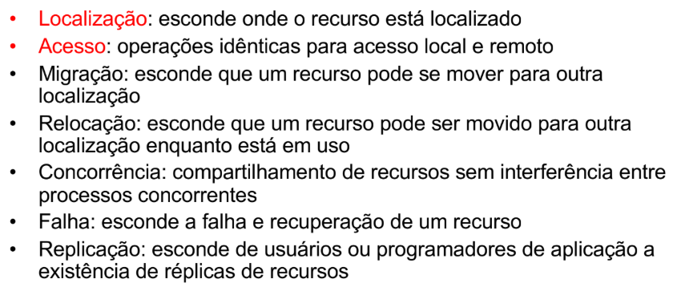

# INTRODUÇÃO À SISTEMAS DISTRIBUÍDOS E REDES DE COMPUTADORES

---

[Projeto Packet Tracer](introducao-a-sistemas-distribuidos-e-redes-de-computadores/projeto-packet-tracer.md)

- Sistemas Distribuídos
    - Existem diversas definições sobre o que é um sistema distribuído
        - Definição clássica
            - Um sistema operacional distribuído é aquele que aparece para os usuários como um sistema centralizado ordinário, mas que executa em múltiplas CPUs independentes
                - O conceito primordial é a transparência
                    - Tipos de Transparência
                        
                        
                        
                - O sistema é idealmente visto como um uniprocessador virtual, e não como uma coleção de máquinas distintas
        - Definição moderna
            - Um sistema distribuído é uma coleção de sistemas computacionais em rede nos quais processos e recursos estão espalhados por diferentes computadores
    - Os SDs são construídos com o objetivo de melhorar o desempenho de um sistema de computador em termos de confiabilidade, escalabilidade e eficiência
        - Propriedades fundamentais
            - Confiabilidade → propriedade de que um sistema pode funcionar continuamente sem falhas, permitindo que o sistema realize mais na mesma quantidade de tempo
            - Paralelismo → várias computações podem ser realizadas em paralelo, permitindo que o sistema realize mais na mesma quantidade de tempo
            - Disponibilidade → os SDs possuem capacidade de replicação e redundância
            - Esacalabilidade → permite adicionar mais usuários e recursos ao sistema sem perda percepitível de desempenho
            - Expansibilidade e Modularidade → crescimento incremental
            - Natureza humana e Informacional → pessoas e informações são distribuídas, gerando o desejo de comunicar e compartilhar informações e recursos
    - Os sistemas distribuídos são uma base fundamental para grande parte das aplicações computacionais atuais e servem como o alicerce para os sistemas de computação ubíqua
        - Exemplos de aplicações: cidades inteligentes, sistemas digitais de saúde, sistemas de streaming
        - Os SDs têm o potencial de ser mais poderoso que um distema centralizado convencional
        - Computação Ubíqua
            - Onipresença da computação de forma que ela se torne invisível no cotidiano das pessoas
                - Tudo conectado, em todo lugar, o tempo todo
            - É viabilizada por sistemas sistemas distribuídos, na qual é a espinha dorsal que permite conectar, processar e adaptar dados em escala para realizá-la
    - É indispensável para dinamicidade e adaptação às mudanças no ambiente operacional e no mundo real
        - Context Awareness
            - Capacidade de um sistema percever informações relevantes do ambiente (localização, tempo, rede disponível, etc.), interpretá-las e adaptar seu comportamente automaticamente
            - É um desafio que o SD deve superar por meio de ferramentas e técnicas adequadas, paradigmas e linguagens de programação
    - Centralizado vs Descentralizado vs Distribuído
        
        
        
        - Centralizado: um nó/entidade controla e executa tudo
            - Frequentemente diz-se que sistemas centralizados não escalam bem
            - Uma solução logicamente centralizada pode ser implementada de maneira distribuída altamente escalável
                - DNS (Domain Name System)
                    - Traduz nomes de domínio para endereços IP numéricos que os computadores usam para encontrar e comunicar uns com os outros
                        
                        
                        
                    - É um sistema hierárquico, distribuído e administrado de forma centralizada
                        - Sua raiz é logicamente centralizada mas fisicamente distribuída e descentralizada entre diversas organizações
                        - A partir da raiz (gerida pela IANA/ICANN) vai para zonas delegadas, na qual cada zona tem seu próprio operador
                            - Raiz (conhece quais servidores respondem por cada TLD) → TLD → Zona Delegada (recorte da árvore que tem autoridade sobre seus nomes) → Subdomínios
                            - TLD (Top Level Domain)
                                - São a extensão de um nome de domínio, como .com ou .org, que vem após o último ponto numa URL
                                - Funciona como uma categoria dentro do DNS, indicando o propósito ou a origem de um site, na qual existem centenas de milhares de TLDs
                                - Tipos
                                    - GTLDs (Generic Top-Level Domains): São extensões como .com, .org, .net, .biz e .info
                                    - CCTLDs (Country Code Top-Level Domains): São códigos de país como .br (Brasil), .pt (Portugal) ou .de (Alemanha)
                                    - PSTLDs (Sponsored Top-Level Domains): São domínios patrocinados por uma entidade específica que os gerencia, como .gov (para governos) e .edu (para instituições educacionais)
                                    - Novos GTLDs: São TLDs mais recentes que servem para identificar segmentos específicos, como .tech para tecnologia ou .fashion para moda
                            - Entretanto, há coordenação central da raiz de forma que ela é gerida e publicada por uma rede global de “13” letras de servidores-raiz com centenas de anycast instances
                                - A-M root servers
                                    - É a zona raiz do DNS, servida por 13 identificadores lógicos de servidor indo de a.root-servers.net até m.root-servers.net
                                        - São 13 servidores-raiz lógicos, cada um com operador próprio
                                    - Cada letra é um nome lógico com seus IPs (IPv4/IPv6) e um operador diferente
                                        - Cada letra é na prática um conjunto de muitas máquinas espalhadas pelo mundo
                                        - Quem opera cada letra e os IPs estão publicados pela IANA
                                - Anycast
                                    - Técnica de enderelamento/roteamento em que o mesmo IP é anunciado por múltiplos locais
                                    - A internet, via BGP, encaminha o seu pacote para a instância mais próxima (segundo a métrica de roteamento), reduzindo a latênia e distribuindo carga/ataques
                                        - BGP (Border Gateway Protocol)
                                            - Protocolo de roteamento entre sistemas autônomos da internet
                                                - É o que mantém a internet conectada
                                            - Cada provedor/rede grande tem um sistema autônomo, o BGP serve para anunciar e escolher rotas para prefixos IP entre esses sistemas
                                                - Tudo isso baseado em políticas (não apenas “o caminho mais curto”)
                                            - Tipos
                                                - eBGP: troca de informações de roteamento entre roteadores em diferentes sistemas autônomos
                                                - iBGP: troca de informações de roteamento entre roteadores dentro do mesmo sistema autônomo
                                            - Bastante utilizado em engenharia de tráfego, anycast, interconexão de ISPs e acordos de peering/transit
                                                - ISPs (Internet Service Provider)
                                                    - É uma empresa que fornece a infraestrutura e os serviços necessários para que utilizadores e empresas se conectem à internet
                                            - Possui riscos de route leaks e hijacks, mas são mitigados com RPKI e boas práticas
                                                - Route leaks
                                                    - Quando uma rota válida é propagada indevidamente onde não deveria aparecer
                                                - Hijacks
                                                    - Anúncio não autorizado de um prefixo por um sistema autônomo que não é o legítimo origin
                                                - RPKI (Resource Public Key Infrastructure)
                                                    - Infraestrutura de chaves públicas que vincula recursos IP a seus detentores legítimos, autorizando quem pode anunciar qual prefixo e permite bloquear prefixos inválidos nos roteadores
                                    - No contexto de A-M root servers, cada letra tem centenas de anycast instances no mundo, todas respondendo pelos mesmos IPs
                                        - Isso resulta em resiliência (se uma cai, o tráfego converge para outro) e desempenho
                                        - Basicamente uma malha global de muitas instâncias por letra, todas usando os mesmos IPs, para ficar perto de você e aguentar falhas/ataques
        - Descentralizado: há vários controladores (múltiplas entidades/autonomias)
            - Um sistema descentralizado é considerado distribuído quando os nós de entidades distintas efetivamente cooperam via protocolo para entregar uma funcionalidade composta ao usuário
            - Se cada entidade opera isolada, existe apenas vários sistemas centralizados separados e não um sistema distribuído
            - É um sistema de computadores em rede no qual processos e recursos estão necessariamente distribuídos entre vários computadores
        - Distribuído: o sistema roda em múltiplos nós que cooperam via rede para parecer um só
            - Diz-se que sistemas distribuídos são mais robustos contra falhas
            - É um sistema de computadores em rede no qual processos e recursos estão suficientemente distribuídos entre vários computadores.
    - Modelos
        - Evolução
            
            
            
            - Compartilhamento de recursos
                
                
                
        - Modelo Cliente/Servidor
            - Cliente pede um request e o servidor fornece serviço e responde com um reply
                - Protocolo RR
                    - Padrão de comunicação em que um cliente envia um request a um serviço e espera um reply correpondente
                        - Há acoplamente lógico entre a pergunta e a resposta
                    - Simples de entender e depurar, fácil backpressure via timeouts e filas
                    - Aparece um mensageria, streams, HTTP/REST e RPC
                    - Ciclo
                        1. Request: cliente envia mensagem → payload, correlationId, replyTo, timeout
                        2. Processamento: servidor recebe, executa a operação
                        3. Reply: servidor responde (no mesmo canal ou em replyTo) preservando o correlationId
                        4. Cliente: casa resposta → pedido, tratando sucesso/erro/timeout
            - Tipicamente é um servidor para vários clientes (1:N)
                - O servidor não precisa saber muito sobre o cliente, mas o cliente precisa saber sobre o servidor
                    
                    
                    
                - O servidor compartilha seus recursos com o cliente
        - Modelo P2P (Peer-to-Peer)
            - Todos os nós (peers) podem atuar simultaneamente como clientes e servidores, compartilhando recursos diretamente uns com os outros com mínima dependência de um servidor central
                - Papéis simétricos, cada peer oferece e consome
                - Escala horizontalmente com a quantidade de participantes, porém a coordenação é mais complexa
                - Distribuição em massa, redução de curso central e toleração de churn (taxa de rotatividade)
                    - Evitar se precisa de um controle forte centralizado, dados ultra-sensíveis ou SLA rígida
                        - SLA (Service Level Agreement)
                            - Acordo formal entre provedor e cliente que define níveis mínimos de serviço esperados e consequências caso não sejam cumpridos
                            - Inclui escopo do serviço, metas, métricas, governança, suporte, prazos, exclusões e etc.
            - Tipos
                - Puro (Descentralizado): sem servidor central
                - Híbrido: há componentes centrais só para descoberta/coordenação
                - Estruturado (DHT): usa tabelas de hash distribuídas para localizar recursos em O(log N)
            
        
        
        
    - Desafios
        - Heterogeneidade
        - Transparência
        - Tolerância a Falhas
        - Segurança
        - Concorrência
        - Escalabilidade
            - Capacidade de o sistema reagir bem e atender a uma nova realidade (carga maior ou menor), sem apresentar problemas de desempenho
        - Abertura
            - Um SD aberto é um sistema que oferece serviços de acordo com regras padrões
            - API’s públicas
            - Facilita a adição de novos componentes no sistema
    - Invocação Remota
        - Desafios da Transmissão
            - Estruturação de Dados
                - Dados em programas são estruturados, enquanto as mensagens transportam informação sequencial
                - Para permitir que diferentes componentes ou nós de um sistema se comuniquem entre si, existem os conceitos de marshalling e unmarshalling
                    - Marshalling
                        - Processo de converter um objeto ou estrutura de dados em um formato que possa ser enviado pela rede ou armazenado
                        - Linearização de uma coleção de itens de dados estruturados
                        - Tradução dos dados em formato externo
                            - XDR → eXternal Data Representation
                        
                        
                        
                    - Unmarshalling
                        - Processo inverso do marshalling, ou seja, converter os dados recebidos de volta para um formato usável pelo sistema
                        - Tradução do formato externo para o local
                        - Restauração dos itens de dados de acordo com sua estrutura
                        
                        
                        
                - Diferentes sistemas (escritos em diferentes linguagens ou plataformas) precisam ser capazes de entender uns aos outros, e o marshalling e o unmarshalling garantem que dados possam ser convertidos para um formato universal e desconvertidos adequadamente
            - Heterogeneidade de Representação
                - Computadores diferentes podem representar dados de formas distintas
                - Big-endian
                    - O byte mais significativa é armazenado ou transmitido primeiro, no endereço de memória mais baixo
                    - É o formato padrão para muitos protocolos de rede, sendo chamado de ordem de rede
                        
                        
                        
                - Little-endian
                    - O byte menos significativo é armazenado ou transmitido primeiro, no endereço de memória mais baixo
                    - É o formato predominante nas arquiteturas de processador x86, que é a base da maioria dos PC’s modernos
                        
                        
                        
                - Inclusão de uma identificação de arquitetura na mensagem
        - Remote Procedure Call (RPC)
            - Execução de um procedimento em um espaço de endereço diferente
                - É quando um programa de computador faz com que um procedimento (sub-rotina) seja executado em um espaço de endereço diferente, que é escrito como se fosse uma chamada de procedimento local
            - A ideia é que o programador escreva o código como se fosse uma chamada local, sendo uma forma de interação cliente-servidor
                - Integração dos mecanismos de RPC com os programas cliente e servidor escritos em uma linguagem de programação convencional
            - Primitivo de linguagem eficiente para construir sistemas distribuídos
            - Stubs
                - Componentes usados em sistemas distribuídos para facilitar a comunicação entre cliente e servidor
                    - Um stub fica no lado do cliente, atuando como um proxy para o objeto remoto, e é responsável por empacotar as chamadas de método e enviar os dados pela rede
                - Transparência de acesso
                - Tratamento de algumas exceções no local
                - Marshaling
                - Unmarshaling
                
                
                
            - Skeleton
                - Fica no lado do servidor, recebendo a chamada do stub, desempacotando os dados, invocando o método real no objeto servidor e devolvendo o resultado
                - Simplificam a comunicação, abstraindo detalhes como serialização de dados e comunicação em rede
                - Recebe a chamada, executa o método no objeto servidor e devolve a resposta
            - Chamadas e mensagens em RPC
                
                
                
            - Tratamento
                - Módulo de comunicação usa protocolo pedido-resposta/request-reply para troca de mensagens entre cliente e servidor
                    
                    
                    
            - Passagem de Parâmetros
                
                
                
            - Ligação
                - O mecanismo possui um binder para resolução de nomes permitindo ligação dinâmica (em tempo de execução nome → endereço) e transparência de localização
        - Remote Method Inocation (RMI)
            - Representação de RPC no paradigma de programação orientada a objetos
                
                
                
    - Middleware
        - Camada intermediária que se situa entre as aplicações e os sistemas operacionais de rede
        - Infraestruturas para SD’s
            
            
            
        - Tipos principais de middleware
            - RPC
            - Message-Oriented Middleware
                - Paradigma de publish-subscribe
                    
                    
                    
                - Paradigma de fila de mensagens
                    
                    
                    
            - Object-Oriented Middleware (OOM)
                - Fornece referências para objetos-servidores
                - Tarefas e serviços
                - DCOM (Distributed Component Object Model)
                    - É uma tecnologia proprietária da Microsoft para permitir a comunicação entre componentes de software distribuídos em uma rede
                - CORBA (Common Object Request Broker Architecture)
                    - É a arquitetura padrão criada pela Object Management Group (OMG) para estabelecer e simplificar a troca de dados entre sistemas distribuídos heterogêneos
                        - Padroniza a comunicação entre sistemas heterogêneos
                    - É baseado na definição de interfaces de objetos com a IDL (Interface Definition Language)
                        - É uma linguagem declarativa, independente de linguagem de programação
                            - Descreve operações e atributos, sem lógica de programação
                            - Independência de linguagem: interfaces podem ser implementadas em Java, C++, etc. na qual é necessário um compilador que traduz as especificações IDL para uma linguagem específica
                        - Permite interoperabilidade entre sistemas em diferentes linguagens
                        - Definir métodos, parâmetros e atributos dos objetos
                    - Object Request Broker (ORB)
                        - Componente central que atua como intermediário entre o cliente e o servidor
                        - Atua como intermediário (barramento) entre cliente e servidor
                        - Permite comunicação entre plataformas e linguagens diferentes
                            - Facilita a integração distribuída, transparente e independente de linguagem
                        - Responsável por localizar o objeto, transmitir a requisição e retornar a resposta, permitindo a comunicação entre plataformas e linguagens diferentes
                        - Núcleo do ORB → lida com a representação básica de objetos e a comunicação
                        - Interface do ORB → fornece operações para a manipulação de informações do próprio ORB
                        - Inclui stubs, skeletons e o POA (Portable Object Adapter), que ajuda componentes em diferentes linguagens e máquinas a se comunicarem
                        - Esquema
                            
                            
                            
                    - Etapas
                        - Definição da interface em IDL
                        - Geração de código-fonte (stubs e skeletons)
                        - Implementação do objeto no servidor
                            - Os skeletons gerados (em uma linguagem de programação mapeada) são usados para implementar a lógica real do objeto, ou seja, o código que executa as operações definidos na IDL
                        - Cliente acessa operações via stubs
                            - Os clientes usam os stubs para chamar as operações dos objetos remotos, sem precisar conhecer os detalhes da implementação do servidor
                        - Comunicação intermediada pelo ORB
                    - Exemplo cliente-servidor simples
                        
                        
                        
                        - Servidor em C++ (implementando a lógica Hello<número>)
                            - Interface CORBA em IDL
                                
                                
                                
                            - Inclusões e namespace
                                
                                
                                
                            - Implementação da interface
                                
                                
                                
                            - Inicialização do ORB e POA
                                
                                
                                
                            - Registro do objeto
                                
                                
                                
                            - Escrita da referência em arquivo
                                
                                
                                
                            - Execução do servidor
                                
                                
                                
                            - Tratamento de exceções
                                
                                
                                
                            - Resumo
                                
                                
                                
                            - Código completo
                                
                                
                                
                        - Cliente em C++ (enviando o número e recebendo a resposta)
                            
                            
                            
                            
                            
                        - Resumo
                            - O cliente lê a referência do servidor (arquivo hello.ior), chama o método remoto sayHello(n) passando o número fornecido como parâmetro e exibe a resposta “Hello n”
                            - Fluxo de uso
                                - Compilar a IDL
                                    - omniidl -bcxx hello.idl
                                - Compilar Servidor e Cliente
                                    - g++ -o server server.cpp [helloSK.cc](http://helloSK.cc) -IomniORB4 -IomniDynamic4 -Ipthread
                                    - g++ -o cliente cliente.cpp [helloSK.cc](http://helloSK.cc) -IomniORB4 -IomniDynamic4 -Ipthread
                                - Executar
                                    - Em um terminal → ./server
                                    - Em outro terminal → ./client 42
                                    - Saída esperada → Resposta do servidor: Hello 42
    - Comunicação via Sockets
        - Sockets são a interface de programação (API) de nível mais baixo para a comunicação em rede, geralmente fornecida pelo sistema operacional
            - São a interface que o middleware precisa para funcionar
            - Funciona como um terminal para fluxos de dados, sendo fundamental para a comunicação na internet
        - Fluxo Padrão (Servidor TCP)
            - socket(): Cria o ponto de comunicação
            - bind(): Associa o socket a um endereço (IP e porta)
            - listen(): Coloca o socket em modo de espera por conexões
            - accept(): Bloqueia e espera até que um cliente se conecte, retornando um novo socket para essa conexão específica
            - recv() / send(): Recebe e envia dados
    - Tipos de comunicação
        - Persistente
            - A mensagem é armazenada pelo middleware (ex: em uma fila) e entregue mesmo que o receptor esteja offline no momento do envio
            - Ex: E-mail
        - Transitória
            - A mensagem só é armazenada enquanto os processos de envio e recebimento estão ativos
        - Síncrona
            - O remetente envia a mensagem e fica bloqueado, esperando por uma resposta ou aceitação
        - Assíncrona
            - O remetente envia a mensagem e continua sua execução imediatamente
            - Ex: E-mail
    - Nomeação
        - Como os processos se encontram
        - Conceitos
            - Nome → uma "etiqueta" legível por humanos, fácil de lembrar (ex: "cin.ufpe.br", "José da Silva")
            - Identificador (ID) → um "CPF" para entidades do sistema. É único, não muda e não tem significado legível (ex: um endereço MAC)
            - Endereço → onde o recurso está localizado *agora* (ex: 192.168.1.1:80)
        - Nomeação Plana
            - Métodos para localizar entidades que não usam uma estrutura hierárquica
            - Broadcasting (Difusão)
                - O cliente envia uma mensagem para todos na rede local (LAN) perguntando "Quem é X?"
                - Exemplo
                    - ARP (Address Resolution Protocol)
                        - Um computador transmite a pergunta "Qual endereço MAC corresponde ao IP 141.23.56.23?"
                        - O computador com esse IP é o único que responde
                        
                        
                        
                - Limitações
                    - Ineficiente e não escala para redes grandes
            - Ponteiros de Encaminhamento (Forwarding Pointers)
                - Quando uma entidade (ex: um objeto) se move, ela deixa um "rastro" (um ponteiro) em sua localização antiga apontando para a nova
                    
                    
                    
                - Limitações
                    - As cadeias de ponteiros podem ficar longas (aumentando a latência) e, se um ponteiro quebrar, a entidade é perdida
            - Abordagem "Home-based" (Baseada em Residência)
                - Usada no Mobile IP
                - Cada entidade móvel tem um endereço "home" fixo
                - Quando ela se move para uma rede visitante, ela registra seu novo endereço temporário (care-of address) com um "agente home" em sua rede de origem
                    - Toda comunicação destinada à entidade é primeiro enviada para seu endereço "home" e depois encaminhada pelo agente home
                        
                        
                        
                - Limitações
                    - Aumenta a latência, pois todo pacote faz um "triângulo" (remetente → home → destino)
            - Tabelas Hash Distribuídas (DHT)
                - Um sistema descentralizado (sem ponto único de falha) e escalável
                    - Um nome (chave) é passado por uma função hash que determina em qual nó da rede o endereço (valor) está armazenado
                - Exemplo: O sistema Chord
                    
                    
                    
        - Nomeação Hierárquica
            - A rede é dividida em domínios e subdomínios, começando por uma raiz única
            - Esta é a abordagem usada pelo DNS (Domain Name Service)
        - Serviços de Nomes (Name Service)
            - É o serviço que implementa a nomeação
                
                
                
            - Funcionamento
                
                
                
                
                
            - Navegação (Name Resolution)
                - Como os espaços de nomes (como o DNS) são muito grandes, eles são particionados em múltiplos servidores de nomes
                    - Navegação é o processo de consultar esses servidores para resolver um nome
                - Tipos
                    - Iterativa
                        - Resultado de uma consulta retorna imediatamente para o cliente (se a consulta falha, o cliente tem uma idéia de onde procurar em seguida)
                            
                            
                            
                    - Multicast
                        - O cliente simultaneamente consulta um grupo de servidores e espera pela primeira resposta
                            
                            
                            
                    - Não-recursiva controlada por servidor
                        - Cliente escolhe um servidor que faz navegação iterativa em nome dele
                            
                            
                            
                    - Recursiva controlada por servidor
                        - Servidores recursivamente contactam outros servidores até nome ser resolvido
                            
                            
                            
    - Tendências
        - gRPC
            - Um framework de RPC moderno de alto desempenho (usado em microserviços)
        - Kafka/RabbitMQ
            - Amplamente usados para MOM
            - Kafka → plataforma de streaming de eventos distribuída e open-source, permitindo comunicação assíncrona, resiliente e escalável entre sistemas
            - RabbitMQ → é uma aplicação de software que atua como um agente de mensagens (message broker), intermediando a comunicação assíncrona entre diferentes aplicações ou microsserviços em uma rede
        - QUIC (Quick UDP Internet Connections)
            - Um novo protocolo de transporte (sobre UDP) que acelera a web
                - Ele reduz drasticamente o tempo de handshake em comparação com a combinação TCP+TLS, precisando de apenas 1 RTT (Round Trip Time) para conexões novas e 0 RTT para conexões retomadas
- Redes de Computadores
    - É um conjunto de dispositivos interconectados que se comunicam e compartilham recursos usando um sistema de regras chamado de protocolo de comunicação
        - A internet é uma “rede de redes”
    - Propósito
        - Distribuir e compartilhar processamento
        - Distribuir e compartilhar dados (para mais informação e segurança)
        - Permitir a comunicação entre aplicações distribuídas
        - Permitir a comunicação entre pessoas (e-mail, redes sociais, etc.)
    - Componentes de uma Rede
        - Dispositivos de Computação (Hosts ou End Systems)
            - Bilhões de dispositivos conectados, como computadores, servidores, smartphones e dispositivos IoT (geladeiras, carros, etc.)
            - Eles executam aplicações de rede na "borda" da Internet
        - Comutadores de Pacotes (Packet Switches)
            - Dispositivos como roteadores (routers) e switches que encaminham "pacotes" (pedaços de dados) pela rede
        - Enlaces de Comunicação (Links)
            - Os meios físicos que conectam os dispositivos, como fibra óptica, cabos de cobre, rádio (WiFi, 4G/5G) e satélite
        - Taxa de Transmissão (Bandwidth)
            - A velocidade de um enlace, medida em bits por segundo
    - Protocolos
        - Um protocolo define o formato, a ordem das mensagens enviadas/recebidas e as ações a serem tomadas quando uma mensagem é recebida
        - Toda atividade de comunicação na internet é governada por protocolos
            - Os padrões da internet são definidos em RFCs (Request for Comments) pela IETF (Internet Engineering Task Force)
            - Os RFCs contém toda a documentação de padrões técnicos que regem o funcionamento da internet, como o protocolo HTTP
            - A IETF é uma comunidade que desenvolve os padrões técnicos da internet, garantindo que a internet funcione melhor através da criação de documentos técnicos de alta qualidade, que são publicados nos documentos RFCs
    - Arquitetura em Camadas
        - Redes são sistemas complexos com muitas partes (HW, SW, protocolos, etc.)
            - Para gerenciar essa complexidade, utiliza-se uma arquitetura em camadas
            - Facilita a manutenção e atualização por meio da modularização
        - Pilha de Protocolos Internet (TCP/IP)
            - O modelo usado na Internet é composto por 5 camadas
            - Aplicação: suporte a aplicações de rede (HTTP, SMTP, DNS), a camada mais próxima do usuário
            - Transporte: tranferência de dados processo-a-processo (TCP, UDP), garantindo a entrega entre processos usando portas
                - Camada de Transporte
                    - Esta camada fornece comunicação lógica entre processos de aplicação em hosts diferentes
                    - Ela utiliza e aprimora os serviços da camada de rede (que só faz comunicação lógica entre computadores)
                    - Processos
                        - Multiplexação (no transmissor)
                            - Pega dados de múltiplos sockets (pontos de comunicação dos processos) e adiciona os cabeçalhos de transporte (ex: portas)
                        - Demultiplexação (no receptor)
                            - Usa a informação do cabeçalho (especificamente, números de porta de origem e destino, e endereços IP) para entregar os segmentos recebidos ao socket correto
                    - Transferência Confiável de Dados (RDT)
                        - O desafio é como construir um canal confiável sobre um canal não confiável (que perde pacotes)
                        - Solução
                            - Acks (Acknowledgements): O receptor envia uma confirmação (ACK) quando recebe um pacote.
                            - Retransmissões: O transmissor espera um tempo "razoável" (timeout). Se não receber o ACK, ele retransmite o pacote.
                            - Números de Sequência: Para lidar com pacotes duplicados (caso um ACK se atrase ou se perca).
                        - Cenários de RDT:
                            - Perda de Pacote
                                - O transmissor envia pkt1 e ele se perde
                                - O temporizador (timeout) estoura, o transmissor reenvia pkt1
                            - Perda de ACK
                                - O transmissor envia pkt1, o receptor o recebe e envia ack1
                                - O ack1 se perde, o transmissor estoura o timeout e reenvia pkt1
                                - O receptor recebe a duplicata de pkt1, detecta (pelo nº de sequência) e reenvia ack1
                            - Timeout Prematuro
                                - O transmissor envia pkt1, o ack1 está apenas atrasado
                                - O transmissor estoura o timeout e reenvia pkt1
                                - O receptor recebe a duplicata e a descarta, reenviando ack1
                                - O ack1 original (atrasado) finalmente chega ao transmissor, que o ignora
                    - Protocolos
                        - UDP (User Datagram Protocol, RFC 768)
                            - É um protocolo enxuto
                            - "Best-effort" (Melhor Esforço)
                                - Não há garantias
                                - Os segmentos podem ser perdidos ou entregues fora de ordem
                            - Sem Conexão
                                - Não há "handshake" (apresentação) antes do envio
                                - Cada segmento é tratado de forma independente
                            - Vantagens
                                - Não há atraso para estabelecer conexão
                                - Simples (sem estado de conexão no transmissor ou receptor)
                                - Cabeçalho reduzido
                                - Sem controle de congestionamento
                                    - O UDP envia dados na velocidade que a aplicação desejar (e que for possível), o que é bom para aplicações sensíveis a atraso
                            - Casos de Uso: Aplicações de streaming multimídia (tolerantes a perdas, mas sensíveis a atrasos), DNS, SNMP e HTTP/3
                            - Checksum
                                - O UDP possui um campo de checksum para detecção de erros
                                - O transmissor soma o conteúdo do segmento (como inteiros de 16 bits) e armazena o complemento de 1
                                - O receptor recalcula e verifica
                        - TCP (Transmission Control Protocol)
                            - É um protocolo de comunicação que garante a entrega confiável e ordenada de dados entre computadores em uma rede
                                - Orientado à Conexão
                                    - Requer um "handshake" (apresentação) de 3 vias (three-way handshake) para estabelecer a conexão e inicializar o estado (buffers, nº de sequência) antes de trocar dados
                                - Confiável e Ordenado
                                    - Fornece um "fluxo de bytes" (stream) confiável e na ordem correta, usando buffers de transmissão e recepção
                                - Ponto-a-Ponto
                                    - Um transmissor, um receptor
                                - Controle de Fluxo
                                    - O transmissor não sobrecarrega o receptor
                                - Controle de Congestionamento
                                    - O transmissor "diminui a velocidade" quando a rede está congestionada
                            - Estrutura do Segmento TCP
                                
                                
                                
                                - Números de Sequência (Seq)
                                    - Contagem por bytes
                                    - Refere-se ao número do primeiro byte de dados no segmento
                                - Números de Reconhecimento (ACK)
                                    - É o número do próximo byte que o receptor espera receber
                                    - O TCP usa ACKs cumulativos (um ACK para o byte 80 confirma que todos os bytes até 79 foram recebidos)
                                - Flags (SYN, ACK, FIN, RST, PSH, URG)
                                    - Bits de controle
                                    - SYN e FIN são usados para estabelecer e terminar conexões
                                - Janela de Recepção (RcvWindow)
                                    - Campo usado para o controle de fluxo
                                    - Informa ao transmissor quantos bytes de espaço livre o receptor tem em seu buffer
                            - Estabelecimento da Conexão (Three-Way Handshake)
                                - Cliente → Servidor
                                    - Envia um segmento SYN (com o Seq inicial do cliente)
                                - Servidor → Cliente
                                    - Recebe o SYN, aloca buffers, e responde com um segmento SYNACK (reconhece o SYN do cliente e envia o Seq inicial do servidor)
                                - Cliente → Servidor
                                    - Recebe o SYNACK e envia um ACK (reconhece o SYN do servidor)
                                    - A conexão está estabelecida, e dados podem ser enviados
                            - Término da Conexão
                                - Cliente → Servidor
                                    - O cliente (que quer fechar) envia um segmento FIN
                                - Servidor → Cliente
                                    - O servidor recebe o FIN e responde com um ACK (confirma o pedido de fechamento)
                                - Servidor → Cliente
                                    - O servidor (quando terminar de enviar seus próprios dados) envia seu próprio segmento FIN
                                - Cliente → Servidor
                                    - O cliente recebe o FIN do servidor e responde com um ACK
                                    - O cliente entra em "espera temporizada" (para garantir que o último ACK chegue)
                                - O servidor recebe o ACK e fecha a conexão
                                    - O cliente fecha após o timeout
                                - Diagrama
                                    
                                    
                                    
                            - Controle de Fluxo vs Controle de Congestionamento
                                - Controle de Fluxo
                                    - É um mecanismo fim-a-fim para impedir que o transmissor envie dados mais rápido do que o receptor consegue processar
                                    - O receptor informa seu espaço livre de buffer no campo RcvWindow em cada segmento que envia
                                    - O transmissor se limita a manter a quantidade de dados não reconhecidos (em trânsito) menor que o último RcvWindow recebido
                                - Controle de Congestionamento
                                    - É um mecanismo para impedir que "muitas fontes enviando muitos dados" sobrecarreguem a rede (os roteadores)
                                    - Sintomas do Congestionamento
                                        - Longos atrasos (filas nos roteadores) e perda de pacotes (buffers dos roteadores estourando)
                                    - Abordagem do TCP
                                        - O TCP usa uma abordagem fim-a-fim
                                        - Ele infere o congestionamento da rede observando perdas e atrasos
                                        - Algoritmos de Controle de Congestionamento do TCP
                                            - Slow Start
                                                - Usado no início da conexão para encontrar rapidamente a capacidade disponível
                                                - Começa com CongWin = 1 MSS (Tamanho Máximo do Segmento)
                                                - Dobra o CongWin a cada RTT (recebendo os ACKs)
                                                - É um crescimento exponencial (1 → 2 → 4 → 8...)
                                                - Continua até que uma perda ocorra ou CongWin atinja um limite (threshold)
                                            - AIMD (Additive Increase, Multiplicative Decrease)
                                                - É a fase de "evitar congestionamento" (congestion avoidance)
                                                - Additive Increase
                                                    - Enquanto não há perda, o CongWin é aumentado linearmente, em 1 MSS por RTT
                                                    - Isso "sonda" cuidadosamente por mais banda
                                                - Multiplicative Decrease
                                                    - Ao detectar uma perda (congestionamento), o CongWin é cortado pela metade
                                                    - (Se a perda for por timeout, CongWin é cortado para 1 MSS)
                                                - Este comportamento cria um gráfico de "dente de serra"
                                                    
                                                    
                                                    
                                    - Janela de Congestionamento (CongWin)
                                        - O TCP limita sua taxa de envio (≈ CongWin/RTT) usando essa variável
            - Rede: roteamento de datagramas da fonte ao destino (IP, protocolos de roteamento), convertendo segmentos em pacotes
                - Segmento → unidade de dados da camada de transporte
                - Pacote → formado pela encapsulação de um segmento com um cabeçalho da camada de rede, que inclui endereços IP de origem e destino
            - Camada de Rede
                - É responsável por transportar pacotes (datagramas) de um host de origem até um host de destino, passando por múltiplos roteadores
                - Funções principais
                    - Determinação de Caminhos (Roteamento)
                        - Encontrar a melhor rota entre a origem e o destino
                            - Usa algoritmos de roteamento (ex: Link State, Distance Vector)
                    - Comutação (Switching)
                        - Ação de mover um pacote da porta de entrada de um roteador para a porta de saída correta
                    - Endereçamento (IP)
                        - Fornece um identificador único para cada interface
                    - Fragmentação/Remontagem
                        - Lida com pacotes maiores que o limite (MTU) de um enlace
                - Roteamento
                    - É o processo de selecionar e encaminhar caminhos para o tráfego de dados através de uma ou mais redes, usando o protocolo IP, para garantir que os pacotes de informações cheguem ao seu destino
                    - Algoritmos de roteamento são descritos por grafos, na qual os routers são nós e enlaces são as arestas com custos
                        - O objetivo é achar o caminho com menor custo
                    - Roteamento Hierárquico
                        - Devido à imensa escala da Internet, não é viável que todo roteador saiba sobre todos os outros
                        - Por isso, é preciso organizar a internet em redes menores
                        - Sistemas Autônomos (AS)
                            - A Internet é dividida em milhares de "Sistemas Autônomos" (redes de provedores, universidades, etc.)
                        - Roteamento Intra-AS
                            - Roteamento dentro de um AS (ex: OSPF, RIP)
                        - Roteamento Inter-AS
                            - Roteamento entre ASs (ex: BGP)
                        - Roteadores de Borda
                            - São os roteadores na fronteira de um AS, que executam tanto o roteamento intra-AS (para se comunicar com roteadores internos) quanto o inter-AS (para se comunicar com outros ASs)
                - Endereçamento IP (IPv4)
                    - Endereço IP é um identificador de 32 bits (ex: 223.1.1.1)
                        - Um endereço IP está associado a uma interface de rede (a conexão do host/roteador com o enlace), e não ao dispositivo em si
                        - Roteadores possuem múltiplas interfaces, cada uma com um IP
                    - Endereçamento "Class-full"
                        - Um sistema antigo que dividia os IPs em Classes A, B, C, D
                    - Obtenção de IP
                        - Um host pode ter um IP fixo (definido pelo administrador) ou obter um dinamicamente usando DHCP (Dynamic Host Configuration Protocol)
                        - O processo DHCP envolve 4 passos: Discover, Offer, Request, ACK
                    - Exemplo de Roteamento (A → E)
                        - Diagrama
                            
                            
                            
                            
                            
                        - Host A (223.1.1.1) quer enviar um datagrama para Host E (223.1.2.2)
                            - O datagrama IP (camada de rede) é criado com IP origem = A e IP destino = E
                            - Esses IPs não mudam durante toda a viagem.
                        - Host A consulta sua tabela de roteamento
                            - Ele vê que E (rede 223.1.2) não está em sua rede local (223.1.1)
                            - A tabela diz que para chegar à rede 223.1.2, o "próximo salto" é o roteador 223.1.1.4
                        - Host A (camada de enlace) envia um quadro (Ethernet) para o endereço físico do roteador 223.1.1.4
                            - Dentro deste quadro está o datagrama IP (A → E)
                        - O Roteador recebe o quadro, o desencapsula e olha o datagrama IP (camada de rede)
                        - O Roteador consulta sua tabela de roteamento
                            - Ele vê que o destino (223.1.2.2) está em uma rede (223.1.2) que está diretamente conectada à sua interface 223.1.2.9
                        - O Roteador envia o datagrama (em um novo quadro de enlace) diretamente para o Host E
                            - O datagrama chega
                - Fragmentação e Remontagem
                    - MTU (Max Transfer Unit)
                        - Cada tipo de enlace (Ethernet, WiFi) tem um tamanho máximo de quadro que pode transportar
                    - Fragmentação
                        - Se um roteador precisa enviar um datagrama IP por um enlace com um MTU menor que o tamanho do datagrama, ele divide (fragmenta) o datagrama em vários pedaços
                    - Remontagem
                        - Os fragmentos viajam independentemente e são remontados apenas no host de destino final
                        - O cabeçalho IP contém campos (ID, offset, flags) para gerenciar esse processo
                - ICMP (Internet Control Message Protocol)
                    - É um protocolo de "controle" usado por hosts e roteadores para trocar informações sobre o estado da rede
                        - É transportado dentro de datagramas IP
                    - Funções:
                        - Relatório de Erros
                            - Exemplo: Destination unreachable (rede, host ou porta inalcançável)
                        - Echo Request/Reply
                            - Usado pelo utilitário ping (comando de rede usado para medir o tempo de resposta (latência) entre dois dispositivos)
                        - TTL expired (Time To Live expirado)
                            - Usado pelo traceroute (comando de diagnóstico de rede que mostra o camnho que os pacotes de dados percorrem de um computador para um destino na rede)
                - IPv6
                    - É a versão mais recente do Protocolo de Internet, projetada para substituir o IPv4 devido ao esgotamento do espaço de endereços 32 bits disponíveis dele
                        - O IPv6 garante a continuidade do crescimento da internet, oferecendo um espaço de endereçamento vastamente expandido e melhorias em segurança e eficiência
                    - Mudanças
                        - Endereços de 128 bits
                        - Cabeçalho Fixo de 40 bytes
                            - Simplificado para processamento mais rápido
                        - Sem Checksum
                            - O checksum foi removido do cabeçalho IP (IPv6) para reduzir o processamento em cada roteador (confia-se nas camadas superiores e de enlace para detecção de erros)
                        - Opções
                            - As opções não fazem mais parte do cabeçalho principal, mas de "cabeçalhos suplementares"
                        - ICMPv6
                            - Nova versão do ICMP, com novas funções, como Packet Too Big (para lidar com MTU)
            - Enlace: transferência de dados entre elementos vizinhos na rede (Ethernet, WiFi)
                - Controla a comunicação na rede local, convertendo pacotes em frames (unidade da camada de enlace de dados, encapsulando o pacote com um cabeçalho físico do endereço MAC e um rodapé para transmissão local)
                - Adiciona endereços MAC
                    - Endereço MAC
                        - É um ID único gravado na placa de rede de um dispositivo, usado para identificá-lo em uma rede
                        - É uma sequência de seis pares de caracteres hexadecimais, frequentemente chamado de endereço físico ou de hardware
                        - Não é estático como o IP e é gravado na fabricação do hardware
            - Física: transmissão de bits (”on the wire”, sinais elétricos, ópticos)
        - Encapsulamento
            - O processo de envio de dados envolve o encapsulamento, onde cada camada adiciona seu próprio cabeçalho (header)
                
                
                
                - A Aplicação cria uma mensagem M
                - A camada de Transporte recebe M e adiciona seu cabeçalho Ht
                    - A unidade de dados resultante é chamada de Segmento (Ht | M)
                - A camada de Rede recebe o segmento e adiciona seu cabeçalho Hn
                    - A unidade é o Datagrama (Hn | Ht | M)
                - A camada de Enlace recebe o datagrama e adiciona seu cabeçalho Hl
                    - A unidade é o Quadro (Hl | Hn | Ht | M)
                - A camada Física transmite o quadro como uma sequência de bits
                - No destino, ocorre o processo inverso (desencapsulamento)
                    - Dispositivos intermediários processam apenas as camadas necessárias: Switches (camada 2) processam até a camada de Enlace e Routers (Camada 3) até a camada de Rede para tomar decisões de roteamento baseadas no cabeçalho IP