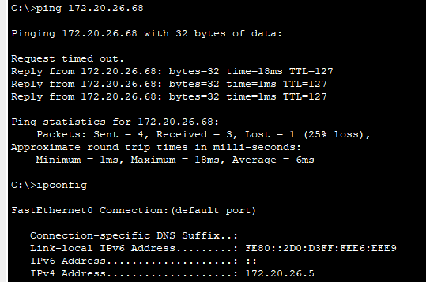

# E4 - Roteamento Inter-VLAN e Conectividade

**Data de Entrega:** 12/11 (Quarta-feira)

**Critério Principal:** **Conectividade Total** — o roteamento deve ser transparente da LAN para o backbone. PCs devem comunicar entre VLANs e com a Internet.

---

## Prática no Packet Tracer

### Parte 1: Configurando o Roteamento Externo (Rota Padrão)

O objetivo desta etapa é ensinar ao roteador `R-CIN` o que fazer com qualquer tráfego que não seja destinado a um dos laboratórios internos (VLANs 10-50). Em outras palavras, vamos criar o caminho para a "internet", que neste projeto é representada pela RNP.

Para fazer isso de forma limpa, sem adicionar outros equipamentos à topologia, usaremos uma **Interface de Loopback**. Pense nela como uma interface de rede virtual, sempre ativa, que existe dentro do próprio roteador — perfeita para simular um destino externo.

#### Requisito Obrigatório

O destino que representa a RNP **deve ser obrigatoriamente** o endereço IP `200.160.7.186`.

#### Etapa A: Simular o Destino da RNP

Primeiro, é preciso criar o ponto final virtual da conexão.

- `interface Loopback<número>` — cria uma interface de rede virtual. É prática comum usar o número `0` (ex: `Loopback0`).
- `ip address <endereço_ip> <máscara>` — atribui um endereço IP à interface. Para a Loopback, use o endereço obrigatório da RNP.

!!! tip "Dica Importante"
    Como `200.160.7.186` representa um único servidor e não uma rede, a máscara de sub-rede mais apropriada é `255.255.255.255` (uma máscara `/32`).

- `description <texto_descritivo>` — adiciona um comentário à interface. Excelente prática de documentação para lembrar o que aquela interface faz (ex: `Simulacao_Conexao_RNP`).

#### Etapa B: Criar a Rota Padrão

Agora, a regra que diz: "se você não conhece o destino, envie o tráfego por este caminho".

- `ip route 0.0.0.0 0.0.0.0 <interface_de_saída>` — cria uma rota estática.
    - `0.0.0.0 0.0.0.0`: esta combinação especial significa "qualquer rede com qualquer máscara" — é a definição de uma rota padrão.
    - `<interface_de_saída>`: para onde o tráfego deve ser enviado. Neste caso, a interface de Loopback criada na Etapa A.

---

## Testes de Conectividade

Agora vem a parte mais importante: provar que tudo funciona.

### Teste 1: Obter IP via DHCP

1. Abra um PC em cada laboratório.
2. Vá em **Desktop → IP Configuration**.
3. Selecione **DHCP**.
4. Aguarde alguns segundos.

**Resultado esperado:**

- O PC deve receber um IP da sub-rede correta.
- O gateway deve ser o IP configurado na sub-interface.
- O DNS deve ser `8.8.8.8`.

**Exemplo para PC no Lab 1:**

- IP Address: `172.20.1.2` (ou outro IP disponível da sub-rede)
- Subnet Mask: `255.255.255.192`
- Default Gateway: `172.20.1.1`
- DNS Server: `8.8.8.8`

### Teste 2: Ping Intra-VLAN

**Objetivo:** verificar a comunicação dentro da mesma VLAN.

De um PC no Lab 1, faça ping para outro PC no Lab 1:

```text
C:\> ping 172.20.X.10
```

**Resultado esperado:** `Reply from 172.20.X.10`.

### Teste 3: Ping para o Gateway

**Objetivo:** verificar que o PC consegue alcançar seu gateway.

```text
C:\> ping 172.20.X.1
```

**Resultado esperado:** `Reply from 172.20.X.1`.

### Teste 4: Ping Inter-VLAN (crucial)

**Objetivo:** provar que o roteamento Inter-VLAN funciona.

De um PC no Lab 1 (VLAN 10), faça ping para um PC no Lab 2 (VLAN 20):

```text
C:\> ping 172.20.X.70
```

**Resultado esperado:** `Reply from 172.20.X.70`.

!!! warning "Observação"
    O primeiro ping pode falhar (timeout) devido ao processo ARP. Os pings seguintes devem ter sucesso.

Se não funcionar, verifique:

- O DHCP foi configurado nos dois PCs da conexão?
- As sub-interfaces estão criadas e com os IPs corretos?
- A interface física Gi0/0 está ativa (`no shutdown`)?
- As portas trunk estão configuradas corretamente?

### Teste 5: Ping Externo (RNP)

**Objetivo:** verificar a conectividade externa via rota padrão.

```text
C:\> ping 200.160.7.186
```

**Resultado esperado:** `Reply from 200.160.7.186` — o PC consegue alcançar a RNP/Internet.

### Teste 6: Traceroute (evidência visual)

**Objetivo:** mostrar o caminho que os pacotes percorrem.

De um PC no Lab 1, rastreie o caminho até um PC no Lab 2:

```text
C:\> tracert 172.20.X.70
```

**Resultado esperado:**

```text
Tracing route to 172.20.X.70 over a maximum of 30 hops:

  1   <1 ms   172.20.X.1      (Gateway da VLAN GRAD 1)
  2   <1 ms   172.20.X.70     (PC de destino na VLAN GRAD 2)

Trace complete.
```

!!! tip "Importante"
    Capture a tela deste traceroute — é a melhor evidência de que o roteamento Inter-VLAN está funcionando.

### Teste 7: Traceroute Externo

**Objetivo:** mostrar o caminho que os pacotes percorrem até o destino externo.

De um PC no Lab 1, rastreie o caminho até o endereço externo:

```text
C:\> tracert 200.160.7.186
```

**Resultado esperado:**

```text
Tracing route to 200.160.7.186 over a maximum of 30 hops:

  1   <1 ms   172.20.X.1      (Gateway da VLAN GRAD 1)
  2   <1 ms   200.167.7.186     (PC de destino externo)

Trace complete.
```

O único endereço externo configurado é `200.160.7.186`, então testar outro IP além desse não vai funcionar — esse endereço não consegue simular a internet inteira e buscar um IP aleatório.

---

## Documentação para o Relatório

### Evidências de Conectividade (Screenshots)

Inclua no relatório capturas de tela como nos exemplos abaixo. Lembre-se de testar com IPs diferentes dos exibidos nos prints.

**Exemplo:**

1. Ping intra-VLAN bem-sucedido (172.20.26.5 → 172.20.26.68):

```text
C:\>ping 172.20.26.68

Pinging 172.20.26.68 with 32 bytes of data:

Request timed out.
Reply from 172.20.26.68: bytes=32 time=18ms TTL=127
Reply from 172.20.26.68: bytes=32 time=1ms TTL=127
Reply from 172.20.26.68: bytes=32 time=1ms TTL=127

Ping statistics for 172.20.26.68:
    Packets: Sent = 4, Received = 3, Lost = 1 (25% loss),
Approximate round trip times in milli-seconds:
    Minimum = 1ms, Maximum = 18ms, Average = 6ms
```

Repare que o primeiro ping deu timeout (resolução ARP) e os seguintes tiveram sucesso — exatamente o comportamento esperado.

2. Ping externo bem-sucedido (172.20.26.68 → 200.160.7.186, a RNP):

```text
C:\>ping 200.160.7.186

Pinging 200.160.7.186 with 32 bytes of data:

Reply from 200.160.7.186: bytes=32 time<1ms TTL=255
Reply from 200.160.7.186: bytes=32 time<1ms TTL=255
Reply from 200.160.7.186: bytes=32 time<1ms TTL=255
Reply from 200.160.7.186: bytes=32 time<1ms TTL=255

Ping statistics for 200.160.7.186:
    Packets: Sent = 4, Received = 4, Lost = 0 (0% loss),
Approximate round trip times in milli-seconds:
    Minimum = 0ms, Maximum = 0ms, Average = 0ms
```

3. Saída do comando `tracert 172.20.26.10` no terminal do PC:

```text
C:\>tracert 172.20.26.10

Tracing route to 172.20.26.10 over a maximum of 30 hops:

  1    0 ms    0 ms    0 ms    172.20.26.10

Trace complete.
```

4. Saída do comando `tracert 200.160.7.186` no terminal do PC:

```text
C:\>tracert 200.160.7.186

Tracing route to 200.160.7.186 over a maximum of 30 hops:

  1    0 ms    0 ms    0 ms    200.160.7.186

Trace complete.
```

5. Saída do comando `show ip route` no roteador

??? note "Capturas de tela originais (Packet Tracer)"
    1. Ping intra-VLAN (172.20.26.5 → 172.20.26.68)

    

    2. Ping externo (172.20.26.68 → 200.160.7.186)

    

    3. `tracert 172.20.26.10`

    

    4. `tracert 200.160.7.186`

    

---

## Fundamentos Teóricos

### Por que precisamos de roteamento?

**Problema:** VLANs são domínios de broadcast isolados.

- Um PC na VLAN 10 não consegue falar com um PC na VLAN 20.
- Cada VLAN é uma sub-rede IP diferente.
- Switches de Camada 2 não roteiam entre redes.

**Solução:** usar um dispositivo de Camada 3 (roteador) para encaminhar pacotes entre VLANs.

### O que é Router-on-a-Stick (ROAS)?

**Router-on-a-Stick** é uma técnica que permite ao roteador rotear entre múltiplas VLANs usando apenas uma interface física.

**Como funciona:**

1. A interface física do roteador conecta-se ao switch por uma porta trunk.
2. A interface física é dividida em sub-interfaces lógicas.
3. Cada sub-interface representa uma VLAN (usando encapsulamento 802.1Q).
4. Cada sub-interface recebe o IP do gateway daquela VLAN/sub-rede.

!!! note "Analogia"
    É como um carteiro (roteador) que usa um único portão (interface física), mas tem chaves diferentes (sub-interfaces) para acessar vários apartamentos (VLANs).

**Exemplo de fluxo:**

1. PC-Lab1 (VLAN 10, IP .10) quer falar com PC-Lab2 (VLAN 20, IP .70).
2. PC-Lab1 envia o pacote para seu gateway (172.20.1.1).
3. O switch recebe e encaminha pela porta trunk para o roteador, com a tag VLAN 10.
4. O roteador recebe na sub-interface .10.
5. O roteador consulta a tabela de roteamento.
6. O roteador encaminha pela sub-interface .20, com a tag VLAN 20.
7. O switch recebe e entrega ao PC-Lab2.

### O que é Rota Padrão (Default Route)?

**Rota Padrão** é uma rota "coringa" que diz ao roteador: "para qualquer destino que você não conhece, envie os pacotes para este próximo salto".

**Representação:** `0.0.0.0/0` ou `0.0.0.0 0.0.0.0`.

**No projeto:**

- Destinos internos (VLANs): roteados pelas sub-interfaces.
- Destinos externos (Internet): encaminhados para a RNP via rota padrão.

---

## Dicas e Troubleshooting

### Problema: DHCP não funciona

**Possíveis causas:**

- Sub-interfaces não configuradas → PCs não conseguem alcançar o gateway.
- Interface física desativada → nada funciona.

**Solução:**

```text
R-CIN# show ip interface brief
```

Todas as interfaces devem estar `up/up`.

### Problema: Ping inter-VLAN falha

**Diagnóstico passo a passo:**

1. O PC consegue fazer ping no gateway?
    - Não → problema na configuração de acesso ou VLAN.
    - Sim → continue.
2. O gateway tem rota para a rede de destino?

    ```text
    R-CIN# show ip route
    ```

    - Não → sub-interface de destino não configurada.
    - Sim → continue.
3. Os trunks estão configurados corretamente?

    ```text
    Switch# show interfaces trunk
    ```

    - Verifique se as VLANs estão permitidas nos trunks.

### Problema: Primeiro ping falha, mas os seguintes funcionam

Isso é normal. O primeiro pacote é perdido enquanto o protocolo ARP (Address Resolution Protocol) resolve o endereço MAC do gateway. Pings subsequentes usam o cache ARP e funcionam normalmente.

### Dicas de Sucesso

- Sempre use `show ip route` para verificar se as rotas estão corretas.
- Use `show ip interface brief` para verificar o status das interfaces.
- Teste sempre em ordem: intra-VLAN → gateway → inter-VLAN → externo.
- Documente tudo — screenshots valem ouro na apresentação.

**Próxima etapa:** com a rede totalmente funcional, você preparará a apresentação final, consolidando todas as entregas e demonstrando a conectividade total (E5).
