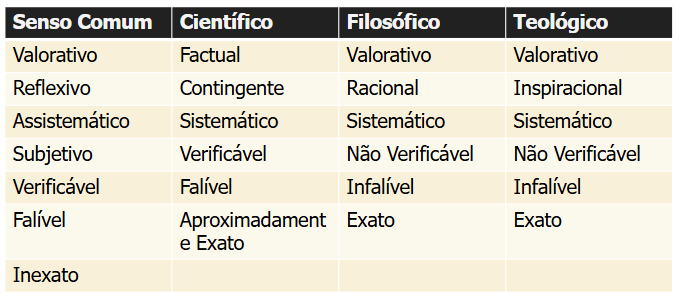

# METODOLOGIA E EXPRESSÃO TÉCNICO-CIENTÍFICA

---

- Metodologia
    - Estudo do caminho para chegarmos a um objetivo
        - Meta → ao largo
        - Odos → caminho
        - logia → estudo
    - Conjunto de Procedimentos que pode ser utilizado na aquisição sistemática de conhecimento
- Técnicas de Estudo
    - Métodos Ineficazes
        - Reler e Grifar: Essas técnicas passivas são criticadas por darem uma falsa sensação de domínio. O estudante pode reconhecer o texto, mas isso não garante que ele consiga explicá-lo com as próprias palavras, levando ao esquecimento rápido.
        - Estudar na Véspera (Cramming): Embora possa render uma nota satisfatória, essa tática não cria memórias duradouras. O cérebro precisa de tempo para fortalecer as "correntes cerebrais" do aprendizado, o que não ocorre em uma única sessão intensa.
        - Estudar com Distrações: Tentar estudar enquanto divide a atenção com aplicativos (WhatsApp, TikTok) é um desperdício de esforço. O simples ato de trocar de contexto consome tempo e energia mental.
    - Métodos Eficazes (Aprendizado Ativo)
        - Prática Ativa: Em vez de reler, o aluno deve focar no "aprendizado ativo", Isso inclui:
            - Criar perguntas ou quizzes para si mesmo.
            - Explicar o conteúdo em voz alta, com as próprias palavras.
            - Encontrar exemplos concretos para conceitos abstratos.
            - Anotar o passo a passo de problemas (ex: matemática).
        - Estudo Espaçado: Em vez de maratonas, é mais produtivo dividir o estudo em sessões curtas e diárias ao longo de vários dias. Isso facilita a retenção de longo prazo e melhora a concentração.
        - Técnica Pomodoro (Gestão de Foco): Para combater distrações, sugere-se usar blocos de estudo focado (ex: 35 minutos) sem interrupções, seguidos por uma pequena pausa de recompensa (ex: 5 minutos para checar mensagens).
- Tipos de Conhecimento
    - Conhecimento Empírico
        - Também chamado de vulgar, intuitivo, de senso comum ou ordinário
        - É superficial, acontece por informação ou experiência casual, constituindo a maior parte do conhecimento de um ser humano
            - O sujeito é um expectador passivo
            - Conhecimento vivencial
        - Possui uma linguagem vaga
            - Significado dos termos depende do contexto
            - Difícil determinar o que se encaixa e o que escapa da sua significação
        - É ametódico e assistemático
            - Elaborado de forma instantânea e instintiva
        - Tem objetividade limitada
            - Muito ligado à vivência, ação e percepção
                - Útil e eficaz quando estamos falando de rotina
                - Torna-se impreciso ou mesmo incoerente
                - Muitas interpretações possíveis
            - Subordinado a um envolvimento afetivo do sujeito
            - Incapacidade de se submeter a uma crítica sistemática e imparcial
    - Conhecimento Científico
        - É baseado em fatos, experimentações e observações, sujeito a novas teorias e reformulações
            - A razão é a única fonte de conhecimento
            - Surge da necessidade de descobrir princípios explicativos
            - É crítico, genérico, busca causa para os fenômenos e divulga resultados (intersubjetividade)
        - Método: conjunto de passos a serem seguidos ordenadamente na busca da verdade
            - Conduzir à descoberta
            - Permitir demonstração e Prova
            - Permitir a verificação de conhecimento
    - Conhecimento Teológico
        - Mesmo objeto de estudo dos outros conhecimentos
            - Valorativo
            - Inspiracional
            - Infalível
            - Exato
            - Sistemático
            - Não verificável
        - Exige autoridade divina
    - Conhecimento Filosófico
        - Mesmo objeto das outras ciências, mas finalidades diferentes.
            - Filósofo : amigo da sabedoria
            - Filosofia: esforço da razão para questionar os problemas humanos e discernir entre o certo e o errado
        - Valorativo
        - Não verificável
        - Racional
        - Sistemático
        - Infalível
        - Exato
    - Comparação
        
        
        
        
        
- Ciência
    - Atividade que propõe a aquisição sistemática de conhecimento sobre a natureza biológica, social e tecnológica
    - Todas as ciências possuem objetivo, função (utilidade) e objetos (material → o que se pretende estudar, formal → enfoque especial)
    - Uma ciência é reconhecida por critérios de: organização, método e confiabilidade em seu corpo de conhecimentos
    - O Conhecimento Científico é objetivo (busca estruturas universais), quantitativo (busca medidas e padrões), homogêneo (busca leis gerais de funcionamento) e generalizador (reúne coisas percebidas como diferentes sob leis semelhantes)
    - Validade do trabalho científico
        
        
        
- Método Científico
    - Conjunto de regras e procedimentos que guiam a pesquisa e a obtenção de conhecimento confiável, baseado na observação, formulação de hipóteses testáveis e experimentação
        - Busca eliminar a subjetividade, garantindo que as conclusões sejam o mais objetivas possível
    - Método Indutivo
        - Observador chega à lei geral por meio da observação de muitos exemplos
        - Passos
            - Observação sistemática dos fenômenos
            - Elaboração de Classificações a partir da descoberta de relação entre os fenômenos observados
            - Construção de hipóteses (tentativas de explicação) destas relações
            - Verificação das hipóteses
            - Construção de Generalizações, a partir dos resultados
            - Confirmação das Hipóteses
        - Parte de dois pressupostos
            - Determinadas Causas produzem sempre os mesmos efeitos, preservadas as condições de observação
            - A verdade observada nas situações investigadas serve para toda situação universal correspondente
        - O Determinismo inerente ao pensamento indutivo faz com que este não seja necessariamente ideal para qualquer circunstância
    - Método Dedutivo
        - Parte das Leis gerais para explicar fenômenos particulares
        - O exercício metódico da dedução parte de enunciados gerais (leis universais) que constituem as premissas do pensamento racional e deduzidas chegam a conclusões
        - Formulamos premissas e as regras de conclusão que se denominam demonstração
        - Para que a conclusão seja considerada verdadeira, estabelece-se como condição que todas as premissas sejam verdadeiras e que a verdade da conclusão já estava implícita nessas premissas
            - Nesse caso, a conclusão seria falsa se uma das premissas fosse falsa
            - Nesse sentido, a função do método dedutivo é explicar o conteúdo de suas premissas, consideradas universais.
    - Método Hipotético Dedutivo
        - Propõe que utilizemos o método dedutivo para testar as hipóteses
            - Partimos de hipóteses que são consideradas verdades sobre os fenômenos estudados
            - Pressupõe que conseguimos reduzir as teorias a fenômenos particulares que corrobarão nossas hipóteses
        - Passos
            - Coletar Expectativas e Teorias já consolidadas
            - Formular problemas em torno de questões teóricas e empíricas
            - Formular uma conjectura de solução → deduzir as consequências de forma de proposições passíveis de teste
            - Tentar refutar as hipóteses sobre o problema investigado
    - Método Dialético
        - Consiste em um modo esquemático de explicação da realidade que se baseia em oposições e em choques entre situações diversas ou opostas
            - Diferentemente do método causal, no qual se estabelecem relações de causa e efeito entre os fatos, o modo dialético busca elementos conflitantes entre dois ou mais fatos para explicar uma nova situação decorrente desse conflito
        - Elementos
            - Tese → é uma afirmação ou situação inicialmente dada
            - Antítese →é uma oposição à tese
            - Síntese → conflito entre tese e antítese, que é uma situação nova que carrega dentro de si elementos resultantes desse embate
                - A síntese, então, torna-se uma nova tese, que contrasta com uma nova antítese gerando uma nova síntese, em um processo em cadeia infinito
        - O ponto de partida para o método dialético na pesquisa é a análise crítica do objeto a ser pesquisado, o que significa encontrar as determinações que o fazem ser o que é
        - Uma das características do método dialético é a contextualização do problema a ser pesquisado, podendo efetivar-se mediante respostas às questões: quem faz pesquisa, quando, onde e para que
            - As sínteses são constituídas numa relação de tensão, porque a realidade contém contradições.
    - Caminho do Método
        
        
        
    - O método científico é composto por hipóteses, leis e formas de raciocínio
    - Hipóteses
        - Pressuposto, tentativa de explicar o que não se conhece
        - Resposta possível para a pergunta do problema
        - Elaborada a partir de várias fontes
            - Observação da realidade
            - Resultado de outros estudos
            - Derivada de outras teorias
            - Derivada da Intuição do Pesquisador
        - Critérios na formulação de hipóteses
            - Linguagem clara e Simples
                - Ex: Idosos dependentes de suas esposas tendem a justificar as atitudes destas como naturais
            - Ser específica
                - Ex: As mulheres que cuidam de seus maridos, em sua maioria, possuem baixo status econômico
            - Evitar expressões valorativas
                - Bom, mau, ruim
            - Ser coerente com uma teoria que a sustente
        - Hipótese Científica
            - Conjunto de argumentos e/ou explicações sobre um determinado fenômeno, qua ainda não foi corroborado para experimentação
            - Tipos
                - Hipótese Plausível → Se relacionam de maneira consistente com as teorias existentes
                - Hipótese Convalidada → Apoiadas em teorias conhecidas e com apoio de evidências ocorridas na realidade
                - Positiva → Ex: Conflitos provocam mudanças cognitivas nos participantes de discussões em grupo
                - Negativa → Ex: Não há perigo de contaminação com o vírus da aids pelo contágio indireto
                - Condicional → Ex: Se não forem bem lubrificados, os motores bicombustível têm maior tendência a corrosão que os a gasolina
            - Esquema da Hipótese
                
                
                
                - Tipos de Variáveis
                    - Independentes → introduzidas de propósito para verificar sua relação com o comportamento de outras variáveis
                    - Dependentes ou Resposta → as cujo comportamento se quer verificar em função das variáveis independentes
                        - Todo resultado obtido em um experimento é uma variável Dependente
                    - Espúrias → não são objeto do estudo, mas interferem no resultado
                        - Devem ser cuidadosamente controladas
                    - Moderadoras → auxiliam na ocorrência de determinado efeito (do mesmo jeito que as independentes), mas são consideradas secundárias
                    - Intervenientes → são variáveis que ampliam, diminuem ou anulam o efeito das variáveis independentes sobre as dependentes
                        - Não podem ser controladas
                        - Variáveis intervenientes são consideradas causas da dependente
                    - Antecedentes → são as causas do problema que originou a pesquisa
    - Leis Científicas
        - Princípio universal que conecta fenômenos ou partes de um fenômeno
        - Teoria Científica
            - Unifica várias leis
            - Guarda-chuvas que explicam um conjunto de fatos aparentemente diferentes entre si
    - Metodologias de pesquisa
        - Tipos de Pesquisa
            
            
            
            
            
            
            
        - Pesquisa Quanto à Natureza
            
            
            
            - Pesquisa Básica
                - Visa entender ou descobrir novos fenômenos
                - Gera conhecimentos básicos
                - Não é reservada
                - Requer a divulgação dos conhecimentos
                - Produz artigos científicos
                - Fundamental para obtenção de conhecimentos elementares
            - Pesquisa Tecnológica/Aplicada
                - Visa aplicar conhecimentos básicos
                - Pode ou não ser reservada
                - Produz produtos, processos e patentes
                - Gera novas tecnologias e conhecimentos
                - Utiliza conhecimentos básicos, tecnológicos e tecnologias para gerar novos produtos
                - Conhecimentos envolvidos podem ser de outras áreas
        - Pesquisa Quanto aos Objetivos
            - Pesquisa Exploratória
                - Visam descobrir teorias e práticas que modificarão as existentes, criar maior familiaridade com os fenômenos e obtenção de inovações tecnológicas
                - Normalmente exigem experimentações, que acarretam achados e elucidações de fenômenos
                - Quase sempre feitas com levantamento bibliográfico, entrevistas, pesquisas web e etc.
            - Pesquisa Descritiva
                - Acontecem após a pesquisa Exploratória.
                - Objetivam observar, registrar e analisar os fenômenos (com que freqüência acontecem, que estrutura têm, como funcionam)
                - Implicam na realização de observação sistemática e não participante
            - Pesquisa Explicativa
                - Visam ampliar generalizações, definir leis, estruturar e definir modelos e relacionar hipóteses existentes e gerar novas via dedução
                - Exigem maior investimento na síntese, teorização e reflexão sobre o objeto
                - Explicam os porquês
                - Exigem aplicação de métodos de modelagem e simulação para reproduzir fenômenos
                - Utilizam amplamente estudos de caso
        - Pesquisa Quanto aos Procedimentos
            - Pesquisa Experimental
                - Viabiliza novas descobertas: materiais, componentes, métodos, técnicas
                - Usada para obter novos conhecimentos e protótipos
                - Requer manipulação e coleta de dados imparcial
                - Inovações geradas a partir de estudos de laboratório, os experimentos
                - Experimentar significa elaborar e formular novos elementos, testar materiais e componentes, simular eventos, inferir e introduzir variáveis e realizar modelagens
            - Pesquisa Operacional
                - Investigação sistemática dos processos de produção
                    - Usa ferramentas estatísticas e métodos matemáticos
                - Visa selecionar os meios para produção, comparando custos, eficiência e valores
            - Estudo de Caso
                - Possibilitam que se explique um sistema em seu ambiente
                - Um caso pode ser uma decisão, um programa ou um processo de implantação
        - Pesquisa Segundo as Fontes de Informação
            - Pesquisa de Campo → Vai observar o lugar natural onde ocorrem os fenômenos
            - Pesquisa de Laboratório → Artificializa a produção do fato – ou da sua leitura
            - Bibliografia → Deve encabeçar qualquer processo de busca que se inicie
- Pesquisa Científica
    - Objetivo principal de contribuir para a evolução do conhecimento humano em todos os setores
    - Deve seguir normas metodológicas consagradas pela ciência
        - Deve ser sistematicamente planejada e executada de acordo com critérios rigorosos de processamento das informações
        - Possui técnicas especializadas de verificação, interpretação e inferência da realidade
    - Fases
        - Estabelecimento do problema
            - Escolha do assunto
                - Selecionar o tema
                - Delimitar a extensão da pesquisa em termos de tempo e abrangência
            - Formulação do problema
                - Descritivo → quais as propriedades e características do assunto?
                - Explicativo → como o problema será tratado? por dedução ou indução? como procederá à análise dos fatos? e as demonstrações?
            - Pesquisa bibliográfica
                - Levantamento da bibliografia referente ao tema de pesquisa escolhido
                - Passo decisivo em qualquer pesquisa científica
                - Elimina a possibilidade de se perder tempo investigando o que foi solucionado
                - Etapas
                    - Identificação dos itens bibliográficos de interesse
                        - Onde encontrar material de interesse
                    - Seleção
                        - Como selecionar o material a ser usado
                        - Os documentos selecionados devem ser confiáveis
                    - Fichamento
                        - Transcrição dos dados de interesse em fichas, para posterior consulta e referência
                        - Registram informações sobre o levantamento bibliográfico realizado pelo leior
                        - Podem estar em papel ou digitalizados
                    - Redação da revisão bibliográfica
                        - Análise e interpretação do que foi lido, resultando em um texto/resumo
                        - Tipos de textos científicos
                            - Cientistas necessitam escrever para apresentar o resultado de suas pesquisas, nas quais devem obedecer normas pré-estabelecidas
                            - Artigos científicos e papers
                                - Apresentam uma síntese do conhecimento ou abordagens atuais ou temas novos
                                - É uma avaliação e/ou interpretação das descobertas
                                - São escritos na primeira pessoa do plural ou impessoal
                                - Possuem cabeçalho (título, autor, local de trabalho, etc.), sinopse (resumo e/ou abstract), corpo do artigo (introdução, desenvolvimento e conclusão) e parte referencial (referências bibliográficas, apêndices, anexos, agradecimentos)
                            - Comunicação científica, informe científico, resenha crítica
                            - Monografia científica
                                - Dissertação que trata um assunto particular de forma sistemática e completa
                                    - Relata estudo sobre um tema específico
                                    - Segue um formato pré-estabelecido
                                - Engloba revisão bibliográfica baseada em vários documentos, TCC, dissertação (mestrado), tese (doutorado)
                                    - O que diferencia um texto do outro é o tipo e o nível da pesquisa realizada e relatada
                                    - TCC → consiste em revisão bibliográfica restrita, com o objetivo principal de assimilação de conteúdo
                                    - Dissertação → mais aprofundada que o TCC (é o relato de pesquisa exigido para obtenção do grau de mestre), objetivo principal de refletir sobre o tema, revisão bibliográfica mais abrangente e profunda
                                - Estrutura
                                    - Capa
                                    - Elementos pré-textuais → página de rosto, dedicatória, agradecimentos, resumo, sumário, lista de ilustrações, abreviaturas e siglas
                                    - Elementos pós-textuais → apêndices (texto escrito pelo autor da monografia, mas não é central para o trabalho), anexos (textos que não foram escritos pelo autor da monografia e que estão relacionados com o tema da monografia), bibliografia, índice onosmático (lista dos autores citados, com indicação das páginas onde aparecem), índice remissivo (lista dos termos do texto, com indicação das páginas onde aparecem)
                                - Sequência → introdução, revisão bibliográfica, desenvolvimento e conclusão
                                    - Cada capítulo deve incluir referências à bibliografia consultada referente ao assunto daquele capítulo
                                    - Introdução → justificativa (motivação e relevância do trabalho, objetivo e escopo da pesquisa realizada, apresentação sintética da questão solucionada, metodologia utilizada), referências a publicações do autor relativas ao assunto da monografia e inclusão de um parágrafo descrevendo o conteúdo do resto do documento
                                    - Revisão bibliográfica → resultado da pesquisa bibliográfica sobre o tema da monografia, devendo conter uma análise crítica sobre o estado da arte
                                    - Desenvolvimento (1+ capítulos) → informação nova (trabalho desenvolvido pelo autor da monografia), exposição dos fundamentos do trabalho (argumentos), discussão (apresentação dos contra-argumentos) e demonstração (apresentação de provas, demonstração do raciocínio)
                                    - Conclusão → síntese das ideias defendidas na monografia, retomando as pré-conclusões expostas ao longo do texto, reforçando a linha de pensamento que dá sustentação à monografia (a introdução aponta problemas e a conclusão sintetiza a postura do autor diante do problema)
                            - APUD
                                - Termo apud vem do latim, que em textos acadêmicos significa “citado por”, “conforme”, “segundo”
                                - É usado para indicar uma citação direta (cópia literal) ou indireta (texto reescrito) de um texto ao qual não temos acesso
                                    - Aparece no rótulo de uma referência bibliográfica para indicar uma citação de citação
            - Redação do plano de pesquisa
        - Organização da pesquisa
            - Formulação de hipóteses, descrição do método empregado, definição do corpus (dados da pesquisa)
        - Execução da pesquisa de campo
            - Elaboração do plano de trabalho, coleta de dados, análise dos resultados obtidos
        - Redação dos resultados
            - Redação preliminar, revisão gramatical e de conteúdo, redação final, bibliografia
- Projetos de Pesquisa
    - Processo de pesquisa
        - Projeto → o que vai ser feito, qual problema vai solucionar, que hipóteses se tem
        - Coleta de dados → como fazer, que tipos de dados é preciso
        - Análise dos dados → classificação e organização das informações, estabelecimento de relações entre os dados, tratamento estatístico dos dados
        - Elaboração da escrita
    - Objetivos
        - Resultados a alcançar
        - Objetivo geral/final dá resposta ao problema
            - Os objetivos específicos operacionalizam o modo como se pretende atingir um objetivo geral
            - Os objetivos devem ser redigidos com o verbo no infinitivo
        - Objetivo geral → aquilo que se quer alcançar ao término da pesquisa
        - Objetivos específicos → são as etapas que devem ser cumpridas para se chegar ao objetivo geral
        - Descrição de objetivos
            - Nível de conhecimento: retenção da informação apropriada
                - Definir, identificar, nomear, listar, apontar, expor, descrever, exemplificar, enumerar, distinguir, reproduzir, especificar, explicar, detalhar, determinar, mostrar, citar
            - Nível de compreensão: envolve a translação, a interpretação e a extrapolação
                - Distinguir, explicar, predizer, discutir, ilustrar, narrar, converter, relacionar, expor, deduzir, interpretar, debater
            - Nível de aplicação: envolve a utilização dos conteúdos apreendidos nos níveis anteriores
                - Aplicar, resolver, construir, converter, calcular, praticar, operar, manipular, prova
            - Nível de análise
                - Analisar, distinguir, identificar, ilustrar, diferenciar, categorizar, experimentar, comparar, criticar, examinar, inferir, determinar, selecionar
            - Nível de Síntese: combinar as partes para formar um todo, projetar e criar um produto original
                - Escrever, propor, explicar, combinar, criar, compilar, organizar, formular, produzir, modificar, gerar, conceber, projetar
            - Nível de Avaliação: capacidade de julgar o valor de um conteúdo
                - Julgar, apreciar, comparar, concluir, interpretar, avaliar, taxar, validar, escolher, medir, justificar, criticar, fundamentar, estimar, demonstrar
    - Referencial Teórico
        - Envolve de um quadro de referência ligado ao problema de pesquisa
            - A partir deste quadro, o aluno obterá subsídios, visando definir, com mais clareza, os diversos aspectos a serem objeto de levantamento de campo.
        - É a construção de uma base conceitual organizada e sistematizada do conhecimento disponível pertinente ao objeto pesquisado
            - Buscam-se teorias, abordagens e estudos que permitam compreender o fenômeno de múltiplas perspectivas
            - O papel do pesquisador é de promover um diálogo entre diferentes autores.
        - Base de sustentação do trabalho (teoria de base e definições)
        - Reflete o nível de conhecimento do autor
        - Familiariza o leitor com trabalhos correlatos
        - Ajuda a comprovar a originalidade do trabalho
- Revisões de Literatura
    - Conceitos
        - Revisão é o processo de busca (sistemática ou não), análise e síntese de um corpo de conhecimento (delimitado de várias formas) relacionado à resposta de uma pergunta específica
        - Literatura cobre todo o material escrito sobre o tema em diversos veículos
    - A revisão de literatura serve para conhecer o que já existe, identificar oportunidades de pesquisa, não reinventar a roda e mostrar ao leitor a originalidade de seu trabalho
        
        
        
        
        
    - Tipos
        - Revisão Narrativa
            - Uma descrição ampla e aprofundada do desenvolvimento e estado da arte de um tema, influenciada pela visão e expertise do autor
            - Fundamentação teórica de TCCs, dissertações ou teses.
            - Artigos de opinião ou atualização rápida sobre um tema
            - Por ser subjetiva, apresenta maior risco de viés de seleção (o autor escolhe os estudos que mais lhe interessam)
            - Processo: Seleção do tema → Pesquisa e coleta não sistemática → Leitura e Análise → Síntese (Narrativa)
        - Revisão Sistemática
            - O tipo de revisão mais rigoroso, considerado o topo da hierarquia de evidências, que busca minimizar o viés e fornecer a melhor evidência disponível
            - Melhor para responder questões clínicas ou científicas específicas sobre eficácia, diagnóstico, prognóstico, etc. e basear decisões em saúde e políticas públicas
            - Ponto-chave (Rigor):
                - Protocolo: Deve ser registrado (ex: PROSPERO)
                - Busca: Exaustiva, explícita e replicável
                - Inclusão: Geralmente foca em estudos primários de mesmo delineamento (ex: apenas Ensaios Clínicos Randomizados)
                - Síntese: Pode incluir Meta-análise (análise estatística combinada dos resultados)
            - Processo: Pergunta específica (PICO) → Protocolo → Busca sistemática → Seleção de estudos por 2 revisores independentes → Avaliação do risco de viés → Síntese/Meta-análise
                
                
                
        - Revisão de Escopo ou Mapeamento
            - Mapeia rapidamente e categoriza as evidências para identificar os tipos de estudos, conceitos e fontes que existem sobre um tema mais amplo, sem necessariamente avaliar a qualidade da evidência ou sintetizar resultados
            - Melhor para determinar o escopo e a natureza de uma área de pesquisa, identificar lacunas de pesquisa e determinar se uma Revisão Sistemática completa é viável
            - **A** pergunta é mais ampla que a Sistemática. Não costuma avaliar o risco de viés dos estudos incluídos, focando no mapeamento da informação
            - Processo: Pergunta ampla → Protocolo (Recomendado, ex: PRISMA-ScR) → Busca → Mapeamento/Categorização dos dados → Relatório descritivo.
        - Revisão Integrativa
            - Um método que permite a síntese de pesquisas com diferentes metodologias (quantitativas e qualitativas) e/ou tipos de estudos (empíricos e teóricos) para obter uma compreensão holística de um fenômeno
            - Melhor para áreas onde o conhecimento é fragmentado em diferentes abordagens metodológicas (comum em Enfermagem e Ciências Sociais), definir conceitos e revisar teorias
            - Embora use um método sistemático, a inclusão de diversos delineamentos metodológicos pode afetar o rigor ou a comparabilidade da síntese final, mas oferece uma visão mais completa
            - Processo: Pergunta (Problema/Prática) → Busca sistemática → Seleção de estudos → Extração de dados → Avaliação da qualidade (opcional, mas recomendado) → Síntese e discussão (Integrativa)
    - É preciso primeiro definir uma questão de pesquisa
        - Primeiro identifica o tema
        - Depois identifica uma dificuldade sem solução na literatura
        - O problema deve relacionar pelo menos duas variáveis (dependente e independente)
        - O problema deve ser empiricamente verificado
        - Exemplos
            - Exploratórias
                - Existenciais: “X existe?”
                - Descritivas e classificatórias: “Como X é?”, “Quais são suas propriedades?”, “Como pode ser categorizado?”, “Como pode ser medido?”, “Qual seu propósito?”, “Quais são seus componentes?”, “Como os componentes se relacionam?” e “Quais são todos os tipos de X?”
                - Descritivas-comparativas: “Como X é diferente de Y?”
            - Base-rate: padrões normais de ocorrência do fenômeno
                - Frequência e distribuição: “Quão frequentemente X ocorre?” e “Qual é a quantidade média de X?”
                - Processo-descritiva: “Como X normalmente funciona?”, “Qual é o processo pelo qual X acontece?”, “Em qual sequência os eventos de X ocorrem?”, “Quais são os passos de X na sua evolução?” e “Como X alcança seus objetivos?”
            - Relacionais: “X e Y são relacionadas?” “Ocorrências de X correlacionam com ocorrências de Y?”
            - Causais
                - Causalidade: “X causa Y?”, “X impede Y?”, “O que causa Y?”, “Quais são todos os fatores que causam Y?” e “Qual efeito X tem sobre Y?”
                - Causalidade-comparação: “X causa Y mais do que Z?” e “X é melhor em impedir Y do que Z?”
                - Causalidade-comparação-interação: “X ou Z causa mais Y em uma condição e não em outras?”
            - Design: projetar formas melhores de fazer engenharia de software a. Projeto: “Qual é uma forma efetiva de realizar X?” e “Quais estratégias ajudam a alcançar X?”
    - Ferramentas para ajudar na busca
        - StArt
        - Parsifal
    - Como sistematizar a pesquisa bibliográfica
        - Listar os títulos de periódicos e eventos relevantes para o tema de pesquisa e os títulos de periódicos gerais em computação que eventualmente possam ter algum artigo na área do tema de pesquisa
        - Obter a lista de todos os artigos publicados nos últimos cinco (ou mais) nesses veículos
        - Selecionar dessa lista aqueles títulos que tenham relação com o tema de pesquisa
        - Ler o abstract desses artigos e, em função da leitura, classificá-los como relevância “alta”, “média” ou “baixa”
        - Ler os artigos de alta relevância e fazer fichas de leitura anotando os principais conceitos e idéias aprendidos
            - Anotar também títulos e outros artigos possivelmente mencionados na bibliografia de cada artigo (mesmo que com mais de cinco anos) e que pareçam relevantes para o trabalho de pesquisa
            - Incluir esses artigos na lista dos que devem ser lidos (inicialmente o abstract e, se for relevante, o artigo todo)
        - Dependendo do caso, ler também os artigos de relevância média e baixa, mas iniciando sempre pelos de alta relevância
    - Erros comuns
        - Não relata claramente o que foi encontrado na literatura sobre o estudo do pesquisador
        - Não teve tempo suficiente para descrever as melhores fontes usadas na revisão de literatura
        - Utilizar fontes secundárias ao invés de fontes primárias
        - Não examinar criticamente todos os aspectos do projeto e da análise da pesquisa
        - Não reportar os procedimentos utilizados na revisão bibliográfica
        - Reportar resultados estatísticos isolados em vez de sintetizá-los pelos métodos de qui-quadrado ou meta analítico
        - Não considerar pesquisas contrárias e interpretações alternativas
- Pesquisa
    - Ferramenta para gerar inovação, criar novos artefatos, explorar o desconhecido e entender sistemas
        - Ela é uma ferramenta sistemática para obtenção de novos conhecimentos, enquanto o desenvolvimento é a aplicação desse conhecimento
        - Tudo começa com ideias que buscam resolver problemas, trazer conhecimento ou gerar questões
            - As fontes para essas ideias são variadas, incluindo experiências, bibliografias, teorias, observação, crenças, intuições e conversas
    - Definição do problema
        - Problemas Práticos: Causam desconforto e são resolvidos por uma ação que muda o mundo
        - Problemas de Pesquisa: São resolvidos por uma compreensão melhor dos fatos
        - Um problema de pesquisa deve ter sua formulação clara, precisa e viável, sendo composto por duas partes essenciais
            - Definição do Problema: A pergunta a ser respondida
            - Hipótese de Pesquisa: O resultado esperado ou a possível resposta
    - Questão de pesquisa
        - A Questão de Pesquisa é o refinamento do problema, na qual deve ser precisa, não pode ser óbvia, e deve atender a certos requisitos
            - As respostas não devem ser conhecidas
            - As respostas devem ter evidência empírica
            - A busca pelas respostas deve usar meios éticos
        - Tipos
            - Exploratórias: (Ex: "X existe?", "Como X é?")
            - Relacionais: (Ex: "X e Y são relacionadas?")
            - Causais: (Ex: "X causa Y?", "O que causa Y?")
            - Design: (Ex: "Qual é uma forma efetiva de realizar X?")
    - Pesquisa Qualitativa
        - Abordagem que foca nos porquês, buscando compreender fenômenos humanos e sociais através de significados, motivações e experiências
            - Tempo: Ficar mais tempo em campo
            - Análise: Mais análise de dados e planejamento
            - Rigor: Procedimentos rigorosos de coleta
            - Abordagem: Uso de perguntas abertas e variedade de fontes de dados
        - Métodos
            - Entrevistas Semi-estruturadas: Conversas guiadas por um roteiro flexível para explorar percepções e experiências
            - Pesquisa-Ação: Objetiva resolver um problema identificado em conjunto com os participantes, envolvendo grande interação e vários ciclos
            - Grupos Focais: Reunião de 5 a 10 participantes para discutir um tema específico, conduzida por um moderador
            - Observação Participante / Etnografia: O pesquisador observa (e às vezes participa) do grupo estudado
                - Pode ser plena (participação ativa), parcial (algum distanciamento) ou não participante (apenas observa)
                - A Etnografia, especificamente, busca entender tradições, costumes e hábitos, exigindo convívio próximo e longo tempo.
            - Estudo de Caso: Exploração detalhada de um único caso (ou poucos casos), como uma organização ou fenômeno social
            - Fenomenologia: Utiliza entrevistas para entender a essência das experiências e o significado que as pessoas atribuem a elas
            - Teoria Fundamentada (Grounded Theory): Envolve o desenvolvimento de teorias a partir da coleta e análise sistemática dos dados qualitativos
            - Narrativa: Explora as histórias de vida dos participantes para entender como eles constroem significado a partir de suas experiências
            - Diários e Auto-relatos: Registros reflexivos e contínuos de experiências, úteis para estudos de aprendizado ou hábitos
    - Pesquisa Quantitativa
        - Se concentra em dados concretos que podem ser medidos e quantificados, muitas vezes utilizando números e estatísticas
    - Questões éticas
        - Obter aprovação de comitês de ética
        - Revelar os propósitos do estudo aos participantes
        - Ser imparcial
        - Ter cuidado com a coleta de dados, com os resultados e com a publicação do estudo