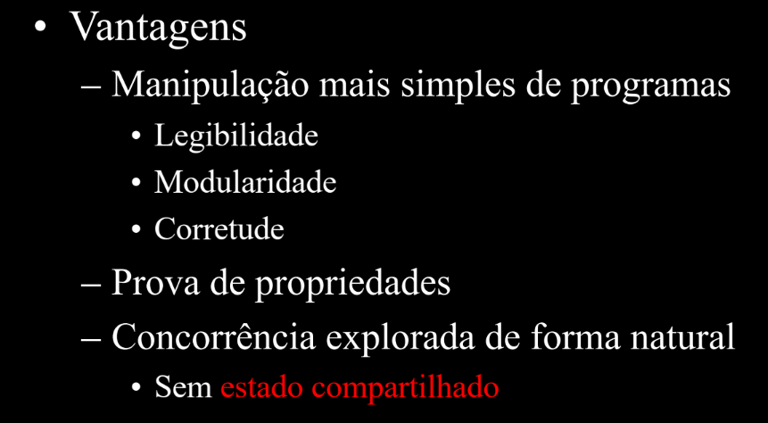

# PARADIGMAS DE LINGUAGENS COMPUTACIONAIS

- Monitoria: https://drive.google.com/drive/folders/1V8XFhhf1mPC0qanE1Hi8BMLjIPIbsj5L?usp=sharing

---

## Paradigmas de Programação

Um **paradigma** significa um exemplo geral ou modelo que serve de base para compreender, observar e orientar a resolução de problemas. No contexto de linguagens de programação, um paradigma fornece e determina a visão que o programador tem sobre como estruturar e executar um programa.

- Na **programação orientada a objetos**, o programador abstrai um programa como uma coleção de objetos que interagem entre si.
- Na **programação lógica**, o programador abstrai o programa como um conjunto de predicados que estabelecem relações entre objetos (axiomas) e uma meta (teorema) a ser provada usando esses predicados.

Algumas linguagens foram desenvolvidas para suportar um paradigma específico, mas existem linguagens **multiparadigma** (Lisp, Python, Perl, C++, entre outras). Os paradigmas se diferenciam pelas técnicas de programação que permitem ou proíbem — por exemplo, a programação estruturada não permite o uso de `goto`.

### A grande divisão: imperativo vs. declarativo

| | Programação Imperativa | Programação Declarativa |
|---|---|---|
| **Ênfase** | *Como* resolver o problema | *O que* o programa deve fazer |
| **Descrição** | Computação como ações, enunciados ou comandos que mudam o estado do programa | Resultado desejado, sem especificar os passos exatos para alcançá-lo |
| **Metáfora** | "Faça isso, depois isso, depois aquilo" | "Isto é o que eu quero" |
| **Paradigmas** | Procedimental (C, Pascal), Orientado a Objetos (Java, Smalltalk) | Funcional (Haskell, OCaml, Lisp), Lógico (Prolog) |

A **programação funcional** é o paradigma declarativo que descreve uma computação como uma expressão a ser avaliada. A principal forma de estruturar o programa é através da definição e aplicação de funções, baseando-se na ideia matemática de *calcular*. Diferente do modelo imperativo clássico, que se apoia na definição de computador pelas Máquinas de Turing, a programação funcional se baseia na definição por meio do **Cálculo Lambda**.

Nesse paradigma, todos os subprogramas são vistos como funções que recebem argumentos e retornam resultados, onde a solução depende apenas da entrada — e o momento em que a função é chamada é irrelevante, já que essas funções não produzem efeitos colaterais.




!!! tip "Por que usar linguagens declarativas?"
    Linguagens declarativas permitem escrever programas de forma clara, concisa e com alto nível de abstração, permitem prototipagem rápida, fornecem poderosas ferramentas de resolução de problemas e suportam componentes de software reutilizáveis. Isso ajuda a enfrentar dificuldades centrais do desenvolvimento de software — o tamanho e a complexidade de sistemas modernos, o tempo e custo de desenvolvimento, e a confiança de que os programas concluídos funcionam corretamente.

## Haskell

Haskell é uma linguagem declarativa funcional **pura**, com tipagem estática, tipos e funções recursivas, um sistema de tipos poderoso, avaliação *lazy* (preguiçosa) e programas tipicamente concisos — características que, juntas, facilitam o raciocínio sobre o comportamento dos programas.

É um produto de código aberto que permite o desenvolvimento rápido de software robusto, conciso e correto, com bom suporte para integração com outras linguagens, concorrência e paralelismo integrados, depuradores e bibliotecas ricas. O resultado é um software mais flexível, de alta qualidade e de fácil manutenção. A programação em Haskell é essencialmente baseada em **definições**.

O código é organizado em **módulos** — um conjunto de definições (tipos, variáveis, funções etc.). Para que as definições de um módulo sejam usadas em outro, o módulo precisa ser importado; uma coleção de módulos relacionados forma uma **biblioteca**.

### Transparência Referencial

Uma das propriedades mais importantes de Haskell é a **transparência referencial**: uma expressão pode ser substituída pelo seu valor resultante sem alterar o comportamento do programa. Isso é o que permite provar propriedades matemáticas sobre funções, pois a ordem de avaliação não altera o resultado — variáveis, uma vez vinculadas, nunca mudam de valor. É essa propriedade que permite tratar código Haskell como matemática pura.

!!! example "Transparência referencial na prática"
    

    Em uma linguagem imperativa, a ordem dos "fatores" pode alterar o resultado, pois ela reatribui o valor de `b`.

    

    Em Haskell, independentemente da ordem de avaliação, o valor de `b` permanece imutável — exatamente como na matemática pura.

### Definição de funções

Os parâmetros das funções são separados apenas por espaço, e o nome da função deve começar com letra minúscula.

```haskell
-- | square :: Int -> Int
-- Define a função 'square' que recebe um valor do tipo Int (inteiro) e retorna um valor do tipo Int.
square :: Int -> Int

-- | square x = x * x
-- A função 'square' recebe um argumento chamado 'x'
-- e o seu resultado é a multiplicação de 'x' por ele mesmo (o quadrado).
square x = x * x
```

```haskell
-- | allEqual :: Int -> Int -> Int -> Bool
-- Define a função 'allEqual' que recebe três valores do tipo Int
-- e retorna um valor do tipo Bool (booleano), ou seja, 'True' ou 'False'.
allEqual :: Int -> Int -> Int -> Bool

-- | allEqual n m p = (n == m) && (m == p)
-- A função 'allEqual' compara os três argumentos (n, m, p).
-- (n == m): Verifica se 'n' é igual a 'm'.
-- (m == p): Verifica se 'm' é igual a 'p'.
-- &&: É o operador lógico "e". A expressão só será verdadeira (True)
-- se ambas as comparações (n == m E m == p) forem verdadeiras.
allEqual n m p = (n == m) && (m == p)
```

```haskell
-- | maxi :: Int -> Int -> Int
-- Define a função 'maxi' que recebe dois valores do tipo Int e retorna um Int.
maxi :: Int -> Int -> Int

-- | maxi n m | n >= m = n
-- Usa uma "guarda" para definir o comportamento.
-- Se a condição (n >= m) for verdadeira, a função retorna o valor de 'n'.
maxi n m | n >= m = n

-- |            | otherwise = m
-- O "otherwise" atua como um "senão".
-- Se a condição acima for falsa (ou seja, se 'm' for maior que 'n'),
-- a função retorna o valor de 'm'.
				 | otherwise = m
```


#### Recursão

Toda função recursiva em Haskell precisa definir um caso base e, no caso geral, definir o valor em termos da própria função.

```haskell
vendas :: Int -> Int
vendas _ = 10 -- toda semana vende 10

totalVendas :: Int -> Int
totalVendas n
	| n == 0    = vendas 0
	| otherwise = totalVendas (n-1) + vendas n
```

```haskell
maxVendas :: Int -> Int
maxVendas n
	| n == 0    = vendas 0
	| otherwise = maxi (maxVendas (n-1)) (vendas n)
```

#### Casamento de padrões (Pattern Matching)

O casamento de padrões permite usar padrões no lugar de variáveis na definição de funções — são, na prática, os próprios "casos" de uma função matemática.

```haskell
maxVendas :: Int -> Int
maxVendas 0 = vendas 0
maxVendas n = maxi(maxVendas(n-1)) (vendas n)

totalVendas :: Int -> Int
totalVendas 0 = vendas 0
totalVendas n = totalVendas (n-1) + vendas n
```

```haskell
myNot :: Bool -> Bool
myNot True = False
myNot False = True

myOr:: Bool -> Bool
myOr True  x = True
myOr False x = x

myAnd :: Bool -> Bool
myAnd False x = False
myAnd True  x = x
```


Os casos de um pattern match devem idealmente ser exaustivos, mas isso não é obrigatório — nesse caso obtemos **funções parciais**, que falham em tempo de execução para entradas não cobertas.

### Notação


Existem duas formas de usar funções binárias (prefixa e infixa). Alguns erros comuns de notação:


### Definições locais: `where` e `let`

- `where` aparece no **final** de uma equação ou guarda, definindo nomes visíveis apenas naquela equação.
- `let` aparece **antes** da expressão que usa as variáveis, podendo ser usado em qualquer lugar — exceto em definições de funções no nível superior.


### Tipos básicos

| Tipo | Descrição |
|---|---|
| `Integer` | Precisão arbitrária |
| `Int` | Precisão fixa (*bounded*) |
| `Bool` | Booleano |
| `Char` | Caractere |
| `String` | Cadeia de caracteres |
| `Float` | Ponto flutuante, ~8 dígitos decimais |
| `Double` | Ponto flutuante, ~16 dígitos decimais |


### Listas

Listas são coleções de objetos de um mesmo tipo.


O **construtor de listas** `(:)` tem a assinatura `a -> [a] -> [a]`, recebendo uma cabeça (`head`, do tipo `a`) e uma cauda (`tail`, do tipo `[a]`), e devolvendo a lista resultante.


Listas também podem ser declaradas através de *ranges*:


Algumas funções úteis sobre listas:


E as **compreensões de lista** (*list comprehensions*), que permitem construir listas de forma declarativa a partir de outras listas e condições:


### `case`


### Tuplas


### Tipos


### Polimorfismo

Uma função é polimórfica quando possui um tipo genérico, usando variáveis de tipo em vez de tipos concretos.


Esse polimorfismo "paramétrico" é usado quando o tipo exato dos elementos não importa para a lógica da função (ex: `length`, que funciona para listas de qualquer tipo).

#### Overloading

Já o *overloading* é o **polimorfismo de sobrecarga**: o mesmo nome de função com definições distintas para cada tipo. Uma **classe** (*typeclass*), em Haskell, é uma coleção de tipos para os quais uma função está definida — por exemplo, o conjunto de tipos para os quais `==` está definida é a classe `Eq`. Outras classes comuns incluem `Ord`, `Show`, `Num` e `Read`.

Para expressar polimorfismo restrito por classe, basta usar a classe como restrição no tipo:

```haskell
exemplo :: Eq t -> t -> Bool
```

!!! example "Exemplo"
    

As **instâncias** são os membros concretos de uma classe:


### Funções de Alta Ordem

Uma função de alta ordem é aquela que recebe uma função como argumento e/ou retorna uma função como resultado.

!!! example "Exemplo"
    

    O argumento-função é aquele que aparece entre parênteses, e normalmente é uma função de **transformação** — recebe um valor e retorna outro valor transformado.

Funções de alta ordem facilitam o entendimento e as modificações do código (basta trocar a função de transformação), aumentam o reuso de código, e se apoiam no conceito de **Currying**: a técnica que transforma uma função de múltiplos argumentos em uma sequência de funções, cada uma recebendo um único argumento.

As quatro funções de alta ordem mais usadas sobre listas em Haskell são:

**`map`** — aplica uma função a cada elemento da lista.

```haskell
map :: (a -> b) -> [a] -> [b]

-- Exemplo
map (*2) [1,2,3,4]
-- [2,4,6,8]
```


**`fold`** — reduz uma lista a um único valor, aplicando uma função binária recursivamente. Pode ser `foldr` (acumula da direita para a esquerda) ou `foldl` (acumula da esquerda para a direita).

```haskell
foldr :: (a -> b -> b) -> b -> [a] -> b
foldl :: (b -> a -> b) -> b -> [a] -> b

-- Exemplo

foldr (+) 0 [1,2,3,4]
-- 10

foldl (+) 0 [1,2,3,4]
-- 10
```


**`filter`** — mantém apenas os elementos que satisfazem um predicado (função que retorna um `Bool`).

```haskell
filter :: (a -> Bool) -> [a] -> [a]

-- Exemplo
filter even [1,2,3,4,5,6]
-- [2,4,6]
```


**`all`** — recebe um predicado e uma lista, retornando `True` se a função vale para todos os elementos.

```haskell
all :: (a -> Bool) -> [a] -> Bool
```

#### `curry` e `uncurry`

`curry` transforma uma função que recebe um par em uma função que recebe dois argumentos separados:

```haskell
curry :: ((a, b) -> c) -> a -> b -> c

f :: (Int, Int) -> Int
f (x,y) = x + y

g :: Int -> Int -> Int
g = curry f

-- Agora:
f (3,4)   -- 7
g 3 4     -- 7
```

`uncurry` faz o inverso — transforma uma função de dois argumentos separados em uma função que recebe um par:

```haskell
uncurry :: (a -> b -> c) -> (a, b) -> c

h :: Int -> Int -> Int
h x y = x * y

k :: (Int, Int) -> Int
k = uncurry h

-- Agora:
h 3 4       -- 12
k (3,4)     -- 12
```

### Composição de Funções

O operador `(.)` é o operador de composição de funções em Haskell: `(f . g)` significa "aplica `g` primeiro, depois aplica `f`".

```haskell
(.) :: (u -> v) -> (t -> u) -> (t -> v)

-- Exemplo
negate . abs $ (-5)
-- Primeiro abs (-5) = 5
-- Depois negate 5 = -5
```

Essa composição permite estruturar programas inteiros compondo funções menores:

```haskell
fill :: String -> [Line]
fill s = splitLines (splitWords s)

-- pode ser reescrito como:
fill = splitLines . splitWords

--
twice :: (t -> t) -> (t -> t)
twice f = f . f

--
iter :: Int -> (t -> t) -> (t -> t)
iter 0 f = id
iter n f = (iter (n-1) f) . f
```

#### Notação Lambda

É uma forma de definir **funções anônimas**, diretamente inspirada no Cálculo Lambda ($\lambda x.\, x + 1$ é, em essência, o que a notação abaixo representa):

```haskell
addNum :: Int -> (Int -> Int)
addNum n = \m -> n + m
```

### Aplicações Parciais

Em Haskell, **toda função é curried**: ela recebe um argumento e retorna outra função, se ainda faltam argumentos. Isso permite a aplicação parcial — passar apenas parte dos argumentos de uma função, obtendo de volta uma nova função que espera o restante.

```haskell
multiply :: Int -> Int -> Int
multiply a b = a * b

-- O tipo real é:
multiply :: Int -> (Int -> Int)

-- Aplicações
multiply 2      -- função que multiplica por 2
(multiply 2) 5  -- 10

-- multiply 2 é uma função que multiplica por 2
-- , passada para o map
doubleList :: [Int] -> [Int]
doubleList = map (multiply 2)

doubleList [1,2,3]   -- [2,4,6]
```

### Associatividade

A aplicação de função em Haskell é associativa à **esquerda**:

```haskell
-- Definição simples
add :: Int -> Int -> Int
add x y = x + y

main = do
    print (add 2 3)   -- 5
    print ((add 2) 3) -- 5 (mesma coisa, aplicação é à esquerda)
```

Já o símbolo de tipo função `->` é associativo à **direita** — funções sempre retornam funções, até consumir todos os parâmetros.

```haskell
-- Observe os tipos:
-- Int -> Int -> Int
-- é o mesmo que Int -> (Int -> Int)

mul :: Int -> Int -> Int
mul x y = x * y

main = do
    let f = mul 4   -- f :: Int -> Int
    print (f 5)     -- 20
```

Essa associatividade à direita explica as *curried functions*: uma função de 2 argumentos é, na verdade, uma função que recebe 1 argumento e retorna outra função.

```haskell
g :: (Int -> Int) -> Int
g h = h 0 + h 1

-- h é uma função de Int -> Int
-- As funções são passadas como argumentos,
-- não só valores
```

### Tipos Algébricos

Tipos algébricos são, em certo sentido, semelhantes a `enum`s de outras linguagens — mas muito mais poderosos.

```haskell
data Estacao = Inverno   | Verao
							 Primavera | Outono
							 
data Temp = Frio | Quente

clima :: Estacao -> Temp
clima Inverno = Frio
clima _ = Quente
```

**Tuplas vs. tipos algébricos**: tuplas combinam valores de forma anônima e posicional; tipos algébricos nomeiam a estrutura e seus construtores, tornando o código mais legível e seguro.


Os construtores de um tipo algébrico também podem receber argumentos:


**Forma geral** de um tipo algébrico:


E os **tipos polimórficos**, que combinam tipos algébricos com variáveis de tipo:


### Laziness (Avaliação Preguiçosa)

Haskell usa, por padrão, uma estratégia de avaliação chamada *laziness*: uma expressão só é calculada no momento exato em que seu resultado é de fato necessário (*call-by-need*). Ao atribuir uma expressão a uma variável, Haskell não a executa imediatamente — ele cria uma "promessa" de cálculo chamada **thunk**.

O thunk contém a expressão e tudo o que é necessário para calculá-la. A expressão só é avaliada quando outra parte do programa realmente precisa do valor da variável: nesse momento, o thunk é "forçado", a expressão é avaliada, o resultado é armazenado para uso futuro, e o thunk é substituído por esse resultado. Se o valor for necessário novamente depois, o resultado já calculado é reutilizado, evitando recálculos desnecessários.

!!! tip "Vantagem: estruturas de dados infinitas"
    Com laziness, é possível definir e manipular listas e outras estruturas de dados que são teoricamente infinitas:

    ```haskell
    -- Uma lista infinita de todos os números inteiros a partir de n
    infinitosAPartirDe n = n : infinitosAPartirDe (n + 1)

    -- Pega os 5 primeiros elementos da lista infinita a partir de 1
    primeirosCinco = take 5 (infinitosAPartirDe 1)
    -- Resultado: [1,2,3,4,5]
    -- O restante da lista infinita nunca é calculado.
    ```

    Isso permite separar a lógica de geração de dados da lógica de consumo, e evita cálculos desnecessários — se um valor nunca for usado, ele nunca será calculado, o que pode gerar ganhos significativos de eficiência.

**Desafios da laziness:**

- **Space Leaks**: se um programa acumular um grande número de thunks sem avaliá-los, pode consumir uma quantidade significativa de memória.
- **Previsibilidade de performance**: o desempenho pode se tornar menos previsível, já que o momento exato de um cálculo pode ser difícil de determinar apenas lendo o código.

Para mitigar esses desafios, Haskell oferece mecanismos para controlar a avaliação e forçar o cálculo de expressões quando necessário:

- **`seq`**: força a avaliação de uma expressão até certo ponto, antes de prosseguir.

    ```haskell
    -- Versão preguiçosa que pode acumular thunks
    somaPreguicosa :: [Int] -> Int
    somaPreguicosa xs = foldl (\acc x -> acc + x) 0 xs

    -- Forçando a avaliação do acumulador com seq
    somaComSeq :: [Int] -> Int
    somaComSeq xs = foldl f 0 xs
      where
        f acc x = let novoAcc = acc + x
                  in novoAcc `seq` novoAcc
    ```

- **`$!`**: aplica uma função a um argumento, garantindo que o argumento seja avaliado antes da função ser chamada.

    ```haskell
    -- Versão preguiçosa que pode acumular thunks
    somaPreguicosa :: [Int] -> Int
    somaPreguicosa xs = foldl (\acc x -> acc + x) 0 xs

    -- Usando aplicação estrita para forçar a avaliação
    somaComOpEstrito :: [Int] -> Int
    somaComOpEstrito xs = foldl f 0 xs
      where
        f acc x = (acc +) $! x
    ```

    A expressão `(acc +) $! x` parece aplicar a função `(acc +)` ao argumento `x`; no entanto, `$!` não força `x` (que já é um valor), mas sim o **resultado** da função. Uma forma mais clara de usar `$!` nesse contexto é forçar o acumulador na própria recursão:

    ```haskell
    import Data.List (foldl') -- A forma correta de fazer isso é usar a função pronta

    -- Implementando uma versão estrita de foldl nós mesmos com $!
    meuFoldlEstrito :: (b -> a -> b) -> b -> [a] -> b
    meuFoldlEstrito _ z [] = z
    meuFoldlEstrito f z (x:xs) =
        let z' = f z x
        in meuFoldlEstrito f $! z' $ xs -- Força a avaliação de z' antes da chamada recursiva

    somaComMeuFoldlEstrito :: [Int] -> Int
    somaComMeuFoldlEstrito = meuFoldlEstrito (\acc x -> acc + x) 0
    ```

- **Anotações de estrita**: permitem marcar campos em tipos de dados como estritos, garantindo que seus valores sejam calculados assim que a estrutura de dados for criada.

### Mônadas

Em Haskell, `Monad` é uma ferramenta poderosa para gerenciar contextos — como o de falha — permitindo encadear operações de forma limpa e segura, abstraindo a lógica repetitiva de tratamento de contexto. O principal objetivo é facilitar a composição de funções onde o resultado de uma é a entrada da próxima, especialmente quando essas funções podem falhar ou ter efeitos colaterais. Mônadas abstraem o padrão "verificar e continuar", de forma que o programador não precise fazer isso manualmente a cada chamada.

Toda mônada é composta por três elementos:

- **Construtor de Tipo**: um tipo que encapsula o valor em um contexto.
- **Função de Ligação** (`>>=`, *bind*): o operador principal para encadear operações monádicas, extraindo o valor do contexto (caso exista) e passando-o para a próxima função.
- **Função Unidade** (`return`): uma função que pega um valor puro e o coloca no contexto monádico mínimo.

#### A mônada `Maybe`

`Maybe` é a mônada para lidar com computações que podem falhar ou não retornar um valor.

- **Construtor de tipo**: `data Maybe t = Just t | Nothing`.
- **Função Unidade**: `return x = Just x` — simplesmente envolve o valor com o construtor `Just`.
- **Função de Ligação**:
    - *Caso de sucesso* (`Just`): se o valor à esquerda do operador for `Just x`, a função `f` à direita é aplicada ao valor `x` que estava dentro do `Just` — ou seja, `(>>=) (Just x) f = f x`.
    - *Caso de falha* (`Nothing`): se o valor à esquerda for `Nothing`, a função `f` é completamente ignorada, e o resultado da operação é simplesmente `Nothing` — ou seja, `(>>=) Nothing _ = Nothing`.


#### Notação `do`

A notação `do` torna o código monádico ainda mais legível, fazendo-o parecer com uma sequência de instruções imperativas:

```haskell
safeTail Nothing = Nothing
safeTail (Just l)
	| l /= [] = Just (tail l)
	| otherwise = Nothing

do
  x <- return 33
  y <- safeDiv 10000 x
  z <- return $ show y
  safeTail z
```

## Java

### Características Gerais

- **Tipagem estática**: Java exige a declaração explícita dos tipos das variáveis, diferentemente de linguagens dinâmicas como Python.
- **Compilação e execução**: todo programa Java precisa de pelo menos uma classe; o método `main` é estático e serve como ponto de partida para a execução da aplicação.
- **Gerenciamento de memória**: a linguagem possui um *Garbage Collector* (coletor de lixo) que gerencia a memória automaticamente, liberando o espaço de objetos não utilizados.

### Tipos

- **Tipos primitivos**: armazenam valores diretamente e possuem tamanho fixo. Exemplos: `int`, `double`, `boolean`, `char`.
- **Tipos de referência**: armazenam referências (endereços de memória) para objetos. Exemplos: `String`, arrays, e classes criadas pelo usuário (como `Conta`, `Livro`). O valor padrão para referências não inicializadas é `null`, indicando ausência de objeto.

### Pacotes (Packages)

Java utiliza pacotes (ex: `java.util`, `java.lang`) para organizar classes e evitar conflitos de nomes. O comando `import` traz classes de outros pacotes para o escopo atual.

### Programação Orientada a Objetos (POO)

A POO foca nos dados (objetos), e não apenas nas funções, estruturando o programa de forma mais próxima às atividades do mundo real.

#### Classe vs. Objeto

Um **objeto** é uma instância concreta de uma classe, criada em memória. Ele possui identidade única, estado (os valores atuais de seus atributos) e comportamento.

**Criação e inicialização:**

- **Operador `new`**: cria (instancia) um objeto, alocando memória para ele e retornando uma referência.
- **Construtores**: métodos especiais responsáveis por inicializar os atributos do objeto no momento de sua criação. Têm o mesmo nome da classe e não possuem tipo de retorno (nem mesmo `void`).
    - **Construtor Default**: se nenhum construtor for definido, o Java fornece um construtor implícito, sem parâmetros, que inicializa os atributos com valores padrão (`0` para números, `false` para `boolean`, `null` para referências).
    - **Construtores personalizados**: podem receber parâmetros para obrigar a inicialização de dados essenciais (ex: obrigar o número da conta ao criá-la). Ao definir um construtor explícito, o construtor default implícito deixa de existir.

**Palavra-chave `this`**: representa uma referência para o próprio objeto em execução. É usada com frequência nos construtores e em métodos "set" para distinguir entre os atributos da classe e os parâmetros do método quando eles têm o mesmo nome.

**Sobrecarga (Overloading)**: é a capacidade de ter múltiplos construtores ou métodos com o mesmo nome, mas com listas de argumentos diferentes (assinaturas diferentes) — por exemplo, um construtor que recebe apenas o número da conta e outro que recebe número e saldo inicial. Um construtor pode chamar outro da mesma classe usando `this(parametros)`.

Já a **classe** é o modelo, a "forma" ou o conceito: ela descreve as propriedades (atributos) e os comportamentos (métodos) que os objetos terão, sendo uma estrutura estática de definição. Por convenção, classes começam com letra maiúscula (CamelCase), enquanto métodos e atributos começam com minúscula.

!!! example "Classe vs. Objeto"
    "Conta Bancária" é a classe; a conta específica "123-X com saldo 354,78" é o objeto.

#### Estrutura de uma classe

O corpo de uma classe pode conter atributos, métodos e construtores.

- **Atributos (estado)**: variáveis que caracterizam as propriedades do objeto — por exemplo, uma classe `Conta` possui `numero` (`String`) e `saldo` (`double`).
- **Métodos (comportamento)**: operações que realizam ações e podem modificar os atributos do objeto — por exemplo, `creditar(double valor)` altera o saldo da conta. Métodos podem retornar valores (usando `return`) ou ser `void` (sem retorno). Bons métodos devem depender o mínimo possível uns dos outros (baixo acoplamento) e ter um propósito único e bem definido (alta coesão).

**Membros estáticos (`static`)**: variáveis e métodos podem ser declarados como `static`, o que significa que pertencem à **classe**, e não a uma instância específica.

- *Variáveis estáticas*: todos os objetos compartilham a mesma variável — se um objeto a altera, a mudança é visível para todos. Útil para contadores globais ou constantes.
- *Métodos estáticos*: são chamados através do nome da classe (ex: `Conta.getProximo()`) e só podem acessar outras variáveis ou métodos estáticos — eles não têm acesso a atributos de instância (`this` não existe em um contexto estático).

**Encapsulamento (*Information Hiding*)**: recomenda-se fortemente o uso do modificador `private` nos atributos, para que eles só sejam acessados ou modificados pelos métodos da própria classe. Isso protege a integridade dos dados e facilita a manutenção e extensibilidade do código — o acesso externo passa a ser feito através de métodos públicos (*getters* e *setters*).

**A classe `String`**: em Java, Strings são objetos (tipo referência), não tipos primitivos.

- *Imutabilidade*: uma vez criado, um objeto `String` nunca é alterado; operações de concatenação geram novos objetos.
- *Comparação*: `==` compara se as variáveis referenciam o mesmo objeto na memória; `.equals()` compara o conteúdo do texto (o valor semântico).
- *Métodos úteis*: `length()` retorna o tamanho da string; `substring(inicio, fim)` extrai uma parte dela; `+` é o operador de concatenação.

### Herança

Mecanismo fundamental para estender funcionalidades de classes existentes e promover o reuso de código, permitindo criar uma hierarquia onde uma subclasse herda atributos e métodos de uma superclasse. Em Java, utiliza-se `extends` para realizar a herança. Java suporta apenas **herança simples** — uma classe só pode herdar diretamente de uma única superclasse.

**Construtores na herança**: os construtores da superclasse não são herdados. A subclasse deve definir seus próprios construtores, e deve invocar o construtor da superclasse (por meio da keyword `super()`) para garantir a inicialização correta dos atributos herdados. Se o construtor da superclasse não tiver parâmetros, o Java faz essa chamada implicitamente; se tiver parâmetros, a chamada deve ser explícita no código da subclasse.

**Acesso e visibilidade**: embora a subclasse herde atributos `private`, ela não pode acessá-los diretamente — o acesso deve ser feito através de métodos públicos ou protegidos (como *getters*/*setters* ou métodos de negócio).

#### Override (Sobrescrita)

Muitas vezes, o comportamento herdado não é adequado para a subclasse — o `Override` permite alterar esse comportamento, respeitando duas regras:

- **Invariância de assinatura**: o nome do método, a lista de argumentos e o tipo de retorno devem ser idênticos aos da superclasse.
- **Semântica e visibilidade**: a visibilidade não pode se tornar mais restritiva, e a semântica (o que o método faz conceitualmente) deve ser preservada.

Dentro de um método redefinido, é possível chamar a implementação original da superclasse usando `super.nomeDoMetodo()`.

```java
// Classe Pai
class Animal {
    public void fazerSom() {
        System.out.println("Som genérico de animal");
    }
}

// Classe Filha
class Cachorro extends Animal {
    @Override // Indica que o método está sendo sobrescrito
    public void fazerSom() {
        System.out.println("Latido!");
    }
}
```

**Princípio da Substituição**: um objeto da subclasse deve se comportar como um objeto da superclasse, em qualquer contexto onde este for esperado.

### Polimorfismo

É a capacidade de um objeto assumir várias formas, ou de responder a uma mesma mensagem de diferentes maneiras. Objetos de uma subclasse podem ser usados em qualquer lugar onde um objeto da superclasse é esperado, o que permite tratar objetos de tipos diferentes de forma uniforme — por exemplo, um método que aceita `Conta` (superclasse) como parâmetro funciona perfeitamente ao receber uma `Poupanca` ou `ContaEspecial`.

**Dynamic Binding**: o mecanismo que faz o polimorfismo funcionar em tempo de execução. Quando um método é chamado sobre uma variável do tipo `Conta`, o Java decide qual código executar (o de `Conta` ou o de `Poupanca`) com base no **tipo real do objeto na memória**, e não no tipo declarado da variável. Métodos e atributos marcados com `final` não podem ser sobrescritos (o que impede o Override) e possuem ligação estática — o Java decide qual código executar em tempo de **compilação**.

```java
public class FinalVariableExample {
    public static void main(String[] args) {
        final int MAX_VALUE = 100;
        System.out.println("MAX_VALUE: " + MAX_VALUE);

        // MAX_VALUE = 200; // Isso causaria um erro de compilação.
    }
}

// Neste exemplo, MAX_VALUE é uma variável final. 
// Uma vez inicializada, seu valor não pode ser alterado; 
// qualquer tentativa de reatribuí-lo 
// resultará em um erro de compilação. 
```

### Verificação de Tipos e Casting

Às vezes é necessário recuperar o tipo específico de um objeto que está armazenado em uma variável genérica. O **Casting** (conversão explícita) permite isso: para usar métodos exclusivos de uma subclasse (ex: `renderJuros` de `Poupanca`) a partir de uma referência de `Conta`, é preciso fazer um cast — `((Poupanca) conta).renderJuros(...)`.

!!! warning "Cuidado com `ClassCastException`"
    Fazer um cast para o tipo errado gera um erro em tempo de execução (`ClassCastException`). Para evitar isso, usa-se `instanceof` para verificar se o objeto é realmente daquele tipo antes de realizar o cast.

```java
class Animal {
    void comer() {
        System.out.println("O animal está comendo.");
    }
}

class Cachorro extends Animal {
    void latir() {
        System.out.println("Au au!");
    }
}

// Código principal
Animal meuAnimal = new Cachorro(); // Upcasting (implícito, automático)
// meuAnimal.latir(); // Isto não compila, pois o compilador não reconhece o método latir() na classe Animal

Cachorro meuCachorro = (Cachorro) meuAnimal; // Downcasting (explícito, manual)
meuCachorro.latir(); // Agora podemos chamar o método latir()
// Saída: Au au!
```

### Referências e Passagem de Parâmetros

Em Java, uma variável de tipo classe não guarda o objeto em si, mas sim uma **referência** (endereço) para ele.

**Aliasing**: duas variáveis podem apontar para o mesmo objeto. Alterações feitas através de uma variável (ex: `b.creditar(...)`) afetam a visão da outra variável (`a`), pois o objeto subjacente é o mesmo.

!!! note "Passagem de parâmetros em Java é sempre por valor"
    Para tipos primitivos, copia-se o valor em si (ex: `10`, `true`). Para objetos, copia-se o valor da **referência**: o método recebe uma cópia do endereço. Se o método alterar o estado do objeto (ex: mudar o saldo), a alteração persiste fora do método. Mas se o método reatribuir a variável local para um `new Conta()`, a variável original fora do método **não** é alterada — apenas a cópia local da referência mudou.

### Classe Abstrata

Uma classe abstrata é um tipo de classe que não pode ser instanciada diretamente (`new ContaAbstrata()` não é permitido) — ela serve como um modelo incompleto, para herdar código e definir uma interface comum. Declara-se com a keyword `abstract`.

Uma classe abstrata pode conter atributos e métodos concretos (comuns a todas as subclasses), além de métodos declarados com `abstract` que não possuem implementação, servindo apenas de assinatura (base comum). Um método abstrato permite programar chamando o método da classe abstrata, forçando todas as subclasses concretas a fornecerem uma implementação — ou seja, além de herdarem código, as subclasses herdam também a obrigação de implementar esse método.

```java
abstract class Animal {
    // Método abstrato (sem implementação)
    abstract void fazerBarulho();

    // Método concreto (com implementação)
    void dormir() {
        System.out.println("Zzzzz...");
    }
}

class Cachorro extends Animal {
    // Implementação obrigatória do método abstrato
    @Override
    void fazerBarulho() {
        System.out.println("Au au!");
    }
}

public class Main {
    public static void main(String[] args) {
        Cachorro meuCachorro = new Cachorro();
        meuCachorro.fazerBarulho(); // Executa a implementação da classe Cachorro
        meuCachorro.dormir(); // Executa a implementação da classe Animal
    }
}
```

### Interfaces

Uma interface define um contrato ou um padrão de serviços: ela lista os métodos disponíveis e suas assinaturas, sem se preocupar com a implementação. O foco é no **o quê** a classe pode fazer, e não **como** ela faz — para isso, utiliza-se a keyword `interface` na definição e `implements` na classe que a adota. Por padrão, todos os métodos de uma interface são públicos e abstratos.

A principal vantagem das interfaces é que uma classe pode implementar **múltiplas interfaces** de uma só vez (ex: `class Aviao implements Voador, TransportadorDePessoas`), o que supera a limitação de herança simples de classes em Java. Além disso, existe um polimorfismo de interface: um objeto de tipo superclasse (a interface) pode referenciar qualquer objeto de uma subclasse (classe implementadora), onde o método correto é determinado dinamicamente.

```java
// Arquivo: Pagavel.java
public interface Pagavel {
    // Todo meio de pagamento precisa conseguir processar um valor
    void processarPagamento(double valor);
    
    // Todo meio de pagamento precisa emitir um comprovante
    String getComprovante();
}

// Arquivo: Pix.java
public class Pix implements Pagavel {
    @Override
    public void processarPagamento(double valor) {
        System.out.println("Gerando QR Code para valor de R$ " + valor);
        System.out.println("Conectando ao Banco Central... Pagamento Instantâneo realizado!");
    }

    @Override
    public String getComprovante() {
        return "COMPROVANTE-PIX-12345";
    }
}

// Arquivo: CartaoCredito.java
public class CartaoCredito implements Pagavel {
    @Override
    public void processarPagamento(double valor) {
        System.out.println("Validando limite do cartão...");
        System.out.println("Cobrando taxa da operadora...");
        System.out.println("Pagamento de R$ " + valor + " aprovado no crédito.");
    }

    @Override
    public String getComprovante() {
        return "COMPROVANTE-VISA-99887";
    }
}

// Arquivo: SistemaLoja.java
public class SistemaLoja {
    public static void main(String[] args) {
        // Podemos criar uma lista de pagamentos variados
        // Note que o tipo da variável é a INTERFACE 'Pagavel'
        Pagavel compra1 = new Pix();
        Pagavel compra2 = new CartaoCredito();

        // Vamos processar tudo num loop
        Pagavel[] compras = {compra1, compra2};

        System.out.println("--- Iniciando Fechamento de Caixa ---");
        
        for (Pagavel p : compras) {
            // AQUI É O POLIMORFISMO:
            // O Java decide qual 'processarPagamento' chamar baseando-se no objeto real
            p.processarPagamento(100.00);
            System.out.println("Recibo: " + p.getComprovante());
            System.out.println("--------------------------------");
        }
    }
}
```

### Classe Abstrata vs. Interfaces

| Critério | Classe Abstrata | Interface |
|---|---|---|
| **Implementação** | Pode conter implementações compartilhadas pelas subclasses | Cada classe implementadora fornece sua própria implementação |
| **Estrutura** | Pode ter atributos, construtores e métodos concretos | Não define atributos (apenas constantes finais) nem construtores |
| **Herança** | Herança simples de código (apenas uma superclasse) | "Herança" múltipla de assinaturas (várias interfaces) |
| **Uso ideal** | Agrupar classes intimamente relacionadas que compartilham estado e comportamento base | Definir um comportamento ou capacidade (o que o objeto faz), independentemente de sua classe |

## Exceções

Em Java, exceções são objetos derivados da superclasse `Exception`. O objetivo de usá-las é desenvolver sistemas robustos, separando o código de tratamento de erro do código da lógica normal do programa.

- **Levantar o erro**: usa-se a palavra-chave `throw`, seguida do objeto da exceção (ex: `throw new SIException(saldo, numero);`). Isso interrompe o fluxo normal e passa o controle para quem chamou o método.
- **Declarar o erro**: na assinatura do método, usa-se `throws` (ex: `public void debitar(...) throws SIException`).

## Programação Concorrente

Ocorre quando dois ou mais comandos/tarefas progridem "ao mesmo tempo" — útil para permitir múltiplos usuários simultâneos e aumentar a eficiência do sistema. Isso acontece via paralelismo real (múltiplos núcleos) ou divisão de tempo (*time slicing*) em um único núcleo.

Um dos maiores desafios da concorrência é que comandos que parecem simples em linguagens de alto nível (como Java) **não são atômicos**: uma instrução aparentemente simples é, na verdade, composta por várias etapas — leitura na memória, lógica do comando, escrita na memória.

### Race Condition

Em um ambiente concorrente, se duas threads tentarem atualizar a mesma variável ao mesmo tempo sem nenhum controle, elas podem "atrapalhar" uma à outra, pois a execução de uma pode ser interrompida no meio dessas etapas.

!!! example "Exemplo de race condition"
    Duas threads leem o valor 1; ambas somam 1; ambas escrevem 2. O resultado deveria ser 3, mas um dos incrementos foi perdido.

Essa interferência arbitrária gera **não determinismo**: a execução de um programa concorrente pode produzir resultados diferentes a cada execução, o que torna o debug particularmente difícil.

### Threads

Java não possui um operador nativo de concorrência, mas utiliza o conceito de **threads** (fios de execução). Há duas formas principais de criar uma:

- **Estender a classe `Thread`**, criando uma subclasse de `java.lang.Thread` e redefinindo o método `run()`.
- **Implementar a interface `Runnable`**, mais flexível quando a classe já herda de outra classe (já que Java não suporta herança múltipla de classes).

**Ciclo de vida básico**: `start()` inicia a execução da thread (chamando `run()` internamente em um novo contexto de execução); `join()` faz a thread atual esperar até que a thread chamada termine sua execução.

### Sincronização e Exclusão Mútua

Para evitar interferências e condições de corrida, é necessário controlar o acesso a recursos compartilhados (como atributos de um objeto). Isso é feito através da **Exclusão Mútua**, por meio de **monitores**.

**Monitores**: em Java, todo objeto possui um monitor associado, que funciona como uma trava (*lock*). São mecanismos de sincronização que garantem que apenas uma thread por vez acesse uma determinada seção de código ou objeto compartilhado. Funcionam encapsulando as estruturas de dados compartilhadas e as operações que as manipulam, com a característica principal de **exclusão mútua** (apenas uma thread por vez) e, opcionalmente, cooperação entre threads através de espera e notificação, usando os métodos `wait()` e `notify()`.

Em Java, qualquer objeto pode funcionar como um monitor — basta usar a keyword `synchronized`.

- **Métodos sincronizados**: ao declarar um método como `synchronized`, a thread deve adquirir o monitor do objeto (`this`) antes de executá-lo; nenhuma outra thread pode executar qualquer método sincronizado desse mesmo objeto simultaneamente.
- **Blocos sincronizados**: permitem travar apenas um trecho crítico do código, ou usar um objeto específico como trava (`synchronized(objeto) { ... }`). Isso reduz o custo de performance e aumenta a granularidade da concorrência.
- **Região crítica**: é o trecho de código onde ocorrem acessos a recursos compartilhados que podem gerar inconsistência. O uso de `synchronized` torna essa região atômica.

### Coordenação entre Threads (`wait` e `notify`)

Além da exclusão mútua, às vezes as threads precisam **cooperar** ou esperar por uma condição específica (ex: não debitar se o saldo for insuficiente).

- **`wait()`**: deve ser chamado dentro de um bloco sincronizado. A thread libera o monitor (lock) e entra em estado de espera até ser notificada — usado quando uma pré-condição não é atendida. `wait()` deve ser usado dentro de um laço `while` (e não um `if`), para garantir que a condição seja retestada quando a thread acordar.
- **`notify()` / `notifyAll()`**: acordam threads que estão esperando no monitor do objeto. `notifyAll()` acorda todas as threads esperando (mais seguro, para garantir que a thread correta prossiga), enquanto `notify()` acorda apenas uma, escolhida arbitrariamente.
