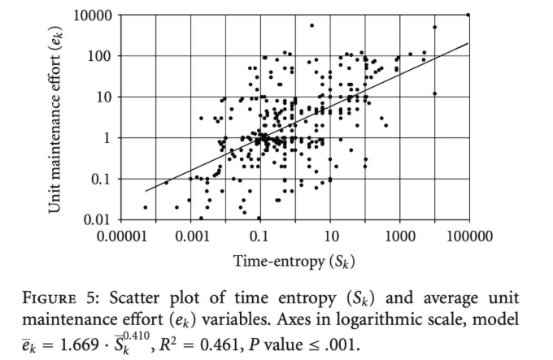

# TÓPICOS AVANÇADOS EM SI 3

---

- Introdução à Dinâmica da Evolução e Entropia
    - Software como organismo vivo
        - Nós nunca finalizamos um software; nós apenas entregamos uma versão dele
            - Um software que não sofre mudanças é, por definição, um software morto
        - Dinâmica da Evolução de Software
            - Um processo de adaptação contínua de um sistema após sua entrega inicial, motivado por mudanças de negócios, novos hardwares, bugs e expectativas dos usuários
    - Leis de Lehman
        - Lehman estudou sistemas na IBM e provou estatisticamente que o software não evolui de forma aleatória, mas comporta-se de acordo com certas "leis da natureza”
            - Ele dividiu os programas em sistemas Tipo-S (estáticos, com especificações fechadas, como uma calculadora simples) e Sistemas Tipo-E (Evolutivos), que estão embutidos no mundo real e afetam/são afetados pelo ambiente
        - 1ª Lei - Mudança Contínua
            - Um sistema Tipo-E deve ser continuamente adaptado ou se tornará progressivamente menos satisfatório
            - Exemplo
                - Um aplicativo de caronas na plataforma iOS
                - Se a Apple mudar suas regras de privacidade de localização em segundo plano, o aplicativo precisará ser atualizado obrigatoriamente para não parar de funcionar ou ser banido, mesmo que tenha zero bugs
        - 2ª Lei - Complexidade Crescente
            - À medida que um sistema evolui, sua complexidade aumenta, a menos que um trabalho seja feito para mantê-la ou reduzi-la
            - Esse "trabalho explícito" é o que chamamos de Refatoração
        - 7ª Lei - Qualidade em Declínio
            - A qualidade de um sistema parecerá declinar a menos que ele seja rigorosamente mantido e adaptado às mudanças do ambiente operacional
    - Entropia de Software
        - Na física (2ª Lei da Termodinâmica), a entropia é a tendência natural de sistemas isolados caminharem para a desordem
        - Trazendo para a computação, a Entropia de Software é a medida da desordem e do declínio do design do código ao longo do tempo (também conhecido como Software Rot ou podridão do software)
            - Quando ignoramos a 2ª Lei de Lehman, somos vítimas da Entropia
            - Prazos apertados (fazer funcionar primeiro, consertar depois), correções de bugs (criação de workarounds fáceis com “código desesperado”), rotatividade da equipe (perda do modelo original)
        - Sintomas de alta entropia
            - Código frágil (você conserta em um lugar e quebra em três)
            - Rigidez (uma mudança simples leva semanas para ser feita)
            - Medo de alterar o código ("Se funciona, não toque!")
        - O resultado da entropia é traduzido no gráfico de Esforço vs. Tempo
            - Sem manutenção preventiva, ocorre um acúmulo de dívida técnica, a complexidade sobe e o esforço para adicionar uma nova feature cresce exponencialmente até que o projeto paralisa (Project Stalls), impossibilitando a criação de valor
                
                
                
                - A Complexidade aumenta naturalmente com o tempo e com as demandas do mundo real
            - Com manutenção (redução da entropia), o esforço se mantém estável
                - A Desordem destruirá o projeto se não for limpa sistematicamente (Entropia de Software), exigindo práticas de refatoração, legibilidade e trabalho humano ativo e disciplinado para mitigar a sua degradação ao longo do tempo
        - Custo de Possuir uma Bagunça
            - O sintoma de paralisação do projeto devido à alta entropia reflete perfeitamente o conceito do "Custo Total de Possuir uma Bagunça" detalhado por Robert C. Martin no livro Clean Code
                - À medida que a bagunça se acumula (entropia), a produtividade da equipe diminui, aproximando-se assintoticamente de zero, forçando o gerenciamento a alocar mais pessoas que, não entendendo o design original, criam ainda mais bagunça
                - Lei de LeBlanc: "Mais tarde significa nunca"
        - Janelas Quebradas
            - Dave Thomas e Andy Hunt usam a metáfora das Janelas Quebradas
                - Um prédio com janelas quebradas passa a impressão de que ninguém se importa, o que estimula outras pessoas a também quebrarem janelas e a picharem o local
            - O código funciona da mesma maneira: um pequeno declínio no design (uma janela quebrada) inicia a entropia
        - Boy Scout Rule
            - Para combater a 2ª Lei de Lehman e a Entropia, o Clean Code prega a aplicação contínua de um trabalho preventivo através da Regra do Escoteiro: "Sempre deixe o acampamento (código) mais limpo do que o encontrou"
            - Se cada desenvolvedor reduzir um pouco da complexidade toda vez que tocar no código, a entropia nunca se acumulará a ponto de estagnar o projeto